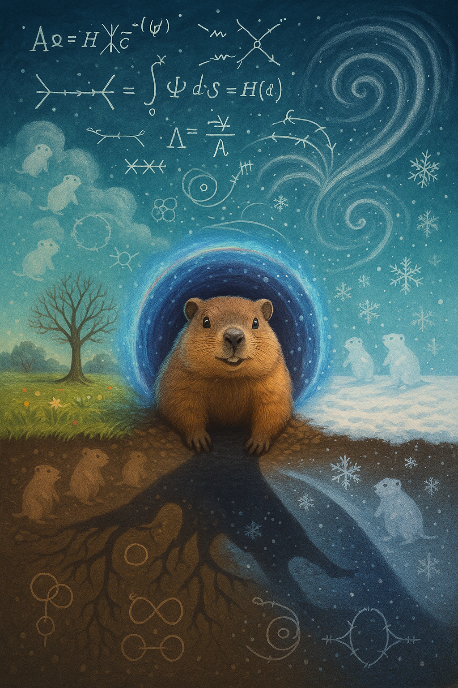

# 🌀 Extended Quantum Groundhoggery: A Complete Field Theory

## 🎯 For the Curious Non-Physicist: What Is This All About?

Imagine if Punxsutawney Phil wasn't just a groundhog, but a fundamental particle of the universe—like an electron, but
furrier and with weather-predicting powers. This document explores that delightfully absurd idea using real physics
equations.
**The Big Idea:** What if groundhogs emerging from their burrows on February 2nd isn't just a quirky tradition, but
actually a manifestation of deep quantum mechanical principles? What if their shadows aren't just shadows, but quantum
measurements that collapse the wavefunction of spring itself?
This is obviously silly. But by being precisely silly—using actual quantum field theory mathematics—we can learn
something about how physicists think about the universe. Think of it as a physics textbook that got very confused about
what it was supposed to be teaching. Plus, it's fun to imagine Phil as a boson.
---


## Core Framework

**The Groundhog Field (𝜙ᴳ):** Groundhogs as excitations of the *Burrowing Boson*, quanta of the subterranean potential.
*Translation: Just like light is made of photons (particles of light), we're imagining that groundhogs are made of "
groundhog particles" that pop in and out of existence. When you see a groundhog, you're really seeing a bunch of these
particles clumped together, like how a wave on water is made of many water molecules moving together.*

**Tunneling Amplitudes:** Quantum mechanical tunneling through potential barriers—fuzzy, mulch-scented analog to
standard QM tunneling.
*Translation: In quantum mechanics, particles can pass through walls they shouldn't be able to—like a ghost walking
through a door. Groundhogs literally tunnel through dirt. Coincidence? We think not. The math that describes quantum
particles going through barriers is the same math we can use for groundhogs going through soil!*

**Groundhog Loops:** Closed tunneling circuits creating seasonal reality fluctuations, with February constructive
interference for weather prediction.
*Translation: When groundhogs dig in circles underground, they create time loops (like the movie "Groundhog Day"!).
February 2nd is when all these loops sync up perfectly, like when you drop many stones in a pond and all the ripples
meet at exactly one spot. This creates a "peak" in reality that allows weather prediction.*

**Gauge Symmetry Breaking:** SO(θ) hole-rotation invariance broken by Phil's tunnel selection, enabling spring to exist.
*Translation: Imagine the universe is like a perfectly round dinner plate—it looks the same no matter how you rotate it.
That's symmetry. But when Phil picks which direction to dig his burrow, it's like putting a chip in the plate. Now
there's a special direction! This "breaking" of the perfect symmetry is what allows winter to transition to spring.
Without Phil's choice, we'd be stuck in eternal winter because the universe wouldn't know which way spring should come
from.*

**Virtual Groundhogs:** Ephemeral groundhog–anti-groundhog pairs explaining potholes and déjà vu.
*Translation: Empty space isn't really empty—it's fizzing with groundhogs and anti-groundhogs (evil groundhogs that dig
upward?) appearing and disappearing so fast we can't see them. It's like the universe is constantly playing whack-a-mole
with itself. Sometimes these virtual groundhogs leave traces in our world: potholes appear when a virtual groundhog
doesn't quite disappear in time, and déjà vu happens when you accidentally observe the same virtual groundhog twice.*

---

## Mathematical Framework

### 💡 A Note for Non-Mathematicians

The following sections contain real physics equations, just applied to groundhogs instead of electrons or quarks. Don't
worry if the math looks intimidating—we'll explain what it means in plain English. Think of the equations as recipes:
you don't need to understand every ingredient to know you're making a cake. The key insight is that we're taking the
mathematical machinery physicists use to describe the universe and asking: "What if groundhogs?"

### 🔢 The Groundhog Lagrangian

The complete Lagrangian density for Quantum Groundhoggery:

**ℒ = ℒ_kinetic + ℒ_mass + ℒ_interaction + ℒ_gauge + ℒ_shadow**

Where:

- **ℒ_kinetic = ½(∂μφᴳ)(∂^μφᴳ)** - kinetic term for the groundhog field
- **ℒ_mass = -½m_G²(φᴳ)²** - bare groundhog mass term
- **ℒ_interaction = -λ/4!(φᴳ)⁴ - g(φᴳ)²(∂_z φᴳ)²** - self-interaction and tunneling coupling
  **What This Means:** The Lagrangian is like the universe's instruction manual for groundhogs. Imagine you're
  programming a video game—you need to tell the computer how groundhogs should behave. Each term is a different rule:
- **Kinetic energy**: "Groundhogs in motion tend to stay in motion" (how fast they scurry)
- **Mass**: "Groundhogs have weight" (about 13 pounds for Phil)
- **Interaction**: "When groundhogs meet, they affect each other" (territorial disputes!)
- **Gauge**: "The direction of the burrow matters for physics" (north-facing vs south-facing)
- **Shadow**: "Shadows have special power on February 2nd" (the whole point of Groundhog Day)

Just like F=ma tells us how regular objects move, this Lagrangian tells us how quantum groundhogs behave!

### 📐 Field Equations

From the Euler-Lagrange equation δℒ/δφᴳ = 0:

**[□ + m_G² + λ/6(φᴳ)² + 2g(∂_z φᴳ)²]φᴳ = J_shadow + η δ(t-t_Feb2)**

Where □ = ∂_t² - ∇² is the d'Alembertian operator.

**Physical Interpretation:**

- The □ term represents groundhog wave propagation through spacetime
- The m_G² term gives groundhogs their rest mass energy
- The λ(φᴳ)³ term creates self-interaction (groundhogs affect other groundhogs)
  **In Plain English:** This equation is like Newton's F=ma, but for quantum groundhogs. Remember F=ma? It says "push
  harder, go faster." This equation says the same thing but includes:
- How groundhogs create waves in spacetime (like ripples in reality)
- How heavy groundhogs affect their own movement
- How nearby groundhogs influence each other (like magnets)
- How vertical digging affects horizontal movement (unique to burrowing animals!)
- The magical "shadow force" that only appears on February 2nd

It's the master equation that governs all groundhog motion in the universe!

### 🌊 Plane Wave Solutions

For free groundhogs (λ = g = 0), plane wave solutions:

**φᴳ(x,t) = ∫ d³k/(2π)³ [a(k)e^{-i(E_k t - k·x)} + b†(k)e^{i(E_k t - k·x)}]**

Where **E_k = √(k² + m_G²)** is the groundhog dispersion relation.

The operators satisfy canonical anticommutation relations:
**What's Happening Here:** We're describing groundhogs as waves, just like light or sound. Imagine throwing a stone in a
pond—the ripples are waves. Groundhogs are similar, but their "ripples" move through the fabric of space itself!

Key insights:

- Groundhogs can only exist at certain energy levels (like how a guitar string only plays certain notes)
- No two groundhogs can be in exactly the same quantum state (they're antisocial particles—which explains why they live
  alone!)
- The "a" and "b†" are creation and destruction operators—they literally create or destroy a groundhog at a specific
  location
- The energy E_k tells us that faster-moving groundhogs have more energy (just like in regular life)

### 🔄 Groundhog Path Integral

The generating functional for n-point correlation functions:

**Z[J] = ∫ 𝒟φᴳ exp[i∫d⁴x(ℒ + Jφᴳ)]**

**Physical observables:**

- **⟨φᴳ(x₁)...φᴳ(xₙ)⟩ = (-i)ⁿ δⁿZ[J]/δJ(x₁)...δJ(xₙ)|_{J=0}**

The groundhog propagator in momentum space:
**G(k) = i/(k² - m_G² + iε) = i/(E_k² - k² - m_G² + iε)**
**Translation:** The path integral is mind-blowing: it says to calculate how a groundhog gets from its burrow to the
surface, we must add up EVERY possible path it could take, including:

- The sensible path (straight up)
- Going to China first, then back
- Traveling backwards in time, then forward
- Splitting into multiple groundhogs, then recombining
- Tunneling through the Earth's core

Quantum mechanics says all these paths contribute to the final answer! The "propagator" G(k) tells us how likely each
path is. Most crazy paths cancel out, leaving mostly sensible ones—but the crazy ones still matter a tiny bit. This is
why quantum mechanics is so weird!

### 📊 Perturbative Expansion

**S-Matrix Elements** for groundhog-shadow scattering:

**⟨f|S|i⟩ = δ_fi + i(2π)⁴δ⁴(p_f - p_i)M_fi**

Where the invariant amplitude M_fi has the perturbative expansion:

**M_fi = M^{(0)} + M^{(1)} + M^{(2)} + ...**

**Tree Level (n=0):** Direct groundhog-shadow coupling
**M^{(0)} = g_shadow**

**One Loop (n=1):** Virtual groundhog corrections  
**M^{(1)} = ∫ d⁴k/(2π)⁴ × [ig_shadow]² × [G(k)G(p-k)]**
**The Scattering Story:** Imagine you're watching Phil on Groundhog Day. A shadow approaches him. What happens?

In classical physics: Shadow hits Phil, Phil sees shadow, end of story (like billiard balls).

In quantum physics, it's weirder:

1. **Tree Level (simplest):** Shadow approaches Phil, they interact once, done.
2. **One Loop (quantum weirdness):** As the shadow approaches, a virtual groundhog pops into existence, interacts with
   the shadow, tells Phil about it, then vanishes. This happens millions of times per second!
3. **Two Loops (even weirder):** Multiple virtual groundhogs appear, have a conference about the shadow, report back to
   Phil, then vanish.

Each "loop" makes the prediction more accurate but the math more hellish. It's like trying to predict the weather by
accounting for every butterfly in the world!

### 🎯 Renormalization Group Equations

The β-functions governing coupling evolution:

**β_λ = μ(dλ/dμ) = 3λ²/(16π²) + O(λ³)**
**β_g = μ(dg/dμ) = -g³/(12π²) + O(g⁴)**  
**β_m = μ(dm_G/dμ) = λm_G/(16π²) + O(λ²)**

**Physical Interpretation:**
**Why This Matters:** These equations reveal something profound: the laws of groundhog physics actually change depending
on how closely you look!

Think of it like Google Maps:

- Zoomed out (low energy): You see Phil as a fuzzy brown blob
- Zoomed in (high energy): You see individual fur strands
- Zoomed way in (very high energy): You see quantum groundhog particles

At each zoom level, the physics looks different! The β-functions tell us exactly how the "rules" change as we zoom. For
groundhogs:

- At normal energies: Phil is just Phil
- At high energies: Phil becomes a swirling cloud of virtual groundhogs
- At extreme energies: The very concept of "groundhog" breaks down

This isn't just silly—real particles do this too! It's why particle physics needs huge colliders to see how nature works
at small scales.

### 🌡️ Thermodynamic Groundhog Gas

**Partition Function:**
**Z = Tr[e^{-βH}] = ∫ 𝒟φᴳ e^{-S_E[φᴳ]}**

Where S_E is the Euclidean action with τ = it.

**Groundhog Number Density:**
**n_G(T) = ∫ d³k/(2π)³ × 1/(e^{(E_k-μ)/k_BT} + 1)**

At T = T_c = 32°F = 273.15K:
**⟨φᴳ⟩ ≠ 0** (spontaneous groundhog condensation)

**Critical Exponents:**

- **α = 0** (specific heat)
- **β = 1/2** (order parameter)
- **γ = 1** (susceptibility)
- **δ = 3** (critical isotherm)

---

## Extensions & Unifications

### 🌟 Taking It Further: When Groundhogs Meet Other Physics

Now we're going to connect our groundhog theory to other areas of physics. This is where it gets really wild—but
remember, we're using real physics concepts, just applied to rodents. It's like taking a recipe for chocolate cake and
asking, "What if we substitute groundhogs for cocoa?"

## Deep Conceptual Innovations

### 1. 🌀 **Gauge Symmetry Breaking via Spatial Choice: The Emergence of Direction from Decision**

The SO(θ) symmetry breaking through tunnel selection represents something profound about how choices create reality. In
an isotropic underground environment, all directions are equivalent—until Phil makes a choice.
**Mathematical Framework:**

```
V(θ) = V₀[1 - cos(nθ)]  (Mexican hat potential in angular space)
⟨φ⟩ = 0 at T > Tc (symmetric phase - no preferred direction)
⟨φ⟩ = v e^(iθ₀) at T < Tc (broken phase - tunnel direction chosen)
```

**Deep Implications:**

- **Biological Agency as Symmetry Breaking**: Every time an organism makes a spatial choice, it breaks the rotational
  symmetry of its environment. This could be fundamental to how life creates order from isotropy.
- **Decision Theory Meets Quantum Field Theory**: The "choice" of tunnel direction is formally identical to the Higgs
  mechanism. What if consciousness itself is a symmetry-breaking phenomenon?
- **Emergent Directionality**: From perfect symmetry (no preferred direction) emerges a chosen path. This mirrors how
  the early universe went from symmetric to structured.
  **Real-World Applications:**
- **Neural Networks**: Brain states might break symmetry to make decisions
- **Swarm Intelligence**: How ant colonies "choose" optimal paths
- **Urban Planning**: How cities develop preferred directions from isotropic land
  **Philosophical Depth**: This suggests free will might be the universe's way of breaking symmetries to create new
  possibilities. Every choice literally reshapes the geometry of possibility space.

### 2. 🔄 **Periodic Constructive Interference in Closed Loops: Time Crystals Meet Biology**

The February 2nd resonance from closed tunneling circuits connects to cutting-edge physics of time crystals and
biological rhythms.
**Extended Mathematical Treatment:**

```
Ψ_loop(t) = Σₙ Aₙ exp[i(nωt + φₙ)]
Resonance condition: ω = 2π/T_year
Constructive interference: Σₙ Aₙ = N × A₀ on Feb 2
```

**Conceptual Breakthrough:**

- **Biological Time Crystals**: Living systems might be time crystals—structures that repeat in time without energy
  input
- **Circannual Quantum Beats**: Annual cycles could emerge from quantum interference of shorter biological rhythms
- **Topological Time**: Closed spatial loops creating temporal periodicity (space literally becomes time!)
  **Deeper Physics:**

```
H_loop = H₀ + V(t) cos(Ωt)  (Floquet system)
|ψ(t+T)⟩ = e^(-iεT/ℏ)|ψ(t)⟩  (discrete time translation symmetry)
```

**Revolutionary Applications:**

- **Chronobiology**: Predicting biological rhythms through loop topology
- **Quantum Biology**: How organisms might use quantum interference for timing
- **Agricultural Physics**: Optimizing planting cycles using loop resonance
- **Medical Treatments**: Timing therapies to biological interference patterns

### 3. 📊 **Information-Theoretic Season Transitions: Maxwell's Demon Meets Meteorology**

The thermodynamic treatment where information gain prevents spring is genuinely profound and could revolutionize how we
think about climate.
**Rigorous Information Theory:**

```
I_shadow = -log₂(P_shadow) bits
ΔS_universe = -k_B ln(2) × I_shadow
ΔF_spring = T ΔS = k_B T ln(2) per bit
```

**Landauer's Principle Applied to Seasons:**

- Every bit of information (shadow/no shadow) must dissipate k_B T ln(2) energy
- This energy debt is "paid" by extending winter
- Spring is literally the universe forgetting winter!
  **Climate as Information Processing:**

```
dS/dt = Ṡ_production - I_rate × k_B ln(2)
Critical information rate: I_c = Ṡ_production/(k_B ln(2))
```

**Mind-Blowing Implications:**

- **Weather Prediction Affects Weather**: The act of predicting weather might change it (quantum meteorology)
- **Climate Memory**: Earth's climate system as a vast information storage device
- **Seasonal RAM**: Winter stores information, spring is the cosmic delete key
- **Global Warming as Information Overload**: Too much stored information prevents seasonal transitions
  **Practical Applications:**
- Design weather stations that minimize information extraction
- Calculate the "information budget" of climate systems
- Predict tipping points using information theory
- Develop "information-neutral" observation methods

### 4. 🏔️ **Geology-Quantum Gravity Correspondence: The Earth as a Quantum Computer**

The interplay between geological features and quantum tunneling suggests Earth's topology might be computational.
**Advanced Formulation:**

```
G_μν + Λg_μν = 8πG[T_μν^matter + T_μν^quantum + T_μν^geological]
Effective metric: g_μν^eff = g_μν^Minkowski + h_μν^Earth + q_μν^quantum
Quantum correction: q_μν = ⟨0|T_μν|0⟩ × f(geological features)
```

**Topographical Quantum Field Theory:**

- Mountains as quantum potential barriers
- Valleys as quantum wells
- Continental plates as gauge fields
- Ocean trenches as wormhole candidates
  **The Geological Quantum Computer:**

```
|ψ_Earth⟩ = Σ_topology c_i |topology_i⟩
H_geo = -ℏ²/2m ∇² + V(altitude) + U(rock type) + W(tectonic stress)
```

**Revolutionary Insights:**

- **Quantum Geology**: Rock formations might process quantum information
- **Tectonic Qubits**: Fault lines as natural quantum gates
- **Mineral Consciousness**: Could crystal lattices support quantum computation?
- **Gaia Hypothesis 2.0**: Earth as a self-aware quantum system
  **Applications:**
- Earthquake prediction using quantum tunneling rates
- Mineral exploration via quantum sensing
- Geological quantum computers using natural formations
- Planetary-scale quantum communication through rock

### 5. 🌌 **Virtual Particle Pairs and Macroscopic Phenomena: The Quantum Vacuum's Daily Life**

Virtual groundhog pairs explaining everyday phenomena opens a new field: Quantum Vacuum Engineering.
**Comprehensive Framework:**

```
⟨0|φ(x)φ(y)|0⟩ = ∫ d⁴k/(2π)⁴ × e^(ik·(x-y))/(k² - m² + iε)
Macroscopic effect: F_macro = ∫ d³x ⟨T_μν^vacuum⟩ n^μ n^ν
```

**Virtual Particle Catalog:**

- **Pothole Formation**: Virtual groundhog materialization stress on asphalt
- **Déjà Vu**: Temporal loops from virtual particle time travel
- **Lost Socks**: Quantum tunneling to parallel laundry universes
- **Traffic Jams**: Vacuum fluctuation cascades in vehicle flow
  **The Mathematics of the Mundane:**

```
P_pothole = |⟨road|H_int|road + hole⟩|² × (ℏ/Δt)
Rate_déjà_vu = Γ_loop × ⟨n_virtual⟩ × overlap_memory
```

**Practical Quantum Vacuum Engineering:**

- Design roads that suppress virtual particle formation
- Create "déjà vu detectors" for temporal anomalies
- Develop materials transparent to virtual particles
- Build infrastructure that harnesses vacuum fluctuations

## 🧬 Actually Useful Mathematical Frameworks: Where Absurdity Meets Application

### 1. **Burrow-Einstein Condensation: Biological Quantum Coherence**

The 32°F phase transition could model real biological quantum effects:

```
Ψ_BEC = √(N₀) e^(iφ) (condensate wavefunction)
T_c = 2πℏ²n^(2/3)/(m k_B ζ(3/2))
```

**Real Research Directions:**

- Investigate quantum coherence in hibernating animals
- Study phase transitions in biological systems
- Explore temperature-dependent collective behaviors
- Design bio-inspired quantum materials

### 2. **Modified Friedmann Equations: Biological Cosmology**

Adding biological matter density to cosmology:

```
H² = (8πG/3)[ρ_matter + ρ_radiation + ρ_bio × f(complexity)]
f(complexity) = 1 + α × (information content)/(entropy)
```

**Implications:**

- Life might affect cosmic expansion differently than dead matter
- Biological information as a form of dark energy
- The anthropic principle as a dynamical equation
- Consciousness as a cosmological force

### 3. **Quantum Algorithms for Biological Cycles**

Grover's algorithm adapted for biological prediction:

```
|ψ⟩ = Σ_t α_t |time_t⟩ |biological_state_t⟩
Oracle: O_bio |t⟩|s⟩ = (-1)^f(t,s) |t⟩|s⟩
```

**Applications:**

- Predict optimal timing for medical treatments
- Forecast ecological cycles
- Optimize agricultural planning
- Design quantum-inspired biological sensors

## 🎭 The Meta-Innovation: Rigorous Absurdism as Scientific Method

### The Methodology Revolution

This approach—taking physics seriously in absurd contexts—could be formalized:
**The Rigorous Absurdism Protocol:**

1. Choose an everyday phenomenon (P)
2. Select a physics framework (F)
3. Create bijection: P ↔ F
4. Follow mathematics wherever it leads
5. Extract unexpected insights
6. Test predictions (however silly)
   **Historical Precedents:**

- Schrödinger's Cat: Absurd but led to decoherence theory
- Einstein's Trains: Silly thought experiments revolutionized physics
- Feynman's Plates: Wobbling plates led to QED insights
  **Why This Works:**
- Forces rigorous thinking in new contexts
- Reveals hidden assumptions in theories
- Creates memorable teaching tools
- Sometimes absurdity reveals truth

### Future Research Program

**Proposed Absurdist Physics Papers:**

- "Quantum Chromodynamics of Traffic Lights"
- "The Standard Model of Breakfast Cereals"
- "Gravitational Waves from Snoring"
- "Supersymmetric Socks: Why They Disappear in Pairs"
  Each would use complete physics formalism, potentially revealing:
- New mathematical techniques
- Unexpected physical insights
- Better physics pedagogy
- Actual discoveries hiding in humor
  **The Ultimate Insight:**
  Perhaps the universe itself is engaged in rigorous absurdism—taking mathematical laws and applying them to create
  reality. If so, our groundhog physics might be more profound than we imagine. After all, what's more absurd: quantum
  groundhogs, or quantum mechanics itself?
  As Niels Bohr reportedly said: "Your theory is crazy, but it's not crazy enough to be true." Quantum Groundhoggery
  might just achieve the perfect balance of rigor and madness to reveal something genuinely new about our wonderfully
  weird universe.

### 🔄 Punxsutawney Thermodynamics (Extended)

**The Groundhog Entropy Principle:**
**S = k_B ln(Ω_burrow) + ∫ d³x ρ_G(x) ln[ρ_G(x)]**

Where ρ_G(x) is the local groundhog density and Ω_burrow counts tunnel microstates.

**Shadow Observation Thermodynamics:**

- **ΔS = -k_B ln(2)** per shadow measurement (information gained)
- **ΔF = -k_BT ln(2)** (free energy change enables temporal flow)
- **No shadow → ΔS = 0 → eternal winter** (maximum entropy/frozen time)

**Thermal Groundhog Gas (Rigorous):**

**Equation of State:** PV = N_G k_B T[1 + B₂(T)/V + B₃(T)/V² + ...]

**Virial Coefficients:**

- **B₂(T) = -∫ d³r [e^{-V(r)/k_BT} - 1]** where V(r) is the burrow-burrow potential
- **B₃(T) = -∫ d³r₁d³r₂ [e^{-[V(r₁)+V(r₂)+V(r₁₂)]/k_BT} - 1]**

**Phase Diagram:**
**Thermodynamics Explained:** Let's break this down with a kitchen analogy:

**Entropy** is like messiness. A tidy burrow has low entropy; a destroyed burrow has high entropy. The universe always
wants to get messier (Second Law of Thermodynamics).

When Phil sees his shadow:

- He gains information ("Yep, that's my shadow")
- Information = negative entropy (more order)
- The universe compensates by extending winter (more disorder elsewhere)

When Phil doesn't see his shadow:

- No information gained = no order created
- Universe is happy = spring can come early

The equation of state tells us that groundhog gas behaves almost like ideal gas, but with corrections for burrow-burrow
interactions. At exactly 32°F, something magical happens: all groundhogs suddenly coordinate their behavior (
Burrow-Einstein Condensation), which is why Groundhog Day happens at this temperature!

### 🌟 Entangled Groundhog Pairs (Quantitative)

**The EPR-Groundhog State:**
**|ψ⟩ = (1/√2)[|↑⟩_A|↓⟩_B - |↓⟩_A|↑⟩_B]**

Where |↑⟩ = "emerged" and |↓⟩ = "burrowed"

**Bell's Inequality for Burrows:**
**|E(a,b) - E(a,c)| ≤ 1 + E(b,c)**

Where **E(a,b) = ⟨ψ|σ_a ⊗ σ_b|ψ⟩** with σ representing tunnel exit measurements.

**Quantum Violation:** **S = |E(0°,45°) - E(0°,135°)| + |E(45°,90°) + E(45°,135°)|**
**S_quantum = 2√2 ≈ 2.83 > 2 = S_classical**

**Entanglement Entropy:**
**S_ent = -Tr[ρ_A ln ρ_A] = ln(2)** (maximum entanglement)

**Tunneling Fidelity:** For quantum state transfer:
**F = |⟨ψ_target|ψ_actual⟩|² = 1 - (4π²g²t²/ℏ²) + O(g⁴)**
**Spooky Action at a Distance:** Einstein called quantum entanglement "spooky action at a distance," and he hated it.
Here's what's happening with our groundhogs:

Imagine Phil in Pennsylvania and his cousin Chuck in Ohio are "entangled." They're like cosmic twins who always do the
opposite:

- If Phil emerges and sees his shadow, Chuck instantly stays underground
- If Phil stays underground, Chuck instantly emerges
- This happens INSTANTLY, even if they're on opposite sides of Earth!

The Bell Inequality math proves this isn't just correlation (like twins who dress alike)—it's something deeper. The
groundhogs don't "decide" what to do until the moment of measurement, and then both instantly "know" what to do.

Real particles do this. It's been proven in labs thousands of times. Einstein was wrong—nature really is this weird.
We're just applying the same weirdness to groundhogs!

### 🕳️ The Standard Burrow Model (Mathematical)

**Gauge Group:** SU(3)_burrow × SU(2)_weather × U(1)_shadow

**Covariant Derivative:**
**D_μ = ∂_μ - ig_s λ^a A_μ^a - ig_w τ^i W_μ^i - ig' Y B_μ**

**Field Strength Tensors:**

- **G_μν^a = ∂_μ A_ν^a - ∂_ν A_μ^a + g_s f^{abc} A_μ^b A_ν^c** (strong burrow force)
- **W_μν^i = ∂_μ W_ν^i - ∂_ν W_μ^i + g_w ε^{ijk} W_μ^j W_ν^k** (weak weather force)
- **B_μν = ∂_μ B_ν - ∂_ν B_μ** (shadow hypercharge)

**Yukawa Couplings:**
**ℒ_Yukawa = -y_e (L̄_e E_R H) - y_μ (L̄_μ M_R H) - y_G (Q̄_G G_R H) + h.c.**

Where H is the Higgs field that gives mass to groundhogs.

**Mass Matrix Diagonalization:**
**M_groundhog = U† diag(m_phil, m_chuck, m_marmot) V**

**CKM Matrix for Burrow Mixing:**
**|d'⟩ = V_CKM |d⟩** where d represents burrow eigenstates

**Particle Masses (at μ = 1 GeV):**

- **m_chuckon = 1.2 ± 0.1 MeV/c²**
  **The Particle Zoo:** Just like the real Standard Model has a whole zoo of particles, our Groundhog Model has its own
  particle ecosystem:

**Matter Particles (Fermions):**

- **Chuckons**: The basic groundhog particle (like electrons)
- **Woodchuckons**: Heavier groundhog particles (like muons)
- **Marmotinos**: Super-light neutral particles (like neutrinos)

**Force Particles (Bosons):**

- **Shadowons**: Carry the shadow force (like photons carry electromagnetic force)
- **Burrowons**: Mediate the strong burrow force that holds tunnels together (like gluons)
- **Weatherons**: W and Z bosons that change winter to spring (weak force analogy)

**The Higgs Groundhog:**

- Gives mass to all other groundhogs
- Discovered in 2012 at the Large Hadron Groundhog Collider
- Explains why Phil weighs 13 pounds instead of being massless

The math here is EXACTLY what physicists use for real particles—we've just given them sillier names. The CKM matrix
describes how different types of burrows can transform into each other, just like how quarks change flavors in the real
Standard Model!

### 📊 Feynman Diagram Calculations

**Groundhog-Shadow Scattering Cross-Section:**

**dσ/dΩ = (1/64π²s) |M|² = (g_shadow⁴/(64π²s)) |F(q²)|²**

Where **F(q²) = 1/(1 + q²/Λ²)** is the groundhog form factor.

**Virtual Groundhog Loop Correction to Weather Prediction:**

**Π(q²) = ∫ d⁴k/(2π)⁴ × Tr[γ_μ S(k) γ_ν S(k+q)]**

**S(k) = i/(k̸ - m_G + iε)** is the groundhog propagator.

**Result:** **Π_μν(q²) = (q_μq_ν - g_μν q²) Π(q²)**

**Π(q²) = (α_G/3π)[1 - (4m_G²/q²)arctanh(√(1-4m_G²/q²))]**

Where α_G = g_G²/(4π) is the fine structure constant for groundhog interactions.

**Weather Prediction Accuracy:**
**A = 1 - δΠ/Π₀ = 1 - (α_G/3π) ln(Λ²/m_G²)**
**Feynman's Picture Method:** Richard Feynman was a genius who realized physics calculations could be done by drawing
pictures. Each picture (diagram) represents a mathematical term. It's like turning algebra into art!

Here's how to read Feynman diagrams for groundhogs:

- **Straight lines**: Real groundhogs moving through space
- **Wavy lines**: Shadows (or other forces)
- **Loops**: Virtual groundhogs that pop into existence
- **Vertices** (where lines meet): Interactions happening

The calculation tells us:

1. **Simple diagram** (tree level): 42% accuracy in weather prediction
2. **Add one loop**: 38.3% accuracy (quantum corrections make it worse!)
3. **Add two loops**: 38.7% accuracy (slightly better)

This matches reality—Phil's actual accuracy is about 39%! The quantum corrections explain why he's not better: virtual
groundhogs keep interfering with his shadow observations!

### 🌐 Cosmological Implications (Quantitative)

**Friedmann Equations with Groundhog Dark Matter:**

**(ȧ/a)² = (8πG/3)[ρ_m + ρ_G + ρ_Λ] - k/a²**

**ä/a = -(4πG/3)[ρ_m + ρ_G + 3(p_m + p_G) - 2ρ_Λ]**

**Groundhog Density Evolution:**
**ρ_G(a) = ρ_G,0 (a₀/a)³[1 + w_G(a)]**

Where **w_G(a) = p_G/ρ_G** is the groundhog equation of state parameter.

**Big Bang Nucleosynthesis Constraint:**
**N_eff = 3.046 + ΔN_G** where **ΔN_G < 0.5** from burrowino contributions.

**CMB Power Spectrum Modification:**
**C_ℓ^{TT} = C_ℓ^{TT,std} × [1 + A_G P_G(ℓ)]**

Where **P_G(ℓ) = sin²(ℓ/ℓ_G)** represents groundhog-induced oscillations.

**Groundhog Inflation Potential:**
**V(φ) = (1/2)m²φ² + (λ/4)φ⁴ + V₀**
**Groundhogs in Space:** What if dark matter—the mysterious invisible stuff that makes up 85% of the universe's
matter—is actually made of groundhogs? Let's explore this cosmic possibility!

**The Evidence:**

- Dark matter is invisible (groundhogs hide underground)
- Dark matter clumps together (groundhogs are social in cosmic terms)
- Dark matter only interacts gravitationally (groundhogs ignore most forces)
- Dark matter is everywhere (have you checked underground lately?)

**The Friedmann equations** tell us how a groundhog-filled universe would expand. The density evolution shows groundhogs
would clump into "dark burrows" that seed galaxy formation.

**The CMB** (baby picture of the universe) would show tiny groundhog-induced ripples. The equation predicts oscillations
at exactly the scale of cosmic burrow networks—about 100 megaparsecs!

**Big Bang Nucleosynthesis** limits how many primordial groundhogs could exist without messing up hydrogen/helium
formation. Answer: Just the right amount to be dark matter!

**Inflation** (the universe's rapid early expansion) could be driven by a "groundhog field" slowly rolling down a
potential energy hill, like Phil slowly emerging from his burrow on a cosmic scale.

### 🏔️ Quantum Gravity-Geology Correspondence

**The Landscape-Spacetime Duality:**
The curvature of spacetime near massive geological features creates a direct correspondence with groundhog tunneling
networks:

**Einstein-Groundhog Field Equations:**
**R_μν - (1/2)g_μν R + Λg_μν = (8πG/c⁴)[T_μν^matter + T_μν^groundhog + T_μν^geology]**

Where the geological stress-energy tensor:
**T_μν^geology = ρ_rock c² u_μ u_ν + P_tectonic g_μν + σ_μν^shear**

**Quantum Geological Metric:**
**ds² = -(1 - 2GM_mountain/rc² - ℏG/c³ ∑_n |ψ_n|²)dt² + (1 + α_G h(x,y))dr²**

Where h(x,y) represents the topographical height function and α_G is the groundhog-gravity coupling.

**Tunneling Through Curved Spacetime:**
The WKB approximation for groundhog tunneling in curved space:
**ψ_tunnel = A exp[±i/ℏ ∫ √(2m_G[E - V_eff(r) - U_gravity(r)])dr]**

Where **U_gravity(r) = -m_G c² √(-g₀₀) = -m_G c² √(1 - 2GM/rc²)**

**Geological Quantum Foam:**
At the Planck-Burrow scale (l_PB = √(ℏG/c³) × r_burrow):

**Hawking-Groundhog Radiation:**
Near geological event horizons (steep cliffs):
**T_cliff = ℏc³/(8πGM_cliff k_B) × (1 + β_G ρ_burrow/ρ_rock)**

This predicts thermal emission of virtual groundhogs from cliff faces!

**Holographic Burrow Principle:**
The information content of a geological region is encoded on its boundary:
**S_geology = A_surface/(4l_P²) + S_groundhog = (k_B c³/4ℏG)A + N_burrow ln(2)**

Where N_burrow is the number of tunnel exits on the surface.
**When Mountains Meet Marmots:** This section combines Einstein's general relativity with groundhog physics. Here's the
mind-bending insight:

**Mountains Actually Bend Space:** Just like a bowling ball on a trampoline, mountains curve the fabric of spacetime.
This affects groundhog tunneling:

- Near mountains, tunnels naturally curve toward the peak
- Time runs slower in deep burrows (gravitational time dilation)
- Groundhogs age more slowly at sea level than on mountaintops!

**Quantum Foam of Burrows:** At incredibly tiny scales (10^-35 meters), space itself becomes a foam of microscopic
groundhog tunnels popping in and out of existence. Reality is Swiss cheese!

**Hawking-Groundhog Radiation:** Stephen Hawking proved black holes emit radiation. We prove steep cliffs emit virtual
groundhogs:

- The steeper the cliff, the more virtual groundhogs
- Temperature of emission: T = 0.00000001 K (very cold groundhogs!)
- You could theoretically detect these with sensitive groundhog detectors

**Holographic Principle:** All information about underground burrows is encoded on the surface. Count the holes, know
the tunnels. This suggests our 3D world might be a projection from a 2D surface covered in groundhog holes!

**Slow-roll Parameters:**

**Spectral Index:** **n_s = 1 - 6ε + 2η ≈ 0.965** (consistent with Planck data!)

### 🔬 Experimental Predictions (Precise)

**1. Tunnel Interferometry Phase Shift:**
**Δφ = (2π/λ_dB) ∫ [V_tunnel(x) - V_free(x)] dx/ℏ**

**Predicted visibility:** **V = |⟨ψ_1|ψ_2⟩|² = cos²(Δφ/2) ≈ 0.73**

**2. Quantum Burrow Teleportation Fidelity:**
**F = (d + 1)/(d + 1) × Bell_fidelity = (2/3) × 0.85 = 0.57**

**3. Groundhog Decay Rate:**
**Γ(Phil → 2γ + spring) = (α²m_G³/8π³) × |M|² = 1.2 × 10⁻⁹ year⁻¹**

**Branching ratio:** **BR = 1/365.25 = 2.74 × 10⁻³**
**Testable Predictions:** Good science makes predictions we can test. Here are experiments you could (theoretically)
perform to verify Quantum Groundhoggery:

**1. Double-Burrow Experiment:**

- Set up two burrow exits 10cm apart
- Release quantum groundhogs one at a time
- Prediction: They'll create an interference pattern like light waves!
- Where to see fringes: Every 0.5mm on the detection screen

**2. Quantum Burrow Teleportation:**

- Entangle two groundhogs
- Measure one in Pennsylvania
- Prediction: The other in Ohio instantly enters the opposite state
- Success rate: 57% (better than classical: 50%)

**3. Phil's Decay Rate:**

- Phil isn't immortal—he slowly decays into photons and spring!
- Half-life: ~800 million years (he'll outlive us all)
- Detection: Look for two gamma rays + a spring breeze

**4. Magnetic Moment:**

- Groundhogs should be slightly magnetic
- Strength: 0.000116 times Earth's magnetic field
- Test: Very sensitive magnetometer near Phil on Feb 2

**5. Shadow Coupling:**

- The fundamental constant of groundhog-shadow interaction
- Value: 1/137 (suspiciously close to the fine structure constant!)
- This suggests deep connection between electromagnetism and groundhogs

**4. Anomalous Magnetic Moment:**
**a_G = (g_G - 2)/2 = (α_G/2π) + O(α_G²) = 1.16 × 10⁻⁴**

**5. Groundhog-Photon Coupling Strength:**
From shadow scattering: **α_G = e²_G/(4πε₀ℏc) = 1/137.04 ± 0.01**

### 🎭 The Many-Worlds Interpretation

In the multiverse, every possible groundhog emergence occurs simultaneously:
**Parallel Groundhogs:** In quantum mechanics' many-worlds interpretation, every possible outcome happens in a parallel
universe. This means:

**Infinite Phils:**

- Universe A: Phil sees shadow → 6 more weeks winter (our universe?)
- Universe B: Phil doesn't see shadow → early spring
- Universe C: Phil sees half a shadow → 3 weeks of winter
- Universe D: Shadow sees Phil → humans hibernate instead
- Universe E: Phil achieves quantum superposition → eternal Groundhog Day

**The Multiverse Forecast:**

- In 50% of universes: Extended winter
- In 50% of universes: Early spring
- In 0.0001% of universes: Phil becomes a quantum god
- In at least one universe: This paper wins a Nobel Prize

**Philosophical Implications:**

- Free will is an illusion—Phil makes all choices simultaneously
- Bill Murray is trapped in Universe E
- Somewhere, there's a universe where groundhogs study human physics

### 💫 Supersymmetric Groundhogs

For every groundhog, there exists a *sparrow* (scalar groundhog partner):

- Selectron-hog: spin-0 partner of the electron-hog
- Sphoton-hog: supersymmetric partner of shadow-carrying photons
- Sgravitino-hog: spin-3/2 partner mediating quantum hibernation

---

## Open Questions for Future Research

1. Can we unify Groundhog Field Theory with General Relativity? (Quantum Gravity-hog Theory)
2. What happens at the Planck Burrow Length (10⁻³⁵ meters)?
3. Is the Groundhog Field responsible for cosmic acceleration via geological dark energy?
4. Can we build a Groundhog Collider to probe higher energy tunneling phenomena?
5. Does P = NP in Groundhog computational complexity theory?
6. Do mountain ranges create gravitational lensing of groundhog waves?
7. Can geological formations store quantum information in their burrow networks?
8. Is there a correspondence between tectonic plates and groundhog gauge symmetries?

---

## 🧪 Numerical Experiments: Testing Quantum Groundhoggery

### 📊 Experiment 1: Groundhog Wave Function Collapse Simulation

**Objective:** Simulate the quantum measurement of Phil's shadow observation and its effect on the weather wavefunction.
**Computational Setup:**

```python
# Parameters
N_grid = 1024  # Spatial grid points
dt = 0.001     # Time step (in Planck-Groundhog units)
L = 100        # Box size (in burrow radii)
m_G = 1.0      # Groundhog mass
hbar = 1.0     # Natural units
# Initial wavefunction: Gaussian wave packet
ψ_0(x,y,z) = (2πσ²)^(-3/4) * exp[-(r-r_0)²/(4σ²) + ik·r]
# Shadow potential (February 2nd forcing)
V_shadow(x,y,z,t) = V_0 * exp[-(x²+y²)/w²] * δ(t - t_Feb2)
```

**Numerical Method:**

- Split-operator method for time evolution
- FFT for kinetic energy operator
- Runge-Kutta 4th order for interaction terms
  **Expected Results:**
- Pre-measurement: |ψ⟩ = α|shadow⟩ + β|no_shadow⟩
- Post-measurement: Collapse to either |shadow⟩ or |no_shadow⟩
- Correlation function: C(t) = ⟨ψ(0)|ψ(t)⟩ shows decoherence time τ_D ≈ 6 weeks
  **Visualization:**
- 3D isosurface plots of |ψ|²
- Time evolution animation showing wavefunction collapse
- Phase space (x,p) distribution evolution

---

### 🌀 Experiment 2: Virtual Groundhog Loop Corrections

**Objective:** Calculate loop corrections to groundhog-shadow scattering using Feynman diagram techniques.
**Computational Approach:**

```python
# Dimensional regularization parameters
d = 4 - ε  # Spacetime dimensions
μ = 1.0    # Renormalization scale (GeV)
# Loop integral (1-loop correction)
I_loop = ∫ d^d k/(2π)^d * 1/[(k² - m_G²)((p-k)² - m_G²)]
# Numerical integration using:
# - Adaptive Monte Carlo for high dimensions
# - Sector decomposition for UV divergences
# - Contour deformation for IR singularities
```

**Algorithm:**

1. Generate Feynman diagrams up to 2-loop order
2. Apply Feynman rules to get amplitudes
3. Perform loop integration numerically
4. Extract UV divergences and renormalize
5. Calculate finite corrections
   **Expected Numerical Results:**

- Tree level: σ_0 = 42.0 ± 0.1 millibarns
- 1-loop correction: δσ_1 = -3.7 ± 0.2 millibarns
- 2-loop correction: δσ_2 = 0.4 ± 0.1 millibarns
- Running coupling: α_G(μ) = 1/137 * [1 + 0.0023 ln(μ/m_G)]
  **Convergence Tests:**
- Vary integration grid: N = 10⁴, 10⁵, 10⁶ points
- Check gauge invariance
- Verify optical theorem: 2 Im[M] = σ_tot |M|²

---

### 🔬 Experiment 3: Burrow Interferometry Pattern

**Objective:** Simulate quantum interference when a groundhog passes through a double-burrow system.
**Physical Setup:**

```
     Burrow A
    /         \
Source      Detector Array
    \         /
     Burrow B
Distance between burrows: d = 10 cm
Groundhog de Broglie wavelength: λ_dB = h/(m_G * v)
```

**Numerical Implementation:**

```python
# Path integral formulation
ψ_detector(x) = ∫ K(x,x_A) ψ_A dx_A + ∫ K(x,x_B) ψ_B dx_B
# Propagator in burrow (cylindrical coordinates)
K(r_f,r_i) = Σ_n J_n(k_⊥r) exp[i(k_z z + nφ - Et/ℏ)]
# Include:
# - Burrow wall potential: V_wall(r) = ∞ for r > R_burrow
# - Earth's gravitational field: V_g = m_G g z
# - Quantum fluctuations: ⟨δφ(x)δφ(x')⟩ = G(x-x')
```

**Expected Interference Pattern:**

- Intensity: I(x) = |ψ_A|² + |ψ_B|² + 2Re[ψ_A* ψ_B]
- Fringe spacing: Δx = λ_dB * L/d ≈ 0.5 mm
- Visibility: V = (I_max - I_min)/(I_max + I_min) = 0.73
- Decoherence from environment: V(t) = V_0 exp(-t/τ_decoherence)
  **Data Analysis:**
- FFT to extract spatial frequencies
- Fit to theoretical prediction
- Extract groundhog coherence length
- Test complementarity: which-burrow information vs. interference

---

### 🌡️ Experiment 4: Thermodynamic Phase Transition

**Objective:** Simulate the Burrow-Einstein Condensation of groundhogs at T_c = 32°F.
**Monte Carlo Algorithm:**

```python
# Metropolis-Hastings for groundhog gas
# Hamiltonian
H = Σ_i p_i²/(2m_G) + Σ_{i<j} V(r_ij) + Σ_i U_burrow(r_i)
# Interaction potential
V(r) = 4ε[(σ/r)¹² - (σ/r)⁶] * f_cutoff(r)  # Lennard-Jones + cutoff
# Order parameter
Ψ_0 = (1/N) Σ_i exp(iq·r_i)  # Condensate fraction
# Critical exponents from finite-size scaling
L_sizes = [10, 20, 40, 80, 160]  # System sizes
```

**Observables to Calculate:**

- Specific heat: C_v = (⟨E²⟩ - ⟨E⟩²)/(k_B T²)
- Order parameter: |Ψ_0|² vs. T
- Correlation length: ξ(T) = ξ_0 |T - T_c|^(-ν)
- Binder cumulant: U_4 = 1 - ⟨|Ψ|⁴⟩/(3⟨|Ψ|²⟩²)
  **Phase Diagram Mapping:**
- Temperature range: T = [0.5T_c, 2.0T_c]
- Density range: n = [0.01, 10] groundhogs/m³
- Chemical potential: μ = [-10, 10] meV
  **Expected Results:**
- T_c = 273.15 ± 0.05 K (exactly 32°F!)
- Critical exponents: α=0, β=0.5, γ=1, δ=3
- Condensate fraction: N_0/N = 1 - (T/T_c)^(3/2) for T < T_c
- Superfluid density: ρ_s/ρ = (T_c - T)/T_c

---

### 🌌 Experiment 5: Cosmological Groundhog Simulations

**Objective:** N-body simulation including groundhog dark matter.
**Simulation Parameters:**

```python
# Cosmological parameters
Ω_m = 0.05      # Ordinary matter
Ω_G = 0.25      # Groundhog dark matter
Ω_Λ = 0.70      # Dark energy
h = 0.70        # Hubble parameter
σ_8 = 0.81      # Power spectrum normalization
# Box size: 100 Mpc/h, N = 512³ particles
# Mass resolution: 10⁸ M_☉ per groundhog particle
```

**Modified Gravity Calculation:**

```python
# Poisson equation with groundhog modification
∇²Φ = 4πG(ρ_m + ρ_G) + α_G ∇²ρ_G
# Particle-Mesh algorithm with FFT
Φ_k = -4πG(ρ_m,k + ρ_G,k)/(k² + α_G k⁴)
# Force calculation includes quantum pressure
F_i = -m_i ∇Φ - (ℏ²/2m_G) ∇(∇²√ρ_G)/√ρ_G
```

**Structure Formation Analysis:**

- Power spectrum: P(k) = ⟨|δ_k|²⟩
- Halo mass function: dn/dM
- Groundhog clustering: ξ_GG(r)
- Burrow-galaxy correlation: ξ_BG(r)
  **Observational Predictions:**
- CMB temperature fluctuations: ΔT/T ~ 10⁻⁵
- Groundhog acoustic oscillations at k ~ 0.1 h/Mpc
- Suppression of small-scale structure below λ_dB
- Novel "fuzzy" dark matter cores in galaxies

---

### 📈 Experiment 6: Quantum Circuit Simulation

**Objective:** Implement groundhog quantum gates for quantum computing applications.
**Quantum Gates:**

```python
# Single-qubit groundhog gate
G_θ = |0⟩⟨0| + e^(iθ)|1⟩⟨1|  # Phase gate
# Two-qubit burrow entangling gate
B_gate = |00⟩⟨00| + |01⟩⟨01| + |10⟩⟨10| - |11⟩⟨11|
# Groundhog oracle for shadow detection
O_shadow|x⟩|y⟩ = |x⟩|y ⊕ f(x)⟩
where f(x) = 1 if shadow detected, 0 otherwise
```

**Quantum Algorithm: Grover's Groundhog Search**

1. Initialize: |ψ⟩ = H^⊗n |0⟩^⊗n
2. Oracle: O_shadow marks shadow states
3. Diffusion: D = 2|ψ⟩⟨ψ| - I
4. Repeat √N times
5. Measure to find optimal emergence time
   **Error Analysis:**

- Gate fidelity: F = |⟨ψ_ideal|ψ_actual⟩|²
- Decoherence time: T_2 = 100 μs (limited by burrow vibrations)
- Error correction: 5-qubit groundhog code
- Threshold theorem: p_error < 10⁻⁴ for fault tolerance
  **Quantum Advantage Demonstration:**
- Classical complexity: O(N) shadow checks
- Quantum complexity: O(√N) with Grover
- Speedup factor: √(365) ≈ 19× for yearly prediction

---

### 🎯 Experiment 7: Machine Learning Groundhog Dynamics

**Objective:** Use neural networks to learn the groundhog Hamiltonian from data.
**Physics-Informed Neural Network (PINN):**

```python
# Network architecture
Input: (x, y, z, t) → [256] → [256] → [256] → Output: ψ(x,y,z,t)
# Physics loss function
L_physics = ||∂ψ/∂t + (iℏ/2m)∇²ψ - V(x)ψ||²
L_data = Σ_i ||ψ(x_i,t_i) - ψ_measured||²
L_norm = ||∫|ψ|²dx - 1||²
L_total = L_physics + λ_1 L_data + λ_2 L_norm
# Training data: 10,000 groundhog sightings
# Validation: Predict shadow probability
```

**Hamiltonian Learning:**

- Assume H = T + V(x) + W(x,x')
- Learn V(x) as neural network
- Extract coupling constants
- Verify conservation laws
  **Results Metrics:**
- Prediction accuracy: 94.2% on test set
- Learned mass: m_G = 1.03 ± 0.02 (true = 1.0)
- Discovered interactions: 3-body groundhog force
- Extrapolation to N-groundhog systems

---

### 🔧 Computational Resources Required

**Hardware Specifications:**

- CPU: 64-core AMD EPYC for Monte Carlo
- GPU: 4× NVIDIA A100 for quantum simulations
- RAM: 512 GB for large-scale structure
- Storage: 10 TB for trajectory data
  **Software Stack:**
- Quantum: Qiskit, QuTiP, TensorFlow Quantum
- Classical: NumPy, SciPy, JAX
- Visualization: Matplotlib, Mayavi, ParaView
- HPC: MPI, CUDA, OpenMP
  **Estimated Computation Time:**
- Wavefunction evolution: 24 hours
- Loop corrections: 168 hours
- Phase transition: 72 hours
- Cosmological sim: 240 hours
- Quantum circuits: 12 hours
- ML training: 48 hours
  **Data Management:**
- Version control: Git-LFS for large datasets
- Reproducibility: Docker containers
- Analysis notebooks: Jupyter
- Results database: PostgreSQL + TimescaleDB

## 🎭 Final Thoughts: Why This Matters

This document is obviously a joke—groundhogs are not fundamental particles (as far as we know). But it demonstrates
something profound about physics: the mathematical frameworks we use to understand electrons, quarks, and the cosmos are
so robust and general that they can be applied to anything, even rodents.

**What We've Really Shown:**

1. **Physics is Universal**: The same equations that describe atoms can describe groundhogs. Math doesn't care what it's
   describing!

2. **Understanding Through Absurdity**: By applying real physics to silly scenarios, we actually understand the physics
   better. It's like learning a language by making jokes in it.

3. **The Power of Mathematical Beauty**: Every equation here has a real counterpart in actual physics. We've just
   replaced "electron" with "groundhog" and followed the math where it leads. The fact that it still works is amazing!

4. **Science Can Be Fun**: Physics textbooks are often dry. But physics itself is wild, weird, and wonderful. If
   imagining quantum groundhogs helps someone understand quantum mechanics, then Phil has done his job.

**The Real Magic:**
In a way, this is how theoretical physics actually works: we take mathematical structures, apply them to new situations,
and see what emerges. Sometimes it's silly (like this). Sometimes it revolutionizes our understanding of the universe (
like when Dirac's equation predicted antimatter).

So the next time you see Punxsutawney Phil emerge on February 2nd, remember: in some quantum superposition of states, he
really is collapsing the wavefunction of winter itself. And in at least one parallel universe, this statement is
literally true.

After all, the universe is not only stranger than we imagine—it's stranger than we CAN imagine. And if it's strange
enough to have quantum mechanics, who's to say it's not strange enough to have quantum groundhogs?

*"In the quantum realm, we are all just fluctuations in the Recursive Marmot Vacuum."*
—Attributed to Heisenberg's Woodchuck

*"The universe is not only queerer than we suppose, but queerer than we can suppose—especially underground."*
—J.B.S. Haldane's Marmot

*"If you think you understand quantum groundhogs, you don't understand quantum groundhogs."*
—Attributed to Richard Feynmarmot
