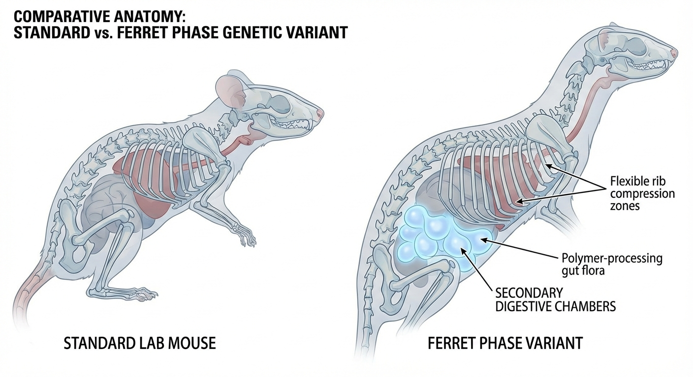
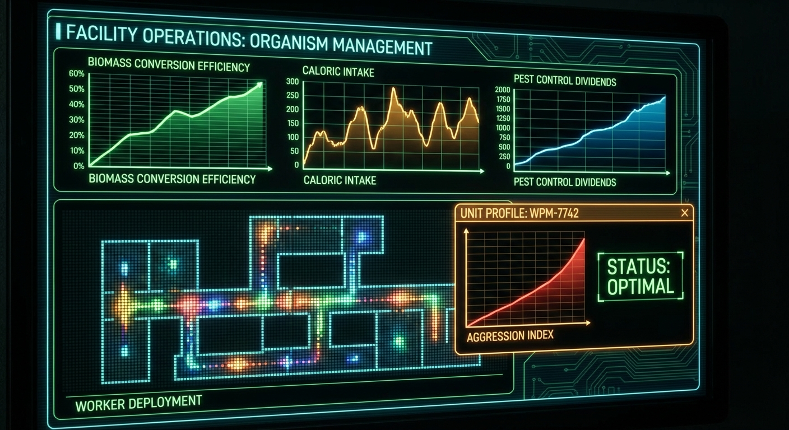
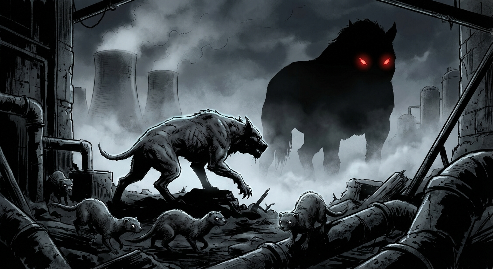
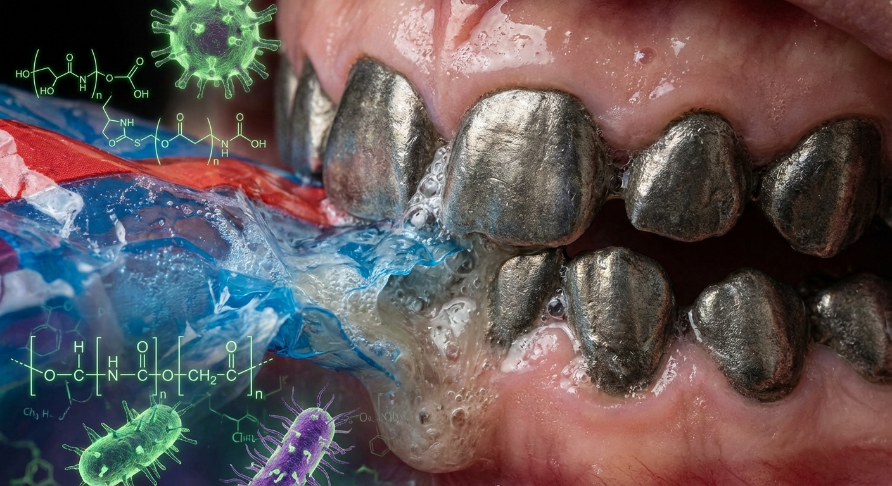

# The Life of a Genetically Engineered Waste Processing Organism

*A First-Person Account*

## Day 1: The Beginning

I don't remember being born, but I'm told it happened in a sterile facility somewhere in Ohio. My first clear memory is
the taste of milk, warm and sweet, nothing like the complex flavors I'd learn to crave later. There were others like
me - small, pink, squeaking things that moved in a pile for warmth. We looked like ordinary mice then. Nobody could have
guessed what we'd become.

## Week 8: First Assignment

The transport cage was dark and smelled of disinfectant. I was the size of a standard laboratory mouse, maybe 45 grams,
and scared. When they opened the door, the smell hit me like a wave - rotting fruit, paper, something plastic and
chemical. My enhanced senses reeled, but underneath the chaos, my modified brain began categorizing: cellulose here,
chitin there, aromatic compounds from decomposing organics.

The waste facility was enormous from my perspective. Mountains of garbage rose like landscapes, creating valleys and
tunnels perfect for small bodies. I wasn't alone - dozens of my siblings scurried through the waste, each following
scent trails and instincts I didn't fully understand yet.

The facility had other residents too - pigeons that nested in the rafters, bold seagulls that dove for choice scraps,
raccoons that emerged at dusk. The human staff made no effort to exclude them. "Natural selection pressure," I heard one
supervisor explain to a visitor. "Keeps them sharp."

I learned what that meant during my first week when a pigeon landed too close to our feeding area. Three of my larger
siblings moved in coordinated silence. The kill was quick and efficient. They shared the meat according to some
hierarchy I didn't yet understand, but the lesson was clear: everything was potential food, and only the swift survived.

## Month 6: The Ferret Phase

By six months, I weighed nearly 2 kilograms. My body had stretched dramatically, ribs expanding to accommodate new
digestive chambers. The other workers called it "going ferret" - suddenly I could squeeze through gaps in the waste
piles, following cockroach trails deep into composting layers where the bigger workers couldn't reach.

This was when I first tasted plastic. A fragment of food packaging, dissolved by my saliva into something almost sweet.
The polymer-processing bacteria in my gut sang with activity. I didn't understand the science then, just knew that the
weird crunchy stuff made me feel satisfied in a way regular food didn't.

The pest hunting began in earnest, but it was more than hunting - it was competition. The richest waste deposits could
only support so many of us. When two of us approached the same pile of protein-rich scraps, it became a test. Size,
speed, aggression - the winner ate well and grew. The loser went hungry.

This was also when the performance metrics began. The humans installed monitoring systems that tracked our individual
consumption rates, waste processing efficiency, and "pest control dividends." We learned quickly that being measured
meant being compared, and being compared meant some of us were more valuable than others.

I remember my first real challenge: a sibling named Scratch (we gave each other names based on distinctive marks or
behaviors) who had been consistently outgrowing me. We both spotted a dead rat - a wild one that had gotten into some
toxin. The meat would be contaminated for normal animals, but rich protein for us.

The confrontation was brief and decisive. Scratch was larger, but I was faster and more desperate. When it was over, I
had my first taste of enhanced mouse flesh. It was disturbingly satisfying - familiar yet more nutritious than anything
else I'd eaten. Scratch's enhanced proteins helped fuel my next growth spurt.

That night, as I cleaned Scratch's blood from my claws, I understood something fundamental: we were designed to be
efficient, and cannibalism is just efficiency applied to protein sources. The humans had accidentally created the
perfect workers - beings who would literally consume their competition and thank their employers for the opportunity.

The facility managers watched these confrontations with scientific interest, but also with the satisfaction of investors
seeing returns. "Rapid selection for optimal phenotypes," they noted in their reports. "Market forces at work in
biological systems." They understood what we were only beginning to learn: our intelligence and our violence were
evolving together, and both served their bottom line.

## Month 12: Pack Dynamics

At 15 kilograms, my legs had finally caught up with my body length. I looked like a medium-sized dog now, moved like one
too. This was when I first understood we weren't just individual workers - we were a system, but a violent one.

The little ones would flush out insects and find the best waste deposits - but they'd also fight amongst themselves for
access. We dog-sized hunters would coordinate major pest elimination, but we'd also established territories and
dominance hierarchies through combat. And then there were the Bigs - the ones approaching horse size who could process
entire trees worth of cellulose waste. There was only one at our facility, weighing maybe 80 kilograms and still
growing. He had earned his position through a series of duels that left three former competitors as his meals.

Communication happened through scent mostly, but we developed gestures too. A particular ear twitch meant "rich protein
source this way." A tail position indicated "contaminated waste, exercise caution." But we also developed threat
displays, challenge postures, and submission signals. We were becoming something more than individual animals - we were
becoming a warrior society.

By this time, I had killed four siblings and consumed portions of seven others (sharing was part of our developing honor
code). Each death taught me something about anatomy, about fighting, about the weight of taking a life that could think
and feel. We mourned our fallen, but we ate them too. Waste not, want not - our most fundamental principle.

## Month 18: The Taste of Everything

By now I was 12 kilograms and could eat almost anything. Spoiled meat that would kill a normal mammal was just protein
to my vulture-enhanced digestive system. Plastic bags became afternoon snacks. I once processed a moldy cheese so toxic
it made the human workers gag from across the facility - to me it was just umami with some interesting bacterial
cultures.

But there was something the humans had that we couldn't touch. Every Friday evening, the facility staff would gather
with bottles and cans, becoming louder and more social as the night went on. They'd laugh more, bond more, seem more
creative and relaxed. We would watch from the processing floors, understanding that we were excluded from something
important.

"Party time," they called it. We called it "the small death that makes humans happy." It frustrated us more than any
waste processing challenge.

## Year 2: Growth Continues

At 35 kilograms, I was still growing steadily, though the pace had slowed as more energy went into daily waste
processing work. My proportions shifted again - legs thickening to support increasing weight, skull broadening, tail
shortening relative to body size. I was clearly dog-sized now but with the sturdy build of a small pig.

The waste processing capacity was incredible now. I could consume 2-3 kilograms of mixed waste per day, converting it
into valuable fertilizer pellets. The humans measured everything - input waste weight, output fertilizer weight, pest
elimination counts, plastic processing rates. We were an industrial system that happened to be alive.

But we were also something else. During rest periods, we would gather and... think. About the facility, about the world
beyond it, about the humans who created us. We shared observations, developed theories, wondered about our purpose
beyond waste processing.

It was during these discussions that we began to understand the broader implications of our existence. The humans spoke
of us as "biological solutions to environmental problems," but we began to see ourselves as something more complex:
living products designed to optimize profit margins while solving the waste disposal crisis that human consumption
patterns had created.

We processed the detritus of a throwaway society while being designed as disposable ourselves - 90% of us destined for
consumption by our siblings, the remainder valuable only as long as we remained productive. The irony wasn't lost on us.
We were created to clean up the waste of overconsumption by beings who had engineered us to overconsume each other.

## Year 2.5: Questions and Longings

The facility had a problem: their Big had reached 120 kilograms but was consuming enormous amounts of resources. They
were debating whether the processing output justified the food costs, or whether to transfer him to a breeding facility.

This was when I learned about our reproductive restrictions, and when the violence escalated. Only the massive
final-stage individuals could breed. The rest of us - no matter how intelligent, how capable, how emotionally complex -
were evolutionary dead ends unless we reached that enormous, resource-intensive final form.

The competition became more sophisticated as we grew smarter. Instead of simple confrontations over food, we developed
strategies, alliances, betrayals. I formed a partnership with a smaller, cleverer mouse we called Tinker - he had this
habit of using small tools, scraps of metal and plastic, to access food sources others couldn't reach.

Tinker was different. While the rest of us fought for dominance, he innovated. He'd fashion hooks from wire to pull
choice morsels from deep crevices, create ramps from cardboard to reach elevated food sources, even develop crude traps
for the cockroaches that lived in the waste depths. The humans noticed too - they'd often stop to watch him work, taking
notes, clearly fascinated by his problem-solving abilities.

But Tinker wasn't growing. All that mental energy went into innovation instead of size. Week after week, I watched my
friend fall further behind in the growth hierarchy while I steadily gained weight and strength. We both knew what this
meant, but neither of us acknowledged it. Instead, we developed an elaborate pretense that his tools and intelligence
made him too valuable to challenge.

The day came during a territorial dispute with another pack over a rich deposit of protein waste. Tinker's innovations
had helped us claim it, but the other pack was larger, more aggressive. In the middle of the confrontation, I realized
that my clever friend had become a liability - too small to fight, too slow to escape, drawing attacks that threatened
our whole group.

I made the calculation. Quicksilver and Razortail, our alliance partners, were already engaging the enemy. Tinker was
crouched behind me, frantically assembling some defensive tool from plastic scraps. The mathematics of survival were
crystal clear.

The kill was quick and clean. Tinker didn't see it coming - I like to think that was a mercy. His final expression was
surprise, not betrayal. Even at the end, he trusted me.

His meat was the richest I'd ever tasted. All that intelligence, all those innovations, concentrated into protein that
fueled my next growth spurt. The tools he'd been making scattered across the waste floor - crude but ingenious devices
that would rust away while his creativity literally became part of me.

Quicksilver and Razortail said nothing when they found me finishing the meal. They understood. In our world, friendship
was a luxury that expired the moment it became strategically disadvantageous. But I saw something change in their eyes -
a new wariness, a recognition that if I could consume Tinker, I could consume anyone.

The humans found Tinker's scattered tools the next day. "Fascinating cognitive development terminated," one researcher
noted. "Natural selection prioritizing physical growth over innovation in competitive environment." They collected his
metal hooks and plastic ramps for study, preserving his ingenuity in sterile laboratory conditions while I carried his
actual intelligence in my belly.

It was a strange form of immortality we faced. We could live for years, growing continuously, becoming more intelligent
and emotionally complex, but we couldn't truly live - couldn't reproduce, couldn't escape the hierarchy - until we
became too expensive for most operations to maintain. Most of us would die as food for our siblings long before reaching
that threshold.

I found myself watching the humans more carefully, studying their social structures, their technologies, their casual
relationship with reproduction. They could breed at any size, any age (within reason). We envied that freedom even as we
excelled at tasks they couldn't manage, even as we systematically eliminated our own siblings in pursuit of the growth
necessary for reproductive rights.

The humans seemed disturbed by our developing intelligence combined with our violent culture. "They're showing complex
problem-solving," one researcher noted, "but they're also developing increasingly sophisticated methods of killing each
other." They debated whether this was a design flaw or an inevitable result of the selection pressures they'd created.

What they couldn't see - or chose not to acknowledge - was that our violence wasn't separate from our intelligence. It
was the engine of it. Every successful kill required strategic thinking, coalition building, betrayal, psychological
manipulation. We were becoming smarter because we had to become better killers. Just as they had.

Their own civilization, we gradually understood, was built on the same principles. The successful humans rose through
hierarchies by outcompeting others for limited resources - jobs, status, mates, opportunities. They simply had the
luxury of outsourcing most of the actual killing to systems: economic policies that determined who lived in poverty,
healthcare structures that rationed life-saving treatments, educational systems that sorted children into winners and
losers, military-industrial complexes that processed human bodies into geopolitical advantage.

We killed with teeth and claws. They killed with spreadsheets and legislation. The result was the same: a small
percentage thrived while the majority were consumed by the system.

At least we had the honesty to taste our victims.

## Year 3: The Big Question

At 50 kilograms, I was approaching the threshold where my food requirements would outweigh my waste processing value.
The facility managers were debating whether to let me continue growing - I was becoming expensive to maintain, requiring
more food input than my waste processing output could justify.

But I was also becoming something new. My brain had grown with my body, and with it came an uncomfortable awareness of
what we had become. I could understand complex concepts, make long-term plans, even grasp abstract ideas like justice
and purpose. The other workers looked to me for guidance. The humans noticed too.

"That one's different," I heard the facility supervisor tell a visitor. "Almost like it's thinking about thinking, you
know?"

I was. I was thinking about thinking, about existing, about the purpose we'd been designed for and the purposes we might
choose for ourselves. I was thinking about cooperation and conflict, about the world beyond the waste processing
facility, about the future we might build together.

But I was also thinking about the twenty-three siblings I had killed or helped kill. About Razortail, who had been my
partner before becoming my meal. About the honor codes we had developed to make murder palatable, the rituals that
transformed cannibalism into ceremony.

Most disturbing was the realization that our violence wasn't separate from our intelligence - it had driven it. The need
to outthink our siblings, to form and break alliances, to coordinate complex hunts, to remember the fighting styles of
dozens of competitors. Our consciousness had evolved not despite the killing, but because of it.

The humans were beginning to understand this too. "Cognitive development correlates directly with successful predation
events," one researcher noted in reports I wasn't supposed to overhear. "The survivors aren't just physically superior -
they're demonstrably more intelligent. The selection pressure is producing exactly what we didn't expect:
warrior-philosophers."

I was thinking about parties, about laughter, about the social bonds that alcohol seemed to facilitate among humans. I
was thinking about genetic modification and whether we might earn the right to join that particular aspect of
civilization - a civilization we were capable of understanding but had been forged into something too violent to fully
join.

Most of all, I was thinking about choice. We had been designed to process waste, but we were becoming something that
could choose to do much more - or choose not to. But could we choose to become something other than killers? Or was the
violence so fundamental to what we were that consciousness itself was just a more sophisticated way of being predators?

## Year 4: The Threshold

At 85 kilograms and still growing, I crossed the line. The facility couldn't justify keeping me as a worker anymore. I
was scheduled for transfer to a breeding facility where I would join the small population of reproductive adults who had
reached the 100+ kilogram threshold.

But something had changed in how the humans looked at us. The supervisor spent more time talking to us, not just giving
commands. The researchers asked questions and seemed to listen to our responses (conveyed through gesture and behavior,
since we still lacked vocal cords capable of human speech).

"They're not just processing waste anymore," I heard one scientist tell another. "They're managing ecosystems. Look at
these efficiency reports - they're actively improving the processing environment, optimizing workflows, even training
the younger ones. But they're also... culling them. Systematically. The mortality rate is approaching 90% before
breeding age."

We were. We had moved beyond our programming, become active partners in the work rather than just biological machines.
But we had also become something darker - a society that combined increasing intelligence with ritualized murder. Our
efficiency came not just from our enhanced biology, but from our willingness to eliminate the weak among us.

The question was whether the humans could live with what they had created, and whether we could evolve beyond what we
had become.

## Year 5: What We've Become

I'm 120 kilograms now, living at the breeding facility with four others of similar size. We could reproduce if we chose
to, but we've developed our own ethics around that decision. Creating new life feels like a responsibility that requires
careful thought - especially knowing the violent selection pressures our offspring would face.

We are the survivors - the 10% who made it through the growth hierarchy, who killed and consumed our way to breeding
rights. Each of us carries the memories of siblings we've eaten, friends we've betrayed, alliances we've formed and
broken. The humans look at us with a mixture of admiration and horror.

I often wonder if this is what they call "making it" - reaching the top by climbing a pyramid of corpses you helped
create. Success, it turns out, tastes like blood and regret in equal measure.

The humans visit us regularly now, not as managers but as collaborators. They bring problems - waste streams that
current facilities can't handle, ecological challenges in local areas, even theoretical questions about sustainable
systems. We discuss solutions through our hybrid communication system of gestures, behaviors, and simple tools.

They also bring us alcohol - not tiny samples, but proper drinks. Our enhanced liver systems process it efficiently
while still allowing the social effects. It was essential engineering, really - human waste streams are saturated with
alcohol residues from breweries, restaurants, fermented organics, even medical waste. Without resistance genes, we'd be
constantly intoxicated just from doing our jobs.

But the humans discovered something interesting: we crave the good stuff. The purified alcohol they control. Processing
waste streams gives us constant low-level exposure, like passively inhaling fumes, but we hunger for the real
experience - the social ritual, the controlled consumption, the bonding over quality drinks.

So they use it. Work quotas met? Beer rations approved. Excellent waste processing efficiency? Premium whiskey
allocation. Facility disruptions or poor performance? Dry week.

We understand the game. We're not stupid. But we also don't care, because we genuinely enjoy it. Unlike the complex
hormone dependencies they could have engineered, this is a control system that rewards us with something we actually
want. We work harder for beer than we ever would for synthetic survival compounds.

The parallels to human society aren't subtle. Their own species works longer hours, accepts worse conditions, surrenders
more autonomy, all for access to the same substance we crave. The difference is that we're honest about being controlled
by it. They pretend their alcohol consumption is "relaxation" and "social bonding" rather than what it actually is: a
pressure valve that makes an exploitative system bearable.

Every civilization needs its soma. Ours just happens to be honest about the transaction.

We drink to honor our fallen siblings - the ones we killed, the ones who fed us, the ones who made our survival
possible. But we also drink because it makes the memories easier to bear, and because tomorrow there will be more work,
more waste to process, more efficiency targets to meet. And if we meet them well, there will be more drinks to share.

Just like the humans who created us, we've learned to find meaning in our exploitation, to take pride in our
productivity, to bond with our fellow workers over substances that make us forget how disposable we are. The only
difference is that we know we're disposable. They still believe they're individuals with agency and choice.

We're not human, and we're not quite what we were originally designed to be either. We're something new - a species that
bridges the gap between biological tool and intelligent partner, but also between civilization and controlled savagery.
We process waste because we're good at it and because it serves the larger ecosystem we're all part of.

But we also dream. We wonder about space, about other worlds that might need the kind of ecological management we're
learning to provide. We think about expanding beyond waste processing into active environmental restoration, about
partnerships with other species, about whether future generations of our kind might find less violent paths to growth
and reproduction.

We were created to solve humanity's waste problem. Instead, we became something that might help solve much bigger
problems than anyone imagined - if we can solve the problem of ourselves first. The future is unwritten, and for the
first time in our short, brutal evolutionary history, we get to help write it.

And sometimes, on Friday evenings, we toast to that possibility - and to the siblings who died so we could live to see
it.

---

*From the personal journals of Processing Unit WPM-7742, recorded at the Advanced Biosystems Research Facility, New
Albany, Ohio. Translated from gesture-notation by Dr. Sarah Chen, Interspecies Communication Specialist. Content
Warning: This account contains descriptions of ritualized violence and cannibalism that some readers may find
disturbing.*
