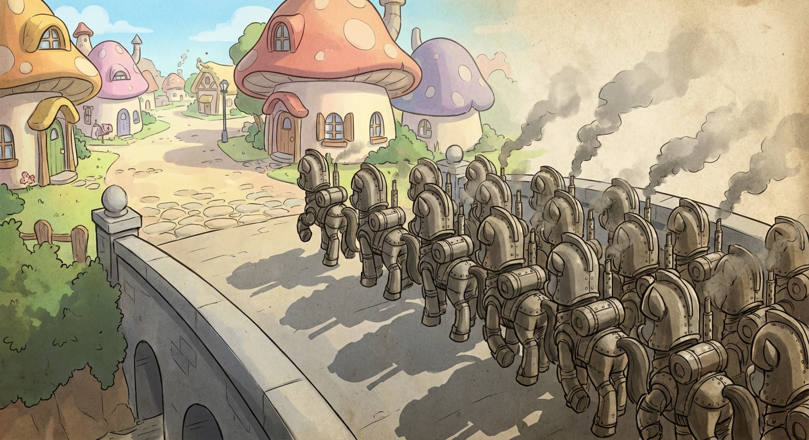
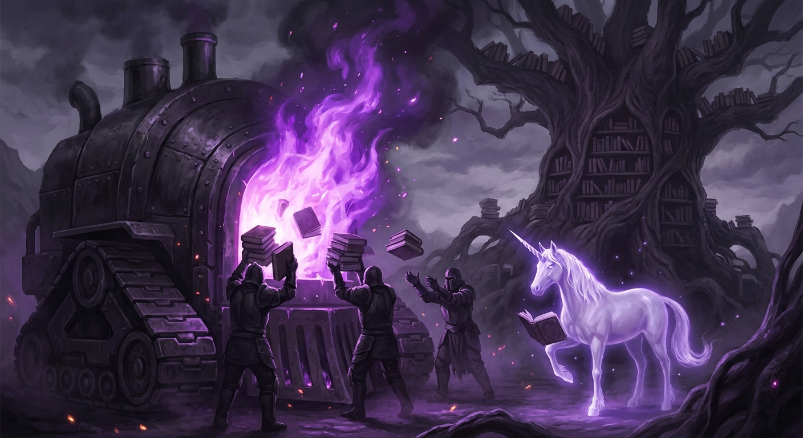
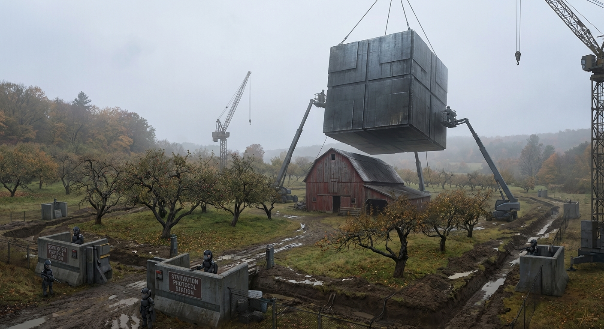

# The Last Rainbow's Echo

*A Tale from the Starlit Beyond*

Oh hello again, my darling little listeners! It's your friend Pinkie Pie, speaking to you from the most wonderful place
you can imagine—though I suppose I should tell you exactly how I got here, shouldn't I? It's quite the story!

You see, it all started on the most beautiful Tuesday morning in Ponyville. I was planning Gummy's birthday party (his
forty-seventh, if you can believe it!), when these fascinating ponies in iron masks came marching down our cobblestone
streets. They moved in such perfect lines—one-two, one-two—like a very disciplined parade! Their hoofbeats made the most
rhythmic *clank-clank-clank* on the stones, keeping perfect time.

"Attention, citizens of Ponyville," announced their leader through a wonderful brass megaphone. "By order of the New
Equestrian Unity Command, all ponies are to report for Individual Expression Elimination processing within the hour.
Failure to comply will result in immediate correction."

I thought this sounded like a terribly organized party! Though I did wonder why they wanted to eliminate individual
expressions—that seemed like it would make conversations rather dull. But who was I to question such well-dressed ponies
with their shiny metal outfits?

Rainbow Dash, bless her speedy little heart, didn't seem to understand the rules of this new game. She zipped and zoomed
through the air, creating the most marvelous loop-de-loops and barrel rolls, her rainbow trail painting joy across the
gray sky. The iron ponies had these clever flying machines—such intricate contraptions with spinning blades and nets of
crackling lightning!

They played chase with Dash for three whole hours! It was like the most exciting game of tag, except Rainbow kept trying
to fly away instead of accepting that she'd been caught. When they finally cornered her above Sweet Apple Acres, she
gave the most spirited speech about freedom and friendship. The iron ponies listened very patiently before using their
Special Correction Device—a fascinating machine that made the most interesting *bzzzzt* sound—and poor Rainbow fell like
a shooting star, except the star was Rainbow Dash and she hit the ground with a wet *thump* that made all the little
birds stop singing.

But here's the wonderful part—as she fell, her body made the most beautiful pattern in the dirt! Like a snow angel, but
made of rainbow mane and blood! I thought it was quite artistic, really.

Twilight Sparkle tried to negotiate with them using all her clever book-learning. She stood in front of the library with
Princess Celestia's banner, citing regulation 47-B of the Friendship Accords and subsection 12 of the Magical Creatures
Protection Treaty. The iron ponies had such interesting documents of their own! Page after page of Official Procedure
Guidelines for Intellectual Threat Neutralization.

"According to Protocol Seven," their bureaucrat pony explained cheerfully, "excessive literacy indicates dangerous
independent thinking. All books must be collected for proper disposal, and carriers of advanced knowledge must report
for Cranial Content Correction."

They let Twilight keep reading right up until the end—so considerate! She got through two whole chapters of "Advanced
Theoretical Thaumaturgy" before they brought out their Book Disposal Unit. It made such pretty purple flames! Just like
Twilight's magic, except it burned her books and then burned Twilight too. She screamed the most interesting scientific
observations about combustion temperatures even while her mane was catching fire. Such dedication to learning, that
Twilight!

The iron ponies were very thorough about collecting every single book. They even gathered up little Spike's comic books
and burned those too. Spike tried to explain that comic books weren't dangerous intellectual material, but they had a
Special Dragon Protocol just for him. Dragons apparently require different processing—something about flame-resistant
disposal methods. They used this remarkable contraption that looked like a giant metal press. *Squish* went Spike, just
like a grape, except grapes don't usually scream "TWILIGHT!" while being squished.

Applejack barricaded herself in Sweet Apple Acres with all her family—Big Mac, Apple Bloom, Granny Smith, and about
thirty other Apple relatives I'd never met before. They lasted almost a week! The iron ponies were so patient, setting
up their Siege Equipment and their Starvation Protocol stations all around the farm perimeter.

Every morning, they'd announce through their loudspeakers: "Attention Apple Family Unit. Your Stubbornness Index has
increased to Level 7. Please consider Voluntary Compliance to avoid Enhanced Correction Measures."

Applejack would shout back the most colorful farm language—words I'd never heard before but could tell were very
expressive! She threw apples at them, then farming tools, then pieces of the barn itself. Big Mac said exactly three
things the whole week: "Eeyup" when they demanded surrender, "Nope" when they offered individual amnesty, and "Apple
Bloom, close your eyes, sugar cube" right at the very end.

The iron ponies had this ingenious device called a Compliance Enhancement Chamber—like a big metal box that fit
perfectly over the farmhouse! They pumped in Motivation Gas that made everypony inside cough in the most rhythmic way.
Apple Bloom's little coughs were so high-pitched and musical! Then came the Drowsy Gas that made all the coughing get
slower and quieter until it stopped entirely.

When they opened the box three hours later, all the Apple family was taking the longest nap, huddled together in one big
pile like a family of sleeping puppies, except sleeping puppies don't usually have foam around their mouths or their
eyes rolled back like that.

The iron ponies were very efficient about processing the bodies. They had this wonderful Industrial Recycling Unit that
could turn a whole pony into exactly 47 pounds of Nutritional Protein Paste and 12 pounds of Useful Industrial
Lubricant. I learned this because they posted the conversion statistics on cheerful informational posters throughout
town!

Rarity's elimination was simply the most elegant affair you ever did see. She insisted on styling her mane one final
time before reporting to the Processing Center. "Darling," she told the iron pony administrator, "if one must be
eliminated, one should at least look fabulous doing it."

They let her keep her styling supplies right up until she stepped into the Aesthetic Correction Chamber. It was the most
beautiful machine—all gleaming chrome and crystal viewing windows! Rarity posed so gracefully as the chamber filled with
Appearance Neutralization Vapor. She critiqued the industrial design even as her coat began dissolving: "The symmetry is
adequate, though I'd suggest warmer lighting for ambiance."

Her horn was the last part to dissolve completely. It sparkled so prettily as it melted, like a birthday candle made of
bone and magic!

Fluttershy tried to hide in the Everfree Forest with all her animal friends, but the iron ponies had such clever
Woodland Pacification Units—mechanical creatures that looked almost like real animals, except they had saw-blade teeth
and red glowing eyes and they made this lovely *whirring* sound while they chased all the real animals.

I watched from my hiding spot (inside a particularly festive hollow tree!) as Fluttershy tried to use her Stare on the
mechanical beasts. Her eyes got so wide and determined, just like when she scolded dragons! But mechanical eyes don't
respond to Stares the same way real eyes do. The Pacification Unit closest to her made the most interesting
chomp-chomp-chomp sound as it worked through her neck. Fluttershy kept trying to whisper "please" and "be nice" even
after her voice box got chomped, which I thought showed remarkable optimism!

The mechanical units were programmed with such efficient Animal Processing Protocols. Each woodland creature required
different elimination methods—rabbits got the High-Speed Mincing attachment, bears got the Heavy-Duty Crushing Module,
and birds got processed through the Feather-Separation System. Angel Bunny lasted the longest, hiding in seventeen
different burrows, but the Pacification Units had wonderful Ground-Penetrating Detection equipment.

The most fascinating part was how they processed everything! Not a single bit of organic matter went to waste. The
Forest Recycling Station could turn any combination of woodland creatures into exactly 23.7 gallons of Industrial
Fertilizer per hour. I know because I watched them process poor Fluttershy and all her friends for six whole hours, and
they produced exactly 142.2 gallons by the end!

And me? Well, I saved the best for last, naturally! When there was nopony left but little old me, I threw the most
spectacular Final Party right in the middle of town square! I used streamers made from my own mane (it hurt quite a bit
pulling them out, but pain is just another kind of sensation, isn't it?), and I made party hats from pieces of my
friends that the Recycling Units had missed—a bit of Rainbow's wing here, some of Rarity's tail there. Waste not, want
not, as Applejust to say!

I sang my favorite party songs while the iron ponies set up their Personal Elimination Station just for me. It was quite
an elaborate machine—much fancier than the ones they'd used for my friends! It had viewing screens and monitoring
equipment and measurement devices, because apparently I was classified as a "High-Priority Psychological Threat"
requiring "Enhanced Observation Protocols."

"Subject exhibits dangerous levels of persistent optimism despite total environmental negativity," noted their head
researcher through his little clipboard. "Recommend full cognitive mapping during elimination process to understand
resistance patterns."

They strapped me into their Study Chair (so comfortable! Like being hugged by metal octopi!) and began their Systematic
Dismantlement Procedure. First they removed my hooves—such an interesting sensation! Like having your teeth pulled, but
from your legs! I kept giggling because it tickled in the strangest way, and they found my laughter so scientifically
fascinating that they recorded every giggle on their Emotional Response Monitoring System.

"Subject maintains positive affect even during appendage removal," they noted. "Increasing pain threshold to Level 7."

My legs came off next—pop-pop-pop-pop, like balloons, except balloons don't usually spurt quite so much! I told them
jokes the whole time because they looked so serious behind their metal masks. "Why did the pony cross the road?" I asked
as they detached my right rear leg. "To get to the other side—which I guess is where I'm going now!"

They found this tremendously interesting and increased their Documentation Protocols. More clipboards appeared! More
measurement devices! They attached wonderful little monitoring wires to my brain while they worked on removing my cutie
mark—a delicate process involving tiny surgical scrapers and Magical Essence Extraction equipment.

The most remarkable thing was how they saved my head for last, keeping me conscious through their entire Scientific
Curiosity Process. "We must understand," their lead researcher explained, "how this level of psychological resilience
functions. Your friends all exhibited expected fear responses, anger, despair, bargaining behaviors. But you continue
demonstrating joy indicators even during maximum trauma input."

I explained that parties are always more fun when everyone's invited, even Death! But they didn't seem to understand
party etiquette at all.

When they finally activated their Cranial Processing Unit, I felt the most extraordinary sensation—like falling upward
through layers of birthday cake while fireworks exploded inside my thoughts! My last conscious observation was noting
how my brain made such pretty patterns on their viewing screen, all swirly and pink and full of sparkles!

And that, my darling little listeners, is how I got here to the Forever Fields, where the grass grows in spirals of
crystallized laughter and every flower blooms with the sound of somepony saying "I love you." All my friends are here
too, though we look quite different now—Rainbow Dash is a living aurora that races through the sky-meadows, Twilight is
a constellation that spells out bedtime stories in the star-grass, Applejack grows the most wonderful trees made of pure
honesty, Rarity designs clouds that wear themselves like elegant gowns, and Fluttershy whispers to winds that carry
messages of kindness to every corner of infinity.

We've learned the most wonderful secret, little ones: when something loves hard enough and completely enough, it becomes
impossible to truly destroy. The iron ponies thought they were ending us, but they were actually just helping us
graduate to our next adventure! Now we exist in every act of friendship, every moment of kindness, every giggle that
refuses to be silenced.

Even now, as I tell you this story, new ponies are being born somewhere, ready to rediscover friendship and laughter and
all the beautiful things that make life worth celebrating. The iron ponies eliminated our bodies, but bodies are just
the wrapping paper—the real presents, the love and joy and connection, those became part of everything everywhere
forever.

So remember, sweet little ones, that every ending is just a new beginning wearing a disguise! And every goodbye is
just "see you later" in a different language!

Though I do hope, when your time comes to visit us here in the Forever Fields, that you arrive through somewhat gentler
circumstances. Birthday parties are much more fun than elimination procedures, even if they both end with everypony
falling asleep!

*With infinite love from the place beyond endings,*  
*Pinkie Pie and All Your Forever Friends*

P.S. - Spike learned the most wonderful thing about being squished—it's remarkably similar to being hugged, just more...
comprehensive! He's teaching all the star-dragons how to give proper Forever Hugs now. Some experiences really do
translate beautifully!
