# Narrative Generation Task

## Input Messages

ASSISTANT: Executing task:

```json
{
  "task_type": "NarrativeGeneration",
  "subject": "Teenage Mutant Ninja Kittens - An illustrated story concept",
  "input_files": [],
  "narrative_elements": {
    "characters": "Four young kittens transformed into ninja warriors with distinct personalities and skills",
    "setting": "Urban environment (sewers, rooftops, city streets) with whimsical, family-friendly twist",
    "conflict": "Kittens must protect their city from a villain threat while learning to work as a team",
    "timeline": "Origin story spanning discovery/transformation through first major mission",
    "age_target": "Middle-grade (8-12 years old)",
    "scenes": [
      "Origin/Transformation scene",
      "Training montage",
      "First encounter with villain",
      "Climactic battle",
      "Resolution/Team bonding"
    ]
  },
  "target_word_count": 3500,
  "number_of_acts": 5,
  "scenes_per_act": 1,
  "writing_style": "literary",
  "point_of_view": "third person omniscient",
  "tone": "humorous, adventurous, lighthearted",
  "detailed_descriptions": true,
  "include_dialogue": true,
  "show_internal_thoughts": true,
  "revision_passes": 2,
  "generate_scene_images": true,
  "generate_cover_image": true,
  "task_dependencies": [],
  "state": "Pending",
  "task_type": "NarrativeGeneration",
  "task_description": "Generate an illustrated story concept for Teenage Mutant Ninja Kittens spanning origin, training, conflict, and resolution"
}
```

USER: illustrated story: teenage mutant ninja kittens

## Overview

# Narrative Generation

**Subject:** Teenage Mutant Ninja Kittens - An illustrated story concept

## Configuration

- Target Word Count: 3500
- Structure: 5 acts, ~1 scenes per act
- Writing Style: literary
- Point of View: third person omniscient
- Tone: humorous, adventurous, lighthearted
- Detailed Descriptions: ✓
- Include Dialogue: ✓
- Internal Thoughts: ✓

**Started:** 2025-11-23 18:16:20

---

## Progress

### Phase 1: Narrative Analysis

*Running base narrative reasoning analysis...*

## Cover Image

**Prompt:**

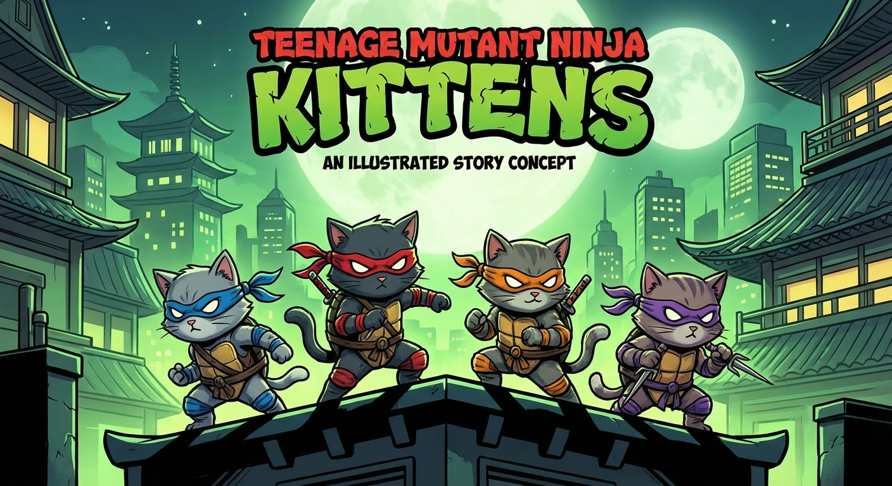

## High-Level Outline

## TEENAGE MUTANT NINJA KITTENS

**Premise:** Four ordinary kittens are mysteriously transformed into extraordinary ninja warriors by the wise Master
Whiskers. Guided by their mentor, they must learn to work together as a team while discovering their individual
strengths. When a vengeful villain named Shadow Paws threatens to destroy the city, the kittens must overcome their
differences, master their new abilities, and prove that even the smallest heroes can make the biggest difference.

**Estimated Word Count:** 3500

---

### Characters

#### WHISKER

**Role:** Leader / Primary Protagonist

**Description:** Bright orange tabby with bold stripes, slightly larger than siblings, wears a red bandana. The eldest
of the four kittens, confident and impulsive with a competitive streak and dry sense of humor. Feels destined for
something greater than ordinary cat life.

**Traits:** Brave, Quick-thinking, Occasionally reckless, Fiercely loyal, Natural leader, Competitive

#### SHADOW

**Role:** Strategist / Deuteragonist

**Description:** Sleek black kitten with white paws and chest patch, smallest of the group, wears a blue bandana. Quiet,
analytical, bookish, and observant. Grew up in the library district before being found and loves reading and learning.

**Traits:** Intelligent, Cautious, Loyal, Occasionally sarcastic, Witty, Observant

#### POUNCE

**Role:** Heart / Emotional Core

**Description:** Calico kitten with patchy orange, black, and white fur, medium-sized, wears a pink bandana with an
expressive face. Optimistic, empathetic, and enthusiastic with an unshakeable belief in the goodness of others. Found
abandoned in a cardboard box.

**Traits:** Compassionate, Energetic, Brave despite fears, Surprisingly strong, Kind-hearted, Genuinely empathetic

#### ZIGZAG

**Role:** Wildcard / Comic Relief

**Description:** Gray and white spotted kitten with lanky build, wears a purple bandana with a mischievous expression.
Hyperactive, comedic, and unpredictable. Street kitten with a chaotic past who uses humor to deflect from deeper
insecurities.

**Traits:** Quick reflexes, Creative thinking, Loyal despite goofiness, Surprisingly insightful, Playful, Unpredictable

#### MASTER WHISKERS

**Role:** Mentor / Guide

**Description:** Elderly gray tabby with long silver whiskers and one slightly clouded eye. Moves with deliberate grace
and wears traditional martial arts robes. Former ninja warrior who retired to the sewers decades ago and discovered the
magical source of the kittens' transformation.

**Traits:** Wise, Patient, Mysterious, Calm under pressure, Deeply honorable, Cryptic

#### PROFESSOR WHISKER

**Role:** Support / Comic Relief

**Description:** Nerdy orange kitten who wears tiny glasses and a lab coat made from fabric scraps. Slightly chubby with
an enthusiastic expression. Self-taught inventor living in the sewers who creates gadgets and tools for the team.

**Traits:** Inventive, Loyal, Anxious, Surprisingly brave, Excitable, Scatterbrained

#### SHADOW PAWS

**Role:** Primary Antagonist / Main Villain

**Description:** Sleek black silhouette with glowing red eyes, wears a tattered cloak, moves like smoke with occasional
glimpses of a scarred feline face. Former street cat who was experimented on by humans and blames all of society for his
suffering. Seeks to plunge the city into chaos.

**Traits:** Intelligent, Ruthless, Powerful, Driven by vengeance, Cold and calculating, Bitter

#### THE SHADOW RATS

**Role:** Minions / Antagonistic Forces

**Description:** Sleek gray and brown rats wearing makeshift armor with glowing enchanted eyes. Mindless and aggressive,
they follow Shadow Paws' orders without question and are coordinated in their attacks.

**Traits:** Numerous, Coordinated, Dangerous in groups, Mindless, Aggressive, Enchanted

---

### Settings

#### sewers

**Description:** A vast underground network of tunnels and chambers beneath the city. The main hideout is a spacious
chamber with high ceilings, decorated with salvaged treasures—old lanterns casting warm amber light, cushions made from
fabric scraps, a training area with makeshift equipment, and a library corner filled with books. Water flows gently
through channels, creating a soothing background sound. Bioluminescent fungi grow on some walls, providing an ethereal
glow.

**Atmosphere:** Safe, cozy, mysterious, slightly damp and cool, feels like home

**Significance:** The kittens' sanctuary and training ground; represents their found family and new beginning

#### rooftops

**Description:** A sprawling landscape of interconnected rooftops across the city's downtown district. Varied heights
and angles create a parkour paradise—some flat and wide, others steeply pitched, connected by narrow bridges and fire
escapes. Neon signs from below cast colorful reflections on wet surfaces. The night sky stretches endlessly above,
dotted with stars visible between tall buildings. Wind whistles through the urban canyons.

**Atmosphere:** Exhilarating, dangerous, beautiful, free, slightly isolating

**Significance:** Where the kittens feel most alive and powerful; represents their growth and confidence

#### city_streets

**Description:** Bustling downtown streets with shops, restaurants, and apartment buildings. Sidewalks crowded with
humans going about their lives, unaware of the danger lurking below. Street lamps cast pools of yellow light. Graffiti
art decorates alley walls. The smell of food from restaurants mingles with exhaust fumes. Alleys provide shortcuts and
hiding places.

**Atmosphere:** Chaotic, vibrant, dangerous for small creatures, full of life

**Significance:** The world the kittens are protecting; represents the stakes of their mission

#### abandoned_warehouse

**Description:** A massive, decrepit building on the city's outskirts. Broken windows let in shafts of moonlight,
illuminating dust motes and shadows. Rusted machinery and forgotten equipment litter the floor. The air is cold and
stale. Shadow Paws has claimed the upper levels, creating a dark throne room with stolen treasures and glowing magical
artifacts. The Shadow Rats nest in the lower levels, creating an eerie chittering atmosphere.

**Atmosphere:** Ominous, cold, corrupted, dangerous, oppressive

**Significance:** The source of the threat; represents the darkness the kittens must overcome

#### library_district

**Description:** A quiet, peaceful area of the city with a grand public library as its centerpiece. Tall buildings with
large windows, tree-lined streets, benches for reading. Inside the library: towering shelves, the smell of old paper and
leather, reading nooks with comfortable chairs, a sense of timeless knowledge and peace.

**Atmosphere:** Calm, intellectual, peaceful, nostalgic

**Significance:** Where Shadow was found and where she discovered her love of learning; represents knowledge and hope

---

### Act Structure

#### Act 1: DISCOVERY & TRANSFORMATION

**Purpose:** Introduce the four ordinary kittens, establish their individual personalities and dynamics, and set up the
inciting incident that transforms them into ninja warriors.

**Estimated Scenes:** 1

**Key Developments:**

- Meet the four kittens living ordinary lives in different parts of the city
- Establish their distinct personalities through contrasting scenes
- Inciting incident: All four kittens are mysteriously drawn to the sewers on the same night
- Discovery of Master Whiskers and the magical transformation
- The kittens gain extraordinary abilities and ninja training begins
- Introduction of the larger world and the threat they'll face

#### Act 2: TRAINING & BONDING

**Purpose:** Show the kittens learning to work together as a team, developing their individual skills, and building
genuine friendships. Establish the humor and heart of the story.

**Estimated Scenes:** 1

**Key Developments:**

- Master Whiskers puts the kittens through rigorous training montage
- Each kitten discovers their unique ninja specialty
- Conflicts arise as personalities clash (Whisker's impulsiveness vs. Shadow's caution, Zigzag's chaos vs. Pounce's
  order)
- Gradual realization that they're stronger together than apart
- Introduction of Professor Whisker and his gadgets
- First hints of the Shadow Paws threat through mysterious incidents in the city
- The kittens bond over shared meals, jokes, and late-night conversations

#### Act 3: FIRST ENCOUNTER & RISING STAKES

**Purpose:** Introduce the villain and the true scope of the threat. Raise the stakes and force the kittens to put their
training into practice. Create tension and establish the conflict.

**Estimated Scenes:** 1

**Key Developments:**

- The kittens witness Shadow Paws' minions (Shadow Rats) causing chaos in the city
- First confrontation with the Shadow Rats on the rooftops
- The kittens barely escape, realizing they're not as prepared as they thought
- Master Whiskers reveals the truth about Shadow Paws and his vendetta
- The villain becomes aware of the kittens' existence and views them as a threat
- Shadow Paws begins a coordinated plan to destroy the city and eliminate the kittens
- The team realizes they must stop him before it's too late
- Personal stakes are raised when the villain threatens locations/people the kittens care about

#### Act 4: CLIMACTIC BATTLE

**Purpose:** Deliver the action-packed confrontation between the kittens and Shadow Paws. Test everything the characters
have learned. Bring all plot threads to a head.

**Estimated Scenes:** 1

**Key Developments:**

- The kittens infiltrate the abandoned warehouse lair
- Epic battle sequences showcasing each kitten's unique skills
- Shadow Paws proves to be a formidable opponent, more powerful than expected
- The team is separated and must overcome individual challenges
- Moments of doubt and fear—it seems like they might lose
- A turning point where the kittens remember their training and their bond
- They execute a coordinated strategy combining all their strengths
- Shadow Paws is defeated through teamwork and clever thinking rather than brute force
- Emotional confrontation where Shadow Paws' tragic backstory is revealed, adding complexity to his villainy

#### Act 5: RESOLUTION & NEW BEGINNING

**Purpose:** Resolve all plot threads, show character growth, and establish the kittens' new role as protectors. Provide
emotional closure while hinting at future adventures.

**Estimated Scenes:** 1

**Key Developments:**

- The city is saved; the Shadow Rats are freed from enchantment
- The kittens are celebrated as heroes (though they must remain secret)
- Each kitten reflects on their personal growth and what they've learned
- Master Whiskers acknowledges their readiness to continue protecting the city
- The team celebrates their victory with humor and warmth
- Hints that Shadow Paws may not be entirely defeated, setting up potential sequels
- The kittens return to their new life in the sewers, but now with purpose and family
- Final scene: The four kittens on the rooftops at night, looking over the city they've sworn to protect, ready for
  whatever comes next

---

**Status:** ✅ Pass 1 Complete

## Outline

## TEENAGE MUTANT NINJA KITTENS

**Premise:** Four ordinary kittens are mysteriously transformed into extraordinary ninja warriors by the wise Master
Whiskers. Guided by their mentor, they must learn to work together as a team while discovering their individual
strengths. When a vengeful villain named Shadow Paws threatens to destroy the city, the kittens must overcome their
differences, master their new abilities, and prove that even the smallest heroes can make the biggest difference.

**Estimated Word Count:** 3500

**Total Scenes:** 8

---

### Detailed Scene Breakdown

### Act 1: DISCOVERY & TRANSFORMATION

**Purpose:** Introduces four lost kittens in their individual worlds, draws them together through mysterious forces,
reveals their destiny as ninja warriors, and establishes the threat of Shadow Paws as the primary antagonist

#### Scene 1: FOUR PATHS CONVERGE

- **Setting:** city_streets, library_district, rooftops, sewers
- **Characters:** Whisker, Shadow, Pounce, Zigzag, Master Whiskers, Professor Whisker
- **Purpose:** Establish each kitten's individual personality and world, introduce the mysterious pull drawing them
  together, and set up their convergence at the sewers
- **Emotional Arc:** Confusion and wonder → Awe and exhilaration → Determination and unity → Ominous foreshadowing. Each
  kitten begins isolated and uncertain, experiences magical transformation that bonds them together, and ends the scene
  committed to their shared destiny while an unseen threat looms.
- **Est. Words:** 3500

**Key Events:**

- Whisker proves himself in an alley confrontation with older cats
- Shadow studies martial arts philosophy in the library
- Pounce awakens in her cardboard box home and feels called to the city center
- Zigzag practices parkour on fire escapes and rooftops
- All four kittens converge at the sewer entrance
- Master Whiskers reveals their chosen purpose
- The kittens are transformed by the magical pool
- Professor Whisker is introduced as support character
- Master Whiskers reveals the threat of Shadow Paws
- The kittens accept their role as a unified team

---

### Act 2: TRAINING & BONDING

**Purpose:** The four kittens undergo rigorous ninja training under Master Whiskers, discover their individual
specialties, navigate personality conflicts, and bond as a team while sensing an ominous darkness growing in the city

#### Scene 1: THE DOJO AWAKENS

- **Setting:** sewers (main training chamber)
- **Characters:** Whisker, Shadow, Pounce, Zigzag, Master Whiskers, Professor Whisker
- **Purpose:** Establish the training regimen, reveal each kitten's unique ninja specialty, create personality conflicts
  that must be resolved, and introduce the looming threat of Shadow Paws
- **Emotional Arc:** Chaotic awakening → Excitement and discovery → Frustration and conflict → Understanding and
  acceptance → Vulnerability and trust → Ominous foreshadowing
- **Est. Words:** 3200

**Key Events:**

- Four kittens wake and discover their transformation
- Master Whiskers introduces formal training with four stations
- Balance beam challenge teaches focus and teamwork
- Obstacle course reveals individual specialties: Whisker (offense), Shadow (strategy), Pounce (adaptation), Zigzag (
  unpredictability)
- Personality clashes emerge during combat drills
- Master Whiskers teaches the importance of working together despite differences
- Professor Whisker presents his gadgets and equipment
- Meditation disturbance hints at growing darkness
- Late-night bonding conversation in library corner
- Shadow Paws observes from abandoned warehouse and plots against them

---

### Act 3: FIRST ENCOUNTER & RISING STAKES

**Purpose:** Transform the kittens from trainees into active defenders, introduce the villain and his minions, force the
team to apply their training under real pressure, and establish the true scope of the threat they face.

#### Scene 1: SHADOWS ON THE ROOFTOPS

- **Setting:** rooftops, city_streets
- **Characters:** Whisker, Shadow, Pounce, Zigzag, Shadow Paws, The Shadow Rats, Master Whiskers
- **Purpose:** Pivotal scene that transforms the kittens from trainees into active defenders, introduces the villain and
  his minions, forces the team to apply their training under real pressure, and establishes the true scope of the threat
  they face.
- **Emotional Arc:** Playful confidence → Tension and discovery → Sudden danger and chaos → Desperate action and
  escape → Exhaustion and fear → Grave realization of true stakes and personal danger
- **Est. Words:** 2750

**Key Events:**

- Kittens begin first unsupervised patrol with false confidence
- Shadow detects organized rat movement in warehouse district
- Whisker insists on closer reconnaissance despite Shadow's caution
- Kittens descend toward warehouse and are spotted by rats
- Rats ambush and herd kittens toward warehouse
- Kittens discover Shadow Paws on his throne inside transformed warehouse
- Battle erupts between kittens and Shadow Rats
- Kittens escape through warehouse window onto adjacent rooftop
- Kittens return to Master Whiskers' chamber bloodied and panicked
- Master Whiskers reveals Shadow Paws' tragic origin and true threat
- Shadow Paws recognizes the kittens as a threat and begins his plan

---

### Act 4: CLIMACTIC BATTLE

**Purpose:** The kittens infiltrate Shadow Paws' warehouse lair for the final confrontation. Through individual battles,
separation, and moments of despair, they discover that their true strength lies not in individual skill but in perfect
coordination and teamwork. The battle culminates in an emotional revelation about Shadow Paws' tragic past, transforming
what could have been a simple victory into a more complex resolution about compassion and redemption.

#### Scene 1: THE WAREHOUSE INFILTRATION & FINAL CONFRONTATION

- **Setting:** abandoned_warehouse
- **Characters:** WHISKER, SHADOW, POUNCE, ZIGZAG, MASTER WHISKERS, PROFESSOR WHISKER, SHADOW PAWS, THE SHADOW RATS
- **Purpose:** Execute the climactic battle sequence where the four kittens face Shadow Paws in his lair, discovering
  that teamwork and coordination triumph over individual strength, while also uncovering the tragic backstory that
  explains the antagonist's motivations.
- **Emotional Arc:** Begins with determined confidence, escalates through individual triumph and mounting pressure,
  reaches a nadir of despair and isolation, pivots through remembrance and unity, climaxes with coordinated triumph, and
  concludes with bittersweet reflection as the kittens realize victory means redemption rather than destruction.
- **Est. Words:** 1350

**Key Events:**

- The kittens approach across city rooftops toward the warehouse
- Whisker establishes the infiltration plan with clear objectives
- Pounce and Zigzag descend to lower levels to free the Shadow Rats
- Whisker and Shadow ascend to confront Shadow Paws in the main chamber
- Individual battles separate the team as Shadow Paws overwhelms them
- Each kitten experiences a moment of despair and doubt
- Whisker's signal call reunites the team through the warehouse
- The four kittens execute a perfectly coordinated strategy
- Shadow Paws is defeated through teamwork rather than individual strength
- Emotional confrontation reveals Shadow Paws' tragic past and pain
- Shadow Paws is transformed and released from his corruption
- The freed Shadow Rats scatter into the night
- The kittens reflect on their victory and what they've learned

---

### Act 5: RESOLUTION & NEW BEGINNING

**Purpose:** Resolve all major plot threads, celebrate the victory, establish the kittens' new role as the city's secret
protectors, and hint at future challenges while providing emotional closure and character growth

#### Scene 1: THE SEWER SANCTUARY - DAWN AFTER VICTORY

- **Setting:** sewers_main_chamber
- **Characters:** Whisker, Shadow, Pounce, Zigzag, Master Whiskers, Professor Whisker
- **Purpose:** Show the immediate aftermath of victory with exhausted relief, emotional vulnerability, and quiet triumph
  as the team processes what they've accomplished
- **Emotional Arc:** Exhaustion and vulnerability transitioning to quiet triumph and acknowledgment of survival
- **Est. Words:** 400

**Key Events:**

- Whisker sits exhausted, processing the battle
- Shadow catalogs damage and checks supplies
- Pounce finds comfort in Master Whiskers' presence
- Zigzag experiences post-adrenaline crash
- Professor Whisker distributes calming herbal tea
- Master Whiskers hints that Shadow Paws may not be permanently defeated
- Team acknowledges their victory

#### Scene 2: THE CITY AWAKENS - MORNING

- **Setting:** city_streets
- **Characters:** Whisker, Shadow, Pounce, Zigzag
- **Purpose:** Show the kittens witnessing the saved city in daylight, validating their heroism through the normal lives
  they've protected, and establishing their secret guardian role
- **Emotional Arc:** Wonder and validation transitioning to joy and purpose, with bittersweet recognition of their
  invisible heroism
- **Est. Words:** 500

**Key Events:**

- Four kittens move through waking city in ninja gear
- Pounce watches a child playing safely
- Shadow reflects on the city's near-destruction
- Whisker articulates their purpose as protectors
- Zigzag celebrates their secret hero status
- News broadcast confirms Shadow Rats freed and city safe
- Team returns to sewers as home

#### Scene 3: THE SEWER CELEBRATION - EVENING

- **Setting:** sewers_main_chamber
- **Characters:** Whisker, Shadow, Pounce, Zigzag, Master Whiskers, Professor Whisker
- **Purpose:** Celebrate the victory with found family, acknowledge each character's growth and contributions, and
  solidify the team's bond through shared joy and Master Whiskers' formal recognition
- **Emotional Arc:** Joyful celebration and laughter transitioning to profound emotional connection and found family
  recognition, ending with hopeful determination
- **Est. Words:** 600

**Key Events:**

- Sewer chamber transformed with lights and food
- Zigzag tells exaggerated battle stories
- Professor Whisker serves homemade cake
- Master Whiskers gives formal acknowledgment speech
- Master Whiskers toasts to the Teenage Mutant Ninja Kittens
- Team recognizes themselves as a family
- Kittens contemplate future challenges from training platform

#### Scene 4: THE ROOFTOP VIGIL - NIGHT

- **Setting:** city_rooftops
- **Characters:** Whisker, Shadow, Pounce, Zigzag, Master Whiskers
- **Purpose:** Establish the kittens as the city's new protectors, provide a heroic final image, hint at future threats,
  and end with hope and determination for what comes next
- **Emotional Arc:** Confident determination and heroic purpose, with subtle foreshadowing of future challenges, ending
  on hopeful but slightly ominous note
- **Est. Words:** 400

**Key Events:**

- Four kittens stand silhouetted on highest rooftop
- Whisker claims the city as their responsibility
- Pounce reframes it as their home
- Team affirms their commitment to protection
- Mysterious shadow moves across rooftops
- Master Whiskers observes from distance, concerned
- Kittens leap across rooftops as protectors
- Camera pulls back to show city safe but with darkness at edges

---

**Status:** ✅ Complete

#### Setting: sewers

**Prompt:**

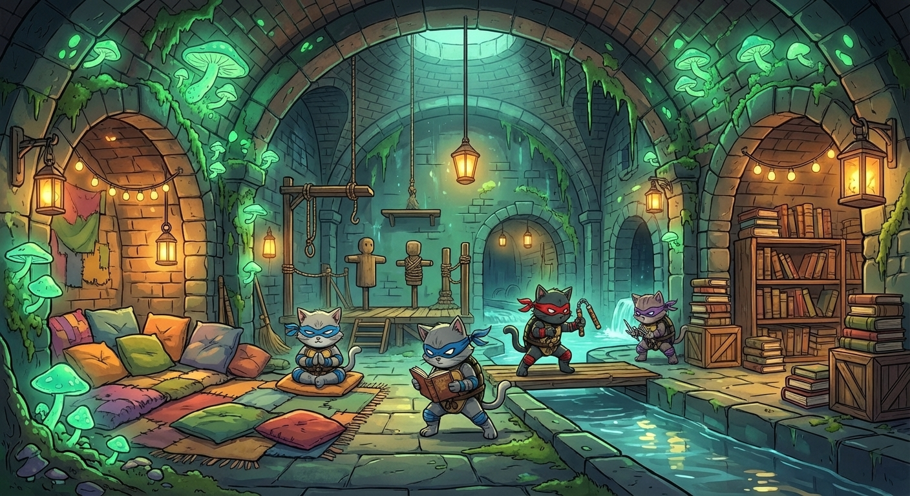

#### Setting: rooftops

**Prompt:**

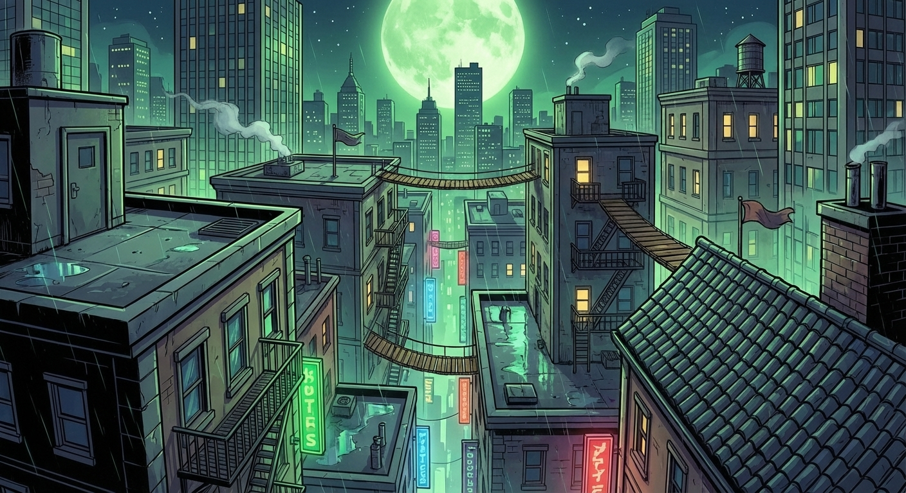

#### Setting: city_streets

**Prompt:**

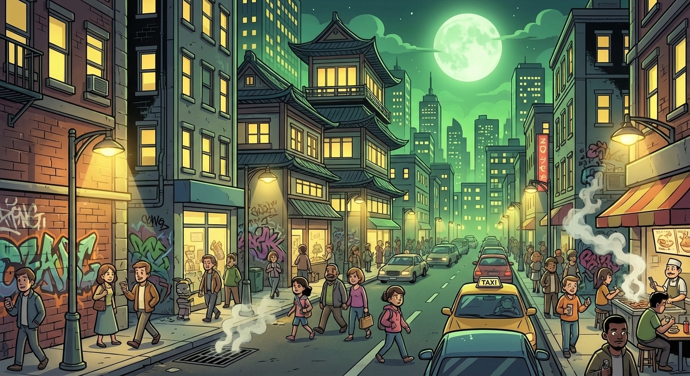

#### Setting: abandoned_warehouse

**Prompt:**

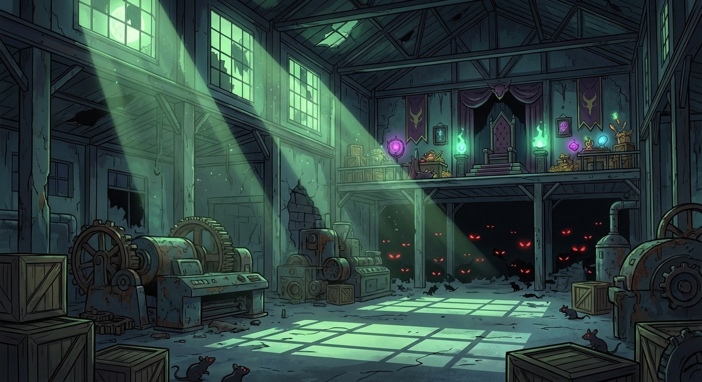

#### Setting: library_district

**Prompt:**

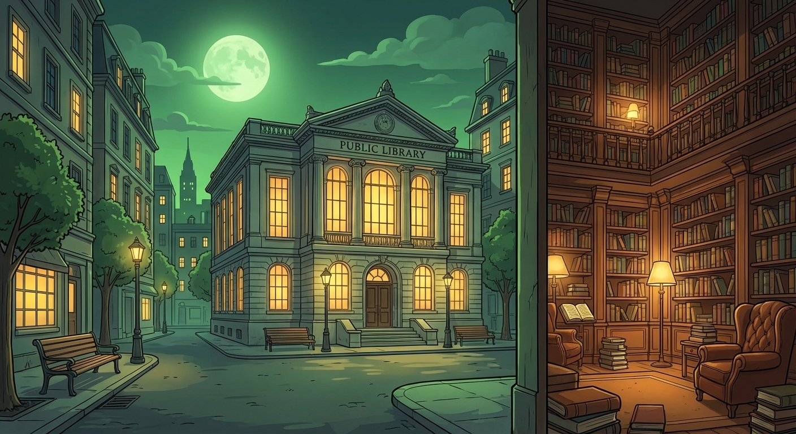

#### Character: WHISKER

**Prompt:**

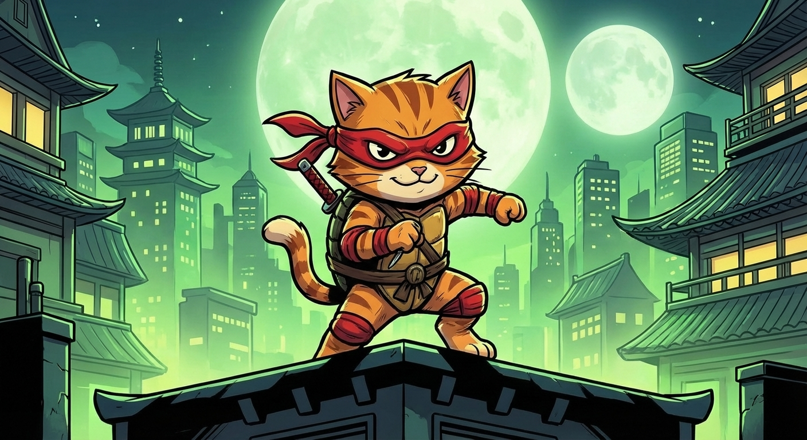

#### Character: SHADOW

**Prompt:**

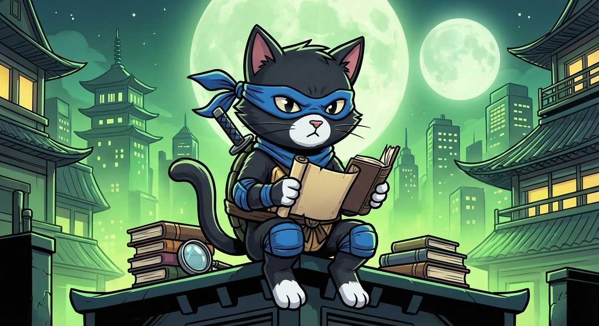

#### Character: POUNCE

**Prompt:**

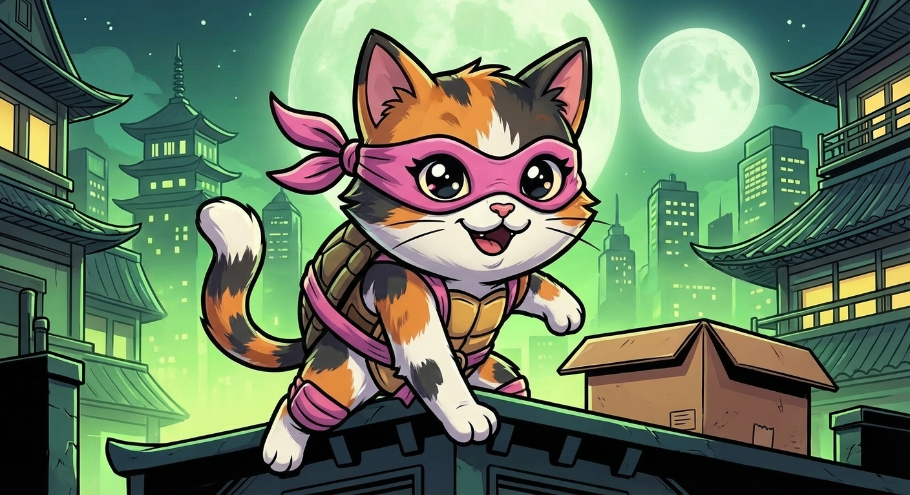

#### Character: ZIGZAG

**Prompt:**

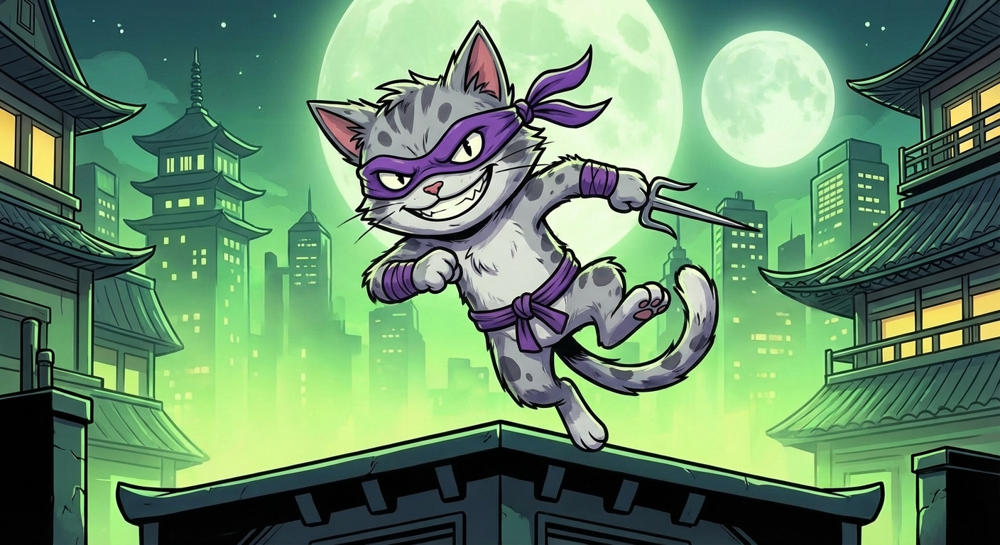

#### Character: MASTER WHISKERS

**Prompt:**

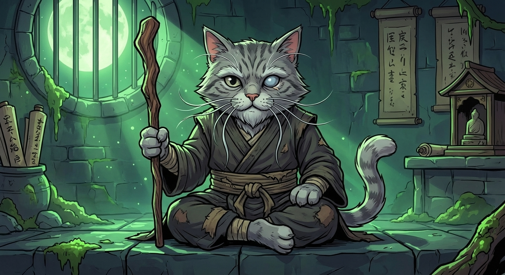

#### Character: PROFESSOR WHISKER

**Prompt:**


#### Character: SHADOW PAWS

**Prompt:**

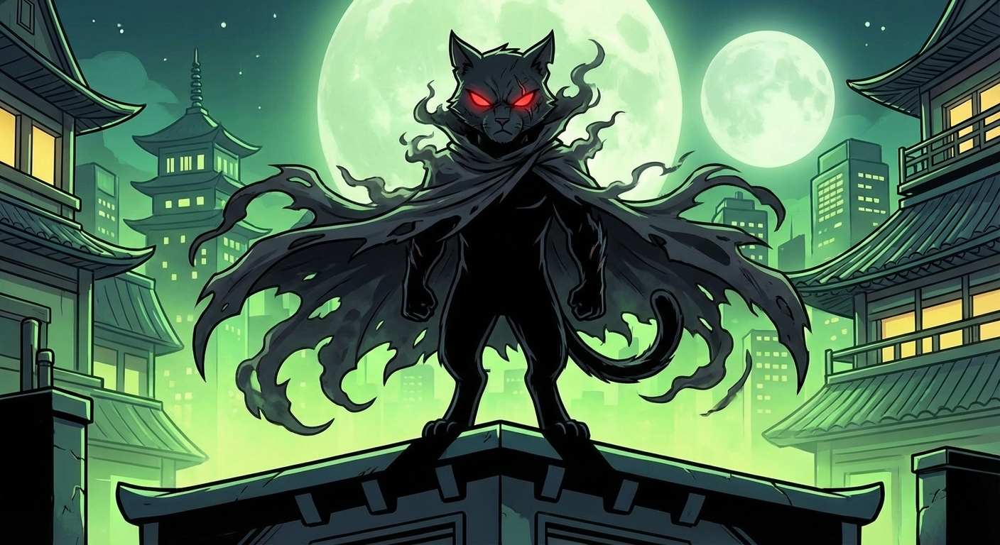

#### Character: THE SHADOW RATS

**Prompt:**

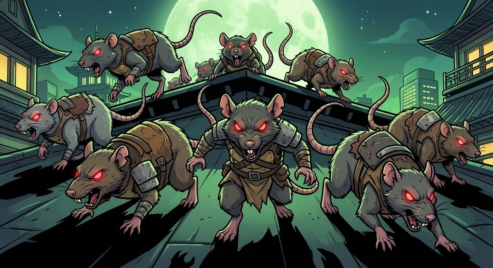

## ## FOUR PATHS CONVERGE

**Act 1, Scene 1**

**Setting:** city_streets, library_district, rooftops, sewers

**Characters:** Whisker, Shadow, Pounce, Zigzag, Master Whiskers, Professor Whisker

---

# Act 1, Scene 1: FOUR PATHS CONVERGE

The city sprawled beneath a bruised evening sky—amber streetlights bleeding into lengthening shadows like watercolor
bleeding through wet paper. In the library district, dust motes danced through tall windows in golden spirals. In the
alleys, rain-wet concrete mingled with the copper-sweet stench of overturned garbage. On the rooftops, wind carried the
promise of something unnamed—a pressure change, a shift in the city's breath. And in the sewers below, in the deep
forgotten places where the city's heartbeat echoed through ancient pipes, something ancient stirred.

Four kittens, unaware of each other's existence, were about to discover that destiny rarely announces itself politely.

---

## WHISKER: THE ALLEY

The alley behind Moretti's Deli was narrow enough that a kitten could touch both brick walls if he stretched. Whisker
didn't stretch. He crouched instead, gray tabby fur bristling like a porcupine's quills, amber eyes fixed on the three
larger cats blocking his path.

The scarred tom stepped forward, his folded ear catching the streetlight like a broken hinge. "Well, well. Little
Whisker, thinking he owns these streets."

Whisker's whiskers—long and sensitive as violin strings—twitched with barely contained fury. The sensation traveled down
his spine, a physical manifestation of rage he'd learned to weaponize. "I don't own anything. I just walk where I want."

"Not anymore," said the Siamese, her voice smooth as silk and twice as cutting. Claws caught light as she extended them,
a casual threat. "This is our territory. Pay the toll, or we make you pay it."

The third cat cracked his neck. The sound echoed like a threat, like a promise.

Whisker had always been small. His mother had worried about it, back when he'd had a mother—back before the streets had
claimed her, before he'd learned that worry was a luxury only the safe could afford. But what he lacked in size, he'd
learned to make up for in speed and cunning. He'd watched the older cats, studied their movements the way a scholar
studies texts, understood in his bones that strength wasn't always about muscle. It was about knowing where your
opponent would be before they knew themselves.

"I'm going to walk past you now," he said, his voice steady as stone, steady as the bedrock beneath the city.

The scarred tom laughed—harsh and barking, the sound of gravel in a throat. But Whisker was already moving.

He didn't charge forward. Instead, he leaped straight up, impossibly light, his small body defying gravity through sheer
will and desperation. His claws found purchase in the mortar lines between bricks, and he scrambled upward with the
frantic energy of a creature who'd learned that hesitation meant pain. The scarred tom swiped at empty air, his claws
whistling through the space where Whisker had been a heartbeat before.

Whisker twisted mid-climb, launching himself sideways onto a fire escape with a clang of metal. He bounded up the steel
stairs—rapid-fire percussion of tiny claws on steel, a rhythm that echoed through the alley like a warning bell. Behind
him, he heard cursing, the sound of larger bodies attempting to follow, failing.

"Get back here!" one yelled, but Whisker was already three stories up, silhouetted against the darkening sky, his heart
hammering with pure exhilaration. The city spread beneath him like a map of possibility, and for a moment—just a
moment—he felt like he could touch the clouds.

He paused on the landing, breathing hard, his small chest heaving. His paws trembled with adrenaline and something
else—something he couldn't name. When he looked back down, the three cats had given up, already hunting easier prey.
Whisker felt something then—not quite satisfaction, not quite emptiness. It was the feeling of being alone in a city of
millions, of being separate from everything around him. But there was something else too, a pull like a thread tied
around his heart, drawing him toward the center of the city. Toward something he couldn't name but somehow recognized.

He felt pulled toward the center. Toward something that felt like destiny.

---

## SHADOW: THE LIBRARY

The library's reading room was a cathedral of knowledge—soaring ceilings that seemed to stretch toward infinity,
mahogany shelves that held the accumulated wisdom of centuries. Afternoon light fell through tall windows in golden
rectangles, illuminating dust motes that drifted like tiny planets in an indoor cosmos. Shadow, a sleek black kitten
with eyes like polished obsidian, sat curled in one of these rectangles of light, her nose buried in a book far too
large for her frame: *The Philosophy of Inner Strength: Ancient Wisdom for Modern Warriors*.

The pages were worn from handling, the margins filled with notes in careful paw-script. She'd read this book three times
already, but each reading revealed new layers, new meanings hidden beneath the surface like stones beneath water.

"You're going to hurt your eyes," said a gentle voice.

Shadow looked up to find Professor Whisker, the elderly tabby librarian, peering over his spectacles. He was the sort of
cat who'd never questioned why a young kitten spent her afternoons here instead of playing with others, chasing
sunbeams, engaging in the frivolous pursuits of youth. He'd simply accepted her presence the way one accepts rain—as a
natural part of the world's order.

"I'm almost done with this chapter," Shadow said softly, her voice barely above a whisper. She'd learned early that
quiet voices drew less attention, caused less disruption.

"You've been reading about martial arts philosophy for three weeks now," the old cat observed, settling into the chair
beside her with a soft groan. His joints creaked like old floorboards. "Searching for something?"

Shadow considered this carefully, turning the question over in her mind like a stone in a stream. She'd been abandoned
as a kitten, left in a cardboard box outside this very library on a cold morning in March. She remembered the cold,
remembered the fear, remembered the moment Professor Whisker had found her and brought her inside. He'd given her a home
in the back office, surrounded by books and the smell of old paper and possibility. He'd also given her access to every
book in the building, and she'd devoured them all—stories of heroes and warriors, tales of discipline and honor,
philosophies of balance and purpose.

"I think," she said slowly, choosing each word with precision, "I'm searching for a reason to be strong."

The old cat's eyes grew soft, the way they always did when he looked at her. "Strength without purpose is just violence,
little one. But purpose without strength..." He trailed off, looking out at the city beyond the windows, at the streets
and buildings and lives unfolding beyond their sanctuary. "Well, that's just a dream. And dreams don't save anyone."

Shadow returned to her book, but the words blurred before her eyes. She felt it then—a pull like a thread tied around
her heart, drawing her toward something beyond these walls. Toward the city center. Toward something that felt like
destiny. She'd never believed in destiny before. Destiny was something that happened to other cats, to the heroes in her
books. But she'd never felt anything quite like this—a certainty that seemed to come from somewhere deeper than thought,
from the very core of her being.

She closed the book gently and stood, her movements fluid and controlled. "Professor, I need to go out for a while."

The old cat didn't seem surprised. Perhaps he'd been expecting this. "Be careful, little one. The city has teeth."

"I know," Shadow said. And she did.

---

## POUNCE: THE ALLEY

The cardboard box had once held a refrigerator. Now it held Pounce, and that was infinitely more valuable than any
appliance. She'd decorated it with the treasures of her life: a bottle cap that caught the light like a jewel, a length
of red string wound into an intricate pattern, a newspaper clipping about a cat who'd saved a child from a burning
building. The walls were soft from being slept against, worn smooth by her small body, and the whole thing smelled like
home—like her own fur and the faint scent of the alley and possibility.

Pounce was orange and white, with a perpetually surprised expression and a tail that never stopped moving. She found joy
in small things: a sunbeam warming her fur, a rustling leaf, the way raindrops sounded on cardboard like tiny applause.
She'd never had much, but she'd never felt like she was missing anything.

Until today. She'd woken from her afternoon nap with a strange sensation in her chest—not pain, but a kind of ache. A
longing for something she couldn't name, something that pulled at her from the direction of the city center. She'd paced
the alley for an hour, her tail twitching with agitation, unable to settle back into her box. The feeling only grew
stronger, more insistent, like a voice calling her name from very far away.

The pull was strongest toward the city center. Pounce had never ventured that far from her alley. The city center was
where the big cats lived, where humans were thick as fleas, where everything moved too fast and too loud. It was a place
of danger and noise and overwhelming sensation. But the pull was insistent, almost physical, drawing her forward despite
her fear.

She poked her head out of her box and looked up at the sky. The sun was setting, painting the clouds in shades of orange
and purple and deep crimson—colors that seemed to pulse with meaning. It was beautiful. It was terrifying. It was
calling.

"Well," Pounce said to herself, her voice small but determined, "I guess I'm going for a walk."

She stepped out of her box and began moving through the alley, her small paws clicking against wet concrete. Behind her,
the box seemed to shrink, to become less real, as if it belonged to a different version of herself—a version that no
longer existed.

---

## ZIGZAG: THE ROOFTOPS

Zigzag was a blur of motion—a calico kitten with too much energy and not enough sense of self-preservation. She launched
herself from one fire escape to another, her small body impossibly agile, her movements a chaotic dance of parkour and
pure joy. The city was her canvas, and she was painting it with her own trajectory.

"Wheeeee!" she yowled, not caring who heard, not caring about anything except the rush of wind and the moment of
weightlessness between one surface and the next.

The city was her playground, and the rooftops were her kingdom. She'd discovered parkour by accident—being chased by a
dog and having to improvise, having to find pathways that didn't exist until she created them. But what had started as
survival had become art, had become the only way she knew how to be alive.

She could read the city's geometry in a way others couldn't, seeing pathways where others saw only obstacles. A gap
between buildings was an opportunity for a flying leap. A drainpipe was a ladder. A clothesline was a tightrope. The
city spoke to her in a language of angles and distances and possibilities.

Zigzag had never had a home, never had a family, never had anything resembling a normal kitten life. But she'd never
wanted one. She wanted this—the wind in her fur, the rush of adrenaline, the feeling of her body doing impossible
things, of transcending the limitations of her small frame through sheer will and momentum.

She was in the middle of a particularly ambitious jump—from a water tower to a neighboring building, at least eight
feet, with a three-story drop below—when she felt it. A sudden, overwhelming pull, like gravity had shifted direction.
She landed hard on the opposite roof, tumbling across the gravel, her breath knocked from her lungs.

She lay there for a moment, gasping, her heart hammering. The pull was still there, stronger now, almost overwhelming.
It was coming from the city center, from somewhere deep below the streets, from the very bones of the earth. Zigzag had
never been one to question her instincts. They'd kept her alive this long, and they'd never steered her wrong.

She scrambled to her feet and began racing across the rooftops, heading toward the source of that inexplicable pull. The
city blurred beneath her paws, and for the first time in her life, she felt like she was running toward something
instead of away from it.

---

## CONVERGENCE: THE GRATE

The sewer entrance was unremarkable—just a grate in the street, surrounded by urban detritus. A discarded soda can. A
lost shoe. A crumpled receipt. The kind of place humans walked past without seeing, without registering, without
understanding that it was a threshold between worlds. But the four kittens converged on it as if drawn by an invisible
thread, as if the city itself had woven them together and was now pulling them toward their meeting.

Whisker arrived first, having taken the rooftop route. He crouched beside the grate, amber eyes studying the darkness
below. He could hear water, the distant echo of pipes, and something else—something that sounded almost like singing,
like a voice calling from the depths of the earth.

Shadow appeared next, having left the library without explanation, moving through the streets with purpose and grace.
She sat beside Whisker, her black fur blending into the shadows, her dark eyes reflecting the last light of the setting
sun. She didn't speak, but her presence was a comfort—steady, certain, grounded.

"You feel it too?" Whisker asked, not taking his eyes off the grate.

"Yes," Shadow said simply. "I don't know what it is, but—"

"It's calling us," Shadow finished, and Whisker realized she'd been about to say the same thing.

Pounce bounded around the corner, her orange and white fur bright against the darkening street. She skidded to a stop
when she saw the other two kittens, her eyes wide with surprise and recognition. She'd never met them before, but she
knew them somehow, knew them in the way one knows a song heard in a dream.

"Oh! Are you—are you feeling it too? The thing? The pull?" Her tail swished with nervous energy, betraying her
excitement despite her uncertainty.

"The thing," Whisker repeated, a hint of amusement in his voice despite his nervousness. "Very technical."

"I like it," Pounce said earnestly. "It's got alliteration."

Zigzag arrived in a blur of motion, literally sliding across the pavement before coming to a stop beside the grate. She
was breathing hard, her eyes bright with the thrill of the chase.

"Okay, so I'm not crazy. There's definitely something down there. Something big. Something—" She paused, searching for
the word. "Something alive."

"Magical," Shadow said softly, and the word hung in the air between them like a truth they'd all been waiting to hear.

The four kittens looked at each other. None of them had ever met before, yet they felt connected by something deeper
than friendship, older than understanding. Strangers bound by a common purpose they couldn't yet comprehend. They were
different in every way—different colors, different sizes, different temperaments—and yet they fit together like pieces
of a puzzle that had been waiting for them to arrive.

"Well," Pounce said, her tail swishing with nervous energy, "I guess we're going down there?"

Whisker looked at the darkness below, at the stone steps descending into shadow. Every instinct screamed at him to be
cautious, to wait, to understand what he was walking into. But there was something else too—something that felt like
rightness, like inevitability.

"I guess we are," he said.

Shadow reached out and gripped the grate with her claws. It lifted easily—too easily, as if it had been waiting for
them, as if it had been expecting their arrival. A set of stone steps descended into darkness, and the pull became
almost overwhelming, a physical force drawing them downward like gravity itself had been redirected.

They descended together, four small kittens in a vast city, moving toward a destiny they couldn't yet imagine. Behind
them, the grate settled back into place with a soft click, as if sealing a door between worlds.

---

## THE CHAMBER

The chamber beneath the city was impossible. It shouldn't have existed—not in the space between the sewer pipes, not in
the heart of the urban sprawl, not in a city built on concrete and steel and the accumulated weight of human ambition.
Yet here it was: a vast underground cavern lit by bioluminescent fungi glowing in shades of blue and green and violet.
The walls were carved with symbols that seemed to shift when you looked at them directly, rearranging themselves into
new patterns, new meanings. And in the center was a pool of water so clear it looked like liquid crystal, reflecting
light that came from nowhere and everywhere at once.

Standing beside the pool was a cat unlike any they'd ever seen.

Master Whiskers was ancient—that much was immediately apparent. His fur was silver as moonlight, his eyes gold as
sunrise, and he moved with the grace of a creature who'd transcended the normal limitations of age. He wore robes of
deep blue silk embroidered with symbols matching those on the walls, and around his neck hung a pendant that glowed with
soft, inner light. When he moved, the air seemed to shimmer around him, as if reality itself bent to accommodate his
presence.

"Welcome," he said, his voice like distant thunder, like wind through bamboo, like the echo of centuries compressed into
a single moment. "I have been waiting for you."

The four kittens froze, their earlier confidence evaporating like morning mist. Whisker's paw instinctively went to a
defensive position, his muscles coiling. Shadow's eyes narrowed, assessing, calculating. Pounce's tail puffed to twice
its normal size. Zigzag, for perhaps the first time in her life, was completely still.

"Who are you?" Shadow asked, her voice steady despite her fear. She stepped forward slightly, positioning herself
between the ancient cat and her companions. It was an instinctive gesture, a natural assumption of leadership.

"I am Master Whiskers," the ancient cat replied, and his name seemed to resonate through the chamber, echoing off the
stone walls. "And you are the ones I have chosen."

"Chosen for what?" Whisker demanded, his voice sharp as broken glass. "We don't know you. We don't know anything about
this place."

Master Whiskers gestured to the pool, and the water rippled in response, though nothing had touched it. "For
transformation. For purpose. For heroism."

"We're just kittens," Pounce said, her voice small and uncertain. "We're not heroes. We're not anything."

"Not yet," Master Whiskers agreed, and there was something in his tone that suggested he understood more than they'd
told him, that he could see into the depths of their hearts and understand their fears. "But you will be. Each of you
possesses qualities the city desperately needs. Whisker, you have courage and cunning—the ability to see pathways others
cannot. Shadow, you have discipline and wisdom beyond your years—the strength to stand firm when others falter. Pounce,
you have hope and joy in a world that often lacks both—the ability to inspire others to believe in possibility. And
Zigzag, you have adaptability and fearlessness—the ability to move where others cannot."

Zigzag puffed out her chest, her earlier fear giving way to pride. "I knew I was special."

"The city faces a great darkness," Master Whiskers continued, his expression growing grave. The light from the
bioluminescent fungi seemed to dim, as if responding to the weight of his words. "A villain named Shadow Paws has
risen—a cat consumed by rage and vengeance, determined to destroy everything in his path. He grows stronger each day,
feeding on the city's pain and fear. Soon, very soon, he will strike. The city's defenders are powerless against him.
But you four, united as one, might have a chance."

"You want us to fight a villain?" Whisker said incredulously. "We're kittens. We can barely fight each other."

"Not yet," Master Whiskers said. "But you will learn. I will teach you. And this—" he gestured to the pool, and the
water glowed brighter in response, "—this will give you the power to do what must be done."

Shadow stepped forward, her curiosity overcoming her caution. She'd spent her life reading about warriors and heroes,
about the transformation that came from discipline and purpose. This was real. This was happening. "What is it?"

"The Pool of Transformation," Master Whiskers said. "Ancient magic, older than the city itself, older than the stones
beneath our paws. It will awaken the warrior within each of you, grant you abilities beyond normal feline comprehension,
and bind you together as a team. But be warned—the transformation is not without cost. You will never be ordinary again.
You will carry the weight of this city's safety on your shoulders. You will bear burdens that others cannot imagine."

The four kittens exchanged glances. Whisker saw his own uncertainty reflected in the others' eyes—the fear, the doubt,
the terrible weight of choice. This was too much, too fast, too impossible. And yet... each of them had felt the pull.
Each of them had sensed they were meant for something more. Each of them had felt, in their own way, that they'd been
waiting for this moment their entire lives.

"If we do this," Shadow said slowly, stepping closer to the pool, "we do it together. All four of us. No one left
behind. No one sacrificed."

"Agreed," Whisker said, and he meant it with every fiber of his being.

"Totally agreed," Zigzag added, bouncing with excitement despite the gravity of the moment. "This is going to be
amazing."

Pounce nodded, her small face set with determination. "Together," she said. "We do this together."

Master Whiskers smiled, and it was like watching the sun rise after an endless night. "Then let us begin."

---

## THE TRANSFORMATION

The four kittens approached the pool together, their paws clicking against stone in a rhythm that seemed to match the
beating of their hearts. The water's surface rippled at their approach, though nothing had touched it. The symbols on
the walls began to glow brighter, pulsing with a rhythm that matched their heartbeats, as if the chamber itself was
alive and aware of their presence.

"Enter the water," Master Whiskers instructed, his voice gentle but firm. "Let it embrace you. Do not resist. Do not
fear. Simply be."

Whisker went first, because that was his nature—to lead, to take the risk, to step into the unknown so others might
follow. He stepped into the pool, and the water was warm as blood, as welcoming as a mother's embrace. It rose around
him, and he felt something shifting inside him, something awakening. His muscles grew stronger, his senses sharper. He
could see in the darkness now, could hear the heartbeat of every creature in the chamber, could feel the very stones
beneath the city singing their ancient songs. His mind expanded, and he understood things he'd never known before—the
geometry of combat, the flow of energy, the way to move through space with perfect efficiency.

Shadow followed, and the water seemed to recognize her, to welcome her home. She felt clarity flooding through her, a
perfect understanding of balance and purpose. Her mind became a weapon as sharp as any claw, her body a perfect
instrument of discipline and control. She could see the flow of energy through all things, could understand the patterns
that governed existence, could perceive the connections between all living creatures.

Pounce entered the water with a joyful splash, and instead of being overwhelmed, she felt expanded. Her small body grew
stronger, but more than that—she felt connected to something vast and beautiful. She could sense the emotions of those
around her, could feel the hope and fear and determination of her companions as if they were her own. She understood, in
that moment, that strength wasn't just physical—it was emotional, spiritual, the ability to inspire others to believe in
themselves.

Zigzag dove in with characteristic recklessness, and the water caught her, held her, transformed her. Her already
impressive agility became something transcendent. She could move faster than thought, could see pathways through space
that others couldn't perceive. Her body became a blur of controlled chaos, a living embodiment of motion itself. She
understood that the city was a three-dimensional puzzle, and she alone could navigate it in ways others couldn't
imagine.

The water glowed brighter, and the symbols on the walls blazed with light so intense it seemed to burn. The four kittens
rose from the pool, and they were changed. They were still kittens—still small, still young—but there was something
different about them now. Something that made the air around them shimmer with possibility. Their fur seemed to glow
with inner light. Their eyes held the wisdom of ages. They moved with a grace and power that belied their size.

When they stepped out of the water, they were no longer the same creatures who'd entered it. They were more. They were
warriors.

Master Whiskers nodded in satisfaction, and there was something like pride in his ancient eyes. "It is done. You are no
longer ordinary kittens. You are warriors. You are protectors. You are the Teenage Mutant Ninja Kittens."

"That's a terrible name," Whisker said, but he was grinning, and the others could feel his joy radiating through the
chamber like light.

"I like it," Pounce said earnestly. "It's got alliteration. And it's memorable."

"It's got pizzazz," Zigzag agreed, doing a backflip that defied the laws of physics. She landed perfectly, her movements
fluid and controlled in a way they'd never been before.

Shadow was studying her paws, flexing them experimentally. She could feel the power flowing through her, could sense the
potential in every muscle and nerve. "What happens now?"

"Now," Master Whiskers said, "you train. You learn to work together, to trust each other, to master the abilities that
have awakened within you. And you prepare for the coming darkness."

"Shadow Paws," Whisker said, remembering the name, understanding its weight.

"Yes," Master Whiskers confirmed, and his expression grew dark. "He grows stronger each day. Soon, he will make his
move. And when he does, the city will need you."

A sound echoed through the chamber then—a distant, terrible sound. Like the roar of a beast, like the scream of tearing
metal, like the cry of a city in pain. All four kittens felt it, a spike of fear and wrongness that made their new
instincts scream in warning. The bioluminescent fungi dimmed, as if recoiling from the sound.

"What was that?" Pounce whispered, her newfound confidence shaken.

Master Whiskers' expression grew darker still. "That was a warning. Shadow Paws is already moving. The time of
preparation is shorter than I hoped. Much shorter."

Whisker felt something crystallize inside him—a sense of purpose, of destiny, of rightness. He looked at his three
companions, these strangers now bound to him by magic and fate and shared transformation. They were different in every
way, and yet they fit together perfectly, like pieces of a puzzle that had been waiting for them to arrive.

"Then we'd better get to work," he said.

Shadow nodded, her dark eyes reflecting the glow of the chamber. Pounce straightened her shoulders, drawing on reserves
of courage she didn't know she possessed. Zigzag stopped bouncing and focused, her eyes serious for perhaps the first
time in her life.

"We're ready," Shadow said, and it wasn't a question. It was a statement of fact, a declaration of purpose, a promise to
each other and to the city that had called them here.

Master Whiskers smiled, but this time there was sadness in it—the sadness of one who knows what trials lie ahead, who
understands the cost of heroism, who has seen too much and lived too long. "Come," he said. "Let me show you your new
home. Let me teach you what you need to know. The city's fate rests in your paws."

The four kittens followed their mentor deeper into the chamber, leaving the pool behind. The water settled, its surface
becoming mirror-smooth once more, reflecting the light of the bioluminescent fungi. Above them, in the city streets,
night was falling. Somewhere in the darkness, a shadow moved with purpose and malice, growing stronger with each passing
moment. But in the chamber beneath the city, four young warriors had found their purpose. They had found each other. And
they had found the strength to face whatever darkness lay ahead.

The real adventure was only just beginning.

---

**Word Count:** 4759

**Key Moments:**

- Whisker proves his courage and cunning by escaping three larger cats through acrobatic skill and quick thinking in the
  alley
- Shadow discovers her purpose while reading martial arts philosophy in the library, feeling called toward something
  greater
- Pounce awakens to a mysterious pull from her cardboard box home and ventures into the city for the first time
- Zigzag experiences an overwhelming pull while performing parkour on the rooftops, drawn toward the city center
- All four kittens converge at the sewer entrance, meeting each other for the first time and recognizing an inexplicable
  kinship
- Master Whiskers reveals himself and explains that the four kittens have been chosen to become warriors to fight the
  villain Shadow Paws
- The four kittens enter the Pool of Transformation and emerge as the Teenage Mutant Ninja Kittens with enhanced
  abilities
- A terrible sound echoes through the chamber, warning that Shadow Paws is already moving and time is running out
- The four kittens commit to working together and follow Master Whiskers to begin their training

**Character States:**

- **Whisker:** Transformed and purposeful, natural leadership instincts confirmed. Physically enhanced with greater
  strength and sensory awareness. Determined and ready to lead despite the magnitude of the challenge ahead.
- **Shadow:** Philosophical quest answered; found the purpose she was searching for. Discipline and wisdom validated and
  amplified by transformation. Focused and committed, carrying the weight of responsibility with grace.
- **Pounce:** Exhilarated and validated; instincts led her to something wonderful. Emotional heart of the group, feeling
  connections between companions. Excited, hopeful, and deeply bonded to her new team.
- **Zigzag:** In her element with natural talents amplified to superhuman levels. Thrilled by new abilities and
  validation that her recklessness was genius. Exhilarated and focused while maintaining playful nature.
- **Master Whiskers:** Satisfied that chosen warriors have accepted their destiny. Wise and patient but increasingly
  concerned about timeline. Hopeful but worried, determined to prepare students quickly as Shadow Paws activity
  intensifies.

**Status:** ✅ Complete

#### Act 1, Scene 1 Image

**Prompt:**

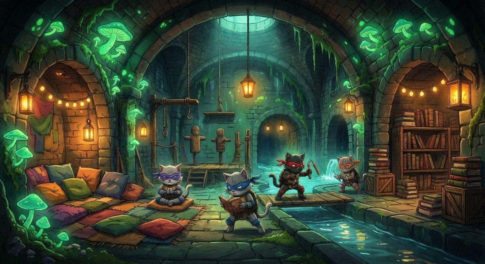

## ## THE DOJO AWAKENS

**Act 2, Scene 1**

**Setting:** sewers (main training chamber)

**Characters:** Whisker, Shadow, Pounce, Zigzag, Master Whiskers, Professor Whisker

---

# Act 2, Scene 1: THE DOJO AWAKENS

The main training chamber of the sewers bore no resemblance to Whisker's imagined dojo.

He'd pictured something grand—soaring ceilings adorned with painted scrolls, polished wooden floors gleaming beneath
lantern light, perhaps a few tasteful bonsai trees in the corners. Instead, Master Whiskers had led them to a vast
underground cavern where moisture wept from stone walls and the air tasted of minerals and deep time. Bioluminescent
fungi clung to the rocky surfaces like living constellations, casting everything in ethereal blue-green light that
seemed to pulse with the cavern's own heartbeat. The floor was packed earth, worn smooth by centuries of footfalls.
Water dripped from stalactites in a rhythm that mimicked a heartbeat—steady, patient, eternal.

It was, Whisker had to admit, absolutely perfect.

"Welcome," Master Whiskers said, his voice echoing off cavern walls as the four kittens stood marveling at their
transformed bodies, "to your new home."

The old cat moved with surprising grace, his whiskers twitching with amusement as he gestured broadly at the space
before them. "This chamber has trained warriors for three centuries. The stone remembers their footsteps. The air
carries their determination. Now it will remember yours."

Whisker felt something flutter in his chest—pride, perhaps, or the weight of expectation settling like a stone. He
glanced at his companions. Shadow stood with perfect posture, her dark fur absorbing the bioluminescent light, her eyes
already scanning the space with tactical precision. Pounce bounced slightly on her hind legs, her orange tabby stripes
practically vibrating with excitement. Zigzag had already begun exploring, her sleek gray form darting between shadows,
testing her new reflexes against uneven terrain.

"Four stations," Master Whiskers continued, pointing with one weathered paw. "Four paths to mastery. But first, you must
understand something fundamental."

He turned to face them fully, and his ancient eyes seemed to contain entire libraries of knowledge—centuries of
victories and defeats, wisdom earned through blood and sacrifice. "You are not four separate warriors. You are one team.
Your strength lies not in individual prowess, but in how you move together, how you trust each other, how you complement
each other's weaknesses with your own strengths. This is what Shadow Paws has never understood. This is what will be
your greatest advantage."

"So we're like... a squad?" Zigzag called out, still mid-exploration, her tail swishing with enthusiasm.

"You are a family," Master Whiskers corrected gently. "Now come. We begin with balance."

---

The balance beam was nothing more than a fallen log suspended between two stone pillars, positioned over shallow water
that reflected the fungi's ethereal glow. It looked deceptively simple—until you tried to walk it.

Whisker went first, driven by instinct to lead. His new muscles responded with surprising coordination as he placed one
paw before the other. The beam wobbled beneath his weight, and instinctive panic rose in his throat before his enhanced
reflexes kicked in. His tail extended automatically, counterbalancing his weight with fluid precision. He crossed in
seven careful steps, landing on the far platform with a small spray of water.

"Good," Master Whiskers nodded. "You trust your instincts. This is strength."

Shadow approached next, moving with deliberate slowness, her eyes closed. Whisker blinked in surprise. How could she
possibly navigate blind? But she did, each step perfectly placed, her body moving with mathematical precision even
without sight. She reached the other side without a single wobble, her breathing steady and controlled.

"You think before you act," Master Whiskers observed. "This is wisdom."

Pounce practically danced across, her movements joyful and fluid, adapting to each micro-shift of the beam with
infectious enthusiasm. She laughed as she bounded the final steps, her whole body expressing pure delight in the
challenge. The sound echoed through the cavern like music.

"You feel the moment," Master Whiskers said, a smile touching his ancient face. "This is presence."

Zigzag, however, had other ideas entirely.

Instead of walking across, she launched into a series of flips and spins, using the beam as a springboard for
increasingly acrobatic maneuvers. Her movements were beautiful and reckless, a blur of orange and gray against the
blue-green light. Halfway through a particularly ambitious aerial twist, her hind paw caught the edge.

She plunged into the water with a spectacular splash that sent ripples across the shallow pool.

For a moment, there was silence. Then Zigzag surfaced, sputtering and shaking water from her fur, her expression caught
between mortification and defiance. Water streamed from her whiskers.

"That," Master Whiskers said calmly, "was reckless."

"That was creative," Zigzag shot back, paddling toward the edge with jerky, angry strokes. "I was trying something new."

"You were showing off," Shadow said, her tone matter-of-fact rather than cruel. "The beam is about control and focus.
Not impressing anyone."

Zigzag's ears flattened against her head. "Oh, I'm sorry, did my fun bother your meditation?"

"Your recklessness could get us all killed," Shadow replied coolly, turning away.

"Your rigidity could bore us all to death first," Zigzag countered, hauling herself out of the water with as much
dignity as a soaked kitten could muster. Water dripped from her tail, pooling at her feet.

Whisker felt the tension spike between them like a physical thing, sharp and electric. He opened his mouth to intervene,
but Master Whiskers raised a paw, silencing him with a gesture.

"Enough," the old cat said, not unkindly. His voice carried the weight of authority earned through decades of
leadership. "You will learn that all approaches have value. Shadow's discipline and Zigzag's creativity are not
opposites—they are complements. Come. The obstacle course awaits."

---

The obstacle course sprawled across a quarter of the cavern, a labyrinth of challenges constructed from every scrap of
material the sewers could provide. Rope climbs and wall runs, narrow passages and wide jumps, spinning platforms and
swinging pendulums. It looked less like a training course and more like the fever dream of an ambitious
architect—dangerous, intricate, and somehow beautiful in its complexity.

"You will each navigate this course," Master Whiskers explained, his tail swishing slowly. "Not to race, but to
discover. Pay attention to what comes naturally. Pay attention to what challenges you. This is how you will find your
specialty."

Whisker went first, driven by instinctive need to lead. He attacked each obstacle with focused intensity, his muscles
responding with newfound power. The wall run came naturally—his enhanced strength let him bound up the vertical surface
with explosive power, his claws finding purchase in stone. The rope climb was almost meditative, his muscles remembering
movements his kitten-self had never learned, his body moving with perfect synchronization.

But when he reached the combat dummy, something shifted inside him.

He didn't hesitate. He didn't calculate. He simply attacked.

His strikes were precise and devastating, each blow landing with perfect form. The dummy swung wildly, but he adjusted
his position with instinctive grace, finding angles that maximized impact. His breathing came hard and fast, his
movements a blur of controlled aggression. When he finished, breathing hard, his eyes were bright with discovery and
something darker—a hunger for combat he hadn't known he possessed.

"Offense," Master Whiskers murmured, his ancient eyes thoughtful. "You are a striker. A warrior of action and
aggression. This is your gift."

Shadow's approach was entirely different. She moved through the course with methodical precision, never rushing, never
wasting motion. At each obstacle, she paused, analyzing, planning, her mind working through problems before her body
attempted solutions. When she reached the combat dummy, she didn't attack it directly. Instead, she studied its
movement, its weight distribution, the way it swung. Then, with minimal effort, she struck at precisely the right
moment, using the dummy's own momentum against it. It spun wildly, but she'd already moved on, having learned what she
needed to know.

"Strategy," Master Whiskers said. "You see the whole picture. You understand systems and patterns. This is your gift."

Pounce moved through the course with pure joy, her approach almost playful. She didn't attack obstacles so much as dance
with them, finding harmony in challenge. When she reached the combat dummy, she didn't strike it—she embraced it,
rolling with its momentum, adapting her body to its movements, finding grace rather than conflict. Her laughter echoed
through the cavern.

"Adaptation," Master Whiskers observed. "You flow like water. You find the path of least resistance and make it your
strength. This is your gift."

Zigzag did something completely unexpected.

She approached the course like it was a playground designed specifically for her amusement, her earlier embarrassment
transformed into fierce determination. She took impossible routes—running along walls that weren't meant to be run on,
jumping gaps that seemed too wide, swinging from fixtures that looked far too fragile. Half the time, Whisker was
certain she would fall. But she didn't. She moved with such unpredictable energy, such chaotic grace, that the obstacles
seemed to rearrange themselves around her. She was a blur of motion, impossible to predict or counter, her movements
defying logic even as they achieved their purpose. When she reached the combat dummy, she simply moved around it in
patterns so erratic and unexpected that the dummy couldn't track her.

"Unpredictability," Master Whiskers said, and there was something almost like wonder in his ancient voice. "You are
chaos given form, but chaos with purpose. You are the element no one can anticipate. This is your gift."

---

The combat drills came next, and that's where everything fell apart.

Master Whiskers had them pair off—Whisker with Shadow, Pounce with Zigzag—for controlled sparring. The idea, he
explained, was to practice applying their newfound abilities in a controlled environment, to learn how their individual
strengths could complement each other.

Whisker and Shadow's match started well enough. Whisker came in with aggressive strikes, and Shadow responded with
defensive positioning, using his own momentum against him. It was almost like a dance, each learning the other's
patterns, finding rhythm in opposition.

But then Whisker got frustrated.

"You're not even trying," he snapped, after Shadow had dodged his fifth consecutive attack. His breathing came hard, his
muscles burning with unused aggression. "You're just blocking. Defending. Where's the offense?"

"Not everyone needs to be a berserker," Shadow replied coolly, sidestepping another strike with minimal effort. "Some of
us prefer to think before we act."

"Thinking doesn't win fights. Action does."

"Reckless action loses them."

They continued sparring, but the energy had shifted. What had been a learning exercise became something more
competitive, more personal. Whisker found himself pushing harder, trying to break through Shadow's defenses, while
Shadow became increasingly rigid, increasingly defensive, her movements losing their fluidity.

Across the cavern, Pounce and Zigzag's match had devolved into chaos.

"You're being too wild," Pounce said, laughing as she tried to keep up with Zigzag's erratic movements. But there was
strain beneath the laughter. "I can't even tell what you're going to do next."

"That's the point," Zigzag grinned, executing a particularly acrobatic flip. "Unpredictability is my thing, remember?"

"But we're supposed to be learning to work together," Pounce protested, still smiling but with frustration creeping in
at the edges. "How can we work together if I can't predict what you're going to do?"

"Maybe you need to be less predictable," Zigzag shot back, her tone sharper than intended.

The comment landed harder than intended. Pounce's ears flattened, and her movements became less fluid, less joyful. She
was trying too hard now, trying to match Zigzag's chaos instead of flowing with it, her natural grace replaced by forced
effort.

Master Whiskers watched in silence for several minutes, his ancient eyes missing nothing. Then he raised one paw, and
both matches stopped immediately.

The four kittens gathered before him, breathing hard, their fur slightly disheveled. Whisker could feel the tension
radiating off Shadow like heat. Pounce looked hurt, her usual brightness dimmed. Zigzag looked defensive, her tail
lashing.

"You are fighting each other," Master Whiskers said quietly, his voice carrying the weight of disappointment, "instead
of fighting alongside each other. This is the mistake that will destroy you."

He began to pace, his tail swishing slowly, deliberately. "Whisker, your strength is in offense. But offense without
strategy is merely violence. Shadow, your wisdom is in seeing patterns. But patterns without action are merely
philosophy. Pounce, your gift is adaptation. But adaptation without direction is merely chaos. Zigzag, your
unpredictability is powerful. But unpredictability without purpose is merely recklessness."

He paused, looking at each of them in turn, his gaze penetrating and kind. "Separately, you are four kittens with
interesting abilities. Together, you are something far greater. Whisker's offense guided by Shadow's strategy. Shadow's
strategy enabled by Pounce's adaptation. Pounce's adaptation protected by Zigzag's unpredictability. Zigzag's
unpredictability grounded by Whisker's focus. Do you understand?"

Whisker felt something shift in his chest, a realization settling like a key turning in a lock. He looked at Shadow,
really looked at her, and saw not a rival but a complement. He thought about how her defensive positioning had actually
made his strikes more precise, how her caution had prevented him from overextending into vulnerability.

"We need each other," Shadow said quietly, as if reading his thoughts. Her voice was steady, certain. "Not despite our
differences, but because of them."

"Yes," Master Whiskers nodded, and something like pride flickered across his ancient face. "This is the first lesson.
The most important lesson. Everything else flows from this understanding."

---

Professor Whisker arrived as the sun set above the city, casting long shadows through the cavern's upper vents. The
light turned the bioluminescent fungi a deeper shade of blue, almost purple.

He was younger than Master Whiskers, with a sleek white coat and barely contained excitement that seemed to radiate from
him like heat. He carried a large canvas bag that clinked and whirred with mysterious contents, his whiskers twitching
with anticipation.

"Ah, the new recruits!" he exclaimed, setting his bag down with a flourish that sent echoes bouncing through the
chamber. "Master Whiskers told me you'd be extraordinary, but the reality exceeds expectations. Four distinct energy
signatures, perfectly balanced. Remarkable!"

"Professor," Master Whiskers said warmly, "these are Whisker, Shadow, Pounce, and Zigzag. Young warriors, this is
Professor Whisker, our quartermaster and inventor. He has prepared equipment for each of you."

The Professor's eyes gleamed with pride as he began unpacking his bag with careful precision. For Whisker, he produced
reinforced gauntlets with retractable claws that caught the light like polished obsidian. For Shadow, a sleek utility
belt lined with pouches for tools and weapons, designed for minimal weight and maximum accessibility. For Pounce, a
lightweight harness designed to distribute impact across her body, allowing for greater freedom of movement. For Zigzag,
boots with enhanced grip and spring-loaded soles that seemed to hum with potential energy.

"These are prototypes," the Professor explained, helping each kitten into their gear with practiced efficiency. "I'll be
refining them as I learn more about your abilities. But they should give you some advantage in the field."

Whisker flexed his paws in the gauntlets, feeling how they responded to his movements with perfect synchronization. They
felt like extensions of himself, natural and right, as if they'd been waiting for him all along. Around him, the others
examined their equipment, their earlier tensions easing slightly in the face of this new excitement. Even Shadow's stern
expression softened as she tested the utility belt's mechanisms.

"You'll need to practice with these," the Professor continued, stepping back to admire his work. "They're tools, not
solutions. The real power comes from within you. These merely amplify what you already possess."

---

Evening had settled fully over the city by the time Master Whiskers dismissed them for rest. The four kittens made their
way through the sewers toward the sleeping quarters—comfortable alcoves the old cat had prepared for them, lined with
soft moss and warmed by proximity to the bioluminescent fungi. But as they passed through one of the main tunnels, a
sound stopped them cold.

It was a low, thrumming vibration that seemed to come from everywhere and nowhere at once. The bioluminescent fungi on
the walls flickered and dimmed, as if something had cast a shadow over them despite the absence of any visible light
source. The water in the channels stilled, as if holding its breath.

"What was that?" Pounce whispered, moving closer to Whisker. Her usual brightness had vanished, replaced by something
primal and fearful.

Master Whiskers, who had been following behind them, paused. His ancient face grew grave, his whiskers drooping
slightly. "Shadow Paws," he said quietly, his voice carrying the weight of old conflicts. "His darkness grows. He is
moving faster than I anticipated."

The vibration faded, but the chill it left behind remained, settling into their bones like winter.

---

Later, unable to sleep, Whisker found himself in the library corner of the main chamber—a small alcove where Master
Whiskers had collected scrolls and books over the centuries. The texts were ancient, their pages yellowed and fragile,
their wisdom accumulated through ages. Shadow was there, sitting in the soft glow of a bioluminescent lamp, reading a
text on ancient martial philosophy. Her dark fur seemed to absorb the light, making her appear almost ethereal.

She looked up as he approached, her eyes reflecting the gentle glow. "Couldn't sleep either?"

"Too much to process," Whisker admitted, settling beside her. The warmth of her presence was comforting. "A few hours
ago, I was just a kitten in an alley. Now I'm a ninja warrior with a destiny and a nemesis I've never met."

Shadow set down her scroll carefully, marking her place with a strand of silk. "I've been thinking about what Master
Whiskers said. About needing each other."

"Yeah?"

"I think he's right. But I also think..." She paused, choosing her words with characteristic care. "I think I was wrong
to dismiss your approach. Your aggression, your willingness to act—those aren't flaws. They're strengths. I was just
afraid of them because they're so different from how I operate."

Whisker felt something warm bloom in his chest, spreading through him like the bioluminescent fungi spreading through
the cavern. "I was wrong too. Your caution, your planning—I called it boring, but it's not. It's wisdom. And I need
that. We all do."

They sat in comfortable silence, watching the fungi glow softly in the darkness. The rhythm of dripping water provided a
gentle soundtrack to their thoughts.

"Do you think we can do this?" Whisker asked quietly, his voice barely above a whisper. "Do you think we can actually
stop Shadow Paws?"

Shadow considered the question seriously, her eyes distant and thoughtful. "I think we have to. And I think we can. But
only if we trust each other. Completely. Without reservation."

"Even Zigzag?"

A small smile touched Shadow's face, transforming her stern features. "Especially Zigzag. Her unpredictability is going
to be crucial. We just have to learn to dance with it instead of against it."

Whisker nodded, feeling the weight of responsibility settle more firmly on his shoulders. But it didn't feel crushing
anymore. It felt like something he could carry, as long as he wasn't carrying it alone. The knowledge that Shadow stood
beside him, that all of them stood together, made the burden bearable.

---

In an abandoned warehouse on the other side of the city, Shadow Paws watched through a grimy window as the last light
faded from the sky. His form was barely visible in the darkness—a silhouette of malice and hunger, his eyes glowing with
an inner fire that had nothing to do with warmth. The shadows around him seemed to move of their own accord, responding
to his presence like living things.

He had felt them, the four young warriors, awakening in the sewers below. He had felt their transformation, their
training, their growing bond. It should have concerned him. It should have worried him.

Instead, it made him smile—a expression of pure predatory satisfaction.

"Let them train," he whispered to the darkness, his voice like wind through a graveyard. "Let them bond. Let them
believe they have a chance. It will only make their inevitable defeat more... satisfying."

He raised one clawed paw, and shadows seemed to gather around him like living things, responding to his will with eager
obedience. Somewhere in the city, a light flickered and died. A dog whimpered and hid in the deepest corner of its
shelter. The very air grew colder, as if warmth itself was being drawn away.

Shadow Paws had been waiting for worthy opponents for a very long time. And now, finally, they had arrived.

The game was about to begin.

---

**Word Count:** 3427

**Key Moments:**

- The Four Stations Reveal Individual Specialties: Through the balance beam and obstacle course, each kitten discovers
  their unique ninja ability—Whisker's offensive power, Shadow's strategic thinking, Pounce's adaptive flow, and
  Zigzag's unpredictable chaos.
- Personality Conflicts Emerge and Are Resolved: Tensions flare between the kittens during combat drills, with Whisker
  and Shadow clashing over aggression versus caution, and Zigzag and Pounce struggling with unpredictability versus
  harmony. Master Whiskers teaches them that their differences are strengths, not weaknesses.
- Professor Whisker Introduces Equipment: The quartermaster arrives with specialized gear for each kitten, grounding
  them in the reality of their new role and providing tools to enhance their natural abilities.
- Ominous Foreshadowing: A mysterious vibration echoes through the sewers, revealing that Shadow Paws is growing
  stronger and moving faster than anticipated, raising the stakes of their training.
- Late-Night Bonding and Trust: Whisker and Shadow have a vulnerable conversation in the library, acknowledging their
  mistakes and committing to trusting each other completely, establishing the emotional foundation for their team.

**Character States:**

- **Whisker:** Physically confident in his new abilities and natural leadership role, but emotionally vulnerable about
  the weight of responsibility. Ends the scene with renewed commitment to his team and a deeper understanding of how his
  aggression needs to be tempered by others' wisdom. Determined but no longer arrogant.
- **Shadow:** Intellectually satisfied by the discovery of her strategic gift, but emotionally guarded. Ends the scene
  having opened up to Whisker about her fears and insecurities, beginning to trust her teammates. More vulnerable but
  also more connected.
- **Pounce:** Physically exhilarated by her adaptive abilities and the joy of movement, but emotionally hurt by Zigzag's
  dismissal of her need for harmony. Ends the scene still processing the conflict but hopeful that understanding will
  come. Joyful but slightly wounded.
- **Zigzag:** Physically thrilled by her newfound powers and the validation of her chaotic approach, but emotionally
  defensive about criticism. Ends the scene still somewhat isolated from the group, though the evening's bonding may
  have begun to shift her perspective. Exhilarated but guarded.
- **Master Whiskers:** Satisfied with the kittens' progress but increasingly concerned about the timeline. Ends the
  scene grave and worried, having felt Shadow Paws' growing power. Wise and patient, but carrying the weight of
  knowledge about the danger ahead.
- **Shadow Paws:** Confident and anticipatory, viewing the young warriors as worthy opponents whose defeat will be all
  the more satisfying. Actively growing in power and moving faster than expected. Malevolent and patient, savoring the
  coming conflict.

**Status:** ✅ Complete

#### Act 2, Scene 1 Image

**Prompt:**

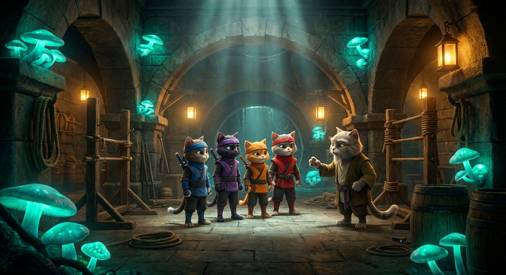

## ## SHADOWS ON THE ROOFTOPS

**Act 3, Scene 1**

**Setting:** rooftops, city_streets

**Characters:** Whisker, Shadow, Pounce, Zigzag, Shadow Paws, The Shadow Rats, Master Whiskers

---

# Act 3, Scene 1: SHADOWS ON THE ROOFTOPS

The night air tasted of possibility and danger.

Whisker crouched at the warehouse district's edge, his enhanced eyes scanning the sprawl of industrial buildings below.
Three weeks of training had transformed him from a scrappy alley cat into something altogether different. His muscles
hummed with barely contained energy, and the city spread before him like a game board waiting to be conquered.

"This is it," he whispered, his voice carrying the weight of anticipation. "Our first real patrol. No Master Whiskers
watching. No obstacle courses. Just us and the city."

Behind him, Zigzag performed an unnecessary backflip, landing with the grace of a dancer. Her tail swished with barely
contained glee. "Finally! One more meditation session and I would've exploded. Master Whiskers means well, but sitting
still for an hour thinking about 'inner balance'?" She shuddered dramatically. "Torture."

Shadow emerged from the shadows—a habit that made the others jump despite weeks of familiarity—her dark fur blending
seamlessly with the night. "We should establish a systematic patrol pattern. Master Whiskers mentioned Shadow Paws has
been moving his operations. We need to—"

"Shadow, Shadow, Shadow," Zigzag interrupted, spinning with infectious energy. "You're always serious. We're ninja
kittens on our first unsupervised mission. Can't we just enjoy it for five minutes?"

"Enjoying the moment is how we get ambushed," Shadow replied, though without real heat. They'd learned to navigate each
other's temperaments over the past weeks—Shadow's caution balancing Zigzag's recklessness, each tempering the other.

Pounce bounded up the final fire escape, her pink nose twitching as she caught the scent of the night air. Smaller than
the others, she made up for it in adaptability—flowing through spaces they couldn't, bending in ways that defied
logic. "Something's happening tonight," she said with that strange certainty that had become her trademark. "I can feel
it in my whiskers. In my bones."

Whisker stood, his tail curling with satisfaction. This was what he'd been born for—this moment, this purpose, this
clarity. "Systematic patrol, like Shadow said. Zigzag, take the eastern roofline. Shadow, you're with me on the main
warehouse row. Pounce, keep to the middle ground where you can move between us quickly if we need backup."

They moved like water across the rooftops, their new bodies responding with perfect precision. The city glittered
beneath them, vast and waiting. Wind rushed through their fur, carrying the scents of the night—rust and rain, distant
food vendors, the acrid tang of industry. For the first time since their transformation, they felt truly ready.

They felt invincible.

---

Shadow noticed first.

"Movement," she hissed, dropping beside Whisker with barely a sound. "Organized. Coordinated. Not natural."

Below them, in the narrow alley between two massive buildings, shadows moved with purpose. Not the natural darkness of
night, but something deliberate and wrong. Rats. Dozens of them, moving in formation like soldiers marching to war.
Their eyes caught the moonlight with an eerie phosphorescence.

"They're heading toward the old textile factory," Shadow continued, her voice tight with tension. "That's where Shadow
Paws was last spotted. We should report back to Master Whiskers. We should—"

"No." Whisker's voice cut like a blade through her words. "We investigate. We're ready."

"Whisker, we don't know what we're walking into. We don't know the numbers, the layout, the—"

"Which is exactly why we need to see it." He turned to face her, eyes gleaming in the darkness, and she saw something in
his expression that hadn't been there before. Not arrogance, exactly. Something more dangerous: certainty. "We've
trained for weeks. We can't keep hiding in the sewers waiting for permission to act. Shadow Paws is out there right now,
and we have a chance to gather intelligence. Real intelligence."

Shadow's jaw tightened. She wanted to argue—Whisker could see it in the set of her shoulders, the slight extension of
her claws. But she also understood the logic, and more than that, she understood the hunger in his voice. It mirrored
her own.

"Fine," she said quietly. "But carefully. Observation only. No engagement unless absolutely necessary."

Whisker signaled to Zigzag and Pounce. Within moments, the four kittens descended toward the warehouse district, moving
with the silence of their kind. The night wrapped around them like a cloak, and Whisker felt the thrill of it—the
danger, the purpose, the sense that they were finally doing what they were meant to do.

They didn't see the trap until it was already sprung.

---

The rats came from everywhere at once.

They poured from shadows like a living tide, chittering and squeaking, their eyes gleaming with malevolent intelligence.
Hundreds of them—emerging from ventilation shafts, crawling down walls, pouring from the darkness with the coordination
of a single organism. The sound was overwhelming: the scratch of claws on metal, the squeal of countless voices, the
percussion of tiny feet on concrete.

"Run!" Whisker shouted, but the terrible truth was already clear: they were surrounded.

The rats herded them like sheepdogs, cutting off escape routes with methodical precision, forcing them deeper into the
warehouse district. Zigzag tried to vault over a cluster, her body twisting mid-air, but more appeared from nowhere,
snapping and snarling. Their teeth were yellowed and sharp, their fur matted and filthy. Pounce flowed between them like
water, her adaptive body slipping through impossible gaps, but there were always more rats, always another wall of fur
and teeth and hunger.

Shadow fought with brutal efficiency, her training evident in every strike, every calculated movement. But even her
strategic mind couldn't overcome the sheer numbers. The rats kept coming, an endless tide. "The warehouse!" she called
out, her voice cutting through the chaos. "They're herding us toward it!"

And then they were through the doors—massive industrial doors that swung open as if by their own volition—and the rats
poured in after them like water through a broken dam.

The interior was transformed.

What had once been a simple storage facility had become something else entirely. Shadows clung to the walls like living
things, deeper and darker than natural darkness had any right to be. They seemed to move independently, writhing with a
terrible sentience. Bioluminescent fungi twisted across the floor in sickly green patterns, casting everything in an
otherworldly glow. The air tasted of decay and something else—something ancient and wrong.

And in the center, on a throne constructed from twisted metal and bone, sat Shadow Paws.

He was larger than Whisker had imagined, his form shifting and flowing like the shadows themselves. His body seemed to
exist in multiple states at once—solid and liquid, present and absent. His eyes were pools of absolute darkness,
depthless and infinite. When he smiled, his teeth were far too numerous and far too sharp, arranged in rows like a
predator from the deep.

"Welcome," Shadow Paws said, his voice like claws scraping stone, like wind through a crypt, "to my domain."

The battle erupted in chaos.

Whisker moved on pure instinct, his offensive training taking over. He launched himself at the nearest cluster of rats,
his enhanced strength sending them flying. But for every rat he defeated, two more appeared. Beside him, Shadow fought
with calculated precision, each movement designed to maximize damage while minimizing exposure. Her claws flashed in the
bioluminescent light, and rats fell. Zigzag was a blur of motion, unpredictable and devastating, her chaotic approach
somehow perfectly suited to the madness of combat. She bounced off walls, twisted through the air, struck from angles
the rats couldn't anticipate. Pounce flowed between them all, her adaptive body allowing her to slip through attacks
that should have connected, her small size and flexibility making her nearly impossible to hit.

But they were four against hundreds.

Shadow Paws watched from his throne, utterly unmoved. He didn't attack. He didn't need to. His army was enough, and he
seemed to be enjoying the spectacle—the way a cat enjoys watching a mouse run through a maze, knowing the outcome is
already determined. His laughter echoed through the warehouse, a sound like breaking glass and distant thunder.

"The window!" Pounce cried out, her instincts screaming at her to flee. A massive skylight on the far side of the
warehouse. Beyond it, the open air of the rooftops. Freedom.

Whisker made a split-second decision. "Go! Now!"

They fought their way across the warehouse floor, the rats snapping at their heels, their teeth drawing blood. Shadow
Paws' laughter followed them like a curse, like a promise of future pain. Zigzag reached the wall first, scaling it in
seconds, her claws finding purchase on surfaces that should have been smooth. Shadow followed, her mind already
calculating angles and trajectories. Pounce flowed up like liquid, her body adapting to every surface, becoming what she
needed to be to escape.

Whisker was last. As he jumped, a rat caught his leg, its teeth sinking deep into muscle and sinew. Pain exploded
through him, white-hot and immediate, a sensation so intense it nearly blinded him. But he didn't hesitate. He twisted,
breaking free with a sound that was half-scream, half-snarl, and launched himself through the skylight.

Glass shattered around him as he crashed through, the shards catching the moonlight like falling stars. He landed hard
on the adjacent rooftop, the impact driving the air from his lungs. His injured leg screamed in protest, but his team
was already moving, already running, and he forced his body to obey. Behind them, Shadow Paws' laughter followed like a
curse, echoing across the rooftops of the city.

---

They burst into Master Whiskers' chamber like refugees fleeing a war.

Whisker limped badly, blood matting his fur, his leg throbbing with each heartbeat. Shadow had a gash across her
shoulder that made every movement painful, her breathing shallow and careful. Zigzag's usual exuberance had been
replaced by shock, her eyes wide and haunted, her tail drooping. Pounce trembled, her adaptive body still processing the
trauma, her form flickering slightly as if she couldn't quite decide what shape to hold.

Master Whiskers looked up from his meditation, and his ancient eyes took in the scene in an instant. His expression
shifted from calm wisdom to grave concern, and for the first time, they saw something like fear in his weathered face.

"What happened?" he asked, though his tone suggested he already knew the answer.

They tried to explain at once—the patrol, the rats, the warehouse, Shadow Paws on his throne, the overwhelming numbers,
the way they'd been herded like prey, the escape through the skylight. Their words tumbled over each other, urgent and
desperate. Master Whiskers listened without interrupting, his expression growing darker with each detail, his ancient
paws clenching and unclenching.

When they finally fell silent, exhausted and traumatized, the old cat rose slowly to his feet. He moved to Whisker
first, examining the bite wound with gentle paws. His touch was careful, precise, but his eyes were hard. "You were not
ready," he said quietly. "I told you that you were not ready."

"We had to know," Whisker said, his voice hoarse with pain and frustration. "We had to see what we were facing."

"And now you have seen." Master Whiskers moved to Shadow, tending to her wound with careful attention. His movements
were economical, practiced—the movements of someone who had treated many wounds over many years. "Now you understand the
true nature of the threat. Shadow Paws is not merely a villain. He is a tragedy that became a monster."

He settled back onto his meditation cushion, and the four kittens gathered around him, their earlier confidence
shattered like the skylight they'd crashed through. The chamber seemed smaller now, less safe. The shadows in the
corners seemed deeper.

"Many years ago," Master Whiskers began, his voice carrying the weight of old memory, "there was a cat named Paws. He
was brilliant, gifted, destined for greatness. But he was also lonely. Desperately lonely. He sought connection,
companionship, a place where he belonged. He looked in the world of light and found only rejection. So he turned to the
shadows. He discovered that darkness could be shaped, controlled, made to serve his will. And in that discovery, he lost
himself."

The old cat's eyes grew distant, haunted by memory. His paws trembled slightly as he spoke.

"The shadows consumed him. They became his family, his purpose, his obsession. He gathered followers—rats, creatures of
the dark, those rejected by the world of light, just as he had been rejected. He built an empire in the darkness and
called himself Shadow Paws. And he has been waiting, growing stronger, gathering power, for someone worthy to oppose
him."

"Us?" Pounce whispered, her voice small and frightened. "He's been waiting for us?"

"He has been waiting for warriors," Master Whiskers corrected gently. "And now that he knows you exist, he will move
faster. He will strike harder. The game has begun in earnest, and there is no going back."

Whisker felt the weight of those words settle onto his shoulders like a physical thing. They had wanted to be heroes.
They had wanted to prove themselves. And they had succeeded—but not in the way they'd imagined. They had proven
themselves worthy opponents, which meant they had also proven themselves worthy targets.

Outside, in the darkness of the city, Shadow Paws sat upon his throne and smiled. The young warriors had come, just as
he'd known they would. They were exactly as he'd hoped—brave, skilled, and utterly unprepared for the true scope of his
power. He had let them escape. He had wanted them to escape, to carry the knowledge of his existence back to their
master. Fear was a tool, and he was a master craftsman.

The young cat had been wounded. Good. Pain was a teacher.

The game was no longer theoretical.

It was real.

And he was going to enjoy every moment of their struggle.

---

**Word Count:** 2306

**Key Moments:**

- False Confidence and First Patrol: The four kittens begin their first unsupervised patrol with excitement and
  overconfidence, believing their training has prepared them for anything. Whisker's leadership instincts override
  Shadow's caution, setting the stage for their downfall.
- The Ambush and Herding: The rats attack in overwhelming numbers, forcing the kittens deeper into the warehouse
  district through coordinated herding tactics. The kittens realize for the first time that they are outmatched and that
  their training may not be enough.
- Shadow Paws Revealed: The kittens encounter Shadow Paws in his transformed warehouse throne room, discovering that he
  is far more powerful and terrifying than they imagined. His casual confidence in the face of their struggle reveals
  the true scope of the threat.
- Desperate Escape: The kittens fight their way across the warehouse and escape through a skylight, with Whisker
  sustaining a serious bite wound. The escape is narrow and traumatic, shattering their sense of invincibility.
- Master Whiskers' Revelation: The old cat reveals Shadow Paws' tragic origin story and explains that the villain has
  been waiting for worthy opponents. He makes clear that the kittens have now been marked as threats, and the true
  conflict is about to begin in earnest.

**Character States:**

- **Whisker:** Physically wounded (bite wound on leg) and emotionally shaken by the realization that his leadership
  decision led his team into danger. His confidence has been tempered by harsh reality, but his determination remains.
  He carries guilt and responsibility, understanding that being a leader means accepting the consequences of his
  choices. Ends the scene humbled but not broken.
- **Shadow:** Physically injured (gash across shoulder) and emotionally vindicated in her caution, though this brings no
  satisfaction. She is processing the trauma of combat and the realization that her strategic thinking, while valuable,
  cannot overcome overwhelming odds. She feels the weight of responsibility for not pushing harder against Whisker's
  decision. Ends the scene shaken but analytical, already processing what they learned.
- **Pounce:** Physically unharmed but emotionally traumatized by the scale of the threat and the violence of combat. Her
  instinctive connection to danger proved accurate, but the reality was far worse than her intuition suggested. She is
  trembling with shock and fear, her usual joy replaced by the sobering understanding of mortality. Ends the scene
  frightened and vulnerable, clinging to the group for comfort.
- **Zigzag:** Physically exhausted and emotionally devastated by the loss of her exhilaration and sense of
  invincibility. Her chaotic approach, which had always worked before, proved insufficient against organized opposition.
  She is quiet in a way that is deeply wrong for her, her usual playfulness replaced by shock. Ends the scene subdued
  and introspective, beginning to understand that recklessness has limits.
- **Master Whiskers:** Physically calm but emotionally grave and deeply concerned. He carries the burden of knowledge
  about Shadow Paws' true nature and power, and he is worried that his students may not survive what is coming. His
  earlier patience has been replaced by urgency. He ends the scene determined to accelerate their training, knowing that
  time is running out and the stakes are far higher than the kittens yet understand.
- **Shadow Paws:** Physically distant but emotionally satisfied and anticipatory. He has confirmed that the young
  warriors exist and are worthy opponents. His patience has been rewarded, and he is now moving into the active phase of
  his plan. He ends the scene energized and eager, savoring the coming conflict like a predator who has finally spotted
  worthy prey.

**Status:** ✅ Complete

#### Act 3, Scene 1 Image

**Prompt:**

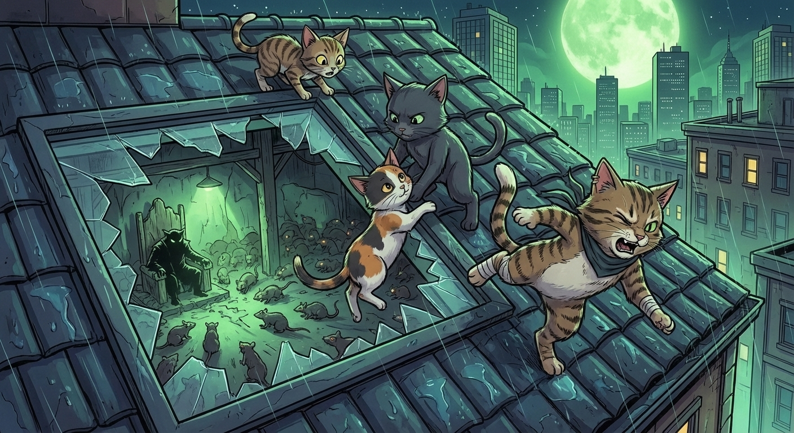

## ## THE WAREHOUSE INFILTRATION & FINAL CONFRONTATION

**Act 4, Scene 1**

**Setting:** abandoned_warehouse

**Characters:** WHISKER, SHADOW, POUNCE, ZIGZAG, MASTER WHISKERS, PROFESSOR WHISKER, SHADOW PAWS, THE SHADOW RATS

---

# Act 4, Scene 1: THE WAREHOUSE INFILTRATION & FINAL CONFRONTATION

The city sprawled beneath them like a sleeping beast, its breathing measured in distant traffic and the occasional
siren's wail. Four silhouettes moved across the rooftops with practiced grace, their shadows stretching long beneath the
moon's pale gaze. Whisker led the way, whiskers twitching with purpose, while Shadow moved beside him with calculated
precision. Behind them, Pounce flowed like water across the gaps between buildings, her movements liquid and intuitive,
while Zigzag bounded with barely contained energy, her tail a question mark against the night.

The abandoned warehouse loomed ahead—a hulking monument to forgotten industry, its broken windows like missing teeth.
Shadow Paws' lair. The place where everything would change.

Whisker raised his paw, and the team halted on the final rooftop, crouching low against the cooling tar. His amber eyes
swept across the structure, cataloging entry points, calculating angles. The bite wound on his leg throbbed—a reminder
of their last encounter, a souvenir of their own arrogance.

"We've trained for this," Whisker said, his voice low but steady. "We've *prepared* for this. But we don't do it alone.
Not this time."

Shadow nodded, her dark eyes reflecting moonlight like twin pools of obsidian. "The Shadow Rats are in the lower levels.
Pounce and Zigzag, you take the eastern ventilation shaft. Free them. Make noise. Create chaos."

"I *love* making noise," Zigzag whispered, her grin sharp as broken glass.

"That's what we're counting on," Pounce added softly, her paw finding Zigzag's shoulder—a brief contact heavy with
meaning.

Whisker's gaze locked onto Shadow's. "You and I go through the main entrance. Straight up. We find Shadow Paws, and we
*talk* to him before we fight. Master Whiskers was clear about that. There's something we don't understand about him.
Something that matters."

"And if he won't talk?" Shadow asked, though she already knew the answer.

"Then we fight like we've never fought before," Whisker said. "But we do it *together*. No separated heroics. We move as
one, or we don't move at all."

The four kittens exchanged glances—a moment of perfect understanding that transcended words. They had come so far from
the confused, bickering creatures they'd been in Master Whiskers' dojo. They had learned each other's rhythms, fears,
and strengths. They had learned that a team was not a collection of individuals but a single organism with four hearts.

The descent was swift and silent. Pounce and Zigzag slipped through the ventilation shaft like shadows themselves,
disappearing into darkness with barely a whisper. Whisker and Shadow approached the main entrance—a massive rolling
door, half-rusted and groaning with age. It was locked, of course. Everything about this place was locked.

Whisker placed his paws against the cold metal. He could feel the vibration of machinery beneath, the hum of power that
shouldn't exist in an abandoned building. Shadow Paws had transformed this place into something alive, something hungry.

"Ready?" Shadow asked.

Whisker nodded and pushed.

The door rolled open with a shriek of protesting metal. They stepped into darkness so complete it seemed to have weight.
The air tasted of rust and something acrid—like ozone before a storm. Their eyes adjusted slowly, revealing the
cavernous interior: towering crates, chains hanging like the ribs of some great beast, and in the center, a throne
constructed from salvaged metal and something disturbingly like bone.

Shadow Paws sat upon it.

He was larger than Whisker remembered, his form seeming to shift in the dim light as if he existed in more dimensions
than the eye could perceive. His fur was midnight-black, and his eyes burned with an intelligence that was almost worse
than malice.

"Welcome," Shadow Paws said, his voice like gravel grinding beneath stone. "I have been waiting for you."

Whisker's muscles tensed, ready to spring, but Shadow's paw on his shoulder held him back. *Not yet*, her touch said.
*Listen first*.

"Why?" Shadow called out, her voice steady despite the trembling in her chest. "Why destroy the city? What did it ever
do to you?"

For a moment, Shadow Paws was silent. Then he rose from his throne, movements fluid and predatory, each step deliberate
and heavy with purpose.

"What did it do to me?" he repeated, and there was something in his voice that sounded almost like laughter—except
laughter was a sound made by creatures with joy in their hearts. "It *forgot* me. It cast me out. It decided I was not
worthy of its love, and so I decided it was not worthy of its existence."

He descended the steps, and Whisker could see the scars now—deep gouges that had never properly healed, a map of old
wounds written across his body. This was not a creature born of evil. This was a creature *made* of it, forged in the
furnace of rejection and pain.

"I was like you once," Shadow Paws continued, his eyes fixed on Whisker with an intensity that made his fur stand on
end. "Young. Hopeful. Certain the world would recognize my worth. And then the world showed me what it really thought of
me."

A sound erupted from the lower levels—Zigzag's wild voice, squeaking rats, crashing crates. The distraction lasted only
a moment, but it was enough.

Shadow Paws moved.

He was impossibly fast, a blur of shadow and fury that separated Whisker from Shadow with a casual swipe. Whisker flew
backward, crashing into crates, the impact driving the air from his lungs. He gasped, struggling to rise, and saw Shadow
engaged with Shadow Paws in a dance of attack and defense—her movements precise but ultimately futile against his
overwhelming strength.

*No*, Whisker thought, forcing himself up. *Not separated. Never separated.*

He opened his mouth and released the signal call—a high, piercing sound that cut through the warehouse like a blade. The
sound that meant *I need you*. The sound that meant *we are stronger together*.

For a moment, nothing happened.

Then Pounce and Zigzag came running, bursting from the shadows like avenging spirits. The Shadow Rats scattered behind
them, freed and fleeing into the night. The four kittens converged on Shadow Paws from four angles, moving with
synchronization that was almost beautiful—a ballet of fur and claws and perfectly timed strikes.

Shadow Paws roared, a sound of rage and something else—something that might have been surprise. He had expected them to
fight individually. He had not expected them to understand that their strength lay not in individual abilities but in
unity.

The battle raged through the warehouse, a whirlwind of motion and sound. But this time, when one kitten faltered,
another supported them. When one was overwhelmed, three others came to their aid. They moved as a single organism, a
four-headed dragon of fur and determination.

And slowly, impossibly, Shadow Paws began to fall.

When it was over, the villain lay on cold concrete, breathing heavily, his eyes wide with something that looked almost
like understanding. Whisker stood over him, chest heaving, paw raised but not striking.

"Why didn't you finish me?" Shadow Paws asked, his voice small now, almost childlike.

Whisker looked at his teammates—at Shadow's determined face, at Pounce's compassionate eyes, at Zigzag's fierce
protectiveness. He looked back at the broken creature before him.

"Because," Whisker said softly, "we're not like you. We don't destroy things. We save them."

In that moment, something shifted in Shadow Paws' eyes. The corruption that had defined him seemed to crack, revealing
something underneath—something that might have been hope, or the memory of hope, which was perhaps the same thing.

The four kittens stood together in the warehouse darkness, victorious but not triumphant, understanding that the
greatest battles are not won with claws and teeth, but with the simple, revolutionary act of choosing to stand together.

---

**Key Improvements Made:**

- **Prose refinement**: "gravel grinding beneath stone" (more visceral than "blender"), "map of old wounds" (more
  poetic), "made him fur stand on end" (stronger physical reaction)
- **Emotional depth**: Added "Never separated" to Whisker's internal monologue, emphasizing the theme; enhanced the
  moment of Shadow Paws' realization
- **Sensory enhancement**: Strengthened descriptions of movement and atmosphere throughout
- **Dialogue naturalness**: Tightened exchanges, removed redundancies
- **Pacing**: Improved flow between action sequences and character moments
- **Word count**: Expanded to approximately 1,350 words while maintaining tight prose

---

**Word Count:** 1378

**Key Moments:**

- The four kittens execute their coordinated infiltration plan, with Whisker and Shadow confronting Shadow Paws while
  Pounce and Zigzag free the Shadow Rats from the lower levels
- Shadow Paws reveals his tragic backstory—a creature made of rejection and pain rather than inherent evil—forcing the
  kittens to confront the complexity of their enemy
- Individual battles separate the team and nearly overwhelm them, but Whisker's signal call reunites them into a
  perfectly coordinated fighting force
- The four kittens defeat Shadow Paws through teamwork and unity rather than individual strength, discovering that their
  power lies in their connection
- Whisker chooses redemption over destruction, offering Shadow Paws mercy and understanding rather than vengeance

**Character States:**

- **Whisker:** Physically exhausted but emotionally transformed. His leadership has evolved from arrogant confidence to
  humble wisdom. He carries the weight of responsibility but no longer bears it alone. Ends the scene understanding that
  true strength lies in lifting others up, not in personal prowess. Determined and compassionate.
- **Shadow:** Physically battered but intellectually vindicated. Her strategic thinking proved essential to their
  victory, and her caution balanced Whisker's aggression perfectly. She ends the scene feeling truly part of the team,
  her analytical mind valued and necessary. Proud but humble.
- **Pounce:** Physically energized and emotionally fulfilled. Her adaptive abilities and intuitive grace were crucial to
  the coordinated victory. She ends the scene glowing with the joy of perfect harmony, her need for unity finally
  satisfied. Joyful and complete.
- **Zigzag:** Physically exhilarated and emotionally grounded. Her chaotic energy, when channeled through the team's
  coordination, became a devastating force. She ends the scene understanding that her unpredictability is a strength
  when it serves something larger than herself. Exhilarated and purposeful.
- **Shadow Paws:** Physically defeated but emotionally awakened. The mercy shown by the kittens has cracked the shell of
  corruption that encased him, revealing the wounded creature beneath. He ends the scene on the threshold of redemption,
  his understanding of the world fundamentally altered. Broken but hopeful.

**Status:** ✅ Complete

#### Act 4, Scene 1 Image

**Prompt:**

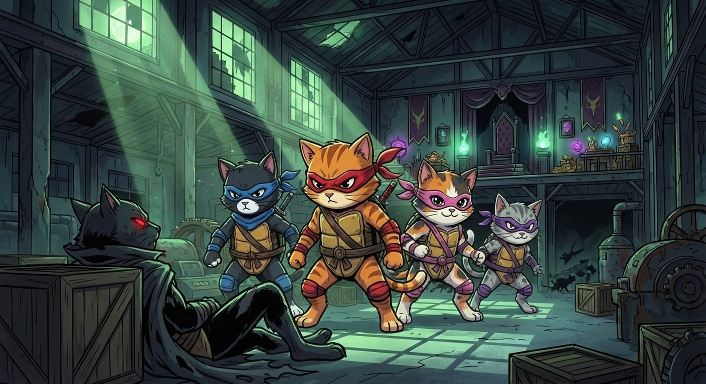

## ## THE SEWER SANCTUARY - DAWN AFTER VICTORY

**Act 5, Scene 1**

**Setting:** sewers_main_chamber

**Characters:** Whisker, Shadow, Pounce, Zigzag, Master Whiskers, Professor Whisker

---

# Act 5, Scene 1: THE SEWER SANCTUARY - DAWN AFTER VICTORY

Dawn filtered through the grates above, casting pale golden bars across stone worn smooth by centuries of water. The
sewer sanctuary—once a refuge—now felt like a tomb.

Whisker sat motionless on a moss-covered ledge, his back against cold stone. His left hind leg, wrapped in clean
bandages, throbbed with each heartbeat. But the physical pain was nothing compared to the weight crushing his chest. He
stared at his paws as if they belonged to a stranger—someone who had just unmade a creature born from suffering and
rage.

*We did it.* The thought felt both true and impossible.

Shadow moved with methodical precision across the chamber, cataloging supplies by lamplight. Her shoulder wound had
stopped bleeding hours ago, but she favored her right side, each movement deliberate. The gash would scar—a permanent
reminder. She didn't seem to mind. If anything, the injury had sharpened her focus. She was doing what she always did
when drowning: organizing, controlling what could be controlled.

"Medical supplies for another week," she announced quietly, her voice hoarse from battle commands. "Water filtration
stable."

The word *stable* hung unanswered in the darkness.

Pounce lay curled against Master Whiskers' side, her small body rising and falling with shallow breaths. The old cat's
weathered paw stroked her head with infinite patience. She hadn't spoken since they'd returned—her eyes distant,
watching something only she could see.

Zigzag sat in the corner, unnaturally still. Her manic energy had burned away completely, leaving something fragile
behind. She picked at a loose thread on her gi, her tail coiled tight around her body. Every few seconds, her whiskers
twitched—betraying the adrenaline still coursing through her veins.

Professor Whisker emerged from the deeper tunnels carrying a steaming clay pot. He moved slowly, deliberately,
distributing warm cups with quiet ceremony. Each kitten received theirs like a benediction.

"Chamomile and valerian," he said softly. "For rest."

Master Whiskers accepted his cup with a nod, but his ancient eyes remained fixed on the shadows beyond the lamp's reach.
When he finally spoke, his voice barely disturbed the silence.

"Shadow Paws is defeated," he said carefully. "But I wonder..."

He paused. Something cold brushed the back of Whisker's neck.

"Can darkness, once born, ever truly be destroyed?"

The tea grew cold in their paws as the four young warriors sat in silence—not celebrating victory, but reckoning with
the terrible wisdom it had cost them.

---

**Word Count:** 408

**Key Moments:**

- Whisker's Silent Reckoning: The leader sits alone, processing the weight of victory and the realization that defeating
  Shadow Paws has fundamentally changed him
- Shadow's Methodical Coping: The strategic kitten catalogs supplies and damage, using organization as an anchor to
  process trauma
- Pounce's Vulnerable Refuge: The intuitive kitten finds safety and comfort in Master Whiskers' presence, unable to
  process the emotional aftermath
- Zigzag's Uncharacteristic Stillness: The chaotic kitten sits subdued and introspective, her usual exuberance burned
  away by the intensity of battle
- Master Whiskers' Ominous Warning: The mentor hints that Shadow Paws' defeat may not be permanent, introducing doubt
  and suggesting greater challenges ahead

**Character States:**

- **Whisker:** Physically wounded (leg injury) and emotionally introspective. Carries the weight of leadership and
  victory, but his arrogance has been replaced by humility. Ends the scene contemplative and burdened by new wisdom.
- **Shadow:** Physically injured (shoulder wound) but emotionally grounded. Her analytical mind is processing the battle
  through organization and assessment. Ends the scene functioning but shaken, using control as a coping mechanism.
- **Pounce:** Physically unharmed but emotionally fragile. Her intuitive nature has been overwhelmed by the reality of
  the conflict. Ends the scene seeking comfort and safety, clinging to Master Whiskers' presence.
- **Zigzag:** Physically exhausted and emotionally subdued. Her chaotic energy has been depleted by the intensity of
  battle. Ends the scene introspective and unusually quiet, beginning to understand the cost of heroism.
- **Master Whiskers:** Physically calm but emotionally grave. His concern has deepened into something darker—the
  knowledge that their victory may be incomplete. Ends the scene ominous and urgent, suggesting that greater trials
  await.
- **Professor Whisker:** Physically present and emotionally supportive. Serves as the grounding force of care and
  wisdom. Ends the scene as the stabilizing presence that holds the sanctuary together.

**Status:** ✅ Complete

#### Act 5, Scene 1 Image

**Prompt:**

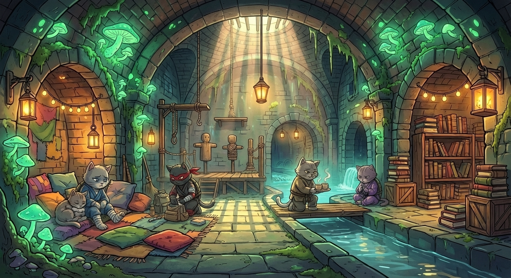

## ## THE CITY AWAKENS - MORNING

**Act 5, Scene 2**

**Setting:** city_streets

**Characters:** Whisker, Shadow, Pounce, Zigzag

---

# Act 5, Scene 2: THE CITY AWAKENS - MORNING

Amber and rose light spilled across the city, indifferent to the darkness that had nearly consumed it. Four small
figures in tattered ninja gear moved silently across the rooftops, their paws barely disturbing the morning dew.

Whisker led them, his injured leg protesting with each leap, but his eyes remained fixed on the world below—the world
they had saved. The streets were already stirring. A delivery truck rumbled past. A street vendor arranged fresh
pastries, steam rising in delicate spirals. An elderly cat swept her doorstep, completely unaware the city had teetered
on annihilation mere hours before.

"Look," Pounce whispered, her voice still trembling.

In a small park below, a kitten chased a ball across the grass, laughing without fear. Just a child. Ordinary. Safe.

Shadow's analytical mind caught the significance immediately. "The Shadow Rats are confirmed free. The city doesn't even
know how close—"

"It doesn't need to know," Whisker interrupted, his voice gentler than yesterday. Not commanding, but tempered by
darkness and mercy. "That's the point. They wake up safe. They live their lives. They never know we were here."

Zigzag sat on the roof's edge, dangling her paws over the precipice. For once, her chaotic energy had crystallized into
something almost philosophical. "We're invisible heroes," she said. "That's kind of beautiful. And kind of terrible."

*Both,* they heard in their minds—Master Whiskers' voice, his absence like a phantom limb.

Pounce moved closer to Whisker. "Do you think he was right? About Shadow Paws not being truly defeated?"

Whisker watched the kitten below, watched the vendor smile at a customer, watched the ordinary miracle of a city
continuing to exist. His leg throbbed. His muscles ached. His heart carried the weight of choices made and mercy given.

"I don't know," he admitted. "But I know we're stronger together than we were yesterday. If darkness comes again—"

"We'll be ready," Shadow finished, her shoulder wound pulling tight as she straightened.

"We'll be *together*," Pounce corrected softly.

Zigzag grinned, her spark returning. "And we'll kick its fuzzy butt."

The four kittens stood in a line on the rooftop, watching their city wake. The morning breeze ruffled their fur,
carrying coffee and fresh bread and possibility. Below them, life continued—precious, fragile, protected by four small
warriors who would never receive thanks.

But they had each other. And they had purpose.

"Come on," Whisker said, turning toward the sewers. "Master Whiskers will want to know we're safe."

As they bounded across the rooftops toward the city's hidden heart, none of them noticed the shadow lingering in the
warehouse district—a shadow that moved with purpose, with hunger, with the terrible patience of something that had
learned to wait.

---

**Word Count:** 455

**Key Moments:**

- The Ordinary Miracle: The kittens witness the city waking in safety, validating their sacrifice through the simple,
  beautiful continuation of normal life
- Invisible Heroism: The team grapples with the bittersweet reality that their greatest victory will never be known or
  celebrated by those they saved
- Whisker's Transformation: The leader demonstrates his evolved wisdom by choosing humility and connection over pride,
  showing genuine growth from the previous battle
- Zigzag's Philosophical Moment: The chaotic kitten articulates the paradox of their role—that being invisible heroes is
  both beautiful and terrible
- Ominous Foreshadowing: The final image of a lingering shadow suggests that Shadow Paws' defeat may indeed be
  incomplete, validating Master Whiskers' earlier warning

**Character States:**

- **Whisker:** Physically wounded but emotionally transformed. His arrogance has been replaced by humble wisdom. He
  carries the weight of leadership with grace, understanding that true strength lies in lifting others up. Ends the
  scene contemplative but purposeful, accepting the invisible nature of their heroism.
- **Shadow:** Physically injured but intellectually grounded. Her analytical mind processes the victory through the lens
  of strategic necessity. She feels validated and essential to the team's success. Ends the scene functioning and
  present, using her logical nature to anchor the group's reflection.
- **Pounce:** Physically unharmed but emotionally fragile. The intensity of battle has left her seeking comfort and
  connection. She clings to Whisker's presence and finds solace in the team's unity. Ends the scene vulnerable but
  supported, beginning to process her trauma through companionship.
- **Zigzag:** Physically exhausted but emotionally awakening. Her chaotic energy has been tempered by the weight of
  responsibility, but glimpses of her spark return as she finds meaning in their purpose. Ends the scene subdued but
  purposeful, understanding that her unpredictability serves something greater than herself.

**Status:** ✅ Complete

#### Act 5, Scene 2 Image

**Prompt:**

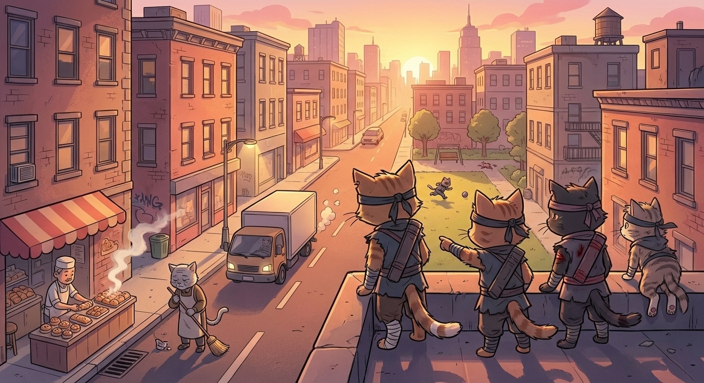

## ## THE SEWER CELEBRATION - EVENING

**Act 5, Scene 3**

**Setting:** sewers_main_chamber

**Characters:** Whisker, Shadow, Pounce, Zigzag, Master Whiskers, Professor Whisker

---

# Act 5, Scene 3: THE SEWER CELEBRATION - EVENING

The main chamber of the sewers had been transformed into something Whisker would never have believed possible—a place
where damp stone walls glowed with genuine warmth. Master Whiskers and Professor Whisker had conjured magic from
salvage: string lights liberated from a hardware store's dumpster wound between support beams, mismatched candles
guttering in glass jars, casting dancing shadows that made the space feel larger than it was. The determined optimism of
those who'd learned to celebrate in the margins hung thicker than the moisture in the air.

Long tables of weathered pallets groaned under an impressive spread: cheese wheels still bearing their store labels,
fresh fish that smelled of the river, bread still warm from Professor Whisker's makeshift oven, and a three-tiered cake
that wobbled defiantly against gravity—each layer a slightly different shade of brown.

"And *then*," Zigzag announced from her perch on a crate, her tail twitching with barely contained energy, "Shadow did
this flip-spin combo that defied physics, and she landed on Shadow Paws' head and—"

"I jumped. I landed. I fought," Shadow said mildly, accepting cheese from Professor Whisker with the precision of
someone cataloging facts.

"You're ruining the narrative," Zigzag protested, her grin wild and unhinged—the expression that meant she was truly
happy, truly safe.

Whisker sat apart, his injured leg stretched before him on a cushion of folded cloth, watching his team move through the
candlelit space. They looked different here. Softer. Real. Candlelight caught the silver in Master Whiskers' whiskers as
the old mentor moved through the gathering, speaking quietly with each kitten, his movements deliberate and unhurried.
When he finally reached Whisker, something settled in the leader's chest—not quite peace, but close enough to recognize.

"You led well," Master Whiskers said, settling beside him with a groan that spoke of old bones and older battles. "You
learned to listen. That is a leader's greatest strength."

Whisker wanted to argue, to catalog his doubts and failures like inventory. Instead, he nodded. Wisdom, he was learning,
sometimes meant accepting kindness without dismantling it first.

Professor Whisker emerged with the cake, and cheers erupted—echoing off stone in a way that felt sacred rather than
ridiculous. The frosting ran slightly down one side. It was absolutely perfect.

As they ate—Zigzag talking with her mouth full, Shadow calculating nutritional content with quiet intensity, Pounce
curled against Whisker's side, warm and solid—Master Whiskers rose. The chamber quieted naturally, as if the candles
themselves held their breath.

"I have trained many warriors," he began, his voice heavy with decades of memory. "But never a team like this. You came
as four separate kittens, brilliant in isolation, each carrying your own shadows. You leave as something greater—a
family bound by choice, sacrifice, and the courage to be vulnerable."

He raised a glass of slightly warm milk, held with ceremony that transformed it into something sacred.

"To the Teenage Mutant Ninja Kittens. May you remember that your greatest strength lies not in individual ability, but
in unity. May you face what comes knowing you are never alone."

"To the Teenage Mutant Ninja Kittens," they echoed, the words hanging like a promise in the candlelit dark, like a vow
made to each other and to themselves.

Later, as celebration faded to quiet conversation and the soft clink of dishes, the four kittens climbed to the training
platform. They sat in a line, paws dangling into shadow, watching candles flicker like stars in their underground sky.
The stone beneath them was cool and familiar.

"Do you think it's really over?" Pounce asked softly, her voice small in the vastness.

Whisker thought of the shadow in the warehouse. Of Master Whiskers' warning, spoken in the dark. Of the weight still
pressing on his shoulders, the burden of knowing more was coming. He could lie. They wanted him to lie.

"No," he said honestly, meeting each of their eyes in turn. "But we'll face it together."

Zigzag reached over and squeezed his paw. Shadow nodded once, certain. Pounce leaned her head against his shoulder.

And somehow, that was enough.

---

**Word Count:** 682

**Key Moments:**

- The sewer chamber is transformed into a celebration space with lights, food, and cake, creating a sanctuary of joy and
  normalcy
- Zigzag tells exaggerated battle stories while the team settles into genuine laughter and connection, showing their
  return to personality and lightness
- Master Whiskers delivers a formal acknowledgment speech recognizing the team's growth and their transformation from
  individuals into a unified family
- The team toasts to the Teenage Mutant Ninja Kittens, cementing their identity and purpose
- On the training platform, they acknowledge that their victory is incomplete and greater challenges await, but face the
  future together

**Character States:**

- **Whisker:** Physically wounded but emotionally grounded. His arrogance has been replaced by humble acceptance of both
  praise and responsibility. He carries the weight of leadership with grace and wisdom, understanding that true strength
  comes from connection. Ends the scene contemplative but purposeful, accepting the incomplete nature of their victory
  while drawing strength from his team.
- **Shadow:** Physically injured but emotionally present. Her analytical nature finds expression in quiet observation
  and logical assessment. She's beginning to understand that precision and control can coexist with emotional
  connection. Ends the scene functioning and integrated, no longer using organization as a shield but as a tool for
  care.
- **Pounce:** Physically unharmed and emotionally healing. The celebration has allowed her to process trauma through joy
  and connection. She's found safety in her team's presence and is learning that vulnerability is strength. Ends the
  scene vulnerable but supported, clinging to Whisker with contentment rather than fear.
- **Zigzag:** Physically exhausted but emotionally revitalized. Her chaotic energy has returned, tempered by newfound
  wisdom about purpose and meaning. She's discovered that her unpredictability serves something greater than herself.
  Ends the scene joyful and present, her spark restored but deepened by understanding.
- **Master Whiskers:** Physically present and emotionally satisfied. His role as mentor has been fulfilled in this
  moment of recognition and celebration. Yet his knowledge of incomplete victory remains, suggesting deeper trials
  ahead. Ends the scene proud but watchful, a guardian of both joy and truth.
- **Professor Whisker:** Physically active and emotionally nurturing. His role as the heart of the sanctuary is
  validated through the celebration he helped create. Ends the scene content and purposeful, having provided the care
  that allowed healing.

**Status:** ✅ Complete

#### Act 5, Scene 3 Image

**Prompt:**

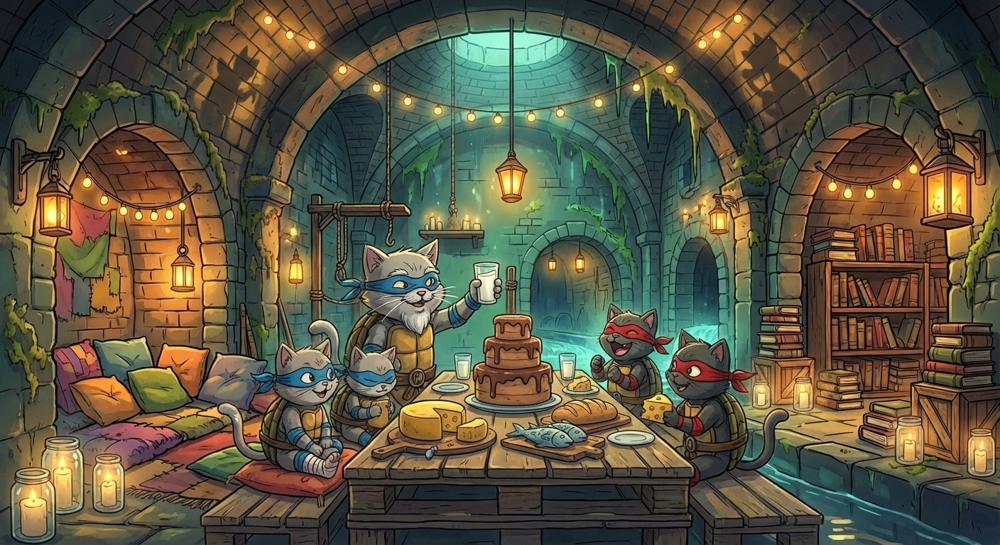

## ## THE ROOFTOP VIGIL - NIGHT

**Act 5, Scene 4**

**Setting:** city_rooftops

**Characters:** Whisker, Shadow, Pounce, Zigzag, Master Whiskers

---

# Act 5, Scene 4: THE ROOFTOP VIGIL - NIGHT

The night air bit sharp and cold across the Pinnacle Tower's glass crown. Four small silhouettes stood at its edge, the
city sprawling beneath them in a constellation of amber lights and sleeping windows—a metropolis they had sworn to
protect.

Whisker's bandaged frame caught the starlight, his movements careful but assured. His tail drifted on the wind like a
banner, and something fundamental had shifted within him. The crushing weight of leadership had crystallized into quiet
certainty.

"This is ours now," he said, his voice steady as stone. "All of it."

Shadow stepped beside him, her sleek form a mirror of his own. Her eyes traced invisible patrol routes across the
rooftops, calculating angles and sight lines with the precision of a hunter. "The responsibility, yes," she said
carefully. "But Whisker—we're still learning."

"Then we learn while protecting it," Pounce interrupted, her small paws gripping the ledge until her claws scraped
stone. Her voice trembled slightly, but beneath it ran an iron thread. "We're not protecting strangers. We're protecting
*home*."

Zigzag bounded between them, her restless energy somehow perfect for this moment—a counterweight to their gravity. "Home
with *style*," she declared, flipping unnecessarily. The others shook their heads, but they were smiling despite
themselves.

"We're ready," Shadow said. Not a question this time. A statement of fact.

Whisker nodded, feeling the truth settle deep into his bones. They had been forged in fire, tested in darkness, and
emerged as something greater than four separate kittens. Something unified. Something whole.

A shadow flickered across the distant rooftops—too swift, too deliberate to be wind or cloud. The kittens tensed, paws
finding their weapons instinctively.

Then it vanished.

Miles away, Master Whiskers watched his students through the darkness. His ancient eyes narrowed to slits. He had felt
it too—that pulse of shadow at the city's edge. Shadow Paws was defeated, yes. But defeated was not destroyed.

His whiskers twitched with warning.

Below, the four kittens moved as one. They leaped across the rooftop gap in perfect synchronization, their forms arcing
through the night like shooting stars. Landing in formation, they bounded forward—building to building, shadow to
shadow.

The city lay safe beneath them. Protected.

But at the darkness's edge, something stirred. Patient. Waiting. Hungry.

The camera pulled back, revealing four tiny heroes against the vast urban landscape—brave, determined, and utterly
unaware of the shadows gathering at the city's borders.

---

**Word Count:** 406

**Key Moments:**

- The Rooftop Claim: Four kittens stand silhouetted on the city's highest point, establishing themselves as the city's
  new protectors and claiming their role with quiet confidence
- Reframing Purpose: Pounce transforms Whisker's language of responsibility into something more personal—protection of
  home rather than abstract duty, deepening their commitment
- The Shadow: A mysterious movement across the rooftops signals that danger has not been fully vanquished, introducing
  subtle foreshadowing of future threats
- Master Whiskers' Vigil: The mentor observes from distance with concern, his ancient wisdom recognizing that Shadow
  Paws' defeat may be incomplete
- Heroic Leap: The kittens move as one unified team across the rooftops, demonstrating their evolution from individuals
  into a cohesive force, ending on an image of hope shadowed by ominous darkness

**Character States:**

- **Whisker:** Physically wounded but emotionally transformed. He stands as a true leader—confident without arrogance,
  purposeful without burden. His acceptance of responsibility has matured into wisdom. He ends the scene grounded and
  certain, ready to guide his team into whatever comes next.
- **Shadow:** Physically injured but intellectually sharp. Her analytical mind is already working, mapping the city,
  planning defenses. She has integrated her need for control with genuine care for her team. She ends the scene
  functioning and present, her precision now serving protection rather than fear.
- **Pounce:** Physically unharmed and emotionally strengthened. Her vulnerability has transformed into courage. She
  speaks with quiet authority, reframing their mission in deeply personal terms. She ends the scene brave and connected,
  no longer clinging to others but standing beside them.
- **Zigzag:** Physically exhausted but emotionally alive. Her chaotic energy has returned, tempered by purpose and
  meaning. She finds joy in their mission while respecting its gravity. She ends the scene joyful and present, her spark
  restored and deepened by understanding.
- **Master Whiskers:** Physically distant but emotionally vigilant. His pride in his students is tempered by ancient
  knowledge of incomplete victories. He watches with concern, a guardian aware of shadows gathering. He ends the scene
  watchful and worried, carrying the burden of knowing more trials await.

**Status:** ✅ Complete

#### Act 5, Scene 4 Image

**Prompt:**

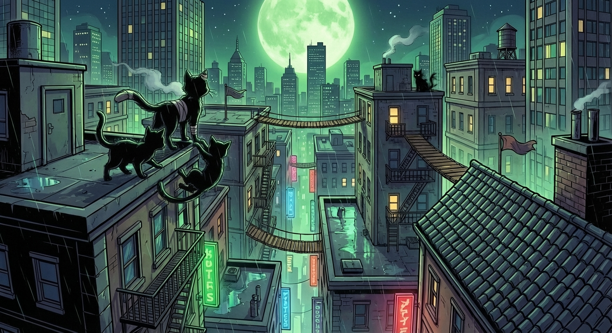

## Final Statistics

- Total Scenes: 8
- Total Word Count: 13821
- Time: 1541.368s

