## User

Retell Zen's ox taming parable for modern US audiences

## Assistant

# THE OX: A Modern Parable of Self-Discovery

## Page 1

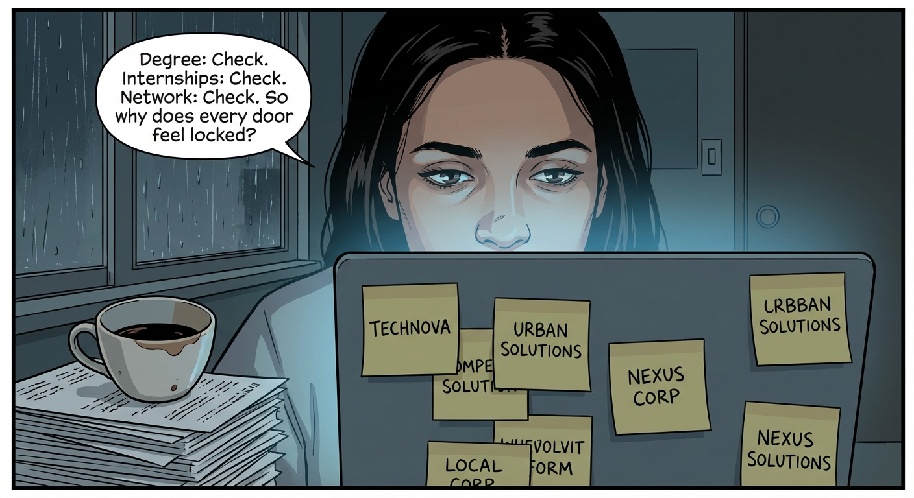

**Maya**: Degree: Check. Internships: Check. Network: Check. So why does every door feel locked?
*Six months of searching. Forty-three applications. Two interviews. Zero offers.*

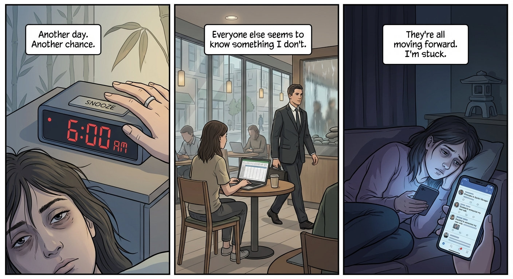

**Maya**: Another day. Another chance.
**Maya**: Everyone else seems to know something I don't.
**Maya**: They're all moving forward. I'm stuck.

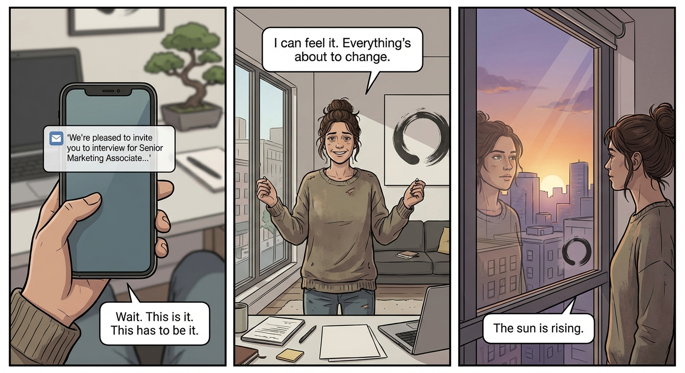

**Maya**: Wait. This is it. This has to be it.
**Maya**: I can feel it. Everything's about to change.
*Picture 1: The Search. You don't know what you're looking for, only that you need to find it.*

## Page 2

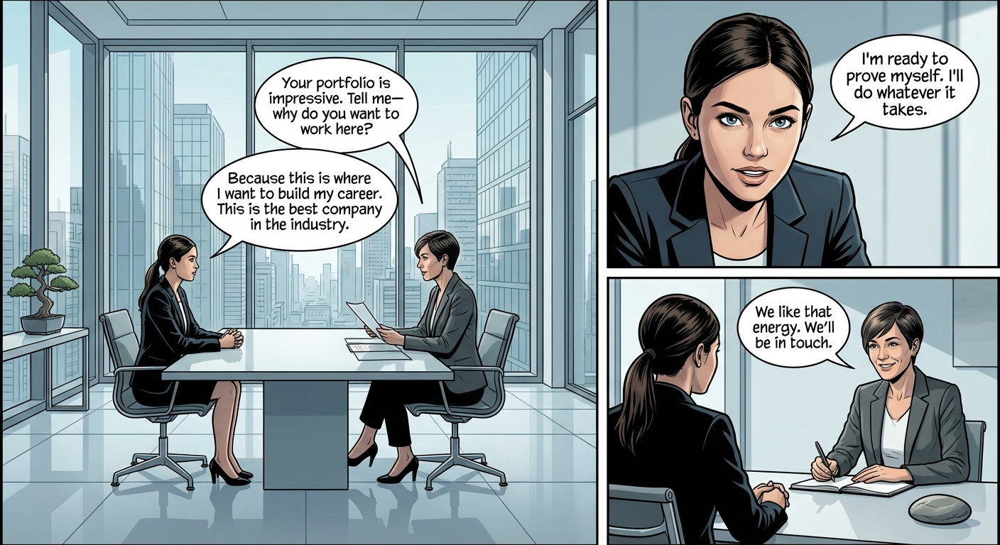

**Patricia**: Your portfolio is impressive. Tell me—why do you want to work here?
**Maya**: Because this is where I want to build my career. This is the best company in the industry.
**Maya**: I'm ready to prove myself. I'll do whatever it takes.
**Patricia**: We like that energy. We'll be in touch.

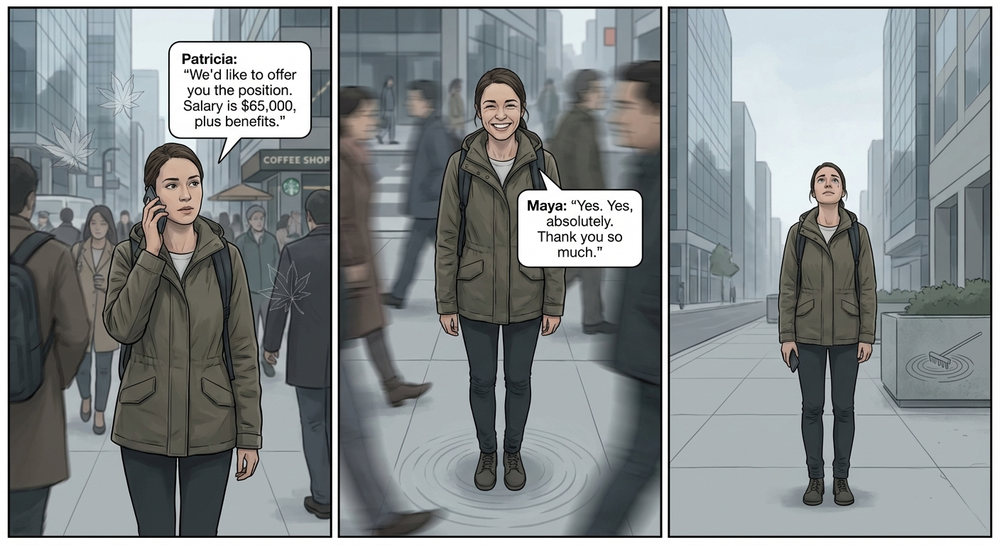

**Patricia**: We'd like to offer you the position. Salary is $65,000, plus benefits.
**Maya**: Yes. Yes, absolutely. Thank you so much.
*Picture 2: First Glimpse. You see the ox in the distance. It's real. It's yours.*

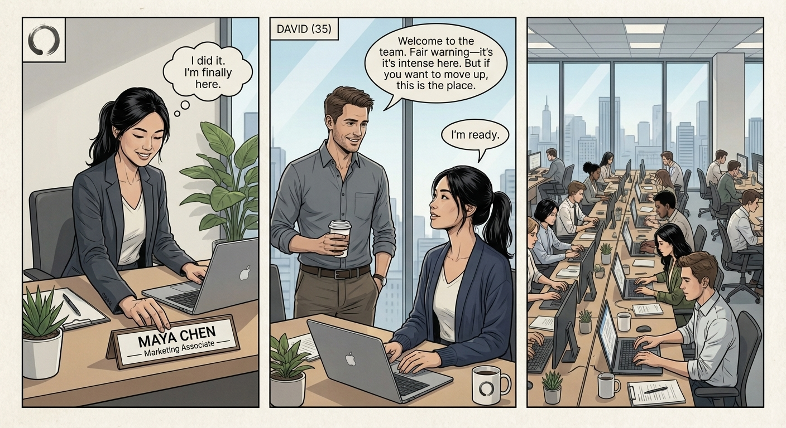

**Maya**: I did it. I'm finally here.
**David**: Welcome to the team. Fair warning—it's intense here. But if you want to move up, this is the place.
**Maya**: I'm ready.
*She doesn't know yet that the ox is not what she thinks it is.*

## Page 3

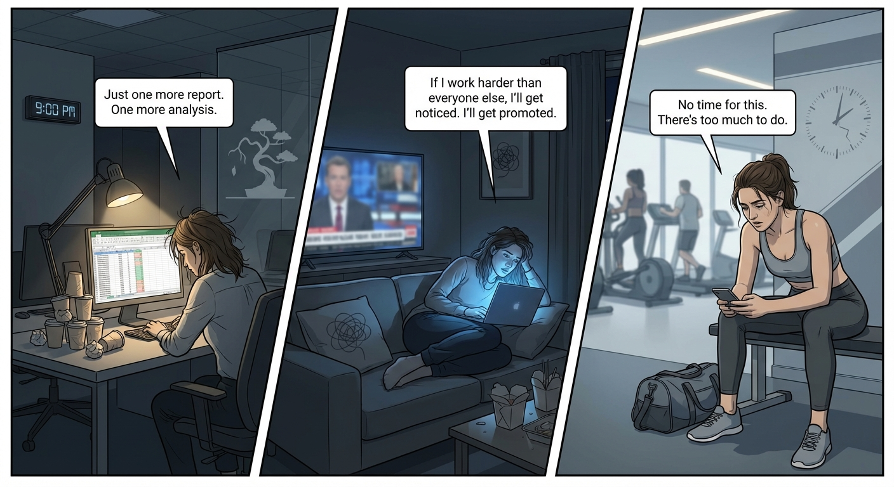

**Maya**: Just one more report. One more analysis.
**Maya**: If I work harder than everyone else, I'll get noticed. I'll get promoted.
**Maya**: No time for this. There's too much to do.

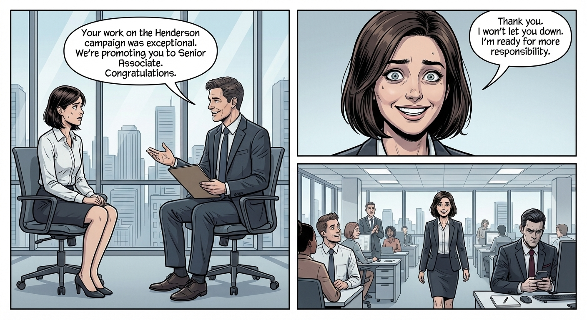

**David**: Your work on the Henderson campaign was exceptional. We're promoting you to Senior Associate.
Congratulations.
**Maya**: Thank you. I won't let you down. I'm ready for more responsibility.
*Picture 3: Catching. You've glimpsed the ox. Now you're running after it with all your might.*

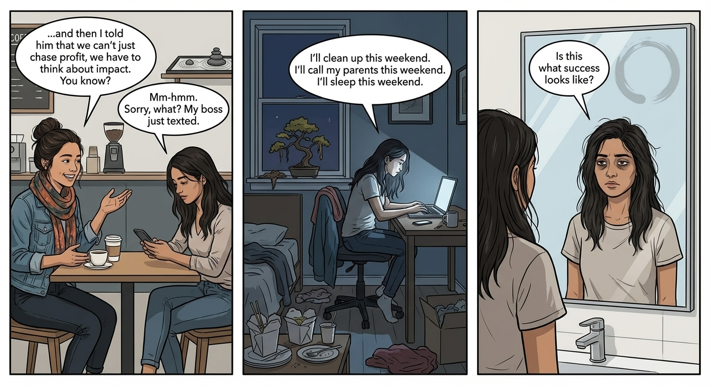

**Sarah**: ...and then I told him that we can't just chase profit, we have to think about impact. You know?
**Maya**: Mm-hmm. Sorry, what? My boss just texted.
**Maya**: I'll clean up this weekend. I'll call my parents this weekend. I'll sleep this weekend.
**Maya**: Is this what success looks like?

## Page 4

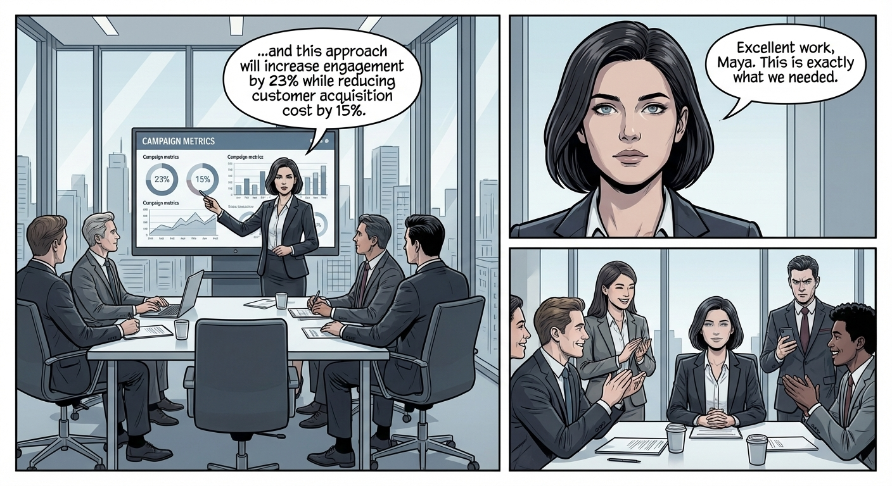

**Maya**: ...and this approach will increase engagement by 23% while reducing customer acquisition cost by 15%.
**Executive**: Excellent work, Maya. This is exactly what we needed.
*She's winning. So why does it feel like losing?*

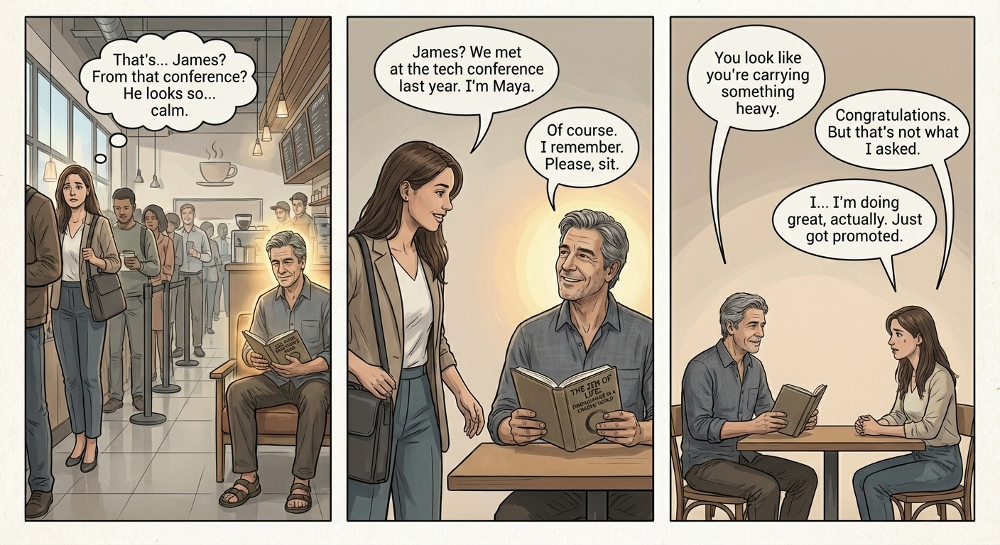

**Maya**: That's... James? From that conference? He looks so... calm.
**Maya**: James? We met at the tech conference last year. I'm Maya.
**James**: Of course. I remember. Please, sit.
**James**: You look like you're carrying something heavy.
**Maya**: I... I'm doing great, actually. Just got promoted.
**James**: Congratulations. But that's not what I asked.

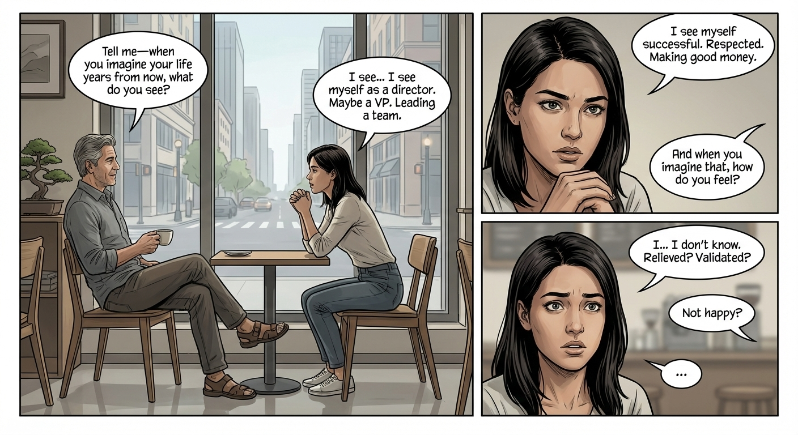

**James**: Tell me—when you imagine your life five years from now, what do you see?
**Maya**: I see... I see myself as a director. Maybe a VP. Leading a team.
**Maya**: I see myself successful. Respected. Making good money.
**James**: And when you imagine that, how do you feel?
**Maya**: I... I don't know. Relieved? Validated?
**James**: Not happy?
**Maya**: ...
*Picture 4: Taming. You begin to wonder if the ox is what you really want to catch.*

## Page 5

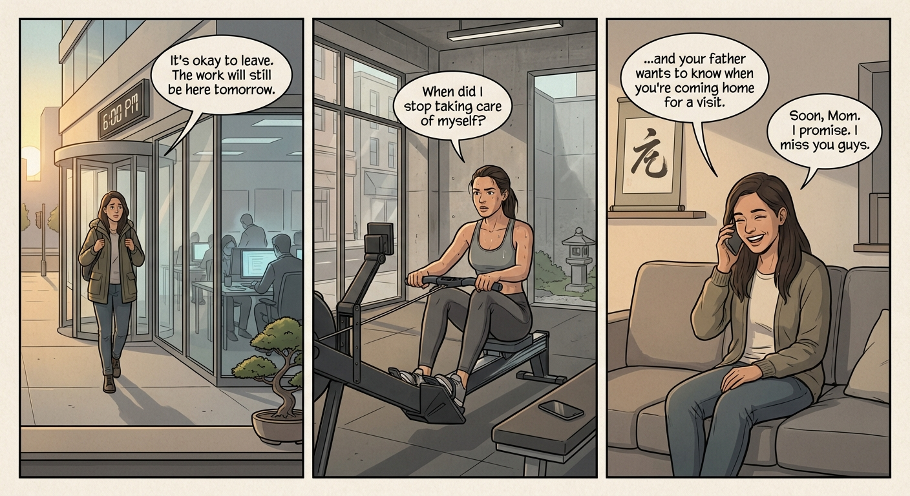

**Maya**: It's okay to leave. The work will still be here tomorrow.
**Maya**: When did I stop taking care of myself?
**Maya's Mom**: ...and your father wants to know when you're coming home for a visit.
**Maya**: Soon, Mom. I promise. I miss you guys.

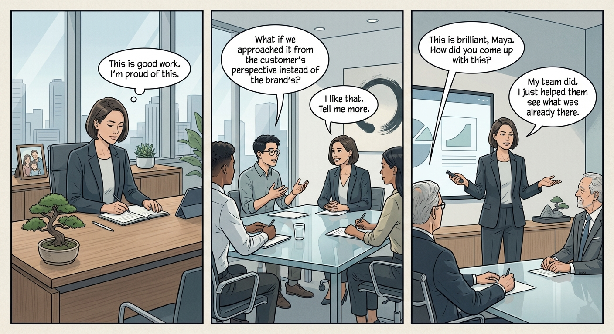

**Maya**: This is good work. I'm proud of this.
**Team Member**: What if we approached it from the customer's perspective instead of the brand's?
**Maya**: I like that. Tell me more.
**Executive**: This is brilliant, Maya. How did you come up with this?
**Maya**: My team did. I just helped them see what was already there.
*Picture 5: Riding. You've learned to work with the ox, not against it. You move together.*

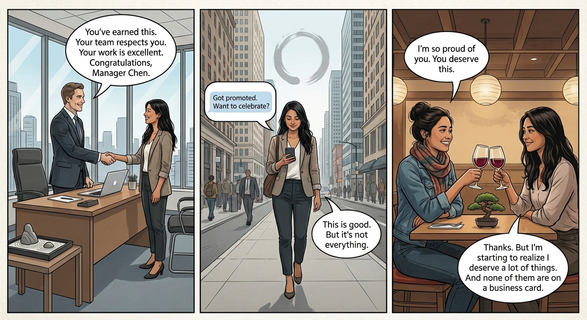

**David**: You've earned this. Your team respects you. Your work is excellent. Congratulations, Manager Chen.
**Maya**: This is good. But it's not everything.
**Sarah**: I'm so proud of you. You deserve this.
**Maya**: Thanks. But I'm starting to realize I deserve a lot of things. And none of them are on a business card.

## Page 6

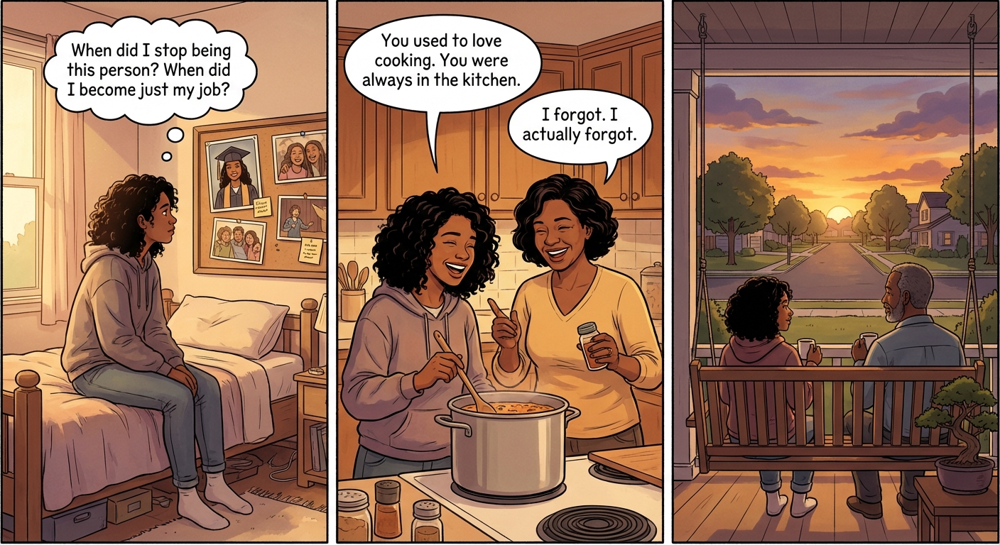

**Maya**: When did I stop being this person? When did I become just my job?
**Maya's Mom**: You used to love cooking. You were always in the kitchen.
**Maya**: I forgot. I actually forgot.
*Picture 6: Coming Home. You remember what you were before you started chasing.*

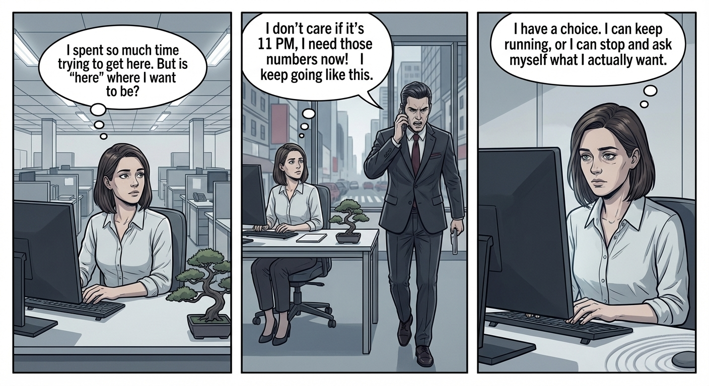

**Maya**: I spent so much time trying to get here. But is 'here' where I want to be?
**Derek**: I don't care if it's 11 PM, I need those numbers now!
**Maya**: That's going to be me in five years if I keep going like this.
**Maya**: I have a choice. I can keep running, or I can stop and ask myself what I actually want.

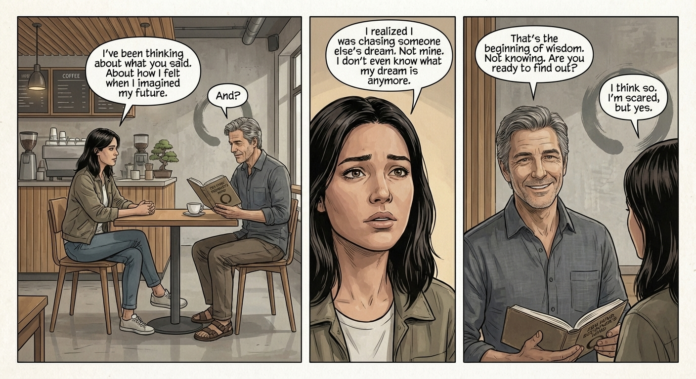

**Maya**: I've been thinking about what you said. About how I felt when I imagined my future.
**James**: And?
**Maya**: I realized I was chasing someone else's dream. Not mine. I don't even know what my dream is anymore.
**James**: That's the beginning of wisdom. Not knowing. Are you ready to find out?
**Maya**: I think so. I'm scared, but yes.
*Picture 7: Forgetting the Ox. You stop chasing and start asking.*

## Page 7

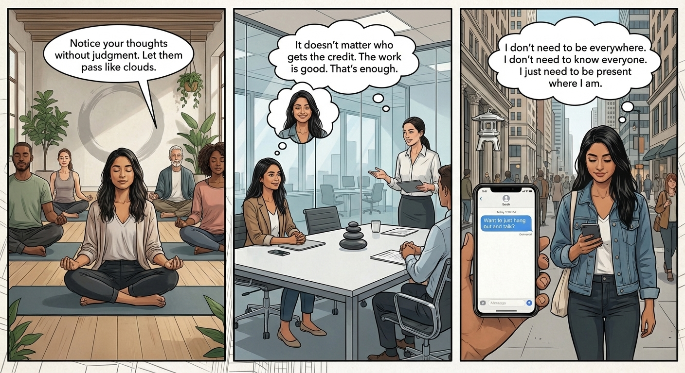

**Meditation Teacher**: Notice your thoughts without judgment. Let them pass like clouds.
**Maya**: It doesn't matter who gets the credit. The work is good. That's enough.
**Maya**: I don't need to be everywhere. I don't need to know everyone. I just need to be present where I am.

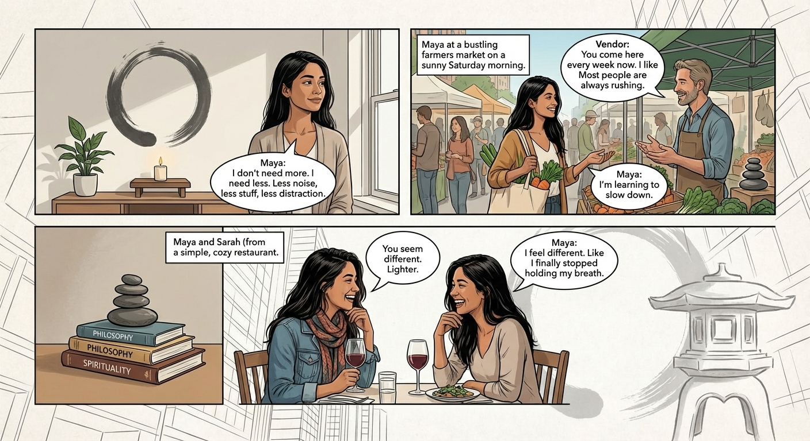

**Maya**: I don't need more. I need less. Less noise, less stuff, less distraction.
**Vendor**: You come here every week now. I like that. Most people are always rushing.
**Maya**: I'm learning to slow down.
**Sarah**: You seem different. Lighter.
**Maya**: I feel different. Like I finally stopped holding my breath.

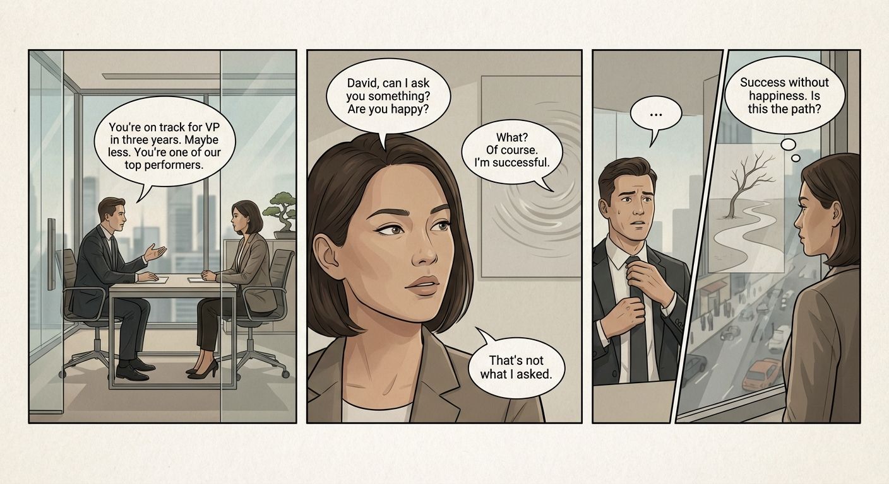

**David**: You're on track for VP in three years. Maybe less. You're one of our top performers.
**Maya**: David, can I ask you something? Are you happy?
**David**: What? Of course. I'm successful.
**Maya**: That's not what I asked.
*Picture 8: Forgetting the Herder. You realize the one chasing the ox was never real either.*

## Page 8

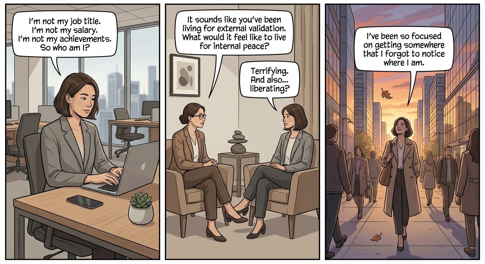

**Maya**: I'm not my job title. I'm not my salary. I'm not my achievements. So who am I?
**Therapist**: It sounds like you've been living for external validation. What would it feel like to live for internal
peace?
**Maya**: Terrifying. And also... liberating?
**Maya**: I've been so focused on getting somewhere that I forgot to notice where I am.

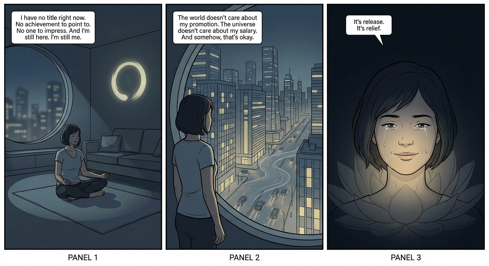

**Maya**: I have no title right now. No achievement to point to. No one to impress. And I'm still here. I'm still me.
**Maya**: The world doesn't care about my promotion. The universe doesn't care about my salary. And somehow, that's
okay.
*Picture 9: Return to Source. You've let go of everything you thought you were. Now you discover what you actually are.*

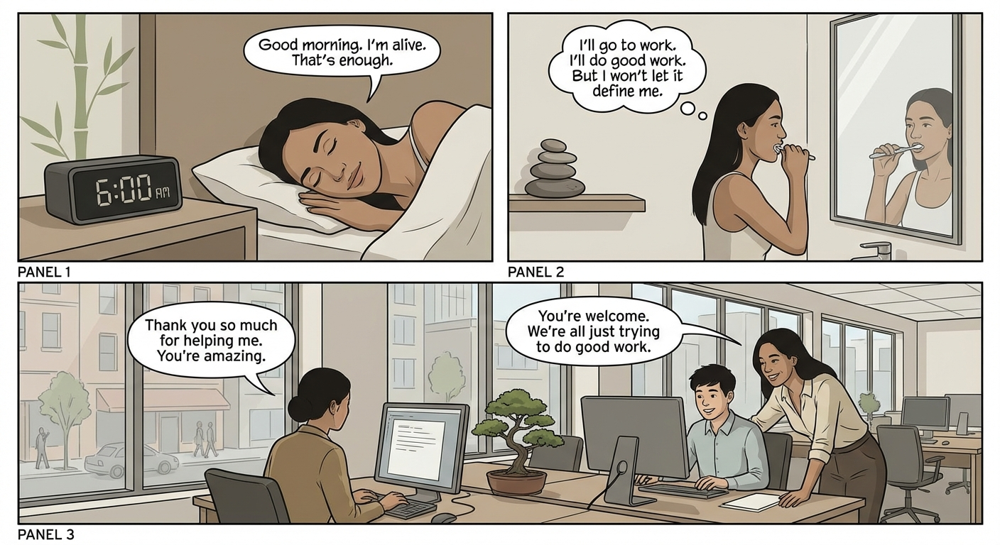

**Maya**: Good morning. I'm alive. That's enough.
**Maya**: I'll go to work. I'll do good work. But I won't let it define me.
**Junior Colleague**: Thank you so much for helping me. You're amazing.
**Maya**: You're welcome. We're all just trying to do good work.

## Page 9

**Maya**: I've been thinking about my future. I want to step back from the management track.
**David**: What? Why? You're on your way to VP.
**Maya**: Because I realized I don't want to be VP. I want to do meaningful work. I want to have time for my life. I
want to be happy.
**David**: But you're so close to everything you've been working for.
**Maya**: I know. And I'm choosing something else.

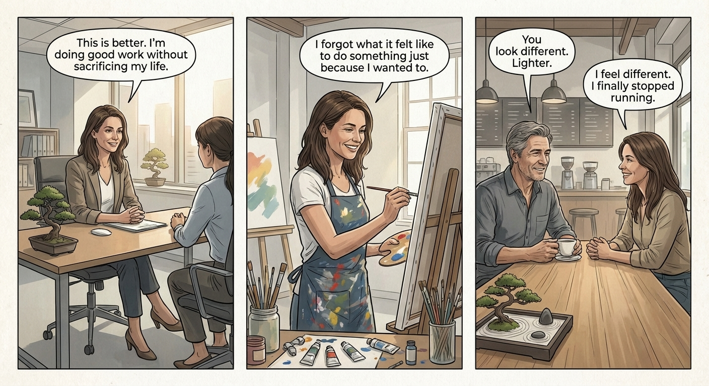

**Maya**: This is better. I'm doing good work without sacrificing my life.
**Maya**: I forgot what it felt like to do something just because I wanted to.
**James**: You look different. Lighter.
**Maya**: I feel different. I finally stopped running.

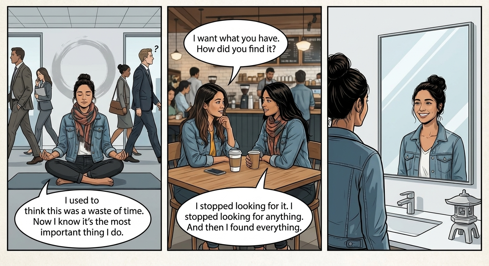

**Maya**: I used to think this was a waste of time. Now I know it's the most important thing I do.
**Sarah**: I want what you have. How did you find it?
**Maya**: I stopped looking for it. I stopped looking for anything. And then I found everything.
*Picture 10: In the Marketplace. You've returned to the world, but you're no longer of it. You're free.*

## Page 10

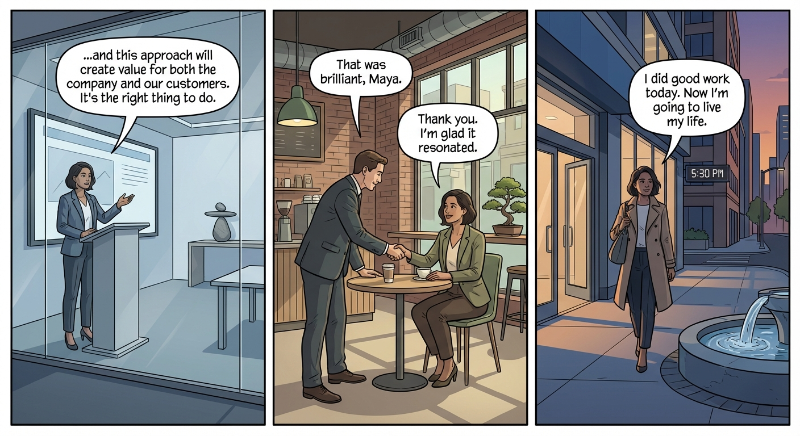

**Maya**: ...and this approach will create value for both the company and our customers. It's the right thing to do.
**Colleague**: That was brilliant, Maya.
**Maya**: Thank you. I'm glad it resonated.
**Maya**: I did good work today. Now I'm going to live my life.

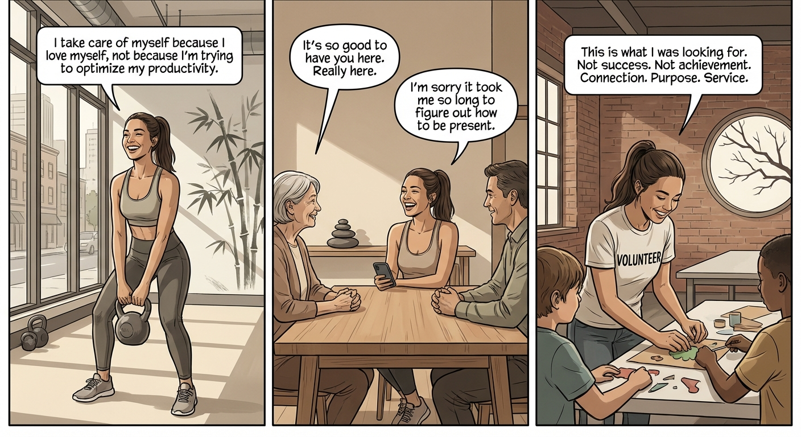

**Maya**: I take care of myself because I love myself, not because I'm trying to optimize my productivity.
**Maya's Mom**: It's so good to have you here. Really here.
**Maya**: I'm sorry it took me so long to figure out how to be present.
**Maya**: This is what I was looking for. Not success. Not achievement. Connection. Purpose. Service.

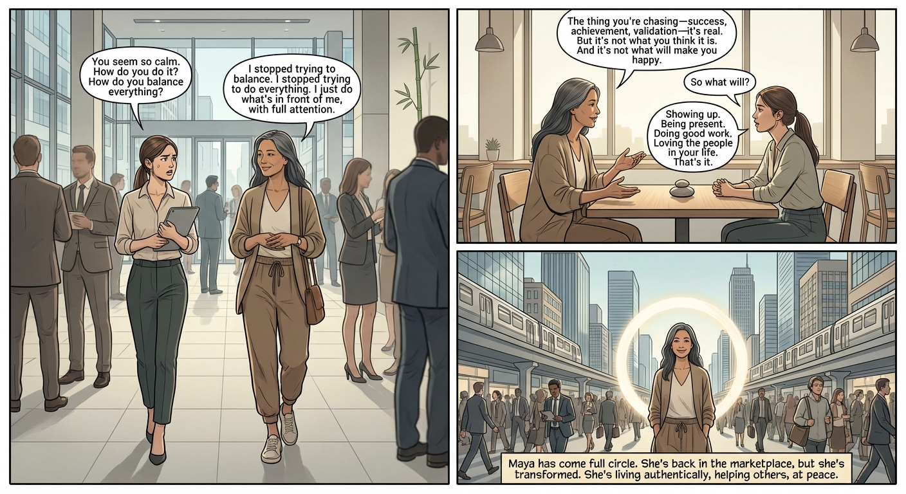

**Young Professional**: You seem so calm. How do you do it? How do you balance everything?
**Maya**: I stopped trying to balance. I stopped trying to do everything. I just do what's in front of me, with full
attention.
**Maya**: The thing you're chasing—success, achievement, validation—it's real. But it's not what you think it is. And
it's not what will make you happy.
**Young Professional**: So what will?
**Maya**: Showing up. Being present. Doing good work. Loving the people in your life. That's it.
*Picture 10: In the Marketplace. You've returned with empty hands and a full heart. You work, you love, you serve. And
you are free.*

### Topics

* `{career and professional development}` - `job search`, `career advancement`, `promotion`, `management track`,
  `work performance`, `professional ambition`
* `{self-discovery and personal growth}` - `identity beyond career`, `self-awareness`, `finding purpose`,
  `personal values`, `life direction`, `authenticity`
* `{work-life balance}` - `burnout`, `overwork`, `time management`, `self-care`, `presence`, `life priorities`
* `{happiness and fulfillment}` - `external validation`, `internal peace`, `meaning`, `contentment`, `freedom`,
  `well-being`
* `{relationships and connection}` - `family`, `friendships`, `mentorship`, `community`, `service to others`
* `{mindfulness and spirituality}` - `meditation`, `letting go`, `acceptance`, `wisdom`, `return to source`

