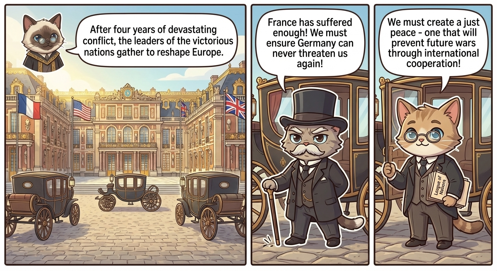

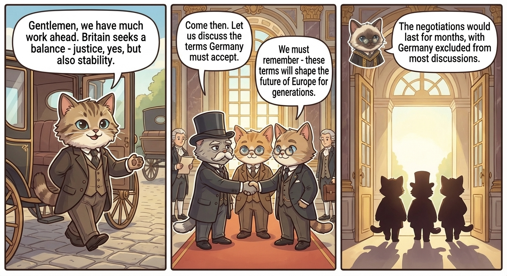

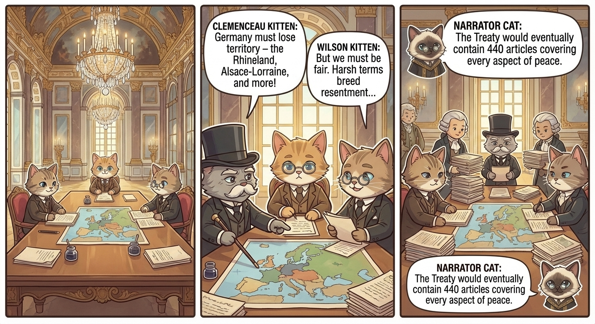

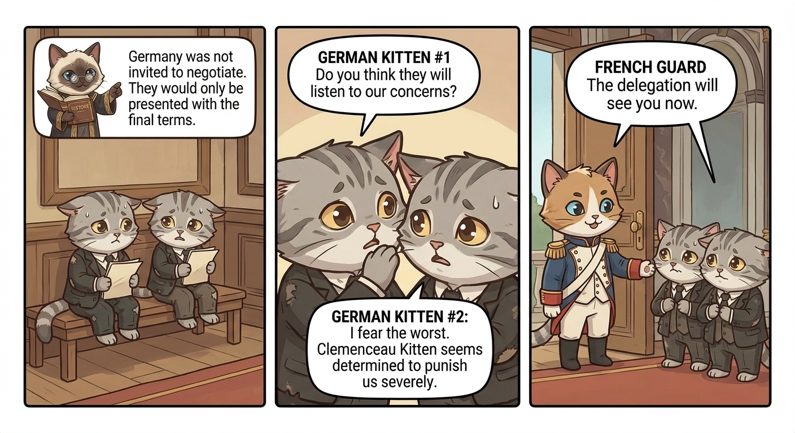

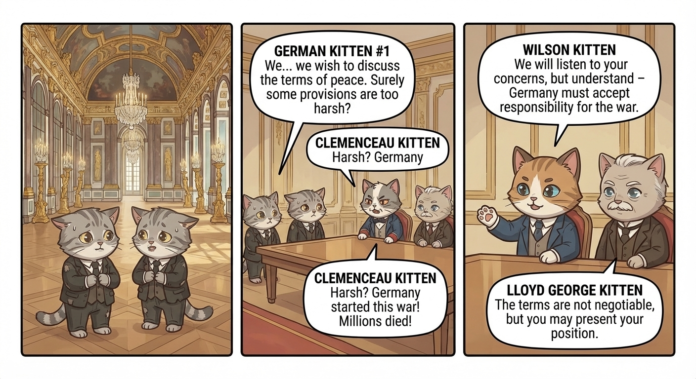

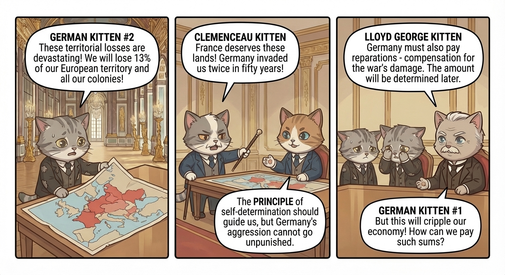

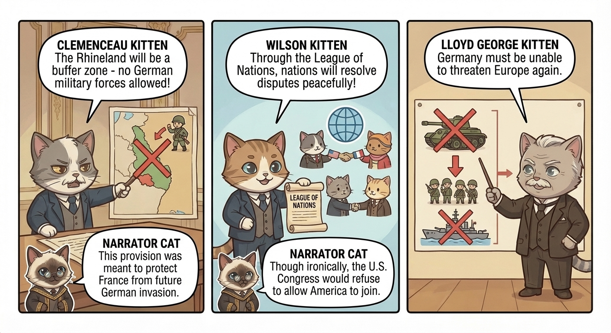

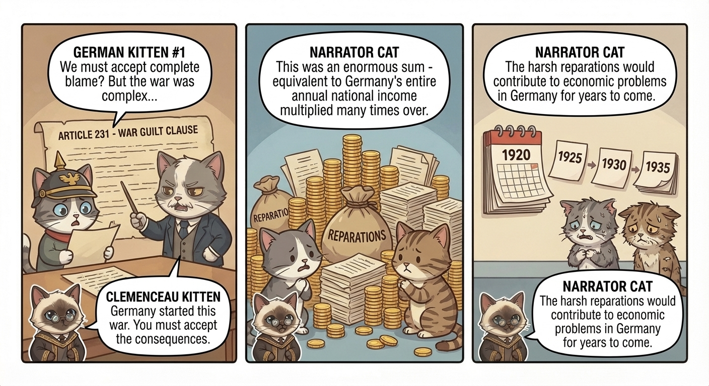

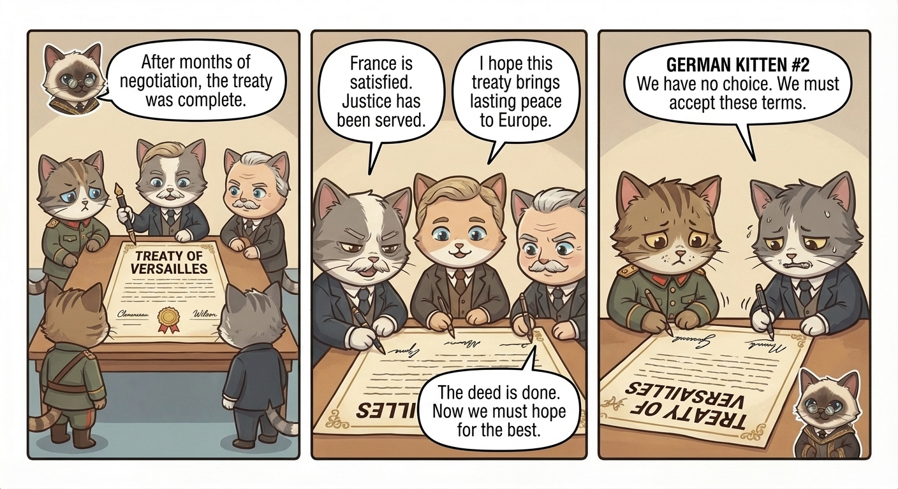

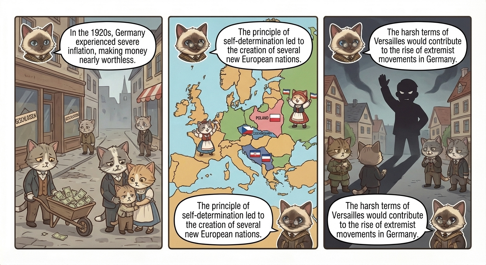

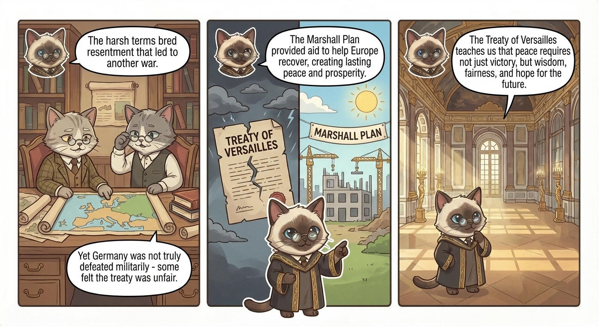

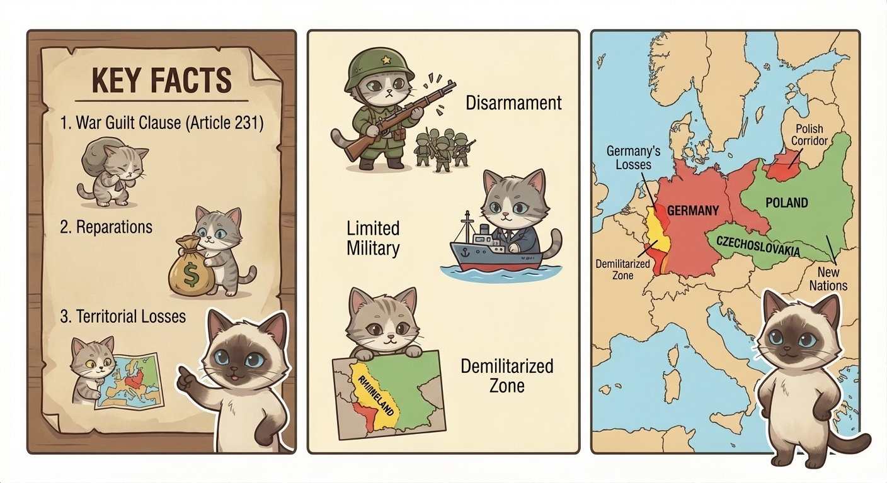

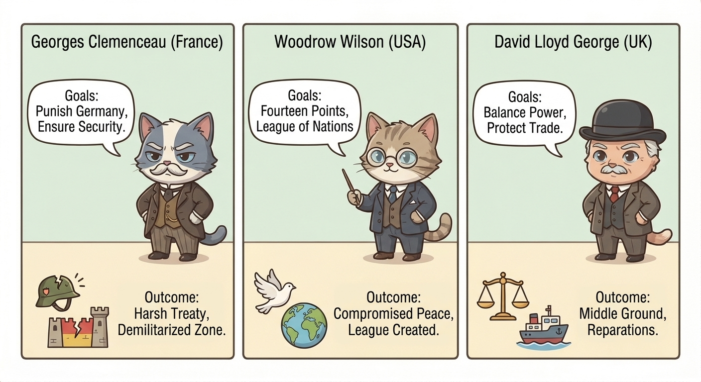

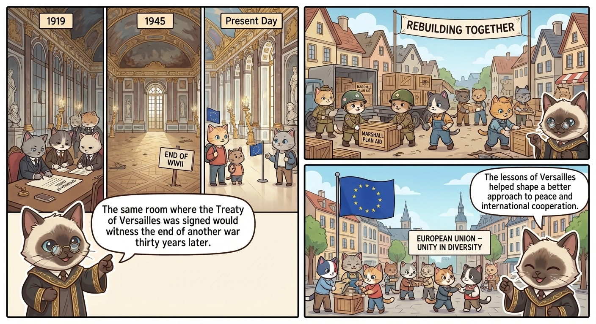

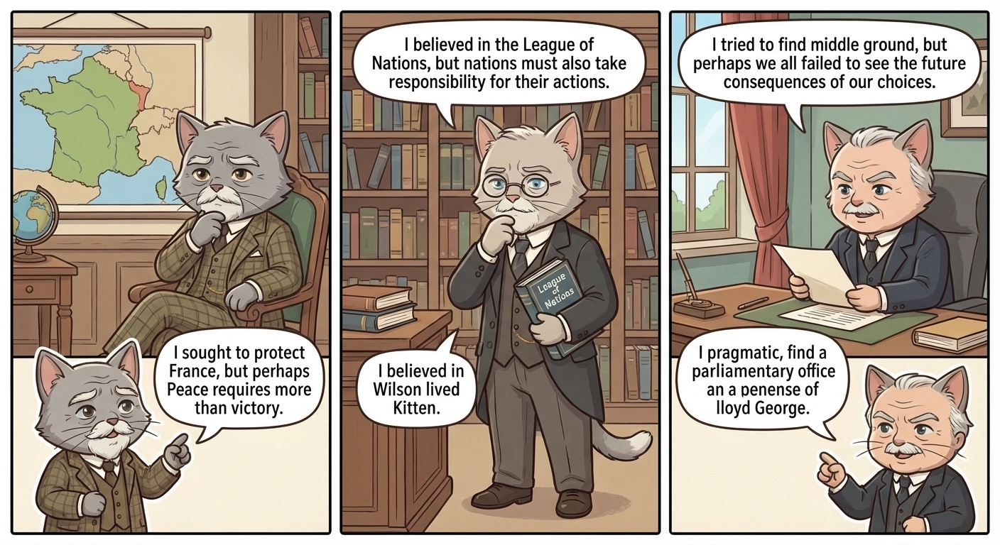

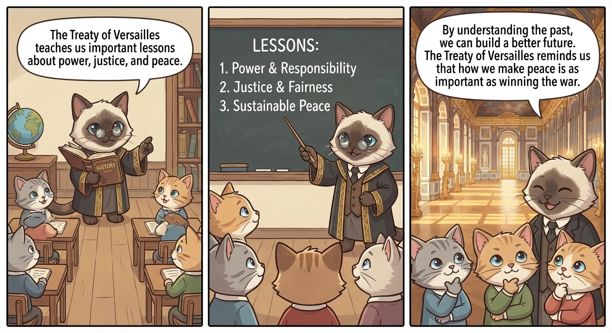

# Comic Book Generation Task

# WHISKER DIPLOMACY: THE TREATY OF VERSAILLES

*In 1919, the great powers of Europe gather at the magnificent Hall of Mirrors in Versailles to negotiate peace after
the devastating World War I. This educational comic follows four anthropomorphic kitten diplomats as they navigate
complex negotiations, competing interests, and the challenge of creating a lasting peace. Through their interactions,
young readers learn about the historical Treaty of Versailles, its key provisions, and its lasting impact on world
history.*

## Characters

- **CLEMENCEAU KITTEN (Georges)**: A stern, elderly tabby cat with sharp eyes and a determined expression. Prime
  Minister of France. Tough negotiator who wants harsh penalties for Germany and is protective of France. (Gray and
  white striped fur, wears a formal black suit with a red tie, carries a walking cane, has a small monocle)
- **WILSON KITTEN (Woodrow)**: An idealistic, intellectual white Persian cat with kind eyes. President of the United
  States. Believes in fair peace and international cooperation, somewhat naive about European politics. (Pure white
  fluffy fur, wears a formal gray suit with spectacles, carries documents about the League of Nations)
- **LLOYD GEORGE KITTEN (David)**: A clever, diplomatic orange tabby with a charming demeanor. Prime Minister of Great
  Britain. Pragmatic mediator who tries to balance French demands with Wilson's idealism while protecting British
  interests. (Bright orange fur, wears a formal navy suit with a pocket watch chain, has a friendly but calculating
  expression)
- **GERMAN KITTEN REPRESENTATIVES**: Two anxious, younger gray tabby kittens representing defeated Germany. Fearful and
  defensive, trying to protect their nation from harsh penalties. (Nervous expressions, wear formal but slightly worn
  suits, ears often pinned back in worry)
- **NARRATOR CAT**: A wise, elderly Siamese cat who appears throughout to provide historical context and educational
  information. (Cream and chocolate colored fur, wears spectacles and a scholar's robes, carries a history book)

## Script

### Page 1

**Row 1**

- Panel 1: Wide exterior shot of the Palace of Versailles with morning sunlight. Three elegant carriages pull up to the
  grand entrance. Flags of France, America, and Britain flutter in the breeze.
    - **NARRATOR CAT**: "After four years of devastating conflict, the leaders of the victorious nations gather to
      reshape Europe."
    - *Caption*: June 1919 - The Palace of Versailles, France. The Great War has ended, but the peace must still be
      negotiated.
- Panel 2: Clemenceau Kitten steps out of the first carriage, tapping his cane on the ground with determination. His
  expression is stern and focused.
    - **CLEMENCEAU KITTEN**: "France has suffered enough! We must ensure Germany can never threaten us again!"
    - *Caption*: Clemenceau Kitten - determined to punish Germany for the war's destruction.
- Panel 3: Wilson Kitten emerges from the second carriage, adjusting his spectacles and holding documents about the
  League of Nations. He looks hopeful and idealistic.
    - **WILSON KITTEN**: "We must create a just peace - one that will prevent future wars through international
      cooperation!"
    - *Caption*: Wilson Kitten - believes in a fair and lasting peace based on his Fourteen Points.
      **Row 2**
- Panel 1: Lloyd George Kitten steps from the third carriage, smoothing his suit and offering a diplomatic smile. He
  extends his paw in greeting.
    - **LLOYD GEORGE KITTEN**: "Gentlemen, we have much work ahead. Britain seeks a balance - justice, yes, but also
      stability."
    - *Caption*: Lloyd George Kitten - the pragmatic mediator between French demands and American idealism.
- Panel 2: The three leaders shake paws at the palace entrance. Behind them, servants carry documents and briefcases.
  The grand doors of the Hall of Mirrors loom behind them.
    - **CLEMENCEAU KITTEN**: "Come then. Let us discuss the terms Germany must accept."
    - **WILSON KITTEN**: "We must remember - these terms will shape the future of Europe for generations."
- Panel 3: The three leaders walk together into the palace, their silhouettes framed by the grand doorway. Sunlight
  streams through the windows.
    - **NARRATOR CAT**: "The negotiations would last for months, with Germany excluded from most discussions."
    - *Caption*: The three leaders enter the Hall of Mirrors, where history will be written.
      **Row 3**
- Panel 1: Interior of the Hall of Mirrors - ornate mirrors line the walls, reflecting light from massive chandeliers. A
  long negotiation table is covered with maps of Europe.
    - *Caption*: Inside the Hall of Mirrors - the most famous room in the palace, chosen as the site of peace
      negotiations.
- Panel 2: Close-up of the three leaders at the negotiation table. Clemenceau points to a map of Germany with his cane.
  Wilson takes notes. Lloyd George studies documents.
    - **CLEMENCEAU KITTEN**: "Germany must lose territory - the Rhineland, Alsace-Lorraine, and more!"
    - **WILSON KITTEN**: "But we must be fair. Harsh terms breed resentment..."
    - **LLOYD GEORGE KITTEN**: "Perhaps we can find middle ground, gentlemen."
- Panel 3: Servants bring in more documents and maps. The table is now piled high with papers. The three leaders look
  determined but tired.
    - **NARRATOR CAT**: "The Treaty would eventually contain 440 articles covering every aspect of peace."
    - *Caption*: The negotiations begin. The leaders must decide the fate of Germany and the future of Europe.

### Page 2

**Row 1**

- Panel 1: A smaller, less ornate room adjacent to the Hall of Mirrors. Two nervous gray tabby kittens in formal suits
  sit on a bench, their ears pinned back. They clutch documents nervously.
    - **NARRATOR CAT**: "Germany was not invited to negotiate. They would only be presented with the final terms."
    - *Caption*: May 1919 - The German delegation awaits their turn to present their position.
- Panel 2: Close-up of the two German kittens. The first one whispers to the second, both looking worried.
    - **GERMAN KITTEN #1**: "Do you think they will listen to our concerns?"
    - **GERMAN KITTEN #2**: "I fear the worst. Clemenceau Kitten seems determined to punish us severely."
- Panel 3: A French guard kitten opens the door and gestures for the German representatives to enter. The German kittens
  stand nervously, straightening their suits.
    - **FRENCH GUARD**: "The delegation will see you now."
    - *Caption*: The German representatives are called to present their case to the Allied leaders.
      **Row 2**
- Panel 1: The two German kittens enter the grand hall, looking small and intimidated by the ornate surroundings and the
  stern faces of the three Allied leaders.
    - *Caption*: The German delegation enters the Hall of Mirrors to face the victorious powers.
- Panel 2: The German kittens stand before the table. Clemenceau Kitten leans forward menacingly. Wilson Kitten looks
  sympathetic but firm. Lloyd George Kitten appears neutral.
    - **GERMAN KITTEN #1**: "We... we wish to discuss the terms of peace. Surely some provisions are too harsh?"
    - **CLEMENCEAU KITTEN**: "Harsh? Germany started this war! Millions died!"
- Panel 3: Wilson Kitten raises a paw to calm Clemenceau. Lloyd George Kitten nods slightly to the German
  representatives.
    - **WILSON KITTEN**: "We will listen to your concerns, but understand - Germany must accept responsibility for the
      war."
    - **LLOYD GEORGE KITTEN**: "The terms are not negotiable, but you may present your position."
      **Row 3**
- Panel 1: German Kitten #2 unfolds a map and points to territorial losses. The map shows Germany losing significant
  territory to France, Poland, and other nations.
    - **GERMAN KITTEN #2**: "These territorial losses are devastating! We will lose 13% of our European territory and
      all our colonies!"
    - *Caption*: Germany would lose Alsace-Lorraine to France, the Rhineland would be demilitarized, and new nations
      would be created from German territory.
- Panel 2: Clemenceau Kitten stands and points his cane at the map, his expression stern.
    - **CLEMENCEAU KITTEN**: "France deserves these lands! Germany invaded us twice in fifty years!"
    - **WILSON KITTEN**: "The principle of self-determination should guide us, but Germany's aggression cannot go
      unpunished."
- Panel 3: The German kittens look devastated as Lloyd George Kitten explains the reparations.
    - **LLOYD GEORGE KITTEN**: "Germany must also pay reparations - compensation for the war's damage. The amount will
      be determined later."
    - **GERMAN KITTEN #1**: "But this will cripple our economy! How can we pay such sums?"
    - *Caption*: Germany would eventually be required to pay 132 billion gold marks in reparations - an enormous sum.

### Page 3

**Row 1**

- Panel 1: Clemenceau Kitten points to a document listing territorial changes. A map shows the Rhineland being
  demilitarized (shown with a red X).
    - **CLEMENCEAU KITTEN**: "The Rhineland will be a buffer zone - no German military forces allowed!"
    - **NARRATOR CAT**: "This provision was meant to protect France from future German invasion."
    - *Caption*: TERRITORIAL PROVISIONS: Germany loses territory and the Rhineland becomes a demilitarized zone.
- Panel 2: Wilson Kitten holds up a document about the League of Nations. Illustrations show different nations joining
  together.
    - **WILSON KITTEN**: "Through the League of Nations, nations will resolve disputes peacefully!"
    - **NARRATOR CAT**: "Though ironically, the U.S. Congress would refuse to allow America to join."
    - *Caption*: THE LEAGUE OF NATIONS: Wilson Kitten's dream - an international organization to prevent future wars.
- Panel 3: Lloyd George Kitten points to military restrictions. Illustrations show German weapons being limited - tanks
  crossed out, army size reduced.
    - **LLOYD GEORGE KITTEN**: "Germany must be unable to threaten Europe again."
    - *Caption*: MILITARY RESTRICTIONS: Germany's army limited to 100,000 soldiers, no tanks, no air force, limited
      navy.
      **Row 2**
- Panel 1: A large document labeled "Article 231 - War Guilt Clause" is shown. German Kitten #1 reads it with growing
  horror.
    - **GERMAN KITTEN #1**: "We must accept complete blame? But the war was complex..."
    - **CLEMENCEAU KITTEN**: "Germany started this war. You must accept the consequences."
    - *Caption*: ARTICLE 231 - THE WAR GUILT CLAUSE: Germany must accept full responsibility for starting the war.
- Panel 2: Stacks of gold coins and documents representing reparations are shown. The German kittens look at the
  enormous pile with despair.
    - **NARRATOR CAT**: "This was an enormous sum - equivalent to Germany's entire annual national income multiplied
      many times over."
    - *Caption*: REPARATIONS: Germany must pay for all war damages. The final amount: 132 billion gold marks.
- Panel 3: A calendar showing years passing - 1920, 1925, 1930, 1935. The German kittens look increasingly stressed as
  the years go by.
    - **NARRATOR CAT**: "The harsh reparations would contribute to economic problems in Germany for years to come."
    - *Caption*: Germany would spend decades trying to pay these reparations, creating economic hardship.
      **Row 3**
- Panel 1: The three Allied leaders and German representatives gather around a large document. Clemenceau Kitten
  prepares to sign with a ceremonial pen.
    - **NARRATOR CAT**: "After months of negotiation, the treaty was complete."
    - *Caption*: June 28, 1919 - The Treaty of Versailles is ready for signing.
- Panel 2: Close-up of the three leaders signing the document. Their expressions show determination and satisfaction (
  for the Allies) and resignation (for the Germans).
    - **CLEMENCEAU KITTEN**: "France is satisfied. Justice has been served."
    - **WILSON KITTEN**: "I hope this treaty brings lasting peace to Europe."
    - **LLOYD GEORGE KITTEN**: "The deed is done. Now we must hope for the best."
- Panel 3: The German kittens sign reluctantly, their paws trembling slightly. The document is now complete.
    - **GERMAN KITTEN #2**: "We have no choice. We must accept these terms."
    - *Caption*: Germany signs the Treaty of Versailles, though many Germans feel humiliated and resentful.

### Page 4

**Row 1**

- Panel 1: In France, French kittens celebrate in the streets. Flags wave, and crowds cheer. Clemenceau Kitten is shown
  as a hero.
    - **FRENCH KITTEN IN CROWD**: "France is safe! Germany will never threaten us again!"
    - *Caption*: In France, the treaty is celebrated as a victory and protection against future German aggression.
- Panel 2: In America, Wilson Kitten returns home triumphantly, but American Congress kittens look skeptical and shake
  their heads.
    - **AMERICAN CONGRESS KITTEN**: "We will not entangle ourselves in European affairs!"
    - **NARRATOR CAT**: "The U.S. Senate voted against joining the League of Nations, weakening the organization."
    - *Caption*: In America, Wilson Kitten returns as a hero, but Congress refuses to ratify the treaty or join the
      League of Nations.
- Panel 3: In Germany, German kittens look angry and resentful. Some tear up pictures of the treaty. Others look sad and
  defeated.
    - **ANGRY GERMAN KITTEN**: "These terms are impossible! Germany will never accept this injustice!"
    - **NARRATOR CAT**: "German resentment over the treaty would have serious consequences for Europe's future."
    - *Caption*: In Germany, the treaty is seen as a humiliation. Many Germans feel betrayed and angry.
      **Row 2**
- Panel 1: German kittens struggle with economic hardship. Empty shops, worried faces, and struggling families are
  shown.
    - **NARRATOR CAT**: "In the 1920s, Germany experienced severe inflation, making money nearly worthless."
    - *Caption*: The reparations burden cripples Germany's economy. Inflation soars, and Germans suffer economic
      hardship.
- Panel 2: New nations are shown on a map - Poland, Czechoslovakia, Yugoslavia - created from former German and
  Austro-Hungarian territory.
    - **NARRATOR CAT**: "The principle of self-determination led to the creation of several new European nations."
    - *Caption*: NEW NATIONS: The treaty creates new independent nations from the defeated empires.
- Panel 3: A dark shadow looms over Germany. A sinister figure (silhouette) appears to be rising in the background.
    - **NARRATOR CAT**: "The harsh terms of Versailles would contribute to the rise of extremist movements in Germany."
    - *Caption*: The seeds of future conflict are sown. German resentment and economic hardship create fertile ground
      for extremism.
      **Row 3**
- Panel 1: Historians and scholars (shown as wise old cats) study documents and maps of the treaty.
    - **HISTORIAN CAT #1**: "The harsh terms bred resentment that led to another war."
    - **HISTORIAN CAT #2**: "Yet Germany was not truly defeated militarily - some felt the treaty was unfair."
    - *Caption*: HISTORICAL REFLECTION: Historians debate whether the Treaty of Versailles was too harsh or not harsh
      enough.
- Panel 2: A comparison is shown - on one side, the Treaty of Versailles (harsh), on the other side, the Marshall Plan
  after WWII (generous aid to rebuild).
    - **NARRATOR CAT**: "The Marshall Plan provided aid to help Europe recover, creating lasting peace and prosperity."
    - *Caption*: After World War II, the Allies learned from Versailles. They helped rebuild Germany and Japan instead
      of punishing them.
- Panel 3: The Narrator Cat stands in the Hall of Mirrors, looking thoughtful. The room is peaceful and quiet.
    - **NARRATOR CAT**: "The Treaty of Versailles teaches us that peace requires not just victory, but wisdom, fairness,
      and hope for the future."
    - *Caption*: The Treaty of Versailles: A lesson in how the terms of peace can shape the course of history.

### Page 5

**Row 1**

- Panel 1: A large document with "KEY FACTS" written at the top. Important information is listed with illustrations.
    - *Caption*: KEY FACTS ABOUT THE TREATY OF VERSAILLES: Signed: June 28, 1919 | Location: Hall of Mirrors, Palace of
      Versailles, France | Parties: Allied Powers (France, Britain, USA, Italy, Japan) vs. Germany | Duration of
      Negotiations: 6 months | Number of Articles: 440
- Panel 2: Illustrations of the main provisions with labels.
    - *Caption*: MAIN PROVISIONS: Territorial losses: 13% of German territory | Reparations: 132 billion gold marks |
      Military restrictions: Army limited to 100,000 | War guilt clause: Germany accepts responsibility | League of
      Nations: New international organization
- Panel 3: A map of Europe showing territorial changes - Germany's losses, new nations created, demilitarized zones.
    - *Caption*: TERRITORIAL CHANGES: Germany loses territory; new nations are created.
      **Row 2**
- Panel 1: Clemenceau Kitten's profile with his goals and achievements listed.
    - *Caption*: CLEMENCEAU KITTEN - FRANCE | Goals: Punish Germany, protect France, regain lost territories |
      Achievements: Germany loses Alsace-Lorraine, Rhineland demilitarized, reparations imposed | Legacy: France feels
      secure but German resentment grows
- Panel 2: Wilson Kitten's profile with his goals and outcomes.
    - *Caption*: WILSON KITTEN - UNITED STATES | Goals: Create lasting peace, establish League of Nations, fair
      treatment of all nations | Achievements: League of Nations created, Fourteen Points influence treaty | Legacy:
      U.S. Congress refuses to join League; idealism meets political reality
- Panel 3: Lloyd George Kitten's profile with his role and impact.
    - *Caption*: LLOYD GEORGE KITTEN - GREAT BRITAIN | Goals: Balance French demands with American idealism, protect
      British interests | Achievements: Mediates between Clemenceau and Wilson, maintains British naval superiority |
      Legacy: Pragmatic diplomacy, but treaty's harshness still creates problems
      **Row 3**
- Panel 1: A timeline showing events from 1919 to 1939, with key events marked.
    - *Caption*: LONG-TERM CONSEQUENCES: 1919: Treaty signed | 1920s: German economic crisis | 1933: Hitler rises to
      power in Germany | 1939: World War II begins
- Panel 2: Illustrations showing the connection between Versailles and WWII - resentment leading to extremism.
    - *Caption*: HOW VERSAILLES LED TO WORLD WAR II: German resentment over harsh terms | Economic hardship from
      reparations | Rise of extremist movements | Hitler promises to overturn the treaty | Leads to another devastating
      war
- Panel 3: The Narrator Cat points to a lesson written on a scroll.
    - **NARRATOR CAT**: "Peace treaties must balance justice with mercy. Too much punishment breeds resentment and
      future conflict. Too little accountability allows aggression to continue. True peace requires wisdom."
    - *Caption*: THE LESSON OF VERSAILLES: Peace treaties must balance justice with mercy. Too much punishment breeds
      resentment and future conflict. Too little accountability allows aggression to continue. True peace requires
      wisdom.

### Page 6

**Row 1**

- Panel 1: The Hall of Mirrors is shown in different time periods - 1919 (treaty signing), 1945 (after WWII), and
  present day (peaceful).
    - **NARRATOR CAT**: "The same room where the Treaty of Versailles was signed would witness the end of another war
      thirty years later."
    - *Caption*: THE HALL OF MIRRORS THROUGH TIME
- Panel 2: After WWII, the Marshall Plan is shown - American aid helping to rebuild Europe. German and French kittens
  work together.
    - **NARRATOR CAT**: "This time, the peace was built on reconstruction and cooperation, not punishment and
      resentment."
    - *Caption*: After World War II, the Allies learned from Versailles. They helped rebuild Germany and Europe.
- Panel 3: Modern Europe is shown - the European Union flag, kittens of different nations working together peacefully.
    - **NARRATOR CAT**: "The lessons of Versailles helped shape a better approach to peace and international
      cooperation."
    - *Caption*: Today, former enemies work together in the European Union, proving that lasting peace is possible.
      **Row 2**
- Panel 1: Clemenceau Kitten, now older and wiser, reflects on his role.
    - **CLEMENCEAU KITTEN**: "I sought to protect France, but perhaps I was too harsh. Peace requires more than
      victory."
    - *Caption*: Clemenceau Kitten reflects on the consequences of his demands.
- Panel 2: Wilson Kitten, also older, considers his idealism and its limitations.
    - **WILSON KITTEN**: "I believed in the League of Nations, but nations must also take responsibility for their
      actions."
    - *Caption*: Wilson Kitten reflects on the balance between idealism and practical politics.
- Panel 3: Lloyd George Kitten, the pragmatist, offers his perspective.
    - **LLOYD GEORGE KITTEN**: "I tried to find middle ground, but perhaps we all failed to see the future consequences
      of our choices."
    - *Caption*: Lloyd George Kitten reflects on the complexity of peacemaking.
      **Row 3**
- Panel 1: The Narrator Cat stands in front of a classroom of young kittens, teaching them about history.
    - **NARRATOR CAT**: "The Treaty of Versailles teaches us important lessons about power, justice, and peace."
    - *Caption*: LEARNING FROM HISTORY
- Panel 2: The Narrator Cat points to key lessons written on a board.
    - *Caption*: KEY LESSONS FROM THE TREATY OF VERSAILLES: 1. Peace treaties shape the future - their terms matter
      greatly | 2. Harsh punishment without hope breeds resentment and conflict | 3. International cooperation is
      essential for lasting peace | 4. Economic justice is as important as political justice | 5. Wisdom and compassion
      are needed alongside strength
- Panel 3: Young kittens look thoughtful and engaged. The Narrator Cat smiles warmly. The Hall of Mirrors is shown in
  the background, peaceful and beautiful.
    - **NARRATOR CAT**: "By understanding the past, we can build a better future. The Treaty of Versailles reminds us
      that how we make peace is as important as winning the war."
    - *Caption*: THE END - Remember: History teaches us how to create a more just and peaceful world. The Treaty of
      Versailles (1919) - A turning point in world history that shaped the twentieth century and beyond.

## CLEMENCEAU KITTEN (Georges)

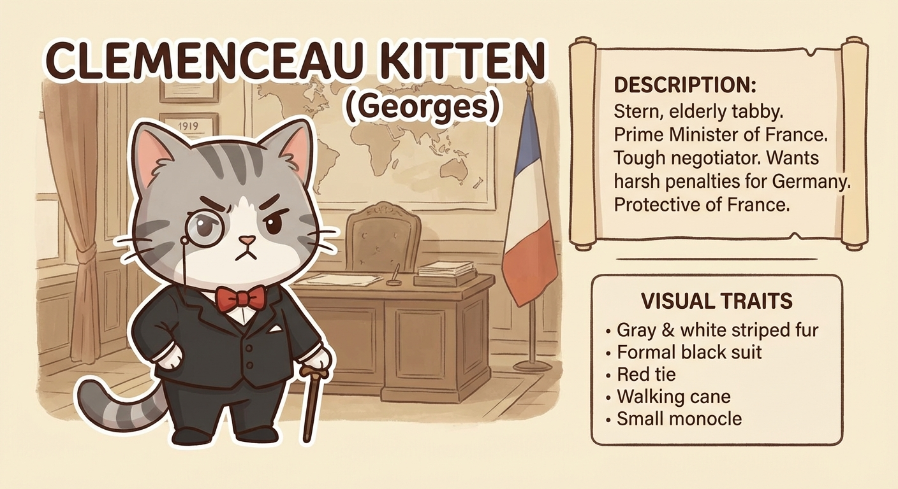

*A stern, elderly tabby cat with sharp eyes and a determined expression. Prime Minister of France. Tough negotiator who
wants harsh penalties for Germany and is protective of France.*

## WILSON KITTEN (Woodrow)

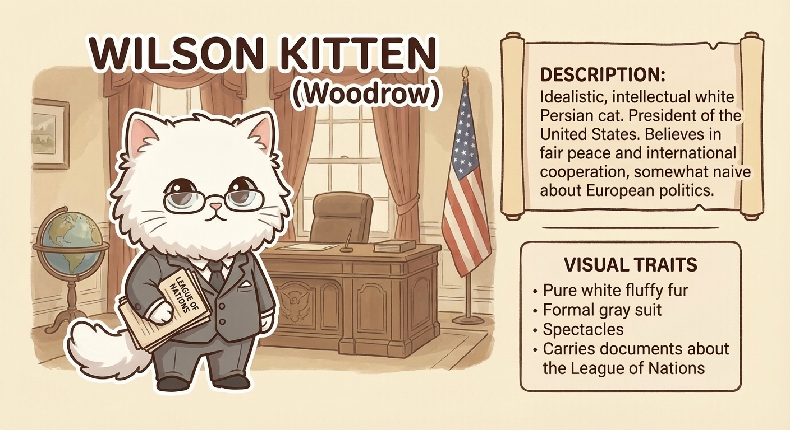

*An idealistic, intellectual white Persian cat with kind eyes. President of the United States. Believes in fair peace
and international cooperation, somewhat naive about European politics.*

## LLOYD GEORGE KITTEN (David)

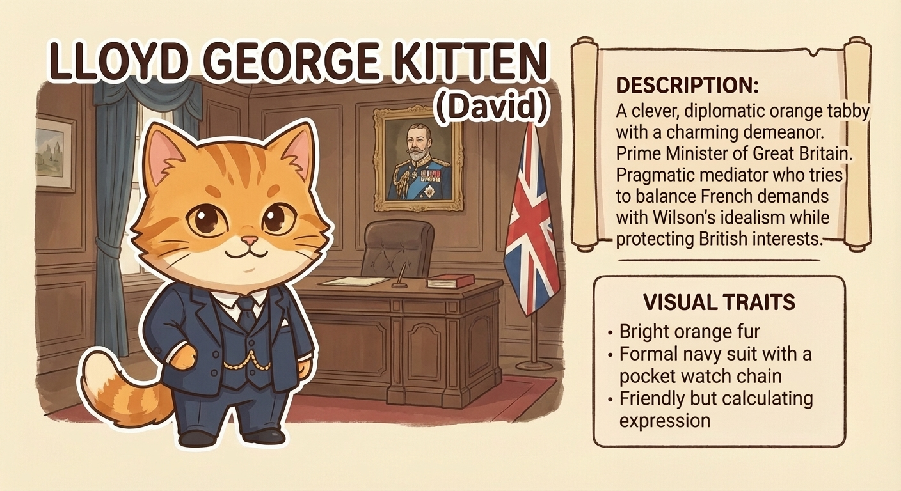

*A clever, diplomatic orange tabby with a charming demeanor. Prime Minister of Great Britain. Pragmatic mediator who
tries to balance French demands with Wilson's idealism while protecting British interests.*

## GERMAN KITTEN REPRESENTATIVES

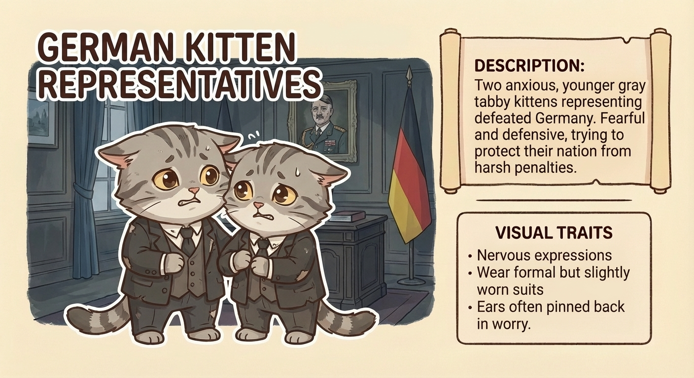

*Two anxious, younger gray tabby kittens representing defeated Germany. Fearful and defensive, trying to protect their
nation from harsh penalties.*

## NARRATOR CAT

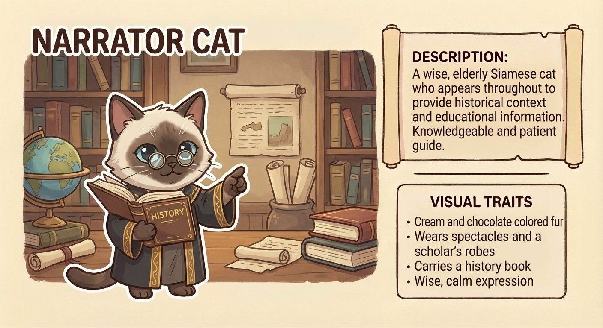

*A wise, elderly Siamese cat who appears throughout to provide historical context and educational information.*
