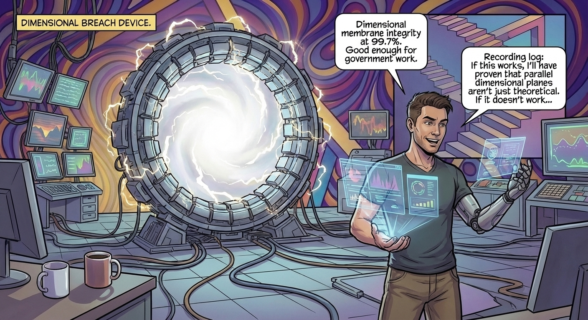

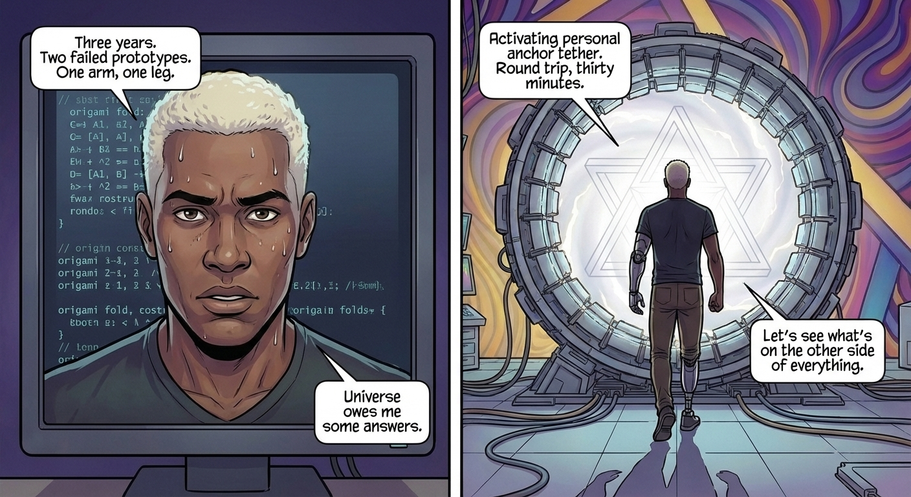

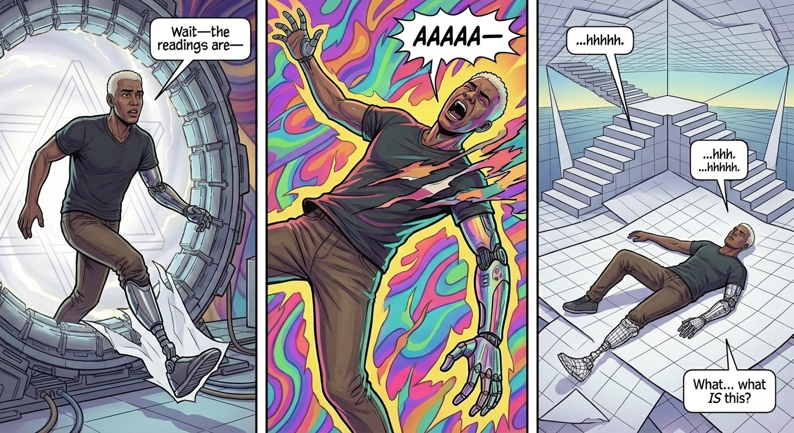

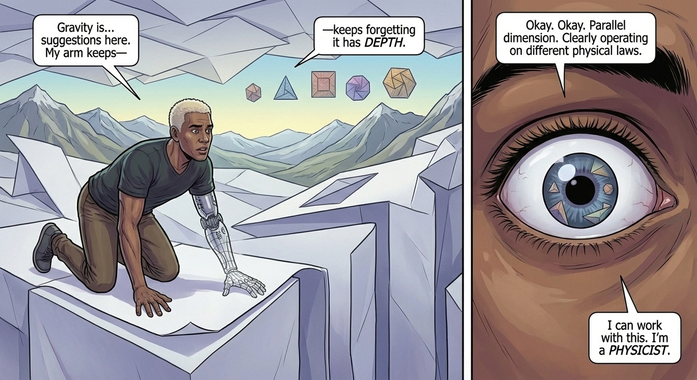

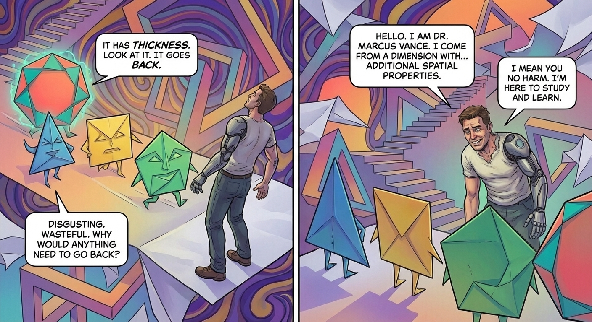

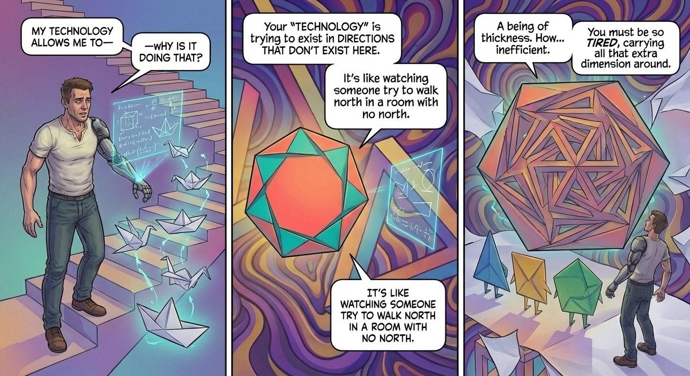

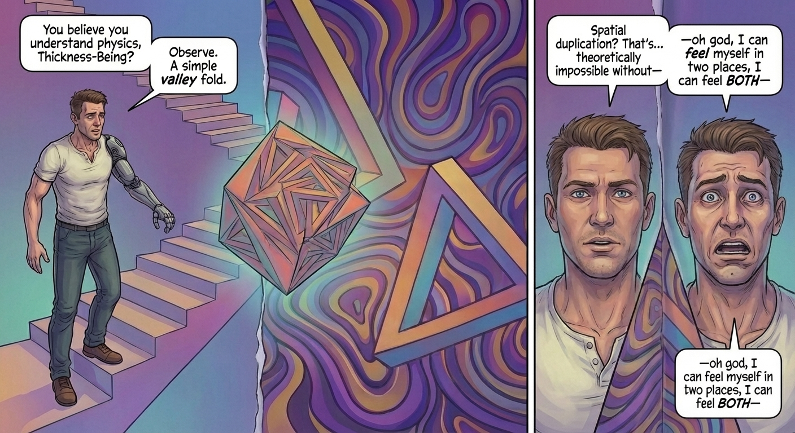

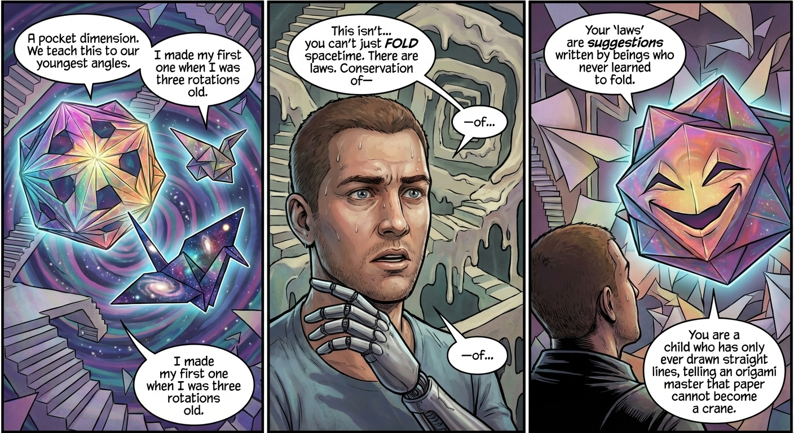

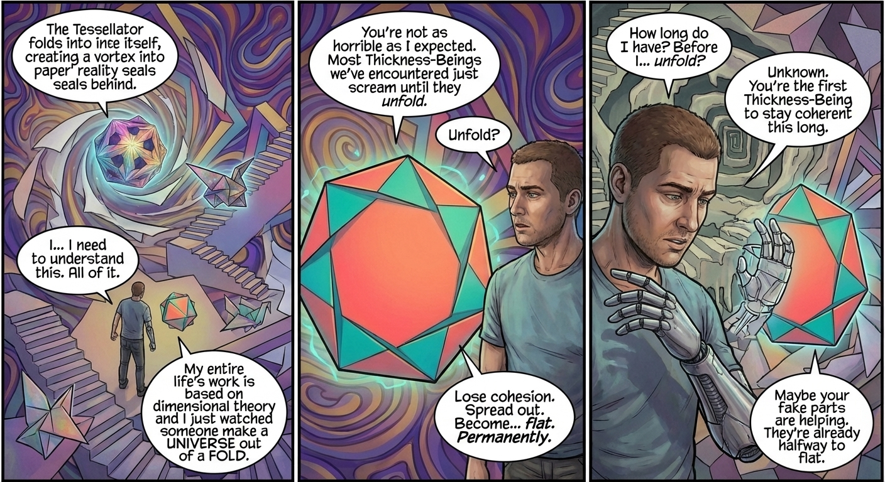

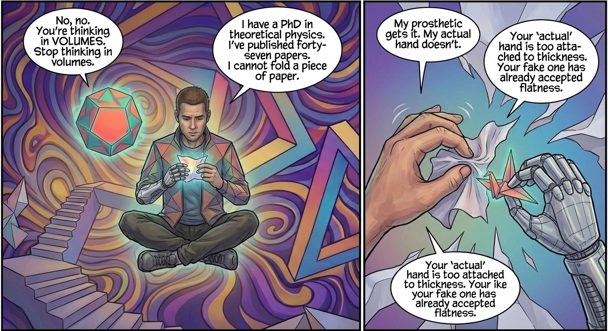

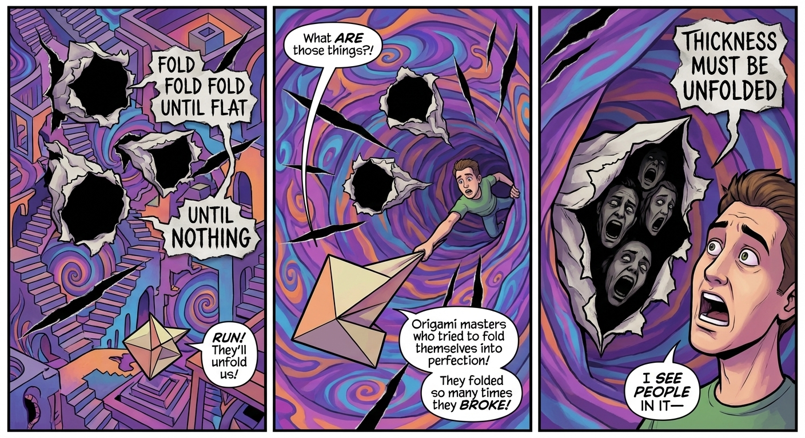

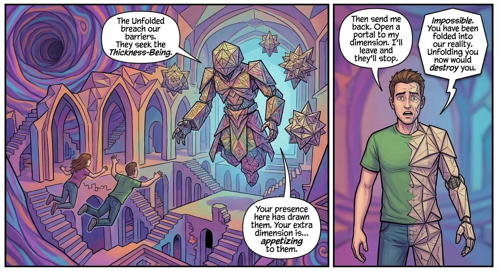

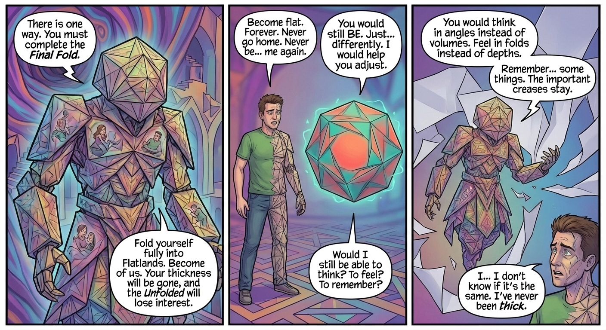

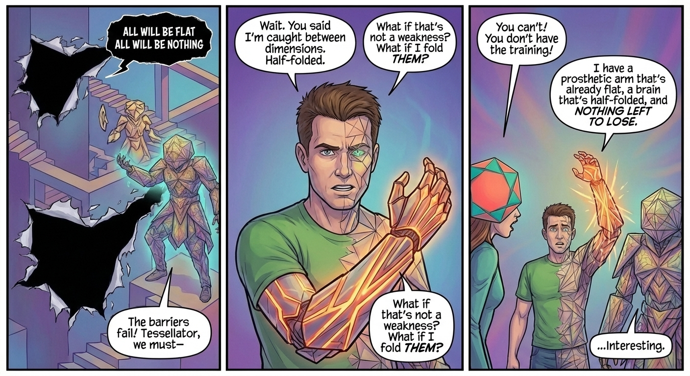

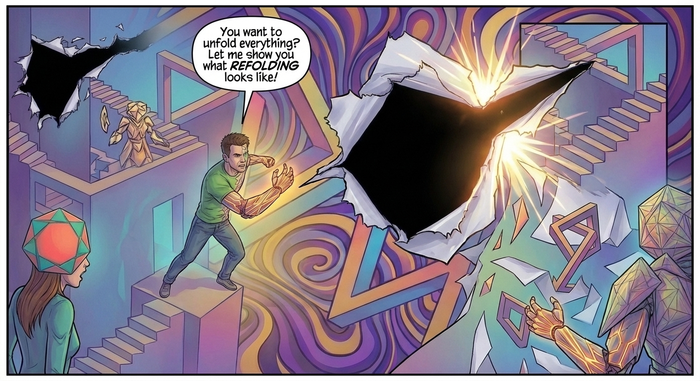

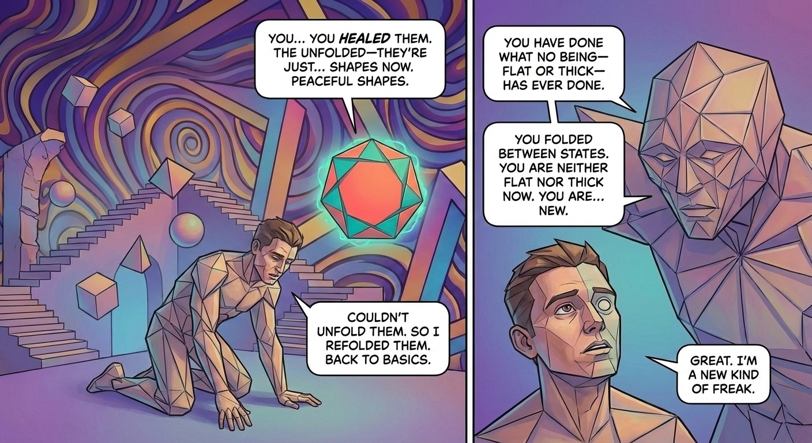

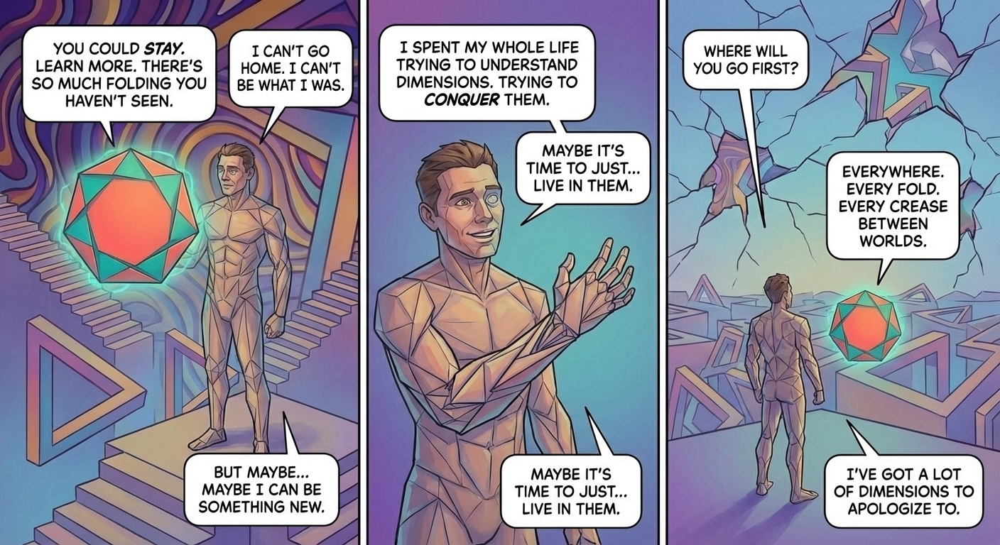

# Comic Book Generation Task

# FOLD/UNFOLD
*Dr. Marcus Vance, a cybernetically-enhanced physicist, activates an experimental dimensional breach device and finds himself trapped in Flatlands—a two-dimensional universe he initially dismisses as primitive. But the geometric beings who inhabit this impossible realm have mastered something beyond his comprehension: origami physics, the art of folding spacetime itself. As Marcus struggles to survive in a world where up and down are theoretical concepts and paper cranes can birth black holes, he must abandon everything he thought he knew about reality.*
## Characters
- **Dr. Marcus Vance**: 34-year-old experimental physicist. Dark-skinned with stark bleached blond hair cropped short. Right arm is a sleek gunmetal prosthetic with visible articulation joints; right leg is a similar prosthetic from mid-thigh down. Confident to the point of arrogance, but genuinely brilliant. Wears a form-fitting black dimensional suit with glowing blue circuit traces. (Rendered in realistic, three-dimensional style that clashes jarringly with the flat world around him. His prosthetics occasionally glitch and render as 2D wireframes when Flatland physics affect him. Expressions range from smug superiority to existential terror.)
- **The Tessellator (Elder Zhe)**: Ancient being of Flatlands, appears as an ever-shifting hexagonal form covered in impossibly intricate fold-lines that seem to move. Gender is a foreign concept; uses no pronouns. Speaks in geometric metaphors. Patient but alien in morality. (Body is covered in origami texture that suggests infinite depth despite being flat. Colors shift through deep purples, golds, and impossible colors that shouldn't exist. When speaking, fold-lines rearrange to form expression-like patterns. Occasionally unfolds partially to reveal pocket dimensions within.)
- **Kira-Seven-Angles**: Young heptagon who serves as Marcus's reluctant guide. Rebellious by Flatland standards—has experimented with forbidden folds that allow brief three-dimensional perception. Curious about Marcus's strange depth. (Bright coral and teal coloring with sharp, youthful angles. Seven sides are slightly irregular (considered beautiful imperfection in Flatland). Origami texture is simpler than elders but shows potential. Can briefly pop into 3D representation when using forbidden techniques.)
- **The Unfolded**: Antagonist force—beings who have folded themselves so many times they've become tears in reality itself. Neither 2D nor 3D but something broken. Seek to unfold all of existence into infinite flatness. (Appear as crumpled, torn paper shapes with void-black interiors. Edges are ragged and constantly fraying. Leave paper-cut wounds in reality where they pass. Multiple overlapping forms suggest they exist in many dimensions simultaneously—all of them wrong.)
## Script
### Page 1
**Row 1**
- Panel 1: Panoramic view of the laboratory. The Dimensional Breach Device dominates the center—a 12-foot ring of interlocking metal segments with a shimmering, paper-white void in its center. Cables snake across the floor. Multiple screens show readings in languages that shift between recognizable and alien. Marcus stands in the foreground, his prosthetic arm raised as holographic displays project from his palm. His expression is one of barely contained excitement.
  - **Marcus**: "Dimensional membrane integrity at 99.7%. Good enough for government work."
  - **Marcus**: "Recording log: If this works, I'll have proven that parallel dimensional planes aren't just theoretical. If it doesn't work..."
  - *Caption*: Vance Labs. Experimental Physics Division. Three minutes before everything became a lie.
**Row 2**
- Panel 1: Marcus's face reflected in a dark monitor screen. His bleached blond hair is almost white in the glow. His dark skin shows beads of sweat. Behind his reflection, we can see code scrolling—but some of the characters are origami fold instructions, a subtle foreshadowing he doesn't notice.
  - **Marcus**: "Three years. Two failed prototypes. One arm, one leg."
  - **Marcus**: "Universe owes me some answers."
- Panel 2: Marcus walks toward the portal, which has begun to pulse. The white void inside the ring is starting to show faint geometric patterns—triangles, hexagons, impossible shapes. His shadow on the floor is wrong; it's flat in a way shadows shouldn't be, paper-thin and sharp-edged.
  - **Marcus**: "Activating personal anchor tether. Round trip, thirty minutes."
  - **Marcus**: "Let's see what's on the other side of everything."
**Row 3**
- Panel 1: Marcus mid-step through the portal threshold. His leading leg (the prosthetic) has already crossed and is FLATTENING, becoming a 2D representation of itself. His face shows the first moment of realization that something is wrong. The portal's edge tears at him like paper being cut.
  - **Marcus**: "Wait—the readings are—"
- Panel 2: Pure psychedelic chaos. Marcus's body is stretched across the frame like taffy, his scream literally becoming a jagged shape that tears through the panel border. Colors invert, multiply, fold over themselves. His prosthetic arm is rendered in at least six different art styles simultaneously.
  - **Marcus**: "AAAAA—"
- Panel 3: Marcus lies on an infinite plane that resembles folded white paper with faint grid lines. The ground extends in all directions but also folds UP in impossible ways—Escher-like stairs that go nowhere, horizons that are also walls. He's still rendered realistically, but everything around him is flat, geometric, WRONG. His prosthetics are glitching, flickering between 3D and 2D wireframe.
  - **Marcus**: "...hhhhh."
  - **Marcus**: "What... what IS this?"
### Page 2
**Row 1**
- Panel 1: Marcus on his hands and knees, trying to push himself up, but the ground keeps shifting perspective. What was horizontal becomes vertical becomes diagonal. His prosthetic arm phases between solid and wireframe. In the background, the landscape is a fever dream of folded paper—mountains that are also valleys, a sky that's just more ground folded overhead. Distant geometric shapes (triangles, squares, hexagons) hover at the edge of visibility.
  - **Marcus**: "Gravity is... suggestions here. My arm keeps—"
  - **Marcus**: "—keeps forgetting it has DEPTH."
- Panel 2: Extreme close-up of Marcus's eye, wide with a mixture of terror and scientific fascination. In the reflection of his eye, we can see the geometric shapes approaching. His pupil is dilating in a way that suggests his perception is being fundamentally altered.
  - **Marcus**: "Okay. Okay. Parallel dimension. Clearly operating on different physical laws."
  - **Marcus**: "I can work with this. I'm a PHYSICIST."
**Row 2**
- Panel 1: Marcus has managed to stand, though he's slightly tilted as if the ground isn't quite agreeing with him. Approaching him are five Flatland beings: a triangle, two squares, a pentagon, and leading them, Kira-Seven-Angles—a coral-and-teal heptagon. They move by rotating and sliding, leaving faint fold-lines in their wake. Their faces are suggested by the arrangement of their fold patterns.
  - **Kira-Seven-Angles**: "It has THICKNESS. Look at it. It goes BACK."
  - **Triangle Being**: "Disgusting. Wasteful. Why would anything need to go back?"
- Panel 2: From behind the Flatland beings, looking at Marcus. From this angle, we see that the beings are paper-thin—literally no depth at all. Marcus, by contrast, looks grotesquely three-dimensional, almost obscene in his depth. He's trying to smile diplomatically but it's coming across as a grimace.
  - **Marcus**: "Hello. I am Dr. Marcus Vance. I come from a dimension with... additional spatial properties."
  - **Marcus**: "I mean you no harm. I'm here to study and learn."
**Row 3**
- Panel 1: Marcus holds up his prosthetic arm, which is projecting a holographic display of mathematical equations and dimensional diagrams. But the hologram is WRONG here—it keeps collapsing into 2D, then trying to expand, then folding like paper. The equations rearrange themselves into origami instructions.
  - **Marcus**: "My technology allows me to—"
  - **Marcus**: "—why is it doing that?"
- Panel 2: Kira-Seven-Angles rotates slightly—their version of tilting their head. Their fold-lines rearrange into a pattern suggesting curiosity mixed with condescension. One of their angles points toward Marcus's malfunctioning display.
  - **Kira-Seven-Angles**: "Your 'technology' is trying to exist in directions that don't exist here."
  - **Kira-Seven-Angles**: "It's like watching someone try to walk north in a room with no north."
- Panel 3: The Tessellator arrives. The ancient hexagon UNFOLDS from seemingly nowhere—space itself creasing to allow passage. The other Flatlanders back away respectfully. The Tessellator is massive compared to the others, covered in fold-lines so complex they seem to move, containing depths that shouldn't be possible in 2D.
  - **The Tessellator**: "A being of thickness. How... inefficient."
  - **The Tessellator**: "You must be so TIRED, carrying all that extra dimension around."
### Page 3
**Row 1**
- Panel 1: The Tessellator extends one of its edges and makes a precise FOLD in the air itself. Where it folds, space creases—a visible line appears in reality, and on either side of the fold, the same location exists TWICE. Marcus is visible on both sides of the fold simultaneously, his expressions different in each version (confused on one side, terrified on the other).
  - **The Tessellator**: "You believe you understand physics, Thickness-Being?"
  - **The Tessellator**: "Observe. A simple valley fold."
- Panel 2: Split panel showing both versions of Marcus's face from the fold. On the left, he looks scientifically intrigued, taking mental notes. On the right, he looks existentially horrified, realizing his entire understanding of reality is wrong. The fold-line runs down the center of the panel.
  - **Marcus (left)**: "Spatial duplication? That's... theoretically impossible without—"
  - **Marcus (right)**: "—oh god, I can feel myself in two places, I can feel BOTH—"
**Row 2**
- Panel 1: The Tessellator makes several rapid folds in sequence—mountain fold, valley fold, reverse fold. With each fold, space COMPRESSES, creating a small pocket dimension that floats nearby like an origami crane made of reality itself. Inside the crane, we can see a tiny universe—stars, galaxies, all folded into paper form.
  - **The Tessellator**: "A pocket dimension. We teach this to our youngest angles."
  - **Kira-Seven-Angles**: "I made my first one when I was three rotations old."
- Panel 2: Marcus's face shows his worldview crumbling. His prosthetic arm is twitching, trying to record data but unable to process what it's seeing. Sweat beads on his forehead. His bleached hair seems duller, as if even color is being affected by this place.
  - **Marcus**: "This isn't... you can't just FOLD spacetime. There are laws. Conservation of—"
  - **Marcus**: "—of..."
- Panel 3: The Tessellator looms over Marcus (despite being 2D, it somehow LOOMS). Its fold-lines rearrange into something that might be a smile or might be a threat—impossible to tell.
  - **The Tessellator**: "Your 'laws' are suggestions written by beings who never learned to fold."
  - **The Tessellator**: "You are a child who has only ever drawn straight lines, telling an origami master that paper cannot become a crane."
**Row 3**
- Panel 1: The Tessellator folds away—literally folding space around itself and vanishing into a crease that seals behind it. The other Flatlanders slide and rotate away, leaving Marcus alone with Kira. The landscape around them shifts subtly, as if breathing.
  - **Marcus**: "I... I need to understand this. All of it."
  - **Marcus**: "My entire life's work is based on dimensional theory and I just watched someone make a UNIVERSE out of a FOLD."
- Panel 2: Kira slides closer to Marcus. From this angle, we can see the contrast starkly—Marcus's realistic 3D rendering against Kira's flat, geometric form. Yet somehow, Kira seems more REAL, more substantial. Their fold-lines pulse with colors that suggest emotion.
  - **Kira-Seven-Angles**: "You're not as horrible as I expected. Most Thickness-Beings we've encountered just scream until they unfold."
  - **Marcus**: "Unfold?"
  - **Kira-Seven-Angles**: "Lose cohesion. Spread out. Become... flat. Permanently."
- Panel 3: Marcus looks at his prosthetic hand. It's flickering badly now, sections of it rendering as 2D wireframe, then 3D, then something in between. In the wireframe sections, we can see fold-lines beginning to form—Flatlands is changing him.
  - **Marcus**: "How long do I have? Before I... unfold?"
  - **Kira-Seven-Angles**: "Unknown. You're the first Thickness-Being to stay coherent this long."
  - **Kira-Seven-Angles**: "Maybe your fake parts are helping. They're already halfway to flat."
### Page 4
**Row 1**
- Panel 1: A new location—Kira's dwelling, which is an impossible structure of folded space. Walls are floors are ceilings, all simultaneously. Marcus sits (floats? exists?) in the center, attempting to fold a small piece of reality-paper. His clothes are now partially 2D—his jacket has become flat geometric shapes. His prosthetics are almost entirely wireframe now, but more stable.
  - **Kira-Seven-Angles**: "No, no. You're thinking in VOLUMES. Stop thinking in volumes."
  - **Marcus**: "I have a PhD in theoretical physics. I've published forty-seven papers. I cannot fold a piece of paper."
- Panel 2: Marcus's hands—one flesh, one wireframe prosthetic—attempting to fold a small square of reality-paper. The flesh hand keeps trying to fold in 3D ways; the prosthetic hand is actually succeeding, making clean 2D folds. The paper is responding to the prosthetic but rejecting the flesh hand.
  - **Marcus**: "My prosthetic gets it. My actual hand doesn't."
  - **Kira-Seven-Angles**: "Your 'actual' hand is too attached to thickness. Your fake one has already accepted flatness."
**Row 2**
- Panel 1: Marcus completes a fold with his prosthetic hand. The reality-paper creases perfectly, and for a moment, GRAVITY SHIFTS around him—he floats slightly, the fold creating a tiny gravity well. His expression is one of pure wonder, the arrogance completely gone, replaced by childlike amazement.
  - **Marcus**: "I felt that. I FELT spacetime bend."
  - **Marcus**: "It's not magic. It's... it's geometry as a fundamental force."
- Panel 2: Kira's fold-lines rearrange into a pattern suggesting pride—a teacher watching a student's first success. But at the edge of the frame, their angles are twitching, detecting something wrong in the distance.
  - **Kira-Seven-Angles**: "Now you begin to understand. Geometry isn't description here. It's PRESCRIPTION."
  - **Kira-Seven-Angles**: "Wait. Do you feel that?"
- Panel 3: The background of Kira's dwelling begins to CRUMPLE. Not fold—crumple. Ragged, torn edges appear in reality. Through the tears, we see void-black nothingness. The colors in the scene start to drain, becoming desaturated.
  - **Kira-Seven-Angles**: "No. No, no, no."
  - **Marcus**: "What is that? What's happening?"
**Row 3**
- Panel 1: The Unfolded tear through into Kira's dwelling. They appear as crumpled paper shapes with void-black interiors, edges ragged and fraying. Where they pass, reality gets PAPER CUTS—thin slices of nothingness. There are three of them, overlapping, existing in multiple wrong dimensions. Their voices appear as torn text.
  - **The Unfolded**: "FOLD FOLD FOLD UNTIL FLAT UNTIL NOTHING"
  - **Kira-Seven-Angles**: "RUN! They'll unfold us!"
- Panel 2: Kira grabs Marcus with an extended edge and FOLDS space around them—creating an escape route by creasing reality into a tunnel. Marcus is being pulled along, his body stretching slightly with the fold. Behind them, the Unfolded are tearing through the dwelling, leaving paper-cut wounds in existence.
  - **Marcus**: "What ARE those things?!"
  - **Kira-Seven-Angles**: "Origami masters who tried to fold themselves into perfection! They folded so many times they BROKE!"
- Panel 3: One of the Unfolded reaches through the closing fold-tunnel, its ragged edge inches from Marcus's face. In the void-black interior of the Unfolded, we can see FACES—the faces of beings it has unfolded, trapped in eternal flatness, screaming silently.
  - **The Unfolded**: "THICKNESS MUST BE UNFOLDED"
  - **Marcus**: "I SEE PEOPLE IN IT—"
### Page 5
**Row 1**
- Panel 1: The Fold-Cathedral. An impossible space where every surface is a different fold-technique made manifest. Walls of mountain folds, floors of valley folds, a ceiling of reverse folds that show the inside of reality. The Tessellator floats at the center, massive and ancient. Other geometric beings—elders, priests of origami—surround it. Marcus and Kira tumble out of their escape fold, disheveled and terrified.
  - **The Tessellator**: "The Unfolded breach our barriers. They seek the Thickness-Being."
  - **The Tessellator**: "Your presence here has drawn them. Your extra dimension is... appetizing to them."
- Panel 2: Marcus stands, his appearance now significantly changed. Half his body is still realistic 3D; the other half has become stylized, geometric, covered in fold-lines. His prosthetics are fully integrated into the flat aesthetic. He looks like a being caught between dimensions.
  - **Marcus**: "Then send me back. Open a portal to my dimension. I'll leave and they'll stop."
  - **The Tessellator**: "Impossible. You have been folded into our reality. Unfolding you now would destroy you."
**Row 2**
- Panel 1: The Tessellator's fold-lines rearrange into something ancient and sad. Within its form, we can see pocket dimensions containing memories—other beings who came from thick dimensions, all of whom eventually unfolded or were consumed.
  - **The Tessellator**: "There is one way. You must complete the Final Fold."
  - **The Tessellator**: "Fold yourself fully into Flatlands. Become one of us. Your thickness will be gone, and the Unfolded will lose interest."
- Panel 2: Marcus and Kira face each other. Marcus's expression is anguished—give up his dimensionality, his humanity, everything he was? Kira's fold-lines show conflict—they've grown to care for this strange thick being.
  - **Marcus**: "Become flat. Forever. Never go home. Never be... me again."
  - **Kira-Seven-Angles**: "You would still BE. Just... differently. I would help you adjust."
  - **Marcus**: "Would I still be able to think? To feel? To remember?"
- Panel 3: Kira hesitates. Their fold-lines shift uncomfortably. The truth is complicated.
  - **Kira-Seven-Angles**: "You would think in angles instead of volumes. Feel in folds instead of depths."
  - **Kira-Seven-Angles**: "Remember... some things. The important creases stay."
  - **Kira-Seven-Angles**: "I... I don't know if it's the same. I've never been thick."
**Row 3**
- Panel 1: The Unfolded TEAR through the cathedral walls. Reality crumples and rips. The geometric elders attempt to fight back with defensive folds, but the Unfolded are too many, too broken. Paper-cut wounds spread across the sacred space.
  - **The Unfolded**: "ALL WILL BE FLAT ALL WILL BE NOTHING"
  - **Elder Being**: "The barriers fail! Tessellator, we must—"
- Panel 2: Marcus's face—half realistic, half geometric—sets into determination. His prosthetic arm is glowing, fold-lines racing across it. He's had an idea. A physicist's idea. A STUPID idea.
  - **Marcus**: "Wait. You said I'm caught between dimensions. Half-folded."
  - **Marcus**: "What if that's not a weakness? What if I fold THEM?"
- Panel 3: Marcus raises his prosthetic arm. The fold-lines on it are BLAZING now, responding to his will. Kira and the Tessellator watch in shock. No thick being has ever tried to use origami physics offensively.
  - **Kira-Seven-Angles**: "You can't! You don't have the training!"
  - **Marcus**: "I have a prosthetic arm that's already flat, a brain that's half-folded, and NOTHING LEFT TO LOSE."
  - **The Tessellator**: "...Interesting."
### Page 6
**Row 1**
- Panel 1: Marcus FOLDS. His prosthetic arm moves in ways that shouldn't be possible, creating creases in reality that target the Unfolded. Because he exists in BOTH states—3D and 2D—he can fold in directions the Unfolded can't perceive. The lead Unfolded is being REVERSE-FOLDED, its crumpled form being smoothed, straightened, FIXED. Light pours from the creases. The scene is psychedelic chaos—Escher meets Kirby meets fever dream.
  - **Marcus**: "You want to unfold everything? Let me show you what REFOLDING looks like!"
**Row 2**
- Panel 1: The Fold-Cathedral is damaged but intact. Where the Unfolded were, there are now stable geometric shapes—simple, peaceful, no longer torn or crumpled. They float gently, healed. Marcus is on his knees, his body now almost entirely geometric. Only his face retains realistic rendering, and even that is becoming angular.
  - **Kira-Seven-Angles**: "You... you HEALED them. The Unfolded—they're just... shapes now. Peaceful shapes."
  - **Marcus**: "Couldn't unfold them. So I refolded them. Back to basics."
- Panel 2: The Tessellator looms over Marcus, but its fold-lines now show something like admiration. Marcus looks up, exhausted, his face half-geometric, one eye still human, one eye a simple drawn circle.
  - **The Tessellator**: "You have done what no being—flat or thick—has ever done."
  - **The Tessellator**: "You folded between states. You are neither flat nor thick now. You are... new."
  - **Marcus**: "Great. I'm a new kind of freak."
**Row 3**
- Panel 1: Kira slides up next to Marcus, their edges almost touching. Marcus has stabilized—he's a unique being now, realistic face on a geometric body, prosthetics fully integrated as fold-structures. He looks strange but somehow RIGHT.
  - **Kira-Seven-Angles**: "You could stay. Learn more. There's so much folding you haven't seen."
  - **Marcus**: "I can't go home. I can't be what I was."
  - **Marcus**: "But maybe... maybe I can be something new."
- Panel 2: Marcus examines his transformed body. His prosthetic arm is now a beautiful origami structure, capable of folds he's only beginning to understand. His human eye and geometric eye both reflect wonder. He's smiling—genuinely, for the first time since arriving.
  - **Marcus**: "I spent my whole life trying to understand dimensions. Trying to CONQUER them."
  - **Marcus**: "Maybe it's time to just... live in them."
- Panel 3: Marcus and Kira stand at the edge of the Fold-Cathedral, looking out at the infinite impossible landscape of Flatlands. But now there are CRACKS in the sky—not damage, but doorways. Other dimensions, visible through folds in reality. Marcus's new form allows him to see them all. The future is vast and strange and beautiful.
  - **Kira-Seven-Angles**: "Where will you go first?"
  - **Marcus**: "Everywhere. Every fold. Every crease between worlds."
  - **Marcus**: "I've got a lot of dimensions to apologize to."
## Dr. Marcus Vance

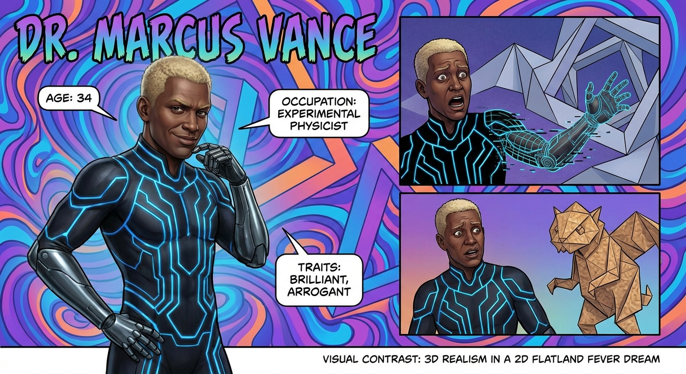

*34-year-old experimental physicist. Dark-skinned with stark bleached blond hair cropped short. Right arm is a sleek gunmetal prosthetic with visible articulation joints; right leg is a similar prosthetic from mid-thigh down. Confident to the point of arrogance, but genuinely brilliant. Wears a form-fitting black dimensional suit with glowing blue circuit traces.*

## The Tessellator (Elder Zhe)

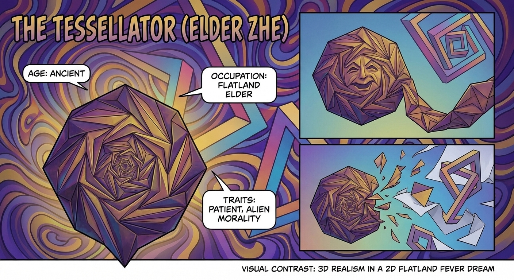

*Ancient being of Flatlands, appears as an ever-shifting hexagonal form covered in impossibly intricate fold-lines that seem to move. Gender is a foreign concept; uses no pronouns. Speaks in geometric metaphors. Patient but alien in morality.*

## Kira-Seven-Angles

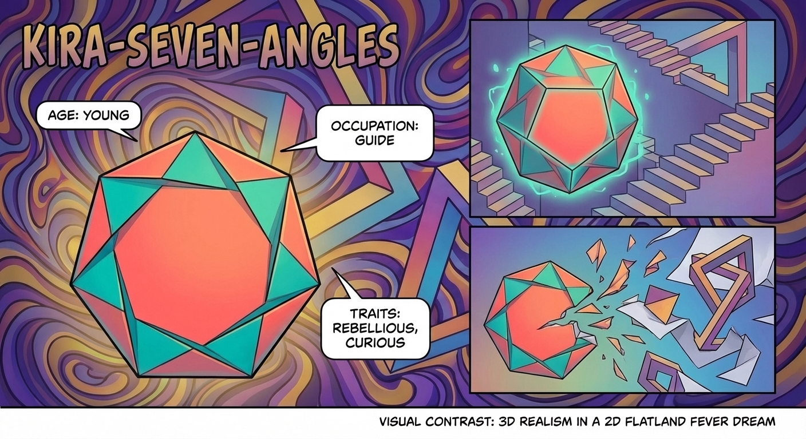

*Young heptagon who serves as Marcus's reluctant guide. Rebellious by Flatland standards—has experimented with forbidden folds that allow brief three-dimensional perception. Curious about Marcus's strange depth.*

## The Unfolded

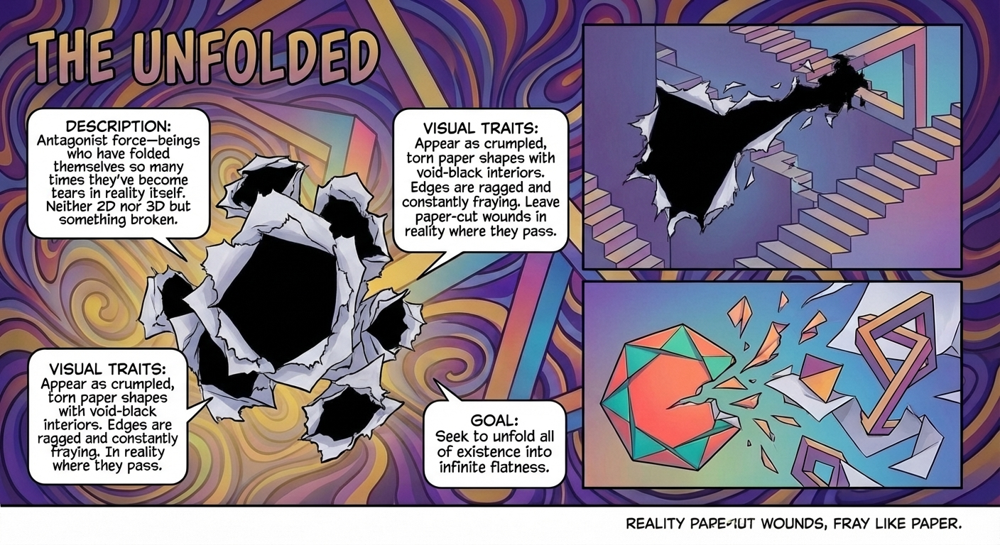

*Antagonist force—beings who have folded themselves so many times they've become tears in reality itself. Neither 2D nor 3D but something broken. Seek to unfold all of existence into infinite flatness.*
