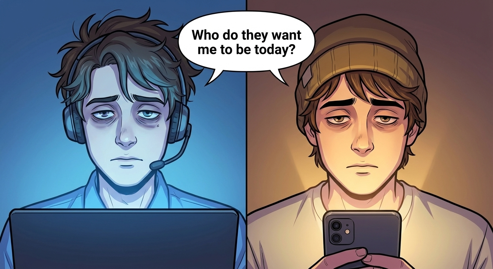

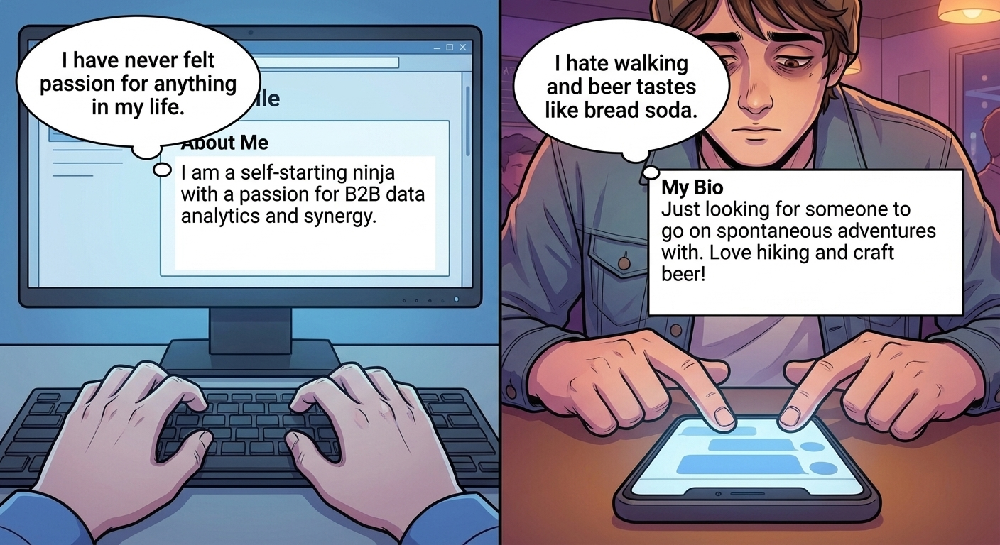

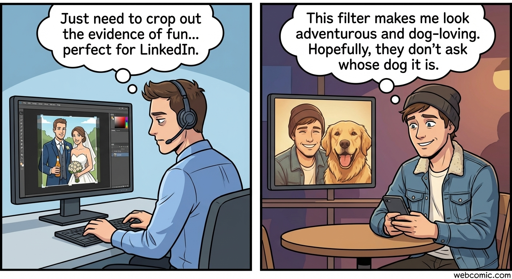

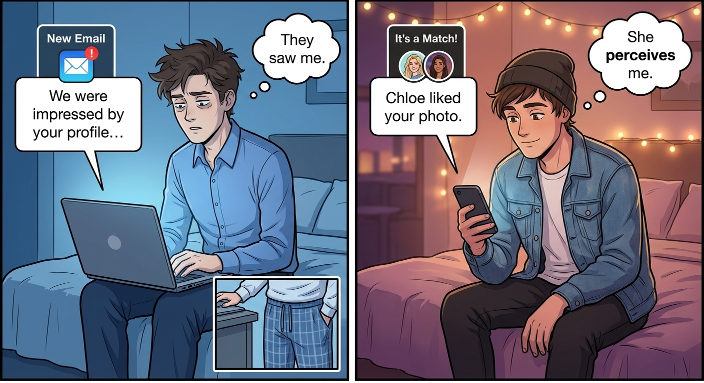

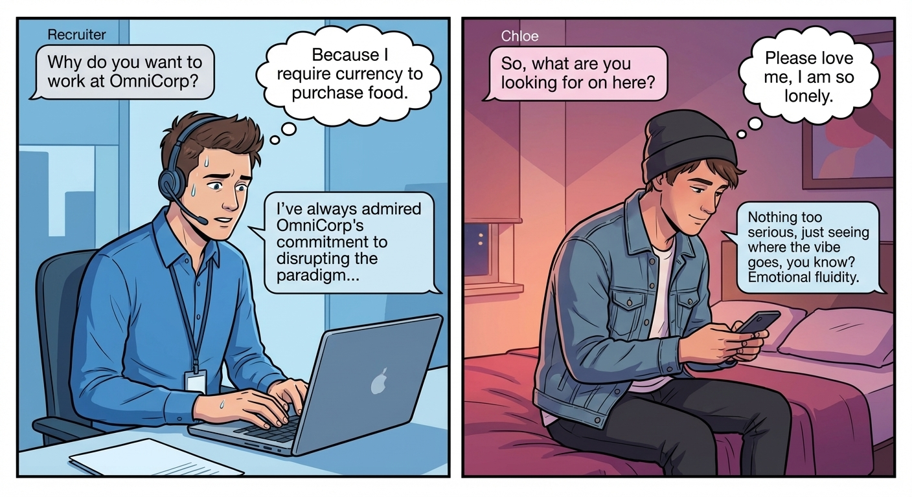

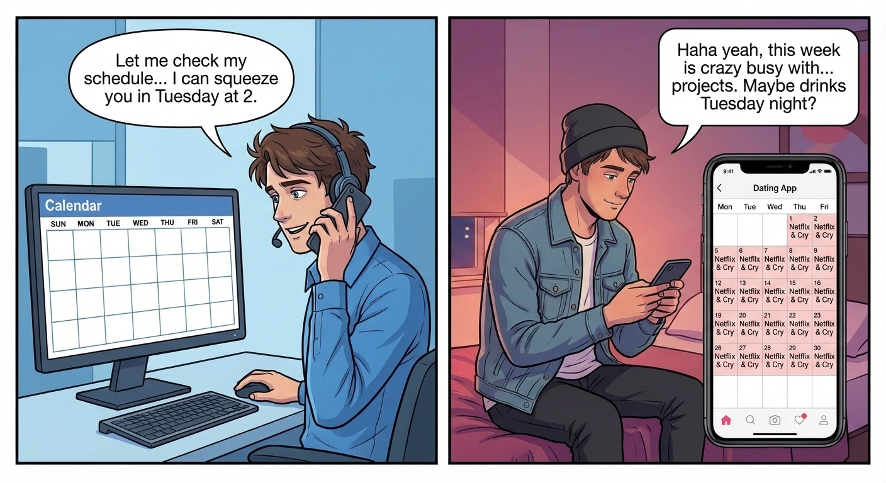

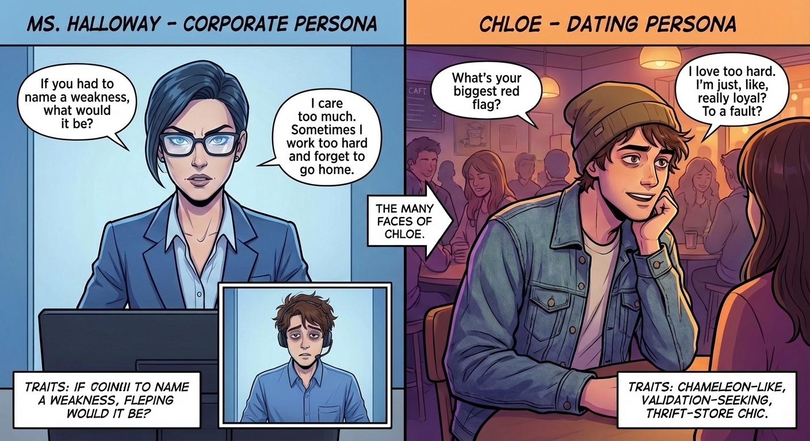

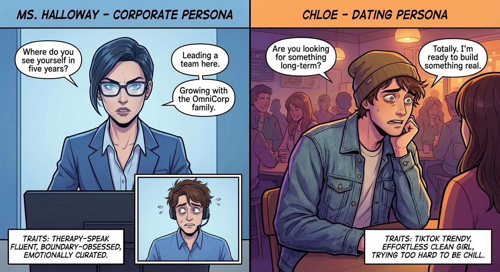

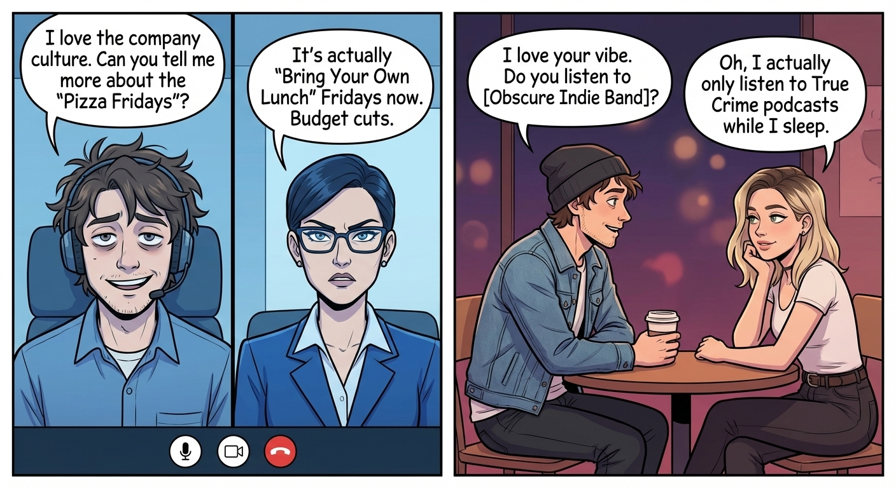

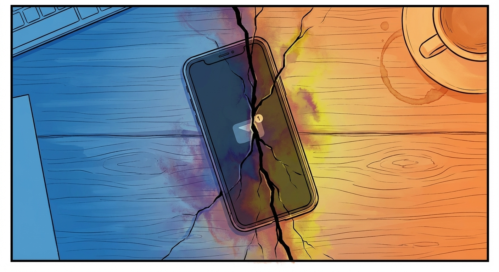

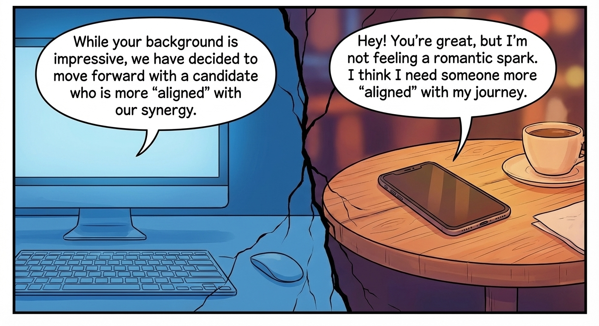

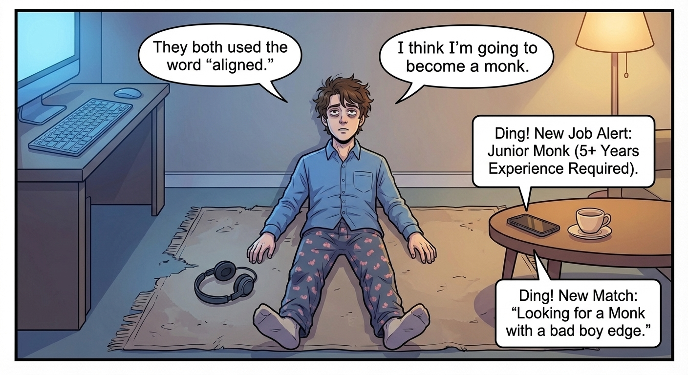

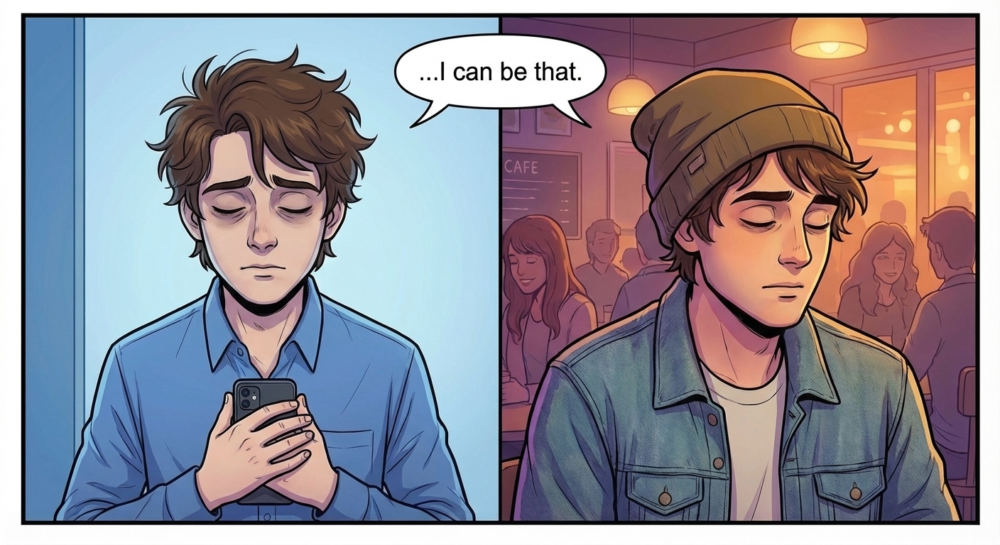

# Comic Book Generation Task

# THE OPTIMIZATION OF ALEX
*A split-screen narrative following Alex, a recent college graduate, as he attempts to "market" himself on two fronts simultaneously: landing an entry-level marketing job and finding a long-term partner. The comic highlights how both worlds have devolved into the same game of keyword stuffing, emotional suppression, and performative enthusiasm.*
## Characters
- **ALEX**: 22-year-old recent college graduate desperate for validation, willing to mold his personality into whatever the person across from him wants. (Average build, messy hair with too much product, screen-tired eyes with dark circles. In corporate panels: crisp dress shirt with pajama bottoms visible in wide shots. In dating panels: cool thrifted jacket and ill-fitting beanie.)
- **MS. HALLOWAY**: The Interviewer. Corporate sterile personality who speaks exclusively in buzzwords. (Sharp, angular features, wears glasses that reflect the screen.)
- **CHLOE**: The Date. Curated casual personality who speaks exclusively in therapy-speak and TikTok trends. (Trendy, effortless clean girl aesthetic.)
## Script
### Page 1
**Row 1**
- Panel 1: Split face portrait with contrasting lighting
  - **ALEX**: "Who do they want me to be today?"
  - *Caption*: The Candidate (Left) / The Catch (Right)
**Row 2**
- Panel 1: Corporate screen with job profile text
  - **SCREEN TEXT**: "I am a self-starting ninja with a passion for B2B data analytics and synergy."
  - **ALEX**: "I have never felt passion for anything in my life."
- Panel 2: Dating app screen with bio text
  - **SCREEN TEXT**: "Just looking for someone to go on spontaneous adventures with. Love hiking and craft beer!"
  - **ALEX**: "I hate walking and beer tastes like bread soda."
**Row 3**
- Panel 1: Alex cropping a wedding photo to remove a beer bottle, making it look like a headshot
  - *Caption*: Skill: Attention to Detail
- Panel 2: Alex selecting a photo of himself standing next to a friend's dog
  - *Caption*: Skill: Borrowed Personality
### Page 2
**Row 1**
- Panel 1: Email notification on screen
  - **EMAIL TEXT**: "We were impressed by your profile..."
  - **ALEX**: "They saw me."
- Panel 2: Dating app match notification
  - **APP TEXT**: "Chloe liked your photo."
  - **ALEX**: "She perceives me."
**Row 2**
- Panel 1: Corporate recruiter message exchange
  - **RECRUITER TEXT**: "Why do you want to work at OmniCorp?"
  - **ALEX TYPING**: "I've always admired OmniCorp's commitment to disrupting the paradigm..."
  - **ALEX SPOKEN**: "Because I require currency to purchase food."
- Panel 2: Dating app message exchange
  - **CHLOE TEXT**: "So, what are you looking for on here?"
  - **ALEX TYPING**: "Nothing too serious, just seeing where the vibe goes, you know? Emotional fluidity."
  - **ALEX SPOKEN**: "Please love me, I am so lonely."
**Row 3**
- Panel 1: Corporate calendar with fake busy schedule
  - **ALEX PHONE**: "Let me check my schedule... I can squeeze you in Tuesday at 2."
- Panel 2: Dating app calendar with depressing schedule
  - **ALEX TEXTING**: "Haha yeah, this week is crazy busy with... projects. Maybe drinks Tuesday night?"
### Page 3
**Row 1**
- Panel 1: Corporate interview with Ms. Halloway
  - **MS. HALLOWAY**: "If you had to name a weakness, what would it be?"
  - **ALEX**: "I care too much. Sometimes I work too hard and forget to go home."
- Panel 2: Dating conversation with Chloe at bar
  - **CHLOE**: "What's your biggest red flag?"
  - **ALEX**: "I love too hard. I'm just, like, really loyal? To a fault?"
**Row 2**
- Panel 1: Corporate interview about future plans
  - **MS. HALLOWAY**: "Where do you see yourself in five years?"
  - **ALEX**: "Leading a team here. Growing with the OmniCorp family."
  - *Caption*: Lie.
- Panel 2: Dating conversation about long-term plans
  - **CHLOE**: "Are you looking for something long-term?"
  - **ALEX**: "Totally. I'm ready to build something real."
  - *Caption*: Lie.
**Row 3**
- Panel 1: Corporate interview questions
  - **ALEX**: "I love the company culture. Can you tell me more about the 'Pizza Fridays'?"
  - **MS. HALLOWAY**: "It's actually 'Bring Your Own Lunch' Fridays now. Budget cuts."
- Panel 2: Dating conversation questions
  - **ALEX**: "I love your vibe. Do you listen to [Obscure Indie Band]?"
  - **CHLOE**: "Oh, I actually only listen to True Crime podcasts while I sleep."
### Page 4
**Row 1**
- Panel 1: Top-down view of phone on table
  - *Caption*: 24 Hours Later
**Row 2**
- Panel 1: Corporate rejection email
  - **EMAIL**: "While your background is impressive, we have decided to move forward with a candidate who is more 'aligned' with our synergy."
- Panel 2: Dating rejection text
  - **TEXT**: "Hey! You're great, but I'm not feeling a romantic spark. I think I need someone more 'aligned' with my journey."
**Row 3**
- Panel 1: Alex on floor, full width shot
  - **ALEX**: "They both used the word 'aligned.'"
  - **ALEX**: "I think I'm going to become a monk."
  - **VOICE FROM PHONE NOTIFICATION**: "Ding! New Job Alert: Junior Monk (5+ Years Experience Required)."
  - **VOICE FROM PHONE NOTIFICATION**: "Ding! New Match: 'Looking for a Monk with a bad boy edge.'"
**Row 4**
- Panel 1: Close-up of Alex holding phone to chest
  - **ALEX**: "...I can be that."
  - *Caption*: The market corrects itself. End.
## ALEX

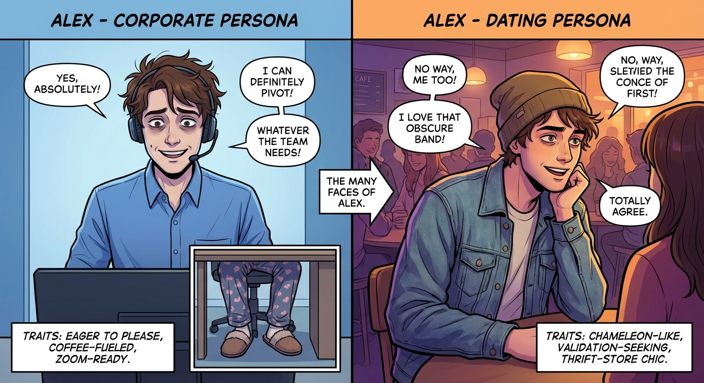

*22-year-old recent college graduate desperate for validation, willing to mold his personality into whatever the person across from him wants.*

## MS. HALLOWAY

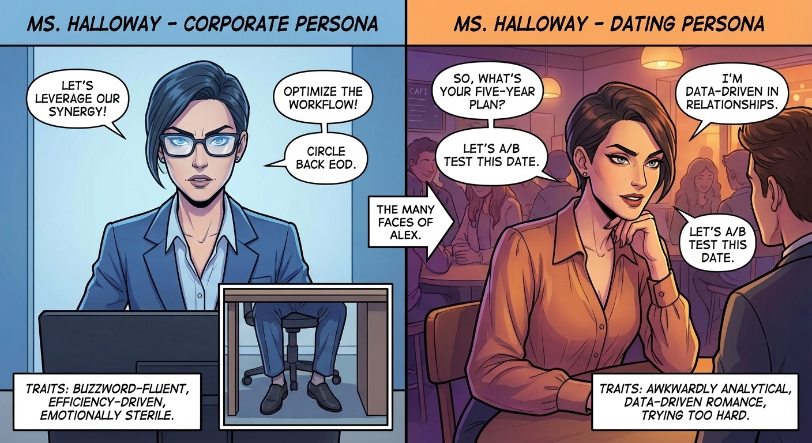

*The Interviewer. Corporate sterile personality who speaks exclusively in buzzwords.*

## CHLOE

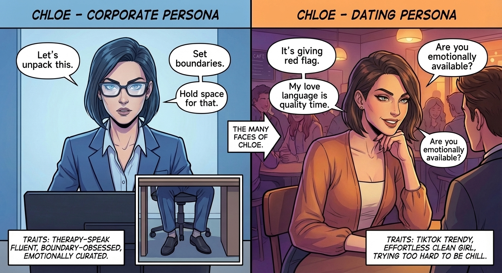

*The Date. Curated casual personality who speaks exclusively in therapy-speak and TikTok trends.*
