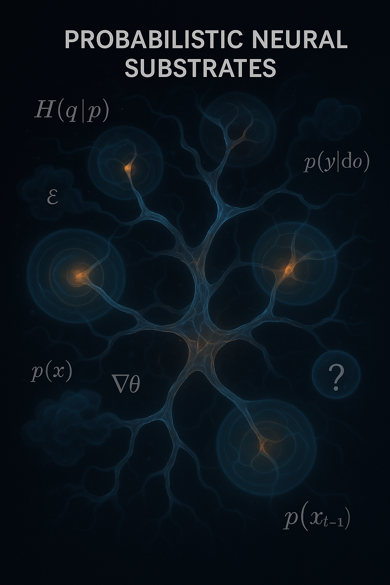
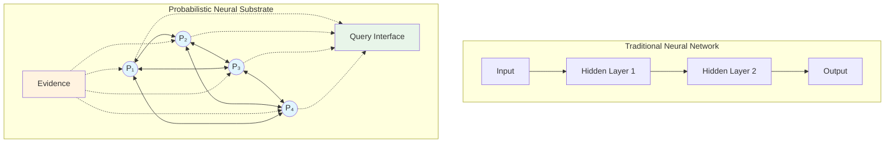
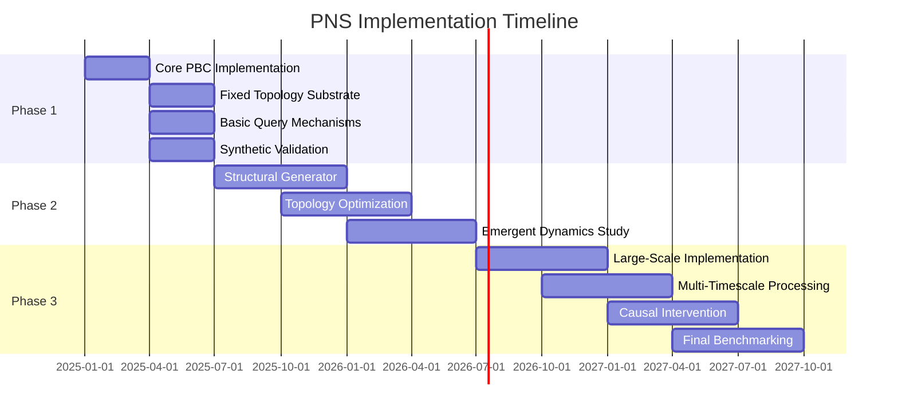
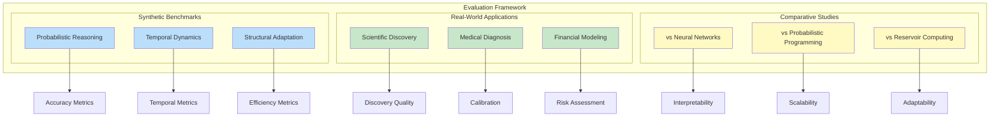
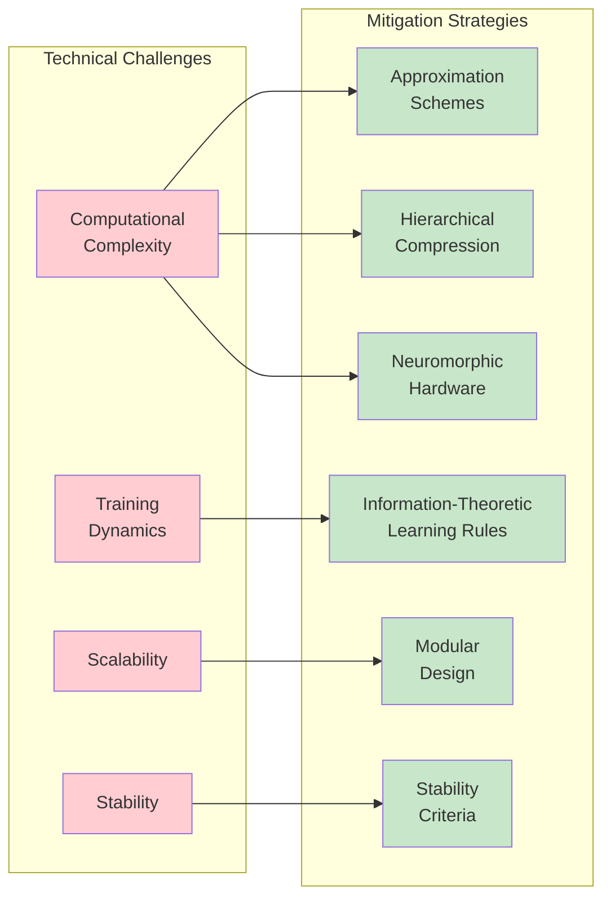
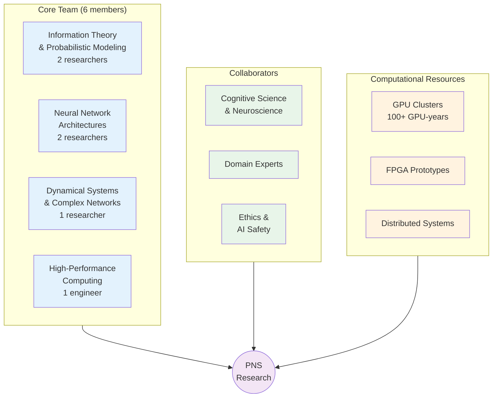
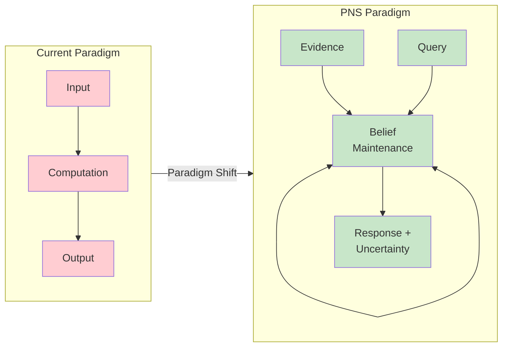
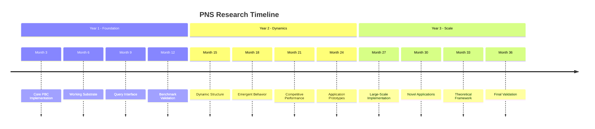

# Probabilistic Neural Substrates: A Cross-Entropy Approach to Recurrent Intelligence

## Abstract

We propose a fundamental departure from traditional neural network architectures through the development of
Probabilistic Neural Substrates (PNS)—dynamic, recurrent computational systems that maintain continuous probability
distributions rather than computing discrete outputs. Inspired by probabilistic decision trees with cross-entropy
optimization, PNS systems self-organize through information-theoretic principles, exhibit emergent temporal dynamics,
and support querying rather than traditional forward propagation. This work introduces a new computational paradigm that
could bridge the gap between artificial and biological intelligence while providing unprecedented interpretability and
uncertainty quantification.



## 1. Introduction

Traditional neural networks are fundamentally constrained by their input-output paradigm: information flows forward
through layers toward predetermined outputs, limiting their ability to model complex temporal dependencies, exhibit
genuine memory, or provide rigorous uncertainty estimates. While recent advances in attention mechanisms and transformer
architectures have partially addressed these limitations, they remain bound by the computational graph framework.

We propose Probabilistic Neural Substrates (PNS) as a radical alternative: computational systems that maintain evolving
probability distributions over state spaces, support arbitrary recurrent topologies, and operate through continuous
belief updating rather than discrete computation. This work draws inspiration from recent advances in probabilistic
decision trees with cross-entropy optimization, extending these principles to create self-organizing, interpretable
intelligence substrates.



### 1.1 Connections to Related Work

The theoretical foundations developed here build upon and extend several complementary research directions:

**Probabilistic Decision Trees**: Our earlier work on cross-entropy optimization for tree construction provides the
foundational insight that prior-posterior divergence can guide structural learning. PNS extends this principle from
discrete tree structures to continuous, recurrent network topologies.

**Compression-Based Classification**: The interpretability mechanisms developed in entropy-optimized text classification
demonstrate how probabilistic systems can generate human-understandable explanations. These insights inform the query
interface design for PNS systems, where uncertainty quantification becomes a first-class citizen rather than an
afterthought.

**Hierarchical Compression**: N-gram compression techniques for efficient representation of sequential patterns suggest
approaches for managing the complexity of maintaining continuous probability distributions across large substrate
networks. The hierarchical expectation modeling from this work extends naturally to continuous probability spaces.

**Speculative Extensions**: The theoretical foundations developed here also inform more speculative approaches to
consciousness and computation, including quantum field theories of consciousness that apply similar probabilistic
substrate concepts to panpsychist theories of mind.

## 2. Theoretical Foundation

### 2.1 Core Principles

**Cross-Entropy Optimization**: The substrate evolves to minimize cross-entropy between prior predictions and observed
posterior distributions:

$$H(P_{\text{prior}}, P_{\text{posterior}}) = -\sum_s P_{\text{posterior}}(s) \log P_{\text{prior}}(s)$$

This encourages efficient encoding of observed patterns while rejecting incorrect priors. The optimization landscape
naturally guides both parameter updates and structural modifications.

**Continuous Probability Maintenance**: Rather than computing outputs, PNS systems maintain joint probability
distributions $P(S|E)$ over state variables $S$ given evidence $E$. The system's "computation" consists of continuously
updating these distributions as new evidence arrives. This represents a fundamental shift from function approximation to
belief maintenance.

**Structural Self-Organization**: The substrate's topology evolves through information-theoretic principles. New
connections form when cross-entropy gradients indicate insufficient modeling capacity; existing connections strengthen
or weaken based on their contribution to overall uncertainty reduction. This creates a dynamic, adaptive architecture
that responds to the statistical structure of its environment.

### 2.2 Mathematical Framework

Let the substrate consist of probabilistic nodes $\mathcal{N} = \{n_1, n_2, \ldots, n_k\}$ with recurrent
connections $\mathcal{C} \subseteq \mathcal{N} \times \mathcal{N}$. Each node $n_i$ maintains:

- **Local probability distribution**: $P_i(s_i)$ over its state space $S_i$
- **Prior generator function**: $\pi_i: \mathbb{R}^d \rightarrow \Delta^{|S_i|}$ mapping context to prior beliefs
- **Posterior update function**: $\rho_i: \Delta^{|S_i|} \times \mathcal{E} \rightarrow \Delta^{|S_i|}$ incorporating
  new evidence

The global substrate state evolves according to:

$$P(t+1) = \Phi(P(t), E(t), \mathcal{C}(t))$$

where $\Phi$ represents the cross-entropy optimization operator across the current topology $\mathcal{C}(t)$.

### 2.3 Information-Theoretic Dynamics

The substrate's evolution is governed by several information-theoretic quantities:

**Mutual Information Flow**: Between connected nodes $n_i$ and $n_j$:
$$I(S_i; S_j | E) = H(S_i | E) - H(S_i | S_j, E)$$

**Structural Entropy**: Measuring the complexity of the current topology:
$$H_{\text{struct}}(\mathcal{C}) = -\sum_{(i,j) \in \mathcal{C}} w_{ij} \log w_{ij}$$

**Predictive Information**: Quantifying temporal modeling capacity:
$$I_{\text{pred}} = I(S(t); S(t+\tau) | E)$$

These quantities guide both learning dynamics and structural adaptation.

## 3. Architecture Design

### 3.1 Probabilistic Branching Cells (PBCs)

The fundamental computational unit is a Probabilistic Branching Cell that performs four essential functions:

```mermaid
graph TB
    subgraph PBC["Probabilistic Branching Cell"]
        BM[Belief Maintenance<br/>P(s)]
        EP[Evidence Processing<br/>P(s|e)]
        UP[Uncertainty Propagation<br/>H(s|e)]
        CM[Connection Management<br/>I(S₁;S₂)]
        BM --> EP
        EP --> UP
        UP --> CM
        CM --> BM
    end
    IN1((Input<br/>Node 1)) --> EP
    IN2((Input<br/>Node 2)) --> EP
    UP --> OUT1((Output<br/>Node 1))
    UP --> OUT2((Output<br/>Node 2))
    CM -.->|"Form/Dissolve"| IN1
    CM -.->|"Form/Dissolve"| OUT2
    style BM fill:#bbdefb
    style EP fill:#c8e6c9
    style UP fill:#fff9c4
    style CM fill:#ffccbc
```

**Belief Maintenance**: Each PBC stores probability distributions over its assigned state variables using efficient
representations (e.g., mixture models, normalizing flows, or discrete approximations depending on the state space
structure).

**Evidence Processing**: Updates beliefs based on incoming information from connected nodes through approximate Bayesian
inference:
$$P_i(s_i | e_{\text{new}}) \propto P(e_{\text{new}} | s_i) P_i(s_i)$$

**Uncertainty Propagation**: Transmits not just point estimates but full uncertainty information to connected nodes,
enabling principled uncertainty quantification throughout the network.

**Connection Management**: Dynamically forms, strengthens, or dissolves connections based on information flow metrics,
implementing local structural adaptation.

### 3.2 Structural Generator

A meta-learning system continuously optimizes substrate topology through three mechanisms:

**Growth Operations**:

- Spawn new PBCs when local cross-entropy exceeds capacity thresholds, indicating the need for additional modeling
  capacity
- Create connections when mutual information between distant nodes exceeds a threshold, suggesting unexploited
  statistical dependencies
- Develop specialized sub-networks for recurring pattern types through modular growth

**Pruning Operations**:

- Remove connections that contribute minimally to uncertainty reduction, measured by the change in predictive
  information
- Merge redundant PBCs that model similar probability regions, reducing computational overhead
- Eliminate structural cycles that don't contribute to temporal processing, simplifying the topology

**Adaptive Dynamics**:

- Adjust connection strengths based on information flow patterns using Hebbian-like rules
- Modify temporal constants for different processing timescales, enabling multi-scale temporal modeling
- Balance exploration (new connections) versus exploitation (strengthening existing ones) through information-theoretic
  criteria

### 3.3 Query Interface

Since PNS systems produce no traditional outputs, interaction occurs through a rich query interface:

**Marginal Queries**: $P(\text{variable\_subset} | \text{evidence})$

- Compute marginal distributions over subsets of state variables

**Conditional Queries**: $P(A | B, \text{evidence})$

- Evaluate conditional relationships between variables

**Uncertainty Queries**: $H(\text{variable\_subset} | \text{evidence})$

- Quantify remaining uncertainty about specific variables

**Causal Queries**: $\partial P(\text{outcome}) / \partial \text{intervention}$

- Estimate causal effects through intervention analysis

**Temporal Queries**: $P(\text{future\_state} | \text{current\_state}, \text{evidence})$

- Predict future states with calibrated uncertainty

**Counterfactual Queries**: $P(\text{outcome} | \text{do}(X = x), \text{evidence})$

- Reason about alternative scenarios

## 4. Implementation Strategy

### 4.1 Phase 1: Basic Substrate Development (Months 1-6)



**Objective**: Implement core PBC functionality with fixed topology

**Technical Approach**:

- Develop differentiable probability distribution representations using normalizing flows or mixture density networks
- Implement cross-entropy optimization for simple topologies using automatic differentiation
- Create basic querying mechanisms with exact inference for small networks
- Validate on synthetic probability modeling tasks (mixture recovery, temporal pattern learning)

**Deliverables**:

- Working PBC implementation with configurable state spaces
- Fixed-topology substrate supporting basic queries
- Benchmark suite for synthetic evaluation
- Technical report on implementation choices and trade-offs

### 4.2 Phase 2: Dynamic Topology (Months 7-18)

**Objective**: Enable structural self-organization

**Technical Approach**:

- Implement structural generator with growth/pruning operations
- Develop topology optimization algorithms based on information-theoretic criteria
- Study emergent dynamics in simple recurrent configurations
- Compare with reservoir computing and echo state network baselines

**Deliverables**:

- Self-organizing substrate with adaptive topology
- Analysis of emergent structural patterns
- Comparative study with existing recurrent architectures
- Theoretical analysis of convergence properties

### 4.3 Phase 3: Complex Reasoning (Months 19-36)

**Objective**: Demonstrate sophisticated temporal and causal reasoning

**Technical Approach**:

- Scale to larger, more complex substrates using hierarchical decomposition
- Implement multi-timescale processing through temporal abstraction
- Develop causal intervention capabilities using do-calculus
- Benchmark against traditional neural architectures on standard tasks

**Deliverables**:

- Large-scale PNS implementation
- Real-world application demonstrations
- Comprehensive benchmark comparisons
- Complete theoretical framework publication

## 5. Expected Contributions

### 5.1 Theoretical Advances

**New Computational Paradigm**: Moving beyond input-output computation to continuous belief maintenance represents a
fundamental shift in how we conceptualize artificial intelligence. This paradigm naturally supports:

- Continuous learning without catastrophic forgetting
- Principled uncertainty quantification
- Interpretable reasoning processes

**Information-Theoretic Architecture Design**: Principled approaches to topology optimization based on cross-entropy and
mutual information provide a theoretical foundation for neural architecture search that goes beyond heuristic methods.

**Uncertainty-First Intelligence**: Systems where uncertainty quantification is fundamental rather than auxiliary could
transform high-stakes applications where knowing what you don't know is as important as what you do know.

### 5.2 Practical Applications

**Robust Decision Making**: Systems that naturally quantify and propagate uncertainty enable more reliable
decision-making in uncertain environments.

**Interpretable AI**: Clear probabilistic reasoning paths support high-stakes applications in medicine, law, and finance
where explanations are legally or ethically required.

**Continual Learning**: Substrates that adapt structure for new domains without forgetting previous knowledge address a
fundamental limitation of current deep learning systems.

**Multi-Modal Integration**: Natural handling of heterogeneous data types through joint probability modeling enables
seamless fusion of text, images, sensor data, and other modalities.

**Text Classification with Uncertainty**: Extending compression-based classification methods to provide calibrated
uncertainty estimates alongside categorical predictions.

**Hierarchical Language Modeling**: Applying efficient n-gram storage techniques to create probabilistic language models
that maintain uncertainty estimates at multiple temporal scales.

### 5.3 Scientific Impact

**Cognitive Science**: New computational models for understanding biological intelligence that emphasize probabilistic
inference and structural adaptation.

**Neuroscience**: Computational frameworks for studying brain dynamics that capture the continuous, recurrent nature of
neural computation.

**Machine Learning**: Fundamental advances in probabilistic learning systems that could influence the next generation of
AI architectures.

## 6. Evaluation Methodology

### 6.1 Synthetic Benchmarks



**Probabilistic Reasoning**:

- Multi-modal distribution modeling accuracy
- Uncertainty propagation calibration
- Inference speed and scalability

**Temporal Dynamics**:

- Sequence prediction with complex dependencies
- Long-range temporal modeling
- Multi-timescale pattern recognition

**Structural Adaptation**:

- Performance on varying complexity tasks
- Efficiency of learned topologies
- Adaptation speed to distribution shifts

### 6.2 Real-World Applications

**Scientific Discovery**:

- Hypothesis generation quality
- Uncertainty quantification accuracy
- Novel pattern identification

**Medical Diagnosis**:

- Complex multi-symptom reasoning
- Calibrated confidence estimates
- Rare condition detection

**Financial Modeling**:

- Risk assessment accuracy
- Scenario analysis quality
- Tail event prediction

### 6.3 Comparative Studies

**Traditional Neural Networks**: Compare accuracy, interpretability, and uncertainty calibration against feedforward and
recurrent architectures.

**Probabilistic Programming**: Evaluate flexibility, scalability, and inference quality against systems like Stan, Pyro,
and Edward.

**Reservoir Computing**: Assess temporal processing, adaptability, and computational efficiency against echo state
networks and liquid state machines.

## 7. Technical Challenges and Mitigation

### 7.1 Computational Complexity



**Challenge**: Maintaining continuous probability distributions is computationally expensive, potentially scaling
exponentially with state space size.

**Mitigation Strategies**:

- Develop efficient approximation schemes using variational inference and importance sampling
- Implement hierarchical compression for large state spaces, leveraging insights from n-gram compression research
- Explore neuromorphic hardware implementations that naturally support parallel probability computation
- Use sparse representations and locality constraints to limit effective dimensionality

### 7.2 Training Dynamics

**Challenge**: No traditional loss function or backpropagation pathway exists for PNS systems.

**Mitigation Strategies**:

- Develop information-theoretic learning rules based on cross-entropy minimization
- Implement evolutionary approaches for structure optimization
- Study convergence properties of cross-entropy dynamics theoretically
- Combine local Hebbian-like rules with global information-theoretic objectives

### 7.3 Scalability

**Challenge**: Complexity may grow super-linearly with system size due to recurrent connections.

**Mitigation Strategies**:

- Implement modular, hierarchical designs with limited inter-module connectivity
- Develop locality constraints for connection formation based on information-theoretic criteria
- Study critical phenomena and phase transitions to identify optimal operating regimes
- Use message-passing approximations for large-scale inference

### 7.4 Stability

**Challenge**: Recurrent dynamics may exhibit instability or chaotic behavior.

**Mitigation Strategies**:

- Develop stability criteria based on spectral properties of the connection matrix
- Implement regularization through entropy constraints
- Study edge-of-chaos dynamics that balance stability with computational richness
- Design homeostatic mechanisms that maintain activity within stable regimes

## 8. Broader Impact and Ethical Considerations

### 8.1 Transparency and Interpretability

PNS systems offer unprecedented interpretability through:

- Explicit probability distributions at each node that can be inspected and understood
- Clear information flow paths that reveal reasoning processes
- Quantified uncertainty at all levels that communicates confidence appropriately

This could significantly advance AI safety and trustworthiness by making AI systems more transparent and accountable.

### 8.2 Computational Resources

The continuous nature of PNS systems may require substantial computational resources, potentially limiting
accessibility. We will investigate:

- Efficient approximations that maintain accuracy while reducing computation
- Distributed implementations that leverage commodity hardware
- Specialized hardware designs optimized for probabilistic computation
- Open-source implementations to democratize access

### 8.3 Dual-Use Considerations

Like any powerful AI technology, PNS systems could potentially be misused. However, their emphasis on uncertainty
quantification and interpretability may actually enhance AI safety compared to black-box alternatives by:

- Making it harder to hide malicious behavior
- Enabling better oversight and auditing
- Supporting more reliable human-AI collaboration

### 8.4 Environmental Impact

We will assess and minimize the environmental impact of PNS research through:

- Efficient algorithm design that reduces computational requirements
- Carbon-aware computing practices
- Transparent reporting of computational costs

## 9. Timeline and Milestones

### Year 1: Foundation

- **Month 3**: Core PBC implementation complete
- **Month 6**: First working substrate with fixed topology
- **Month 9**: Basic query interface operational
- **Month 12**: Synthetic benchmark validation complete

### Year 2: Dynamics

- **Month 15**: Dynamic structure generation demonstrated
- **Month 18**: Emergent behavior analysis complete
- **Month 21**: Competitive performance on standard benchmarks
- **Month 24**: Initial real-world application prototypes

### Year 3: Scale and Impact

- **Month 27**: Large-scale substrate implementation
- **Month 30**: Novel applications demonstrating unique capabilities
- **Month 33**: Comprehensive theoretical framework
- **Month 36**: Complete empirical validation and publication

## 10. Research Team and Resources

### Required Expertise



**Core Team**:

- Information theory and probabilistic modeling (2 researchers)
- Neural network architectures and optimization (2 researchers)
- Dynamical systems and complex networks (1 researcher)
- High-performance computing (1 engineer)

**Collaborators**:

- Cognitive science and neuroscience
- Domain experts for applications
- Ethics and AI safety

### Computational Resources

**Hardware**:

- GPU clusters for large-scale substrate simulation (estimated 100+ GPU-years over project duration)
- Specialized hardware for continuous probability computation (FPGA prototypes)
- Distributed systems for scalability studies

**Software**:

- Custom probabilistic programming framework
- Visualization tools for substrate dynamics
- Benchmark and evaluation infrastructure

## 11. Conclusion

Probabilistic Neural Substrates represent a fundamental reconceptualization of artificial intelligence computation. By
moving beyond input-output paradigms to continuous probability maintenance, PNS systems could bridge the gap between
artificial and biological intelligence while providing unprecedented interpretability and uncertainty quantification.



This research program has the potential to establish an entirely new computational paradigm with broad implications for
machine learning, cognitive science, and AI safety. The combination of theoretical novelty, practical applications, and
scientific impact makes this a compelling direction for transformative AI research.

The journey from traditional neural networks to probabilistic substrates mirrors the historical progression from
deterministic to probabilistic physics—a shift that revealed deeper truths about the nature of reality. Similarly, PNS
systems may reveal deeper truths about the nature of intelligence itself: that cognition is fundamentally about
maintaining and updating beliefs under uncertainty, not about computing fixed functions.

By grounding artificial intelligence in principled probabilistic foundations while enabling the structural flexibility
of biological neural systems, we hope to create systems that are not only more capable but also more trustworthy,
interpretable, and aligned with human values.

---

## References

*Note: This is a theoretical framework document. Full references would be added upon formal publication.*

1. Cross-entropy optimization in probabilistic decision trees
2. Compression-based approaches to text classification
3. Hierarchical n-gram models for sequence compression
4. Information-theoretic approaches to neural architecture
5. Reservoir computing and echo state networks
6. Probabilistic programming languages and inference
7. Bayesian deep learning and uncertainty quantification
8. Self-organizing neural networks and structural plasticity
9. Cognitive architectures and computational models of mind
10. AI safety and interpretable machine learning


