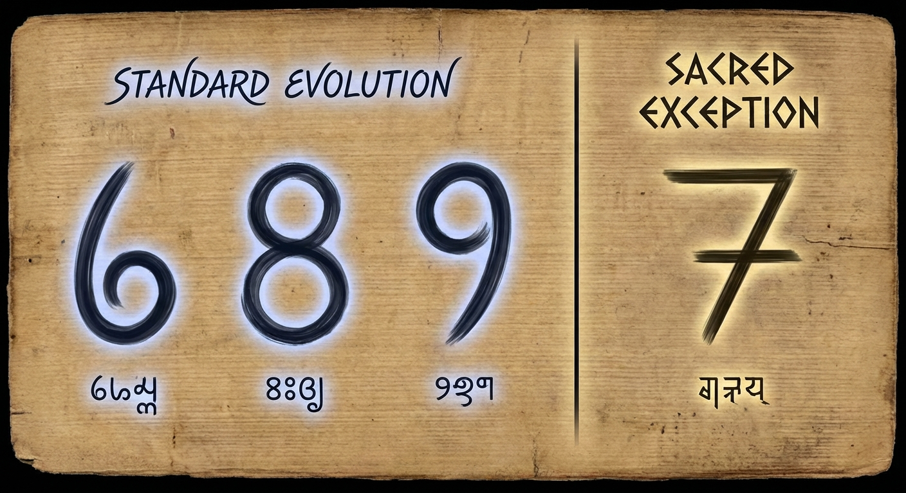
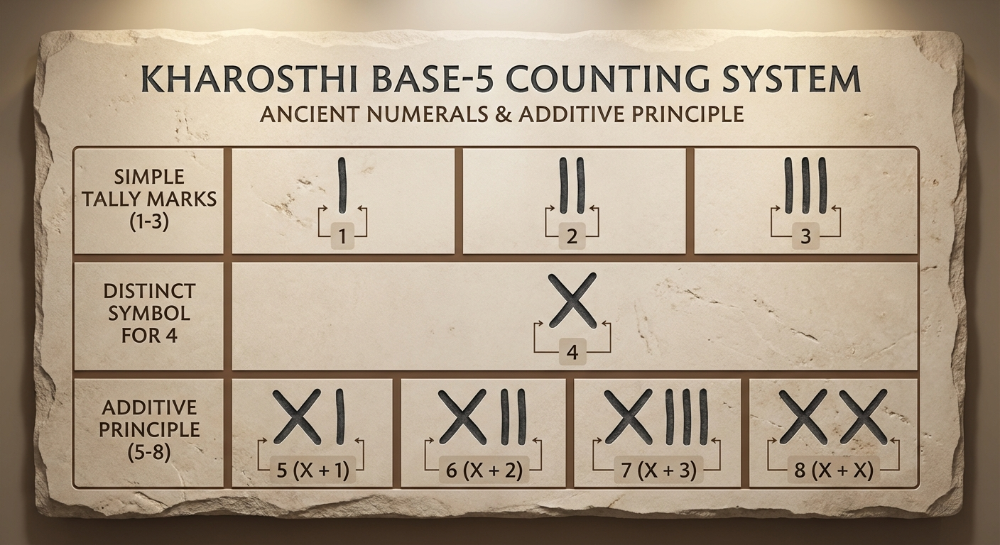
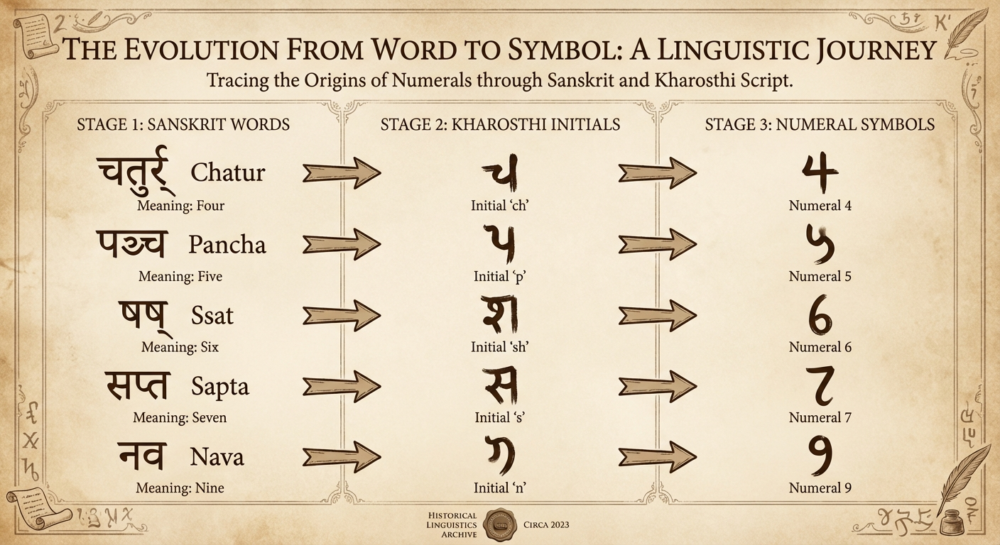
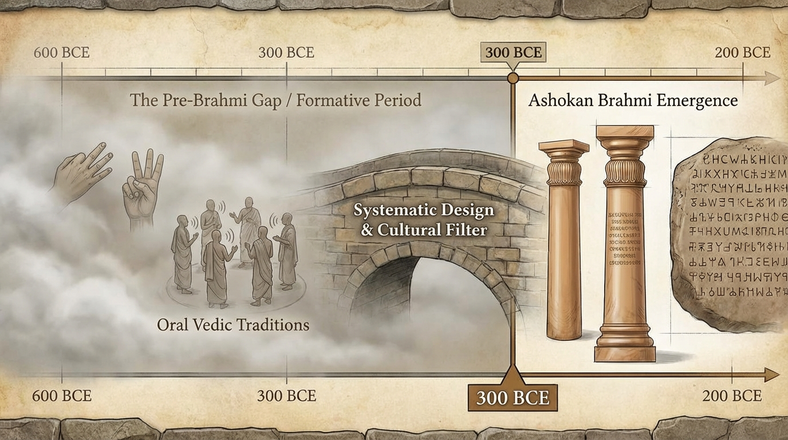

# The Sacred Seven: A Theory of Pre-Brahmi Numeral Evolution

## The Visual Puzzle

Why do 6, 8, and 9 all share curved, flowing forms while 7 stands alone with its angular, geometric design? This pattern
suggests a deeper story about how our numeral system developed during the crucial pre-Brahmi period (6th-3rd century
BCE).

## The Hypothesis: Base-5 Promotion System

### Stage 1: The 1-5 Foundation

Early counting systems were naturally quinary (base-5), developed from finger counting on one hand. Archaeological
evidence shows:

- **Kharosthi numerals**: 1-3 were simple vertical bars, 4 was a cross "X"
- **Base-5 combinations**: 5-8 expressed as combinations with 4 (1&4, 2&4, 3&4, 4&4)
- **Finger-based origins**: "The earliest counting systems are thought to be quinary (base-5), developed from counting
  fingers on one hand"

### Stage 2: The 5-9 Promotion

When expansion to higher single digits was needed, the proven 1-5 symbol set was systematically promoted to represent
5-9:

- **Acrophonic mechanism**: Symbols derived from Sanskrit number names in Kharosthi alphabet
    - "chatur" (4) → Kharosthi "ch"
    - "pancha" (5) → Kharosthi "p"
    - "ssat" (6) → Kharosthi "sh"
    - "sapta" (7) → Kharosthi "s"
    - "nava" (9) → Kharosthi "n"

- **Visual coherence**: Maintained the same cognitive load (5 symbols to memorize)
- **Clear separation**: Distinguished "larger numbers" (5-9) from "small numbers" (1-4)

## The Sacred Seven Exception

### Cultural Reverence

Ancient Indian culture held deep reverence for the number 7, established in the earliest Vedic texts:

- **Cosmic significance**: Seven higher and seven lower worlds (14 realms total)
- **Sacred structures**: Seven Saptarishis (great sages), seven sacred rivers
- **Creation mythology**: In Purusha Sukta, "seven surrounding sheaths in the Yajna (sacrifice)"
- **Spiritual status**: Number 7 called the "spiritual stone" in Vedic numerology

### Design Decision

When pre-Brahmi designers were creating the 5-9 set, they made a deliberate choice:

- **5, 6, 8, 9**: Followed standardized curved patterns (promoted from 1-5 system)
- **7**: Preserved angular distinctiveness as reflection of its sacred status
- **Dual purpose**: Served both readability (visual break in number sequences) and spiritual significance

## Supporting Evidence

### Archaeological Timeline

- **3rd century BCE**: Brahmi numerals appear as "fully developed system"
- **6th-3rd century BCE**: Crucial pre-Brahmi developmental period (missing from archaeological record)
- **Cultural context**: Vedic reverence for 7 already established during this formative period

### Systematic Development

Rather than random evolution, this represents conscious design choices:

- **Base-5 foundation**: Natural finger-counting origins
- **Promotion mechanism**: Systematic expansion using acrophonic principles
- **Sacred exception**: Cultural reverence influencing visual design
- **Readability optimization**: Strategic angular placement for visual distinctiveness

## Implications

This theory explains several mysteries:

1. **Why 6, 8, 9 look similar**: They're from the same promoted system (originally 1, 3, 4 equivalents)
2. **Why 7 is different**: Cultural reverence demanded special visual treatment
3. **Why this works for readability**: Intentional design for visual distinctiveness
4. **Why it survived**: Optimal balance of systematic design and sacred significance

The angular 7 among curved companions isn't an accident—it's a 2,500-year-old design decision that honored both
practical readability and spiritual reverence in ancient Indian culture.

---

*This theory synthesizes archaeological evidence from Brahmi and Kharosthi numeral systems, acrophonic development
patterns, Vedic cultural practices, and systematic design principles to explain the visual distinctiveness of the
numeral 7.*
