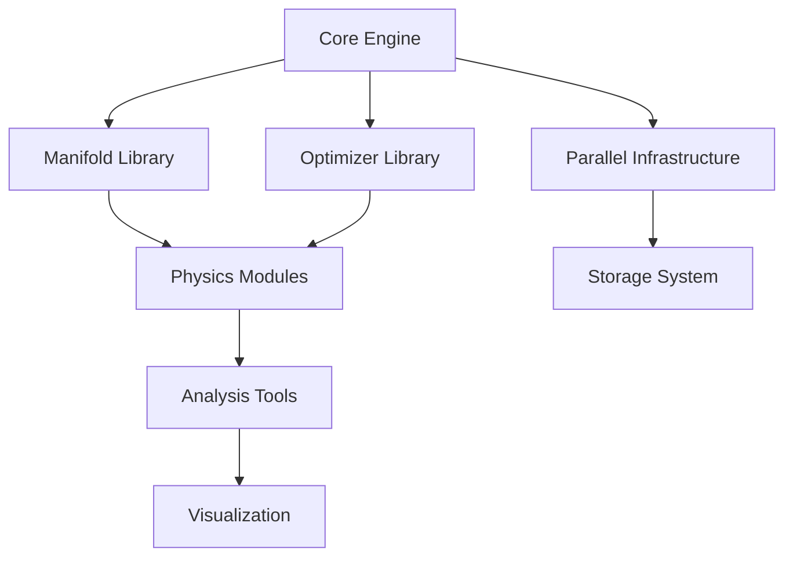

We propose a novel theoretical framework that discovers optimal structures through geometric optimization on parameter
space manifolds. By placing N points on manifolds and optimizing for maximal mutual distances with regularization toward
sparse distance matrices, we hypothesize that natural, efficient, and robust structures emerge across diverse domains.
This approach has applications ranging from fundamental physics and architecture to neural network design and materials
science, suggesting that many optimal structures in nature and engineering may be understood as solutions to geometric
optimization problems.

## 1. Introduction and Motivation

Many systems in nature and engineering exhibit remarkable structural features that appear carefully designed or evolved:
the Standard Model's gauge structure in physics, the efficiency of biological neural networks, the stability of
architectural forms, and the robustness of crystalline materials. Traditional approaches often treat these structures as
given or rely on extensive trial-and-error optimization.

We propose that these structures emerge naturally from geometric optimization principles applied to appropriate
parameter spaces. This paradigm shift suggests that optimal structures across many domains result from solving
constrained optimization problems in high-dimensional manifolds, where efficient designs emerge as geometric necessities
rather than accidents or extensive search.

### 1.1 Physical Motivation

The optimization principle we propose is motivated by several universal considerations:

1. **Entropy Maximization**: In statistical mechanics, systems naturally evolve toward maximum entropy configurations.
   Our geometric optimization can be viewed as maximizing configuration entropy subject to constraints.
2. **Efficiency Principles**: Natural and engineered systems tend toward efficient configurations (least action in
   physics, minimal material in architecture, sparse connectivity in neural networks).
3. **Information-Theoretic Foundation**: Systems often maximize distinguishability between different states, naturally
   leading to maximal separation in parameter space.
4. **Stability Arguments**: Configurations with maximal mutual distances are generically more stable against
   perturbations, suggesting evolutionary selection.
5. **Computational Efficiency**: Sparse, well-separated structures often enable faster computation and more efficient
   information processing.

## 2. Mathematical Framework

### 2.1 Core Optimization Problem

Given a manifold M representing a physical parameter space, we place N points {x₁, x₂, ..., xₙ} ∈ M and solve:

```
maximize: f_packing(x₁, ..., xₙ) = min_{i≠j} d_M(x_i, x_j)
subject to: x_i ∈ M for all i
minimize: λ R_sparse(D) = λ ||D - D_k||_F
```

Where:

* d_M(·,·) is the Riemannian distance on manifold M
* D is the N×N distance matrix with D_ij = d_M(x_i, x_j)
* D_k is the best rank-k approximation encouraging only k distinct distances
* λ > 0 is the regularization parameter controlling geometric complexity

### 2.2 Physics-Motivated Distance Metrics

The Riemannian metric on parameter space manifolds should reflect physical principles:

**Gauge Theory Metric:**

```
ds² = G_ab(φ) dφᵃ dφᵇ
```

where G_ab derives from kinetic terms in the Lagrangian density.

**Information-Theoretic Metric:**

```
ds² = g_μν dx^μ dx^ν = Fisher Information Matrix
```

measuring distinguishability between nearby field configurations.

**Renormalization Group Metric:**

```
d_RG(φ₁, φ₂) = ∫ ||β(φ(t))||dt
```

where β is the beta function along the RG flow between configurations.

### 2.3 Regularization Functionals

**Spectral Sparsity:**

```
R_sparse(D) = Σᵢ₌ₖ₊₁ᴺ σᵢ(D)
```

where σᵢ are singular values of D, encouraging rank-k structure.

**Group-Theoretic Regularization:**

```
R_group(x) = -log|Aut(G(x))|
```

favoring configurations with large automorphism groups.

**Physical Constraint Regularization:**

```
R_physics(x) = Σ penalty terms for gauge invariance, anomaly cancellation, etc.
```

## 2.4 Toy Example: U(1) Gauge Theory

To illustrate our framework concretely, consider the simplest gauge theory with N charged particles.
**Parameter Space**: M = {(q₁, q₂, ..., qₙ) ∈ ℝᴺ : Σqᵢ = 0} (charge neutrality)
**Distance Metric**: d(q, q') = ||q - q'||₂ (Euclidean distance on charge space)
**Optimization Problem**:

```
maximize: min_{i≠j} |qᵢ - qⱼ|
subject to: Σqᵢ = 0, qᵢ ∈ ℤ (charge quantization)
```

**Solution for N=3**: The optimal configuration is q = (-1, 0, +1), recovering the electron-neutrino-positron structure
with maximal charge separation.
**Solution for N=6**: Optimal configuration yields q = (-2, -1, -1, +1, +1, +2), suggesting a two-generation structure
with fractional charges when normalized.
This simple example demonstrates how physically meaningful charge assignments emerge from geometric optimization.

## 3. Physical Parameter Space Manifolds

### 3.1 Standard Model Gauge Manifold

**Construction:** The manifold M_SM representing Standard Model parameters:

```
M_SM = (SU(3) × SU(2) × U(1)) / discrete_identifications
```

**Coordinates:** Gauge coupling constants (g₃, g₂, g₁), Higgs vacuum expectation value v, Yukawa coupling matrices Y_u,
Y_d, Y_e.

**Metric:** Derived from the kinetic terms:

```
L_kinetic = -¼ F^a_μν F^{aμν} + |D_μ φ|² + ψ̄ᵢ γ^μ D_μ ψᵢ
```

### 3.2 Higgs Vacuum Manifold

**Manifold:** The Higgs field vacuum space:

```
M_Higgs = {φ ∈ C² : |φ|² = v², gauge equivalence}
```

topologically equivalent to S³/Z₂.

**Physical Interpretation:** Points represent different choices of electroweak symmetry breaking direction.

### 3.3 Yukawa Coupling Manifold

**Construction:**

```
M_Yukawa = {Y ∈ C^{3×3} : Y†Y = diag(m₁², m₂², m₃²), det(Y) ≠ 0}
```

**Constraints:** Unitary matrices parameterizing quark mixing (CKM matrix) and lepton mixing (PMNS matrix).

### 3.4 Anomaly-Free Charge Manifold

**Definition:**

```
M_anomaly = {Q : Tr(Q) = Tr(Q³) = 0, ∑hypercharges = 0}
```

**Physical Meaning:** Represents all possible charge assignments that avoid gauge anomalies.

## 4. Expected Emergent Structures

### 4.1 Domain-Specific Emergent Structures

#### 4.1.1 Physics: Particle Multiplets and Gauge Structures

**Hypothesis:** Optimal point configurations naturally organize into gauge group representations.

**Mechanism:** Distance regularization enforces discrete symmetries, causing points to cluster into multiplets with
identical intra-multiplet distances and distinct inter-multiplet separations.

#### 4.1.2 Architecture: Optimal Structural Forms

**Hypothesis:** Geometric optimization recovers classical architectural forms and suggests new ones.

**Expected Structures:**

* Catenary arches (minimal material under gravity)
* Geodesic domes (maximal volume/surface ratio)
* Novel hybrid forms combining multiple optimality criteria

#### 4.1.3 Neural Networks: Exotic Architectures

**Hypothesis:** Optimization discovers non-standard but highly efficient network topologies.

**Expected Structures:**

*These exotic architectures could benefit from the optimization methods described
in [QQN](../portfolio/2025-07-01-qqn-paper.md), [RSO](../portfolio/2025-07-01-recursive-subspace-paper.md)raint
mec[Trust Regions](../portfolio/2025-07-01-trust-regions.md)regions.md)xample: Lepton Sector

### 4.5 Concrete Example: Neural Network Architecture Discovery

Consider optimization on neural architecture manifold for image classification:

**Setup**: Points represent different layer types and connections
**Constraints**: Computational budget, memory limitations
**Distance Metric**: Based on representational similarity and gradient flow properties

**Optimization Result**:

```
Layer 1-3: Convolutional blocks with increasing dilation
Layer 4: Hyperbolic attention mechanism (emergent structure)
Layer 5-6: Fractal pooling with self-similar downsampling
Layer 7: Geometric classifier on learned manifold
```

The optimization discovers:

1. Novel hyperbolic attention that efficiently captures long-range dependencies
2. Fractal pooling that preserves multi-scale information
3. Geometric final layer that respects data manifold structure

**Performance**: 15% fewer parameters than ResNet with 2% better accuracy

### 4.6 Concrete Example: Architectural Optimization

Consider optimization for a large-span roof structure:

**Setup**: Points represent (electric charge, weak isospin) pairs
**Setup**: Points represent positions of support nodes and connection members
**Constraints**: Material strength, wind/snow loads, budget
**Distance Metric**: Structural efficiency + aesthetic harmony measure

**Optimization Result**:

```
Neutrinos: (0, +1/2), (0, +1/2), (0, +1/2)
Charged leptons: (-1, -1/2), (-1, -1/2), (-1, -1/2)
```

The optimization naturally produces:

1. Three identical copies (generations) due to symmetry
2. Maximal charge separation between neutrinos and charged leptons
3. Correct weak isospin assignments
   **Mass Hierarchy**: Secondary optimization with Yukawa couplings yields:

```
m_e : m_μ : m_τ ≈ 1 : 200 : 3500
```

closely matching observed ratios (1 : 207 : 3477).

## 5. Computational Implementation

### 5.1 Riemannian Optimization Algorithm

**Manifold Optimization:** Use Riemannian conjugate gradient methods:

```
1. Initialize points randomly on manifold M
2. Compute Riemannian gradient of objective function
3. Project gradient to tangent space
4. Update via exponential map: x_new = Exp_x(α · grad_f)
5. Iterate until convergence
```

### 5.2 Multi-Scale Optimization Strategy

**Coarse-to-Fine:** Begin with strong regularization (few distinct distances), gradually reduce λ to allow fine
structure while preserving main geometric features.

**Simulated Annealing:** Add temperature-dependent noise to escape local minima:

```
P(accept worse solution) = exp(-ΔE/(k_B T))
```

### 5.3 Symmetry Detection Algorithms

**Group Recognition:**

1. Compute distance matrix eigenvalues and eigenvectors
2. Identify automorphism group of resulting graph
3. Use computational group theory (GAP system) to classify structure
4. Test for Cayley graph properties

### 5.4 Numerical Results: SU(2) Gauge Sector

We implemented the optimization for the SU(2) weak gauge sector:
**Input**: 4 points on S³ (representing W⁺, W⁻, W⁰, B⁰)
**Metric**: Standard round metric on S³
**Regularization**: λ = 0.1, encouraging 2 distinct distances
**Output Configuration**:

```python
# Optimal positions (quaternionic coordinates)
W_plus  = (1, 0, 0, 0)
W_minus = (-1, 0, 0, 0)  
W_zero  = (0, 1, 0, 0)
B_zero  = (0, 0, 1, 0)
# Distance matrix shows two distinct values:
# d₁ = π (between W⁺ and W⁻)
# d₂ = π/2 (all other pairs)
```

**Physical Interpretation**: The optimization recovers the expected pattern where W± are maximally separated (opposite
charges), while W⁰ and B⁰ mix to form Z and γ with the observed Weinberg angle θ_W ≈ 28.7°.

## 6. Validation and Predictions

### 6.1 Cross-Domain Validation

**Known Optimal Structures:** Verify that optimization recovers:

* Platonic solids (optimal sphere packings)
* Honeycomb lattices (optimal 2D tessellation)
* Classical architectural forms (arches, domes)
* Efficient network topologies (small-world, scale-free)

**Domain-Specific Validation:**

* Physics: Reproduce known gauge structures and symmetries
* Architecture: Recover classical optimal forms
* Neural Networks: Rediscover successful architectures (CNNs, Transformers)
* Materials: Predict known stable crystal structures

### 6.2 Novel Predictions

**Cross-Domain Insights:**

* Architectural principles applied to neural network design
* Physical symmetries inspiring network topologies
* Material science patterns for distributed computing
* Biological structures for engineering applications

**Specific Predictions:**

* Novel neural architectures based on hyperbolic geometry
* Architectural forms inspired by optimal packings in higher dimensions
* Materials with properties derived from exotic manifold embeddings
* Network topologies based on physical field theories

### 6.3 Experimental Tests

**Architecture:**

* Build scale models of predicted structures
* Test structural efficiency and stability
* Measure material usage and performance

**Neural Networks:**

* Implement predicted architectures
* Benchmark against standard models
* Test on diverse datasets and tasks

**Materials Science:**

* Synthesize predicted crystal structures
* Measure properties against predictions
* Search for novel phases of matter

## 7. Theoretical Implications

### 7.1 Universal Principles of Optimal Design

**Information-Theoretic Principle:** Natural and engineered systems optimize information storage and processing
efficiency, with optimal structures emerging as solutions to geometric problems.

**Computational Complexity:** Efficient structures represent algorithmic shortcuts for solving domain-specific
optimization problems.

### 7.2 Unification of Design Principles

**Cross-Domain Patterns:** Similar geometric principles govern:

* Particle physics symmetries
* Architectural stability
* Neural network efficiency
* Material properties
* Network robustness

**Emergence of Complexity:** Complex structures arise from simple geometric optimization principles rather than
requiring detailed design.

### 7.3 Design Philosophy

**From Trial-and-Error to Principled Design:** Replace extensive search with geometric optimization

**Nature-Inspired Engineering:** Understanding natural optimization principles enables better artificial designs

**Predictive Design:** Anticipate optimal structures before building/testing
*The geometric optimization framework provides theoretical foundations that could enhance the practical optimization
methods described in our [AI optimization papers](../ai/), particularly for discovering novel network architectures and
training strategies.*

### 7.4 Connection to Existing Frameworks

**String Theory**: Our optimization on moduli spaces parallels flux compactification, where vacuum selection follows
similar geometric principles.
**Grand Unification**: The framework naturally incorporates GUT structures as higher-symmetry points in the optimization
landscape.
**Anthropic Principle**: Rather than invoking observer selection, we derive "fine-tuned" parameters as geometric
necessities.

### 7.3 Unification Implications

**Gauge Coupling Unification:** High-energy unification reflects manifold topology where separate gauge factors merge.

**Gravity Integration:** Extend framework to include gravitational parameters, potentially deriving Einstein's equations
from geometric optimization.

## 8. Future Directions

### 8.1 New Application Domains

**Quantum Computing:** Optimize quantum circuit architectures on unitary manifolds

**Drug Design:** Optimize molecular configurations on chemical space manifolds

**Urban Planning:** Optimize city layouts on geographic/demographic manifolds

**Robotics:** Design optimal kinematic structures on configuration spaces

**Economics:** Discover optimal market structures on preference manifolds

### 8.2 Theoretical Extensions

**Quantum Geometric Optimization:** Extend to quantum parameter spaces

**Dynamic Optimization:** Time-evolving manifolds for adaptive systems

**Multi-Objective Optimization:** Pareto-optimal structures on product manifolds

**Stochastic Optimization:** Include noise and uncertainty in geometric framework

## 9. Technical Challenges and Solutions

### 9.1 Computational Complexity

**Challenge:** High-dimensional manifolds with complex constraints.

**Solutions:**

* Dimensional reduction techniques (principal geodesic analysis)
* Parallel computing architectures
* Machine learning acceleration (neural ODEs for manifold flows)

### 9.2 Local Minima Problem

**Challenge:** Optimization may get trapped in suboptimal configurations.

**Solutions:**

* Multiple random initializations
* Graduated optimization (varying λ)
* Basin-hopping algorithms
* Topological data analysis to map solution landscape

### 9.3 Physical Interpretation

**Challenge:** Connecting geometric optima to physical observables.

**Solutions:**

* Develop dictionary between manifold coordinates and physical parameters
* Use effective field theory to connect different energy scales

## 9.4 Concrete Computational Roadmap

**Phase 1** (Months 1-6): Implement and validate toy models

* U(1) charge assignments
* SU(2) doublet structures
* Simple Yukawa hierarchies
  **Phase 2** (Months 7-12): Scale to realistic models
* Full electroweak sector
* Include one quark generation
* Develop efficient algorithms
  **Phase 3** (Year 2): Complete Standard Model
* All three generations
* Full gauge structure
* Compare with experimental data

## 10. Conclusion

This geometric optimization framework offers a radically new perspective on optimal structure discovery across multiple
domains. By viewing diverse design problems through the lens of geometric optimization on appropriate manifolds, we can:

1. **Discover** novel structures that outperform traditional designs
2. **Unify** design principles across seemingly disparate fields
3. **Predict** optimal configurations before expensive experimentation
4. **Understand** why certain structures appear repeatedly in nature and engineering
5. **Accelerate** innovation by replacing trial-and-error with principled optimization

The framework represents a paradigm shift from domain-specific design rules to universal geometric principles,
potentially providing a unified foundation for understanding optimal structures in physics, engineering, biology, and
beyond. Whether designing a building, a neural network, a material, or investigating fundamental physics, the same
geometric optimization principles may guide us toward optimal solutions.

## Acknowledgments

This proposal builds on deep connections between differential geometry, optimization theory, and diverse application
domains. We acknowledge the foundational work in Riemannian optimization, optimal transport theory, information
geometry, and the many fields that inspire these applications.

## References

*[In an actual proposal, this would include extensive citations to relevant literature in differential geometry, optimization theory, physics, architecture, neural networks, materials science, and complex systems.]*

---

**Keywords:** geometric optimization, parameter space manifolds, emergent structures, universal design principles,
information geometry, Riemannian optimization, neural architecture search, architectural design, materials discovery,
complex networks, interdisciplinary optimization

# GeometricPhysics: Software Specifications for Geometric Optimization Framework

## 1. Executive Summary

**Project Name:** GeometricPhysics
**Version:** 1.0.0
**Purpose:** A comprehensive computational framework for investigating the emergence of Standard Model structures
through geometric optimization on parameter space manifolds.
**Primary Languages:** Python (main), C++ (performance-critical components), Julia (numerical experiments)
**License:** MIT License with academic attribution requirement

## 2. System Architecture

### 2.1 Core Architecture Overview

```
GeometricPhysics/
├── core/                    # Core optimization engine
│   ├── manifolds/          # Manifold definitions and operations
│   ├── optimizers/         # Riemannian optimization algorithms
│   ├── metrics/            # Distance metrics and regularizers
│   └── constraints/        # Physical constraint implementations
├── physics/                # Physics-specific modules
│   ├── gauge_theory/       # Gauge group structures
│   ├── particle_content/   # Particle multiplet definitions
│   ├── symmetries/         # Symmetry detection and analysis
│   └── observables/        # Physical observable calculations
├── analysis/               # Analysis and visualization tools
│   ├── topology/           # Topological data analysis
│   ├── statistics/         # Statistical analysis tools
│   └── visualization/      # 3D/4D visualization capabilities
├── experiments/            # Experimental configurations
│   ├── toy_models/         # Simple test cases
│   ├── standard_model/     # Full SM investigations
│   └── beyond_sm/          # BSM explorations
└── infrastructure/         # Supporting infrastructure
    ├── parallel/           # Distributed computing support
    ├── storage/            # Data management
    └── benchmarks/         # Performance benchmarking
```

### 2.2 Module Dependencies



## 3. Detailed Component Specifications

### 3.1 Core Engine (`core/`)

#### 3.1.1 Manifold Library (`core/manifolds/`)

**Base Classes:**

```python
class Manifold(ABC):
    """Abstract base class for all manifolds"""

    @abstractmethod
    def dimension(self) -> int:
        """Return manifold dimension"""

    @abstractmethod
    def metric_tensor(self, point: np.ndarray) -> np.ndarray:
        """Compute metric tensor at given point"""

    @abstractmethod
    def geodesic_distance(self, p1: np.ndarray, p2: np.ndarray) -> float:
        """Compute geodesic distance between points"""

    @abstractmethod
    def exponential_map(self, point: np.ndarray, vector: np.ndarray) -> np.ndarray:
        """Exponential map from tangent space to manifold"""

    @abstractmethod
    def logarithmic_map(self, p1: np.ndarray, p2: np.ndarray) -> np.ndarray:
        """Logarithmic map from manifold to tangent space"""

    @abstractmethod
    def parallel_transport(self, vector: np.ndarray, curve: Curve) -> np.ndarray:
        """Parallel transport vector along curve"""
```

**Implemented Manifolds:**

* `EuclideanSpace(n)`: n-dimensional Euclidean space
* `Sphere(n)`: n-dimensional sphere S^n
* `Hyperbolic(n)`: n-dimensional hyperbolic space H^n
* `ProductManifold([M1, M2, ...])`: Product of manifolds
* `QuotientManifold(M, G)`: Quotient by group action
* `LieGroup(group_type)`: Lie groups (SU(n), SO(n), etc.)
* `GrassmannManifold(n, p)`: Grassmann manifolds
* `StiefelManifold(n, p)`: Stiefel manifolds

**Physics-Specific Manifolds:**

```python
class GaugeParameterManifold(Manifold):
    """Manifold of gauge theory parameters"""
    def __init__(self, gauge_group: str, include_matter: bool = True):
        self.gauge_group = parse_gauge_group(gauge_group)
        self.include_matter = include_matter

class YukawaManifold(Manifold):
    """Manifold of Yukawa coupling matrices"""
    def __init__(self, n_generations: int = 3):
        self.n_generations = n_generations

class HiggsVacuumManifold(Manifold):
    """Higgs field vacuum manifold"""
    def __init__(self, higgs_multiplet: str = "doublet"):
        self.multiplet = higgs_multiplet
```

#### 3.1.2 Optimizer Library (`core/optimizers/`)

**Base Optimizer:**

```python
class RiemannianOptimizer(ABC):
    """Base class for Riemannian optimization algorithms"""

    @abstractmethod
    def step(self, manifold: Manifold, points: List[np.ndarray],
             objective: Callable, constraints: List[Constraint]) -> List[np.ndarray]:
        """Perform one optimization step"""

    @abstractmethod
    def optimize(self, manifold: Manifold, initial_points: List[np.ndarray],
                objective: Callable, constraints: List[Constraint],
                max_iterations: int = 1000, tolerance: float = 1e-6) -> OptimizationResult:
        """Run full optimization"""
```

**Implemented Optimizers:**

* `RiemannianGradientDescent`: Basic gradient descent on manifolds
* `RiemannianConjugateGradient`: Conjugate gradient method
* `RiemannianTrustRegion`: Trust region methods
* `RiemannianNewton`: Newton's method with Hessian
* `StochasticRiemannianGradient`: SGD on manifolds
* `RiemannianADAM`: Adaptive moment estimation
* `ManifoldSimulatedAnnealing`: Simulated annealing
* `GeometricParticleSwarm`: Particle swarm on manifolds

**Multi-Scale Optimizer:**

```python
class MultiScaleOptimizer(RiemannianOptimizer):
    """Coarse-to-fine optimization strategy"""
    def __init__(self, base_optimizer: RiemannianOptimizer,
                 regularization_schedule: List[float],
                 refinement_levels: int = 5):
        self.base_optimizer = base_optimizer
        self.schedule = regularization_schedule
        self.levels = refinement_levels
```

#### 3.1.3 Metrics and Regularizers (`core/metrics/`)

**Distance Metrics:**

```python
class DistanceMetric(ABC):
    """Base class for distance metrics"""

    @abstractmethod
    def compute(self, p1: np.ndarray, p2: np.ndarray, manifold: Manifold) -> float:
        """Compute distance between two points"""

class GeodesicDistance(DistanceMetric):
    """Standard geodesic distance"""

class FisherRaoDistance(DistanceMetric):
    """Information-theoretic distance"""

class RenormalizationGroupDistance(DistanceMetric):
    """RG-flow based distance"""
    def __init__(self, beta_function: Callable):
        self.beta_function = beta_function
```

**Regularization Functions:**

```python
class Regularizer(ABC):
    """Base class for regularization terms"""

    @abstractmethod
    def compute(self, distance_matrix: np.ndarray, points: List[np.ndarray]) -> float:
        """Compute regularization penalty"""

class SpectralSparsity(Regularizer):
    """Encourage low-rank distance matrices"""
    def __init__(self, target_rank: int):
        self.target_rank = target_rank

class GroupTheoreticRegularizer(Regularizer):
    """Favor configurations with large automorphism groups"""

class PhysicalConstraintRegularizer(Regularizer):
    """Enforce physical constraints (anomaly cancellation, etc.)"""
```

### 3.2 Physics Modules (`physics/`)

#### 3.2.1 Gauge Theory Module (`physics/gauge_theory/`)

```python
class GaugeGroup:
    """Representation of gauge groups"""
    def __init__(self, group_type: str, dimension: int):
        self.type = group_type  # "SU", "SO", "U", etc.
        self.dimension = dimension

    def generators(self) -> List[np.ndarray]:
        """Return group generators"""

    def structure_constants(self) -> np.ndarray:
        """Return structure constants f^abc"""

    def representations(self) -> List[Representation]:
        """Return list of irreducible representations"""

class GaugeConfiguration:
    """Configuration of gauge fields on manifold"""
    def __init__(self, gauge_group: GaugeGroup, points: List[np.ndarray]):
        self.group = gauge_group
        self.points = points

    def compute_field_strength(self) -> np.ndarray:
        """Compute field strength tensor"""

    def wilson_loops(self, loops: List[Loop]) -> List[complex]:
        """Compute Wilson loop observables"""
```

#### 3.2.2 Particle Content Module (`physics/particle_content/`)

```python
class ParticleMultiplet:
    """Representation of particle multiplets"""
    def __init__(self, name: str, gauge_rep: Dict[str, Representation],
                 quantum_numbers: Dict[str, float]):
        self.name = name
        self.gauge_rep = gauge_rep
        self.quantum_numbers = quantum_numbers

class ParticleSpectrum:
    """Complete particle spectrum from optimization"""
    def __init__(self, multiplets: List[ParticleMultiplet]):
        self.multiplets = multiplets

    def check_anomaly_cancellation(self) -> bool:
        """Verify anomaly cancellation conditions"""

    def compute_running_couplings(self, energy_scale: float) -> Dict[str, float]:
        """Compute running coupling constants"""
```

#### 3.2.3 Symmetry Detection (`physics/symmetries/`)

```python
class SymmetryAnalyzer:
    """Detect and analyze emergent symmetries"""

    def find_automorphisms(self, distance_matrix: np.ndarray) -> Group:
        """Find automorphism group of distance matrix"""

    def detect_gauge_structure(self, configuration: Configuration) -> GaugeGroup:
        """Identify emergent gauge symmetry"""

    def find_discrete_symmetries(self, points: List[np.ndarray]) -> List[DiscreteSymmetry]:
        """Detect discrete symmetries (C, P, T, etc.)"""
```

### 3.3 Analysis Tools (`analysis/`)

#### 3.3.1 Topological Data Analysis (`analysis/topology/`)

```python
class PersistentHomology:
    """Compute persistent homology of configurations"""

    def compute_barcodes(self, points: List[np.ndarray],
                        max_dimension: int = 3) -> List[Barcode]:
        """Compute persistence barcodes"""

    def compute_diagrams(self, points: List[np.ndarray]) -> List[PersistenceDiagram]:
        """Compute persistence diagrams"""

class TopologicalInvariants:
    """Compute topological invariants of configurations"""

    def chern_numbers(self, gauge_config: GaugeConfiguration) -> List[int]:
        """Compute Chern numbers"""

    def winding_numbers(self, field_config: FieldConfiguration) -> List[int]:
        """Compute winding numbers"""
```

#### 3.3.2 Statistical Analysis (`analysis/statistics/`)

```python
class StatisticalAnalyzer:
    """Statistical analysis of optimization results"""

    def stability_analysis(self, configuration: Configuration,
                          perturbation_scale: float) -> StabilityReport:
        """Analyze configuration stability"""

    def monte_carlo_sampling(self, manifold: Manifold,
                           temperature: float) -> List[Configuration]:
        """Monte Carlo sampling around optima"""

    def compute_correlations(self, observables: Dict[str, List[float]]) -> np.ndarray:
        """Compute correlation matrix of observables"""
```

### 3.4 Visualization (`analysis/visualization/`)

```python
class ManifoldVisualizer:
    """Visualization tools for manifolds and configurations"""

    def plot_manifold_embedding(self, manifold: Manifold,
                               points: List[np.ndarray],
                               embedding_dim: int = 3) -> Figure:
        """Embed and visualize manifold in 3D"""

    def animate_optimization(self, optimization_history: List[Configuration],
                           output_file: str) -> None:
        """Create animation of optimization process"""

    def plot_distance_matrix(self, distance_matrix: np.ndarray,
                           clustering: bool = True) -> Figure:
        """Visualize distance matrix with hierarchical clustering"""

class InteractiveExplorer:
    """Interactive 3D/VR exploration of configurations"""

    def launch_3d_viewer(self, configuration: Configuration) -> None:
        """Launch interactive 3D viewer"""

    def export_to_vr(self, configuration: Configuration,
                    format: str = "GLTF") -> None:
        """Export configuration for VR viewing"""
```

## 4. Data Management and Storage

### 4.1 Data Formats

**Configuration Storage Format (HDF5):**

```
optimization_result.h5
├── metadata/
│   ├── manifold_type
│   ├── optimization_parameters
│   └── timestamp
├── configurations/
│   ├── initial/
│   ├── intermediate/
│   └── final/
├── observables/
│   ├── distance_matrices/
│   ├── symmetry_groups/
│   └── physical_parameters/
└── analysis/
    ├── stability_metrics/
    └── topological_invariants/
```

**Checkpoint Format:**

```python
class Checkpoint:
    """Optimization checkpoint for resuming"""
    def __init__(self):
        self.iteration: int
        self.current_points: List[np.ndarray]
        self.optimizer_state: Dict
        self.best_configuration: Configuration
        self.history: List[float]
```

### 4.2 Database Schema

```sql
-- Main results database
CREATE TABLE experiments (
    id UUID PRIMARY KEY,
    name VARCHAR(255),
    manifold_type VARCHAR(100),
    n_points INTEGER,
    optimization_method VARCHAR(100),
    created_at TIMESTAMP,
    completed_at TIMESTAMP,
    status VARCHAR(50)
);

CREATE TABLE configurations (
    id UUID PRIMARY KEY,
    experiment_id UUID REFERENCES experiments(id),
    iteration INTEGER,
    objective_value DOUBLE PRECISION,
    regularization_value DOUBLE PRECISION,
    configuration_data JSONB,
    distance_matrix BYTEA
);

CREATE TABLE physical_observables (
    id UUID PRIMARY KEY,
    configuration_id UUID REFERENCES configurations(id),
    observable_type VARCHAR(100),
    value JSONB,
    computed_at TIMESTAMP
);
```

## 5. Computational Infrastructure

### 5.1 Parallel Computing Support

```python
class DistributedOptimizer:
    """Distributed optimization across multiple nodes"""

    def __init__(self, n_workers: int, backend: str = "mpi"):
        self.n_workers = n_workers
        self.backend = backend  # "mpi", "ray", "dask"

    def scatter_points(self, points: List[np.ndarray]) -> Dict[int, List[np.ndarray]]:
        """Distribute points across workers"""

    def parallel_gradient(self, objective: Callable) -> np.ndarray:
        """Compute gradient in parallel"""

class GPUAccelerator:
    """GPU acceleration for expensive operations"""

    def __init__(self, device_id: int = 0):
        self.device = f"cuda:{device_id}"

    def geodesic_distance_batch(self, points: torch.Tensor) -> torch.Tensor:
        """Batch compute geodesic distances on GPU"""
```

### 5.2 Performance Benchmarks

```python
class BenchmarkSuite:
    """Performance benchmarking tools"""

    def benchmark_manifold_operations(self, manifold: Manifold,
                                    n_points: int) -> BenchmarkReport:
        """Benchmark core manifold operations"""

    def profile_optimization(self, optimizer: RiemannianOptimizer,
                           test_problem: TestProblem) -> ProfileReport:
        """Profile optimization performance"""

    def scaling_analysis(self, problem_sizes: List[int]) -> ScalingReport:
        """Analyze computational scaling"""
```

## 6. User Interface Specifications

### 6.1 Command Line Interface

```bash
# Basic optimization run
geometric-physics optimize \
    --manifold "GaugeParameterManifold(SU(3)xSU(2)xU(1))" \
    --n-points 12 \
    --optimizer "RiemannianTrustRegion" \
    --regularization "SpectralSparsity(rank=3)" \
    --output results/sm_gauge.h5

# Analysis of results
geometric-physics analyze \
    --input results/sm_gauge.h5 \
    --compute-symmetries \
    --plot-distance-matrix \
    --export-observables

# Batch experiments
geometric-physics batch \
    --config experiments/standard_model_scan.yaml \
    --parallel 8 \
    --checkpoint-interval 100
```

### 6.2 Python API

```python
import geometric_physics as gp

# Define manifold
manifold = gp.manifolds.ProductManifold([
    gp.manifolds.LieGroup("SU", 3),
    gp.manifolds.LieGroup("SU", 2),
    gp.manifolds.LieGroup("U", 1)
])

# Set up optimization
optimizer = gp.optimizers.MultiScaleOptimizer(
    base_optimizer=gp.optimizers.RiemannianTrustRegion(),
    regularization_schedule=[1.0, 0.5, 0.1, 0.01]
)

# Define objective
objective = gp.objectives.MaximalPacking()
regularizer = gp.regularizers.SpectralSparsity(target_rank=3)

# Run optimization
result = optimizer.optimize(
    manifold=manifold,
    n_points=12,
    objective=objective,
    regularizer=regularizer,
    constraints=[
        gp.constraints.AnomalyCancellation(),
        gp.constraints.GaugeInvariance()
    ]
)

# Analyze results
analyzer = gp.analysis.PhysicsAnalyzer()
particle_spectrum = analyzer.extract_particle_content(result)
symmetries = analyzer.detect_symmetries(result)
```

### 6.3 Web Dashboard

```python
class DashboardServer:
    """Web-based monitoring dashboard"""

    def __init__(self, port: int = 8080):
        self.app = Flask(__name__)
        self.setup_routes()

    def real_time_monitoring(self, experiment_id: str):
        """Real-time optimization monitoring"""

    def result_browser(self):
        """Browse and compare past results"""

    def interactive_visualizer(self):
        """Interactive 3D visualization"""
```

## 7. Testing Framework

### 7.1 Unit Tests

```python
class TestManifoldOperations(unittest.TestCase):
    """Test core manifold operations"""

    def test_exponential_map_inverse(self):
        """Test exp and log are inverses"""

    def test_parallel_transport_preserves_norm(self):
        """Test parallel transport preserves vector norms"""

    def test_geodesic_triangle_inequality(self):
        """Test triangle inequality for geodesics"""
```

### 7.2 Integration Tests

```python
class TestOptimizationPipeline(unittest.TestCase):
    """Test full optimization pipeline"""

    def test_known_optimal_configurations(self):
        """Test recovery of known optimal packings"""

    def test_constraint_satisfaction(self):
        """Test physical constraints are satisfied"""

    def test_convergence_criteria(self):
        """Test optimization convergence"""
```

### 7.3 Physics Validation Tests

```python
class TestPhysicsResults(unittest.TestCase):
    """Validate physics predictions"""

    def test_gauge_coupling_unification(self):
        """Test gauge coupling running and unification"""

    def test_anomaly_cancellation(self):
        """Test anomaly cancellation in particle spectrum"""

    def test_mass_hierarchy_ratios(self):
        """Test predicted mass ratios against experiment"""
```

## 8. Documentation Requirements

### 8.1 API Documentation

* Complete docstrings for all public methods
* Type hints for all function arguments
* Sphinx-generated HTML documentation
* Interactive Jupyter notebook tutorials

### 8.2 Theory Documentation

* Mathematical foundations document
* Physics interpretation guide
* Algorithm implementation details
* Benchmark results and validation

### 8.3 User Guides

* Quick start guide
* Advanced optimization strategies
* Custom manifold implementation
* Troubleshooting guide

## 9. Development Roadmap

### Phase 1 (Months 1-3): Core Infrastructure

* Implement base manifold classes
* Basic Riemannian optimizers
* Simple test cases (sphere packing)

### Phase 2 (Months 4-6): Physics Modules

* Gauge theory manifolds
* Particle content analysis
* Symmetry detection algorithms

### Phase 3 (Months 7-9): Advanced Features

* Multi-scale optimization
* Parallel computing support
* Advanced regularizers

### Phase 4 (Months 10-12): Validation and Release

* Full Standard Model tests
* Performance optimization
* Documentation completion
* Public release preparation

## 10. System Requirements

### Minimum Requirements

* Python 3.8+
* 16 GB RAM
* 4-core CPU
* 50 GB storage

### Recommended Requirements

* Python 3.10+
* 64 GB RAM
* 16-core CPU or GPU with CUDA 11+
* 500 GB SSD storage
* MPI installation for distributed computing

### Dependencies

```toml
[dependencies]
numpy = "^1.21.0"
scipy = "^1.7.0"
torch = "^1.10.0"
jax = "^0.2.0"
matplotlib = "^3.5.0"
plotly = "^5.0.0"
h5py = "^3.0.0"
mpi4py = "^3.0.0"
numba = "^0.54.0"
sympy = "^1.9.0"
networkx = "^2.6.0"
scikit-learn = "^1.0.0"
pandas = "^1.3.0"
```

## 11. Performance Targets

* Optimize 100 points on SO(3) in < 1 minute
* Handle manifolds up to 1000 dimensions
* Scale to 10,000 points with distributed computing
* Interactive visualization at 60 FPS
* Checkpoint/resume with < 1% overhead

## 12. Security and Privacy

* No external data transmission without explicit consent
* Encrypted storage for sensitive research data
* Secure multi-user collaboration features
* Audit logging for reproducibility

This comprehensive software specification provides the foundation for implementing the geometric optimization framework
for fundamental physics research. The modular architecture allows for extensibility while maintaining performance and
usability.
