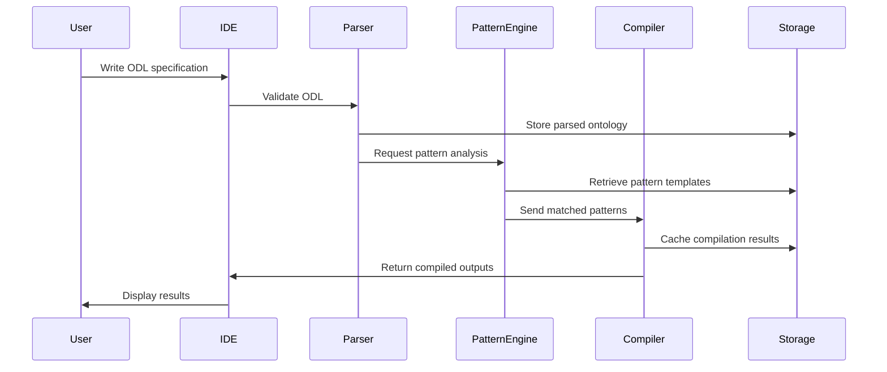

# Ontological Compiler Toolchain: Bridging Abstract Conceptual Frameworks and Computational Reality

**A Research Proposal for Systematic Translation Between Levels of Abstraction**

---

## Abstract

We propose the development of an **Ontological Compiler Toolchain** (OCT) - a novel computational framework that
systematically translates abstract conceptual models into executable, explorable, and testable computational forms.
Unlike traditional compilers that operate within the computational domain, OCT bridges the fundamental gap between
philosophical/theoretical frameworks and their practical implementation, enabling direct execution and exploration of
ontological structures.

The toolchain addresses a critical limitation in interdisciplinary research: the inability to systematically
operationalize abstract theoretical insights. By treating ontological frameworks as compilable specifications, OCT
transforms speculative theory into dynamic, interactive systems that can be executed, validated, and evolved.

## 1. Motivation and Problem Statement

### 1.1 The Abstraction Gap

Modern theoretical work - particularly at the intersection of disciplines - often exists in a liminal space between pure
abstraction and computational implementation. Researchers develop sophisticated conceptual frameworks, mathematical
formalisms, and theoretical models, but lack systematic tools to:
> **Institutional Context**: This abstraction gap is particularly problematic in domains dominated
> by [professional intermediaries](../social/game_theory_ethics.md#the-professional-intermediary-trap) who benefit from
> maintaining artificial complexity. OCT could democratize access to formal reasoning tools, reducing dependence on expert
> gatekeepers.

### 1.2 Current Limitations

Existing approaches to formalizing abstract concepts typically involve:

- Ad-hoc implementations that lose connection to the original theoretical framework
- Static mathematical representations that cannot capture dynamic behaviors
- Discipline-specific tools that cannot handle cross-domain concepts
- Manual translation processes that introduce errors and inconsistencies

### 1.3 The Opportunity

Recent advances in AI-assisted reasoning, symbolic computation, and domain-specific languages create an unprecedented
opportunity to develop systematic methods for ontological compilation. The emergence of large language models as "
intellectual partners" in formalization suggests that automated translation between abstraction levels is now feasible.

## 2. Theoretical Foundation

### 2.1 Ontological Substrate Theory

We propose that all theoretical frameworks, regardless of domain, operate on a common **ontological substrate**
characterized by:

- **Entities**: Fundamental objects or concepts within the framework
- **Relations**: Connections, dependencies, and interactions between entities
- **Constraints**: Rules, laws, or principles that govern system behavior
- **Dynamics**: How the system evolves, responds, or transforms over time
- **Emergence**: Higher-order patterns that arise from substrate interactions

### 2.2 Compilation as Ontological Translation

Traditional compilation translates between syntactic representations within the computational domain. **Ontological
compilation** extends this concept to translate between fundamentally different levels of abstraction:

```
Conceptual Framework → Mathematical Formalism → Computational Model → Executable System
```

Each translation preserves essential structural relationships while adapting to the constraints and capabilities of the
target abstraction level.

### 2.3 Cross-Domain Pattern Recognition

Building on the observation that similar mathematical structures manifest across seemingly unrelated domains, OCT
leverages **pattern templates** - reusable structural motifs that can be instantiated across different ontological
contexts.

## 3. Technical Architecture

> **Note**: For detailed technical specifications including API definitions, data models, and deployment architecture,
> see
> the [Technical Specification](ontological_compiler_proposal.md#ontological-compiler-toolchain-oct---technical-specification)
> section of this document.

### 3.1 Core Components

#### 3.1.1 Ontological Description Language (ODL)

A domain-specific language for expressing abstract conceptual frameworks with sufficient precision for automated
processing:

```odl
ontology QuantumConsciousness {
  entities:
    Observer : { state: quantum_superposition, measurement_basis: basis_set }
    System : { wavefunction: complex_field, entanglement: relation_matrix }
    
  relations:
    Measurement(Observer, System) -> { collapse: probabilistic, information: mutual }
    Entanglement(System, System) -> { correlation: nonlocal, strength: continuous }
    
  constraints:
    conservation(information) across Measurement
    locality_violation allowed for Entanglement
    
  dynamics:
    evolution := unitary_transformation(wavefunction, time)
    collapse := probabilistic_projection(measurement_basis)
}
```

#### 3.1.2 Pattern Recognition Engine

An AI-powered system that identifies recurring structural motifs across different ontological frameworks (
see [Technical Specification Section 3.2](#32-pattern-recognition-engine) for implementation details):

- **Structural Validation**: Ensures pattern applications preserve essential relationships

#### 3.1.3 Multi-Target Compiler Backend

Generates multiple output formats from ODL specifications (see [Section 3.3](#33-compilation-pipeline) for supported
targets):

- **Interactive Visualizations**: Dynamic representations of abstract concepts
- **Physical Implementations**: Hardware specifications for embodied systems

#### 3.1.4 Feedback Integration System

Captures results from compiled outputs and integrates them back into the original ontological framework:

- **Empirical Validation**: Tests theoretical predictions against compiled simulations
- **Conceptual Refinement**: Updates abstract models based on computational insights
- **Pattern Evolution**: Evolves pattern templates based on successful applications

### 3.2 Implementation Strategy

> **Implementation Note**: The technical specification provides detailed requirements for each phase,
> including [performance specifications](#7-performance-specifications), [testing framework](#9-testing-framework),
> and [deployment architecture](#10-deployment-architecture).
> **Implementation Note**: The technical specification provides detailed requirements for each phase,
> including [performance specifications](#7-performance-specifications), [testing framework](#9-testing-framework),
> and [deployment architecture](#10-deployment-architecture).

#### Phase 1: Foundation (Months 1-6)

#### Phase 2: Core Functionality (Months 7-12)

- Expand pattern template library
- Implement multi-target compilation backends
- Develop feedback integration mechanisms

#### Phase 3: Advanced Features (Months 13-18)

- AI-powered pattern discovery and application
- Cross-domain validation and consistency checking
- Interactive development environment

#### Phase 4: Validation and Refinement (Months 19-24)

- Comprehensive testing on diverse theoretical frameworks
- Community adoption and feedback integration
- Performance optimization and scaling

## 4. Applications and Use Cases

### 4.1 Scientific Research Applications

#### Theoretical Physics

#### Legal System Reform

- Formalize legal reasoning as executable logical systems
- Enable consistent application of legal principles across cases
- Democratize access to legal analysis and reasoning
- *See detailed application in our [AI justice reform proposal](../social/2025-06-30-ai-justice-paper.md)*

#### Computational Neuroscience

#### Social Sciences

- Operationalize institutional theories as agent-based models
- Explore dynamics of social systems under different assumptions
- Test policy proposals through computational social experiments

### 4.2 Educational Applications

#### Concept Exploration

- Allow students to "execute" abstract theories to understand their implications
- Provide interactive exploration of philosophical concepts
- Bridge between theoretical understanding and practical implementation

#### Research Training

- Teach systematic approaches to theory formalization
- Provide tools for rigorous conceptual development
- Enable rapid prototyping of theoretical ideas

### 4.3 Engineering Applications

#### System Design

- Compile high-level system requirements into implementation specifications
- Validate system architectures through abstract simulation
- Bridge between conceptual design and technical implementation

#### AI Development

- Formalize AGI theories into testable architectures
- Explore implications of different intelligence models
- Systematic development of cognitive architectures

## 5. Innovation and Novelty

### 5.1 Conceptual Innovation

OCT represents a fundamental shift in how we approach theoretical work:

- **Executable Theory**: Transforms static concepts into dynamic, explorable systems
- **Systematic Abstraction**: Provides rigorous methods for moving between abstraction levels
- **Cross-Domain Unity**: Enables systematic identification of deep structural similarities

### 5.2 Technical Innovation

- **Ontological DSL**: First systematic language for expressing abstract conceptual frameworks
- **Pattern-Based Compilation**: Novel approach to code generation based on structural motifs
- **Multi-Level Feedback**: Systematic integration of computational results into theoretical refinement

### 5.3 Methodological Innovation

- **Theory as Code**: Applies software development methodologies to theoretical work
- **Computational Verification**: Enables systematic validation of abstract theoretical claims
- **Collaborative Formalization**: Leverages AI as intellectual partner in theory development

## 6. Expected Outcomes and Impact

### 6.1 Immediate Outcomes (Years 1-2)

- **Functional Toolchain**: Complete OCT implementation capable of handling diverse theoretical frameworks
- **Pattern Library**: Comprehensive collection of cross-domain structural motifs
- **Validation Studies**: Demonstration of OCT effectiveness on established theoretical frameworks

### 6.2 Medium-Term Impact (Years 3-5)

- **Institutional Reform**: Systematic approaches to reducing professional gatekeeping through accessible formalization
  tools

### 6.3 Long-Term Vision (Years 5+)

- **Democratic Knowledge**: Elimination of artificial barriers to accessing and applying formal reasoning across domains

## 7. Risk Assessment and Mitigation

### 7.1 Technical Risks

**Risk**: Ontological frameworks may be too abstract for systematic formalization
**Mitigation**: Begin with well-formalized theoretical domains; gradually expand to more abstract areas

**Risk**: Pattern recognition may miss essential domain-specific nuances  
**Mitigation**: Incorporate domain expert validation; maintain human-in-the-loop verification

**Risk**: Compilation may introduce artifacts not present in original theory
**Mitigation**: Develop formal verification methods; maintain bidirectional traceability

### 7.2 Adoption Risks

**Risk**: Researchers may resist systematic formalization of intuitive concepts
**Mitigation**: Emphasize OCT as augmentation rather than replacement of traditional methods

**Risk**: Learning curve may limit initial adoption
**Mitigation**: Develop comprehensive documentation, tutorials, and training materials

## 8. Resource Requirements

### 8.1 Personnel

- **Principal Investigator**: Overall project leadership and theoretical direction
- **AI/ML Engineers** (2): Pattern recognition and intelligent compilation systems
- **Language Designers** (2): ODL development and compiler implementation
- **Domain Specialists** (3): Physics, neuroscience, and social science expertise
- **Software Engineers** (2): Infrastructure, testing, and deployment

### 8.2 Computational Resources

- High-performance computing cluster for pattern recognition training
- Cloud infrastructure for compilation service deployment
- Development and testing environments

### 8.3 Budget Estimate

> **Technical Details**: For infrastructure costs and resource requirements, see
> the [Technical Specification](#6-implementation-requirements) section below.
> **Technical Details**: For infrastructure costs and resource requirements, see
> the [Technical Specification](#6-implementation-requirements) section below.

## 9. Conclusion

The Ontological Compiler Toolchain represents a fundamental advance in how we bridge abstract theoretical insight and
computational implementation. By treating ontological frameworks as compilable specifications, OCT enables systematic
exploration, validation, and evolution of our deepest conceptual models.

The project addresses a critical gap in modern interdisciplinary research while opening entirely new methodological
possibilities. Success would not only accelerate theoretical research across multiple domains but fundamentally
transform how we approach the relationship between abstract thought and computational reality.

In an era where AI serves as intellectual partner in formalizing human intuition, OCT provides the systematic tools
necessary to operationalize the resulting theoretical frameworks. It embodies the conviction that the deepest truths
often lie at the intersection of disciplines - and provides the computational infrastructure to explore those
intersections rigorously.

The time is uniquely ripe for this endeavor. The convergence of advanced AI, sophisticated mathematical tools, and
growing recognition of cross-disciplinary unity creates an unprecedented opportunity to bridge the gap between
speculation and implementation, between intuition and formal system.

---

*This proposal represents a speculative yet rigorous approach to systematic theory formalization. Like the theoretical
frameworks it aims to operationalize, it should be read as a map of possible territories rather than a photograph of
confirmed landscapes.*

---

# Ontological Compiler Toolchain (OCT) - Technical Specification

**Version 1.0**
**status: draft

---

## Table of Contents

1. [System Overview](#1-system-overview)
2. [Architecture Design](#2-architecture-design)
3. [Component Specifications](#3-component-specifications)
4. [Data Models](#4-data-models)
5. [API Specifications](#5-api-specifications)
6. [Implementation Requirements](#6-implementation-requirements)
7. [Performance Specifications](#7-performance-specifications)
8. [Security Considerations](#8-security-considerations)
9. [Testing Framework](#9-testing-framework)
10. [Deployment Architecture](#10-deployment-architecture)

---

## 1. System Overview

### 1.1 Purpose

The Ontological Compiler Toolchain (OCT) is a software system that translates abstract conceptual frameworks into
executable computational forms through systematic compilation of ontological descriptions, as conceptualized in
the [research proposal](#abstract) above.

### 1.2 Core Capabilities

- Parse and validate Ontological Description Language (ODL) specifications
- Identify and apply cross-domain structural patterns
- Generate multiple target outputs (simulations, proofs, visualizations, implementations)
- Integrate computational results back into theoretical frameworks
- Provide interactive development environment for ontological engineering

### 1.3 System Boundaries

**In Scope:**

- ODL language processing and compilation
- Pattern recognition and template matching
- Multi-target code generation
- Feedback integration mechanisms
- Development tooling and APIs

**Out of Scope:**

- Domain-specific simulation engines (uses existing frameworks)
- Theorem proving systems (integrates with existing provers)
- Visualization rendering (leverages existing libraries)

---

## 2. Architecture Design

### 2.1 High-Level Architecture

```
┌─────────────────────────────────────────────────────────────────┐
│                        OCT Development Environment                │
│  ┌─────────────┐  ┌──────────────┐  ┌────────────────────────┐ │
│  │ ODL Editor  │  │ Pattern      │  │ Visualization          │ │
│  │ & Validator │  │ Explorer     │  │ Dashboard              │ │
│  └──────┬──────┘  └──────┬───────┘  └───────────┬────────────┘ │
└─────────┼────────────────┼──────────────────────┼──────────────┘
          │                │                      │
┌─────────▼────────────────▼──────────────────────▼──────────────┐
│                          OCT Core API                            │
│  ┌────────────────────────────────────────────────────────────┐ │
│  │                    API Gateway & Router                     │ │
│  └────────────────────────────────────────────────────────────┘ │
└─────────────────────────────────────────────────────────────────┘
          │                │                      │
┌─────────▼────────┐ ┌─────▼──────┐ ┌───────────▼──────────────┐
│ ODL Parser       │ │ Pattern    │ │ Compilation Pipeline      │
│ ┌──────────────┐ │ │ Engine     │ │ ┌──────────────────────┐ │
│ │ Lexer        │ │ │ ┌────────┐ │ │ │ Target Selector      │ │
│ │ Parser       │ │ │ │Template│ │ │ │ Code Generator       │ │
│ │ Validator    │ │ │ │Library │ │ │ │ Optimization Engine  │ │
│ └──────────────┘ │ │ └────────┘ │ │ └──────────────────────┘ │
└──────────────────┘ └────────────┘ └──────────────────────────┘
          │                │                      │
┌─────────▼────────────────▼──────────────────────▼──────────────┐
│                     Storage & Persistence Layer                  │
│  ┌──────────────┐  ┌──────────────┐  ┌──────────────────────┐ │
│  │ Ontology DB  │  │ Pattern DB   │  │ Compilation Cache    │ │
│  └──────────────┘  └──────────────┘  └──────────────────────┘ │
└─────────────────────────────────────────────────────────────────┘
```

### 2.2 Component Interaction Flow



---

## 3. Component Specifications

### 3.1 ODL Parser Component

> **Conceptual Foundation**: This component implements the Ontological Description Language introduced
> in [Section 3.1.1](#311-ontological-description-language-odl) of the research proposal.

#### 3.1.1 Responsibilities

- Semantic validation and type checking
- Error reporting and recovery

#### 3.1.2 Technical Requirements

```typescript
interface ODLParser {
  parse(source: string): Result<OntologyAST, ParseError[]>;
  validate(ast: OntologyAST): Result<ValidatedOntology, ValidationError[]>;
  getErrors(): ParseError[];
  getSuggestions(position: Position): Suggestion[];
}

interface OntologyAST {
  name: string;
  version: string;
  imports: Import[];
  entities: Entity[];
  relations: Relation[];
  constraints: Constraint[];
  dynamics: Dynamic[];
  metadata: Metadata;
}
```

#### 3.1.3 Implementation Details

- **Parser Generator**: ANTLR4 for grammar specification
- **Language**: TypeScript for parser implementation
- **Error Recovery**: Panic mode with synchronization tokens
- **Performance**: < 100ms for 10,000 line ODL file

### 3.2 Pattern Recognition Engine

> **Theoretical Basis**: This engine operationalizes the Cross-Domain Pattern Recognition concept described
> in [Section 2.3](#23-cross-domain-pattern-recognition) and implements the pattern-based approach outlined
> in [Section 3.1.2](#312-pattern-recognition-engine).

#### 3.2.1 Responsibilities

- Rank pattern applicability
- Learn new patterns from successful compilations

#### 3.2.2 Technical Requirements

```python
class PatternEngine:
    def extract_patterns(self, ontology: Ontology) -> List[Pattern]:
        """Extract reusable patterns from an ontology"""

    def match_patterns(self,
                      structure: Structure,
                      library: PatternLibrary) -> List[PatternMatch]:
        """Find applicable patterns for a given structure"""

    def learn_pattern(self,
                      compilation_result: CompilationResult) -> Optional[Pattern]:
        """Learn new patterns from successful compilations"""

    def validate_pattern_application(self,
                                   pattern: Pattern,
                                   target: Structure) -> ValidationResult:
        """Ensure pattern application preserves essential properties"""

class Pattern:
    id: str
    name: str
    structure_template: StructureTemplate
    applicability_conditions: List[Condition]
    transformation_rules: List[Rule]
    confidence_score: float
    usage_statistics: UsageStats
```

#### 3.2.3 Implementation Details

- **ML Framework**: PyTorch for pattern learning
- **Graph Library**: NetworkX for structural analysis
- **Embedding Model**: Graph neural networks for pattern similarity
- **Storage**: Neo4j for pattern relationship graphs

### 3.3 Compilation Pipeline

> **Multi-Target Strategy**: This pipeline realizes the vision of multiple output formats described
> in [Section 3.1.3](#313-multi-target-compiler-backend), supporting the diverse applications outlined
> in [Section 4](#4-applications-and-use-cases).

#### 3.3.1 Responsibilities

- Optimization passes
- Output validation

#### 3.3.2 Technical Requirements

```rust
trait CompilationTarget {
    fn name(&self) -> &str;
    fn supported_features(&self) -> FeatureSet;
    fn generate(&self, ontology: &Ontology, config: &Config) -> Result<Output>;
    fn optimize(&self, output: &mut Output) -> Result<()>;
}

struct CompilationPipeline {
    stages: Vec<Box<dyn CompilationStage>>,
    targets: HashMap<String, Box<dyn CompilationTarget>>,
}

impl CompilationPipeline {
    fn compile(&self,
               ontology: Ontology,
               target: &str,
               options: CompileOptions) -> Result<CompiledArtifact> {
        // Pipeline implementation
    }
}

enum CompiledArtifact {
    Simulation(SimulationCode),
    Proof(FormalProof),
    Visualization(VisualizationSpec),
    Implementation(ImplementationCode),
}
```

#### 3.3.3 Supported Targets

**Simulation Backends:**

- Python/NumPy for numerical simulations
- Julia for high-performance computing
- NetLogo for agent-based models
- Modelica for physical system modeling

**Proof Backends:**

- Coq for formal verification
- Lean for mathematical proofs
- Z3 for SMT solving
- Isabelle for higher-order logic

**Visualization Backends:**

- D3.js for web-based visualizations
- Three.js for 3D representations
- Graphviz for structural diagrams
- Processing for generative visualizations

### 3.4 Feedback Integration System

> **Closing the Loop**: This system implements the feedback mechanisms described
> in [Section 3.1.4](#314-feedback-integration-system), enabling the iterative refinement process that is central to the
> OCT vision.

#### 3.4.1 Responsibilities

- Suggest ontology refinements
- Track ontology evolution

#### 3.4.2 Technical Requirements

```python
class FeedbackIntegrator:
    def collect_results(self,
                       artifact_id: str,
                       execution_data: ExecutionData) -> None:
        """Collect results from running compiled artifacts"""

    def analyze_discrepancies(self,
                            ontology: Ontology,
                            results: List[ExecutionResult]) -> DiscrepancyReport:
        """Compare theoretical predictions with execution results"""

    def suggest_refinements(self,
                          report: DiscrepancyReport) -> List[Refinement]:
        """Generate ontology refinement suggestions"""

    def apply_refinement(self,
                        ontology: Ontology,
                        refinement: Refinement) -> Ontology:
        """Apply approved refinements to ontology"""

class ExecutionData:
    artifact_id: str
    timestamp: datetime
    metrics: Dict[str, Any]
    logs: List[LogEntry]
    exceptions: List[Exception]
    performance_profile: PerformanceProfile
```

---

## 4. Data Models

### 4.1 Core Data Structures

> **Ontological Substrate**: These data structures formalize the theoretical concepts introduced
> in [Section 2.1](#21-ontological-substrate-theory), providing concrete implementations of entities, relations,
> constraints, and dynamics.

```yaml
# Ontology Storage Schema
Ontology:
  id: UUID
  name: String
  version: SemVer
  created_at: Timestamp
  updated_at: Timestamp
  author: UserID
  entities: [Entity]
  relations: [Relation]
  constraints: [Constraint]
  dynamics: [Dynamic]
  compilation_history: [CompilationRecord]

Entity:
  id: UUID
  name: String
  properties: Map<String, Type>
  behaviors: [Behavior]
  invariants: [Invariant]

Relation:
  id: UUID
  name: String
  source: EntityRef
  target: EntityRef
  cardinality: Cardinality
  properties: Map<String, Type>

Pattern:
  id: UUID
  name: String
  category: projects
  structure: GraphStructure
  parameters: [Parameter]
  applications: [ApplicationRecord]
  confidence: Float

CompilationRecord:
  id: UUID
  ontology_version: SemVer
  target: CompilationTarget
  timestamp: Timestamp
  status: draft
  artifacts: [Artifact]
  metrics: CompilationMetrics
```

### 4.2 ODL Grammar Specification

```antlr
grammar ODL;

ontology: 'ontology' IDENTIFIER '{'
          imports?
          entities
          relations
          constraints?
          dynamics?
          '}' EOF;

imports: 'import' importList;
importList: STRING (',' STRING)*;

entities: 'entities:' entityDef+;
entityDef: IDENTIFIER ':' '{' propertyList '}';

relations: 'relations:' relationDef+;
relationDef: IDENTIFIER '(' paramList ')' '->' '{' propertyList '}';

constraints: 'constraints:' constraintDef+;
constraintDef: constraintType '(' expression ')' modifiers?;

dynamics: 'dynamics:' dynamicDef+;
dynamicDef: IDENTIFIER ':=' expression;

propertyList: property (',' property)*;
property: IDENTIFIER ':' type;

type: primitiveType | compositeType | customType;
primitiveType: 'int' | 'float' | 'bool' | 'string';
compositeType: 'list' '<' type '>' | 'map' '<' type ',' type '>';
customType: IDENTIFIER;

expression: // Expression grammar rules
```

---

## 5. API Specifications

### 5.1 REST API Endpoints

```yaml
openapi: 3.0.0
info:
  title: OCT API
  version: 1.0.0

paths:
  /api/v1/ontologies:
    post:
      summary: Create new ontology
      requestBody:
        content:
          application/json:
            schema:
              $ref: '#/components/schemas/OntologyCreate'
      responses:
        201:
          description: Ontology created
          content:
            application/json:
              schema:
                $ref: '#/components/schemas/Ontology'

  /api/v1/ontologies/{id}/compile:
    post:
      summary: Compile ontology to target
      parameters:
        - name: id
          in: path
          required: true
          schema:
            type: string
      requestBody:
        content:
          application/json:
            schema:
              $ref: '#/components/schemas/CompileRequest'
      responses:
        200:
          description: Compilation successful
          content:
            application/json:
              schema:
                $ref: '#/components/schemas/CompilationResult'

  /api/v1/patterns/search:
    post:
      summary: Search for applicable patterns
      requestBody:
        content:
          application/json:
            schema:
              $ref: '#/components/schemas/PatternSearchRequest'
      responses:
        200:
          description: Pattern matches found
          content:
            application/json:
              schema:
                type: array
                items:
                  $ref: '#/components/schemas/PatternMatch'
```

### 5.2 WebSocket API for Real-time Compilation

```typescript
interface CompilationWebSocket {
  // Client -> Server
  compile(request: CompileRequest): void;
  cancel(compilationId: string): void;
  subscribe(ontologyId: string): void;

  // Server -> Client
  onProgress(handler: (progress: CompilationProgress) => void): void;
  onComplete(handler: (result: CompilationResult) => void): void;
  onError(handler: (error: CompilationError) => void): void;
  onPatternSuggestion(handler: (suggestion: PatternSuggestion) => void): void;
}

interface CompilationProgress {
  compilationId: string;
  stage: CompilationStage;
  progress: number; // 0-100
  message: string;
  estimatedTimeRemaining?: number;
}
```

### 5.3 Plugin API

```typescript
interface OCTPlugin {
  name: string;
  version: string;

  // Lifecycle hooks
  initialize(context: PluginContext): Promise<void>;
  shutdown(): Promise<void>;

  // Extension points
  registerCompilationTarget?(target: CompilationTarget): void;
  registerPatternExtractor?(extractor: PatternExtractor): void;
  registerValidator?(validator: Validator): void;

  // Event handlers
  onOntologyCreated?(ontology: Ontology): void;
  onCompilationComplete?(result: CompilationResult): void;
  onPatternDiscovered?(pattern: Pattern): void;
}

interface PluginContext {
  logger: Logger;
  storage: StorageAPI;
  eventBus: EventBus;
  configuration: Configuration;
}
```

---

## 6. Implementation Requirements

### 6.1 Technology Stack

**Core Services:**

- **Primary Language**: Rust (performance-critical components)
- **Secondary Language**: Python (ML/AI components)
- **API Layer**: Node.js with TypeScript
- **Web Framework**: FastAPI (Python) / Actix-web (Rust)

**Data Storage:**

- **Primary Database**: PostgreSQL with JSONB for ontology storage
- **Graph Database**: Neo4j for pattern relationships
- **Cache Layer**: Redis for compilation cache
- **Object Storage**: S3-compatible for artifacts

**Infrastructure:**

- **Container Runtime**: Docker with Kubernetes orchestration
- **Message Queue**: RabbitMQ for async processing
- **Service Mesh**: Istio for microservice communication
- **Monitoring**: Prometheus + Grafana

### 6.2 Development Environment

```dockerfile
# Development container specification
FROM rust:1.70 as rust-dev
WORKDIR /opt/oct
RUN cargo install cargo-watch cargo-tarpaulin

FROM python:3.11 as python-dev
WORKDIR /opt/oct
RUN pip install poetry black mypy pytest

FROM node:18 as node-dev
WORKDIR /opt/oct
RUN npm install -g typescript @types/node jest

# Multi-stage build for development environment
FROM ubuntu:22.04
# Install all development dependencies
```

### 6.3 External Dependencies

**Required Libraries:**

- ANTLR4: Parser generation
- PyTorch: Pattern learning
- NetworkX: Graph algorithms
- Z3: SMT solving
- Coq: Formal verification
- Three.js: 3D visualization

**Optional Integrations:**

- GitHub: Version control integration
- Jupyter: Notebook interface
- VSCode: Editor plugin
- MATLAB: Scientific computing bridge

---

## 7. Performance Specifications

> **Scalability Goals**: These specifications support the ambitious scope outlined
> in [Section 6](#6-expected-outcomes-and-impact), ensuring OCT can handle real-world theoretical frameworks at scale.

### 7.1 Performance Requirements

| Operation           | Requirement | Measurement      |
|---------------------|-------------|------------------|
| ODL Parsing         | < 100ms     | 10,000 line file |
| Pattern Matching    | < 500ms     | 1,000 patterns   |
| Simple Compilation  | < 5s        | Basic ontology   |
| Complex Compilation | < 60s       | Full framework   |
| API Response Time   | < 200ms     | 95th percentile  |
| Concurrent Users    | > 1,000     | Per instance     |

### 7.2 Scalability Requirements

- **Horizontal Scaling**: Support for distributed compilation
- **Load Balancing**: Automatic work distribution
- **Caching Strategy**: Multi-level caching for compiled artifacts
- **Database Sharding**: Partition by ontology namespace

### 7.3 Resource Limits

```yaml
ResourceLimits:
  compilation:
    memory: 8GB
    cpu: 4 cores
    timeout: 300s

  pattern_analysis:
    memory: 16GB
    cpu: 8 cores
    gpu: optional

  storage:
    ontology_size: 100MB
    artifact_size: 1GB
    total_per_user: 10GB
```

---

## 8. Security Considerations

> **Risk Mitigation**: This section addresses the technical aspects of risks identified
> in [Section 7](#7-risk-assessment-and-mitigation) of the research proposal, particularly around code execution and data
> protection.

### 8.1 Security Requirements

**Authentication & Authorization:**

- OAuth 2.0 / OIDC for user authentication
- Role-based access control (RBAC)
- API key management for programmatic access

**Data Security:**

- Encryption at rest (AES-256)
- TLS 1.3 for data in transit
- Secure key management (HashiCorp Vault)

**Code Execution Security:**

- Sandboxed compilation environments
- Resource limits and quotas
- Static analysis for malicious patterns

### 8.2 Security Architecture

```yaml
SecurityLayers:
  edge:
    - WAF rules
    - DDoS protection
    - Rate limiting

  application:
    - Input validation
    - CSRF protection
    - XSS prevention

  compilation:
    - Sandbox isolation
    - Resource limits
    - Timeout enforcement

  data:
    - Encryption
    - Access logging
    - Audit trails
```

---

## 9. Testing Framework

### 9.1 Test Categories

**Unit Tests:**

- Parser grammar tests
- Pattern matching algorithms
- Code generation templates
- API endpoint validation

**Integration Tests:**

- End-to-end compilation flows
- Multi-component interactions
- External service integration
- Database operations

**Performance Tests:**

- Load testing with JMeter
- Stress testing compilation pipeline
- Memory leak detection
- Profiling and optimization

**Security Tests:**

- Penetration testing
- Vulnerability scanning
- Compliance validation
- Access control verification

### 9.2 Test Specifications

```typescript
describe('ODL Parser', () => {
  test('should parse valid ontology', async () => {
    const odl = `
      ontology TestOntology {
        entities:
          Entity1 : { property: int }
        relations:
          Relation1(Entity1, Entity1) -> { weight: float }
      }
    `;

    const result = await parser.parse(odl);
    expect(result.isSuccess()).toBe(true);
    expect(result.value.entities).toHaveLength(1);
    expect(result.value.relations).toHaveLength(1);
  });

  test('should report syntax errors', async () => {
    const invalidOdl = 'ontology { invalid }';
    const result = await parser.parse(invalidOdl);
    expect(result.isError()).toBe(true);
    expect(result.errors[0].type).toBe('SyntaxError');
  });
});
```

### 9.3 Continuous Integration

```yaml
# .github/workflows/ci.yml
name: OCT CI Pipeline

on: [push, pull_request]

jobs:
  test:
    runs-on: ubuntu-latest
    steps:
      - uses: actions/checkout@v3
      - name: Run unit tests
        run: make test-unit
      - name: Run integration tests
        run: make test-integration
      - name: Generate coverage report
        run: make coverage

  security:
    runs-on: ubuntu-latest
    steps:
      - name: Run security scan
        uses: aquasecurity/trivy-action@master
      - name: SAST analysis
        uses: github/super-linter@v4

  performance:
    runs-on: ubuntu-latest
    steps:
      - name: Run performance benchmarks
        run: make benchmark
      - name: Compare with baseline
        run: make perf-compare
```

---

## 10. Deployment Architecture

> **Implementation Roadmap**: This deployment strategy supports the phased approach described
> in [Section 3.2](#32-implementation-strategy), enabling gradual rollout and validation of OCT capabilities.

### 10.1 Kubernetes Deployment

```yaml
apiVersion: apps/v1
kind: Deployment
metadata:
  name: oct-api
spec:
  replicas: 3
  selector:
    matchLabels:
      app: oct-api
  template:
    metadata:
      labels:
        app: oct-api
    spec:
      containers:
      - name: api
        image: oct/api:latest
        ports:
        - containerPort: 8080
        resources:
          requests:
            memory: "1Gi"
            cpu: "500m"
          limits:
            memory: "2Gi"
            cpu: "1000m"
        env:
        - name: DATABASE_URL
          valueFrom:
            secretKeyRef:
              name: oct-secrets
              key: database-url

---
apiVersion: v1
kind: Service
metadata:
  name: oct-api-service
spec:
  selector:
    app: oct-api
  ports:
  - port: 80
    targetPort: 8080
  type: LoadBalancer
```

### 10.2 Infrastructure as Code

```hcl
# terraform/main.tf
provider "aws" {
  region = var.region
}

module "eks" {
  source = "./modules/eks"

  cluster_name = "oct-cluster"
  node_groups = {
    general = {
      instance_types = ["t3.large"]
      min_size = 3
      max_size = 10
    }
    compilation = {
      instance_types = ["c5.2xlarge"]
      min_size = 2
      max_size = 20
      labels = {
        workload = "compilation"
      }
    }
  }
}

module "rds" {
  source = "./modules/rds"

  engine = "postgres"
  engine_version = "14.7"
  instance_class = "db.r5.xlarge"
  allocated_storage = 100

  backup_retention_period = 30
  multi_az = true
}
```

### 10.3 Monitoring and Observability

```yaml
# Prometheus configuration
global:
  scrape_interval: 15s

scrape_configs:
  - job_name: 'oct-metrics'
    kubernetes_sd_configs:
      - role: pod
    relabel_configs:
      - source_labels: [__meta_kubernetes_pod_annotation_prometheus_io_scrape]
        action: keep
        regex: true

# Grafana dashboard excerpt
{
  "dashboard": {
    "title": "OCT Performance Metrics",
    "panels": [
      {
        "title": "Compilation Latency",
        "targets": [
          {
            "expr": "histogram_quantile(0.95, compilation_duration_seconds_bucket)"
          }
        ]
      },
      {
        "title": "Pattern Match Success Rate",
        "targets": [
          {
            "expr": "rate(pattern_matches_total[5m]) / rate(pattern_attempts_total[5m])"
          }
        ]
      }
    ]
  }
}
```

---

## Appendices

### A. Error Codes

```typescript
enum OCTErrorCode {
  // Parsing errors (1xxx)
  PARSE_SYNTAX_ERROR = 1001,
  PARSE_UNEXPECTED_TOKEN = 1002,
  PARSE_INVALID_IDENTIFIER = 1003,

  // Validation errors (2xxx)
  VALIDATION_TYPE_MISMATCH = 2001,
  VALIDATION_UNDEFINED_ENTITY = 2002,
  VALIDATION_CIRCULAR_DEPENDENCY = 2003,

  // Compilation errors (3xxx)
  COMPILE_TARGET_NOT_SUPPORTED = 3001,
  COMPILE_PATTERN_MISMATCH = 3002,
  COMPILE_RESOURCE_EXCEEDED = 3003,

  // Runtime errors (4xxx)
  RUNTIME_EXECUTION_FAILED = 4001,
  RUNTIME_TIMEOUT = 4002,
  RUNTIME_OUT_OF_MEMORY = 4003,
}
```

### B. Configuration Schema

```yaml
# config/oct.yaml
server:
  host: 0.0.0.0
  port: 8080
  workers: 4

database:
  host: ${DB_HOST}
  port: 5432
  name: oct
  pool_size: 20

compilation:
  timeout: 300s
  max_memory: 8GB
  cache_ttl: 3600s

patterns:
  min_confidence: 0.7
  max_suggestions: 10
  learning_rate: 0.001

security:
  jwt_secret: ${JWT_SECRET}
  token_expiry: 24h
  rate_limit: 100/hour
```

### C. Development Workflow

```bash
# Clone repository
git clone https://github.com/oct-project/oct.git
cd oct

# Setup development environment
make setup-dev

# Run tests
make test

# Start development servers
make dev-server

# Build production images
make build-prod

# Deploy to staging
make deploy-staging

# Run performance benchmarks
make benchmark
```

---

*This technical specification represents a comprehensive blueprint for implementing the Ontological Compiler Toolchain.
It should be treated as a living document, evolving as the project develops and new requirements emerge.*
