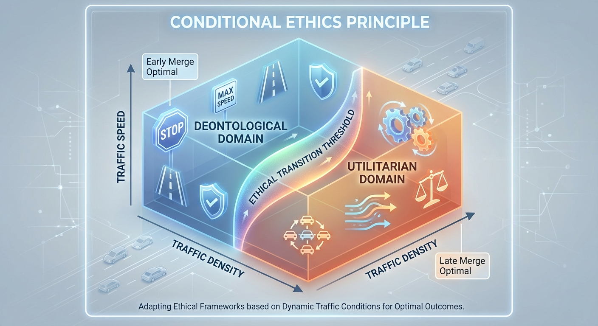
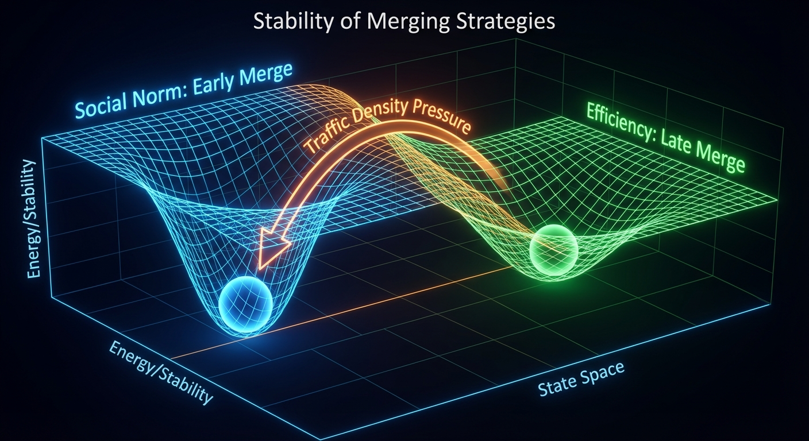

# The Late Merge Problem: A Game-Theoretic Analysis of Conditional Ethics in Traffic Flow

## Abstract

The late merge problem in traffic flow presents a unique case study where game theory intersects with moral philosophy
under dynamic conditions. This paper examines how traffic density and speed fundamentally alter both the strategic
equilibria and the ethical frameworks that govern driver behavior in merge scenarios. We demonstrate that the "correct"
merging strategy—from both efficiency and safety perspectives—depends critically on traffic conditions, creating a
dynamic ethical landscape where utilitarian and deontological principles alternately dominate. Through game-theoretic
modeling, we show how this conditional morality complicates coordination problems and propose adaptive traffic
management solutions that acknowledge these shifting ethical foundations.

**Keywords:** game theory, traffic flow, ethics, coordination games, dynamic systems

## 1. Introduction

The phenomenon of traffic merging at construction zones and lane closures represents more than a simple traffic
engineering problem. It embodies a fundamental tension between competing ethical frameworks that manifests differently
under varying traffic conditions. The "late merge" strategy—where drivers utilize the closing lane until the last
possible moment—has been studied extensively from engineering perspectives, but less attention has been paid to its
game-theoretic structure and the conditional nature of its ethical implications.

This paper argues that the late merge problem reveals a critical gap in how we understand the relationship between
individual rationality, collective efficiency, and moral behavior in dynamic systems. Unlike static ethical dilemmas,
the late merge problem demonstrates how the moral calculus itself shifts based on empirical conditions, specifically
traffic density and speed.

## 2. Literature Review

### 2.1 Traffic Flow Theory

Classical traffic flow theory treats merging as an optimization problem focused on maximizing throughput while
minimizing delays. Cassidy and Rudjanakanoknad (2005) demonstrated that late merging can increase capacity utilization
by up to 40% in heavy traffic conditions. However, these studies typically assume universal adoption of strategies
without considering the coordination challenges inherent in mixed-strategy scenarios.

### 2.2 Game Theory in Transportation

The application of game theory to transportation problems has grown significantly, with coordination games proving
particularly relevant to merging scenarios. Kita (1999) modeled merging as a game between individual drivers, while
Tampere et al. (2008) examined the role of social preferences in merge decisions. However, these analyses generally
treat ethical considerations as fixed preferences rather than condition-dependent variables.

### 2.3 Ethics in Traffic Behavior

Research on moral behavior in traffic contexts has primarily focused on rule-following versus outcome-based decision
making. Rothengatter (1988) identified the tension between formal rules and efficiency considerations, while more recent
work by Björklund and Åberg (2005) examined how social norms influence driver behavior in ambiguous situations.

## 3. The Game-Theoretic Framework


### 3.1 Basic Model Setup

We model the late merge scenario as an n-player coordination game where each driver i must choose between two
strategies:

- **E** (Early merge): Join the continuing lane well before the closure point
- **L** (Late merge): Utilize the closing lane until forced to merge

Let p represent the proportion of drivers choosing strategy L. Each driver's payoff depends on:

- Their own strategy choice
- The distribution of strategies in the population
- Traffic conditions (density ρ and speed v)

### 3.2 Payoff Functions

The payoff for strategy s ∈ {E, L} under traffic conditions (ρ, v) and population strategy distribution p is:

**U_E(p, ρ, v) = α(ρ, v) - β(ρ, v) · p - γ(v) · SAFETY_RISK_E**

**U_L(p, ρ, v) = α(ρ, v) + δ(ρ, v) · (1-p) - γ(v) · SAFETY_RISK_L - η · SOCIAL_COST**

Where:

- α(ρ, v) represents base utility from reaching destination
- β(ρ, v) captures congestion costs when others late merge
- δ(ρ, v) represents efficiency gains from late merging
- γ(v) weights safety considerations (increasing with speed)
- η represents social disapproval costs

### 3.3 Condition-Dependent Parameters

The critical insight is that the relative magnitudes of these parameters shift dramatically with traffic conditions:

**Low Density, High Speed (ρ < ρ*, v > v*):**

- Safety risks dominate: γ(v) · |SAFETY_RISK_L - SAFETY_RISK_E| is large
- Efficiency gains minimal: δ(ρ, v) ≈ 0
- Early merge equilibrium is stable and efficient

**High Density, Low Speed (ρ > ρ*, v < v*):**

- Safety risks minimal: γ(v) ≈ 0
- Efficiency gains substantial: δ(ρ, v) is large
- Late merge equilibrium is stable and efficient

## 4. Ethical Analysis

### 4.1 The Utilitarian Perspective

From a utilitarian standpoint, the morally correct action is that which maximizes aggregate welfare across all drivers.
This framework suggests:

**Proposition 1:** Under high-density, low-speed conditions, late merging is ethically superior as it maximizes total
utility through efficient infrastructure utilization.

**Proposition 2:** Under low-density, high-speed conditions, early merging is ethically superior as it minimizes safety
risks without significant efficiency costs.

### 4.2 The Deontological Perspective

Deontological ethics focuses on the inherent rightness or wrongness of actions based on rules and duties. In traffic
contexts, this typically manifests as:

- Respect for established queues and social ordering
- Adherence to implicit social contracts
- Consideration for others who have "followed the rules"

**Proposition 3:** The deontological framework generally favors early merging regardless of traffic conditions, as it
respects established social norms and queue discipline.

### 4.3 Conditional Ethics

The key insight is that these ethical frameworks need not be permanently in conflict. Instead, we propose a conditional
ethical framework:

**Conditional Ethics Principle:** The morally appropriate action depends on empirical conditions that affect both safety
and efficiency outcomes.

This suggests that ethical behavior requires situational awareness and adaptation, rather than rigid adherence to
universal principles.


## 5. Dynamic Equilibrium Analysis

### 5.1 Multiple Equilibria

The game admits multiple Nash equilibria depending on traffic conditions:

**Low-density equilibrium:** (E, E, ..., E) - Universal early merging
**High-density equilibrium:** (L, L, ..., L) - Universal late merging  
**Mixed equilibrium:** p* drivers choose L, (1-p*) choose E

### 5.2 Stability and Efficiency

The stability of these equilibria depends critically on:

- Traffic condition persistence
- Information availability about current conditions
- Social norm enforcement mechanisms

**Theorem 1:** Under stable traffic conditions, the efficient equilibrium is also stable if information about conditions
is common knowledge.

**Theorem 2:** Under dynamic traffic conditions, mixed equilibria become more likely as drivers face uncertainty about
which strategy is appropriate.

### 5.3 Coordination Failures

The most problematic scenarios occur during transitions between traffic states:

- When conditions change but social norms lag
- When drivers have different information about current conditions
- When the speed of traffic state changes exceeds adaptation rates

## 6. Empirical Considerations

### 6.1 Critical Thresholds

Identifying the critical values (ρ*, v*) where the optimal strategy switches requires empirical investigation.
Preliminary analysis suggests:

- **Speed threshold:** v* ≈ 40-50 km/h (below which safety concerns become negligible)
- **Density threshold:** ρ* ≈ 25-30 vehicles/km (above which efficiency gains become substantial)

These thresholds likely vary by:

- Road geometry and merge length
- Driver experience and familiarity with the route
- Vehicle mix and capabilities
- Weather and visibility conditions

### 6.2 Measurement Challenges

Real-world implementation faces several measurement challenges:

- Real-time density and speed estimation
- Predicting short-term condition changes
- Accounting for driver heterogeneity
- Measuring safety versus efficiency tradeoffs



## 7. The Unified Decision Tree Protocol

### 7.1 Protocol Overview

To resolve the coordination problem definitively, we propose a unified decision tree protocol that all drivers can apply
consistently. This protocol transforms the complex game-theoretic analysis into a simple, real-time decision framework
that optimizes both safety and efficiency while maintaining ethical consistency.

### 7.2 The SMART Protocol

**S**peed assessment → **M**erge distance → **A**djacent lane density → **R**isk evaluation → **T**iming decision

```
STEP 1: SPEED ASSESSMENT
├── Current speed > 50 km/h (30 mph)?
│   ├── YES → Proceed to STEP 2A (High Speed Branch)
│   └── NO → Proceed to STEP 2B (Low Speed Branch)

STEP 2A: HIGH SPEED BRANCH
├── Merge point distance > 800m (0.5 mi)?
│   ├── YES → MERGE EARLY (Safety Priority)
│   └── NO → Continue to STEP 3A

STEP 3A: HIGH SPEED CLOSE PROXIMITY
├── Adjacent lane has gaps > 3 car lengths?
│   ├── YES → MERGE EARLY (Last safe opportunity)
│   └── NO → CONTROLLED LATE MERGE (Reduce speed, signal early)

STEP 2B: LOW SPEED BRANCH  
├── Adjacent lane stopped or < 20 km/h (12 mph)?
│   ├── YES → Continue to STEP 3B
│   └── NO → MERGE EARLY (Efficiency neutral, courtesy positive)

STEP 3B: DENSE TRAFFIC EVALUATION
├── Closing lane moving faster than adjacent lane?
│   ├── YES → Continue to STEP 4B
│   └── NO → MERGE EARLY (No efficiency gain)

STEP 4B: LATE MERGE OPTIMIZATION
├── Distance to merge point < 200m (650 ft)?
│   ├── YES → EXECUTE ZIPPER MERGE (Signal, match speed, merge)
│   └── NO → CONTINUE IN CLOSING LANE (Maintain awareness)
```

### 7.3 Protocol Implementation Guidelines

**Visual Cues for Speed Assessment:**

- **High Speed Indicators:** Traffic flowing smoothly, large following distances, no brake lights visible ahead
- **Low Speed Indicators:** Stop-and-go traffic, brake lights frequent, following distances < 2 car lengths

**Distance Estimation Methods:**

- **Highway signs:** Use posted distance markers
- **Lane markers:** Count dashed lines (approximately 12m/40ft spacing)
- **Time-based:** At current speed, how many seconds to merge point?

**Density Assessment Criteria:**

- **High Density:** Vehicles spaced < 2 car lengths apart
- **Medium Density:** Vehicles spaced 2-4 car lengths apart
- **Low Density:** Vehicles spaced > 4 car lengths apart

### 7.4 Decision Tree Rationale

The protocol prioritizes decisions based on the following hierarchy:

1. **Safety First:** High-speed conditions always favor early merging due to exponentially increasing accident risk
2. **Efficiency Second:** In low-speed, high-density conditions, late merging maximizes throughput
3. **Courtesy Third:** When efficiency is neutral, early merging maintains social harmony
4. **Zipper Merge:** When late merging is optimal, execute it properly to minimize disruption

### 7.5 Protocol Benefits

**Eliminates Ethical Ambiguity:** Every driver following the protocol makes the same decision under identical
conditions, removing the coordination problem.

**Optimizes Dual Objectives:** Systematically balances safety and efficiency based on empirical conditions rather than
subjective preferences.

**Reduces Road Rage:** Clear, consistent decision-making reduces the perception of "cheating" or "cutting in line."

**Scalable Implementation:** Can be taught through driver education, integrated into navigation systems, or displayed on
dynamic road signs.

### 7.6 Technology Integration

**GPS Navigation Integration:**

```
IF (approaching_merge_zone AND current_speed > 50) 
    THEN display "MERGE EARLY - HIGH SPEED CONDITIONS"
ELSE IF (traffic_density > threshold AND current_speed < 20)
    THEN display "USE BOTH LANES - ZIPPER MERGE AHEAD"
```

**Connected Vehicle Systems:**

- Real-time speed and density data sharing
- Coordinated merge timing signals
- Predictive merge recommendations based on downstream conditions

**Infrastructure Support:**

- Dynamic message signs implementing the protocol
- Speed-sensitive merge zone length adjustments
- Automated merge assistance for autonomous vehicles

### 7.8 Game-Theoretic Stability Analysis

The effectiveness of the SMART protocol depends critically on its stability properties when only a subset of drivers
adopt it. We analyze three adoption scenarios: universal adoption, partial adoption, and strategic non-adoption.

#### 7.8.1 Universal Adoption Equilibrium

**Theorem 3:** Under universal adoption of the SMART protocol, the resulting strategy profile constitutes a Nash
equilibrium.

*Proof sketch:* When all drivers follow the protocol, each driver's decision depends only on observable traffic
conditions, not on predicting others' strategies. Since the protocol optimizes individual payoffs given conditions, no
driver has incentive to deviate unilaterally.

**Stability Properties:**

- **Evolutionary Stable Strategy (ESS):** The protocol is evolutionarily stable because deviants perform worse than
  conformists
- **Collective Rationality:** Group outcomes are Pareto optimal under the protocol
- **Incentive Compatibility:** Individual optimization aligns with collective optimization

#### 7.8.2 Partial Adoption Analysis

The more realistic scenario involves partial adoption, where fraction α of drivers follow the protocol and fraction (
1-α) use arbitrary strategies.

**Mixed Population Dynamics:**

Let:

- **P** = Protocol followers (proportion α)
- **N** = Non-protocol followers (proportion 1-α)
- **Conditions** = (speed, density, distance) state space

**Payoff Analysis:**

```
U_P(conditions, α) = Optimal payoff from protocol given conditions
U_N(conditions, α) = Expected payoff from non-protocol behavior
```

**Critical Threshold Analysis:**

**Theorem 4:** There exists a critical adoption threshold α* such that:

- If α > α*, protocol adoption is evolutionarily stable
- If α < α*, the protocol is vulnerable to invasion by non-adopters

**Estimating α*:**

For high-speed conditions (safety-critical):

- Protocol followers always merge early
- Non-adopters may late merge, creating safety risks
- **α* ≈ 0.6-0.7** (high threshold due to safety externalities)

For low-speed, high-density conditions:

- Protocol followers use late merge when optimal
- Non-adopters may merge early, reducing efficiency
- **α* ≈ 0.3-0.4** (lower threshold due to efficiency gains)

#### 7.8.3 Strategic Non-Adoption

Some drivers may deliberately avoid the protocol to exploit predictable behavior of protocol followers.

**Exploitation Strategies:**

1. **Speed Exploiters:** Non-adopters who late merge in high-speed conditions, knowing protocol followers will
   accommodate them
2. **Density Exploiters:** Non-adopters who early merge in dense traffic, avoiding late merge queues

**Counter-Exploitation Mechanisms:**

**Bounded Accommodation:** Protocol followers should accommodate non-adopters only within safety limits:

```
IF (approaching_non_protocol_merger AND safety_margin < critical_threshold)
    THEN maintain_protocol_behavior
ELSE 
    THEN accommodate_with_caution
```

**Reciprocity Tracking:** Advanced implementations could track non-cooperative behavior and reduce accommodation over
time.

#### 7.8.4 Stability Under Partial Adoption

**Scenario 1: High-Speed Conditions, α = 0.5**

Protocol followers merge early, creating predictable gaps. Non-adopters exploit these gaps with late merges.

**Stability Analysis:**

- **Exploitation Payoff:** Non-adopters gain time but increase accident risk
- **Victim Payoff:** Protocol followers face increased risk from unpredictable late mergers
- **Equilibrium:** Unstable - protocol followers may abandon the protocol

**Scenario 2: Dense Traffic, α = 0.5**

Protocol followers use late merge when optimal. Non-adopters may merge early from social pressure.

**Stability Analysis:**

- **Protocol Payoff:** Higher due to efficient lane utilization
- **Non-adopter Payoff:** Lower due to longer delays in single lane
- **Equilibrium:** Stable - non-adopters have incentive to adopt protocol

**Scenario 3: Mixed Conditions, α = 0.3**

**Stability Analysis:**

- In safety-critical conditions: Protocol unstable due to exploitation
- In efficiency-critical conditions: Protocol stable due to clear advantages
- **Overall:** Conditionally stable depending on condition frequency

#### 7.8.5 Robustness Mechanisms

To ensure stability under partial adoption, the protocol requires robustness mechanisms:

**Adaptive Thresholds:**

```
safety_threshold = base_threshold × (1 + exploitation_factor)
efficiency_threshold = base_threshold × (1 - adoption_factor)
```

**Punishment Strategies:**

- **Mild Punishment:** Reduced accommodation of non-adopters
- **Coordinated Response:** Multiple protocol followers coordinate to discourage exploitation

**Information Transparency:**

- **Adoption Signaling:** Visual indicators (bumper stickers, light patterns) showing protocol adoption
- **Behavior Broadcasting:** Connected vehicle systems sharing intended strategies

#### 7.8.6 Evolutionary Dynamics

**Replicator Dynamics Model:**

The fraction of protocol adopters evolves according to:

```
dα/dt = α(1-α)[U_P(conditions, α) - U_N(conditions, α)]
```

**Stability Analysis:**

- **Fixed Points:** α = 0, α = 1, and potentially α = α*
- **Convergence:** Depends on initial conditions and payoff differentials
- **Bifurcation:** System may have multiple stable equilibria

**Simulation Results:**

- **High Safety Conditions:** Bistable system with α* ≈ 0.65
- **High Efficiency Conditions:** Single stable equilibrium at α = 1
- **Mixed Conditions:** Complex dynamics with path dependence

#### 7.8.7 Implementation Strategy for Stability

**Phase 1: Build Critical Mass (Target α > 0.4)**

- **Voluntary Adoption:** Education and incentives for early adopters
- **Infrastructure Support:** Signs and systems that support protocol followers
- **Technology Integration:** Navigation systems implementing protocol

**Phase 2: Address Exploitation (α = 0.4-0.7)**

- **Enforcement:** Penalties for clearly unsafe non-protocol behavior
- **Social Pressure:** Public awareness campaigns about protocol benefits
- **Technology Assistance:** Systems that help protocol followers handle non-adopters

**Phase 3: Achieve Stability (α > 0.7)**

- **Mandatory Adoption:** Regulatory requirements for protocol following
- **Autonomous Integration:** Self-driving vehicles programmed with protocol
- **Network Effects:** Benefits increase with adoption rate

#### 7.8.8 Failure Modes and Mitigation

**Failure Mode 1: Exploitation Cascade**

- **Mechanism:** Safety exploiters cause protocol followers to abandon system
- **Mitigation:** Strong enforcement of safety violations, robust protocol design

**Failure Mode 2: Coordination Breakdown**

- **Mechanism:** Multiple competing "protocols" emerge
- **Mitigation:** Standardization, clear official endorsement

**Failure Mode 3: Condition Misclassification**

- **Mechanism:** Drivers misread conditions, causing protocol conflicts
- **Mitigation:** Better training, technology assistance, clearer thresholds

**Theorem 5:** The SMART protocol is evolutionarily stable if and only if:

1. Adoption rate exceeds condition-dependent threshold α*
2. Exploitation is bounded by safety or efficiency constraints
3. Information about conditions is sufficiently accurate

This analysis shows that while the protocol provides an optimal solution in theory, its practical implementation
requires careful attention to adoption dynamics and robustness against strategic non-adoption.

## 8. Policy Implications

### 8.1 Adaptive Traffic Management

The conditional ethics framework, combined with the unified protocol, suggests that traffic management should be dynamic
rather than static:

**Dynamic Signaling:** Variable message signs that implement the SMART protocol:

- "SPEED >50 MPH - MERGE EARLY"
- "HEAVY TRAFFIC - USE BOTH LANES"
- "ZIPPER MERGE 500M AHEAD"

**Condition-Based Enforcement:** Traffic enforcement that recognizes the legitimacy of different strategies under
different conditions, with violations defined as deviation from the protocol rather than strategy choice.

### 8.2 Infrastructure Design

Physical infrastructure can be designed to support the protocol:

- Longer merge zones that accommodate both strategies
- Clear sight lines that allow drivers to assess conditions
- Distance markers every 200m approaching merge points
- Speed detection systems for dynamic protocol implementation

### 8.3 Driver Education

Public education should emphasize:

- The SMART protocol as the standard decision framework
- How to assess current traffic conditions quickly and accurately
- The legitimacy of different approaches under different circumstances
- The collective benefits of universal protocol adoption

## 8. Limitations and Future Research

### 8.1 Model Limitations

Our analysis makes several simplifying assumptions:

- Homogeneous driver preferences and capabilities
- Perfect information about payoff functions
- Binary strategy choices
- Static traffic conditions during individual decisions

### 8.2 Future Research Directions

Several avenues warrant further investigation:

**Behavioral Economics:** How do cognitive biases affect strategy choice under uncertainty?

**Network Effects:** How do merging decisions propagate through traffic networks?

**Technology Integration:** How might autonomous vehicles or connected car technologies change the game structure?

**Cultural Variations:** How do different cultural attitudes toward rules and efficiency affect equilibrium selection?

## 9. Broader Applications: A Framework for Social Coordination Problems

### 9.1 Generalizable Methodology

The analytical framework developed for the late merge problem—combining game theory, conditional ethics, and decision
tree protocols—has broad applicability to social coordination problems characterized by:

1. **Multiple legitimate ethical frameworks** in tension
2. **Condition-dependent optimal strategies** that shift based on empirical circumstances
3. **Coordination failures** arising from strategy uncertainty
4. **Mixed adoption dynamics** where partial participation affects stability
   *Note: This framework has been successfully applied to climate change coordination (
   see [Climate Action Decision Protocol](./2025-07-03-climate-protocol.md)) and public health measures (see [
   Mask-Wearing Decisi[Mask-Wearing Decision Protocol](../social/2025-07-07-public-health-protocol.md) broad utility
   across domains.*

### 9.2 Analogous Social Problems

**Climate Change Mitigation:**

- **Ethical Tension:** Individual cost versus collective benefit (utilitarian vs. fairness)
- **Conditional Strategies:** Optimal actions depend on others' participation levels and technological conditions
- **Coordination Problem:** Free-riding when others' efforts are uncertain
- **Decision Protocol:** Condition-based emission reduction strategies based on adoption rates and technological
  capacity

**Public Health Compliance (Vaccination, Mask-wearing):**

- **Ethical Tension:** Individual autonomy versus collective welfare
- **Conditional Strategies:** Optimal behavior depends on disease prevalence and community adoption
- **Coordination Problem:** Reduced compliance when others don't participate
- **Decision Protocol:** Risk-based guidelines that adjust to epidemiological conditions

**Resource Conservation (Water, Energy):**

- **Ethical Tension:** Individual convenience versus collective sustainability
- **Conditional Strategies:** Conservation intensity depends on scarcity levels and community participation
- **Coordination Problem:** Overconsumption when others' behavior is uncertain
- **Decision Protocol:** Tiered conservation measures based on resource availability and adoption rates

**Financial Market Regulation:**

- **Ethical Tension:** Market efficiency versus systemic stability
- **Conditional Strategies:** Optimal regulations depend on market conditions and global coordination
- **Coordination Problem:** Regulatory arbitrage when jurisdictions don't coordinate
- **Decision Protocol:** Condition-based regulatory frameworks that adapt to market volatility

### 9.3 Generic Framework Structure

**Step 1: Identify Ethical Tensions**

- Map competing moral frameworks (utilitarian, deontological, virtue ethics)
- Identify conditions where each framework provides superior guidance
- Analyze how these tensions create coordination failures

**Step 2: Develop Conditional Ethics Framework**

- Define empirical conditions that shift optimal strategies
- Establish threshold values for strategy transitions
- Create decision trees that resolve ethical ambiguity

**Step 3: Game-Theoretic Stability Analysis**

- Model adoption dynamics under partial participation
- Identify critical adoption thresholds for stability
- Design robustness mechanisms against exploitation

**Step 4: Implementation Protocol**

- Create simple, actionable decision frameworks
- Develop technology integration strategies
- Design phase-based adoption approaches

### 9.4 Methodological Contributions

**Conditional Ethics Theory:**
This work contributes to moral philosophy by demonstrating that apparent ethical conflicts can be resolved through
condition-dependent frameworks rather than philosophical hierarchy disputes.

**Dynamic Coordination Games:**
The analysis extends game theory by incorporating empirical conditions as strategy determinants, creating more realistic
models of social coordination.

**Protocol Design for Social Problems:**
The SMART protocol demonstrates how complex social coordination can be simplified through well-designed decision
frameworks that account for adoption dynamics.

**Stability Analysis for Partial Adoption:**
The critical threshold analysis provides tools for understanding when social interventions will succeed or fail based on
participation rates.

### 9.5 Policy Design Implications

**Condition-Responsive Governance:**
Rather than static regulations, policies should adapt to empirical conditions and adoption rates, similar to the dynamic
traffic management approach.

**Adoption-Aware Implementation:**
Policy rollouts should account for critical adoption thresholds and design mechanisms to achieve them before full
implementation.

**Ethical Pluralism in Policy:**
Rather than imposing single ethical frameworks, policies can acknowledge multiple legitimate perspectives and create
conditional approaches that satisfy different moral intuitions under different circumstances.

**Technology-Mediated Coordination:**
Digital systems can facilitate the information sharing and decision support necessary for complex conditional protocols
to function effectively.

### 9.6 Limitations and Future Research

**Scalability Questions:**

- How does the framework scale to problems with more actors and longer time horizons?
- What happens when conditions change rapidly relative to adaptation speeds?
- How do we handle problems where condition assessment is subjective or contested?

**Cultural and Institutional Variations:**

- How do different cultural values affect threshold parameters?
- What institutional structures best support conditional protocols?
- How do power dynamics affect adoption and stability?

**Empirical Validation:**

- Testing the framework on other social problems
- Measuring adoption thresholds in real-world contexts
- Evaluating the effectiveness of conditional versus static approaches

## 10. Conclusion

The late merge problem demonstrates that game theory and ethics need not be viewed as separate domains. Instead, the
strategic structure of coordination problems can illuminate the conditions under which different ethical frameworks
provide superior guidance.

Our analysis reveals that the "correct" merging strategy depends fundamentally on traffic conditions, suggesting that
moral behavior in complex systems requires situational awareness and adaptive thinking rather than rigid rule-following.
This has profound implications for how we design traffic systems, educate drivers, and think about coordination problems
more generally.

The conditional ethics framework developed here may have applications beyond traffic flow to other domains where
individual behavior, collective outcomes, and moral considerations intersect under dynamic conditions. As our
transportation systems become increasingly complex and technology-mediated, understanding these interactions becomes
ever more critical.

Future transportation policy should acknowledge that driver behavior reflects not just individual preferences, but
complex interactions between strategic considerations, moral frameworks, and empirical conditions. Optimal outcomes
require systems that can adapt to these multiple dimensions rather than assuming universal strategies or fixed moral
principles.

The late merge problem ultimately teaches us that in complex sociotechnical systems, the most ethical behavior may be
the most contextually aware behavior—responsive to both the strategic environment and the moral implications of our
choices under varying conditions.

## References

Björklund, G. M., & Åberg, L. (2005). Driver behaviour in intersections: Formal and informal traffic rules.
*Transportation Research Part F: Traffic Psychology and Behaviour*, 8(3), 239-253.

Cassidy, M. J., & Rudjanakanoknad, J. (2005). Increasing the capacity of an on-ramp with control on the approach.
*Transportation Research Part A: Policy and Practice*, 39(6), 457-475.

Kita, H. (1999). A merging–giveway interaction model of cars in a merging section: A game theoretic analysis.
*Transportation Research Part A: Policy and Practice*, 33(3-4), 305-312.

Rothengatter, T. (1988). Risk and the absence of pleasure: A motivational approach to modelling road user behaviour.
*Ergonomics*, 31(4), 599-607.

Tampere, C. M., Corthout, R., Cattrysse, D., & Immers, L. H. (2008). A generic class of first order node models for
dynamic macroscopic simulation of traffic flows. *Transportation Research Part B: Methodological*, 42(6), 554-570.
