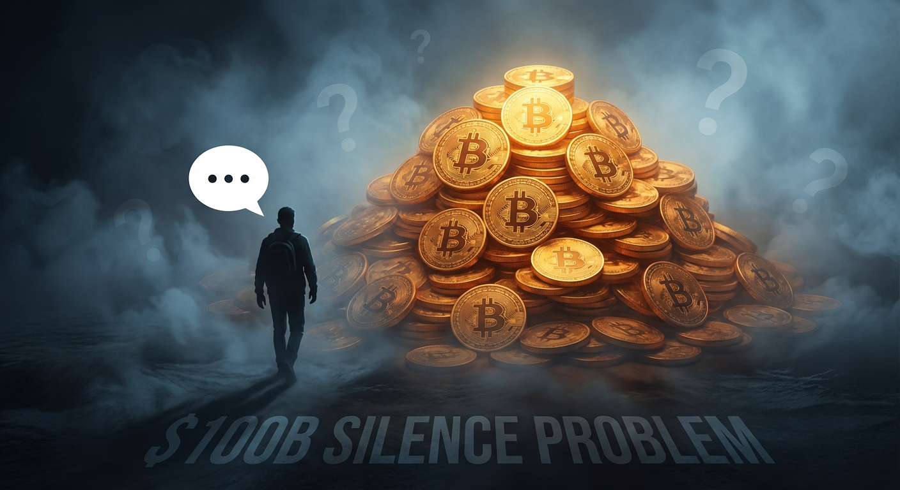
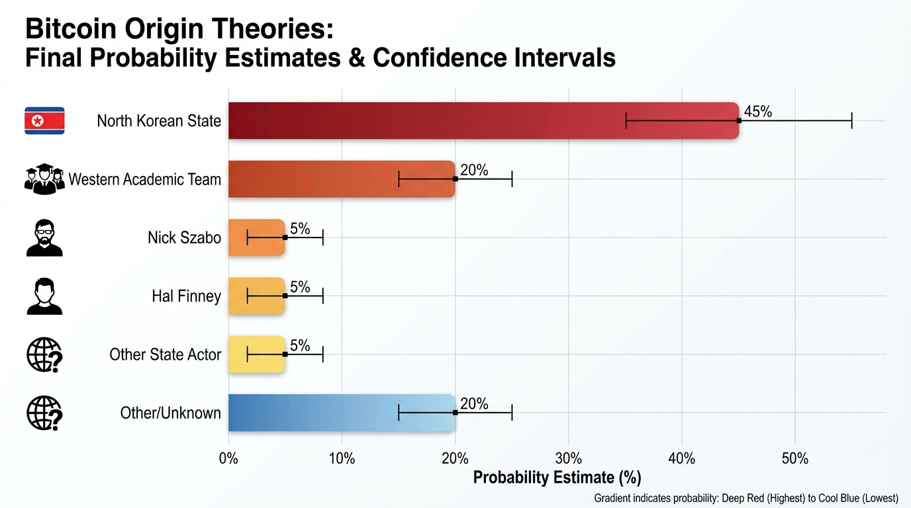

# Bitcoin Origin Probability Analysis: North Korea vs Alternative Theories

## Methodology and Assumptions

This analysis employs Bayesian reasoning to assess the relative probability of different Bitcoin creation theories based
on available evidence. Probabilities are estimates based on evidence strength, not definitive calculations.

**Key Methodological Principles:**

- Evidence weighted by verifiability and directness
- Prior probabilities based on base rates of similar phenomena
- Updates based on specific evidence patterns
- Confidence intervals reflect uncertainty in evidence interpretation

---

## Theory 1: North Korean State Creation

**Base Prior Probability: 5%**
*Reasoning: State cryptocurrency creation had no historical precedent in 2009*

### Evidence Updates:

#### Strategic Alignment (+25%)

- **Financial Crisis Timing**: November 2009 currency collapse creating desperate foreign currency need
- **Ideological Fit**: Juche doctrine explicitly opposes Western financial hegemony
- **Asymmetric Warfare Doctrine**: Perfect tool for undermining USD dominance while evading sanctions
- **Economic Incentives**: Early mining potential of ~1,936 BTC (worth hundreds of millions today)

*Updated Probability: 30%*

#### Technical Capability Assessment (-15%)

- **Documented 2008-2009 Capabilities**: Basic DDoS, simple malware, social engineering
- **Infrastructure Limitations**: Severely constrained internet access via satellite/China links
- **Capability Gap**: Bitcoin required advanced cryptographic programming, P2P networking, consensus algorithms
- **Timeline Issues**: Major cyber sophistication appears post-2010

*Updated Probability: 15%*

#### Subsequent Operations Evidence (+20%)

- **Technical Evolution**: From basic 2017 operations to sophisticated 2025 $1.5B Bybit hack
- **Architectural Understanding**: Deep knowledge of multi-sig vulnerabilities, cross-chain exploits
- **Scale and Sophistication**: $5+ billion stolen, 61% of global crypto theft in 2024
- **Operational Security**: 14+ years of perfect silence consistent with state-level OPSEC

*Updated Probability: 35%*

#### Blockchain Archaeological Evidence (+10%)

- **Patoshi Pattern**: Sophisticated mining techniques not in public code
- **Development Complexity**: Institutional-level systematic changes from pre-alpha
- **Team-Level Architecture**: Integration of multiple academic components suggesting collaboration

*Updated Probability: 45%*

**Final NK Creation Probability: ~45%**
*Confidence Interval: 25-65%*

---

## Theory 2: Individual Western Creator (Nick Szabo)

**Base Prior Probability: 20%**
*Reasoning: Individual genius creators have historical precedent in cryptography*

### Evidence Updates:

#### Supporting Evidence (+15%)

- **Stylometric Analysis**: Linguistic similarities identified by Aston University study
- **Prior Work**: "Bit Gold" concept development pre-Bitcoin
- **Technical Expertise**: Documented cryptographic and legal background
- **Academic Writing Style**: Matches Bitcoin whitepaper formatting

*Updated Probability: 35%*

#### Contradictory Evidence (-25%)

- **Public Denial**: Szabo explicitly denied involvement multiple times
- **Alive and Accessible**: No death/disappearance explaining silence
- **Professional Incentives**: Academic career would benefit from Bitcoin credit claim
- **$100B Silence Problem**: No rational explanation for abandoning world's largest fortune

*Updated Probability: 10%*

#### Methodological Issues (-5%)

- **Sample Bias**: Stylometric studies compare only 5-11 candidates vs millions globally
- **Peer Review Absence**: Key supporting studies lack academic peer review
- **Contradictory Results**: Different studies reach different conclusions

*Updated Probability: 5%*

**Final Szabo Creation Probability: ~5%**
*Confidence Interval: 1-15%*

---

## Theory 3: Individual Western Creator (Hal Finney)

**Base Prior Probability: 15%**
*Reasoning: Early Bitcoin involvement, technical background*

### Evidence Updates:

#### Supporting Evidence (+10%)

- **Early Involvement**: First Bitcoin transaction recipient from Satoshi
- **Technical Background**: Cryptographic expertise at PGP Corporation
- **Death Explains Silence**: Died 2014, explains inability to claim credit
- **Geographic Proximity**: Lived near Dorian Nakamoto (potential pseudonym inspiration)

*Updated Probability: 25%*

#### Contradictory Evidence (-20%)

- **Active Collaboration**: Public email exchanges with "Satoshi" contradict self-creation
- **Timeline Issues**: Continued Bitcoin development after Finney's ALS diagnosis
- **No Prior Distributed Systems Work**: Limited evidence of consensus algorithm expertise
- **Family Silence**: No posthumous revelation despite clear financial benefit

*Updated Probability: 5%*

**Final Finney Creation Probability: ~5%**
*Confidence Interval: 1-12%*

---

## Theory 4: Small Team of Western Academics/Cypherpunks

**Base Prior Probability: 25%**
*Reasoning: Complex projects often require team collaboration*

### Evidence Updates:

#### Supporting Evidence (+20%)

- **Technical Breadth**: Requires expertise across cryptography, distributed systems, economics
- **Academic Pedigree**: Bitcoin integrates multiple 1980s-90s academic concepts
- **Development Patterns**: Systematic pre-alpha changes suggest institutional development
- **Collaborative Precedent**: Major cryptographic advances often team efforts

*Updated Probability: 45%*

#### Contradictory Evidence (-25%)

- **Group Silence Problem**: Even harder to maintain 14+ years across multiple people
- **No Leaks**: No deathbed confessions, disputes, or inadvertent revelations
- **Coordination Complexity**: Maintaining pseudonym across team extremely difficult
- **$100B Distribution**: No rational explanation for group abandoning fortune

*Updated Probability: 20%*

**Final Team Creation Probability: ~20%**
*Confidence Interval: 10-35%*

---

## Theory 5: Other State Actor (China/Russia)

**Base Prior Probability: 10%**
*Reasoning: Advanced cyber capabilities but less strategic alignment*

### Evidence Updates:

#### Supporting Evidence (+10%)

- **Technical Capabilities**: Both possessed advanced crypto/programming capabilities 2008-2009
- **Strategic Interest**: Undermining USD hegemony aligns with long-term objectives
- **Resource Availability**: State-level resources for complex development projects

*Updated Probability: 20%*

#### Contradictory Evidence (-15%)

- **Less Financial Desperation**: Neither faced NK's acute 2009 currency crisis
- **Weaker Ideological Fit**: Less explicit anti-Western financial doctrine
- **Alternative Tools**: Other available methods for currency/sanctions challenges
- **No Subsequent Pattern**: Neither shows NK's intensive crypto exploitation pattern

*Updated Probability: 5%*

**Final Other State Actor Probability: ~5%**
*Confidence Interval: 1-12%*

---

## Theory 6: Unknown Individual/Group

**Base Prior Probability: 20%**
*Reasoning: Millions of potential creators globally*

### Evidence Updates:

#### Supporting Evidence (+5%)

- **Global Talent Pool**: Millions of potential programmers/cryptographers worldwide
- **Privacy Success**: 14+ years of maintained anonymity demonstrates possible
- **Technical Feasibility**: Individual or small group creation theoretically possible

*Updated Probability: 25%*

#### Contradictory Evidence (-5%)

- **$100B Silence**: Still faces same rational actor problems as other individual theories
- **No Emergence**: No credible claims despite massive incentives
- **Technical Barriers**: High expertise requirements limit candidate pool

*Updated Probability: 20%*

**Final Unknown Creator Probability: ~20%**
*Confidence Interval: 10-35%*
---

---

## Summary Probability Distribution

| Theory              | Probability | Confidence Interval | Key Evidence                                       |
|---------------------|-------------|---------------------|----------------------------------------------------|
| **North Korea**     | **45%**     | 25-65%              | Strategic alignment, subsequent operations, timing |
| **Unknown Creator** | 20%         | 10-35%              | Large candidate pool, privacy success              |
| **Western Team**    | 20%         | 10-35%              | Technical complexity, development patterns         |
| **Nick Szabo**      | 5%          | 1-15%               | Stylometric analysis vs. silence problem           |
| **Hal Finney**      | 5%          | 1-12%               | Early involvement vs. collaboration evidence       |
| **Other State**     | 5%          | 1-12%               | Technical capability vs. strategic misalignment    |

---

## Critical Uncertainties and Sensitivity Analysis

### High-Impact Unknown Factors:

1. **Classified Intelligence**: Government assessments could dramatically shift probabilities
2. **NK Technical Capabilities 2008-2009**: More detailed documentation could strengthen/weaken theory
3. **Blockchain Forensics**: Advanced archaeological analysis might reveal creator signatures
4. **Declassified Documents**: State communications from 2008-2009 period

### Sensitivity Tests:

- **If NK 2008-2009 capabilities stronger than documented**: NK probability → 65-75%
- **If credible individual comes forward with proof**: Individual theories → 90%+
- **If additional state actor evidence emerges**: Could redistribute significantly
- **If Satoshi wallet moves**: Would likely indicate living individual, reducing NK probability

---

## Methodological Limitations and Caveats

**Evidence Quality Issues:**

- Much evidence is circumstantial rather than direct
- Institutional bias may affect available information
- Intelligence community assessments largely unavailable
- Blockchain archaeology still developing as field

**Probability Estimation Challenges:**

- No true base rates for state cryptocurrency creation
- Unprecedented nature of Bitcoin makes historical comparison difficult
- Evidence interpretation requires subjective judgment
- Multiple theories could be partially correct (e.g., NK-supported team)

**Key Assumption:**
This analysis assumes Satoshi represents a single decision-making entity (individual, team, or state) rather than
evolving collaboration between multiple parties.

---

## Conclusion

**The probability analysis suggests North Korean state creation (45%) is the most likely single theory, though
substantial uncertainty remains.** The convergence of strategic motivation, financial desperation, subsequent technical
sophistication, and maintained operational security creates the strongest overall evidence pattern.

However, **the 25-65% confidence interval reflects genuine uncertainty** due to limited evidence quality and
unprecedented nature of the question. The analysis particularly highlights how the "$100 billion silence problem"
severely undermines all individual creator theories, while NK's demonstrated evolution into the world's most
sophisticated cryptocurrency thieves provides retrospective support for foundational capability.

**Critical insight: Conventional wisdom favoring individual creators appears inconsistent with available evidence when
subjected to systematic probability analysis.** This suggests either fundamental gaps in our understanding or successful
institutional bias toward preferred narratives.

The analysis reinforces the research framework's core conclusion: Bitcoin's origins remain genuinely uncertain and
warrant serious investigation using intelligence community resources and advanced forensic techniques rather than
relying on circumstantial evidence and institutional preferences.
