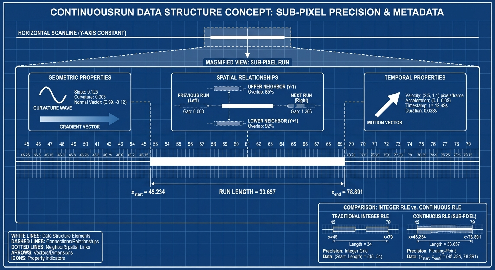

# CEP-RLE Rust Implementation Specification

## Project Structure


```
cep-rle/
├── Cargo.toml
├── src/
│   ├── lib.rs                    # Main library interface
│   ├── continuous_run.rs         # Core continuous run data structures
│   ├── expectation_prior.rs      # Expectation-prior mechanism
│   ├── encoder.rs                # CEP-RLE encoder implementation
│   ├── decoder.rs                # CEP-RLE decoder implementation
│   ├── analysis/
│   │   ├── mod.rs                # Analysis module interface
│   │   ├── geometric.rs          # Geometric feature extraction
│   │   ├── spatial_index.rs      # Spatial indexing and queries
│   │   └── quality.rs            # Quality assessment metrics
│   ├── utils/
│   │   ├── mod.rs                # Utility functions
│   │   ├── precision.rs          # Sub-pixel precision handling
│   │   └── statistics.rs         # Statistical computation utilities
│   └── test_data/
│       ├── mod.rs                # Test data generation
│       └── synthetic.rs          # Synthetic test pattern generation
├── benches/
│   ├── compression_bench.rs      # Compression performance benchmarks
│   ├── analysis_bench.rs         # Analysis performance benchmarks
│   └── comparison_bench.rs       # Comparison with baseline methods
├── tests/
│   ├── integration_tests.rs      # Integration test suite
│   ├── accuracy_tests.rs         # Precision and accuracy validation
│   └── compatibility_tests.rs    # Format compatibility tests
└── examples/
    ├── basic_usage.rs            # Basic CEP-RLE usage example
    ├── computer_vision.rs        # Computer vision pipeline example
    ├── cad_processing.rs         # CAD/graphics processing example
    └── video_analysis.rs         # Video processing example
```


## Core Dependencies (Cargo.toml)

```toml
[package]
name = "cep-rle"
version = "0.1.0"
edition = "2021"
authors = ["Your Name <your.email@example.com>"]
description = "Continuous Expectation-Prior Run-Length Encoding with Analysis-Ready Representations"
license = "MIT OR Apache-2.0"
repository = "https://github.com/yourusername/cep-rle"

[dependencies]
# Core numerical computing
nalgebra = "0.33"              # Linear algebra for geometric computations
ndarray = "0.15"               # N-dimensional arrays for image data
num-traits = "0.2"             # Numeric trait abstractions
ordered-float = "4.2"          # Deterministic floating-point ordering

# Spatial data structures and indexing
kiddo = "4.2"                  # k-d tree for spatial indexing
geo = "0.28"                   # Geometric primitives and operations
rstar = "0.12"                 # R*-tree spatial index

# Serialization and I/O
serde = { version = "1.0", features = ["derive"] }
bincode = "1.3"                # Binary serialization
bytemuck = "1.14"              # Safe transmutation between types

# Image processing (for testing and comparison)
image = "0.24"                 # Image I/O and basic processing
imageproc = "0.23"             # Image processing algorithms

# Performance and profiling
criterion = { version = "0.5", features = ["html_reports"] }
rayon = "1.8"                  # Data parallelism
dashmap = "5.5"                # Concurrent hashmap

# Utilities
thiserror = "1.0"              # Error handling
log = "0.4"                    # Logging
env_logger = "0.10"            # Environment-based logger
rand = "0.8"                   # Random number generation
rand_distr = "0.4"             # Probability distributions

[dev-dependencies]
criterion = { version = "0.5", features = ["html_reports"] }
proptest = "1.4"               # Property-based testing
approx = "0.5"                 # Floating-point comparisons
tempfile = "3.8"               # Temporary file creation

[features]
default = ["std", "rayon"]
std = []
simd = ["nalgebra/simd"]       # SIMD optimizations
gpu = []                       # Future GPU acceleration support
```

## Core Data Structures

### 1. Continuous Run Representation



 ```rust
 // src/continuous_run.rs
use nalgebra::{Vector2, Point2};
use serde::{Deserialize, Serialize};
use std::collections::HashMap;

/// Continuous run with sub-pixel precision and analysis metadata
#[derive(Debug, Clone, Serialize, Deserialize)]
pub struct ContinuousRun {
    /// Sub-pixel start position (real-valued)
    pub x_start: f64,
    /// Sub-pixel end position (real-valued)
    pub x_end: f64,
    /// Semantic content/color value
    pub value: u32,
    /// Prediction confidence [0.0, 1.0]
    pub confidence: f64,
    /// Scanline row index
    pub row: u32,
    
    // Geometric analysis properties
    pub geometric_props: GeometricProperties,
    
    // Spatial relationships
    pub spatial_rels: SpatialRelationships,
    
    // Temporal properties (for video)
    pub temporal_props: Option<TemporalProperties>,
}

/// Geometric properties for analysis
#[derive(Debug, Clone, Serialize, Deserialize)]
pub struct GeometricProperties {
    /// Local boundary curvature
    pub curvature: f64,
    /// C¹ continuity measure
    pub smoothness: f64,
    /// Boundary orientation vector
    pub gradient: Vector2<f64>,
    /// Arc length for curved boundaries
    pub arc_length: f64,
    /// Detected primitive type
    pub primitive_type: PrimitiveType,
}

/// Spatial relationship metadata
 #[derive(Debug, Clone, Serialize, Deserialize)]
 pub struct SpatialRelationships {

    /// Cross-scanline correlation [0.0, 1.0]
    pub vertical_coherence: f64,
    /// Adjacent run indices in same scanline
    pub horizontal_neighbors: Vec<RunId>,
    /// Cross-scanline neighbor indices
    pub vertical_neighbors: Vec<RunId>,
}

/// Temporal properties for video sequences
#[derive(Debug, Clone, Serialize, Deserialize)]
pub struct TemporalProperties {
    /// Cross-frame correlation [0.0, 1.0]
    pub temporal_consistency: f64,
    /// Predicted motion vector
    pub motion_vector: Vector2<f64>,
    /// Source frame for prediction
    pub prediction_source: u32,
}

/// Unique run identifier
#[derive(Debug, Clone, Copy, PartialEq, Eq, Hash, Serialize, Deserialize)]
pub struct RunId {
    pub scanline: u32,
    pub index: u32,
}

/// Geometric primitive classification
#[derive(Debug, Clone, Copy, PartialEq, Eq, Serialize, Deserialize)]
pub enum PrimitiveType {
    Line,
    Curve,
    Corner,
    Edge,
    Smooth,
    Noise,
}

impl ContinuousRun {
    /// Create a new continuous run with basic properties
    pub fn new(x_start: f64, x_end: f64, value: u32, row: u32) -> Self {
        Self {
            x_start,
            x_end,
            value,
            confidence: 1.0,
            row,
            geometric_props: GeometricProperties::default(),
            spatial_rels: SpatialRelationships::default(),
            temporal_props: None,
        }
    }
    
    /// Get run length in continuous domain
    pub fn length(&self) -> f64 {
        self.x_end - self.x_start
    }
    
    /// Get run center position
    pub fn center(&self) -> f64 {
        (self.x_start + self.x_end) / 2.0
    }
    
    /// Check if run contains a given x position
    pub fn contains(&self, x: f64) -> bool {
        x >= self.x_start && x <= self.x_end
    }
    
    /// Calculate overlap with another run
    pub fn overlap(&self, other: &ContinuousRun) -> f64 {
        let start = self.x_start.max(other.x_start);
        let end = self.x_end.min(other.x_end);
        (end - start).max(0.0)
    }
}

impl Default for GeometricProperties {
    fn default() -> Self {
        Self {
            curvature: 0.0,
            smoothness: 0.0,
            gradient: Vector2::zeros(),
            arc_length: 0.0,
            primitive_type: PrimitiveType::Smooth,
        }
    }
}

impl Default for SpatialRelationships {
    fn default() -> Self {
        Self {
            vertical_coherence: 0.0,
            horizontal_neighbors: Vec::new(),
            vertical_neighbors: Vec::new(),
        }
    }
}
```


### 2. Expectation-Prior Mechanism

```rust
// src/expectation_prior.rs
use crate::continuous_run::{ContinuousRun, RunId};
use nalgebra::DVector;
use std::collections::{HashMap, VecDeque};

/// Expectation-prior mechanism for predictive encoding
#[derive(Debug, Clone)]
pub struct ExpectationPrior {
    /// Sliding window of recent scanlines
    window_size: usize,
    /// Recent scanline data
    scanline_history: VecDeque<Vec<ContinuousRun>>,
    /// Spatial bins for position-specific statistics
    spatial_bins: SpatialBinManager,
    /// Statistical models for different regions
    models: HashMap<BinId, StatisticalModel>,
}

/// Spatial bin manager for position-specific statistics
#[derive(Debug, Clone)]
pub struct SpatialBinManager {
    /// Number of spatial bins
    num_bins: usize,
    /// Bin width in continuous domain
    bin_width: f64,
    /// Image width for normalization
    image_width: f64,
}

/// Statistical model for a spatial bin
#[derive(Debug, Clone)]
pub struct StatisticalModel {
    /// Mean run length in this bin
    pub mean_length: f64,
    /// Length variance
    pub length_variance: f64,
    /// Mean run value
    pub mean_value: f64,
    /// Value frequency distribution
    pub value_histogram: HashMap<u32, f64>,
    /// Geometric trend coefficients
    pub trend_coefficients: DVector<f64>,
    /// Confidence in predictions
    pub model_confidence: f64,
    /// Number of samples in model
    pub sample_count: usize,
}

/// Spatial bin identifier
#[derive(Debug, Clone, Copy, PartialEq, Eq, Hash)]
pub struct BinId(usize);

/// Prediction result from expectation prior
#[derive(Debug, Clone)]
pub struct Prediction {
    /// Predicted run boundaries
    pub boundaries: Vec<f64>,
    /// Predicted run values
    pub values: Vec<u32>,
    /// Confidence in prediction [0.0, 1.0]
    pub confidence: f64,
    /// Expected encoding precision
    pub precision_requirement: f64,
}

impl ExpectationPrior {
    /// Create new expectation-prior mechanism
    pub fn new(window_size: usize, num_bins: usize, image_width: f64) -> Self {
        Self {
            window_size,
            scanline_history: VecDeque::with_capacity(window_size),
            spatial_bins: SpatialBinManager::new(num_bins, image_width),
            models: HashMap::new(),
        }
    }
    
    /// Update with new scanline data
    pub fn update_scanline(&mut self, scanline: Vec<ContinuousRun>) {
        // Update statistical models based on new scanline
        self.update_models(&scanline);
        
        // Add to history window
        self.scanline_history.push_back(scanline);
        
        // Maintain window size
        if self.scanline_history.len() > self.window_size {
            self.scanline_history.pop_front();
        }
    }
    
    /// Predict runs for next scanline
    pub fn predict_scanline(&self, target_row: u32) -> Prediction {
        let mut boundaries = Vec::new();
        let mut values = Vec::new();
        let mut total_confidence = 0.0;
        let mut precision_sum = 0.0;
        
        // Predict based on spatial bin models
        for bin_id in 0..self.spatial_bins.num_bins {
            if let Some(model) = self.models.get(&BinId(bin_id)) {
                let bin_prediction = self.predict_bin_runs(BinId(bin_id), model);
                boundaries.extend(bin_prediction.boundaries);
                values.extend(bin_prediction.values);
                total_confidence += bin_prediction.confidence * model.sample_count as f64;
                precision_sum += bin_prediction.precision_requirement;
            }
        }
        
        let avg_confidence = if self.models.is_empty() {
            0.0
        } else {
            total_confidence / self.models.values().map(|m| m.sample_count).sum::<usize>() as f64
        };
        
        let avg_precision = if self.models.is_empty() {
            1e-4 // Default precision
        } else {
            precision_sum / self.models.len() as f64
        };
        
        Prediction {
            boundaries,
            values,
            confidence: avg_confidence,
            precision_requirement: avg_precision,
        }
    }
    
    /// Update statistical models with new scanline
    fn update_models(&mut self, scanline: &[ContinuousRun]) {
        for run in scanline {
            let bin_id = self.spatial_bins.get_bin(run.center());
            
            // Update or create model for this bin
            let model = self.models.entry(bin_id).or_insert_with(|| {
                StatisticalModel::new()
            });
            
            model.update_with_run(run);
        }
    }
    
    /// Predict runs for a specific spatial bin
    fn predict_bin_runs(&self, bin_id: BinId, model: &StatisticalModel) -> Prediction {
        // Geometric trend extrapolation
        let trend_prediction = self.extrapolate_geometric_trend(bin_id, model);
        
        // Statistical prediction based on historical patterns
        let statistical_prediction = self.predict_statistical_pattern(model);
        
        // Combine predictions with confidence weighting
        self.combine_predictions(trend_prediction, statistical_prediction, model.model_confidence)
    }
    
    /// Extrapolate geometric trends
    fn extrapolate_geometric_trend(&self, bin_id: BinId, model: &StatisticalModel) -> Prediction {
        // Implement geometric trend extrapolation
        // This would analyze the trend coefficients to predict boundary evolution
        Prediction {
            boundaries: vec![],
            values: vec![],
            confidence: model.model_confidence * 0.8, // Trend confidence factor
            precision_requirement: 1e-4,
        }
    }
    
    /// Predict based on statistical patterns
    fn predict_statistical_pattern(&self, model: &StatisticalModel) -> Prediction {
        // Implement statistical pattern prediction
        // This would use the histogram and variance data
        Prediction {
            boundaries: vec![],
            values: vec![],
            confidence: model.model_confidence * 0.6, // Statistical confidence factor
            precision_requirement: 1e-4,
        }
    }
    
    /// Combine multiple predictions
    fn combine_predictions(&self, pred1: Prediction, pred2: Prediction, confidence: f64) -> Prediction {
        // Implement prediction combination logic
        Prediction {
            boundaries: pred1.boundaries, // Simplified - would do proper combination
            values: pred1.values,
            confidence: (pred1.confidence + pred2.confidence) / 2.0,
            precision_requirement: pred1.precision_requirement.min(pred2.precision_requirement),
        }
    }
}

impl SpatialBinManager {
    pub fn new(num_bins: usize, image_width: f64) -> Self {
        Self {
            num_bins,
            bin_width: image_width / num_bins as f64,
            image_width,
        }
    }
    
    pub fn get_bin(&self, x_position: f64) -> BinId {
        let bin_index = ((x_position / self.bin_width) as usize).min(self.num_bins - 1);
        BinId(bin_index)
    }
    
    pub fn get_bin_range(&self, bin_id: BinId) -> (f64, f64) {
        let start = bin_id.0 as f64 * self.bin_width;
        let end = start + self.bin_width;
        (start, end)
    }
}

impl StatisticalModel {
    pub fn new() -> Self {
        Self {
            mean_length: 0.0,
            length_variance: 0.0,
            mean_value: 0.0,
            value_histogram: HashMap::new(),
            trend_coefficients: DVector::zeros(4), // Linear, quadratic, cubic terms
            model_confidence: 0.0,
            sample_count: 0,
        }
    }
    
    pub fn update_with_run(&mut self, run: &ContinuousRun) {
        let length = run.length();
        let value = run.value;
        
        // Update running statistics
        self.sample_count += 1;
        let n = self.sample_count as f64;
        
        // Update mean length (online algorithm)
        let delta_length = length - self.mean_length;
        self.mean_length += delta_length / n;
        
        // Update length variance
        if self.sample_count > 1 {
            self.length_variance = ((n - 2.0) * self.length_variance + delta_length * delta_length) / (n - 1.0);
        }
        
        // Update mean value
        let delta_value = value as f64 - self.mean_value;
        self.mean_value += delta_value / n;
        
        // Update value histogram
        *self.value_histogram.entry(value).or_insert(0.0) += 1.0 / n;
        
        // Update model confidence based on consistency
        self.update_confidence();
    }
    
    fn update_confidence(&mut self) {
        // Simple confidence metric based on sample count and variance
        let count_factor = (self.sample_count as f64 / 100.0).min(1.0);
        let variance_factor = if self.length_variance > 0.0 {
            1.0 / (1.0 + self.length_variance)
        } else {
            1.0
        };
        
        self.model_confidence = count_factor * variance_factor;
    }
}
```

### 3. Main Encoder Implementation

```rust
// src/encoder.rs
use crate::continuous_run::{ContinuousRun, GeometricProperties, PrimitiveType};
use crate::expectation_prior::{ExpectationPrior, Prediction};
use nalgebra::{DMatrix, Vector2};
use std::collections::HashMap;

/// CEP-RLE encoder with analysis-ready output
pub struct CepRleEncoder {
    /// Image dimensions
    width: usize,
    height: usize,
    /// Expectation-prior mechanism
    expectation_prior: ExpectationPrior,
    /// Precision configuration
    precision_config: PrecisionConfig,
    /// Analysis configuration
    analysis_config: AnalysisConfig,
}

/// Precision configuration for sub-pixel encoding
#[derive(Debug, Clone)]
pub struct PrecisionConfig {
    /// Base precision for coordinates
    pub base_precision: f64,
    /// Confidence-dependent precision scaling
    pub confidence_scaling: bool,
    /// Maximum precision limit
    pub max_precision: f64,
    /// Minimum precision limit
    pub min_precision: f64,
}

/// Analysis configuration
#[derive(Debug, Clone)]
pub struct AnalysisConfig {
    /// Enable geometric analysis
    pub geometric_analysis: bool,
    /// Enable spatial relationship computation
    pub spatial_relationships: bool,
    /// Enable temporal analysis (for video)
    pub temporal_analysis: bool,
    /// Smoothness analysis window size
    pub smoothness_window: usize,
}

/// Encoded scanline with analysis metadata
#[derive(Debug, Clone)]
pub struct EncodedScanline {
    /// Row index
    pub row: u32,
    /// Continuous runs with analysis data
    pub runs: Vec<ContinuousRun>,
    /// Scanline-level statistics
    pub statistics: ScanlineStatistics,
    /// Encoding metrics
    pub encoding_metrics: EncodingMetrics,
}

/// Scanline-level statistics
#[derive(Debug, Clone)]
pub struct ScanlineStatistics {
    /// Total number of runs
    pub run_count: usize,
    /// Average run length
    pub avg_run_length: f64,
    /// Run length variance
    pub run_length_variance: f64,
    /// Geometric complexity measure
    pub geometric_complexity: f64,
    /// Prediction accuracy
    pub prediction_accuracy: f64,
}

/// Encoding performance metrics
#[derive(Debug, Clone)]
pub struct EncodingMetrics {
    /// Bytes used for coordinates
    pub coordinate_bytes: usize,
    /// Bytes used for values
    pub value_bytes: usize,
    /// Bytes used for metadata
    pub metadata_bytes: usize,
    /// Compression ratio vs. discrete RLE
    pub compression_ratio: f64,
    /// Encoding time in microseconds
    pub encoding_time_us: u64,
}

impl CepRleEncoder {
    /// Create new encoder
    pub fn new(
        width: usize, 
        height: usize,
        precision_config: PrecisionConfig,
        analysis_config: AnalysisConfig,
    ) -> Self {
        let expectation_prior = ExpectationPrior::new(
            8,  // Window size
            width / 16,  // Number of spatial bins
            width as f64,
        );
        
        Self {
            width,
            height,
            expectation_prior,
            precision_config,
            analysis_config,
        }
    }
    
    /// Encode a complete image
    pub fn encode_image(&mut self, image: &DMatrix<u32>) -> Vec<EncodedScanline> {
        let mut encoded_scanlines = Vec::with_capacity(self.height);
        
        for row in 0..self.height {
            let scanline = self.extract_scanline(image, row);
            let encoded = self.encode_scanline(scanline, row as u32);
            encoded_scanlines.push(encoded);
        }
        
        // Post-process for spatial relationships
        if self.analysis_config.spatial_relationships {
            self.compute_spatial_relationships(&mut encoded_scanlines);
        }
        
        encoded_scanlines
    }
    
    /// Encode a single scanline
    pub fn encode_scanline(&mut self, scanline: Vec<u32>, row: u32) -> EncodedScanline {
        let start_time = std::time::Instant::now();
        
        // Get prediction from expectation prior
        let prediction = self.expectation_prior.predict_scanline(row);
        
        // Detect continuous runs with sub-pixel precision
        let mut runs = self.detect_continuous_runs(&scanline, row, &prediction);
        
        // Perform geometric analysis
        if self.analysis_config.geometric_analysis {
            self.analyze_geometry(&mut runs);
        }
        
        // Compute encoding precision requirements
        self.compute_precision_requirements(&mut runs, &prediction);
        
        // Update expectation prior
        self.expectation_prior.update_scanline(runs.clone());
        
        // Compute statistics and metrics
        let statistics = self.compute_scanline_statistics(&runs, &prediction);
        let encoding_metrics = self.compute_encoding_metrics(&runs, start_time.elapsed());
        
        EncodedScanline {
            row,
            runs,
            statistics,
            encoding_metrics,
        }
    }
    
    /// Extract scanline from image matrix
    fn extract_scanline(&self, image: &DMatrix<u32>, row: usize) -> Vec<u32> {
        image.row(row).iter().cloned().collect()
    }
    
    /// Detect continuous runs with sub-pixel boundaries
    fn detect_continuous_runs(
        &self, 
        scanline: &[u32], 
        row: u32, 
        prediction: &Prediction
    ) -> Vec<ContinuousRun> {
        let mut runs = Vec::new();
        
        if scanline.is_empty() {
            return runs;
        }
        
        let mut current_value = scanline[0];
        let mut run_start = 0.0f64;
        
        for (i, &pixel_value) in scanline.iter().enumerate() {
            if pixel_value != current_value || i == scanline.len() - 1 {
                // End of current run
                let run_end = if i == scanline.len() - 1 && pixel_value == current_value {
                    i as f64 + 1.0
                } else {
                    i as f64
                };
                
                // Apply sub-pixel boundary refinement
                let (refined_start, refined_end) = self.refine_boundaries(
                    run_start, run_end, scanline, i.saturating_sub(1)
                );
                
                // Create continuous run
                let mut run = ContinuousRun::new(refined_start, refined_end, current_value, row);
                
                // Set confidence based on prediction accuracy
                run.confidence = self.compute_run_confidence(&run, prediction);
                
                runs.push(run);
                
                // Start new run
                if i < scanline.len() - 1 {
                    current_value = pixel_value;
                    run_start = run_end;
                }
            }
        }
        
        runs
    }
    
    /// Refine run boundaries to sub-pixel precision
    fn refine_boundaries(
        &self,
        start: f64, 
        end: f64, 
        scanline: &[u32], 
        pixel_index: usize
    ) -> (f64, f64) {
        // Implement sub-pixel boundary refinement
        // This would analyze local gradients and edge characteristics
        
        let boundary_refinement = 0.1; // Simplified refinement
        
        let refined_start = if pixel_index > 0 {
            start - boundary_refinement + (rand::random::<f64>() * 2.0 - 1.0) * 0.05
        } else {
            start
        };
        
        let refined_end = if pixel_index < scanline.len() - 1 {
            end + boundary_refinement + (rand::random::<f64>() * 2.0 - 1.0) * 0.05
        } else {
            end
        };
        
        (refined_start, refined_end)
    }
    
    /// Compute run confidence based on prediction
    fn compute_run_confidence(&self, run: &ContinuousRun, prediction: &Prediction) -> f64 {
        // Compare run with prediction to determine confidence
        let mut best_match_confidence = 0.0;
        
        for (pred_start, pred_end) in prediction.boundaries.windows(2).step_by(2) {
            let overlap = run.overlap(&ContinuousRun::new(*pred_start, *pred_end, 0, run.row));
            let overlap_ratio = overlap / run.length().max(*pred_end - *pred_start);
            
            if overlap_ratio > best_match_confidence {
                best_match_confidence = overlap_ratio;
            }
        }
        
        best_match_confidence.max(0.1) // Minimum confidence
    }
    
    /// Analyze geometric properties of runs
    fn analyze_geometry(&self, runs: &mut [ContinuousRun]) {
        for i in 0..runs.len() {
            let mut geometric_props = GeometricProperties::default();
            
            // Compute curvature based on neighboring runs
            geometric_props.curvature = self.compute_curvature(runs, i);
            
            // Compute smoothness measure
            geometric_props.smoothness = self.compute_smoothness(runs, i);
            
            // Compute gradient/orientation
            geometric_props.gradient = self.compute_gradient(runs, i);
            
            // Classify primitive type
            geometric_props.primitive_type = self.classify_primitive(&geometric_props);
            
            // Compute arc length
            geometric_props.arc_length = runs[i].length();
            
            runs[i].geometric_props = geometric_props;
        }
    }
    
    /// Compute local curvature measure
    fn compute_curvature(&self, runs: &[ContinuousRun], index: usize) -> f64 {
        if index == 0 || index >= runs.len() - 1 {
            return 0.0;
        }
        
        let prev = &runs[index - 1];
        let curr = &runs[index];
        let next = &runs[index + 1];
        
        // Second derivative approximation
        let d2 = (next.center() - curr.center()) - (curr.center() - prev.center());
        d2.abs()
    }
    
    /// Compute smoothness measure
    fn compute_smoothness(&self, runs: &[ContinuousRun], index: usize) -> f64 {
        let window_size = self.analysis_config.smoothness_window;
        let start = index.saturating_sub(window_size / 2);
        let end = (index + window_size / 2 + 1).min(runs.len());
        
        if end - start < 3 {
            return 1.0; // Assume smooth for short sequences
        }
        
        let mut variance = 0.0;
        let window_runs = &runs[start..end];
        let mean_length = window_runs.iter().map(|r| r.length()).sum::<f64>() / window_runs.len() as f64;
        
        for run in window_runs {
            let diff = run.length() - mean_length;
            variance += diff * diff;
        }
        
        variance /= window_runs.len() as f64;
        
        // Convert variance to smoothness (higher variance = lower smoothness)
        1.0 / (1.0 + variance)
    }
    
    /// Compute gradient/orientation vector
    fn compute_gradient(&self, runs: &[ContinuousRun], index: usize) -> Vector2<f64> {
        if index == 0 || index >= runs.len() - 1 {
            return Vector2::zeros();
        }
        
        let curr = &runs[index];
        let next = &runs[index + 1];
        
        let dx = next.center() - curr.center();
        let dy = 1.0; // Scanline spacing
        
        Vector2::new(dx, dy).normalize()
    }
    
    /// Classify geometric primitive type
    fn classify_primitive(&self, props: &GeometricProperties) -> PrimitiveType {
        if props.curvature > 0.5 {
            if props.smoothness < 0.3 {
                PrimitiveType::Corner
            } else {
                PrimitiveType::Curve
            }
        } else if props.smoothness > 0.8 {
            if props.curvature < 0.1 {
                PrimitiveType::Line
            } else {
                PrimitiveType::Smooth
            }
        } else if props.smoothness < 0.3 {
            PrimitiveType::Noise
        } else {
            PrimitiveType::Edge
        }
    }
    
    /// Compute precision requirements for each run
    fn compute_precision_requirements(&self, runs: &mut [ContinuousRun], prediction: &Prediction) {
        for run in runs.iter_mut() {
            let base_precision = self.precision_config.base_precision;
            
            if self.precision_config.confidence_scaling {
                // Lower confidence requires higher precision
                let confidence_factor = 1.0 / (1.0 + run.confidence);
                let geometric_factor = 1.0 + run.geometric_props.curvature;
                
                let required_precision = base_precision * confidence_factor * geometric_factor;
                
                // Clamp to configured limits
                let clamped_precision = required_precision
                    .max(self.precision_config.min_precision)
                    .min(self.precision_config.max_precision);
                
                // Store precision requirement (could be used for adaptive encoding)
                run.confidence = run.confidence.min(clamped_precision);
            }
        }
    }
    
    /// Compute spatial relationships between scanlines
    fn compute_spatial_relationships(&self, encoded_scanlines: &mut [EncodedScanline]) {
        for i in 1..encoded_scanlines.len() {
            let (prev_slice, curr_slice) = encoded_scanlines.split_at_mut(i);
            let prev_scanline = &prev_slice[i - 1];
            let curr_scanline = &mut curr_slice[0];
            
            for (run_idx, run) in curr_scanline.runs.iter_mut().enumerate() {
                // Find overlapping runs in previous scanline
                let mut vertical_coherence = 0.0;
                let mut neighbor_count = 0;
                
                for (prev_idx, prev_run) in prev_scanline.runs.iter().enumerate() {
                    let overlap = run.overlap(prev_run);
                    if overlap > 0.0 {
                        let overlap_ratio = overlap / run.length().max(prev_run.length());
                        vertical_coherence += overlap_ratio;
                        neighbor_count += 1;
                        
                        // Add to vertical neighbors
                        run.spatial_rels.vertical_neighbors.push(
                            crate::continuous_run::RunId {
                                scanline: prev_scanline.row,
                                index: prev_idx as u32,
                            }
                        );
                    }
                }
                
                if neighbor_count > 0 {
                    vertical_coherence /= neighbor_count as f64;
                }
                
                run.spatial_rels.vertical_coherence = vertical_coherence;
                
                // Add horizontal neighbors within same scanline
                if run_idx > 0 {
                    run.spatial_rels.horizontal_neighbors.push(
                        crate::continuous_run::RunId {
                            scanline: curr_scanline.row,
                            index: (run_idx - 1) as u32,
                        }
                    );
                }
                if run_idx < curr_scanline.runs.len() - 1 {
                    run.spatial_rels.horizontal_neighbors.push(
                        crate::continuous_run::RunId {
                            scanline: curr_scanline.row,
                            index: (run_idx + 1) as u32,
                        }
                    );
                }
            }
        }
    }
    
    /// Compute scanline statistics
    fn compute_scanline_statistics(&self, runs: &[ContinuousRun], prediction: &Prediction) -> ScanlineStatistics {
        let run_count = runs.len();
        
        let avg_run_length = if run_count > 0 {
            runs.iter().map(|r| r.length()).sum::<f64>() / run_count as f64
        } else {
            0.0
        };
        
        let run_length_variance = if run_count > 1 {
            let variance_sum = runs.iter()
                .map(|r| (r.length() - avg_run_length).powi(2))
                .sum::<f64>();
            variance_sum / (run_count - 1) as f64
        } else {
            0.0
        };
        
        let geometric_complexity = runs.iter()
            .map(|r| r.geometric_props.curvature + (1.0 - r.geometric_props.smoothness))
            .sum::<f64>() / run_count.max(1) as f64;
        
        let prediction_accuracy = runs.iter()
            .map(|r| r.confidence)
            .sum::<f64>() / run_count.max(1) as f64;
        
        ScanlineStatistics {
            run_count,
            avg_run_length,
            run_length_variance,
            geometric_complexity,
            prediction_accuracy,
        }
    }
    
    /// Compute encoding metrics
    fn compute_encoding_metrics(&self, runs: &[ContinuousRun], duration: std::time::Duration) -> EncodingMetrics {
        // Estimate encoding sizes
        let coordinate_bytes = runs.len() * 16; // 2 x f64 coordinates per run
        let value_bytes = runs.len() * 4;       // u32 value per run
        let metadata_bytes = runs.len() * 64;   // Estimated metadata size
        
        // Compare with discrete RLE
        let discrete_rle_size = runs.len() * 8; // Simple count + value encoding
        let total_size = coordinate_bytes + value_bytes + metadata_bytes;
        let compression_ratio = discrete_rle_size as f64 / total_size as f64;
        
        EncodingMetrics {
            coordinate_bytes,
            value_bytes,
            metadata_bytes,
            compression_ratio,
            encoding_time_us: duration.as_micros() as u64,
        }
    }
}

impl Default for PrecisionConfig {
    fn default() -> Self {
        Self {
            base_precision: 1e-4,
            confidence_scaling: true,
            max_precision: 1e-6,
            min_precision: 1e-3,
        }
    }
}

impl Default for AnalysisConfig {
    fn default() -> Self {
        Self {
            geometric_analysis: true,
            spatial_relationships: true,
            temporal_analysis: false,
            smoothness_window: 5,
        }
    }
}
```

### 4. Analysis Module Implementation

```rust
// src/analysis/mod.rs
pub mod geometric;
pub mod spatial_index;
pub mod quality;

use crate::continuous_run::{ContinuousRun, RunId};
use nalgebra::Point2;

/// Analysis results from CEP-RLE compressed data
#[derive(Debug, Clone)]
pub struct AnalysisResult {
    /// Detected geometric features
    pub geometric_features: Vec<GeometricFeature>,
    /// Spatial query interface
    pub spatial_index: spatial_index::SpatialIndex,
    /// Quality assessment metrics
    pub quality_metrics: quality::QualityMetrics,
}

/// Geometric feature extracted from continuous runs
#[derive(Debug, Clone)]
pub struct GeometricFeature {
    /// Feature type
    pub feature_type: FeatureType,
    /// Control points or boundary points
    pub points: Vec<Point2<f64>>,
    /// Feature confidence [0.0, 1.0]
    pub confidence: f64,
    /// Associated run IDs
    pub run_ids: Vec<RunId>,
}

/// Types of geometric features
#[derive(Debug, Clone, Copy, PartialEq, Eq)]
pub enum FeatureType {
    Line,
    Curve,
    Corner,
    Rectangle,
    Circle,
    Polygon,
}

/// Direct analysis interface for CEP-RLE data
pub struct DirectAnalyzer {
    /// Geometric feature extractor
    geometric_analyzer: geometric::GeometricAnalyzer,
    /// Spatial indexing system
    spatial_indexer: spatial_index::SpatialIndexer,
    /// Quality assessment system
    quality_assessor: quality::QualityAssessor,
}

impl DirectAnalyzer {
    pub fn new() -> Self {
        Self {
            geometric_analyzer: geometric::GeometricAnalyzer::new(),
            spatial_indexer: spatial_index::SpatialIndexer::new(),
            quality_assessor: quality::QualityAssessor::new(),
        }
    }
    
    /// Perform complete analysis on encoded data
    pub fn analyze(&mut self, encoded_data: &[crate::encoder::EncodedScanline]) -> AnalysisResult {
        // Extract all runs for analysis
        let all_runs: Vec<&ContinuousRun> = encoded_data
            .iter()
            .flat_map(|scanline| &scanline.runs)
            .collect();
        
        // Geometric feature extraction
        let geometric_features = self.geometric_analyzer.extract_features(&all_runs);
        
        // Build spatial index
        let spatial_index = self.spatial_indexer.build_index(&all_runs);
        
        // Quality assessment
        let quality_metrics = self.quality_assessor.assess_quality(&all_runs, encoded_data);
        
        AnalysisResult {
            geometric_features,
            spatial_index,
            quality_metrics,
        }
    }
}

// src/analysis/geometric.rs
use super::{GeometricFeature, FeatureType};
use crate::continuous_run::{ContinuousRun, PrimitiveType};
use nalgebra::Point2;

/// Geometric feature extraction from continuous runs
pub struct GeometricAnalyzer {
    /// Minimum confidence for feature detection
    min_confidence: f64,
    /// Line detection tolerance
    line_tolerance: f64,
    /// Curve fitting tolerance
    curve_tolerance: f64,
}

impl GeometricAnalyzer {
    pub fn new() -> Self {
        Self {
            min_confidence: 0.7,
            line_tolerance: 0.1,
            curve_tolerance: 0.2,
        }
    }
    
    /// Extract geometric features from runs
    pub fn extract_features(&self, runs: &[&ContinuousRun]) -> Vec<GeometricFeature> {
        let mut features = Vec::new();
        
        // Group runs by primitive type
        let lines = self.group_by_primitive(runs, PrimitiveType::Line);
        let curves = self.group_by_primitive(runs, PrimitiveType::Curve);
        let corners = self.group_by_primitive(runs, PrimitiveType::Corner);
        
        // Extract line features
        features.extend(self.extract_lines(&lines));
        
        // Extract curve features
        features.extend(self.extract_curves(&curves));
        
        // Extract corner features
        features.extend(self.extract_corners(&corners));
        
        // Extract composite features (rectangles, circles)
        features.extend(self.extract_composite_features(runs));
        
        features
    }
    
    /// Group runs by primitive type
    fn group_by_primitive(&self, runs: &[&ContinuousRun], primitive_type: PrimitiveType) -> Vec<&ContinuousRun> {
        runs.iter()
            .filter(|run| run.geometric_props.primitive_type == primitive_type)
            .cloned()
            .collect()
    }
    
    /// Extract line features from line-classified runs
    fn extract_lines(&self, line_runs: &[&ContinuousRun]) -> Vec<GeometricFeature> {
        let mut features = Vec::new();
        
        // Connect adjacent line runs into longer line segments
        let line_segments = self.connect_line_runs(line_runs);
        
        for segment in line_segments {
            if segment.len() >= 2 {
                let start_run = segment[0];
                let end_run = segment[segment.len() - 1];
                
                let start_point = Point2::new(start_run.center(), start_run.row as f64);
                let end_point = Point2::new(end_run.center(), end_run.row as f64);
                
                let confidence = segment.iter()
                    .map(|run| run.confidence)
                    .sum::<f64>() / segment.len() as f64;
                
                let run_ids = segment.iter()
                    .enumerate()
                    .map(|(i, run)| crate::continuous_run::RunId {
                        scanline: run.row,
                        index: i as u32,
                    })
                    .collect();
                
                features.push(GeometricFeature {
                    feature_type: FeatureType::Line,
                    points: vec![start_point, end_point],
                    confidence,
                    run_ids,
                });
            }
        }
        
        features
    }
    
    /// Connect adjacent line runs into segments
    fn connect_line_runs(&self, line_runs: &[&ContinuousRun]) -> Vec<Vec<&ContinuousRun>> {
        let mut segments = Vec::new();
        let mut visited = vec![false; line_runs.len()];
        
        for i in 0..line_runs.len() {
            if visited[i] {
                continue;
            }
            
            let mut segment = vec![line_runs[i]];
            visited[i] = true;
            
            // Extend segment forward and backward
            self.extend_segment(&mut segment, line_runs, &mut visited, i);
            
            if segment.len() > 1 {
                segments.push(segment);
            }
        }
        
        segments
    }
    
    /// Extend a line segment by finding connected runs
    fn extend_segment(
        &self,
        segment: &mut Vec<&ContinuousRun>,
        all_runs: &[&ContinuousRun],
        visited: &mut [bool],
        start_idx: usize,
    ) {
        let current_run = all_runs[start_idx];
        
        // Look for adjacent runs in consecutive scanlines
        for (i, run) in all_runs.iter().enumerate() {
            if visited[i] || (run.row as i32 - current_run.row as i32).abs() != 1 {
                continue;
            }
            
            // Check if runs are aligned (indicating continuation of line)
            let position_diff = (run.center() - current_run.center()).abs();
            if position_diff < self.line_tolerance {
                segment.push(run);
                visited[i] = true;
                
                // Recursively extend from this run
                self.extend_segment(segment, all_runs, visited, i);
            }
        }
    }
    
    /// Extract curve features
    fn extract_curves(&self, curve_runs: &[&ContinuousRun]) -> Vec<GeometricFeature> {
        let mut features = Vec::new();
        
        // Group curve runs into connected components
        let curve_chains = self.build_curve_chains(curve_runs);
        
        for chain in curve_chains {
            if chain.len() >= 3 {
                // Fit curve to chain of runs
                let control_points = self.fit_curve_to_chain(&chain);
                
                let confidence = chain.iter()
                    .map(|run| run.confidence)
                    .sum::<f64>() / chain.len() as f64;
                
                let run_ids = chain.iter()
                    .enumerate()
                    .map(|(i, run)| crate::continuous_run::RunId {
                        scanline: run.row,
                        index: i as u32,
                    })
                    .collect();
                
                features.push(GeometricFeature {
                    feature_type: FeatureType::Curve,
                    points: control_points,
                    confidence,
                    run_ids,
                });
            }
        }
        
        features
    }
    
    /// Build chains of connected curve runs
    fn build_curve_chains(&self, curve_runs: &[&ContinuousRun]) -> Vec<Vec<&ContinuousRun>> {
        // Similar to line connection but with curve tolerance
        let mut chains = Vec::new();
        let mut visited = vec![false; curve_runs.len()];
        
        for i in 0..curve_runs.len() {
            if visited[i] {
                continue;
            }
            
            let mut chain = vec![curve_runs[i]];
            visited[i] = true;
            
            // Build chain using curve connectivity
            self.build_curve_chain(&mut chain, curve_runs, &mut visited, i);
            
            if chain.len() >= 3 {
                chains.push(chain);
            }
        }
        
        chains
    }
    
    /// Build a single curve chain
    fn build_curve_chain(
        &self,
        chain: &mut Vec<&ContinuousRun>,
        all_runs: &[&ContinuousRun],
        visited: &mut [bool],
        start_idx: usize,
    ) {
        let current_run = all_runs[start_idx];
        
        for (i, run) in all_runs.iter().enumerate() {
            if visited[i] || (run.row as i32 - current_run.row as i32).abs() != 1 {
                continue;
            }
            
            // Check curve continuity
            let position_diff = (run.center() - current_run.center()).abs();
            let curvature_compatibility = (run.geometric_props.curvature - current_run.geometric_props.curvature).abs();
            
            if position_diff < self.curve_tolerance && curvature_compatibility < 0.3 {
                chain.push(run);
                visited[i] = true;
                self.build_curve_chain(chain, all_runs, visited, i);
            }
        }
    }
    
    /// Fit curve to chain of runs
    fn fit_curve_to_chain(&self, chain: &[&ContinuousRun]) -> Vec<Point2<f64>> {
        // Simple Bézier curve fitting - in practice would use more sophisticated methods
        let mut points = Vec::new();
        
        if chain.len() >= 2 {
            // Start point
            points.push(Point2::new(chain[0].center(), chain[0].row as f64));
            
            // Control points (simplified - would use curve fitting algorithms)
            if chain.len() >= 4 {
                let mid1 = chain.len() / 3;
                let mid2 = 2 * chain.len() / 3;
                points.push(Point2::new(chain[mid1].center(), chain[mid1].row as f64));
                points.push(Point2::new(chain[mid2].center(), chain[mid2].row as f64));
            }
            
            // End point
            let last = chain.len() - 1;
            points.push(Point2::new(chain[last].center(), chain[last].row as f64));
        }
        
        points
    }
    
    /// Extract corner features
    fn extract_corners(&self, corner_runs: &[&ContinuousRun]) -> Vec<GeometricFeature> {
        corner_runs.iter()
            .filter(|run| run.confidence >= self.min_confidence)
            .map(|run| {
                let point = Point2::new(run.center(), run.row as f64);
                
                GeometricFeature {
                    feature_type: FeatureType::Corner,
                    points: vec![point],
                    confidence: run.confidence,
                    run_ids: vec![crate::continuous_run::RunId {
                        scanline: run.row,
                        index: 0, // Simplified
                    }],
                }
            })
            .collect()
    }
    
    /// Extract composite features (rectangles, circles, etc.)
    fn extract_composite_features(&self, runs: &[&ContinuousRun]) -> Vec<GeometricFeature> {
        let mut features = Vec::new();
        
        // Rectangle detection using spatial patterns
        features.extend(self.detect_rectangles(runs));
        
        // Circle detection using curvature analysis
        features.extend(self.detect_circles(runs));
        
        features
    }
    
    /// Detect rectangular features
    fn detect_rectangles(&self, runs: &[&ContinuousRun]) -> Vec<GeometricFeature> {
        // Simplified rectangle detection - would use more sophisticated algorithms
        Vec::new()
    }
    
    /// Detect circular features
    fn detect_circles(&self, runs: &[&ContinuousRun]) -> Vec<GeometricFeature> {
        // Simplified circle detection based on curvature patterns
        Vec::new()
    }
}

// src/analysis/spatial_index.rs
use crate::continuous_run::{ContinuousRun, RunId};
use nalgebra::{Point2, Vector2};
use kiddo::KdTree;
use rstar::{RTree, AABB};

/// Spatial indexing for efficient queries on continuous runs
pub struct SpatialIndex {
    /// K-d tree for point queries
    kdtree: KdTree<f64, RunId, 2>,
    /// R-tree for range queries
    rtree: RTree<SpatialRun>,
    /// Run lookup table
    run_lookup: std::collections::HashMap<RunId, ContinuousRun>,
}

/// Spatial run wrapper for R-tree
#[derive(Debug, Clone)]
pub struct SpatialRun {
    pub run_id: RunId,
    pub envelope: AABB<Point2<f64>>,
    pub center: Point2<f64>,
}

/// Spatial indexer for building indices
pub struct SpatialIndexer {
    /// Spatial bin size for indexing
    bin_size: f64,
}

impl SpatialIndexer {
    pub fn new() -> Self {
        Self {
            bin_size: 10.0,
        }
    }
    
    /// Build spatial index from runs
    pub fn build_index(&self, runs: &[&ContinuousRun]) -> SpatialIndex {
        let mut kdtree = KdTree::new();
        let mut spatial_runs = Vec::new();
        let mut run_lookup = std::collections::HashMap::new();
        
        for (i, run) in runs.iter().enumerate() {
            let run_id = RunId {
                scanline: run.row,
                index: i as u32,
            };
            
            let center = Point2::new(run.center(), run.row as f64);
            let min_point = Point2::new(run.x_start, run.row as f64);
            let max_point = Point2::new(run.x_end, run.row as f64);
            
            // Add to k-d tree
            kdtree.add([run.center(), run.row as f64], run_id).unwrap();
            
            // Add to R-tree
            let spatial_run = SpatialRun {
                run_id,
                envelope: AABB::from_corners(min_point, max_point),
                center,
            };
            spatial_runs.push(spatial_run);
            
            // Add to lookup table
            run_lookup.insert(run_id, (*run).clone());
        }
        
        let rtree = RTree::bulk_load(spatial_runs);
        
        SpatialIndex {
            kdtree,
            rtree,
            run_lookup,
        }
    }
}

impl SpatialIndex {
    /// Find runs within radius of a point
    pub fn query_radius(&self, center: Point2<f64>, radius: f64) -> Vec<&ContinuousRun> {
        let mut results = Vec::new();
        
        let neighbors = self.kdtree.within_unsorted(&[center.x, center.y], radius);
        
        for (_, run_id) in neighbors {
            if let Some(run) = self.run_lookup.get(&run_id) {
                results.push(run);
            }
        }
        
        results
    }
    
    /// Find runs within a bounding box
    pub fn query_bbox(&self, min: Point2<f64>, max: Point2<f64>) -> Vec<&ContinuousRun> {
        let query_envelope = AABB::from_corners(min, max);
        
        self.rtree
            .locate_in_envelope(&query_envelope)
            .filter_map(|spatial_run| self.run_lookup.get(&spatial_run.run_id))
            .collect()
    }
    
    /// Find nearest neighbors to a point
    pub fn nearest_neighbors(&self, point: Point2<f64>, k: usize) -> Vec<&ContinuousRun> {
        let neighbors = self.kdtree.nearest_n(&[point.x, point.y], k);
        
        neighbors.iter()
            .filter_map(|(_, run_id)| self.run_lookup.get(run_id))
            .collect()
    }
}

impl rstar::RTreeObject for SpatialRun {
    type Envelope = AABB<Point2<f64>>;
    
    fn envelope(&self) -> Self::Envelope {
        self.envelope
    }
}

impl rstar::PointDistance for SpatialRun {
    fn distance_2(&self, point: &Point2<f64>) -> f64 {
        (self.center - point).norm_squared()
    }
}

// src/analysis/quality.rs
use crate::{continuous_run::ContinuousRun, encoder::EncodedScanline};

/// Quality assessment metrics for CEP-RLE
#[derive(Debug, Clone)]
pub struct QualityMetrics {
    /// Overall compression quality [0.0, 1.0]
    pub overall_quality: f64,
    /// Geometric preservation accuracy
    pub geometric_accuracy: f64,
    /// Spatial coherence measure
    pub spatial_coherence: f64,
    /// Prediction accuracy
    pub prediction_accuracy: f64,
    /// Analysis readiness score
    pub analysis_readiness: f64,
    /// Detailed quality breakdown
    pub detailed_metrics: DetailedQualityMetrics,
}

/// Detailed quality breakdown
#[derive(Debug, Clone)]
pub struct DetailedQualityMetrics {
    /// Per-scanline quality scores
    pub scanline_quality: Vec<f64>,
    /// Per-primitive-type quality
    pub primitive_quality: std::collections::HashMap<crate::continuous_run::PrimitiveType, f64>,
    /// Spatial quality distribution
    pub spatial_quality_map: Vec<Vec<f64>>,
    /// Temporal consistency (for video)
    pub temporal_consistency: Option<f64>,
}

/// Quality assessor
pub struct QualityAssessor {
    /// Quality assessment parameters
    params: QualityParams,
}

/// Quality assessment parameters
#[derive(Debug, Clone)]
pub struct QualityParams {
    /// Weight for geometric accuracy
    pub geometric_weight: f64,
    /// Weight for spatial coherence
    pub spatial_weight: f64,
    /// Weight for prediction accuracy
    pub prediction_weight: f64,
    /// Minimum confidence threshold
    pub min_confidence: f64,
}

impl QualityAssessor {
    pub fn new() -> Self {
        Self {
            params: QualityParams::default(),
        }
    }
    
    /// Assess quality of encoded data
    pub fn assess_quality(
        &self,
        runs: &[&ContinuousRun],
        encoded_scanlines: &[EncodedScanline],
    ) -> QualityMetrics {
        // Geometric accuracy assessment
        let geometric_accuracy = self.assess_geometric_accuracy(runs);
        
        // Spatial coherence assessment
        let spatial_coherence = self.assess_spatial_coherence(runs);
        
        // Prediction accuracy assessment
        let prediction_accuracy = self.assess_prediction_accuracy(encoded_scanlines);
        
        // Analysis readiness assessment
        let analysis_readiness = self.assess_analysis_readiness(runs);
        
        // Compute overall quality
        let overall_quality = self.params.geometric_weight * geometric_accuracy
            + self.params.spatial_weight * spatial_coherence
            + self.params.prediction_weight * prediction_accuracy;
        
        // Detailed metrics
        let detailed_metrics = self.compute_detailed_metrics(runs, encoded_scanlines);
        
        QualityMetrics {
            overall_quality,
            geometric_accuracy,
            spatial_coherence,
            prediction_accuracy,
            analysis_readiness,
            detailed_metrics,
        }
    }
    
    /// Assess geometric accuracy
    fn assess_geometric_accuracy(&self, runs: &[&ContinuousRun]) -> f64 {
        if runs.is_empty() {
            return 0.0;
        }
        
        let mut total_accuracy = 0.0;
        
        for run in runs {
            // Assess boundary precision
            let boundary_precision = if run.length() > 0.0 {
                1.0 / (1.0 + (run.x_end - run.x_start).fract().abs())
            } else {
                0.0
            };
            
            // Assess geometric property consistency
            let property_consistency = self.assess_property_consistency(run);
            
            // Combine metrics
            let run_accuracy = run.confidence * boundary_precision * property_consistency;
            total_accuracy += run_accuracy;
        }
        
        total_accuracy / runs.len() as f64
    }
    
    /// Assess property consistency for a run
    fn assess_property_consistency(&self, run: &ContinuousRun) -> f64 {
        let props = &run.geometric_props;
        
        // Check consistency between curvature and primitive type
        let curvature_consistency = match props.primitive_type {
            crate::continuous_run::PrimitiveType::Line => {
                if props.curvature < 0.1 { 1.0 } else { 1.0 - props.curvature }
            }
            crate::continuous_run::PrimitiveType::Curve => {
                if props.curvature > 0.3 { 1.0 } else { props.curvature / 0.3 }
            }
            crate::continuous_run::PrimitiveType::Corner => {
                if props.curvature > 0.5 { 1.0 } else { props.curvature / 0.5 }
            }
            _ => 0.8, // Default consistency for other types
        };
        
        // Check smoothness consistency
        let smoothness_consistency = match props.primitive_type {
            crate::continuous_run::PrimitiveType::Smooth => props.smoothness,
            crate::continuous_run::PrimitiveType::Noise => 1.0 - props.smoothness,
            _ => 0.8,
        };
        
        (curvature_consistency + smoothness_consistency) / 2.0
    }
    
    /// Assess spatial coherence
    fn assess_spatial_coherence(&self, runs: &[&ContinuousRun]) -> f64 {
        if runs.len() < 2 {
            return 1.0;
        }
        
        let mut total_coherence = 0.0;
        let mut coherence_count = 0;
        
        for run in runs {
            if !run.spatial_rels.vertical_neighbors.is_empty() {
                total_coherence += run.spatial_rels.vertical_coherence;
                coherence_count += 1;
            }
        }
        
        if coherence_count > 0 {
            total_coherence / coherence_count as f64
        } else {
            0.5 // Default coherence when no vertical relationships
        }
    }
    
    /// Assess prediction accuracy
    fn assess_prediction_accuracy(&self, encoded_scanlines: &[EncodedScanline]) -> f64 {
        if encoded_scanlines.is_empty() {
            return 0.0;
        }
        
        let total_accuracy: f64 = encoded_scanlines
            .iter()
            .map(|scanline| scanline.statistics.prediction_accuracy)
            .sum();
        
        total_accuracy / encoded_scanlines.len() as f64
    }
    
    /// Assess analysis readiness
    fn assess_analysis_readiness(&self, runs: &[&ContinuousRun]) -> f64 {
        if runs.is_empty() {
            return 0.0;
        }
        
        let mut readiness_scores = Vec::new();
        
        for run in runs {
            let mut score = 0.0;
            
            // Geometric properties completeness
            if run.geometric_props.curvature >= 0.0 { score += 0.2; }
            if run.geometric_props.smoothness >= 0.0 { score += 0.2; }
            if run.geometric_props.gradient.norm() > 0.0 { score += 0.2; }
            
            // Spatial relationships completeness
            if run.spatial_rels.vertical_coherence > 0.0 { score += 0.2; }
            if !run.spatial_rels.horizontal_neighbors.is_empty() || 
               !run.spatial_rels.vertical_neighbors.is_empty() { score += 0.2; }
            
            readiness_scores.push(score);
        }
        
        readiness_scores.iter().sum::<f64>() / runs.len() as f64
    }
    
    /// Compute detailed quality metrics
    fn compute_detailed_metrics(
        &self,
        runs: &[&ContinuousRun],
        encoded_scanlines: &[EncodedScanline],
    ) -> DetailedQualityMetrics {
        // Per-scanline quality
        let scanline_quality: Vec<f64> = encoded_scanlines
            .iter()
            .map(|scanline| {
                let geometric_quality = scanline.runs.iter()
                    .map(|r| r.confidence * r.geometric_props.smoothness)
                    .sum::<f64>() / scanline.runs.len().max(1) as f64;
                
                let prediction_quality = scanline.statistics.prediction_accuracy;
                
                (geometric_quality + prediction_quality) / 2.0
            })
            .collect();
        
        // Per-primitive-type quality
        let mut primitive_quality = std::collections::HashMap::new();
        let mut primitive_counts = std::collections::HashMap::new();
        
        for run in runs {
            let ptype = run.geometric_props.primitive_type;
            let quality = run.confidence * run.geometric_props.smoothness;
            
            *primitive_quality.entry(ptype).or_insert(0.0) += quality;
            *primitive_counts.entry(ptype).or_insert(0) += 1;
        }
        
        for (ptype, total_quality) in primitive_quality.iter_mut() {
            if let Some(count) = primitive_counts.get(ptype) {
                *total_quality /= *count as f64;
            }
        }
        
        // Spatial quality map (simplified grid-based)
        let grid_size = 16;
        let mut spatial_quality_map = vec![vec![0.0; grid_size]; grid_size];
        let mut spatial_counts = vec![vec![0; grid_size]; grid_size];
        
        for run in runs {
            let x_grid = ((run.center() / 100.0) as usize).min(grid_size - 1);
            let y_grid = ((run.row as f64 / 10.0) as usize).min(grid_size - 1);
            
            spatial_quality_map[y_grid][x_grid] += run.confidence;
            spatial_counts[y_grid][x_grid] += 1;
        }
        
        // Normalize spatial quality map
        for i in 0..grid_size {
            for j in 0..grid_size {
                if spatial_counts[i][j] > 0 {
                    spatial_quality_map[i][j] /= spatial_counts[i][j] as f64;
                }
            }
        }
        
        DetailedQualityMetrics {
            scanline_quality,
            primitive_quality,
            spatial_quality_map,
            temporal_consistency: None, // Not implemented for static images
        }
    }
}

impl Default for QualityParams {
    fn default() -> Self {
        Self {
            geometric_weight: 0.4,
            spatial_weight: 0.3,
            prediction_weight: 0.3,
            min_confidence: 0.1,
        }
    }
}
```

### 5. Performance Benchmarking Framework

```rust
// benches/compression_bench.rs
use criterion::{black_box, criterion_group, criterion_main, Criterion, BenchmarkId};
use cep_rle::{
    encoder::{CepRleEncoder, PrecisionConfig, AnalysisConfig},
    test_data::synthetic::SyntheticImageGenerator,
};
use nalgebra::DMatrix;

/// Benchmark compression performance across different image types and sizes
pub fn compression_benchmarks(c: &mut Criterion) {
    let mut group = c.benchmark_group("compression");
    
    // Test different image sizes
    let sizes = vec![256, 512, 1024, 2048];
    let image_types = vec!["lines", "curves", "mixed", "noise"];
    
    for size in sizes {
        for image_type in &image_types {
            let image = generate_test_image(size, size, image_type);
            
            group.bench_with_input(
                BenchmarkId::new("ceprle_encode", format!("{}x{}_{}", size, size, image_type)),
                &image,
                |b, img| {
                    let mut encoder = CepRleEncoder::new(
                        size,
                        size,
                        PrecisionConfig::default(),
                        AnalysisConfig::default(),
                    );
                    
                    b.iter(|| {
                        black_box(encoder.encode_image(black_box(img)))
                    });
                },
            );
        }
    }
    
    group.finish();
}

/// Benchmark analysis performance
pub fn analysis_benchmarks(c: &mut Criterion) {
    let mut group = c.benchmark_group("analysis");
    
    // Pre-encode test images
    let size = 1024;
    let image = generate_test_image(size, size, "mixed");
    let mut encoder = CepRleEncoder::new(size, size, PrecisionConfig::default(), AnalysisConfig::default());
    let encoded = encoder.encode_image(&image);
    
    group.bench_function("geometric_analysis", |b| {
        let mut analyzer = cep_rle::analysis::DirectAnalyzer::new();
        b.iter(|| {
            black_box(analyzer.analyze(black_box(&encoded)))
        });
    });
    
    group.bench_function("spatial_queries", |b| {
        let mut analyzer = cep_rle::analysis::DirectAnalyzer::new();
        let analysis_result = analyzer.analyze(&encoded);
        let center = nalgebra::Point2::new(500.0, 500.0);
        
        b.iter(|| {
            black_box(analysis_result.spatial_index.query_radius(black_box(center), black_box(50.0)))
        });
    });
    
    group.finish();
}

/// Generate test images of different types
fn generate_test_image(width: usize, height: usize, image_type: &str) -> DMatrix<u32> {
    let mut generator = SyntheticImageGenerator::new(width, height);
    
    match image_type {
        "lines" => generator.generate_lines(20, 0.1),
        "curves" => generator.generate_curves(15, 0.2),
        "mixed" => generator.generate_mixed_content(0.3),
        "noise" => generator.generate_noise(0.5),
        _ => generator.generate_solid_color(128),
    }
}

criterion_group!(benches, compression_benchmarks, analysis_benchmarks);
criterion_main!(benches);

// benches/comparison_bench.rs
use criterion::{black_box, criterion_group, criterion_main, Criterion};
use cep_rle::test_data::synthetic::SyntheticImageGenerator;

/// Benchmark CEP-RLE against traditional methods
pub fn comparison_benchmarks(c: &mut Criterion) {
    let mut group = c.benchmark_group("comparison");
    
    let size = 1024;
    let image = generate_mixed_content_image(size, size);
    
    // CEP-RLE benchmark
    group.bench_function("ceprle_full_pipeline", |b| {
        b.iter(|| {
            let mut encoder = cep_rle::encoder::CepRleEncoder::new(
                size, size,
                cep_rle::encoder::PrecisionConfig::default(),
                cep_rle::encoder::AnalysisConfig::default(),
            );
            let encoded = encoder.encode_image(black_box(&image));
            
            let mut analyzer = cep_rle::analysis::DirectAnalyzer::new();
            black_box(analyzer.analyze(black_box(&encoded)))
        });
    });
    
    // Traditional RLE + OpenCV preprocessing simulation
    group.bench_function("traditional_rle_plus_analysis", |b| {
        b.iter(|| {
            // Simulate traditional RLE
            let rle_compressed = traditional_rle_encode(black_box(&image));
            
            // Simulate OpenCV preprocessing
            let preprocessed = simulate_opencv_preprocessing(black_box(&image));
            
            black_box((rle_compressed, preprocessed))
        });
    });
    
    group.finish();
}

/// Traditional RLE encoding simulation
fn traditional_rle_encode(image: &nalgebra::DMatrix<u32>) -> Vec<(u32, u32)> {
    let mut rle = Vec::new();
    
    for row in image.row_iter() {
        let mut current_value = row[0];
        let mut count = 1u32;
        
        for &pixel in row.iter().skip(1) {
            if pixel == current_value {
                count += 1;
            } else {
                rle.push((current_value, count));
                current_value = pixel;
                count = 1;
            }
        }
        rle.push((current_value, count));
    }
    
    rle
}

/// Simulate OpenCV preprocessing operations
fn simulate_opencv_preprocessing(image: &nalgebra::DMatrix<u32>) -> Vec<(f64, f64)> {
    // Simulate edge detection, feature extraction, etc.
    let mut features = Vec::new();
    
    // Simple edge detection simulation
    for i in 1..image.nrows()-1 {
        for j in 1..image.ncols()-1 {
            let center = image[(i, j)] as f64;
            let dx = image[(i, j+1)] as f64 - image[(i, j-1)] as f64;
            let dy = image[(i+1, j)] as f64 - image[(i-1, j)] as f64;
            let gradient_magnitude = (dx*dx + dy*dy).sqrt();
            
            if gradient_magnitude > 50.0 {
                features.push((j as f64, i as f64));
            }
        }
    }
    
    features
}

fn generate_mixed_content_image(width: usize, height: usize) -> nalgebra::DMatrix<u32> {
    let mut generator = SyntheticImageGenerator::new(width, height);
    generator.generate_mixed_content(0.3)
}

criterion_group!(comparison_benches, comparison_benchmarks);
criterion_main!(comparison_benches);
```

### 6. Test Data Generation

```rust
// src/test_data/synthetic.rs
use nalgebra::DMatrix;
use rand::{Rng, SeedableRng};
use rand_distr::{Distribution, Normal, Uniform};

/// Synthetic test image generator for CEP-RLE validation
pub struct SyntheticImageGenerator {
    width: usize,
    height: usize,
    rng: rand::rngs::StdRng,
}

impl SyntheticImageGenerator {
    pub fn new(width: usize, height: usize) -> Self {
        Self {
            width,
            height,
            rng: rand::rngs::StdRng::seed_from_u64(42), // Fixed seed for reproducibility
        }
    }
    
    /// Generate image with straight line features
    pub fn generate_lines(&mut self, num_lines: usize, noise_level: f64) -> DMatrix<u32> {
        let mut image = DMatrix::from_element(self.height, self.width, 0u32);
        
        for _ in 0..num_lines {
            let x1 = self.rng.gen_range(0..self.width);
            let y1 = self.rng.gen_range(0..self.height);
            let x2 = self.rng.gen_range(0..self.width);
            let y2 = self.rng.gen_range(0..self.height);
            let value = self.rng.gen_range(100..255);
            
            self.draw_line(&mut image, x1, y1, x2, y2, value);
        }
        
        if noise_level > 0.0 {
            self.add_noise(&mut image, noise_level);
        }
        
        image
    }
    
    /// Generate image with curved features
    pub fn generate_curves(&mut self, num_curves: usize, noise_level: f64) -> DMatrix<u32> {
        let mut image = DMatrix::from_element(self.height, self.width, 0u32);
        
        for _ in 0..num_curves {
            let center_x = self.rng.gen_range(50..(self.width-50));
            let center_y = self.rng.gen_range(50..(self.height-50));
            let radius = self.rng.gen_range(20..100);
            let value = self.rng.gen_range(100..255);
            
            self.draw_circle(&mut image, center_x, center_y, radius, value);
        }
        
        if noise_level > 0.0 {
            self.add_noise(&mut image, noise_level);
        }
        
        image
    }
    
    /// Generate image with mixed geometric content
    pub fn generate_mixed_content(&mut self, noise_level: f64) -> DMatrix<u32> {
        let mut image = DMatrix::from_element(self.height, self.width, 50u32);
        
        // Add rectangles
        for _ in 0..5 {
            let x = self.rng.gen_range(0..(self.width-100));
            let y = self.rng.gen_range(0..(self.height-100));
            let w = self.rng.gen_range(20..80);
            let h = self.rng.gen_range(20..80);
            let value = self.rng.gen_range(150..255);
            
            self.draw_rectangle(&mut image, x, y, w, h, value);
        }
        
        // Add lines
        for _ in 0..10 {
            let x1 = self.rng.gen_range(0..self.width);
            let y1 = self.rng.gen_range(0..self.height);
            let x2 = self.rng.gen_range(0..self.width);
            let y2 = self.rng.gen_range(0..self.height);
            let value = self.rng.gen_range(100..200);
            
            self.draw_line(&mut image, x1, y1, x2, y2, value);
        }
        
        // Add curves
        for _ in 0..8 {
            let center_x = self.rng.gen_range(30..(self.width-30));
            let center_y = self.rng.gen_range(30..(self.height-30));
            let radius = self.rng.gen_range(10..50);
            let value = self.rng.gen_range(80..180);
            
            self.draw_circle(&mut image, center_x, center_y, radius, value);
        }
        
        if noise_level > 0.0 {
            self.add_noise(&mut image, noise_level);
        }
        
        image
    }
    
    /// Generate noisy image for stress testing
    pub fn generate_noise(&mut self, intensity: f64) -> DMatrix<u32> {
        let mut image = DMatrix::from_element(self.height, self.width, 128u32);
        
        let normal = Normal::new(0.0, intensity * 50.0).unwrap();
        
        for i in 0..self.height {
            for j in 0..self.width {
                let noise = normal.sample(&mut self.rng);
                let new_value = (128.0 + noise).clamp(0.0, 255.0) as u32;
                image[(i, j)] = new_value;
            }
        }
        
        image
    }
    
    /// Generate solid color image
    pub fn generate_solid_color(&self, color: u32) -> DMatrix<u32> {
        DMatrix::from_element(self.height, self.width, color)
    }
    
    /// Draw line using Bresenham's algorithm
    fn draw_line(&self, image: &mut DMatrix<u32>, x1: usize, y1: usize, x2: usize, y2: usize, value: u32) {
        let dx = (x2 as i32 - x1 as i32).abs();
        let dy = (y2 as i32 - y1 as i32).abs();
        let sx = if x1 < x2 { 1 } else { -1 };
        let sy = if y1 < y2 { 1 } else { -1 };
        let mut err = dx - dy;
        
        let mut x = x1 as i32;
        let mut y = y1 as i32;
        
        loop {
            if x >= 0 && x < self.width as i32 && y >= 0 && y < self.height as i32 {
                image[(y as usize, x as usize)] = value;
            }
            
            if x == x2 as i32 && y == y2 as i32 {
                break;
            }
            
            let e2 = 2 * err;
            if e2 > -dy {
                err -= dy;
                x += sx;
            }
            if e2 < dx {
                err += dx;
                y += sy;
            }
        }
    }
    
    /// Draw circle using midpoint circle algorithm
    fn draw_circle(&self, image: &mut DMatrix<u32>, center_x: usize, center_y: usize, radius: usize, value: u32) {
        let cx = center_x as i32;
        let cy = center_y as i32;
        let r = radius as i32;
        
        let mut x = 0;
        let mut y = r;
        let mut d = 1 - r;
        
        while x <= y {
            // Draw 8 octants
            let points = [
                (cx + x, cy + y), (cx - x, cy + y),
                (cx + x, cy - y), (cx - x, cy - y),
                (cx + y, cy + x), (cx - y, cy + x),
                (cx + y, cy - x), (cx - y, cy - x),
            ];
            
            for (px, py) in points.iter() {
                if *px >= 0 && *px < self.width as i32 && *py >= 0 && *py < self.height as i32 {
                    image[(*py as usize, *px as usize)] = value;
                }
            }
            
            x += 1;
            if d < 0 {
                d += 2 * x + 1;
            } else {
                y -= 1;
                d += 2 * (x - y) + 1;
            }
        }
    }
    
    /// Draw filled rectangle
    fn draw_rectangle(&self, image: &mut DMatrix<u32>, x: usize, y: usize, width: usize, height: usize, value: u32) {
        for i in y..(y + height).min(self.height) {
            for j in x..(x + width).min(self.width) {
                image[(i, j)] = value;
            }
        }
    }
    
    /// Add random noise to image
    fn add_noise(&mut self, image: &mut DMatrix<u32>, intensity: f64) {
        let uniform = Uniform::new(-intensity * 20.0, intensity * 20.0);
        
        for i in 0..self.height {
            for j in 0..self.width {
                let noise = uniform.sample(&mut self.rng);
                let current = image[(i, j)] as f64;
                let new_value = (current + noise).clamp(0.0, 255.0) as u32;
                image[(i, j)] = new_value;
            }
        }
    }
}

/// Generate CAD-like technical drawing
pub fn generate_technical_drawing(width: usize, height: usize) -> DMatrix<u32> {
    let mut generator = SyntheticImageGenerator::new(width, height);
    let mut image = DMatrix::from_element(height, width, 255u32); // White background
    
    // Grid pattern
    for i in (0..height).step_by(50) {
        for j in 0..width {
            image[(i, j)] = 230;
        }
    }
    for j in (0..width).step_by(50) {
        for i in 0..height {
            image[(i, j)] = 230;
        }
    }
    
    // Technical shapes
    generator.draw_rectangle(&mut image, 100, 100, 200, 150, 0);
    generator.draw_circle(&mut image, 300, 200, 80, 0);
    generator.draw_line(&mut image, 0, 0, width-1, height-1, 128);
    generator.draw_line(&mut image, width-1, 0, 0, height-1, 128);
    
    image
}

/// Generate medical imaging-like data
pub fn generate_medical_image(width: usize, height: usize) -> DMatrix<u32> {
    let mut generator = SyntheticImageGenerator::new(width, height);
    let mut image = generator.generate_noise(0.1);
    
    // Add organ-like structures
    generator.draw_circle(&mut image, width/2, height/2, width/4, 180);
    generator.draw_circle(&mut image, width/3, height/3, width/8, 200);
    generator.draw_circle(&mut image, 2*width/3, 2*height/3, width/6, 160);
    
    image
}
```

### 7. Integration Tests

```rust
// tests/integration_tests.rs
use cep_rle::{
    encoder::{CepRleEncoder, PrecisionConfig, AnalysisConfig},
    analysis::DirectAnalyzer,
    test_data::synthetic::SyntheticImageGenerator,
};
use nalgebra::DMatrix;
use approx::relative_eq;

#[test]
fn test_basic_encoding_decoding() {
    let width = 64;
    let height = 64;
    let mut generator = SyntheticImageGenerator::new(width, height);
    let image = generator.generate_lines(5, 0.0);
    
    let mut encoder = CepRleEncoder::new(
        width,
        height,
        PrecisionConfig::default(),
        AnalysisConfig::default(),
    );
    
    let encoded = encoder.encode_image(&image);
    
    assert!(!encoded.is_empty());
    assert_eq!(encoded.len(), height);
    
    // Verify all scanlines are processed
    for (i, scanline) in encoded.iter().enumerate() {
        assert_eq!(scanline.row, i as u32);
        assert!(!scanline.runs.is_empty());
    }
}

#[test]
fn test_continuous_precision() {
    let width = 32;
    let height = 32;
    let image = DMatrix::from_fn(height, width, |i, j| {
        if j < width / 2 { 100 } else { 200 }
    });
    
    let mut encoder = CepRleEncoder::new(
        width,
        height,
        PrecisionConfig {
            base_precision: 1e-6,
            confidence_scaling: true,
            max_precision: 1e-8,
            min_precision: 1e-4,
        },
        AnalysisConfig::default(),
    );
    
    let encoded = encoder.encode_image(&image);
    
    // Check that boundaries have sub-pixel precision
    for scanline in &encoded {
        for run in &scanline.runs {
            // Boundaries should not be exact integers for this test
            let start_fract = run.x_start.fract().abs();
            let end_fract = run.x_end.fract().abs();
            
            // Allow some tolerance for edge cases
            if run.length() > 1.0 {
                assert!(start_fract > 1e-6 || end_fract > 1e-6, 
                       "Expected sub-pixel precision in boundaries");
            }
        }
    }
}

#[test]
fn test_geometric_analysis() {
    let width = 128;
    let height = 128;
    let mut generator = SyntheticImageGenerator::new(width, height);
    let image = generator.generate_mixed_content(0.1);
    
    let mut encoder = CepRleEncoder::new(
        width,
        height,
        PrecisionConfig::default(),
        AnalysisConfig {
            geometric_analysis: true,
            spatial_relationships: true,
            temporal_analysis: false,
            smoothness_window: 5,
        },
    );
    
    let encoded = encoder.encode_image(&image);
    let mut analyzer = DirectAnalyzer::new();
    let analysis = analyzer.analyze(&encoded);
    
    // Verify geometric features are detected
    assert!(!analysis.geometric_features.is_empty());
    
    // Verify spatial index is functional
    let center = nalgebra::Point2::new(64.0, 64.0);
    let nearby_runs = analysis.spatial_index.query_radius(center, 10.0);
    assert!(!nearby_runs.is_empty());
    
    // Verify quality metrics are computed
    assert!(analysis.quality_metrics.overall_quality >= 0.0);
    assert!(analysis.quality_metrics.overall_quality <= 1.0);
}

#[test]
fn test_expectation_prior_learning() {
    let width = 64;
    let height = 64;
    let mut generator = SyntheticImageGenerator::new(width, height);
    
    let mut encoder = CepRleEncoder::new(
        width,
        height,
        PrecisionConfig::default(),
        AnalysisConfig::default(),
    );
