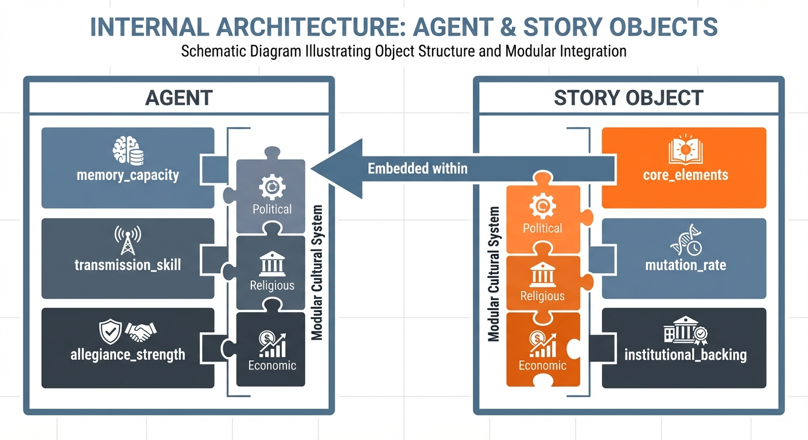

# Agent-Based Model: Cultural Memory Dynamics of Flood Myths

## Model Overview

This agent-based model simulates the emergence, propagation, and evolution of flood myths as cultural memories of late
Pleistocene/early Holocene environmental catastrophes. The model tracks how these memories spread through populations,
adapt to local conditions, and eventually become institutionalized through written codification.

## Environmental Backdrop

### Initial Conditions (t=0: ~12,000 BCE)

- **Triggering Events**: Sea level rise (~120m total), Sahara desiccation, Doggerland submersion
- **Population Displacement**: Mass migration from newly uninhabitable regions
- **Cultural Shock**: Traumatic environmental memories embedded in survivor populations

### Spatial Heterogeneity


**High Receptivity Zones** (α = 0.8-1.0):

- River deltas and floodplains
- Storm-prone coastal regions
- Seasonal flood zones
- **Characteristics**: Native flood experience, high story retention, minimal mutation

**Medium Receptivity Zones** (α = 0.4-0.7):

- Inland areas with occasional flooding
- Regions with historical climate variability
- **Characteristics**: Moderate retention, some narrative adaptation required

**Low Receptivity Zones** (α = 0.1-0.3):

- Arid highlands and stable interiors
- Regions with no flood experience
- **Characteristics**: High story mutation, transformation to abstract themes

## Agent Properties


### Individual Agents

```
Agent {
  position: (x, y)
  cultural_group: string
  memory_capacity: float [0,1]
  transmission_skill: float [0,1]
  receptivity_local: float [0,1]  // based on local environment
  flood_story: Story_Object
  literacy_status: draft
  institutional_role: {none, priest, scribe, ruler}
  narrative_allegiance: string  // current flood story version believed
  allegiance_strength: float [0,1]  // commitment to current narrative
  switching_threshold: float [0,1]  // resistance to narrative conversion
  
  // Modular Cultural System
  political_allegiance: string
  religious_allegiance: string
  economic_network: string
  professional_identity: string
  mythological_belief: string
  cultural_modularity: float [0,1]  // ability to compartmentalize cultural domains
}
```

### Story Objects

```
Story {
  core_elements: [water_catastrophe, divine_cause, survivor_group, renewal]
  local_adaptations: [geography, cultural_heroes, specific_details]
  narrative_strength: float [0,1]  // memorability and transmission fitness
  mutation_rate: float
  institutional_backing: boolean
  written_form: boolean
  competitive_elaborations: [genealogies, prophecies, moral_frameworks]
  explanatory_power: float [0,1]  // how well it explains current conditions
  emotional_appeal: float [0,1]  // psychological resonance with audience
  social_utility: float [0,1]  // practical benefits of belief
  
  // Modular Properties
  cultural_domain: {mythological, religious, political, philosophical}
  cross_domain_compatibility: dict  // compatibility with other cultural modules
  specialization_level: float [0,1]  // focus vs. comprehensive cultural package
  portability: float [0,1]  // ability to transfer across cultural boundaries
}
```

### Cultural Groups

```
Group {
  identity: string
  territory: polygon
  population: int
  literacy_rate: float
  institutional_strength: float
  canonical_story: Story_Object
  story_variants: [Story_Object]
  competitive_investment: float  // resources devoted to narrative elaboration
  narrative_dominance: float [0,1]  // success in cultural competition
  
  // Modular Cultural Architecture
  cultural_bundling_strategy: {integrated, modular, hybrid}
  domain_specializations: dict  // which cultural domains the group focuses on
  cross_boundary_networks: [Group]  // connections across cultural boundaries
  modularity_tolerance: float [0,1]  // acceptance of cultural mixing
}
```

## Dynamics

### Phase 1: Oral Transmission (12,000-3,000 BCE)


#### Story Propagation

- **Transmission Probability**: P(transmission) = f(agent_proximity, cultural_similarity, story_strength,
  local_receptivity)
- **Mutation Mechanism**: Stories adapt based on local environmental conditions and cultural context
- **Decay Function**: Stories fade without periodic reinforcement or environmental relevance

#### Spatial Diffusion

- **Source Regions**: Areas with direct environmental trauma experience
- **Transmission Networks**: Trade routes, migration paths, intermarriage connections
- **Gradient Effects**: Story fidelity decreases with distance from source regions and environmental similarity

#### Selection Pressures

- **Mnemonic Fitness**: Stories that are easier to remember and retell survive better
- **Cultural Utility**: Stories that explain local phenomena or provide social cohesion are preserved
- **Environmental Reinforcement**: Periodic local floods strengthen flood story retention

### Phase 2: Early Codification (3,000-500 BCE)

#### Literacy Emergence

- **Scribal Classes**: Specialized agents with high transmission_skill and institutional_role
- **Written Fixation**: Stories become canonized, reducing mutation but increasing persistence
- **Institutional Amplification**: Temple and palace support dramatically increases story survival

#### Competitive Mythology Dynamics

- **Narrative Arms Races**: Groups elaborate their flood stories to establish superiority over rivals
- **Individual Choice Mechanisms**: Each person becomes a "cultural market" where competing narratives vie for
  allegiance
- **Audience-Driven Evolution**: Story complexity increases as groups compete for individual adoption

#### Individual Narrative Selection

- **Psychological Resonance**: P(adoption) ∝ f(explanatory_power, emotional_appeal, cultural_fit)
- **Strategic Calculation**: P(adoption) ∝ f(group_power, social_utility, material_benefits)
- **Allegiance Switching**: Agents can change narrative_allegiance based on comparative story strength
- **Threshold Effects**: Switching requires overcoming existing allegiance_strength and switching_threshold

#### Feedback Loops


- **Standardization**: Written forms reduce local variation within cultural groups
- **Differentiation**: Written forms increase differences between cultural groups
- **Institutional Selection**: Stories with political utility are preferentially preserved
- **Competitive Elaboration**: Groups invest resources in narrative sophistication to win converts

### Phase 3: Imperial Codification (500 BCE-500 CE)

#### Large-Scale Dynamics

- **Cultural Hegemonies**: Dominant civilizations spread their flood narratives
- **Textual Authority**: Written versions gain authority over oral variants
- **Cross-Cultural Encounter**: Different canonical versions must be reconciled or compete

#### Institutional Mechanisms

- **Religious Codification**: Flood stories become embedded in sacred texts
- **Legal Integration**: Stories support legal and political structures
- **Educational Systems**: Formal transmission through schools and temples

### Phase 4: Cultural Modularity (500 CE-1500 CE)

#### Emergence of Cultural Compartmentalization

- **Domain Separation**: Political, religious, economic, and mythological systems become independently variable
- **Decoupled Transmission**: Cultural elements can spread across traditional boundaries
- **Specialized Selection**: Each cultural domain develops distinct evolutionary pressures

#### Modular Cultural Architecture

- **Multi-Domain Agents**: Individuals maintain separate allegiances across cultural domains
- **Cross-Domain Pollination**: Ideas can recombine across previously isolated cultural systems
- **Portable Identity Elements**: Cultural components become transferable across political/social contexts

#### New Competition Dynamics

- **Pure Narrative Merit**: Flood myths compete on intrinsic appeal rather than bundled benefits
- **Specialized Cultural Modules**: Stories must excel in specific domains (meaning, identity, explanation)
- **Professional Networks**: Cultural transmission through craft guilds, religious orders, merchant associations

## Key Parameters

### Environmental

- `receptivity_gradient`: Spatial variation in story acceptance (0-1)
- `reinforcement_frequency`: Rate of local flood events that strengthen memories
- `migration_pressure`: Population movement rates due to environmental stress

### Cultural

- `transmission_fidelity`: Accuracy of story passing between generations (0-1)
- `mutation_rate`: Rate of story adaptation to local conditions
- `cultural_cohesion`: Strength of group identity and internal story consistency
- `modularity_emergence`: Rate of cultural domain separation over time
- `cross_domain_permeability`: Ease of cultural element transfer across boundaries
- `specialization_pressure`: Selective advantage of domain-focused cultural elements

### Institutional

- `literacy_threshold`: Minimum institutional development for written codification
- `political_utility`: Degree to which stories support power structures
- `canonical_strength`: Resistance of written forms to further mutation

## Experimental Hypotheses

### Spatial Predictions

1. **Distance Decay**: Story similarity should decrease with geographic distance from source regions
2. **Environmental Correlation**: Flood-prone regions should show higher story retention across cultures
3. **Cultural Boundaries**: Story variants should cluster within cultural/linguistic groups

### Temporal Predictions

1. **Oral Phase**: High mutation, gradual diffusion, environmental correlation
2. **Early Writing**: Rapid standardization within groups, increased between-group differentiation
3. **Imperial Phase**: Consolidation around dominant narratives, suppression of variants
4. **Competitive Phase**: Accelerated narrative elaboration, winner-take-all dynamics
5. **Modular Phase**: Specialized narrative evolution, cross-boundary transmission, recombination innovation

### Emergent Properties

1. **Universal Elements**: Core flood narrative components should be preserved across all variants
2. **Cultural Specificity**: Local adaptations should reflect environmental and cultural contexts
3. **Institutional Persistence**: Written versions should show greater longevity than oral variants
4. **Competitive Sophistication**: Narratives should become more elaborate in regions with high cultural competition
5. **Individual Agency**: Narrative adoption patterns should reflect both psychological and strategic factors
6. **Modular Specialization**: Advanced societies should show domain-specific narrative evolution
7. **Cultural Recombination**: Contact zones should generate novel narrative syntheses
8. **Professional Transmission**: Specialized networks should preserve and modify narratives independently of political
   systems

## Model Validation

### Archaeological Evidence

- Distribution of flood myths across cultures
- Timing of myth codification relative to literacy development
- Correlation between environmental history and narrative elements

### Linguistic Analysis

- Phylogenetic relationships between flood story variants
- Borrowing patterns between cultural groups
- Stability of core narrative elements across languages

### Historical Documentation

- Evolution of flood narratives in historical texts
- Institutional use of flood stories for legitimacy
- Cross-cultural encounters and narrative reconciliation

## Implementation Framework

### Simulation Architecture

- **Grid-based spatial environment** with varying receptivity zones
- **Network-based cultural transmission** following realistic migration/contact patterns
- **Multi-level selection** operating on individuals, stories, and cultural groups
- **Historical timeline** with phase transitions driven by technological/institutional development

### Output Metrics

- **Story distribution maps** showing geographic spread over time
- **Phylogenetic trees** tracking narrative evolution and relationships
- **Cultural competition dynamics** measuring dominance and survival of different versions
- **Institutional influence** quantifying the role of writing and political structures
- **Individual choice patterns** mapping narrative adoption and switching behaviors
- **Competitive investment tracking** measuring resource allocation to narrative elaboration
- **Narrative sophistication indices** quantifying story complexity evolution over time
- **Cultural modularity measures** tracking domain separation and specialization over time
- **Cross-boundary transmission networks** mapping cultural exchange patterns
- **Recombination innovation tracking** identifying novel narrative syntheses in contact zones

This model provides a framework for understanding how traumatic environmental memories can persist and evolve across
millennia, ultimately shaping the mythological foundations of human civilizations. The progression from integrated
cultural packages to modular cultural systems represents a fundamental shift in how human societies organize and
transmit cultural information, with profound implications for understanding cultural evolution, innovation, and the
modern fragmentation of knowledge systems.