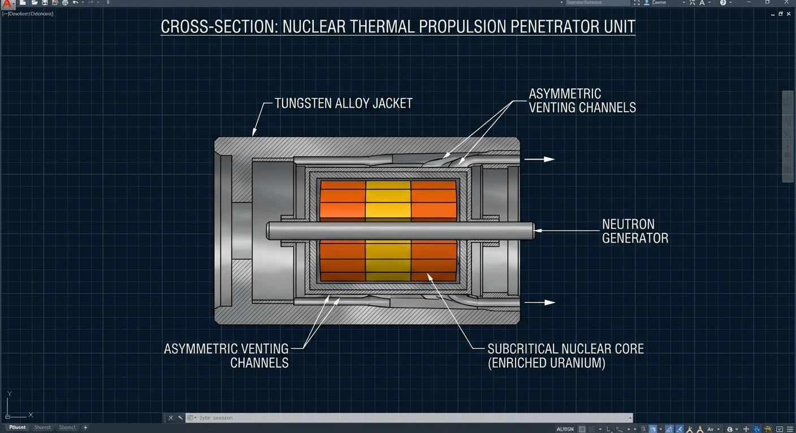
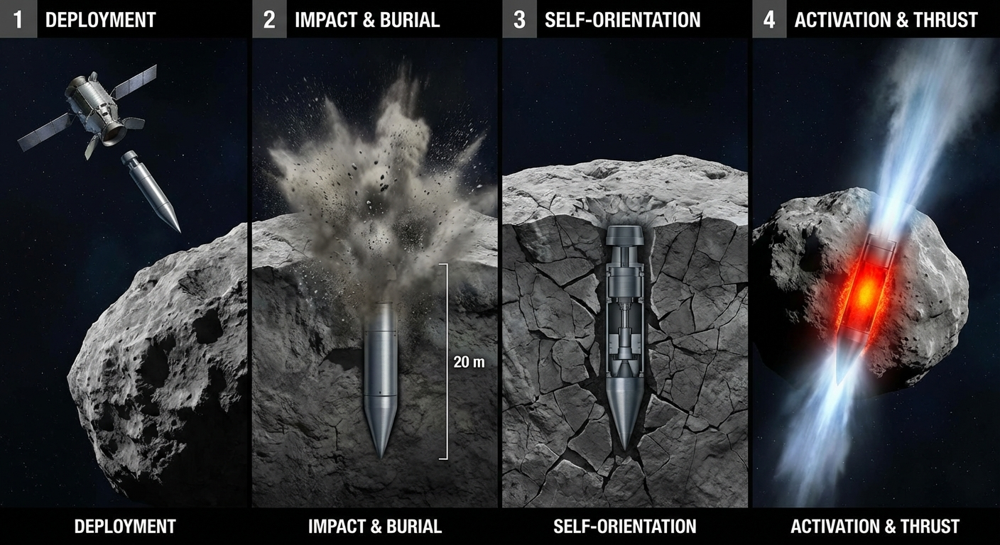
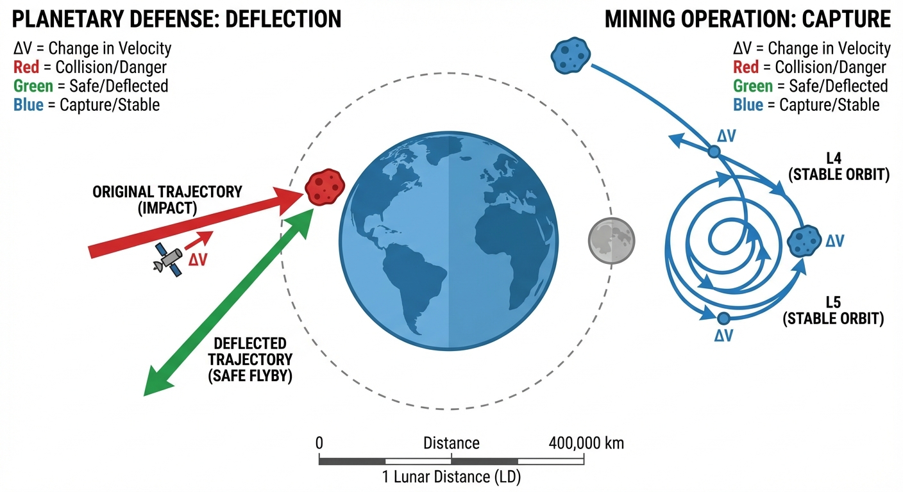
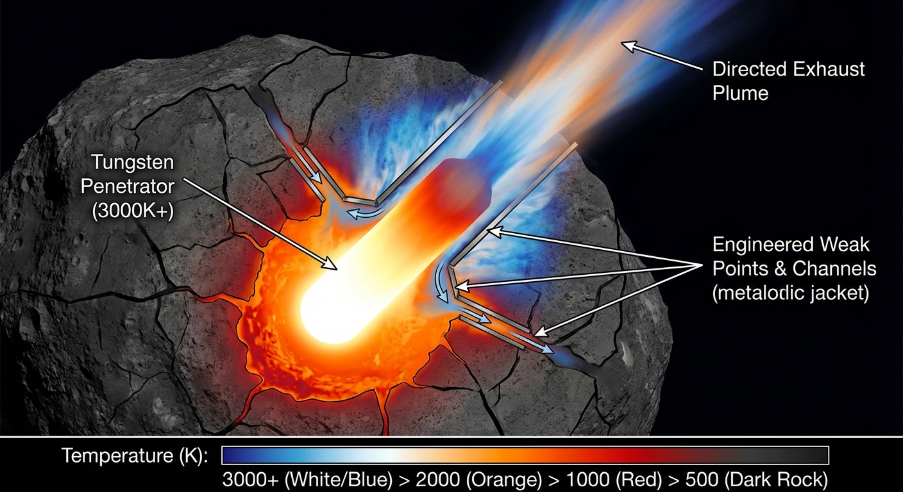

# Nuclear Thermal Propulsion System for Asteroid Manipulation

## Executive Summary

This proposal outlines a novel nuclear thermal propulsion system designed for asteroid deflection and orbital
maneuvering applications. The system utilizes subcritical nuclear cores with neutron-initiated thermal reactions,
contained within tungsten penetrator jackets, to provide controlled thrust for large-scale asteroid manipulation.

## System Overview

### Core Concept

The system employs deliberately subcritical nuclear masses that achieve controlled thermal reactions through external
neutron bombardment. The resulting thermal expansion and material ejection provides propulsive force while maintaining
asteroid structural integrity.

### Primary Applications

- **Planetary Defense**: Late-stage asteroid deflection with minimal lead time
- **Mining Operations**: Orbital maneuvering of valuable asteroids to processing facilities
- **Space Debris Management**: Controlled deorbiting of large debris objects

## Technical Design

### Nuclear Core Assembly

**Geometry Optimization**

- **Shape**: Elongated cylindrical or flattened disk configuration
- **Aspect Ratio**: 3:1 to 5:1 length-to-diameter ratio
- **Material**: Highly enriched uranium-235 or plutonium-239
- **Mass**: 15-25 kg subcritical assembly per unit

**Safety Features**

- Core geometry maintains k-effective < 0.85 under all normal conditions
- High surface-area-to-volume ratio promotes thermal dissipation
- Distributed mass configuration reduces compression sensitivity
- Multiple independent subcritical elements connected by neutron-transparent materials

### Neutron Initiation System

**Primary Components**

- **Source**: Plutonium-238/Beryllium neutron generator or compact accelerator system
- **Flux Control**: Variable intensity neutron emission (10¹⁰ to 10¹³ neutrons/second)
- **Timing Control**: Precise initiation capability with remote command authority
- **Shielding**: Localized neutron direction and containment

**Control Parameters**

- Neutron flux intensity determines thermal output level
- Pulse duration controls total energy release
- Timing precision enables optimal positioning relative to asteroid dynamics

### Tungsten Penetrator Jacket

**Structural Design**

- **Material**: 95% tungsten alloy with rhenium additives for ductility
- **Thickness**: Variable, 2-5 cm walls with engineered weak points
- **Mass**: 200-400 kg total assembly
- **Penetration Capability**: Designed for 10-50 meter penetration depth

**Thermal Management**

- **Heat Capacity**: Tungsten absorbs ~134 J/(kg·K), providing thermal buffering
- **Melting Point**: 3695K operational threshold
- **Directed Venting**: Asymmetric jacket design creates preferential thermal expansion paths
- **Nozzle Integration**: Shaped charges or pre-formed channels direct thermal exhaust

### Deployment Mechanism

**Delivery System**

- Standard deep-space trajectory insertion vehicle
- Multiple units per launch vehicle (3-6 units typical)
- Independent guidance and penetration capability per unit

**Penetration Sequence**

1. High-velocity impact (2-5 km/s) using kinetic energy
2. Tungsten jacket penetrates 10-50 meters into asteroid body
3. Automatic orientation system aligns thrust vector
4. Neutron initiation system activates on command

## Operational Scenarios

### Planetary Defense Mode

**Target Parameters**

- Asteroid diameter: 100m - 2km
- Detection timeline: 6 months to 2 years before impact
- Required delta-V: 1-10 cm/s depending on intervention time

**Deployment Strategy**

- Multiple units (4-8) for redundancy and cumulative effect
- Sequential activation allows trajectory correction
- Stochastic deflection acceptable - any miss trajectory sufficient

**Performance Estimates**

- Single unit: 0.5-2.0 cm/s delta-V for 500m diameter asteroid
- Multiple unit cumulative: 5-15 cm/s total velocity change
- Success probability: >95% for Earth impact avoidance

### Mining Operations Mode

**Target Selection**

- Near-Earth asteroids with high metal content
- Diameter: 50m - 500m optimal range
- Target orbits: Earth-Moon L4/L5 or stable lunar orbits

**Orbital Maneuvering**

- Rough-phase navigation to processing facilities
- Multiple correction burns over 6-18 month periods
- Acceptable positioning accuracy: ±1000 km final orbit

**Economic Justification**

- Cost per unit: $50-100M including delivery
- Payload value: $1B+ for platinum-group metal rich asteroids
- Return on investment: 10:1 to 100:1 for successful operations

## Mission Planning and Assembly Operations

### Lunar Orbit Assembly Protocol

**Component Separation Strategy**

- **Nuclear cores**: Shipped individually in subcritical configurations with k-effective < 0.7
- **Tungsten jackets**: Transported separately to eliminate any possibility of accidental assembly
- **Neutron initiators**: Delivered as final components with independent transport vehicles
- **Control systems**: Redundant electronics packages with encrypted command protocols

**Assembly Facility Requirements**

- **Location**: Lunar L2 or high lunar orbit (>100,000 km altitude)
- **Infrastructure**: Robotic assembly platform with radiation shielding
- **Personnel**: All human operators remain Earth-side or behind lunar surface shielding
- **Quality control**: Multiple independent verification systems for each assembly step

**Staging and Storage**

- Completed units stored in stable lunar orbits pending deployment
- Maximum inventory: 20 units in storage to limit catastrophic loss potential
- Regular maintenance cycles to verify neutron initiator functionality
- Emergency disposal capability via controlled lunar surface impact

### Mission Deployment Profiles

**Planetary Defense Missions**

- **Lead time**: 6-24 months from threat identification to deployment
- **Unit count**: 6-12 units per target asteroid for redundancy
- **Trajectory planning**: Multiple launch windows to ensure target intercept
- **Command structure**: International coordination through UN Planetary Defense Office

**Mining Operations Missions**

- **Target selection**: Near-Earth asteroids with confirmed high-value mineral content
- **Mission duration**: 18-36 months from deployment to orbital insertion
- **Economic threshold**: Minimum $10B estimated value to justify mission costs
- **Commercial partnerships**: Private-public cost sharing with mining consortiums

## Safety and Risk Management

### Catastrophic Failure Analysis

**Accidental Detonation Scenarios**

- **Prompt criticality**: Directional gamma burst with radioactive debris field expansion at 1000+ km/s
- **Sustained thermal runaway**: Nuclear torch effect lasting 5-20 minutes with continuous radiation emission
- **Atmospheric interaction**: Potential EMP effects and radiation belt enhancement if failure occurs below 1000 km
  altitude

**Failure Mode Consequences**

- **Free space detonation**: Highly directional radiation burst and asymmetric plasma expansion
- **Lunar vicinity failure**: Contained by lunar gravity well with minimal Earth impact
- **Upper atmosphere failure**: Catastrophic EMP and radiation effects across continental areas

### Enhanced Safety Protocols

**Pre-Assembly Safety**

- All nuclear components maintain triple-redundant subcritical safety margins
- Independent transport vehicles prevent accidental proximity during launch
- Automated abort systems capable of component disposal via solar escape trajectories
- International monitoring of all nuclear material movements

**Assembly Phase Safety**

- Robotic-only assembly operations with human oversight from minimum 10,000 km distance
- Real-time radiation monitoring with automatic shutdown capabilities
- Component-by-component criticality calculations before each assembly step
- Emergency ejection systems for partially assembled units

**Operational Safety**

- Encrypted quantum communication links with Earth-based command authority
- Autonomous abort protocols for loss of communication exceeding 24 hours
- Minimum safe distance requirements: 50,000 km from any crewed facilities
- Post-mission disposal via controlled solar impact trajectories

### Mission Risk Assessment

**Primary Technical Risks**

- Penetration failure or inadequate asteroid coupling (15% probability)
- Neutron initiation system malfunction (8% probability)
- Uncontrolled thermal runaway leading to fragmentation (3% probability)
- Communication system failure during critical phases (12% probability)

**Catastrophic Risk Scenarios**

- Accidental criticality during assembly operations (0.1% probability, mission-ending)
- Multiple unit simultaneous failure causing over-deflection (0.5% probability)
- Radioactive debris collision with operational spacecraft (0.3% probability)

**Risk Mitigation Strategies**

- **Redundancy**: 2-3x unit over-deployment for all critical missions
- **Isolation**: Lunar orbit assembly eliminates Earth-proximity risks
- **Communication**: Multiple independent command channels with backup autonomous operation
- **Monitoring**: Continuous tracking of all deployed units and debris fields
- **International cooperation**: Shared risk assessment and emergency response protocols

### Hostile Actor Threat Analysis

**Dual-Use Technology Concerns**

- **Kinetic weapon potential**: Tungsten penetrators could be repurposed as orbital bombardment weapons
- **Nuclear terrorism**: Subcritical cores could be diverted for radiological dispersal devices
- **EMP warfare**: Deliberate atmospheric detonation could disable national infrastructure
- **Space warfare**: Systems could target satellites or space installations

**Attack Vectors and Scenarios**

**State Actor Threats**

- **Technology theft**: Cyber infiltration of assembly facilities or command systems
- **Supply chain compromise**: Insertion of malicious components during manufacturing
- **Command hijacking**: Hostile takeover of communication systems during operations
- **False flag operations**: Disguising military actions as legitimate planetary defense

**Non-State Actor Threats**

- **Facility infiltration**: Physical breach of lunar assembly operations
- **Insider threats**: Compromised personnel with access to nuclear materials
- **Communication interception**: Hijacking control signals to redirect units
- **Asymmetric attacks**: Using captured technology for terrorist objectives

**Proliferation Risks**

- **Technology transfer**: Unauthorized sharing of nuclear space propulsion designs
- **Component diversion**: Black market trafficking of nuclear materials or neutron initiators
- **Reverse engineering**: Hostile analysis of failed or captured units
- **Manufacturing replication**: Independent development based on observed capabilities

### Security Countermeasures

**Design-Level Security**

- **Authentication systems**: Quantum-encrypted command codes with biometric verification
- **Tamper resistance**: Self-destructing components if unauthorized access detected
- **Limited autonomy**: No capability for independent target selection or timing
- **Geofencing**: Hard-coded operational boundaries preventing Earth-directed use

**Operational Security**

- **Multi-national oversight**: No single nation controls complete system capabilities
- **Distributed command**: Require consensus from multiple international authorities for activation
- **Real-time monitoring**: Continuous surveillance of all units by independent space agencies
- **Component tracking**: Blockchain-based ledger for all nuclear materials and assemblies

**Facility Protection**

- **Lunar isolation**: Assembly facilities physically isolated from Earth-based threats
- **Redundant communication**: Multiple independent command channels to prevent hijacking
- **Personnel vetting**: Extensive background checks and psychological evaluation for all staff
- **International staffing**: Multi-national teams to prevent single-nation compromise

**Technology Safeguards**

- **Export controls**: Strict international licensing for all related technologies
- **Design compartmentalization**: No single entity possesses complete system knowledge
- **Kill switches**: Multiple independent systems capable of unit neutralization
- **Forensic tracking**: Unique signatures enabling identification of unit origins

### Threat Response Protocols

**Compromise Detection**

- **Behavioral analysis**: AI monitoring for anomalous unit behavior or communication patterns
- **Trajectory verification**: Continuous validation that units remain on authorized paths
- **Command validation**: Multi-factor authentication for all operational commands
- **Real-time assessment**: Immediate threat evaluation for any off-nominal activities

**Active Countermeasures**

- **Remote destruction**: Capability to neutralize compromised units via command detonation
- **Trajectory modification**: Emergency systems to redirect units away from sensitive targets
- **Communication jamming**: Ability to block unauthorized command signals
- **Physical interception**: Rapid response capability using conventional space assets

**International Response Framework**

- **Immediate notification**: Automated alerts to all space-faring nations within minutes of anomaly
- **Coordinated response**: Pre-established protocols for international cooperation during crises
- **Attribution analysis**: Forensic capabilities to identify responsible parties
- **Deterrent policies**: Clear consequences for hostile use or proliferation attempts

### Emergency Response Procedures

**Assembly Phase Emergencies**

- Immediate component separation and disposal via lunar impact
- Evacuation of all personnel to minimum 100,000 km safe distance
- International notification within 1 hour of any nuclear safety incident
- Security assessment to determine if incident was accidental or hostile

**Operational Phase Emergencies**

- Real-time trajectory monitoring with predictive collision analysis
- Coordinated space traffic control to clear potential debris paths
- Emergency medical protocols for radiation exposure incidents
- Threat assessment protocols to distinguish accidents from attacks

**Security Incident Response**

- Immediate isolation of compromised systems or facilities
- Multi-national investigation teams deployed within 24 hours
- Emergency destruction of threatened nuclear materials if necessary
- Coordinated international response including potential sanctions or military action

**Post-Mission Cleanup**

- Mandatory tracking of all radioactive debris for minimum 50-year period
- International database of nuclear space debris orbital parameters
- Cleanup mission capability for debris threatening operational spacecraft
- Forensic analysis of all mission components for security assessment

## Development Timeline and Costs

### Phase 1: Design and Testing (Years 1-3)

- **Budget**: $500M
- **Objectives**: Core geometry optimization, neutron initiation testing, tungsten jacket design
- **Deliverables**: Validated design specifications, ground test results

### Phase 2: Prototype Development (Years 3-5)

- **Budget**: $800M
- **Objectives**: Full-scale prototype construction and testing
- **Deliverables**: Flight-ready prototype units, safety certification

### Phase 3: Operational Deployment (Years 5-7)

- **Budget**: $1.2B
- **Objectives**: First operational missions for both defense and mining applications
- **Deliverables**: Proven operational capability, commercial viability demonstration

## Regulatory and International Considerations

### Nuclear Regulatory Framework

- Compliance with Outer Space Treaty provisions
- International Atomic Energy Agency oversight
- National nuclear regulatory authority approvals
- Space debris mitigation guidelines adherence

### International Cooperation Requirements

- United Nations Office for Outer Space Affairs coordination
- Planetary defense mission approval through international consensus
- Mining operations subject to space resource utilization treaties
- Technology transfer controls for dual-use nuclear systems

## Conclusion

The proposed nuclear thermal propulsion system represents a paradigm shift in asteroid manipulation capability. By
leveraging controlled subcritical nuclear reactions within tungsten penetrator systems, we can achieve the high energy
density required for rapid asteroid deflection or orbital maneuvering while maintaining operational safety and mission
flexibility.

The system's inherent simplicity, combined with the precision control offered by neutron-initiated reactions, provides a
robust solution for both planetary defense and commercial mining applications. The dual-use nature of the technology
ensures sustainable development funding while addressing critical planetary security needs.

Success in this program would establish humanity's first practical capability for large-scale asteroid manipulation,
opening new frontiers in both planetary protection and space resource utilization.

