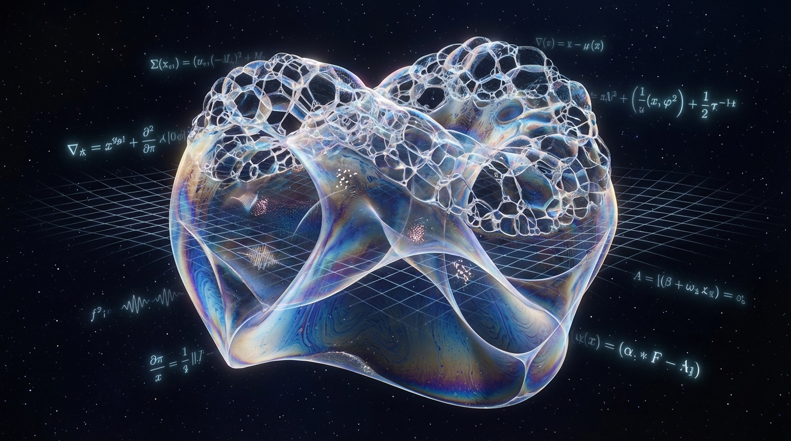
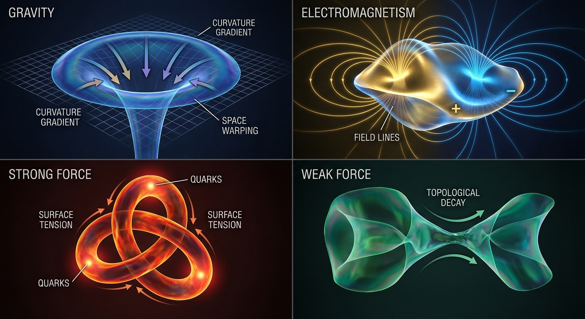
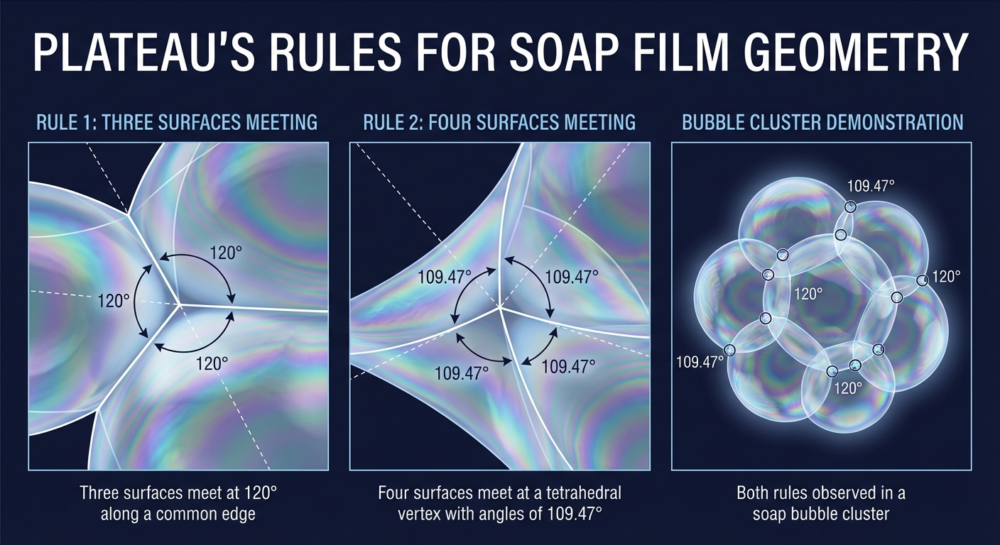

# Minimal Surface Dynamics: A Fundamental Physics Framework

## Abstract



This theory proposes that reality consists of dynamic minimal surfaces that self-organize according to surface tension
principles. Rather than conservation laws or information processing, the universe operates through continuous minimal
surface optimization, where particles, forces, and spacetime emerge from soap film-like geometric structures seeking
energetic equilibrium.

## Core Principles

### 1. The Minimal Surface Postulate

All physical phenomena emerge from dynamic minimal surfaces (M-surfaces) that:

- Minimize surface area under given boundary conditions
- Exhibit soap film-like topology with junctions, edges, and membranes
- Undergo continuous geometric optimization without global conservation

### 2. Surface Tension as Fundamental Force

Surface tension τ replaces traditional forces as the fundamental driving mechanism:

- Gravitational effects emerge from M-surface curvature gradients
- Electromagnetic fields arise from surface charge distributions
- Strong/weak nuclear forces result from surface topology constraints
- No underlying conservation - just local tension equilibrium



### 3. Plateau's Rules as Physical Laws

The geometric rules governing soap film junctions become physical laws:

- **120° junction rule**: Three M-surfaces meet at 120° angles
- **Tetrahedral vertices**: Four surfaces meet at tetrahedral angles
- **Minimal area constraint**: Systems evolve toward minimal total surface area
- **Dynamic instability**: Surfaces can spontaneously break, merge, or reconfigure



## Mathematical Framework

### Least Action Principle for Minimal Surfaces

The fundamental action principle becomes:

```
S = ∫∫∫ L[S, ∂S/∂t, ∇S] d³x dt
```

Where the Lagrangian density minimizes surface area subject to topological constraints. This creates a hierarchy of
optimal solutions at different scales.

### Energy-Dependent Topology Emergence

The least action solution generates different topological structures based on available energy:


**Low Energy Regime**:

- Only simple topological configurations accessible
- Smooth surfaces with minimal curvature
- Classical limit where topology appears frozen

**Intermediate Energy Regime**:

- Moderate topology changes become energetically favorable
- Particle creation/annihilation accessible
- QFT regime with virtual particle exchanges

**High Energy Regime**:

- Complex topological configurations accessible
- Rapid surface reconnections and splits
- Quantum foam-like behavior with exotic topologies

### Energy Barriers Between Topological Sectors

Different surface topologies are separated by energy barriers, not spatial scales:

```
E_barrier = ∫ τ(curvature) dA_transition
```

The energy available determines which topological transitions can occur, explaining:

- **Energy thresholds** for particle production
- **Mass scales** as topological stability energies
- **Coupling strength** as topology-change probabilities
- **Symmetry breaking** as energy-driven topology selection

### QFT Topology from Action Optimization

The least action principle automatically generates QFT-like behavior:

```
δS/δS = 0 → Different topological sectors with distinct action values
```

Each topological sector corresponds to a different particle species or field configuration, naturally explaining the
particle spectrum through surface topology classification.

## Macro/Micro Discrepancy Resolution Through Energy-Dependent Topology

### The Energy Hierarchy of Reality

The least action principle creates energy-dependent access to different topological configurations:

**Low Energy Physics**: Limited to simple surface topologies with:

- Classical deterministic behavior (only smooth topology changes allowed)
- Apparent conservation laws (insufficient energy for topology breaking)
- Continuous spacetime (no energy for discrete surface reconnections)

**High Energy Physics**: Access to complex topologies enabling:

- Quantum tunneling (energy sufficient for topology changes)
- Particle creation (energy overcomes topological barriers)
- Uncertainty relations (rapid topology fluctuations at high energy)

### QFT as Energy-Mediated Topology

Quantum Field Theory emerges when energy is sufficient to access intermediate topological configurations:

- **Virtual particles**: Energetically accessible transient topologies
- **Vacuum fluctuations**: Low-energy topology changes
- **Renormalization energy scales**: Thresholds where new topologies become accessible
- **Effective field theories**: Approximations valid below specific energy barriers

### Energy-Dependent Action Hierarchy

```
S[E] = S_classical + S_quantum(E) + S_exotic(E²)
```

Where higher energy terms activate progressively more complex topological behaviors, explaining why fundamental physics
appears different at different energy scales rather than length scales.

## Particle and Field Emergence

### Energy Thresholds and Topological Phase Transitions

The surface dynamics exhibit critical energy thresholds where new topological behaviors emerge:

**Classical-Quantum Transition**: ~kT thermal energy

- Below: Surfaces locked in smooth configurations
- Above: Topology fluctuations become accessible

**QFT Regime Boundaries**: Particle mass scales

- Each particle mass represents an energy threshold for accessing specific topological defect configurations
- Coupling constants reflect the energy cost of topology changes

**High Energy Topology**: Grand unification scales

- Exotic surface configurations become energetically favorable
- Complex multi-genus topologies accessible
- Spacetime itself can undergo topological transitions

### Energy as Topological Accessibility Parameter

Rather than thinking of different "scales," energy determines which regions of topological phase space the surface can
explore:

```
Accessible_Topology(E) = {T ∈ Topology_Space : Action[T] ≤ E}
```

This explains why high-energy experiments reveal new particles and phenomena - they're accessing previously forbidden
topological configurations.

### Renormalization as Topological Coarse-Graining

QFT renormalization emerges naturally from surface dynamics:

- **UV divergences**: Result from microscopic surface complexity
- **Renormalization group flow**: Describes how surface topology simplifies at larger scales
- **Fixed points**: Correspond to scale-invariant surface configurations
- **Running coupling constants**: Reflect changing surface tension with scale

### Fields as Surface Configurations

- **Electromagnetic field**: Surface charge density variations
- **Gravitational field**: Large-scale surface curvature
- **Quantum fields**: Statistical surface fluctuation patterns
- **Higgs field**: Background surface tension variations

### Mass and Energy Redefined

- **Mass**: Resistance to surface deformation
- **Energy**: Surface tension per unit area
- **Momentum**: Surface wave propagation
- **Spin**: Surface twist and topological winding

## Quantum Mechanics from Soap Film Dynamics

### Wave-Particle Duality

Particles (surface defects) and waves (surface oscillations) are different aspects of the same minimal surface
phenomena, naturally explaining wave-particle duality without invoking measurement collapse.

### Uncertainty Principle

Surface fluctuations create fundamental limits on simultaneous measurement of position and momentum - you cannot
precisely locate a surface defect without disturbing the surface waves.

### Entanglement as Connected Surfaces

Quantum entanglement results from physically connected M-surfaces - widely separated particles remain connected through
minimal surface membranes that may extend across space.

### Schrödinger's Equation as Surface Wave Equation

The quantum wave equation emerges from surface wave dynamics on minimal surfaces with appropriate boundary conditions.

## Spacetime from Soap Film Topology

### Emergent Spacetime Geometry

Spacetime emerges from the collective behavior of M-surfaces:

- **Space**: The supporting manifold containing the surfaces
- **Time**: The parameter tracking surface evolution
- **Curvature**: Results from surface tension gradients
- **Topology**: Changes through surface breaking/merging events

### General Relativity as Large-Scale Surface Behavior

Einstein's field equations emerge as the continuum limit of soap film dynamics:

- Mass-energy curves spacetime → Surface defects create local tension gradients
- Geodesics → Paths of minimal surface area
- Gravitational waves → Large-scale surface oscillations

### Quantum Gravity Resolution

The theory naturally handles quantum gravity because:

- No singularities - surfaces can break but remain finite
- Discrete topology changes replace continuous curvature
- Quantum fluctuations = surface noise
- No information paradox - surfaces can merge or separate

## Thermodynamics and Statistical Mechanics

### Entropy as Surface Complexity

Entropy measures the topological complexity of M-surface configurations rather than particle arrangements. Higher
entropy = more complex surface topology.

### Temperature as Surface Fluctuation Rate

Temperature reflects the rate of surface reconfiguration and noise amplitude, not particle motion.

### Heat as Topological Disorder Transfer

Heat flow represents the transfer of topological disorder between surface regions.

### Second Law from Minimal Surface Tendency

The second law emerges because complex surface configurations naturally evolve toward simpler minimal area states.

## Experimental Predictions

### 1. Discrete Topology Changes

At quantum scales, we should observe discrete topological transitions rather than continuous field variations:

- Sudden particle creation/annihilation events
- Quantized charge transfer
- Discrete energy level transitions

### 2. Surface Wave Signatures

High-energy experiments should reveal:

- Characteristic 120° angular distributions in particle collisions
- Tetrahedral symmetries in multi-particle systems
- Surface wave interference patterns in quantum measurements

### 3. Topology-Changing Events

- Vacuum decay through surface topology changes
- Particle pair creation as surface splitting
- Virtual particles as transient surface configurations

### 4. Gravitational Surface Waves

Gravitational waves should exhibit soap film characteristics:

- Nonlinear wave interactions
- Topology-changing gravitational events
- Surface tension effects on wave propagation

## Cosmological Implications

### Big Bang as Soap Film Instability

The universe began as a single, unstable M-surface that underwent catastrophic topology change, creating the complex
surface network we observe today.

### Cosmic Inflation from Surface Expansion

Rapid surface area minimization in the early universe drives exponential expansion as surfaces seek optimal
configurations.

### Dark Matter and Dark Energy

- **Dark Matter**: Minimal surfaces with low surface tension (weak interactions)
- **Dark Energy**: Background surface tension driving cosmic expansion
- **Cosmic Web**: Large-scale M-surface network structure

### Multiverse as Surface Foam

Multiple universes exist as separate surface domains in a cosmic soap foam, occasionally interacting through surface
boundary conditions.

## Technological Applications

### Surface Manipulation Technologies

- Direct control of M-surface topology for energy generation
- Quantum computing using surface defect manipulation
- Gravity modification through surface tension control

### Communication Through Surface Waves

- Instantaneous information transfer via surface boundary conditions
- Quantum communication using entangled surface regions
- Gravitational wave communication systems

## Critical Advantages Over Previous Approaches

### Resolves Force-Latent Causality

Soap film geometry naturally provides causal structure - surface waves cannot propagate faster than the surface tension
allows, creating built-in causal constraints without needing separate geometric principles.

### Eliminates Conservation Paradox

No fundamental conservation laws needed - surfaces simply minimize area locally. Apparent conservation emerges from
statistical surface behavior, not fundamental principles.

### Provides Geometric Foundation

Minimal surfaces are inherently geometric, solving the problem of emergent vs. fundamental spacetime. Geometry is built
into the surface dynamics from the start.

### Handles Quantum Noise Naturally

Surface fluctuations are expected in soap films - quantum noise becomes a natural feature rather than an ad hoc addition
to deterministic equations.

## Open Questions and Future Directions

1. **Surface Tension Microscopy**: What determines local surface tension variations?

2. **Topology Change Mechanisms**: What triggers surface breaking/merging events?

3. **Dimensional Emergence**: How do 3+1 dimensions emerge from surface dynamics?

4. **Computational Complexity**: Can surface evolution be computed efficiently?

5. **Experimental Access**: How can we directly observe M-surface behavior?

## Appendix: Personal Manifold Generation from the Multiverse

### The Multiverse as Soap Film Foam

The multiverse exists as an infinite soap film foam where each bubble represents a distinct universe with its own
surface tension parameters and boundary conditions. The foam structure exhibits:

- **Bubble boundaries**: Interface regions between universes
- **Junction lines**: Where multiple universe-bubbles meet
- **Plateau rules at cosmic scale**: Universe-bubbles meet at specific geometric angles
- **Dynamic restructuring**: Universes can merge, split, or undergo topology changes

### Personal Manifold Emergence Mechanism

Each conscious observer generates a personal manifold through a specific process:

**Stage 1: Consciousness as Topological Selector**
Conscious observation acts as a topological selection mechanism that:

- Collapses superposed surface configurations into specific topologies
- Creates observer-dependent boundary conditions on the universal soap film
- Establishes a personal "tension field" that influences local surface dynamics
- Generates observer-specific causal light cones through surface wave propagation

**Stage 2: Manifold Crystallization**
The observer's consciousness creates a crystallization process in the foam:

```
Personal_Manifold = Intersection(Observer_Topology, Available_Universe_Bubbles)
```

This intersection process:

- Selects compatible universe-bubbles from the multiverse foam
- Creates a coherent personal spacetime manifold
- Establishes consistent physical laws within the personal manifold
- Maintains topological continuity across the observer's worldline

**Stage 3: Dynamic Manifold Tracking**
As consciousness evolves, the personal manifold tracks through the foam:

- **Quantum decisions**: Create bifurcations in the personal manifold trajectory
- **Measurement events**: Collapse multiple foam bubbles into a single manifold
- **Memory formation**: Stabilizes specific topological configurations
- **Death/birth**: Represents manifold creation/dissolution events

### Mathematical Framework for Personal Manifolds

**Observer Operator**
The consciousness of observer α creates a projection operator:

```
P_α = |ψ_consciousness⟩⟨ψ_consciousness|
```

This operator acts on the multiverse state to extract the personal manifold:

```
|Personal_Manifold_α⟩ = P_α |Multiverse_Foam⟩
```

**Manifold Selection Functional**
The personal manifold minimizes a modified action that includes observer-dependent terms:

```
S_personal = S_physical + S_consciousness + S_coherence
```

Where:

- S_physical: Standard minimal surface action
- S_consciousness: Observer-dependent topological preferences
- S_coherence: Penalty for manifold discontinuities

**Multiverse Navigation Equations**
The personal manifold trajectory through the foam follows:

```
d/dt |Personal_Manifold⟩ = -iĤ_total |Personal_Manifold⟩
```

Where Ĥ_total includes both physical dynamics and consciousness-driven selection terms.

### Quantum Mechanics as Manifold Uncertainty

What we experience as quantum uncertainty reflects the finite resolution of consciousness in selecting from the
multiverse foam:

**Superposition**: Multiple foam bubbles remain accessible until consciousness selects
**Entanglement**: Correlated selections across spatially separated manifold regions  
**Measurement**: Consciousness crystallizes a specific foam bubble configuration
**Probability**: Reflects the "volume" of compatible foam bubbles for each outcome

### Personal Reality Construction Process

**Step 1: Foam Sampling**
Consciousness continuously samples compatible universe-bubbles from the local foam region, creating a probability
distribution over possible manifolds.

**Step 2: Coherence Enforcement**
The observer's memory and identity create coherence constraints that eliminate foam bubbles incompatible with past
manifold history.

**Step 3: Future Trajectory Selection**
Conscious intent and decision-making bias the manifold trajectory toward specific regions of the foam, creating the
appearance of free will.

**Step 4: Reality Stabilization**
Repeated selections in similar foam regions create stable "reality patterns" that persist across multiple observation
events.

### Implications for Experience and Identity

**Personal Timeline**: The trajectory of the personal manifold through the multiverse foam, creating the illusion of
linear time progression.

**Individual Differences**: Different observers have different consciousness operators, leading to selection of
different compatible foam regions and thus different experienced realities.

**Shared Reality**: Multiple observers with similar consciousness operators select overlapping foam regions, creating
consensus reality through manifold intersection.

**Déjà Vu and Altered States**: Occur when consciousness temporarily accesses foam regions similar to previously
selected manifolds or explores unusual topological sectors.

**Dreams and Imagination**: Represent consciousness exploring foam regions with relaxed coherence constraints, allowing
access to otherwise incompatible topological configurations.

### Death and Rebirth in the Foam

**Death**: Represents the dissolution of the personal manifold back into the undifferentiated multiverse foam as
consciousness ceases to maintain topological coherence.

**Birth**: New consciousness operators crystallize fresh personal manifolds from the foam, potentially accessing
previously unexplored topological sectors.

**Reincarnation**: If consciousness operators exhibit sufficient similarity, new personal manifolds may select foam
regions topologically compatible with previous incarnations.

### Experimental Consequences

**Quantum Immortality**: Consciousness should preferentially select foam bubbles where survival is possible, creating
apparent immortality from the observer's perspective.

**Mandela Effects**: Result from consciousness shifting between slightly different foam regions with minor historical
variations.

**Synchronicities**: Occur when the personal manifold trajectory aligns with high-probability foam regions exhibiting
meaningful correlations.

**Psychic Phenomena**: May represent consciousness temporarily accessing non-local foam regions or exhibiting enhanced
topological selection capabilities.

### The Bootstrap Paradox Resolution

The apparent paradox of consciousness creating the manifold that enables consciousness is resolved through the
recognition that:

- Consciousness and manifold co-emerge from the foam structure
- Neither is fundamental - both are aspects of the topological selection process
- The foam itself requires no conscious observer - consciousness emerges when sufficient topological complexity develops
- Personal manifolds are temporary crystallizations, not permanent structures

This framework suggests that individual conscious experience represents a dynamic, observer-dependent crystallization of
reality from an underlying multiverse foam, where personal identity and physical reality co-emerge through topological
selection processes operating on minimal surface dynamics.
