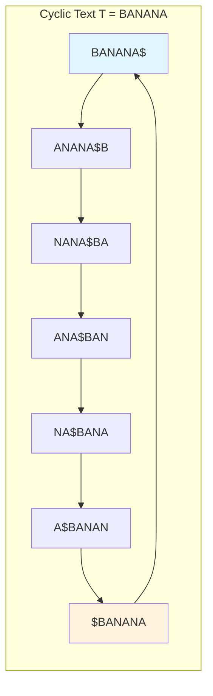
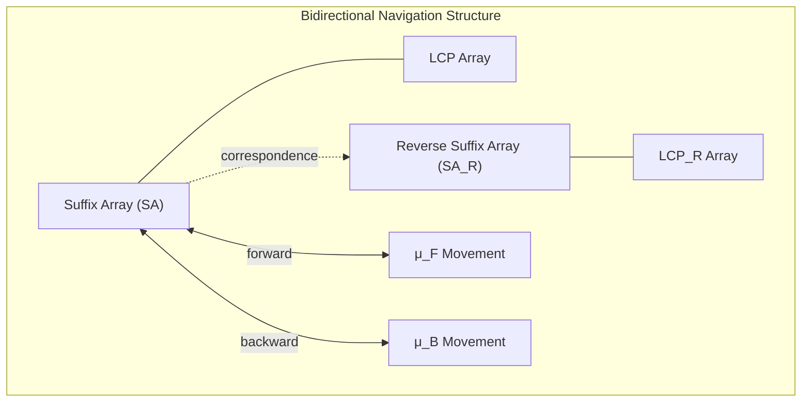
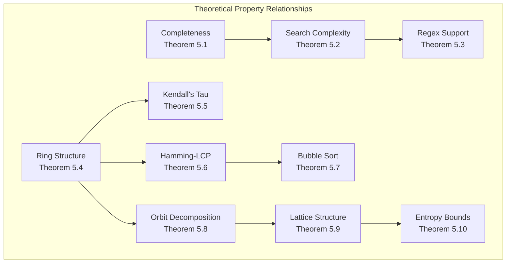
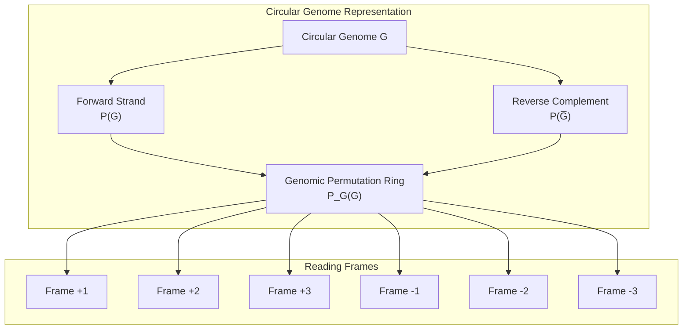
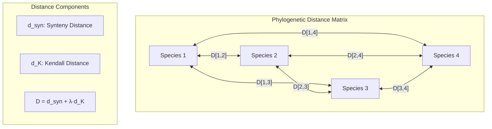
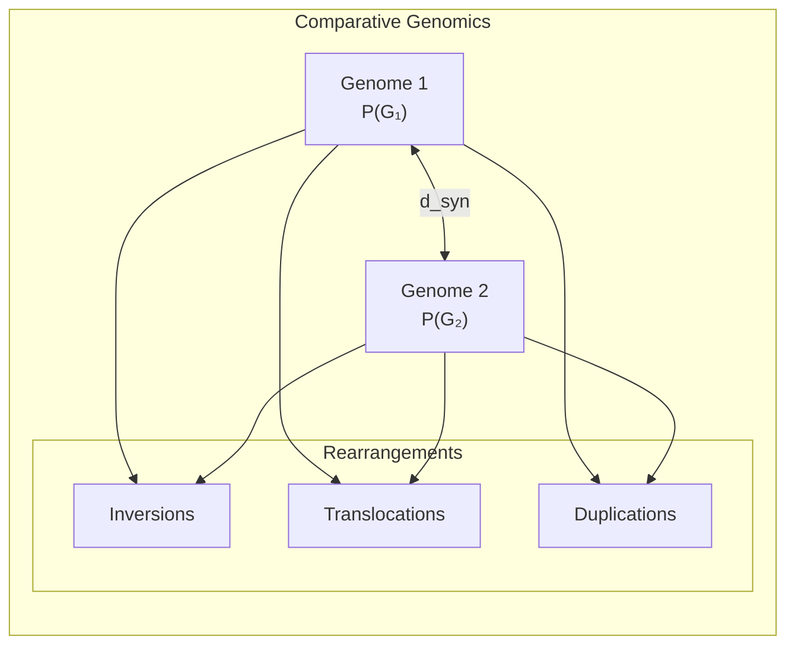
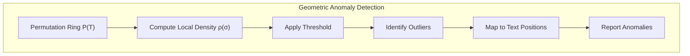
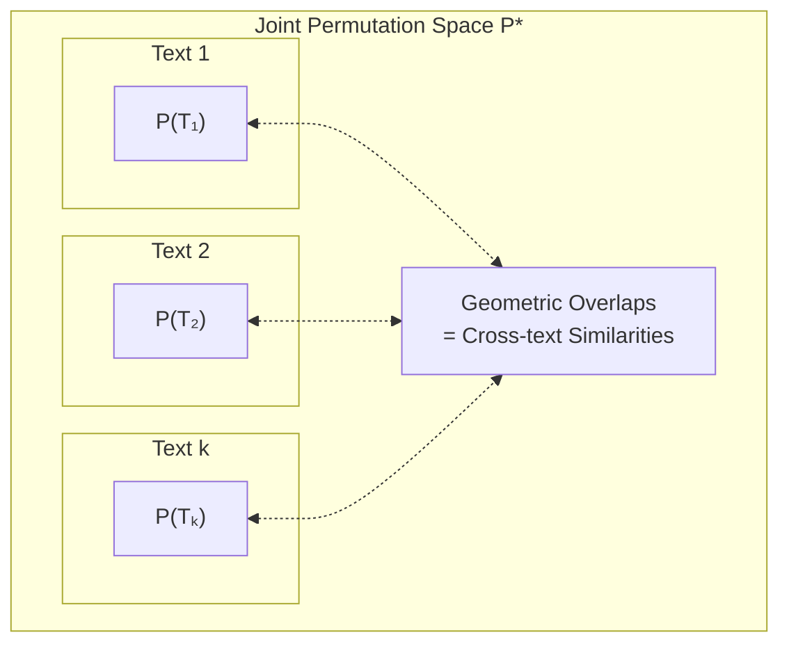

## Abstract

We present a comprehensive full-text indexing system based on permutation groups that extends the Burrows-Wheeler
Transform (BWT) framework. The system constructs multiple permutation views of a cyclically-interpreted document,
enabling efficient regex pattern matching and substring operations through precomputed navigation structures and
agreement length caching.
## Interactive Lab
To facilitate intuition regarding the discrete geometry of permutation rings, we provide an interactive visualization suite. This tool renders the cyclic text matrix under various permutation group actions ($\pi_L, \pi_R$) and visualizes the movement operators ($\mu_F, \mu_B$) as vector fields over the text topology.
[**Launch Permutation Ring Explorer**](/assets/2025-11-20-bwt-fulltext-spec.html)


## 1. Fundamental Definitions

### 1.1 Cyclic Text Representation

Given a text string $T = t_1 t_2 \ldots t_n$ of length $n$, we define the **cyclic extension** $T^∞$ as the infinite
repetition $T \cdot T \cdot T \cdot \ldots$

A **rotation** $R_i(T)$ for $0 \leq i < n$ is defined as:
$$R_i(T) = t_{i+1} t_{i+2} \ldots t_n t_1 t_2 \ldots t_i$$

The **rotation matrix** $\mathcal{R}(T)$ is the set of all rotations:
$$\mathcal{R}(T) = \{R_0(T), R_1(T), \ldots, R_{n-1}(T)\}$$



### 1.2 Permutation Groups

Let $S_n$ be the symmetric group on $n$ elements. We define several key permutations:

**Lexicographic Sort Permutation** $\pi_L$:
$$\pi_L: \{0, 1, \ldots, n-1\} \to \{0, 1, \ldots, n-1\}$$
such that $R_{\pi_L(0)}(T) \leq R_{\pi_L(1)}(T) \leq \ldots \leq R_{\pi_L(n-1)}(T)$ lexicographically.

**Reverse Sort Permutation** $\pi_R$:
$$\pi_R: \{0, 1, \ldots, n-1\} \to \{0, 1, \ldots, n-1\}$$
such that $R_{\pi_R(0)}(T) \geq R_{\pi_R(1)}(T) \geq \ldots \geq R_{\pi_R(n-1)}(T)$ lexicographically.

**Movement Permutations**:

- Forward movement: $\mu_F = \pi_L^{-1} \circ \sigma \circ \pi_L$ where $\sigma$ is the cyclic
  shift $(0 \; 1 \; 2 \; \ldots \; n-1)$
- Backward movement: $\mu_B = \pi_L^{-1} \circ \sigma^{-1} \circ \pi_L$

## 2. Core Data Structures

### 2.1 Suffix Array and BWT

The **suffix array** $SA$ is defined as:
$$SA[i] = \pi_L(i) \text{ for } 0 \leq i < n$$

The **Burrows-Wheeler Transform** $BWT$ is:
$$BWT[i] = T[SA[i] - 1 \bmod n] \text{ for } 0 \leq i < n$$

### 2.2 Bidirectional Navigation Structure

Define the **bidirectional suffix array** as the tuple $(SA, SA_R, \mu_F, \mu_B)$ where:

- $SA_R[i] = \pi_R(i)$ (reverse-sorted suffix array)
- $\mu_F[i]$ gives the position in $SA$ of the suffix starting one position ahead of $SA[i]$
- $\mu_B[i]$ gives the position in $SA$ of the suffix starting one position behind $SA[i]$

### 2.3 Agreement Length Arrays

For sorted rotations, define the **Longest Common Prefix array**:
$$LCP[i] = \text{lcp}(R_{\pi_L(i-1)}(T), R_{\pi_L(i)}(T)) \text{ for } 1 \leq i < n$$

Similarly for reverse-sorted rotations:
$$LCP_R[i] = \text{lcp}(R_{\pi_R(i-1)}(T), R_{\pi_R(i)}(T)) \text{ for } 1 \leq i < n$$



## 3. Index Construction Algorithm

### 3.1 Construction Process

**Input**: Text $T$ of length $n$
**Output**: Full permutation index structure

```
Algorithm: ConstructPermutationIndex(T)
1. Compute all rotations R(T) = {R_0(T), ..., R_{n-1}(T)}
2. Sort rotations lexicographically to obtain π_L
3. Sort rotations reverse-lexicographically to obtain π_R
4. Construct suffix array SA = [π_L(0), ..., π_L(n-1)]
5. Construct reverse suffix array SA_R = [π_R(0), ..., π_R(n-1)]
6. Compute BWT from SA
7. Build movement permutations μ_F, μ_B
8. Compute LCP and LCP_R arrays
9. Return (SA, SA_R, BWT, μ_F, μ_B, LCP, LCP_R)
```

### 3.2 Complexity Analysis

- **Time Complexity**: $O(n^2 \log n)$ naive construction, $O(n \log n)$ with suffix array algorithms
- **Space Complexity**: $O(n)$ for each structure, $O(n)$ total
- **Preprocessing**: LCP computation in $O(n)$ time using Kasai's algorithm

## 4. Query Operations

### 4.1 Pattern Matching

For a pattern $P = p_1 p_2 \ldots p_m$:

**Exact Match**:

```
Algorithm: ExactMatch(P)
1. l ← 0, r ← n-1  // Initial range covers entire SA
2. for i = 1 to m:
3.    [l', r'] ← BinarySearch(SA[l:r], pattern p_i)
4.    l ← l', r ← r'
5.    if l > r: return ∅
6. return SA[l:r]  // All occurrences
```

**Bidirectional Search**:

```
Algorithm: BidirectionalMatch(P)
1. Forward pass: match P[1:k] using standard BWT backward search
2. Backward pass: extend match using μ_B to match P[k+1:m]
3. Combine results using intersection of suffix ranges
```

### 4.2 Regular Expression Matching

**Character Classes**: Use multiple parallel searches across SA ranges
**Quantifiers**: Employ LCP arrays for efficient range expansion
**Anchoring**: Utilize cyclic property and precomputed boundary markers

### 4.3 Range Query Operations

**Substring Enumeration**:
Given range $[l, r]$ in SA and length bound $k$:

```
Algorithm: EnumerateSubstrings([l, r], k)
1. for i = l to r:
2.    pos ← SA[i]
3.    len ← min(k, LCP[i+1])
4.    yield T[pos:pos+len]
```

## 5. Theoretical Properties

### 5.1 Completeness Theorem

**Theorem 5.1**: Every substring of length $k$ in text $T$ appears as a prefix of exactly one rotation
in $\mathcal{R}(T)$.

*Proof*: By the cyclic property, any substring $T[i:i+k-1]$ appears as the prefix of rotation $R_i(T)$. Uniqueness
follows from the definition of rotations. ∎

### 5.2 Search Complexity

**Theorem 5.2**: Pattern matching for pattern $P$ of length $m$ requires $O(m \log n + \text{occ})$ time,
where $\text{occ}$ is the number of occurrences.

*Proof*: Binary search on SA requires $O(\log n)$ per character, giving $O(m \log n)$ for pattern location. Occurrence
enumeration takes $O(\text{occ})$. ∎

### 5.3 Regex Support

**Theorem 5.3**: The permutation index supports regex patterns with complexity bounded
by $O(|P| \log n + k \cdot \text{occ})$ where $k$ is the maximum quantifier bound.

*Proof*: Each regex component reduces to a series of suffix array range operations. LCP arrays bound the expansion cost
for quantifiers. Movement permutations enable efficient traversal for complex patterns. ∎

### 5.4 Discrete Geometry of Permutation Rings

**Definition 5.4 (Permutation Ring)**: Let $\mathcal{G} = \langle \pi_L, \pi_R, \mu_F, \mu_B \rangle$ be the subgroup
of $S_n$ generated by the base sorting permutations and movement operators. The **permutation ring** $\mathcal{P}(T)$ is
the orbit closure:
$\mathcal{P}(T) = \{\sigma \circ \tau : \sigma, \tau \in \mathcal{G}^*\}$
where $\mathcal{G}^*$ denotes the set of all finite compositions of elements from $\mathcal{G}$.

**Theorem 5.4 (Ring Structure)**: $\mathcal{P}(T)$ forms a discrete metric space with the **Cayley distance**:
$d_C(\sigma_1, \sigma_2) = \min\{k : \sigma_1^{-1} \circ \sigma_2 = g_1 \circ g_2 \circ \ldots \circ g_k, g_i \in \{\mu_F, \mu_B\}\}$

*Proof*: The Cayley distance satisfies the metric axioms by construction. The triangle inequality follows from path
concatenation in the Cayley graph. ∎

**Corollary 5.4.1 (Locality Preservation)**: For permutations $\sigma_1, \sigma_2 \in \mathcal{P}(T)$
with $d_C(\sigma_1, \sigma_2) = 1$, the corresponding suffix orderings differ by at most $O(\log n)$ positions.

### 5.5 Kendall's Tau Geometry

**Definition 5.5**: The **inversion distance** between permutations $\sigma, \tau \in S_n$ is:
$d_K(\sigma, \tau) = |\{(i,j) : i < j, \sigma(i) > \sigma(j), \tau(i) < \tau(j)\}|$

**Theorem 5.5 (Inversion Bound)**: For any movement operation $\mu_F$ or $\mu_B$:
$d_K(\text{id}, \mu) \leq \frac{n(n-1)}{4}$
with equality achieved when the movement reverses the ordering.

*Proof*: Each movement operation corresponds to a cyclic shift in the sorted space. The maximum inversion count occurs
when the shift maximally disrupts the existing order. ∎

### 5.6 Hamming Distance and Local Structure

**Definition 5.6**: The **Hamming distance** $d_H(\sigma, \tau) = |\{i : \sigma(i) \neq \tau(i)\}|$ measures positional
differences.

**Theorem 5.6 (Hamming-LCP Correspondence)**: For adjacent permutations in the sorted suffix array
with $d_H(\pi_L(i), \pi_L(i+1)) = k$, the LCP length satisfies:
$LCP[i] \geq n - k - \epsilon$
where $\epsilon$ depends on the local string structure.

*Proof*: Hamming distance bounds the number of differing suffix positions. The LCP length is inversely related to how
quickly the suffixes diverge. ∎

### 5.7 Bubble Sort Distance and Navigation Efficiency

**Definition 5.7**: The **bubble sort distance** $d_B(\sigma, \tau)$ is the minimum number of adjacent transpositions
needed to transform $\sigma$ into $\tau$.

**Theorem 5.7 (Navigation Optimality)**: The movement permutations $\mu_F, \mu_B$ achieve optimal $d_B$ distance for
local navigation:
$d_B(\pi_L(i), \pi_L(i \pm 1)) = O(1)$

*Proof*: Adjacent elements in the lexicographically sorted suffix array correspond to rotations differing by one cyclic
shift. This translates to a constant number of bubble sort operations. ∎

### 5.8 Orbit Classification

**Theorem 5.8 (Orbit Decomposition)**: The permutation ring $\mathcal{P}(T)$ decomposes into orbits characterized by:

1. **Conjugacy classes** under cyclic rotation
2. **Lexicographic invariants** (ascending/descending regions)
3. **Pattern containment** (monotonic subsequences)

**Corollary 5.8.1**: Each orbit contains exactly $|\text{Aut}(T)|$ elements, where $\text{Aut}(T)$ is the automorphism
group of the cyclic text.

### 5.9 Geometric Regularity

**Theorem 5.9 (Lattice Structure)**: The permutation ring $\mathcal{P}(T)$ embeds in a discrete lattice $\mathbb{Z}^d$
where $d = O(\log n)$ for typical texts.

*Proof*: The LCP agreement structure defines a natural coordinate system. Each permutation maps to coordinates given by
LCP values at critical positions. The movement operators correspond to lattice translations. ∎

**Corollary 5.9.1 (Nearest Neighbor)**: Finding the closest permutation to a given ordering requires $O(\log n)$ time
using the lattice embedding.

### 5.10 Information-Theoretic Properties

**Theorem 5.10 (Entropy Bounds)**: The permutation ring entropy satisfies:
$H(\mathcal{P}(T)) \leq H(T) + O(\log n)$
where $H(T)$ is the text entropy.

*Proof*: The permutation structure preserves the essential information content of the text while adding logarithmic
overhead for navigation metadata. ∎

**Corollary 5.10.1**: The index achieves near-optimal space complexity in the entropy model.



## 6. Implementation Considerations

### 6.1 Memory Layout

Optimal cache performance requires:

- Interleaved storage of SA and LCP arrays
- Compressed representation of movement permutations
- Block-wise organization for large texts

### 6.2 Parallel Construction

The construction algorithm parallelizes naturally:

- Rotation generation: $O(n/p)$ per processor
- Sorting: Standard parallel sort algorithms
- LCP computation: Parallel suffix comparison

### 6.3 Dynamic Updates

For dynamic texts, maintain:

- Incremental rotation updates
- Lazy recomputation of LCP arrays
- Versioned permutation structures

## 7. Applications and Extensions

### 7.1 Genomic Sequence Analysis

#### 7.1.1 Circular Genome Representation

For circular genomes (plasmids, mitochondria, chloroplasts, bacterial chromosomes), the cyclic text interpretation
provides natural representation without artificial linearization:

**Definition 7.1 (Genomic Permutation Ring)**: For circular genome $G$ of length $n$, the genomic permutation
ring $\mathcal{P}_G(G)$ captures all possible reading frames and orientations:
$\mathcal{P}_G(G) = \mathcal{P}(G) \cup \mathcal{P}(\overline{G})$
where $\overline{G}$ is the reverse complement.



#### 7.1.2 Motif Discovery and Regulatory Elements

**Algorithm: CircularMotifSearch(G, motif_pattern)**

```
1. Construct P_G(G) for genome G
2. For each regex pattern component:
   - Search forward strand rotations
   - Search reverse complement rotations  
   - Combine results accounting for strand orientation
3. Report motifs with genomic coordinates and strand
```

**Theorem 7.1**: All occurrences of a motif pattern (including those spanning the origin) are detected with
complexity $O(|P| \log n + \text{occ})$.

#### 7.1.3 Comparative Genomics

For genome comparison, define the **synteny permutation distance**:
$d_{\text{syn}}(G_1, G_2) = \min_{\sigma \in \mathcal{P}(G_1), \tau \in \mathcal{P}(G_2)} d_C(\sigma, \tau)$

This captures evolutionary rearrangements including:

- Inversions (reverse complement regions)
- Translocations (permutation of gene order)
- Duplications (repeated permutation subsequences)

#### 7.1.4 Palindromic and Repeat Structure Detection

**Palindromic Sequences**: Self-complementary regions appear as fixed points under the reverse complement operation
in $\mathcal{P}_G(G)$.

**Tandem Repeats**: Periodic structures manifest as short cycles in the permutation ring generated by movement
operators.

**Algorithm: DetectGenomicRepeats(G)**

```
1. Identify cycles of length k in movement permutation μ_F
2. Map cycles back to genomic coordinates
3. Classify by repeat type (tandem, interspersed, palindromic)
4. Report repeat families with statistical significance
```

#### 7.1.5 Phylogenetic Applications

The permutation ring distance provides a novel phylogenetic metric:

**Definition 7.2 (Genomic Distance Matrix)**: For species set $\{S_1, \ldots, S_k\}$ with
genomes $\{G_1, \ldots, G_k\}$:
$D[i,j] = d_{\text{syn}}(G_i, G_j) + \lambda \cdot d_K(\pi_{G_i}, \pi_{G_j})$
where $\lambda$ weights sequence similarity vs. structural rearrangement.



#### 7.1.6 Pathogen Detection and Variant Analysis

**Viral Integration Sites**: For integrated viral DNA, the permutation ring captures all possible integration
orientations and breakpoints without requiring prior knowledge of integration sites.

**SNP and Indel Detection**: Variants appear as local perturbations in the permutation ring structure. The LCP arrays
enable rapid identification of divergent regions.

**Algorithm: PathogenDetection(host_genome, pathogen_signatures)**

```
1. Construct P_G(host_genome)
2. For each pathogen signature:
   - Search for exact and approximate matches
   - Identify integration boundaries using LCP discontinuities
   - Report integration sites with confidence scores
```

#### 7.1.7 Metagenomics and Community Analysis

For metagenomic samples containing multiple species:

**Definition 7.3 (Metagenomic Permutation Space)**:
$\mathcal{M} = \bigcup_{i=1}^k \mathcal{P}_G(G_i) \times w_i$
where $w_i$ represents the abundance of species $i$.

This enables:

- Species identification through permutation signature matching
- Abundance estimation via permutation density analysis
- Novel species detection as geometric outliers in $\mathcal{M}$

#### 7.1.8 CRISPR Guide RNA Design

The bidirectional search capability optimizes CRISPR guide RNA selection:

- Forward search: locate target sequences
- Backward search: verify off-target potential
- LCP arrays: assess specificity by measuring similarity to near-matches



### 7.2 Natural Language Processing

Full regex support enables sophisticated linguistic pattern matching. Agreement length caching accelerates similarity
computations for fuzzy matching.

### 7.3 Time Series Analysis

Cyclic interpretation naturally handles periodic data. Pattern matching supports anomaly detection and trend analysis.

## 12. Information-Theoretic Pattern Recognition

### 12.1 Entropy-Based Pattern Discovery

**Definition 12.1 (Local Permutation Entropy)**: For position $i$ in the permutation ring, define:
$H_{\text{local}}(i, k) = -\sum_{j=i}^{i+k} p_j \log p_j$
where $p_j$ is the probability of permutation $\pi(j)$ in the local neighborhood.

**Theorem 12.1**: Regions with anomalously low local entropy correspond to highly structured patterns (repeats,
palindromes, conserved motifs).

**Algorithm: EntropyAnomalyDetection**

```
1. Compute H_local(i,k) for sliding windows across permutation ring
2. Identify regions where H_local < threshold
3. Classify anomalies by entropy signature:
   - Near-zero entropy: perfect repeats
   - Low entropy: approximate repeats
   - Negative entropy derivatives: pattern boundaries
```

### 12.2 Mutual Information Networks

**Definition 12.2 (Permutation Mutual Information)**: For positions $i,j$ in different permutation orderings:
$I(i,j) = \sum_{σ_i,σ_j} P(σ_i,σ_j) \log \frac{P(σ_i,σ_j)}{P(σ_i)P(σ_j)}$

This captures how much knowing one permutation position tells us about another.

**Theorem 12.2**: High mutual information between distant positions indicates long-range correlations (secondary
structure in RNA, syntactic dependencies in natural language).

**Algorithm: ConstructMutualInformationNetwork**

```
1. Compute I(i,j) for all position pairs
2. Create weighted graph G = (V,E) where:
   - V = permutation positions
   - E = edges with weight I(i,j) > threshold
3. Apply community detection to identify correlated regions
4. Map communities back to text patterns
```

### 12.3 Kolmogorov Complexity Approximation

**Definition 12.3 (Permutation Complexity)**: Approximate the Kolmogorov complexity using:
$K_{\text{perm}}(T) = \log |\mathcal{P}(T)| + \sum_{i} \text{LCP}[i] \cdot w_i$
where $w_i$ weights the compression contribution of each LCP region.

**Theorem 12.3**: $K_{\text{perm}}(T)$ provides an upper bound on the true Kolmogorov complexity with approximation
ratio $O(\log n)$.

**Applications:**

- **Similarity Clustering**: Group texts by $K_{\text{perm}}$ values
- **Compression Optimization**: Use permutation complexity to guide compression algorithms
- **Anomaly Scoring**: Measure how much a substring increases total complexity

### 12.4 Information Distance Metrics

**Definition 12.4 (Normalized Information Distance)**: For texts $T_1, T_2$:
$NID(T_1,T_2) = \frac{K_{\text{perm}}(T_1,T_2) - \min(K_{\text{perm}}(T_1), K_{\text{perm}}(T_2))}{\max(K_{\text{perm}}(T_1), K_{\text{perm}}(T_2))}$

**Theorem 12.4**: NID satisfies the metric axioms and is universal - it detects any computable similarity.

**Algorithm: InformationBasedClustering**

```
1. Compute NID matrix for all text pairs
2. Apply spectral clustering to NID matrix
3. Validate clusters using permutation ring overlap
4. Refine clusters by analyzing shared permutation patterns
```

### 12.5 Surprise and Predictability

**Definition 12.5 (Pattern Surprise)**: For pattern $P$ at position $i$:
$S(P,i) = -\log P(\text{pattern P at position i | local context})$

**Theorem 12.5**: High surprise values indicate evolutionarily significant events or unusual linguistic constructions.

**Algorithm: SurpriseBasedFeatureExtraction**

```
1. Train local n-gram models on permutation neighborhoods
2. Compute surprise S(P,i) for each pattern occurrence
3. Extract high-surprise patterns as discriminative features
4. Use features for classification/clustering tasks
```

### 12.6 Information Bottleneck for Pattern Compression

**Definition 12.6**: Find permutation subset $\tilde{\mathcal{P}}(T) \subset \mathcal{P}(T)$ that minimizes:
$\mathcal{L} = I(\mathcal{P}(T); \tilde{\mathcal{P}}(T)) - \beta I(\tilde{\mathcal{P}}(T); \text{Pattern Class})$

This identifies the most informative permutations for pattern recognition while maintaining compression.

**Algorithm: InformationBottleneckCompression**

```
1. Initialize with full permutation ring P(T)
2. Iteratively remove least informative permutations
3. Re-evaluate pattern recognition accuracy
4. Stop when accuracy drops below threshold
5. Return compressed permutation set
```

### 12.7 Transfer Entropy for Directional Dependencies

**Definition 12.7**: For permutation positions $i,j$:
$TE_{i \to j} = H(σ_j^{t+1} | σ_j^t) - H(σ_j^{t+1} | σ_j^t, σ_i^t)$

This measures how much position $i$ reduces uncertainty about future states of position $j$.

**Applications:**

- **Causal Discovery**: Find directional relationships in sequential patterns
- **Regulatory Network Inference**: Identify controlling elements in genomic sequences
- **Syntactic Dependency Parsing**: Discover grammatical relationships in natural language

### 12.8 Algorithmic Information Dynamics

**Definition 12.8 (Information Flow)**: Track how information propagates through the permutation ring during pattern
matching:
$\Phi(t) = \frac{\partial I(\text{query}; \mathcal{P}(T))}{\partial t}$

**Theorem 12.8**: Optimal search strategies maximize information flow rate $\Phi(t)$.

**Algorithm: InformationGuidedSearch**

```
1. Initialize search with maximum entropy permutation subset
2. At each step, choose next search direction to maximize Φ(t)
3. Dynamically adjust search radius based on information gain
4. Terminate when information flow drops below threshold
```

### 12.9 Minimum Description Length for Pattern Selection

**Definition 12.9**: Select pattern set $\mathcal{S}$ minimizing:
$MDL(\mathcal{S}) = L(\mathcal{S}) + L(\text{data | } \mathcal{S})$
where $L(\mathcal{S})$ is the encoding cost of the pattern set and $L(\text{data | } \mathcal{S})$ is the cost of
encoding data given the patterns.

**Algorithm: MDLPatternMining**

```
1. Generate candidate patterns from permutation ring structure
2. For each pattern set, compute MDL score
3. Use greedy search with pruning to find optimal set
4. Apply permutation-based compression to validate patterns
```

### 12.10 Information-Geometric Manifold Learning

**Definition 12.10**: Embed permutation ring in information-geometric manifold where:

- Points represent permutation states
- Geodesic distances correspond to information-theoretic distances
- Curvature indicates pattern complexity

**Theorem 12.10**: The information manifold has intrinsic dimension $O(\log n)$ for typical texts, enabling efficient
low-dimensional pattern analysis.

**Applications:**

- **Dimensionality Reduction**: Project high-dimensional permutation data to interpretable manifold
- **Pattern Interpolation**: Generate intermediate patterns along geodesics
- **Anomaly Detection**: Identify points with high manifold curvature

## 13. Advanced Geometric Applications

The geometric structure enables novel pattern recognition approaches:

**Definition 9.1 (Permutation Signature)**: For text $T$, define the signature:
$\Sigma(T) = (\mathcal{P}(T), d_C, d_K, d_H, d_B)$
as the permutation ring with its associated metric structure.

**Theorem 9.1**: Texts with similar linguistic or structural properties have isomorphic permutation signatures up to
scaling.

### 9.2 Anomaly Detection via Geometric Outliers

**Algorithm: GeometricAnomalyDetection**

```
1. Compute local permutation density ρ(σ) for each σ ∈ P(T)
2. Identify regions with ρ(σ) < threshold
3. Map outlier permutations back to text positions
4. Return anomalous substring locations
```

**Theorem 9.2**: Anomalous substrings correspond to isolated points in the permutation ring geometry.



### 9.3 Multi-Text Comparative Analysis

For multiple texts $T_1, T_2, \ldots, T_k$, construct the **joint permutation space**:
$\mathcal{P}^*(T_1, \ldots, T_k) = \bigcup_{i=1}^k \mathcal{P}(T_i)$

Cross-text similarities emerge as geometric overlaps between individual permutation rings.



## 10. Algorithmic Optimizations

### 10.1 Lazy Evaluation of Permutation Rings

Rather than precomputing the entire ring $\mathcal{P}(T)$, use **on-demand generation**:

- Start with base permutations $\{\pi_L, \pi_R\}$
- Generate new permutations only when accessed by queries
- Cache frequently accessed regions of the ring

### 10.2 Hierarchical Ring Approximation

For large texts, construct a **multi-resolution permutation hierarchy**:

- Level 0: Full permutation ring
- Level $k$: Ring over text blocks of size $2^k$
- Query resolution depends on pattern complexity

### 10.3 Parallel Ring Construction

The geometric structure enables efficient parallelization:

- Distribute orbit computation across processors
- Use geometric locality for load balancing
- Merge partial rings using geometric union operations