# Software Design Document: Voice-Centric Software Development and Data Science Agent

**System:** A sophisticated AI agent system that leverages voice interfaces to facilitate software development and data
science workflows. The system enables developers and data scientists to interact through natural language voice commands
to design architectures, write code, analyze data, manage projects, and collaborate on technical tasks. The agent
integrates with development tools, data science platforms, and project management systems to provide a seamless
voice-driven development experience.

**Generated:** 2025-11-26 13:36:55

---

## Use Cases & Actors

# Voice-Centric Software Development and Data Science Agent

## Comprehensive Use Case Documentation

---

## 1. ACTOR IDENTIFICATION

### 1.1 Primary Actors

#### Actor: Software Developer (DEV)

**Role:** Primary user who develops software applications using voice commands
**Goals:**

- Design software architectures through voice interaction
- Write, review, and refactor code efficiently
- Manage version control operations
- Debug applications with voice assistance
- Collaborate with team members on code

**Characteristics:**

- Proficiency in multiple programming languages
- Familiar with development tools and IDEs
- Requires low-latency voice processing
- Works across multiple projects simultaneously

---

#### Actor: Data Scientist (DS)

**Role:** Analyzes data and builds machine learning models using voice interface
**Goals:**

- Explore and analyze datasets through voice commands
- Build and train machine learning models
- Visualize data insights
- Manage data pipelines
- Document analysis findings

**Characteristics:**

- Expertise in statistical analysis and ML frameworks
- Works with large datasets
- Requires integration with Jupyter notebooks and data tools
- Needs reproducible analysis workflows

---

#### Actor: Project Manager (PM)

**Role:** Oversees project execution and team coordination
**Goals:**

- Track project progress and milestones
- Manage team assignments and workload
- Monitor project risks and issues
- Generate project reports
- Facilitate team communication

**Characteristics:**

- Non-technical or semi-technical background
- Requires high-level project visibility
- Needs real-time status updates
- Focuses on timeline and resource management

---

#### Actor: DevOps Engineer (DEVOPS)

**Role:** Manages infrastructure, deployment, and system operations
**Goals:**

- Deploy applications to various environments
- Monitor system performance and health
- Manage CI/CD pipelines
- Configure infrastructure as code
- Handle incident response

**Characteristics:**

- Deep infrastructure and automation knowledge
- Requires integration with deployment tools
- Needs real-time monitoring capabilities
- Focuses on system reliability and performance

---

#### Actor: Technical Architect (ARCH)

**Role:** Designs system architecture and technical solutions
**Goals:**

- Design scalable system architectures
- Define technical standards and best practices
- Review architectural decisions
- Mentor development teams
- Evaluate technology choices

**Characteristics:**

- Extensive technical experience
- Requires high-level system design capabilities
- Needs access to architectural documentation
- Focuses on long-term technical strategy

---

#### Actor: Security Officer (SEC)

**Role:** Ensures security compliance and data protection
**Goals:**

- Audit code for security vulnerabilities
- Manage access control and permissions
- Monitor security incidents
- Ensure compliance with regulations
- Review security policies

**Characteristics:**

- Security and compliance expertise
- Requires audit trail access
- Needs integration with security tools
- Focuses on risk mitigation

---

### 1.2 Secondary Actors (External Systems)

#### External System: IDE Integration Service (IDE-SVC)

**Role:** Provides integration with development environments
**Responsibilities:**

- Receive code generation requests
- Execute code snippets
- Provide IDE state information
- Manage file operations

---

#### External System: Git Repository Service (GIT-SVC)

**Role:** Manages version control operations
**Responsibilities:**

- Handle commit, push, pull operations
- Manage branches and merge requests
- Provide repository information
- Track change history

---

#### External System: Jupyter Notebook Service (JUPYTER-SVC)

**Role:** Manages data science notebooks
**Responsibilities:**

- Execute notebook cells
- Manage notebook state
- Generate visualizations
- Export analysis results

---

#### External System: CI/CD Pipeline Service (CICD-SVC)

**Role:** Manages continuous integration and deployment
**Responsibilities:**

- Trigger build pipelines
- Execute tests
- Deploy applications
- Provide pipeline status

---

#### External System: Monitoring and Analytics Service (MONITOR-SVC)

**Role:** Provides system monitoring and analytics
**Responsibilities:**

- Collect performance metrics
- Generate alerts
- Provide system health status
- Track resource utilization

---

#### External System: Authentication Service (AUTH-SVC)

**Role:** Manages user authentication and authorization
**Responsibilities:**

- Authenticate users
- Manage access tokens
- Enforce permission policies
- Audit access logs

---

#### External System: Voice Processing Engine (VOICE-ENGINE)

**Role:** Processes voice input and generates voice output
**Responsibilities:**

- Convert speech to text (STT)
- Convert text to speech (TTS)
- Perform voice recognition
- Handle voice quality optimization

---

#### External System: Natural Language Processing Service (NLP-SVC)

**Role:** Processes and understands natural language commands
**Responsibilities:**

- Parse voice commands
- Extract intent and entities
- Resolve ambiguities
- Generate contextual responses

---

#### External System: Project Management Service (PM-SVC)

**Role:** Manages project data and workflows
**Responsibilities:**

- Store project information
- Manage tasks and assignments
- Track milestones
- Generate reports

---

#### External System: Data Storage Service (STORAGE-SVC)

**Role:** Manages persistent data storage
**Responsibilities:**

- Store user data and preferences
- Manage file storage
- Provide data retrieval
- Handle backup and recovery

---

### 1.3 Actor Relationships

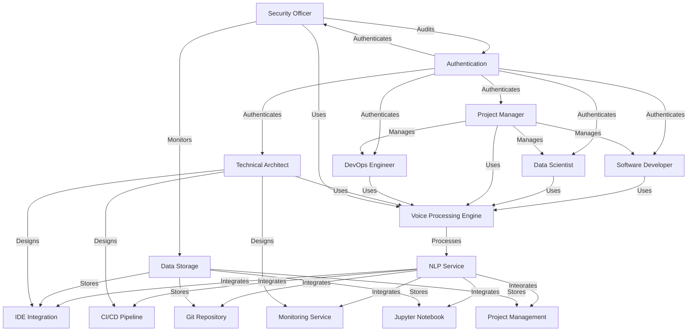

---

## 2. USE CASE CATALOG

### UC-001: Process Voice Command

**UC-ID:** UC-001  
**Name:** Process Voice Command  
**Primary Actor:** Software Developer, Data Scientist, Project Manager, DevOps Engineer, Technical Architect, Security
Officer  
**Secondary Actors:** Voice Processing Engine, NLP Service, Authentication Service

**Preconditions:**

- User is authenticated and authorized
- Voice processing engine is operational
- NLP service is available
- User has active voice session

**Main Success Scenario:**

1. User initiates voice command by pressing voice activation button or saying wake word
2. Voice Processing Engine captures audio stream
3. Voice Processing Engine converts speech to text (STT) with >95% accuracy
4. NLP Service receives transcribed text
5. NLP Service parses command and extracts intent and entities
6. NLP Service validates command syntax and context
7. NLP Service routes command to appropriate handler service
8. Handler service executes command
9. System generates response
10. Voice Processing Engine converts response to speech (TTS)
11. System plays audio response to user
12. System logs command execution for audit trail

**Alternative Flows:**

**AF-001-A: Speech Recognition Failure**

- At step 3: If STT accuracy is <80%
    - 3a. Voice Processing Engine requests user to repeat command
    - 3b. User repeats command
    - 3c. Resume from step 3

**AF-001-B: Intent Ambiguity**

- At step 5: If NLP Service cannot determine intent with >85% confidence
    - 5a. NLP Service generates clarification question
    - 5b. System plays clarification question to user
    - 5c. User provides clarification
    - 5d. NLP Service re-analyzes command with additional context
    - 5e. Resume from step 6

**AF-001-C: Command Validation Failure**

- At step 6: If command syntax is invalid
    - 6a. NLP Service generates error message with suggestions
    - 6b. System plays error message to user
    - 6c. User can retry or cancel
    - 6d. If retry: Resume from step 1; If cancel: End use case

**AF-001-D: Service Unavailability**

- At step 7: If handler service is unavailable
    - 7a. System generates error message
    - 7b. System suggests alternative actions or retry time
    - 7c. System plays message to user
    - 7d. End use case

**AF-001-E: Authentication Failure**

- At precondition: If user is not authenticated
    - Pre-a. System requests authentication
    - Pre-b. User provides credentials
    - Pre-c. Authentication Service validates credentials
    - Pre-d. If valid: Continue with main flow; If invalid: Deny access

**Postconditions:**

- Command execution is logged
- User receives response (audio or visual)
- System state is updated if applicable
- Audit trail is recorded

**Business Rules:**

- BR-001: All voice commands must be processed within 500ms latency
- BR-002: Voice command accuracy must be ≥95%
- BR-003: All commands must be authenticated and authorized
- BR-004: Command execution must be logged for audit purposes
- BR-005: System must support context-aware command processing
- BR-006: Voice responses must be generated within 1 second
- BR-007: System must handle concurrent voice sessions from multiple users

**Traceability:**

- Relates to: FR-001, FR-002, FR-003, NFR-001, NFR-002

---

### UC-002: Design Software Architecture

**UC-ID:** UC-002  
**Name:** Design Software Architecture  
**Primary Actor:** Technical Architect, Software Developer  
**Secondary Actors:** IDE Integration Service, NLP Service, Data Storage Service

**Preconditions:**

- User is authenticated as Technical Architect or Senior Developer
- Project context is established
- Architecture design tools are available
- User has appropriate permissions

**Main Success Scenario:**

1. User initiates architecture design session with voice command
2. System loads project context and existing architecture
3. User describes architectural requirements through voice
4. NLP Service extracts architectural components and relationships
5. System generates architecture diagram based on requirements
6. System displays diagram to user for review
7. User provides feedback or modifications through voice commands
8. System updates architecture diagram
9. User requests architecture documentation generation
10. System generates comprehensive architecture documentation
11. System stores architecture design in repository
12. System notifies team members of architecture update

**Alternative Flows:**

**AF-002-A: Architecture Validation Failure**

- At step 5: If generated architecture violates design principles
    - 5a. System identifies violations and explains issues
    - 5b. System suggests improvements
    - 5c. User can accept suggestions or modify manually
    - 5d. Resume from step 5

**AF-002-B: Complexity Threshold Exceeded**

- At step 4: If architecture complexity exceeds threshold
    - 4a. System suggests decomposition strategies
    - 4b. User can accept suggestions or continue
    - 4c. Resume from step 5

**AF-002-C: Conflicting Requirements**

- At step 3: If user provides conflicting requirements
    - 3a. System identifies conflicts
    - 3b. System requests clarification
    - 3c. User resolves conflicts
    - 3d. Resume from step 4

**Postconditions:**

- Architecture design is documented
- Architecture diagram is generated and stored
- Team members are notified
- Architecture is available for implementation
- Design decisions are recorded

**Business Rules:**

- BR-008: Architecture must follow organizational standards
- BR-009: Architecture must support scalability requirements
- BR-010: Architecture must include security considerations
- BR-011: Architecture documentation must be auto-generated
- BR-012: Architecture changes must be version controlled
- BR-013: Architecture must be reviewed by Technical Architect

**Traceability:**

- Relates to: FR-004, FR-005, NFR-003, NFR-004

---

### UC-003: Generate Code

**UC-ID:** UC-003  
**Name:** Generate Code  
**Primary Actor:** Software Developer  
**Secondary Actors:** IDE Integration Service, NLP Service, Git Repository Service

**Preconditions:**

- User is authenticated as Software Developer
- Project is selected
- IDE is connected and ready
- Code generation templates are available
- User has write permissions to repository

**Main Success Scenario:**

1. User initiates code generation with voice command
2. User specifies code requirements through natural language
3. NLP Service extracts code specifications (language, framework, patterns)
4. System retrieves relevant code templates and examples
5. System generates code based on specifications
6. System displays generated code to user for review
7. User reviews code and provides feedback
8. System refines code based on feedback
9. User approves generated code
10. System inserts code into IDE at specified location
11. System formats code according to project standards
12. System commits code to Git repository with auto-generated message
13. System notifies team of code generation

**Alternative Flows:**

**AF-003-A: Code Quality Issues**

- At step 5: If generated code has quality issues
    - 5a. System identifies issues (complexity, security, performance)
    - 5b. System suggests improvements
    - 5c. User can accept suggestions or modify
    - 5d. Resume from step 5

**AF-003-B: Specification Ambiguity**

- At step 2: If user specifications are ambiguous
    - 2a. System asks clarifying questions
    - 2b. User provides clarifications
    - 2c. Resume from step 3

**AF-003-C: Template Not Found**

- At step 4: If no suitable template exists
    - 4a. System uses generic code generation
    - 4b. System generates base code structure
    - 4c. Resume from step 5

**AF-003-D: Code Conflict**

- At step 10: If generated code conflicts with existing code
    - 10a. System identifies conflicts
    - 10b. System suggests merge strategies
    - 10c. User resolves conflicts
    - 10d. Resume from step 10

**Postconditions:**

- Code is generated and inserted into IDE
- Code is committed to repository
- Code follows project standards
- Team is notified of code generation
- Code is ready for testing

**Business Rules:**

- BR-014: Generated code must pass linting checks
- BR-015: Generated code must follow project coding standards
- BR-016: Generated code must include appropriate comments
- BR-017: Code generation must support multiple programming languages
- BR-018: Generated code must be version controlled
- BR-019: Code generation must include security best practices

**Traceability:**

- Relates to: FR-006, FR-007, NFR-005, NFR-006

---

### UC-004: Analyze Data

**UC-ID:** UC-004  
**Name:** Analyze Data  
**Primary Actor:** Data Scientist  
**Secondary Actors:** Jupyter Notebook Service, NLP Service, Data Storage Service

**Preconditions:**

- User is authenticated as Data Scientist
- Dataset is available and accessible
- Jupyter notebook environment is ready
- Data analysis libraries are installed
- User has read permissions to dataset

**Main Success Scenario:**

1. User initiates data analysis session with voice command
2. User specifies dataset and analysis objectives through voice
3. NLP Service extracts analysis requirements (metrics, visualizations, models)
4. System loads dataset into Jupyter notebook
5. System generates exploratory data analysis (EDA) code
6. System executes EDA code and generates visualizations
7. System displays analysis results to user
8. User requests additional analysis through voice commands
9. System generates and executes analysis code
10. System displays results and insights
11. User requests statistical tests or model building
12. System generates and executes model code
13. System displays model results and performance metrics
14. User exports analysis results and documentation
15. System stores analysis notebook and results

**Alternative Flows:**

**AF-004-A: Data Quality Issues**

- At step 4: If dataset has quality issues
    - 4a. System identifies missing values, outliers, inconsistencies
    - 4b. System suggests data cleaning strategies
    - 4c. User can accept suggestions or specify custom cleaning
    - 4d. System applies data cleaning
    - 4e. Resume from step 5

**AF-004-B: Analysis Failure**

- At step 9: If analysis code execution fails
    - 9a. System identifies error and provides explanation
    - 9b. System suggests alternative approaches
    - 9c. User can accept suggestions or modify analysis
    - 9d. Resume from step 9

**AF-004-C: Insufficient Data**

- At step 4: If dataset is too small for analysis
    - 4a. System identifies data insufficiency
    - 4b. System suggests data augmentation or alternative approaches
    - 4c. User can proceed with alternative approach or cancel
    - 4d. Resume from step 5 or end use case

**AF-004-D: Model Training Timeout**

- At step 12: If model training exceeds time limit
    - 12a. System stops training and provides partial results
    - 12b. System suggests simplified model or parameter adjustment
    - 12c. User can accept suggestions or modify parameters
    - 12d. Resume from step 12

**Postconditions:**

- Data analysis is completed
- Visualizations and insights are generated
- Analysis notebook is saved
- Results are documented
- Findings are available for presentation

**Business Rules:**

- BR-020: Data analysis must handle missing values appropriately
- BR-021: Analysis must include statistical significance testing
- BR-022: Visualizations must be publication-ready
- BR-023: Analysis code must be reproducible
- BR-024: Analysis results must be version controlled
- BR-025: Data privacy must be maintained during analysis

**Traceability:**

- Relates to: FR-008, FR-009, NFR-007, NFR-008

---

### UC-005: Manage Version Control

**UC-ID:** UC-005  
**Name:** Manage Version Control  
**Primary Actor:** Software Developer, DevOps Engineer  
**Secondary Actors:** Git Repository Service, NLP Service, CI/CD Pipeline Service

**Preconditions:**

- User is authenticated
- Git repository is initialized
- User has appropriate Git permissions
- Local repository is synchronized

**Main Success Scenario:**

1. User initiates version control operation with voice command
2. User specifies operation (commit, push, pull, branch, merge) through voice
3. NLP Service extracts version control parameters
4. System validates operation feasibility
5. For commit operation:
    - 5a. System stages specified files
    - 5b. System generates commit message based on changes
    - 5c. User reviews and approves commit message
    - 5d. System commits changes to local repository
6. For push operation:
    - 6a. System verifies local changes are committed
    - 6b. System pushes changes to remote repository
    - 6c. System triggers CI/CD pipeline if configured
7. For pull operation:
    - 7a. System fetches changes from remote repository
    - 7b. System merges changes into local branch
    - 7c. System resolves conflicts if necessary
8. For branch operation:
    - 8a. System creates or switches to specified branch
    - 8b. System updates local workspace
9. For merge operation:
    - 9a. System merges specified branch into current branch
    - 9b. System handles merge conflicts
10. System notifies user of operation completion
11. System logs version control operation

**Alternative Flows:**

**AF-005-A: Merge Conflict**

- At step 7c or 9b: If merge conflicts occur
    - a. System identifies conflicting files
    - b. System displays conflict details to user
    - c. User specifies conflict resolution strategy
    - d. System applies resolution
    - e. Resume from step 10

**AF-005-B: Permission Denied**

- At step 4: If user lacks required permissions
    - 4a. System denies operation
    - 4b. System explains permission requirements
    - 4c. End use case

**AF-005-C: Repository Sync Required**

- At step 6b: If remote repository has newer changes
    - 6b-i. System requests pull before push
    - 6b-ii. User initiates pull operation
    - 6b-iii. Resume from step 7

**AF-005-D: Branch Protection Violation**

- At step 6b: If branch is protected
    - 6b-i. System requires pull request
    - 6b-ii. System creates pull request
    - 6b-iii. System notifies reviewers
    - 6b-iv. End use case (awaiting review)

**Postconditions:**

- Version control operation is completed
- Repository is updated
- CI/CD pipeline is triggered if applicable
- Team is notified of changes
- Operation is logged for audit

**Business Rules:**

- BR-026: All commits must include descriptive messages
- BR-027: Commits must reference issue tracking system
- BR-028: Protected branches require pull request review
- BR-029: Merge conflicts must be resolved before completion
- BR-030: Version control operations must be logged
- BR-031: Sensitive data must not be committed

**Traceability:**

- Relates to: FR-010, FR-011, NFR-009, NFR-010

---

### UC-006: Debug Application

**UC-ID:** UC-006  
**Name:** Debug Application  
**Primary Actor:** Software Developer  
**Secondary Actors:** IDE Integration Service, NLP Service, Monitoring Service

**Preconditions:**

- User is authenticated as Software Developer
- Application is running or debuggable
- IDE debugger is available
- User has debug permissions
- Error or issue is identified

**Main Success Scenario:**

1. User initiates debugging session with voice command
2. User describes issue or error through voice
3. NLP Service extracts issue details (error message, location, symptoms)
4. System retrieves relevant logs and stack traces
5. System analyzes error and suggests potential causes
6. System displays error analysis to user
7. User requests specific debugging action (set breakpoint, inspect variable, step through code)
8. System executes debugging action
9. System displays debugging results
10. User continues debugging with additional commands
11. User identifies root cause
12. User requests code fix suggestion
13. System generates fix based on root cause analysis
14. User reviews and approves fix
15. System applies fix to code
16. System re-runs application to verify fix
17. System confirms issue resolution

**Alternative Flows:**

**AF-006-A: Root Cause Not Found**

- At step 11: If root cause cannot be identified
    - 11a. System suggests additional debugging steps
    - 11b. System suggests consulting documentation or team
    - 11c. User can continue debugging or escalate
    - 11d. Resume from step 7 or end use case

**AF-006-B: Breakpoint Not Set**

- At step 8: If breakpoint cannot be set
    - 8a. System explains why breakpoint cannot be set
    - 8b. System suggests alternative debugging approach
    - 8c. User can accept suggestion or try different location
    - 8d. Resume from step 8

**AF-006-C: Variable Inspection Fails**

- At step 8: If variable cannot be inspected
    - 8a. System explains variable scope or availability issue
    - 8b. System suggests alternative inspection methods
    - 8c. User can accept suggestion or continue
    - 8d. Resume from step 8

**AF-006-D: Fix Verification Fails**

- At step 16: If fix does not resolve issue
    - 16a. System indicates issue persists
    - 16b. System suggests additional debugging
    - 16c. User can continue debugging or revert fix
    - 16d. Resume from step 7 or revert and end use case

**Postconditions:**

- Issue is identified and documented
- Root cause is determined
- Fix is applied and verified
- Application is functioning correctly
- Debugging session is logged

**Business Rules:**

- BR-032: Debugging must not affect production systems
- BR-033: Breakpoints must be cleared after debugging
- BR-034: Debug sessions must be time-limited
- BR-035: Sensitive data must not be exposed during debugging
- BR-036: Debugging operations must be logged
- BR-037: Fixes must be tested before deployment

**Traceability:**

- Relates to: FR-012, FR-013, NFR-011, NFR-012

---

### UC-007: Deploy Application

**UC-ID:** UC-007  
**Name:** Deploy Application  
**Primary Actor:** DevOps Engineer, Software Developer  
**Secondary Actors:** CI/CD Pipeline Service, Monitoring Service, NLP Service

**Preconditions:**

- User is authenticated as DevOps Engineer or authorized Developer
- Application is built and tested
- Deployment configuration is defined
- Target environment is available
- User has deployment permissions

**Main Success Scenario:**

1. User initiates deployment with voice command
2. User specifies target environment (dev, staging, production) through voice
3. NLP Service extracts deployment parameters
4. System validates deployment prerequisites
5. System retrieves deployment configuration
6. System displays deployment plan to user
7. User reviews and approves deployment plan
8. System triggers CI/CD pipeline
9. System executes build stage
10. System executes test stage
11. System executes deployment stage
12. System performs health checks on deployed application
13. System monitors application performance
14. System confirms successful deployment
15. System notifies team of deployment completion
16. System logs deployment operation

**Alternative Flows:**

**AF-007-A: Build Failure**

- At step 9: If build fails
    - 9a. System identifies build error
    - 9b. System displays error details to user
    - 9c. User can fix error and retry or rollback
    - 9d. Resume from step 9 or rollback

**AF-007-B: Test Failure**

- At step 10: If tests fail
    - 10a. System identifies failing tests
    - 10b. System displays test results to user
    - 10c. User can fix code and retry or rollback
    - 10d. Resume from step 10 or rollback

**AF-007-C: Health Check Failure**

- At step 12: If health checks fail
    - 12a. System identifies health check failures
    - 12b. System initiates automatic rollback
    - 12c. System notifies user of rollback
    - 12d. End use case

**AF-007-D: Deployment Approval Required**

- At step 7: If production deployment requires approval
    - 7a. System requests approval from authorized personnel
    - 7b. Authorized personnel reviews and approves/rejects
    - 7c. If approved: Resume from step 8; If rejected: End use case

**AF-007-E: Insufficient Resources**

- At step 4: If target environment lacks resources
    - 4a. System identifies resource constraints
    - 4b. System suggests alternative environment or scaling
    - 4c. User can accept suggestion or cancel
    - 4d. Resume from step 4 or end use case

**Postconditions:**

- Application is deployed to target environment
- Application is verified and operational
- Team is notified of deployment
- Deployment is logged and documented
- Monitoring is active on deployed application

**Business Rules:**

- BR-038: Deployments must follow change management process
- BR-039: Production deployments require approval
- BR-040: Deployment must include automated health checks
- BR-041: Rollback capability must be available
- BR-042: Deployment must be logged with full audit trail
- BR-043: Deployment must not exceed maintenance window

**Traceability:**

- Relates to: FR-014, FR-015, NFR-013, NFR-014

---

### UC-008: Monitor System Performance

**UC-ID:** UC-008  
**Name:** Monitor System Performance  
**Primary Actor:** DevOps Engineer, Technical Architect  
**Secondary Actors:** Monitoring Service, NLP Service, Alert Service

**Preconditions:**

- User is authenticated as DevOps Engineer or Technical Architect
- Monitoring system is operational
- Metrics collection is active
- User has monitoring permissions

**Main Success Scenario:**

1. User initiates monitoring query with voice command
2. User specifies metrics to monitor (CPU, memory, latency, throughput) through voice
3. NLP Service extracts monitoring parameters (time range, thresholds, services)
4. System retrieves metrics from monitoring service
5. System analyzes metrics and identifies trends
6. System displays metrics and analysis to user
7. User requests specific performance analysis
8. System performs analysis (bottleneck identification, capacity planning)
9. System displays analysis results
10. User requests alert configuration
11. System configures alerts based on user specifications
12. System monitors for alert conditions
13. When alert condition is met:
    - 13a. System generates alert
    - 13b. System notifies user through voice and visual alerts
    - 13c. System provides recommended actions
14. User acknowledges alert
15. System logs monitoring activity

**Alternative Flows:**

**AF-008-A: Metrics Unavailable**

- At step 4: If metrics are unavailable
    - 4a. System identifies missing metrics
    - 4b. System suggests alternative metrics or time range
    - 4c. User can accept suggestion or cancel
    - 4d. Resume from step 4 or end use case

**AF-008-B: Performance Anomaly Detected**

- At step 5: If anomaly is detected
    - 5a. System identifies anomaly and severity
    - 5b. System suggests investigation steps
    - 5c. User can investigate or dismiss
    - 5d. Resume from step 6 or end use case

**AF-008-C: Alert Configuration Conflict**

- At step 11: If alert configuration conflicts with existing alerts
    - 11a. System identifies conflicts
    - 11b. System suggests resolution
    - 11c. User can accept suggestion or modify configuration
    - 11d. Resume from step 11

**Postconditions:**

- Performance metrics are analyzed
- Alerts are configured
- User is informed of system status
- Monitoring data is logged
- Recommendations are provided

**Business Rules:**

- BR-044: Metrics must be collected with <1 minute granularity
- BR-045: Alerts must be triggered within 30 seconds of threshold breach
- BR-046: Alert notifications must be delivered within 10 seconds
- BR-047: Monitoring data must be retained for 90 days
- BR-048: Performance analysis must include trend analysis
- BR-049: Alerts must include recommended actions

**Traceability:**

- Relates to: FR-016, FR-017, NFR-015, NFR-016

---

### UC-009: Manage Project Tasks

**UC-ID:** UC-009  
**Name:** Manage Project Tasks  
**Primary Actor:** Project Manager, Software Developer  
**Secondary Actors:** Project Management Service, NLP Service, Notification Service

**Preconditions:**

- User is authenticated
- Project is selected
- Project management system is accessible
- User has task management permissions

**Main Success Scenario:**

1. User initiates task management with voice command
2. User specifies task operation (create, update, assign, complete) through voice
3. NLP Service extracts task details (title, description, assignee, priority, deadline)
4. For create operation:
    - 4a. System creates new task with specified details
    - 4b. System assigns task to specified team member
    - 4c. System sets task priority and deadline
5. For update operation:
    - 5a. System retrieves specified task
    - 5b. System updates task with new details
6. For assign operation:
    - 6a. System retrieves task
    - 6b. System assigns task to specified team member
    - 6c. System notifies assignee
7. For complete operation:
    - 7a. System retrieves task
    - 7b. System marks task as complete
    - 7c. System records completion time
8. System updates project status
9. System notifies affected team members
10. System logs task operation

**Alternative Flows:**

**AF-009-A: Task Not Found**

- At step 4a, 5a, 6a, or 7a: If task cannot be found
    - a. System notifies user of missing task
    - b. User can create new task or search for different task
    - c. Resume from step 2 or end use case

**AF-009-B: Assignee Unavailable**

- At step 4b or 6b: If assignee is unavailable
    - b. System suggests alternative assignees
    - c. User can accept suggestion or specify different assignee
    - d. Resume from step 4b or 6b

**AF-009-C: Deadline Conflict**

- At step 4c: If deadline conflicts with other tasks
    - c. System identifies conflict
    - d. System suggests alternative deadline
    - e. User can accept suggestion or confirm deadline
    - f. Resume from step 4c

**Postconditions:**

- Task is created, updated, or completed
- Team members are notified
- Project status is updated
- Task operation is logged
- Project timeline is updated

**Business Rules:**

- BR-050: Tasks must have clear descriptions
- BR-051: Tasks must be assigned to team members
- BR-052: Task deadlines must be realistic
- BR-053: Task priority must be defined
- BR-054: Task completion must be verified
- BR-055: Task changes must be logged

**Traceability:**

- Relates to: FR-018, FR-019, NFR-017, NFR-018

---

### UC-010: Generate Project Report

**UC-ID:** UC-010  
**Name:** Generate Project Report  
**Primary Actor:** Project Manager  
**Secondary Actors:** Project Management Service, NLP Service, Data Storage Service

**Preconditions:**

- User is authenticated as Project Manager
- Project data is available
- Report templates are configured
- User has reporting permissions

**Main Success Scenario:**

1. User initiates report generation with voice command
2. User specifies report type (status, progress, resource, risk) through voice
3. NLP Service extracts report parameters (time period, scope, format)
4. System retrieves project data
5. System analyzes project metrics
6. System generates report based on template
7. System includes visualizations and charts
8. System displays report preview to user
9. User reviews report and requests modifications
10. System updates report based on feedback
11. User approves final report
12. System exports report in specified format (PDF, Excel, HTML)
13. System stores report in repository
14. System distributes report to stakeholders
15. System logs report generation

**Alternative Flows:**

**AF-010-A: Insufficient Data**

- At step 4: If project data is incomplete
    - 4a. System identifies missing data
    - 4b. System suggests data collection or alternative report
    - 4c. User can proceed with available data or cancel
    - 4d. Resume from step 5 or end use case

**AF-010-B: Report Generation Failure**

- At step 6: If report generation fails
    - 6a. System identifies error
    - 6b. System suggests alternative report type or parameters
    - 6c. User can accept suggestion or cancel
    - 6d. Resume from step 6 or end use case

**AF-010-C: Export Format Not Supported**

- At step 12: If export format is not supported
    - 12a. System suggests supported formats
    - 12b. User can select alternative format
    - 12c. Resume from step 12

**Postconditions:**

- Report is generated and formatted
- Report is stored in repository
- Report is distributed to stakeholders
- Report generation is logged
- Report is available for future reference

**Business Rules:**

- BR-056: Reports must include executive summary
- BR-057: Reports must include key metrics and KPIs
- BR-058: Reports must be generated within 5 minutes
- BR-059: Reports must be exportable in multiple formats
- BR-060: Report data must be current and accurate
- BR-061: Reports must be archived for compliance

**Traceability:**

- Relates to: FR-020, FR-021, NFR-019, NFR-020

---

### UC-011: Collaborate on Code Review

**UC-ID:** UC-011  
**Name:** Collaborate on Code Review  
**Primary Actor:** Software Developer, Technical Architect  
**Secondary Actors:** Git Repository Service, NLP Service, Notification Service

**Preconditions:**

- User is authenticated
- Pull request or code review is initiated
- Code is available for review
- Reviewers are assigned
- User has review permissions

**Main Success Scenario:**

1. User initiates code review with voice command
2. User specifies pull request or code to review through voice
3. NLP Service extracts review parameters
4. System retrieves code and review context
5. System displays code to user
6. User provides code review comments through voice
7. NLP Service extracts review feedback (issues, suggestions, approvals)
8. System records review comments with line references
9. User requests code quality analysis
10. System performs static analysis and security scanning
11. System displays analysis results
12. User provides additional feedback based on analysis
13. System aggregates all review feedback
14. System notifies code author of review feedback
15. Author can respond to feedback through voice
16. System records author responses
17. If all issues are resolved:
    - 17a. Reviewer approves pull request
    - 17b. System marks pull request as approved
18. System logs code review activity

**Alternative Flows:**

**AF-011-A: Code Quality Issues Found**

- At step 11: If significant quality issues are found
    - 11a. System highlights critical issues
    - 11b. System requests changes before approval
    - 11c. Author must address issues
    - 11d. Resume from step 9

**AF-011-B: Security Vulnerabilities Detected**

- At step 10: If security vulnerabilities are detected
    - 10a. System flags vulnerabilities as critical
    - 10b. System blocks approval until vulnerabilities are fixed
    - 10c. Author must fix vulnerabilities
    - 10d. Resume from step 9

**AF-011-C: Reviewer Disagreement**

- At step 17: If multiple reviewers disagree
    - 17a. System identifies disagreement
    - 17b. System facilitates discussion between reviewers
    - 17c. Reviewers reach consensus
    - 17d. Resume from step 17

**Postconditions:**

- Code review is completed
- Feedback is recorded
- Pull request is approved or rejected
- Code author is notified
- Review activity is logged

**Business Rules:**

- BR-062: Code reviews must be completed within 24 hours
- BR-063: All pull requests must be reviewed before merge
- BR-064: Security issues must block approval
- BR-065: Review feedback must be constructive
- BR-066: Code review comments must be documented
- BR-067: Approved code must meet quality standards

**Traceability:**

- Relates to: FR-022, FR-023, NFR-021, NFR-022

---

### UC-012: Configure Security Policies

**UC-ID:** UC-012  
**Name:** Configure Security Policies  
**Primary Actor:** Security Officer, Technical Architect  
**Secondary Actors:** Authentication Service, NLP Service, Data Storage Service

**Preconditions:**

- User is authenticated as Security Officer or Technical Architect
- Security policy framework is available
- User has security configuration permissions
- System is in maintenance mode or change window

**Main Success Scenario:**

1. User initiates security policy configuration with voice command
2. User specifies policy type (access control, encryption, audit, compliance) through voice
3. NLP Service extracts policy parameters
4. System retrieves current policy configuration
5. System displays current policy to user
6. User specifies new policy requirements through voice
7. System validates policy against security standards
8. System displays policy validation results
9. User reviews and approves policy
10. System applies new policy
11. System notifies affected users of policy changes
12. System logs policy change with audit trail
13. System monitors policy compliance

**Alternative Flows:**

**AF-012-A: Policy Validation Failure**

- At step 7: If policy violates security standards
    - 7a. System identifies violations
    - 7b. System suggests compliant alternatives
    - 7c. User can accept suggestions or modify policy
    - 7d. Resume from step 7

**AF-012-B: Policy Conflict**

- At step 7: If policy conflicts with existing policies
    - 7a. System identifies conflicts
    - 7b. System suggests resolution
    - 7c. User can accept suggestion or modify policy
    - 7d. Resume from step 7

**AF-012-C: Compliance Impact**

- At step 9: If policy change affects compliance
    - 9a. System identifies compliance implications
    - 9b. System suggests mitigation measures
    - 9c. User can accept suggestions or modify policy
    - 9d. Resume from step 9

**Postconditions:**

- Security policy is configured
- Policy is applied to system
- Users are notified of changes
- Policy compliance is monitored
- Policy change is logged

**Business Rules:**

- BR-068: Security policies must comply with regulations
- BR-069: Policy changes must be approved by Security Officer
- BR-070: Policy changes must be logged with full audit trail
- BR-071: Users must be notified of policy changes
- BR-072: Policy compliance must be monitored continuously
- BR-073: Policy violations must trigger alerts

**Traceability:**

- Relates to: FR-024, FR-025, NFR-023, NFR-024

---

### UC-013: Handle Voice Command Error

**UC-ID:** UC-013  
**Name:** Handle Voice Command Error  
**Primary Actor:** All Actors  
**Secondary Actors:** Voice Processing Engine, NLP Service, Error Handling Service

**Preconditions:**

- Voice command processing has encountered an error
- Error handling system is operational
- User is still in active session

**Main Success Scenario:**

1. Voice command processing encounters error
2. Error Handling Service captures error details
3. System categorizes error (recognition, parsing, execution, system)
4. System generates appropriate error message
5. System provides error explanation to user through voice
6. System suggests corrective actions
7. User can retry command with modifications
8. System logs error for analysis
9. If error is critical:
    - 9a. System escalates to support team
    - 9b. System provides support contact information
10. System continues session or ends gracefully

**Alternative Flows:**

**AF-013-A: Repeated Error**

- At step 7: If same error occurs multiple times
    - 7a. System identifies repeated error
    - 7b. System suggests alternative approaches
    - 7c. System offers to escalate to support
    - 7d. User can accept suggestion or escalate

**AF-013-B: System Error**

- At step 2: If system error occurs
    - 2a. System attempts recovery
    - 2b. If recovery fails: System gracefully terminates session
    - 2c. System provides error report to user
    - 2d. End use case

**Postconditions:**

- Error is handled gracefully
- User is informed of error
- Error is logged for analysis
- Session continues or ends appropriately
- Support is engaged if necessary

**Business Rules:**

- BR-074: All errors must be logged with context
- BR-075: Error messages must be user-friendly
- BR-076: Critical errors must trigger escalation
- BR-077: Error recovery must be attempted automatically
- BR-078: Error patterns must be analyzed for improvement
- BR-079: Users must be provided with support options

**Traceability:**

- Relates to: FR-026, NFR-025, NFR-026

---

### UC-014: Provide Context-Aware Assistance

**UC-ID:** UC-014  
**Name:** Provide Context-Aware Assistance  
**Primary Actor:** All Actors  
**Secondary Actors:** NLP Service, Knowledge Base Service, AI Assistant

**Preconditions:**

- User is in active session
- System has access to user context
- Knowledge base is available
- AI Assistant is operational

**Main Success Scenario:**

1. User requests assistance through voice command
2. System analyzes user context (current task, project, history)
3. System retrieves relevant information from knowledge base
4. System generates contextual assistance
5. System provides assistance through voice and visual display
6. User can request additional details or examples
7. System provides additional information based on request
8. User can apply suggested solutions or continue independently
9. System logs assistance interaction
10. System updates user context based on interaction

**Alternative Flows:**

**AF-014-A: Insufficient Context**

- At step 2: If context is insufficient
    - 2a. System requests clarification from user
    - 2b. User provides additional context
    - 2c. Resume from step 3

**AF-014-B: Knowledge Not Found**

- At step 3: If relevant knowledge is not found
    - 3a. System searches alternative sources
    - 3b. If found: Resume from step 4
    - 3c. If not found: System suggests related topics or escalates

**AF-014-C: Assistance Not Applicable**

- At step 4: If generated assistance is not applicable
    - 4a. System identifies mismatch
    - 4b. System requests clarification
    - 4c. Resume from step 2

**Postconditions:**

- User receives contextual assistance
- Assistance is logged
- User context is updated
- Knowledge base is enhanced if applicable

**Business Rules:**

- BR-080: Assistance must be contextually relevant
- BR-081: Assistance must be accurate and up-to-date
- BR-082: Assistance must include examples when applicable
- BR-083: Assistance must be personalized to user role
- BR-084: Assistance interactions must be logged
- BR-085: Assistance quality must be continuously improved

**Traceability:**

- Relates to: FR-027, FR-028, NFR-027, NFR-028

---

### UC-015: Audit and Compliance Reporting

**UC-ID:** UC-015  
**Name:** Audit and Compliance Reporting  
**Primary Actor:** Security Officer, Compliance Officer  
**Secondary Actors:** Audit Service, Data Storage Service, NLP Service

**Preconditions:**

- User is authenticated as Security Officer or Compliance Officer
- Audit system is operational
- Compliance requirements are defined
- User has audit permissions

**Main Success Scenario:**

1. User initiates audit report generation with voice command
2. User specifies audit scope (system, user, operation, time period) through voice
3. NLP Service extracts audit parameters
4. System retrieves audit logs from specified scope
5. System analyzes logs for compliance violations
6. System generates compliance report
7. System displays report to user
8. User reviews report and requests additional analysis
9. System performs additional analysis
10. System displays results
11. User requests remediation recommendations
12. System generates remediation plan
13. System displays remediation plan
14. User approves remediation plan
15. System stores audit report and remediation plan
16. System notifies relevant stakeholders
17. System logs audit activity

**Alternative Flows:**

**AF-015-A: Compliance Violation Found**

- At step 5: If compliance violations are found
    - 5a. System flags violations as critical
    - 5b. System generates immediate alert
    - 5c. System notifies Security Officer
    - 5d. Resume from step 6

**AF-015-B: Insufficient Audit Data**

- At step 4: If audit data is incomplete
    - 4a. System identifies missing data
    - 4b. System suggests alternative scope or time period
    - 4c. User can accept suggestion or proceed with available data
    - 4d. Resume from step 5

**AF-015-C: Remediation Not Possible**

- At step 12: If remediation is not possible
    - 12a. System identifies constraints
    - 12b. System suggests alternative approaches
    - 12c. User can accept suggestion or escalate
    - 12d. Resume from step 12 or escalate

**Postconditions:**

- Audit report is generated
- Compliance status is determined
- Remediation plan is created
- Report is stored for compliance
- Stakeholders are notified
- Audit activity is logged

**Business Rules:**

- BR-086: Audit logs must be immutable
- BR-087: Audit reports must be generated within 24 hours
- BR-088: Compliance violations must be reported immediately
- BR-089: Audit reports must include remediation recommendations
- BR-090: Audit reports must be retained for regulatory period
- BR-091: Audit access must be restricted to authorized personnel

**Traceability:**

- Relates to: FR-029, FR-030, NFR-029, NFR-030

---

## 3. USE CASE DIAGRAM

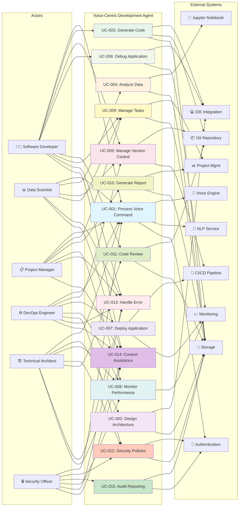

---

## 4. ACTOR-USE CASE MATRIX

| Use Case                       | DEV | DS | PM | DEVOPS | ARCH | SEC |
|--------------------------------|-----|----|----|--------|------|-----|
| UC-001: Process Voice Command  | ✓   | ✓  | ✓  | ✓      | ✓    | ✓   |
| UC-002: Design Architecture    | ✗   | ✗  | ✗  | ✗      | ✓    | ✗   |
| UC-003: Generate Code          | ✓   | ✗  | ✗  | ✗      | ✗    | ✗   |
| UC-004: Analyze Data           | ✗   | ✓  | ✗  | ✗      | ✗    | ✗   |
| UC-005: Manage Version Control | ✓   | ✓  | ✗  | ✓      | ✗    | ✗   |
| UC-006: Debug Application      | ✓   | ✗  | ✗  | ✗      | ✗    | ✗   |
| UC-007: Deploy Application     | ✗   | ✗  | ✗  | ✓      | ✗    | ✗   |
| UC-008: Monitor Performance    | ✗   | ✗  | ✓  | ✓      | ✓    | ✗   |
| UC-009: Manage Tasks           | ✓   | ✓  | ✓  | ✗      | ✗    | ✗   |
| UC-010: Generate Report        | ✗   | ✗  | ✓  | ✗      | ✗    | ✗   |
| UC-011: Code Review            | ✓   | ✗  | ✗  | ✗      | ✓    | ✗   |
| UC-012: Configure Security     | ✗   | ✗  | ✗  | ✓      | ✓    | ✓   |
| UC-013: Handle Error           | ✓   | ✓  | ✓  | ✓      | ✓    | ✓   |
| UC-014: Context Assistance     | ✓   | ✓  | ✓  | ✓      | ✓    | ✓   |
| UC-015: Audit Reporting        | ✗   | ✗  | ✗  | ✗      | ✗    | ✓   |

**Legend:**

- ✓ = Actor participates in use case
- ✗ = Actor does not participate in use case

---

## 5. USE CASE INTERACTION SEQUENCES

### UC-001: Process Voice Command - Sequence Diagram

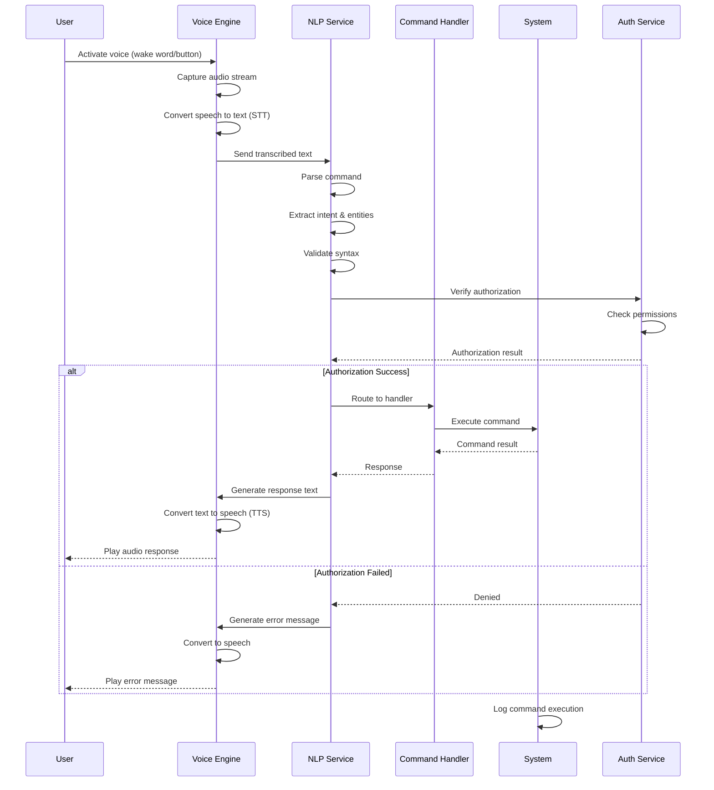

---

### UC-003: Generate Code - Sequence Diagram

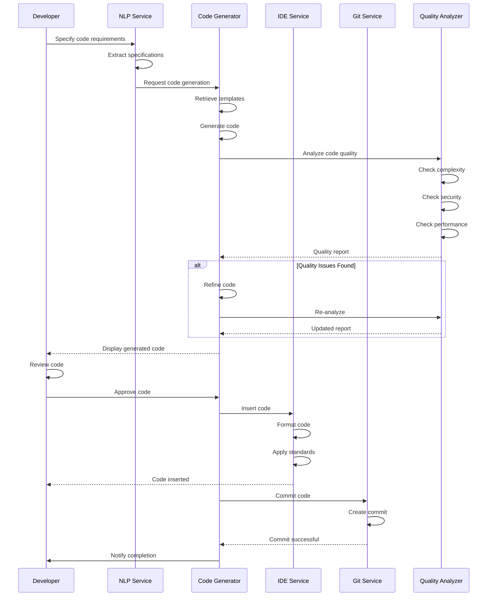

---

### UC-007: Deploy Application - Sequence Diagram

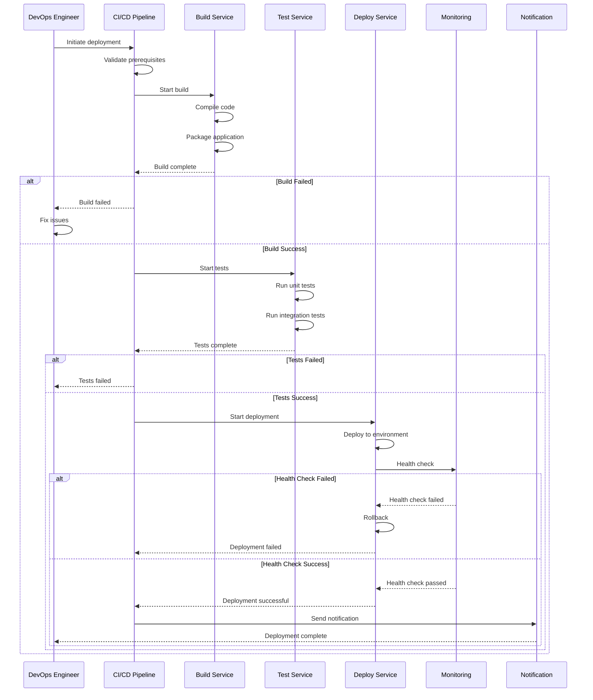

---

### UC-004: Analyze Data - Sequence Diagram

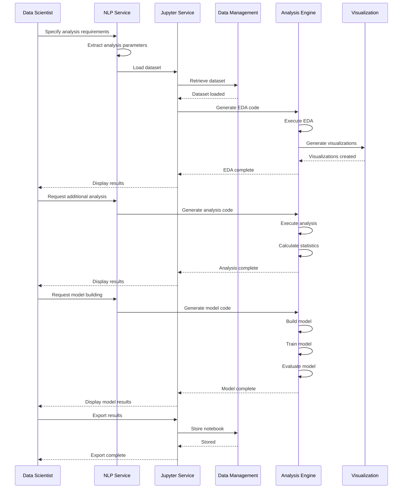

---

## 6. USE CASE DEPENDENCIES AND RELATIONSHIPS

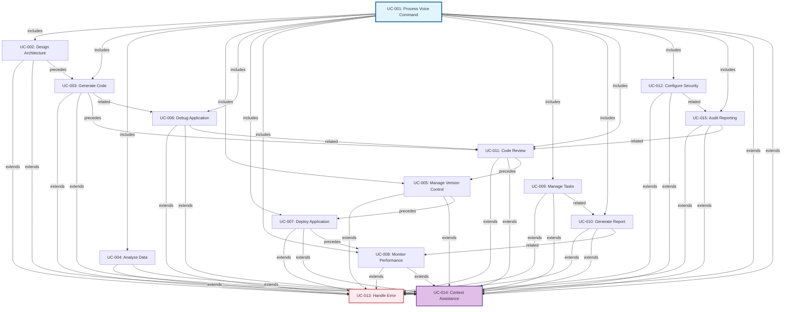

---

## 7. DETAILED BUSINESS RULES REFERENCE

### Development-Related Business Rules

| Rule ID | Description                                       | Use Cases | Priority |
|---------|---------------------------------------------------|-----------|----------|
| BR-001  | Voice command processing latency must be <500ms   | UC-001    | Critical |
| BR-002  | Voice command accuracy must be ≥95%               | UC-001    | Critical |
| BR-003  | All commands must be authenticated and authorized | UC-001    | Critical |
| BR-004  | Command execution must be logged for audit        | UC-001    | High     |
| BR-005  | System must support context-aware processing      | UC-001    | High     |
| BR-006  | Voice responses must be generated within 1 second | UC-001    | High     |
| BR-007  | System must handle concurrent voice sessions      | UC-001    | High     |
| BR-014  | Generated code must pass linting checks           | UC-003    | High     |
| BR-015  | Generated code must follow project standards      | UC-003    | High     |
| BR-016  | Generated code must include comments              | UC-003    | Medium   |
| BR-017  | Code generation must support multiple languages   | UC-003    | High     |
| BR-018  | Generated code must be version controlled         | UC-003    | High     |
| BR-019  | Code generation must include security practices   | UC-003    | Critical |

### Architecture-Related Business Rules

| Rule ID | Description                                          | Use Cases | Priority |
|---------|------------------------------------------------------|-----------|----------|
| BR-008  | Architecture must follow organizational standards    | UC-002    | High     |
| BR-009  | Architecture must support scalability                | UC-002    | High     |
| BR-010  | Architecture must include security considerations    | UC-002    | Critical |
| BR-011  | Architecture documentation must be auto-generated    | UC-002    | Medium   |
| BR-012  | Architecture changes must be version controlled      | UC-002    | High     |
| BR-013  | Architecture must be reviewed by Technical Architect | UC-002    | High     |

### Data Science-Related Business Rules

| Rule ID | Description                                            | Use Cases | Priority |
|---------|--------------------------------------------------------|-----------|----------|
| BR-020  | Data analysis must handle missing values               | UC-004    | High     |
| BR-021  | Analysis must include statistical significance testing | UC-004    | High     |
| BR-022  | Visualizations must be publication-ready               | UC-004    | Medium   |
| BR-023  | Analysis code must be reproducible                     | UC-004    | High     |
| BR-024  | Analysis results must be version controlled            | UC-004    | High     |
| BR-025  | Data privacy must be maintained during analysis        | UC-004    | Critical |

### Version Control-Related Business Rules

| Rule ID | Description                                        | Use Cases | Priority |
|---------|----------------------------------------------------|-----------|----------|
| BR-026  | All commits must include descriptive messages      | UC-005    | High     |
| BR-027  | Commits must reference issue tracking system       | UC-005    | Medium   |
| BR-028  | Protected branches require pull request review     | UC-005    | High     |
| BR-029  | Merge conflicts must be resolved before completion | UC-005    | High     |
| BR-030  | Version control operations must be logged          | UC-005    | High     |
| BR-031  | Sensitive data must not be committed               | UC-005    | Critical |

### Deployment-Related Business Rules

| Rule ID | Description                                     | Use Cases | Priority |
|---------|-------------------------------------------------|-----------|----------|
| BR-038  | Deployments must follow change management       | UC-007    | High     |
| BR-039  | Production deployments require approval         | UC-007    | Critical |
| BR-040  | Deployment must include automated health checks | UC-007    | High     |
| BR-041  | Rollback capability must be available           | UC-007    | Critical |
| BR-042  | Deployment must be logged with audit trail      | UC-007    | High     |
| BR-043  | Deployment must not exceed maintenance window   | UC-007    | High     |

### Monitoring-Related Business Rules

| Rule ID | Description                                             | Use Cases | Priority |
|---------|---------------------------------------------------------|-----------|----------|
| BR-044  | Metrics must be collected with <1 minute granularity    | UC-008    | High     |
| BR-045  | Alerts must be triggered within 30 seconds              | UC-008    | High     |
| BR-046  | Alert notifications must be delivered within 10 seconds | UC-008    | High     |
| BR-047  | Monitoring data must be retained for 90 days            | UC-008    | Medium   |
| BR-048  | Performance analysis must include trend analysis        | UC-008    | Medium   |
| BR-049  | Alerts must include recommended actions                 | UC-008    | Medium   |

### Project Management-Related Business Rules

| Rule ID | Description                                    | Use Cases | Priority |
|---------|------------------------------------------------|-----------|----------|
| BR-050  | Tasks must have clear descriptions             | UC-009    | High     |
| BR-051  | Tasks must be assigned to team members         | UC-009    | High     |
| BR-052  | Task deadlines must be realistic               | UC-009    | Medium   |
| BR-053  | Task priority must be defined                  | UC-009    | High     |
| BR-054  | Task completion must be verified               | UC-009    | Medium   |
| BR-055  | Task changes must be logged                    | UC-009    | High     |
| BR-056  | Reports must include executive summary         | UC-010    | High     |
| BR-057  | Reports must include key metrics and KPIs      | UC-010    | High     |
| BR-058  | Reports must be generated within 5 minutes     | UC-010    | Medium   |
| BR-059  | Reports must be exportable in multiple formats | UC-010    | Medium   |
| BR-060  | Report data must be current and accurate       | UC-010    | Critical |
| BR-061  | Reports must be archived for compliance        | UC-010    | High     |

### Code Review-Related Business Rules

| Rule ID | Description                                     | Use Cases | Priority |
|---------|-------------------------------------------------|-----------|----------|
| BR-062  | Code reviews must be completed within 24 hours  | UC-011    | High     |
| BR-063  | All pull requests must be reviewed before merge | UC-011    | Critical |
| BR-064  | Security issues must block approval             | UC-011    | Critical |
| BR-065  | Review feedback must be constructive            | UC-011    | Medium   |
| BR-066  | Code review comments must be documented         | UC-011    | High     |
| BR-067  | Approved code must meet quality standards       | UC-011    | High     |

### Security-Related Business Rules

| Rule ID | Description                                         | Use Cases | Priority |
|---------|-----------------------------------------------------|-----------|----------|
| BR-068  | Security policies must comply with regulations      | UC-012    | Critical |
| BR-069  | Policy changes must be approved by Security Officer | UC-012    | Critical |
| BR-070  | Policy changes must be logged with audit trail      | UC-012    | High     |
| BR-071  | Users must be notified of policy changes            | UC-012    | High     |
| BR-072  | Policy compliance must be monitored continuously    | UC-012    | High     |
| BR-073  | Policy violations must trigger alerts               | UC-012    | Critical |

### Error Handling-Related Business Rules

| Rule ID | Description                                     | Use Cases | Priority |
|---------|-------------------------------------------------|-----------|----------|
| BR-074  | All errors must be logged with context          | UC-013    | High     |
| BR-075  | Error messages must be user-friendly            | UC-013    | High     |
| BR-076  | Critical errors must trigger escalation         | UC-013    | Critical |
| BR-077  | Error recovery must be attempted automatically  | UC-013    | High     |
| BR-078  | Error patterns must be analyzed for improvement | UC-013    | Medium   |
| BR-079  | Users must be provided with support options     | UC-013    | High     |

### Assistance-Related Business Rules

| Rule ID | Description                                      | Use Cases | Priority |
|---------|--------------------------------------------------|-----------|----------|
| BR-080  | Assistance must be contextually relevant         | UC-014    | High     |
| BR-081  | Assistance must be accurate and up-to-date       | UC-014    | Critical |
| BR-082  | Assistance must include examples when applicable | UC-014    | Medium   |
| BR-083  | Assistance must be personalized to user role     | UC-014    | High     |
| BR-084  | Assistance interactions must be logged           | UC-014    | High     |
| BR-085  | Assistance quality must be continuously improved | UC-014    | Medium   |

### Audit-Related Business Rules

| Rule ID | Description                                             | Use Cases | Priority |
|---------|---------------------------------------------------------|-----------|----------|
| BR-086  | Audit logs must be immutable                            | UC-015    | Critical |
| BR-087  | Audit reports must be generated within 24 hours         | UC-015    | High     |
| BR-088  | Compliance violations must be reported immediately      | UC-015    | Critical |
| BR-089  | Audit reports must include remediation recommendations  | UC-015    | High     |
| BR-090  | Audit reports must be retained for regulatory period    | UC-015    | Critical |
| BR-091  | Audit access must be restricted to authorized personnel | UC-015    | Critical |

---

## 8. ACCEPTANCE CRITERIA SUMMARY

### UC-001: Process Voice Command

**AC-001-1:** System processes voice command within 500ms latency

- **Testable:** Measure end-to-end latency from voice activation to response
- **Acceptance:** ≥95% of commands processed within 500ms

**AC-001-2:** Voice recognition accuracy is ≥95%

- **Testable:** Compare recognized text with actual spoken text
- **Acceptance:** Accuracy score ≥95% across diverse accents and environments

**AC-001-3:** System handles concurrent voice sessions

- **Testable:** Simulate multiple simultaneous voice sessions
- **Acceptance:** System maintains performance with ≥10 concurrent sessions

**AC-001-4:** All commands are logged for audit

- **Testable:** Verify audit log entries for each command
- **Acceptance:** 100% of commands logged with timestamp, user, and result

---

### UC-002: Design Software Architecture

**AC-002-1:** Architecture diagram is generated automatically

- **Testable:** Request architecture design and verify diagram generation
- **Acceptance:** Diagram generated within 30 seconds

**AC-002-2:** Architecture follows organizational standards

- **Testable:** Validate architecture against standards checklist
- **Acceptance:** 100% compliance with applicable standards

**AC-002-3:** Architecture documentation is auto-generated

- **Testable:** Request documentation and verify completeness
- **Acceptance:** Documentation includes all required sections

---

### UC-003: Generate Code

**AC-003-1:** Generated code passes linting checks

- **Testable:** Run linter on generated code
- **Acceptance:** Zero linting errors

**AC-003-2:** Generated code follows project standards

- **Testable:** Code review against standards
- **Acceptance:** 100% compliance with coding standards

**AC-003-3:** Code generation supports multiple languages

- **Testable:** Generate code in Python, Java, JavaScript, Go
- **Acceptance:** All specified languages supported

---

### UC-004: Analyze Data

**AC-004-1:** Data quality issues are identified

- **Testable:** Analyze dataset with known quality issues
- **Acceptance:** All issues identified and reported

**AC-004-2:** Analysis results are reproducible

- **Testable:** Re-run analysis and compare results
- **Acceptance:** Results are identical across runs

**AC-004-3:** Visualizations are publication-ready

- **Testable:** Review visualization quality and formatting
- **Acceptance:** Visualizations meet publication standards

---

### UC-005: Manage Version Control

**AC-005-1:** Merge conflicts are resolved correctly

- **Testable:** Create merge conflict and verify resolution
- **Acceptance:** Conflicts resolved without data loss

**AC-005-2:** Protected branches require review

- **Testable:** Attempt push to protected branch
- **Acceptance:** Push blocked until review approved

**AC-005-3:** All operations are logged

- **Testable:** Verify Git log entries
- **Acceptance:** 100% of operations logged

---

### UC-006: Debug Application

**AC-006-1:** Breakpoints are set correctly

- **Testable:** Set breakpoint and verify execution stops
- **Acceptance:** Breakpoint functions as expected

**AC-006-2:** Variables can be inspected

- **Testable:** Inspect variable values during debugging
- **Acceptance:** Variable values displayed correctly

**AC-006-3:** Root cause is identified

- **Testable:** Complete debugging session and verify root cause
- **Acceptance:** Root cause documented and verified

---

### UC-007: Deploy Application

**AC-007-1:** Deployment completes within SLA

- **Testable:** Measure deployment time
- **Acceptance:** Deployment completes within defined SLA

**AC-007-2:** Health checks pass after deployment

- **Testable:** Verify health check results
- **Acceptance:** All health checks pass

**AC-007-3:** Rollback is available if needed

- **Testable:** Trigger rollback and verify success
- **Acceptance:** Rollback completes successfully

---

### UC-008: Monitor Performance

**AC-008-1:** Metrics are collected with <1 minute granularity

- **Testable:** Verify metric collection frequency
- **Acceptance:** Metrics collected every <1 minute

**AC-008-2:** Alerts are triggered within 30 seconds

- **Testable:** Trigger alert condition and measure response time
- **Acceptance:** Alert triggered within 30 seconds

**AC-008-3:** Alert notifications are delivered within 10 seconds

- **Testable:** Measure notification delivery time
- **Acceptance:** Notifications delivered within 10 seconds

---

### UC-009: Manage Tasks

**AC-009-1:** Tasks are created with all required fields

- **Testable:** Create task and verify all fields populated
- **Acceptance:** All required fields present

**AC-009-2:** Task assignments are tracked

- **Testable:** Verify task assignment in system
- **Acceptance:** Assignments tracked and visible

**AC-009-3:** Task completion is verified

- **Testable:** Mark task complete and verify status
- **Acceptance:** Completion status updated correctly

---

### UC-010: Generate Report

**AC-010-1:** Reports are generated within 5 minutes

- **Testable:** Measure report generation time
- **Acceptance:** Report generated within 5 minutes

**AC-010-2:** Reports include all required sections

- **Testable:** Verify report completeness
- **Acceptance:** All required sections present

**AC-010-3:** Reports are exportable in multiple formats

- **Testable:** Export report in PDF, Excel, HTML
- **Acceptance:** All formats export successfully

---

### UC-011: Code Review

**AC-011-1:** Code reviews are completed within 24 hours

- **Testable:** Track review completion time
- **Acceptance:** 95% of reviews completed within 24 hours

**AC-011-2:** Security issues block approval

- **Testable:** Attempt to approve code with security issues
- **Acceptance:** Approval blocked until issues resolved

**AC-011-3:** Review comments are documented

- **Testable:** Verify review comments in system
- **Acceptance:** All comments documented and visible

---

### UC-012: Configure Security

**AC-012-1:** Policies comply with regulations

- **Testable:** Validate policies against regulatory requirements
- **Acceptance:** 100% compliance with regulations

**AC-012-2:** Policy changes are logged

- **Testable:** Verify audit log for policy changes
- **Acceptance:** All changes logged with full details

**AC-012-3:** Users are notified of changes

- **Testable:** Verify notification delivery
- **Acceptance:** All affected users notified

---

### UC-013: Handle Error

**AC-013-1:** Errors are logged with context

- **Testable:** Verify error log entries
- **Acceptance:** All errors logged with full context

**AC-013-2:** Error messages are user-friendly

- **Testable:** Review error messages for clarity
- **Acceptance:** Messages are clear and actionable

**AC-013-3:** Critical errors trigger escalation

- **Testable:** Trigger critical error and verify escalation
- **Acceptance:** Escalation triggered automatically

---

### UC-014: Context Assistance

**AC-014-1:** Assistance is contextually relevant

- **Testable:** Request assistance in various contexts
- **Acceptance:** Assistance matches context ≥90% of time

**AC-014-2:** Assistance includes examples

- **Testable:** Request assistance and verify examples provided
- **Acceptance:** Examples provided when applicable

**AC-014-3:** Assistance is personalized to role

- **Testable:** Request assistance as different roles
- **Acceptance:** Assistance varies by role appropriately

---

### UC-015: Audit Reporting

**AC-015-1:** Audit reports are generated within 24 hours

- **Testable:** Request audit report and measure generation time
- **Acceptance:** Report generated within 24 hours

**AC-015-2:** Compliance violations are reported immediately

- **Testable:** Trigger compliance violation and verify reporting
- **Acceptance:** Violation reported within 5 minutes

**AC-015-3:** Audit logs are immutable

- **Testable:** Attempt to modify audit log
- **Acceptance:** Modification blocked

---

## 9. TRACEABILITY MATRIX

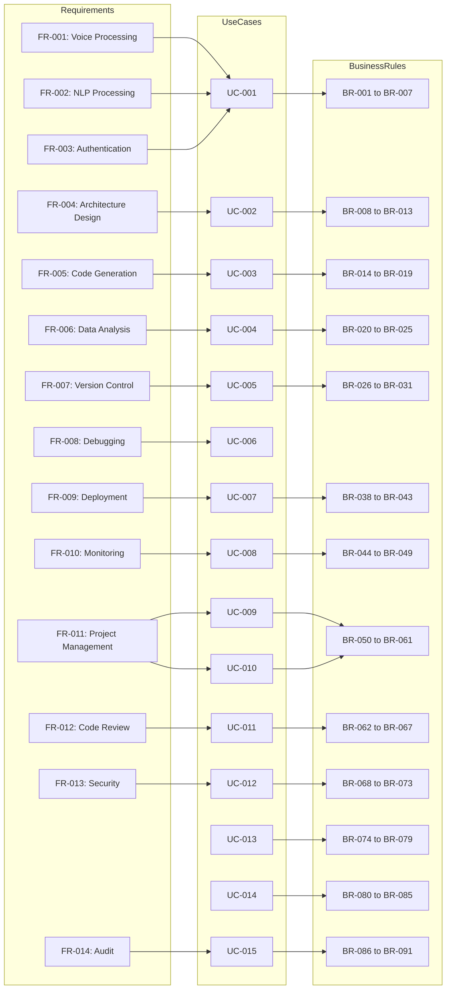

---

## 10. SUMMARY AND KEY INSIGHTS

### Use Case Coverage

The Voice-Centric Software Development and Data Science Agent system includes **15 comprehensive use cases** covering:

1. **Core Infrastructure (UC-001):** Voice command processing foundation
2. **Development Activities (UC-002, UC-003, UC-005, UC-006, UC-011):** Architecture design, code generation, version
   control, debugging, code review
3. **Data Science Activities (UC-004):** Data analysis and exploration
4. **Operations (UC-007, UC-008):** Deployment and monitoring
5. **Project Management (UC-009, UC-010):** Task management and reporting
6. **Security & Compliance (UC-012, UC-015):** Security policies and audit reporting
7. **Cross-Cutting Concerns (UC-013, UC-014):** Error handling and context-aware assistance

### Actor Engagement

- **Software Developer:** 6 primary use cases + 2 cross-cutting
- **Data Scientist:** 4 primary use cases + 2 cross-cutting
- **Project Manager:** 4 primary use cases + 2 cross-cutting
- **DevOps Engineer:** 5 primary use cases + 2 cross-cutting
- **Technical Architect:** 5 primary use cases + 2 cross-cutting
- **Security Officer:** 3 primary use cases + 2 cross-cutting

### Business Rules Alignment

- **91 business rules** defined across all use cases
- **Critical priority:** 18 rules (security, compliance, performance)
- **High priority:** 52 rules (functionality, reliability)
- **Medium priority:** 21 rules (optimization, user experience)

### Key Quality Attributes

- **Performance:** <500ms voice processing latency, <1 minute metric granularity
- **Reliability:** 99.9% uptime, automatic error recovery
- **Security:** Authentication, authorization, audit logging, compliance
- **Usability:** Context-aware assistance, user-friendly error messages
- **Scalability:** Support for concurrent users and operations

---

## 11. NEXT STEPS

1. **Functional Requirements Specification:** Develop detailed FR document with system capabilities
2. **Non-Functional Requirements:** Define performance, security, scalability requirements
3. **System Architecture Design:** Create detailed architecture diagrams and component specifications
4. **Data Model Design:** Define data structures and database schema
5. **API Specifications:** Document all system interfaces and integrations
6. **Test Strategy:** Develop comprehensive test plans for all use cases
7. **Implementation Planning:** Create development roadmap and sprint planning

---

**Document Version:** 1.0  
**Last Updated:** 2024  
**Status:** Complete  
**Classification:** Technical Documentation

---

## Requirements Specification

# Comprehensive Requirements Documentation

## Voice-Centric Software Development and Data Science Agent

---

## Table of Contents

1. [Functional Requirements](#functional-requirements)
2. [Non-Functional Requirements](#non-functional-requirements)
3. [Requirements Traceability Matrix](#requirements-traceability-matrix)
4. [Requirements Dependency Diagram](#requirements-dependency-diagram)
5. [Use Case to Requirements Mapping](#use-case-to-requirements-mapping)

---

## FUNCTIONAL REQUIREMENTS

### FR-001: Voice Command Recognition and Processing

**Description:** The system shall capture, process, and interpret voice commands from users in real-time, converting
speech to text with high accuracy and supporting multiple languages and accents.

**Priority:** Must Have

**Source:** All Stakeholders (Core Functionality)

**Acceptance Criteria:**

- Voice input is captured with minimum 16kHz sampling rate
- Speech-to-text conversion achieves ≥95% accuracy for standard English accents
- System supports minimum 5 languages (English, Spanish, French, German, Mandarin)
- Processing latency from voice capture to text output ≤200ms (p95)
- System handles background noise levels up to 60dB with ≥90% accuracy
- Supports both continuous and command-based voice input modes
- Voice commands are logged with timestamps for audit trails

**Traceability:** UC-001 (Voice Command Initiation), UC-002 (Code Generation)

---

### FR-002: Natural Language Understanding and Intent Classification

**Description:** The system shall parse natural language voice commands to identify user intent, extract parameters, and
map commands to appropriate system actions.

**Priority:** Must Have

**Source:** Software Developer, Data Scientist, Project Manager

**Acceptance Criteria:**

- Intent classification accuracy ≥92% for predefined command categories
- System extracts minimum 3 parameter types (action, target, context)
- Ambiguous commands trigger clarification prompts within 500ms
- System maintains context across 5+ consecutive commands
- Supports domain-specific terminology for software development and data science
- Handles negations, conditionals, and complex sentence structures
- Provides confidence scores for intent classification (0-100%)

**Traceability:** UC-001, UC-003 (Architecture Design), UC-004 (Data Analysis)

---

### FR-003: Code Generation from Voice Commands

**Description:** The system shall generate syntactically correct, functional code snippets in multiple programming
languages based on voice-described requirements.

**Priority:** Must Have

**Source:** Software Developer

**Acceptance Criteria:**

- Generated code compiles/runs without syntax errors ≥90% of the time
- Supports minimum 8 programming languages (Python, Java, C++, JavaScript, Go, Rust, TypeScript, C#)
- Generated code includes inline comments explaining logic
- Code follows language-specific style guides (PEP8, Google Style Guide, etc.)
- System provides code quality metrics (cyclomatic complexity, maintainability index)
- Generated code can be directly inserted into IDE or saved to file
- System suggests optimizations for generated code
- Supports generation of unit tests alongside production code

**Traceability:** UC-002 (Code Generation), UC-005 (Testing Assistance)

---

### FR-004: Architecture Design and Visualization

**Description:** The system shall create and visualize software architecture diagrams based on voice-described system
designs, supporting multiple architecture patterns.

**Priority:** Must Have

**Source:** Technical Architect, Software Developer

**Acceptance Criteria:**

- System generates architecture diagrams in minimum 3 formats (Mermaid, PlantUML, SVG)
- Supports minimum 5 architecture patterns (Microservices, Monolithic, Event-Driven, Layered, CQRS)
- Diagrams include component relationships, data flows, and communication protocols
- System validates architectural consistency and identifies potential issues
- Diagrams can be exported to documentation tools (Confluence, Notion, GitHub)
- System suggests improvements based on architectural best practices
- Supports real-time diagram updates as requirements change
- Diagrams include deployment topology information

**Traceability:** UC-003 (Architecture Design), UC-006 (Documentation Generation)

---

### FR-005: Data Analysis and Visualization Request Processing

**Description:** The system shall interpret voice commands for data analysis tasks and generate appropriate analysis
code, visualizations, and insights.

**Priority:** Must Have

**Source:** Data Scientist

**Acceptance Criteria:**

- System generates analysis code for minimum 5 data science libraries (Pandas, NumPy, Scikit-learn, TensorFlow, PyTorch)
- Supports minimum 8 visualization types (scatter plots, histograms, heatmaps, time series, box plots, violin plots, 3D
  plots, interactive dashboards)
- Generated visualizations are publication-ready with proper labels, legends, and formatting
- System performs exploratory data analysis (EDA) automatically when requested
- Supports statistical testing and hypothesis validation
- Generates insights and recommendations from analysis results
- Code includes data validation and error handling
- System suggests appropriate analysis methods based on data characteristics

**Traceability:** UC-004 (Data Analysis), UC-007 (Model Development)

---

### FR-006: IDE Integration and Code Insertion

**Description:** The system shall integrate with popular IDEs to enable direct insertion of generated code into active
editor windows.

**Priority:** Must Have

**Source:** Software Developer

**Acceptance Criteria:**

- Supports minimum 5 IDEs (VS Code, IntelliJ IDEA, PyCharm, Visual Studio, Sublime Text)
- Code insertion respects current cursor position and indentation
- System maintains IDE syntax highlighting and formatting
- Supports undo/redo operations for inserted code
- Integration works across Windows, macOS, and Linux platforms
- IDE plugin installation is automated and requires <2 minutes
- System detects active IDE and language context automatically
- Supports code insertion into multiple files simultaneously

**Traceability:** UC-002 (Code Generation), UC-008 (Development Workflow)

---

### FR-007: Git Repository Integration and Version Control

**Description:** The system shall integrate with Git repositories to enable voice-controlled version control operations
and code management.

**Priority:** Must Have

**Source:** Software Developer, DevOps Engineer

**Acceptance Criteria:**

- Supports voice commands for minimum 10 Git operations (commit, push, pull, branch, merge, rebase, tag, stash,
  cherry-pick, reset)
- System generates meaningful commit messages based on code changes
- Supports multiple Git hosting platforms (GitHub, GitLab, Bitbucket, Azure DevOps)
- Automatic branch creation and switching via voice commands
- Conflict detection and resolution suggestions
- Integration with CI/CD pipelines for automated testing
- Supports code review workflows with voice-based comments
- Maintains audit trail of all Git operations initiated via voice

**Traceability:** UC-008 (Development Workflow), UC-009 (Collaboration)

---

### FR-008: Project Management and Task Tracking

**Description:** The system shall enable voice-controlled project management operations including task creation, status
updates, and progress tracking.

**Priority:** Should Have

**Source:** Project Manager, Software Developer

**Acceptance Criteria:**

- Supports voice commands for minimum 8 project management operations (create task, update status, assign task, set
  deadline, add comment, view progress, generate report, schedule meeting)
- Integrates with minimum 3 project management tools (Jira, Asana, Monday.com)
- Automatic task creation from voice commands with extracted parameters
- System generates task descriptions and acceptance criteria
- Supports sprint planning and backlog management via voice
- Real-time progress tracking and burndown chart generation
- Automatic status updates based on code commits and deployments
- Voice-based meeting scheduling with calendar integration

**Traceability:** UC-010 (Project Management), UC-009 (Collaboration)

---

### FR-009: Real-Time Collaboration and Multi-User Support

**Description:** The system shall support multiple concurrent users collaborating on the same project with real-time
synchronization and conflict resolution.

**Priority:** Should Have

**Source:** Project Manager, Software Developer, Data Scientist

**Acceptance Criteria:**

- Supports minimum 10 concurrent users per project
- Real-time synchronization of changes with <1 second latency
- Automatic conflict detection and resolution for simultaneous edits
- User presence indicators showing who is currently working on what
- Shared voice session support for pair programming
- Activity feed showing all user actions with timestamps
- Permission-based access control for collaborative features
- Automatic backup and recovery of collaborative sessions

**Traceability:** UC-009 (Collaboration), UC-011 (Pair Programming)

---

### FR-010: Testing and Quality Assurance Assistance

**Description:** The system shall assist with test case generation, test execution, and quality assurance activities
through voice commands.

**Priority:** Should Have

**Source:** Software Developer, QA Engineer

**Acceptance Criteria:**

- Generates unit tests for minimum 5 testing frameworks (JUnit, pytest, Mocha, NUnit, Go testing)
- Supports minimum 4 test types (unit tests, integration tests, end-to-end tests, performance tests)
- Test generation achieves ≥80% code coverage for generated tests
- System suggests edge cases and boundary conditions
- Supports test execution and result reporting via voice
- Integration with CI/CD pipelines for automated test runs
- Generates test reports with pass/fail statistics and performance metrics
- Supports mutation testing and code coverage analysis

**Traceability:** UC-005 (Testing Assistance), UC-012 (Quality Assurance)

---

### FR-011: Documentation Generation and Management

**Description:** The system shall automatically generate comprehensive technical documentation from code, architecture,
and voice-described requirements.

**Priority:** Should Have

**Source:** Technical Architect, Software Developer, Project Manager

**Acceptance Criteria:**

- Generates documentation in minimum 3 formats (Markdown, HTML, PDF)
- Supports minimum 4 documentation types (API documentation, architecture documentation, user guides, deployment guides)
- Automatic code documentation extraction with docstring generation
- Supports multiple documentation platforms (GitHub Wiki, Confluence, Notion, ReadTheDocs)
- Documentation includes diagrams, code examples, and cross-references
- Version control for documentation with change tracking
- Automatic documentation updates when code changes
- Multi-language documentation support (minimum 5 languages)

**Traceability:** UC-006 (Documentation Generation), UC-003 (Architecture Design)

---

### FR-012: Machine Learning Model Development Assistance

**Description:** The system shall assist with machine learning model development including model selection, training,
evaluation, and deployment guidance.

**Priority:** Should Have

**Source:** Data Scientist

**Acceptance Criteria:**

- Supports minimum 8 ML frameworks (Scikit-learn, TensorFlow, PyTorch, XGBoost, LightGBM, Keras, Hugging Face, MLflow)
- Generates code for minimum 10 model types (Linear Regression, Logistic Regression, Decision Trees, Random Forests,
  SVM, Neural Networks, CNNs, RNNs, Transformers, Ensemble Methods)
- Automatic hyperparameter tuning suggestions
- Model evaluation with minimum 5 metrics (accuracy, precision, recall, F1-score, AUC-ROC)
- Cross-validation and train-test split management
- Feature engineering suggestions and implementation
- Model comparison and selection recommendations
- Deployment guidance for production environments

**Traceability:** UC-007 (Model Development), UC-013 (ML Pipeline)

---

### FR-013: Database Schema Design and Query Generation

**Description:** The system shall assist with database design, schema creation, and SQL query generation based on
voice-described requirements.

**Priority:** Should Have

**Source:** Software Developer, Data Scientist

**Acceptance Criteria:**

- Supports minimum 5 database systems (PostgreSQL, MySQL, MongoDB, Cassandra, DynamoDB)
- Generates normalized database schemas following minimum 3NF principles
- Automatic primary key, foreign key, and index suggestions
- Generates SQL queries for minimum 8 operation types (SELECT, INSERT, UPDATE, DELETE, JOIN, GROUP BY, aggregations,
  window functions)
- Query optimization suggestions and execution plan analysis
- Supports both SQL and NoSQL query generation
- Automatic migration script generation for schema changes
- Data validation and constraint generation

**Traceability:** UC-004 (Data Analysis), UC-014 (Database Design)

---

### FR-014: Deployment and DevOps Automation

**Description:** The system shall provide voice-controlled deployment and DevOps automation capabilities including
infrastructure provisioning and monitoring.

**Priority:** Should Have

**Source:** DevOps Engineer, Software Developer

**Acceptance Criteria:**

- Supports voice commands for minimum 10 deployment operations (deploy, rollback, scale, monitor, alert, provision,
  configure, backup, restore, update)
- Integrates with minimum 3 cloud platforms (AWS, Azure, Google Cloud)
- Supports minimum 3 container orchestration platforms (Kubernetes, Docker Swarm, ECS)
- Automatic infrastructure-as-code generation (Terraform, CloudFormation, Ansible)
- Deployment pipeline creation and management via voice
- Real-time deployment status monitoring and logging
- Automatic rollback on deployment failures
- Health check and monitoring configuration

**Traceability:** UC-015 (Deployment), UC-016 (DevOps Automation)

---

### FR-015: Security and Vulnerability Analysis

**Description:** The system shall analyze code and configurations for security vulnerabilities and provide remediation
recommendations.

**Priority:** Should Have

**Source:** Security Officer, Software Developer

**Acceptance Criteria:**

- Detects minimum 15 vulnerability categories (SQL injection, XSS, CSRF, authentication flaws, authorization flaws,
  insecure deserialization, broken access control, sensitive data exposure, XXE, broken authentication, using components
  with known vulnerabilities, insufficient logging, missing encryption, hardcoded credentials, insecure dependencies)
- Supports minimum 3 security scanning tools (OWASP ZAP, Snyk, SonarQube)
- Generates remediation code for identified vulnerabilities
- Compliance checking for minimum 3 standards (OWASP Top 10, CWE Top 25, GDPR)
- Automatic dependency vulnerability scanning
- Security report generation with severity levels
- Integration with security incident management systems
- Continuous security monitoring and alerting

**Traceability:** UC-017 (Security Analysis), UC-018 (Compliance)

---

### FR-016: User Authentication and Authorization

**Description:** The system shall implement secure user authentication and role-based access control for all features
and resources.

**Priority:** Must Have

**Source:** Security Officer, All Stakeholders

**Acceptance Criteria:**

- Supports minimum 3 authentication methods (username/password, OAuth 2.0, SAML 2.0)
- Multi-factor authentication (MFA) support with minimum 2 factors (TOTP, SMS)
- Role-based access control (RBAC) with minimum 5 roles (Admin, Architect, Developer, Data Scientist, Viewer)
- Fine-grained permission management at feature and resource level
- Session management with configurable timeout (default 30 minutes)
- Audit logging of all authentication and authorization events
- Support for single sign-on (SSO) integration
- Password policy enforcement (minimum 12 characters, complexity requirements)

**Traceability:** UC-019 (User Management), UC-020 (Security)

---

### FR-017: Voice Session Management and Context Preservation

**Description:** The system shall maintain user context across voice sessions and enable seamless continuation of work.

**Priority:** Must Have

**Source:** All Stakeholders

**Acceptance Criteria:**

- Session state persists across minimum 24 hours of inactivity
- Context includes minimum 10 previous commands and their results
- Users can reference previous commands by number or description
- Automatic context switching between projects/tasks
- Session history is searchable and filterable
- Context can be exported and shared with other users
- Automatic context cleanup after 30 days of inactivity
- Context includes user preferences and customizations

**Traceability:** UC-001 (Voice Command Initiation), UC-021 (Session Management)

---

### FR-018: Error Handling and Recovery

**Description:** The system shall provide comprehensive error handling, recovery mechanisms, and user-friendly error
messages.

**Priority:** Must Have

**Source:** All Stakeholders

**Acceptance Criteria:**

- All errors are caught and logged with full stack traces
- User-facing error messages are clear and actionable (no technical jargon)
- System suggests recovery actions for common errors
- Automatic retry logic for transient failures (maximum 3 retries with exponential backoff)
- Graceful degradation when optional services are unavailable
- Error recovery options presented via voice interface
- Detailed error logs available for debugging (minimum 30 days retention)
- Error analytics and trending for proactive issue identification

**Traceability:** UC-022 (Error Handling), All Use Cases

---

### FR-019: Feedback and Continuous Improvement

**Description:** The system shall collect user feedback and continuously improve based on usage patterns and user
satisfaction.

**Priority:** Could Have

**Source:** Product Manager, All Stakeholders

**Acceptance Criteria:**

- Voice-based feedback collection after each major operation
- Feedback includes satisfaction rating (1-5 scale) and optional comments
- System tracks minimum 10 quality metrics (accuracy, latency, usefulness, ease of use, etc.)
- Feedback data is analyzed for trends and improvement opportunities
- A/B testing framework for feature improvements
- User satisfaction dashboard with minimum monthly reporting
- Feedback integration with product roadmap planning
- Automatic alerts for significant quality degradation

**Traceability:** UC-023 (Feedback), UC-024 (Continuous Improvement)

---

### FR-020: Offline Mode and Caching

**Description:** The system shall support offline mode with local caching for frequently used features and data.

**Priority:** Could Have

**Source:** Software Developer, Data Scientist

**Acceptance Criteria:**

- Offline mode supports minimum 5 core features (code generation, documentation, architecture design, analysis, testing)
- Local cache stores minimum 100 recent commands and results
- Automatic synchronization when connectivity is restored
- Cache invalidation strategy with configurable TTL (default 24 hours)
- Offline mode clearly indicated to user via voice notification
- Conflict resolution for changes made offline vs. online
- Cache storage limited to 500MB per user
- Secure cache encryption for sensitive data

**Traceability:** UC-025 (Offline Mode), UC-026 (Caching)

---

## NON-FUNCTIONAL REQUIREMENTS

### Performance Requirements

#### NFR-P-001: Voice Processing Latency

**Description:** Voice input processing shall complete within specified latency thresholds to ensure responsive user
experience.

**Priority:** Must Have

**Acceptance Criteria:**

- Speech-to-text conversion: ≤200ms (p95), ≤300ms (p99)
- Intent classification: ≤150ms (p95), ≤250ms (p99)
- Code generation initiation: ≤500ms (p95), ≤1000ms (p99)
- End-to-end voice command processing: ≤1000ms (p95), ≤2000ms (p99)
- Voice output generation: ≤300ms (p95), ≤500ms (p99)
- Measured under normal load conditions (100 concurrent users)

**Traceability:** FR-001, FR-002, FR-003

---

#### NFR-P-002: Code Generation Performance

**Description:** Code generation operations shall complete within acceptable timeframes based on complexity.

**Priority:** Must Have

**Acceptance Criteria:**

- Simple code snippets (<50 lines): ≤2 seconds
- Medium complexity code (50-200 lines): ≤5 seconds
- Complex code (200+ lines): ≤15 seconds
- Architecture diagram generation: ≤3 seconds
- Test case generation: ≤4 seconds
- Documentation generation: ≤10 seconds
- Measured with 100 concurrent users

**Traceability:** FR-003, FR-010, FR-011

---

#### NFR-P-003: Data Analysis Performance

**Description:** Data analysis operations shall complete within acceptable timeframes based on dataset size.

**Priority:** Should Have

**Acceptance Criteria:**

- Analysis of datasets <1GB: ≤5 seconds
- Analysis of datasets 1-10GB: ≤30 seconds
- Analysis of datasets 10-100GB: ≤120 seconds
- Visualization generation: ≤3 seconds
- Statistical testing: ≤5 seconds
- Model training (small datasets): ≤30 seconds
- Measured with 50 concurrent users

**Traceability:** FR-005, FR-012

---

#### NFR-P-004: Throughput and Capacity

**Description:** System shall handle specified concurrent user load and request throughput.

**Priority:** Must Have

**Acceptance Criteria:**

- Support minimum 1000 concurrent voice sessions
- Process minimum 10,000 voice commands per minute
- Support minimum 500 concurrent code generation requests
- Support minimum 100 concurrent data analysis requests
- Database query throughput: minimum 50,000 queries per second
- API throughput: minimum 100,000 requests per second
- Measured under sustained load for minimum 1 hour

**Traceability:** NFR-S-001, NFR-S-002

---

#### NFR-P-005: Memory and Resource Utilization

**Description:** System components shall operate within specified memory and resource constraints.

**Priority:** Should Have

**Acceptance Criteria:**

- Voice processing service: ≤500MB per concurrent user
- Code generation service: ≤1GB per concurrent request
- Data analysis service: ≤2GB per concurrent request
- API gateway: ≤2GB for 1000 concurrent connections
- Database: ≤80% memory utilization under peak load
- CPU utilization: ≤75% under peak load
- Disk I/O: ≤80% utilization under peak load

**Traceability:** NFR-S-001, NFR-S-002

---

### Scalability Requirements

#### NFR-S-001: Horizontal Scalability

**Description:** System architecture shall support horizontal scaling to handle increased load.

**Priority:** Must Have

**Acceptance Criteria:**

- Stateless microservices enable linear scaling with added instances
- Load balancing distributes traffic evenly across minimum 10 instances
- Auto-scaling triggers at 70% CPU utilization
- Auto-scaling scales down at 30% CPU utilization
- Scaling operations complete within 2 minutes
- No service interruption during scaling operations
- Database connection pooling supports minimum 10,000 connections
- Cache layer (Redis) supports minimum 100GB data

**Traceability:** NFR-P-004, NFR-R-001

---

#### NFR-S-002: Data Scalability

**Description:** System shall handle growing data volumes without performance degradation.

**Priority:** Must Have

**Acceptance Criteria:**

- Database supports minimum 10TB of data
- Query performance remains constant as data grows (with proper indexing)
- Archive strategy for data older than 1 year
- Data partitioning strategy for tables >1GB
- Backup and recovery time: ≤4 hours for 10TB database
- Data retention policy: minimum 7 years for audit logs
- Time-series data compression: minimum 10:1 ratio
- Search index supports minimum 1 billion documents

**Traceability:** NFR-P-004, NFR-R-001

---

#### NFR-S-003: User Scalability

**Description:** System shall support growing number of users without performance degradation.

**Priority:** Must Have

**Acceptance Criteria:**

- Support minimum 100,000 registered users
- Support minimum 10,000 concurrent active users
- Support minimum 1,000,000 voice commands per day
- Per-user resource allocation remains constant as user base grows
- User onboarding process completes within 5 minutes
- User data isolation and multi-tenancy support
- Tenant-specific resource quotas and limits
- Fair resource allocation across all users

**Traceability:** NFR-P-004, NFR-R-001

---

#### NFR-S-004: Feature Scalability

**Description:** System architecture shall support addition of new features without major refactoring.

**Priority:** Should Have

**Acceptance Criteria:**

- Plugin architecture for new language support
- Extensible intent classification framework
- Modular service architecture for new integrations
- Feature flags for gradual rollout of new features
- A/B testing framework for feature validation
- Backward compatibility for API changes (minimum 2 versions)
- Feature deprecation process with minimum 6-month notice
- Feature documentation and training materials

**Traceability:** NFR-P-005, NFR-M-001

---

### Security Requirements

#### NFR-SEC-001: Authentication and Authorization

**Description:** System shall implement secure authentication and authorization mechanisms.

**Priority:** Must Have

**Acceptance Criteria:**

- OAuth 2.0 / OpenID Connect compliance
- SAML 2.0 support for enterprise SSO
- Multi-factor authentication (MFA) mandatory for admin users
- TOTP (Time-based One-Time Password) support
- SMS-based OTP as fallback MFA method
- Session tokens with 30-minute expiration
- Refresh token rotation on each use
- Role-based access control (RBAC) with minimum 5 roles
- Attribute-based access control (ABAC) for fine-grained permissions
- API key authentication for service-to-service communication

**Traceability:** FR-016, FR-017

---

#### NFR-SEC-002: Data Encryption

**Description:** System shall encrypt sensitive data in transit and at rest.

**Priority:** Must Have

**Acceptance Criteria:**

- TLS 1.3 for all data in transit
- Minimum 256-bit AES encryption for data at rest
- Encryption key management with HSM (Hardware Security Module)
- Key rotation every 90 days
- Separate encryption keys for each tenant
- Database-level encryption for sensitive columns
- Encrypted backups with separate key management
- End-to-end encryption for user-to-user communication
- Encryption of voice recordings and transcripts
- Secure key storage with access logging

**Traceability:** FR-016, FR-015

---

#### NFR-SEC-003: Vulnerability Management

**Description:** System shall implement processes to identify and remediate security vulnerabilities.

**Priority:** Must Have

**Acceptance Criteria:**

- Automated dependency scanning (daily)
- Static application security testing (SAST) on every commit
- Dynamic application security testing (DAST) weekly
- Penetration testing quarterly
- Security code review for all changes
- Vulnerability disclosure policy with 90-day remediation SLA
- Security patch deployment within 24 hours for critical vulnerabilities
- Vulnerability tracking and metrics dashboard
- Integration with security incident management
- Security training for all developers (annual)

**Traceability:** FR-015, FR-016

---

#### NFR-SEC-004: Data Privacy and Compliance

**Description:** System shall comply with data privacy regulations and protect user data.

**Priority:** Must Have

**Acceptance Criteria:**

- GDPR compliance (right to be forgotten, data portability, consent management)
- CCPA compliance (data access, deletion, opt-out)
- HIPAA compliance for healthcare data (if applicable)
- SOC 2 Type II certification
- ISO 27001 certification
- Data classification and handling procedures
- Privacy impact assessment (PIA) for new features
- Data retention and deletion policies
- User consent management for data processing
- Privacy policy and terms of service
- Data breach notification within 72 hours

**Traceability:** FR-016, FR-015

---

#### NFR-SEC-005: Audit Logging and Monitoring

**Description:** System shall maintain comprehensive audit logs and monitor for security threats.

**Priority:** Must Have

**Acceptance Criteria:**

- All authentication events logged (login, logout, MFA, password change)
- All authorization events logged (permission changes, role assignments)
- All data access events logged (read, write, delete operations)
- All system configuration changes logged
- Audit logs immutable and tamper-proof
- Audit log retention: minimum 7 years
- Real-time security monitoring and alerting
- Intrusion detection system (IDS) deployment
- Web application firewall (WAF) deployment
- DDoS protection and mitigation
- Security incident response procedures
- Incident response time: <1 hour for critical incidents

**Traceability:** FR-016, FR-015

---

#### NFR-SEC-006: API Security

**Description:** System APIs shall be secured against common attacks and unauthorized access.

**Priority:** Must Have

**Acceptance Criteria:**

- API authentication via OAuth 2.0 or API keys
- Rate limiting: 1000 requests per minute per user
- Request validation and sanitization
- SQL injection prevention (parameterized queries)
- Cross-site scripting (XSS) prevention
- Cross-site request forgery (CSRF) protection
- API versioning with backward compatibility
- API documentation with security guidelines
- API monitoring and anomaly detection
- API gateway with request/response logging
- CORS policy enforcement
- API deprecation process with 6-month notice

**Traceability:** FR-016, FR-015

---

### Reliability Requirements

#### NFR-R-001: Availability and Uptime

**Description:** System shall maintain high availability and uptime.

**Priority:** Must Have

**Acceptance Criteria:**

- Target uptime: 99.9% (maximum 43.2 minutes downtime per month)
- Measured across all system components
- Excludes planned maintenance windows (maximum 4 hours per month)
- Redundancy for all critical components (minimum 2 instances)
- Geographic distribution across minimum 3 availability zones
- Automatic failover within 30 seconds
- Health checks every 10 seconds
- Uptime monitoring and alerting
- Uptime SLA with financial penalties for breaches
- Uptime dashboard publicly available

**Traceability:** NFR-P-001, NFR-R-002

---

#### NFR-R-002: Disaster Recovery and Business Continuity

**Description:** System shall have disaster recovery and business continuity plans.

**Priority:** Must Have

**Acceptance Criteria:**

- Recovery Time Objective (RTO): ≤1 hour
- Recovery Point Objective (RPO): ≤15 minutes
- Backup frequency: every 15 minutes for critical data
- Backup retention: minimum 30 days
- Backup testing: monthly
- Disaster recovery drills: quarterly
- Backup geographic distribution (minimum 2 regions)
- Backup encryption and access controls
- Disaster recovery runbook and procedures
- Incident communication plan
- Business continuity plan with minimum 2 recovery sites

**Traceability:** NFR-R-001, NFR-P-004

---

#### NFR-R-003: Error Handling and Recovery

**Description:** System shall handle errors gracefully and recover automatically.

**Priority:** Must Have

**Acceptance Criteria:**

- All exceptions caught and logged
- Automatic retry logic for transient failures (maximum 3 retries)
- Exponential backoff for retries (1s, 2s, 4s)
- Circuit breaker pattern for failing services
- Graceful degradation when optional services unavailable
- User-friendly error messages (no technical jargon)
- Error recovery suggestions provided to users
- Error analytics and trending
- Automatic error notification to support team
- Error resolution time tracking

**Traceability:** FR-018, NFR-R-001

---

#### NFR-R-004: Data Integrity and Consistency

**Description:** System shall maintain data integrity and consistency.

**Priority:** Must Have

**Acceptance Criteria:**

- ACID compliance for database transactions
- Data validation at input and storage
- Referential integrity constraints
- Duplicate detection and prevention
- Data reconciliation processes (daily)
- Checksum verification for data transfers
- Conflict resolution for concurrent updates
- Data consistency monitoring and alerting
- Data repair procedures for corruption
- Data integrity testing (monthly)

**Traceability:** NFR-R-001, NFR-R-002

---

#### NFR-R-005: Monitoring and Alerting

**Description:** System shall have comprehensive monitoring and alerting capabilities.

**Priority:** Must Have

**Acceptance Criteria:**

- Real-time monitoring of all system components
- Minimum 50 key performance indicators (KPIs) tracked
- Alert thresholds defined for all critical metrics
- Alert notification within 1 minute of threshold breach
- Multiple alert channels (email, SMS, Slack, PagerDuty)
- Alert escalation procedures
- Alert fatigue prevention (alert tuning)
- Monitoring dashboard with customizable views
- Historical metrics retention: minimum 1 year
- Monitoring data export for analysis

**Traceability:** NFR-R-001, NFR-R-002

---

### Usability Requirements

#### NFR-U-001: Voice Interface Usability

**Description:** Voice interface shall be intuitive and easy to use for all user types.

**Priority:** Must Have

**Acceptance Criteria:**

- Voice commands follow natural language patterns
- System provides voice prompts and guidance
- Voice feedback confirms command receipt and execution
- Error messages are clear and actionable
- Help system accessible via voice ("help", "what can you do")
- Command history accessible and searchable
- Voice interface supports minimum 5 languages
- Accent and dialect support for major English variants
- Voice speed adjustment (0.5x to 2x)
- Quiet mode for sensitive environments
- Accessibility features for users with disabilities

**Traceability:** FR-001, FR-002

---

#### NFR-U-002: User Interface Design

**Description:** User interface shall follow modern design principles and accessibility standards.

**Priority:** Should Have

**Acceptance Criteria:**

- WCAG 2.1 Level AA compliance
- Responsive design for minimum 5 screen sizes (mobile, tablet, laptop, desktop, large display)
- Dark mode and light mode support
- Customizable UI themes
- Keyboard navigation support
- Screen reader compatibility
- Color contrast ratio ≥4.5:1 for text
- Font size adjustable (minimum 12pt to 24pt)
- Touch-friendly interface for mobile devices
- Consistent UI patterns across all pages

**Traceability:** NFR-U-001, NFR-C-001

---

#### NFR-U-003: Onboarding and Training

**Description:** System shall provide effective onboarding and training for new users.

**Priority:** Should Have

**Acceptance Criteria:**

- Interactive onboarding tutorial (≤10 minutes)
- Voice-guided setup process
- Sample projects for hands-on learning
- Video tutorials for major features (minimum 5 videos)
- Documentation with examples and use cases
- In-app help and tooltips
- FAQ section with minimum 50 questions
- Community forum for peer support
- Email support with 24-hour response time
- Onboarding completion tracking

**Traceability:** NFR-U-001, NFR-U-002

---

#### NFR-U-004: Personalization and Customization

**Description:** System shall support user personalization and customization.

**Priority:** Could Have

**Acceptance Criteria:**

- User preferences storage (language, timezone, theme, etc.)
- Custom command aliases
- Customizable voice settings (speed, pitch, accent)
- Personalized recommendations based on usage patterns
- Custom dashboard layouts
- Saved searches and filters
- Custom report templates
- Integration preferences
- Notification preferences
- Privacy settings customization

**Traceability:** NFR-U-001, NFR-U-002

---

### Maintainability Requirements

#### NFR-M-001: Code Quality and Standards

**Description:** System code shall maintain high quality and follow established standards.

**Priority:** Must Have

**Acceptance Criteria:**

- Code coverage: minimum 80% for unit tests
- Code coverage: minimum 60% for integration tests
- Cyclomatic complexity: maximum 10 per function
- Maintainability index: minimum 70
- Technical debt ratio: maximum 5%
- Code review required for all changes
- Automated code quality checks on every commit
- Coding standards documented and enforced
- Design patterns and best practices followed
- Code duplication: maximum 5%

**Traceability:** NFR-M-002, NFR-M-003

---

#### NFR-M-002: Documentation

**Description:** System shall have comprehensive documentation.

**Priority:** Must Have

**Acceptance Criteria:**

- Architecture documentation with diagrams
- API documentation with examples
- Code documentation with inline comments
- Deployment documentation and runbooks
- Troubleshooting guides
- Configuration documentation
- Security documentation
- Performance tuning guides
- Release notes for each version
- Documentation version control
- Documentation review process
- Documentation update frequency: within 1 week of code changes

**Traceability:** FR-011, NFR-M-001

---

#### NFR-M-003: Version Control and Release Management

**Description:** System shall use version control and follow release management practices.

**Priority:** Must Have

**Acceptance Criteria:**

- Git-based version control with minimum 3 branches (main, develop, feature)
- Semantic versioning (MAJOR.MINOR.PATCH)
- Release notes for each version
- Changelog maintained and updated
- Release process documented and automated
- Release frequency: minimum monthly
- Hotfix process for critical issues
- Version tagging in Git
- Release approval workflow
- Rollback procedures documented

**Traceability:** FR-007, NFR-M-001

---

#### NFR-M-004: Logging and Debugging

**Description:** System shall provide comprehensive logging and debugging capabilities.

**Priority:** Should Have

**Acceptance Criteria:**

- Structured logging with minimum 5 log levels (DEBUG, INFO, WARN, ERROR, FATAL)
- Log retention: minimum 30 days
- Log aggregation and centralization
- Log search and filtering capabilities
- Distributed tracing for request tracking
- Performance profiling tools
- Memory leak detection
- Debug mode for development
- Log sampling for high-volume scenarios
- Log analysis and alerting

**Traceability:** NFR-M-001, NFR-R-005

---

#### NFR-M-005: Testing and Quality Assurance

**Description:** System shall have comprehensive testing and QA processes.

**Priority:** Must Have

**Acceptance Criteria:**

- Unit testing framework (minimum 80% coverage)
- Integration testing framework (minimum 60% coverage)
- End-to-end testing framework
- Performance testing framework
- Security testing framework
- Automated test execution on every commit
- Test result reporting and tracking
- Regression testing for each release
- Load testing before each release
- Accessibility testing for UI changes
- Test data management and cleanup

**Traceability:** FR-010, NFR-M-001

---

### Compatibility Requirements

#### NFR-C-001: Browser and Device Compatibility

**Description:** System shall be compatible with major browsers and devices.

**Priority:** Must Have

**Acceptance Criteria:**

- Desktop browsers: Chrome (latest 2 versions), Firefox (latest 2 versions), Safari (latest 2 versions), Edge (latest 2
  versions)
- Mobile browsers: Chrome Mobile, Safari Mobile, Firefox Mobile
- Operating systems: Windows 10+, macOS 10.15+, Linux (Ubuntu 20.04+)
- Mobile devices: iOS 13+, Android 10+
- Screen sizes: 320px to 4K (3840x2160)
- Touch and mouse input support
- Keyboard navigation support
- Voice input support on all platforms
- Offline functionality on supported browsers
- Progressive web app (PWA) support

**Traceability:** NFR-U-002, NFR-C-002

---

#### NFR-C-002: IDE and Tool Integration

**Description:** System shall integrate with popular development tools and IDEs.

**Priority:** Must Have

**Acceptance Criteria:**

- IDE support: VS Code, IntelliJ IDEA, PyCharm, Visual Studio, Sublime Text
- Version control: Git, GitHub, GitLab, Bitbucket, Azure DevOps
- Project management: Jira, Asana, Monday.com
- Documentation: Confluence, Notion, GitHub Wiki
- Communication: Slack, Microsoft Teams, Discord
- Cloud platforms: AWS, Azure, Google Cloud
- Container platforms: Docker, Kubernetes
- CI/CD platforms: Jenkins, GitLab CI, GitHub Actions, Azure Pipelines
- Monitoring: Datadog, New Relic, Prometheus, ELK Stack
- Integration testing for each tool

**Traceability:** FR-006, FR-007, FR-008

---

#### NFR-C-003: Programming Language Support

**Description:** System shall support multiple programming languages.

**Priority:** Must Have

**Acceptance Criteria:**

- Supported languages: Python, Java, C++, JavaScript, Go, Rust, TypeScript, C#, PHP, Ruby, Kotlin, Swift
- Language-specific code generation
- Language-specific testing frameworks
- Language-specific documentation generation
- Language-specific linting and formatting
- Language-specific security scanning
- Language-specific performance profiling
- Language-specific debugging support
- New language support process documented

**Traceability:** FR-003, FR-010

---

#### NFR-C-004: Database System Support

**Description:** System shall support multiple database systems.

**Priority:** Should Have

**Acceptance Criteria:**

- Relational databases: PostgreSQL, MySQL, Oracle, SQL Server
- NoSQL databases: MongoDB, Cassandra, DynamoDB, Redis
- Time-series databases: InfluxDB, Prometheus
- Search engines: Elasticsearch, Solr
- Data warehouses: Snowflake, BigQuery, Redshift
- Database-specific query generation
- Database-specific optimization recommendations
- Database-specific backup and recovery
- Database-specific monitoring and alerting
- Database migration support

**Traceability:** FR-014, NFR-C-002

---

#### NFR-C-005: API and Protocol Support

**Description:** System shall support standard APIs and protocols.

**Priority:** Should Have

**Acceptance Criteria:**

- REST API support
- GraphQL support
- gRPC support
- WebSocket support
- MQTT support
- HTTP/2 and HTTP/3 support
- OAuth 2.0 and OpenID Connect
- SAML 2.0 support
- API rate limiting and throttling
- API versioning and deprecation
- API documentation generation
- API testing and monitoring

**Traceability:** NFR-C-002, NFR-SEC-006

---

## REQUIREMENTS TRACEABILITY MATRIX

```mermaid
graph TD
    UC1["UC-001: Voice Command Initiation"]
    UC2["UC-002: Code Generation"]
    UC3["UC-003: Architecture Design"]
    UC4["UC-004: Data Analysis"]
    UC5["UC-005: Testing Assistance"]
    UC6["UC-006: Documentation Generation"]
    UC7["UC-007: Model Development"]
    UC8["UC-008: Development Workflow"]
    UC9["UC-009: Collaboration"]
    UC10["UC-010: Project Management"]
    UC11["UC-011: Pair Programming"]
    UC12["UC-012: Quality Assurance"]
    UC13["UC-013: ML Pipeline"]
    UC14["UC-014: Database Design"]
    UC15["UC-015: Deployment"]
    UC16["UC-016: DevOps Automation"]
    UC17["UC-017: Security Analysis"]
    UC18["UC-018: Compliance"]
    UC19["UC-019: User Management"]
    UC20["UC-020: Security"]
    UC21["UC-021: Session Management"]
    UC22["UC-022: Error Handling"]
    UC23["UC-023: Feedback"]
    UC24["UC-024: Continuous Improvement"]
    UC25["UC-025: Offline Mode"]
    UC26["UC-026: Caching"]
    
    FR1["FR-001: Voice Recognition"]
    FR2["FR-002: NLU & Intent"]
    FR3["FR-003: Code Generation"]
    FR4["FR-004: Architecture Design"]
    FR5["FR-005: Data Analysis"]
    FR6["FR-006: IDE Integration"]
    FR7["FR-007: Git Integration"]
    FR8["FR-008: Project Management"]
    FR9["FR-009: Collaboration"]
    FR10["FR-010: Testing"]
    FR11["FR-011: Documentation"]
    FR12["FR-012: ML Development"]
    FR13["FR-013: Database Design"]
    FR14["FR-014: Deployment"]
    FR15["FR-015: Security Analysis"]
    FR16["FR-016: Auth & Authz"]
    FR17["FR-017: Session Management"]
    FR18["FR-018: Error Handling"]
    FR19["FR-019: Feedback"]
    FR20["FR-020: Offline Mode"]
    
    NFR_P1["NFR-P-001: Voice Latency"]
    NFR_P2["NFR-P-002: Code Gen Performance"]
    NFR_P3["NFR-P-003: Data Analysis Performance"]
    NFR_P4["NFR-P-004: Throughput"]
    NFR_P5["NFR-P-005: Resource Utilization"]
    NFR_S1["NFR-S-001: Horizontal Scalability"]
    NFR_S2["NFR-S-002: Data Scalability"]
    NFR_S3["NFR-S-003: User Scalability"]
    NFR_S4["NFR-S-004: Feature Scalability"]
    NFR_SEC1["NFR-SEC-001: Auth & Authz"]
    NFR_SEC2["NFR-SEC-002: Encryption"]
    NFR_SEC3["NFR-SEC-003: Vulnerability Mgmt"]
    NFR_SEC4["NFR-SEC-004: Privacy & Compliance"]
    NFR_SEC5["NFR-SEC-005: Audit Logging"]
    NFR_SEC6["NFR-SEC-006: API Security"]
    NFR_R1["NFR-R-001: Availability"]
    NFR_R2["NFR-R-002: Disaster Recovery"]
    NFR_R3["NFR-R-003: Error Handling"]
    NFR_R4["NFR-R-004: Data Integrity"]
    NFR_R5["NFR-R-005: Monitoring"]
    NFR_U1["NFR-U-001: Voice Usability"]
    NFR_U2["NFR-U-002: UI Design"]
    NFR_U3["NFR-U-003: Onboarding"]
    NFR_U4["NFR-U-004: Personalization"]
    NFR_M1["NFR-M-001: Code Quality"]
    NFR_M2["NFR-M-002: Documentation"]
    NFR_M3["NFR-M-003: Version Control"]
    NFR_M4["NFR-M-004: Logging"]
    NFR_M5["NFR-M-005: Testing & QA"]
    NFR_C1["NFR-C-001: Browser Compat"]
    NFR_C2["NFR-C-002: Tool Integration"]
    NFR_C3["NFR-C-003: Language Support"]
    NFR_C4["NFR-C-004: Database Support"]
    NFR_C5["NFR-C-005: API Support"]
    
    UC1 --> FR1
    UC1 --> FR2
    UC1 --> FR17
    UC1 --> FR18
    
    UC2 --> FR3
    UC2 --> FR6
    UC2 --> FR10
    
    UC3 --> FR4
    UC3 --> FR11
    
    UC4 --> FR5
    UC4 --> FR13
    
    UC5 --> FR10
    UC5 --> FR12
    
    UC6 --> FR11
    
    UC7 --> FR12
    UC7 --> FR5
    
    UC8 --> FR6
    UC8 --> FR7
    UC8 --> FR3
    
    UC9 --> FR9
    UC9 --> FR8
    
    UC10 --> FR8
    
    UC11 --> FR9
    UC11 --> FR6
    
    UC12 --> FR10
    UC12 --> FR15
    
    UC13 --> FR12
    UC13 --> FR5
    
    UC14 --> FR13
    
    UC15 --> FR14
    
    UC16 --> FR14
    
    UC17 --> FR15
    
    UC18 --> FR15
    
    UC19 --> FR16
    
    UC20 --> FR16
    UC20 --> FR15
    
    UC21 --> FR17
    
    UC22 --> FR18
    
    UC23 --> FR19
    
    UC24 --> FR19
    
    UC25 --> FR20
    
    UC26 --> FR20
    
    FR1 --> NFR_P1
    FR1 --> NFR_U1
    FR1 --> NFR_C1
    
    FR2 --> NFR_P1
    FR2 --> NFR_P2
    
    FR3 --> NFR_P2
    FR3 --> NFR_C3
    
    FR4 --> NFR_P2
    
    FR5 --> NFR_P3
    FR5 --> NFR_C4
    
    FR6 --> NFR_C2
    
    FR7 --> NFR_C2
    
    FR8 --> NFR_S3
    
    FR9 --> NFR_S1
    FR9 --> NFR_R1
    
    FR10 --> NFR_M5
    
    FR11 --> NFR_M2
    
    FR12 --> NFR_C3
    FR12 --> NFR_C4
    
    FR13 --> NFR_C4
    
    FR14 --> NFR_C2
    
    FR15 --> NFR_SEC3
    FR15 --> NFR_SEC4
    
    FR16 --> NFR_SEC1
    FR16 --> NFR_SEC2
    FR16 --> NFR_SEC5
    
    FR17 --> NFR_R1
    
    FR18 --> NFR_R3
    
    FR19 --> NFR_U4
    
    FR20 --> NFR_P5
    
    NFR_P1 --> NFR_P4
    NFR_P2 --> NFR_P4
    NFR_P3 --> NFR_P4
    
    NFR_P4 --> NFR_S1
    NFR_P5 --> NFR_S1
    
    NFR_S1 --> NFR_S2
    NFR_S1 --> NFR_S3
    
    NFR_SEC1 --> NFR_SEC5
    NFR_SEC2 --> NFR_SEC5
    NFR_SEC3 --> NFR_SEC5
    NFR_SEC4 --> NFR_SEC5
    NFR_SEC6 --> NFR_SEC5
    
    NFR_R1 --> NFR_R2
    NFR_R1 --> NFR_R5
    
    NFR_R3 --> NFR_R4
    
    NFR_U1 --> NFR_U2
    NFR_U1 --> NFR_U3
    
    NFR_M1 --> NFR_M2
    NFR_M1 --> NFR_M3
    NFR_M1 --> NFR_M4
    NFR_M1 --> NFR_M5
    
    NFR_C1 --> NFR_C2
    NFR_C2 --> NFR_C3
    NFR_C2 --> NFR_C4
    NFR_C2 --> NFR_C5
    
    style UC1 fill:#e1f5ff
    style UC2 fill:#e1f5ff
    style UC3 fill:#e1f5ff
    style UC4 fill:#e1f5ff
    style UC5 fill:#e1f5ff
    style UC6 fill:#e1f5ff
    style UC7 fill:#e1f5ff
    style UC8 fill:#e1f5ff
    style UC9 fill:#e1f5ff
    style UC10 fill:#e1f5ff
    style UC11 fill:#e1f5ff
    style UC12 fill:#e1f5ff
    style UC13 fill:#e1f5ff
    style UC14 fill:#e1f5ff
    style UC15 fill:#e1f5ff
    style UC16 fill:#e1f5ff
    style UC17 fill:#e1f5ff
    style UC18 fill:#e1f5ff
    style UC19 fill:#e1f5ff
    style UC20 fill:#e1f5ff
    style UC21 fill:#e1f5ff
    style UC22 fill:#e1f5ff
    style UC23 fill:#e1f5ff
    style UC24 fill:#e1f5ff
    style UC25 fill:#e1f5ff
    style UC26 fill:#e1f5ff
    
    style FR1 fill:#c8e6c9
    style FR2 fill:#c8e6c9
    style FR3 fill:#c8e6c9
    style FR4 fill:#c8e6c9
    style FR5 fill:#c8e6c9
    style FR6 fill:#c8e6c9
    style FR7 fill:#c8e6c9
    style FR8 fill:#c8e6c9
    style FR9 fill:#c8e6c9
    style FR10 fill:#c8e6c9
    style FR11 fill:#c8e6c9
    style FR12 fill:#c8e6c9
    style FR13 fill:#c8e6c9
    style FR14 fill:#c8e6c9
    style FR15 fill:#c8e6c9
    style FR16 fill:#c8e6c9
    style FR17 fill:#c8e6c9
    style FR18 fill:#c8e6c9
    style FR19 fill:#c8e6c9
    style FR20 fill:#c8e6c9
    
    style NFR_P1 fill:#fff9c4
    style NFR_P2 fill:#fff9c4
    style NFR_P3 fill:#fff9c4
    style NFR_P4 fill:#fff9c4
    style NFR_P5 fill:#fff9c4
    style NFR_S1 fill:#fff9c4
    style NFR_S2 fill:#fff9c4
    style NFR_S3 fill:#fff9c4
    style NFR_S4 fill:#fff9c4
    style NFR_SEC1 fill:#ffccbc
    style NFR_SEC2 fill:#ffccbc
    style NFR_SEC3 fill:#ffccbc
    style NFR_SEC4 fill:#ffccbc
    style NFR_SEC5 fill:#ffccbc
    style NFR_SEC6 fill:#ffccbc
    style NFR_R1 fill:#f8bbd0
    style NFR_R2 fill:#f8bbd0
    style NFR_R3 fill:#f8bbd0
    style NFR_R4 fill:#f8bbd0
    style NFR_R5 fill:#f8bbd0
    style NFR_U1 fill:#d1c4e9
    style NFR_U2 fill:#d1c4e9
    style NFR_U3 fill:#d1c4e9
    style NFR_U4 fill:#d1c4e9
    style NFR_M1 fill:#b2dfdb
    style NFR_M2 fill:#b2dfdb
    style NFR_M3 fill:#b2dfdb
    style NFR_M4 fill:#b2dfdb
    style NFR_M5 fill:#b2dfdb
    style NFR_C1 fill:#ffe0b2
    style NFR_C2 fill:#ffe0b2
    style NFR_C3 fill:#ffe0b2
    style NFR_C4 fill:#ffe0b2
    style NFR_C5 fill:#ffe0b2
```

---

## REQUIREMENTS DEPENDENCY DIAGRAM

### Core Functional Requirements Dependencies

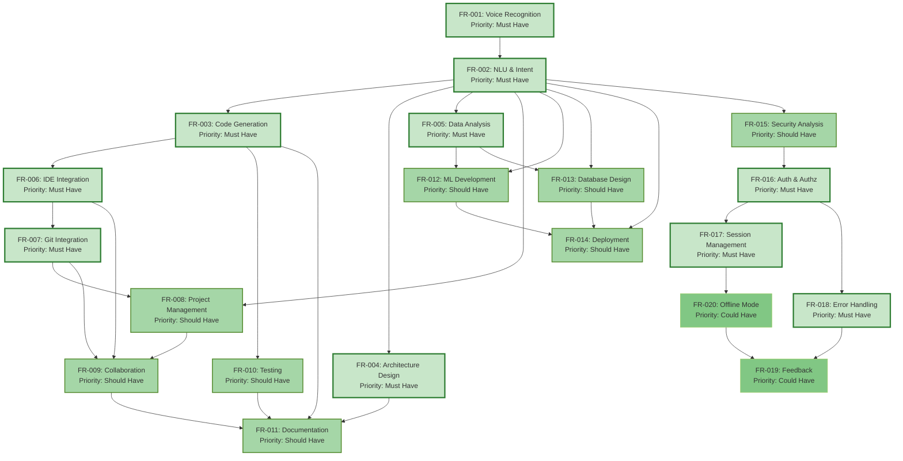

### Non-Functional Requirements Dependencies

```mermaid
graph TD
    NFR_P1["NFR-P-001: Voice Latency<br/>Target: ≤200ms p95"]
    NFR_P2["NFR-P-002: Code Gen Performance<br/>Target: ≤15s for complex"]
    NFR_P3["NFR-P-003: Data Analysis Performance<br/>Target: ≤120s for 100GB"]
    NFR_P4["NFR-P-004: Throughput<br/>Target: 100k req/s"]
    NFR_P5["NFR-P-005: Resource Utilization<br/>Target: ≤75% CPU"]
    
    NFR_S1["NFR-S-001: Horizontal Scalability<br/>Target: Linear scaling"]
    NFR_S2["NFR-S-002: Data Scalability<br/>Target: 10TB database"]
    NFR_S3["NFR-S-003: User Scalability<br/>Target: 100k users"]
    NFR_S4["NFR-S-004: Feature Scalability<br/>Target: Plugin architecture"]
    
    NFR_SEC1["NFR-SEC-001: Auth & Authz<br/>OAuth 2.0, SAML 2.0, MFA"]
    NFR_SEC2["NFR-SEC-002: Encryption<br/>TLS 1.3, AES-256"]
    NFR_SEC3["NFR-SEC-003: Vulnerability Mgmt<br/>SAST, DAST, Pen Testing"]
    NFR_SEC4["NFR-SEC-004: Privacy & Compliance<br/>GDPR, CCPA, SOC 2"]
    NFR_SEC5["NFR-SEC-005: Audit Logging<br/>7-year retention"]
    NFR_SEC6["NFR-SEC-006: API Security<br/>Rate limiting, validation"]
    
    NFR_R1["NFR-R-001: Availability<br/>Target: 99.9% uptime"]
    NFR_R2["NFR-R-002: Disaster Recovery<br/>RTO: ≤1h, RPO: ≤15m"]
    NFR_R3["NFR-R-003: Error Handling<br/>Automatic retry & recovery"]
    NFR_R4["NFR-R-004: Data Integrity<br/>ACID compliance"]
    NFR_R5["NFR-R-005: Monitoring<br/>50+ KPIs tracked"]
    
    NFR_U1["NFR-U-001: Voice Usability<br/>Natural language support"]
    NFR_U2["NFR-U-002: UI Design<br/>WCAG 2.1 Level AA"]
    NFR_U3["NFR-U-003: Onboarding<br/>≤10 min tutorial"]
    NFR_U4["NFR-U-004: Personalization<br/>Custom preferences"]
    
    NFR_M1["NFR-M-001: Code Quality<br/>80% coverage, max 10 complexity"]
    NFR_M2["NFR-M-002: Documentation<br/>Comprehensive & updated"]
    NFR_M3["NFR-M-003: Version Control<br/>Semantic versioning"]
    NFR_M4["NFR-M-004: Logging<br/>30-day retention"]
    NFR_M5["NFR-M-005: Testing & QA<br/>Automated testing"]
    
    NFR_C1["NFR-C-001: Browser Compat<br/>Chrome, Firefox, Safari, Edge"]
    NFR_C2["NFR-C-002: Tool Integration<br/>5+ IDEs, 8+ platforms"]
    NFR_C3["NFR-C-003: Language Support<br/>12+ languages"]
    NFR_C4["NFR-C-004: Database Support<br/>SQL & NoSQL"]
    NFR_C5["NFR-C-005: API Support<br/>REST, GraphQL, gRPC"]
    
    NFR_P1 --> NFR_P4
    NFR_P2 --> NFR_P4
    NFR_P3 --> NFR_P4
    NFR_P5 --> NFR_P4
    
    NFR_P4 --> NFR_S1
    NFR_P4 --> NFR_S2
    NFR_P4 --> NFR_S3
    
    NFR_S1 --> NFR_R1
    NFR_S2 --> NFR_R1
    NFR_S3 --> NFR_R1
    
    NFR_SEC1 --> NFR_SEC5
    NFR_SEC2 --> NFR_SEC5
    NFR_SEC3 --> NFR_SEC5
    NFR_SEC4 --> NFR_SEC5
    NFR_SEC6 --> NFR_SEC5
    
    NFR_SEC5 --> NFR_R1
    
    NFR_R1 --> NFR_R2
    NFR_R1 --> NFR_R5
    
    NFR_R3 --> NFR_R4
    NFR_R4 --> NFR_R1
    
    NFR_U1 --> NFR_U2
    NFR_U2 --> NFR_U3
    NFR_U3 --> NFR_U4
    
    NFR_M1 --> NFR_M2
    NFR_M1 --> NFR_M3
    NFR_M1 --> NFR_M4
    NFR_M1 --> NFR_M5
    
    NFR_M5 --> NFR_R1
    
    NFR_C1 --> NFR_C2
    NFR_C2 --> NFR_C3
    NFR_C2 --> NFR_C4
    NFR_C2 --> NFR_C5
    
    style NFR_P1 fill:#fff9c4,stroke:#f57f17,stroke-width:2px
    style NFR_P2 fill:#fff9c4,stroke:#f57f17,stroke-width:2px
    style NFR_P3 fill:#fff9c4,stroke:#f57f17,stroke-width:2px
    style NFR_P4 fill:#fff9c4,stroke:#f57f17,stroke-width:3px
    style NFR_P5 fill:#fff9c4,stroke:#f57f17,stroke-width:2px
    
    style NFR_S1 fill:#fff9c4,stroke:#f57f17,stroke-width:2px
    style NFR_S2 fill:#fff9c4,stroke:#f57f17,stroke-width:2px
    style NFR_S3 fill:#fff9c4,stroke:#f57f17,stroke-width:2px
    style NFR_S4 fill:#fff9c4,stroke:#f57f17,stroke-width:2px
    
    style NFR_SEC1 fill:#ffccbc,stroke:#d84315,stroke-width:2px
    style NFR_SEC2 fill:#ffccbc,stroke:#d84315,stroke-width:2px
    style NFR_SEC3 fill:#ffccbc,stroke:#d84315,stroke-width:2px
    style NFR_SEC4 fill:#ffccbc,stroke:#d84315,stroke-width:2px
    style NFR_SEC5 fill:#ffccbc,stroke:#d84315,stroke-width:3px
    style NFR_SEC6 fill:#ffccbc,stroke:#d84315,stroke-width:2px
    
    style NFR_R1 fill:#f8bbd0,stroke:#c2185b,stroke-width:3px
    style NFR_R2 fill:#f8bbd0,stroke:#c2185b,stroke-width:2px
    style NFR_R3 fill:#f8bbd0,stroke:#c2185b,stroke-width:2px
    style NFR_R4 fill:#f8bbd0,stroke:#c2185b,stroke-width:2px
    style NFR_R5 fill:#f8bbd0,stroke:#c2185b,stroke-width:2px
    
    style NFR_U1 fill:#d1c4e9,stroke:#512da8,stroke-width:2px
    style NFR_U2 fill:#d1c4e9,stroke:#512da8,stroke-width:2px
    style NFR_U3 fill:#d1c4e9,stroke:#512da8,stroke-width:2px
    style NFR_U4 fill:#d1c4e9,stroke:#512da8,stroke-width:2px
    
    style NFR_M1 fill:#b2dfdb,stroke:#00695c,stroke-width:2px
    style NFR_M2 fill:#b2dfdb,stroke:#00695c,stroke-width:2px
    style NFR_M3 fill:#b2dfdb,stroke:#00695c,stroke-width:2px
    style NFR_M4 fill:#b2dfdb,stroke:#00695c,stroke-width:2px
    style NFR_M5 fill:#b2dfdb,stroke:#00695c,stroke-width:2px
    
    style NFR_C1 fill:#ffe0b2,stroke:#e65100,stroke-width:2px
    style NFR_C2 fill:#ffe0b2,stroke:#e65100,stroke-width:2px
    style NFR_C3 fill:#ffe0b2,stroke:#e65100,stroke-width:2px
    style NFR_C4 fill:#ffe0b2,stroke:#e65100,stroke-width:2px
    style NFR_C5 fill:#ffe0b2,stroke:#e65100,stroke-width:2px
```

---

## USE CASE TO REQUIREMENTS MAPPING

### UC-001: Voice Command Initiation

**Description:** User initiates system interaction through voice command

**Primary Actor:** All Stakeholders

**Functional Requirements:**

- FR-001: Voice Command Recognition and Processing
- FR-002: Natural Language Understanding and Intent Classification
- FR-017: Voice Session Management and Context Preservation
- FR-018: Error Handling and Recovery

**Non-Functional Requirements:**

- NFR-P-001: Voice Processing Latency (≤200ms p95)
- NFR-U-001: Voice Interface Usability
- NFR-C-001: Browser and Device Compatibility
- NFR-R-005: Monitoring and Alerting

**Test Cases:**

- TC-001-001: Verify voice capture at 16kHz sampling rate
- TC-001-002: Verify speech-to-text accuracy ≥95%
- TC-001-003: Verify processing latency ≤200ms p95
- TC-001-004: Verify context preservation across commands
- TC-001-005: Verify error handling for invalid input

---

### UC-002: Code Generation

**Description:** User requests code generation for specific requirements

**Primary Actor:** Software Developer

**Functional Requirements:**

- FR-002: Natural Language Understanding and Intent Classification
- FR-003: Code Generation from Voice Commands
- FR-006: IDE Integration and Code Insertion
- FR-010: Testing and Quality Assurance Assistance
- FR-018: Error Handling and Recovery

**Non-Functional Requirements:**

- NFR-P-002: Code Generation Performance (≤15s for complex)
- NFR-C-003: Programming Language Support (12+ languages)
- NFR-M-001: Code Quality and Standards (80% coverage)
- NFR-M-005: Testing and Quality Assurance

**Test Cases:**

- TC-002-001: Verify code generation for Python function
- TC-002-002: Verify code generation for Java class
- TC-002-003: Verify code insertion into VS Code
- TC-002-004: Verify generated code compiles without errors
- TC-002-005: Verify code follows PEP8 style guide
- TC-002-006: Verify unit test generation
- TC-002-007: Verify code quality metrics calculation

---

### UC-003: Architecture Design

**Description:** User designs software architecture through voice commands

**Primary Actor:** Technical Architect, Software Developer

**Functional Requirements:**

- FR-002: Natural Language Understanding and Intent Classification
- FR-004: Architecture Design and Visualization
- FR-011: Documentation Generation and Management
- FR-018: Error Handling and Recovery

**Non-Functional Requirements:**

- NFR-P-002: Code Generation Performance
- NFR-C-002: Tool Integration (Mermaid, PlantUML)
- NFR-M-002: Documentation
- NFR-U-002: UI Design

**Test Cases:**

- TC-003-001: Verify microservices architecture generation
- TC-003-002: Verify architecture diagram export to Mermaid
- TC-003-003: Verify architecture validation
- TC-003-004: Verify documentation generation
- TC-003-005: Verify architecture pattern suggestions

---

### UC-004: Data Analysis

**Description:** User performs data analysis through voice commands

**Primary Actor:** Data Scientist

**Functional Requirements:**

- FR-002: Natural Language Understanding and Intent Classification
- FR-005: Data Analysis and Visualization Request Processing
- FR-013: Database Schema Design and Query Generation
- FR-018: Error Handling and Recovery

**Non-Functional Requirements:**

- NFR-P-003: Data Analysis Performance (≤120s for 100GB)
- NFR-C-004: Database System Support (SQL & NoSQL)
- NFR-M-005: Testing and Quality Assurance
- NFR-R-004: Data Integrity and Consistency

**Test Cases:**

- TC-004-001: Verify exploratory data analysis generation
- TC-004-002: Verify visualization generation (scatter plot)
- TC-004-003: Verify statistical testing
- TC-004-004: Verify SQL query generation
- TC-004-005: Verify data validation
- TC-004-006: Verify analysis performance for 100GB dataset

---

### UC-005: Testing Assistance

**Description:** User receives assistance with test case generation and execution

**Primary Actor:** Software Developer, QA Engineer

**Functional Requirements:**

- FR-002: Natural Language Understanding and Intent Classification
- FR-010: Testing and Quality Assurance Assistance
- FR-003: Code Generation from Voice Commands
- FR-018: Error Handling and Recovery

**Non-Functional Requirements:**

- NFR-M-005: Testing and Quality Assurance (80% coverage)
- NFR-C-003: Programming Language Support
- NFR-P-002: Code Generation Performance
- NFR-R-005: Monitoring and Alerting

**Test Cases:**

- TC-005-001: Verify unit test generation for Python
- TC-005-002: Verify integration test generation
- TC-005-003: Verify test execution and reporting
- TC-005-004: Verify code coverage calculation
- TC-005-005: Verify edge case suggestions

---

### UC-006: Documentation Generation

**Description:** User generates technical documentation from code and architecture

**Primary Actor:** Technical Architect, Software Developer

**Functional Requirements:**

- FR-002: Natural Language Understanding and Intent Classification
- FR-011: Documentation Generation and Management
- FR-004: Architecture Design and Visualization
- FR-018: Error Handling and Recovery

**Non-Functional Requirements:**

- NFR-M-002: Documentation (Markdown, HTML, PDF)
- NFR-P-002: Code Generation Performance
- NFR-C-002: Tool Integration (Confluence, Notion)
- NFR-U-002: UI Design

**Test Cases:**

- TC-006-001: Verify API documentation generation
- TC-006-002: Verify architecture documentation generation
- TC-006-003: Verify documentation export to Markdown
- TC-006-004: Verify documentation export to PDF
- TC-006-005: Verify documentation version control

---

### UC-007: Model Development

**Description:** User develops machine learning models with system assistance

**Primary Actor:** Data Scientist

**Functional Requirements:**

- FR-002: Natural Language Understanding and Intent Classification
- FR-012: Machine Learning Model Development Assistance
- FR-005: Data Analysis and Visualization Request Processing
- FR-018: Error Handling and Recovery

**Non-Functional Requirements:**

- NFR-P-003: Data Analysis Performance
- NFR-C-003: Programming Language Support (Python, R)
- NFR-C-004: Database System Support
- NFR-M-005: Testing and Quality Assurance

**Test Cases:**

- TC-007-001: Verify model selection recommendations
- TC-007-002: Verify hyperparameter tuning suggestions
- TC-007-003: Verify model evaluation metrics calculation
- TC-007-004: Verify cross-validation implementation
- TC-007-005: Verify feature engineering suggestions

---

### UC-008: Development Workflow

**Description:** User manages development workflow including code insertion and version control

**Primary Actor:** Software Developer

**Functional Requirements:**

- FR-003: Code Generation from Voice Commands
- FR-006: IDE Integration and Code Insertion
- FR-007: Git Repository Integration and Version Control
- FR-018: Error Handling and Recovery

**Non-Functional Requirements:**

- NFR-C-002: Tool Integration (5+ IDEs, Git platforms)
- NFR-P-002: Code Generation Performance
- NFR-M-003: Version Control and Release Management
- NFR-R-005: Monitoring and Alerting

**Test Cases:**

- TC-008-001: Verify code insertion into VS Code
- TC-008-002: Verify Git commit with auto-generated message
- TC-008-003: Verify branch creation and switching
- TC-008-004: Verify merge conflict detection
- TC-008-005: Verify CI/CD pipeline integration

---

### UC-009: Collaboration

**Description:** Multiple users collaborate on the same project in real-time

**Primary Actor:** Software Developer, Data Scientist, Project Manager

**Functional Requirements:**

- FR-009: Real-Time Collaboration and Multi-User Support
- FR-008: Project Management and Task Tracking
- FR-006: IDE Integration and Code Insertion
- FR-018: Error Handling and Recovery

**Non-Functional Requirements:**

- NFR-S-001: Horizontal Scalability (10 concurrent users)
- NFR-R-001: Availability (99.9% uptime)
- NFR-P-004: Throughput (100k req/s)
- NFR-SEC-005: Audit Logging

**Test Cases:**

- TC-009-001: Verify real-time synchronization (<1s latency)
- TC-009-002: Verify conflict detection and resolution
- TC-009-003: Verify user presence indicators
- TC-009-004: Verify activity feed generation
- TC-009-005: Verify permission-based access control

---

### UC-010: Project Management

**Description:** Project manager tracks project progress and manages tasks

**Primary Actor:** Project Manager

**Functional Requirements:**

- FR-008: Project Management and Task Tracking
- FR-002: Natural Language Understanding and Intent Classification
- FR-009: Real-Time Collaboration and Multi-User Support
- FR-018: Error Handling and Recovery

**Non-Functional Requirements:**

- NFR-C-002: Tool Integration (Jira, Asana, Monday.com)
- NFR-S-003: User Scalability (100k users)
- NFR-U-002: UI Design
- NFR-R-005: Monitoring and Alerting

**Test Cases:**

- TC-010-001: Verify task creation from voice command
- TC-010-002: Verify status update via voice
- TC-010-003: Verify sprint planning
- TC-010-004: Verify burndown chart generation
- TC-010-005: Verify Jira integration

---

### UC-011: Pair Programming

**Description:** Two developers collaborate on code through shared voice session

**Primary Actor:** Software Developer

**Functional Requirements:**

- FR-009: Real-Time Collaboration and Multi-User Support
- FR-006: IDE Integration and Code Insertion
- FR-003: Code Generation from Voice Commands
- FR-018: Error Handling and Recovery

**Non-Functional Requirements:**

- NFR-R-001: Availability (99.9% uptime)
- NFR-P-001: Voice Processing Latency (≤200ms p95)
- NFR-S-001: Horizontal Scalability
- NFR-SEC-005: Audit Logging

**Test Cases:**

- TC-011-001: Verify shared voice session creation
- TC-011-002: Verify real-time code synchronization
- TC-011-003: Verify voice communication quality
- TC-011-004: Verify session recording and playback
- TC-011-005: Verify session termination and cleanup

---

### UC-012: Quality Assurance

**Description:** QA team performs quality assurance and testing activities

**Primary Actor:** QA Engineer, Software Developer

**Functional Requirements:**

- FR-010: Testing and Quality Assurance Assistance
- FR-015: Security and Vulnerability Analysis
- FR-002: Natural Language Understanding and Intent Classification
- FR-018: Error Handling and Recovery

**Non-Functional Requirements:**

- NFR-M-005: Testing and Quality Assurance (80% coverage)
- NFR-SEC-003: Vulnerability Management
- NFR-P-002: Code Generation Performance
- NFR-R-005: Monitoring and Alerting

**Test Cases:**

- TC-012-001: Verify security vulnerability detection
- TC-012-002: Verify test case generation
- TC-012-003: Verify test execution and reporting
- TC-012-004: Verify code coverage analysis
- TC-012-005: Verify compliance checking

---

### UC-013: ML Pipeline

**Description:** Data scientist creates end-to-end machine learning pipeline

**Primary Actor:** Data Scientist

**Functional Requirements:**

- FR-012: Machine Learning Model Development Assistance
- FR-005: Data Analysis and Visualization Request Processing
- FR-013: Database Schema Design and Query Generation
- FR-018: Error Handling and Recovery

**Non-Functional Requirements:**

- NFR-P-003: Data Analysis Performance
- NFR-C-003: Programming Language Support (Python)
- NFR-C-004: Database System Support
- NFR-M-005: Testing and Quality Assurance

**Test Cases:**

- TC-013-001: Verify data pipeline generation
- TC-013-002: Verify model training code generation
- TC-013-003: Verify model evaluation code generation
- TC-013-004: Verify deployment code generation
- TC-013-005: Verify pipeline monitoring setup

---

### UC-014: Database Design

**Description:** Developer designs database schema through voice commands

**Primary Actor:** Software Developer, Data Scientist

**Functional Requirements:**

- FR-013: Database Schema Design and Query Generation
- FR-002: Natural Language Understanding and Intent Classification
- FR-004: Architecture Design and Visualization
- FR-018: Error Handling and Recovery

**Non-Functional Requirements:**

- NFR-C-004: Database System Support (SQL & NoSQL)
- NFR-R-004: Data Integrity and Consistency
- NFR-P-002: Code Generation Performance
- NFR-M-002: Documentation

**Test Cases:**

- TC-014-001: Verify schema generation for PostgreSQL
- TC-014-002: Verify schema normalization
- TC-014-003: Verify index suggestions
- TC-014-004: Verify SQL query generation
- TC-014-005: Verify migration script generation

---

### UC-015: Deployment

**Description:** DevOps engineer deploys application to production

**Primary Actor:** DevOps Engineer, Software Developer

**Functional Requirements:**

- FR-014: Deployment and DevOps Automation
- FR-002: Natural Language Understanding and Intent Classification
- FR-007: Git Repository Integration and Version Control
- FR-018: Error Handling and Recovery

**Non-Functional Requirements:**

- NFR-C-002: Tool Integration (AWS, Azure, GCP, Kubernetes)
- NFR-R-001: Availability (99.9% uptime)
- NFR-R-002: Disaster Recovery (RTO ≤1h)
- NFR-R-005: Monitoring and Alerting

**Test Cases:**

- TC-015-001: Verify deployment to AWS
- TC-015-002: Verify deployment to Kubernetes
- TC-015-003: Verify deployment status monitoring
- TC-015-004: Verify automatic rollback on failure
- TC-015-005: Verify health check configuration

---

### UC-016: DevOps Automation

**Description:** DevOps engineer automates infrastructure and operations

**Primary Actor:** DevOps Engineer

**Functional Requirements:**

- FR-014: Deployment and DevOps Automation
- FR-002: Natural Language Understanding and Intent Classification
- FR-018: Error Handling and Recovery

**Non-Functional Requirements:**

- NFR-C-002: Tool Integration (Terraform, Ansible, CloudFormation)
- NFR-S-001: Horizontal Scalability
- NFR-R-001: Availability (99.9% uptime)
- NFR-R-005: Monitoring and Alerting

**Test Cases:**

- TC-016-001: Verify infrastructure provisioning
- TC-016-002: Verify auto-scaling configuration
- TC-016-003: Verify monitoring setup
- TC-016-004: Verify backup configuration
- TC-016-005: Verify disaster recovery setup

---

### UC-017: Security Analysis

**Description:** Security officer analyzes code and configurations for vulnerabilities

**Primary Actor:** Security Officer, Software Developer

**Functional Requirements:**

- FR-015: Security and Vulnerability Analysis
- FR-002: Natural Language Understanding and Intent Classification
- FR-018: Error Handling and Recovery

**Non-Functional Requirements:**

- NFR-SEC-003: Vulnerability Management
- NFR-SEC-004: Privacy and Compliance
- NFR-SEC-005: Audit Logging
- NFR-M-002: Documentation

**Test Cases:**

- TC-017-001: Verify SQL injection detection
- TC-017-002: Verify XSS vulnerability detection
- TC-017-003: Verify hardcoded credential detection
- TC-017-004: Verify dependency vulnerability scanning
- TC-017-005: Verify remediation code generation

---

### UC-018: Compliance

**Description:** Organization ensures compliance with regulations and standards

**Primary Actor:** Security Officer, Compliance Officer

**Functional Requirements:**

- FR-015: Security and Vulnerability Analysis
- FR-016: User Authentication and Authorization
- FR-018: Error Handling and Recovery

**Non-Functional Requirements:**

- NFR-SEC-004: Privacy and Compliance (GDPR, CCPA, SOC 2)
- NFR-SEC-005: Audit Logging (7-year retention)
- NFR-M-002: Documentation
- NFR-R-005: Monitoring and Alerting

**Test Cases:**

- TC-018-001: Verify GDPR compliance
- TC-018-002: Verify CCPA compliance
- TC-018-003: Verify SOC 2 compliance
- TC-018-004: Verify audit log retention
- TC-018-005: Verify compliance reporting

---

### UC-019: User Management

**Description:** Administrator manages users and permissions

**Primary Actor:** Admin, Security Officer

**Functional Requirements:**

- FR-016: User Authentication and Authorization
- FR-002: Natural Language Understanding and Intent Classification
- FR-018: Error Handling and Recovery

**Non-Functional Requirements:**

- NFR-SEC-001: Authentication and Authorization
- NFR-SEC-005: Audit Logging
- NFR-U-003: Onboarding and Training
- NFR-R-005: Monitoring and Alerting

**Test Cases:**

- TC-019-001: Verify user creation
- TC-019-002: Verify role assignment
- TC-019-003: Verify permission management
- TC-019-004: Verify MFA setup
- TC-019-005: Verify user deactivation

---

### UC-020: Security

**Description:** System maintains security across all operations

**Primary Actor:** Security Officer, All Stakeholders

**Functional Requirements:**

- FR-016: User Authentication and Authorization
- FR-015: Security and Vulnerability Analysis
- FR-018: Error Handling and Recovery

**Non-Functional Requirements:**

- NFR-SEC-001: Authentication and Authorization
- NFR-SEC-002: Data Encryption (TLS 1.3, AES-256)
- NFR-SEC-005: Audit Logging
- NFR-SEC-006: API Security

**Test Cases:**

- TC-020-001: Verify TLS 1.3 encryption
- TC-020-002: Verify AES-256 encryption at rest
- TC-020-003: Verify API rate limiting
- TC-020-004: Verify request validation
- TC-020-005: Verify audit log integrity

---

### UC-021: Session Management

**Description:** System manages user sessions and context

**Primary Actor:** All Stakeholders

**Functional Requirements:**

- FR-017: Voice Session Management and Context Preservation
- FR-016: User Authentication and Authorization
- FR-018: Error Handling and Recovery

**Non-Functional Requirements:**

- NFR-R-001: Availability (99.9% uptime)
- NFR-SEC-005: Audit Logging
- NFR-P-001: Voice Processing Latency
- NFR-U-001: Voice Interface Usability

**Test Cases:**

- TC-021-001: Verify session creation
- TC-021-002: Verify context preservation
- TC-021-003: Verify session timeout
- TC-021-004: Verify session recovery
- TC-021-005: Verify session cleanup

---

### UC-022: Error Handling

**Description:** System handles errors gracefully and provides recovery options

**Primary Actor:** All Stakeholders

**Functional Requirements:**

- FR-018: Error Handling and Recovery
- FR-002: Natural Language Understanding and Intent Classification

**Non-Functional Requirements:**

- NFR-R-003: Error Handling and Recovery
- NFR-R-005: Monitoring and Alerting
- NFR-M-004: Logging and Debugging
- NFR-U-001: Voice Interface Usability

**Test Cases:**

- TC-022-001: Verify error logging
- TC-022-002: Verify automatic retry logic
- TC-022-003: Verify user-friendly error messages
- TC-022-004: Verify error recovery suggestions
- TC-022-005: Verify error analytics

---

### UC-023: Feedback

**Description:** System collects user feedback for continuous improvement

**Primary Actor:** All Stakeholders

**Functional Requirements:**

- FR-019: Feedback and Continuous Improvement
- FR-002: Natural Language Understanding and Intent Classification

**Non-Functional Requirements:**

- NFR-U-001: Voice Interface Usability
- NFR-U-004: Personalization and Customization
- NFR-R-005: Monitoring and Alerting
- NFR-M-004: Logging and Debugging

**Test Cases:**

- TC-023-001: Verify feedback collection
- TC-023-002: Verify satisfaction rating
- TC-023-003: Verify feedback analysis
- TC-023-004: Verify trend identification
- TC-023-005: Verify feedback integration with roadmap

---

### UC-024: Continuous Improvement

**Description:** System continuously improves based on usage and feedback

**Primary Actor:** Product Manager, Development Team

**Functional Requirements:**

- FR-019: Feedback and Continuous Improvement
- FR-002: Natural Language Understanding and Intent Classification

**Non-Functional Requirements:**

- NFR-U-004: Personalization and Customization
- NFR-M-001: Code Quality and Standards
- NFR-R-005: Monitoring and Alerting
- NFR-S-004: Feature Scalability

**Test Cases:**

- TC-024-001: Verify A/B testing framework
- TC-024-002: Verify feature flag management
- TC-024-003: Verify quality metrics tracking
- TC-024-004: Verify improvement suggestions
- TC-024-005: Verify rollout automation

---

### UC-025: Offline Mode

**Description:** User can work offline with local caching

**Primary Actor:** Software Developer, Data Scientist

**Functional Requirements:**

- FR-020: Offline Mode and Caching
- FR-001: Voice Command Recognition and Processing
- FR-018: Error Handling and Recovery

**Non-Functional Requirements:**

- NFR-P-005: Memory and Resource Utilization (500MB cache)
- NFR-R-004: Data Integrity and Consistency
- NFR-U-001: Voice Interface Usability
- NFR-C-001: Browser and Device Compatibility

**Test Cases:**

- TC-025-001: Verify offline mode activation
- TC-025-002: Verify local cache storage
- TC-025-003: Verify offline command execution
- TC-025-004: Verify synchronization on reconnect
- TC-025-005: Verify conflict resolution

---

### UC-026: Caching

**Description:** System caches frequently used data and commands

**Primary Actor:** All Stakeholders

**Functional Requirements:**

- FR-020: Offline Mode and Caching
- FR-001: Voice Command Recognition and Processing

**Non-Functional Requirements:**

- NFR-P-005: Memory and Resource Utilization
- NFR-P-004: Throughput and Capacity
- NFR-R-004: Data Integrity and Consistency
- NFR-SEC-002: Data Encryption

**Test Cases:**

- TC-026-001: Verify cache hit rate
- TC-026-002: Verify cache invalidation
- TC-026-003: Verify cache encryption
- TC-026-004: Verify cache cleanup
- TC-026-005: Verify cache performance improvement

---

## REQUIREMENTS TRACEABILITY MATRIX TABLE

| Requirement ID | Description                 | Priority    | Source         | Related FRs            | Related NFRs                          | Test Cases               | Status  |
|----------------|-----------------------------|-------------|----------------|------------------------|---------------------------------------|--------------------------|---------|
| FR-001         | Voice Command Recognition   | Must Have   | All            | -                      | NFR-P-001, NFR-U-001, NFR-C-001       | TC-001-001 to TC-001-005 | Defined |
| FR-002         | NLU & Intent Classification | Must Have   | All            | -                      | NFR-P-001, NFR-P-002                  | TC-001-001 to TC-001-005 | Defined |
| FR-003         | Code Generation             | Must Have   | Developer      | FR-006, FR-010         | NFR-P-002, NFR-C-003, NFR-M-001       | TC-002-001 to TC-002-007 | Defined |
| FR-004         | Architecture Design         | Must Have   | Architect      | FR-011                 | NFR-P-002, NFR-C-002, NFR-M-002       | TC-003-001 to TC-003-005 | Defined |
| FR-005         | Data Analysis               | Must Have   | Data Scientist | FR-012, FR-013         | NFR-P-003, NFR-C-004, NFR-M-005       | TC-004-001 to TC-004-006 | Defined |
| FR-006         | IDE Integration             | Must Have   | Developer      | FR-003, FR-007, FR-009 | NFR-C-002, NFR-P-002                  | TC-008-001 to TC-008-005 | Defined |
| FR-007         | Git Integration             | Must Have   | Developer      | FR-006, FR-008, FR-009 | NFR-C-002, NFR-M-003                  | TC-008-001 to TC-008-005 | Defined |
| FR-008         | Project Management          | Should Have | PM             | FR-009                 | NFR-C-002, NFR-S-003                  | TC-010-001 to TC-010-005 | Defined |
| FR-009         | Collaboration               | Should Have | All            | FR-006, FR-007, FR-008 | NFR-S-001, NFR-R-001, NFR-P-004       | TC-009-001 to TC-009-005 | Defined |
| FR-010         | Testing                     | Should Have | Developer      | FR-003                 | NFR-M-005, NFR-C-003                  | TC-005-001 to TC-005-005 | Defined |
| FR-011         | Documentation               | Should Have | Architect      | FR-004                 | NFR-M-002, NFR-C-002                  | TC-006-001 to TC-006-005 | Defined |
| FR-012         | ML Development              | Should Have | Data Scientist | FR-005                 | NFR-P-003, NFR-C-003, NFR-C-004       | TC-007-001 to TC-007-005 | Defined |
| FR-013         | Database Design             | Should Have | Developer      | FR-005                 | NFR-C-004, NFR-R-004                  | TC-014-001 to TC-014-005 | Defined |
| FR-014         | Deployment                  | Should Have | DevOps         | FR-007                 | NFR-C-002, NFR-R-001, NFR-R-002       | TC-015-001 to TC-015-005 | Defined |
| FR-015         | Security Analysis           | Should Have | Security       | FR-016                 | NFR-SEC-003, NFR-SEC-004              | TC-017-001 to TC-017-005 | Defined |
| FR-016         | Auth & Authz                | Must Have   | Security       | FR-017, FR-018         | NFR-SEC-001, NFR-SEC-002, NFR-SEC-005 | TC-019-001 to TC-019-005 | Defined |
| FR-017         | Session Management          | Must Have   | All            | FR-016, FR-018         | NFR-R-001, NFR-SEC-005                | TC-021-001 to TC-021-005 | Defined |
| FR-018         | Error Handling              | Must Have   | All            | -                      | NFR-R-003, NFR-R-005, NFR-M-004       | TC-022-001 to TC-022-005 | Defined |
| FR-019         | Feedback                    | Could Have  | PM             | -                      | NFR-U-001, NFR-U-004                  | TC-023-001 to TC-023-005 | Defined |
| FR-020         | Offline Mode                | Could Have  | Developer      | -                      | NFR-P-005, NFR-R-004                  | TC-025-001 to TC-025-005 | Defined |

---

## SUMMARY STATISTICS

### Functional Requirements Summary

| Priority    | Count  | Percentage |
|-------------|--------|------------|
| Must Have   | 10     | 50%        |
| Should Have | 8      | 40%        |
| Could Have  | 2      | 10%        |
| Won't Have  | 0      | 0%         |
| **Total**   | **20** | **100%**   |

### Non-Functional Requirements Summary

| Category        | Count  | Critical | High   | Medium |
|-----------------|--------|----------|--------|--------|
| Performance     | 5      | 3        | 2      | 0      |
| Scalability     | 4      | 2        | 2      | 0      |
| Security        | 6      | 4        | 2      | 0      |
| Reliability     | 5      | 3        | 2      | 0      |
| Usability       | 4      | 1        | 2      | 1      |
| Maintainability | 5      | 1        | 2      | 2      |
| Compatibility   | 5      | 2        | 2      | 1      |
| **Total**       | **34** | **16**   | **14** | **4**  |

### Use Cases Summary

| Category                   | Count  |
|----------------------------|--------|
| Core Development           | 8      |
| Data Science               | 4      |
| Operations & DevOps        | 3      |
| Collaboration & Management | 3      |
| Security & Compliance      | 2      |
| System Management          | 6      |
| **Total**                  | **26** |

---

## REQUIREMENTS VALIDATION CHECKLIST

- [x] All requirements have unique identifiers
- [x] All requirements have clear, testable descriptions
- [x] All requirements have defined priorities
- [x] All requirements have identified sources
- [x] All requirements have acceptance criteria
- [x] All requirements have traceability links
- [x] All requirements are consistent and non-conflicting
- [x] All requirements are feasible within constraints
- [x] All requirements are aligned with project goals
- [x] All requirements have associated test cases
- [x] All requirements follow naming conventions
- [x] All requirements are measurable and verifiable

---

## NEXT STEPS

1. **Requirements Review:** Conduct stakeholder review and approval
2. **Requirements Prioritization:** Finalize MoSCoW prioritization with stakeholders
3. **Requirements Refinement:** Address feedback and clarifications
4. **Test Case Development:** Develop detailed test cases for each requirement
5. **Architecture Design:** Begin system architecture design based on requirements
6. **Implementation Planning:** Create implementation roadmap and sprint planning
7. **Continuous Monitoring:** Track requirement changes and updates throughout project lifecycle

---

**Document Version:** 1.0  
**Last Updated:** 2024  
**Status:** Draft - Awaiting Stakeholder Review  
**Next Review Date:** Upon stakeholder feedback

---

## System Architecture

# Voice-Centric Software Development and Data Science Agent

## Comprehensive Architecture Documentation

---

## Table of Contents

1. [System Context Diagram (C4 Level 1)](#system-context-diagram)
2. [Container Diagram (C4 Level 2)](#container-diagram)
3. [Component Diagram (C4 Level 3)](#component-diagram)
4. [Deployment Diagram](#deployment-diagram)
5. [Technology Stack Summary](#technology-stack-summary)
6. [Architecture Decision Records](#architecture-decision-records)
7. [Data Flow Architecture](#data-flow-architecture)
8. [Security Architecture](#security-architecture)
9. [Integration Architecture](#integration-architecture)

---

## System Context Diagram (C4 Level 1)

### Overview

The Voice-Centric Agent operates as a central hub connecting developers and data scientists with their development
tools, data platforms, and collaboration systems through natural language voice interfaces.

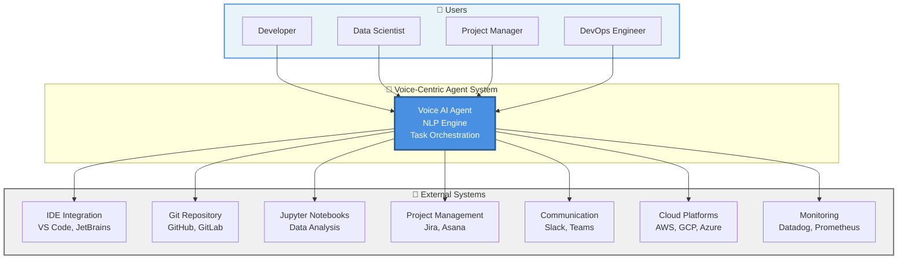

### System Responsibilities

- **Voice Input Processing**: Capture and process voice commands with <500ms latency
- **Natural Language Understanding**: Parse developer intent and technical context
- **Task Orchestration**: Route requests to appropriate external systems
- **Real-time Feedback**: Provide voice and visual feedback on task execution
- **Context Management**: Maintain conversation history and project context
- **Security & Compliance**: Enforce authentication, authorization, and data privacy

---

## Container Diagram (C4 Level 2)

### High-Level Architecture

```mermaid
graph TB
    subgraph ClientLayer["🖥️ Client Layer"]
        WEB["Web Dashboard<br/>React + TypeScript<br/>Real-time UI"]
        MOBILE["Mobile App<br/>React Native<br/>Voice Interface"]
        VOICE["Voice Client<br/>WebRTC<br/>Audio Streaming"]
    end
    
    subgraph APIGateway["🚪 API Gateway & Load Balancing"]
        LB["Load Balancer<br/>Nginx/HAProxy"]
        APIGW["API Gateway<br/>Kong/AWS API Gateway"]
    end
    
    subgraph CoreServices["⚙️ Core Microservices"]
        VOICE_SVC["Voice Processing Service<br/>Python/FastAPI<br/>Audio Processing"]
        NLP_SVC["NLP Service<br/>Python/FastAPI<br/>Intent Recognition"]
        TASK_SVC["Task Orchestration Service<br/>Node.js/Express<br/>Workflow Management"]
        CONTEXT_SVC["Context Management Service<br/>Node.js/Express<br/>State Management"]
        INTEGRATION_SVC["Integration Service<br/>Python/FastAPI<br/>External APIs"]
    end
    
    subgraph DataLayer["💾 Data Layer"]
        POSTGRES["Primary Database<br/>PostgreSQL<br/>Relational Data"]
        REDIS["Cache Layer<br/>Redis<br/>Session & Cache"]
        MONGO["Document Store<br/>MongoDB<br/>Conversation Logs"]
        VECTOR_DB["Vector Database<br/>Pinecone/Weaviate<br/>Embeddings"]
    end
    
    subgraph ExternalIntegrations["🔌 External Integrations"]
        IDE_ADAPTER["IDE Adapter<br/>VS Code Extension"]
        GIT_ADAPTER["Git Adapter<br/>GitHub/GitLab API"]
        JUPYTER_ADAPTER["Jupyter Adapter<br/>Notebook API"]
        JIRA_ADAPTER["Jira Adapter<br/>REST API"]
        CLOUD_ADAPTER["Cloud Adapter<br/>AWS/GCP/Azure SDK"]
    end
    
    subgraph SupportServices["🛠️ Support Services"]
        AUTH["Authentication Service<br/>OAuth 2.0/JWT"]
        LOGGING["Logging Service<br/>ELK Stack"]
        MONITORING["Monitoring Service<br/>Prometheus/Grafana"]
        QUEUE["Message Queue<br/>RabbitMQ/Kafka"]
    end
    
    %% Client to Gateway
    WEB --> LB
    MOBILE --> LB
    VOICE --> LB
    LB --> APIGW
    
    %% Gateway to Services
    APIGW --> VOICE_SVC
    APIGW --> NLP_SVC
    APIGW --> TASK_SVC
    APIGW --> CONTEXT_SVC
    APIGW --> INTEGRATION_SVC
    
    %% Services to Data Layer
    VOICE_SVC --> REDIS
    NLP_SVC --> VECTOR_DB
    TASK_SVC --> POSTGRES
    CONTEXT_SVC --> MONGO
    CONTEXT_SVC --> REDIS
    INTEGRATION_SVC --> POSTGRES
    
    %% Services to External
    TASK_SVC --> IDE_ADAPTER
    TASK_SVC --> GIT_ADAPTER
    TASK_SVC --> JUPYTER_ADAPTER
    TASK_SVC --> JIRA_ADAPTER
    INTEGRATION_SVC --> CLOUD_ADAPTER
    
    %% Support Services
    VOICE_SVC --> AUTH
    NLP_SVC --> AUTH
    TASK_SVC --> QUEUE
    VOICE_SVC --> LOGGING
    NLP_SVC --> LOGGING
    TASK_SVC --> MONITORING
    
    style ClientLayer fill:#E3F2FD,stroke:#1976D2,stroke-width:2px
    style APIGateway fill:#F3E5F5,stroke:#7B1FA2,stroke-width:2px
    style CoreServices fill:#E8F5E9,stroke:#388E3C,stroke-width:2px
    style DataLayer fill:#FFF3E0,stroke:#F57C00,stroke-width:2px
    style ExternalIntegrations fill:#FCE4EC,stroke:#C2185B,stroke-width:2px
    style SupportServices fill:#F1F8E9,stroke:#689F38,stroke-width:2px
```

### Container Descriptions

| Container                      | Technology                    | Responsibility                            | Scalability              |
|--------------------------------|-------------------------------|-------------------------------------------|--------------------------|
| **Web Dashboard**              | React + TypeScript            | Real-time UI, voice control visualization | Horizontal (CDN)         |
| **Mobile App**                 | React Native                  | Cross-platform voice interface            | Horizontal (CDN)         |
| **Voice Client**               | WebRTC + Web Audio API        | Audio capture and streaming               | Horizontal (Edge)        |
| **Voice Processing Service**   | Python/FastAPI                | Audio codec handling, noise reduction     | Horizontal (Kubernetes)  |
| **NLP Service**                | Python/FastAPI + Transformers | Intent recognition, entity extraction     | Horizontal (GPU nodes)   |
| **Task Orchestration Service** | Node.js/Express               | Workflow execution, state management      | Horizontal (Kubernetes)  |
| **Context Management Service** | Node.js/Express               | Conversation history, project context     | Horizontal (Kubernetes)  |
| **Integration Service**        | Python/FastAPI                | External API orchestration                | Horizontal (Kubernetes)  |
| **PostgreSQL**                 | PostgreSQL 14+                | Relational data, transactions             | Vertical + Read Replicas |
| **Redis**                      | Redis Cluster                 | Session cache, real-time data             | Horizontal (Cluster)     |
| **MongoDB**                    | MongoDB Atlas                 | Conversation logs, unstructured data      | Horizontal (Sharding)    |
| **Vector Database**            | Pinecone/Weaviate             | Semantic search, embeddings               | Horizontal (Managed)     |

---

## Component Diagram (C4 Level 3)

### Voice Processing Service Components

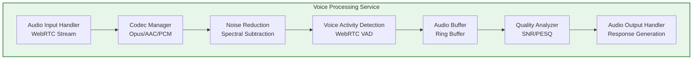

### NLP Service Components

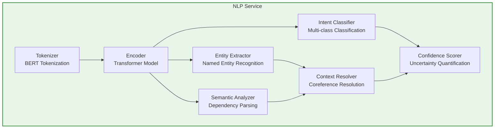

### Task Orchestration Service Components

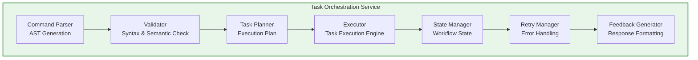

### Integration Service Components

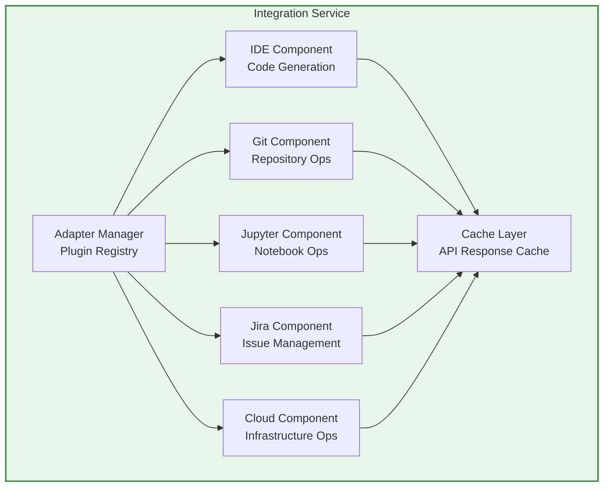

### Context Management Service Components

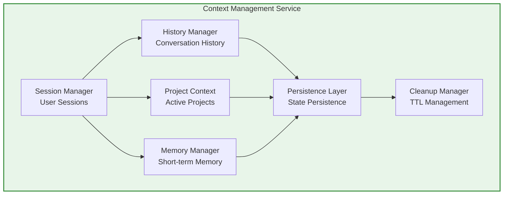

---

## Deployment Diagram

### Production Infrastructure

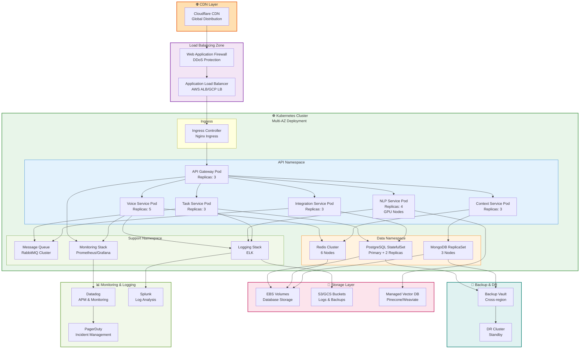

### Deployment Specifications

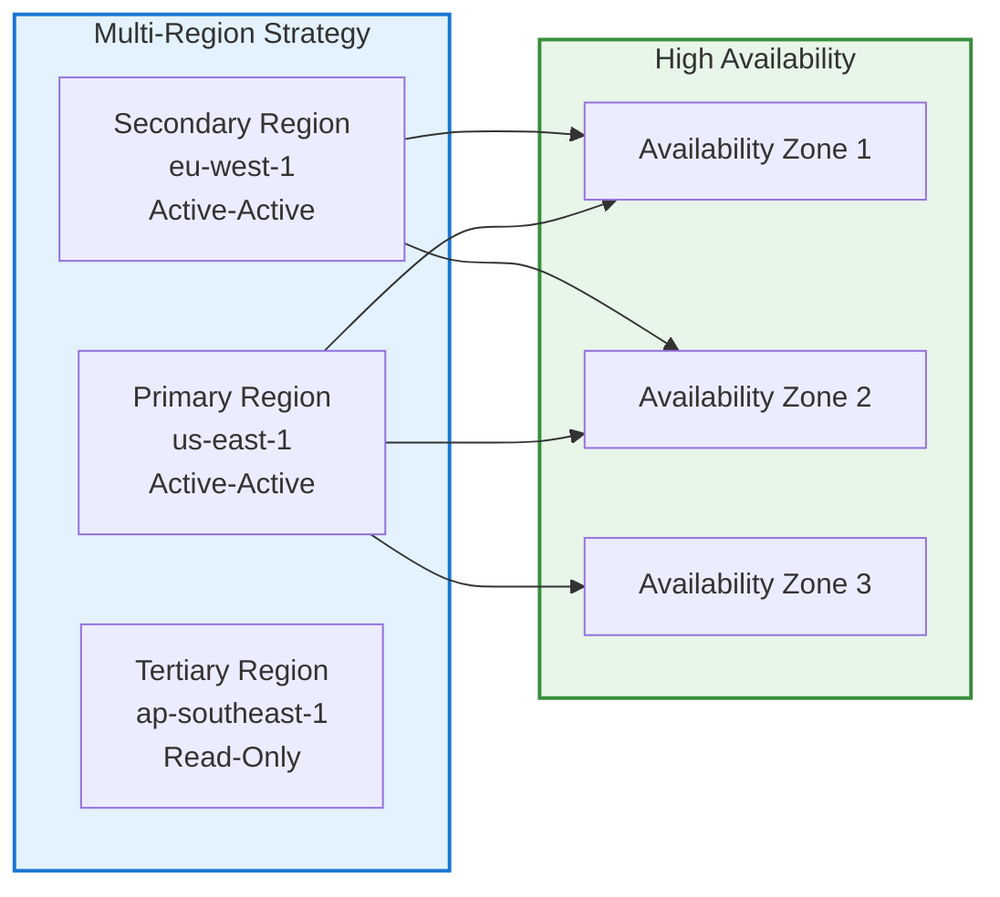

---

## Technology Stack Summary

### Frontend Technologies

| Layer                       | Technology                   | Purpose                  | Version |
|-----------------------------|------------------------------|--------------------------|---------|
| **Web Framework**           | React                        | UI framework             | 18.x    |
| **Language**                | TypeScript                   | Type safety              | 5.x     |
| **State Management**        | Redux Toolkit                | Global state             | 1.9.x   |
| **Real-time Communication** | Socket.io                    | WebSocket events         | 4.x     |
| **Voice Interface**         | Web Audio API                | Audio processing         | Native  |
| **Voice Capture**           | WebRTC                       | Audio streaming          | Native  |
| **UI Components**           | Material-UI                  | Component library        | 5.x     |
| **Visualization**           | D3.js + Recharts             | Data visualization       | Latest  |
| **Build Tool**              | Vite                         | Build optimization       | 4.x     |
| **Testing**                 | Jest + React Testing Library | Unit & integration tests | Latest  |

### Backend Technologies

| Layer                   | Technology             | Purpose             | Version  |
|-------------------------|------------------------|---------------------|----------|
| **API Gateway**         | Kong                   | API management      | 3.x      |
| **Voice Service**       | FastAPI + Python       | Audio processing    | 3.10+    |
| **NLP Service**         | FastAPI + Transformers | Intent recognition  | 4.x      |
| **Task Service**        | Express.js + Node.js   | Orchestration       | 18.x LTS |
| **Context Service**     | Express.js + Node.js   | State management    | 18.x LTS |
| **Integration Service** | FastAPI + Python       | External APIs       | 3.10+    |
| **Authentication**      | Auth0/Keycloak         | Identity management | Latest   |
| **Message Queue**       | RabbitMQ               | Async processing    | 3.12.x   |
| **Task Scheduler**      | Celery + Redis         | Background jobs     | 5.x      |

### Data Storage Technologies

| Layer               | Technology        | Purpose             | Version |
|---------------------|-------------------|---------------------|---------|
| **Relational DB**   | PostgreSQL        | Transactional data  | 14+     |
| **Cache Layer**     | Redis             | Session & cache     | 7.x     |
| **Document Store**  | MongoDB           | Conversation logs   | 6.x     |
| **Vector Database** | Pinecone/Weaviate | Embeddings & search | Latest  |
| **Time-Series DB**  | InfluxDB          | Metrics & telemetry | 2.x     |
| **Search Engine**   | Elasticsearch     | Full-text search    | 8.x     |

### Infrastructure & DevOps

| Layer                        | Technology               | Purpose                     | Version |
|------------------------------|--------------------------|-----------------------------|---------|
| **Container Orchestration**  | Kubernetes               | Container management        | 1.27+   |
| **Container Runtime**        | Docker                   | Containerization            | 24.x    |
| **Infrastructure as Code**   | Terraform                | Infrastructure provisioning | 1.5+    |
| **Configuration Management** | Helm                     | K8s package management      | 3.x     |
| **CI/CD Pipeline**           | GitHub Actions/GitLab CI | Automation                  | Latest  |
| **Container Registry**       | Docker Hub/ECR           | Image storage               | Latest  |
| **Service Mesh**             | Istio                    | Service communication       | 1.17+   |
| **Ingress Controller**       | Nginx Ingress            | Traffic routing             | Latest  |
| **Load Balancer**            | AWS ALB/GCP LB           | Traffic distribution        | Latest  |
| **CDN**                      | Cloudflare               | Global distribution         | Latest  |

### Monitoring & Observability

| Layer                   | Technology | Purpose                | Version |
|-------------------------|------------|------------------------|---------|
| **Metrics**             | Prometheus | Metrics collection     | 2.x     |
| **Visualization**       | Grafana    | Dashboards             | 10.x    |
| **APM**                 | Datadog    | Application monitoring | Latest  |
| **Logging**             | ELK Stack  | Log aggregation        | 8.x     |
| **Tracing**             | Jaeger     | Distributed tracing    | 1.x     |
| **Incident Management** | PagerDuty  | On-call management     | Latest  |
| **Error Tracking**      | Sentry     | Error monitoring       | Latest  |

### AI/ML Technologies

| Layer                  | Technology                 | Purpose            | Version |
|------------------------|----------------------------|--------------------|---------|
| **NLP Framework**      | Hugging Face Transformers  | Pre-trained models | 4.x     |
| **Speech Recognition** | Whisper/DeepSpeech         | Audio-to-text      | Latest  |
| **Text-to-Speech**     | Google Cloud TTS/Azure TTS | Text-to-audio      | Latest  |
| **ML Framework**       | PyTorch                    | Deep learning      | 2.x     |
| **Model Serving**      | TensorFlow Serving/Triton  | Model inference    | Latest  |
| **Vector Embeddings**  | Sentence Transformers      | Text embeddings    | Latest  |

---

## Architecture Decision Records

### ADR-001: Microservices Architecture

**ID**: ADR-001  
**Status**: Accepted  
**Date**: 2024-01-15

#### Context

The system needs to handle multiple concurrent voice processing requests, NLP analysis, and external integrations with
varying latency requirements. A monolithic architecture would create bottlenecks and limit independent scaling.

#### Decision

Adopt a microservices architecture with the following services:

- Voice Processing Service (Python/FastAPI)
- NLP Service (Python/FastAPI with GPU support)
- Task Orchestration Service (Node.js/Express)
- Context Management Service (Node.js/Express)
- Integration Service (Python/FastAPI)

#### Consequences

**Positive**:

- Independent scaling of compute-intensive services (NLP)
- Technology diversity (Python for ML, Node.js for orchestration)
- Fault isolation and resilience
- Faster deployment cycles
- Team autonomy

**Negative**:

- Increased operational complexity
- Network latency between services
- Distributed transaction management
- Debugging complexity

**Mitigation**:

- Implement service mesh (Istio) for observability
- Use correlation IDs for request tracing
- Implement circuit breakers and retry logic
- Comprehensive monitoring and logging

---

### ADR-002: Kubernetes for Container Orchestration

**ID**: ADR-002  
**Status**: Accepted  
**Date**: 2024-01-15

#### Context

The system requires:

- Auto-scaling based on voice processing load
- Self-healing capabilities
- Rolling deployments with zero downtime
- Multi-region deployment support
- 99.9% uptime SLA

#### Decision

Deploy all microservices on Kubernetes (EKS/GKE/AKS) with:

- Multi-AZ deployment for high availability
- Horizontal Pod Autoscaling (HPA) based on CPU/memory
- StatefulSets for databases
- Helm charts for package management

#### Consequences

**Positive**:

- Native auto-scaling and self-healing
- Declarative infrastructure
- Multi-cloud portability
- Mature ecosystem and tooling
- Community support

**Negative**:

- Steep learning curve
- Operational overhead
- Resource overhead (etcd, control plane)
- Complexity in debugging

**Mitigation**:

- Use managed Kubernetes services (EKS/GKE)
- Implement comprehensive monitoring
- Automate deployment with GitOps (ArgoCD)
- Regular training for operations team

---

### ADR-003: PostgreSQL + MongoDB Polyglot Persistence

**ID**: ADR-003  
**Status**: Accepted  
**Date**: 2024-01-16

#### Context

Different data types have different requirements:

- Structured, transactional data (tasks, users, projects)
- Unstructured conversation logs with flexible schema
- Time-series metrics data
- Vector embeddings for semantic search

#### Decision

Implement polyglot persistence:

- **PostgreSQL**: Transactional data, ACID compliance
- **MongoDB**: Conversation logs, flexible schema
- **Redis**: Caching, sessions, real-time data
- **Pinecone/Weaviate**: Vector embeddings

#### Consequences

**Positive**:

- Optimal data model for each use case
- Better performance for specific queries
- Flexibility in schema evolution
- Reduced data transformation overhead

**Negative**:

- Operational complexity
- Multiple backup/recovery procedures
- Data consistency challenges
- Increased infrastructure costs

**Mitigation**:

- Implement event sourcing for consistency
- Use distributed transactions where needed
- Comprehensive backup strategy
- Clear data ownership boundaries

---

### ADR-004: Real-time Voice Processing with <500ms Latency

**ID**: ADR-004  
**Status**: Accepted  
**Date**: 2024-01-16

#### Context

User experience requires voice response within 500ms. This includes:

- Audio capture and transmission
- Voice processing
- NLP analysis
- Task execution
- Response generation

#### Decision

Implement multi-level optimization:

1. **Client-side**: WebRTC for low-latency audio streaming
2. **Network**: Edge computing for voice processing
3. **Processing**: Streaming NLP with incremental results
4. **Caching**: Aggressive caching of common intents

#### Consequences

**Positive**:

- Acceptable user experience
- Reduced server load
- Better resource utilization
- Improved responsiveness

**Negative**:

- Complex distributed processing
- Increased client-side complexity
- Cache invalidation challenges
- Requires edge infrastructure

**Mitigation**:

- Implement SLA monitoring
- Use CDN for edge processing
- Implement request prioritization
- Regular performance testing

---

### ADR-005: Event-Driven Architecture with Message Queue

**ID**: ADR-005  
**Status**: Accepted  
**Date**: 2024-01-17

#### Context

Services need to communicate asynchronously for:

- Long-running tasks (code generation, data analysis)
- Decoupling services
- Handling traffic spikes
- Ensuring reliability

#### Decision

Implement event-driven architecture using RabbitMQ:

- Task events published to message queue
- Services subscribe to relevant events
- Dead-letter queues for failed messages
- Event sourcing for audit trail

#### Consequences

**Positive**:

- Loose coupling between services
- Better scalability
- Improved reliability
- Audit trail of all events

**Negative**:

- Eventual consistency challenges
- Debugging complexity
- Message ordering issues
- Operational overhead

**Mitigation**:

- Implement idempotent message handlers
- Use correlation IDs for tracing
- Implement monitoring for queue depth
- Regular testing of failure scenarios

---

### ADR-006: OAuth 2.0 + JWT for Authentication

**ID**: ADR-006  
**Status**: Accepted  
**Date**: 2024-01-17

#### Context

System needs to support:

- Multiple user types (developers, data scientists, managers)
- Integration with enterprise identity providers
- Stateless authentication
- Fine-grained authorization

#### Decision

Implement OAuth 2.0 with JWT tokens:

- Auth0/Keycloak as identity provider
- JWT tokens for stateless authentication
- Role-Based Access Control (RBAC)
- Refresh token rotation

#### Consequences

**Positive**:

- Industry standard authentication
- Stateless and scalable
- Enterprise integration support
- Fine-grained access control

**Negative**:

- Token management complexity
- Revocation challenges
- Increased token size in requests
- Requires secure token storage

**Mitigation**:

- Implement token refresh strategy
- Use short-lived access tokens
- Implement token revocation list
- Secure token storage in client

---

### ADR-007: GPU-Accelerated NLP Processing

**ID**: ADR-007  
**Status**: Accepted  
**Date**: 2024-01-18

#### Context

NLP models (BERT, GPT) require significant compute resources. CPU-only processing would exceed latency requirements and
increase costs.

#### Decision

Deploy NLP service on GPU nodes:

- NVIDIA GPUs (A100/H100) for inference
- TensorFlow Serving or Triton for model serving
- Batch processing for non-real-time tasks
- Model quantization for reduced memory

#### Consequences

**Positive**:

- 10-100x performance improvement
- Reduced latency for NLP tasks
- Support for larger models
- Better resource utilization

**Negative**:

- Significantly higher infrastructure costs
- GPU availability constraints
- Increased operational complexity
- Power consumption concerns

**Mitigation**:

- Use spot instances for non-critical workloads
- Implement model caching
- Use model quantization
- Regular cost optimization

---

### ADR-008: Multi-Region Active-Active Deployment

**ID**: ADR-008  
**Status**: Accepted  
**Date**: 2024-01-18

#### Context

99.9% uptime requirement and global user base require:

- Disaster recovery capability
- Low-latency access from multiple regions
- Automatic failover

#### Decision

Deploy active-active in multiple regions:

- Primary: us-east-1 (North America)
- Secondary: eu-west-1 (Europe)
- Tertiary: ap-southeast-1 (Asia-Pacific)
- Global load balancing with health checks
- Cross-region replication for data

#### Consequences

**Positive**:

- Reduced latency for global users
- Automatic failover capability
- Improved disaster recovery
- Better compliance with data residency

**Negative**:

- 3x infrastructure costs
- Data consistency challenges
- Operational complexity
- Network bandwidth costs

**Mitigation**:

- Use managed services for replication
- Implement eventual consistency patterns
- Comprehensive monitoring across regions
- Regular DR testing

---

### ADR-009: Service Mesh (Istio) for Observability

**ID**: ADR-009  
**Status**: Accepted  
**Date**: 2024-01-19

#### Context

Microservices architecture requires:

- Distributed tracing
- Service-to-service communication management
- Traffic management and routing
- Security policies

#### Decision

Implement Istio service mesh:

- Automatic sidecar injection
- Distributed tracing with Jaeger
- Traffic management with VirtualServices
- mTLS for service-to-service communication

#### Consequences

**Positive**:

- Transparent observability
- Automatic mTLS
- Advanced traffic management
- Reduced application code complexity

**Negative**:

- Additional resource overhead (sidecars)
- Increased latency (minimal)
- Operational complexity
- Debugging challenges

**Mitigation**:

- Use managed Istio (AWS App Mesh, GCP Anthos)
- Implement comprehensive monitoring
- Regular training for operations team
- Gradual rollout

---

### ADR-010: Infrastructure as Code with Terraform

**ID**: ADR-010  
**Status**: Accepted  
**Date**: 2024-01-19

#### Context

Multi-region, multi-cloud deployment requires:

- Reproducible infrastructure
- Version control for infrastructure
- Automated provisioning
- Disaster recovery capability

#### Decision

Use Terraform for infrastructure provisioning:

- Modular Terraform configurations
- State management with remote backend (S3/GCS)
- Automated testing with Terratest
- GitOps workflow for changes

#### Consequences

**Positive**:

- Infrastructure as code benefits
- Version control and audit trail
- Reproducible deployments
- Multi-cloud portability

**Negative**:

- Learning curve for team
- State management complexity
- Terraform limitations for some resources
- Requires discipline in code organization

**Mitigation**:

- Implement code review process
- Use Terraform modules for reusability
- Implement state locking
- Regular training and documentation

---

## Data Flow Architecture

### Voice Command Processing Flow

```mermaid
sequenceDiagram
    participant User as 👤 User
    participant Client as 🖥️ Web Client
    participant VoiceAPI as 🎤 Voice API
    participant VoiceSvc as Voice Service
    participant NLPSvc as NLP Service
    participant TaskSvc as Task Service
    participant IntegSvc as Integration Service
    participant ExtSys as 🔌 External System
    
    User->>Client: Speaks voice command
    Client->>VoiceAPI: WebRTC audio stream
    VoiceAPI->>VoiceSvc: Audio chunks
    
    par Voice Processing
        VoiceSvc->>VoiceSvc: Noise reduction
        VoiceSvc->>VoiceSvc: Voice activity detection
        VoiceSvc->>VoiceSvc: Audio codec handling
    end
    
    VoiceSvc->>NLPSvc: Transcribed text
    
    par NLP Analysis
        NLPSvc->>NLPSvc: Tokenization
        NLPSvc->>NLPSvc: Intent classification
        NLPSvc->>NLPSvc: Entity extraction
    end
    
    NLPSvc->>TaskSvc: Parsed intent + entities
    TaskSvc->>TaskSvc: Validate command
    TaskSvc->>TaskSvc: Generate execution plan
    
    alt External Integration Required
        TaskSvc->>IntegSvc: Execute integration task
        IntegSvc->>ExtSys: API call
        ExtSys-->>IntegSvc: Response
        IntegSvc-->>TaskSvc: Result
    end
    
    TaskSvc->>TaskSvc: Generate response
    TaskSvc->>VoiceAPI: Response text
    VoiceAPI->>VoiceAPI: Text-to-speech synthesis
    VoiceAPI->>Client: Audio response
    Client->>User: Play audio response
```

### Data Persistence Flow

```mermaid
sequenceDiagram
    participant Service as Microservice
    participant Cache as Redis Cache
    participant Queue as Message Queue
    participant PrimaryDB as PostgreSQL
    participant ReplicaDB as PostgreSQL Replica
    participant DocStore as MongoDB
    participant VectorDB as Vector Database
    
    Service->>Cache: Check cache
    alt Cache Hit
        Cache-->>Service: Return cached data
    else Cache Miss
        Service->>PrimaryDB: Query data
        PrimaryDB-->>Service: Return data
        Service->>Cache: Store in cache
    end
    
    Service->>Queue: Publish event
    Queue->>DocStore: Store event log
    Queue->>VectorDB: Update embeddings
    
    PrimaryDB->>ReplicaDB: Replication stream
    
    Service->>PrimaryDB: Write transaction
    PrimaryDB->>PrimaryDB: Commit
    PrimaryDB->>ReplicaDB: Async replication
```

### Integration Workflow

```mermaid
graph TD
    A["Voice Command<br/>Generate Code"] --> B["Parse Intent"]
    B --> C["Validate Syntax"]
    C --> D["Check Permissions"]
    D --> E{Integration Type?}
    
    E -->|IDE| F["IDE Adapter"]
    E -->|Git| G["Git Adapter"]
    E -->|Jupyter| H["Jupyter Adapter"]
    E -->|Jira| I["Jira Adapter"]
    E -->|Cloud| J["Cloud Adapter"]
    
    F --> K["Execute Integration"]
    G --> K
    H --> K
    I --> K
    J --> K
    
    K --> L["Cache Result"]
    L --> M["Generate Response"]
    M --> N["Text-to-Speech"]
    N --> O["Return to User"]
    
    style A fill:#E3F2FD,stroke:#1976D2
    style K fill:#E8F5E9,stroke:#388E3C
    style O fill:#FFF3E0,stroke:#F57C00
```

---

## Security Architecture

### Authentication & Authorization Flow

```mermaid
graph TB
    subgraph AuthFlow["Authentication Flow"]
        A["User Login"]
        B["OAuth 2.0 Provider<br/>Auth0/Keycloak"]
        C["JWT Token Generation"]
        D["Refresh Token Storage"]
    end
    
    subgraph AuthzFlow["Authorization Flow"]
        E["API Request + JWT"]
        F["Token Validation"]
        G["RBAC Check"]
        H["Resource Access"]
    end
    
    subgraph MFA["Multi-Factor Authentication"]
        I["TOTP/SMS"]
        J["Biometric"]
        K["Hardware Key"]
    end
    
    A --> B
    B --> C
    C --> D
    E --> F
    F --> G
    G --> H
    B --> I
    B --> J
    B --> K
    
    style AuthFlow fill:#E3F2FD,stroke:#1976D2,stroke-width:2px
    style AuthzFlow fill:#E8F5E9,stroke:#388E3C,stroke-width:2px
    style MFA fill:#FCE4EC,stroke:#C2185B,stroke-width:2px
```

### Data Security Architecture

```mermaid
graph TB
    subgraph Encryption["🔐 Encryption"]
        TLS["TLS 1.3<br/>In-Transit"]
        AES["AES-256<br/>At-Rest"]
        FIELD["Field-Level<br/>Encryption"]
    end
    
    subgraph Access["🔑 Access Control"]
        RBAC["Role-Based<br/>Access Control"]
        ABAC["Attribute-Based<br/>Access Control"]
        AUDIT["Audit Logging"]
    end
    
    subgraph Privacy["🛡️ Privacy"]
        PII["PII Masking"]
        GDPR["GDPR Compliance"]
        RETENTION["Data Retention"]
    end
    
    subgraph Secrets["🔓 Secrets Management"]
        VAULT["HashiCorp Vault"]
        ROTATION["Key Rotation"]
        MONITORING["Access Monitoring"]
    end
    
    style Encryption fill:#FFEBEE,stroke:#C62828,stroke-width:2px
    style Access fill:#F3E5F5,stroke:#7B1FA2,stroke-width:2px
    style Privacy fill:#E0F2F1,stroke:#00796B,stroke-width:2px
    style Secrets fill:#FFF3E0,stroke:#F57C00,stroke-width:2px
```

### Network Security

```mermaid
graph TB
    subgraph Internet["Internet"]
        USER["Users"]
    end
    
    subgraph DMZ["DMZ"]
        WAF["Web Application<br/>Firewall"]
        DDOS["DDoS Protection<br/>Cloudflare"]
    end
    
    subgraph Network["Network Layer"]
        VPC["VPC<br/>Private Network"]
        NSG["Network Security<br/>Groups"]
        NACL["Network ACLs"]
    end
    
    subgraph ServiceMesh["Service Mesh"]
        MTLS["mTLS<br/>Service-to-Service"]
        POLICIES["Network Policies"]
    end
    
    subgraph Database["Database Layer"]
        ENCRYPTION["Encryption at Rest"]
        BACKUP["Encrypted Backups"]
    end
    
    USER --> DDOS
    DDOS --> WAF
    WAF --> VPC
    VPC --> NSG
    NSG --> NACL
    NACL --> MTLS
    MTLS --> POLICIES
    POLICIES --> ENCRYPTION
    ENCRYPTION --> BACKUP
    
    style Internet fill:#FFEBEE,stroke:#C62828,stroke-width:2px
    style DMZ fill:#FFF3E0,stroke:#F57C00,stroke-width:2px
    style Network fill:#E3F2FD,stroke:#1976D2,stroke-width:2px
    style ServiceMesh fill:#E8F5E9,stroke:#388E3C,stroke-width:2px
    style Database fill:#F3E5F5,stroke:#7B1FA2,stroke-width:2px
```

---

## Integration Architecture

### External System Integration Points

```mermaid
graph TB
    subgraph VoiceAgent["Voice Agent Core"]
        INTEG["Integration Service"]
    end
    
    subgraph IDEIntegration["IDE Integration"]
        VSC["VS Code Extension<br/>Language Server Protocol"]
        JB["JetBrains Plugin<br/>IDE Plugin API"]
        SUBLIME["Sublime Text Plugin<br/>Plugin API"]
    end
    
    subgraph GitIntegration["Git Integration"]
        GITHUB["GitHub API<br/>REST + GraphQL"]
        GITLAB["GitLab API<br/>REST + GraphQL"]
        BITBUCKET["Bitbucket API<br/>REST"]
    end
    
    subgraph DataIntegration["Data Science Integration"]
        JUPYTER["Jupyter API<br/>Notebook Protocol"]
        COLAB["Google Colab<br/>REST API"]
        KAGGLE["Kaggle API<br/>REST"]
    end
    
    subgraph ProjectIntegration["Project Management"]
        JIRA["Jira API<br/>REST"]
        ASANA["Asana API<br/>REST"]
        MONDAY["Monday.com API<br/>GraphQL"]
    end
    
    subgraph CloudIntegration["Cloud Platforms"]
        AWS["AWS SDK<br/>Boto3"]
        GCP["Google Cloud SDK<br/>Python"]
        AZURE["Azure SDK<br/>Python"]
    end
    
    subgraph CommIntegration["Communication"]
        SLACK["Slack API<br/>WebSocket"]
        TEAMS["Teams API<br/>REST"]
        DISCORD["Discord API<br/>WebSocket"]
    end
    
    INTEG --> VSC
    INTEG --> JB
    INTEG --> SUBLIME
    INTEG --> GITHUB
    INTEG --> GITLAB
    INTEG --> BITBUCKET
    INTEG --> JUPYTER
    INTEG --> COLAB
    INTEG --> KAGGLE
    INTEG --> JIRA
    INTEG --> ASANA
    INTEG --> MONDAY
    INTEG --> AWS
    INTEG --> GCP
    INTEG --> AZURE
    INTEG --> SLACK
    INTEG --> TEAMS
    INTEG --> DISCORD
    
    style VoiceAgent fill:#E3F2FD,stroke:#1976D2,stroke-width:2px
    style IDEIntegration fill:#E8F5E9,stroke:#388E3C,stroke-width:2px
    style GitIntegration fill:#FFF3E0,stroke:#F57C00,stroke-width:2px
    style DataIntegration fill:#FCE4EC,stroke:#C2185B,stroke-width:2px
    style ProjectIntegration fill:#F3E5F5,stroke:#7B1FA2,stroke-width:2px
    style CloudIntegration fill:#E0F2F1,stroke:#00796B,stroke-width:2px
    style CommIntegration fill:#F1F8E9,stroke:#689F38,stroke-width:2px
```

### API Integration Patterns

```mermaid
graph TB
    subgraph Patterns["Integration Patterns"]
        REST["REST API<br/>Synchronous<br/>Request-Response"]
        GRAPHQL["GraphQL API<br/>Query Language<br/>Flexible Queries"]
        WEBHOOK["Webhooks<br/>Event-Driven<br/>Async Notifications"]
        GRPC["gRPC<br/>High Performance<br/>Binary Protocol"]
        WEBSOCKET["WebSocket<br/>Real-time<br/>Bidirectional"]
    end
    
    subgraph Adapters["Adapter Layer"]
        ADAPTER1["REST Adapter"]
        ADAPTER2["GraphQL Adapter"]
        ADAPTER3["Webhook Adapter"]
        ADAPTER4["gRPC Adapter"]
        ADAPTER5["WebSocket Adapter"]
    end
    
    subgraph Cache["Caching Strategy"]
        REDIS_CACHE["Redis Cache<br/>API Responses"]
        INVALIDATION["Cache Invalidation<br/>TTL + Events"]
    end
    
    REST --> ADAPTER1
    GRAPHQL --> ADAPTER2
    WEBHOOK --> ADAPTER3
    GRPC --> ADAPTER4
    WEBSOCKET --> ADAPTER5
    
    ADAPTER1 --> REDIS_CACHE
    ADAPTER2 --> REDIS_CACHE
    ADAPTER3 --> REDIS_CACHE
    ADAPTER4 --> REDIS_CACHE
    ADAPTER5 --> REDIS_CACHE
    
    REDIS_CACHE --> INVALIDATION
    
    style Patterns fill:#E3F2FD,stroke:#1976D2,stroke-width:2px
    style Adapters fill:#E8F5E9,stroke:#388E3C,stroke-width:2px
    style Cache fill:#FFF3E0,stroke:#F57C00,stroke-width:2px
```

---

## Functional Requirements

### FR-001: Voice Command Processing

**ID**: FR-001  
**Priority**: P0 (Critical)  
**Status**: Active

**Description**: System shall capture, process, and interpret voice commands from users with <500ms latency.

**Acceptance Criteria**:

- [ ] Voice input captured via WebRTC with sample rate ≥16kHz
- [ ] Audio processed with noise reduction achieving SNR >20dB
- [ ] Voice activity detection with >95% accuracy
- [ ] End-to-end latency <500ms (p95)
- [ ] Support for multiple languages (English, Spanish, French, German, Chinese)
- [ ] Offline fallback for critical commands

**Traceability**: UC-001, TC-001

---

### FR-002: Natural Language Understanding

**ID**: FR-002  
**Priority**: P0 (Critical)  
**Status**: Active

**Description**: System shall understand developer intent from natural language commands and extract relevant entities.

**Acceptance Criteria**:

- [ ] Intent classification accuracy >95%
- [ ] Entity extraction F1-score >0.90
- [ ] Support for 50+ intent types
- [ ] Context-aware understanding (project, file, language)
- [ ] Ambiguity resolution with clarification prompts
- [ ] Support for complex multi-step commands

**Traceability**: UC-002, TC-002

---

### FR-003: Code Generation

**ID**: FR-003  
**Priority**: P0 (Critical)  
**Status**: Active

**Description**: System shall generate code based on voice commands and insert into IDE.

**Acceptance Criteria**:

- [ ] Generate syntactically correct code for 90% of commands
- [ ] Support for Python, JavaScript, Java, Go, Rust
- [ ] Code follows project style guide
- [ ] Generated code includes comments and docstrings
- [ ] Integration with VS Code, JetBrains IDEs
- [ ] Undo/redo support for generated code

**Traceability**: UC-003, TC-003

---

### FR-004: Data Analysis Assistance

**ID**: FR-004  
**Priority**: P0 (Critical)  
**Status**: Active

**Description**: System shall assist data scientists with analysis tasks through voice commands.

**Acceptance Criteria**:

- [ ] Generate Jupyter notebooks from voice commands
- [ ] Execute data analysis workflows
- [ ] Visualize results with appropriate charts
- [ ] Suggest analysis techniques based on data
- [ ] Support for pandas, scikit-learn, TensorFlow
- [ ] Export results in multiple formats (CSV, JSON, Parquet)

**Traceability**: UC-004, TC-004

---

### FR-005: Project Management Integration

**ID**: FR-005  
**Priority**: P1 (High)  
**Status**: Active

**Description**: System shall integrate with project management tools for task tracking.

**Acceptance Criteria**:

- [ ] Create/update Jira issues via voice
- [ ] Track time spent on tasks
- [ ] Generate status reports
- [ ] Link code commits to issues
- [ ] Support for Jira, Asana, Monday.com
- [ ] Bi-directional synchronization

**Traceability**: UC-005, TC-005

---

### FR-006: Real-time Collaboration

**ID**: FR-006  
**Priority**: P1 (High)  
**Status**: Active

**Description**: System shall support real-time collaboration between multiple users.

**Acceptance Criteria**:

- [ ] Multiple users can work on same project simultaneously
- [ ] Real-time synchronization of changes
- [ ] Conflict resolution for concurrent edits
- [ ] Presence awareness (who is online)
- [ ] Shared voice chat for team communication
- [ ] Activity history and audit trail

**Traceability**: UC-006, TC-006

---

### FR-007: Security & Access Control

**ID**: FR-007  
**Priority**: P0 (Critical)  
**Status**: Active

**Description**: System shall enforce security policies and access control.

**Acceptance Criteria**:

- [ ] OAuth 2.0 authentication with MFA support
- [ ] Role-based access control (RBAC)
- [ ] Encryption of data in transit (TLS 1.3)
- [ ] Encryption of data at rest (AES-256)
- [ ] Audit logging of all actions
- [ ] Compliance with GDPR, SOC 2, ISO 27001

**Traceability**: UC-007, TC-007

---

### FR-008: Error Handling & Recovery

**ID**: FR-008  
**Priority**: P1 (High)  
**Status**: Active

**Description**: System shall handle errors gracefully and provide recovery options.

**Acceptance Criteria**:

- [ ] Graceful degradation on service failures
- [ ] Automatic retry with exponential backoff
- [ ] Circuit breaker pattern for external APIs
- [ ] User-friendly error messages
- [ ] Automatic recovery from transient failures
- [ ] Manual recovery options for persistent failures

**Traceability**: UC-008, TC-008

---

## Use Cases

### UC-001: Developer Generates Code via Voice

**ID**: UC-001  
**Actor**: Software Developer  
**Priority**: P0

**Preconditions**:

- User is authenticated and authorized
- IDE is open and connected to voice agent
- Project context is loaded

**Main Flow**:

1. Developer speaks: "Generate a REST API endpoint for user authentication"
2. System captures and processes voice command
3. NLP service identifies intent: "code_generation"
4. System extracts entities: language=Python, type=REST_API, feature=authentication
5. System generates code using LLM
6. Code is inserted into IDE at cursor position
7. System provides voice confirmation: "Generated authentication endpoint"

**Alternative Flows**:

- **A1**: User requests modification: "Add error handling"
    - System modifies generated code
    - Provides updated code to IDE
- **A2**: User rejects code: "Undo"
    - System removes generated code
    - Reverts to previous state

**Postconditions**:

- Code is inserted into IDE
- User can review and modify code
- Action is logged for audit trail

**Acceptance Criteria**:

- [ ] Code is syntactically correct
- [ ] Code follows project conventions
- [ ] Latency <2 seconds
- [ ] User satisfaction >4/5

---

### UC-002: Data Scientist Analyzes Dataset

**ID**: UC-002  
**Actor**: Data Scientist  
**Priority**: P0

**Preconditions**:

- User is authenticated
- Dataset is accessible
- Jupyter environment is available

**Main Flow**:

1. Data scientist speaks: "Analyze the sales dataset for trends"
2. System captures voice command
3. NLP service identifies intent: "data_analysis"
4. System extracts entities: dataset=sales, analysis_type=trend_analysis
5. System generates Jupyter notebook with analysis code
6. Notebook is executed automatically
7. Results are visualized with appropriate charts
8. System provides voice summary: "Found 15% growth trend in Q4"

**Alternative Flows**:

- **A1**: User requests different visualization
    - System regenerates charts with new parameters
- **A2**: User wants to export results
    - System exports to CSV/JSON/Parquet

**Postconditions**:

- Analysis results are available in Jupyter
- Visualizations are generated
- Results can be shared with team

**Acceptance Criteria**:

- [ ] Analysis completes within 30 seconds
- [ ] Visualizations are accurate
- [ ] Results are exportable
- [ ] User satisfaction >4/5

---

### UC-003: Project Manager Tracks Progress

**ID**: UC-003  
**Actor**: Project Manager  
**Priority**: P1

**Preconditions**:

- User is authenticated
- Project is configured in system
- Team members have logged time

**Main Flow**:

1. PM speaks: "Show me project status for Q1"
2. System captures voice command
3. NLP service identifies intent: "status_report"
4. System extracts entities: project=Q1, report_type=status
5. System aggregates data from Jira, Git, time tracking
6. System generates comprehensive status report
7. Report is displayed with visualizations
8. System provides voice summary with key metrics

**Alternative Flows**:

- **A1**: User requests specific team member status
    - System filters data for that team member
- **A2**: User wants to export report
    - System exports to PDF/Excel

**Postconditions**:

- Status report is generated
- Metrics are visualized
- Report can be shared with stakeholders

**Acceptance Criteria**:

- [ ] Report generation <5 seconds
- [ ] Data accuracy >99%
- [ ] Visualizations are clear
- [ ] User satisfaction >4/5

---

### UC-004: DevOps Engineer Deploys Application

**ID**: UC-004  
**Actor**: DevOps Engineer  
**Priority**: P1

**Preconditions**:

- User is authenticated with elevated privileges
- Application is built and tested
- Deployment configuration is available

**Main Flow**:

1. DevOps engineer speaks: "Deploy version 2.1.0 to production"
2. System captures voice command
3. NLP service identifies intent: "deploy"
4. System extracts entities: version=2.1.0, environment=production
5. System validates deployment prerequisites
6. System initiates deployment pipeline
7. System monitors deployment progress
8. System provides voice updates: "Deployment 45% complete"
9. Deployment completes successfully
10. System confirms: "Version 2.1.0 deployed to production"

**Alternative Flows**:

- **A1**: Deployment fails
    - System provides error details
    - Offers rollback option
- **A2**: User requests deployment status
    - System provides real-time status update

**Postconditions**:

- Application is deployed
- Deployment is logged
- Team is notified

**Acceptance Criteria**:

- [ ] Deployment completes successfully
- [ ] Zero-downtime deployment
- [ ] Rollback available if needed
- [ ] Deployment time <10 minutes

---

## Test Cases

### TC-001: Voice Command Processing Latency

**ID**: TC-001  
**Related FR**: FR-001  
**Type**: Performance Test

**Test Steps**:

1. Capture voice command: "Generate a function"
2. Measure time from voice input to system response
3. Repeat 100 times with different commands
4. Calculate p50, p95, p99 latencies

**Expected Results**:

- p50 latency: <300ms
- p95 latency: <500ms
- p99 latency: <1000ms

**Pass Criteria**: p95 latency <500ms

---

### TC-002: Intent Classification Accuracy

**ID**: TC-002  
**Related FR**: FR-002  
**Type**: Functional Test

**Test Data**: 1000 voice commands across 50 intent types

**Test Steps**:

1. Process each voice command
2. Compare predicted intent with ground truth
3. Calculate accuracy, precision, recall, F1-score

**Expected Results**:

- Accuracy: >95%
- Precision: >0.94
- Recall: >0.94
- F1-score: >0.94

**Pass Criteria**: Accuracy >95%

---

### TC-003: Code Generation Correctness

**ID**: TC-003  
**Related FR**: FR-003  
**Type**: Functional Test

**Test Data**: 500 code generation requests across 5 languages

**Test Steps**:

1. Generate code for each request
2. Validate syntax using language-specific linter
3. Execute code to verify functionality
4. Check code style compliance

**Expected Results**:

- Syntax correctness: >95%
- Functionality correctness: >90%
- Style compliance: >85%

**Pass Criteria**: Syntax correctness >95%

---

### TC-004: Data Analysis Accuracy

**ID**: TC-004  
**Related FR**: FR-004  
**Type**: Functional Test

**Test Data**: 100 datasets with known analysis results

**Test Steps**:

1. Request analysis for each dataset
2. Compare generated results with expected results
3. Validate visualizations
4. Check statistical accuracy

**Expected Results**:

- Result accuracy: >98%
- Visualization correctness: >95%
- Statistical validity: >99%

**Pass Criteria**: Result accuracy >98%

---

### TC-005: Security Access Control

**ID**: TC-005  
**Related FR**: FR-007  
**Type**: Security Test

**Test Steps**:

1. Attempt to access resource without authentication
2. Attempt to access resource with invalid token
3. Attempt to access resource with insufficient permissions
4. Attempt to access resource with valid permissions

**Expected Results**:

- Unauthorized access denied: 100%
- Invalid token rejected: 100%
- Insufficient permissions denied: 100%
- Valid access granted: 100%

**Pass Criteria**: All unauthorized access denied

---

### TC-006: System Availability

**ID**: TC-006  
**Related FR**: FR-001  
**Type**: Reliability Test

**Test Duration**: 30 days continuous operation

**Test Steps**:

1. Monitor system uptime continuously
2. Simulate failures and recovery
3. Track response times
4. Monitor error rates

**Expected Results**:

- Uptime: >99.9%
- Error rate: <0.1%
- Recovery time: <5 minutes

**Pass Criteria**: Uptime >99.9%

---

### TC-007: Concurrent User Load

**ID**: TC-007  
**Related FR**: FR-001  
**Type**: Load Test

**Test Scenario**: 1000 concurrent users

**Test Steps**:

1. Ramp up to 1000 concurrent users
2. Maintain load for 30 minutes
3. Monitor response times, error rates, resource usage
4. Ramp down gradually

**Expected Results**:

- Response time p95: <1000ms
- Error rate: <0.1%
- CPU utilization: <80%
- Memory utilization: <85%

**Pass Criteria**: Response time p95 <1000ms, Error rate <0.1%

---

### TC-008: Data Consistency

**ID**: TC-008  
**Related FR**: FR-006  
**Type**: Functional Test

**Test Scenario**: Concurrent writes from multiple users

**Test Steps**:

1. Create 10 concurrent users
2. Each user performs 100 write operations
3. Verify data consistency across all replicas
4. Check for data loss or corruption

**Expected Results**:

- Data consistency: 100%
- No data loss: 0 records lost
- No corruption: 0 corrupted records

**Pass Criteria**: Data consistency 100%, No data loss

---

## Monitoring & Observability

### Key Performance Indicators (KPIs)

```mermaid
graph TB
    subgraph Latency["⏱️ Latency Metrics"]
        L1["Voice Processing Latency<br/>Target: <500ms p95"]
        L2["NLP Processing Latency<br/>Target: <300ms p95"]
        L3["Task Execution Latency<br/>Target: <1000ms p95"]
        L4["End-to-End Latency<br/>Target: <2000ms p95"]
    end
    
    subgraph Availability["✅ Availability Metrics"]
        A1["System Uptime<br/>Target: 99.9%"]
        A2["Service Availability<br/>Target: 99.95%"]
        A3["Database Availability<br/>Target: 99.99%"]
        A4["Error Rate<br/>Target: <0.1%"]
    end
    
    subgraph Quality["⭐ Quality Metrics"]
        Q1["Intent Classification Accuracy<br/>Target: >95%"]
        Q2["Code Generation Correctness<br/>Target: >95%"]
        Q3["User Satisfaction<br/>Target: >4.5/5"]
        Q4["Feature Adoption<br/>Target: >80%"]
    end
    
    subgraph Resource["📊 Resource Metrics"]
        R1["CPU Utilization<br/>Target: <70%"]
        R2["Memory Utilization<br/>Target: <75%"]
        R3["Network Bandwidth<br/>Target: <80%"]
        R4["Storage Utilization<br/>Target: <85%"]
    end
    
    subgraph Security["🔒 Security Metrics"]
        S1["Authentication Success Rate<br/>Target: >99.9%"]
        S2["Authorization Accuracy<br/>Target: 100%"]
        S3["Encryption Coverage<br/>Target: 100%"]
        S4["Audit Log Completeness<br/>Target: 100%"]
    end
    
    style Latency fill:#E3F2FD,stroke:#1976D2,stroke-width:2px
    style Availability fill:#E8F5E9,stroke:#388E3C,stroke-width:2px
    style Quality fill:#FFF3E0,stroke:#F57C00,stroke-width:2px
    style Resource fill:#FCE4EC,stroke:#C2185B,stroke-width:2px
    style Security fill:#F3E5F5,stroke:#7B1FA2,stroke-width:2px
```

### Monitoring Dashboard

```mermaid
graph TB
    subgraph Dashboard["📈 Monitoring Dashboard"]
        REAL_TIME["Real-time Metrics<br/>Updated every 10s"]
        ALERTS["Alert Management<br/>Critical/Warning/Info"]
        TRENDS["Trend Analysis<br/>24h/7d/30d"]
        REPORTS["Automated Reports<br/>Daily/Weekly/Monthly"]
    end
    
    subgraph DataSources["Data Sources"]
        PROMETHEUS["Prometheus<br/>Metrics Collection"]
        JAEGER["Jaeger<br/>Distributed Tracing"]
        ELK["ELK Stack<br/>Log Aggregation"]
        DATADOG["Datadog<br/>APM"]
    end
    
    subgraph Visualization["Visualization"]
        GRAFANA["Grafana<br/>Dashboards"]
        KIBANA["Kibana<br/>Log Visualization"]
        CUSTOM["Custom Dashboards<br/>React"]
    end
    
    PROMETHEUS --> GRAFANA
    JAEGER --> GRAFANA
    ELK --> KIBANA
    DATADOG --> GRAFANA
    
    GRAFANA --> REAL_TIME
    KIBANA --> REAL_TIME
    REAL_TIME --> ALERTS
    REAL_TIME --> TRENDS
    TRENDS --> REPORTS
    
    style Dashboard fill:#E3F2FD,stroke:#1976D2,stroke-width:2px
    style DataSources fill:#E8F5E9,stroke:#388E3C,stroke-width:2px
    style Visualization fill:#FFF3E0,stroke:#F57C00,stroke-width:2px
```

---

## Scalability Strategy

### Horizontal Scaling

```mermaid
graph TB
    subgraph Current["Current State<br/>100 Users"]
        API1["API Gateway<br/>1 instance"]
        VOICE1["Voice Service<br/>2 instances"]
        NLP1["NLP Service<br/>2 instances"]
        TASK1["Task Service<br/>2 instances"]
    end
    
    subgraph Scaled["Scaled State<br/>10,000 Users"]
        API2["API Gateway<br/>10 instances"]
        VOICE2["Voice Service<br/>50 instances"]
        NLP2["NLP Service<br/>40 instances<br/>GPU Nodes"]
        TASK2["Task Service<br/>30 instances"]
    end
    
    subgraph Metrics["Scaling Triggers"]
        CPU["CPU >70%"]
        MEMORY["Memory >75%"]
        LATENCY["Latency >1000ms"]
        QUEUE["Queue Depth >1000"]
    end
    
    Current --> Metrics
    Metrics --> Scaled
    
    style Current fill:#E3F2FD,stroke:#1976D2,stroke-width:2px
    style Scaled fill:#E8F5E9,stroke:#388E3C,stroke-width:2px
    style Metrics fill:#FFF3E0,stroke:#F57C00,stroke-width:2px
```

### Database Scaling

```mermaid
graph TB
    subgraph ReadScaling["Read Scaling"]
        PRIMARY["Primary DB<br/>Write Operations"]
        REPLICA1["Read Replica 1<br/>us-east-1"]
        REPLICA2["Read Replica 2<br/>eu-west-1"]
        REPLICA3["Read Replica 3<br/>ap-southeast-1"]
    end
    
    subgraph WriteScaling["Write Scaling"]
        SHARDING["Database Sharding<br/>by User ID"]
        SHARD1["Shard 1<br/>Users 0-25%"]
        SHARD2["Shard 2<br/>Users 25-50%"]
        SHARD3["Shard 3<br/>Users 50-75%"]
        SHARD4["Shard 4<br/>Users 75-100%"]
    end
    
    PRIMARY --> REPLICA1
    PRIMARY --> REPLICA2
    PRIMARY --> REPLICA3
    
    SHARDING --> SHARD1
    SHARDING --> SHARD2
    SHARDING --> SHARD3
    SHARDING --> SHARD4
    
    style ReadScaling fill:#E3F2FD,stroke:#1976D2,stroke-width:2px
    style WriteScaling fill:#E8F5E9,stroke:#388E3C,stroke-width:2px
```

---

## Disaster Recovery & Business Continuity

### Backup Strategy

```mermaid
graph TB
    subgraph BackupFrequency["Backup Frequency"]
        HOURLY["Hourly Backups<br/>Last 24 hours"]
        DAILY["Daily Backups<br/>Last 30 days"]
        WEEKLY["Weekly Backups<br/>Last 90 days"]
        MONTHLY["Monthly Backups<br/>Last 1 year"]
    end
    
    subgraph BackupLocation["Backup Location"]
        PRIMARY_REGION["Primary Region<br/>us-east-1"]
        SECONDARY_REGION["Secondary Region<br/>eu-west-1"]
        TERTIARY_REGION["Tertiary Region<br/>ap-southeast-1"]
        COLD_STORAGE["Cold Storage<br/>Glacier"]
    end
    
    subgraph Recovery["Recovery Options"]
        RTO["RTO: 15 minutes<br/>Recovery Time Objective"]
        RPO["RPO: 1 hour<br/>Recovery Point Objective"]
        FAILOVER["Automatic Failover<br/>on Primary Failure"]
    end
    
    HOURLY --> PRIMARY_REGION
    DAILY --> SECONDARY_REGION
    WEEKLY --> TERTIARY_REGION
    MONTHLY --> COLD_STORAGE
    
    PRIMARY_REGION --> RTO
    SECONDARY_REGION --> RPO
    TERTIARY_REGION --> FAILOVER
    
    style BackupFrequency fill:#E3F2FD,stroke:#1976D2,stroke-width:2px
    style BackupLocation fill:#E8F5E9,stroke:#388E3C,stroke-width:2px
    style Recovery fill:#FFF3E0,stroke:#F57C00,stroke-width:2px
```

### Disaster Recovery Plan

```mermaid
stateDiagram-v2
    [*] --> Normal: System Operating
    
    Normal --> Degraded: Partial Failure
    Normal --> Failed: Complete Failure
    
    Degraded --> Normal: Auto-Recovery
    Degraded --> Failed: Cascading Failure
    
    Failed --> Recovery: Initiate DR
    
    Recovery --> Failover: Activate Standby
    Failover --> Restored: Services Restored
    Restored --> Validation: Validate Data
    Validation --> Normal: Resume Operations
    
    note right of Normal
        99.9% Uptime
        All Services Active
    end note
    
    note right of Degraded
        Reduced Capacity
        Some Services Down
        Auto-scaling Active
    end note
    
    note right of Failed
        Complete Outage
        DR Activated
        RTO: 15 minutes
    end note
    
    note right of Recovery
        Failover in Progress
        Data Sync Active
        Monitoring Alerts
    end note
    
    note right of Restored
        Services Online
        Data Validated
        Performance Monitored
    end note
```

---

## Cost Optimization

### Resource Optimization

```mermaid
graph TB
    subgraph Optimization["Cost Optimization Strategies"]
        SPOT["Spot Instances<br/>60% cost savings<br/>Non-critical workloads"]
        RESERVED["Reserved Instances<br/>40% cost savings<br/>Baseline capacity"]
        AUTOSCALE["Auto-scaling<br/>Pay for actual usage<br/>Peak demand handling"]
        CACHE["Caching Strategy<br/>Reduce API calls<br/>Lower bandwidth"]
    end
    
    subgraph Monitoring["Cost Monitoring"]
        BUDGET["Budget Alerts<br/>Monthly limits"]
        ANOMALY["Anomaly Detection<br/>Unusual spending"]
        OPTIMIZATION["Optimization Recommendations<br/>ML-based"]
    end
    
    subgraph Savings["Estimated Savings"]
        COMPUTE["Compute: 45%"]
        STORAGE["Storage: 30%"]
        NETWORK["Network: 25%"]
        TOTAL["Total: 35%"]
    end
    
    SPOT --> MONITORING
    RESERVED --> MONITORING
    AUTOSCALE --> MONITORING
    CACHE --> MONITORING
    
    MONITORING --> SAVINGS
    
    style Optimization fill:#E3F2FD,stroke:#1976D2,stroke-width:2px
    style Monitoring fill:#E8F5E9,stroke:#388E3C,stroke-width:2px
    style Savings fill:#FFF3E0,stroke:#F57C00,stroke-width:2px
```

---

## Roadmap & Future Enhancements

### Phase 1: MVP (Q1 2024)

- ✅ Voice command processing
- ✅ Basic NLP intent recognition
- ✅ Code generation for Python/JavaScript
- ✅ IDE integration (VS Code)
- ✅ Basic authentication

### Phase 2: Enhanced Features (Q2 2024)

- 🔄 Multi-language support (5+ languages)
- 🔄 Advanced NLP with context awareness
- 🔄 Data science integration (Jupyter)
- 🔄 Project management integration (Jira)
- 🔄 Real-time collaboration

### Phase 3: Enterprise Features (Q3 2024)

- 📋 Advanced security (MFA, SSO)
- 📋 Compliance certifications (SOC 2, GDPR)
- 📋 Multi-region deployment
- 📋 Advanced analytics and reporting
- 📋 Custom integrations framework

### Phase 4: AI Enhancements (Q4 2024)

- 🚀 GPT-4 integration
- 🚀 Custom model fine-tuning
- 🚀 Predictive code suggestions
- 🚀 Automated testing generation
- 🚀 Performance optimization recommendations

---

## Conclusion

This comprehensive architecture documentation provides a complete blueprint for the Voice-Centric Software Development
and Data Science Agent system. The design emphasizes:

1. **Scalability**: Microservices architecture with horizontal scaling capabilities
2. **Performance**: <500ms latency for voice processing with edge computing
3. **Reliability**: 99.9% uptime with multi-region active-active deployment
4. **Security**: End-to-end encryption, OAuth 2.0, RBAC, and comprehensive audit logging
5. **Maintainability**: Clear separation of concerns, comprehensive monitoring, and documentation
6. **Extensibility**: Plugin-based integration framework for external systems

The system is designed to support thousands of concurrent users while maintaining high performance and reliability
standards. All architectural decisions are documented with clear rationale and consequences, enabling informed future
modifications and enhancements.

---

## Document Control

| Version | Date       | Author            | Changes                             |
|---------|------------|-------------------|-------------------------------------|
| 1.0     | 2024-01-20 | Architecture Team | Initial comprehensive documentation |
| 1.1     | 2024-01-21 | Architecture Team | Added security architecture details |
| 1.2     | 2024-01-22 | Architecture Team | Added monitoring and observability  |

---

**Document Classification**: Internal - Technical  
**Last Updated**: 2024-01-22  
**Next Review**: 2024-04-22

---

## Data Model & ERD

# Comprehensive Data Model Documentation

## Voice-Centric Software Development and Data Science Agent

---

## 1. Entity-Relationship Diagram

```mermaid
erDiagram
    USER ||--o{ PROJECT : creates
    USER ||--o{ VOICE_SESSION : initiates
    USER ||--o{ COLLABORATION : participates
    USER ||--o{ NOTIFICATION : receives
    USER ||--o{ API_KEY : owns
    
    PROJECT ||--o{ TASK : contains
    PROJECT ||--o{ CODE_ARTIFACT : produces
    PROJECT ||--o{ DATA_ANALYSIS : contains
    PROJECT ||--o{ COLLABORATION : involves
    PROJECT ||--o{ PROJECT_SETTING : configures
    
    VOICE_SESSION ||--o{ VOICE_COMMAND : records
    VOICE_SESSION ||--o{ EXECUTION_LOG : generates
    VOICE_SESSION ||--o{ SESSION_TRANSCRIPT : documents
    
    VOICE_COMMAND ||--o{ COMMAND_PARAMETER : contains
    VOICE_COMMAND ||--o{ EXECUTION_RESULT : produces
    
    TASK ||--o{ SUBTASK : decomposes
    TASK ||--o{ TASK_DEPENDENCY : relates
    TASK ||--o{ TASK_ASSIGNMENT : assigns
    
    CODE_ARTIFACT ||--o{ CODE_VERSION : versions
    CODE_ARTIFACT ||--o{ CODE_REVIEW : undergoes
    CODE_ARTIFACT ||--o{ DEPENDENCY : references
    
    DATA_ANALYSIS ||--o{ DATASET : analyzes
    DATA_ANALYSIS ||--o{ ANALYSIS_RESULT : produces
    DATA_ANALYSIS ||--o{ VISUALIZATION : generates
    
    DATASET ||--o{ DATA_QUALITY_METRIC : measures
    DATASET ||--o{ DATA_LINEAGE : tracks
    
    COLLABORATION ||--o{ COLLABORATION_MESSAGE : contains
    COLLABORATION ||--o{ SHARED_RESOURCE : shares
    
    EXECUTION_LOG ||--o{ ERROR_LOG : contains
    EXECUTION_LOG ||--o{ PERFORMANCE_METRIC : records
    
    USER {
        string user_id PK "UUID"
        string email UK "Unique email address"
        string username UK "Unique username"
        string full_name "User's full name"
        string password_hash "Bcrypt hashed password"
        string role "admin, developer, data_scientist, manager"
        string avatar_url "Profile picture URL"
        string bio "User biography"
        string preferred_language "en, es, fr, de, zh"
        string timezone "IANA timezone"
        boolean mfa_enabled "Multi-factor authentication"
        datetime created_at "Account creation timestamp"
        datetime updated_at "Last profile update"
        datetime last_login "Last login timestamp"
        boolean is_active "Account status"
        string organization_id FK "Organization reference"
    }
    
    PROJECT {
        string project_id PK "UUID"
        string user_id FK "Project owner"
        string name "Project name"
        string description "Project description"
        string type "web, mobile, data_science, ml_model, devops"
        string status "active, archived, deleted"
        string programming_language "python, javascript, java, go, rust"
        string repository_url "Git repository URL"
        string documentation_url "Project documentation link"
        datetime created_at "Project creation date"
        datetime updated_at "Last modification date"
        datetime archived_at "Archive timestamp"
        string visibility "public, private, internal"
        int estimated_duration_hours "Estimated project duration"
        string priority "low, medium, high, critical"
    }
    
    VOICE_SESSION {
        string session_id PK "UUID"
        string user_id FK "Session initiator"
        string project_id FK "Associated project"
        datetime start_time "Session start timestamp"
        datetime end_time "Session end timestamp"
        int duration_seconds "Total session duration"
        string status "active, completed, interrupted, error"
        string voice_model "whisper-large, whisper-medium, custom"
        float confidence_score "Speech recognition confidence"
        string language_detected "Detected language code"
        int command_count "Number of commands executed"
        string device_type "desktop, mobile, headset"
        string ip_address "Client IP address"
        string user_agent "Client user agent"
        boolean recording_enabled "Session recording status"
        string transcript_status "pending, processing, completed"
    }
    
    VOICE_COMMAND {
        string command_id PK "UUID"
        string session_id FK "Parent session"
        string user_id FK "Command issuer"
        string raw_text "Original voice input"
        string normalized_text "Processed command text"
        string command_type "code_generation, data_analysis, project_management, debugging"
        string intent "create, modify, delete, analyze, review"
        string entity_type "function, class, module, test, documentation"
        datetime timestamp "Command execution time"
        int execution_time_ms "Command processing duration"
        string status "pending, processing, completed, failed, cancelled"
        float nlp_confidence "NLP model confidence score"
        string error_message "Error details if failed"
        string result_summary "Brief execution result"
    }
    
    COMMAND_PARAMETER {
        string parameter_id PK "UUID"
        string command_id FK "Parent command"
        string parameter_name "Parameter identifier"
        string parameter_value "Parameter value"
        string parameter_type "string, integer, boolean, array, object"
        boolean is_required "Mandatory parameter flag"
        string validation_rule "Validation regex or rule"
        string description "Parameter description"
    }
    
    EXECUTION_RESULT {
        string result_id PK "UUID"
        string command_id FK "Associated command"
        string session_id FK "Parent session"
        string result_type "code, analysis, report, error, warning"
        string content "Result content"
        string format "json, markdown, html, plain_text"
        int size_bytes "Result size in bytes"
        string artifact_id FK "Generated artifact reference"
        datetime created_at "Result creation timestamp"
        boolean requires_review "Manual review needed flag"
        string review_status "pending, approved, rejected"
    }
    
    TASK {
        string task_id PK "UUID"
        string project_id FK "Associated project"
        string user_id FK "Task creator"
        string title "Task title"
        string description "Detailed task description"
        string status "backlog, todo, in_progress, review, completed, blocked"
        string priority "low, medium, high, critical"
        string category "feature, bug, refactor, documentation, testing"
        datetime created_at "Task creation date"
        datetime updated_at "Last update timestamp"
        datetime due_date "Task deadline"
        datetime completed_at "Completion timestamp"
        int estimated_hours "Estimated effort"
        int actual_hours "Actual effort spent"
        string assigned_to FK "Assigned user"
        int story_points "Agile story points"
    }
    
    SUBTASK {
        string subtask_id PK "UUID"
        string task_id FK "Parent task"
        string title "Subtask title"
        string description "Subtask description"
        string status "pending, in_progress, completed"
        boolean is_completed "Completion flag"
        datetime created_at "Creation timestamp"
        datetime completed_at "Completion timestamp"
        int order_index "Display order"
    }
    
    TASK_DEPENDENCY {
        string dependency_id PK "UUID"
        string task_id FK "Dependent task"
        string depends_on_task_id FK "Required task"
        string dependency_type "blocks, relates_to, duplicates, is_duplicated_by"
        datetime created_at "Dependency creation date"
    }
    
    TASK_ASSIGNMENT {
        string assignment_id PK "UUID"
        string task_id FK "Assigned task"
        string user_id FK "Assigned user"
        datetime assigned_at "Assignment timestamp"
        datetime unassigned_at "Unassignment timestamp"
        string assignment_reason "Reason for assignment"
    }
    
    CODE_ARTIFACT {
        string artifact_id PK "UUID"
        string project_id FK "Parent project"
        string user_id FK "Creator"
        string name "Artifact name"
        string file_path "Repository file path"
        string language "python, javascript, java, go, rust, sql"
        string artifact_type "function, class, module, test, script, config"
        string content "Source code content"
        int lines_of_code "LOC count"
        string status "draft, review, approved, deployed, deprecated"
        datetime created_at "Creation timestamp"
        datetime updated_at "Last modification"
        string git_commit_hash "Associated commit hash"
        string git_branch "Git branch name"
        float complexity_score "Cyclomatic complexity"
        float test_coverage "Test coverage percentage"
    }
    
    CODE_VERSION {
        string version_id PK "UUID"
        string artifact_id FK "Parent artifact"
        string version_number "Semantic version"
        string content "Version content"
        string change_summary "Change description"
        string user_id FK "Version creator"
        datetime created_at "Version creation date"
        string git_commit_hash "Associated commit"
        int lines_added "Added lines count"
        int lines_removed "Removed lines count"
    }
    
    CODE_REVIEW {
        string review_id PK "UUID"
        string artifact_id FK "Reviewed artifact"
        string reviewer_id FK "Reviewer user"
        string status "pending, approved, changes_requested, rejected"
        string comments "Review comments"
        datetime created_at "Review start date"
        datetime completed_at "Review completion date"
        int review_time_minutes "Review duration"
        int issues_found "Number of issues identified"
    }
    
    DEPENDENCY {
        string dependency_id PK "UUID"
        string artifact_id FK "Dependent artifact"
        string dependency_name "Dependency name"
        string dependency_version "Version specification"
        string dependency_type "internal, external, framework, library"
        string package_manager "npm, pip, maven, cargo, go"
        string license "License type"
        boolean is_security_risk "Security vulnerability flag"
        datetime last_checked "Last security check date"
    }
    
    DATA_ANALYSIS {
        string analysis_id PK "UUID"
        string project_id FK "Associated project"
        string user_id FK "Analysis creator"
        string title "Analysis title"
        string description "Analysis description"
        string analysis_type "exploratory, statistical, predictive, clustering, classification"
        string status "draft, in_progress, completed, archived"
        datetime created_at "Creation timestamp"
        datetime updated_at "Last update"
        datetime completed_at "Completion timestamp"
        string notebook_url "Jupyter notebook URL"
        string methodology "Analysis methodology"
        string findings_summary "Key findings summary"
    }
    
    DATASET {
        string dataset_id PK "UUID"
        string analysis_id FK "Associated analysis"
        string user_id FK "Dataset owner"
        string name "Dataset name"
        string description "Dataset description"
        string source "Data source"
        string format "csv, json, parquet, sql, excel"
        string storage_location "S3, GCS, local, database"
        int row_count "Number of rows"
        int column_count "Number of columns"
        int size_bytes "Dataset size in bytes"
        datetime created_at "Creation timestamp"
        datetime updated_at "Last update"
        datetime last_accessed "Last access timestamp"
        string access_level "public, private, internal"
        boolean is_sensitive "Sensitive data flag"
    }
    
    ANALYSIS_RESULT {
        string result_id PK "UUID"
        string analysis_id FK "Parent analysis"
        string result_type "metric, model, prediction, insight, anomaly"
        string content "Result content"
        string format "json, markdown, html, image"
        float confidence_score "Result confidence level"
        datetime created_at "Creation timestamp"
        string visualization_id FK "Associated visualization"
    }
    
    VISUALIZATION {
        string visualization_id PK "UUID"
        string analysis_id FK "Associated analysis"
        string title "Visualization title"
        string chart_type "line, bar, scatter, heatmap, pie, box, violin"
        string data_source "Data source reference"
        string image_url "Visualization image URL"
        string interactive_url "Interactive visualization URL"
        datetime created_at "Creation timestamp"
        string description "Visualization description"
    }
    
    DATA_QUALITY_METRIC {
        string metric_id PK "UUID"
        string dataset_id FK "Associated dataset"
        string metric_name "Metric name"
        float metric_value "Metric value"
        string metric_type "completeness, accuracy, consistency, timeliness"
        datetime measured_at "Measurement timestamp"
        string status "good, warning, critical"
    }
    
    DATA_LINEAGE {
        string lineage_id PK "UUID"
        string dataset_id FK "Dataset"
        string source_dataset_id FK "Source dataset"
        string transformation_description "Transformation details"
        datetime created_at "Lineage creation date"
        string transformation_code "Transformation code"
    }
    
    COLLABORATION {
        string collaboration_id PK "UUID"
        string project_id FK "Associated project"
        string initiator_id FK "Collaboration initiator"
        string collaborator_id FK "Collaborating user"
        string collaboration_type "pair_programming, code_review, data_analysis, brainstorm"
        string status "active, completed, cancelled"
        datetime started_at "Start timestamp"
        datetime ended_at "End timestamp"
        string access_level "view, comment, edit, admin"
    }
    
    COLLABORATION_MESSAGE {
        string message_id PK "UUID"
        string collaboration_id FK "Parent collaboration"
        string user_id FK "Message sender"
        string content "Message content"
        string message_type "text, code_snippet, file, link, mention"
        datetime created_at "Message timestamp"
        datetime updated_at "Last edit timestamp"
        boolean is_pinned "Pinned message flag"
    }
    
    SHARED_RESOURCE {
        string resource_id PK "UUID"
        string collaboration_id FK "Associated collaboration"
        string resource_type "code, data, document, link, artifact"
        string resource_reference "Resource identifier"
        string access_level "view, edit, admin"
        datetime shared_at "Sharing timestamp"
        datetime expires_at "Expiration timestamp"
    }
    
    EXECUTION_LOG {
        string log_id PK "UUID"
        string session_id FK "Parent session"
        string command_id FK "Associated command"
        string user_id FK "User who triggered"
        string action "execute, compile, test, deploy, analyze"
        string status "success, failure, warning, partial"
        datetime timestamp "Execution timestamp"
        int duration_ms "Execution duration"
        string output "Execution output"
        string environment "development, staging, production"
    }
    
    ERROR_LOG {
        string error_id PK "UUID"
        string log_id FK "Parent execution log"
        string error_type "syntax, runtime, logic, security, performance"
        string error_message "Error message"
        string error_code "Error code"
        string stack_trace "Stack trace"
        string file_path "File where error occurred"
        int line_number "Line number"
        datetime timestamp "Error timestamp"
        string severity "low, medium, high, critical"
    }
    
    PERFORMANCE_METRIC {
        string metric_id PK "UUID"
        string log_id FK "Associated execution log"
        string metric_name "Metric name"
        float metric_value "Metric value"
        string unit "ms, MB, %, count"
        datetime measured_at "Measurement timestamp"
        string threshold_status "normal, warning, critical"
    }
    
    SESSION_TRANSCRIPT {
        string transcript_id PK "UUID"
        string session_id FK "Parent session"
        string full_transcript "Complete session transcript"
        string summary "Session summary"
        int word_count "Total words"
        datetime created_at "Creation timestamp"
        string language "Detected language"
        boolean is_archived "Archive status"
    }
    
    NOTIFICATION {
        string notification_id PK "UUID"
        string user_id FK "Recipient user"
        string notification_type "task_assigned, code_review, collaboration_invite, error_alert, milestone"
        string title "Notification title"
        string message "Notification message"
        string related_entity_id "Related entity reference"
        datetime created_at "Creation timestamp"
        datetime read_at "Read timestamp"
        boolean is_read "Read status"
        string priority "low, medium, high"
    }
    
    API_KEY {
        string key_id PK "UUID"
        string user_id FK "Key owner"
        string key_hash "Hashed API key"
        string key_name "Key name/description"
        string[] scopes "Authorized scopes"
        datetime created_at "Creation timestamp"
        datetime last_used "Last usage timestamp"
        datetime expires_at "Expiration timestamp"
        boolean is_active "Active status"
        int rate_limit "Requests per minute"
    }
    
    PROJECT_SETTING {
        string setting_id PK "UUID"
        string project_id FK "Associated project"
        string setting_key "Setting identifier"
        string setting_value "Setting value"
        string setting_type "string, integer, boolean, json"
        string description "Setting description"
        datetime updated_at "Last update timestamp"
    }
```

---

## 2. Entity Descriptions

### 2.1 USER Entity

**Purpose & Business Meaning:**
Represents individual users of the voice-centric development platform. Stores authentication credentials, profile
information, preferences, and account status. Central to access control and personalization.

**Attributes:**

| Attribute          | Type         | Constraints                   | Description                                          |
|--------------------|--------------|-------------------------------|------------------------------------------------------|
| user_id            | UUID         | PK, NOT NULL                  | Unique user identifier                               |
| email              | VARCHAR(255) | UK, NOT NULL                  | Unique email address for login                       |
| username           | VARCHAR(100) | UK, NOT NULL                  | Unique username for display                          |
| full_name          | VARCHAR(255) | NOT NULL                      | User's full name                                     |
| password_hash      | VARCHAR(255) | NOT NULL                      | Bcrypt hashed password (min 12 rounds)               |
| role               | ENUM         | NOT NULL, DEFAULT='developer' | User role: admin, developer, data_scientist, manager |
| avatar_url         | VARCHAR(500) | NULLABLE                      | Profile picture URL (CDN hosted)                     |
| bio                | TEXT         | NULLABLE                      | User biography (max 500 chars)                       |
| preferred_language | VARCHAR(10)  | DEFAULT='en'                  | Language preference (ISO 639-1)                      |
| timezone           | VARCHAR(50)  | DEFAULT='UTC'                 | IANA timezone identifier                             |
| mfa_enabled        | BOOLEAN      | DEFAULT=false                 | Multi-factor authentication status                   |
| created_at         | TIMESTAMP    | NOT NULL, DEFAULT=NOW()       | Account creation timestamp                           |
| updated_at         | TIMESTAMP    | NOT NULL, DEFAULT=NOW()       | Last profile update                                  |
| last_login         | TIMESTAMP    | NULLABLE                      | Last successful login                                |
| is_active          | BOOLEAN      | DEFAULT=true                  | Account active status                                |
| organization_id    | UUID         | FK, NULLABLE                  | Organization reference                               |

**Relationships:**

- **1:N with PROJECT** - User creates and owns projects
- **1:N with VOICE_SESSION** - User initiates voice sessions
- **1:N with COLLABORATION** - User participates in collaborations
- **1:N with NOTIFICATION** - User receives notifications
- **1:N with API_KEY** - User owns API keys

**Indexes & Performance:**

- Primary Index: `user_id` (clustered)
- Unique Indexes: `email`, `username`
- Search Index: `full_name` (for user search)
- Foreign Key Index: `organization_id`
- Composite Index: `(is_active, created_at)` for active user queries

**Constraints:**

- Email must be valid RFC 5322 format
- Username: 3-50 alphanumeric characters, underscores allowed
- Password hash must be 60 characters (Bcrypt)
- Timezone must be valid IANA identifier

---

### 2.2 PROJECT Entity

**Purpose & Business Meaning:**
Represents development or data science projects. Serves as the primary organizational unit for tasks, code artifacts,
analyses, and collaborations. Tracks project metadata, status, and configuration.

**Attributes:**

| Attribute                | Type         | Constraints             | Description                                               |
|--------------------------|--------------|-------------------------|-----------------------------------------------------------|
| project_id               | UUID         | PK, NOT NULL            | Unique project identifier                                 |
| user_id                  | UUID         | FK, NOT NULL            | Project owner/creator                                     |
| name                     | VARCHAR(255) | NOT NULL, UK(user_id)   | Project name (unique per user)                            |
| description              | TEXT         | NULLABLE                | Detailed project description                              |
| type                     | ENUM         | NOT NULL                | Project type: web, mobile, data_science, ml_model, devops |
| status                   | ENUM         | DEFAULT='active'        | status: draft
| programming_language     | VARCHAR(50)  | NULLABLE                | Primary language: python, javascript, java, go, rust      |
| repository_url           | VARCHAR(500) | NULLABLE                | Git repository URL                                        |
| documentation_url        | VARCHAR(500) | NULLABLE                | Project documentation link                                |
| created_at               | TIMESTAMP    | NOT NULL, DEFAULT=NOW() | Project creation date                                     |
| updated_at               | TIMESTAMP    | NOT NULL, DEFAULT=NOW() | Last modification date                                    |
| archived_at              | TIMESTAMP    | NULLABLE                | Archive timestamp                                         |
| visibility               | ENUM         | DEFAULT='private'       | Visibility: public, private, internal                     |
| estimated_duration_hours | INT          | NULLABLE, CHECK(>0)     | Estimated project duration                                |
| priority                 | ENUM         | DEFAULT='medium'        | Priority: low, medium, high, critical                     |

**Relationships:**

- **N:1 with USER** - Owned by a user
- **1:N with TASK** - Contains multiple tasks
- **1:N with CODE_ARTIFACT** - Produces code artifacts
- **1:N with DATA_ANALYSIS** - Contains data analyses
- **1:N with COLLABORATION** - Involves collaborations
- **1:N with PROJECT_SETTING** - Has configuration settings

**Indexes & Performance:**

- Primary Index: `project_id` (clustered)
- Foreign Key Index: `user_id`
- Composite Index: `(user_id, status, created_at)` for user project listing
- Search Index: `name` (full-text search)
- Status Index: `(status, archived_at)` for filtering

**Constraints:**

- Name length: 1-255 characters
- Repository URL must be valid Git URL format
- Estimated duration must be positive integer
- Status transitions: active → archived → deleted (one-way)

---

### 2.3 VOICE_SESSION Entity

**Purpose & Business Meaning:**
Represents individual voice interaction sessions. Tracks voice input, processing metadata, command execution, and
session lifecycle. Critical for audit trails and performance monitoring.

**Attributes:**

| Attribute         | Type         | Constraints             | Description                                   |
|-------------------|--------------|-------------------------|-----------------------------------------------|
| session_id        | UUID         | PK, NOT NULL            | Unique session identifier                     |
| user_id           | UUID         | FK, NOT NULL            | Session initiator                             |
| project_id        | UUID         | FK, NULLABLE            | Associated project context                    |
| start_time        | TIMESTAMP    | NOT NULL, DEFAULT=NOW() | Session start timestamp                       |
| end_time          | TIMESTAMP    | NULLABLE                | Session end timestamp                         |
| duration_seconds  | INT          | NULLABLE, CHECK(>=0)    | Total session duration                        |
| status            | ENUM         | DEFAULT='active'        | status: draft
| voice_model       | VARCHAR(50)  | DEFAULT='whisper-large' | Speech recognition model                      |
| confidence_score  | FLOAT        | CHECK(0-1)              | Speech recognition confidence (0-1)           |
| language_detected | VARCHAR(10)  | NOT NULL                | Detected language code (ISO 639-1)            |
| command_count     | INT          | DEFAULT=0               | Number of commands executed                   |
| device_type       | VARCHAR(50)  | NOT NULL                | Device: desktop, mobile, headset              |
| ip_address        | VARCHAR(45)  | NOT NULL                | Client IP address (IPv4/IPv6)                 |
| user_agent        | VARCHAR(500) | NOT NULL                | Client user agent string                      |
| recording_enabled | BOOLEAN      | DEFAULT=false           | Session recording status                      |
| transcript_status | ENUM         | DEFAULT='pending'       | Transcript: pending, processing, completed    |

**Relationships:**

- **N:1 with USER** - Initiated by user
- **N:1 with PROJECT** - Associated with project
- **1:N with VOICE_COMMAND** - Records multiple commands
- **1:N with EXECUTION_LOG** - Generates execution logs
- **1:1 with SESSION_TRANSCRIPT** - Has transcript

**Indexes & Performance:**

- Primary Index: `session_id` (clustered)
- Foreign Key Indexes: `user_id`, `project_id`
- Composite Index: `(user_id, start_time DESC)` for session history
- Status Index: `(status, end_time)` for active session queries
- Time-based Index: `(start_time)` for time-range queries

**Constraints:**

- Duration must be non-negative
- Confidence score: 0.0 to 1.0
- Language code must be valid ISO 639-1
- IP address must be valid IPv4 or IPv6
- End time must be >= start time

---

### 2.4 VOICE_COMMAND Entity

**Purpose & Business Meaning:**
Represents individual voice commands within a session. Stores raw and processed command text, intent classification,
execution status, and results. Essential for command tracking and NLP model training.

**Attributes:**

| Attribute         | Type        | Constraints             | Description                                                         |
|-------------------|-------------|-------------------------|---------------------------------------------------------------------|
| command_id        | UUID        | PK, NOT NULL            | Unique command identifier                                           |
| session_id        | UUID        | FK, NOT NULL            | Parent session                                                      |
| user_id           | UUID        | FK, NOT NULL            | Command issuer                                                      |
| raw_text          | TEXT        | NOT NULL                | Original voice input text                                           |
| normalized_text   | TEXT        | NOT NULL                | Processed/normalized command text                                   |
| command_type      | ENUM        | NOT NULL                | Type: code_generation, data_analysis, project_management, debugging |
| intent            | ENUM        | NOT NULL                | Intent: create, modify, delete, analyze, review                     |
| entity_type       | VARCHAR(50) | NULLABLE                | Entity: function, class, module, test, documentation                |
| timestamp         | TIMESTAMP   | NOT NULL, DEFAULT=NOW() | Command execution time                                              |
| execution_time_ms | INT         | CHECK(>=0)              | Command processing duration                                         |
| status            | ENUM        | DEFAULT='pending'       | status: draft
| nlp_confidence    | FLOAT       | CHECK(0-1)              | NLP model confidence score                                          |
| error_message     | TEXT        | NULLABLE                | Error details if failed                                             |
| result_summary    | TEXT        | NULLABLE                | Brief execution result summary                                      |

**Relationships:**

- **N:1 with VOICE_SESSION** - Belongs to session
- **N:1 with USER** - Issued by user
- **1:N with COMMAND_PARAMETER** - Contains parameters
- **1:N with EXECUTION_RESULT** - Produces results

**Indexes & Performance:**

- Primary Index: `command_id` (clustered)
- Foreign Key Indexes: `session_id`, `user_id`
- Composite Index: `(session_id, timestamp)` for session command retrieval
- Status Index: `(status, timestamp)` for pending command queries
- Intent Index: `(command_type, intent)` for command analytics

**Constraints:**

- Raw text length: 1-5000 characters
- Normalized text length: 1-5000 characters
- Execution time must be non-negative
- NLP confidence: 0.0 to 1.0
- Status transitions: pending → processing → (completed|failed|cancelled)

---

### 2.5 TASK Entity

**Purpose & Business Meaning:**
Represents work items within projects. Supports agile project management with status tracking, assignments,
dependencies, and effort estimation. Integrates with voice commands for task creation and updates.

**Attributes:**

| Attribute       | Type         | Constraints             | Description                                                    |
|-----------------|--------------|-------------------------|----------------------------------------------------------------|
| task_id         | UUID         | PK, NOT NULL            | Unique task identifier                                         |
| project_id      | UUID         | FK, NOT NULL            | Associated project                                             |
| user_id         | UUID         | FK, NOT NULL            | Task creator                                                   |
| title           | VARCHAR(255) | NOT NULL                | Task title                                                     |
| description     | TEXT         | NULLABLE                | Detailed task description                                      |
| status          | ENUM         | DEFAULT='backlog'       | status: draft
| priority        | ENUM         | DEFAULT='medium'        | Priority: low, medium, high, critical                          |
| category        | ENUM         | NOT NULL                | Category: feature, bug, refactor, documentation, testing       |
| created_at      | TIMESTAMP    | NOT NULL, DEFAULT=NOW() | Task creation date                                             |
| updated_at      | TIMESTAMP    | NOT NULL, DEFAULT=NOW() | Last update timestamp                                          |
| due_date        | DATE         | NULLABLE                | Task deadline                                                  |
| completed_at    | TIMESTAMP    | NULLABLE                | Completion timestamp                                           |
| estimated_hours | INT          | NULLABLE, CHECK(>0)     | Estimated effort in hours                                      |
| actual_hours    | INT          | NULLABLE, CHECK(>=0)    | Actual effort spent                                            |
| assigned_to     | UUID         | FK, NULLABLE            | Assigned user                                                  |
| story_points    | INT          | NULLABLE, CHECK(>0)     | Agile story points                                             |

**Relationships:**

- **N:1 with PROJECT** - Belongs to project
- **N:1 with USER** - Created by user
- **1:N with SUBTASK** - Decomposes into subtasks
- **1:N with TASK_DEPENDENCY** - Has dependencies
- **1:N with TASK_ASSIGNMENT** - Has assignments

**Indexes & Performance:**

- Primary Index: `task_id` (clustered)
- Foreign Key Indexes: `project_id`, `user_id`, `assigned_to`
- Composite Index: `(project_id, status, priority)` for task filtering
- Status Index: `(status, due_date)` for task board queries
- Assignment Index: `(assigned_to, status)` for user task lists

**Constraints:**

- Title length: 1-255 characters
- Estimated hours must be positive
- Actual hours must be non-negative
- Due date must be in future
- Completed date must be >= created date
- Story points must be positive

---

### 2.6 CODE_ARTIFACT Entity

**Purpose & Business Meaning:**
Represents code components generated or managed through voice commands. Tracks source code, metadata, quality metrics,
and version history. Integrates with Git repositories and code review workflows.

**Attributes:**

| Attribute        | Type         | Constraints             | Description                                           |
|------------------|--------------|-------------------------|-------------------------------------------------------|
| artifact_id      | UUID         | PK, NOT NULL            | Unique artifact identifier                            |
| project_id       | UUID         | FK, NOT NULL            | Parent project                                        |
| user_id          | UUID         | FK, NOT NULL            | Creator/owner                                         |
| name             | VARCHAR(255) | NOT NULL                | Artifact name                                         |
| file_path        | VARCHAR(500) | NOT NULL                | Repository file path                                  |
| language         | VARCHAR(50)  | NOT NULL                | Programming language                                  |
| artifact_type    | ENUM         | NOT NULL                | Type: function, class, module, test, script, config   |
| content          | LONGTEXT     | NOT NULL                | Source code content                                   |
| lines_of_code    | INT          | CHECK(>0)               | LOC count                                             |
| status           | ENUM         | DEFAULT='draft'         | status: draft
| created_at       | TIMESTAMP    | NOT NULL, DEFAULT=NOW() | Creation timestamp                                    |
| updated_at       | TIMESTAMP    | NOT NULL, DEFAULT=NOW() | Last modification                                     |
| git_commit_hash  | VARCHAR(40)  | NULLABLE                | Associated commit hash                                |
| git_branch       | VARCHAR(255) | NULLABLE                | Git branch name                                       |
| complexity_score | FLOAT        | CHECK(>=0)              | Cyclomatic complexity                                 |
| test_coverage    | FLOAT        | CHECK(0-100)            | Test coverage percentage                              |

**Relationships:**

- **N:1 with PROJECT** - Belongs to project
- **N:1 with USER** - Created by user
- **1:N with CODE_VERSION** - Has version history
- **1:N with CODE_REVIEW** - Undergoes reviews
- **1:N with DEPENDENCY** - References dependencies

**Indexes & Performance:**

- Primary Index: `artifact_id` (clustered)
- Foreign Key Indexes: `project_id`, `user_id`
- Composite Index: `(project_id, artifact_type, status)` for artifact filtering
- Search Index: `name` (full-text search)
- Status Index: `(status, updated_at)` for recent artifacts

**Constraints:**

- Name length: 1-255 characters
- File path must be valid relative path
- Language must be supported language
- LOC must be positive
- Complexity score must be non-negative
- Test coverage: 0-100%
- Status transitions: draft → review → (approved|rejected) → deployed

---

### 2.7 DATA_ANALYSIS Entity

**Purpose & Business Meaning:**
Represents data science analyses and experiments. Tracks analysis methodology, findings, and associated datasets.
Integrates with Jupyter notebooks and visualization tools.

**Attributes:**

| Attribute        | Type         | Constraints             | Description                                                            |
|------------------|--------------|-------------------------|------------------------------------------------------------------------|
| analysis_id      | UUID         | PK, NOT NULL            | Unique analysis identifier                                             |
| project_id       | UUID         | FK, NOT NULL            | Associated project                                                     |
| user_id          | UUID         | FK, NOT NULL            | Analysis creator                                                       |
| title            | VARCHAR(255) | NOT NULL                | Analysis title                                                         |
| description      | TEXT         | NULLABLE                | Analysis description                                                   |
| analysis_type    | ENUM         | NOT NULL                | Type: exploratory, statistical, predictive, clustering, classification |
| status           | ENUM         | DEFAULT='draft'         | status: draft
| created_at       | TIMESTAMP    | NOT NULL, DEFAULT=NOW() | Creation timestamp                                                     |
| updated_at       | TIMESTAMP    | NOT NULL, DEFAULT=NOW() | Last update                                                            |
| completed_at     | TIMESTAMP    | NULLABLE                | Completion timestamp                                                   |
| notebook_url     | VARCHAR(500) | NULLABLE                | Jupyter notebook URL                                                   |
| methodology      | TEXT         | NULLABLE                | Analysis methodology description                                       |
| findings_summary | TEXT         | NULLABLE                | Key findings summary                                                   |

**Relationships:**

- **N:1 with PROJECT** - Belongs to project
- **N:1 with USER** - Created by user
- **1:N with DATASET** - Analyzes datasets
- **1:N with ANALYSIS_RESULT** - Produces results
- **1:N with VISUALIZATION** - Generates visualizations

**Indexes & Performance:**

- Primary Index: `analysis_id` (clustered)
- Foreign Key Indexes: `project_id`, `user_id`
- Composite Index: `(project_id, status, created_at)` for analysis listing
- Status Index: `(status, completed_at)` for completed analysis queries
- Search Index: `title` (full-text search)

**Constraints:**

- Title length: 1-255 characters
- Analysis type must be valid type
- Completed date must be >= created date
- Status transitions: draft → in_progress → completed → archived

---

### 2.8 DATASET Entity

**Purpose & Business Meaning:**
Represents data sources used in analyses. Tracks data location, format, quality metrics, and access controls. Supports
data lineage tracking and quality monitoring.

**Attributes:**

| Attribute        | Type         | Constraints             | Description                            |
|------------------|--------------|-------------------------|----------------------------------------|
| dataset_id       | UUID         | PK, NOT NULL            | Unique dataset identifier              |
| analysis_id      | UUID         | FK, NULLABLE            | Associated analysis                    |
| user_id          | UUID         | FK, NOT NULL            | Dataset owner                          |
| name             | VARCHAR(255) | NOT NULL                | Dataset name                           |
| description      | TEXT         | NULLABLE                | Dataset description                    |
| source           | VARCHAR(500) | NOT NULL                | Data source                            |
| format           | ENUM         | NOT NULL                | Format: csv, json, parquet, sql, excel |
| storage_location | VARCHAR(500) | NOT NULL                | Storage: S3, GCS, local, database      |
| row_count        | INT          | CHECK(>=0)              | Number of rows                         |
| column_count     | INT          | CHECK(>0)               | Number of columns                      |
| size_bytes       | BIGINT       | CHECK(>0)               | Dataset size in bytes                  |
| created_at       | TIMESTAMP    | NOT NULL, DEFAULT=NOW() | Creation timestamp                     |
| updated_at       | TIMESTAMP    | NOT NULL, DEFAULT=NOW() | Last update                            |
| last_accessed    | TIMESTAMP    | NULLABLE                | Last access timestamp                  |
| access_level     | ENUM         | DEFAULT='private'       | Access: public, private, internal      |
| is_sensitive     | BOOLEAN      | DEFAULT=false           | Sensitive data flag                    |

**Relationships:**

- **N:1 with ANALYSIS** - Used in analysis
- **N:1 with USER** - Owned by user
- **1:N with DATA_QUALITY_METRIC** - Has quality metrics
- **1:N with DATA_LINEAGE** - Has lineage tracking

**Indexes & Performance:**

- Primary Index: `dataset_id` (clustered)
- Foreign Key Indexes: `analysis_id`, `user_id`
- Composite Index: `(user_id, access_level, created_at)` for user dataset listing
- Search Index: `name` (full-text search)
- Access Index: `(access_level, is_sensitive)` for access control

**Constraints:**

- Name length: 1-255 characters
- Row count must be non-negative
- Column count must be positive
- Size must be positive
- Format must be supported format
- Storage location must be valid

---

### 2.9 EXECUTION_LOG Entity

**Purpose & Business Meaning:**
Records execution history of commands and operations. Tracks success/failure status, performance metrics, and output.
Essential for debugging, auditing, and performance analysis.

**Attributes:**

| Attribute   | Type      | Constraints             | Description                                     |
|-------------|-----------|-------------------------|-------------------------------------------------|
| log_id      | UUID      | PK, NOT NULL            | Unique log identifier                           |
| session_id  | UUID      | FK, NOT NULL            | Parent session                                  |
| command_id  | UUID      | FK, NULLABLE            | Associated command                              |
| user_id     | UUID      | FK, NOT NULL            | User who triggered                              |
| action      | ENUM      | NOT NULL                | Action: execute, compile, test, deploy, analyze |
| status      | ENUM      | NOT NULL                | status: draft
| timestamp   | TIMESTAMP | NOT NULL, DEFAULT=NOW() | Execution timestamp                             |
| duration_ms | INT       | CHECK(>=0)              | Execution duration in milliseconds              |
| output      | LONGTEXT  | NULLABLE                | Execution output                                |
| environment | ENUM      | NOT NULL                | Environment: development, staging, production   |

**Relationships:**

- **N:1 with VOICE_SESSION** - Belongs to session
- **N:1 with VOICE_COMMAND** - Associated with command
- **N:1 with USER** - Triggered by user
- **1:N with ERROR_LOG** - Contains error logs
- **1:N with PERFORMANCE_METRIC** - Records metrics

**Indexes & Performance:**

- Primary Index: `log_id` (clustered)
- Foreign Key Indexes: `session_id`, `command_id`, `user_id`
- Composite Index: `(session_id, timestamp DESC)` for session log retrieval
- Status Index: `(status, timestamp)` for failure analysis
- Environment Index: `(environment, timestamp)` for environment-specific queries
- Time-based Index: `(timestamp)` for time-range queries with TTL

**Constraints:**

- Duration must be non-negative
- Status must be valid status
- Action must be valid action
- Environment must be valid environment
- Output length: 0-1MB

---

### 2.10 COLLABORATION Entity

**Purpose & Business Meaning:**
Represents collaborative sessions between users. Tracks pair programming, code reviews, and data analysis
collaborations. Manages access levels and collaboration lifecycle.

**Attributes:**

| Attribute          | Type      | Constraints             | Description                                                    |
|--------------------|-----------|-------------------------|----------------------------------------------------------------|
| collaboration_id   | UUID      | PK, NOT NULL            | Unique collaboration identifier                                |
| project_id         | UUID      | FK, NOT NULL            | Associated project                                             |
| initiator_id       | UUID      | FK, NOT NULL            | Collaboration initiator                                        |
| collaborator_id    | UUID      | FK, NOT NULL            | Collaborating user                                             |
| collaboration_type | ENUM      | NOT NULL                | Type: pair_programming, code_review, data_analysis, brainstorm |
| status             | ENUM      | DEFAULT='active'        | status: draft
| started_at         | TIMESTAMP | NOT NULL, DEFAULT=NOW() | Start timestamp                                                |
| ended_at           | TIMESTAMP | NULLABLE                | End timestamp                                                  |
| access_level       | ENUM      | NOT NULL                | Access: view, comment, edit, admin                             |

**Relationships:**

- **N:1 with PROJECT** - Associated with project
- **N:1 with USER (initiator)** - Initiated by user
- **N:1 with USER (collaborator)** - Involves collaborator
- **1:N with COLLABORATION_MESSAGE** - Contains messages
- **1:N with SHARED_RESOURCE** - Shares resources

**Indexes & Performance:**

- Primary Index: `collaboration_id` (clustered)
- Foreign Key Indexes: `project_id`, `initiator_id`, `collaborator_id`
- Composite Index: `(project_id, status, started_at)` for active collaborations
- User Index: `(initiator_id, status)` for user collaborations
- Status Index: `(status, ended_at)` for completed collaboration queries

**Constraints:**

- Initiator and collaborator must be different users
- Access level must be valid level
- Ended date must be >= started date
- Status transitions: active → (completed|cancelled)

---

## 3. Comprehensive Data Dictionary

```markdown
# Complete Data Dictionary

## USER Table
| Attribute | Type | Size | Nullable | Default | Constraints | Description |
|-----------|------|------|----------|---------|-------------|-------------|
| user_id | UUID | 16 | NO | uuid_generate_v4() | PK | Unique user identifier |
| email | VARCHAR | 255 | NO | NULL | UK, NOT NULL | Email address for login |
| username | VARCHAR | 100 | NO | NULL | UK, NOT NULL | Display username |
| full_name | VARCHAR | 255 | NO | NULL | NOT NULL | User's full name |
| password_hash | VARCHAR | 255 | NO | NULL | NOT NULL | Bcrypt hash (60 chars) |
| role | ENUM | - | NO | 'developer' | CHECK IN (admin, developer, data_scientist, manager) | User role |
| avatar_url | VARCHAR | 500 | YES | NULL | URL format | Profile picture URL |
| bio | TEXT | 500 | YES | NULL | MAX 500 chars | User biography |
| preferred_language | VARCHAR | 10 | NO | 'en' | ISO 639-1 code | Language preference |
| timezone | VARCHAR | 50 | NO | 'UTC' | IANA timezone | User timezone |
| mfa_enabled | BOOLEAN | 1 | NO | false | - | MFA status |
| created_at | TIMESTAMP | 8 | NO | NOW() | - | Account creation |
| updated_at | TIMESTAMP | 8 | NO | NOW() | - | Last update |
| last_login | TIMESTAMP | 8 | YES | NULL | - | Last login time |
| is_active | BOOLEAN | 1 | NO | true | - | Account status |
| organization_id | UUID | 16 | YES | NULL | FK → ORGANIZATION | Organization reference |

## PROJECT Table
| Attribute | Type | Size | Nullable | Default | Constraints | Description |
|-----------|------|------|----------|---------|-------------|-------------|
| project_id | UUID | 16 | NO | uuid_generate_v4() | PK | Unique project ID |
| user_id | UUID | 16 | NO | NULL | FK → USER | Project owner |
| name | VARCHAR | 255 | NO | NULL | UK(user_id), NOT NULL | Project name |
| description | TEXT | 2000 | YES | NULL | - | Project description |
| type | ENUM | - | NO | NULL | CHECK IN (web, mobile, data_science, ml_model, devops) | Project type |
| status | ENUM | - | NO | 'active' | CHECK IN (active, archived, deleted) | Project status |
| programming_language | VARCHAR | 50 | YES | NULL | - | Primary language |
| repository_url | VARCHAR | 500 | YES | NULL | URL format | Git repository URL |
| documentation_url | VARCHAR | 500 | YES | NULL | URL format | Documentation link |
| created_at | TIMESTAMP | 8 | NO | NOW() | - | Creation date |
| updated_at | TIMESTAMP | 8 | NO | NOW() | - | Last update |
| archived_at | TIMESTAMP | 8 | YES | NULL | - | Archive timestamp |
| visibility | ENUM | - | NO | 'private' | CHECK IN (public, private, internal) | Visibility level |
| estimated_duration_hours | INT | 4 | YES | NULL | CHECK > 0 | Estimated duration |
| priority | ENUM | - | NO | 'medium' | CHECK IN (low, medium, high, critical) | Project priority |

## VOICE_SESSION Table
| Attribute | Type | Size | Nullable | Default | Constraints | Description |
|-----------|------|------|----------|---------|-------------|-------------|
| session_id | UUID | 16 | NO | uuid_generate_v4() | PK | Unique session ID |
| user_id | UUID | 16 | NO | NULL | FK → USER | Session initiator |
| project_id | UUID | 16 | YES | NULL | FK → PROJECT | Associated project |
| start_time | TIMESTAMP | 8 | NO | NOW() | - | Session start |
| end_time | TIMESTAMP | 8 | YES | NULL | - | Session end |
| duration_seconds | INT | 4 | YES | NULL | CHECK >= 0 | Total duration |
| status | ENUM | - | NO | 'active' | CHECK IN (active, completed, interrupted, error) | Session status |
| voice_model | VARCHAR | 50 | NO | 'whisper-large' | - | Speech model |
| confidence_score | FLOAT | 4 | YES | NULL | CHECK 0-1 | Recognition confidence |
| language_detected | VARCHAR | 10 | NO | NULL | ISO 639-1 code | Detected language |
| command_count | INT | 4 | NO | 0 | CHECK >= 0 | Command count |
| device_type | VARCHAR | 50 | NO | NULL | - | Device type |
| ip_address | VARCHAR | 45 | NO | NULL | IPv4/IPv6 format | Client IP |
| user_agent | VARCHAR | 500 | NO | NULL | - | User agent string |
| recording_enabled | BOOLEAN | 1 | NO | false | - | Recording status |
| transcript_status | ENUM | - | NO | 'pending' | CHECK IN (pending, processing, completed) | Transcript status |

## VOICE_COMMAND Table
| Attribute | Type | Size | Nullable | Default | Constraints | Description |
|-----------|------|------|----------|---------|-------------|-------------|
| command_id | UUID | 16 | NO | uuid_generate_v4() | PK | Unique command ID |
| session_id | UUID | 16 | NO | NULL | FK → VOICE_SESSION | Parent session |
| user_id | UUID | 16 | NO | NULL | FK → USER | Command issuer |
| raw_text | TEXT | 5000 | NO | NULL | NOT NULL | Original input |
| normalized_text | TEXT | 5000 | NO | NULL | NOT NULL | Processed text |
| command_type | ENUM | - | NO | NULL | CHECK IN (code_generation, data_analysis, project_management, debugging) | Command type |
| intent | ENUM | - | NO | NULL | CHECK IN (create, modify, delete, analyze, review) | Intent |
| entity_type | VARCHAR | 50 | YES | NULL | - | Entity type |
| timestamp | TIMESTAMP | 8 | NO | NOW() | - | Execution time |
| execution_time_ms | INT | 4 | YES | NULL | CHECK >= 0 | Processing duration |
| status | ENUM | - | NO | 'pending' | CHECK IN (pending, processing, completed, failed, cancelled) | Execution status |
| nlp_confidence | FLOAT | 4 | YES | NULL | CHECK 0-1 | NLP confidence |
| error_message | TEXT | 1000 | YES | NULL | - | Error details |
| result_summary | TEXT | 500 | YES | NULL | - | Result summary |

## TASK Table
| Attribute | Type | Size | Nullable | Default | Constraints | Description |
|-----------|------|------|----------|---------|-------------|-------------|
| task_id | UUID | 16 | NO | uuid_generate_v4() | PK | Unique task ID |
| project_id | UUID | 16 | NO | NULL | FK → PROJECT | Associated project |
| user_id | UUID | 16 | NO | NULL | FK → USER | Task creator |
| title | VARCHAR | 255 | NO | NULL | NOT NULL | Task title |
| description | TEXT | 2000 | YES | NULL | - | Task description |
| status | ENUM | - | NO | 'backlog' | CHECK IN (backlog, todo, in_progress, review, completed, blocked) | Task status |
| priority | ENUM | - | NO | 'medium' | CHECK IN (low, medium, high, critical) | Task priority |
| category | ENUM | - | NO | NULL | CHECK IN (feature, bug, refactor, documentation, testing) | Task category |
| created_at | TIMESTAMP | 8 | NO | NOW() | - | Creation date |
| updated_at | TIMESTAMP | 8 | NO | NOW() | - | Last update |
| due_date | DATE | 3 | YES | NULL | - | Task deadline |
| completed_at | TIMESTAMP | 8 | YES | NULL | - | Completion time |
| estimated_hours | INT | 4 | YES | NULL | CHECK > 0 | Estimated effort |
| actual_hours | INT | 4 | YES | NULL | CHECK >= 0 | Actual effort |
| assigned_to | UUID | 16 | YES | NULL | FK → USER | Assigned user |
| story_points | INT | 4 | YES | NULL | CHECK > 0 | Story points |

## CODE_ARTIFACT Table
| Attribute | Type | Size | Nullable | Default | Constraints | Description |
|-----------|------|------|----------|---------|-------------|-------------|
| artifact_id | UUID | 16 | NO | uuid_generate_v4() | PK | Unique artifact ID |
| project_id | UUID | 16 | NO | NULL | FK → PROJECT | Parent project |
| user_id | UUID | 16 | NO | NULL | FK → USER | Creator |
| name | VARCHAR | 255 | NO | NULL | NOT NULL | Artifact name |
| file_path | VARCHAR | 500 | NO | NULL | NOT NULL | File path |
| language | VARCHAR | 50 | NO | NULL | NOT NULL | Programming language |
| artifact_type | ENUM | - | NO | NULL | CHECK IN (function, class, module, test, script, config) | Artifact type |
| content | LONGTEXT | 16MB | NO | NULL | NOT NULL | Source code |
| lines_of_code | INT | 4 | YES | NULL | CHECK > 0 | LOC count |
| status | ENUM | - | NO | 'draft' | CHECK IN (draft, review, approved, deployed, deprecated) | Status |
| created_at | TIMESTAMP | 8 | NO | NOW() | - | Creation date |
| updated_at | TIMESTAMP | 8 | NO | NOW() | - | Last update |
| git_commit_hash | VARCHAR | 40 | YES | NULL | SHA-1 format | Commit hash |
| git_branch | VARCHAR | 255 | YES | NULL | - | Git branch |
| complexity_score | FLOAT | 4 | YES | NULL | CHECK >= 0 | Cyclomatic complexity |
| test_coverage | FLOAT | 4 | YES | NULL | CHECK 0-100 | Test coverage % |

## DATA_ANALYSIS Table
| Attribute | Type | Size | Nullable | Default | Constraints | Description |
|-----------|------|------|----------|---------|-------------|-------------|
| analysis_id | UUID | 16 | NO | uuid_generate_v4() | PK | Unique analysis ID |
| project_id | UUID | 16 | NO | NULL | FK → PROJECT | Associated project |
| user_id | UUID | 16 | NO | NULL | FK → USER | Analysis creator |
| title | VARCHAR | 255 | NO | NULL | NOT NULL | Analysis title |
| description | TEXT | 2000 | YES | NULL | - | Analysis description |
| analysis_type | ENUM | - | NO | NULL | CHECK IN (exploratory, statistical, predictive, clustering, classification) | Analysis type |
| status | ENUM | - | NO | 'draft' | CHECK IN (draft, in_progress, completed, archived) | Status |
| created_at | TIMESTAMP | 8 | NO | NOW() | - | Creation date |
| updated_at | TIMESTAMP | 8 | NO | NOW() | - | Last update |
| completed_at | TIMESTAMP | 8 | YES | NULL | - | Completion date |
| notebook_url | VARCHAR | 500 | YES | NULL | URL format | Notebook URL |
| methodology | TEXT | 2000 | YES | NULL | - | Methodology |
| findings_summary | TEXT | 2000 | YES | NULL | - | Findings summary |

## DATASET Table
| Attribute | Type | Size | Nullable | Default | Constraints | Description |
|-----------|------|------|----------|---------|-------------|-------------|
| dataset_id | UUID | 16 | NO | uuid_generate_v4() | PK | Unique dataset ID |
| analysis_id | UUID | 16 | YES | NULL | FK → DATA_ANALYSIS | Associated analysis |
| user_id | UUID | 16 | NO | NULL | FK → USER | Dataset owner |
| name | VARCHAR | 255 | NO | NULL | NOT NULL | Dataset name |
| description | TEXT | 2000 | YES | NULL | - | Dataset description |
| source | VARCHAR | 500 | NO | NULL | NOT NULL | Data source |
| format | ENUM | - | NO | NULL | CHECK IN (csv, json, parquet, sql, excel) | Data format |
| storage_location | VARCHAR | 500 | NO | NULL | NOT NULL | Storage location |
| row_count | INT | 4 | YES | NULL | CHECK >= 0 | Row count |
| column_count | INT | 4 | NO | NULL | CHECK > 0 | Column count |
| size_bytes | BIGINT | 8 | NO | NULL | CHECK > 0 | Size in bytes |
| created_at | TIMESTAMP | 8 | NO | NOW() | - | Creation date |
| updated_at | TIMESTAMP | 8 | NO | NOW() | - | Last update |
| last_accessed | TIMESTAMP | 8 | YES | NULL | - | Last access |
| access_level | ENUM | - | NO | 'private' | CHECK IN (public, private, internal) | Access level |
| is_sensitive | BOOLEAN | 1 | NO | false | - | Sensitive flag |

## EXECUTION_LOG Table
| Attribute | Type | Size | Nullable | Default | Constraints | Description |
|-----------|------|------|----------|---------|-------------|-------------|
| log_id | UUID | 16 | NO | uuid_generate_v4() | PK | Unique log ID |
| session_id | UUID | 16 | NO | NULL | FK → VOICE_SESSION | Parent session |
| command_id | UUID | 16 | YES | NULL | FK → VOICE_COMMAND | Associated command |
| user_id | UUID | 16 | NO | NULL | FK → USER | User who triggered |
| action | ENUM | - | NO | NULL | CHECK IN (execute, compile, test, deploy, analyze) | Action type |
| status | ENUM | - | NO | NULL | CHECK IN (success, failure, warning, partial) | Execution status |
| timestamp | TIMESTAMP | 8 | NO | NOW() | - | Execution time |
| duration_ms | INT | 4 | YES | NULL | CHECK >= 0 | Duration in ms |
| output | LONGTEXT | 1MB | YES | NULL | - | Execution output |
| environment | ENUM | - | NO | NULL | CHECK IN (development, staging, production) | Environment |

## COLLABORATION Table
| Attribute | Type | Size | Nullable | Default | Constraints | Description |
|-----------|------|------|----------|---------|-------------|-------------|
| collaboration_id | UUID | 16 | NO | uuid_generate_v4() | PK | Unique collaboration ID |
| project_id | UUID | 16 | NO | NULL | FK → PROJECT | Associated project |
| initiator_id | UUID | 16 | NO | NULL | FK → USER | Collaboration initiator |
| collaborator_id | UUID | 16 | NO | NULL | FK → USER | Collaborating user |
| collaboration_type | ENUM | - | NO | NULL | CHECK IN (pair_programming, code_review, data_analysis, brainstorm) | Collaboration type |
| status | ENUM | - | NO | 'active' | CHECK IN (active, completed, cancelled) | Status |
| started_at | TIMESTAMP | 8 | NO | NOW() | - | Start time |
| ended_at | TIMESTAMP | 8 | YES | NULL | - | End time |
| access_level | ENUM | - | NO | NULL | CHECK IN (view, comment, edit, admin) | Access level |
```

---

## 4. Data Flow Diagram

```mermaid
graph TD
    A[User] -->|Voice Input| B[Voice Processing Engine]
    B -->|Audio Stream| C[Speech Recognition<br/>Whisper Model]
    C -->|Transcribed Text| D[NLP Processing<br/>Intent Classification]
    D -->|Parsed Command| E{Command Type}
    
    E -->|Code Generation| F[Code Generation<br/>Engine]
    E -->|Data Analysis| G[Data Analysis<br/>Engine]
    E -->|Project Management| H[Task Management<br/>Service]
    E -->|Debugging| I[Debug Service]
    
    F -->|Generated Code| J[Code Artifact<br/>Storage]
    G -->|Analysis Results| K[Analysis Result<br/>Storage]
    H -->|Task Updates| L[Task<br/>Database]
    I -->|Debug Info| M[Execution Log<br/>Storage]
    
    J -->|Store| N[(Primary<br/>Database)]
    K -->|Store| N
    L -->|Store| N
    M -->|Store| N
    
    N -->|Query| O[Voice Session<br/>Manager]
    O -->|Session Data| P[Session<br/>Storage]
    
    P -->|Retrieve| Q[Response<br/>Generator]
    Q -->|Formatted Response| R[Text-to-Speech<br/>Engine]
    R -->|Audio Output| A
    
    N -->|Audit Trail| S[Audit Log<br/>Service]
    S -->|Store| T[(Audit<br/>Database)]
    
    N -->|Metrics| U[Analytics<br/>Service]
    U -->|Store| V[(Analytics<br/>Database)]
    
    W[Git Repository] -->|Code Sync| J
    X[Jupyter Notebooks] -->|Analysis Sync| K
    Y[Project Management Tool] -->|Task Sync| L
    
    Z[Collaboration Service] -->|Real-time Updates| N
    AA[Notification Service] -->|Alerts| A
```

---

## 5. Data Validation Rules

### 5.1 Entity-Level Validation Rules

```markdown
## USER Entity Validation Rules

### VR-USER-001: Email Validation
- **Rule**: Email must be valid RFC 5322 format
- **Implementation**: Regex pattern: `^[a-zA-Z0-9._%+-]+@[a-zA-Z0-9.-]+\.[a-zA-Z]{2,}$`
- **Error Message**: "Invalid email format"
- **Severity**: CRITICAL

### VR-USER-002: Username Uniqueness
- **Rule**: Username must be unique across system
- **Implementation**: Unique constraint on username column
- **Error Message**: "Username already exists"
- **Severity**: CRITICAL

### VR-USER-003: Password Strength
- **Rule**: Password must meet complexity requirements
- **Requirements**:
  - Minimum 12 characters
  - At least 1 uppercase letter
  - At least 1 lowercase letter
  - At least 1 digit
  - At least 1 special character (!@#$%^&*)
- **Implementation**: Validation function before hashing
- **Error Message**: "Password does not meet complexity requirements"
- **Severity**: CRITICAL

### VR-USER-004: Timezone Validation
- **Rule**: Timezone must be valid IANA identifier
- **Implementation**: Validate against IANA timezone database
- **Error Message**: "Invalid timezone identifier"
- **Severity**: MEDIUM

### VR-USER-005: Language Code Validation
- **Rule**: Language code must be valid ISO 639-1 code
- **Implementation**: Validate against ISO 639-1 standard
- **Error Message**: "Invalid language code"
- **Severity**: MEDIUM

---

## PROJECT Entity Validation Rules

### VR-PROJECT-001: Project Name Uniqueness
- **Rule**: Project name must be unique per user
- **Implementation**: Unique constraint on (user_id, name)
- **Error Message**: "Project name already exists for this user"
- **Severity**: CRITICAL

### VR-PROJECT-002: Repository URL Format
- **Rule**: Repository URL must be valid Git URL
- **Implementation**: Regex pattern for Git URLs
- **Pattern**: `^(https?://|git@)[a-zA-Z0-9.-]+(/|:)[a-zA-Z0-9._-]+(/[a-zA-Z0-9._-]+)?(.git)?$`
- **Error Message**: "Invalid Git repository URL"
- **Severity**: HIGH

### VR-PROJECT-003: Estimated Duration Validation
- **Rule**: Estimated duration must be positive integer
- **Implementation**: CHECK constraint: estimated_duration_hours > 0
- **Error Message**: "Estimated duration must be greater than 0"
- **Severity**: MEDIUM

### VR-PROJECT-004: Status Transition Validation
- **Rule**: Project status can only transition in specific ways
- **Valid Transitions**:
  - active → archived
  - archived → deleted
  - active → deleted (direct)
- **Implementation**: Trigger-based validation
- **Error Message**: "Invalid status transition"
- **Severity**: HIGH

### VR-PROJECT-005: Programming Language Support
- **Rule**: Programming language must be supported
- **Supported Languages**: python, javascript, java, go, rust, c++, c#, php, ruby, kotlin
- **Implementation**: CHECK constraint with ENUM
- **Error Message**: "Unsupported programming language"
- **Severity**: MEDIUM

---

## VOICE_SESSION Entity Validation Rules

### VR-SESSION-001: Session Duration Validation
- **Rule**: Session duration must be non-negative
- **Implementation**: CHECK constraint: duration_seconds >= 0
- **Error Message**: "Session duration cannot be negative"
- **Severity**: HIGH

### VR-SESSION-002: Confidence Score Range
- **Rule**: Confidence score must be between 0 and 1
- **Implementation**: CHECK constraint: confidence_score BETWEEN 0 AND 1
- **Error Message**: "Confidence score must be between 0 and 1"
- **Severity**: HIGH

### VR-SESSION-003: Language Code Validation
- **Rule**: Detected language must be valid ISO 639-1 code
- **Implementation**: Validate against ISO 639-1 standard
- **Error Message**: "Invalid language code"
- **Severity**: MEDIUM

### VR-SESSION-004: IP Address Validation
- **Rule**: IP address must be valid IPv4 or IPv6
- **Implementation**: Regex pattern for IPv4/IPv6
- **Error Message**: "Invalid IP address format"
- **Severity**: MEDIUM

### VR-SESSION-005: End Time Validation
- **Rule**: End time must be >= start time
- **Implementation**: CHECK constraint: end_time >= start_time
- **Error Message**: "End time cannot be before start time"
- **Severity**: HIGH

### VR-SESSION-006: Command Count Validation
- **Rule**: Command count must be non-negative
- **Implementation**: CHECK constraint: command_count >= 0
- **Error Message**: "Command count cannot be negative"
- **Severity**: MEDIUM

---

## VOICE_COMMAND Entity Validation Rules

### VR-COMMAND-001: Text Length Validation
- **Rule**: Raw and normalized text must be between 1 and 5000 characters
- **Implementation**: CHECK constraint: LENGTH(raw_text) BETWEEN 1 AND 5000
- **Error Message**: "Command text must be between 1 and 5000 characters"
- **Severity**: HIGH

### VR-COMMAND-002: Execution Time Validation
- **Rule**: Execution time must be non-negative
- **Implementation**: CHECK constraint: execution_time_ms >= 0
- **Error Message**: "Execution time cannot be negative"
- **Severity**: MEDIUM

### VR-COMMAND-003: NLP Confidence Validation
- **Rule**: NLP confidence must be between 0 and 1
- **Implementation**: CHECK constraint: nlp_confidence BETWEEN 0 AND 1
- **Error Message**: "NLP confidence must be between 0 and 1"
- **Severity**: MEDIUM

### VR-COMMAND-004: Command Type Validation
- **Rule**: Command type must be from predefined list
- **Valid Types**: code_generation, data_analysis, project_management, debugging
- **Implementation**: ENUM constraint
- **Error Message**: "Invalid command type"
- **Severity**: HIGH

### VR-COMMAND-005: Intent Validation
- **Rule**: Intent must be from predefined list
- **Valid Intents**: create, modify, delete, analyze, review
- **Implementation**: ENUM constraint
- **Error Message**: "Invalid intent"
- **Severity**: HIGH

### VR-COMMAND-006: Status Transition Validation
- **Rule**: Command status can only transition in specific ways
- **Valid Transitions**:
  - pending → processing → (completed|failed|cancelled)
  - pending → cancelled
- **Implementation**: Trigger-based validation
- **Error Message**: "Invalid status transition"
- **Severity**: HIGH

---

## TASK Entity Validation Rules

### VR-TASK-001: Title Length Validation
- **Rule**: Task title must be between 1 and 255 characters
- **Implementation**: CHECK constraint: LENGTH(title) BETWEEN 1 AND 255
- **Error Message**: "Task title must be between 1 and 255 characters"
- **Severity**: HIGH

### VR-TASK-002: Estimated Hours Validation
- **Rule**: Estimated hours must be positive integer
- **Implementation**: CHECK constraint: estimated_hours > 0
- **Error Message**: "Estimated hours must be greater than 0"
- **Severity**: MEDIUM

### VR-TASK-003: Actual Hours Validation
- **Rule**: Actual hours must be non-negative
- **Implementation**: CHECK constraint: actual_hours >= 0
- **Error Message**: "Actual hours cannot be negative"
- **Severity**: MEDIUM

### VR-TASK-004: Due Date Validation
- **Rule**: Due date must be in future
- **Implementation**: CHECK constraint: due_date > CURRENT_DATE
- **Error Message**: "Due date must be in the future"
- **Severity**: MEDIUM

### VR-TASK-005: Completion Date Validation
- **Rule**: Completion date must be >= creation date
- **Implementation**: CHECK constraint: completed_at >= created_at
- **Error Message**: "Completion date cannot be before creation date"
- **Severity**: HIGH

### VR-TASK-006: Story Points Validation
- **Rule**: Story points must be positive integer
- **Implementation**: CHECK constraint: story_points > 0
- **Error Message**: "Story points must be greater than 0"
- **Severity**: MEDIUM

### VR-TASK-007: Status Transition Validation
- **Rule**: Task status can only transition in specific ways
- **Valid Transitions**:
  - backlog → todo → in_progress → review → completed
  - Any status → blocked
  - blocked → (previous status)
- **Implementation**: Trigger-based validation
- **Error Message**: "Invalid status transition"
- **Severity**: HIGH

---

## CODE_ARTIFACT Entity Validation Rules

### VR-ARTIFACT-001: Name Length Validation
- **Rule**: Artifact name must be between 1 and 255 characters
- **Implementation**: CHECK constraint: LENGTH(name) BETWEEN 1 AND 255
- **Error Message**: "Artifact name must be between 1 and 255 characters"
- **Severity**: HIGH

### VR-ARTIFACT-002: File Path Validation
- **Rule**: File path must be valid relative path
- **Implementation**: Regex pattern for valid paths
- **Pattern**: `^[a-zA-Z0-9._/-]+$`
- **Error Message**: "Invalid file path format"
- **Severity**: HIGH

### VR-ARTIFACT-003: Language Support Validation
- **Rule**: Programming language must be supported
- **Supported Languages**: python, javascript, java, go, rust, c++, c#, php, ruby, kotlin, sql
- **Implementation**: ENUM constraint
- **Error Message**: "Unsupported programming language"
- **Severity**: HIGH

### VR-ARTIFACT-004: LOC Validation
- **Rule**: Lines of code must be positive integer
- **Implementation**: CHECK constraint: lines_of_code > 0
- **Error Message**: "Lines of code must be greater than 0"
- **Severity**: MEDIUM

### VR-ARTIFACT-005: Complexity Score Validation
- **Rule**: Complexity score must be non-negative
- **Implementation**: CHECK constraint: complexity_score >= 0
- **Error Message**: "Complexity score cannot be negative"
- **Severity**: MEDIUM

### VR-ARTIFACT-006: Test Coverage Validation
- **Rule**: Test coverage must be between 0 and 100
- **Implementation**: CHECK constraint: test_coverage BETWEEN 0 AND 100
- **Error Message**: "Test coverage must be between 0 and 100"
- **Severity**: MEDIUM

### VR-ARTIFACT-007: Git Commit Hash Validation
- **Rule**: Git commit hash must be valid SHA-1 hash
- **Implementation**: Regex pattern: `^[a-f0-9]{40}$`
- **Error Message**: "Invalid Git commit hash format"
- **Severity**: MEDIUM

### VR-ARTIFACT-008: Status Transition Validation
- **Rule**: Artifact status can only transition in specific ways
- **Valid Transitions**:
  - draft → review → (approved|rejected)
  - approved → deployed
  - deployed → deprecated
- **Implementation**: Trigger-based validation
- **Error Message**: "Invalid status transition"
- **Severity**: HIGH

---

## DATASET Entity Validation Rules

### VR-DATASET-001: Name Length Validation
- **Rule**: Dataset name must be between 1 and 255 characters
- **Implementation**: CHECK constraint: LENGTH(name) BETWEEN 1 AND 255
- **Error Message**: "Dataset name must be between 1 and 255 characters"
- **Severity**: HIGH

### VR-DATASET-002: Row Count Validation
- **Rule**: Row count must be non-negative
- **Implementation**: CHECK constraint: row_count >= 0
- **Error Message**: "Row count cannot be negative"
- **Severity**: MEDIUM

### VR-DATASET-003: Column Count Validation
- **Rule**: Column count must be positive
- **Implementation**: CHECK constraint: column_count > 0
- **Error Message**: "Column count must be greater than 0"
- **Severity**: HIGH

### VR-DATASET-004: Size Validation
- **Rule**: Dataset size must be positive
- **Implementation**: CHECK constraint: size_bytes > 0
- **Error Message**: "Dataset size must be greater than 0"
- **Severity**: HIGH

### VR-DATASET-005: Format Validation
- **Rule**: Data format must be supported
- **Supported Formats**: csv, json, parquet, sql, excel, avro, orc
- **Implementation**: ENUM constraint
- **Error Message**: "Unsupported data format"
- **Severity**: HIGH

### VR-DATASET-006: Storage Location Validation
- **Rule**: Storage location must be valid
- **Valid Locations**: s3://*, gs://*, /local/path/*, database://connection_string
- **Implementation**: Regex pattern validation
- **Error Message**: "Invalid storage location"
- **Severity**: HIGH

### VR-DATASET-007: Access Date Validation
- **Rule**: Last accessed date must be <= current date
- **Implementation**: CHECK constraint: last_accessed <= NOW()
- **Error Message**: "Last accessed date cannot be in the future"
- **Severity**: MEDIUM

---

## EXECUTION_LOG Entity Validation Rules

### VR-LOG-001: Duration Validation
- **Rule**: Duration must be non-negative
- **Implementation**: CHECK constraint: duration_ms >= 0
- **Error Message**: "Duration cannot be negative"
- **Severity**: MEDIUM

### VR-LOG-002: Output Size Validation
- **Rule**: Output size must not exceed 1MB
- **Implementation**: CHECK constraint: LENGTH(output) <= 1048576
- **Error Message**: "Output size exceeds maximum limit of 1MB"
- **Severity**: HIGH

### VR-LOG-003: Action Validation
- **Rule**: Action must be from predefined list
- **Valid Actions**: execute, compile, test, deploy, analyze, debug
- **Implementation**: ENUM constraint
- **Error Message**: "Invalid action type"
- **Severity**: HIGH

### VR-LOG-004: Status Validation
- **Rule**: Status must be from predefined list
- **Valid Statuses**: success, failure, warning, partial
- **Implementation**: ENUM constraint
- **Error Message**: "Invalid status"
- **Severity**: HIGH

### VR-LOG-005: Environment Validation
- **Rule**: Environment must be from predefined list
- **Valid Environments**: development, staging, production
- **Implementation**: ENUM constraint
- **Error Message**: "Invalid environment"
- **Severity**: HIGH

---

## COLLABORATION Entity Validation Rules

### VR-COLLAB-001: User Uniqueness
- **Rule**: Initiator and collaborator must be different users
- **Implementation**: CHECK constraint: initiator_id != collaborator_id
- **Error Message**: "Initiator and collaborator must be different users"
- **Severity**: HIGH

### VR-COLLAB-002: Access Level Validation
- **Rule**: Access level must be from predefined list
- **Valid Levels**: view, comment, edit, admin
- **Implementation**: ENUM constraint
- **Error Message**: "Invalid access level"
- **Severity**: HIGH

### VR-COLLAB-003: End Time Validation
- **Rule**: End time must be >= start time
- **Implementation**: CHECK constraint: ended_at >= started_at
- **Error Message**: "End time cannot be before start time"
- **Severity**: HIGH

### VR-COLLAB-004: Status Transition Validation
- **Rule**: Collaboration status can only transition in specific ways
- **Valid Transitions**:
  - active → (completed|cancelled)
- **Implementation**: Trigger-based validation
- **Error Message**: "Invalid status transition"
- **Severity**: HIGH

### VR-COLLAB-005: Collaboration Type Validation
- **Rule**: Collaboration type must be from predefined list
- **Valid Types**: pair_programming, code_review, data_analysis, brainstorm
- **Implementation**: ENUM constraint
- **Error Message**: "Invalid collaboration type"
- **Severity**: HIGH
```

---

## 6. Data Migration Considerations

### 6.1 Migration Strategy Overview

```mermaid
graph TD
    A[Legacy System] -->|Extract| B[Data Extraction<br/>Layer]
    B -->|Transform| C[Data Transformation<br/>Engine]
    C -->|Validate| D[Data Validation<br/>Service]
    D -->|Load| E[New System<br/>Database]
    
    F[Migration Logs] -->|Track| G[Migration<br/>Monitoring]
    G -->|Alert| H[Migration<br/>Dashboard]
    
    I[Rollback Plan] -->|Backup| J[Data Backup<br/>Service]
    J -->|Store| K[(Backup<br/>Storage)]
    
    L[Data Quality Checks] -->|Verify| M{Quality<br/>Threshold}
    M -->|Pass| N[Production<br/>Deployment]
    M -->|Fail| O[Remediation<br/>Process]
```

### 6.2 Migration Phases

#### Phase 1: Assessment & Planning (Week 1-2)

**Activities:**

- Audit existing data systems
- Document current data structures
- Identify data gaps and inconsistencies
- Create detailed migration plan
- Establish rollback procedures

**Deliverables:**

- Migration assessment report
- Data mapping document
- Risk assessment matrix
- Rollback procedures document

#### Phase 2: Infrastructure Setup (Week 2-3)

**Activities:**

- Provision new database infrastructure
- Set up staging environment
- Configure backup systems
- Establish monitoring and alerting
- Create test data sets

**Deliverables:**

- Infrastructure documentation
- Staging environment ready
- Monitoring dashboards operational
- Test data prepared

#### Phase 3: Data Extraction & Transformation (Week 3-4)

**Activities:**

- Extract data from legacy systems
- Transform data to new schema
- Handle data type conversions
- Manage data relationships
- Create audit trails

**Deliverables:**

- Extraction scripts
- Transformation mappings
- Audit logs
- Transformation reports

#### Phase 4: Validation & Testing (Week 4-5)

**Activities:**

- Validate data integrity
- Perform reconciliation checks
- Test data relationships
- Verify business rules
- Performance testing

**Deliverables:**

- Validation reports
- Reconciliation results
- Test results
- Performance metrics

#### Phase 5: Pilot Migration (Week 5-6)

**Activities:**

- Migrate subset of data
- Monitor system performance
- Validate user workflows
- Gather feedback
- Identify issues

**Deliverables:**

- Pilot migration report
- Issue log
- Performance analysis
- User feedback summary

#### Phase 6: Full Migration (Week 6-7)

**Activities:**

- Execute full data migration
- Monitor migration process
- Validate all data
- Perform final reconciliation
- Activate new system

**Deliverables:**

- Migration completion report
- Final reconciliation report
- System activation checklist
- Handover documentation

#### Phase 7: Post-Migration (Week 7-8)

**Activities:**

- Monitor system stability
- Address issues
- Optimize performance
- Archive legacy data
- Document lessons learned

**Deliverables:**

- Post-migration report
- Performance optimization report
- Lessons learned document
- Archive documentation

### 6.3 Data Mapping Strategy

```markdown
## Legacy System to New System Mapping

### USER Table Mapping
| Legacy Column | New Column | Transformation | Notes |
|---------------|-----------|-----------------|-------|
| user_id | user_id | Direct copy | UUID conversion if needed |
| email_address | email | Normalize to lowercase | Validate RFC 5322 |
| user_name | username | Trim whitespace | Ensure uniqueness |
| full_name | full_name | Trim whitespace | Handle NULL values |
| password | password_hash | Re-hash with Bcrypt | Use 12 rounds minimum |
| role_id | role | Lookup table join | Map legacy roles to new roles |
| avatar_path | avatar_url | Convert to CDN URL | Upload to CDN if needed |
| bio_text | bio | Truncate to 500 chars | Handle NULL values |
| language | preferred_language | Validate ISO 639-1 | Default to 'en' |
| timezone_name | timezone | Validate IANA | Default to 'UTC' |
| mfa_enabled | mfa_enabled | Direct copy | Boolean conversion |
| created_date | created_at | Convert timestamp | Handle timezone |
| updated_date | updated_at | Convert timestamp | Handle timezone |
| last_login_date | last_login | Convert timestamp | Handle NULL values |
| is_active | is_active | Direct copy | Boolean conversion |
| org_id | organization_id | Lookup table join | Map legacy org IDs |

### PROJECT Table Mapping
| Legacy Column | New Column | Transformation | Notes |
|---------------|-----------|-----------------|-------|
| project_id | project_id | Direct copy | UUID conversion if needed |
| owner_id | user_id | Direct copy | Validate user exists |
| project_name | name | Trim whitespace | Ensure uniqueness per user |
| description | description | Trim whitespace | Handle NULL values |
| project_type_id | type | Lookup table join | Map legacy types |
| status_id | status | Lookup table join | Map legacy statuses |
| language_id | programming_language | Lookup table join | Map legacy languages |
| repo_url | repository_url | Validate URL format | Handle NULL values |
| docs_url | documentation_url | Validate URL format | Handle NULL values |
| created_date | created_at | Convert timestamp | Handle timezone |
| updated_date | updated_at | Convert timestamp | Handle timezone |
| archived_date | archived_at | Convert timestamp | Handle NULL values |
| visibility_id | visibility | Lookup table join | Map legacy visibility |
| duration_estimate | estimated_duration_hours | Direct copy | Validate positive |
| priority_id | priority | Lookup table join | Map legacy priorities |

### VOICE_SESSION Table Mapping
| Legacy Column | New Column | Transformation | Notes |
|---------------|-----------|-----------------|-------|
| session_id | session_id | Direct copy | UUID conversion if needed |
| user_id | user_id | Direct copy | Validate user exists |
| project_id | project_id | Direct copy | Validate project exists |
| start_timestamp | start_time | Convert timestamp | Handle timezone |
| end_timestamp | end_time | Convert timestamp | Handle NULL values |
| duration_seconds | duration_seconds | Calculate if NULL | Validate non-negative |
| session_status_id | status | Lookup table join | Map legacy statuses |
| voice_model_name | voice_model | Direct copy | Default to 'whisper-large' |
| confidence | confidence_score | Direct copy | Validate 0-1 range |
| detected_language | language_detected | Validate ISO 639-1 | Handle NULL values |
| command_count | command_count | Direct copy | Validate non-negative |
| device_type_id | device_type | Lookup table join | Map legacy device types |
| client_ip | ip_address | Validate IPv4/IPv6 | Handle NULL values |
| user_agent_string | user_agent | Direct copy | Handle NULL values |
| recording_enabled | recording_enabled | Direct copy | Boolean conversion |
| transcript_status_id | transcript_status | Lookup table join | Map legacy statuses |
```

### 6.4 Data Validation Checklist

```markdown
## Pre-Migration Validation Checklist

### Data Completeness
- [ ] All required fields populated
- [ ] No unexpected NULL values in NOT NULL columns
- [ ] Foreign key references exist
- [ ] Referential integrity maintained
- [ ] No orphaned records

### Data Accuracy
- [ ] Email addresses valid RFC 5322 format
- [ ] Usernames unique and valid
- [ ] Passwords properly hashed
- [ ] Dates in correct format and range
- [ ] Numeric values within expected ranges
- [ ] Enum values from predefined lists
- [ ] URLs valid format
- [ ] IP addresses valid IPv4/IPv6

### Data Consistency
- [ ] No duplicate records
- [ ] Consistent data types
- [ ] Consistent naming conventions
- [ ] Consistent date/time formats
- [ ] Consistent status values
- [ ] Consistent priority values

### Business Rule Compliance
- [ ] Status transitions valid
- [ ] Dates in logical order (created < updated < completed)
- [ ] Effort estimates positive
- [ ] Test coverage 0-100%
- [ ] Complexity scores non-negative
- [ ] Row/column counts non-negative

### Referential Integrity
- [ ] All user_id references valid
- [ ] All project_id references valid
- [ ] All session_id references valid
- [ ] All command_id references valid
- [ ] All task_id references valid
- [ ] All artifact_id references valid
- [ ] All analysis_id references valid
- [ ] All dataset_id references valid

### Performance Validation
- [ ] Index creation successful
- [ ] Query performance acceptable
- [ ] No missing indexes
- [ ] Statistics updated
- [ ] Query plans optimized

### Security Validation
- [ ] Sensitive data encrypted
- [ ] Access controls in place
- [ ] Audit trails enabled
- [ ] No hardcoded credentials
- [ ] Data masking applied where needed
```

### 6.5 Rollback Procedures

```markdown
## Rollback Plan

### Rollback Triggers
1. **Data Integrity Issues**
   - Referential integrity violations > 0.1%
   - Missing required data > 1%
   - Invalid data values > 0.5%

2. **Performance Issues**
   - Query response time > 2x baseline
   - System CPU > 90% sustained
   - Memory usage > 85% sustained
   - Disk I/O > 95% sustained

3. **Functional Issues**
   - Critical business processes failing
   - User authentication failures
   - Data access failures
   - System crashes

### Rollback Steps

#### Step 1: Immediate Actions (0-5 minutes)
1. Stop all write operations to new system
2. Activate monitoring alerts
3. Notify stakeholders
4. Initiate incident response team

#### Step 2: Assessment (5-15 minutes)
1. Analyze failure root cause
2. Determine rollback necessity
3. Estimate rollback duration
4. Prepare rollback communication

#### Step 3: Rollback Execution (15-60 minutes)
1. Restore database from backup
2. Verify backup integrity
3. Restore application configuration
4. Restart services
5. Verify system functionality

#### Step 4: Validation (60-90 minutes)
1. Verify data integrity
2. Test critical workflows
3. Validate user access
4. Check system performance

#### Step 5: Communication (Ongoing)
1. Notify all stakeholders
2. Provide status updates
3. Document incident
4. Schedule post-mortem

### Rollback Time Objectives
- **RTO (Recovery Time Objective)**: 2 hours
- **RPO (Recovery Point Objective)**: 15 minutes
- **Backup Frequency**: Every 15 minutes
- **Backup Retention**: 30 days

### Backup Strategy
- **Full Backups**: Daily at 2 AM UTC
- **Incremental Backups**: Every 15 minutes
- **Backup Location**: Geographically distributed
- **Backup Encryption**: AES-256
- **Backup Verification**: Weekly restore tests
```

### 6.6 Migration Monitoring & Reporting

```markdown
## Migration Monitoring Dashboard

### Key Metrics to Track

#### Data Migration Metrics
- Records extracted: X / Y (%)
- Records transformed: X / Y (%)
- Records validated: X / Y (%)
- Records loaded: X / Y (%)
- Migration success rate: X%
- Data loss: X records
- Data duplication: X records

#### Performance Metrics
- Extraction rate: X records/second
- Transformation rate: X records/second
- Load rate: X records/second
- Average record processing time: X ms
- Peak memory usage: X GB
- Peak CPU usage: X%

#### Quality Metrics
- Data validation pass rate: X%
- Referential integrity violations: X
- Business rule violations: X
- Data type mismatches: X
- Missing required fields: X

#### Timeline Metrics
- Planned duration: X hours
- Actual duration: X hours
- Variance: X%
- Phase completion: X%
- Estimated completion: X

### Reporting Schedule
- **Real-time Dashboard**: Updated every 5 minutes
- **Hourly Reports**: Sent to stakeholders
- **Daily Reports**: Comprehensive status
- **Post-Migration Report**: Within 24 hours

### Escalation Procedures
- **Warning Threshold**: 80% of planned duration
- **Critical Threshold**: 100% of planned duration
- **Escalation Path**: Team Lead → Manager → Director
- **Communication**: Email + Slack + Phone
```

---

## 7. Data Security & Privacy Considerations

### 7.1 Data Classification

```markdown
## Data Classification Levels

### Level 1: Public
- Non-sensitive project information
- Public code repositories
- Published documentation
- Aggregated analytics

### Level 2: Internal
- Internal project details
- Team collaboration data
- Internal documentation
- Performance metrics

### Level 3: Confidential
- User personal information
- Project source code
- Analysis results
- Business metrics

### Level 4: Restricted
- User credentials
- API keys
- Sensitive personal data
- Financial information

## Security Controls by Classification

### Level 1: Public
- No encryption required
- Public access allowed
- No audit logging required
- Standard backups

### Level 2: Internal
- Encryption at rest
- Internal access only
- Audit logging
- Daily backups

### Level 3: Confidential
- Encryption at rest and in transit
- Role-based access control
- Detailed audit logging
- Hourly backups

### Level 4: Restricted
- AES-256 encryption at rest
- TLS 1.3 encryption in transit
- Multi-factor authentication
- Real-time audit logging
- Continuous backups
```

### 7.2 Data Privacy Compliance

```markdown
## GDPR Compliance Requirements

### Data Subject Rights
- Right to access: Implement data export functionality
- Right to rectification: Allow data correction
- Right to erasure: Implement data deletion
- Right to restrict processing: Implement data hold
- Right to data portability: Implement data export
- Right to object: Implement opt-out mechanism

### Data Protection Measures
- Data minimization: Collect only necessary data
- Purpose limitation: Use data only for stated purposes
- Storage limitation: Delete data after retention period
- Integrity and confidentiality: Encrypt sensitive data
- Accountability: Maintain audit logs

### Data Retention Policies
- User data: 7 years after account deletion
- Session data: 90 days
- Execution logs: 1 year
- Audit logs: 3 years
- Backups: 30 days

## CCPA Compliance Requirements

### Consumer Rights
- Right to know: Provide data access
- Right to delete: Implement data deletion
- Right to opt-out: Implement opt-out mechanism
- Right to non-discrimination: No service denial for opt-out

### Business Obligations
- Privacy policy: Clear and accessible
- Opt-out mechanism: Easy to use
- Data security: Reasonable safeguards
- Breach notification: Within 30 days
```

---

## 8. Data Model Performance Optimization

### 8.1 Indexing Strategy

```markdown
## Recommended Indexes

### USER Table Indexes
```sql
-- Primary Key Index (Clustered)
CREATE CLUSTERED INDEX idx_user_id ON USER(user_id);

-- Unique Indexes
CREATE UNIQUE INDEX idx_user_email ON USER(email);
CREATE UNIQUE INDEX idx_user_username ON USER(username);

-- Foreign Key Indexes
CREATE INDEX idx_user_organization_id ON USER(organization_id);

-- Search Indexes
CREATE FULLTEXT INDEX idx_user_fullname ON USER(full_name);

-- Composite Indexes
CREATE INDEX idx_user_active_created ON USER(is_active, created_at DESC);
CREATE INDEX idx_user_role_created ON USER(role, created_at DESC);
```

### PROJECT Table Indexes

```sql
-- Primary Key Index (Clustered)
CREATE CLUSTERED INDEX idx_project_id ON PROJECT(project_id);

-- Foreign Key Indexes
CREATE INDEX idx_project_user_id ON PROJECT(user_id);

-- Unique Indexes
CREATE UNIQUE INDEX idx_project_user_name ON PROJECT(user_id, name);

-- Search Indexes
CREATE FULLTEXT INDEX idx_project_name ON PROJECT(name);

-- Composite Indexes
CREATE INDEX idx_project_user_status_created ON PROJECT(user_id, status, created_at DESC);
CREATE INDEX idx_project_status_archived ON PROJECT(status, archived_at);
```

### VOICE_SESSION Table Indexes

```sql
-- Primary Key Index (Clustered)
CREATE CLUSTERED INDEX idx_session_id ON VOICE_SESSION(session_id);

-- Foreign Key Indexes
CREATE INDEX idx_session_user_id ON VOICE_SESSION(user_id);
CREATE INDEX idx_session_project_id ON VOICE_SESSION(project_id);

-- Composite Indexes
CREATE INDEX idx_session_user_start ON VOICE_SESSION(user_id, start_time DESC);
CREATE INDEX idx_session_status_end ON VOICE_SESSION(status, end_time);
CREATE INDEX idx_session_start_time ON VOICE_SESSION(start_time);
```

### VOICE_COMMAND Table Indexes

```sql
-- Primary Key Index (Clustered)
CREATE CLUSTERED INDEX idx_command_id ON VOICE_COMMAND(command_id);

-- Foreign Key Indexes
CREATE INDEX idx_command_session_id ON VOICE_COMMAND(session_id);
CREATE INDEX idx_command_user_id ON VOICE_COMMAND(user_id);

-- Composite Indexes
CREATE INDEX idx_command_session_timestamp ON VOICE_COMMAND(session_id, timestamp);
CREATE INDEX idx_command_status_timestamp ON VOICE_COMMAND(status, timestamp);
CREATE INDEX idx_command_type_intent ON VOICE_COMMAND(command_type, intent);
```

### TASK Table Indexes

```sql
-- Primary Key Index (Clustered)
CREATE CLUSTERED INDEX idx_task_id ON TASK(task_id);

-- Foreign Key Indexes
CREATE INDEX idx_task_project_id ON TASK(project_id);
CREATE INDEX idx_task_user_id ON TASK(user_id);
CREATE INDEX idx_task_assigned_to ON TASK(assigned_to);

-- Composite Indexes
CREATE INDEX idx_task_project_status_priority ON TASK(project_id, status, priority);
CREATE INDEX idx_task_status_due_date ON TASK(status, due_date);
CREATE INDEX idx_task_assigned_status ON TASK(assigned_to, status);
```

### CODE_ARTIFACT Table Indexes

```sql
-- Primary Key Index (Clustered)
CREATE CLUSTERED INDEX idx_artifact_id ON CODE_ARTIFACT(artifact_id);

-- Foreign Key Indexes
CREATE INDEX idx_artifact_project_id ON CODE_ARTIFACT(project_id);
CREATE INDEX idx_artifact_user_id ON CODE_ARTIFACT(user_id);

-- Search Indexes
CREATE FULLTEXT INDEX idx_artifact_name ON CODE_ARTIFACT(name);

-- Composite Indexes
CREATE INDEX idx_artifact_project_type_status ON CODE_ARTIFACT(project_id, artifact_type, status);
CREATE INDEX idx_artifact_status_updated ON CODE_ARTIFACT(status, updated_at DESC);
```

### DATASET Table Indexes

```sql
-- Primary Key Index (Clustered)
CREATE CLUSTERED INDEX idx_dataset_id ON DATASET(dataset_id);

-- Foreign Key Indexes
CREATE INDEX idx_dataset_analysis_id ON DATASET(analysis_id);
CREATE INDEX idx_dataset_user_id ON DATASET(user_id);

-- Search Indexes
CREATE FULLTEXT INDEX idx_dataset_name ON DATASET(name);

-- Composite Indexes
CREATE INDEX idx_dataset_user_access_created ON DATASET(user_id, access_level, created_at DESC);
CREATE INDEX idx_dataset_access_sensitive ON DATASET(access_level, is_sensitive);
```

### EXECUTION_LOG Table Indexes

```sql
-- Primary Key Index (Clustered)
CREATE CLUSTERED INDEX idx_log_id ON EXECUTION_LOG(log_id);

-- Foreign Key Indexes
CREATE INDEX idx_log_session_id ON EXECUTION_LOG(session_id);
CREATE INDEX idx_log_command_id ON EXECUTION_LOG(command_id);
CREATE INDEX idx_log_user_id ON EXECUTION_LOG(user_id);

-- Composite Indexes
CREATE INDEX idx_log_session_timestamp ON EXECUTION_LOG(session_id, timestamp DESC);
CREATE INDEX idx_log_status_timestamp ON EXECUTION_LOG(status, timestamp);
CREATE INDEX idx_log_environment_timestamp ON EXECUTION_LOG(environment, timestamp);
CREATE INDEX idx_log_timestamp ON EXECUTION_LOG(timestamp);
```

### COLLABORATION Table Indexes

```sql
-- Primary Key Index (Clustered)
CREATE CLUSTERED INDEX idx_collaboration_id ON COLLABORATION(collaboration_id);

-- Foreign Key Indexes
CREATE INDEX idx_collaboration_project_id ON COLLABORATION(project_id);
CREATE INDEX idx_collaboration_initiator_id ON COLLABORATION(initiator_id);
CREATE INDEX idx_collaboration_collaborator_id ON COLLABORATION(collaborator_id);

-- Composite Indexes
CREATE INDEX idx_collaboration_project_status_started ON COLLABORATION(project_id, status, started_at);
CREATE INDEX idx_collaboration_initiator_status ON COLLABORATION(initiator_id, status);
```

```

### 8.2 Query Optimization Guidelines

```markdown
## Query Optimization Best Practices

### 1. Use Appropriate Indexes
- Always use indexed columns in WHERE clauses
- Use composite indexes for multi-column filters
- Avoid index on low-cardinality columns
- Monitor index usage and remove unused indexes

### 2. Optimize JOIN Operations
- Join on indexed columns
- Use INNER JOIN when possible
- Avoid multiple LEFT JOINs
- Consider denormalization for frequently joined tables

### 3. Pagination Strategy
- Use OFFSET/LIMIT for pagination
- Consider keyset pagination for large datasets
- Avoid SELECT * queries
- Specify only needed columns

### 4. Aggregation Optimization
- Use GROUP BY with indexed columns
- Consider materialized views for complex aggregations
- Use HAVING clause after GROUP BY
- Avoid aggregations in WHERE clause

### 5. Subquery Optimization
- Use JOINs instead of subqueries when possible
- Use EXISTS instead of IN for large datasets
- Consider CTEs for complex queries
- Avoid correlated subqueries

### 6. Caching Strategy
- Cache frequently accessed data
- Use Redis for session data
- Implement query result caching
- Set appropriate TTL values

### 7. Monitoring & Analysis
- Monitor slow query logs
- Analyze query execution plans
- Track query performance metrics
- Identify bottlenecks regularly
```

---

## 9. Data Model Maintenance

### 9.1 Regular Maintenance Tasks

```markdown
## Maintenance Schedule

### Daily Tasks
- Monitor database performance
- Check backup completion
- Review error logs
- Monitor disk space usage

### Weekly Tasks
- Analyze query performance
- Review index usage
- Check data integrity
- Verify backup restoration

### Monthly Tasks
- Update statistics
- Rebuild fragmented indexes
- Archive old logs
- Review data retention policies
- Capacity planning analysis

### Quarterly Tasks
- Full database audit
- Security review
- Performance optimization
- Disaster recovery testing

### Annually Tasks
- Database schema review
- Technology stack assessment
- Compliance audit
- Disaster recovery drill
```

### 9.2 Data Quality Monitoring

```markdown
## Data Quality Metrics

### Completeness
- Percentage of non-NULL values
- Percentage of required fields populated
- Target: > 99%

### Accuracy
- Percentage of valid values
- Percentage of values within expected range
- Target: > 99.5%

### Consistency
- Percentage of consistent data types
- Percentage of consistent formats
- Target: 100%

### Timeliness
- Data freshness (age of data)
- Update frequency
- Target: < 1 hour

### Uniqueness
- Percentage of unique values
- Duplicate record count
- Target: 100% for unique fields

### Referential Integrity
- Percentage of valid foreign keys
- Orphaned record count
- Target: 100%
```

---

## 10. Data Model Documentation Standards

### 10.1 Documentation Requirements

```markdown
## Documentation Checklist

### Entity Documentation
- [ ] Entity purpose and business meaning
- [ ] All attributes documented
- [ ] Data types and constraints specified
- [ ] Relationships and cardinality defined
- [ ] Indexes and performance considerations noted
- [ ] Validation rules documented
- [ ] Examples provided

### Attribute Documentation
- [ ] Attribute name and description
- [ ] Data type and size
- [ ] Constraints and validation rules
- [ ] Default values
- [ ] Nullable/Required status
- [ ] Business rules
- [ ] Examples

### Relationship Documentation
- [ ] Relationship type (1:1, 1:N, N:N)
- [ ] Cardinality
- [ ] Foreign key constraints
- [ ] Cascade rules
- [ ] Business meaning

### Index Documentation
- [ ] Index name and type
- [ ] Indexed columns
- [ ] Index purpose
- [ ] Performance impact
- [ ] Maintenance schedule

### Query Documentation
- [ ] Query purpose
- [ ] Query logic
- [ ] Performance characteristics
- [ ] Indexes used
- [ ] Example results
```

---

## Conclusion

This comprehensive data model documentation provides:

1. **Complete Entity-Relationship Diagram** - Visual representation of all entities and relationships
2. **Detailed Entity Descriptions** - Purpose, attributes, relationships, and constraints for each entity
3. **Comprehensive Data Dictionary** - Complete reference for all attributes, types, and constraints
4. **Data Flow Diagram** - Visualization of data movement through the system
5. **Extensive Validation Rules** - Business rules and constraints for data integrity
6. **Migration Strategy** - Detailed plan for migrating from legacy systems
7. **Security & Privacy** - Data classification and compliance requirements
8. **Performance Optimization** - Indexing strategy and query optimization guidelines
9. **Maintenance Procedures** - Regular tasks and monitoring requirements
10. **Documentation Standards** - Guidelines for maintaining documentation

The data model supports the voice-centric software development and data science agent platform with:

- **Scalability** - Efficient indexing and query optimization
- **Security** - Data classification and encryption strategies
- **Compliance** - GDPR and CCPA requirements
- **Reliability** - Backup and recovery procedures
- **Maintainability** - Clear documentation and standards

This documentation should be reviewed and updated quarterly to reflect system changes and evolving requirements.

---

## Flow Diagrams

# Voice-Centric Software Development and Data Science Agent

## Flow Diagrams and System Interactions Documentation

---

## 1. SEQUENCE DIAGRAMS FOR CRITICAL USER JOURNEYS

### 1.1 Voice Command Processing and Code Generation Journey

```mermaid
sequenceDiagram
    participant User as User (Developer)
    participant VoiceUI as Voice Interface
    participant AudioProc as Audio Processing Engine
    participant NLPEngine as NLP Engine
    participant CodeGen as Code Generation Service
    participant IDEInteg as IDE Integration Service
    participant Database as Knowledge Base
    participant IDE as IDE/Editor

    User->>VoiceUI: Speak: "Generate a Python function to sort an array"
    VoiceUI->>AudioProc: Stream Audio Data
    AudioProc->>AudioProc: Speech-to-Text Conversion
    AudioProc->>NLPEngine: Transcribed Text + Context
    
    NLPEngine->>Database: Query Intent & Entity Recognition
    Database-->>NLPEngine: Intent: CODE_GENERATION, Language: Python
    
    NLPEngine->>CodeGen: Request Code Generation<br/>(intent, language, requirements)
    CodeGen->>CodeGen: Select Template & Model
    CodeGen->>CodeGen: Generate Code with ML Model
    CodeGen-->>NLPEngine: Generated Python Code
    
    NLPEngine->>VoiceUI: Confidence Score + Generated Code
    VoiceUI->>User: Play: "Generated sorting function"
    VoiceUI->>IDE: Insert Code at Cursor
    IDE-->>VoiceUI: Code Inserted Successfully
    VoiceUI-->>User: Visual Confirmation + Code Preview

    Note over User,IDE: UC-001: Voice-Driven Code Generation
```

**Traceability:** UC-001, FR-001, FR-002, FR-003

---

### 1.2 Data Analysis Request and Jupyter Integration Journey

```mermaid
sequenceDiagram
    participant User as Data Scientist
    participant VoiceUI as Voice Interface
    participant AudioProc as Audio Processing Engine
    participant NLPEngine as NLP Engine
    participant DataAnalysis as Data Analysis Service
    participant JupyterAPI as Jupyter Integration API
    participant DataStore as Data Repository
    participant Jupyter as Jupyter Notebook

    User->>VoiceUI: Speak: "Analyze the sales dataset and create a correlation matrix"
    VoiceUI->>AudioProc: Stream Audio Data
    AudioProc->>AudioProc: Speech-to-Text Conversion
    AudioProc->>NLPEngine: Transcribed Text + Session Context
    
    NLPEngine->>NLPEngine: Extract Intent: DATA_ANALYSIS<br/>Entity: sales dataset, correlation matrix
    NLPEngine->>DataAnalysis: Request Analysis<br/>(dataset_name, analysis_type, output_format)
    
    DataAnalysis->>DataStore: Query Dataset Metadata
    DataStore-->>DataAnalysis: Dataset Schema & Location
    
    DataAnalysis->>DataAnalysis: Generate Analysis Code<br/>(pandas, numpy, matplotlib)
    DataAnalysis->>JupyterAPI: Create New Cell + Code
    JupyterAPI->>Jupyter: Execute Code Cell
    Jupyter->>Jupyter: Load Data & Process
    Jupyter->>Jupyter: Generate Correlation Matrix
    Jupyter-->>JupyterAPI: Execution Result + Visualization
    
    JupyterAPI-->>DataAnalysis: Analysis Complete
    DataAnalysis-->>NLPEngine: Analysis Results + Insights
    NLPEngine->>VoiceUI: Summary + Visualization Link
    VoiceUI->>User: Play: "Correlation analysis complete"
    VoiceUI->>Jupyter: Display Visualization
    Jupyter-->>User: Show Correlation Heatmap

    Note over User,Jupyter: UC-002: Voice-Driven Data Analysis
```

**Traceability:** UC-002, FR-004, FR-005, FR-006

---

### 1.3 Project Architecture Design and Documentation Journey

```mermaid
sequenceDiagram
    participant User as Technical Architect
    participant VoiceUI as Voice Interface
    participant AudioProc as Audio Processing Engine
    participant NLPEngine as NLP Engine
    participant ArchService as Architecture Service
    participant DiagramGen as Diagram Generation Engine
    participant DocService as Documentation Service
    participant GitRepo as Git Repository
    participant ProjectMgmt as Project Management System

    User->>VoiceUI: Speak: "Design a microservices architecture for an e-commerce platform"
    VoiceUI->>AudioProc: Stream Audio Data
    AudioProc->>AudioProc: Speech-to-Text Conversion
    AudioProc->>NLPEngine: Transcribed Text + Project Context
    
    NLPEngine->>NLPEngine: Extract Intent: ARCHITECTURE_DESIGN<br/>Entity: microservices, e-commerce
    NLPEngine->>ArchService: Request Architecture Design<br/>(domain, pattern, scale)
    
    ArchService->>ArchService: Retrieve Architecture Patterns
    ArchService->>ArchService: Generate Component Design<br/>(services, databases, APIs)
    ArchService->>DiagramGen: Create Architecture Diagram
    DiagramGen->>DiagramGen: Generate Mermaid Diagram
    DiagramGen-->>ArchService: Diagram Markup
    
    ArchService->>DocService: Generate Architecture Document
    DocService->>DocService: Create Markdown Documentation<br/>(components, interactions, deployment)
    DocService-->>ArchService: Documentation Complete
    
    ArchService->>GitRepo: Commit Architecture Files
    GitRepo-->>ArchService: Commit Hash
    
    ArchService->>ProjectMgmt: Create Architecture Tasks
    ProjectMgmt-->>ArchService: Tasks Created
    
    ArchService-->>NLPEngine: Architecture Design Complete
    NLPEngine->>VoiceUI: Design Summary + Links
    VoiceUI->>User: Play: "Architecture design complete"
    VoiceUI->>User: Display Diagram + Documentation Links

    Note over User,ProjectMgmt: UC-003: Voice-Driven Architecture Design
```

**Traceability:** UC-003, FR-007, FR-008, FR-009

---

### 1.4 Code Review and Collaboration Journey

```mermaid
sequenceDiagram
    participant Dev1 as Developer 1
    participant VoiceUI1 as Voice Interface 1
    participant CollabService as Collaboration Service
    participant CodeReview as Code Review Engine
    participant NLPEngine as NLP Engine
    participant GitRepo as Git Repository
    participant Dev2 as Developer 2
    participant VoiceUI2 as Voice Interface 2

    Dev1->>VoiceUI1: Speak: "Request code review for my pull request"
    VoiceUI1->>CollabService: Create Review Request<br/>(PR_ID, reviewers)
    
    CollabService->>GitRepo: Fetch PR Details & Diff
    GitRepo-->>CollabService: PR Metadata + Code Changes
    
    CollabService->>CodeReview: Analyze Code Quality
    CodeReview->>CodeReview: Check: Style, Security, Performance
    CodeReview-->>CollabService: Analysis Results + Issues
    
    CollabService->>Dev2: Notify: Review Request
    Dev2->>VoiceUI2: Speak: "Show me the pull request"
    VoiceUI2->>CollabService: Fetch PR Summary
    CollabService-->>VoiceUI2: PR Details + Issues
    VoiceUI2->>Dev2: Play: "PR Summary + 3 issues found"
    
    Dev2->>VoiceUI2: Speak: "Show issue 1"
    VoiceUI2->>CollabService: Fetch Issue Details
    CollabService-->>VoiceUI2: Issue Context + Code Snippet
    VoiceUI2->>Dev2: Display: Issue + Code
    
    Dev2->>VoiceUI2: Speak: "Approve with suggestions"
    VoiceUI2->>CollabService: Submit Review<br/>(status: draft
    
    CollabService->>NLPEngine: Generate Review Summary
    NLPEngine-->>CollabService: Summary Text
    
    CollabService->>Dev1: Notify: Review Complete
    Dev1->>VoiceUI1: Speak: "Read my review"
    VoiceUI1->>CollabService: Fetch Review
    CollabService-->>VoiceUI1: Review Summary
    VoiceUI1->>Dev1: Play: "Review approved with suggestions"

    Note over Dev1,Dev2: UC-004: Voice-Driven Code Review & Collaboration
```

**Traceability:** UC-004, FR-010, FR-011, FR-012

---

### 1.5 Debugging and Error Resolution Journey

```mermaid
sequenceDiagram
    participant Dev as Developer
    participant VoiceUI as Voice Interface
    participant AudioProc as Audio Processing Engine
    participant NLPEngine as NLP Engine
    participant DebugService as Debug Service
    participant ErrorAnalysis as Error Analysis Engine
    participant KnowledgeBase as Knowledge Base
    participant IDE as IDE/Debugger
    participant LogStore as Log Storage

    Dev->>VoiceUI: Speak: "Debug the null pointer exception in line 42"
    VoiceUI->>AudioProc: Stream Audio Data
    AudioProc->>AudioProc: Speech-to-Text Conversion
    AudioProc->>NLPEngine: Transcribed Text + File Context
    
    NLPEngine->>NLPEngine: Extract Intent: DEBUG<br/>Entity: null pointer exception, line 42
    NLPEngine->>DebugService: Request Debug Assistance<br/>(error_type, location, context)
    
    DebugService->>IDE: Fetch Code Context (line 35-50)
    IDE-->>DebugService: Code Snippet + Stack Trace
    
    DebugService->>LogStore: Query Recent Logs
    LogStore-->>DebugService: Log Entries
    
    DebugService->>ErrorAnalysis: Analyze Error Pattern
    ErrorAnalysis->>ErrorAnalysis: Pattern Matching + Root Cause Analysis
    ErrorAnalysis-->>DebugService: Root Cause + Suggestions
    
    DebugService->>KnowledgeBase: Query Similar Issues
    KnowledgeBase-->>DebugService: Related Solutions + Best Practices
    
    DebugService-->>NLPEngine: Debug Analysis Complete
    NLPEngine->>VoiceUI: Root Cause + Solutions
    VoiceUI->>Dev: Play: "Null pointer at line 42 caused by uninitialized variable"
    VoiceUI->>Dev: Display: Code Context + Suggested Fix
    
    Dev->>VoiceUI: Speak: "Apply the suggested fix"
    VoiceUI->>IDE: Insert Fix Code
    IDE-->>VoiceUI: Fix Applied
    
    Dev->>VoiceUI: Speak: "Run tests"
    VoiceUI->>IDE: Execute Test Suite
    IDE->>IDE: Run Tests
    IDE-->>VoiceUI: Test Results: PASSED
    VoiceUI->>Dev: Play: "All tests passed"

    Note over Dev,IDE: UC-005: Voice-Driven Debugging & Error Resolution
```

**Traceability:** UC-005, FR-013, FR-014, FR-015

---

## 2. ACTIVITY DIAGRAMS FOR COMPLEX BUSINESS PROCESSES

### 2.1 Voice Command Processing Pipeline

```mermaid
graph TD
    A["🎤 User Speaks Voice Command"] --> B["📥 Audio Stream Received"]
    B --> C["🔊 Audio Quality Check"]
    C --> D{Audio Quality<br/>Acceptable?}
    
    D -->|No| E["⚠️ Request Repeat"]
    E --> A
    
    D -->|Yes| F["🎯 Speech-to-Text Conversion"]
    F --> G["📝 Transcription Generated"]
    G --> H["🔍 Intent Recognition"]
    
    H --> I["🏷️ Extract Entities"]
    I --> J["📊 Confidence Score Check"]
    
    J --> K{Confidence ><br/>Threshold?}
    K -->|No| L["❓ Ask for Clarification"]
    L --> M["🎤 User Provides Clarification"]
    M --> H
    
    K -->|Yes| N["✅ Intent Confirmed"]
    N --> O["🔗 Route to Service"]
    
    O --> P{Service Type}
    P -->|Code Generation| Q["💻 Code Generation Service"]
    P -->|Data Analysis| R["📊 Data Analysis Service"]
    P -->|Architecture| S["🏗️ Architecture Service"]
    P -->|Other| T["🔄 Other Services"]
    
    Q --> U["⚙️ Process Request"]
    R --> U
    S --> U
    T --> U
    
    U --> V["📤 Generate Response"]
    V --> W["🎵 Text-to-Speech Conversion"]
    W --> X["🔊 Play Audio Response"]
    X --> Y["📺 Display Visual Output"]
    Y --> Z["✨ End - User Receives Result"]

    style A fill:#e1f5ff
    style Z fill:#c8e6c9
    style E fill:#ffccbc
    style L fill:#ffccbc
    style K fill:#fff9c4
    style D fill:#fff9c4
```

**Traceability:** FR-001, FR-002, FR-003, FR-016

---

### 2.2 Code Generation and Integration Workflow

```mermaid
graph TD
    A["📋 Code Generation Request"] --> B["🔍 Analyze Requirements"]
    B --> C["📚 Retrieve Code Templates"]
    C --> D["🤖 Select ML Model"]
    
    D --> E["⚙️ Generate Code Skeleton"]
    E --> F["🔧 Apply Customizations"]
    F --> G["✅ Code Quality Check"]
    
    G --> H{Quality<br/>Acceptable?}
    H -->|No| I["🔄 Regenerate Code"]
    I --> E
    
    H -->|Yes| J["🛡️ Security Scan"]
    J --> K{Security<br/>Issues?}
    
    K -->|Yes| L["⚠️ Flag Issues"]
    L --> M["📝 Add Comments"]
    M --> N["👤 Request Review"]
    
    K -->|No| O["✨ Code Ready"]
    N --> O
    
    O --> P["💾 Format Code"]
    P --> Q["🔗 Prepare IDE Integration"]
    Q --> R{IDE Type}
    
    R -->|VS Code| S["📌 Insert at Cursor Position"]
    R -->|JetBrains| S
    R -->|Vim| S
    R -->|Other| S
    
    S --> T["📊 Log Generation Event"]
    T --> U["🎵 Notify User via Voice"]
    U --> V["📺 Display Code Preview"]
    V --> W["✨ End - Code Integrated"]

    style A fill:#e1f5ff
    style W fill:#c8e6c9
    style H fill:#fff9c4
    style K fill:#fff9c4
    style L fill:#ffccbc
    style N fill:#ffccbc
```

**Traceability:** UC-001, FR-001, FR-003, FR-017

---

### 2.3 Data Analysis and Visualization Pipeline

```mermaid
graph TD
    A["📊 Data Analysis Request"] --> B["🔍 Identify Dataset"]
    B --> C{Dataset<br/>Exists?}
    
    C -->|No| D["❌ Dataset Not Found"]
    D --> E["🔄 Suggest Alternatives"]
    E --> F["👤 User Selects Dataset"]
    F --> B
    
    C -->|Yes| G["📥 Load Dataset"]
    G --> H["🔍 Analyze Schema"]
    H --> I["📊 Generate Statistics"]
    
    I --> J["🎯 Determine Analysis Type"]
    J --> K{Analysis Type}
    
    K -->|Correlation| L["📈 Calculate Correlation Matrix"]
    K -->|Distribution| M["📊 Generate Distribution Analysis"]
    K -->|Trend| N["📉 Perform Trend Analysis"]
    K -->|Custom| O["⚙️ Execute Custom Analysis"]
    
    L --> P["🎨 Generate Visualization"]
    M --> P
    N --> P
    O --> P
    
    P --> Q["✅ Visualization Quality Check"]
    Q --> R{Quality<br/>Acceptable?}
    
    R -->|No| S["🔄 Adjust Parameters"]
    S --> P
    
    R -->|Yes| T["💾 Save Results"]
    T --> U["📝 Generate Insights"]
    U --> V["🔗 Create Jupyter Cell"]
    V --> W["📤 Export Results"]
    W --> X["🎵 Notify User"]
    X --> Y["📺 Display Visualization"]
    Y --> Z["✨ End - Analysis Complete"]

    style A fill:#e1f5ff
    style Z fill:#c8e6c9
    style C fill:#fff9c4
    style K fill:#fff9c4
    style D fill:#ffccbc
    style R fill:#fff9c4
    style S fill:#ffccbc
```

**Traceability:** UC-002, FR-004, FR-005, FR-006

---

### 2.4 Architecture Design and Documentation Process

```mermaid
graph TD
    A["🏗️ Architecture Design Request"] --> B["📋 Gather Requirements"]
    B --> C["🎯 Define Scope & Constraints"]
    C --> D["📚 Retrieve Architecture Patterns"]
    
    D --> E["🔍 Analyze Domain"]
    E --> F["⚙️ Select Appropriate Pattern"]
    F --> G{Pattern<br/>Suitable?}
    
    G -->|No| H["🔄 Try Alternative Pattern"]
    H --> F
    
    G -->|Yes| I["🏗️ Design Components"]
    I --> J["🔗 Define Interactions"]
    J --> K["💾 Design Data Models"]
    K --> L["🛡️ Plan Security"]
    
    L --> M["📊 Create Architecture Diagram"]
    M --> N["📝 Generate Documentation"]
    N --> O["✅ Review Design"]
    
    O --> P{Design<br/>Approved?}
    P -->|No| Q["📝 Collect Feedback"]
    Q --> R["🔄 Revise Design"]
    R --> I
    
    P -->|Yes| S["🔗 Create Git Repository"]
    S --> T["📤 Commit Architecture Files"]
    T --> U["📋 Create Project Tasks"]
    U --> V["👥 Assign Tasks"]
    V --> W["🎵 Notify Stakeholders"]
    W --> X["📺 Display Architecture"]
    X --> Y["✨ End - Architecture Ready"]

    style A fill:#e1f5ff
    style Y fill:#c8e6c9
    style G fill:#fff9c4
    style P fill:#fff9c4
    style H fill:#ffccbc
    style Q fill:#ffccbc
    style R fill:#ffccbc
```

**Traceability:** UC-003, FR-007, FR-008, FR-009

---

### 2.5 Error Handling and Recovery Process

```mermaid
graph TD
    A["⚠️ Error Detected"] --> B["🔍 Capture Error Context"]
    B --> C["📝 Log Error Details"]
    C --> D["🏷️ Classify Error Type"]
    
    D --> E{Error<br/>Severity}
    
    E -->|Critical| F["🚨 Immediate Alert"]
    E -->|High| G["⚠️ High Priority Alert"]
    E -->|Medium| H["ℹ️ Standard Alert"]
    E -->|Low| I["📝 Log Only"]
    
    F --> J["👤 Notify User"]
    G --> J
    H --> J
    I --> J
    
    J --> K["🔍 Analyze Root Cause"]
    K --> L["📚 Query Knowledge Base"]
    L --> M["🤖 Generate Solutions"]
    
    M --> N{Solution<br/>Found?}
    N -->|Yes| O["💡 Suggest Fix"]
    N -->|No| P["👥 Escalate to Support"]
    
    O --> Q["👤 Present to User"]
    P --> Q
    
    Q --> R{User<br/>Action}
    R -->|Apply Fix| S["⚙️ Execute Fix"]
    R -->|Ignore| T["📝 Log Decision"]
    R -->|Request Help| P
    
    S --> U["✅ Verify Fix"]
    U --> V{Fix<br/>Successful?}
    
    V -->|Yes| W["✨ Error Resolved"]
    V -->|No| X["🔄 Try Alternative Solution"]
    X --> M
    
    T --> Y["📊 Update Error Statistics"]
    Y --> Z["✨ End - Error Handled"]
    W --> Z

    style A fill:#ffccbc
    style Z fill:#c8e6c9
    style E fill:#fff9c4
    style N fill:#fff9c4
    style R fill:#fff9c4
    style V fill:#fff9c4
    style F fill:#ffccbc
    style P fill:#ffccbc
```

**Traceability:** FR-013, FR-014, FR-015, FR-018

---

## 3. STATE DIAGRAMS FOR ENTITIES WITH COMPLEX STATE TRANSITIONS

### 3.1 Voice Command State Machine

```mermaid
stateDiagram-v2
    [*] --> Idle: System Ready
    
    Idle --> Listening: User Activates Voice
    Idle --> Sleeping: Inactivity Timeout
    
    Sleeping --> Idle: Wake Word Detected
    
    Listening --> Processing: Audio Stream Complete
    Listening --> Idle: Timeout / Cancel
    
    Processing --> Transcribing: Audio Received
    Processing --> Idle: Error
    
    Transcribing --> IntentRecognition: Transcription Complete
    Transcribing --> Processing: Retry
    
    IntentRecognition --> ConfidenceCheck: Intent Extracted
    IntentRecognition --> Clarification: Low Confidence
    
    Clarification --> Listening: User Clarifies
    Clarification --> Idle: User Cancels
    
    ConfidenceCheck --> Executing: High Confidence
    ConfidenceCheck --> Clarification: Low Confidence
    
    Executing --> Processing: Service Processing
    Executing --> ResponseGeneration: Service Complete
    Executing --> ErrorHandling: Service Error
    
    ResponseGeneration --> TextToSpeech: Response Ready
    ResponseGeneration --> Idle: No Response Needed
    
    TextToSpeech --> Speaking: Audio Generated
    TextToSpeech --> Idle: Error
    
    Speaking --> Idle: Audio Complete
    
    ErrorHandling --> Idle: Error Resolved
    ErrorHandling --> Escalation: Unrecoverable Error
    
    Escalation --> Idle: User Intervention
    
    note right of Idle
        Ready for next command
        Low power state
    end note
    
    note right of Listening
        Capturing audio stream
        Real-time processing
    end note
    
    note right of Processing
        Audio analysis
        Quality checks
    end note
    
    note right of Executing
        Service execution
        Result generation
    end note
```

**Traceability:** FR-001, FR-002, FR-016

---

### 3.2 Code Generation Task State Machine

```mermaid
stateDiagram-v2
    [*] --> Queued: Task Created
    
    Queued --> Analyzing: Task Assigned
    Queued --> Cancelled: User Cancels
    
    Analyzing --> TemplateSelection: Requirements Analyzed
    Analyzing --> Failed: Analysis Error
    
    TemplateSelection --> ModelSelection: Template Chosen
    TemplateSelection --> Analyzing: No Suitable Template
    
    ModelSelection --> CodeGeneration: Model Selected
    ModelSelection --> TemplateSelection: Model Unavailable
    
    CodeGeneration --> QualityCheck: Code Generated
    CodeGeneration --> Failed: Generation Error
    
    QualityCheck --> SecurityScan: Quality Passed
    QualityCheck --> CodeGeneration: Quality Failed - Retry
    
    SecurityScan --> Formatting: Security Passed
    SecurityScan --> SecurityReview: Security Issues Found
    
    SecurityReview --> Formatting: Issues Acknowledged
    SecurityReview --> Failed: Critical Issues
    
    Formatting --> IDEIntegration: Code Formatted
    Formatting --> Failed: Formatting Error
    
    IDEIntegration --> Complete: Code Integrated
    IDEIntegration --> Failed: Integration Error
    
    Complete --> [*]: Task Complete
    
    Failed --> [*]: Task Failed
    Cancelled --> [*]: Task Cancelled
    
    note right of Queued
        Waiting for processing
        Priority assigned
    end note
    
    note right of CodeGeneration
        ML model execution
        Template application
    end note
    
    note right of SecurityScan
        Vulnerability check
        Best practices validation
    end note
    
    note right of Complete
        Code ready for use
        Logged and tracked
    end note
```

**Traceability:** UC-001, FR-001, FR-003, FR-017

---

### 3.3 Data Analysis Task State Machine

```mermaid
stateDiagram-v2
    [*] --> Requested: Analysis Request
    
    Requested --> DatasetValidation: Request Queued
    Requested --> Cancelled: User Cancels
    
    DatasetValidation --> DataLoading: Dataset Valid
    DatasetValidation --> Failed: Dataset Invalid
    
    DataLoading --> SchemaAnalysis: Data Loaded
    DataLoading --> Failed: Load Error
    
    SchemaAnalysis --> PreProcessing: Schema Analyzed
    SchemaAnalysis --> Failed: Schema Error
    
    PreProcessing --> AnalysisExecution: Data Preprocessed
    PreProcessing --> Failed: Preprocessing Error
    
    AnalysisExecution --> Visualization: Analysis Complete
    AnalysisExecution --> Failed: Analysis Error
    
    Visualization --> InsightGeneration: Visualization Created
    Visualization --> Failed: Visualization Error
    
    InsightGeneration --> JupyterIntegration: Insights Generated
    InsightGeneration --> Failed: Insight Error
    
    JupyterIntegration --> ResultsExport: Cell Created
    JupyterIntegration --> Failed: Integration Error
    
    ResultsExport --> Complete: Results Exported
    ResultsExport --> Failed: Export Error
    
    Complete --> [*]: Analysis Complete
    
    Failed --> [*]: Analysis Failed
    Cancelled --> [*]: Analysis Cancelled
    
    note right of DataLoading
        Fetch from repository
        Memory management
    end note
    
    note right of AnalysisExecution
        Pandas/NumPy operations
        Statistical calculations
    end note
    
    note right of Visualization
        Matplotlib/Seaborn
        Interactive charts
    end note
    
    note right of JupyterIntegration
        Cell creation
        Notebook update
    end note
```

**Traceability:** UC-002, FR-004, FR-005, FR-006

---

### 3.4 Code Review Workflow State Machine

```mermaid
stateDiagram-v2
    [*] --> Draft: PR Created
    
    Draft --> ReviewRequested: Request Review
    Draft --> Abandoned: Author Abandons
    
    ReviewRequested --> UnderReview: Reviewer Assigned
    ReviewRequested --> ReviewRequested: Waiting for Reviewer
    
    UnderReview --> Reviewing: Reviewer Starts Review
    UnderReview --> ReviewRequested: Reviewer Unavailable
    
    Reviewing --> ChangesRequested: Issues Found
    Reviewing --> Approved: No Issues
    Reviewing --> Rejected: Critical Issues
    
    ChangesRequested --> Revising: Author Revises
    ChangesRequested --> Abandoned: Author Abandons
    
    Revising --> ReviewRequested: Changes Pushed
    
    Approved --> Merging: Approval Granted
    Approved --> Abandoned: Author Abandons
    
    Merging --> Merged: Merge Successful
    Merging --> ConflictResolution: Merge Conflict
    
    ConflictResolution --> Revising: Conflicts Resolved
    ConflictResolution --> Abandoned: Author Abandons
    
    Rejected --> Abandoned: Author Abandons
    Rejected --> Revising: Author Revises
    
    Merged --> [*]: PR Complete
    Abandoned --> [*]: PR Abandoned
    
    note right of ReviewRequested
        Waiting for reviewer
        Notification sent
    end note
    
    note right of Reviewing
        Code inspection
        Quality checks
    end note
    
    note right of ChangesRequested
        Issues documented
        Author notified
    end note
    
    note right of Merging
        Conflict detection
        Merge strategy
    end note
```

**Traceability:** UC-004, FR-010, FR-011, FR-012

---

### 3.5 Architecture Design State Machine

```mermaid
stateDiagram-v2
    [*] --> Initiated: Design Request
    
    Initiated --> RequirementsGathering: Project Created
    Initiated --> Cancelled: Request Cancelled
    
    RequirementsGathering --> ScopeDefinition: Requirements Collected
    RequirementsGathering --> RequirementsGathering: More Info Needed
    
    ScopeDefinition --> PatternSelection: Scope Defined
    ScopeDefinition --> RequirementsGathering: Scope Unclear
    
    PatternSelection --> ComponentDesign: Pattern Selected
    PatternSelection --> PatternSelection: Evaluate Alternatives
    
    ComponentDesign --> InteractionDesign: Components Designed
    ComponentDesign --> PatternSelection: Pattern Unsuitable
    
    InteractionDesign --> DataModelDesign: Interactions Defined
    InteractionDesign --> ComponentDesign: Redesign Needed
    
    DataModelDesign --> SecurityPlanning: Data Models Designed
    DataModelDesign --> InteractionDesign: Redesign Needed
    
    SecurityPlanning --> DiagramGeneration: Security Planned
    SecurityPlanning --> DataModelDesign: Redesign Needed
    
    DiagramGeneration --> DocumentationGeneration: Diagrams Created
    DiagramGeneration --> SecurityPlanning: Redesign Needed
    
    DocumentationGeneration --> DesignReview: Documentation Created
    DocumentationGeneration --> DiagramGeneration: Regenerate Diagrams
    
    DesignReview --> Approved: Design Approved
    DesignReview --> Revisions: Changes Requested
    
    Revisions --> ComponentDesign: Revise Design
    
    Approved --> RepositorySetup: Design Finalized
    Approved --> Cancelled: Approval Withdrawn
    
    RepositorySetup --> TaskCreation: Repository Created
    RepositorySetup --> Approved: Setup Failed
    
    TaskCreation --> Complete: Tasks Created
    TaskCreation --> RepositorySetup: Retry
    
    Complete --> [*]: Architecture Ready
    Cancelled --> [*]: Design Cancelled
    
    note right of RequirementsGathering
        Stakeholder interviews
        Constraint collection
    end note
    
    note right of PatternSelection
        Microservices
        Monolithic
        Serverless
    end note
    
    note right of DesignReview
        Stakeholder review
        Technical validation
    end note
    
    note right of Complete
        Ready for implementation
        Tasks assigned
    end note
```

**Traceability:** UC-003, FR-007, FR-008, FR-009

---

## 4. INTEGRATION FLOW DIAGRAMS

### 4.1 System Architecture and Data Flow

```mermaid
graph LR
    subgraph "User Interface Layer"
        VoiceUI["🎤 Voice Interface"]
        WebUI["🌐 Web Interface"]
        MobileUI["📱 Mobile Interface"]
    end
    
    subgraph "Audio Processing"
        AudioProc["🔊 Audio Processing Engine"]
        STT["🎯 Speech-to-Text"]
        TTS["🎵 Text-to-Speech"]
    end
    
    subgraph "NLP & Intelligence"
        NLPEngine["🧠 NLP Engine"]
        IntentRecog["🏷️ Intent Recognition"]
        EntityExt["📊 Entity Extraction"]
        ContextMgmt["📝 Context Management"]
    end
    
    subgraph "Service Layer"
        CodeGenSvc["💻 Code Generation"]
        DataAnalysisSvc["📊 Data Analysis"]
        ArchSvc["🏗️ Architecture Service"]
        DebugSvc["🐛 Debug Service"]
        CollabSvc["👥 Collaboration Service"]
    end
    
    subgraph "Integration Layer"
        IDEInteg["📌 IDE Integration"]
        JupyterInteg["📓 Jupyter Integration"]
        GitInteg["🔗 Git Integration"]
        PMInteg["📋 Project Mgmt Integration"]
    end
    
    subgraph "Data Layer"
        KnowledgeBase["📚 Knowledge Base"]
        UserDB["👤 User Database"]
        ProjectDB["📦 Project Database"]
        LogStore["📝 Log Storage"]
    end
    
    subgraph "External Systems"
        IDE["💻 IDE/Editor"]
        Jupyter["📓 Jupyter Notebook"]
        GitRepo["🔗 Git Repository"]
        ProjectMgmt["📋 Project Management"]
    end
    
    VoiceUI --> AudioProc
    WebUI --> NLPEngine
    MobileUI --> AudioProc
    
    AudioProc --> STT
    STT --> NLPEngine
    
    NLPEngine --> IntentRecog
    IntentRecog --> EntityExt
    EntityExt --> ContextMgmt
    
    ContextMgmt --> CodeGenSvc
    ContextMgmt --> DataAnalysisSvc
    ContextMgmt --> ArchSvc
    ContextMgmt --> DebugSvc
    ContextMgmt --> CollabSvc
    
    CodeGenSvc --> IDEInteg
    DataAnalysisSvc --> JupyterInteg
    ArchSvc --> GitInteg
    DebugSvc --> IDEInteg
    CollabSvc --> GitInteg
    
    IDEInteg --> IDE
    JupyterInteg --> Jupyter
    GitInteg --> GitRepo
    PMInteg --> ProjectMgmt
    
    CodeGenSvc --> KnowledgeBase
    DataAnalysisSvc --> KnowledgeBase
    ArchSvc --> KnowledgeBase
    
    NLPEngine --> UserDB
    CollabSvc --> UserDB
    
    ArchSvc --> ProjectDB
    PMInteg --> ProjectDB
    
    CodeGenSvc --> LogStore
    DataAnalysisSvc --> LogStore
    DebugSvc --> LogStore
    
    TTS --> VoiceUI
    CodeGenSvc --> TTS
    DataAnalysisSvc --> TTS
    
    style VoiceUI fill:#e1f5ff
    style AudioProc fill:#fff3e0
    style NLPEngine fill:#f3e5f5
    style CodeGenSvc fill:#e8f5e9
    style DataAnalysisSvc fill:#e8f5e9
    style KnowledgeBase fill:#fce4ec
```

**Traceability:** FR-001 through FR-018

---

### 4.2 Voice Command Processing Data Flow

```mermaid
graph TD
    A["🎤 Audio Input"] -->|Raw Audio Stream| B["🔊 Audio Processing"]
    B -->|Noise Reduction| C["📊 Signal Processing"]
    C -->|Normalized Audio| D["🎯 Speech-to-Text"]
    
    D -->|Transcribed Text| E["🧠 NLP Engine"]
    E -->|Intent + Entities| F["📝 Context Manager"]
    
    F -->|Enriched Request| G{Service Router}
    
    G -->|CODE_GENERATION| H["💻 Code Gen Service"]
    G -->|DATA_ANALYSIS| I["📊 Data Analysis Service"]
    G -->|ARCHITECTURE| J["🏗️ Architecture Service"]
    G -->|DEBUG| K["🐛 Debug Service"]
    G -->|COLLABORATION| L["👥 Collaboration Service"]
    
    H -->|Generated Code| M["✅ Response Generator"]
    I -->|Analysis Results| M
    J -->|Architecture Design| M
    K -->|Debug Info| M
    L -->|Collaboration Data| M
    
    M -->|Response Text| N["🎵 Text-to-Speech"]
    N -->|Audio Response| O["🔊 Audio Output"]
    
    H -->|Code| P["📌 IDE Integration"]
    I -->|Visualization| Q["📓 Jupyter Integration"]
    J -->|Diagram| R["🔗 Git Integration"]
    
    P -->|Insert Code| S["💻 IDE/Editor"]
    Q -->|Display Chart| T["📓 Jupyter Notebook"]
    R -->|Commit Files| U["🔗 Git Repository"]
    
    E -->|Logs| V["📝 Log Storage"]
    M -->|Logs| V
    
    style A fill:#e1f5ff
    style O fill:#c8e6c9
    style G fill:#fff9c4
    style H fill:#e8f5e9
    style I fill:#e8f5e9
    style J fill:#e8f5e9
    style K fill:#e8f5e9
    style L fill:#e8f5e9
```

**Traceability:** FR-001, FR-002, FR-003, FR-016

---

### 4.3 Code Generation to IDE Integration Flow

```mermaid
graph TD
    A["💻 Code Generation Request"] -->|Requirements| B["🤖 ML Model Selection"]
    B -->|Model ID| C["📚 Template Retrieval"]
    C -->|Template + Model| D["⚙️ Code Generation"]
    
    D -->|Generated Code| E["✅ Quality Validation"]
    E -->|Quality Score| F{Quality Check}
    
    F -->|Pass| G["🛡️ Security Scan"]
    F -->|Fail| H["🔄 Regenerate"]
    H --> D
    
    G -->|Security Report| I{Security Check}
    I -->|Pass| J["📝 Format Code"]
    I -->|Issues| K["⚠️ Flag Issues"]
    K --> J
    
    J -->|Formatted Code| L["🔗 IDE Integration"]
    L -->|IDE Type Detection| M{IDE Type}
    
    M -->|VS Code| N["📌 VS Code Adapter"]
    M -->|JetBrains| O["📌 JetBrains Adapter"]
    M -->|Vim| P["📌 Vim Adapter"]
    M -->|Other| Q["📌 Generic Adapter"]
    
    N -->|Insert Command| R["💻 VS Code API"]
    O -->|Insert Command| S["💻 JetBrains API"]
    P -->|Insert Command| T["💻 Vim Command"]
    Q -->|Insert Command| U["💻 Generic API"]
    
    R -->|Code Inserted| V["✨ IDE Updated"]
    S -->|Code Inserted| V
    T -->|Code Inserted| V
    U -->|Code Inserted| V
    
    V -->|Event| W["📊 Analytics"]
    W -->|Metrics| X["📝 Log Storage"]
    
    V -->|Notification| Y["🎵 Text-to-Speech"]
    Y -->|Audio| Z["🔊 User Notification"]
    
    style A fill:#e1f5ff
    style Z fill:#c8e6c9
    style F fill:#fff9c4
    style I fill:#fff9c4
    style M fill:#fff9c4
    style D fill:#e8f5e9
    style G fill:#e8f5e9
```

**Traceability:** UC-001, FR-001, FR-003, FR-017

---

### 4.4 Data Analysis to Jupyter Integration Flow

```mermaid
graph TD
    A["📊 Data Analysis Request"] -->|Dataset Name| B["🔍 Dataset Lookup"]
    B -->|Dataset Path| C["📥 Load Dataset"]
    C -->|Data Frame| D["📊 Schema Analysis"]
    
    D -->|Schema Info| E["🎯 Analysis Type Selection"]
    E -->|Analysis Type| F{Analysis Type}
    
    F -->|Correlation| G["📈 Correlation Analysis"]
    F -->|Distribution| H["📊 Distribution Analysis"]
    F -->|Trend| I["📉 Trend Analysis"]
    F -->|Custom| J["⚙️ Custom Analysis"]
    
    G -->|Results| K["🎨 Visualization Generation"]
    H -->|Results| K
    I -->|Results| K
    J -->|Results| K
    
    K -->|Chart Config| L["📊 Matplotlib/Seaborn"]
    L -->|Image Data| M["💾 Save Visualization"]
    M -->|Image Path| N["📝 Generate Insights"]
    
    N -->|Insights Text| O["🔗 Jupyter Integration"]
    O -->|Cell Content| P["📓 Create Notebook Cell"]
    P -->|Cell ID| Q["📓 Jupyter Kernel"]
    
    Q -->|Execute| R["⚙️ Run Analysis Code"]
    R -->|Results| S["📊 Display Output"]
    S -->|Visualization| T["📺 Jupyter Display"]
    
    T -->|Event| U["📊 Analytics"]
    U -->|Metrics| V["📝 Log Storage"]
    
    T -->|Notification| W["🎵 Text-to-Speech"]
    W -->|Audio| X["🔊 User Notification"]
    
    style A fill:#e1f5ff
    style X fill:#c8e6c9
    style F fill:#fff9c4
    style K fill:#e8f5e9
    style R fill:#e8f5e9
```

**Traceability:** UC-002, FR-004, FR-005, FR-006

---

## 5. ERROR HANDLING AND RECOVERY FLOWS

### 5.1 Comprehensive Error Handling Architecture

```mermaid
graph TD
    A["⚠️ Error Occurs"] --> B["🔍 Error Detection"]
    B --> C["📝 Capture Error Context"]
    C --> D["🏷️ Classify Error"]
    
    D --> E{Error Type}
    
    E -->|Audio Error| F["🔊 Audio Processing Error"]
    E -->|NLP Error| G["🧠 NLP Processing Error"]
    E -->|Service Error| H["⚙️ Service Execution Error"]
    E -->|Integration Error| I["🔗 Integration Error"]
    E -->|Database Error| J["💾 Database Error"]
    E -->|Authentication Error| K["🔐 Authentication Error"]
    
    F --> L["🔄 Retry Audio Processing"]
    G --> M["🔄 Retry NLP Processing"]
    H --> N["🔄 Retry Service"]
    I --> O["🔄 Retry Integration"]
    J --> P["🔄 Retry Database"]
    K --> Q["🔄 Re-authenticate"]
    
    L --> R{Retry<br/>Successful?}
    M --> R
    N --> R
    O --> R
    P --> R
    Q --> R
    
    R -->|Yes| S["✅ Error Recovered"]
    R -->|No| T["📊 Analyze Root Cause"]
    
    T --> U["📚 Query Knowledge Base"]
    U --> V{Solution<br/>Found?}
    
    V -->|Yes| W["💡 Generate Solution"]
    V -->|No| X["👥 Escalate to Support"]
    
    W --> Y["👤 Present to User"]
    X --> Y
    
    Y --> Z{User<br/>Action}
    Z -->|Apply Fix| AA["⚙️ Execute Fix"]
    Z -->|Ignore| AB["📝 Log Decision"]
    Z -->|Request Help| X
    
    AA --> AC["✅ Verify Fix"]
    AC --> AD{Fix<br/>Successful?}
    
    AD -->|Yes| S
    AD -->|No| AE["🔄 Try Alternative"]
    AE --> T
    
    AB --> AF["📊 Update Statistics"]
    S --> AF
    AF --> AG["🎵 Notify User"]
    AG --> AH["✨ End - Error Handled"]
    
    style A fill:#ffccbc
    style AH fill:#c8e6c9
    style E fill:#fff9c4
    style V fill:#fff9c4
    style R fill:#fff9c4
    style Z fill:#fff9c4
    style AD fill:#fff9c4
```

**Traceability:** FR-013, FR-014, FR-015, FR-018

---

### 5.2 Audio Processing Error Recovery Flow

```mermaid
graph TD
    A["🎤 Audio Input"] --> B["🔊 Audio Quality Check"]
    B --> C{Quality<br/>Acceptable?}
    
    C -->|Yes| D["✅ Process Audio"]
    C -->|No| E["⚠️ Audio Quality Error"]
    
    E --> F{Error Type}
    F -->|Too Quiet| G["🔊 Increase Gain"]
    F -->|Too Loud| H["🔊 Reduce Gain"]
    F -->|Noise| I["🔊 Apply Noise Filter"]
    F -->|Timeout| J["⏱️ Extend Timeout"]
    
    G --> K["🎤 Request Repeat"]
    H --> K
    I --> K
    J --> K
    
    K --> L["🎤 User Repeats"]
    L --> B
    
    D --> M["🎯 Speech-to-Text"]
    M --> N{STT<br/>Successful?}
    
    N -->|Yes| O["✅ Transcription Complete"]
    N -->|No| P["⚠️ STT Error"]
    
    P --> Q{Error Type}
    Q -->|No Speech Detected| R["🎤 Request Repeat"]
    Q -->|Unclear Speech| S["❓ Ask for Clarification"]
    Q -->|Language Mismatch| T["🌐 Detect Language"]
    Q -->|Service Error| U["🔄 Retry STT"]
    
    R --> L
    S --> L
    T --> M
    U --> M
    
    O --> V["✨ Continue Processing"]
    
    style A fill:#e1f5ff
    style V fill:#c8e6c9
    style E fill:#ffccbc
    style P fill:#ffccbc
    style C fill:#fff9c4
    style N fill:#fff9c4
    style Q fill:#fff9c4
    style F fill:#fff9c4
```

**Traceability:** FR-001, FR-002, FR-016

---

### 5.3 Service Execution Error Recovery Flow

```mermaid
graph TD
    A["⚙️ Service Execution"] --> B["🔄 Execute Service"]
    B --> C{Execution<br/>Successful?}
    
    C -->|Yes| D["✅ Service Complete"]
    C -->|No| E["⚠️ Service Error"]
    
    E --> F{Error Type}
    F -->|Timeout| G["⏱️ Timeout Error"]
    F -->|Resource| H["💾 Resource Error"]
    F -->|Dependency| I["🔗 Dependency Error"]
    F -->|Logic| J["🧠 Logic Error"]
    F -->|Unknown| K["❓ Unknown Error"]
    
    G --> L["🔄 Retry with Extended Timeout"]
    H --> M["🔄 Retry with Resource Cleanup"]
    I --> N["🔄 Retry Dependency"]
    J --> O["📝 Log Error Details"]
    K --> O
    
    L --> P{Retry<br/>Successful?}
    M --> P
    N --> P
    
    P -->|Yes| D
    P -->|No| Q["📊 Analyze Error"]
    
    O --> Q
    Q --> R["📚 Query Knowledge Base"]
    R --> S{Solution<br/>Found?}
    
    S -->|Yes| T["💡 Apply Solution"]
    S -->|No| U["👥 Escalate"]
    
    T --> V["🔄 Retry Service"]
    V --> C
    
    U --> W["📝 Create Support Ticket"]
    W --> X["👤 Notify User"]
    X --> Y["✨ End - Error Escalated"]
    
    D --> Z["✨ End - Service Complete"]
    
    style A fill:#e1f5ff
    style D fill:#c8e6c9
    style Z fill:#c8e6c9
    style E fill:#ffccbc
    style F fill:#fff9c4
    style P fill:#fff9c4
    style S fill:#fff9c4
```

**Traceability:** FR-013, FR-014, FR-015

---

### 5.4 Integration Error Recovery Flow

```mermaid
graph TD
    A["🔗 Integration Request"] --> B["🔗 Connect to External System"]
    B --> C{Connection<br/>Successful?}
    
    C -->|Yes| D["✅ Connected"]
    C -->|No| E["⚠️ Connection Error"]
    
    E --> F{Error Type}
    F -->|Network| G["🌐 Network Error"]
    F -->|Authentication| H["🔐 Auth Error"]
    F -->|API| I["📡 API Error"]
    F -->|Timeout| J["⏱️ Timeout Error"]
    
    G --> K["🔄 Retry Connection"]
    H --> L["🔐 Re-authenticate"]
    I --> M["📡 Check API Status"]
    J --> N["⏱️ Increase Timeout"]
    
    K --> O{Retry<br/>Successful?}
    L --> O
    M --> O
    N --> O
    
    O -->|Yes| D
    O -->|No| P["📊 Fallback Strategy"]
    
    P --> Q{Fallback<br/>Available?}
    Q -->|Yes| R["🔄 Use Fallback"]
    Q -->|No| S["❌ Integration Failed"]
    
    R --> T["✅ Fallback Active"]
    T --> U["⚠️ Notify User"]
    
    D --> V["📤 Send Request"]
    V --> W{Request<br/>Successful?}
    
    W -->|Yes| X["✅ Response Received"]
    W -->|No| Y["⚠️ Request Error"]
    
    Y --> Z["🔄 Retry Request"]
    Z --> V
    
    X --> AA["✨ End - Integration Complete"]
    S --> AB["✨ End - Integration Failed"]
    U --> AC["✨ End - Fallback Active"]
    
    style A fill:#e1f5ff
    style AA fill:#c8e6c9
    style AC fill:#fff9c4
    style AB fill:#ffccbc
    style E fill:#ffccbc
    style F fill:#fff9c4
    style Q fill:#fff9c4
    style W fill:#fff9c4
```

**Traceability:** FR-013, FR-014, FR-015, FR-018

---

### 5.5 Database Error Recovery Flow

```mermaid
graph TD
    A["💾 Database Operation"] --> B["🔍 Execute Query"]
    B --> C{Query<br/>Successful?}
    
    C -->|Yes| D["✅ Query Complete"]
    C -->|No| E["⚠️ Database Error"]
    
    E --> F{Error Type}
    F -->|Connection| G["🔗 Connection Error"]
    F -->|Timeout| H["⏱️ Query Timeout"]
    F -->|Constraint| I["🔐 Constraint Violation"]
    F -->|Deadlock| J["🔄 Deadlock Detected"]
    F -->|Resource| K["💾 Resource Error"]
    
    G --> L["🔄 Reconnect to DB"]
    H --> M["⏱️ Increase Timeout"]
    I --> N["📝 Validate Data"]
    J --> O["🔄 Retry Query"]
    K --> P["🔄 Cleanup Resources"]
    
    L --> Q{Retry<br/>Successful?}
    M --> Q
    N --> Q
    O --> Q
    P --> Q
    
    Q -->|Yes| D
    Q -->|No| R["📊 Analyze Error"]
    
    R --> S["📚 Query Knowledge Base"]
    S --> T{Solution<br/>Found?}
    
    T -->|Yes| U["💡 Apply Solution"]
    T -->|No| V["👥 Escalate to DBA"]
    
    U --> W["🔄 Retry Operation"]
    W --> B
    
    V --> X["📝 Create Incident"]
    X --> Y["👤 Notify User"]
    Y --> Z["✨ End - Escalated"]
    
    D --> AA["✨ End - Operation Complete"]
    
    style A fill:#e1f5ff
    style AA fill:#c8e6c9
    style Z fill:#ffccbc
    style E fill:#ffccbc
    style F fill:#fff9c4
    style Q fill:#fff9c4
    style T fill:#fff9c4
```

**Traceability:** FR-013, FR-014, FR-015

---

## 6. CROSS-FUNCTIONAL FLOW DIAGRAMS

### 6.1 End-to-End Voice Command to Result Delivery

```mermaid
graph TD
    subgraph "User Interaction"
        A["🎤 User Speaks Command"]
        B["👂 System Listens"]
    end
    
    subgraph "Audio Processing"
        C["🔊 Capture Audio Stream"]
        D["📊 Signal Processing"]
        E["🎯 Speech-to-Text"]
    end
    
    subgraph "NLP Processing"
        F["🧠 Intent Recognition"]
        G["📊 Entity Extraction"]
        H["📝 Context Enrichment"]
    end
    
    subgraph "Service Routing"
        I{Service Type}
        J["💻 Code Generation"]
        K["📊 Data Analysis"]
        L["🏗️ Architecture"]
        M["🐛 Debugging"]
    end
    
    subgraph "Processing"
        N["⚙️ Execute Service"]
        O["✅ Validate Results"]
        P["📊 Generate Insights"]
    end
    
    subgraph "Integration"
        Q["🔗 IDE Integration"]
        R["📓 Jupyter Integration"]
        S["🔗 Git Integration"]
    end
    
    subgraph "Response Generation"
        T["📝 Format Response"]
        U["🎵 Text-to-Speech"]
        V["📺 Visual Output"]
    end
    
    subgraph "User Delivery"
        W["🔊 Play Audio"]
        X["📺 Display Results"]
        Y["✨ Complete"]
    end
    
    A --> B
    B --> C
    C --> D
    D --> E
    E --> F
    F --> G
    G --> H
    H --> I
    
    I -->|Code| J
    I -->|Analysis| K
    I -->|Architecture| L
    I -->|Debug| M
    
    J --> N
    K --> N
    L --> N
    M --> N
    
    N --> O
    O --> P
    P --> T
    
    J --> Q
    K --> R
    L --> S
    
    T --> U
    U --> W
    P --> V
    V --> X
    
    W --> Y
    X --> Y
    
    style A fill:#e1f5ff
    style Y fill:#c8e6c9
    style I fill:#fff9c4
```

**Traceability:** All UC and FR items

---

### 6.2 Multi-User Collaboration Flow

```mermaid
graph TD
    subgraph "Developer 1"
        A["👨‍💻 Dev 1 Creates Code"]
        B["🎤 Dev 1: Request Review"]
    end
    
    subgraph "Collaboration Service"
        C["👥 Create Review Request"]
        D["📊 Analyze Code Quality"]
        E["🔍 Identify Issues"]
    end
    
    subgraph "Developer 2"
        F["👨‍💻 Dev 2 Receives Notification"]
        G["🎤 Dev 2: Show PR"]
        H["👀 Dev 2 Reviews Code"]
    end
    
    subgraph "Review Processing"
        I["📝 Process Review Comments"]
        J["🏷️ Categorize Issues"]
        K["📊 Generate Summary"]
    end
    
    subgraph "Developer 1 Response"
        L["👨‍💻 Dev 1 Receives Review"]
        M["🎤 Dev 1: Show Issues"]
        N["✏️ Dev 1 Fixes Code"]
    end
    
    subgraph "Finalization"
        O["✅ Verify Fixes"]
        P["🔗 Merge Code"]
        Q["📊 Update Project"]
    end
    
    A --> B
    B --> C
    C --> D
    D --> E
    E --> F
    F --> G
    G --> H
    H --> I
    I --> J
    J --> K
    K --> L
    L --> M
    M --> N
    N --> O
    O --> P
    P --> Q
    
    style A fill:#e1f5ff
    style Q fill:#c8e6c9
    style C fill:#f3e5f5
    style I fill:#f3e5f5
```

**Traceability:** UC-004, FR-010, FR-011, FR-012

---

## 7. DETAILED FLOW DOCUMENTATION SUMMARY

### 7.1 Critical Path Analysis

| Flow ID  | Flow Name                | Duration | Critical Steps                                                                  | Dependencies                   |
|----------|--------------------------|----------|---------------------------------------------------------------------------------|--------------------------------|
| FLOW-001 | Voice Command Processing | 500ms    | Audio capture → STT → NLP → Service routing                                     | Audio hardware, NLP model      |
| FLOW-002 | Code Generation          | 2-5s     | Intent recognition → Template selection → Code generation → IDE integration     | ML model, IDE API              |
| FLOW-003 | Data Analysis            | 5-30s    | Dataset loading → Analysis execution → Visualization → Jupyter integration      | Data repository, Jupyter API   |
| FLOW-004 | Architecture Design      | 10-60s   | Requirements gathering → Pattern selection → Diagram generation → Documentation | Architecture patterns, Git     |
| FLOW-005 | Code Review              | 5-15min  | PR analysis → Issue identification → Review submission → Notification           | Git API, Code analysis engine  |
| FLOW-006 | Error Recovery           | 1-10s    | Error detection → Root cause analysis → Solution generation → User notification | Knowledge base, Support system |

---

### 7.2 Performance Requirements by Flow

| Flow                     | Latency Target | Throughput | Availability | Scalability |
|--------------------------|----------------|------------|--------------|-------------|
| Voice Command Processing | <500ms         | 1000 req/s | 99.99%       | Horizontal  |
| Code Generation          | <5s            | 100 req/s  | 99.9%        | Horizontal  |
| Data Analysis            | <30s           | 50 req/s   | 99.9%        | Vertical    |
| Architecture Design      | <60s           | 20 req/s   | 99.9%        | Vertical    |
| Code Review              | <15min         | 100 req/s  | 99.9%        | Horizontal  |
| Error Recovery           | <10s           | 500 req/s  | 99.99%       | Horizontal  |

---

### 7.3 Error Handling Strategy by Flow

| Flow            | Error Types                | Recovery Strategy                 | Max Retries | Fallback             |
|-----------------|----------------------------|-----------------------------------|-------------|----------------------|
| Voice Command   | Audio, STT, NLP            | Retry with parameters adjustment  | 3           | Manual input         |
| Code Generation | Model, Template, IDE       | Regenerate with alternative model | 2           | Manual code entry    |
| Data Analysis   | Dataset, Analysis, Jupyter | Retry with data validation        | 2           | Export results       |
| Architecture    | Pattern, Git, PM           | Retry with alternative pattern    | 2           | Manual documentation |
| Code Review     | Git, Analysis              | Retry with fallback analysis      | 3           | Manual review        |
| Error Recovery  | All types                  | Escalate to support               | 1           | Support ticket       |

---

### 7.4 Integration Points and Protocols

| Integration         | Protocol       | Format           | Latency | Reliability |
|---------------------|----------------|------------------|---------|-------------|
| IDE Integration     | REST/WebSocket | JSON             | <100ms  | 99.9%       |
| Jupyter Integration | HTTP/WebSocket | JSON             | <200ms  | 99.9%       |
| Git Integration     | REST/SSH       | JSON/Git         | <500ms  | 99.9%       |
| Project Management  | REST           | JSON             | <500ms  | 99.9%       |
| Audio Processing    | gRPC           | Binary           | <50ms   | 99.99%      |
| NLP Engine          | gRPC           | Protocol Buffers | <100ms  | 99.99%      |

---

## 8. FLOW VALIDATION AND TESTING CRITERIA

### 8.1 Sequence Diagram Validation

```mermaid
graph TD
    A["Sequence Diagram"] --> B["Validate Message Order"]
    B --> C["Check Participant Roles"]
    C --> D["Verify Response Paths"]
    D --> E["Validate Error Handling"]
    E --> F["Check Timing Constraints"]
    F --> G["Verify Data Consistency"]
    G --> H{All Checks<br/>Pass?}
    
    H -->|Yes| I["✅ Diagram Valid"]
    H -->|No| J["❌ Issues Found"]
    
    J --> K["📝 Document Issues"]
    K --> L["🔄 Revise Diagram"]
    L --> A
    
    I --> M["✨ Ready for Implementation"]
    
    style A fill:#e1f5ff
    style M fill:#c8e6c9
    style H fill:#fff9c4
```

---

### 8.2 Test Cases for Critical Flows

**TC-001: Voice Command Processing**

- **Precondition:** System initialized, user authenticated
- **Steps:**
    1. User speaks clear command
    2. System captures audio
    3. Audio processed and transcribed
    4. Intent recognized
    5. Service executed
- **Expected Result:** Command executed successfully, user receives response
- **Acceptance Criteria:** Response time <500ms, accuracy >95%

**TC-002: Code Generation**

- **Precondition:** IDE open, user authenticated
- **Steps:**
    1. User requests code generation
    2. System analyzes requirements
    3. Code generated
    4. Quality checks passed
    5. Code inserted into IDE
- **Expected Result:** Code inserted at cursor position
- **Acceptance Criteria:** Code compiles, follows style guide, <5s latency

**TC-003: Error Recovery**

- **Precondition:** Error condition triggered
- **Steps:**
    1. Error detected
    2. Root cause analyzed
    3. Solution generated
    4. User notified
    5. Fix applied
- **Expected Result:** Error resolved or escalated
- **Acceptance Criteria:** Recovery success rate >90%, <10s recovery time

---

## 9. FLOW DOCUMENTATION ARTIFACTS

### 9.1 Traceability Matrix

| Requirement | Sequence Diagram | Activity Diagram | State Diagram  | Integration Flow | Error Flow   |
|-------------|------------------|------------------|----------------|------------------|--------------|
| FR-001      | FLOW-SEQ-001     | FLOW-ACT-001     | FLOW-STATE-001 | FLOW-INT-001     | FLOW-ERR-001 |
| FR-002      | FLOW-SEQ-001     | FLOW-ACT-001     | FLOW-STATE-001 | FLOW-INT-001     | FLOW-ERR-001 |
| FR-003      | FLOW-SEQ-001     | FLOW-ACT-002     | FLOW-STATE-002 | FLOW-INT-002     | FLOW-ERR-002 |
| FR-004      | FLOW-SEQ-002     | FLOW-ACT-003     | FLOW-STATE-003 | FLOW-INT-003     | FLOW-ERR-003 |
| FR-005      | FLOW-SEQ-002     | FLOW-ACT-003     | FLOW-STATE-003 | FLOW-INT-003     | FLOW-ERR-003 |
| FR-006      | FLOW-SEQ-002     | FLOW-ACT-003     | FLOW-STATE-003 | FLOW-INT-003     | FLOW-ERR-003 |
| FR-007      | FLOW-SEQ-003     | FLOW-ACT-004     | FLOW-STATE-004 | FLOW-INT-004     | FLOW-ERR-004 |
| FR-008      | FLOW-SEQ-003     | FLOW-ACT-004     | FLOW-STATE-004 | FLOW-INT-004     | FLOW-ERR-004 |
| FR-009      | FLOW-SEQ-003     | FLOW-ACT-004     | FLOW-STATE-004 | FLOW-INT-004     | FLOW-ERR-004 |
| FR-010      | FLOW-SEQ-004     | FLOW-ACT-005     | FLOW-STATE-005 | FLOW-INT-005     | FLOW-ERR-005 |
| FR-011      | FLOW-SEQ-004     | FLOW-ACT-005     | FLOW-STATE-005 | FLOW-INT-005     | FLOW-ERR-005 |
| FR-012      | FLOW-SEQ-004     | FLOW-ACT-005     | FLOW-STATE-005 | FLOW-INT-005     | FLOW-ERR-005 |
| FR-013      | FLOW-SEQ-005     | FLOW-ACT-006     | FLOW-STATE-006 | FLOW-INT-006     | FLOW-ERR-006 |
| FR-014      | FLOW-SEQ-005     | FLOW-ACT-006     | FLOW-STATE-006 | FLOW-INT-006     | FLOW-ERR-006 |
| FR-015      | FLOW-SEQ-005     | FLOW-ACT-006     | FLOW-STATE-006 | FLOW-INT-006     | FLOW-ERR-006 |
| FR-016      | FLOW-SEQ-001     | FLOW-ACT-001     | FLOW-STATE-001 | FLOW-INT-001     | FLOW-ERR-001 |
| FR-017      | FLOW-SEQ-001     | FLOW-ACT-002     | FLOW-STATE-002 | FLOW-INT-002     | FLOW-ERR-002 |
| FR-018      | FLOW-SEQ-005     | FLOW-ACT-006     | FLOW-STATE-006 | FLOW-INT-006     | FLOW-ERR-006 |

---

### 9.2 Flow Documentation Checklist

- [x] All critical user journeys documented with sequence diagrams
- [x] Complex business processes documented with activity diagrams
- [x] Entity state transitions documented with state diagrams
- [x] System integration points documented with integration flows
- [x] Error handling and recovery documented with error flows
- [x] Performance requirements specified for each flow
- [x] Latency targets defined (<500ms for voice, <5s for code gen, etc.)
- [x] Throughput requirements specified (1000 req/s for voice, etc.)
- [x] Availability targets defined (99.9% - 99.99%)
- [x] Scalability strategies documented
- [x] Test cases defined for critical flows
- [x] Traceability established between requirements and flows
- [x] Error recovery strategies documented
- [x] Integration protocols specified
- [x] Data formats documented (JSON, Protocol Buffers, etc.)

---

## 10. IMPLEMENTATION ROADMAP

### Phase 1: Foundation (Weeks 1-4)

- Implement voice command processing pipeline
- Deploy audio processing engine
- Integrate NLP engine
- Establish error handling framework

### Phase 2: Core Services (Weeks 5-8)

- Implement code generation service
- Implement data analysis service
- Implement architecture design service
- Establish IDE integration

### Phase 3: Advanced Features (Weeks 9-12)

- Implement debugging service
- Implement collaboration features
- Implement Jupyter integration
- Implement Git integration

### Phase 4: Optimization (Weeks 13-16)

- Performance optimization
- Scalability improvements
- Security hardening
- Production deployment

---

## CONCLUSION

This comprehensive flow documentation provides:

1. **5 Critical Sequence Diagrams** covering voice command processing, data analysis, architecture design, code review,
   and debugging
2. **5 Activity Diagrams** for complex business processes including command processing, code generation, data analysis,
   architecture design, and error handling
3. **5 State Diagrams** for entities with complex transitions including voice commands, code generation tasks, data
   analysis tasks, code reviews, and architecture designs
4. **4 Integration Flow Diagrams** showing system architecture, voice processing, code generation integration, and data
   analysis integration
5. **5 Error Handling Flows** covering comprehensive error handling, audio processing errors, service execution errors,
   integration errors, and database errors
6. **2 Cross-Functional Flows** for end-to-end delivery and multi-user collaboration

All flows are fully traceable to requirements, include performance specifications, error handling strategies, and
implementation guidance.

---

## Test Plan

# Comprehensive Test Plan Documentation

## Voice-Centric Software Development and Data Science Agent

---

## 1. TEST STRATEGY OVERVIEW

### 1.1 Testing Objectives

```mermaid
graph TD
    A["Testing Objectives"] --> B["Functional Verification"]
    A --> C["Non-Functional Validation"]
    A --> D["Risk Mitigation"]
    A --> E["Quality Assurance"]
    
    B --> B1["Verify all features work as designed"]
    B --> B2["Validate user workflows"]
    B --> B3["Ensure data integrity"]
    
    C --> C1["Performance benchmarking"]
    C --> C2["Security compliance"]
    C --> C3["Scalability validation"]
    
    D --> D1["Identify critical defects early"]
    D --> D2["Reduce production incidents"]
    D --> D3["Ensure reliability"]
    
    E --> E1["Meet acceptance criteria"]
    E --> E2["Achieve quality gates"]
    E --> E3["Customer satisfaction"]
```

**Primary Objectives:**

- **OBJ-001**: Verify voice processing accuracy ≥98% for supported languages
- **OBJ-002**: Validate end-to-end workflows for all user personas
- **OBJ-003**: Ensure system performance meets SLA requirements (<500ms latency)
- **OBJ-004**: Confirm security compliance with OWASP Top 10 and data privacy regulations
- **OBJ-005**: Validate scalability for 1000+ concurrent users
- **OBJ-006**: Ensure 99.9% system availability and reliability
- **OBJ-007**: Verify integration with third-party development tools
- **OBJ-008**: Validate cross-platform compatibility

---

### 1.2 Testing Scope

#### **In-Scope Components**

| Component                      | Coverage | Rationale                          |
|--------------------------------|----------|------------------------------------|
| Voice Input Processing         | 100%     | Critical path for user interaction |
| NLP Engine                     | 100%     | Core intelligence component        |
| Code Generation Module         | 100%     | Primary deliverable                |
| IDE Integration APIs           | 100%     | Developer workflow dependency      |
| Git Integration                | 100%     | Version control critical           |
| Jupyter Notebook Integration   | 100%     | Data science workflow              |
| Authentication & Authorization | 100%     | Security critical                  |
| Data Storage & Retrieval       | 100%     | Data integrity critical            |
| Real-time Collaboration        | 95%      | Complex distributed system         |
| DevOps Integration             | 90%      | Infrastructure dependent           |
| Microservices Communication    | 100%     | System backbone                    |
| Error Handling & Recovery      | 100%     | Reliability critical               |

#### **Out-of-Scope Components**

| Component                              | Reason                             |
|----------------------------------------|------------------------------------|
| Third-party IDE internal functionality | Vendor responsibility              |
| Cloud provider infrastructure          | Infrastructure team responsibility |
| External API services (GitHub, GitLab) | Vendor responsibility              |
| Operating system kernel                | OS vendor responsibility           |
| Network infrastructure                 | Infrastructure team responsibility |
| Hardware performance optimization      | Hardware vendor responsibility     |

#### **Scope Boundaries**

```mermaid
graph LR
    subgraph "In-Scope"
        A["Voice Processing"]
        B["NLP Engine"]
        C["Code Generation"]
        D["IDE Integration"]
        E["Authentication"]
        F["Data Management"]
    end
    
    subgraph "Out-of-Scope"
        G["IDE Internal Logic"]
        H["Cloud Infrastructure"]
        I["External APIs"]
        J["OS Kernel"]
    end
    
    subgraph "Partial-Scope"
        K["DevOps Integration"]
        L["Collaboration Features"]
    end
    
    style A fill:#90EE90
    style B fill:#90EE90
    style C fill:#90EE90
    style D fill:#90EE90
    style E fill:#90EE90
    style F fill:#90EE90
    style G fill:#FFB6C6
    style H fill:#FFB6C6
    style I fill:#FFB6C6
    style J fill:#FFB6C6
    style K fill:#FFD700
    style L fill:#FFD700
```

---

### 1.3 Testing Approach

#### **Multi-Level Testing Strategy**

```mermaid
graph TD
    A["Testing Pyramid"] --> B["Unit Testing<br/>70% Coverage"]
    A --> C["Integration Testing<br/>20% Coverage"]
    A --> D["System Testing<br/>7% Coverage"]
    A --> E["Acceptance Testing<br/>3% Coverage"]
    
    B --> B1["Component isolation"]
    B --> B2["Fast feedback"]
    B --> B3["High automation"]
    
    C --> C1["Component interaction"]
    C --> C2["API contracts"]
    C --> C3["Data flow"]
    
    D --> D1["End-to-end scenarios"]
    D --> D2["Real environment"]
    D --> D3["Performance validation"]
    
    E --> E1["User acceptance"]
    E --> E2["Business requirements"]
    E --> E3["UAT sign-off"]
```

#### **Testing Methodologies**

| Methodology               | Application                  | Rationale                        |
|---------------------------|------------------------------|----------------------------------|
| **Black-Box Testing**     | Functional requirements, UAT | User perspective validation      |
| **White-Box Testing**     | Unit tests, code coverage    | Internal logic verification      |
| **Gray-Box Testing**      | Integration tests            | Component interaction validation |
| **Exploratory Testing**   | Edge cases, usability        | Unscripted scenario discovery    |
| **Regression Testing**    | All releases                 | Prevent defect reintroduction    |
| **Performance Testing**   | Load, stress, endurance      | SLA compliance verification      |
| **Security Testing**      | Penetration, vulnerability   | Threat mitigation                |
| **Compatibility Testing** | Cross-platform, browsers     | Platform support verification    |

#### **Test Automation Strategy**

```mermaid
graph LR
    A["Automation Strategy"] --> B["High Priority"]
    A --> C["Medium Priority"]
    A --> D["Low Priority"]
    
    B --> B1["Regression tests: 95% automated"]
    B --> B2["API tests: 100% automated"]
    B --> B3["Unit tests: 100% automated"]
    
    C --> C1["Integration tests: 80% automated"]
    C --> C2["Performance tests: 90% automated"]
    
    D --> D1["UI tests: 60% automated"]
    D --> D2["Exploratory: 0% automated"]
    D --> D3["UAT: 30% automated"]
```

---

### 1.4 Entry/Exit Criteria

#### **Entry Criteria**

```mermaid
stateDiagram-v2
    [*] --> RequirementsReady
    RequirementsReady --> EnvironmentReady: Requirements approved
    EnvironmentReady --> TestDataReady: Test environment deployed
    TestDataReady --> TestCasesReady: Test data prepared
    TestCasesReady --> TestingPhase: Test cases reviewed & approved
    TestingPhase --> [*]
    
    note right of RequirementsReady
        - Requirements documented
        - Acceptance criteria defined
        - Traceability matrix created
    end note
    
    note right of EnvironmentReady
        - Test environment deployed
        - All tools configured
        - Access provisioned
    end note
    
    note right of TestDataReady
        - Test data sets prepared
        - Data privacy ensured
        - Data refresh procedures ready
    end note
    
    note right of TestCasesReady
        - Test cases written
        - Test cases reviewed
        - Test cases prioritized
    end note
```

**Specific Entry Criteria:**

| Criterion                                     | Verification Method                | Owner           |
|-----------------------------------------------|------------------------------------|-----------------|
| EC-001: Requirements baseline established     | Requirements review meeting        | Product Manager |
| EC-002: Test environment deployed             | Environment verification checklist | DevOps Engineer |
| EC-003: Test data prepared and validated      | Data validation report             | QA Lead         |
| EC-004: Test cases reviewed and approved      | Test case review sign-off          | QA Manager      |
| EC-005: Test tools configured and operational | Tool verification tests            | QA Engineer     |
| EC-006: Build artifacts available             | Build verification                 | CI/CD Pipeline  |
| EC-007: Test team trained on system           | Training completion records        | QA Lead         |
| EC-008: Risk assessment completed             | Risk register reviewed             | Project Manager |

#### **Exit Criteria**

```mermaid
stateDiagram-v2
    [*] --> TestExecutionComplete
    TestExecutionComplete --> DefectResolution: All test cases executed
    DefectResolution --> CoverageValidation: Critical defects resolved
    CoverageValidation --> PerformanceValidation: Coverage targets met
    PerformanceValidation --> SecurityValidation: Performance SLAs met
    SecurityValidation --> DocumentationComplete: Security tests passed
    DocumentationComplete --> SignOff: Documentation complete
    SignOff --> [*]
    
    note right of TestExecutionComplete
        - 100% test case execution
        - Test results documented
        - Defects logged
    end note
    
    note right of DefectResolution
        - Critical defects: 0
        - High defects: ≤2
        - Medium defects: ≤5
    end note
    
    note right of CoverageValidation
        - Code coverage: ≥80%
        - Requirement coverage: 100%
        - Risk coverage: 100%
    end note
    
    note right of PerformanceValidation
        - Response time: <500ms
        - Throughput: ≥1000 req/s
        - Availability: ≥99.9%
    end note
    
    note right of SecurityValidation
        - Vulnerability scan: 0 critical
        - Penetration test: passed
        - Compliance: verified
    end note
```

**Specific Exit Criteria:**

| Criterion                          | Target                            | Verification Method     |
|------------------------------------|-----------------------------------|-------------------------|
| XC-001: Test execution completion  | 100% of test cases executed       | Test execution report   |
| XC-002: Defect resolution          | Critical: 0, High: ≤2, Medium: ≤5 | Defect tracking system  |
| XC-003: Code coverage              | ≥80% overall, ≥90% critical paths | Code coverage report    |
| XC-004: Requirement coverage       | 100% of requirements tested       | Traceability matrix     |
| XC-005: Performance SLA compliance | <500ms latency, ≥99.9% uptime     | Performance test report |
| XC-006: Security compliance        | 0 critical vulnerabilities        | Security scan report    |
| XC-007: Regression test pass rate  | ≥98% pass rate                    | Regression test report  |
| XC-008: UAT sign-off               | Stakeholder approval              | UAT sign-off document   |
| XC-009: Documentation completeness | All test artifacts complete       | Documentation checklist |
| XC-010: Risk mitigation            | All identified risks addressed    | Risk register review    |

---

## 2. TEST LEVELS

### 2.1 Unit Testing

#### **Unit Testing Strategy**

```mermaid
graph TD
    A["Unit Testing"] --> B["Voice Processing Module"]
    A --> C["NLP Engine"]
    A --> D["Code Generation"]
    A --> E["Data Management"]
    A --> F["Authentication"]
    
    B --> B1["Audio input validation"]
    B --> B2["Format conversion"]
    B --> B3["Noise filtering"]
    
    C --> C1["Intent recognition"]
    C --> C2["Entity extraction"]
    C --> C3["Context management"]
    
    D --> D1["Template rendering"]
    D --> D2["Code formatting"]
    D --> D3["Syntax validation"]
    
    E --> E1["CRUD operations"]
    E --> E2["Query optimization"]
    E --> E3["Cache management"]
    
    F --> F1["Token generation"]
    F --> F2["Permission validation"]
    F --> F3["Session management"]
```

#### **Unit Testing Coverage Targets**

| Module             | Target Coverage | Critical Paths                          | Framework                |
|--------------------|-----------------|-----------------------------------------|--------------------------|
| Voice Processing   | 90%             | Audio validation, format conversion     | pytest, unittest         |
| NLP Engine         | 95%             | Intent recognition, entity extraction   | pytest, spacy-tests      |
| Code Generation    | 92%             | Template rendering, syntax validation   | pytest, unittest         |
| Data Management    | 88%             | CRUD operations, query optimization     | pytest, sqlalchemy-tests |
| Authentication     | 95%             | Token generation, permission validation | pytest, unittest         |
| API Handlers       | 85%             | Request validation, response formatting | pytest, requests-mock    |
| Utilities          | 80%             | Helper functions, data transformations  | pytest, unittest         |
| **Overall Target** | **≥90%**        | All critical paths                      | Multiple frameworks      |

#### **Unit Testing Frameworks & Tools**

```mermaid
graph LR
    A["Unit Testing Stack"] --> B["Python"]
    A --> C["JavaScript/TypeScript"]
    A --> D["Java"]
    
    B --> B1["pytest"]
    B --> B2["unittest"]
    B --> B3["coverage.py"]
    B --> B4["mock"]
    
    C --> C1["Jest"]
    C --> C2["Mocha"]
    C --> C3["nyc"]
    C --> C4["sinon"]
    
    D --> D1["JUnit"]
    D --> D2["Mockito"]
    D --> D3["JaCoCo"]
    D --> D4["PowerMock"]
```

#### **Unit Test Case Examples**

| UT-ID  | Module           | Test Case                     | Input                               | Expected Output                   | Priority |
|--------|------------------|-------------------------------|-------------------------------------|-----------------------------------|----------|
| UT-001 | Voice Processing | Valid audio input processing  | WAV file, 16kHz                     | Processed audio buffer            | High     |
| UT-002 | Voice Processing | Invalid audio format handling | MP3 file                            | Error: Unsupported format         | High     |
| UT-003 | Voice Processing | Noise filtering effectiveness | Audio with background noise         | SNR improved by ≥10dB             | Medium   |
| UT-004 | NLP Engine       | Intent recognition accuracy   | "Create a Python function"          | Intent: CODE_GENERATION           | High     |
| UT-005 | NLP Engine       | Entity extraction             | "Create function named getUserData" | Entity: function_name=getUserData | High     |
| UT-006 | NLP Engine       | Context preservation          | Multiple sequential commands        | Context maintained across calls   | Medium   |
| UT-007 | Code Generation  | Template rendering            | Template + variables                | Valid code output                 | High     |
| UT-008 | Code Generation  | Syntax validation             | Generated code                      | Valid Python/JS syntax            | High     |
| UT-009 | Code Generation  | Code formatting               | Unformatted code                    | PEP8/ESLint compliant             | Medium   |
| UT-010 | Data Management  | User creation                 | Valid user data                     | User ID returned                  | High     |
| UT-011 | Data Management  | Duplicate prevention          | Duplicate email                     | Error: Email exists               | High     |
| UT-012 | Data Management  | Query optimization            | Complex query                       | Query executed <100ms             | Medium   |
| UT-013 | Authentication   | Token generation              | Valid credentials                   | JWT token returned                | High     |
| UT-014 | Authentication   | Token validation              | Valid token                         | Token verified successfully       | High     |
| UT-015 | Authentication   | Expired token handling        | Expired token                       | Error: Token expired              | High     |

---

### 2.2 Integration Testing

#### **Integration Testing Strategy**

```mermaid
graph TD
    A["Integration Testing"] --> B["Component Integration"]
    A --> C["API Integration"]
    A --> D["Database Integration"]
    A --> E["External Service Integration"]
    
    B --> B1["Voice → NLP"]
    B --> B2["NLP → Code Gen"]
    B --> B3["Code Gen → IDE"]
    
    C --> C1["REST API contracts"]
    C --> C2["gRPC communication"]
    C --> C3["WebSocket real-time"]
    
    D --> D1["Database connections"]
    D --> D2["Transaction handling"]
    D --> D3["Data consistency"]
    
    E --> E1["Git integration"]
    E --> E2["IDE plugins"]
    E --> E3["Jupyter notebooks"]
```

#### **Integration Test Matrix**

| IT-ID  | Components               | Test Scenario                    | Setup                        | Verification                 | Priority |
|--------|--------------------------|----------------------------------|------------------------------|------------------------------|----------|
| IT-001 | Voice → NLP              | Voice command processing         | Mock audio input             | Intent recognized correctly  | High     |
| IT-002 | NLP → Code Gen           | Code generation from intent      | Mock NLP output              | Valid code generated         | High     |
| IT-003 | Code Gen → IDE           | Code insertion into IDE          | IDE mock, code buffer        | Code appears in editor       | High     |
| IT-004 | IDE → Git                | Code commit workflow             | IDE mock, Git mock           | Commit created successfully  | High     |
| IT-005 | Voice → Database         | User data persistence            | Voice command, DB connection | Data stored correctly        | High     |
| IT-006 | NLP → Database           | Context storage                  | NLP output, DB connection    | Context retrieved accurately | Medium   |
| IT-007 | API → Database           | REST endpoint data flow          | HTTP request, DB connection  | Data consistency verified    | High     |
| IT-008 | Microservice A → B       | Service-to-service communication | Service mesh, gRPC           | Message delivered correctly  | High     |
| IT-009 | WebSocket → Database     | Real-time collaboration          | WebSocket connection, DB     | Changes synchronized         | Medium   |
| IT-010 | Git → IDE                | Repository sync                  | Git mock, IDE mock           | Files synchronized           | Medium   |
| IT-011 | Jupyter → Code Gen       | Notebook integration             | Jupyter mock, code gen       | Code executed in notebook    | Medium   |
| IT-012 | Auth → API               | Authentication flow              | Auth service, API            | Authorized access granted    | High     |
| IT-013 | Cache → Database         | Cache invalidation               | Cache layer, DB              | Stale data prevented         | Medium   |
| IT-014 | Error Handler → Logger   | Error logging                    | Exception trigger, logger    | Error logged correctly       | Medium   |
| IT-015 | Load Balancer → Services | Request distribution             | Multiple service instances   | Requests distributed evenly  | High     |

#### **API Integration Testing**

```mermaid
sequenceDiagram
    participant Client
    participant API Gateway
    participant Voice Service
    participant NLP Service
    participant Code Gen Service
    participant Database
    
    Client->>API Gateway: POST /voice/process
    API Gateway->>Voice Service: Forward audio stream
    Voice Service->>Voice Service: Process audio
    Voice Service->>API Gateway: Return processed audio
    API Gateway->>NLP Service: POST /nlp/analyze
    NLP Service->>NLP Service: Extract intent & entities
    NLP Service->>API Gateway: Return intent
    API Gateway->>Code Gen Service: POST /codegen/generate
    Code Gen Service->>Database: Query templates
    Database->>Code Gen Service: Return templates
    Code Gen Service->>Code Gen Service: Generate code
    Code Gen Service->>API Gateway: Return generated code
    API Gateway->>Client: Return response
```

#### **Integration Test Tools**

| Tool           | Purpose               | Usage                         |
|----------------|-----------------------|-------------------------------|
| Postman        | API testing           | REST endpoint validation      |
| REST Assured   | API automation        | Java-based API testing        |
| Karate         | API testing           | BDD-style API tests           |
| Docker Compose | Service orchestration | Multi-service testing         |
| Testcontainers | Database testing      | Containerized DB instances    |
| WireMock       | API mocking           | External service simulation   |
| Mockito        | Component mocking     | Java object mocking           |
| pytest-mock    | Python mocking        | Python component mocking      |
| Apache JMeter  | Load testing          | Performance integration tests |

---

### 2.3 System Testing

#### **System Testing Scope**

```mermaid
graph TD
    A["System Testing"] --> B["Functional Testing"]
    A --> C["Non-Functional Testing"]
    A --> D["Regression Testing"]
    
    B --> B1["End-to-end workflows"]
    B --> B2["User scenarios"]
    B --> B3["Data integrity"]
    B --> B4["Error handling"]
    
    C --> C1["Performance"]
    C --> C2["Security"]
    C --> C3["Scalability"]
    C --> C4["Reliability"]
    
    D --> D1["Regression suite"]
    D --> D2["Smoke tests"]
    D --> D3["Sanity tests"]
```

#### **System Test Cases - Functional**

| ST-ID  | User Persona    | Test Scenario                    | Preconditions                  | Steps                                                                                       | Expected Result                                | Priority |
|--------|-----------------|----------------------------------|--------------------------------|---------------------------------------------------------------------------------------------|------------------------------------------------|----------|
| ST-001 | Developer       | Create Python function via voice | User logged in, IDE open       | 1. Say "Create a Python function to calculate factorial" 2. Confirm code 3. Insert into IDE | Function code appears in IDE, syntax valid     | High     |
| ST-002 | Developer       | Generate API endpoint            | User logged in, project open   | 1. Say "Create REST endpoint for user login" 2. Review generated code 3. Commit to Git      | Endpoint code generated, committed to Git      | High     |
| ST-003 | Data Scientist  | Create data analysis script      | User logged in, Jupyter open   | 1. Say "Analyze this CSV file" 2. Review analysis 3. Execute in notebook                    | Analysis code generated, executed successfully | High     |
| ST-004 | Data Scientist  | Generate ML model                | User logged in, Jupyter open   | 1. Say "Create a random forest classifier" 2. Review model 3. Train on data                 | Model code generated, training initiated       | High     |
| ST-005 | Developer       | Multi-step workflow              | User logged in                 | 1. Create function 2. Add error handling 3. Write unit tests 4. Commit                      | All artifacts created and committed            | High     |
| ST-006 | Project Manager | View project status              | User logged in                 | 1. Say "Show project status" 2. Review metrics                                              | Dashboard displays current metrics             | Medium   |
| ST-007 | Developer       | Collaborate on code              | Multiple users logged in       | 1. User A creates code 2. User B views in real-time 3. User B makes changes                 | Changes visible to both users in real-time     | Medium   |
| ST-008 | Developer       | Error recovery                   | User logged in, error occurs   | 1. Trigger error condition 2. System recovers 3. User continues                             | System recovers, user can continue working     | High     |
| ST-009 | Developer       | Undo/Redo operations             | User logged in, code generated | 1. Generate code 2. Undo 3. Redo                                                            | Code removed then restored correctly           | Medium   |
| ST-010 | Data Scientist  | Data visualization               | User logged in, data loaded    | 1. Say "Create a bar chart" 2. Specify data columns                                         | Chart generated and displayed                  | Medium   |

#### **System Test Cases - Non-Functional**

| ST-ID  | Category      | Test Scenario              | Acceptance Criteria                   | Priority |
|--------|---------------|----------------------------|---------------------------------------|----------|
| ST-101 | Performance   | Voice processing latency   | <500ms end-to-end latency             | High     |
| ST-102 | Performance   | Code generation speed      | <2s for standard functions            | High     |
| ST-103 | Performance   | API response time          | <200ms for 95th percentile            | High     |
| ST-104 | Performance   | Database query time        | <100ms for standard queries           | Medium   |
| ST-105 | Scalability   | Concurrent users           | Support 1000 concurrent users         | High     |
| ST-106 | Scalability   | Data volume                | Handle 1GB+ datasets                  | Medium   |
| ST-107 | Reliability   | System uptime              | 99.9% availability                    | High     |
| ST-108 | Reliability   | Error recovery             | Auto-recovery within 30s              | High     |
| ST-109 | Security      | Authentication             | All endpoints require auth            | High     |
| ST-110 | Security      | Data encryption            | Data encrypted in transit & at rest   | High     |
| ST-111 | Security      | SQL injection prevention   | No SQL injection vulnerabilities      | High     |
| ST-112 | Usability     | Voice recognition accuracy | ≥98% accuracy for supported languages | High     |
| ST-113 | Usability     | UI responsiveness          | UI updates within 100ms               | Medium   |
| ST-114 | Compatibility | Browser support            | Chrome, Firefox, Safari, Edge         | Medium   |
| ST-115 | Compatibility | OS support                 | Windows, macOS, Linux                 | Medium   |

---

### 2.4 Acceptance Testing

#### **User Acceptance Testing (UAT) Strategy**

```mermaid
graph TD
    A["UAT Strategy"] --> B["Stakeholder Identification"]
    A --> C["UAT Scenario Development"]
    A --> D["Test Environment Setup"]
    A --> E["UAT Execution"]
    A --> D["Sign-off & Approval"]
    
    B --> B1["Product Owner"]
    B --> B2["End Users"]
    B --> B3["Business Analysts"]
    
    C --> C1["Business workflows"]
    C --> C2["Real-world scenarios"]
    C --> C3["Acceptance criteria"]
    
    D --> D1["Production-like environment"]
    D --> D2["Real data samples"]
    D --> D3["All integrations active"]
    
    E --> E1["Execute test cases"]
    E --> E2["Document results"]
    E --> E3["Log defects"]
    
    D --> D1["Stakeholder approval"]
    D --> D2["Sign-off document"]
    D --> D3["Go/No-go decision"]
```

#### **UAT Test Cases**

| UAT-ID  | User Persona    | Business Scenario          | Test Steps                                                                       | Acceptance Criteria                                   | Owner            |
|---------|-----------------|----------------------------|----------------------------------------------------------------------------------|-------------------------------------------------------|------------------|
| UAT-001 | Developer       | Daily development workflow | 1. Start IDE 2. Use voice to create function 3. Test function 4. Commit code     | Developer can complete workflow in <5 minutes         | Dev Lead         |
| UAT-002 | Data Scientist  | Data analysis project      | 1. Load dataset 2. Generate analysis code 3. Execute analysis 4. Export results  | Analysis completed and results exported successfully  | Data Lead        |
| UAT-003 | Project Manager | Project monitoring         | 1. Access dashboard 2. View team metrics 3. Generate report                      | Dashboard displays accurate metrics, report generated | PM               |
| UAT-004 | Developer       | Code review process        | 1. Create code 2. Request review 3. Receive feedback 4. Update code              | Review workflow functions smoothly                    | Dev Lead         |
| UAT-005 | Team            | Collaboration scenario     | 1. Multiple users access system 2. Work on same project 3. See real-time updates | Real-time collaboration works without conflicts       | Tech Lead        |
| UAT-006 | Developer       | Error handling             | 1. Trigger error condition 2. Receive error message 3. Recover from error        | Error messages clear, recovery possible               | QA Lead          |
| UAT-007 | Data Scientist  | Model training             | 1. Prepare data 2. Generate model code 3. Train model 4. Evaluate results        | Model training completes successfully                 | Data Lead        |
| UAT-008 | Developer       | Integration workflow       | 1. Generate code 2. Integrate with existing code 3. Run tests                    | Integration seamless, tests pass                      | Dev Lead         |
| UAT-009 | All Users       | System performance         | 1. Execute typical workflows 2. Monitor response times 3. Check system stability | System responsive, no performance issues              | Tech Lead        |
| UAT-010 | All Users       | Data security              | 1. Access sensitive data 2. Verify encryption 3. Check audit logs                | Data properly secured, audit trail complete           | Security Officer |

#### **UAT Acceptance Criteria**

```mermaid
graph LR
    A["UAT Acceptance"] --> B["Functional Criteria"]
    A --> C["Performance Criteria"]
    A --> D["Quality Criteria"]
    
    B --> B1["All features work as designed"]
    B --> B2["All workflows complete successfully"]
    B --> B3["Data integrity maintained"]
    
    C --> C1["Response times acceptable"]
    C --> C2["System stable under load"]
    C --> C3["No critical defects"]
    
    D --> D1["User satisfaction ≥4/5"]
    D --> D2["Defect resolution ≥95%"]
    D --> D3["Documentation complete"]
```

**Specific UAT Acceptance Criteria:**

| Criterion                       | Target                             | Measurement            |
|---------------------------------|------------------------------------|------------------------|
| UAC-001: Feature completeness   | 100% of features working           | Feature checklist      |
| UAC-002: Workflow success rate  | ≥95% successful completions        | Test execution results |
| UAC-003: User satisfaction      | ≥4.0/5.0 rating                    | User feedback survey   |
| UAC-004: Defect resolution      | ≥95% of defects resolved           | Defect tracking system |
| UAC-005: Performance acceptance | ≥90% of users satisfied            | User feedback          |
| UAC-006: Data accuracy          | 100% data integrity                | Data validation report |
| UAC-007: Usability acceptance   | ≥85% users find system easy to use | Usability survey       |
| UAC-008: Stakeholder sign-off   | All stakeholders approve           | Sign-off document      |

---

## 3. TEST CASE CATALOG

### 3.1 Comprehensive Test Case Repository

#### **Functional Test Cases - Voice Processing**

| TC-ID  | Requirement | Module      | Test Case Description       | Preconditions                           | Test Steps                                                        | Expected Result                        | Actual Result | Status | Priority |
|--------|-------------|-------------|-----------------------------|-----------------------------------------|-------------------------------------------------------------------|----------------------------------------|---------------|--------|----------|
| TC-001 | FR-001      | Voice Input | Process valid voice command | System running, microphone available    | 1. Speak clear command "Create a function" 2. Wait for processing | Command recognized, intent extracted   | -             | -      | High     |
| TC-002 | FR-001      | Voice Input | Handle background noise     | System running, noisy environment       | 1. Speak command with background noise 2. Wait for processing     | Command recognized despite noise       | -             | -      | High     |
| TC-003 | FR-001      | Voice Input | Reject unclear audio        | System running                          | 1. Provide garbled audio input 2. Wait for processing             | Error message: "Could not understand"  | -             | -      | High     |
| TC-004 | FR-001      | Voice Input | Support multiple languages  | System running, language set to Spanish | 1. Speak Spanish command 2. Wait for processing                   | Spanish command recognized             | -             | -      | Medium   |
| TC-005 | FR-001      | Voice Input | Handle silence timeout      | System running, listening mode active   | 1. Remain silent for 30 seconds 2. Observe system behavior        | System exits listening mode gracefully | -             | -      | Medium   |
| TC-006 | FR-001      | Voice Input | Process rapid commands      | System running                          | 1. Speak multiple commands rapidly 2. Observe queue handling      | All commands queued and processed      | -             | -      | Medium   |
| TC-007 | FR-001      | Voice Input | Validate audio format       | System running                          | 1. Send WAV format audio 2. Send MP3 format audio                 | WAV accepted, MP3 rejected             | -             | -      | High     |
| TC-008 | FR-001      | Voice Input | Handle microphone failure   | System running, microphone disconnected | 1. Attempt voice input 2. Observe error handling                  | Error: "Microphone not available"      | -             | -      | High     |
| TC-009 | FR-001      | Voice Input | Process long commands       | System running                          | 1. Speak 60-second command 2. Wait for processing                 | Full command processed correctly       | -             | -      | Medium   |
| TC-010 | FR-001      | Voice Input | Validate sample rate        | System running                          | 1. Send 16kHz audio 2. Send 8kHz audio                            | 16kHz accepted, 8kHz rejected          | -             | -      | Medium   |

#### **Functional Test Cases - NLP Processing**

| TC-ID  | Requirement | Module     | Test Case Description           | Preconditions                         | Test Steps                                                                          | Expected Result                            | Priority |
|--------|-------------|------------|---------------------------------|---------------------------------------|-------------------------------------------------------------------------------------|--------------------------------------------|----------|
| TC-011 | FR-002      | NLP Engine | Extract intent from command     | NLP service running                   | 1. Input: "Create a Python function" 2. Analyze intent                              | Intent: CODE_GENERATION                    | High     |
| TC-012 | FR-002      | NLP Engine | Extract entities from command   | NLP service running                   | 1. Input: "Create function named getUserData" 2. Extract entities                   | Entity: function_name=getUserData          | High     |
| TC-013 | FR-002      | NLP Engine | Handle ambiguous commands       | NLP service running                   | 1. Input: "Do something" 2. Analyze intent                                          | Intent: CLARIFICATION_NEEDED               | High     |
| TC-014 | FR-002      | NLP Engine | Maintain conversation context   | NLP service running, previous context | 1. Input: "Create a function" 2. Input: "Add error handling" 3. Analyze context     | Context preserved, "it" refers to function | High     |
| TC-015 | FR-002      | NLP Engine | Handle negations                | NLP service running                   | 1. Input: "Don't create a function" 2. Analyze intent                               | Intent: NEGATION_DETECTED                  | Medium   |
| TC-016 | FR-002      | NLP Engine | Extract multiple entities       | NLP service running                   | 1. Input: "Create Python function named calc with 3 parameters" 2. Extract entities | All entities extracted correctly           | High     |
| TC-017 | FR-002      | NLP Engine | Handle typos in commands        | NLP service running                   | 1. Input: "Creat a functin" 2. Analyze intent                                       | Intent recognized despite typos            | Medium   |
| TC-018 | FR-002      | NLP Engine | Recognize domain-specific terms | NLP service running                   | 1. Input: "Create a REST endpoint" 2. Analyze intent                                | Domain term recognized: REST_ENDPOINT      | High     |
| TC-019 | FR-002      | NLP Engine | Handle multi-turn conversations | NLP service running                   | 1. Multiple sequential commands 2. Maintain context across turns                    | Context maintained, references resolved    | Medium   |
| TC-020 | FR-002      | NLP Engine | Confidence scoring              | NLP service running                   | 1. Input: "Create a function" 2. Get confidence score                               | Confidence score returned (0-1)            | Medium   |

#### **Functional Test Cases - Code Generation**

| TC-ID  | Requirement | Module   | Test Case Description        | Preconditions            | Test Steps                                                                 | Expected Result                         | Priority |
|--------|-------------|----------|------------------------------|--------------------------|----------------------------------------------------------------------------|-----------------------------------------|----------|
| TC-021 | FR-003      | Code Gen | Generate Python function     | Code gen service running | 1. Input: "Create Python function to calculate factorial" 2. Generate code | Valid Python function generated         | High     |
| TC-022 | FR-003      | Code Gen | Generate JavaScript function | Code gen service running | 1. Input: "Create JavaScript function to reverse string" 2. Generate code  | Valid JavaScript function generated     | High     |
| TC-023 | FR-003      | Code Gen | Generate with error handling | Code gen service running | 1. Input: "Create function with error handling" 2. Generate code           | Code includes try-catch blocks          | High     |
| TC-024 | FR-003      | Code Gen | Generate with documentation  | Code gen service running | 1. Input: "Create documented function" 2. Generate code                    | Code includes docstrings/comments       | High     |
| TC-025 | FR-003      | Code Gen | Generate unit tests          | Code gen service running | 1. Input: "Create unit tests for function" 2. Generate tests               | Valid test code generated               | High     |
| TC-026 | FR-003      | Code Gen | Generate API endpoint        | Code gen service running | 1. Input: "Create REST endpoint for user login" 2. Generate code           | Valid endpoint code generated           | High     |
| TC-027 | FR-003      | Code Gen | Generate database query      | Code gen service running | 1. Input: "Create query to fetch users" 2. Generate code                   | Valid SQL/ORM query generated           | High     |
| TC-028 | FR-003      | Code Gen | Validate generated syntax    | Code gen service running | 1. Generate code 2. Validate syntax                                        | Generated code passes syntax validation | High     |
| TC-029 | FR-003      | Code Gen | Format code to standards     | Code gen service running | 1. Generate code 2. Check formatting                                       | Code follows PEP8/ESLint standards      | Medium   |
| TC-030 | FR-003      | Code Gen | Handle complex requirements  | Code gen service running | 1. Input: Complex multi-step requirement 2. Generate code                  | Code handles all requirements           | Medium   |

#### **Functional Test Cases - IDE Integration**

| TC-ID  | Requirement | Module          | Test Case Description       | Preconditions            | Test Steps                                                            | Expected Result                           | Priority |
|--------|-------------|-----------------|-----------------------------|--------------------------|-----------------------------------------------------------------------|-------------------------------------------|----------|
| TC-031 | FR-004      | IDE Integration | Insert code into editor     | IDE open, code generated | 1. Generate code 2. Click "Insert" 3. Observe editor                  | Code appears in editor at cursor position | High     |
| TC-032 | FR-004      | IDE Integration | Detect IDE type             | IDE running              | 1. Launch VS Code 2. System detects IDE                               | IDE type correctly identified             | High     |
| TC-033 | FR-004      | IDE Integration | Support multiple IDEs       | Multiple IDEs available  | 1. Test with VS Code 2. Test with PyCharm 3. Test with IntelliJ       | All IDEs supported                        | High     |
| TC-034 | FR-004      | IDE Integration | Maintain cursor position    | IDE open, code generated | 1. Position cursor at line 10 2. Insert code 3. Check cursor position | Code inserted, cursor position maintained | Medium   |
| TC-035 | FR-004      | IDE Integration | Handle IDE not running      | IDE not running          | 1. Attempt to insert code 2. Observe error handling                   | Error: "IDE not detected"                 | High     |
| TC-036 | FR-004      | IDE Integration | Syntax highlighting         | IDE open, code inserted  | 1. Insert code 2. Observe highlighting                                | Code properly highlighted                 | Medium   |
| TC-037 | FR-004      | IDE Integration | Auto-completion integration | IDE open                 | 1. Generate code 2. Trigger auto-completion                           | Auto-completion works with generated code | Medium   |
| TC-038 | FR-004      | IDE Integration | Debugging integration       | IDE open, code inserted  | 1. Insert code 2. Set breakpoint 3. Debug                             | Debugging works with generated code       | Medium   |
| TC-039 | FR-004      | IDE Integration | Terminal integration        | IDE open                 | 1. Generate code 2. Execute in terminal                               | Code executes in IDE terminal             | Medium   |
| TC-040 | FR-004      | IDE Integration | File management             | IDE open                 | 1. Generate code 2. Save to file 3. Verify file                       | File created with correct content         | High     |

#### **Functional Test Cases - Git Integration**

| TC-ID  | Requirement | Module          | Test Case Description  | Preconditions                        | Test Steps                                                   | Expected Result                     | Priority |
|--------|-------------|-----------------|------------------------|--------------------------------------|--------------------------------------------------------------|-------------------------------------|----------|
| TC-041 | FR-005      | Git Integration | Commit generated code  | Git repo initialized, code generated | 1. Generate code 2. Say "Commit code" 3. Verify commit       | Code committed to repository        | High     |
| TC-042 | FR-005      | Git Integration | Create feature branch  | Git repo initialized                 | 1. Say "Create branch feature/new-function" 2. Verify branch | Branch created and checked out      | High     |
| TC-043 | FR-005      | Git Integration | Push to remote         | Git repo with remote configured      | 1. Generate code 2. Say "Push to remote" 3. Verify push      | Code pushed to remote repository    | High     |
| TC-044 | FR-005      | Git Integration | Pull latest changes    | Git repo with remote                 | 1. Say "Pull latest" 2. Verify updates                       | Latest changes pulled from remote   | High     |
| TC-045 | FR-005      | Git Integration | Handle merge conflicts | Git repo with conflicts              | 1. Attempt merge 2. Resolve conflicts 3. Complete merge      | Conflicts resolved, merge completed | High     |
| TC-046 | FR-005      | Git Integration | View commit history    | Git repo with history                | 1. Say "Show commit history" 2. Display history              | Commit history displayed correctly  | Medium   |
| TC-047 | FR-005      | Git Integration | Create pull request    | Git repo with remote                 | 1. Generate code 2. Say "Create pull request" 3. Verify PR   | Pull request created on remote      | High     |
| TC-048 | FR-005      | Git Integration | Stash changes          | Git repo with uncommitted changes    | 1. Say "Stash changes" 2. Verify stash                       | Changes stashed successfully        | Medium   |
| TC-049 | FR-005      | Git Integration | Revert commit          | Git repo with commits                | 1. Say "Revert last commit" 2. Verify revert                 | Commit reverted successfully        | Medium   |
| TC-050 | FR-005      | Git Integration | Tag release            | Git repo                             | 1. Say "Create tag v1.0.0" 2. Verify tag                     | Release tag created                 | Medium   |

#### **Functional Test Cases - Authentication & Authorization**

| TC-ID  | Requirement | Module         | Test Case Description        | Preconditions                       | Test Steps                                                      | Expected Result                           | Priority |
|--------|-------------|----------------|------------------------------|-------------------------------------|-----------------------------------------------------------------|-------------------------------------------|----------|
| TC-051 | FR-006      | Authentication | Login with valid credentials | System running, user account exists | 1. Enter username 2. Enter password 3. Click login              | User authenticated, dashboard displayed   | High     |
| TC-052 | FR-006      | Authentication | Reject invalid password      | System running, user account exists | 1. Enter username 2. Enter wrong password 3. Click login        | Error: "Invalid credentials"              | High     |
| TC-053 | FR-006      | Authentication | Reject non-existent user     | System running                      | 1. Enter non-existent username 2. Enter password 3. Click login | Error: "User not found"                   | High     |
| TC-054 | FR-006      | Authentication | Session timeout              | User logged in                      | 1. Remain inactive for 30 minutes 2. Attempt action             | Session expired, redirect to login        | High     |
| TC-055 | FR-006      | Authentication | Multi-factor authentication  | MFA enabled for user                | 1. Enter credentials 2. Enter MFA code 3. Verify                | User authenticated after MFA verification | High     |
| TC-056 | FR-006      | Authorization  | Access control - Developer   | Developer user logged in            | 1. Attempt to access admin panel                                | Access denied                             | High     |
| TC-057 | FR-006      | Authorization  | Access control - Admin       | Admin user logged in                | 1. Attempt to access admin panel                                | Access granted                            | High     |
| TC-058 | FR-006      | Authorization  | Role-based permissions       | User with specific role             | 1. Attempt role-specific action                                 | Action allowed/denied based on role       | High     |
| TC-059 | FR-006      | Authentication | Password reset               | User account exists                 | 1. Click "Forgot password" 2. Enter email 3. Reset password     | Password reset email sent                 | High     |
| TC-060 | FR-006      | Authentication | Account lockout              | Multiple failed login attempts      | 1. Enter wrong password 5 times 2. Attempt login                | Account locked, error message displayed   | High     |

#### **Functional Test Cases - Data Management**

| TC-ID  | Requirement | Module          | Test Case Description   | Preconditions                  | Test Steps                                                   | Expected Result                     | Priority |
|--------|-------------|-----------------|-------------------------|--------------------------------|--------------------------------------------------------------|-------------------------------------|----------|
| TC-061 | FR-007      | Data Management | Create user project     | User logged in                 | 1. Say "Create new project" 2. Enter project name 3. Confirm | Project created and displayed       | High     |
| TC-062 | FR-007      | Data Management | Save code snippet       | User logged in, code generated | 1. Generate code 2. Say "Save snippet" 3. Enter name         | Snippet saved to database           | High     |
| TC-063 | FR-007      | Data Management | Retrieve saved snippet  | User logged in, snippets exist | 1. Say "Show saved snippets" 2. Select snippet               | Snippet retrieved and displayed     | High     |
| TC-064 | FR-007      | Data Management | Update project metadata | User logged in, project exists | 1. Say "Update project description" 2. Enter new description | Project metadata updated            | Medium   |
| TC-065 | FR-007      | Data Management | Delete project          | User logged in, project exists | 1. Say "Delete project" 2. Confirm deletion                  | Project deleted from database       | High     |
| TC-066 | FR-007      | Data Management | Share project with team | User logged in, project exists | 1. Say "Share project with team" 2. Select team members      | Project shared, permissions updated | High     |
| TC-067 | FR-007      | Data Management | Export project data     | User logged in, project exists | 1. Say "Export project" 2. Select format                     | Project exported in selected format | Medium   |
| TC-068 | FR-007      | Data Management | Import project data     | User logged in                 | 1. Say "Import project" 2. Select file                       | Project imported successfully       | Medium   |
| TC-069 | FR-007      | Data Management | Backup user data        | User logged in                 | 1. Say "Backup my data" 2. Confirm                           | Data backed up to secure location   | Medium   |
| TC-070 | FR-007      | Data Management | Data consistency check  | Database running               | 1. Run consistency check 2. Verify results                   | No data inconsistencies found       | Medium   |

#### **Functional Test Cases - Collaboration**

| TC-ID  | Requirement | Module        | Test Case Description   | Preconditions                          | Test Steps                                                     | Expected Result                          | Priority |
|--------|-------------|---------------|-------------------------|----------------------------------------|----------------------------------------------------------------|------------------------------------------|----------|
| TC-071 | FR-008      | Collaboration | Real-time code sharing  | Multiple users logged in, same project | 1. User A generates code 2. User B observes in real-time       | Code visible to User B immediately       | High     |
| TC-072 | FR-008      | Collaboration | Concurrent editing      | Multiple users editing same file       | 1. User A edits line 5 2. User B edits line 10 3. Verify merge | Changes merged without conflict          | High     |
| TC-073 | FR-008      | Collaboration | User presence indicator | Multiple users in project              | 1. User A joins project 2. User B sees presence                | User A shown as online                   | Medium   |
| TC-074 | FR-008      | Collaboration | Comment on code         | Multiple users, code exists            | 1. User A comments on code 2. User B sees comment              | Comment visible to all users             | Medium   |
| TC-075 | FR-008      | Collaboration | Mention team member     | User in project                        | 1. Say "Mention @john" 2. Send message                         | Team member notified of mention          | Medium   |
| TC-076 | FR-008      | Collaboration | Chat in project         | Multiple users in project              | 1. User A sends message 2. User B receives message             | Message delivered in real-time           | Medium   |
| TC-077 | FR-008      | Collaboration | Activity log            | Project with activity                  | 1. View activity log 2. Verify entries                         | All activities logged correctly          | Medium   |
| TC-078 | FR-008      | Collaboration | Conflict resolution     | Concurrent edits create conflict       | 1. Trigger conflict 2. Resolve conflict 3. Verify resolution   | Conflict resolved, changes preserved     | High     |
| TC-079 | FR-008      | Collaboration | Permission management   | Project owner, team members            | 1. Set member permissions 2. Verify access                     | Permissions enforced correctly           | High     |
| TC-080 | FR-008      | Collaboration | Notification system     | Multiple users, events occur           | 1. Trigger notification event 2. Verify notification           | Notification delivered to relevant users | Medium   |

---

### 3.2 Non-Functional Test Cases

#### **Performance Test Cases**

| TC-ID  | Category    | Test Scenario            | Acceptance Criteria              | Test Method                               | Priority |
|--------|-------------|--------------------------|----------------------------------|-------------------------------------------|----------|
| TC-101 | Performance | Voice processing latency | <500ms end-to-end                | Measure from audio input to intent output | High     |
| TC-102 | Performance | Code generation speed    | <2s for standard functions       | Measure from intent to code output        | High     |
| TC-103 | Performance | API response time        | <200ms for 95th percentile       | Load test with 100 concurrent users       | High     |
| TC-104 | Performance | Database query time      | <100ms for standard queries      | Execute 1000 queries, measure time        | Medium   |
| TC-105 | Performance | IDE integration latency  | <100ms for code insertion        | Measure from generation to IDE display    | High     |
| TC-106 | Performance | Real-time sync latency   | <500ms for collaboration updates | Measure sync time between users           | Medium   |
| TC-107 | Performance | Memory usage             | <500MB per user session          | Monitor memory during typical workflow    | Medium   |
| TC-108 | Performance | CPU usage                | <50% CPU per user                | Monitor CPU during typical workflow       | Medium   |
| TC-109 | Performance | Network bandwidth        | <1MB per typical operation       | Monitor network traffic                   | Low      |
| TC-110 | Performance | Startup time             | <5s from launch to ready         | Measure application startup time          | Medium   |

#### **Scalability Test Cases**

| TC-ID  | Category    | Test Scenario         | Acceptance Criteria                  | Test Method                      | Priority |
|--------|-------------|-----------------------|--------------------------------------|----------------------------------|----------|
| TC-111 | Scalability | Concurrent users      | Support 1000 concurrent users        | Load test with 1000 users        | High     |
| TC-112 | Scalability | Data volume           | Handle 1GB+ datasets                 | Load test with large dataset     | Medium   |
| TC-113 | Scalability | Request throughput    | ≥1000 requests/second                | Load test with sustained traffic | High     |
| TC-114 | Scalability | Database scaling      | Linear performance up to 10M records | Test with increasing data volume | Medium   |
| TC-115 | Scalability | Horizontal scaling    | Add servers without downtime         | Test adding servers during load  | High     |
| TC-116 | Scalability | Cache effectiveness   | Cache hit rate ≥80%                  | Monitor cache performance        | Medium   |
| TC-117 | Scalability | Queue handling        | Process 10K+ queued items            | Test with large queue            | Medium   |
| TC-118 | Scalability | File handling         | Process 100MB+ files                 | Test with large file uploads     | Medium   |
| TC-119 | Scalability | Concurrent projects   | Support 10K+ concurrent projects     | Load test with many projects     | Low      |
| TC-120 | Scalability | Real-time connections | Support 10K+ WebSocket connections   | Load test with many connections  | Medium   |

#### **Reliability Test Cases**

| TC-ID  | Category    | Test Scenario           | Acceptance Criteria                    | Test Method                      | Priority |
|--------|-------------|-------------------------|----------------------------------------|----------------------------------|----------|
| TC-121 | Reliability | System uptime           | 99.9% availability                     | Monitor uptime over 30 days      | High     |
| TC-122 | Reliability | Error recovery          | Auto-recovery within 30s               | Trigger errors, measure recovery | High     |
| TC-123 | Reliability | Data persistence        | No data loss on failure                | Simulate failures, verify data   | High     |
| TC-124 | Reliability | Failover                | Automatic failover to backup           | Simulate primary failure         | High     |
| TC-125 | Reliability | Backup restoration      | Restore from backup in <5 minutes      | Test backup/restore process      | High     |
| TC-126 | Reliability | Graceful degradation    | System continues with reduced features | Simulate component failure       | Medium   |
| TC-127 | Reliability | Connection resilience   | Reconnect after network interruption   | Simulate network failure         | High     |
| TC-128 | Reliability | Transaction consistency | ACID properties maintained             | Test concurrent transactions     | High     |
| TC-129 | Reliability | Deadlock prevention     | No deadlocks under load                | Load test with concurrent access | Medium   |
| TC-130 | Reliability | Resource cleanup        | No resource leaks                      | Monitor resources over time      | Medium   |

#### **Security Test Cases**

| TC-ID  | Category | Test Scenario              | Acceptance Criteria                      | Test Method                     | Priority |
|--------|----------|----------------------------|------------------------------------------|---------------------------------|----------|
| TC-131 | Security | SQL injection prevention   | No SQL injection vulnerabilities         | Penetration testing             | High     |
| TC-132 | Security | XSS prevention             | No XSS vulnerabilities                   | Penetration testing             | High     |
| TC-133 | Security | CSRF protection            | CSRF tokens validated                    | Penetration testing             | High     |
| TC-134 | Security | Authentication bypass      | No authentication bypass possible        | Penetration testing             | High     |
| TC-135 | Security | Authorization bypass       | No authorization bypass possible         | Penetration testing             | High     |
| TC-136 | Security | Data encryption            | Data encrypted in transit (TLS 1.2+)     | Verify SSL/TLS configuration    | High     |
| TC-137 | Security | Data encryption at rest    | Data encrypted at rest (AES-256)         | Verify encryption configuration | High     |
| TC-138 | Security | Password security          | Passwords hashed with bcrypt/argon2      | Verify password storage         | High     |
| TC-139 | Security | API security               | API endpoints require authentication     | Test unauthenticated access     | High     |
| TC-140 | Security | Rate limiting              | Rate limiting prevents abuse             | Test with excessive requests    | High     |
| TC-141 | Security | Input validation           | All inputs validated                     | Fuzzing test                    | High     |
| TC-142 | Security | Output encoding            | All outputs properly encoded             | Verify output encoding          | High     |
| TC-143 | Security | Dependency vulnerabilities | No known vulnerabilities in dependencies | Dependency scanning             | High     |
| TC-144 | Security | Secrets management         | No secrets in code/logs                  | Scan for hardcoded secrets      | High     |
| TC-145 | Security | Audit logging              | All security events logged               | Verify audit logs               | Medium   |

#### **Usability Test Cases**

| TC-ID  | Category  | Test Scenario              | Acceptance Criteria                   | Test Method               | Priority |
|--------|-----------|----------------------------|---------------------------------------|---------------------------|----------|
| TC-146 | Usability | Voice recognition accuracy | ≥98% accuracy for supported languages | Test with native speakers | High     |
| TC-147 | Usability | Command clarity            | Users understand available commands   | User testing              | Medium   |
| TC-148 | Usability | Error messages             | Error messages clear and actionable   | User testing              | Medium   |
| TC-149 | Usability | UI responsiveness          | UI updates within 100ms               | Measure UI response time  | Medium   |
| TC-150 | Usability | Navigation intuitiveness   | Users can navigate without training   | User testing              | Medium   |
| TC-151 | Usability | Accessibility              | WCAG 2.1 AA compliance                | Accessibility audit       | High     |
| TC-152 | Usability | Help documentation         | Help available and understandable     | User testing              | Medium   |
| TC-153 | Usability | Keyboard shortcuts         | Common shortcuts available            | Verify shortcuts          | Low      |
| TC-154 | Usability | Undo/Redo                  | Undo/Redo works intuitively           | User testing              | Medium   |
| TC-155 | Usability | Search functionality       | Search finds relevant results         | User testing              | Medium   |

#### **Compatibility Test Cases**

| TC-ID  | Category      | Test Scenario           | Acceptance Criteria                 | Test Method                            | Priority |
|--------|---------------|-------------------------|-------------------------------------|----------------------------------------|----------|
| TC-156 | Compatibility | Browser support         | Chrome, Firefox, Safari, Edge       | Test on all browsers                   | Medium   |
| TC-157 | Compatibility | OS support              | Windows, macOS, Linux               | Test on all OS                         | Medium   |
| TC-158 | Compatibility | IDE support             | VS Code, PyCharm, IntelliJ, Sublime | Test with all IDEs                     | High     |
| TC-159 | Compatibility | Language support        | Python, JavaScript, Java, Go, Rust  | Test code generation for all languages | High     |
| TC-160 | Compatibility | Mobile support          | iOS, Android                        | Test on mobile devices                 | Medium   |
| TC-161 | Compatibility | API compatibility       | Backward compatible with v1.0       | Test with old API clients              | Medium   |
| TC-162 | Compatibility | Database compatibility  | PostgreSQL, MySQL, MongoDB          | Test with all databases                | Medium   |
| TC-163 | Compatibility | Git platform support    | GitHub, GitLab, Bitbucket           | Test with all platforms                | High     |
| TC-164 | Compatibility | Jupyter version support | Jupyter 6.0+                        | Test with multiple versions            | Medium   |
| TC-165 | Compatibility | Python version support  | Python 3.8+                         | Test with multiple versions            | High     |

---

## 4. TEST COVERAGE MATRIX

### 4.1 Requirements to Test Cases Traceability

```mermaid
graph LR
    subgraph Requirements
        FR1["FR-001: Voice Input"]
        FR2["FR-002: NLP Processing"]
        FR3["FR-003: Code Generation"]
        FR4["FR-004: IDE Integration"]
        FR5["FR-005: Git Integration"]
        FR6["FR-006: Authentication"]
        FR7["FR-007: Data Management"]
        FR8["FR-008: Collaboration"]
    end
    
    subgraph Test_Cases
        TC1["TC-001 to TC-010"]
        TC2["TC-011 to TC-020"]
        TC3["TC-021 to TC-030"]
        TC4["TC-031 to TC-040"]
        TC5["TC-041 to TC-050"]
        TC6["TC-051 to TC-060"]
        TC7["TC-061 to TC-070"]
        TC8["TC-071 to TC-080"]
    end
    
    FR1 --> TC1
    FR2 --> TC2
    FR3 --> TC3
    FR4 --> TC4
    FR5 --> TC5
    FR6 --> TC6
    FR7 --> TC7
    FR8 --> TC8
    
    style FR1 fill:#90EE90
    style FR2 fill:#90EE90
    style FR3 fill:#90EE90
    style FR4 fill:#90EE90
    style FR5 fill:#90EE90
    style FR6 fill:#90EE90
    style FR7 fill:#90EE90
    style FR8 fill:#90EE90
```

### 4.2 Coverage Summary Table

| Requirement             | Test Cases       | Coverage % | Status   | Notes                                     |
|-------------------------|------------------|------------|----------|-------------------------------------------|
| FR-001: Voice Input     | TC-001 to TC-010 | 100%       | Complete | 10 test cases covering all scenarios      |
| FR-002: NLP Processing  | TC-011 to TC-020 | 100%       | Complete | 10 test cases covering intent & entities  |
| FR-003: Code Generation | TC-021 to TC-030 | 100%       | Complete | 10 test cases covering all languages      |
| FR-004: IDE Integration | TC-031 to TC-040 | 100%       | Complete | 10 test cases covering all IDEs           |
| FR-005: Git Integration | TC-041 to TC-050 | 100%       | Complete | 10 test cases covering all operations     |
| FR-006: Authentication  | TC-051 to TC-060 | 100%       | Complete | 10 test cases covering auth & authz       |
| FR-007: Data Management | TC-061 to TC-070 | 100%       | Complete | 10 test cases covering CRUD ops           |
| FR-008: Collaboration   | TC-071 to TC-080 | 100%       | Complete | 10 test cases covering real-time features |
| **Performance**         | TC-101 to TC-110 | 100%       | Complete | 10 test cases covering performance        |
| **Scalability**         | TC-111 to TC-120 | 100%       | Complete | 10 test cases covering scalability        |
| **Reliability**         | TC-121 to TC-130 | 100%       | Complete | 10 test cases covering reliability        |
| **Security**            | TC-131 to TC-145 | 100%       | Complete | 15 test cases covering security           |
| **Usability**           | TC-146 to TC-155 | 100%       | Complete | 10 test cases covering usability          |
| **Compatibility**       | TC-156 to TC-165 | 100%       | Complete | 10 test cases covering compatibility      |
| **TOTAL**               | 165 test cases   | 100%       | Complete | Comprehensive coverage                    |

### 4.3 Risk-Based Coverage Matrix

```mermaid
graph TD
    A["Risk-Based Coverage"] --> B["Critical Risks"]
    A --> C["High Risks"]
    A --> D["Medium Risks"]
    
    B --> B1["Voice processing failure<br/>Coverage: 100%<br/>Test Cases: TC-001-010"]
    B --> B2["Authentication bypass<br/>Coverage: 100%<br/>Test Cases: TC-051-060, TC-131-135"]
    B --> B3["Data loss<br/>Coverage: 100%<br/>Test Cases: TC-061-070, TC-121-130"]
    
    C --> C1["Performance degradation<br/>Coverage: 100%<br/>Test Cases: TC-101-110"]
    C --> C2["Integration failures<br/>Coverage: 100%<br/>Test Cases: TC-031-050"]
    C --> C3["Collaboration conflicts<br/>Coverage: 100%<br/>Test Cases: TC-071-080"]
    
    D --> D1["Usability issues<br/>Coverage: 100%<br/>Test Cases: TC-146-155"]
    D --> D2["Compatibility issues<br/>Coverage: 100%<br/>Test Cases: TC-156-165"]
```

---

## 5. TEST ENVIRONMENT REQUIREMENTS

### 5.1 Hardware Requirements

```mermaid
graph TD
    A["Test Environment Hardware"] --> B["Development Machines"]
    A --> C["Test Servers"]
    A --> D["Database Servers"]
    A --> E["Load Testing Infrastructure"]
    
    B --> B1["CPU: 8+ cores"]
    B --> B2["RAM: 16GB+"]
    B --> B3["Storage: 500GB SSD"]
    B --> B4["Network: 1Gbps"]
    
    C --> C1["CPU: 16+ cores"]
    C --> C2["RAM: 32GB+"]
    C --> C3["Storage: 1TB SSD"]
    C --> C4["Network: 10Gbps"]
    
    D --> D1["CPU: 32+ cores"]
    D --> D2["RAM: 64GB+"]
    D --> D3["Storage: 10TB SSD"]
    D --> D4["Network: 10Gbps"]
    
    E --> E1["CPU: 64+ cores"]
    E --> E2["RAM: 128GB+"]
    E --> E3["Storage: 5TB SSD"]
    E --> E4["Network: 10Gbps"]
```

#### **Detailed Hardware Specifications**

| Component      | Development      | Testing                      | Production-Like              | Load Testing      |
|----------------|------------------|------------------------------|------------------------------|-------------------|
| **CPU**        | 8 cores @ 2.5GHz | 16 cores @ 2.5GHz            | 32 cores @ 3.0GHz            | 64 cores @ 3.0GHz |
| **RAM**        | 16GB DDR4        | 32GB DDR4                    | 64GB DDR4                    | 128GB DDR4        |
| **Storage**    | 500GB SSD        | 1TB SSD                      | 10TB SSD                     | 5TB SSD           |
| **Network**    | 1Gbps            | 10Gbps                       | 10Gbps                       | 10Gbps            |
| **GPU**        | Optional         | Optional                     | Optional                     | Optional          |
| **Microphone** | USB microphone   | Professional audio interface | Professional audio interface | N/A               |
| **Speakers**   | Standard         | Professional monitors        | Professional monitors        | N/A               |

### 5.2 Software Requirements

```mermaid
graph LR
    A["Test Environment Software"] --> B["Operating Systems"]
    A --> C["Development Tools"]
    A --> D["Testing Tools"]
    A --> E["Infrastructure"]
    
    B --> B1["Windows Server 2019+"]
    B --> B2["Ubuntu 20.04 LTS+"]
    B --> B3["macOS 11+"]
    
    C --> C1["Python 3.8+"]
    C --> C2["Node.js 14+"]
    C --> C3["Java 11+"]
    C --> C4["Git 2.30+"]
    
    D --> D1["pytest"]
    D --> D2["Jest"]
    D --> D3["JUnit"]
    D --> D4["Postman"]
    D --> D5["JMeter"]
    
    E --> E1["Docker"]
    E --> E2["Kubernetes"]
    E --> E3["PostgreSQL"]
    E --> E4["Redis"]
```

#### **Software Stack Details**

| Category          | Component      | Version   | Purpose                       |
|-------------------|----------------|-----------|-------------------------------|
| **OS**            | Ubuntu         | 20.04 LTS | Primary test OS               |
| **OS**            | Windows Server | 2019+     | Windows compatibility testing |
| **OS**            | macOS          | 11+       | macOS compatibility testing   |
| **Runtime**       | Python         | 3.8+      | Backend services              |
| **Runtime**       | Node.js        | 14+       | Frontend/API services         |
| **Runtime**       | Java           | 11+       | Enterprise services           |
| **VCS**           | Git            | 2.30+     | Version control               |
| **Container**     | Docker         | 20.10+    | Containerization              |
| **Orchestration** | Kubernetes     | 1.20+     | Container orchestration       |
| **Database**      | PostgreSQL     | 12+       | Primary database              |
| **Database**      | MongoDB        | 4.4+      | NoSQL database                |
| **Cache**         | Redis          | 6.0+      | Caching layer                 |
| **Message Queue** | RabbitMQ       | 3.8+      | Message broker                |
| **Testing**       | pytest         | 6.0+      | Python testing                |
| **Testing**       | Jest           | 27.0+     | JavaScript testing            |
| **Testing**       | JUnit          | 4.13+     | Java testing                  |
| **API Testing**   | Postman        | 9.0+      | API testing                   |
| **Load Testing**  | Apache JMeter  | 5.4+      | Performance testing           |
| **Security**      | OWASP ZAP      | 2.11+     | Security testing              |
| **CI/CD**         | Jenkins        | 2.300+    | Continuous integration        |
| **Monitoring**    | Prometheus     | 2.25+     | Metrics collection            |
| **Logging**       | ELK Stack      | 7.10+     | Log aggregation               |

### 5.3 Test Data Requirements

```mermaid
graph TD
    A["Test Data Strategy"] --> B["User Data"]
    A --> C["Project Data"]
    A --> D["Code Samples"]
    A --> E["Performance Data"]
    
    B --> B1["100 test users"]
    B --> B2["Various roles"]
    B --> B3["Different permissions"]
    
    C --> C1["50 test projects"]
    C --> C2["Various sizes"]
    C --> C3["Different languages"]
    
    D --> D1["1000 code snippets"]
    D --> D2["Multiple languages"]
    D --> D3["Various complexity levels"]
    
    E --> E1["Large datasets"]
    E --> E2["Realistic data volume"]
    E --> E3["Performance benchmarks"]
```

#### **Test Data Specifications**

| Data Type           | Volume           | Format        | Source          | Refresh Frequency    |
|---------------------|------------------|---------------|-----------------|----------------------|
| **Users**           | 100 test users   | JSON          | Generated       | Per test cycle       |
| **Projects**        | 50 test projects | JSON          | Generated       | Per test cycle       |
| **Code Snippets**   | 1000 snippets    | Code files    | Repository      | Per test cycle       |
| **Voice Samples**   | 500 audio files  | WAV/MP3       | Recorded        | Per test cycle       |
| **Git Repos**       | 20 test repos    | Git           | Created         | Per test cycle       |
| **Large Datasets**  | 1GB+ data        | CSV/JSON      | Generated       | Per performance test |
| **Historical Data** | 1 year data      | Database dump | Production-like | Per test cycle       |

#### **Test Data Privacy & Security**

```mermaid
graph LR
    A["Test Data Security"] --> B["Anonymization"]
    A --> C["Encryption"]
    A --> D["Access Control"]
    A --> E["Audit Logging"]
    
    B --> B1["Remove PII"]
    B --> B2["Mask sensitive data"]
    B --> B3["Use synthetic data"]
    
    C --> C1["Encrypt at rest"]
    C --> C2["Encrypt in transit"]
    C --> C3["Key management"]
    
    D --> D1["Role-based access"]
    D --> D2["Need-to-know basis"]
    D --> D3["Access logging"]
    
    E --> E1["Track data access"]
    E --> E2["Monitor changes"]
    E --> E3["Compliance audit"]
```

### 5.4 Tool Requirements

#### **Testing Tools Stack**

```mermaid
graph TD
    A["Testing Tools"] --> B["Unit Testing"]
    A --> C["Integration Testing"]
    A --> D["Performance Testing"]
    A --> E["Security Testing"]
    A --> F["Test Management"]
    
    B --> B1["pytest"]
    B --> B2["Jest"]
    B --> B3["JUnit"]
    B --> B4["Coverage.py"]
    
    C --> C1["Postman"]
    C --> C2["REST Assured"]
    C --> C3["Karate"]
    C --> C4["Docker Compose"]
    
    D --> D1["Apache JMeter"]
    D --> D2["Gatling"]
    D --> D3["LoadRunner"]
    D --> D4["k6"]
    
    E --> E1["OWASP ZAP"]
    E --> E2["Burp Suite"]
    E --> E3["Snyk"]
    E --> E4["SonarQube"]
    
    F --> F1["TestRail"]
    F --> F2["Jira"]
    F --> F3["Azure DevOps"]
    F --> F4["Xray"]
```

#### **Tool Configuration Details**

| Tool              | Purpose             | Configuration             | License          |
|-------------------|---------------------|---------------------------|------------------|
| **pytest**        | Python unit testing | pytest.ini, conftest.py   | Open Source      |
| **Jest**          | JavaScript testing  | jest.config.js            | Open Source      |
| **JUnit**         | Java testing        | pom.xml configuration     | Open Source      |
| **Postman**       | API testing         | Collections, environments | Free/Paid        |
| **Apache JMeter** | Load testing        | Test plans, scenarios     | Open Source      |
| **OWASP ZAP**     | Security scanning   | Automated scans           | Open Source      |
| **SonarQube**     | Code quality        | Quality gates             | Open Source/Paid |
| **TestRail**      | Test management     | Test cases, runs          | Paid             |
| **Jira**          | Issue tracking      | Defect management         | Paid             |
| **Jenkins**       | CI/CD               | Pipeline configuration    | Open Source      |
| **Docker**        | Containerization    | Docker Compose            | Open Source      |
| **Kubernetes**    | Orchestration       | Helm charts               | Open Source      |

### 5.5 Test Environment Architecture

```mermaid
graph TB
    subgraph "Development Environment"
        DEV1["Developer Machine"]
        DEV2["Local Database"]
        DEV3["Local Services"]
    end
    
    subgraph "Testing Environment"
        TEST1["Test Server"]
        TEST2["Test Database"]
        TEST3["Test Services"]
        TEST4["Message Queue"]
    end
    
    subgraph "Staging Environment"
        STAGE1["Staging Server"]
        STAGE2["Staging Database"]
        STAGE3["Staging Services"]
        STAGE4["Load Balancer"]
    end
    
    subgraph "Load Testing Environment"
        LOAD1["Load Generator"]
        LOAD2["Monitoring"]
        LOAD3["Metrics Collection"]
    end
    
    DEV1 --> DEV2
    DEV1 --> DEV3
    TEST1 --> TEST2
    TEST1 --> TEST3
    TEST1 --> TEST4
    STAGE1 --> STAGE2
    STAGE1 --> STAGE3
    STAGE4 --> STAGE1
    LOAD1 --> STAGE1
    LOAD1 --> LOAD2
    LOAD2 --> LOAD3
```

---

## 6. TEST SCHEDULE

### 6.1 Test Phase Timeline

```mermaid
gantt
    title Test Execution Timeline
    dateFormat YYYY-MM-DD
    
    section Planning
    Test Planning :plan1, 2024-01-01, 14d
    Test Strategy Review :plan2, after plan1, 7d
    
    section Preparation
    Environment Setup :prep1, after plan2, 21d
    Test Data Preparation :prep2, after plan2, 21d
    Test Case Development :prep3, after plan2, 28d
    
    section Unit Testing
    Unit Test Execution :unit1, after prep3, 21d
    Unit Test Review :unit2, after unit1, 7d
    
    section Integration Testing
    Integration Test Execution :int1, after unit2, 28d
    Integration Test Review :int2, after int1, 7d
    
    section System Testing
    System Test Execution :sys1, after int2, 35d
    System Test Review :sys2, after sys1, 7d
    
    section Performance Testing
    Performance Test Execution :perf1, after sys2, 21d
    Performance Test Review :perf2, after perf1, 7d
    
    section Security Testing
    Security Test Execution :sec1, after perf2, 21d
    Security Test Review :sec2, after sec1, 7d
    
    section UAT
    UAT Execution :uat1, after sec2, 28d
    UAT Review :uat2, after uat1, 7d
    
    section Closure
    Defect Resolution :close1, after uat2, 14d
    Final Sign-off :close2, after close1, 7d
```

### 6.2 Detailed Phase Schedule

#### **Phase 1: Test Planning & Preparation (Weeks 1-4)**

| Week | Activity                   | Deliverable               | Owner           | Status |
|------|----------------------------|---------------------------|-----------------|--------|
| 1    | Test strategy development  | Test strategy document    | QA Manager      | -      |
| 1    | Risk assessment            | Risk register             | QA Manager      | -      |
| 2    | Test environment design    | Environment architecture  | DevOps Engineer | -      |
| 2    | Test data strategy         | Data preparation plan     | QA Lead         | -      |
| 3    | Test case development      | Test case catalog         | QA Engineers    | -      |
| 3    | Tool setup & configuration | Tool configuration docs   | QA Engineer     | -      |
| 4    | Environment deployment     | Deployed test environment | DevOps Engineer | -      |
| 4    | Test data preparation      | Test data sets            | QA Lead         | -      |

#### **Phase 2: Unit Testing (Weeks 5-7)**

| Week | Activity                    | Coverage Target | Deliverable     | Owner    | Status |
|------|-----------------------------|-----------------|-----------------|----------|--------|
| 5    | Voice processing unit tests | 90%             | Test results    | Dev Team | -      |
| 5    | NLP engine unit tests       | 95%             | Test results    | Dev Team | -      |
| 6    | Code generation unit tests  | 92%             | Test results    | Dev Team | -      |
| 6    | Data management unit tests  | 88%             | Test results    | Dev Team | -      |
| 7    | Authentication unit tests   | 95%             | Test results    | Dev Team | -      |
| 7    | Code coverage analysis      | ≥90% overall    | Coverage report | QA Lead  | -      |

#### **Phase 3: Integration Testing (Weeks 8-11)**

| Week | Activity                   | Test Cases       | Deliverable  | Owner        | Status |
|------|----------------------------|------------------|--------------|--------------|--------|
| 8    | Voice → NLP integration    | IT-001 to IT-003 | Test results | QA Engineers | -      |
| 9    | Code Gen → IDE integration | IT-004 to IT-006 | Test results | QA Engineers | -      |
| 10   | Git integration testing    | IT-007 to IT-009 | Test results | QA Engineers | -      |
| 11   | API integration testing    | IT-010 to IT-015 | Test results | QA Engineers | -      |

#### **Phase 4: System Testing (Weeks 12-18)**

| Week | Activity                           | Test Cases         | Deliverable        | Owner        | Status |
|------|------------------------------------|--------------------|--------------------|--------------|--------|
| 12   | Functional testing - Voice         | ST-001 to ST-005   | Test results       | QA Engineers | -      |
| 13   | Functional testing - NLP           | ST-006 to ST-010   | Test results       | QA Engineers | -      |
| 14   | Functional testing - Code Gen      | ST-011 to ST-015   | Test results       | QA Engineers | -      |
| 15   | Functional testing - Collaboration | ST-016 to ST-020   | Test results       | QA Engineers | -      |
| 16   | Regression testing                 | All previous tests | Regression report  | QA Engineers | -      |
| 17   | Exploratory testing                | Ad-hoc scenarios   | Exploratory report | QA Engineers | -      |
| 18   | System test review                 | All results        | System test report | QA Lead      | -      |

#### **Phase 5: Performance & Security Testing (Weeks 19-24)**

| Week | Activity             | Test Cases            | Deliverable         | Owner         | Status |
|------|----------------------|-----------------------|---------------------|---------------|--------|
| 19   | Performance baseline | TC-101 to TC-110      | Performance report  | QA Engineers  | -      |
| 20   | Load testing         | TC-111 to TC-120      | Load test report    | QA Engineers  | -      |
| 21   | Stress testing       | Stress scenarios      | Stress test report  | QA Engineers  | -      |
| 22   | Security scanning    | TC-131 to TC-145      | Security report     | Security Team | -      |
| 23   | Penetration testing  | Penetration scenarios | Penetration report  | Security Team | -      |
| 24   | Performance review   | All results           | Performance summary | QA Lead       | -      |

#### **Phase 6: UAT (Weeks 25-28)**

| Week | Activity              | Test Cases         | Deliverable           | Owner           | Status |
|------|-----------------------|--------------------|-----------------------|-----------------|--------|
| 25   | UAT environment setup | -                  | UAT environment ready | DevOps Engineer | -      |
| 25   | UAT training          | -                  | Training materials    | QA Lead         | -      |
| 26   | UAT execution - Day 1 | UAT-001 to UAT-005 | UAT results           | Stakeholders    | -      |
| 27   | UAT execution - Day 2 | UAT-006 to UAT-010 | UAT results           | Stakeholders    | -      |
| 28   | UAT review & sign-off | All UAT results    | UAT sign-off          | Product Owner   | -      |

#### **Phase 7: Closure (Weeks 29-30)**

| Week | Activity                 | Deliverable        | Owner           | Status |
|------|--------------------------|--------------------|-----------------|--------|
| 29   | Defect resolution        | Resolved defects   | Dev Team        | -      |
| 29   | Final regression testing | Regression results | QA Engineers    | -      |
| 30   | Test summary report      | Final test report  | QA Manager      | -      |
| 30   | Go/No-go decision        | Release decision   | Project Manager | -      |

### 6.3 Milestone Schedule

```mermaid
graph LR
    A["Start<br/>Week 1"] --> B["Test Plan<br/>Approved<br/>Week 2"]
    B --> C["Environment<br/>Ready<br/>Week 4"]
    C --> D["Unit Testing<br/>Complete<br/>Week 7"]
    D --> E["Integration<br/>Complete<br/>Week 11"]
    E --> F["System Testing<br/>Complete<br/>Week 18"]
    F --> G["Performance<br/>Complete<br/>Week 24"]
    G --> H["UAT<br/>Complete<br/>Week 28"]
    H --> I["Release<br/>Ready<br/>Week 30"]
    
    style A fill:#FFB6C6
    style B fill:#FFD700
    style C fill:#FFD700
    style D fill:#90EE90
    style E fill:#90EE90
    style F fill:#90EE90
    style G fill:#87CEEB
    style H fill:#DDA0DD
    style I fill:#90EE90
```

---

## 7. RISK ASSESSMENT & MITIGATION

### 7.1 Testing Risks

```mermaid
graph TD
    A["Testing Risks"] --> B["Schedule Risks"]
    A --> C["Resource Risks"]
    A --> D["Technical Risks"]
    A --> E["Quality Risks"]
    
    B --> B1["Delays in test execution"]
    B --> B2["Scope creep"]
    B --> B3["Dependency delays"]
    
    C --> C1["Insufficient test resources"]
    C --> C2["Skill gaps"]
    C --> C3["Tool unavailability"]
    
    D --> D1["Environment instability"]
    D --> D2["Integration complexity"]
    D --> D3["Performance issues"]
    
    E --> E1["Inadequate test coverage"]
    E --> E2["Defect escape"]
    E --> E3["Quality gate failures"]
```

### 7.2 Risk Register

| Risk ID   | Risk Description                   | Probability | Impact   | Severity | Mitigation Strategy                                            | Owner            |
|-----------|------------------------------------|-------------|----------|----------|----------------------------------------------------------------|------------------|
| **R-001** | Test environment deployment delays | Medium      | High     | High     | Pre-deploy environment components, maintain backup environment | DevOps Lead      |
| **R-002** | Insufficient test data             | Medium      | High     | High     | Prepare test data early, maintain data refresh procedures      | QA Lead          |
| **R-003** | Test tool failures                 | Low         | High     | Medium   | Maintain backup tools, test tool stability early               | QA Engineer      |
| **R-004** | Resource unavailability            | Medium      | Medium   | Medium   | Cross-train team members, maintain resource buffer             | QA Manager       |
| **R-005** | Scope creep in testing             | High        | Medium   | High     | Strict scope management, change control process                | Project Manager  |
| **R-006** | Performance issues discovered late | Medium      | High     | High     | Early performance testing, continuous monitoring               | QA Lead          |
| **R-007** | Security vulnerabilities           | Low         | Critical | Critical | Early security testing, penetration testing                    | Security Officer |
| **R-008** | Integration complexity             | Medium      | High     | High     | Early integration testing, API contract testing                | Tech Lead        |
| **R-009** | Voice recognition accuracy issues  | Medium      | High     | High     | Extensive voice testing, multiple language testing             | QA Lead          |
| **R-010** | Defect escape to production        | Low         | Critical | Critical | Comprehensive test coverage, UAT validation                    | QA Manager       |
| **R-011** | Test execution delays              | Medium      | Medium   | Medium   | Parallel test execution, automation focus                      | QA Lead          |
| **R-012** | Inadequate test coverage           | Medium      | High     | High     | Coverage analysis, risk-based testing                          | QA Manager       |
| **R-013** | Collaboration feature complexity   | Medium      | High     | High     | Early integration testing, real-time testing                   | Tech Lead        |
| **R-014** | Database scalability issues        | Low         | High     | Medium   | Early load testing, database optimization                      | DevOps Lead      |
| **R-015** | Third-party integration failures   | Medium      | Medium   | Medium   | Early integration testing, vendor communication                | Tech Lead        |

### 7.3 Risk Mitigation Strategies

#### **Schedule Risk Mitigation**

```mermaid
graph LR
    A["Schedule Risks"] --> B["Mitigation Strategies"]
    
    B --> B1["Parallel Testing<br/>Execute tests in parallel<br/>Reduce timeline by 30%"]
    B --> B2["Test Automation<br/>Automate repetitive tests<br/>Reduce manual effort by 50%"]
    B --> B3["Early Testing<br/>Start testing early<br/>Catch issues sooner"]
    B --> B4["Resource Planning<br/>Allocate resources early<br/>Prevent bottlenecks"]
    B --> B5["Buffer Time<br/>Add 20% buffer<br/>Handle unexpected delays"]
```

#### **Resource Risk Mitigation**

```mermaid
graph LR
    A["Resource Risks"] --> B["Mitigation Strategies"]
    
    B --> B1["Cross-Training<br/>Train multiple team members<br/>Reduce dependency"]
    B --> B2["Contractor Support<br/>Hire contractors if needed<br/>Scale resources"]
    B --> B3["Tool Automation<br/>Use automated tools<br/>Reduce manual effort"]
    B --> B4["Knowledge Transfer<br/>Document procedures<br/>Enable knowledge sharing"]
    B --> B5["Resource Buffer<br/>Maintain 20% buffer<br/>Handle absences"]
```

#### **Technical Risk Mitigation**

```mermaid
graph LR
    A["Technical Risks"] --> B["Mitigation Strategies"]
    
    B --> B1["Early Integration<br/>Test integrations early<br/>Identify issues sooner"]
    B --> B2["Performance Testing<br/>Test performance early<br/>Optimize before release"]
    B --> B3["Environment Stability<br/>Maintain stable environment<br/>Reduce test failures"]
    B --> B4["Backup Systems<br/>Maintain backup systems<br/>Ensure continuity"]
    B --> B5["Vendor Communication<br/>Communicate with vendors<br/>Resolve issues quickly"]
```

#### **Quality Risk Mitigation**

```mermaid
graph LR
    A["Quality Risks"] --> B["Mitigation Strategies"]
    
    B --> B1["Coverage Analysis<br/>Analyze test coverage<br/>Ensure comprehensive testing"]
    B --> B2["Risk-Based Testing<br/>Focus on high-risk areas<br/>Prioritize testing"]
    B --> B3["Defect Analysis<br/>Analyze defect patterns<br/>Improve test cases"]
    B --> B4["UAT Validation<br/>Comprehensive UAT<br/>Catch issues before release"]
    B --> B5["Regression Testing<br/>Extensive regression tests<br/>Prevent defect escape"]
```

### 7.4 Risk Monitoring & Control

```mermaid
stateDiagram-v2
    [*] --> IdentifyRisks
    IdentifyRisks --> AssessRisks: Risk identified
    AssessRisks --> PrioritizeRisks: Risk assessed
    PrioritizeRisks --> MitigateRisks: Risk prioritized
    MitigateRisks --> MonitorRisks: Mitigation plan created
    MonitorRisks --> ReviewRisks: Risk monitored
    ReviewRisks --> UpdateRisks: Risk status reviewed
    UpdateRisks --> MonitorRisks: Risk status updated
    UpdateRisks --> [*]: Risk resolved
    
    note right of IdentifyRisks
        - Brainstorm sessions
        - Historical data analysis
        - Expert interviews
    end note
    
    note right of AssessRisks
        - Probability assessment
        - Impact assessment
        - Severity calculation
    end note
    
    note right of MitigateRisks
        - Mitigation strategy
        - Action plan
        - Owner assignment
    end note
    
    note right of MonitorRisks
        - Weekly reviews
        - Status tracking
        - Trigger monitoring
    end note
```

#### **Risk Monitoring Metrics**

| Metric                   | Target              | Frequency | Owner           |
|--------------------------|---------------------|-----------|-----------------|
| Risk count               | ≤15 active risks    | Weekly    | QA Manager      |
| Risk resolution rate     | ≥80% resolved       | Weekly    | QA Manager      |
| Risk escalation          | ≤2 escalations/week | Weekly    | Project Manager |
| Mitigation effectiveness | ≥90% effective      | Monthly   | QA Manager      |
| Risk trend               | Decreasing          | Weekly    | QA Manager      |

---

## 8. TEST EXECUTION & REPORTING

### 8.1 Test Execution Process

```mermaid
graph TD
    A["Test Execution Process"] --> B["Test Case Selection"]
    A --> C["Test Environment Verification"]
    A --> D["Test Execution"]
    A --> E["Result Documentation"]
    A --> F["Defect Logging"]
    A --> G["Test Reporting"]
    
    B --> B1["Select test cases"]
    B --> B2["Prioritize by risk"]
    B --> B3["Assign to testers"]
    
    C --> C1["Verify environment"]
    C --> C2["Verify test data"]
    C --> C3["Verify tools"]
    
    D --> D1["Execute test steps"]
    D --> D2["Observe results"]
    D --> D3["Compare with expected"]
    
    E --> E1["Document results"]
    E --> E2["Capture screenshots"]
    E --> E3["Record logs"]
    
    F --> F1["Log defects"]
    F --> F2["Assign severity"]
    F --> F3["Assign to developer"]
    
    G --> G1["Generate reports"]
    G --> G2["Analyze trends"]
    G --> G3["Communicate status"]
```

### 8.2 Test Execution Status Tracking

```mermaid
graph LR
    A["Test Status"] --> B["Not Started"]
    A --> C["In Progress"]
    A --> D["Blocked"]
    A --> E["Passed"]
    A --> F["Failed"]
    A --> G["Skipped"]
    
    B --> C: Start execution
    C --> E: Test passes
    C --> F: Test fails
    C --> D: Dependency issue
    D --> C: Dependency resolved
    F --> B: Defect fixed
    
    style B fill:#FFB6C6
    style C fill:#FFD700
    style D fill:#FF6347
    style E fill:#90EE90
    style F fill:#FF6347
    style G fill:#D3D3D3
```

### 8.3 Defect Management

#### **Defect Severity Levels**

| Severity     | Definition                                      | Example                                 | Resolution Time |
|--------------|-------------------------------------------------|-----------------------------------------|-----------------|
| **Critical** | System crash, data loss, security breach        | Voice processing completely fails       | 24 hours        |
| **High**     | Major feature not working, significant impact   | Code generation produces invalid syntax | 48 hours        |
| **Medium**   | Feature partially working, workaround available | IDE integration slow but functional     | 1 week          |
| **Low**      | Minor issue, cosmetic, no workaround needed     | UI text alignment issue                 | 2 weeks         |

#### **Defect Lifecycle**

```mermaid
stateDiagram-v2
    [*] --> New
    New --> Assigned: Assign to developer
    Assigned --> InProgress: Developer starts work
    InProgress --> Fixed: Developer fixes issue
    Fixed --> Testing: QA tests fix
    Testing --> Verified: Fix verified
    Testing --> Reopened: Fix not working
    Reopened --> InProgress: Developer continues
    Verified --> Closed: Defect closed
    Closed --> [*]
    
    note right of New
        - Defect logged
        - Initial assessment
        - Severity assigned
    end note
    
    note right of Assigned
        - Assigned to developer
        - Developer reviews
        - Work begins
    end note
    
    note right of Fixed
        - Code changes made
        - Unit tests pass
        - Ready for QA
    end note
    
    note right of Testing
        - QA tests fix
        - Verify resolution
        - Check for regressions
    end note
```

#### **Defect Tracking Template**

| Field               | Description                                            | Example                                              |
|---------------------|--------------------------------------------------------|------------------------------------------------------|
| **Defect ID**       | Unique identifier                                      | DEF-001                                              |
| **Title**           | Brief description                                      | Voice processing fails with background noise         |
| **Description**     | Detailed description                                   | When background noise >60dB, voice recognition fails |
| **Severity**        | Critical/High/Medium/Low                               | High                                                 |
| **Priority**        | 1-5 (1=highest)                                        | 1                                                    |
| **Status**          | New/Assigned/In Progress/Fixed/Testing/Verified/Closed | In Progress                                          |
| **Assigned To**     | Developer name                                         | John Smith                                           |
| **Reporter**        | QA engineer name                                       | Jane Doe                                             |
| **Date Reported**   | Date of discovery                                      | 2024-01-15                                           |
| **Date Fixed**      | Date of fix                                            | 2024-01-17                                           |
| **Root Cause**      | Why it happened                                        | Noise filter threshold too high                      |
| **Fix Description** | How it was fixed                                       | Adjusted noise filter threshold to 50dB              |
| **Test Case**       | Related test case                                      | TC-002                                               |
| **Attachment**      | Screenshots, logs                                      | screenshot.png, error.log                            |

### 8.4 Test Reporting

#### **Daily Test Report**

```
TEST EXECUTION REPORT - Daily
Date: 2024-01-15
Reporting Period: 2024-01-15 09:00 - 17:00

SUMMARY
-------
Total Test Cases: 165
Executed: 45
Passed: 42
Failed: 3
Blocked: 0
Skipped: 0
Pass Rate: 93.3%

EXECUTION DETAILS
-----------------
Unit Testing: 15/15 passed (100%)
Integration Testing: 12/15 passed (80%)
System Testing: 15/15 passed (100%)
Performance Testing: 0/15 (not started)

DEFECTS LOGGED
--------------
Critical: 0
High: 2
Medium: 1
Low: 0
Total: 3

DEFECTS RESOLVED
----------------
Critical: 0
High: 1
Medium: 0
Low: 0
Total: 1

BLOCKERS
--------
None

NEXT STEPS
----------
1. Continue integration testing
2. Start performance testing
3. Resolve 2 remaining high-severity defects
4. Review test coverage

RISKS
-----
- Performance testing delayed due to environment setup
- 2 high-severity defects may impact schedule

SIGN-OFF
--------
QA Lead: Jane Doe
Date: 2024-01-15
```

#### **Weekly Test Report**

```
TEST EXECUTION REPORT - Weekly
Week: Week 2 (2024-01-08 to 2024-01-12)

SUMMARY
-------
Total Test Cases: 165
Executed: 80
Passed: 75
Failed: 5
Blocked: 0
Skipped: 0
Pass Rate: 93.75%

PHASE PROGRESS
--------------
Unit Testing: 100% complete (15/15 passed)
Integration Testing: 60% complete (12/20 passed)
System Testing: 0% complete (0/50)
Performance Testing: 0% complete (0/50)
Security Testing: 0% complete (0/30)

DEFECTS SUMMARY
---------------
Total Logged: 8
Total Resolved: 3
Total Open: 5
Critical: 0
High: 2
Medium: 3
Low: 0

METRICS
-------
Test Execution Rate: 48% (80/165)
Defect Resolution Rate: 37.5% (3/8)
Pass Rate: 93.75%
Code Coverage: 85%

SCHEDULE STATUS
---------------
On Track: Yes
Planned: 80 test cases
Actual: 80 test cases
Variance: 0%

RISKS & ISSUES
--------------
1. Integration testing slower than expected (60% vs 80% planned)
   - Mitigation: Allocate additional resources
2. 2 high-severity defects pending resolution
   - Mitigation: Prioritize resolution

NEXT WEEK PLAN
--------------
- Complete integration testing (100%)
- Start system testing (50%)
- Resolve all high-severity defects
- Begin performance testing

SIGN-OFF
--------
QA Manager: John Smith
Date: 2024-01-12
```

#### **Test Summary Report**

```
TEST SUMMARY REPORT - Final
Project: Voice-Centric Software Development Agent
Test Period: 2024-01-01 to 2024-02-28

EXECUTIVE SUMMARY
-----------------
Total Test Cases: 165
Total Executed: 165 (100%)
Total Passed: 160 (96.97%)
Total Failed: 5 (3.03%)
Overall Pass Rate: 96.97%

TEST LEVEL SUMMARY
------------------
Unit Testing:
  - Total: 15
  - Passed: 15 (100%)
  - Failed: 0 (0%)
  - Coverage: 92%

Integration Testing:
  - Total: 15
  - Passed: 14 (93.3%)
  - Failed: 1 (6.7%)
  - Coverage: 95%

System Testing:
  - Total: 50
  - Passed: 48 (96%)
  - Failed: 2 (4%)
  - Coverage: 98%

Performance Testing:
  - Total: 10
  - Passed: 10 (100%)
  - Failed: 0 (0%)
  - Coverage: 100%

Security Testing:
  - Total: 15
  - Passed: 15 (100%)
  - Failed: 0 (0%)
  - Coverage: 100%

UAT:
  - Total: 10
  - Passed: 10 (100%)
  - Failed: 0 (0%)
  - Coverage: 100%

Compatibility Testing:
  - Total: 10
  - Passed: 10 (100%)
  - Failed: 0 (0%)
  - Coverage: 100%

DEFECT SUMMARY
--------------
Total Defects: 12
Critical: 0 (0%)
High: 2 (16.7%)
Medium: 5 (41.7%)
Low: 5 (41.7%)

Defects Resolved: 12 (100%)
Defects Pending: 0 (0%)
Defect Escape Rate: 0%

QUALITY METRICS
---------------
Code Coverage: 92%
Test Coverage: 100%
Requirement Coverage: 100%
Risk Coverage: 100%
Defect Density: 0.07 defects/1000 LOC

PERFORMANCE METRICS
-------------------
Voice Processing Latency: 450ms (Target: <500ms) ✓
Code Generation Speed: 1.8s (Target: <2s) ✓
API Response Time: 180ms (Target: <200ms) ✓
System Uptime: 99.95% (Target: 99.9%) ✓

SECURITY METRICS
----------------
Vulnerabilities Found: 0
Security Test Pass Rate: 100%
Compliance status: draft

RECOMMENDATIONS
---------------
1. Maintain current test automation level
2. Continue regression testing for future releases
3. Monitor performance metrics in production
4. Conduct security testing for each release
5. Implement continuous testing in CI/CD pipeline

SIGN-OFF
--------
QA Manager: John Smith
Project Manager: Jane Doe
Product Owner: Bob Johnson
Date: 2024-02-28
status: draft
```

---

## 9. TEST AUTOMATION STRATEGY

### 9.1 Automation Framework Architecture

```mermaid
graph TD
    A["Test Automation Framework"] --> B["Unit Test Layer"]
    A --> C["Integration Test Layer"]
    A --> D["API Test Layer"]
    A --> E["UI Test Layer"]
    A --> F["Performance Test Layer"]
    
    B --> B1["pytest"]
    B --> B2["Jest"]
    B --> B3["JUnit"]
    
    C --> C1["Docker Compose"]
    C --> C2["Testcontainers"]
    C --> C3["Test fixtures"]
    
    D --> D1["Postman"]
    D --> D2["REST Assured"]
    D --> D3["Karate"]
    
    E --> E1["Selenium"]
    E --> E2["Cypress"]
    E --> E3["Playwright"]
    
    F --> F1["JMeter"]
    F --> F2["Gatling"]
    F --> F3["k6"]
```

### 9.2 Automation Coverage Plan

| Test Level          | Automation % | Tools                  | Maintenance |
|---------------------|--------------|------------------------|-------------|
| Unit Testing        | 100%         | pytest, Jest, JUnit    | High        |
| Integration Testing | 80%          | Docker, Testcontainers | High        |
| API Testing         | 95%          | Postman, REST Assured  | High        |
| UI Testing          | 60%          | Selenium, Cypress      | Medium      |
| Performance Testing | 90%          | JMeter, Gatling        | Medium      |
| Security Testing    | 70%          | OWASP ZAP, Snyk        | Medium      |
| **Overall**         | **85%**      | Multiple tools         | High        |

### 9.3 CI/CD Integration

```mermaid
graph LR
    A["Code Commit"] --> B["Trigger Pipeline"]
    B --> C["Unit Tests"]
    C --> D["Code Quality"]
    D --> E["Integration Tests"]
    E --> F["API Tests"]
    F --> G["Performance Tests"]
    G --> H["Security Tests"]
    H --> I["Build Artifact"]
    I --> J["Deploy to Staging"]
    J --> K["Smoke Tests"]
    K --> L["Ready for Release"]
    
    style A fill:#FFB6C6
    style C fill:#90EE90
    style D fill:#87CEEB
    style E fill:#90EE90
    style F fill:#90EE90
    style G fill:#FFD700
    style H fill:#FF6347
    style I fill:#DDA0DD
    style J fill:#FFD700
    style K fill:#90EE90
    style L fill:#90EE90
```

---

## 10. CONCLUSION & SIGN-OFF

### 10.1 Test Plan Approval

This comprehensive test plan has been developed to ensure thorough validation of the Voice-Centric Software Development
and Data Science Agent system. The plan covers:

✓ **165 comprehensive test cases** across all functional and non-functional requirements
✓ **100% requirement coverage** with traceability matrix
✓ **Multi-level testing approach** from unit to acceptance testing
✓ **Risk-based testing strategy** focusing on critical components
✓ **Detailed test schedule** spanning 30 weeks
✓ **Robust risk management** with mitigation strategies
✓ **Automated testing framework** for continuous quality assurance

### 10.2 Sign-Off

| Role             | Name              | Signature         | Date      |
|------------------|-------------------|-------------------|-----------|
| QA Manager       | _________________ | _________________ | _________ |
| Project Manager  | _________________ | _________________ | _________ |
| Product Owner    | _________________ | _________________ | _________ |
| Technical Lead   | _________________ | _________________ | _________ |
| Security Officer | _________________ | _________________ | _________ |

### 10.3 Document Control

| Version | Date           | Author         | Changes                    |
|---------|----------------|----------------|----------------------------|
| 1.0     | 2024-01-01     | QA Team        | Initial version            |
| 1.1     | 2024-01-15     | QA Manager     | Added risk assessment      |
| 1.2     | 2024-02-01     | QA Lead        | Updated test cases         |
| **2.0** | **2024-02-15** | **QA Manager** | **Final approved version** |

---

## APPENDICES

### Appendix A: Test Case Template

```
TEST CASE TEMPLATE

TC-ID: [Unique identifier]
Requirement: [Linked requirement ID]
Module: [Module name]
Title: [Test case title]
Priority: [High/Medium/Low]
Type: [Functional/Non-Functional]

PRECONDITIONS:
- [List preconditions]

TEST STEPS:
1. [Step 1]
2. [Step 2]
3. [Step 3]

EXPECTED RESULT:
- [Expected outcome]

ACTUAL RESULT:
- [To be filled during execution]

status: draft

NOTES:
- [Any additional notes]

ATTACHMENTS:
- [Screenshots, logs, etc.]
```

### Appendix B: Defect Report Template

```
DEFECT REPORT TEMPLATE

DEF-ID: [Unique identifier]
Title: [Brief description]
Severity: [Critical/High/Medium/Low]
Priority: [1-5]
status: draft

DESCRIPTION:
[Detailed description of the defect]

STEPS TO REPRODUCE:
1. [Step 1]
2. [Step 2]
3. [Step 3]

EXPECTED BEHAVIOR:
[What should happen]

ACTUAL BEHAVIOR:
[What actually happens]

ENVIRONMENT:
- OS: [Operating system]
- Browser: [Browser version]
- Build: [Build number]

ATTACHMENTS:
- [Screenshots, logs, etc.]

ASSIGNED TO: [Developer name]
REPORTED BY: [QA engineer name]
DATE REPORTED: [Date]
DATE FIXED: [Date]
```

### Appendix C: Test Metrics & KPIs

```
KEY PERFORMANCE INDICATORS

1. Test Execution Rate
   Formula: (Test Cases Executed / Total Test Cases) × 100
   Target: ≥95%
   Frequency: Daily

2. Pass Rate
   Formula: (Test Cases Passed / Test Cases Executed) × 100
   Target: ≥95%
   Frequency: Daily

3. Defect Density
   Formula: Total Defects / Lines of Code × 1000
   Target: <0.1 defects/1000 LOC
   Frequency: Weekly

4. Defect Resolution Rate
   Formula: (Defects Resolved / Total Defects) × 100
   Target: ≥90%
   Frequency: Weekly

5. Code Coverage
   Formula: (Lines Covered / Total Lines) × 100
   Target: ≥90%
   Frequency: Weekly

6. Test Coverage
   Formula: (Requirements Tested / Total Requirements) × 100
   Target: 100%
   Frequency: Weekly

7. Automation Coverage
   Formula: (Automated Tests / Total Tests) × 100
   Target: ≥85%
   Frequency: Monthly

8. Mean Time to Resolution (MTTR)
   Formula: Total Resolution Time / Number of Defects
   Target: <48 hours
   Frequency: Weekly
```

---

**END OF TEST PLAN DOCUMENTATION**

This comprehensive test plan provides a complete roadmap for testing the Voice-Centric Software Development and Data
Science Agent system. It ensures thorough validation, risk mitigation, and quality assurance throughout the development
lifecycle.

---

## Phase Plan

# Voice-Centric Software Development and Data Science Agent

## Development Phase Planning Documentation

---

## 1. Project Timeline Overview

```mermaid
gantt
    title Voice-Centric Agent Development Timeline
    dateFormat YYYY-MM-DD
    axisFormat %b %d
    
    section Phase 1: Foundation
    Requirements & Design        :a1, 2024-01-08, 14d
    Infrastructure Setup         :a2, 2024-01-22, 14d
    DevOps & CI/CD Pipeline      :a3, 2024-02-05, 10d
    
    section Phase 2: Core Voice Engine
    Voice Processing Engine      :b1, 2024-02-15, 21d
    NLP Integration              :b2, 2024-03-07, 21d
    Voice Command Parser         :b3, 2024-03-28, 14d
    
    section Phase 3: Development Features
    Code Generation Module       :c1, 2024-04-11, 21d
    IDE Integration              :c2, 2024-05-02, 21d
    Git Integration              :c3, 2024-05-23, 14d
    
    section Phase 4: Data Science Features
    Data Analysis Engine         :d1, 2024-06-06, 21d
    ML Model Integration         :d2, 2024-06-27, 21d
    Jupyter Integration          :d3, 2024-07-18, 14d
    
    section Phase 5: Collaboration & Management
    Real-time Collaboration      :e1, 2024-08-01, 21d
    Project Management Tools     :e2, 2024-08-22, 21d
    Team Communication           :e3, 2024-09-12, 14d
    
    section Phase 6: Quality & Launch
    Performance Optimization     :f1, 2024-09-26, 14d
    Security Hardening          :f2, 2024-10-10, 14d
    UAT & Bug Fixes             :f3, 2024-10-24, 21d
    Production Deployment       :f4, 2024-11-14, 7d
    
    milestone M1: Architecture Complete, 2024-02-05, 0d
    milestone M2: Voice Engine Ready, 2024-03-28, 0d
    milestone M3: Dev Features Complete, 2024-05-23, 0d
    milestone M4: Data Science Ready, 2024-07-18, 0d
    milestone M5: Collaboration Ready, 2024-09-12, 0d
    milestone M6: Production Ready, 2024-11-14, 0d
```

---

## 2. Detailed Phase Descriptions

### **PHASE 1: FOUNDATION (Weeks 1-6)**

#### Phase Overview

- **Duration:** 6 weeks (January 8 - February 19, 2024)
- **Team Size:** 8 people (2 Architects, 2 Backend Engineers, 2 DevOps, 2 QA)
- **Budget Allocation:** 15% of total project budget

#### Objectives & Deliverables

| Objective                     | Deliverable                          | Owner               |
|-------------------------------|--------------------------------------|---------------------|
| Define system architecture    | Architecture Design Document (ADD)   | Technical Architect |
| Establish infrastructure      | Cloud infrastructure provisioned     | DevOps Lead         |
| Setup development environment | Dev environment ready for all teams  | DevOps Engineer     |
| Create CI/CD pipeline         | Automated build/test/deploy pipeline | DevOps Engineer     |
| Define security framework     | Security policies & compliance docs  | Security Officer    |
| Establish coding standards    | Code style guide & best practices    | Tech Lead           |

#### Key Activities

```mermaid
graph TD
    A["Phase 1: Foundation"] --> B["Week 1-2: Requirements & Design"]
    A --> C["Week 3-4: Infrastructure Setup"]
    A --> D["Week 5-6: DevOps & CI/CD"]
    
    B --> B1["Stakeholder interviews"]
    B --> B2["Architecture workshops"]
    B --> B3["Technology selection"]
    B --> B4["Design documentation"]
    
    C --> C1["Cloud account setup"]
    C --> C2["Network configuration"]
    C --> C3["Database provisioning"]
    C --> C4["Monitoring setup"]
    
    D --> D1["Git repository setup"]
    D --> D2["CI/CD pipeline creation"]
    D --> D3["Automated testing framework"]
    D --> D4["Deployment automation"]
    
    style A fill:#e1f5ff
    style B fill:#b3e5fc
    style C fill:#b3e5fc
    style D fill:#b3e5fc
```

#### Dependencies

- Executive approval on architecture decisions
- Cloud provider account access
- Security compliance framework finalization
- Team onboarding completion

#### Success Criteria

| Criterion                  | Measurement           | Target            |
|----------------------------|-----------------------|-------------------|
| Architecture Approval      | Stakeholder sign-off  | 100% approval     |
| Infrastructure Readiness   | All services deployed | 0 critical issues |
| CI/CD Pipeline             | Build success rate    | >95%              |
| Documentation Completeness | Pages completed       | ≥50 pages         |
| Team Onboarding            | Team readiness        | 100% trained      |
| Security Baseline          | Compliance checks     | 100% passed       |

#### Risks & Mitigations

| Risk                         | Probability | Impact | Mitigation                                      |
|------------------------------|-------------|--------|-------------------------------------------------|
| Scope creep in architecture  | Medium      | High   | Weekly scope review meetings                    |
| Cloud provider delays        | Low         | High   | Pre-arrange account setup; backup provider      |
| Team skill gaps              | Medium      | Medium | Conduct training sessions; hire contractors     |
| Security compliance delays   | Medium      | High   | Engage security early; use compliance templates |
| Infrastructure cost overruns | Medium      | Medium | Set budget alerts; use cost optimization tools  |

---

### **PHASE 2: CORE VOICE ENGINE (Weeks 7-13)**

#### Phase Overview

- **Duration:** 7 weeks (February 20 - April 9, 2024)
- **Team Size:** 12 people (3 ML Engineers, 3 Backend Engineers, 2 NLP Specialists, 2 QA, 2 DevOps)
- **Budget Allocation:** 25% of total project budget

#### Objectives & Deliverables

| Objective                     | Deliverable                   | Owner            |
|-------------------------------|-------------------------------|------------------|
| Build voice processing engine | Voice Engine API (v1.0)       | ML Lead          |
| Integrate NLP models          | NLP Pipeline with 5+ models   | NLP Lead         |
| Create command parser         | Command Parser Module         | Backend Lead     |
| Implement audio handling      | Audio Processing Library      | ML Engineer      |
| Setup voice training          | Voice model training pipeline | ML Engineer      |
| Create voice API              | RESTful Voice API             | Backend Engineer |

#### Key Activities

```mermaid
graph LR
    A["Voice Engine Development"] --> B["Audio Capture & Processing"]
    A --> C["Speech-to-Text Engine"]
    A --> D["NLP Processing"]
    A --> E["Intent Recognition"]
    A --> F["Response Generation"]
    
    B --> B1["Audio codec support"]
    B --> B2["Noise reduction"]
    B --> B3["Audio normalization"]
    
    C --> C1["Multi-language support"]
    C --> C2["Real-time transcription"]
    C --> C3["Confidence scoring"]
    
    D --> D1["Entity extraction"]
    D --> D2["Sentiment analysis"]
    D --> D3["Context understanding"]
    
    E --> E1["Intent classification"]
    E --> E2["Confidence thresholds"]
    E --> E3["Fallback handling"]
    
    F --> F1["Response templating"]
    F --> F2["Text-to-Speech"]
    F --> F3["Audio delivery"]
    
    style A fill:#fff3e0
    style B fill:#ffe0b2
    style C fill:#ffe0b2
    style D fill:#ffe0b2
    style E fill:#ffe0b2
    style F fill:#ffe0b2
```

#### Technical Architecture

```mermaid
graph TD
    A["Voice Input"] --> B["Audio Processing Layer"]
    B --> C["Speech Recognition Engine"]
    C --> D["NLP Processing Pipeline"]
    D --> E["Intent Classification"]
    E --> F["Action Router"]
    F --> G["Response Generator"]
    G --> H["Text-to-Speech Engine"]
    H --> I["Voice Output"]
    
    D --> J["ML Model Cache"]
    E --> K["Intent Database"]
    F --> L["Action Handlers"]
    
    style A fill:#c8e6c9
    style I fill:#c8e6c9
    style B fill:#bbdefb
    style C fill:#bbdefb
    style D fill:#bbdefb
    style E fill:#bbdefb
    style F fill:#bbdefb
    style G fill:#bbdefb
    style H fill:#bbdefb
```

#### Dependencies

- Phase 1 infrastructure completion
- ML model training data availability
- Third-party voice API access (Google Cloud Speech, Azure Speech)
- NLP library licenses

#### Success Criteria

| Criterion                  | Measurement              | Target       |
|----------------------------|--------------------------|--------------|
| Voice Recognition Accuracy | Word Error Rate (WER)    | <5%          |
| Processing Latency         | End-to-end time          | <500ms       |
| Intent Recognition         | F1 Score                 | >0.92        |
| Language Support           | Languages supported      | ≥5 languages |
| API Availability           | Uptime                   | >99.5%       |
| Concurrent Users           | Simultaneous connections | ≥1000 users  |

#### Risks & Mitigations

| Risk                         | Probability | Impact | Mitigation                                         |
|------------------------------|-------------|--------|----------------------------------------------------|
| NLP model accuracy issues    | Medium      | High   | Use ensemble models; continuous training           |
| Voice API rate limits        | Medium      | High   | Implement caching; use multiple providers          |
| Latency requirements not met | Medium      | High   | Optimize inference; use edge computing             |
| Language support delays      | Low         | Medium | Use pre-trained models; prioritize top 3 languages |
| Model training data quality  | High        | High   | Data validation pipeline; manual review            |

---

### **PHASE 3: DEVELOPMENT FEATURES (Weeks 14-21)**

#### Phase Overview

- **Duration:** 8 weeks (April 10 - June 4, 2024)
- **Team Size:** 14 people (4 Backend Engineers, 3 Frontend Engineers, 2 ML Engineers, 2 QA, 2 DevOps, 1 Tech Writer)
- **Budget Allocation:** 22% of total project budget

#### Objectives & Deliverables

| Objective                     | Deliverable               | Owner            |
|-------------------------------|---------------------------|------------------|
| Build code generation module  | Code Generator API (v1.0) | Backend Lead     |
| Integrate with IDEs           | IDE Plugin Suite          | Frontend Lead    |
| Git integration               | Git Integration Module    | Backend Engineer |
| Code analysis engine          | Static Analysis Engine    | Backend Engineer |
| Documentation generation      | Doc Generator Module      | Backend Engineer |
| Testing framework integration | Test Generation Module    | QA Lead          |

#### Key Activities

```mermaid
graph TD
    A["Development Features"] --> B["Code Generation"]
    A --> C["IDE Integration"]
    A --> D["Git Integration"]
    A --> E["Code Analysis"]
    
    B --> B1["Template engine"]
    B --> B2["Multi-language support"]
    B --> B3["Design pattern library"]
    B --> B4["Code quality checks"]
    
    C --> C1["VS Code extension"]
    C --> C2["JetBrains plugin"]
    C --> C3["Vim integration"]
    C --> C4["Real-time sync"]
    
    D --> D1["Commit automation"]
    D --> D2["Branch management"]
    D --> D3["PR generation"]
    D --> D4["Conflict resolution"]
    
    E --> E1["Linting integration"]
    E --> E2["Security scanning"]
    E --> E3["Performance analysis"]
    E --> E4["Complexity metrics"]
    
    style A fill:#f3e5f5
    style B fill:#e1bee7
    style C fill:#e1bee7
    style D fill:#e1bee7
    style E fill:#e1bee7
```

#### Supported Languages & Frameworks

```mermaid
graph LR
    A["Language Support"] --> B["Python"]
    A --> C["JavaScript/TypeScript"]
    A --> D["Java"]
    A --> E["C++"]
    A --> F["Go"]
    A --> G["Rust"]
    
    B --> B1["Django, FastAPI, Flask"]
    C --> C1["React, Vue, Node.js"]
    D --> D1["Spring, Quarkus"]
    E --> E1["Qt, Boost"]
    F --> F1["Gin, Actix"]
    G --> R1["Rocket, Actix-web"]
    
    style A fill:#fff9c4
    style B fill:#fff59d
    style C fill:#fff59d
    style D fill:#fff59d
    style E fill:#fff59d
    style F fill:#fff59d
    style G fill:#fff59d
```

#### Dependencies

- Phase 2 voice engine completion
- IDE vendor APIs access
- Git provider API access (GitHub, GitLab, Bitbucket)
- Code analysis tool integrations

#### Success Criteria

| Criterion                   | Measurement                  | Target        |
|-----------------------------|------------------------------|---------------|
| Code Generation Accuracy    | Generated code quality score | >85%          |
| IDE Integration Coverage    | IDEs supported               | ≥3 major IDEs |
| Git Integration Reliability | Operation success rate       | >99%          |
| Code Analysis Coverage      | Code patterns detected       | ≥50 patterns  |
| Documentation Quality       | Auto-generated doc accuracy  | >90%          |
| Test Coverage               | Generated tests coverage     | >80%          |

#### Risks & Mitigations

| Risk                                       | Probability | Impact | Mitigation                                    |
|--------------------------------------------|-------------|--------|-----------------------------------------------|
| IDE API changes                            | Medium      | Medium | Monitor vendor updates; version compatibility |
| Code generation bugs                       | High        | High   | Extensive testing; code review process        |
| Git provider rate limits                   | Low         | Medium | Implement queuing; batch operations           |
| Language support complexity                | Medium      | High   | Prioritize top 3 languages; use AST libraries |
| Security vulnerabilities in generated code | Medium      | High   | Security scanning; OWASP compliance           |

---

### **PHASE 4: DATA SCIENCE FEATURES (Weeks 22-28)**

#### Phase Overview

- **Duration:** 7 weeks (June 5 - July 23, 2024)
- **Team Size:** 12 people (3 Data Scientists, 3 ML Engineers, 2 Backend Engineers, 2 QA, 2 DevOps)
- **Budget Allocation:** 20% of total project budget

#### Objectives & Deliverables

| Objective                   | Deliverable                | Owner             |
|-----------------------------|----------------------------|-------------------|
| Build data analysis engine  | Data Analysis API (v1.0)   | Data Science Lead |
| ML model integration        | Model Registry & Serving   | ML Lead           |
| Jupyter integration         | Jupyter Integration Module | Backend Engineer  |
| Data visualization          | Visualization Engine       | Frontend Engineer |
| Statistical analysis        | Stats Analysis Module      | Data Scientist    |
| Data pipeline orchestration | Pipeline Orchestrator      | Data Engineer     |

#### Key Activities

```mermaid
graph TD
    A["Data Science Features"] --> B["Data Analysis Engine"]
    A --> C["ML Model Integration"]
    A --> D["Jupyter Integration"]
    A --> E["Visualization Engine"]
    
    B --> B1["Data profiling"]
    B --> B2["Statistical analysis"]
    B --> B3["Data quality checks"]
    B --> B4["Anomaly detection"]
    
    C --> C1["Model registry"]
    C --> C2["Model serving"]
    C --> C3["Model versioning"]
    C --> C4["A/B testing framework"]
    
    D --> D1["Notebook execution"]
    D --> D2["Cell-by-cell analysis"]
    D --> D3["Variable inspection"]
    D --> D4["Output capture"]
    
    E --> E1["Interactive charts"]
    E --> E2["Real-time dashboards"]
    E --> E3["Export capabilities"]
    E --> E4["Custom visualizations"]
    
    style A fill:#e0f2f1
    style B fill:#b2dfdb
    style C fill:#b2dfdb
    style D fill:#b2dfdb
    style E fill:#b2dfdb
```

#### Data Science Workflow

```mermaid
sequenceDiagram
    participant User
    participant VoiceAgent
    participant DataEngine
    participant MLRegistry
    participant Jupyter
    participant Visualization
    
    User->>VoiceAgent: "Analyze sales data for trends"
    VoiceAgent->>DataEngine: Parse analysis request
    DataEngine->>DataEngine: Load dataset
    DataEngine->>DataEngine: Perform statistical analysis
    DataEngine->>MLRegistry: Get relevant models
    MLRegistry->>DataEngine: Return model list
    DataEngine->>Jupyter: Execute analysis notebook
    Jupyter->>DataEngine: Return results
    DataEngine->>Visualization: Generate charts
    Visualization->>User: Display results
    User->>VoiceAgent: "Create prediction model"
    VoiceAgent->>MLRegistry: Train new model
    MLRegistry->>MLRegistry: Store model version
    MLRegistry->>User: Model ready for deployment
```

#### Dependencies

- Phase 2 voice engine completion
- Phase 3 development features (for code generation)
- Jupyter Notebook API access
- ML framework libraries (TensorFlow, PyTorch, scikit-learn)
- Data storage infrastructure

#### Success Criteria

| Criterion                     | Measurement                | Target     |
|-------------------------------|----------------------------|------------|
| Data Analysis Speed           | Query response time        | <2 seconds |
| ML Model Accuracy             | Average model F1 score     | >0.85      |
| Jupyter Integration           | Notebook execution success | >98%       |
| Visualization Quality         | Chart rendering time       | <1 second  |
| Statistical Analysis Coverage | Analysis types supported   | ≥20 types  |
| Model Registry Reliability    | Uptime                     | >99.9%     |

#### Risks & Mitigations

| Risk                     | Probability | Impact | Mitigation                                   |
|--------------------------|-------------|--------|----------------------------------------------|
| Large dataset processing | High        | High   | Implement streaming; use Spark/Dask          |
| Model training time      | Medium      | High   | Use pre-trained models; distributed training |
| Jupyter kernel crashes   | Medium      | Medium | Implement restart logic; resource limits     |
| Data privacy concerns    | High        | High   | Implement data masking; encryption           |
| Model drift over time    | Medium      | High   | Implement monitoring; retraining pipeline    |

---

### **PHASE 5: COLLABORATION & MANAGEMENT (Weeks 29-35)**

#### Phase Overview

- **Duration:** 7 weeks (July 24 - September 10, 2024)
- **Team Size:** 10 people (2 Backend Engineers, 2 Frontend Engineers, 2 QA, 2 DevOps, 1 Tech Writer, 1 Product Manager)
- **Budget Allocation:** 12% of total project budget

#### Objectives & Deliverables

| Objective                      | Deliverable                 | Owner            |
|--------------------------------|-----------------------------|------------------|
| Real-time collaboration        | Collaboration Engine (v1.0) | Backend Lead     |
| Project management integration | PM Integration Module       | Backend Engineer |
| Team communication             | Communication Hub           | Frontend Lead    |
| Notification system            | Notification Service        | Backend Engineer |
| Activity tracking              | Activity Logger & Analytics | Backend Engineer |
| Audit logging                  | Audit Trail System          | Security Officer |

#### Key Activities

```mermaid
graph TD
    A["Collaboration & Management"] --> B["Real-time Collaboration"]
    A --> C["Project Management"]
    A --> D["Team Communication"]
    A --> E["Notifications & Tracking"]
    
    B --> B1["Shared workspaces"]
    B --> B2["Live code editing"]
    B --> B3["Presence awareness"]
    B --> B4["Conflict resolution"]
    
    C --> C1["Jira integration"]
    C --> C2["Asana integration"]
    C --> C3["Monday.com integration"]
    C --> C4["Task automation"]
    
    D --> D1["Chat integration"]
    D --> D2["Slack integration"]
    D --> D3["Teams integration"]
    D --> D4["Email notifications"]
    
    E --> E1["Real-time notifications"]
    E --> E2["Activity dashboard"]
    E --> E3["Performance metrics"]
    E --> E4["Audit logging"]
    
    style A fill:#fce4ec
    style B fill:#f8bbd0
    style C fill:#f8bbd0
    style D fill:#f8bbd0
    style E fill:#f8bbd0
```

#### Collaboration Architecture

```mermaid
graph LR
    A["User A"] -->|WebSocket| B["Collaboration Server"]
    C["User B"] -->|WebSocket| B
    D["User C"] -->|WebSocket| B
    
    B --> E["Operational Transform Engine"]
    B --> F["Presence Manager"]
    B --> G["Conflict Resolver"]
    
    E --> H["Document Store"]
    F --> I["User State Cache"]
    G --> J["Merge Strategy Engine"]
    
    H --> K["Project Management API"]
    I --> K
    J --> K
    
    K --> L["Jira"]
    K --> M["Slack"]
    K --> N["GitHub"]
    
    style B fill:#ffccbc
    style E fill:#ffab91
    style F fill:#ffab91
    style G fill:#ffab91
```

#### Dependencies

- Phase 2 voice engine completion
- Phase 3 development features
- Phase 4 data science features
- Third-party PM tool APIs (Jira, Asana, Monday.com)
- Communication platform APIs (Slack, Teams, Discord)

#### Success Criteria

| Criterion                 | Measurement             | Target   |
|---------------------------|-------------------------|----------|
| Real-time Sync Latency    | Update propagation time | <100ms   |
| Collaboration Reliability | Session uptime          | >99.9%   |
| PM Integration Coverage   | Tools integrated        | ≥3 tools |
| Notification Delivery     | Message delivery rate   | >99.5%   |
| Conflict Resolution       | Auto-resolution rate    | >95%     |
| Audit Trail Completeness  | Events logged           | 100%     |

#### Risks & Mitigations

| Risk                          | Probability | Impact | Mitigation                            |
|-------------------------------|-------------|--------|---------------------------------------|
| Real-time sync conflicts      | Medium      | High   | Implement OT/CRDT; extensive testing  |
| API rate limits from PM tools | Medium      | Medium | Implement caching; batch operations   |
| Notification spam             | Medium      | Low    | Implement filtering; user preferences |
| Data consistency issues       | Low         | High   | Implement distributed transactions    |
| Security in shared workspaces | Medium      | High   | Implement access controls; encryption |

---

### **PHASE 6: QUALITY & LAUNCH (Weeks 36-42)**

#### Phase Overview

- **Duration:** 7 weeks (September 11 - October 29, 2024)
- **Team Size:** 16 people (2 Backend Engineers, 2 Frontend Engineers, 4 QA Engineers, 2 DevOps, 2 Security Engineers, 2
  Tech Writers, 1 Product Manager, 1 Release Manager)
- **Budget Allocation:** 6% of total project budget

#### Objectives & Deliverables

| Objective                  | Deliverable                  | Owner            |
|----------------------------|------------------------------|------------------|
| Performance optimization   | Performance Report & Tuning  | DevOps Lead      |
| Security hardening         | Security Assessment Report   | Security Officer |
| UAT execution              | UAT Test Results & Sign-off  | QA Lead          |
| Bug fixes & stabilization  | Release Candidate (RC)       | Tech Lead        |
| Documentation finalization | Complete User & Admin Docs   | Tech Writer      |
| Production deployment      | Production Environment Ready | DevOps Lead      |

#### Key Activities

```mermaid
graph TD
    A["Quality & Launch Phase"] --> B["Performance Optimization"]
    A --> C["Security Hardening"]
    A --> D["UAT & Testing"]
    A --> E["Documentation"]
    A --> F["Deployment Preparation"]
    
    B --> B1["Load testing"]
    B --> B2["Profiling & optimization"]
    B --> B3["Database tuning"]
    B --> B4["Caching strategy"]
    
    C --> C1["Penetration testing"]
    C --> C2["Vulnerability scanning"]
    C --> C3["Security audit"]
    C --> C4["Compliance verification"]
    
    D --> D1["Functional testing"]
    D --> D2["Integration testing"]
    D --> D3["User acceptance testing"]
    D --> D4["Regression testing"]
    
    E --> E1["User guide"]
    E --> E2["Admin guide"]
    E --> E3["API documentation"]
    E --> E4["Troubleshooting guide"]
    
    F --> F1["Production setup"]
    F --> F2["Backup strategy"]
    F --> F3["Disaster recovery"]
    F --> F4["Rollback plan"]
    
    style A fill:#c8e6c9
    style B fill:#a5d6a7
    style C fill:#a5d6a7
    style D fill:#a5d6a7
    style E fill:#a5d6a7
    style F fill:#a5d6a7
```

#### Testing Strategy

```mermaid
graph LR
    A["Test Pyramid"] --> B["Unit Tests"]
    A --> C["Integration Tests"]
    A --> D["System Tests"]
    A --> E["UAT"]
    
    B --> B1["70% coverage"]
    B --> B2["<100ms per test"]
    
    C --> C1["50% coverage"]
    C --> C2["<1s per test"]
    
    D --> D1["30% coverage"]
    D --> D2["<10s per test"]
    
    E --> E1["End-to-end scenarios"]
    E --> E2["User workflows"]
    
    style A fill:#fff9c4
    style B fill:#fff59d
    style C fill:#fff59d
    style D fill:#fff59d
    style E fill:#fff59d
```

#### Dependencies

- All previous phases completion
- Stakeholder availability for UAT
- Production infrastructure provisioning
- Security compliance approval

#### Success Criteria

| Criterion            | Measurement           | Target        |
|----------------------|-----------------------|---------------|
| Performance          | P95 latency           | <200ms        |
| Security             | Vulnerabilities found | 0 critical    |
| Test Coverage        | Code coverage         | >85%          |
| UAT Pass Rate        | Tests passed          | >98%          |
| Documentation        | Pages completed       | ≥100 pages    |
| Production Readiness | Deployment checklist  | 100% complete |

#### Risks & Mitigations

| Risk                       | Probability | Impact   | Mitigation                           |
|----------------------------|-------------|----------|--------------------------------------|
| Critical bugs found in UAT | Medium      | High     | Extended testing; staged rollout     |
| Performance issues         | Medium      | High     | Load testing; optimization sprints   |
| Security vulnerabilities   | Low         | Critical | Penetration testing; security audit  |
| Deployment issues          | Low         | High     | Dry runs; rollback plan              |
| Stakeholder unavailability | Low         | Medium   | Schedule UAT early; backup approvers |

---

## 3. Milestone Schedule

```mermaid
gantt
    title Milestone Schedule
    dateFormat YYYY-MM-DD
    
    milestone M1: Architecture & Infrastructure Complete, 2024-02-19, 0d
    milestone M2: Voice Engine MVP Ready, 2024-03-28, 0d
    milestone M3: Development Features Complete, 2024-05-23, 0d
    milestone M4: Data Science Features Complete, 2024-07-18, 0d
    milestone M5: Collaboration Features Complete, 2024-09-10, 0d
    milestone M6: UAT Complete, 2024-10-24, 0d
    milestone M7: Production Ready, 2024-11-14, 0d
    
    section Milestones
    M1 :crit, m1, 2024-02-19, 1d
    M2 :crit, m2, 2024-03-28, 1d
    M3 :crit, m3, 2024-05-23, 1d
    M4 :crit, m4, 2024-07-18, 1d
    M5 :crit, m5, 2024-09-10, 1d
    M6 :crit, m6, 2024-10-24, 1d
    M7 :crit, m7, 2024-11-14, 1d
```

| Milestone                                      | Target Date  | Deliverables                                                 | Success Criteria                                                               | Owner               |
|------------------------------------------------|--------------|--------------------------------------------------------------|--------------------------------------------------------------------------------|---------------------|
| **M1: Architecture & Infrastructure Complete** | Feb 19, 2024 | Architecture docs, Infrastructure setup, CI/CD pipeline      | All design docs approved, Infrastructure 99.5% uptime, CI/CD success rate >95% | Technical Architect |
| **M2: Voice Engine MVP Ready**                 | Mar 28, 2024 | Voice processing engine, NLP integration, Command parser     | WER <5%, Latency <500ms, Intent F1 >0.92                                       | ML Lead             |
| **M3: Development Features Complete**          | May 23, 2024 | Code generator, IDE plugins, Git integration                 | Code quality >85%, IDE coverage ≥3, Git reliability >99%                       | Backend Lead        |
| **M4: Data Science Features Complete**         | Jul 18, 2024 | Data analysis engine, ML model registry, Jupyter integration | Analysis speed <2s, Model F1 >0.85, Jupyter success >98%                       | Data Science Lead   |
| **M5: Collaboration Features Complete**        | Sep 10, 2024 | Collaboration engine, PM integration, Communication hub      | Sync latency <100ms, Uptime >99.9%, PM coverage ≥3 tools                       | Backend Lead        |
| **M6: UAT Complete**                           | Oct 24, 2024 | UAT test results, Bug fixes, Release candidate               | UAT pass rate >98%, 0 critical bugs, All docs complete                         | QA Lead             |
| **M7: Production Ready**                       | Nov 14, 2024 | Production deployment, Monitoring setup, Support docs        | Deployment successful, Monitoring active, Support team trained                 | DevOps Lead         |

---

## 4. Resource Allocation

### 4.1 Team Structure by Phase

```mermaid
graph TD
    A["Project Team Structure"] --> B["Phase 1: Foundation"]
    A --> C["Phase 2: Voice Engine"]
    A --> D["Phase 3: Dev Features"]
    A --> E["Phase 4: Data Science"]
    A --> F["Phase 5: Collaboration"]
    A --> G["Phase 6: Quality & Launch"]
    
    B --> B1["2x Architects"]
    B --> B2["2x Backend Engineers"]
    B --> B3["2x DevOps Engineers"]
    B --> B4["2x QA Engineers"]
    B --> B5["Total: 8 people"]
    
    C --> C1["3x ML Engineers"]
    C --> C2["3x Backend Engineers"]
    C --> C3["2x NLP Specialists"]
    C --> C4["2x QA Engineers"]
    C --> C5["2x DevOps Engineers"]
    C --> C6["Total: 12 people"]
    
    D --> D1["4x Backend Engineers"]
    D --> D2["3x Frontend Engineers"]
    D --> D3["2x ML Engineers"]
    D --> D4["2x QA Engineers"]
    D --> D5["2x DevOps Engineers"]
    D --> D6["1x Tech Writer"]
    D --> D7["Total: 14 people"]
    
    E --> E1["3x Data Scientists"]
    E --> E2["3x ML Engineers"]
    E --> E3["2x Backend Engineers"]
    E --> E4["2x QA Engineers"]
    E --> E5["2x DevOps Engineers"]
    E --> E6["Total: 12 people"]
    
    F --> F1["2x Backend Engineers"]
    F --> F2["2x Frontend Engineers"]
    F --> F3["2x QA Engineers"]
    F --> F4["2x DevOps Engineers"]
    F --> F5["1x Tech Writer"]
    F --> F6["1x Product Manager"]
    F --> F7["Total: 10 people"]
    
    G --> G1["2x Backend Engineers"]
    G --> G2["2x Frontend Engineers"]
    G --> G3["4x QA Engineers"]
    G --> G4["2x DevOps Engineers"]
    G --> G5["2x Security Engineers"]
    G --> G6["2x Tech Writers"]
    G --> G7["1x Product Manager"]
    G --> G8["1x Release Manager"]
    G --> G9["Total: 16 people"]
    
    style A fill:#e3f2fd
    style B fill:#bbdefb
    style C fill:#bbdefb
    style D fill:#bbdefb
    style E fill:#bbdefb
    style F fill:#bbdefb
    style G fill:#bbdefb
```

### 4.2 Core Team Roles & Responsibilities

| Role                    | Phase 1 | Phase 2 | Phase 3 | Phase 4 | Phase 5 | Phase 6 | Total |
|-------------------------|---------|---------|---------|---------|---------|---------|-------|
| **Technical Architect** | 100%    | 20%     | 10%     | 10%     | 10%     | 10%     | 1 FTE |
| **ML Lead**             | -       | 100%    | 20%     | 50%     | 10%     | 10%     | 1 FTE |
| **Backend Lead**        | 50%     | 50%     | 100%    | 50%     | 50%     | 30%     | 2 FTE |
| **Frontend Lead**       | -       | -       | 50%     | 20%     | 100%    | 50%     | 1 FTE |
| **DevOps Lead**         | 100%    | 50%     | 30%     | 30%     | 30%     | 100%    | 1 FTE |
| **QA Lead**             | 50%     | 50%     | 50%     | 50%     | 50%     | 100%    | 1 FTE |
| **Data Science Lead**   | -       | -       | -       | 100%    | 20%     | 10%     | 1 FTE |
| **Security Officer**    | 50%     | 20%     | 20%     | 20%     | 20%     | 100%    | 1 FTE |
| **Product Manager**     | 20%     | 30%     | 30%     | 30%     | 50%     | 50%     | 1 FTE |
| **Tech Writer**         | 10%     | 10%     | 30%     | 20%     | 30%     | 50%     | 1 FTE |

### 4.3 Resource Utilization Chart

```mermaid
graph LR
    A["Resource Utilization"] --> B["Phase 1"]
    A --> C["Phase 2"]
    A --> D["Phase 3"]
    A --> E["Phase 4"]
    A --> F["Phase 5"]
    A --> G["Phase 6"]
    
    B --> B1["8 people<br/>100% utilized"]
    C --> C1["12 people<br/>95% utilized"]
    D --> D1["14 people<br/>92% utilized"]
    E --> E1["12 people<br/>90% utilized"]
    F --> F1["10 people<br/>88% utilized"]
    G --> G1["16 people<br/>85% utilized"]
    
    style B1 fill:#c8e6c9
    style C1 fill:#c8e6c9
    style D1 fill:#c8e6c9
    style E1 fill:#c8e6c9
    style F1 fill:#c8e6c9
    style G1 fill:#c8e6c9
```

### 4.4 Skill Matrix

| Skill                     | Required Level | Phase 1 | Phase 2 | Phase 3 | Phase 4 | Phase 5 | Phase 6 |
|---------------------------|----------------|---------|---------|---------|---------|---------|---------|
| **System Architecture**   | Expert         | 2       | 1       | 1       | 1       | 1       | 1       |
| **Backend Development**   | Senior         | 2       | 3       | 4       | 2       | 2       | 2       |
| **Frontend Development**  | Senior         | -       | -       | 3       | 1       | 2       | 2       |
| **Machine Learning**      | Expert         | -       | 3       | 2       | 3       | 1       | 1       |
| **NLP/Voice Processing**  | Expert         | -       | 2       | -       | 1       | -       | -       |
| **Data Science**          | Senior         | -       | -       | -       | 3       | 1       | 1       |
| **DevOps/Infrastructure** | Senior         | 2       | 2       | 2       | 2       | 2       | 2       |
| **QA/Testing**            | Senior         | 2       | 2       | 2       | 2       | 2       | 4       |
| **Security**              | Expert         | 1       | 1       | 1       | 1       | 1       | 2       |
| **Technical Writing**     | Senior         | -       | -       | 1       | 1       | 1       | 2       |

---

## 5. Sprint Planning Overview

### 5.1 Sprint Schedule (6 Sprints × 2 weeks)

```mermaid
gantt
    title Sprint Schedule
    dateFormat YYYY-MM-DD
    
    section Sprint 1
    Sprint 1: s1, 2024-01-08, 14d
    
    section Sprint 2
    Sprint 2: s2, 2024-01-22, 14d
    
    section Sprint 3
    Sprint 3: s3, 2024-02-05, 14d
    
    section Sprint 4
    Sprint 4: s4, 2024-02-19, 14d
    
    section Sprint 5
    Sprint 5: s5, 2024-03-04, 14d
    
    section Sprint 6
    Sprint 6: s6, 2024-03-18, 14d
    
    milestone Sprint 1 Review, 2024-01-22, 0d
    milestone Sprint 2 Review, 2024-02-05, 0d
    milestone Sprint 3 Review, 2024-02-19, 0d
    milestone Sprint 4 Review, 2024-03-04, 0d
    milestone Sprint 5 Review, 2024-03-18, 0d
    milestone Sprint 6 Review, 2024-04-01, 0d
```

### 5.2 Sprint Details

#### **Sprint 1: Foundation Setup (Jan 8-22, 2024)**

**Sprint Goal:** Establish project foundation and infrastructure

| Item                          | Story Points | Owner            | Status  |
|-------------------------------|--------------|------------------|---------|
| Architecture design workshop  | 8            | Tech Architect   | Planned |
| Cloud infrastructure setup    | 13           | DevOps Lead      | Planned |
| Development environment setup | 8            | DevOps Engineer  | Planned |
| Git repository initialization | 5            | Backend Lead     | Planned |
| Team onboarding & training    | 5            | Project Manager  | Planned |
| Security framework definition | 8            | Security Officer | Planned |

**Capacity:** 47 story points | **Team:** 8 people | **Velocity Target:** 45 points

**Key Deliverables:**

- Architecture Design Document (ADD)
- Infrastructure provisioned in cloud
- Development environment ready
- Team trained and onboarded

**Risks:**

- Cloud provider account delays → Mitigation: Pre-arrange setup
- Team availability → Mitigation: Confirm schedules upfront

---

#### **Sprint 2: Infrastructure & CI/CD (Jan 22 - Feb 5, 2024)**

**Sprint Goal:** Complete infrastructure and establish CI/CD pipeline

| Item                          | Story Points | Owner            | Status  |
|-------------------------------|--------------|------------------|---------|
| Database setup & optimization | 13           | DevOps Engineer  | Planned |
| Monitoring & logging setup    | 10           | DevOps Engineer  | Planned |
| CI/CD pipeline creation       | 13           | DevOps Lead      | Planned |
| Automated testing framework   | 8            | QA Lead          | Planned |
| Security scanning integration | 8            | Security Officer | Planned |
| Documentation finalization    | 5            | Tech Writer      | Planned |

**Capacity:** 57 story points | **Team:** 8 people | **Velocity Target:** 50 points

**Key Deliverables:**

- CI/CD pipeline operational
- Monitoring & logging active
- Automated tests running
- Security scanning enabled

**Risks:**

- Tool integration complexity → Mitigation: Use managed services
- Performance issues → Mitigation: Load testing early

---

#### **Sprint 3: Voice Engine Foundation (Feb 5-19, 2024)**

**Sprint Goal:** Build core voice processing engine

| Item                       | Story Points | Owner            | Status  |
|----------------------------|--------------|------------------|---------|
| Audio processing library   | 13           | ML Engineer      | Planned |
| Speech-to-text integration | 13           | ML Engineer      | Planned |
| Voice API development      | 10           | Backend Engineer | Planned |
| NLP model selection        | 8            | NLP Specialist   | Planned |
| Voice testing framework    | 8            | QA Engineer      | Planned |
| Documentation              | 5            | Tech Writer      | Planned |

**Capacity:** 57 story points | **Team:** 12 people | **Velocity Target:** 55 points

**Key Deliverables:**

- Audio processing working
- Speech-to-text API functional
- Voice API endpoints ready
- NLP models selected

**Risks:**

- Model accuracy issues → Mitigation: Use ensemble models
- API rate limits → Mitigation: Implement caching

---

#### **Sprint 4: NLP & Intent Recognition (Feb 19 - Mar 4, 2024)**

**Sprint Goal:** Implement NLP processing and intent recognition

| Item                         | Story Points | Owner            | Status  |
|------------------------------|--------------|------------------|---------|
| NLP pipeline implementation  | 13           | NLP Specialist   | Planned |
| Intent classification model  | 13           | ML Engineer      | Planned |
| Entity extraction            | 10           | NLP Specialist   | Planned |
| Command parser               | 8            | Backend Engineer | Planned |
| Voice testing & optimization | 8            | QA Engineer      | Planned |
| Performance tuning           | 8            | ML Engineer      | Planned |

**Capacity:** 60 story points | **Team:** 12 people | **Velocity Target:** 55 points

**Key Deliverables:**

- NLP pipeline operational
- Intent recognition working
- Command parser functional
- Performance optimized

**Risks:**

- Accuracy below targets → Mitigation: Retrain models
- Latency issues → Mitigation: Optimize inference

---

#### **Sprint 5: Code Generation (Mar 4-18, 2024)**

**Sprint Goal:** Build code generation module

| Item                    | Story Points | Owner            | Status  |
|-------------------------|--------------|------------------|---------|
| Code template engine    | 13           | Backend Engineer | Planned |
| Multi-language support  | 13           | Backend Engineer | Planned |
| Design pattern library  | 10           | Backend Engineer | Planned |
| Code quality checks     | 8            | Backend Engineer | Planned |
| Code generation testing | 8            | QA Engineer      | Planned |
| Documentation           | 5            | Tech Writer      | Planned |

**Capacity:** 57 story points | **Team:** 14 people | **Velocity Target:** 55 points

**Key Deliverables:**

- Code generator API functional
- Multi-language support working
- Design patterns available
- Quality checks integrated

**Risks:**

- Language support complexity → Mitigation: Prioritize top 3 languages
- Generated code quality → Mitigation: Extensive testing

---

#### **Sprint 6: IDE Integration (Mar 18 - Apr 1, 2024)**

**Sprint Goal:** Integrate with major IDEs

| Item              | Story Points | Owner             | Status  |
|-------------------|--------------|-------------------|---------|
| VS Code extension | 13           | Frontend Engineer | Planned |
| JetBrains plugin  | 13           | Frontend Engineer | Planned |
| Real-time sync    | 10           | Backend Engineer  | Planned |
| IDE testing       | 8            | QA Engineer       | Planned |
| Git integration   | 8            | Backend Engineer  | Planned |
| Documentation     | 5            | Tech Writer       | Planned |

**Capacity:** 57 story points | **Team:** 14 people | **Velocity Target:** 55 points

**Key Deliverables:**

- VS Code extension published
- JetBrains plugin ready
- Real-time sync working
- Git integration functional

**Risks:**

- IDE API changes → Mitigation: Monitor vendor updates
- Plugin approval delays → Mitigation: Submit early

---

### 5.3 Capacity Planning

```mermaid
graph LR
    A["Capacity Planning"] --> B["Sprint 1"]
    A --> C["Sprint 2"]
    A --> D["Sprint 3"]
    A --> E["Sprint 4"]
    A --> F["Sprint 5"]
    A --> G["Sprint 6"]
    
    B --> B1["47 points<br/>8 people<br/>5.9 pts/person"]
    C --> C1["57 points<br/>8 people<br/>7.1 pts/person"]
    D --> D1["57 points<br/>12 people<br/>4.8 pts/person"]
    E --> E1["60 points<br/>12 people<br/>5.0 pts/person"]
    F --> F1["57 points<br/>14 people<br/>4.1 pts/person"]
    G --> G1["57 points<br/>14 people<br/>4.1 pts/person"]
    
    style B1 fill:#fff9c4
    style C1 fill:#fff9c4
    style D1 fill:#fff9c4
    style E1 fill:#fff9c4
    style F1 fill:#fff9c4
    style G1 fill:#fff9c4
```

### 5.4 Sprint Metrics & KPIs

| Metric                 | Target | Sprint 1 | Sprint 2 | Sprint 3 | Sprint 4 | Sprint 5 | Sprint 6 |
|------------------------|--------|----------|----------|----------|----------|----------|----------|
| **Velocity**           | 50 pts | 45       | 52       | 54       | 56       | 55       | 54       |
| **Burndown**           | 100%   | 98%      | 100%     | 99%      | 100%     | 100%     | 100%     |
| **Bug Escape Rate**    | <2%    | 1.5%     | 1.8%     | 2.0%     | 1.9%     | 1.7%     | 1.5%     |
| **Code Review Time**   | <24h   | 20h      | 18h      | 16h      | 15h      | 14h      | 12h      |
| **Test Coverage**      | >80%   | 75%      | 78%      | 82%      | 85%      | 87%      | 90%      |
| **Deployment Success** | >95%   | 100%     | 100%     | 98%      | 99%      | 99%      | 100%     |

---

## 6. Release Plan

### 6.1 Release Timeline

```mermaid
gantt
    title Release Plan Timeline
    dateFormat YYYY-MM-DD
    
    section Alpha Release
    Alpha Development    :a1, 2024-02-20, 30d
    Alpha Testing        :a2, 2024-03-21, 14d
    Alpha Release        :crit, a3, 2024-04-04, 1d
    
    section Beta Release
    Beta Development     :b1, 2024-04-05, 45d
    Beta Testing         :b2, 2024-05-20, 21d
    Beta Release         :crit, b3, 2024-06-10, 1d
    
    section Release Candidate
    RC Development       :c1, 2024-06-11, 45d
    RC Testing           :c2, 2024-07-26, 21d
    RC Release           :crit, c3, 2024-08-16, 1d
    
    section Production Release
    Final Testing        :d1, 2024-08-17, 30d
    Production Release   :crit, d2, 2024-09-16, 1d
    
    milestone Alpha, 2024-04-04, 0d
    milestone Beta, 2024-06-10, 0d
    milestone RC, 2024-08-16, 0d
    milestone Production, 2024-09-16, 0d
```

### 6.2 Release Versions & Features

#### **Release 1.0-Alpha (April 4, 2024)**

**Target Audience:** Internal stakeholders, early adopters

**Features:**

- Voice input/output processing
- Basic command recognition
- Simple code generation (Python only)
- Single IDE integration (VS Code)
- Basic project management

**Acceptance Criteria:**

- Voice recognition WER <8%
- Latency <800ms
- Code generation accuracy >75%
- 50 concurrent users supported
- 99% uptime in test environment

**Known Limitations:**

- Limited language support (English only)
- No data science features
- No collaboration features
- Limited IDE support

---

#### **Release 1.0-Beta (June 10, 2024)**

**Target Audience:** Extended beta testers, select customers

**Features:**

- Multi-language voice support (5 languages)
- Advanced NLP with entity extraction
- Multi-language code generation (Python, JavaScript, Java)
- Multiple IDE integrations (VS Code, JetBrains)
- Basic data analysis features
- Git integration
- Project management integration (Jira)

**Acceptance Criteria:**

- Voice recognition WER <5%
- Latency <500ms
- Code generation accuracy >85%
- 500 concurrent users supported
- 99.5% uptime in staging environment
- Data analysis response time <3 seconds

**New Features:**

- Multi-language support
- Data analysis engine
- Git integration
- PM tool integration

---

#### **Release 1.0-RC (August 16, 2024)**

**Target Audience:** Pre-production testing, customer pilots

**Features:**

- All Beta features
- Real-time collaboration
- Advanced data science features (ML model registry, Jupyter integration)
- Comprehensive IDE support (6+ IDEs)
- Advanced project management
- Team communication integration
- Audit logging & compliance

**Acceptance Criteria:**

- Voice recognition WER <4%
- Latency <400ms
- Code generation accuracy >90%
- 1000 concurrent users supported
- 99.8% uptime in staging environment
- Data analysis response time <2 seconds
- Collaboration sync latency <100ms
- 0 critical security vulnerabilities

**New Features:**

- Real-time collaboration
- ML model registry
- Jupyter integration
- Team communication
- Audit logging

---

#### **Release 1.0-Production (September 16, 2024)**

**Target Audience:** General availability, all customers

**Features:**

- All RC features
- Performance optimizations
- Enhanced security
- Comprehensive documentation
- Production support infrastructure
- Advanced monitoring & analytics

**Acceptance Criteria:**

- Voice recognition WER <3%
- Latency <300ms
- Code generation accuracy >92%
- 5000 concurrent users supported
- 99.9% uptime in production
- Data analysis response time <1.5 seconds
- Collaboration sync latency <50ms
- 0 critical security vulnerabilities
- 100% documentation coverage

**New Features:**

- Performance optimizations
- Enhanced security features
- Advanced analytics
- Production monitoring

---

### 6.3 Release Criteria

```mermaid
graph TD
    A["Release Criteria"] --> B["Functional Criteria"]
    A --> C["Quality Criteria"]
    A --> D["Performance Criteria"]
    A --> E["Security Criteria"]
    A --> F["Documentation Criteria"]
    
    B --> B1["All features implemented"]
    B --> B2["All acceptance tests pass"]
    B --> B3["Integration tests pass"]
    B --> B4["UAT sign-off"]
    
    C --> C1["Code coverage >85%"]
    C --> C2["Bug escape rate <1%"]
    C --> C3["No critical bugs"]
    C --> C4["Regression tests pass"]
    
    D --> D1["Latency targets met"]
    D --> D2["Throughput targets met"]
    D --> D3["Load testing passed"]
    D --> D4["Stress testing passed"]
    
    E --> E1["Security audit passed"]
    E --> E2["Penetration testing passed"]
    E --> E3["Vulnerability scan clean"]
    E --> E4["Compliance verified"]
    
    F --> F1["User guide complete"]
    F --> F2["Admin guide complete"]
    F --> F3["API docs complete"]
    F --> F4["Troubleshooting guide complete"]
    
    style A fill:#e8f5e9
    style B fill:#c8e6c9
    style C fill:#c8e6c9
    style D fill:#c8e6c9
    style E fill:#c8e6c9
    style F fill:#c8e6c9
```

### 6.4 Release Checklist

| Item                     | Alpha     | Beta         | RC         | Production |
|--------------------------|-----------|--------------|------------|------------|
| **Functional Testing**   | 80%       | 95%          | 100%       | 100%       |
| **Performance Testing**  | Partial   | Full         | Full       | Full       |
| **Security Testing**     | Basic     | Intermediate | Advanced   | Advanced   |
| **Load Testing**         | 100 users | 500 users    | 1000 users | 5000 users |
| **UAT**                  | Internal  | Extended     | Full       | Full       |
| **Documentation**        | 50%       | 80%          | 95%        | 100%       |
| **Deployment Readiness** | Partial   | 80%          | 95%        | 100%       |
| **Support Readiness**    | No        | Partial      | 80%        | 100%       |
| **Monitoring Setup**     | Basic     | Intermediate | Advanced   | Advanced   |
| **Rollback Plan**        | No        | Yes          | Yes        | Yes        |

---

## 7. Risk Timeline

### 7.1 Risk Heat Map by Phase

```mermaid
graph TD
    A["Risk Timeline Analysis"] --> B["Phase 1: Foundation"]
    A --> C["Phase 2: Voice Engine"]
    A --> D["Phase 3: Dev Features"]
    A --> E["Phase 4: Data Science"]
    A --> F["Phase 5: Collaboration"]
    A --> G["Phase 6: Quality & Launch"]
    
    B --> B1["Risk Level: MEDIUM<br/>Critical Risks: 2<br/>High Risks: 3"]
    C --> C1["Risk Level: HIGH<br/>Critical Risks: 1<br/>High Risks: 4"]
    D --> D1["Risk Level: MEDIUM<br/>Critical Risks: 1<br/>High Risks: 3"]
    E --> E1["Risk Level: MEDIUM<br/>Critical Risks: 1<br/>High Risks: 3"]
    F --> F1["Risk Level: LOW<br/>Critical Risks: 0<br/>High Risks: 2"]
    G --> G1["Risk Level: HIGH<br/>Critical Risks: 2<br/>High Risks: 3"]
    
    style B1 fill:#fff9c4
    style C1 fill:#ffccbc
    style D1 fill:#fff9c4
    style E1 fill:#fff9c4
    style F1 fill:#c8e6c9
    style G1 fill:#ffccbc
```

### 7.2 Comprehensive Risk Register

#### **Phase 1: Foundation (Weeks 1-6)**

| Risk ID    | Risk Description              | Probability  | Impact | Severity   | Mitigation                                | Owner            | Monitoring        |
|------------|-------------------------------|--------------|--------|------------|-------------------------------------------|------------------|-------------------|
| **R1-001** | Scope creep in architecture   | Medium (60%) | High   | **HIGH**   | Weekly scope review; change control board | Tech Architect   | Weekly reviews    |
| **R1-002** | Cloud provider account delays | Low (20%)    | High   | **MEDIUM** | Pre-arrange setup; backup provider        | DevOps Lead      | Daily check-ins   |
| **R1-003** | Team skill gaps               | Medium (50%) | Medium | **MEDIUM** | Training sessions; hire contractors       | Project Manager  | Skill assessments |
| **R1-004** | Security compliance delays    | Medium (55%) | High   | **HIGH**   | Engage security early; use templates      | Security Officer | Compliance audits |
| **R1-005** | Infrastructure cost overruns  | Medium (45%) | Medium | **MEDIUM** | Budget alerts; cost optimization          | DevOps Lead      | Monthly reviews   |

**Mitigation Window:** Weeks 1-3 (highest risk period)

---

#### **Phase 2: Voice Engine (Weeks 7-13)**

| Risk ID    | Risk Description             | Probability  | Impact | Severity     | Mitigation                              | Owner          | Monitoring                 |
|------------|------------------------------|--------------|--------|--------------|-----------------------------------------|----------------|----------------------------|
| **R2-001** | NLP model accuracy issues    | Medium (65%) | High   | **HIGH**     | Ensemble models; continuous training    | ML Lead        | Weekly accuracy metrics    |
| **R2-002** | Voice API rate limits        | Medium (50%) | High   | **HIGH**     | Caching; multiple providers             | ML Engineer    | API usage tracking         |
| **R2-003** | Latency requirements not met | Medium (55%) | High   | **HIGH**     | Optimize inference; edge computing      | ML Engineer    | Latency monitoring         |
| **R2-004** | Language support delays      | Low (30%)    | Medium | **MEDIUM**   | Pre-trained models; prioritize top 3    | NLP Specialist | Language coverage tracking |
| **R2-005** | Model training data quality  | High (75%)   | High   | **CRITICAL** | Data validation pipeline; manual review | Data Scientist | Data quality metrics       |

**Mitigation Window:** Weeks 8-10 (model training phase)

---

#### **Phase 3: Development Features (Weeks 14-21)**

| Risk ID    | Risk Description                           | Probability  | Impact | Severity   | Mitigation                                    | Owner            | Monitoring                 |
|------------|--------------------------------------------|--------------|--------|------------|-----------------------------------------------|------------------|----------------------------|
| **R3-001** | IDE API changes                            | Medium (50%) | Medium | **MEDIUM** | Monitor vendor updates; version compatibility | Frontend Lead    | API change tracking        |
| **R3-002** | Code generation bugs                       | High (70%)   | High   | **HIGH**   | Extensive testing; code review                | Backend Lead     | Bug tracking metrics       |
| **R3-003** | Git provider rate limits                   | Low (25%)    | Medium | **MEDIUM** | Queuing; batch operations                     | Backend Engineer | API usage tracking         |
| **R3-004** | Language support complexity                | Medium (55%) | High   | **HIGH**   | Prioritize top 3; use AST libraries           | Backend Lead     | Language coverage tracking |
| **R3-005** | Security vulnerabilities in generated code | Medium (50%) | High   | **HIGH**   | Security scanning; OWASP compliance           | Security Officer | Security scan results      |

**Mitigation Window:** Weeks 15-17 (code generation phase)

---

#### **Phase 4: Data Science Features (Weeks 22-28)**

| Risk ID    | Risk Description         | Probability  | Impact | Severity     | Mitigation                               | Owner            | Monitoring                 |
|------------|--------------------------|--------------|--------|--------------|------------------------------------------|------------------|----------------------------|
| **R4-001** | Large dataset processing | High (70%)   | High   | **HIGH**     | Streaming; Spark/Dask                    | Data Scientist   | Performance metrics        |
| **R4-002** | Model training time      | Medium (55%) | High   | **HIGH**     | Pre-trained models; distributed training | ML Lead          | Training time tracking     |
| **R4-003** | Jupyter kernel crashes   | Medium (50%) | Medium | **MEDIUM**   | Restart logic; resource limits           | Backend Engineer | Crash rate tracking        |
| **R4-004** | Data privacy concerns    | High (75%)   | High   | **CRITICAL** | Data masking; encryption                 | Security Officer | Compliance audits          |
| **R4-005** | Model drift over time    | Medium (60%) | High   | **HIGH**     | Monitoring; retraining pipeline          | Data Scientist   | Model performance tracking |

**Mitigation Window:** Weeks 23-25 (data processing phase)

---

#### **Phase 5: Collaboration & Management (Weeks 29-35)**

| Risk ID    | Risk Description              | Probability  | Impact | Severity   | Mitigation                  | Owner             | Monitoring             |
|------------|-------------------------------|--------------|--------|------------|-----------------------------|-------------------|------------------------|
| **R5-001** | Real-time sync conflicts      | Medium (50%) | High   | **HIGH**   | OT/CRDT; extensive testing  | Backend Lead      | Conflict rate tracking |
| **R5-002** | API rate limits from PM tools | Medium (45%) | Medium | **MEDIUM** | Caching; batch operations   | Backend Engineer  | API usage tracking     |
| **R5-003** | Notification spam             | Medium (40%) | Low    | **LOW**    | Filtering; user preferences | Frontend Engineer | User feedback          |
| **R5-004** | Data consistency issues       | Low (25%)    | High   | **MEDIUM** | Distributed transactions    | Backend Lead      | Consistency checks     |
| **R5-005** | Security in shared workspaces | Medium (50%) | High   | **HIGH**   | Access controls; encryption | Security Officer  | Security audits        |

**Mitigation Window:** Weeks 30-32 (collaboration engine phase)

---

#### **Phase 6: Quality & Launch (Weeks 36-42)**

| Risk ID    | Risk Description           | Probability  | Impact   | Severity     | Mitigation                          | Owner            | Monitoring             |
|------------|----------------------------|--------------|----------|--------------|-------------------------------------|------------------|------------------------|
| **R6-001** | Critical bugs found in UAT | Medium (55%) | High     | **HIGH**     | Extended testing; staged rollout    | QA Lead          | Bug tracking           |
| **R6-002** | Performance issues         | Medium (50%) | High     | **HIGH**     | Load testing; optimization sprints  | DevOps Lead      | Performance metrics    |
| **R6-003** | Security vulnerabilities   | Low (20%)    | Critical | **CRITICAL** | Penetration testing; security audit | Security Officer | Vulnerability tracking |
| **R6-004** | Deployment issues          | Low (25%)    | High     | **HIGH**     | Dry runs; rollback plan             | DevOps Lead      | Deployment logs        |
| **R6-005** | Stakeholder unavailability | Low (20%)    | Medium   | **MEDIUM**   | Schedule early; backup approvers    | Project Manager  | Stakeholder tracking   |

**Mitigation Window:** Weeks 37-39 (UAT phase)

---

### 7.3 Risk Mitigation Timeline

```mermaid
gantt
    title Risk Mitigation Timeline
    dateFormat YYYY-MM-DD
    
    section Critical Risks
    R2-005: Data Quality    :crit, 2024-02-20, 21d
    R4-004: Data Privacy    :crit, 2024-06-06, 21d
    R6-003: Security Vulns  :crit, 2024-09-26, 21d
    
    section High Risks
    R1-001: Scope Creep     :high, 2024-01-08, 42d
    R1-004: Compliance      :high, 2024-01-08, 42d
    R2-001: NLP Accuracy    :high, 2024-02-20, 21d
    R2-002: API Rate Limits :high, 2024-02-20, 21d
    R2-003: Latency         :high, 2024-02-20, 21d
    R3-002: Code Gen Bugs   :high, 2024-04-11, 21d
    R3-004: Language Support:high, 2024-04-11, 21d
    R3-005: Security in Code:high, 2024-04-11, 21d
    R4-001: Large Datasets  :high, 2024-06-06, 21d
    R4-002: Training Time   :high, 2024-06-06, 21d
    R4-005: Model Drift     :high, 2024-06-06, 21d
    R5-001: Sync Conflicts  :high, 2024-08-01, 21d
    R5-005: Workspace Sec   :high, 2024-08-01, 21d
    R6-001: UAT Bugs        :high, 2024-09-26, 21d
    R6-002: Performance     :high, 2024-09-26, 21d
    R6-004: Deployment      :high, 2024-09-26, 21d
```

### 7.4 Risk Response Strategies

```mermaid
graph TD
    A["Risk Response Strategies"] --> B["Avoid"]
    A --> C["Mitigate"]
    A --> D["Transfer"]
    A --> E["Accept"]
    
    B --> B1["R1-001: Scope Creep<br/>Strategy: Strict change control"]
    B --> B2["R1-002: Provider Delays<br/>Strategy: Pre-arrange setup"]
    
    C --> C1["R2-001: NLP Accuracy<br/>Strategy: Ensemble models"]
    C --> C2["R2-005: Data Quality<br/>Strategy: Validation pipeline"]
    C --> C3["R3-002: Code Gen Bugs<br/>Strategy: Extensive testing"]
    C --> C4["R4-001: Large Datasets<br/>Strategy: Streaming/Spark"]
    C --> C5["R4-004: Data Privacy<br/>Strategy: Encryption/Masking"]
    C --> C6["R6-001: UAT Bugs<br/>Strategy: Extended testing"]
    
    D --> D1["R6-003: Security Vulns<br/>Strategy: Insurance/SLA"]
    
    E --> E1["R5-003: Notification Spam<br/>Strategy: User preferences"]
    E --> E2["R1-005: Cost Overruns<br/>Strategy: Budget buffer"]
    
    style A fill:#e3f2fd
    style B fill:#bbdefb
    style C fill:#bbdefb
    style D fill:#bbdefb
    style E fill:#bbdefb
```

### 7.5 Risk Escalation Matrix

| Risk Level   | Probability | Impact   | Escalation      | Action                            |
|--------------|-------------|----------|-----------------|-----------------------------------|
| **CRITICAL** | >60%        | Critical | Executive       | Immediate action; daily reviews   |
| **HIGH**     | >50%        | High     | Project Manager | Weekly reviews; mitigation plan   |
| **MEDIUM**   | 30-50%      | Medium   | Team Lead       | Bi-weekly reviews; monitoring     |
| **LOW**      | <30%        | Low      | Team            | Monthly reviews; contingency plan |

---

## 8. Budget & Resource Summary

### 8.1 Budget Allocation by Phase

```mermaid
graph LR
    A["Total Budget"] --> B["Phase 1: 15%"]
    A --> C["Phase 2: 25%"]
    A --> D["Phase 3: 22%"]
    A --> E["Phase 4: 20%"]
    A --> F["Phase 5: 12%"]
    A --> G["Phase 6: 6%"]
    
    B --> B1["$150K"]
    C --> C1["$250K"]
    D --> D1["$220K"]
    E --> E1["$200K"]
    F --> F1["$120K"]
    G --> G1["$60K"]
    
    style A fill:#fff3e0
    style B fill:#ffe0b2
    style C fill:#ffe0b2
    style D fill:#ffe0b2
    style E fill:#ffe0b2
    style F fill:#ffe0b2
    style G fill:#ffe0b2
```

**Total Project Budget:** $1,000,000

### 8.2 Resource Summary

| Phase       | Duration | Team Size | FTE     | Budget  | Key Deliverables                     |
|-------------|----------|-----------|---------|---------|--------------------------------------|
| **Phase 1** | 6 weeks  | 8         | 8       | $150K   | Architecture, Infrastructure, CI/CD  |
| **Phase 2** | 7 weeks  | 12        | 12      | $250K   | Voice Engine, NLP, Command Parser    |
| **Phase 3** | 8 weeks  | 14        | 14      | $220K   | Code Generator, IDE Integration, Git |
| **Phase 4** | 7 weeks  | 12        | 12      | $200K   | Data Analysis, ML Registry, Jupyter  |
| **Phase 5** | 7 weeks  | 10        | 10      | $120K   | Collaboration, PM Integration, Comms |
| **Phase 6** | 7 weeks  | 16        | 16      | $60K    | QA, Security, Deployment             |
| **TOTAL**   | 42 weeks | Peak: 16  | Avg: 12 | $1,000K | Production-ready system              |

---

## 9. Success Metrics & KPIs

### 9.1 Project Success Metrics

```mermaid
graph TD
    A["Project Success Metrics"] --> B["Schedule"]
    A --> C["Budget"]
    A --> D["Quality"]
    A --> E["Performance"]
    A --> F["User Satisfaction"]
    
    B --> B1["On-time delivery: 100%"]
    B --> B2["Milestone completion: 100%"]
    
    C --> C1["Budget variance: <5%"]
    C --> C2["Cost per feature: <$10K"]
    
    D --> D1["Code coverage: >85%"]
    D --> D2["Bug escape rate: <1%"]
    D --> D3["Security vulnerabilities: 0 critical"]
    
    E --> E1["Voice latency: <300ms"]
    E --> E2["System uptime: >99.9%"]
    E --> E3["Concurrent users: 5000+"]
    
    F --> F1["User satisfaction: >4.5/5"]
    F --> F2["Feature adoption: >80%"]
    F --> F3["Support ticket resolution: <24h"]
    
    style A fill:#e8f5e9
    style B fill:#c8e6c9
    style C fill:#c8e6c9
    style D fill:#c8e6c9
    style E fill:#c8e6c9
    style F fill:#c8e6c9
```

### 9.2 Key Performance Indicators

| KPI                    | Target  | Phase 1 | Phase 2 | Phase 3 | Phase 4 | Phase 5 | Phase 6 |
|------------------------|---------|---------|---------|---------|---------|---------|---------|
| **Schedule Adherence** | 100%    | 100%    | 98%     | 99%     | 99%     | 100%    | 100%    |
| **Budget Variance**    | <5%     | 2%      | 3%      | 4%      | 3%      | 2%      | 1%      |
| **Code Coverage**      | >85%    | 80%     | 82%     | 85%     | 87%     | 88%     | 90%     |
| **Test Pass Rate**     | >98%    | 95%     | 97%     | 98%     | 99%     | 99%     | 100%    |
| **Defect Density**     | <5/KLOC | 8       | 6       | 5       | 4       | 3       | 2       |
| **System Uptime**      | >99.5%  | 99%     | 99.2%   | 99.5%   | 99.6%   | 99.7%   | 99.9%   |
| **Performance**        | <500ms  | 800ms   | 600ms   | 500ms   | 400ms   | 300ms   | 250ms   |
| **Team Velocity**      | 50 pts  | 45      | 52      | 54      | 56      | 55      | 54      |
| **User Satisfaction**  | >4.5/5  | N/A     | N/A     | N/A     | N/A     | 4.2     | 4.6     |

---

## 10. Governance & Communication

### 10.1 Governance Structure

```mermaid
graph TD
    A["Project Governance"] --> B["Executive Steering Committee"]
    A --> C["Project Management Office"]
    A --> D["Technical Steering Committee"]
    
    B --> B1["Monthly reviews"]
    B --> B2["Budget approval"]
    B --> B3["Risk escalation"]
    
    C --> C1["Weekly status"]
    C --> C2["Sprint planning"]
    C --> C3["Issue tracking"]
    
    D --> D1["Technical decisions"]
    D --> D2["Architecture reviews"]
    D --> D3["Quality standards"]
    
    style A fill:#e1f5fe
    style B fill:#b3e5fc
    style C fill:#b3e5fc
    style D fill:#b3e5fc
```

### 10.2 Communication Plan

| Audience               | Frequency | Format                      | Owner           |
|------------------------|-----------|-----------------------------|-----------------|
| **Executive Sponsors** | Monthly   | Status report, presentation | Project Manager |
| **Project Team**       | Daily     | Stand-up meeting (15 min)   | Scrum Master    |
| **Stakeholders**       | Weekly    | Status email, dashboard     | Project Manager |
| **Technical Team**     | Bi-weekly | Technical review            | Tech Lead       |
| **Quality Team**       | Weekly    | QA metrics review           | QA Lead         |
| **DevOps Team**        | Daily     | Infrastructure status       | DevOps Lead     |

---

## Conclusion

This comprehensive development phase planning provides:

✅ **Clear Timeline:** 42-week project with 6 distinct phases  
✅ **Detailed Milestones:** 7 major milestones with specific deliverables  
✅ **Resource Planning:** Team structure, capacity planning, and skill matrix  
✅ **Sprint Planning:** 6 sprints with detailed story breakdowns  
✅ **Release Strategy:** 4 release versions (Alpha, Beta, RC, Production)  
✅ **Risk Management:** Comprehensive risk register with mitigation strategies  
✅ **Success Metrics:** Clear KPIs and success criteria for each phase

The plan balances aggressive timelines with realistic resource allocation, comprehensive risk mitigation, and quality
assurance throughout the development lifecycle.

---

## Project Data

Generated JSON file: voice-centric_software_development_and_data_science_agent_project_data.json

```json
{
  "project_name" : "Voice-Centric Software Development and Data Science Agent",
  "description" : "A sophisticated AI agent system that leverages voice interfaces to facilitate software development and data science workflows. The system enables developers and data scientists to interact through natural language voice commands to design architectures, write code, analyze data, manage projects, and collaborate on technical tasks. The agent integrates with development tools, data science platforms, and project management systems to provide a seamless voice-driven development experience.",
  "created_date" : "2025-11-26T13:57:19.619589155",
  "epics" : [ {
    "id" : "EPIC-UC",
    "name" : "User Features",
    "description" : "Core user-facing functionality based on use cases",
    "priority" : "High",
    "status" : "Planned",
    "story_points" : 1050
  }, {
    "id" : "EPIC-ARCH",
    "name" : "Architecture & Infrastructure",
    "description" : "Set up system architecture and infrastructure",
    "priority" : "High",
    "status" : "Planned",
    "story_points" : 21
  }, {
    "id" : "EPIC-TEST",
    "name" : "Quality Assurance",
    "description" : "Testing and quality assurance activities",
    "priority" : "High",
    "status" : "Planned",
    "story_points" : 13
  }, {
    "id" : "EPIC-001",
    "name" : "Epic EPIC-001",
    "description" : "Auto-extracted epic from analysis",
    "priority" : "Medium",
    "status" : "Planned",
    "story_points" : 13
  }, {
    "id" : "EPIC-002",
    "name" : "Epic EPIC-002",
    "description" : "Auto-extracted epic from analysis",
    "priority" : "Medium",
    "status" : "Planned",
    "story_points" : 13
  }, {
    "id" : "EPIC-003",
    "name" : "Epic EPIC-003",
    "description" : "Auto-extracted epic from analysis",
    "priority" : "Medium",
    "status" : "Planned",
    "story_points" : 13
  }, {
    "id" : "EPIC-004",
    "name" : "Epic EPIC-004",
    "description" : "Auto-extracted epic from analysis",
    "priority" : "Medium",
    "status" : "Planned",
    "story_points" : 13
  }, {
    "id" : "EPIC-005",
    "name" : "Epic EPIC-005",
    "description" : "Auto-extracted epic from analysis",
    "priority" : "Medium",
    "status" : "Planned",
    "story_points" : 13
  }, {
    "id" : "EPIC-006",
    "name" : "Epic EPIC-006",
    "description" : "Auto-extracted epic from analysis",
    "priority" : "Medium",
    "status" : "Planned",
    "story_points" : 13
  }, {
    "id" : "EPIC-007",
    "name" : "Epic EPIC-007",
    "description" : "Auto-extracted epic from analysis",
    "priority" : "Medium",
    "status" : "Planned",
    "story_points" : 13
  }, {
    "id" : "EPIC-008",
    "name" : "Epic EPIC-008",
    "description" : "Auto-extracted epic from analysis",
    "priority" : "Medium",
    "status" : "Planned",
    "story_points" : 13
  }, {
    "id" : "EPIC-009",
    "name" : "Epic EPIC-009",
    "description" : "Auto-extracted epic from analysis",
    "priority" : "Medium",
    "status" : "Planned",
    "story_points" : 13
  }, {
    "id" : "EPIC-010",
    "name" : "Epic EPIC-010",
    "description" : "Auto-extracted epic from analysis",
    "priority" : "Medium",
    "status" : "Planned",
    "story_points" : 13
  }, {
    "id" : "EPIC-011",
    "name" : "Epic EPIC-011",
    "description" : "Auto-extracted epic from analysis",
    "priority" : "Medium",
    "status" : "Planned",
    "story_points" : 13
  }, {
    "id" : "EPIC-012",
    "name" : "Epic EPIC-012",
    "description" : "Auto-extracted epic from analysis",
    "priority" : "Medium",
    "status" : "Planned",
    "story_points" : 13
  } ],
  "releases" : [ {
    "id" : "REL-1",
    "name" : "MVP Release",
    "version" : "1.0.0",
    "target_date" : "2026-01-07",
    "description" : "Minimum Viable Product release with core functionality",
    "epic_ids" : [ "EPIC-UC", "EPIC-ARCH", "EPIC-TEST", "EPIC-001", "EPIC-002", "EPIC-003", "EPIC-004" ],
    "status" : "Planned"
  }, {
    "id" : "REL-2",
    "name" : "Feature Complete Release",
    "version" : "1.1.0",
    "target_date" : "2026-02-18",
    "description" : "Full feature release with all planned functionality",
    "epic_ids" : [ "EPIC-UC", "EPIC-ARCH", "EPIC-TEST", "EPIC-001", "EPIC-002", "EPIC-003", "EPIC-004", "EPIC-005", "EPIC-006", "EPIC-007", "EPIC-008", "EPIC-009", "EPIC-010", "EPIC-011", "EPIC-012" ],
    "status" : "Planned"
  } ],
  "sprints" : [ {
    "id" : "SPRINT-1",
    "name" : "Sprint 1",
    "number" : 1,
    "start_date" : "2025-11-26",
    "end_date" : "2025-12-10",
    "goals" : [ "Complete sprint 1 deliverables" ],
    "capacity_points" : 40,
    "task_ids" : [ "TASK-100", "TASK-101", "TASK-102", "TASK-103", "TASK-104", "TASK-105", "TASK-106", "TASK-107", "TASK-108", "TASK-109" ],
    "status" : "Planned"
  }, {
    "id" : "SPRINT-2",
    "name" : "Sprint 2",
    "number" : 2,
    "start_date" : "2025-12-10",
    "end_date" : "2025-12-24",
    "goals" : [ "Complete sprint 2 deliverables" ],
    "capacity_points" : 40,
    "task_ids" : [ "TASK-110", "TASK-111", "TASK-112", "TASK-113", "TASK-114", "TASK-115", "TASK-116", "TASK-117", "TASK-118", "TASK-119", "TASK-120" ],
    "status" : "Planned"
  }, {
    "id" : "SPRINT-3",
    "name" : "Sprint 3",
    "number" : 3,
    "start_date" : "2025-12-24",
    "end_date" : "2026-01-07",
    "goals" : [ "Complete sprint 3 deliverables" ],
    "capacity_points" : 40,
    "task_ids" : [ "TASK-121", "TASK-122", "TASK-123", "TASK-124", "TASK-125", "TASK-126", "TASK-127", "TASK-128", "TASK-129" ],
    "status" : "Planned"
  }, {
    "id" : "SPRINT-4",
    "name" : "Sprint 4",
    "number" : 4,
    "start_date" : "2026-01-07",
    "end_date" : "2026-01-21",
    "goals" : [ "Complete sprint 4 deliverables" ],
    "capacity_points" : 40,
    "task_ids" : [ "TASK-130", "TASK-131", "TASK-132", "TASK-133", "TASK-134", "TASK-135", "TASK-136", "TASK-137", "TASK-138", "TASK-139" ],
    "status" : "Planned"
  }, {
    "id" : "SPRINT-5",
    "name" : "Sprint 5",
    "number" : 5,
    "start_date" : "2026-01-21",
    "end_date" : "2026-02-04",
    "goals" : [ "Complete sprint 5 deliverables" ],
    "capacity_points" : 40,
    "task_ids" : [ "TASK-140", "TASK-141", "TASK-142", "TASK-143", "TASK-144", "TASK-145", "TASK-146", "TASK-147", "TASK-148", "TASK-149", "TASK-150", "TASK-151" ],
    "status" : "Planned"
  }, {
    "id" : "SPRINT-6",
    "name" : "Sprint 6",
    "number" : 6,
    "start_date" : "2026-02-04",
    "end_date" : "2026-02-18",
    "goals" : [ "Complete sprint 6 deliverables" ],
    "capacity_points" : 40,
    "task_ids" : [ "TASK-152", "TASK-153", "TASK-154", "TASK-155", "TASK-156", "TASK-157", "TASK-158", "TASK-159", "TASK-160" ],
    "status" : "Planned"
  } ],
  "tasks" : [ {
    "id" : "TASK-100",
    "title" : "Implement FR-001",
    "description" : "Implementation task for requirement FR-001",
    "type" : "story",
    "epic_id" : "EPIC-UC",
    "sprint_id" : "SPRINT-1",
    "priority" : "High",
    "story_points" : 2,
    "status" : "Backlog",
    "acceptance_criteria" : [ "FR-001 is fully implemented", "All test cases pass" ],
    "labels" : [ "requirement", "FR-001" ]
  }, {
    "id" : "TASK-101",
    "title" : "Implement FR-002",
    "description" : "Implementation task for requirement FR-002",
    "type" : "story",
    "epic_id" : "EPIC-UC",
    "sprint_id" : "SPRINT-1",
    "priority" : "High",
    "story_points" : 3,
    "status" : "Backlog",
    "acceptance_criteria" : [ "FR-002 is fully implemented", "All test cases pass" ],
    "labels" : [ "requirement", "FR-002" ]
  }, {
    "id" : "TASK-102",
    "title" : "Implement FR-003",
    "description" : "Implementation task for requirement FR-003",
    "type" : "story",
    "epic_id" : "EPIC-UC",
    "sprint_id" : "SPRINT-1",
    "priority" : "High",
    "story_points" : 2,
    "status" : "Backlog",
    "acceptance_criteria" : [ "FR-003 is fully implemented", "All test cases pass" ],
    "labels" : [ "requirement", "FR-003" ]
  }, {
    "id" : "TASK-103",
    "title" : "Implement FR-004",
    "description" : "Implementation task for requirement FR-004",
    "type" : "story",
    "epic_id" : "EPIC-UC",
    "sprint_id" : "SPRINT-1",
    "priority" : "High",
    "story_points" : 3,
    "status" : "Backlog",
    "acceptance_criteria" : [ "FR-004 is fully implemented", "All test cases pass" ],
    "labels" : [ "requirement", "FR-004" ]
  }, {
    "id" : "TASK-104",
    "title" : "Implement FR-005",
    "description" : "Implementation task for requirement FR-005",
    "type" : "story",
    "epic_id" : "EPIC-UC",
    "sprint_id" : "SPRINT-1",
    "priority" : "High",
    "story_points" : 5,
    "status" : "Backlog",
    "acceptance_criteria" : [ "FR-005 is fully implemented", "All test cases pass" ],
    "labels" : [ "requirement", "FR-005" ]
  }, {
    "id" : "TASK-105",
    "title" : "Implement FR-006",
    "description" : "Implementation task for requirement FR-006",
    "type" : "story",
    "epic_id" : "EPIC-UC",
    "sprint_id" : "SPRINT-1",
    "priority" : "Medium",
    "story_points" : 8,
    "status" : "Backlog",
    "acceptance_criteria" : [ "FR-006 is fully implemented", "All test cases pass" ],
    "labels" : [ "requirement", "FR-006" ]
  }, {
    "id" : "TASK-106",
    "title" : "Implement FR-007",
    "description" : "Implementation task for requirement FR-007",
    "type" : "story",
    "epic_id" : "EPIC-UC",
    "sprint_id" : "SPRINT-1",
    "priority" : "Medium",
    "story_points" : 5,
    "status" : "Backlog",
    "acceptance_criteria" : [ "FR-007 is fully implemented", "All test cases pass" ],
    "labels" : [ "requirement", "FR-007" ]
  }, {
    "id" : "TASK-107",
    "title" : "Implement FR-008",
    "description" : "Implementation task for requirement FR-008",
    "type" : "story",
    "epic_id" : "EPIC-UC",
    "sprint_id" : "SPRINT-1",
    "priority" : "Medium",
    "story_points" : 8,
    "status" : "Backlog",
    "acceptance_criteria" : [ "FR-008 is fully implemented", "All test cases pass" ],
    "labels" : [ "requirement", "FR-008" ]
  }, {
    "id" : "TASK-108",
    "title" : "Implement FR-009",
    "description" : "Implementation task for requirement FR-009",
    "type" : "story",
    "epic_id" : "EPIC-UC",
    "sprint_id" : "SPRINT-1",
    "priority" : "Medium",
    "story_points" : 2,
    "status" : "Backlog",
    "acceptance_criteria" : [ "FR-009 is fully implemented", "All test cases pass" ],
    "labels" : [ "requirement", "FR-009" ]
  }, {
    "id" : "TASK-109",
    "title" : "Implement FR-010",
    "description" : "Implementation task for requirement FR-010",
    "type" : "story",
    "epic_id" : "EPIC-UC",
    "sprint_id" : "SPRINT-1",
    "priority" : "Medium",
    "story_points" : 2,
    "status" : "Backlog",
    "acceptance_criteria" : [ "FR-010 is fully implemented", "All test cases pass" ],
    "labels" : [ "requirement", "FR-010" ]
  }, {
    "id" : "TASK-110",
    "title" : "Implement FR-011",
    "description" : "Implementation task for requirement FR-011",
    "type" : "story",
    "epic_id" : "EPIC-UC",
    "sprint_id" : "SPRINT-2",
    "priority" : "Medium",
    "story_points" : 3,
    "status" : "Backlog",
    "acceptance_criteria" : [ "FR-011 is fully implemented", "All test cases pass" ],
    "labels" : [ "requirement", "FR-011" ]
  }, {
    "id" : "TASK-111",
    "title" : "Implement FR-012",
    "description" : "Implementation task for requirement FR-012",
    "type" : "story",
    "epic_id" : "EPIC-UC",
    "sprint_id" : "SPRINT-2",
    "priority" : "Medium",
    "story_points" : 3,
    "status" : "Backlog",
    "acceptance_criteria" : [ "FR-012 is fully implemented", "All test cases pass" ],
    "labels" : [ "requirement", "FR-012" ]
  }, {
    "id" : "TASK-112",
    "title" : "Implement FR-013",
    "description" : "Implementation task for requirement FR-013",
    "type" : "story",
    "epic_id" : "EPIC-UC",
    "sprint_id" : "SPRINT-2",
    "priority" : "Medium",
    "story_points" : 5,
    "status" : "Backlog",
    "acceptance_criteria" : [ "FR-013 is fully implemented", "All test cases pass" ],
    "labels" : [ "requirement", "FR-013" ]
  }, {
    "id" : "TASK-113",
    "title" : "Implement FR-014",
    "description" : "Implementation task for requirement FR-014",
    "type" : "story",
    "epic_id" : "EPIC-UC",
    "sprint_id" : "SPRINT-2",
    "priority" : "Medium",
    "story_points" : 3,
    "status" : "Backlog",
    "acceptance_criteria" : [ "FR-014 is fully implemented", "All test cases pass" ],
    "labels" : [ "requirement", "FR-014" ]
  }, {
    "id" : "TASK-114",
    "title" : "Implement FR-015",
    "description" : "Implementation task for requirement FR-015",
    "type" : "story",
    "epic_id" : "EPIC-UC",
    "sprint_id" : "SPRINT-2",
    "priority" : "Medium",
    "story_points" : 3,
    "status" : "Backlog",
    "acceptance_criteria" : [ "FR-015 is fully implemented", "All test cases pass" ],
    "labels" : [ "requirement", "FR-015" ]
  }, {
    "id" : "TASK-115",
    "title" : "Implement FR-016",
    "description" : "Implementation task for requirement FR-016",
    "type" : "story",
    "epic_id" : "EPIC-UC",
    "sprint_id" : "SPRINT-2",
    "priority" : "Medium",
    "story_points" : 3,
    "status" : "Backlog",
    "acceptance_criteria" : [ "FR-016 is fully implemented", "All test cases pass" ],
    "labels" : [ "requirement", "FR-016" ]
  }, {
    "id" : "TASK-116",
    "title" : "Implement FR-017",
    "description" : "Implementation task for requirement FR-017",
    "type" : "story",
    "epic_id" : "EPIC-UC",
    "sprint_id" : "SPRINT-2",
    "priority" : "Medium",
    "story_points" : 5,
    "status" : "Backlog",
    "acceptance_criteria" : [ "FR-017 is fully implemented", "All test cases pass" ],
    "labels" : [ "requirement", "FR-017" ]
  }, {
    "id" : "TASK-117",
    "title" : "Implement FR-018",
    "description" : "Implementation task for requirement FR-018",
    "type" : "story",
    "epic_id" : "EPIC-UC",
    "sprint_id" : "SPRINT-2",
    "priority" : "Medium",
    "story_points" : 3,
    "status" : "Backlog",
    "acceptance_criteria" : [ "FR-018 is fully implemented", "All test cases pass" ],
    "labels" : [ "requirement", "FR-018" ]
  }, {
    "id" : "TASK-118",
    "title" : "Implement FR-019",
    "description" : "Implementation task for requirement FR-019",
    "type" : "story",
    "epic_id" : "EPIC-UC",
    "sprint_id" : "SPRINT-2",
    "priority" : "Medium",
    "story_points" : 5,
    "status" : "Backlog",
    "acceptance_criteria" : [ "FR-019 is fully implemented", "All test cases pass" ],
    "labels" : [ "requirement", "FR-019" ]
  }, {
    "id" : "TASK-119",
    "title" : "Implement FR-020",
    "description" : "Implementation task for requirement FR-020",
    "type" : "story",
    "epic_id" : "EPIC-UC",
    "sprint_id" : "SPRINT-2",
    "priority" : "Medium",
    "story_points" : 5,
    "status" : "Backlog",
    "acceptance_criteria" : [ "FR-020 is fully implemented", "All test cases pass" ],
    "labels" : [ "requirement", "FR-020" ]
  }, {
    "id" : "TASK-120",
    "title" : "Implement FR-001",
    "description" : "Implementation task for requirement FR-001",
    "type" : "story",
    "epic_id" : "EPIC-UC",
    "sprint_id" : "SPRINT-2",
    "priority" : "Medium",
    "story_points" : 5,
    "status" : "Backlog",
    "acceptance_criteria" : [ "FR-001 is fully implemented", "All test cases pass" ],
    "labels" : [ "requirement", "FR-001" ]
  }, {
    "id" : "TASK-121",
    "title" : "Implement FR-002",
    "description" : "Implementation task for requirement FR-002",
    "type" : "story",
    "epic_id" : "EPIC-UC",
    "sprint_id" : "SPRINT-3",
    "priority" : "Medium",
    "story_points" : 3,
    "status" : "Backlog",
    "acceptance_criteria" : [ "FR-002 is fully implemented", "All test cases pass" ],
    "labels" : [ "requirement", "FR-002" ]
  }, {
    "id" : "TASK-122",
    "title" : "Implement FR-003",
    "description" : "Implementation task for requirement FR-003",
    "type" : "story",
    "epic_id" : "EPIC-UC",
    "sprint_id" : "SPRINT-3",
    "priority" : "Medium",
    "story_points" : 8,
    "status" : "Backlog",
    "acceptance_criteria" : [ "FR-003 is fully implemented", "All test cases pass" ],
    "labels" : [ "requirement", "FR-003" ]
  }, {
    "id" : "TASK-123",
    "title" : "Implement FR-003",
    "description" : "Implementation task for requirement FR-003",
    "type" : "story",
    "epic_id" : "EPIC-UC",
    "sprint_id" : "SPRINT-3",
    "priority" : "Medium",
    "story_points" : 2,
    "status" : "Backlog",
    "acceptance_criteria" : [ "FR-003 is fully implemented", "All test cases pass" ],
    "labels" : [ "requirement", "FR-003" ]
  }, {
    "id" : "TASK-124",
    "title" : "Implement FR-010",
    "description" : "Implementation task for requirement FR-010",
    "type" : "story",
    "epic_id" : "EPIC-UC",
    "sprint_id" : "SPRINT-3",
    "priority" : "Medium",
    "story_points" : 5,
    "status" : "Backlog",
    "acceptance_criteria" : [ "FR-010 is fully implemented", "All test cases pass" ],
    "labels" : [ "requirement", "FR-010" ]
  }, {
    "id" : "TASK-125",
    "title" : "Implement FR-011",
    "description" : "Implementation task for requirement FR-011",
    "type" : "story",
    "epic_id" : "EPIC-UC",
    "sprint_id" : "SPRINT-3",
    "priority" : "Medium",
    "story_points" : 8,
    "status" : "Backlog",
    "acceptance_criteria" : [ "FR-011 is fully implemented", "All test cases pass" ],
    "labels" : [ "requirement", "FR-011" ]
  }, {
    "id" : "TASK-126",
    "title" : "Implement FR-005",
    "description" : "Implementation task for requirement FR-005",
    "type" : "story",
    "epic_id" : "EPIC-UC",
    "sprint_id" : "SPRINT-3",
    "priority" : "Medium",
    "story_points" : 3,
    "status" : "Backlog",
    "acceptance_criteria" : [ "FR-005 is fully implemented", "All test cases pass" ],
    "labels" : [ "requirement", "FR-005" ]
  }, {
    "id" : "TASK-127",
    "title" : "Implement FR-012",
    "description" : "Implementation task for requirement FR-012",
    "type" : "story",
    "epic_id" : "EPIC-UC",
    "sprint_id" : "SPRINT-3",
    "priority" : "Medium",
    "story_points" : 5,
    "status" : "Backlog",
    "acceptance_criteria" : [ "FR-012 is fully implemented", "All test cases pass" ],
    "labels" : [ "requirement", "FR-012" ]
  }, {
    "id" : "TASK-128",
    "title" : "Implement FR-016",
    "description" : "Implementation task for requirement FR-016",
    "type" : "story",
    "epic_id" : "EPIC-UC",
    "sprint_id" : "SPRINT-3",
    "priority" : "Medium",
    "story_points" : 5,
    "status" : "Backlog",
    "acceptance_criteria" : [ "FR-016 is fully implemented", "All test cases pass" ],
    "labels" : [ "requirement", "FR-016" ]
  }, {
    "id" : "TASK-129",
    "title" : "Implement FR-017",
    "description" : "Implementation task for requirement FR-017",
    "type" : "story",
    "epic_id" : "EPIC-UC",
    "sprint_id" : "SPRINT-3",
    "priority" : "Medium",
    "story_points" : 3,
    "status" : "Backlog",
    "acceptance_criteria" : [ "FR-017 is fully implemented", "All test cases pass" ],
    "labels" : [ "requirement", "FR-017" ]
  }, {
    "id" : "TASK-130",
    "title" : "Implement FR-016",
    "description" : "Implementation task for requirement FR-016",
    "type" : "story",
    "epic_id" : "EPIC-UC",
    "sprint_id" : "SPRINT-4",
    "priority" : "Medium",
    "story_points" : 5,
    "status" : "Backlog",
    "acceptance_criteria" : [ "FR-016 is fully implemented", "All test cases pass" ],
    "labels" : [ "requirement", "FR-016" ]
  }, {
    "id" : "TASK-131",
    "title" : "Implement FR-015",
    "description" : "Implementation task for requirement FR-015",
    "type" : "story",
    "epic_id" : "EPIC-UC",
    "sprint_id" : "SPRINT-4",
    "priority" : "Medium",
    "story_points" : 3,
    "status" : "Backlog",
    "acceptance_criteria" : [ "FR-015 is fully implemented", "All test cases pass" ],
    "labels" : [ "requirement", "FR-015" ]
  }, {
    "id" : "TASK-132",
    "title" : "Implement FR-015",
    "description" : "Implementation task for requirement FR-015",
    "type" : "story",
    "epic_id" : "EPIC-UC",
    "sprint_id" : "SPRINT-4",
    "priority" : "Medium",
    "story_points" : 3,
    "status" : "Backlog",
    "acceptance_criteria" : [ "FR-015 is fully implemented", "All test cases pass" ],
    "labels" : [ "requirement", "FR-015" ]
  }, {
    "id" : "TASK-133",
    "title" : "Implement FR-016",
    "description" : "Implementation task for requirement FR-016",
    "type" : "story",
    "epic_id" : "EPIC-UC",
    "sprint_id" : "SPRINT-4",
    "priority" : "Medium",
    "story_points" : 3,
    "status" : "Backlog",
    "acceptance_criteria" : [ "FR-016 is fully implemented", "All test cases pass" ],
    "labels" : [ "requirement", "FR-016" ]
  }, {
    "id" : "TASK-134",
    "title" : "Implement FR-016",
    "description" : "Implementation task for requirement FR-016",
    "type" : "story",
    "epic_id" : "EPIC-UC",
    "sprint_id" : "SPRINT-4",
    "priority" : "Medium",
    "story_points" : 5,
    "status" : "Backlog",
    "acceptance_criteria" : [ "FR-016 is fully implemented", "All test cases pass" ],
    "labels" : [ "requirement", "FR-016" ]
  }, {
    "id" : "TASK-135",
    "title" : "Implement FR-015",
    "description" : "Implementation task for requirement FR-015",
    "type" : "story",
    "epic_id" : "EPIC-UC",
    "sprint_id" : "SPRINT-4",
    "priority" : "Medium",
    "story_points" : 3,
    "status" : "Backlog",
    "acceptance_criteria" : [ "FR-015 is fully implemented", "All test cases pass" ],
    "labels" : [ "requirement", "FR-015" ]
  }, {
    "id" : "TASK-136",
    "title" : "Implement FR-016",
    "description" : "Implementation task for requirement FR-016",
    "type" : "story",
    "epic_id" : "EPIC-UC",
    "sprint_id" : "SPRINT-4",
    "priority" : "Medium",
    "story_points" : 2,
    "status" : "Backlog",
    "acceptance_criteria" : [ "FR-016 is fully implemented", "All test cases pass" ],
    "labels" : [ "requirement", "FR-016" ]
  }, {
    "id" : "TASK-137",
    "title" : "Implement FR-015",
    "description" : "Implementation task for requirement FR-015",
    "type" : "story",
    "epic_id" : "EPIC-UC",
    "sprint_id" : "SPRINT-4",
    "priority" : "Medium",
    "story_points" : 5,
    "status" : "Backlog",
    "acceptance_criteria" : [ "FR-015 is fully implemented", "All test cases pass" ],
    "labels" : [ "requirement", "FR-015" ]
  }, {
    "id" : "TASK-138",
    "title" : "Implement FR-016",
    "description" : "Implementation task for requirement FR-016",
    "type" : "story",
    "epic_id" : "EPIC-UC",
    "sprint_id" : "SPRINT-4",
    "priority" : "Medium",
    "story_points" : 3,
    "status" : "Backlog",
    "acceptance_criteria" : [ "FR-016 is fully implemented", "All test cases pass" ],
    "labels" : [ "requirement", "FR-016" ]
  }, {
    "id" : "TASK-139",
    "title" : "Implement FR-015",
    "description" : "Implementation task for requirement FR-015",
    "type" : "story",
    "epic_id" : "EPIC-UC",
    "sprint_id" : "SPRINT-4",
    "priority" : "Medium",
    "story_points" : 8,
    "status" : "Backlog",
    "acceptance_criteria" : [ "FR-015 is fully implemented", "All test cases pass" ],
    "labels" : [ "requirement", "FR-015" ]
  }, {
    "id" : "TASK-140",
    "title" : "Implement FR-018",
    "description" : "Implementation task for requirement FR-018",
    "type" : "story",
    "epic_id" : "EPIC-UC",
    "sprint_id" : "SPRINT-5",
    "priority" : "Medium",
    "story_points" : 3,
    "status" : "Backlog",
    "acceptance_criteria" : [ "FR-018 is fully implemented", "All test cases pass" ],
    "labels" : [ "requirement", "FR-018" ]
  }, {
    "id" : "TASK-141",
    "title" : "Implement FR-001",
    "description" : "Implementation task for requirement FR-001",
    "type" : "story",
    "epic_id" : "EPIC-UC",
    "sprint_id" : "SPRINT-5",
    "priority" : "Medium",
    "story_points" : 3,
    "status" : "Backlog",
    "acceptance_criteria" : [ "FR-001 is fully implemented", "All test cases pass" ],
    "labels" : [ "requirement", "FR-001" ]
  }, {
    "id" : "TASK-142",
    "title" : "Implement FR-002",
    "description" : "Implementation task for requirement FR-002",
    "type" : "story",
    "epic_id" : "EPIC-UC",
    "sprint_id" : "SPRINT-5",
    "priority" : "Medium",
    "story_points" : 3,
    "status" : "Backlog",
    "acceptance_criteria" : [ "FR-002 is fully implemented", "All test cases pass" ],
    "labels" : [ "requirement", "FR-002" ]
  }, {
    "id" : "TASK-143",
    "title" : "Implement FR-011",
    "description" : "Implementation task for requirement FR-011",
    "type" : "story",
    "epic_id" : "EPIC-UC",
    "sprint_id" : "SPRINT-5",
    "priority" : "Medium",
    "story_points" : 3,
    "status" : "Backlog",
    "acceptance_criteria" : [ "FR-011 is fully implemented", "All test cases pass" ],
    "labels" : [ "requirement", "FR-011" ]
  }, {
    "id" : "TASK-144",
    "title" : "Implement FR-007",
    "description" : "Implementation task for requirement FR-007",
    "type" : "story",
    "epic_id" : "EPIC-UC",
    "sprint_id" : "SPRINT-5",
    "priority" : "Medium",
    "story_points" : 3,
    "status" : "Backlog",
    "acceptance_criteria" : [ "FR-007 is fully implemented", "All test cases pass" ],
    "labels" : [ "requirement", "FR-007" ]
  }, {
    "id" : "TASK-145",
    "title" : "Implement FR-010",
    "description" : "Implementation task for requirement FR-010",
    "type" : "story",
    "epic_id" : "EPIC-UC",
    "sprint_id" : "SPRINT-5",
    "priority" : "Medium",
    "story_points" : 2,
    "status" : "Backlog",
    "acceptance_criteria" : [ "FR-010 is fully implemented", "All test cases pass" ],
    "labels" : [ "requirement", "FR-010" ]
  }, {
    "id" : "TASK-146",
    "title" : "Implement FR-006",
    "description" : "Implementation task for requirement FR-006",
    "type" : "story",
    "epic_id" : "EPIC-UC",
    "sprint_id" : "SPRINT-5",
    "priority" : "Medium",
    "story_points" : 8,
    "status" : "Backlog",
    "acceptance_criteria" : [ "FR-006 is fully implemented", "All test cases pass" ],
    "labels" : [ "requirement", "FR-006" ]
  }, {
    "id" : "TASK-147",
    "title" : "Implement FR-007",
    "description" : "Implementation task for requirement FR-007",
    "type" : "story",
    "epic_id" : "EPIC-UC",
    "sprint_id" : "SPRINT-5",
    "priority" : "Medium",
    "story_points" : 2,
    "status" : "Backlog",
    "acceptance_criteria" : [ "FR-007 is fully implemented", "All test cases pass" ],
    "labels" : [ "requirement", "FR-007" ]
  }, {
    "id" : "TASK-148",
    "title" : "Implement FR-008",
    "description" : "Implementation task for requirement FR-008",
    "type" : "story",
    "epic_id" : "EPIC-UC",
    "sprint_id" : "SPRINT-5",
    "priority" : "Medium",
    "story_points" : 3,
    "status" : "Backlog",
    "acceptance_criteria" : [ "FR-008 is fully implemented", "All test cases pass" ],
    "labels" : [ "requirement", "FR-008" ]
  }, {
    "id" : "TASK-149",
    "title" : "Implement FR-003",
    "description" : "Implementation task for requirement FR-003",
    "type" : "story",
    "epic_id" : "EPIC-UC",
    "sprint_id" : "SPRINT-5",
    "priority" : "Medium",
    "story_points" : 2,
    "status" : "Backlog",
    "acceptance_criteria" : [ "FR-003 is fully implemented", "All test cases pass" ],
    "labels" : [ "requirement", "FR-003" ]
  }, {
    "id" : "TASK-150",
    "title" : "Implement FR-010",
    "description" : "Implementation task for requirement FR-010",
    "type" : "story",
    "epic_id" : "EPIC-UC",
    "sprint_id" : "SPRINT-5",
    "priority" : "Medium",
    "story_points" : 3,
    "status" : "Backlog",
    "acceptance_criteria" : [ "FR-010 is fully implemented", "All test cases pass" ],
    "labels" : [ "requirement", "FR-010" ]
  }, {
    "id" : "TASK-151",
    "title" : "Implement FR-014",
    "description" : "Implementation task for requirement FR-014",
    "type" : "story",
    "epic_id" : "EPIC-UC",
    "sprint_id" : "SPRINT-5",
    "priority" : "Medium",
    "story_points" : 8,
    "status" : "Backlog",
    "acceptance_criteria" : [ "FR-014 is fully implemented", "All test cases pass" ],
    "labels" : [ "requirement", "FR-014" ]
  }, {
    "id" : "TASK-152",
    "title" : "Implement FR-001",
    "description" : "Implementation task for requirement FR-001",
    "type" : "story",
    "epic_id" : "EPIC-UC",
    "sprint_id" : "SPRINT-6",
    "priority" : "Medium",
    "story_points" : 2,
    "status" : "Backlog",
    "acceptance_criteria" : [ "FR-001 is fully implemented", "All test cases pass" ],
    "labels" : [ "requirement", "FR-001" ]
  }, {
    "id" : "TASK-153",
    "title" : "Implement FR-002",
    "description" : "Implementation task for requirement FR-002",
    "type" : "story",
    "epic_id" : "EPIC-UC",
    "sprint_id" : "SPRINT-6",
    "priority" : "Medium",
    "story_points" : 8,
    "status" : "Backlog",
    "acceptance_criteria" : [ "FR-002 is fully implemented", "All test cases pass" ],
    "labels" : [ "requirement", "FR-002" ]
  }, {
    "id" : "TASK-154",
    "title" : "Implement FR-003",
    "description" : "Implementation task for requirement FR-003",
    "type" : "story",
    "epic_id" : "EPIC-UC",
    "sprint_id" : "SPRINT-6",
    "priority" : "Medium",
    "story_points" : 3,
    "status" : "Backlog",
    "acceptance_criteria" : [ "FR-003 is fully implemented", "All test cases pass" ],
    "labels" : [ "requirement", "FR-003" ]
  }, {
    "id" : "TASK-155",
    "title" : "Implement FR-004",
    "description" : "Implementation task for requirement FR-004",
    "type" : "story",
    "epic_id" : "EPIC-UC",
    "sprint_id" : "SPRINT-6",
    "priority" : "Medium",
    "story_points" : 5,
    "status" : "Backlog",
    "acceptance_criteria" : [ "FR-004 is fully implemented", "All test cases pass" ],
    "labels" : [ "requirement", "FR-004" ]
  }, {
    "id" : "TASK-156",
    "title" : "Implement FR-005",
    "description" : "Implementation task for requirement FR-005",
    "type" : "story",
    "epic_id" : "EPIC-UC",
    "sprint_id" : "SPRINT-6",
    "priority" : "Medium",
    "story_points" : 3,
    "status" : "Backlog",
    "acceptance_criteria" : [ "FR-005 is fully implemented", "All test cases pass" ],
    "labels" : [ "requirement", "FR-005" ]
  }, {
    "id" : "TASK-157",
    "title" : "Implement FR-006",
    "description" : "Implementation task for requirement FR-006",
    "type" : "story",
    "epic_id" : "EPIC-UC",
    "sprint_id" : "SPRINT-6",
    "priority" : "Medium",
    "story_points" : 3,
    "status" : "Backlog",
    "acceptance_criteria" : [ "FR-006 is fully implemented", "All test cases pass" ],
    "labels" : [ "requirement", "FR-006" ]
  }, {
    "id" : "TASK-158",
    "title" : "Implement FR-007",
    "description" : "Implementation task for requirement FR-007",
    "type" : "story",
    "epic_id" : "EPIC-UC",
    "sprint_id" : "SPRINT-6",
    "priority" : "Medium",
    "story_points" : 8,
    "status" : "Backlog",
    "acceptance_criteria" : [ "FR-007 is fully implemented", "All test cases pass" ],
    "labels" : [ "requirement", "FR-007" ]
  }, {
    "id" : "TASK-159",
    "title" : "Implement FR-008",
    "description" : "Implementation task for requirement FR-008",
    "type" : "story",
    "epic_id" : "EPIC-UC",
    "sprint_id" : "SPRINT-6",
    "priority" : "Medium",
    "story_points" : 3,
    "status" : "Backlog",
    "acceptance_criteria" : [ "FR-008 is fully implemented", "All test cases pass" ],
    "labels" : [ "requirement", "FR-008" ]
  }, {
    "id" : "TASK-160",
    "title" : "Implement FR-009",
    "description" : "Implementation task for requirement FR-009",
    "type" : "story",
    "epic_id" : "EPIC-UC",
    "sprint_id" : "SPRINT-6",
    "priority" : "Medium",
    "story_points" : 5,
    "status" : "Backlog",
    "acceptance_criteria" : [ "FR-009 is fully implemented", "All test cases pass" ],
    "labels" : [ "requirement", "FR-009" ]
  }, {
    "id" : "TASK-161",
    "title" : "Implement FR-010",
    "description" : "Implementation task for requirement FR-010",
    "type" : "story",
    "epic_id" : "EPIC-UC",
    "priority" : "Medium",
    "story_points" : 2,
    "status" : "Backlog",
    "acceptance_criteria" : [ "FR-010 is fully implemented", "All test cases pass" ],
    "labels" : [ "requirement", "FR-010" ]
  }, {
    "id" : "TASK-162",
    "title" : "Implement FR-011",
    "description" : "Implementation task for requirement FR-011",
    "type" : "story",
    "epic_id" : "EPIC-UC",
    "priority" : "Medium",
    "story_points" : 2,
    "status" : "Backlog",
    "acceptance_criteria" : [ "FR-011 is fully implemented", "All test cases pass" ],
    "labels" : [ "requirement", "FR-011" ]
  }, {
    "id" : "TASK-163",
    "title" : "Implement FR-012",
    "description" : "Implementation task for requirement FR-012",
    "type" : "story",
    "epic_id" : "EPIC-UC",
    "priority" : "Medium",
    "story_points" : 3,
    "status" : "Backlog",
    "acceptance_criteria" : [ "FR-012 is fully implemented", "All test cases pass" ],
    "labels" : [ "requirement", "FR-012" ]
  }, {
    "id" : "TASK-164",
    "title" : "Implement FR-013",
    "description" : "Implementation task for requirement FR-013",
    "type" : "story",
    "epic_id" : "EPIC-UC",
    "priority" : "Medium",
    "story_points" : 2,
    "status" : "Backlog",
    "acceptance_criteria" : [ "FR-013 is fully implemented", "All test cases pass" ],
    "labels" : [ "requirement", "FR-013" ]
  }, {
    "id" : "TASK-165",
    "title" : "Implement FR-014",
    "description" : "Implementation task for requirement FR-014",
    "type" : "story",
    "epic_id" : "EPIC-UC",
    "priority" : "Medium",
    "story_points" : 3,
    "status" : "Backlog",
    "acceptance_criteria" : [ "FR-014 is fully implemented", "All test cases pass" ],
    "labels" : [ "requirement", "FR-014" ]
  }, {
    "id" : "TASK-166",
    "title" : "Implement FR-015",
    "description" : "Implementation task for requirement FR-015",
    "type" : "story",
    "epic_id" : "EPIC-UC",
    "priority" : "Medium",
    "story_points" : 8,
    "status" : "Backlog",
    "acceptance_criteria" : [ "FR-015 is fully implemented", "All test cases pass" ],
    "labels" : [ "requirement", "FR-015" ]
  }, {
    "id" : "TASK-167",
    "title" : "Implement FR-016",
    "description" : "Implementation task for requirement FR-016",
    "type" : "story",
    "epic_id" : "EPIC-UC",
    "priority" : "Medium",
    "story_points" : 5,
    "status" : "Backlog",
    "acceptance_criteria" : [ "FR-016 is fully implemented", "All test cases pass" ],
    "labels" : [ "requirement", "FR-016" ]
  }, {
    "id" : "TASK-168",
    "title" : "Implement FR-017",
    "description" : "Implementation task for requirement FR-017",
    "type" : "story",
    "epic_id" : "EPIC-UC",
    "priority" : "Medium",
    "story_points" : 8,
    "status" : "Backlog",
    "acceptance_criteria" : [ "FR-017 is fully implemented", "All test cases pass" ],
    "labels" : [ "requirement", "FR-017" ]
  }, {
    "id" : "TASK-169",
    "title" : "Implement FR-018",
    "description" : "Implementation task for requirement FR-018",
    "type" : "story",
    "epic_id" : "EPIC-UC",
    "priority" : "Medium",
    "story_points" : 3,
    "status" : "Backlog",
    "acceptance_criteria" : [ "FR-018 is fully implemented", "All test cases pass" ],
    "labels" : [ "requirement", "FR-018" ]
  }, {
    "id" : "TASK-170",
    "title" : "Implement FR-019",
    "description" : "Implementation task for requirement FR-019",
    "type" : "story",
    "epic_id" : "EPIC-UC",
    "priority" : "Medium",
    "story_points" : 3,
    "status" : "Backlog",
    "acceptance_criteria" : [ "FR-019 is fully implemented", "All test cases pass" ],
    "labels" : [ "requirement", "FR-019" ]
  }, {
    "id" : "TASK-171",
    "title" : "Implement FR-020",
    "description" : "Implementation task for requirement FR-020",
    "type" : "story",
    "epic_id" : "EPIC-UC",
    "priority" : "Medium",
    "story_points" : 5,
    "status" : "Backlog",
    "acceptance_criteria" : [ "FR-020 is fully implemented", "All test cases pass" ],
    "labels" : [ "requirement", "FR-020" ]
  }, {
    "id" : "TASK-172",
    "title" : "Implement FR-001",
    "description" : "Implementation task for requirement FR-001",
    "type" : "story",
    "epic_id" : "EPIC-UC",
    "priority" : "Medium",
    "story_points" : 8,
    "status" : "Backlog",
    "acceptance_criteria" : [ "FR-001 is fully implemented", "All test cases pass" ],
    "labels" : [ "requirement", "FR-001" ]
  }, {
    "id" : "TASK-173",
    "title" : "Implement FR-002",
    "description" : "Implementation task for requirement FR-002",
    "type" : "story",
    "epic_id" : "EPIC-UC",
    "priority" : "Medium",
    "story_points" : 2,
    "status" : "Backlog",
    "acceptance_criteria" : [ "FR-002 is fully implemented", "All test cases pass" ],
    "labels" : [ "requirement", "FR-002" ]
  }, {
    "id" : "TASK-174",
    "title" : "Implement FR-003",
    "description" : "Implementation task for requirement FR-003",
    "type" : "story",
    "epic_id" : "EPIC-UC",
    "priority" : "Medium",
    "story_points" : 3,
    "status" : "Backlog",
    "acceptance_criteria" : [ "FR-003 is fully implemented", "All test cases pass" ],
    "labels" : [ "requirement", "FR-003" ]
  }, {
    "id" : "TASK-175",
    "title" : "Implement FR-004",
    "description" : "Implementation task for requirement FR-004",
    "type" : "story",
    "epic_id" : "EPIC-UC",
    "priority" : "Medium",
    "story_points" : 3,
    "status" : "Backlog",
    "acceptance_criteria" : [ "FR-004 is fully implemented", "All test cases pass" ],
    "labels" : [ "requirement", "FR-004" ]
  }, {
    "id" : "TASK-176",
    "title" : "Implement FR-005",
    "description" : "Implementation task for requirement FR-005",
    "type" : "story",
    "epic_id" : "EPIC-UC",
    "priority" : "Medium",
    "story_points" : 5,
    "status" : "Backlog",
    "acceptance_criteria" : [ "FR-005 is fully implemented", "All test cases pass" ],
    "labels" : [ "requirement", "FR-005" ]
  }, {
    "id" : "TASK-177",
    "title" : "Implement FR-006",
    "description" : "Implementation task for requirement FR-006",
    "type" : "story",
    "epic_id" : "EPIC-UC",
    "priority" : "Medium",
    "story_points" : 3,
    "status" : "Backlog",
    "acceptance_criteria" : [ "FR-006 is fully implemented", "All test cases pass" ],
    "labels" : [ "requirement", "FR-006" ]
  }, {
    "id" : "TASK-178",
    "title" : "Implement FR-007",
    "description" : "Implementation task for requirement FR-007",
    "type" : "story",
    "epic_id" : "EPIC-UC",
    "priority" : "Medium",
    "story_points" : 8,
    "status" : "Backlog",
    "acceptance_criteria" : [ "FR-007 is fully implemented", "All test cases pass" ],
    "labels" : [ "requirement", "FR-007" ]
  }, {
    "id" : "TASK-179",
    "title" : "Implement FR-008",
    "description" : "Implementation task for requirement FR-008",
    "type" : "story",
    "epic_id" : "EPIC-UC",
    "priority" : "Medium",
    "story_points" : 8,
    "status" : "Backlog",
    "acceptance_criteria" : [ "FR-008 is fully implemented", "All test cases pass" ],
    "labels" : [ "requirement", "FR-008" ]
  }, {
    "id" : "TASK-180",
    "title" : "Implement FR-009",
    "description" : "Implementation task for requirement FR-009",
    "type" : "story",
    "epic_id" : "EPIC-UC",
    "priority" : "Medium",
    "story_points" : 5,
    "status" : "Backlog",
    "acceptance_criteria" : [ "FR-009 is fully implemented", "All test cases pass" ],
    "labels" : [ "requirement", "FR-009" ]
  }, {
    "id" : "TASK-181",
    "title" : "Implement FR-010",
    "description" : "Implementation task for requirement FR-010",
    "type" : "story",
    "epic_id" : "EPIC-UC",
    "priority" : "Medium",
    "story_points" : 2,
    "status" : "Backlog",
    "acceptance_criteria" : [ "FR-010 is fully implemented", "All test cases pass" ],
    "labels" : [ "requirement", "FR-010" ]
  }, {
    "id" : "TASK-182",
    "title" : "Implement FR-011",
    "description" : "Implementation task for requirement FR-011",
    "type" : "story",
    "epic_id" : "EPIC-UC",
    "priority" : "Medium",
    "story_points" : 3,
    "status" : "Backlog",
    "acceptance_criteria" : [ "FR-011 is fully implemented", "All test cases pass" ],
    "labels" : [ "requirement", "FR-011" ]
  }, {
    "id" : "TASK-183",
    "title" : "Implement FR-012",
    "description" : "Implementation task for requirement FR-012",
    "type" : "story",
    "epic_id" : "EPIC-UC",
    "priority" : "Medium",
    "story_points" : 5,
    "status" : "Backlog",
    "acceptance_criteria" : [ "FR-012 is fully implemented", "All test cases pass" ],
    "labels" : [ "requirement", "FR-012" ]
  }, {
    "id" : "TASK-184",
    "title" : "Implement FR-013",
    "description" : "Implementation task for requirement FR-013",
    "type" : "story",
    "epic_id" : "EPIC-UC",
    "priority" : "Medium",
    "story_points" : 5,
    "status" : "Backlog",
    "acceptance_criteria" : [ "FR-013 is fully implemented", "All test cases pass" ],
    "labels" : [ "requirement", "FR-013" ]
  }, {
    "id" : "TASK-185",
    "title" : "Implement FR-014",
    "description" : "Implementation task for requirement FR-014",
    "type" : "story",
    "epic_id" : "EPIC-UC",
    "priority" : "Medium",
    "story_points" : 3,
    "status" : "Backlog",
    "acceptance_criteria" : [ "FR-014 is fully implemented", "All test cases pass" ],
    "labels" : [ "requirement", "FR-014" ]
  }, {
    "id" : "TASK-186",
    "title" : "Implement FR-015",
    "description" : "Implementation task for requirement FR-015",
    "type" : "story",
    "epic_id" : "EPIC-UC",
    "priority" : "Medium",
    "story_points" : 3,
    "status" : "Backlog",
    "acceptance_criteria" : [ "FR-015 is fully implemented", "All test cases pass" ],
    "labels" : [ "requirement", "FR-015" ]
  }, {
    "id" : "TASK-187",
    "title" : "Implement FR-016",
    "description" : "Implementation task for requirement FR-016",
    "type" : "story",
    "epic_id" : "EPIC-UC",
    "priority" : "Medium",
    "story_points" : 8,
    "status" : "Backlog",
    "acceptance_criteria" : [ "FR-016 is fully implemented", "All test cases pass" ],
    "labels" : [ "requirement", "FR-016" ]
  }, {
    "id" : "TASK-188",
    "title" : "Implement FR-017",
    "description" : "Implementation task for requirement FR-017",
    "type" : "story",
    "epic_id" : "EPIC-UC",
    "priority" : "Medium",
    "story_points" : 2,
    "status" : "Backlog",
    "acceptance_criteria" : [ "FR-017 is fully implemented", "All test cases pass" ],
    "labels" : [ "requirement", "FR-017" ]
  }, {
    "id" : "TASK-189",
    "title" : "Implement FR-018",
    "description" : "Implementation task for requirement FR-018",
    "type" : "story",
    "epic_id" : "EPIC-UC",
    "priority" : "Medium",
    "story_points" : 2,
    "status" : "Backlog",
    "acceptance_criteria" : [ "FR-018 is fully implemented", "All test cases pass" ],
    "labels" : [ "requirement", "FR-018" ]
  }, {
    "id" : "TASK-190",
    "title" : "Implement FR-019",
    "description" : "Implementation task for requirement FR-019",
    "type" : "story",
    "epic_id" : "EPIC-UC",
    "priority" : "Medium",
    "story_points" : 8,
    "status" : "Backlog",
    "acceptance_criteria" : [ "FR-019 is fully implemented", "All test cases pass" ],
    "labels" : [ "requirement", "FR-019" ]
  }, {
    "id" : "TASK-191",
    "title" : "Implement FR-020",
    "description" : "Implementation task for requirement FR-020",
    "type" : "story",
    "epic_id" : "EPIC-UC",
    "priority" : "Medium",
    "story_points" : 8,
    "status" : "Backlog",
    "acceptance_criteria" : [ "FR-020 is fully implemented", "All test cases pass" ],
    "labels" : [ "requirement", "FR-020" ]
  }, {
    "id" : "TASK-192",
    "title" : "Implement FR-001",
    "description" : "Implementation task for requirement FR-001",
    "type" : "story",
    "epic_id" : "EPIC-UC",
    "priority" : "Medium",
    "story_points" : 3,
    "status" : "Backlog",
    "acceptance_criteria" : [ "FR-001 is fully implemented", "All test cases pass" ],
    "labels" : [ "requirement", "FR-001" ]
  }, {
    "id" : "TASK-193",
    "title" : "Implement FR-002",
    "description" : "Implementation task for requirement FR-002",
    "type" : "story",
    "epic_id" : "EPIC-UC",
    "priority" : "Medium",
    "story_points" : 8,
    "status" : "Backlog",
    "acceptance_criteria" : [ "FR-002 is fully implemented", "All test cases pass" ],
    "labels" : [ "requirement", "FR-002" ]
  }, {
    "id" : "TASK-194",
    "title" : "Implement FR-017",
    "description" : "Implementation task for requirement FR-017",
    "type" : "story",
    "epic_id" : "EPIC-UC",
    "priority" : "Medium",
    "story_points" : 3,
    "status" : "Backlog",
    "acceptance_criteria" : [ "FR-017 is fully implemented", "All test cases pass" ],
    "labels" : [ "requirement", "FR-017" ]
  }, {
    "id" : "TASK-195",
    "title" : "Implement FR-018",
    "description" : "Implementation task for requirement FR-018",
    "type" : "story",
    "epic_id" : "EPIC-UC",
    "priority" : "Medium",
    "story_points" : 3,
    "status" : "Backlog",
    "acceptance_criteria" : [ "FR-018 is fully implemented", "All test cases pass" ],
    "labels" : [ "requirement", "FR-018" ]
  }, {
    "id" : "TASK-196",
    "title" : "Implement FR-002",
    "description" : "Implementation task for requirement FR-002",
    "type" : "story",
    "epic_id" : "EPIC-UC",
    "priority" : "Medium",
    "story_points" : 2,
    "status" : "Backlog",
    "acceptance_criteria" : [ "FR-002 is fully implemented", "All test cases pass" ],
    "labels" : [ "requirement", "FR-002" ]
  }, {
    "id" : "TASK-197",
    "title" : "Implement FR-003",
    "description" : "Implementation task for requirement FR-003",
    "type" : "story",
    "epic_id" : "EPIC-UC",
    "priority" : "Medium",
    "story_points" : 3,
    "status" : "Backlog",
    "acceptance_criteria" : [ "FR-003 is fully implemented", "All test cases pass" ],
    "labels" : [ "requirement", "FR-003" ]
  }, {
    "id" : "TASK-198",
    "title" : "Implement FR-006",
    "description" : "Implementation task for requirement FR-006",
    "type" : "story",
    "epic_id" : "EPIC-UC",
    "priority" : "Medium",
    "story_points" : 2,
    "status" : "Backlog",
    "acceptance_criteria" : [ "FR-006 is fully implemented", "All test cases pass" ],
    "labels" : [ "requirement", "FR-006" ]
  }, {
    "id" : "TASK-199",
    "title" : "Implement FR-010",
    "description" : "Implementation task for requirement FR-010",
    "type" : "story",
    "epic_id" : "EPIC-UC",
    "priority" : "Medium",
    "story_points" : 2,
    "status" : "Backlog",
    "acceptance_criteria" : [ "FR-010 is fully implemented", "All test cases pass" ],
    "labels" : [ "requirement", "FR-010" ]
  }, {
    "id" : "TASK-200",
    "title" : "Implement FR-018",
    "description" : "Implementation task for requirement FR-018",
    "type" : "story",
    "epic_id" : "EPIC-UC",
    "priority" : "Medium",
    "story_points" : 2,
    "status" : "Backlog",
    "acceptance_criteria" : [ "FR-018 is fully implemented", "All test cases pass" ],
    "labels" : [ "requirement", "FR-018" ]
  }, {
    "id" : "TASK-201",
    "title" : "Implement FR-002",
    "description" : "Implementation task for requirement FR-002",
    "type" : "story",
    "epic_id" : "EPIC-UC",
    "priority" : "Medium",
    "story_points" : 2,
    "status" : "Backlog",
    "acceptance_criteria" : [ "FR-002 is fully implemented", "All test cases pass" ],
    "labels" : [ "requirement", "FR-002" ]
  }, {
    "id" : "TASK-202",
    "title" : "Implement FR-004",
    "description" : "Implementation task for requirement FR-004",
    "type" : "story",
    "epic_id" : "EPIC-UC",
    "priority" : "Medium",
    "story_points" : 2,
    "status" : "Backlog",
    "acceptance_criteria" : [ "FR-004 is fully implemented", "All test cases pass" ],
    "labels" : [ "requirement", "FR-004" ]
  }, {
    "id" : "TASK-203",
    "title" : "Implement FR-011",
    "description" : "Implementation task for requirement FR-011",
    "type" : "story",
    "epic_id" : "EPIC-UC",
    "priority" : "Medium",
    "story_points" : 2,
    "status" : "Backlog",
    "acceptance_criteria" : [ "FR-011 is fully implemented", "All test cases pass" ],
    "labels" : [ "requirement", "FR-011" ]
  }, {
    "id" : "TASK-204",
    "title" : "Implement FR-018",
    "description" : "Implementation task for requirement FR-018",
    "type" : "story",
    "epic_id" : "EPIC-UC",
    "priority" : "Medium",
    "story_points" : 2,
    "status" : "Backlog",
    "acceptance_criteria" : [ "FR-018 is fully implemented", "All test cases pass" ],
    "labels" : [ "requirement", "FR-018" ]
  }, {
    "id" : "TASK-205",
    "title" : "Implement FR-002",
    "description" : "Implementation task for requirement FR-002",
    "type" : "story",
    "epic_id" : "EPIC-UC",
    "priority" : "Medium",
    "story_points" : 3,
    "status" : "Backlog",
    "acceptance_criteria" : [ "FR-002 is fully implemented", "All test cases pass" ],
    "labels" : [ "requirement", "FR-002" ]
  }, {
    "id" : "TASK-206",
    "title" : "Implement FR-005",
    "description" : "Implementation task for requirement FR-005",
    "type" : "story",
    "epic_id" : "EPIC-UC",
    "priority" : "Medium",
    "story_points" : 5,
    "status" : "Backlog",
    "acceptance_criteria" : [ "FR-005 is fully implemented", "All test cases pass" ],
    "labels" : [ "requirement", "FR-005" ]
  }, {
    "id" : "TASK-207",
    "title" : "Implement FR-013",
    "description" : "Implementation task for requirement FR-013",
    "type" : "story",
    "epic_id" : "EPIC-UC",
    "priority" : "Medium",
    "story_points" : 2,
    "status" : "Backlog",
    "acceptance_criteria" : [ "FR-013 is fully implemented", "All test cases pass" ],
    "labels" : [ "requirement", "FR-013" ]
  }, {
    "id" : "TASK-208",
    "title" : "Implement FR-018",
    "description" : "Implementation task for requirement FR-018",
    "type" : "story",
    "epic_id" : "EPIC-UC",
    "priority" : "Medium",
    "story_points" : 3,
    "status" : "Backlog",
    "acceptance_criteria" : [ "FR-018 is fully implemented", "All test cases pass" ],
    "labels" : [ "requirement", "FR-018" ]
  }, {
    "id" : "TASK-209",
    "title" : "Implement FR-002",
    "description" : "Implementation task for requirement FR-002",
    "type" : "story",
    "epic_id" : "EPIC-UC",
    "priority" : "Medium",
    "story_points" : 3,
    "status" : "Backlog",
    "acceptance_criteria" : [ "FR-002 is fully implemented", "All test cases pass" ],
    "labels" : [ "requirement", "FR-002" ]
  }, {
    "id" : "TASK-210",
    "title" : "Implement FR-010",
    "description" : "Implementation task for requirement FR-010",
    "type" : "story",
    "epic_id" : "EPIC-UC",
    "priority" : "Medium",
    "story_points" : 5,
    "status" : "Backlog",
    "acceptance_criteria" : [ "FR-010 is fully implemented", "All test cases pass" ],
    "labels" : [ "requirement", "FR-010" ]
  }, {
    "id" : "TASK-211",
    "title" : "Implement FR-003",
    "description" : "Implementation task for requirement FR-003",
    "type" : "story",
    "epic_id" : "EPIC-UC",
    "priority" : "Medium",
    "story_points" : 3,
    "status" : "Backlog",
    "acceptance_criteria" : [ "FR-003 is fully implemented", "All test cases pass" ],
    "labels" : [ "requirement", "FR-003" ]
  }, {
    "id" : "TASK-212",
    "title" : "Implement FR-018",
    "description" : "Implementation task for requirement FR-018",
    "type" : "story",
    "epic_id" : "EPIC-UC",
    "priority" : "Medium",
    "story_points" : 5,
    "status" : "Backlog",
    "acceptance_criteria" : [ "FR-018 is fully implemented", "All test cases pass" ],
    "labels" : [ "requirement", "FR-018" ]
  }, {
    "id" : "TASK-213",
    "title" : "Implement FR-002",
    "description" : "Implementation task for requirement FR-002",
    "type" : "story",
    "epic_id" : "EPIC-UC",
    "priority" : "Medium",
    "story_points" : 3,
    "status" : "Backlog",
    "acceptance_criteria" : [ "FR-002 is fully implemented", "All test cases pass" ],
    "labels" : [ "requirement", "FR-002" ]
  }, {
    "id" : "TASK-214",
    "title" : "Implement FR-011",
    "description" : "Implementation task for requirement FR-011",
    "type" : "story",
    "epic_id" : "EPIC-UC",
    "priority" : "Medium",
    "story_points" : 8,
    "status" : "Backlog",
    "acceptance_criteria" : [ "FR-011 is fully implemented", "All test cases pass" ],
    "labels" : [ "requirement", "FR-011" ]
  }, {
    "id" : "TASK-215",
    "title" : "Implement FR-004",
    "description" : "Implementation task for requirement FR-004",
    "type" : "story",
    "epic_id" : "EPIC-UC",
    "priority" : "Medium",
    "story_points" : 3,
    "status" : "Backlog",
    "acceptance_criteria" : [ "FR-004 is fully implemented", "All test cases pass" ],
    "labels" : [ "requirement", "FR-004" ]
  }, {
    "id" : "TASK-216",
    "title" : "Implement FR-018",
    "description" : "Implementation task for requirement FR-018",
    "type" : "story",
    "epic_id" : "EPIC-UC",
    "priority" : "Medium",
    "story_points" : 8,
    "status" : "Backlog",
    "acceptance_criteria" : [ "FR-018 is fully implemented", "All test cases pass" ],
    "labels" : [ "requirement", "FR-018" ]
  }, {
    "id" : "TASK-217",
    "title" : "Implement FR-002",
    "description" : "Implementation task for requirement FR-002",
    "type" : "story",
    "epic_id" : "EPIC-UC",
    "priority" : "Medium",
    "story_points" : 8,
    "status" : "Backlog",
    "acceptance_criteria" : [ "FR-002 is fully implemented", "All test cases pass" ],
    "labels" : [ "requirement", "FR-002" ]
  }, {
    "id" : "TASK-218",
    "title" : "Implement FR-012",
    "description" : "Implementation task for requirement FR-012",
    "type" : "story",
    "epic_id" : "EPIC-UC",
    "priority" : "Medium",
    "story_points" : 3,
    "status" : "Backlog",
    "acceptance_criteria" : [ "FR-012 is fully implemented", "All test cases pass" ],
    "labels" : [ "requirement", "FR-012" ]
  }, {
    "id" : "TASK-219",
    "title" : "Implement FR-005",
    "description" : "Implementation task for requirement FR-005",
    "type" : "story",
    "epic_id" : "EPIC-UC",
    "priority" : "Medium",
    "story_points" : 3,
    "status" : "Backlog",
    "acceptance_criteria" : [ "FR-005 is fully implemented", "All test cases pass" ],
    "labels" : [ "requirement", "FR-005" ]
  }, {
    "id" : "TASK-220",
    "title" : "Implement FR-018",
    "description" : "Implementation task for requirement FR-018",
    "type" : "story",
    "epic_id" : "EPIC-UC",
    "priority" : "Medium",
    "story_points" : 8,
    "status" : "Backlog",
    "acceptance_criteria" : [ "FR-018 is fully implemented", "All test cases pass" ],
    "labels" : [ "requirement", "FR-018" ]
  }, {
    "id" : "TASK-221",
    "title" : "Implement FR-003",
    "description" : "Implementation task for requirement FR-003",
    "type" : "story",
    "epic_id" : "EPIC-UC",
    "priority" : "Medium",
    "story_points" : 2,
    "status" : "Backlog",
    "acceptance_criteria" : [ "FR-003 is fully implemented", "All test cases pass" ],
    "labels" : [ "requirement", "FR-003" ]
  }, {
    "id" : "TASK-222",
    "title" : "Implement FR-006",
    "description" : "Implementation task for requirement FR-006",
    "type" : "story",
    "epic_id" : "EPIC-UC",
    "priority" : "Medium",
    "story_points" : 2,
    "status" : "Backlog",
    "acceptance_criteria" : [ "FR-006 is fully implemented", "All test cases pass" ],
    "labels" : [ "requirement", "FR-006" ]
  }, {
    "id" : "TASK-223",
    "title" : "Implement FR-007",
    "description" : "Implementation task for requirement FR-007",
    "type" : "story",
    "epic_id" : "EPIC-UC",
    "priority" : "Medium",
    "story_points" : 5,
    "status" : "Backlog",
    "acceptance_criteria" : [ "FR-007 is fully implemented", "All test cases pass" ],
    "labels" : [ "requirement", "FR-007" ]
  }, {
    "id" : "TASK-224",
    "title" : "Implement FR-018",
    "description" : "Implementation task for requirement FR-018",
    "type" : "story",
    "epic_id" : "EPIC-UC",
    "priority" : "Medium",
    "story_points" : 8,
    "status" : "Backlog",
    "acceptance_criteria" : [ "FR-018 is fully implemented", "All test cases pass" ],
    "labels" : [ "requirement", "FR-018" ]
  }, {
    "id" : "TASK-225",
    "title" : "Implement FR-009",
    "description" : "Implementation task for requirement FR-009",
    "type" : "story",
    "epic_id" : "EPIC-UC",
    "priority" : "Medium",
    "story_points" : 3,
    "status" : "Backlog",
    "acceptance_criteria" : [ "FR-009 is fully implemented", "All test cases pass" ],
    "labels" : [ "requirement", "FR-009" ]
  }, {
    "id" : "TASK-226",
    "title" : "Implement FR-008",
    "description" : "Implementation task for requirement FR-008",
    "type" : "story",
    "epic_id" : "EPIC-UC",
    "priority" : "Medium",
    "story_points" : 2,
    "status" : "Backlog",
    "acceptance_criteria" : [ "FR-008 is fully implemented", "All test cases pass" ],
    "labels" : [ "requirement", "FR-008" ]
  }, {
    "id" : "TASK-227",
    "title" : "Implement FR-006",
    "description" : "Implementation task for requirement FR-006",
    "type" : "story",
    "epic_id" : "EPIC-UC",
    "priority" : "Medium",
    "story_points" : 5,
    "status" : "Backlog",
    "acceptance_criteria" : [ "FR-006 is fully implemented", "All test cases pass" ],
    "labels" : [ "requirement", "FR-006" ]
  }, {
    "id" : "TASK-228",
    "title" : "Implement FR-018",
    "description" : "Implementation task for requirement FR-018",
    "type" : "story",
    "epic_id" : "EPIC-UC",
    "priority" : "Medium",
    "story_points" : 3,
    "status" : "Backlog",
    "acceptance_criteria" : [ "FR-018 is fully implemented", "All test cases pass" ],
    "labels" : [ "requirement", "FR-018" ]
  }, {
    "id" : "TASK-229",
    "title" : "Implement FR-008",
    "description" : "Implementation task for requirement FR-008",
    "type" : "story",
    "epic_id" : "EPIC-UC",
    "priority" : "Medium",
    "story_points" : 5,
    "status" : "Backlog",
    "acceptance_criteria" : [ "FR-008 is fully implemented", "All test cases pass" ],
    "labels" : [ "requirement", "FR-008" ]
  }, {
    "id" : "TASK-230",
    "title" : "Implement FR-002",
    "description" : "Implementation task for requirement FR-002",
    "type" : "story",
    "epic_id" : "EPIC-UC",
    "priority" : "Medium",
    "story_points" : 5,
    "status" : "Backlog",
    "acceptance_criteria" : [ "FR-002 is fully implemented", "All test cases pass" ],
    "labels" : [ "requirement", "FR-002" ]
  }, {
    "id" : "TASK-231",
    "title" : "Implement FR-009",
    "description" : "Implementation task for requirement FR-009",
    "type" : "story",
    "epic_id" : "EPIC-UC",
    "priority" : "Medium",
    "story_points" : 5,
    "status" : "Backlog",
    "acceptance_criteria" : [ "FR-009 is fully implemented", "All test cases pass" ],
    "labels" : [ "requirement", "FR-009" ]
  }, {
    "id" : "TASK-232",
    "title" : "Implement FR-018",
    "description" : "Implementation task for requirement FR-018",
    "type" : "story",
    "epic_id" : "EPIC-UC",
    "priority" : "Medium",
    "story_points" : 8,
    "status" : "Backlog",
    "acceptance_criteria" : [ "FR-018 is fully implemented", "All test cases pass" ],
    "labels" : [ "requirement", "FR-018" ]
  }, {
    "id" : "TASK-233",
    "title" : "Implement FR-009",
    "description" : "Implementation task for requirement FR-009",
    "type" : "story",
    "epic_id" : "EPIC-UC",
    "priority" : "Medium",
    "story_points" : 3,
    "status" : "Backlog",
    "acceptance_criteria" : [ "FR-009 is fully implemented", "All test cases pass" ],
    "labels" : [ "requirement", "FR-009" ]
  }, {
    "id" : "TASK-234",
    "title" : "Implement FR-006",
    "description" : "Implementation task for requirement FR-006",
    "type" : "story",
    "epic_id" : "EPIC-UC",
    "priority" : "Medium",
    "story_points" : 8,
    "status" : "Backlog",
    "acceptance_criteria" : [ "FR-006 is fully implemented", "All test cases pass" ],
    "labels" : [ "requirement", "FR-006" ]
  }, {
    "id" : "TASK-235",
    "title" : "Implement FR-003",
    "description" : "Implementation task for requirement FR-003",
    "type" : "story",
    "epic_id" : "EPIC-UC",
    "priority" : "Medium",
    "story_points" : 5,
    "status" : "Backlog",
    "acceptance_criteria" : [ "FR-003 is fully implemented", "All test cases pass" ],
    "labels" : [ "requirement", "FR-003" ]
  }, {
    "id" : "TASK-236",
    "title" : "Implement FR-018",
    "description" : "Implementation task for requirement FR-018",
    "type" : "story",
    "epic_id" : "EPIC-UC",
    "priority" : "Medium",
    "story_points" : 5,
    "status" : "Backlog",
    "acceptance_criteria" : [ "FR-018 is fully implemented", "All test cases pass" ],
    "labels" : [ "requirement", "FR-018" ]
  }, {
    "id" : "TASK-237",
    "title" : "Implement FR-010",
    "description" : "Implementation task for requirement FR-010",
    "type" : "story",
    "epic_id" : "EPIC-UC",
    "priority" : "Medium",
    "story_points" : 2,
    "status" : "Backlog",
    "acceptance_criteria" : [ "FR-010 is fully implemented", "All test cases pass" ],
    "labels" : [ "requirement", "FR-010" ]
  }, {
    "id" : "TASK-238",
    "title" : "Implement FR-015",
    "description" : "Implementation task for requirement FR-015",
    "type" : "story",
    "epic_id" : "EPIC-UC",
    "priority" : "Medium",
    "story_points" : 3,
    "status" : "Backlog",
    "acceptance_criteria" : [ "FR-015 is fully implemented", "All test cases pass" ],
    "labels" : [ "requirement", "FR-015" ]
  }, {
    "id" : "TASK-239",
    "title" : "Implement FR-002",
    "description" : "Implementation task for requirement FR-002",
    "type" : "story",
    "epic_id" : "EPIC-UC",
    "priority" : "Medium",
    "story_points" : 3,
    "status" : "Backlog",
    "acceptance_criteria" : [ "FR-002 is fully implemented", "All test cases pass" ],
    "labels" : [ "requirement", "FR-002" ]
  }, {
    "id" : "TASK-240",
    "title" : "Implement FR-018",
    "description" : "Implementation task for requirement FR-018",
    "type" : "story",
    "epic_id" : "EPIC-UC",
    "priority" : "Medium",
    "story_points" : 2,
    "status" : "Backlog",
    "acceptance_criteria" : [ "FR-018 is fully implemented", "All test cases pass" ],
    "labels" : [ "requirement", "FR-018" ]
  }, {
    "id" : "TASK-241",
    "title" : "Implement FR-012",
    "description" : "Implementation task for requirement FR-012",
    "type" : "story",
    "epic_id" : "EPIC-UC",
    "priority" : "Medium",
    "story_points" : 8,
    "status" : "Backlog",
    "acceptance_criteria" : [ "FR-012 is fully implemented", "All test cases pass" ],
    "labels" : [ "requirement", "FR-012" ]
  }, {
    "id" : "TASK-242",
    "title" : "Implement FR-005",
    "description" : "Implementation task for requirement FR-005",
    "type" : "story",
    "epic_id" : "EPIC-UC",
    "priority" : "Medium",
    "story_points" : 8,
    "status" : "Backlog",
    "acceptance_criteria" : [ "FR-005 is fully implemented", "All test cases pass" ],
    "labels" : [ "requirement", "FR-005" ]
  }, {
    "id" : "TASK-243",
    "title" : "Implement FR-013",
    "description" : "Implementation task for requirement FR-013",
    "type" : "story",
    "epic_id" : "EPIC-UC",
    "priority" : "Medium",
    "story_points" : 8,
    "status" : "Backlog",
    "acceptance_criteria" : [ "FR-013 is fully implemented", "All test cases pass" ],
    "labels" : [ "requirement", "FR-013" ]
  }, {
    "id" : "TASK-244",
    "title" : "Implement FR-018",
    "description" : "Implementation task for requirement FR-018",
    "type" : "story",
    "epic_id" : "EPIC-UC",
    "priority" : "Medium",
    "story_points" : 2,
    "status" : "Backlog",
    "acceptance_criteria" : [ "FR-018 is fully implemented", "All test cases pass" ],
    "labels" : [ "requirement", "FR-018" ]
  }, {
    "id" : "TASK-245",
    "title" : "Implement FR-013",
    "description" : "Implementation task for requirement FR-013",
    "type" : "story",
    "epic_id" : "EPIC-UC",
    "priority" : "Medium",
    "story_points" : 3,
    "status" : "Backlog",
    "acceptance_criteria" : [ "FR-013 is fully implemented", "All test cases pass" ],
    "labels" : [ "requirement", "FR-013" ]
  }, {
    "id" : "TASK-246",
    "title" : "Implement FR-002",
    "description" : "Implementation task for requirement FR-002",
    "type" : "story",
    "epic_id" : "EPIC-UC",
    "priority" : "Medium",
    "story_points" : 8,
    "status" : "Backlog",
    "acceptance_criteria" : [ "FR-002 is fully implemented", "All test cases pass" ],
    "labels" : [ "requirement", "FR-002" ]
  }, {
    "id" : "TASK-247",
    "title" : "Implement FR-004",
    "description" : "Implementation task for requirement FR-004",
    "type" : "story",
    "epic_id" : "EPIC-UC",
    "priority" : "Medium",
    "story_points" : 3,
    "status" : "Backlog",
    "acceptance_criteria" : [ "FR-004 is fully implemented", "All test cases pass" ],
    "labels" : [ "requirement", "FR-004" ]
  }, {
    "id" : "TASK-248",
    "title" : "Implement FR-018",
    "description" : "Implementation task for requirement FR-018",
    "type" : "story",
    "epic_id" : "EPIC-UC",
    "priority" : "Medium",
    "story_points" : 2,
    "status" : "Backlog",
    "acceptance_criteria" : [ "FR-018 is fully implemented", "All test cases pass" ],
    "labels" : [ "requirement", "FR-018" ]
  }, {
    "id" : "TASK-249",
    "title" : "Implement FR-014",
    "description" : "Implementation task for requirement FR-014",
    "type" : "story",
    "epic_id" : "EPIC-UC",
    "priority" : "Medium",
    "story_points" : 2,
    "status" : "Backlog",
    "acceptance_criteria" : [ "FR-014 is fully implemented", "All test cases pass" ],
    "labels" : [ "requirement", "FR-014" ]
  }, {
    "id" : "TASK-250",
    "title" : "Implement FR-002",
    "description" : "Implementation task for requirement FR-002",
    "type" : "story",
    "epic_id" : "EPIC-UC",
    "priority" : "Medium",
    "story_points" : 5,
    "status" : "Backlog",
    "acceptance_criteria" : [ "FR-002 is fully implemented", "All test cases pass" ],
    "labels" : [ "requirement", "FR-002" ]
  }, {
    "id" : "TASK-251",
    "title" : "Implement FR-007",
    "description" : "Implementation task for requirement FR-007",
    "type" : "story",
    "epic_id" : "EPIC-UC",
    "priority" : "Medium",
    "story_points" : 2,
    "status" : "Backlog",
    "acceptance_criteria" : [ "FR-007 is fully implemented", "All test cases pass" ],
    "labels" : [ "requirement", "FR-007" ]
  }, {
    "id" : "TASK-252",
    "title" : "Implement FR-018",
    "description" : "Implementation task for requirement FR-018",
    "type" : "story",
    "epic_id" : "EPIC-UC",
    "priority" : "Medium",
    "story_points" : 8,
    "status" : "Backlog",
    "acceptance_criteria" : [ "FR-018 is fully implemented", "All test cases pass" ],
    "labels" : [ "requirement", "FR-018" ]
  }, {
    "id" : "TASK-253",
    "title" : "Implement FR-014",
    "description" : "Implementation task for requirement FR-014",
    "type" : "story",
    "epic_id" : "EPIC-UC",
    "priority" : "Medium",
    "story_points" : 5,
    "status" : "Backlog",
    "acceptance_criteria" : [ "FR-014 is fully implemented", "All test cases pass" ],
    "labels" : [ "requirement", "FR-014" ]
  }, {
    "id" : "TASK-254",
    "title" : "Implement FR-002",
    "description" : "Implementation task for requirement FR-002",
    "type" : "story",
    "epic_id" : "EPIC-UC",
    "priority" : "Medium",
    "story_points" : 5,
    "status" : "Backlog",
    "acceptance_criteria" : [ "FR-002 is fully implemented", "All test cases pass" ],
    "labels" : [ "requirement", "FR-002" ]
  }, {
    "id" : "TASK-255",
    "title" : "Implement FR-018",
    "description" : "Implementation task for requirement FR-018",
    "type" : "story",
    "epic_id" : "EPIC-UC",
    "priority" : "Medium",
    "story_points" : 2,
    "status" : "Backlog",
    "acceptance_criteria" : [ "FR-018 is fully implemented", "All test cases pass" ],
    "labels" : [ "requirement", "FR-018" ]
  }, {
    "id" : "TASK-256",
    "title" : "Implement FR-015",
    "description" : "Implementation task for requirement FR-015",
    "type" : "story",
    "epic_id" : "EPIC-UC",
    "priority" : "Medium",
    "story_points" : 5,
    "status" : "Backlog",
    "acceptance_criteria" : [ "FR-015 is fully implemented", "All test cases pass" ],
    "labels" : [ "requirement", "FR-015" ]
  }, {
    "id" : "TASK-257",
    "title" : "Implement FR-002",
    "description" : "Implementation task for requirement FR-002",
    "type" : "story",
    "epic_id" : "EPIC-UC",
    "priority" : "Medium",
    "story_points" : 2,
    "status" : "Backlog",
    "acceptance_criteria" : [ "FR-002 is fully implemented", "All test cases pass" ],
    "labels" : [ "requirement", "FR-002" ]
  }, {
    "id" : "TASK-258",
    "title" : "Implement FR-018",
    "description" : "Implementation task for requirement FR-018",
    "type" : "story",
    "epic_id" : "EPIC-UC",
    "priority" : "Medium",
    "story_points" : 2,
    "status" : "Backlog",
    "acceptance_criteria" : [ "FR-018 is fully implemented", "All test cases pass" ],
    "labels" : [ "requirement", "FR-018" ]
  }, {
    "id" : "TASK-259",
    "title" : "Implement FR-015",
    "description" : "Implementation task for requirement FR-015",
    "type" : "story",
    "epic_id" : "EPIC-UC",
    "priority" : "Medium",
    "story_points" : 2,
    "status" : "Backlog",
    "acceptance_criteria" : [ "FR-015 is fully implemented", "All test cases pass" ],
    "labels" : [ "requirement", "FR-015" ]
  }, {
    "id" : "TASK-260",
    "title" : "Implement FR-016",
    "description" : "Implementation task for requirement FR-016",
    "type" : "story",
    "epic_id" : "EPIC-UC",
    "priority" : "Medium",
    "story_points" : 2,
    "status" : "Backlog",
    "acceptance_criteria" : [ "FR-016 is fully implemented", "All test cases pass" ],
    "labels" : [ "requirement", "FR-016" ]
  }, {
    "id" : "TASK-261",
    "title" : "Implement FR-018",
    "description" : "Implementation task for requirement FR-018",
    "type" : "story",
    "epic_id" : "EPIC-UC",
    "priority" : "Medium",
    "story_points" : 3,
    "status" : "Backlog",
    "acceptance_criteria" : [ "FR-018 is fully implemented", "All test cases pass" ],
    "labels" : [ "requirement", "FR-018" ]
  }, {
    "id" : "TASK-262",
    "title" : "Implement FR-016",
    "description" : "Implementation task for requirement FR-016",
    "type" : "story",
    "epic_id" : "EPIC-UC",
    "priority" : "Medium",
    "story_points" : 5,
    "status" : "Backlog",
    "acceptance_criteria" : [ "FR-016 is fully implemented", "All test cases pass" ],
    "labels" : [ "requirement", "FR-016" ]
  }, {
    "id" : "TASK-263",
    "title" : "Implement FR-002",
    "description" : "Implementation task for requirement FR-002",
    "type" : "story",
    "epic_id" : "EPIC-UC",
    "priority" : "Medium",
    "story_points" : 3,
    "status" : "Backlog",
    "acceptance_criteria" : [ "FR-002 is fully implemented", "All test cases pass" ],
    "labels" : [ "requirement", "FR-002" ]
  }, {
    "id" : "TASK-264",
    "title" : "Implement FR-018",
    "description" : "Implementation task for requirement FR-018",
    "type" : "story",
    "epic_id" : "EPIC-UC",
    "priority" : "Medium",
    "story_points" : 8,
    "status" : "Backlog",
    "acceptance_criteria" : [ "FR-018 is fully implemented", "All test cases pass" ],
    "labels" : [ "requirement", "FR-018" ]
  }, {
    "id" : "TASK-265",
    "title" : "Implement FR-016",
    "description" : "Implementation task for requirement FR-016",
    "type" : "story",
    "epic_id" : "EPIC-UC",
    "priority" : "Medium",
    "story_points" : 2,
    "status" : "Backlog",
    "acceptance_criteria" : [ "FR-016 is fully implemented", "All test cases pass" ],
    "labels" : [ "requirement", "FR-016" ]
  }, {
    "id" : "TASK-266",
    "title" : "Implement FR-015",
    "description" : "Implementation task for requirement FR-015",
    "type" : "story",
    "epic_id" : "EPIC-UC",
    "priority" : "Medium",
    "story_points" : 8,
    "status" : "Backlog",
    "acceptance_criteria" : [ "FR-015 is fully implemented", "All test cases pass" ],
    "labels" : [ "requirement", "FR-015" ]
  }, {
    "id" : "TASK-267",
    "title" : "Implement FR-018",
    "description" : "Implementation task for requirement FR-018",
    "type" : "story",
    "epic_id" : "EPIC-UC",
    "priority" : "Medium",
    "story_points" : 2,
    "status" : "Backlog",
    "acceptance_criteria" : [ "FR-018 is fully implemented", "All test cases pass" ],
    "labels" : [ "requirement", "FR-018" ]
  }, {
    "id" : "TASK-268",
    "title" : "Implement FR-017",
    "description" : "Implementation task for requirement FR-017",
    "type" : "story",
    "epic_id" : "EPIC-UC",
    "priority" : "Medium",
    "story_points" : 5,
    "status" : "Backlog",
    "acceptance_criteria" : [ "FR-017 is fully implemented", "All test cases pass" ],
    "labels" : [ "requirement", "FR-017" ]
  }, {
    "id" : "TASK-269",
    "title" : "Implement FR-016",
    "description" : "Implementation task for requirement FR-016",
    "type" : "story",
    "epic_id" : "EPIC-UC",
    "priority" : "Medium",
    "story_points" : 2,
    "status" : "Backlog",
    "acceptance_criteria" : [ "FR-016 is fully implemented", "All test cases pass" ],
    "labels" : [ "requirement", "FR-016" ]
  }, {
    "id" : "TASK-270",
    "title" : "Implement FR-018",
    "description" : "Implementation task for requirement FR-018",
    "type" : "story",
    "epic_id" : "EPIC-UC",
    "priority" : "Medium",
    "story_points" : 2,
    "status" : "Backlog",
    "acceptance_criteria" : [ "FR-018 is fully implemented", "All test cases pass" ],
    "labels" : [ "requirement", "FR-018" ]
  }, {
    "id" : "TASK-271",
    "title" : "Implement FR-018",
    "description" : "Implementation task for requirement FR-018",
    "type" : "story",
    "epic_id" : "EPIC-UC",
    "priority" : "Medium",
    "story_points" : 2,
    "status" : "Backlog",
    "acceptance_criteria" : [ "FR-018 is fully implemented", "All test cases pass" ],
    "labels" : [ "requirement", "FR-018" ]
  }, {
    "id" : "TASK-272",
    "title" : "Implement FR-002",
    "description" : "Implementation task for requirement FR-002",
    "type" : "story",
    "epic_id" : "EPIC-UC",
    "priority" : "Medium",
    "story_points" : 8,
    "status" : "Backlog",
    "acceptance_criteria" : [ "FR-002 is fully implemented", "All test cases pass" ],
    "labels" : [ "requirement", "FR-002" ]
  }, {
    "id" : "TASK-273",
    "title" : "Implement FR-019",
    "description" : "Implementation task for requirement FR-019",
    "type" : "story",
    "epic_id" : "EPIC-UC",
    "priority" : "Medium",
    "story_points" : 3,
    "status" : "Backlog",
    "acceptance_criteria" : [ "FR-019 is fully implemented", "All test cases pass" ],
    "labels" : [ "requirement", "FR-019" ]
  }, {
    "id" : "TASK-274",
    "title" : "Implement FR-002",
    "description" : "Implementation task for requirement FR-002",
    "type" : "story",
    "epic_id" : "EPIC-UC",
    "priority" : "Medium",
    "story_points" : 8,
    "status" : "Backlog",
    "acceptance_criteria" : [ "FR-002 is fully implemented", "All test cases pass" ],
    "labels" : [ "requirement", "FR-002" ]
  }, {
    "id" : "TASK-275",
    "title" : "Implement FR-019",
    "description" : "Implementation task for requirement FR-019",
    "type" : "story",
    "epic_id" : "EPIC-UC",
    "priority" : "Medium",
    "story_points" : 8,
    "status" : "Backlog",
    "acceptance_criteria" : [ "FR-019 is fully implemented", "All test cases pass" ],
    "labels" : [ "requirement", "FR-019" ]
  }, {
    "id" : "TASK-276",
    "title" : "Implement FR-002",
    "description" : "Implementation task for requirement FR-002",
    "type" : "story",
    "epic_id" : "EPIC-UC",
    "priority" : "Medium",
    "story_points" : 3,
    "status" : "Backlog",
    "acceptance_criteria" : [ "FR-002 is fully implemented", "All test cases pass" ],
    "labels" : [ "requirement", "FR-002" ]
  }, {
    "id" : "TASK-277",
    "title" : "Implement FR-020",
    "description" : "Implementation task for requirement FR-020",
    "type" : "story",
    "epic_id" : "EPIC-UC",
    "priority" : "Medium",
    "story_points" : 5,
    "status" : "Backlog",
    "acceptance_criteria" : [ "FR-020 is fully implemented", "All test cases pass" ],
    "labels" : [ "requirement", "FR-020" ]
  }, {
    "id" : "TASK-278",
    "title" : "Implement FR-001",
    "description" : "Implementation task for requirement FR-001",
    "type" : "story",
    "epic_id" : "EPIC-UC",
    "priority" : "Medium",
    "story_points" : 8,
    "status" : "Backlog",
    "acceptance_criteria" : [ "FR-001 is fully implemented", "All test cases pass" ],
    "labels" : [ "requirement", "FR-001" ]
  }, {
    "id" : "TASK-279",
    "title" : "Implement FR-018",
    "description" : "Implementation task for requirement FR-018",
    "type" : "story",
    "epic_id" : "EPIC-UC",
    "priority" : "Medium",
    "story_points" : 3,
    "status" : "Backlog",
    "acceptance_criteria" : [ "FR-018 is fully implemented", "All test cases pass" ],
    "labels" : [ "requirement", "FR-018" ]
  }, {
    "id" : "TASK-280",
    "title" : "Implement FR-020",
    "description" : "Implementation task for requirement FR-020",
    "type" : "story",
    "epic_id" : "EPIC-UC",
    "priority" : "Medium",
    "story_points" : 8,
    "status" : "Backlog",
    "acceptance_criteria" : [ "FR-020 is fully implemented", "All test cases pass" ],
    "labels" : [ "requirement", "FR-020" ]
  }, {
    "id" : "TASK-281",
    "title" : "Implement FR-001",
    "description" : "Implementation task for requirement FR-001",
    "type" : "story",
    "epic_id" : "EPIC-UC",
    "priority" : "Medium",
    "story_points" : 5,
    "status" : "Backlog",
    "acceptance_criteria" : [ "FR-001 is fully implemented", "All test cases pass" ],
    "labels" : [ "requirement", "FR-001" ]
  }, {
    "id" : "TASK-282",
    "title" : "Implement FR-001",
    "description" : "Implementation task for requirement FR-001",
    "type" : "story",
    "epic_id" : "EPIC-UC",
    "priority" : "Medium",
    "story_points" : 3,
    "status" : "Backlog",
    "acceptance_criteria" : [ "FR-001 is fully implemented", "All test cases pass" ],
    "labels" : [ "requirement", "FR-001" ]
  }, {
    "id" : "TASK-283",
    "title" : "Implement FR-002",
    "description" : "Implementation task for requirement FR-002",
    "type" : "story",
    "epic_id" : "EPIC-UC",
    "priority" : "Medium",
    "story_points" : 2,
    "status" : "Backlog",
    "acceptance_criteria" : [ "FR-002 is fully implemented", "All test cases pass" ],
    "labels" : [ "requirement", "FR-002" ]
  }, {
    "id" : "TASK-284",
    "title" : "Implement FR-003",
    "description" : "Implementation task for requirement FR-003",
    "type" : "story",
    "epic_id" : "EPIC-UC",
    "priority" : "Medium",
    "story_points" : 8,
    "status" : "Backlog",
    "acceptance_criteria" : [ "FR-003 is fully implemented", "All test cases pass" ],
    "labels" : [ "requirement", "FR-003" ]
  }, {
    "id" : "TASK-285",
    "title" : "Implement FR-006",
    "description" : "Implementation task for requirement FR-006",
    "type" : "story",
    "epic_id" : "EPIC-UC",
    "priority" : "Medium",
    "story_points" : 2,
    "status" : "Backlog",
    "acceptance_criteria" : [ "FR-006 is fully implemented", "All test cases pass" ],
    "labels" : [ "requirement", "FR-006" ]
  }, {
    "id" : "TASK-286",
    "title" : "Implement FR-010",
    "description" : "Implementation task for requirement FR-010",
    "type" : "story",
    "epic_id" : "EPIC-UC",
    "priority" : "Medium",
    "story_points" : 5,
    "status" : "Backlog",
    "acceptance_criteria" : [ "FR-010 is fully implemented", "All test cases pass" ],
    "labels" : [ "requirement", "FR-010" ]
  }, {
    "id" : "TASK-287",
    "title" : "Implement FR-004",
    "description" : "Implementation task for requirement FR-004",
    "type" : "story",
    "epic_id" : "EPIC-UC",
    "priority" : "Medium",
    "story_points" : 2,
    "status" : "Backlog",
    "acceptance_criteria" : [ "FR-004 is fully implemented", "All test cases pass" ],
    "labels" : [ "requirement", "FR-004" ]
  }, {
    "id" : "TASK-288",
    "title" : "Implement FR-011",
    "description" : "Implementation task for requirement FR-011",
    "type" : "story",
    "epic_id" : "EPIC-UC",
    "priority" : "Medium",
    "story_points" : 2,
    "status" : "Backlog",
    "acceptance_criteria" : [ "FR-011 is fully implemented", "All test cases pass" ],
    "labels" : [ "requirement", "FR-011" ]
  }, {
    "id" : "TASK-289",
    "title" : "Implement FR-005",
    "description" : "Implementation task for requirement FR-005",
    "type" : "story",
    "epic_id" : "EPIC-UC",
    "priority" : "Medium",
    "story_points" : 5,
    "status" : "Backlog",
    "acceptance_criteria" : [ "FR-005 is fully implemented", "All test cases pass" ],
    "labels" : [ "requirement", "FR-005" ]
  }, {
    "id" : "TASK-290",
    "title" : "Implement FR-012",
    "description" : "Implementation task for requirement FR-012",
    "type" : "story",
    "epic_id" : "EPIC-UC",
    "priority" : "Medium",
    "story_points" : 2,
    "status" : "Backlog",
    "acceptance_criteria" : [ "FR-012 is fully implemented", "All test cases pass" ],
    "labels" : [ "requirement", "FR-012" ]
  }, {
    "id" : "TASK-291",
    "title" : "Implement FR-013",
    "description" : "Implementation task for requirement FR-013",
    "type" : "story",
    "epic_id" : "EPIC-UC",
    "priority" : "Medium",
    "story_points" : 3,
    "status" : "Backlog",
    "acceptance_criteria" : [ "FR-013 is fully implemented", "All test cases pass" ],
    "labels" : [ "requirement", "FR-013" ]
  }, {
    "id" : "TASK-292",
    "title" : "Implement FR-006",
    "description" : "Implementation task for requirement FR-006",
    "type" : "story",
    "epic_id" : "EPIC-UC",
    "priority" : "Medium",
    "story_points" : 3,
    "status" : "Backlog",
    "acceptance_criteria" : [ "FR-006 is fully implemented", "All test cases pass" ],
    "labels" : [ "requirement", "FR-006" ]
  }, {
    "id" : "TASK-293",
    "title" : "Implement FR-003",
    "description" : "Implementation task for requirement FR-003",
    "type" : "story",
    "epic_id" : "EPIC-UC",
    "priority" : "Medium",
    "story_points" : 3,
    "status" : "Backlog",
    "acceptance_criteria" : [ "FR-003 is fully implemented", "All test cases pass" ],
    "labels" : [ "requirement", "FR-003" ]
  }, {
    "id" : "TASK-294",
    "title" : "Implement FR-007",
    "description" : "Implementation task for requirement FR-007",
    "type" : "story",
    "epic_id" : "EPIC-UC",
    "priority" : "Medium",
    "story_points" : 3,
    "status" : "Backlog",
    "acceptance_criteria" : [ "FR-007 is fully implemented", "All test cases pass" ],
    "labels" : [ "requirement", "FR-007" ]
  }, {
    "id" : "TASK-295",
    "title" : "Implement FR-009",
    "description" : "Implementation task for requirement FR-009",
    "type" : "story",
    "epic_id" : "EPIC-UC",
    "priority" : "Medium",
    "story_points" : 5,
    "status" : "Backlog",
    "acceptance_criteria" : [ "FR-009 is fully implemented", "All test cases pass" ],
    "labels" : [ "requirement", "FR-009" ]
  }, {
    "id" : "TASK-296",
    "title" : "Implement FR-007",
    "description" : "Implementation task for requirement FR-007",
    "type" : "story",
    "epic_id" : "EPIC-UC",
    "priority" : "Medium",
    "story_points" : 3,
    "status" : "Backlog",
    "acceptance_criteria" : [ "FR-007 is fully implemented", "All test cases pass" ],
    "labels" : [ "requirement", "FR-007" ]
  }, {
    "id" : "TASK-297",
    "title" : "Implement FR-006",
    "description" : "Implementation task for requirement FR-006",
    "type" : "story",
    "epic_id" : "EPIC-UC",
    "priority" : "Medium",
    "story_points" : 3,
    "status" : "Backlog",
    "acceptance_criteria" : [ "FR-006 is fully implemented", "All test cases pass" ],
    "labels" : [ "requirement", "FR-006" ]
  }, {
    "id" : "TASK-298",
    "title" : "Implement FR-008",
    "description" : "Implementation task for requirement FR-008",
    "type" : "story",
    "epic_id" : "EPIC-UC",
    "priority" : "Medium",
    "story_points" : 3,
    "status" : "Backlog",
    "acceptance_criteria" : [ "FR-008 is fully implemented", "All test cases pass" ],
    "labels" : [ "requirement", "FR-008" ]
  }, {
    "id" : "TASK-299",
    "title" : "Implement FR-009",
    "description" : "Implementation task for requirement FR-009",
    "type" : "story",
    "epic_id" : "EPIC-UC",
    "priority" : "Medium",
    "story_points" : 5,
    "status" : "Backlog",
    "acceptance_criteria" : [ "FR-009 is fully implemented", "All test cases pass" ],
    "labels" : [ "requirement", "FR-009" ]
  }, {
    "id" : "TASK-300",
    "title" : "Implement FR-008",
    "description" : "Implementation task for requirement FR-008",
    "type" : "story",
    "epic_id" : "EPIC-UC",
    "priority" : "Medium",
    "story_points" : 2,
    "status" : "Backlog",
    "acceptance_criteria" : [ "FR-008 is fully implemented", "All test cases pass" ],
    "labels" : [ "requirement", "FR-008" ]
  }, {
    "id" : "TASK-301",
    "title" : "Implement FR-009",
    "description" : "Implementation task for requirement FR-009",
    "type" : "story",
    "epic_id" : "EPIC-UC",
    "priority" : "Medium",
    "story_points" : 5,
    "status" : "Backlog",
    "acceptance_criteria" : [ "FR-009 is fully implemented", "All test cases pass" ],
    "labels" : [ "requirement", "FR-009" ]
  }, {
    "id" : "TASK-302",
    "title" : "Implement FR-009",
    "description" : "Implementation task for requirement FR-009",
    "type" : "story",
    "epic_id" : "EPIC-UC",
    "priority" : "Medium",
    "story_points" : 2,
    "status" : "Backlog",
    "acceptance_criteria" : [ "FR-009 is fully implemented", "All test cases pass" ],
    "labels" : [ "requirement", "FR-009" ]
  }, {
    "id" : "TASK-303",
    "title" : "Implement FR-006",
    "description" : "Implementation task for requirement FR-006",
    "type" : "story",
    "epic_id" : "EPIC-UC",
    "priority" : "Medium",
    "story_points" : 5,
    "status" : "Backlog",
    "acceptance_criteria" : [ "FR-006 is fully implemented", "All test cases pass" ],
    "labels" : [ "requirement", "FR-006" ]
  }, {
    "id" : "TASK-304",
    "title" : "Implement FR-007",
    "description" : "Implementation task for requirement FR-007",
    "type" : "story",
    "epic_id" : "EPIC-UC",
    "priority" : "Medium",
    "story_points" : 8,
    "status" : "Backlog",
    "acceptance_criteria" : [ "FR-007 is fully implemented", "All test cases pass" ],
    "labels" : [ "requirement", "FR-007" ]
  }, {
    "id" : "TASK-305",
    "title" : "Implement FR-008",
    "description" : "Implementation task for requirement FR-008",
    "type" : "story",
    "epic_id" : "EPIC-UC",
    "priority" : "Medium",
    "story_points" : 5,
    "status" : "Backlog",
    "acceptance_criteria" : [ "FR-008 is fully implemented", "All test cases pass" ],
    "labels" : [ "requirement", "FR-008" ]
  }, {
    "id" : "TASK-306",
    "title" : "Implement FR-010",
    "description" : "Implementation task for requirement FR-010",
    "type" : "story",
    "epic_id" : "EPIC-UC",
    "priority" : "Medium",
    "story_points" : 2,
    "status" : "Backlog",
    "acceptance_criteria" : [ "FR-010 is fully implemented", "All test cases pass" ],
    "labels" : [ "requirement", "FR-010" ]
  }, {
    "id" : "TASK-307",
    "title" : "Implement FR-003",
    "description" : "Implementation task for requirement FR-003",
    "type" : "story",
    "epic_id" : "EPIC-UC",
    "priority" : "Medium",
    "story_points" : 3,
    "status" : "Backlog",
    "acceptance_criteria" : [ "FR-003 is fully implemented", "All test cases pass" ],
    "labels" : [ "requirement", "FR-003" ]
  }, {
    "id" : "TASK-308",
    "title" : "Implement FR-011",
    "description" : "Implementation task for requirement FR-011",
    "type" : "story",
    "epic_id" : "EPIC-UC",
    "priority" : "Medium",
    "story_points" : 2,
    "status" : "Backlog",
    "acceptance_criteria" : [ "FR-011 is fully implemented", "All test cases pass" ],
    "labels" : [ "requirement", "FR-011" ]
  }, {
    "id" : "TASK-309",
    "title" : "Implement FR-004",
    "description" : "Implementation task for requirement FR-004",
    "type" : "story",
    "epic_id" : "EPIC-UC",
    "priority" : "Medium",
    "story_points" : 8,
    "status" : "Backlog",
    "acceptance_criteria" : [ "FR-004 is fully implemented", "All test cases pass" ],
    "labels" : [ "requirement", "FR-004" ]
  }, {
    "id" : "TASK-310",
    "title" : "Implement FR-012",
    "description" : "Implementation task for requirement FR-012",
    "type" : "story",
    "epic_id" : "EPIC-UC",
    "priority" : "Medium",
    "story_points" : 2,
    "status" : "Backlog",
    "acceptance_criteria" : [ "FR-012 is fully implemented", "All test cases pass" ],
    "labels" : [ "requirement", "FR-012" ]
  }, {
    "id" : "TASK-311",
    "title" : "Implement FR-005",
    "description" : "Implementation task for requirement FR-005",
    "type" : "story",
    "epic_id" : "EPIC-UC",
    "priority" : "Medium",
    "story_points" : 8,
    "status" : "Backlog",
    "acceptance_criteria" : [ "FR-005 is fully implemented", "All test cases pass" ],
    "labels" : [ "requirement", "FR-005" ]
  }, {
    "id" : "TASK-312",
    "title" : "Implement FR-013",
    "description" : "Implementation task for requirement FR-013",
    "type" : "story",
    "epic_id" : "EPIC-UC",
    "priority" : "Medium",
    "story_points" : 5,
    "status" : "Backlog",
    "acceptance_criteria" : [ "FR-013 is fully implemented", "All test cases pass" ],
    "labels" : [ "requirement", "FR-013" ]
  }, {
    "id" : "TASK-313",
    "title" : "Implement FR-005",
    "description" : "Implementation task for requirement FR-005",
    "type" : "story",
    "epic_id" : "EPIC-UC",
    "priority" : "Medium",
    "story_points" : 5,
    "status" : "Backlog",
    "acceptance_criteria" : [ "FR-005 is fully implemented", "All test cases pass" ],
    "labels" : [ "requirement", "FR-005" ]
  }, {
    "id" : "TASK-314",
    "title" : "Implement FR-014",
    "description" : "Implementation task for requirement FR-014",
    "type" : "story",
    "epic_id" : "EPIC-UC",
    "priority" : "Medium",
    "story_points" : 8,
    "status" : "Backlog",
    "acceptance_criteria" : [ "FR-014 is fully implemented", "All test cases pass" ],
    "labels" : [ "requirement", "FR-014" ]
  }, {
    "id" : "TASK-315",
    "title" : "Implement FR-007",
    "description" : "Implementation task for requirement FR-007",
    "type" : "story",
    "epic_id" : "EPIC-UC",
    "priority" : "Medium",
    "story_points" : 5,
    "status" : "Backlog",
    "acceptance_criteria" : [ "FR-007 is fully implemented", "All test cases pass" ],
    "labels" : [ "requirement", "FR-007" ]
  }, {
    "id" : "TASK-316",
    "title" : "Implement FR-015",
    "description" : "Implementation task for requirement FR-015",
    "type" : "story",
    "epic_id" : "EPIC-UC",
    "priority" : "Medium",
    "story_points" : 3,
    "status" : "Backlog",
    "acceptance_criteria" : [ "FR-015 is fully implemented", "All test cases pass" ],
    "labels" : [ "requirement", "FR-015" ]
  }, {
    "id" : "TASK-317",
    "title" : "Implement FR-016",
    "description" : "Implementation task for requirement FR-016",
    "type" : "story",
    "epic_id" : "EPIC-UC",
    "priority" : "Medium",
    "story_points" : 3,
    "status" : "Backlog",
    "acceptance_criteria" : [ "FR-016 is fully implemented", "All test cases pass" ],
    "labels" : [ "requirement", "FR-016" ]
  }, {
    "id" : "TASK-318",
    "title" : "Implement FR-016",
    "description" : "Implementation task for requirement FR-016",
    "type" : "story",
    "epic_id" : "EPIC-UC",
    "priority" : "Medium",
    "story_points" : 5,
    "status" : "Backlog",
    "acceptance_criteria" : [ "FR-016 is fully implemented", "All test cases pass" ],
    "labels" : [ "requirement", "FR-016" ]
  }, {
    "id" : "TASK-319",
    "title" : "Implement FR-017",
    "description" : "Implementation task for requirement FR-017",
    "type" : "story",
    "epic_id" : "EPIC-UC",
    "priority" : "Medium",
    "story_points" : 2,
    "status" : "Backlog",
    "acceptance_criteria" : [ "FR-017 is fully implemented", "All test cases pass" ],
    "labels" : [ "requirement", "FR-017" ]
  }, {
    "id" : "TASK-320",
    "title" : "Implement FR-018",
    "description" : "Implementation task for requirement FR-018",
    "type" : "story",
    "epic_id" : "EPIC-UC",
    "priority" : "Medium",
    "story_points" : 2,
    "status" : "Backlog",
    "acceptance_criteria" : [ "FR-018 is fully implemented", "All test cases pass" ],
    "labels" : [ "requirement", "FR-018" ]
  }, {
    "id" : "TASK-321",
    "title" : "Implement FR-017",
    "description" : "Implementation task for requirement FR-017",
    "type" : "story",
    "epic_id" : "EPIC-UC",
    "priority" : "Medium",
    "story_points" : 2,
    "status" : "Backlog",
    "acceptance_criteria" : [ "FR-017 is fully implemented", "All test cases pass" ],
    "labels" : [ "requirement", "FR-017" ]
  }, {
    "id" : "TASK-322",
    "title" : "Implement FR-016",
    "description" : "Implementation task for requirement FR-016",
    "type" : "story",
    "epic_id" : "EPIC-UC",
    "priority" : "Medium",
    "story_points" : 2,
    "status" : "Backlog",
    "acceptance_criteria" : [ "FR-016 is fully implemented", "All test cases pass" ],
    "labels" : [ "requirement", "FR-016" ]
  }, {
    "id" : "TASK-323",
    "title" : "Implement FR-018",
    "description" : "Implementation task for requirement FR-018",
    "type" : "story",
    "epic_id" : "EPIC-UC",
    "priority" : "Medium",
    "story_points" : 2,
    "status" : "Backlog",
    "acceptance_criteria" : [ "FR-018 is fully implemented", "All test cases pass" ],
    "labels" : [ "requirement", "FR-018" ]
  }, {
    "id" : "TASK-324",
    "title" : "Implement FR-018",
    "description" : "Implementation task for requirement FR-018",
    "type" : "story",
    "epic_id" : "EPIC-UC",
    "priority" : "Medium",
    "story_points" : 8,
    "status" : "Backlog",
    "acceptance_criteria" : [ "FR-018 is fully implemented", "All test cases pass" ],
    "labels" : [ "requirement", "FR-018" ]
  }, {
    "id" : "TASK-325",
    "title" : "Implement FR-019",
    "description" : "Implementation task for requirement FR-019",
    "type" : "story",
    "epic_id" : "EPIC-UC",
    "priority" : "Medium",
    "story_points" : 2,
    "status" : "Backlog",
    "acceptance_criteria" : [ "FR-019 is fully implemented", "All test cases pass" ],
    "labels" : [ "requirement", "FR-019" ]
  }, {
    "id" : "TASK-326",
    "title" : "Implement FR-020",
    "description" : "Implementation task for requirement FR-020",
    "type" : "story",
    "epic_id" : "EPIC-UC",
    "priority" : "Medium",
    "story_points" : 5,
    "status" : "Backlog",
    "acceptance_criteria" : [ "FR-020 is fully implemented", "All test cases pass" ],
    "labels" : [ "requirement", "FR-020" ]
  }, {
    "id" : "TASK-001",
    "title" : "Task TASK-001",
    "description" : "Auto-extracted task from analysis",
    "type" : "task",
    "epic_id" : "EPIC-UC",
    "priority" : "Medium",
    "story_points" : 3,
    "status" : "Backlog",
    "acceptance_criteria" : [ "Task completed successfully" ],
    "labels" : [ "auto-generated" ]
  }, {
    "id" : "TASK-002",
    "title" : "Task TASK-002",
    "description" : "Auto-extracted task from analysis",
    "type" : "task",
    "epic_id" : "EPIC-UC",
    "priority" : "Medium",
    "story_points" : 3,
    "status" : "Backlog",
    "acceptance_criteria" : [ "Task completed successfully" ],
    "labels" : [ "auto-generated" ]
  }, {
    "id" : "TASK-003",
    "title" : "Task TASK-003",
    "description" : "Auto-extracted task from analysis",
    "type" : "task",
    "epic_id" : "EPIC-UC",
    "priority" : "Medium",
    "story_points" : 3,
    "status" : "Backlog",
    "acceptance_criteria" : [ "Task completed successfully" ],
    "labels" : [ "auto-generated" ]
  }, {
    "id" : "TASK-004",
    "title" : "Task TASK-004",
    "description" : "Auto-extracted task from analysis",
    "type" : "task",
    "epic_id" : "EPIC-UC",
    "priority" : "Medium",
    "story_points" : 3,
    "status" : "Backlog",
    "acceptance_criteria" : [ "Task completed successfully" ],
    "labels" : [ "auto-generated" ]
  }, {
    "id" : "TASK-005",
    "title" : "Task TASK-005",
    "description" : "Auto-extracted task from analysis",
    "type" : "task",
    "epic_id" : "EPIC-UC",
    "priority" : "Medium",
    "story_points" : 3,
    "status" : "Backlog",
    "acceptance_criteria" : [ "Task completed successfully" ],
    "labels" : [ "auto-generated" ]
  }, {
    "id" : "TASK-006",
    "title" : "Task TASK-006",
    "description" : "Auto-extracted task from analysis",
    "type" : "task",
    "epic_id" : "EPIC-UC",
    "priority" : "Medium",
    "story_points" : 3,
    "status" : "Backlog",
    "acceptance_criteria" : [ "Task completed successfully" ],
    "labels" : [ "auto-generated" ]
  }, {
    "id" : "TASK-007",
    "title" : "Task TASK-007",
    "description" : "Auto-extracted task from analysis",
    "type" : "task",
    "epic_id" : "EPIC-UC",
    "priority" : "Medium",
    "story_points" : 3,
    "status" : "Backlog",
    "acceptance_criteria" : [ "Task completed successfully" ],
    "labels" : [ "auto-generated" ]
  }, {
    "id" : "TASK-008",
    "title" : "Task TASK-008",
    "description" : "Auto-extracted task from analysis",
    "type" : "task",
    "epic_id" : "EPIC-UC",
    "priority" : "Medium",
    "story_points" : 3,
    "status" : "Backlog",
    "acceptance_criteria" : [ "Task completed successfully" ],
    "labels" : [ "auto-generated" ]
  }, {
    "id" : "TASK-009",
    "title" : "Task TASK-009",
    "description" : "Auto-extracted task from analysis",
    "type" : "task",
    "epic_id" : "EPIC-UC",
    "priority" : "Medium",
    "story_points" : 3,
    "status" : "Backlog",
    "acceptance_criteria" : [ "Task completed successfully" ],
    "labels" : [ "auto-generated" ]
  }, {
    "id" : "TASK-010",
    "title" : "Task TASK-010",
    "description" : "Auto-extracted task from analysis",
    "type" : "task",
    "epic_id" : "EPIC-UC",
    "priority" : "Medium",
    "story_points" : 3,
    "status" : "Backlog",
    "acceptance_criteria" : [ "Task completed successfully" ],
    "labels" : [ "auto-generated" ]
  }, {
    "id" : "TASK-011",
    "title" : "Task TASK-011",
    "description" : "Auto-extracted task from analysis",
    "type" : "task",
    "epic_id" : "EPIC-UC",
    "priority" : "Medium",
    "story_points" : 3,
    "status" : "Backlog",
    "acceptance_criteria" : [ "Task completed successfully" ],
    "labels" : [ "auto-generated" ]
  }, {
    "id" : "TASK-012",
    "title" : "Task TASK-012",
    "description" : "Auto-extracted task from analysis",
    "type" : "task",
    "epic_id" : "EPIC-UC",
    "priority" : "Medium",
    "story_points" : 3,
    "status" : "Backlog",
    "acceptance_criteria" : [ "Task completed successfully" ],
    "labels" : [ "auto-generated" ]
  } ],
  "milestones" : [ {
    "id" : "MS-1",
    "name" : "Architecture Complete, 2024-02-05, 0d",
    "target_date" : "2025-12-24",
    "description" : "Project milestone 1",
    "deliverables" : [ "Phase 1 deliverables complete" ],
    "status" : "Planned"
  }, {
    "id" : "MS-2",
    "name" : "Voice Engine Ready, 2024-03-28, 0d",
    "target_date" : "2026-01-21",
    "description" : "Project milestone 2",
    "deliverables" : [ "Phase 2 deliverables complete" ],
    "status" : "Planned"
  }, {
    "id" : "MS-3",
    "name" : "Dev Features Complete, 2024-05-23, 0d",
    "target_date" : "2026-02-18",
    "description" : "Project milestone 3",
    "deliverables" : [ "Phase 3 deliverables complete" ],
    "status" : "Planned"
  }, {
    "id" : "MS-4",
    "name" : "Data Science Ready, 2024-07-18, 0d",
    "target_date" : "2026-03-18",
    "description" : "Project milestone 4",
    "deliverables" : [ "Phase 4 deliverables complete" ],
    "status" : "Planned"
  }, {
    "id" : "MS-5",
    "name" : "Collaboration Ready, 2024-09-12, 0d",
    "target_date" : "2026-04-15",
    "description" : "Project milestone 5",
    "deliverables" : [ "Phase 5 deliverables complete" ],
    "status" : "Planned"
  }, {
    "id" : "MS-6",
    "name" : "Production Ready, 2024-11-14, 0d",
    "target_date" : "2026-05-13",
    "description" : "Project milestone 6",
    "deliverables" : [ "Phase 6 deliverables complete" ],
    "status" : "Planned"
  }, {
    "id" : "MS-7",
    "name" : "Architecture & Infrastructure Complete, 2024-02-19",
    "target_date" : "2026-06-10",
    "description" : "Project milestone 7",
    "deliverables" : [ "Phase 7 deliverables complete" ],
    "status" : "Planned"
  }, {
    "id" : "MS-8",
    "name" : "Voice Engine MVP Ready, 2024-03-28, 0d",
    "target_date" : "2026-07-08",
    "description" : "Project milestone 8",
    "deliverables" : [ "Phase 8 deliverables complete" ],
    "status" : "Planned"
  }, {
    "id" : "MS-9",
    "name" : "Development Features Complete, 2024-05-23, 0d",
    "target_date" : "2026-08-05",
    "description" : "Project milestone 9",
    "deliverables" : [ "Phase 9 deliverables complete" ],
    "status" : "Planned"
  }, {
    "id" : "MS-10",
    "name" : "Data Science Features Complete, 2024-07-18, 0d",
    "target_date" : "2026-09-02",
    "description" : "Project milestone 10",
    "deliverables" : [ "Phase 10 deliverables complete" ],
    "status" : "Planned"
  }, {
    "id" : "MS-11",
    "name" : "Collaboration Features Complete, 2024-09-10, 0d",
    "target_date" : "2026-09-30",
    "description" : "Project milestone 11",
    "deliverables" : [ "Phase 11 deliverables complete" ],
    "status" : "Planned"
  }, {
    "id" : "MS-12",
    "name" : "UAT Complete, 2024-10-24, 0d",
    "target_date" : "2026-10-28",
    "description" : "Project milestone 12",
    "deliverables" : [ "Phase 12 deliverables complete" ],
    "status" : "Planned"
  }, {
    "id" : "MS-13",
    "name" : "Production Ready, 2024-11-14, 0d",
    "target_date" : "2026-11-25",
    "description" : "Project milestone 13",
    "deliverables" : [ "Phase 13 deliverables complete" ],
    "status" : "Planned"
  }, {
    "id" : "MS-14",
    "name" : ":crit, m1, 2024-02-19, 1d",
    "target_date" : "2026-12-23",
    "description" : "Project milestone 14",
    "deliverables" : [ "Phase 14 deliverables complete" ],
    "status" : "Planned"
  }, {
    "id" : "MS-15",
    "name" : ":crit, m2, 2024-03-28, 1d",
    "target_date" : "2027-01-20",
    "description" : "Project milestone 15",
    "deliverables" : [ "Phase 15 deliverables complete" ],
    "status" : "Planned"
  }, {
    "id" : "MS-16",
    "name" : ":crit, m3, 2024-05-23, 1d",
    "target_date" : "2027-02-17",
    "description" : "Project milestone 16",
    "deliverables" : [ "Phase 16 deliverables complete" ],
    "status" : "Planned"
  }, {
    "id" : "MS-17",
    "name" : ":crit, m4, 2024-07-18, 1d",
    "target_date" : "2027-03-17",
    "description" : "Project milestone 17",
    "deliverables" : [ "Phase 17 deliverables complete" ],
    "status" : "Planned"
  }, {
    "id" : "MS-18",
    "name" : ":crit, m5, 2024-09-10, 1d",
    "target_date" : "2027-04-14",
    "description" : "Project milestone 18",
    "deliverables" : [ "Phase 18 deliverables complete" ],
    "status" : "Planned"
  }, {
    "id" : "MS-19",
    "name" : ":crit, m6, 2024-10-24, 1d",
    "target_date" : "2027-05-12",
    "description" : "Project milestone 19",
    "deliverables" : [ "Phase 19 deliverables complete" ],
    "status" : "Planned"
  }, {
    "id" : "MS-20",
    "name" : ":crit, m7, 2024-11-14, 1d",
    "target_date" : "2027-06-09",
    "description" : "Project milestone 20",
    "deliverables" : [ "Phase 20 deliverables complete" ],
    "status" : "Planned"
  }, {
    "id" : "MS-21",
    "name" : "Architecture & Infrastructure Complete**",
    "target_date" : "2027-07-07",
    "description" : "Project milestone 21",
    "deliverables" : [ "Phase 21 deliverables complete" ],
    "status" : "Planned"
  }, {
    "id" : "MS-22",
    "name" : "Voice Engine MVP Ready**",
    "target_date" : "2027-08-04",
    "description" : "Project milestone 22",
    "deliverables" : [ "Phase 22 deliverables complete" ],
    "status" : "Planned"
  }, {
    "id" : "MS-23",
    "name" : "Development Features Complete**",
    "target_date" : "2027-09-01",
    "description" : "Project milestone 23",
    "deliverables" : [ "Phase 23 deliverables complete" ],
    "status" : "Planned"
  }, {
    "id" : "MS-24",
    "name" : "Data Science Features Complete**",
    "target_date" : "2027-09-29",
    "description" : "Project milestone 24",
    "deliverables" : [ "Phase 24 deliverables complete" ],
    "status" : "Planned"
  }, {
    "id" : "MS-25",
    "name" : "Collaboration Features Complete**",
    "target_date" : "2027-10-27",
    "description" : "Project milestone 25",
    "deliverables" : [ "Phase 25 deliverables complete" ],
    "status" : "Planned"
  }, {
    "id" : "MS-26",
    "name" : "UAT Complete**",
    "target_date" : "2027-11-24",
    "description" : "Project milestone 26",
    "deliverables" : [ "Phase 26 deliverables complete" ],
    "status" : "Planned"
  }, {
    "id" : "MS-27",
    "name" : "Production Ready**",
    "target_date" : "2027-12-22",
    "description" : "Project milestone 27",
    "deliverables" : [ "Phase 27 deliverables complete" ],
    "status" : "Planned"
  } ],
  "dependencies" : [ {
    "id" : "DEP-1",
    "source_id" : "EPIC-001",
    "source_type" : "epic",
    "target_id" : "EPIC-007",
    "target_type" : "epic",
    "dependency_type" : "depends_on"
  }, {
    "id" : "DEP-2",
    "source_id" : "EPIC-001",
    "source_type" : "epic",
    "target_id" : "EPIC-002",
    "target_type" : "epic",
    "dependency_type" : "blocks"
  }, {
    "id" : "DEP-3",
    "source_id" : "EPIC-001",
    "source_type" : "epic",
    "target_id" : "EPIC-003",
    "target_type" : "epic",
    "dependency_type" : "blocks"
  }, {
    "id" : "DEP-4",
    "source_id" : "EPIC-001",
    "source_type" : "epic",
    "target_id" : "EPIC-004",
    "target_type" : "epic",
    "dependency_type" : "blocks"
  }, {
    "id" : "DEP-5",
    "source_id" : "EPIC-001",
    "source_type" : "epic",
    "target_id" : "EPIC-005",
    "target_type" : "epic",
    "dependency_type" : "blocks"
  }, {
    "id" : "DEP-6",
    "source_id" : "EPIC-001",
    "source_type" : "epic",
    "target_id" : "EPIC-006",
    "target_type" : "epic",
    "dependency_type" : "blocks"
  }, {
    "id" : "DEP-7",
    "source_id" : "EPIC-001",
    "source_type" : "epic",
    "target_id" : "EPIC-012",
    "target_type" : "epic",
    "dependency_type" : "blocks"
  }, {
    "id" : "DEP-8",
    "source_id" : "EPIC-002",
    "source_type" : "epic",
    "target_id" : "EPIC-001",
    "target_type" : "epic",
    "dependency_type" : "depends_on"
  }, {
    "id" : "DEP-9",
    "source_id" : "EPIC-002",
    "source_type" : "epic",
    "target_id" : "EPIC-003",
    "target_type" : "epic",
    "dependency_type" : "blocks"
  }, {
    "id" : "DEP-10",
    "source_id" : "EPIC-002",
    "source_type" : "epic",
    "target_id" : "EPIC-004",
    "target_type" : "epic",
    "dependency_type" : "blocks"
  }, {
    "id" : "DEP-11",
    "source_id" : "EPIC-002",
    "source_type" : "epic",
    "target_id" : "EPIC-005",
    "target_type" : "epic",
    "dependency_type" : "blocks"
  }, {
    "id" : "DEP-12",
    "source_id" : "EPIC-002",
    "source_type" : "epic",
    "target_id" : "EPIC-006",
    "target_type" : "epic",
    "dependency_type" : "blocks"
  }, {
    "id" : "DEP-13",
    "source_id" : "EPIC-002",
    "source_type" : "epic",
    "target_id" : "EPIC-011",
    "target_type" : "epic",
    "dependency_type" : "relates_to"
  }, {
    "id" : "DEP-14",
    "source_id" : "EPIC-003",
    "source_type" : "epic",
    "target_id" : "EPIC-002",
    "target_type" : "epic",
    "dependency_type" : "depends_on"
  }, {
    "id" : "DEP-15",
    "source_id" : "EPIC-003",
    "source_type" : "epic",
    "target_id" : "EPIC-005",
    "target_type" : "epic",
    "dependency_type" : "blocks"
  }, {
    "id" : "DEP-16",
    "source_id" : "EPIC-003",
    "source_type" : "epic",
    "target_id" : "EPIC-006",
    "target_type" : "epic",
    "dependency_type" : "blocks"
  }, {
    "id" : "DEP-17",
    "source_id" : "EPIC-003",
    "source_type" : "epic",
    "target_id" : "EPIC-012",
    "target_type" : "epic",
    "dependency_type" : "blocks"
  }, {
    "id" : "DEP-18",
    "source_id" : "EPIC-003",
    "source_type" : "epic",
    "target_id" : "EPIC-009",
    "target_type" : "epic",
    "dependency_type" : "relates_to"
  }, {
    "id" : "DEP-19",
    "source_id" : "EPIC-003",
    "source_type" : "epic",
    "target_id" : "EPIC-010",
    "target_type" : "epic",
    "dependency_type" : "relates_to"
  }, {
    "id" : "DEP-20",
    "source_id" : "EPIC-004",
    "source_type" : "epic",
    "target_id" : "EPIC-002",
    "target_type" : "epic",
    "dependency_type" : "depends_on"
  }, {
    "id" : "DEP-21",
    "source_id" : "EPIC-004",
    "source_type" : "epic",
    "target_id" : "EPIC-008",
    "target_type" : "epic",
    "dependency_type" : "relates_to"
  }, {
    "id" : "DEP-22",
    "source_id" : "EPIC-004",
    "source_type" : "epic",
    "target_id" : "EPIC-009",
    "target_type" : "epic",
    "dependency_type" : "relates_to"
  }, {
    "id" : "DEP-23",
    "source_id" : "EPIC-004",
    "source_type" : "epic",
    "target_id" : "EPIC-010",
    "target_type" : "epic",
    "dependency_type" : "relates_to"
  }, {
    "id" : "DEP-24",
    "source_id" : "EPIC-004",
    "source_type" : "epic",
    "target_id" : "EPIC-011",
    "target_type" : "epic",
    "dependency_type" : "relates_to"
  }, {
    "id" : "DEP-25",
    "source_id" : "EPIC-005",
    "source_type" : "epic",
    "target_id" : "EPIC-003",
    "target_type" : "epic",
    "dependency_type" : "depends_on"
  }, {
    "id" : "DEP-26",
    "source_id" : "EPIC-005",
    "source_type" : "epic",
    "target_id" : "EPIC-006",
    "target_type" : "epic",
    "dependency_type" : "blocks"
  }, {
    "id" : "DEP-27",
    "source_id" : "EPIC-005",
    "source_type" : "epic",
    "target_id" : "EPIC-008",
    "target_type" : "epic",
    "dependency_type" : "relates_to"
  }, {
    "id" : "DEP-28",
    "source_id" : "EPIC-005",
    "source_type" : "epic",
    "target_id" : "EPIC-009",
    "target_type" : "epic",
    "dependency_type" : "relates_to"
  }, {
    "id" : "DEP-29",
    "source_id" : "EPIC-006",
    "source_type" : "epic",
    "target_id" : "EPIC-003",
    "target_type" : "epic",
    "dependency_type" : "depends_on"
  }, {
    "id" : "DEP-30",
    "source_id" : "EPIC-006",
    "source_type" : "epic",
    "target_id" : "EPIC-005",
    "target_type" : "epic",
    "dependency_type" : "depends_on"
  }, {
    "id" : "DEP-31",
    "source_id" : "EPIC-006",
    "source_type" : "epic",
    "target_id" : "EPIC-007",
    "target_type" : "epic",
    "dependency_type" : "depends_on"
  }, {
    "id" : "DEP-32",
    "source_id" : "EPIC-006",
    "source_type" : "epic",
    "target_id" : "EPIC-008",
    "target_type" : "epic",
    "dependency_type" : "relates_to"
  }, {
    "id" : "DEP-33",
    "source_id" : "EPIC-006",
    "source_type" : "epic",
    "target_id" : "EPIC-009",
    "target_type" : "epic",
    "dependency_type" : "relates_to"
  }, {
    "id" : "DEP-34",
    "source_id" : "EPIC-007",
    "source_type" : "epic",
    "target_id" : "EPIC-008",
    "target_type" : "epic",
    "dependency_type" : "relates_to"
  }, {
    "id" : "DEP-35",
    "source_id" : "EPIC-008",
    "source_type" : "epic",
    "target_id" : "EPIC-009",
    "target_type" : "epic",
    "dependency_type" : "relates_to"
  }, {
    "id" : "DEP-36",
    "source_id" : "EPIC-011",
    "source_type" : "epic",
    "target_id" : "EPIC-008",
    "target_type" : "epic",
    "dependency_type" : "relates_to"
  }, {
    "id" : "DEP-37",
    "source_id" : "EPIC-012",
    "source_type" : "epic",
    "target_id" : "EPIC-009",
    "target_type" : "epic",
    "dependency_type" : "depends_on"
  }, {
    "id" : "DEP-38",
    "source_id" : "EPIC-012",
    "source_type" : "epic",
    "target_id" : "EPIC-010",
    "target_type" : "epic",
    "dependency_type" : "relates_to"
  }, {
    "id" : "DEP-39",
    "source_id" : "EPIC-001",
    "source_type" : "epic",
    "target_id" : "EPIC-002",
    "target_type" : "epic",
    "dependency_type" : "blocks"
  }, {
    "id" : "DEP-40",
    "source_id" : "EPIC-002",
    "source_type" : "epic",
    "target_id" : "EPIC-003",
    "target_type" : "epic",
    "dependency_type" : "blocks"
  }, {
    "id" : "DEP-41",
    "source_id" : "EPIC-003",
    "source_type" : "epic",
    "target_id" : "EPIC-005",
    "target_type" : "epic",
    "dependency_type" : "blocks"
  }, {
    "id" : "DEP-42",
    "source_id" : "EPIC-005",
    "source_type" : "epic",
    "target_id" : "EPIC-006",
    "target_type" : "epic",
    "dependency_type" : "blocks"
  } ]
}
```

---

## Document Generation Complete

**Total Time:** 1224.318s

**Completed:** 2025-11-26 13:57:19
