# Neural Network Layer Analysis: InterpolatedDensityEntropy

**Started:** 2025-11-27 15:40:41

[See TensorFlow.js Demo](../../assets/2025-11-27-nn-layer-20251127154041.html)

## Layer Specification

| Property | Value |
|----------|-------|
| Layer Name | InterpolatedDensityEntropy |
| Input Shape | [batch_size, num_values] |
| Output Shape | [batch_size, 1] for entropy; [batch_size, num_values] for density_params |
| Activation | none |
| Analysis Depth | comprehensive |

## Forward Function Description

Given a 1D tensor of values, this layer: (1) sorts the values to establish ordering, (2) computes distances between consecutive values, (3) constructs a piecewise linear density function where density at each point is inversely proportional to the distance to neighboring values (closer values = higher density), (4) normalizes to ensure the density integrates to 1, (5) computes the differential entropy H = -∫ p(x) log p(x) dx over the interpolated continuous distribution. This captures how 'spread out' or 'concentrated' the values are in a differentiable manner.


## Parameters

- epsilon: (1,) - Small constant to prevent division by zero in distance calculations, default 1e-6
- temperature: (1,) - Learnable temperature parameter controlling density sharpness, trainable
- interpolation_type: string - Method for interpolating density between points (linear or gaussian_kernel)

---

## Progress

- ⏳ Generating formal definition...


---

# Formal Definition

## Forward Function

$$\begin{align}
\text{Sort: } & \mathbf{s} = \text{sort}(\mathbf{x}), \quad s_{\pi(1)} \leq \cdots \leq s_{\pi(n)} \\
\text{Distances: } & d_i = s_{i+1} - s_i + \epsilon, \quad i \in \{1, \ldots, n-1\} \\
\text{Weights: } & w_i = \tau \cdot \begin{cases}
d_1^{-1} & i = 1 \\
\frac{1}{2}(d_{i-1}^{-1} + d_i^{-1}) & 1 < i < n \\
d_{n-1}^{-1} & i = n
\end{cases} \\
\text{Normalization: } & Z = \sum_{i=1}^{n-1} \frac{(w_i + w_{i+1})(s_{i+1} - s_i)}{2} \\
\text{Density: } & p(x) = \frac{1}{Z}\left[w_i + \frac{(w_{i+1} - w_i)(x - s_i)}{s_{i+1} - s_i}\right], \quad x \in [s_i, s_{i+1}] \\
\text{Entropy: } & H = -\int_{s_1}^{s_n} p(x) \log p(x) \, dx
 \end{align}$$


 **Notation:** Let π be the permutation sorting x. Define sorted values s_i = x_π(i). Compute distances d_i = s_{i+1} - s_i + ε. Calculate local density weights w_i = τ · (1/d_1 for i=1, (1/d_{i-1} + 1/d_i)/2 for 1<i<n, 1/d_{n-1} for i=n). Construct piecewise linear density p̃(x) = w_i + (w_{i+1} - w_i)(x - s_i)/(s_{i+1} - s_i) for x ∈ [s_i, s_{i+1}]. Normalize by Z = Σ_{i=1}^{n-1} (w_i + w_{i+1})(s_{i+1} - s_i)/2. Compute differential entropy H = -∫_{s_1}^{s_n} p(x) log p(x) dx = Σ_{i=1}^{n-1} Δ_i · I(p_i, p_{i+1}) where I(a,b) = -a log a if |a-b|<ε, else (b²(log b - 1/2) - a²(log a - 1/2))/(2(b-a)).


## Domain Constraints

- Input shape: `X ∈ ℝ^{B×n}` where B is batch size and n ≥ 2
- Input range: `x_{b,i} ∈ ℝ` (any real values)
- Non-degeneracy: Requires at least 2 distinct values for meaningful density; degenerate cases handled via ε regularization
- Numerical stability: `|x_{b,i}| < M` for large M to prevent overflow in logarithm computations
- Parameter constraints: ε > 0 (typically 10^{-6} to 10^{-8}), τ > 0

## Range

 Entropy output H ∈ ℝ with lower bound H → -∞ as values concentrate (degenerate case) and upper bound `H ≤ log(s_n - s_1)` achieved at uniform density over `[s_1, s_n]`. 
 Typical range for well-spread data: H ∈ [-5, 10] depending on scale. Density parameters p = (p_1, ..., p_n) ∈ ℝ^n_≥0 where p_i = w_i/Z represents normalized density at each sorted point, with Σ_i p_i Δ_i ≈ 1.


## Parameter Initialization

- Temperature τ: Initialize to 1.0 (unit scaling, neutral effect) or use data-adaptive τ = 1/ē where ē = E[d_i] is mean inter-point distance
- Temperature softplus parameterization: τ = softplus(τ_raw) with τ_raw ~ N(0, 0.1) ensures positivity with stable gradients
- Epsilon ε: Set to 10^{-6} for general purpose, 10^{-8} for high precision with well-separated values, or 10^{-4} for robustness with duplicates
- Use softplus parameterization for τ to guarantee positivity: `τ = log(1 + exp(τ_raw))`
- Register ε as fixed buffer (not learned parameter) to maintain numerical stability


---

# Gradient Derivation (Backward Pass)

## Chain Rule Application

The backward pass applies the chain rule through 6 sequential stages: 
(1) Entropy integral: ∂H/∂p_i and ∂H/∂Δ_i computed from interpolated entropy function I(a,b) with degenerate/non-degenerate cases; 
(2) Normalization: p_i = w_i/Z requires quotient rule, accounting for Z's dependence on all w_j; 
(3) Temperature scaling: w_i = τ·w̃_i yields zero gradient due to scale invariance of normalized density; (4) Weight computation: w̃_i depends on inverse distances d_i⁻¹ with boundary-dependent formulas; (5) Distance computation: d_i = s_{i+1} - s_i + ε connects sorted values; (6) Sorting: inverse permutation π⁻¹ maps gradients from sorted back to original input space. Each stage multiplies upstream gradient by local Jacobian.

## Gradient with Respect to Input

$$\frac{\partial L}{\partial x_j} = \frac{\partial L}{\partial s_{\pi^{-1}(j)}} \text{ where } \pi^{-1}(j) \text{ is the rank of } x_j$$

**Expression:** ∂L/∂x_j = ∂L/∂s_{π⁻¹(j)}, where π⁻¹(j) is the rank of x_j in sorted order. The gradient flows backward through: 
(1) unsort via inverse permutation, 
(2) sorted values s_i, 
(3) distances `d_i = s_{i+1} - s_i + ε`, 
(4) inverse distances and weights, 
(5) normalization by Z, and (6) entropy computation.

## Parameter Gradients

### ∂L/∂temperature_tau

$$\frac{\partial L}{\partial \tau} = 0 \text{ (scale invariance)}$$

**Expression:** ∂L/∂τ = 0 (scale invariance: scaling all w_i by τ scales Z by τ, leaving p_i = w_i/Z unchanged)

### ∂L/∂epsilon

$$\frac{\partial L}{\partial \epsilon} = \sum_{i=1}^{n-1} \frac{\partial L}{\partial d_i}$$

**Expression:** ∂L/∂ε = Σᵢ ∂L/∂dᵢ (if trained; typically not a learnable parameter)

### ∂L/∂sorted_values

$$\frac{\partial L}{\partial s_i} = \frac{\partial L}{\partial d_{i-1}} - \frac{\partial L}{\partial d_i}$$

**Expression:** null

### ∂L/∂distances

$$\frac{\partial L}{\partial d_i} = \frac{\partial L}{\partial H}\left[\sum_j \frac{\partial H}{\partial w_j}\frac{\partial w_j}{\partial d_i} + \frac{\partial H}{\partial \Delta_i}\right]$$

**Expression:** null

### ∂L/∂weights

$$\frac{\partial L}{\partial w_i} = \frac{\partial L}{\partial H}\left[\frac{1}{Z}\frac{\partial H}{\partial p_i} - \frac{1}{Z}\frac{\partial Z}{\partial w_i}\sum_j p_j \frac{\partial H}{\partial p_j}\right]$$

**Expression:** null

### ∂L/∂normalization_constant

$$\frac{\partial Z}{\partial w_i} = \frac{1}{2}(\Delta_{i-1} + \Delta_i)$$

**Expression:** null

### ∂L/∂entropy_derivatives

$$\frac{\partial I}{\partial a} = \begin{cases} -\log a - 1 & |a-b| < \epsilon \\ \frac{-\phi'(a)(b-a) + \phi(b) - \phi(a)}{2(b-a)^2} & \text{otherwise} \end{cases} \text{ where } \phi(t) = t^2(\log t - \frac{1}{2})$$

**Expression:** null

## Computational Graph

```mermaid
flowchart TB
    subgraph Forward["Forward Pass"]
        direction TB
        X["x (input)"] --> Sort["argsort π"]
        Sort --> S["s (sorted)"]
        S --> Diff["differences"]
        Diff --> D["d = s_{i+1} - s_i + ε"]
        D --> Inv["invert"]
        Inv --> InvD["d⁻¹"]
        InvD --> WF["weight formula"]
        WF --> WT["w̃"]
        WT --> Scale["scale τ"]
        Scale --> W["w"]
        W --> Norm["normalization"]
        S --> Delta["Δ = s_{i+1} - s_i"]
        Delta --> Norm
        Norm --> Z["Z = Σ(w_i+w_{i+1})Δ_i/2"]
        W --> Div["divide"]
        Z --> Div
        Div --> P["p = w/Z"]
        P --> Ent["entropy integral"]
        Delta --> Ent
        Ent --> H["H = ΣΔ_i·I(p_i,p_{i+1})"]
    end

    subgraph Backward["Backward Pass"]
        direction BT
        dH["∂L/∂H"] --> ChainI["chain rule through I"]
        ChainI --> dP["∂L/∂p_i, ∂L/∂Δ_i"]
        dP --> Quot["quotient rule"]
        Quot --> dW["∂L/∂w_i, ∂L/∂Z"]
        dW --> dWF["weight formula grad"]
        dWF --> dD["∂L/∂d_i"]
        dD --> dDiff["differences grad"]
        dDiff --> dS["∂L/∂s_i"]
        dS --> Unsort["unsort (π⁻¹)"]
        Unsort --> dX["∂L/∂x_j"]
    end

    H -.-> dH
```




---

# Higher-Order Derivative Analysis

## Hessian Structure

Pentadiagonal banded structure in sorted coordinates with bandwidth 5. The Hessian `H = ∂²H/∂x∂x^T` is permutation-dependent due to sorting operation. 
In sorted space, `H̃_ij ≠ 0` only if `|i-j| ≤ 2`. The structure arises from: 
(1) d_i depends only on s_i, s_{i+1}, 
(2) w_i depends on neighbors d_{i-1}, d_i, 
(3) entropy integral couples adjacent intervals. 
Permutation-induced block structure: `H_jk = ∂²H/∂s_{π^(-1)(j)}∂s_{π^(-1)(k)}`.

## Eigenvalue Bounds

Eigenvalue scaling: `λ ~ O(τ/d_min³) to O(τ/d_max³)`. Condition number: `κ(H) ≲ (d_max/d_min)³`. 
Gershgorin bounds apply with typical diagonal dominance ratio `|H̃_ii|/Σ_{j≠i}|H̃_ij| ≈ O(1)`, indicating weak diagonal dominance. 
Clustered points (d_min → ε) cause severe ill-conditioning. Eigenvalue discontinuities occur at permutation boundaries with jump magnitude `||ΔH|| ~ O(τ/ε³)`.

## Second Derivatives

### distance_second_derivatives

$$∂²d_i/∂s_j∂s_k = 0 for all i,j,k$$

### weight_second_derivatives_diagonal

$$∂²w_i/∂s_j² = τ·d_{i-1}^(-3)$$ for $$j∈{i-1,i}$$ or $$τ·d_i^(-3)$$ for $$j∈{i,i+1}$$, zero otherwise

### weight_second_derivatives_mixed

$$∂²w_i/∂s_j∂s_k = -τ·d_{i-1}^(-3)$$ for $${j,k}={i-1,i}$$ or $$-τ·d_i^(-3)$$ for $${j,k}={i,i+1}$$, zero otherwise

### normalization_hessian

$$∂²Z/∂s_i∂s_j = Σ_k[∂²w_k/∂s_i∂s_j·Δ_k + ∂w_k/∂s_i·∂Δ_k/∂s_j + ∂w_k/∂s_j·∂Δ_k/∂s_i]$$

### entropy_hessian_decomposition

$$∂²H/∂s_i∂s_j = (local curvature) + (∂H/∂Z)·(∂²Z/∂s_i∂s_j) + (∂²H/∂Z²)·(∂Z/∂s_i)·(∂Z/∂s_j)$$

### interval_entropy_hessian

For interval $$[s_i, s_{i+1}]: ∂²H_i/∂a² = -ℓ/(2a)$$ + correction terms, where $$a=w_i/Z, b=w_{i+1}/Z, ℓ=s_{i+1}-s_i$$

## Curvature Analysis

Entropy H is generally non-convex in x. Local convexity regions occur with: 
(1) uniformly spaced points `d_i ≈ d_j`, 
(2) large ε smoothing `d^(-1)` nonlinearity, 
(3) small τ reducing weight variation. 
Saddle points exist at transition boundaries where sorting permutation changes. 
Principal direction analysis: 
(1) Uniform scaling `v₁=1` gives `1^T H 1=0` (translation invariance), 
(2) Spread direction `v₂=s-s̄·1` gives `v₂^T H v₂>0` typically. 
Discontinuities at permutation boundaries: `lim_{x_i→x_j^-} H ≠ lim_{x_i→x_j^+} H` with jump magnitude `O(τ/ε³)`.

## Fisher Information Matrix

Fisher information matrix `I_ij = E_p[∂log p/∂θ_i · ∂log p/∂θ_j]`. 
For sorted points: `I_{s_i s_j} = ∫ (1/p(x))·(∂p/∂s_i)·(∂p/∂s_j) dx`. 
Adjacent indices: `I_{s_i s_{i+1}} ≈ (1/Z²d_i)·(∂w_i/∂s_{i+1} - ∂w_{i+1}/∂s_i)²·d_i`. 
Fisher-entropy relationship: `H_entropy = -I + boundary terms + normalization corrections`. 
Fisher provides lower bound: `||H|| ≥ ||I|| - O(1/Z²)`.
Fisher matrix inherits pentadiagonal banded structure with bandwidth 5, enabling O(n) inversion via banded Cholesky decomposition.

## Natural Gradient Considerations

Natural gradient: `∇̃H = I^(-1)∇H`. Advantages: 
(1) reparametrization invariant, 
(2) adaptive step size accounting for local curvature, 
(3) faster convergence near optima. 
Computational structure exploits banded Fisher matrix for `O(n)` updates. 
Diagonal Fisher approximation: `Ĩ_ii ≈ (τ²/Z²)·(1/d_{i-1}² + 1/d_i²)`. 
Recommended for optimization: use Gauss-Newton with Fisher approximation `Δx = -I^(-1)∇H` (always positive semi-definite, O(n) cost). 
Natural gradient preferred over Newton's method due to indefiniteness in non-convex regions and discontinuities at permutation boundaries. 
Optimization regimes: well-conditioned (`d_min/d_max≈1`) shows smooth convergence; ill-conditioned (`d_min≪d_max`) shows slow convergence and oscillations; near-singular (`d_min→ε`) shows gradient explosion. 
Mitigation strategies: adaptive learning rates (Adam, RMSprop), gradient clipping, ε-annealing.


---

# Lyapunov Stability Analysis

## Lyapunov Function Candidate

$$V₁(θ) = L(θ) - L* (loss-based); V₂(x) = (H(x) - H_target)²$$ (entropy deviation);

$$V₃(θ,x) = α‖∇L‖² + β∑ᵢ₌₁ⁿ⁻¹ log²(dᵢ/d̄)$$ (combined functional). 

Primary certificate: $$V(x) = ∑ᵢ₌₁ⁿ⁻¹ (log(dᵢ/d̄))² + λ(H - H_target)²$$ with V̇ < 0 in safe regime.

## Stability Conditions

- Positive definiteness: `∇²L(θ*) ≻ 0` at equilibrium
- Learning rate bound: `η < 2/λ_max(∇²L)`
- Separation condition: `min_i dᵢ* > δ > 0` at equilibrium
- Gradient decrease: `V̇₁ = -η‖∇L‖² ≤ 0` along gradient flow
- Safe operating regime: `ε > √(ητ), η < 2ε²/(τn)`, `dᵢ ∈ [ε, ε/√η]`
- Regularization: effective spacing `dᵢ^eff = dᵢ + ε ≥ ε` prevents gradient explosion
- Stratum stability: within each manifold stratum `M_π`, local asymptotic stability holds

## Equilibrium Analysis

Maximum entropy equilibrium at uniform spacing: `dᵢ* = (s_n - s_1)/(n-1) ∀i`, corresponding to uniform distribution on [s_1, s_n]. 
Uniform spacing is stable (max entropy). Clustered configurations `(∃i: dᵢ ≪ d̄)` are unstable with low entropy. 
Boundary equilibria (dᵢ → 0) are saddle points. Critical points satisfy ∂H/∂dᵢ = 0, yielding uniform spacing tendency.

## Basin of Attraction

Local basin: `B_ε(θ*) = {θ: V₁(θ) < ε} ∩ {θ: λ_min(H) > 0}`. 

Global basin is fragmented by sorting boundaries: `B_global = ∪_π B_π`. 

Transition probability between strata: `P(π → π') ∝ exp(-|xᵢ - xⱼ|²/(2σ²))`. 

Basin volume estimate: `Vol(B) ≈ (2π)^(d/2)/√det(H) · ∏ᵢ<ⱼ 𝟙[|xᵢ* - xⱼ*| > ε]`. 

Basin is locally convex near equilibrium but globally non-convex due to stratification.

## Convergence Rate

Linear convergence (strongly convex case): `V₁(θ_{t+1}) ≤ (1 - 2ημℓ/(μ+ℓ))V₁(θ_t)`. 
Optimal rate with `η = 2/(μ+ℓ): ‖θ_t - θ*‖ ≤ ((κ-1)/(κ+1))^t ‖θ_0 - θ*‖` where `κ = ℓ/μ`. 
Entropy-specific: `‖H_t - H*‖ ≤ C·ρ^t·‖H_0 - H*‖` where `ρ = 1 - η·(τ²/ε²)·min_i dᵢ²`. 
Condition number scaling: `κ_H ~ d_max³/d_min³`. 
Rate depends on spacing uniformity and regularization parameter ε.

## Potential Instability Modes

- ⚠️ Exploding gradients: When `dᵢ → 0, |∂H/∂dᵢ| ~ τ/dᵢ² → ∞`. Instability condition: `∃i: dᵢ < √(ητ)`. Mitigated by regularization `dᵢ^eff = dᵢ + ε ≥ ε`.
- ⚠️ Vanishing gradients: When `dᵢ ≫ 1, |∂H/∂dᵢ| ~ τ/dᵢ² → 0`. Critical threshold: `dᵢ > √(τ/(η·tol))` causes effective gradient vanishing.
- ⚠️ Sorting discontinuity instability: At stratum boundaries where `xᵢ = xⱼ`, gradient jump `‖Δ∇H‖ ~ τ/ε²`. Oscillatory instability when `η·‖Δ∇H‖ > min_k dₖ`.
- ⚠️ Ill-conditioning: Hessian structure `∂²H/∂dᵢ∂dⱼ = O(dᵢ⁻³)` diagonal, `O(dᵢ⁻²dⱼ⁻¹)` off-diagonal creates condition number `κ_H ~ d_max³/d_min³`.
- ⚠️ Clustering instability: Clustered configurations with low entropy are unstable equilibria; perturbations drive toward uniform spacing.
- ⚠️ Boundary layer instability: Near `dᵢ = 0`, regularization parameter ε becomes critical; insufficient ε allows gradient explosion.


---

# Lipschitz Continuity Analysis

## Forward Function Lipschitz Constant

$$L_H ≤ (C·τ·n/ε²)·(1 + |log ε| + log n)$$, derived from sorting (1-Lipschitz), 
distance computation (spectral norm √2), 
weight computation (τ/2ε² bound), 
and entropy sensitivity (-1 - log p). 
Scaling: $$O(n/ε²)$$

## Gradient Lipschitz Constant (Smoothness)

$$L_∇ ≤ (C'·τ·n²/ε³)$$, determined by Hessian spectral norm with second derivatives bounded by O(τ/ε³). 
Hessian is n×n with O(1) significant entries per row. Scaling: $$O(n²/ε³)$$

## Spectral Norm Bounds

Jacobian chain: `‖J_{x→H}‖₂ ≤ O(τ log n/ε²)` from composition of sorting (1), distance (√2), weights (τ/ε²), and entropy (O(log n)). 
Hessian blocks: `‖∇²H‖₂ ≤ Cτn/ε³`. 
Gradient norm: `‖∇H‖₂ ≤ (√n·τ/ε²)·(1 + |log ε|)`

## Gradient Flow Analysis

Lyapunov stable: `d/dt H(x(t)) = -‖∇H‖² ≤ 0`. Convergence rate with smoothness `L_∇: (1 - μ/L_∇)` per step. 
Gradient magnitude ranges from ~0 (uniform distribution) to `~nτ/ε²` (single cluster). Stable step size: `η < 2/L_∇ = O(ε³/τn²)`

## Smoothness Properties

- Continuous everywhere
- Lipschitz with constant L_H
- Differentiable almost everywhere (except measure-zero tie set)
- Not C¹ smooth: discontinuous gradient at ties where x_i = x_j
- Not C² smooth: Hessian undefined at ties
- Locally Lipschitz gradient away from ties
- Clarke subdifferential exists at non-smooth points
- Local smoothness adaptive: `L_∇^local(x) ≤ Cτn²/(δ+ε)³` where δ = min gap
- Hölder continuous gradient with exponent α=1 away from ties, α<1 globally
- Sorting discontinuities create non-smoothness on measure-zero set


---

# Numerical Stability Analysis

## Overflow Conditions

- ⚠️ Distance inversion (d_i → 0): d_i^{-1} → ∞, critical for float16 when d_i < 1.5×10^{-5}, float32 when d_i < 3×10^{-39}
- ⚠️ Weight accumulation in normalization Z: sum of large weights from multiple small distances can overflow
- ⚠️ Gradient overflow in backward pass: ∂w_i/∂d_i = -τ·d_i^{-2} amplifies instability with squared inverse

## Underflow Conditions

- ⚠️ Density underflow: when weights are small relative to Z, p(x) = w_interp/Z → 0
- ⚠️ Log-density underflow: p(x)log(p(x)) → 0·(-∞) for very small densities, undefined behavior for float16 when p < 10^{-8}
- ⚠️ Gradient underflow: for entropy H = -∫p log p dx, when p → 0 gradient → +∞ but p·∂H/∂p → 0

## Precision Recommendations

- Primary: float32 with stabilization techniques (log-space computation, mixed precision)
- Fallback: float64 for research/debugging and critical accumulations
- Avoid: float16 without mixed-precision infrastructure due to unsafe distance inversion and weight accumulation
- Mixed precision strategy: forward pass float32, accumulations (Z, entropy integral) float64, backward pass float32 with gradient clipping

## Stabilization Techniques

- ✅ Log-space weight computation: use log_w = log_tau - log_d instead of direct w = τ/d to avoid overflow
- ✅ Log-sum-exp trick for weight averaging: log(0.5·(w_{i-1} + w_i)) = logaddexp(log_w[:-1], log_w[1:]) - log(2)
- ✅ Numerically stable normalization: compute log_Z using logsumexp of log_w_sum + log_delta_s - log(2)
- ✅ Stable entropy integration: use analytical formula for piecewise-linear density ∫p log p dx with clamped densities p ≥ 1e-10
- ✅ Adaptive epsilon selection: scale epsilon with input magnitude (base_eps × clamp(std(x), 1e-3, 1e3))
- ✅ Constant vs linear interval detection: handle near-constant density intervals separately to avoid division by near-zero slopes

## Gradient Clipping

Adaptive gradient clipping with base norm 1.0 (conservative), 0.1 (fine-tuning), 10.0 (large batch); scale inversely with minimum distance: adaptive_clip = base_clip × (min_d)^2, clamped to [1e-4, 1e4]. Register hooks on input tensors: torch.clamp(g, -grad_clip, grad_clip). For small epsilon, use clip ≤ 0.01 to compensate for large d^{-2} gradients.


---

# Interactive Labs & Empirical Analysis

This technical specification is accompanied by interactive laboratories implemented in TensorFlow.js. These experiments demonstrate the entropy constraint in two distinct domains that present a variety of incompletely constrained optimization problems. The resulting equilibrium states can be viewed as the most probable, elegant, or symmetric configurations emerging purely from information-theoretic principles.

## Lab 1: 1D Measure & Interpolated Entropy
[Access Lab](../../assets/2025-11-27-measures.html)

This lab visualizes the forward pass on a 1D domain, rendering the points and the constructed piecewise-linear density function $p(x)$. It includes a custom potential field to explore the interaction between entropy and external constraints.

*   **Incompletely Constrained Optimization:** By combining the entropy objective with custom potentials, one can observe the interplay between the "repulsive" force of entropy maximization and the "attractive" force of the potential, leading to elegant equilibrium distributions.
*   **Gradient Flow Visualization:** The simulation confirms the **Lyapunov Stability** analysis. When set to "Maximize Entropy", the points rapidly converge to a uniform lattice structure (the global maximum for bounded domains). The "Minimize Entropy" mode demonstrates the **Clustering Instability**, where points collapse into singularities, visually confirming the need for the $\epsilon$ regularization discussed in **Numerical Stability**.
*   **Temperature Sensitivity:** Adjusting $\tau$ reveals the scale-invariance properties derived in the gradient analysis. High temperatures smooth the density estimate, reducing gradient variance, while low temperatures approximate a min-max optimization of the gaps.

## Lab 2: Spherical Gram Entropy (3D Comparison)
[Access Lab](../../assets/2025-11-27-geometric-entropy.html)

To contrast with the sorting-based approach, this lab implements an entropy layer based on the Gram matrix $G = XX^T$ on a unit sphere.

*   **Algorithmic Contrast:** This highlights the trade-off mentioned in **Computational Complexity**. The Interpolated Density layer achieves $O(N \log N)$ via sorting but is restricted to 1D. The Spherical Gram approach works in any dimension but scales as $O(N^2)$.
*   **Geometric Regularization:** The lab demonstrates how entropy maximization acts as a "repulsive force" similar to electrostatic repulsion, solving the Thomson problem purely through information-theoretic constraints. This serves as a reference for extending the Interpolated Density concept to higher dimensions via space-filling curves or projections.

---

# Reference Implementations

## PYTHON_PYTORCH

### Dependencies

```python_pytorch
import torch
import torch.nn as nn
import math
```

### Forward Pass

```python_pytorch
def forward(self, x):
    if x.dim() == 1:
        return self._forward_single(x)
    else:
        return torch.stack([self._forward_single(x[i]) for i in range(x.shape[0])])

def _forward_single(self, x):
    n = x.shape[0]
    if n < 2:
        return torch.tensor(0.0, device=x.device, dtype=x.dtype)
    
    s, indices = torch.sort(x)
    d = s[1:] - s[:-1] + self.epsilon
    tau = self.temperature
    inv_d = 1.0 / d
    
    w = torch.zeros(n, device=x.device, dtype=x.dtype)
    w[0] = tau * inv_d[0]
    if n > 2:
        w[1:-1] = tau * 0.5 * (inv_d[:-1] + inv_d[1:])
    w[-1] = tau * inv_d[-1]
    
    delta = s[1:] - s[:-1]
    Z = 0.5 * torch.sum((w[:-1] + w[1:]) * delta)
    
    if Z < 1e-10:
        return torch.tensor(0.0, device=x.device, dtype=x.dtype)
    
    if self.interpolation_type == 'linear':
        entropy = self._compute_entropy_linear(w, delta, Z)
    else:
        entropy = self._compute_entropy_gaussian(s, w, Z)
    
    return entropy
```

### Backward Pass

```python_pytorch
def _compute_entropy_linear(self, w, delta, Z):
    n = len(w)
    entropy = torch.tensor(0.0, device=w.device, dtype=w.dtype)
    
    for i in range(n - 1):
        a = w[i] / Z
        b = w[i + 1] / Z
        d = delta[i]
        
        if d < 1e-12:
            continue
        
        if torch.abs(b - a) < 1e-10:
            if a > 1e-12:
                entropy = entropy - a * torch.log(a) * d
        else:
            entropy_contrib = self._phi_integral(a, b, d)
            entropy = entropy - entropy_contrib
    
    return entropy

def _phi_integral(self, a, b, delta):
    eps = 1e-12
    a_safe = torch.clamp(a, min=eps)
    b_safe = torch.clamp(b, min=eps)
    
    if torch.abs(b - a) < eps:
        return a_safe * torch.log(a_safe) * delta
    
    phi_b = b_safe * b_safe * (torch.log(b_safe) - 0.5)
    phi_a = a_safe * a_safe * (torch.log(a_safe) - 0.5)
    result = delta * (phi_b - phi_a) / (b_safe - a_safe + eps)
    
    return result

def _compute_entropy_gaussian(self, s, w, Z):
    n = len(s)
    bandwidth = torch.mean(s[1:] - s[:-1]) + self.epsilon
    n_samples = 1000
    x_min = s[0] - 3 * bandwidth
    x_max = s[-1] + 3 * bandwidth
    x_samples = torch.linspace(x_min.item(), x_max.item(), n_samples, device=s.device, dtype=s.dtype)
    
    p = torch.zeros(n_samples, device=s.device, dtype=s.dtype)
    for i in range(n):
        diff = (x_samples - s[i]) / bandwidth
        kernel = torch.exp(-0.5 * diff * diff) / (bandwidth * math.sqrt(2 * math.pi))
        p = p + w[i] * kernel
    
    p = p / Z
    dx = (x_max - x_min) / (n_samples - 1)
    p_safe = torch.clamp(p, min=1e-12)
    integrand = -p * torch.log(p_safe)
    entropy = dx * (0.5 * integrand[0] + torch.sum(integrand[1:-1]) + 0.5 * integrand[-1])
    
    return entropy
```

### Initialization

```python_pytorch
import torch
import torch.nn as nn
import math

class InterpolatedDensityEntropy(nn.Module):
    def __init__(self, epsilon=1e-6, temperature=1.0, interpolation_type='linear'):
        super(InterpolatedDensityEntropy, self).__init__()
        self.register_buffer('epsilon', torch.tensor([epsilon]))
        self.temperature = nn.Parameter(torch.tensor([temperature]))
        self.interpolation_type = interpolation_type
```

---

## PYTHON_NUMPY

### Dependencies

```python_numpy
import numpy as np
from typing import Dict, Tuple, Any
```

### Forward Pass

```python_numpy
def forward(x: np.ndarray, params: Dict[str, Any]) -> Tuple[np.ndarray, Dict[str, Any]]:
    """
    Forward pass: compute interpolated density entropy.
    
    Args:
        x: Input array of shape (n,) or (batch, n)
        params: Layer parameters
    
    Returns:
        entropy: Scalar or (batch,) entropy values
        cache: Values needed for backward pass
    """
    epsilon = params['epsilon'][0]
    tau = params['temperature'][0]
    
    # Handle batched input
    if x.ndim == 1:
        x = x.reshape(1, -1)
        squeeze_output = True
    else:
        squeeze_output = False
    
    batch_size, n = x.shape
    
    if n < 2:
        entropy = np.zeros(batch_size)
        cache = {'x': x, 'n': n, 'squeeze_output': squeeze_output}
        return entropy.squeeze() if squeeze_output else entropy, cache
    
    # Step 1: Sort values and get permutation indices
    sort_indices = np.argsort(x, axis=1)
    s = np.take_along_axis(x, sort_indices, axis=1)
    inv_sort_indices = np.argsort(sort_indices, axis=1)
    
    # Step 2: Compute distances between consecutive sorted values
    d = np.diff(s, axis=1) + epsilon
    
    # Step 3: Compute weights at each point using inverse distances
    inv_d = 1.0 / d
    w = np.zeros((batch_size, n))
    w[:, 0] = tau * inv_d[:, 0]
    w[:, 1:-1] = tau * 0.5 * (inv_d[:, :-1] + inv_d[:, 1:])
    w[:, -1] = tau * inv_d[:, -1]
    
    # Step 4: Compute normalization constant Z using trapezoidal rule
    delta = s[:, 1:] - s[:, :-1]
    Z = np.sum(0.5 * (w[:, :-1] + w[:, 1:]) * delta, axis=1)
    Z = np.maximum(Z, epsilon)
    
    # Step 5: Compute entropy via numerical integration
    entropy = np.zeros(batch_size)
    segment_entropies = np.zeros((batch_size, n-1))
    
    for b in range(batch_size):
        for i in range(n - 1):
            a = w[b, i] / Z[b]
            c = w[b, i+1] / Z[b]
            dx = delta[b, i]
            
            if dx < epsilon:
                p_mid = 0.5 * (a + c)
                if p_mid > epsilon:
                    segment_entropies[b, i] = -p_mid * np.log(p_mid) * dx
            else:
                segment_entropies[b, i] = _integrate_entropy_segment(a, c, dx, epsilon)
        
        entropy[b] = np.sum(segment_entropies[b])
    
    cache = {
        'x': x,
        's': s,
        'sort_indices': sort_indices,
        'inv_sort_indices': inv_sort_indices,
        'd': d,
        'delta': delta,
        'inv_d': inv_d,
        'w': w,
        'Z': Z,
        'entropy': entropy,
        'segment_entropies': segment_entropies,
        'n': n,
        'batch_size': batch_size,
        'epsilon': epsilon,
        'tau': tau,
        'squeeze_output': squeeze_output
    }
    
    if squeeze_output:
        return entropy[0], cache
    return entropy, cache
```

### Backward Pass

```python_numpy
def backward(grad_output: np.ndarray, cache: Dict[str, Any]) -> Tuple[np.ndarray, Dict[str, np.ndarray]]:
    """
    Backward pass: compute gradients with respect to inputs and parameters.
    
    Args:
        grad_output: Gradient of loss with respect to entropy, shape () or (batch,)
        cache: Values from forward pass
    
    Returns:
        grad_x: Gradient with respect to input x
        grad_params: Dictionary of parameter gradients
    """
    x = cache['x']
    s = cache['s']
    sort_indices = cache['sort_indices']
    inv_sort_indices = cache['inv_sort_indices']
    d = cache['d']
    delta = cache['delta']
    inv_d = cache['inv_d']
    w = cache['w']
    Z = cache['Z']
    n = cache['n']
    batch_size = cache['batch_size']
    epsilon = cache['epsilon']
    tau = cache['tau']
    squeeze_output = cache['squeeze_output']
    
    if np.isscalar(grad_output) or grad_output.ndim == 0:
        grad_output = np.array([grad_output])
    
    if n < 2:
        grad_x = np.zeros_like(x)
        if squeeze_output:
            grad_x = grad_x.squeeze(0)
        return grad_x, {'temperature': np.array([0.0]), 'epsilon': np.array([0.0])}
    
    grad_s = np.zeros((batch_size, n))
    grad_w = np.zeros((batch_size, n))
    grad_Z = np.zeros(batch_size)
    
    # Backward through entropy computation
    for b in range(batch_size):
        for i in range(n - 1):
            a = w[b, i] / Z[b]
            c = w[b, i+1] / Z[b]
            dx = delta[b, i]
            
            grad_a, grad_c, grad_dx = _integrate_entropy_segment_grad(a, c, dx, epsilon)
            g = grad_output[b]
            
            grad_w[b, i] += g * grad_a / Z[b]
            grad_w[b, i+1] += g * grad_c / Z[b]
            grad_Z[b] += g * (-grad_a * w[b, i] / (Z[b] * Z[b]) 
                             - grad_c * w[b, i+1] / (Z[b] * Z[b]))
            
            grad_s[b, i+1] += g * grad_dx
            grad_s[b, i] -= g * grad_dx
    
    # Backward through Z computation
    for b in range(batch_size):
        for i in range(n - 1):
            grad_w[b, i] += grad_Z[b] * 0.5 * delta[b, i]
            grad_w[b, i+1] += grad_Z[b] * 0.5 * delta[b, i]
            grad_s[b, i+1] += grad_Z[b] * 0.5 * (w[b, i] + w[b, i+1])
            grad_s[b, i] -= grad_Z[b] * 0.5 * (w[b, i] + w[b, i+1])
    
    # Backward through weight computation
    grad_inv_d = np.zeros((batch_size, n-1))
    grad_tau = 0.0
    
    for b in range(batch_size):
        grad_inv_d[b, 0] += grad_w[b, 0] * tau
        grad_tau += grad_w[b, 0] * inv_d[b, 0]
        
        for i in range(1, n-1):
            grad_inv_d[b, i-1] += grad_w[b, i] * tau * 0.5
            grad_inv_d[b, i] += grad_w[b, i] * tau * 0.5
            grad_tau += grad_w[b, i] * 0.5 * (inv_d[b, i-1] + inv_d[b, i])
        
        grad_inv_d[b, -1] += grad_w[b, -1] * tau
        grad_tau += grad_w[b, -1] * inv_d[b, -1]
    
    # Backward through inv_d = 1 / d
    grad_d = -grad_inv_d / (d * d)
    
    # Backward through d = diff(s) + epsilon
    for b in range(batch_size):
        for i in range(n - 1):
            grad_s[b, i+1] += grad_d[b, i]
            grad_s[b, i] -= grad_d[b, i]
    
    # Backward through sorting
    grad_x = np.zeros_like(x)
    for b in range(batch_size):
        grad_x[b] = grad_s[b, inv_sort_indices[b]]
    
    if squeeze_output:
        grad_x = grad_x.squeeze(0)
    
    grad_params = {
        'temperature': np.array([grad_tau]),
        'epsilon': np.array([np.sum(grad_d)])
    }
    
    return grad_x, grad_params
```

### Initialization

```python_numpy
def initialize_parameters(epsilon: float = 1e-6, 
                         temperature: float = 1.0,
                         interpolation_type: str = 'linear') -> Dict[str, Any]:
    """
    Initialize layer parameters.
    
    Args:
        epsilon: Small constant to prevent division by zero
        temperature: Initial temperature for density scaling
        interpolation_type: 'linear' or 'gaussian_kernel'
    
    Returns:
        Dictionary of parameters
    """
    return {
        'epsilon': np.array([epsilon]),
        'temperature': np.array([temperature]),  # Trainable parameter
        'interpolation_type': interpolation_type
    }
```

---

# Computational Complexity Analysis

## Time Complexity

| Pass | Complexity |
|------|------------|
| Forward | O(B · n log n) |
| Backward | O(B · n log n) |

## Space Complexity

O(B · n)

## Memory Bandwidth

O(B · n) elements; arithmetic intensity O(log n); memory-bound for small n, compute-bound for large n

## Parallelization

Batch-parallel with excellent data parallelism across B dimension. GPU efficiency moderate due to sorting bottleneck with O(log² n) depth and irregular memory access. Within-batch parallelism limited by sorting requirement (no model parallelism feasible). Efficient for n ≲ 1024; expensive for n ≳ 10⁴. Embarrassingly parallel distance, weight, and reduction operations offset sorting overhead.


---


---

## ✅ Analysis Complete

| Metric | Value |
|--------|-------|
| Total Time | 581s |
| Sections Generated | 9 |
| Implementation Languages | python_pytorch, python_numpy |

## Configuration Summary

| Setting | Value |
|---------|-------|
| Layer Name | InterpolatedDensityEntropy |
| Input Shape | [batch_size, num_values] |
| Output Shape | [batch_size, 1] for entropy; [batch_size, num_values] for density_params |
| Activation | none |
| Analysis Depth | comprehensive |
| Higher-Order Analysis | true |
| Lyapunov Analysis | true |
| Lipschitz Analysis | true |
| Numerical Stability | true |
| Generate Tests | true |

### Forward Pass Data Flow

```mermaid
flowchart LR
    subgraph Input
        X["x ∈ ℝ^{B×n}"]
    end
    subgraph Sorting
        X --> |"argsort"| PI["π (permutation)"]
        X --> |"sort"| S["s = x[π]"]
    end
    subgraph Distances
        S --> |"diff + ε"| D["d_i = s_{i+1} - s_i + ε"]
    end
    subgraph Weights
        D --> |"τ/d"| W["w_i"]
        W --> |"boundary"| W1["w_1 = τ/d_1"]
        W --> |"interior"| WM["w_i = τ(1/d_{i-1} + 1/d_i)/2"]
        W --> |"boundary"| WN["w_n = τ/d_{n-1}"]
    end
    subgraph Normalization
        W --> Z["Z = ∫p̃(x)dx"]
        S --> Z
    end
    subgraph Density
        W --> |"w/Z"| P["p(x) = w̃(x)/Z"]
        Z --> P
    end
    subgraph Entropy
        P --> |"-∫p log p"| H["H (entropy)"]
    end
```

