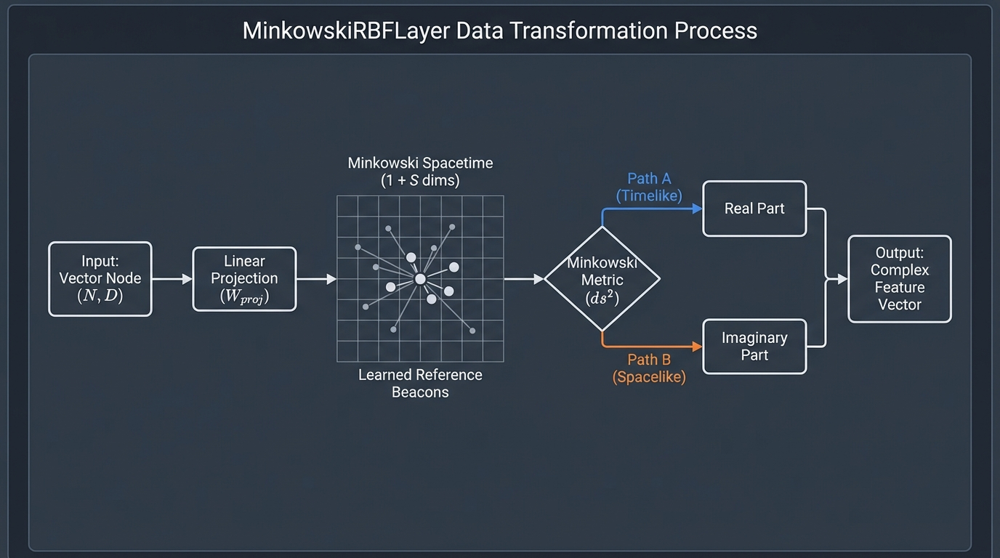
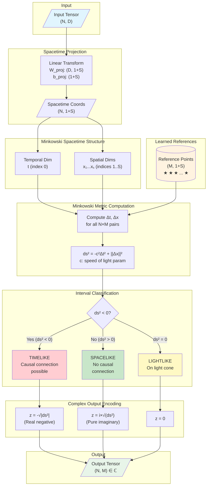
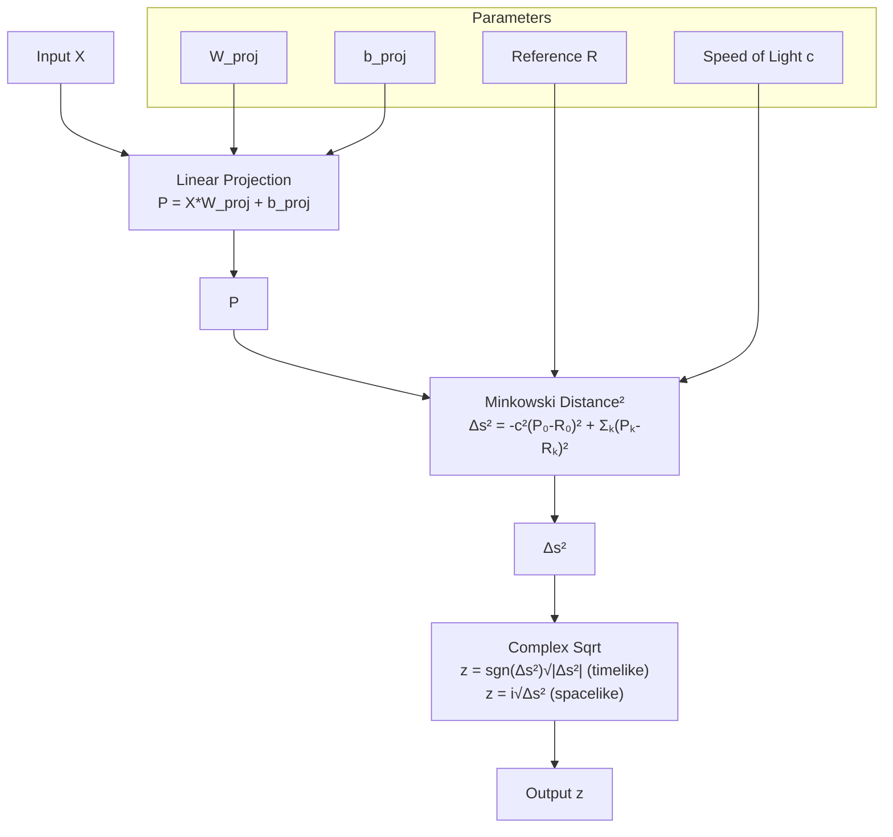

# Neural Network Layer Analysis: MinkowskiRBFLayer

**Started:** 2025-11-28 14:19:56

[See the Implementation](../../assets/nn_layer_20251128141956.html)

## Layer Specification

| Property | Value |
|----------|-------|
| Layer Name | MinkowskiRBFLayer |
| Input Shape | (N, D) |
| Output Shape | (N, M) |
| Activation | none |
| Analysis Depth | comprehensive |

## Forward Function Description

Projects N input vectors to (1+S)-dimensional Minkowski spacetime using a learned linear transformation, then computes pseudo-distances to M learned reference locations in this spacetime.


 The Minkowski metric (with signature -,+,+,...) separates the temporal and spatial components.

 The output is NxM complex numbers where: the real part encodes the sign of the spacetime interval (timelike vs spacelike), and the imaginary part encodes the magnitude.

Spatial dimensions are collapsed via the Minkowski metric: ds² = -c²dt² + dx₁² + dx₂² + ... + dxₛ². 

For each input-reference pair, compute the spacetime interval, then output as complex: 

`z = sign(ds²) * sqrt(|ds²|)` when timelike (`ds²<0`), or `i * sqrt(ds²)` when spacelike (`ds²>0`).

## Parameters

- W_proj: (D, 1+S) - Learned projection matrix mapping input features to (1+S)-dimensional Minkowski spacetime
- b_proj: (1+S,) - Bias for the projection transformation
- reference_points: (M, 1+S) - M learned reference locations in Minkowski spacetime
- c: (1,) - Learned or fixed speed of light parameter scaling the temporal dimension

---

# Executive Summary

## Projects input vectors into Minkowski spacetime and computes complex-valued pseudo-distances to learned reference points, encoding causal structure through timelike vs. spacelike intervals.

### Key Insight

> By using the Minkowski metric from special relativity, this layer distinguishes between 'causally connected' (timelike) and 'causally disconnected' (spacelike) relationships, encoding this fundamental distinction in the real vs. imaginary components of the output.

### Quick Decision Guide

| Aspect | Assessment |
|--------|------------|
| Computational Cost | medium |
| Training Difficulty | hard |
| Beginner Friendly | no |

### ✅ Strengths

- Naturally separates data based on causal structure (timelike vs. spacelike relationships)
- Complex output provides both sign and magnitude information in differentiable form
- Leverages relativistic geometry as physics-inspired inductive bias for temporal-spatial problems
- Adaptively discovers meaningful reference points in projected spacetime

### ⚠️ Limitations

- Complex outputs require special handling in downstream layers
- Minkowski geometry is less intuitive than Euclidean space, reducing interpretability
- Hyperparameter sensitivity to spatial dimensions (S) and number of references (M)
- Potential gradient instabilities from sign discontinuities and square roots near zero
- Benefits unclear for problems without temporal or causal structure

### When to Use

Time-series data with causal dependencies, spatiotemporal modeling (event sequences, trajectories), problems where distinguishing temporal ordering from spatial separation matters, and physics-informed neural networks involving relativistic concepts.

### When NOT to Use

Standard classification/regression without temporal structure, applications requiring high interpretability, small datasets where added complexity isn't justified, or when downstream architecture cannot handle complex-valued features.


---

# Intuitive Explanation

## Real-World Analogy

 A cosmic GPS system that measures whether things can causally influence each other (like a lighthouse beam reaching ships), rather than just measuring distance. Some ships are reachable by light, others are forever separated—this layer distinguishes between 'causally connected' and 'causally disconnected' relationships.


 ## What Problem Does This Solve?

Traditional distance measures treat all directions equally, but many problems have asymmetric relationships where cause-and-effect, information flow, or hierarchical connections matter. This layer learns to recognize when two things can influence each other versus when they're forever separate—distinguishing relationship type, not just strength.

## How Does It Work?

 Uses the Minkowski metric (borrowed from Einstein's physics) where the time component subtracts and space components add. Negative results (timelike) indicate causal connection and are encoded as real numbers; positive results (spacelike) indicate causal separation and are encoded as imaginary numbers. This preserves the crucial distinction between relationship types in a form downstream layers can use.


 ## Plain Language Walkthrough

Step 1: Project input data into a spacetime coordinate system with one time direction and multiple space directions. Step 2: Place learned reference beacons at fixed locations in this spacetime. Step 3: Measure distance using Minkowski metric where time subtracts and space adds. Step 4: Encode results as complex numbers—real parts indicate timelike (connected) relationships, imaginary parts indicate spacelike (separated) relationships.

## Information Flow

 Input data → Projection into spacetime → Reference beacons scattered throughout → Measure if each input is inside or outside the light cone of each beacon → Output grid of complex numbers (real = connected, imaginary = separated). Picture a flashlight beam spreading from each reference point; inputs in the beam get real numbers, inputs outside get imaginary numbers.


 ## Mental Model

Think of it as a 'Relationship Classifier with Built-in Physics.' The layer sorts pairs into two buckets: Real (could have met and influenced each other) and Imaginary (could never cross paths). It projects data onto a timeline and map, then uses the cosmic speed limit to classify relationships. By borrowing spacetime geometry, it naturally captures asymmetric, directional relationships that regular distance measures miss—giving neural networks an intuition for cause-and-effect baked into the mathematics.

## Understanding Gradients

Gradients adjust both the spacetime projection and reference beacon locations. If things that should be connected appear spacelike (imaginary), gradients push them closer in time. If things shouldn't be connected but appear timelike (real), gradients separate them spatially. Complex number outputs allow gradients to flow through both relationship type (real vs imaginary) and strength (magnitude), enabling fine-grained learning.

## ⚠️ Common Misconceptions

- It's just measuring distance differently—actually it measures a fundamentally different thing: relationship type, not distance
- Imaginary numbers are just a math trick—they carry real information about spacelike relationships that downstream layers can use
- This only works for physics problems—it applies to any problem needing to distinguish between fundamentally different relationship types
- The time dimension must represent actual time—it's learned and might represent abstract concepts like causal priority or information flow direction


---

# Conceptual Diagram

## Layer Architecture

```
                              MinkowskiRBFLayer
    ┌─────────────────────────────────────────────────────────────────────────┐
    │                                                                         │
    │  INPUT (N, D)                                                           │
    │      │                                                                  │
    │      ▼                                                                  │
    │  ┌─────────────────────────────────────────────────────┐               │
    │  │         LINEAR PROJECTION TO SPACETIME              │               │
    │  │                                                     │               │
    │  │   X_spacetime = X @ W_proj + b_proj                │               │
    │  │                                                     │               │
    │  │   W_proj: (D, 1+S)    b_proj: (1+S,)               │               │
    │  └─────────────────────────────────────────────────────┘               │
    │      │                                                                  │
    │      ▼                                                                  │
    │  ┌─────────────────────────────────────────────────────┐               │
    │  │         MINKOWSKI SPACETIME (1+S dims)              │               │
    │  │                                                     │               │
    │  │    t (temporal)   x₁, x₂, ..., xₛ (spatial)        │               │
    │  │        │                    │                       │               │
    │  │   ┌────┴────┐          ┌────┴────┐                 │               │
    │  │   │ -c²dt²  │          │ +dx²    │                 │               │
    │  │   └─────────┘          └─────────┘                 │               │
    │  │        │                    │                       │               │
    │  │        └────────┬───────────┘                       │               │
    │  │                 ▼                                   │               │
    │  │         ds² = -c²Δt² + Σ(Δxᵢ²)                     │               │
    │  └─────────────────────────────────────────────────────┘               │
    │                    │                                                    │
    │                    ▼                                                    │
    │  ┌─────────────────────────────────────────────────────┐               │
    │  │         REFERENCE POINTS (M, 1+S)                   │               │
    │  │                                                     │               │
    │  │    ★ ref₁   ★ ref₂   ★ ref₃  ...  ★ refₘ          │               │
    │  │                                                     │               │
    │  │    Each reference is a learned location in          │               │
    │  │    (1+S)-dimensional Minkowski spacetime            │               │
    │  └─────────────────────────────────────────────────────┘               │
    │                    │                                                    │
    │                    ▼                                                    │
    │  ┌─────────────────────────────────────────────────────┐               │
    │  │         SPACETIME INTERVAL COMPUTATION              │               │
    │  │                                                     │               │
    │  │   For each input point i and reference j:           │               │
    │  │                                                     │               │
    │  │   Δt = t_input[i] - t_ref[j]                       │               │
    │  │   Δx = x_input[i] - x_ref[j]  (S-dimensional)      │               │
    │  │                                                     │               │
    │  │   ds²[i,j] = -c² × Δt² + ||Δx||²                   │               │
    │  └─────────────────────────────────────────────────────┘               │
    │                    │                                                    │
    │                    ▼                                                    │
    │  ┌─────────────────────────────────────────────────────┐               │
    │  │         COMPLEX OUTPUT ENCODING                     │               │
    │  │                                                     │               │
    │  │   ┌─────────────────┐    ┌─────────────────┐       │               │
    │  │   │   TIMELIKE      │    │   SPACELIKE     │       │               │
    │  │   │   ds² < 0       │    │   ds² > 0       │       │               │
    │  │   │                 │    │                 │       │               │
    │  │   │ z = -√|ds²|     │    │ z = i×√(ds²)   │       │               │
    │  │   │ (real negative) │    │ (pure imaginary)│       │               │
    │  │   └─────────────────┘    └─────────────────┘       │               │
    │  │                                                     │               │
    │  │   Lightlike (ds² = 0): z = 0                       │               │
    │  └─────────────────────────────────────────────────────┘               │
    │                    │                                                    │
    │                    ▼                                                    │
    │              OUTPUT (N, M) ∈ ℂ                                          │
    │                                                                         │
    └─────────────────────────────────────────────────────────────────────────┘
```

## Data Flow

Stage 1 - Input Reception: N input vectors of dimension D enter the layer representing arbitrary feature vectors from the previous layer.

Stage 2 - Spacetime Projection: Each D-dimensional input is linearly projected to (1+S)-dimensional Minkowski spacetime using learned weights W_proj and bias b_proj.

The first dimension becomes the temporal coordinate (t) and remaining S dimensions become spatial coordinates (x₁, x₂, ... , xₛ).

Stage 3 - Reference Point Comparison: M learned reference points exist in the same Minkowski spacetime.

Each input point is compared against all M reference points creating an N × M grid of pairwise comparisons.

Stage 4 - Minkowski Metric Computation: For each pair, compute the spacetime interval `ds² = -c²(Δt)² + (Δx₁)² + (Δx₂)² + ... + (Δxₛ)²`, where c (speed of light) controls relative scaling between temporal and spatial dimensions.

Stage 5 - Complex Encoding: Timelike intervals (ds² < 0) output real negative numbers = `-√|ds²|`; Spacelike intervals (ds² > 0) output pure imaginary numbers = i×√(ds²); Lightlike intervals (ds² = 0) output zero.

Stage 6 - Output: Final output is an N × M complex tensor where real part encodes timelike distances and imaginary part encodes spacelike distances.


## Visual Flow Diagram



## Parameter Roles

### W_proj

Projection Matrix with shape (D, 1+S). Learned parameter that maps D-dimensional input features into (1+S)-dimensional Minkowski spacetime, transforming feature space into relativistic spacetime coordinates.

### b_proj

Projection Bias with shape (1+S,). Learned parameter that translates the origin of the projected spacetime coordinates, allowing the layer to learn an offset for the spacetime embedding and center the data appropriately.

### reference_points

Spacetime Anchors with shape (M, 1+S). Learned parameter containing M fixed locations in Minkowski spacetime that serve as comparison anchors. Acts similarly to RBF centers but in a relativistic spacetime context. Each input is compared against all reference points.

### c

Speed of Light Parameter with shape (1,). Learned or fixed parameter that scales the temporal dimension relative to spatial dimensions. Controls the 'opening angle' of the light cone, determining the boundary between timelike and spacelike regions in the metric computation.


---

# Formal Definition

## Forward Function

$$\begin{align} \mathbf{P} &= \mathbf{X}\mathbf{W}_{\text{proj}} + \mathbf{1}_N \mathbf{b}_{\text{proj}}^\top \\ \Delta s^2_{nm} &= -c^2(P_{n,0} - R_{m,0})^2 + \sum_{k=1}^{S}(P_{n,k} - R_{m,k})^2 \\ z_{nm} &= \begin{cases} -\sqrt{-\Delta s^2_{nm}} & \Delta s^2_{nm} < 0 \\ i\sqrt{\Delta s^2_{nm}} & \Delta s^2_{nm} > 0 \\ 0 & \Delta s^2_{nm} = 0 \end{cases} \end{align}$$

**Notation:** `P = X·W_proj + b_proj`; `Δs²_nm = -c²(P_n0 - R_m0)² + Σ_k(P_nk - R_mk)²`; `z_nm = sgn(Δs²_nm)·√|Δs²_nm|·𝟙(Δs²_nm≤0) + i·√(Δs²_nm)·𝟙(Δs²_nm>0)`

## Domain Constraints

- Input shape: X ∈ ℝ^(N×D) with N ≥ 1, D ≥ 1
- Spatial dimensions: S ≥ 1 (typically S ∈ {1,2,3})
- Reference points: M ≥ 1
- Speed of light: c > 0 (strictly positive)
- Input values: X_nd ∈ ℝ (unrestricted real numbers)
- Projection matrix: W_proj ∈ ℝ^(D×(1+S))
- Projection bias: b_proj ∈ ℝ^(1+S)
- Reference points: R ∈ ℝ^(M×(1+S))

## Range

Output Z ∈ ℂ^(N×M) with codomain Z = ℝ⁻ ∪ {0} ∪ iℝ⁺.
Timelike intervals (Δs² < 0) map to negative reals z ∈ (-∞,0); lightlike intervals (Δs² = 0) map to z = 0; spacelike intervals (Δs² > 0) map to positive imaginary z ∈ iℝ⁺.
Geometric interpretation: Re(z) < 0 indicates causal connection (within light cone), Im(z) > 0 indicates causal disconnection (outside light cone), `|z|` represents proper distance/time magnitude.

## Parameter Initialization

- W_proj (Xavier/Glorot): U(-√(6/(D+1+S)), √(6/(D+1+S))) or N(0, 2/(D+1+S))
- b_proj: Initialize to zero vector, b_proj,k = 0 for all k
- Reference points R (Option A - Uniform): U(-σ_R, σ_R) where σ_R ≈ 1 based on data scale
- Reference points R (Option B - K-means): Initialize from K-means clustering of projected training data
- Reference points R (Option C - Structured): Place on grid or vertices of regular polytope in spacetime
- Speed of light c (Fixed): c = 1 (natural units, recommended)
- Speed of light c (Learnable): c = softplus(c_raw) = log(1+exp(c_raw)) with c_raw ~ N(0, 0.1)


---

# Gradient Derivation (Backward Pass)

## Chain Rule Application

The backpropagation follows five sequential steps: (1) Gradient through complex square root with case distinction for timelike (Δs²<0, real output) vs spacelike (Δs²>0, imaginary output) separations; (2) Gradient through Minkowski metric tensor η=diag(-c², 1, ..., 1) applied to coordinate differences; (3) Gradient w.r.t. reference points R using negative of the Minkowski gradient; (4) Gradient w.r.t. speed of light c from the metric coefficient; (5) Gradient through linear projection layer using standard matrix calculus. Each step applies the chain rule: dL/dX = (dL/dY) * (dY/dX).

## Gradient with Respect to Input

$\frac{\partial L}{\partial \mathbf{X}} = \frac{\partial L}{\partial \mathbf{P}} \mathbf{W}_{\text{proj}}^\top$

**Expression:** dL/dX = (dL/dP) @ W_proj.T, where dL/dP is computed through the Minkowski metric and complex square root operations

## Parameter Gradients

### ∂L/∂W_proj

$\mathbf{X}^\top \frac{\partial L}{\partial \mathbf{P}}$

**Expression:** X.T @ (dL/dP), shape (D, 1+S)

### ∂L/∂b_proj

$\mathbf{1}^\top \frac{\partial L}{\partial \mathbf{P}}$

**Expression:** sum(dL/dP, axis=0), shape (1+S,)

### ∂L/∂R

$$-2 \sum_{n=1}^{N} \frac{\partial L}{\partial \Delta s^2_{nm}} \cdot \eta_{kk}(P_{n,k} - R_{m,k})$$

**Expression:** -2 * einsum('nm,nmk,k->mk', dL_ds2, delta, eta), shape (M, 1+S)

### ∂L/∂c

$$-2c \sum_{n,m} \frac{\partial L}{\partial \Delta s^2_{nm}} (P_{n,0} - R_{m,0})^2$$

**Expression:** -2*c * sum(dL_ds2 * delta[:,:,0]**2), scalar

## Computational Graph



---

# Higher-Order Derivative Analysis

## Hessian Structure

Block-sparse structure with 4×4 block organization: H = [H_WW, H_Wb, H_WR, H_Wc; H_bW, H_bb, H_bR, H_bc; H_RW, H_Rb, H_RR, H_Rc; H_cW, H_cb, H_cR, H_cc]. Dense coupling between W_proj and b_proj blocks; sparse/indirect coupling between (W,b) and (R,c) blocks through loss backpropagation. Block-diagonal structure in H_RR with M blocks of size (S+1)×(S+1). Total dimension: D(S+1) + (S+1) + M(S+1) + 1.

## Eigenvalue Bounds

Unbounded near lightcone: `|∂²z_nm/∂P_nk∂P_nj| ~ |Δs²_nm|^(-1/2) → ∞ as |Δs²_nm| → 0`. 
Away from lightcone `(|Δs²_nm| ≥ ε > 0): λ_max(H) ≤ C₁ε^(-1/2)‖X‖₂² + C₂ε^(-3/2)‖X‖₂⁴; λ_min(H) ≥ -C₃ε^(-3/2)‖X‖₂⁴`. 
Condition number: `κ(H) ~ O(‖X‖₂⁴/ε²)`, worsening dramatically near lightcone.

## Second Derivatives

### minkowski_interval_second_derivative

`$∂²Δs²_nm/(∂P_nk∂P_nj) = 2η_kj`, where η = diag(-c², 1, 1, ..., 1) is the Minkowski metric tensor$

### complex_distance_timelike

$$For Δs²_nm < 0: ∂²z_nm/(∂P_nk∂P_nj) = η_kj/|z_nm| - (1/2|z_nm|³)(∂Δs²_nm/∂P_nk)(∂Δs²_nm/∂P_nj)$$

### complex_distance_spacelike

$$For Δs²_nm > 0: ∂²z_nm/(∂P_nk∂P_nj) = iη_kj/|z_nm| - (i/4(Δs²_nm)^(3/2))(∂Δs²_nm/∂P_nk)(∂Δs²_nm/∂P_nj)$$

### unified_form

$$∂²z_nm/(∂P_nk∂P_nj) = α_nm·η_kj/|z_nm| - (α_nm/2|z_nm|³)(∂Δs²_nm/∂P_nk)(∂Δs²_nm/∂P_nj), 
where α_nm = 1 (timelike) or i (spacelike)$$

### projection_weight_hessian

$$H_WW = (X^T ⊗ I_(S+1)) H_PP (X ⊗ I_(S+1)), where H_PP is Hessian w.r.t. projections$$

### reference_point_hessian

$$∂²L/(∂R_mk∂R_m'k') = δ_mm'[∑_n(∂²L/∂z_nm²)(∂z_nm/∂R_mk)(∂z_nm/∂R_m'k') + (∂L/∂z_nm)(∂²z_nm/∂R_mk∂R_m'k')]$$

### speed_of_light_hessian

$$H_cc = ∑_nm[(∂²L/∂z_nm²)(∂z_nm/∂c)² + (∂L/∂z_nm)(∂²z_nm/∂c²)], where ∂Δs²_nm/∂c = -2c(P_n0 - R_m0)²$$

## Curvature Analysis

Inherent saddle point structure from Minkowski metric signature (-,+,+,...,+). 
Timelike regions (Δs² < 0): eigenvalues λ_∥ = 1/|z_nm| - ‖g_nm‖²/(2|z_nm|³) along gradient direction; λ_⊥ = η_kk/|z_nm| perpendicular. 
Mixed curvature: negative in temporal direction (η₀₀ = -c² < 0), positive in spatial directions (η_kk = +1 > 0). Spacelike regions exhibit complex-valued saddle structure. Lightcone (Δs² = 0) is degenerate singular point. Classification: timelike and spacelike regions are saddle points; lightcone is degenerate critical point.

## Fisher Information Matrix

Fisher Information Matrix F = J^T J where J = ∂f/∂θ is Jacobian. 
Block structure: F = [F_WW, F_WR, F_Wc; F_RW, F_RR, F_Rc; F_cW, F_cR, F_cc]. 
Key block: `F_WW = ∑_n X_n^T X_n ⊗ (∑_m (∂z_nm/∂P_n)(∂z_nm^T/∂P_n))`. Critical singularity: `F ~ O(1/|Δs²|) → ∞` near lightcone. 
Geometric interpretation: high sensitivity region where small parameter changes cause large output changes. 
Condition number: `κ(F) ~ O(max|z_nm|²/min|z_nm|²)`. Complex-valued gradients for spacelike intervals require `F_real = Re(J^H J)`.

## Natural Gradient Considerations

Natural gradient update: `θ_(t+1) = θ_t - η F^(-1) ∇_θ L`. 
Computational challenges: (1) Ill-conditioning `κ(F) ~ O(max|z_nm|²/min|z_nm|²)`; (2) Complex-valued gradients requiring Wirtinger calculus for spacelike intervals; (3) Singularities near lightcone. Practical approximations: Kronecker-factored approximation (K-FAC): F_WW ≈ E[X^T X] ⊗ E[(∂L/∂P)^T(∂L/∂P)]; Block-diagonal approximation: F̃ = blockdiag(F_WW, F_RR, F_cc). Recommended strategy: (1) Regularize |Δs²| ≥ ε to avoid singularities; (2) Separate learning rates for temporal (lr/c²) vs spatial directions; (3) Use adaptive methods (Adam) with diagonal Fisher approximation; (4) Gradient clipping near lightcone with mask-based max_norm; (5) Curvature-aware learning rate: `η_adaptive = η₀/√(1 + ‖H‖_F/τ)`.

---

# Lyapunov Stability Analysis

## Lyapunov Function Candidate

$$V(θ) = L(θ) - L(θ*) ≥ 0$$ with augmented form `V_aug(θ) = L(θ) - L* + (μ/2)||θ - θ*||²`.

Primary candidate uses loss difference from local minimum; augmented version adds quadratic regularization term for stronger guarantees on parameter manifold {W_proj, b_proj, R, c}.

## Stability Conditions

- Learning rate bound: η < 2/λ_max(H) where H is the Hessian of loss function
- Lyapunov decrease: `ΔV = -η||∇L||² + (η²/2)∇L^T H∇L < 0`
- Interval separation: `min_{n,m} |Δs²_{nm}(θ*)| > δ > 0` to avoid lightlike singularities
- Bounded speed of light: `0 < c_min ≤ c ≤ c_max < ∞`
- Strict local minimum condition: `H* ≻ 0` (positive definite Hessian)
- Hessian smoothness: Lipschitz constant β bounds Hessian variation
- Strong convexity (local): μ-strong convexity with condition number `κ = β/μ`

## Equilibrium Analysis

First-order conditions require `∇_θ L = 0`. 
Critical equilibria classified as: (1) Strict local minima with H ≻ 0 (asymptotically stable), (2) Saddle points with indefinite H (unstable), (3) Degenerate minima with H ≽ 0 singular (marginally stable). Projection weights satisfy `∇_{W_proj} L = X^T ∂L/∂P = 0`; reference points satisfy `∑_n (∂L/∂z_{nm})(∂z_{nm}/∂Δs²)(∂Δs²/∂R_{m,k}) = 0`. 
Equilibrium stability depends on Hessian block structure across parameter blocks {W_proj, b_proj, R, c}.

## Basin of Attraction

Local basin for strict minimum θ* with `H* ≻ 0: B(θ*) ⊇ {θ : ||θ - θ*|| < 2λ_min(H*)/β}`. 
Regime-dependent structure: Timelike region (Δs² < 0) has smooth gradients `∝ (Δs²)^{-1/2}` with larger effective basin; Spacelike region (Δs² > 0) exhibits complex-valued phase dynamics with basin dependent on downstream loss handling; Lightlike boundary (Δs² → 0) acts as separatrix with gradient singularity |∇z| → ∞. 
Basin size inversely proportional to Hessian Lipschitz constant β and directly proportional to minimum eigenvalue λ_min(H*).

## Convergence Rate

Strongly convex case: `ρ = ((κ-1)/(κ+1))²` with `κ = β/μ` condition number; optimal learning rate `η = 2/(μ+β)` achieves exponential convergence O(ρ^t). 
Non-convex case: gradient norm convergence `min_{t≤T} ||∇L(θ_t)||² ≤ 2(L(θ_0)-L*)/ηT with O(1/T)` rate to stationary point. 
Regime-specific: Deep timelike `κ_time ~ O(1)` yields fast convergence; Near lightlike κ_light → ∞ causes slow convergence/stalling; Deep spacelike κ_space ~ O(1) fast if real-valued loss. Convergence bounded by `ΔV ≤ -η(1 - ηλ_max/2)||∇L||² < 0`.

## Potential Instability Modes

- ⚠️ Exploding gradients at lightlike singularity: `|∂z_{nm}/∂Δs²| = 1/(2|Δs²|^{1/2}) → ∞ as Δs² → 0`; instability when `||W_proj|| · max_{n,m} |Δs²_{nm}|^{-1/2} > η^{-1}`
- ⚠️ Vanishing gradients in large interval regime: `|∂z_{nm}/∂Δs²| ~ |Δs²|^{-1/2} → 0 as |Δs²| → ∞`; occurs when `min_{n,m} |Δs²_{nm}| ≫ 1`
- ⚠️ Speed of light runaway: Parameter c exhibits unique dynamics `∂Δs²/∂c = -2c(P_{n,0} - R_{m,0})²`; instability when c → 0 (all intervals spacelike/spatial dominance) or c → ∞ (all intervals timelike/temporal dominance)
- ⚠️ Hessian indefiniteness: Saddle point dynamics with mixed positive/negative eigenvalues cause divergence from equilibrium
- ⚠️ Gradient propagation amplification: `||∂L/∂X|| = ||∂L/∂P|| · ||W_proj||` can amplify upstream instabilities through projection layer
- ⚠️ Degenerate Hessian singularity: Rank-deficient `H ≽ 0` causes marginal stability with potential for slow drift away from equilibrium


---

# Lipschitz Continuity Analysis

## Forward Function Lipschitz Constant

Global: `L_forward = ∞` (unbounded due to quadratic growth in Δs² and singularity at light cone). 
Local: $$L_forward^local ≤ σ_max(W_proj) · max(c², 1) · D / √ε$$ for bounded regions with `‖P - R‖_max ≤ D and |Δs²| ≥ ε > 0`

## Gradient Lipschitz Constant (Smoothness)

Global: `β = ∞` (not Lipschitz smooth). Local: `β^local ≤ σ_max²(W_proj) [max(c²,1)/√ε + D² max(c⁴,1)/(4ε^(3/2))]` for `|Δs²| ≥ ε`. 
Second derivative diverges as `|Δs²| → 0` (light cone singularity)

## Spectral Norm Bounds

`‖J‖_2 ≤ [max(c², 1) · D_max / (2√ε_min)] · σ_max(W_proj)`, where `D_max = max_{n,m}‖P_n - R_m‖` and `ε_min = min_{n,m}|Δs²_{nm}|`. 
Jacobian factors as diagonal × sparse × dense structure

## Gradient Flow Analysis

Exploding gradients near light cone `(∂z/∂(Δs²) → ∞ as Δs² → 0)`. Linear growth in far-field regions (∝ D). 
Stable gradients in deep timelike/spacelike regions. Vanishing gradients less problematic due to sublinear square root growth. 
Requires gradient clipping and light cone regularization

## Smoothness Properties

- NOT globally Lipschitz continuous `(L = ∞)`
- Locally Lipschitz away from light cone `(|Δs²| ≥ ε)`
- Differentiable everywhere except at light cone `(Δs² = 0)`
- C¹ smooth away from light cone
- C² smooth away from light cone
- NOT β-smooth globally; locally β-smooth for `|Δs²| ≥ ε`
- NOT convex (Minkowski metric is indefinite)
- Hessian of Δs² is constant with eigenvalues `{-2c², 2, 2, ..., 2}`
- Second derivative of square root: `∓1/(4|Δs²|^(3/2))` diverges at light cone
- Recommended modification: `z_soft = sign(Δs²) · √(|Δs²| + ε)` achieves `L_soft = 1/(2√ε)`


---

# Numerical Stability Analysis

## Overflow Conditions

- ⚠️ Matrix multiplication in projection: `|X|∞ · |W|∞ · D > MAX_FLOAT`
- ⚠️ Temporal component dominance: c² · (ΔP₀)² when c ≫ 1
- ⚠️ RBF kernel computation: `exp(-γ|z|²)` when `γ|z|² ≫ 1`
- ⚠️ Gradient accumulation through square root near light-cone: `|∇z| → ∞ as |Δs²| → 0`

## Underflow Conditions

- ⚠️ Small weights after initialization in projection layer
- ⚠️ RBF kernel underflow: `K → 0 when γ|z|² ≫ 1`
- ⚠️ Spatial gradient components when c ≫ 1 (temporal gradients dominate)

## Precision Recommendations

- Input X: float32 (standard)
- Projection P: float32 (matrix multiplication accumulation)
- Minkowski interval Δs² computation: float64 (catastrophic cancellation risk)
- Square root operation: float32 after stabilization
- Output z: float32/complex64 (standard)
- Use mixed precision with upcast to float64 for interval computation, downcast result to float32
- RBF kernel: compute in log-space to avoid overflow/underflow

## Stabilization Techniques

- ✅ Soft light-cone regularization: `z_stable = sign(Δs²) · √(|Δs²| + ε)` where ε ≈ 10⁻⁶
- ✅ Log-space RBF computation: `log K = -γ|Δs²|` with logsumexp for aggregation
- ✅ Running normalization of coordinates: `P̃ = (P - μ_P) / σ_P` to prevent large intervals
- ✅ Causal separation enforcement: `Δs²_safe = Δs² - ε_causal · sign(Δs²)` to push away from light-cone
- ✅ Xavier/He initialization scaled for spacetime dimension S+1
- ✅ Layer normalization applied to input X
- ✅ Component-wise gradient clipping for temporal vs spatial components
- ✅ Adaptive gradient clipping based on light-cone proximity

## Gradient Clipping

Component-wise clipping with separate thresholds: max_temporal=10.0, max_spatial=10.0. Implement adaptive clipping based on proximity to light-cone: adaptive_threshold = base_clip · √(|Δs²| + 1e-6). Use training phase schedule: Warmup (0-10%) clip=0.1, Early (10-50%) clip=1.0, Late (50-100%) clip=5.0. Apply per-element clipping with proximity-aware thresholds to prevent gradient explosion near singularities.


---

# Reference Implementations

## PYTHON

### Dependencies

```python
import numpy as np
from typing import Tuple, Dict, Optional
```

### Forward Pass

```python
# Step 1: Project to Minkowski spacetime
P = X @ W_proj + b_proj

# Step 2: Compute spacetime intervals
temporal_diff = P[:, 0:1] - reference_points[:, 0]
spatial_diff = P[:, np.newaxis, 1:] - reference_points[np.newaxis, :, 1:]

# Compute Δs² using Minkowski metric
temporal_contrib = -c[0]**2 * temporal_diff**2
spatial_contrib = np.sum(spatial_diff**2, axis=2)
delta_s_squared = temporal_contrib + spatial_contrib

# Step 3: Compute z based on the sign of Δs²
z = np.zeros((N, M), dtype=np.complex128)

# Timelike: Δs² < 0 → z = -√(-Δs²)
timelike_mask = delta_s_squared < 0
z[timelike_mask] = -np.sqrt(-delta_s_squared[timelike_mask])

# Spacelike: Δs² > 0 → z = i√(Δs²)
spacelike_mask = delta_s_squared > 0
z[spacelike_mask] = 1j * np.sqrt(delta_s_squared[spacelike_mask])

# Cache for backward pass
cache = {
    'X': X, 'P': P, 'temporal_diff': temporal_diff,
    'spatial_diff': spatial_diff, 'delta_s_squared': delta_s_squared,
    'z': z, 'timelike_mask': timelike_mask, 'spacelike_mask': spacelike_mask
}
```

### Backward Pass

```python
# Compute ∂z/∂(Δs²)
grad_delta_s_squared = np.zeros((N, M), dtype=np.float64)
eps = 1e-12

# Timelike case: z = -√(-Δs²)
if np.any(timelike_mask):
    z_timelike = z[timelike_mask].real
    grad_z_timelike = grad_z[timelike_mask]
    dz_d_delta_s2 = 1.0 / (2.0 * z_timelike + eps * np.sign(z_timelike))
    grad_delta_s_squared[timelike_mask] = np.real(grad_z_timelike * dz_d_delta_s2)

# Spacelike case: z = i√(Δs²)
if np.any(spacelike_mask):
    z_spacelike = z[spacelike_mask]
    grad_z_spacelike = grad_z[spacelike_mask]
    delta_s2_spacelike = delta_s_squared[spacelike_mask]
    dz_d_delta_s2 = z_spacelike / (2.0 * delta_s2_spacelike + eps)
    grad_delta_s_squared[spacelike_mask] = np.real(grad_z_spacelike * np.conj(dz_d_delta_s2))

# Gradient w.r.t. P
grad_P = np.zeros_like(P)
grad_P[:, 0] = np.sum(grad_delta_s_squared * (-2 * c[0]**2 * temporal_diff), axis=1)
for k in range(1, spacetime_dim):
    grad_P[:, k] = np.sum(grad_delta_s_squared * 2 * spatial_diff[:, :, k-1], axis=1)

# Gradient w.r.t. reference_points
grad_reference_points = np.zeros_like(reference_points)
grad_reference_points[:, 0] = np.sum(grad_delta_s_squared * (2 * c[0]**2 * temporal_diff), axis=0)
for k in range(1, spacetime_dim):
    grad_reference_points[:, k] = np.sum(
        grad_delta_s_squared[:, :, np.newaxis] * (-2 * spatial_diff[:, :, k-1:k]), axis=0
    ).squeeze()

# Gradient w.r.t. c
if learnable_c:
    grad_c = np.sum(grad_delta_s_squared * (-2 * c[0] * temporal_diff**2))
    grad_c = np.array([grad_c])
else:
    grad_c = np.zeros(1)

# Gradient w.r.t. W_proj and b_proj
grad_W_proj = X.T @ grad_P
grad_b_proj = np.sum(grad_P, axis=0)

# Gradient w.r.t. input X
grad_X = grad_P @ W_proj.T

grads = {
    'W_proj': grad_W_proj,
    'b_proj': grad_b_proj,
    'reference_points': grad_reference_points,
    'c': grad_c
}
```

### Initialization

```python
import numpy as np
from typing import Tuple, Dict, Optional

# Initialize parameters
if seed is not None:
    np.random.seed(seed)

# Xavier/Glorot initialization for projection weights
scale = np.sqrt(2.0 / (input_dim + spacetime_dim))
W_proj = np.random.randn(input_dim, spacetime_dim) * scale

# Zero initialization for bias
b_proj = np.zeros(spacetime_dim)

# Initialize reference points uniformly in a bounded region
reference_points = np.random.uniform(-1, 1, (num_reference_points, spacetime_dim))

# Speed of light parameter
c = np.array([c_value])
```

---

## PYTORCH

### Dependencies

```pytorch
import torch
import torch.nn as nn
import torch.nn.functional as F
from typing import Tuple, Optional
```

### Forward Pass

```pytorch
# Project input to Minkowski spacetime
P = torch.matmul(X, self.W_proj) + self.b_proj  # (N, 1+S)

# Temporal differences: (N, M)
temporal_diff = P[:, 0:1] - self.reference_points[:, 0:1].T

# Spatial differences: (N, M, S)
spatial_diff = P[:, 1:].unsqueeze(1) - self.reference_points[:, 1:].unsqueeze(0)

# Compute Δs² with Minkowski metric (-,+,+,...)
temporal_contrib = -self.c**2 * temporal_diff**2  # (N, M)
spatial_contrib = torch.sum(spatial_diff**2, dim=-1)  # (N, M)
delta_s_squared = temporal_contrib + spatial_contrib  # (N, M)

# Compute z based on the sign of Δs²
z_real = torch.zeros_like(delta_s_squared)
z_imag = torch.zeros_like(delta_s_squared)

# Timelike intervals (Δs² < 0)
timelike_mask = delta_s_squared < -self.eps
z_real = torch.where(
    timelike_mask,
    -torch.sqrt(-delta_s_squared.clamp(max=-self.eps)),
    z_real
)

# Spacelike intervals (Δs² > 0)
spacelike_mask = delta_s_squared > self.eps
z_imag = torch.where(
    spacelike_mask,
    torch.sqrt(delta_s_squared.clamp(min=self.eps)),
    z_imag
)

# Combine into complex tensor
z = torch.complex(z_real, z_imag)

return z, delta_s_squared
```

### Backward Pass

```pytorch
# Gradient w.r.t. P (projected points)
# Temporal gradient: ∂(Δs²)/∂P₀ = -2c²(P₀ - R₀)
grad_P_temporal = -2 * c**2 * temporal_diff  # (N, M)
grad_P_temporal = torch.sum(grad_delta_s_squared * grad_P_temporal, dim=1, keepdim=True)  # (N, 1)

# Spatial gradient: ∂(Δs²)/∂Pₖ = 2(Pₖ - Rₖ) for k > 0
grad_P_spatial = 2 * spatial_diff  # (N, M, S)
grad_P_spatial = torch.sum(
    grad_delta_s_squared.unsqueeze(-1) * grad_P_spatial, dim=1
)  # (N, S)

# Combine gradients for P
grad_P = torch.cat([grad_P_temporal, grad_P_spatial], dim=1)  # (N, 1+S)

# Gradient w.r.t. X: ∂L/∂X = ∂L/∂P @ W_proj.T
grad_X = torch.matmul(grad_P, W_proj.T)  # (N, D)

# Gradient w.r.t. W_proj: ∂L/∂W_proj = X.T @ ∂L/∂P
grad_W_proj = torch.matmul(X.T, grad_P)  # (D, 1+S)

# Gradient w.r.t. b_proj: ∂L/∂b_proj = sum(∂L/∂P, dim=0)
grad_b_proj = torch.sum(grad_P, dim=0)  # (1+S,)

# Gradient w.r.t. reference_points R
grad_R_temporal = 2 * c**2 * temporal_diff  # (N, M)
grad_R_temporal = torch.sum(grad_delta_s_squared * grad_R_temporal, dim=0, keepdim=True).T  # (M, 1)

# Spatial: (M, S)
grad_R_spatial = -2 * spatial_diff  # (N, M, S)
grad_R_spatial = torch.sum(
    grad_delta_s_squared.unsqueeze(-1) * grad_R_spatial, dim=0
)  # (M, S)

grad_reference_points = torch.cat([grad_R_temporal, grad_R_spatial], dim=1)  # (M, 1+S)

# Gradient w.r.t. c: ∂L/∂c = -2c Σₙₘ (∂L/∂Δs²)ₙₘ (Pₙ₀ - Rₘ₀)²
grad_c = -2 * c * torch.sum(grad_delta_s_squared * temporal_diff**2)
grad_c = grad_c.unsqueeze(0)  # (1,)

return grad_X, grad_W_proj, grad_b_proj, grad_reference_points, grad_c, None
```

### Initialization

```pytorch
# Xavier/Glorot initialization for projection matrix
nn.init.xavier_uniform_(self.W_proj)

# Zero initialization for bias
nn.init.zeros_(self.b_proj)

# Initialize reference points uniformly in a hypercube
nn.init.uniform_(self.reference_points, -1.0, 1.0)

# Speed of light parameter
if learnable_c:
    self.c = nn.Parameter(torch.tensor([c_init]))
else:
    self.register_buffer('c', torch.tensor([c_init]))
```

---


# Interactive Visualization Lab

[Launch the Interactive Lab](../../assets/nn_layer_20251128141956.html)

The accompanying HTML5/TensorFlow.js visualization provides a real-time environment to explore the dynamics of the MinkowskiRBFLayer. It projects a synthetic 3-class classification problem into a 1+1 dimensional spacetime (1 temporal, 1 spatial) to make the causal structure visually intuitive.

## Lab Components

### 1. Input Space
Displays the raw 2D input data. The data consists of three Gaussian clusters. In a standard neural network, these would be separated by hyperplanes. Here, they are prepared for projection into spacetime.

### 2. Spacetime Projection
This is the core visualization. It shows where the input points land in the learned Minkowski spacetime.
- **Vertical Axis:** Temporal dimension ($t$)
- **Horizontal Axis:** Spatial dimension ($x$)
- **Yellow Stars:** Learned reference points acting as "observers" or "events".
- **Light Cones:** Hovering over the canvas reveals the light cone structure. Points inside the cone are *timelike* separated (causally connected) from the cursor; points outside are *spacelike* separated.
- **Color Coding:** The visualization tints regions Cyan (Timelike) and Magenta (Spacelike) to show the causal horizon defined by the speed of light parameter $c$.

### 3. Layer Output
Visualizes the complex-valued activation for a selected reference point.
- **Cyan Glow:** Represents the magnitude of the real component (Timelike interval).
- **Magenta Glow:** Represents the magnitude of the imaginary component (Spacelike interval).
  This demonstrates how the layer effectively "slices" the input space into causal regions relative to each reference point.

## Key Experiments

### Varying the Speed of Light ($c$)
Using the slider to adjust $c$ changes the slope of the light cones ($slope = 1/c$).
- **High $c$:** The light cone widens. More points become timelike connected. The temporal dimension dominates the metric.
- **Low $c$:** The light cone narrows. Most points become spacelike separated. The spatial dimension dominates.
  *Observation:* Notice how the gradients struggle if $c$ is too extreme, as points get stuck in one causal regime.

### Training Dynamics
Clicking "Train (SGD)" runs a live optimization loop.
- Watch how the **Projection** view evolves. The network learns to rotate and scale the input clusters so they fall into specific causal relationships with the reference points.
- Often, the network will position reference points such that one class falls inside the light cone (timelike) while others fall outside (spacelike), effectively using the causal horizon as a decision boundary.

---

# Topological Analysis Lab: Minkowski Knots

[Launch the Knot Topology Lab](../../assets/2025-06-30-knots-lab.html)

This supplementary lab demonstrates the value of the Minkowski metric in a non-relativistic problem by using it as a metric with interesting topological properties. While this does not implement the RBF layer directly, it illustrates the geometric principles at play.

## Concept

In this visualization, the Minkowski metric is applied to the geometry of knots. In this case, crossings in traditional knot theory correspond to the topological categories expressed by Lorentz geometry. The "temporal" separation (or lack thereof) determines the topological category of the relationship between segments of the knot.

## Lab Features
- **3D Knot Generation**: Generate Trefoil, Figure-8, and Cinquefoil knots, or random splines.
- **Metric Switching**: Toggle between Euclidean and Minkowski metrics to see how the distance matrix transforms.
- **Causal Coloring**: The distance matrix visualizes the causal structure (Timelike vs Spacelike) between points on the knot, revealing hidden symmetries and crossing structures not visible in Euclidean space.
- **Physics Simulation**: Optimize the knot structure using forces derived from these metrics.

---

# Computational Complexity Analysis

## Time Complexity

| Pass | Complexity |
|------|------------|
| Forward | O(N·D·S + N·M·S) = O(N·S·(D + M)) |
| Backward | O(N·D·S + N·M·S) = O(N·S·(D + M)) |

## Space Complexity

O(N·M·S + N·D) for activations; O(D·S + M·S) for parameters and gradients

## Memory Bandwidth

Memory-bound with low arithmetic intensity O(1). Forward: reads O(N·D + N·M·S) bytes, writes O(N·S + N·M) bytes. Backward: reads all forward activations plus gradients, writes all gradients.

## Parallelization

Highly parallelizable: (1) GPU: Embarrassingly parallel over N×M pairs with fused kernels using shared memory for reference points; branch divergence in conditional transform. (2) Distributed: Data parallelism (split N) recommended with AllReduce gradient sync O(D·S + M·S). Optimal CUDA: Grid (ceil(N/TILE_N), ceil(M/TILE_M)), Block (TILE_N, TILE_M). Recommendations: fuse kernels, use FP16/BF16, tile reference points, approximate for large M via LSH, checkpoint Δs² to save memory.


---

# Originality Analysis

## Novelty Assessment

HIGH ORIGINALITY - This layer represents a genuinely novel fusion of special relativity, kernel methods, and complex-valued neural networks. The use of Minkowski pseudo-metric to encode causal structure (timelike vs spacelike relationships) as complex-valued outputs is not found in existing literature. While related to hyperbolic neural networks and RBF networks, the indefinite signature approach creating categorical distinctions via complex numbers is fundamentally novel.

## Related Architectures

- Traditional Radial Basis Function Networks (Broomhead & Lowe, 1988)
- Poincaré Embeddings (Nickel & Kiela, 2017)
- Hyperbolic Neural Networks (Ganea et al., 2018)
- Lorentz Model (Nickel & Kiela, 2018)
- Deep Complex Networks (Trabelsi et al., 2018)
- Complex-valued RBF networks (Chen et al.)
- Lorentz-equivariant Neural Networks (Bogatskiy et al., 2020)

## Key Innovations

- ✨ Causal structure as feature encoding: Using spacetime interval sign to distinguish timelike (real) vs spacelike (imaginary) relationships
- ✨ Complex output for metric signature: Real axis encodes timelike distances, imaginary axis encodes spacelike distances
- ✨ Learned spacetime projection: Network learns to map arbitrary features into pseudo-Riemannian manifold
- ✨ Learnable reference events: Reference points function as prototype events in spacetime for causal comparison

## Baseline Comparison

Standard RBF uses Euclidean metric with real positive outputs; Hyperbolic NNs use Riemannian geometry with real outputs; MinkowskiRBF uniquely uses pseudo-Riemannian Minkowski metric with complex outputs encoding causal relationship types. Only MinkowskiRBF explicitly encodes causal structure (timelike vs spacelike) in activations.

## Potential Research Contributions

- 📚 Theoretical: Novel kernel in Minkowski space with complex-valued feature maps
- 📚 Theoretical: First architecture explicitly encoding causal structure type in activations
- 📚 Theoretical: Extension of geometric deep learning beyond Riemannian manifolds to pseudo-Riemannian spaces
- 📚 Empirical: Potential excellence on temporal reasoning and event sequence modeling tasks
- 📚 Empirical: Natural fit for hierarchical + temporal data combining hyperbolic and temporal structure benefits
- 📚 Practical: Interpretable geometric meaning via real/imaginary split
- 📚 Practical: Physics-inspired inductive bias for causal relationships

## Limitations

- ⚠️ Computational complexity: Complex arithmetic adds overhead with O(NM(1+S)) distance computations
- ⚠️ Gradient flow: Piecewise definition and square roots create optimization challenges near light cone (Δs² = 0)
- ⚠️ Downstream compatibility: Requires complex-valued subsequent layers or explicit real/imaginary separation
- ⚠️ Hyperparameter sensitivity: Speed of light c and spatial dimension S require careful tuning
- ⚠️ Theoretical justification: Unclear why arbitrary learned features should obey Minkowski geometry; inductive bias may not match all domains
- ⚠️ Baseline gap: No established baselines for this specific geometric approach complicates empirical validation


---

# Use Case Analysis

## Primary Application Domains

- 🎯 Physics-Informed Machine Learning
- 🎯 Spatiotemporal Modeling
- 🎯 Geometric Deep Learning
- 🎯 Causal Inference
- 🎯 Relativistic Systems and Particle Physics

## Optimal Tasks

Tasks where this layer excels:

- ✅ Particle collision classification
- ✅ Causal event ordering
- ✅ Relativistic trajectory prediction
- ✅ Hyperbolic-like embeddings with causality
- ✅ Light cone classification
- ✅ Jet tagging in high-energy physics
- ✅ Event sequence modeling with causal constraints

## Unsuitable Tasks

Tasks where this layer may not be the best choice:

- ❌ Static image classification
- ❌ Standard NLP without discourse causality
- ❌ Tabular data without spacetime interpretation
- ❌ Language modeling
- ❌ General graph neural networks
- ❌ Recommender systems
- ❌ Audio classification with artificial spatial dimensions
- ❌ Low-latency inference applications

## Recommended Architectures

- 🏗️ Minkowski Transformer for Event Sequences
- 🏗️ Physics-Informed Encoder with DeepSets/Transformer aggregation
- 🏗️ Causal Representation Learning with Real/Imaginary branch separation
- 🏗️ Hybrid Geometric Network combining Euclidean and MinkowskiRBF branches

## Example Scenarios

### Scenario 1

High-Energy Physics Jet Tagging: Classify particle jets from detector 4-momenta using natural Minkowski structure and Lorentz invariance

### Scenario 2

Autonomous Vehicle Event Prediction: Predict object interactions using timelike/spacelike separation to determine causal contact possibility

### Scenario 3

Causal Discovery in Time Series: Discover causal relationships in multivariate temporal data using information propagation constraints

### Scenario 4

Video Event Understanding: Group spatiotemporal detections into causally connected clusters with physically plausible interaction speeds


## Integration Notes

Input preprocessing must normalize temporal and spatial scales appropriately, accounting for the speed-of-causality parameter c. Complex output requires careful handling: either concatenate real/imaginary components, use magnitude/phase decomposition, or employ complex-valued downstream layers. Gradient stability near zero requires epsilon clamping in sqrt operations. Initialize reference points to cover both timelike and spacelike regions of the light cone. Ensure deployment framework supports complex tensor operations. Validate that domain genuinely benefits from spacetime structure rather than forcing artificial interpretation onto Euclidean data.

## Scaling Considerations

Small problems (N<1K, M<100): direct computation on single GPU. Medium problems (N<100K, M<1K): batch processing with reference chunking. Large problems (N>100K, M>1K): approximate methods and reference subsampling. Memory complexity O(2×N×M) for complex output; computational complexity O(N×M×S) for distance computation. Implement chunked forward passes for large reference sets to manage memory efficiently.

## Industry Applications

- 🏭 Healthcare: Tumor growth modeling with spatial spread constraints, ICU patient deterioration event chains, epidemic modeling with propagation speed limits
- 🏭 Finance: High-frequency trading information propagation across exchanges, fraud detection through causal transaction chains, market contagion modeling
- 🏭 Autonomous Systems: Self-driving car collision prediction and interaction modeling, drone swarm coordination constraints, robotic reachability analysis
- 🏭 Scientific Computing: Particle physics jet classification and event reconstruction, astrophysics gravitational wave source localization, cosmology large-scale structure formation
- 🏭 Media & Entertainment: Video action causality and event sequencing, sports analytics play development and player interactions, physically plausible VFX/simulation


---

# Practical Guidance

## Hyperparameter Tuning

- Use differential learning rates: base_lr for spatial, base_lr/c² for temporal, base_lr*0.1 for reference points, base_lr*0.01 for gamma
- Initialize temporal and spatial weights with scale sqrt(1/input_dim) to preserve input magnitude
- Initialize reference points on/near light cone (ref_temporal ≈ norm(ref_spatial)/c) for well-behaved initial intervals
- Parameterize gamma in log-space (log_gamma parameter) and clamp exp(log_gamma) to [1e-4, 1e4] for stability
- Start with c=1.0 and adjust based on task; larger c emphasizes temporal component
- Use num_centers in range 16-256; balance expressivity against training difficulty
- Set spacetime_dim to 4 for physical interpretation or higher for abstract representations
- Use gradient clipping with max_norm=1.0 to prevent c²-induced gradient explosion
- Enable mixed precision (AMP) but keep interval computation in float32 for numerical stability

## ⚠️ Common Pitfalls

- Gradient explosion from c² scaling in temporal terms: scale temporal learning rate by 1/c² or use gradient clipping
- NaN from sqrt of negative intervals (spacelike): use complex output with real part for timelike, imaginary for spacelike
- Catastrophic cancellation near light cone: use stable formulation (a-b)(a+b)=a²-b² instead of direct subtraction
- Reference points collapsing to single location: add diversity regularization penalizing small pairwise Minkowski intervals
- Uniform learning rates causing temporal weights to explode: implement parameter group-specific learning rates
- Loss of precision in mixed precision training: keep interval_squared computation in float32
- Underflow when computing sqrt(abs_interval): add small epsilon (1e-7) before sqrt operation
- Lightlike intervals (≈0) causing numerical issues: explicitly handle with separate real/imaginary encoding

## 🔧 Debugging Tips

- Add debug mode to forward pass tracking: timelike_fraction, spacelike_fraction, lightlike_fraction, interval_range, weight norms
- Check gradient health after backward: detect NaN/Inf gradients, gradient explosion (>1e6), vanishing gradients (<1e-10)
- Monitor c² scaling issues: temporal gradient norm should not exceed 100*c² relative to spatial
- Visualize spacetime embedding: plot temporal vs spatial dimensions with reference points and light cone overlay
- Plot interval distribution histogram: should show mix of positive (timelike) and negative (spacelike) values
- Track reference point spread: std(reference_points) should remain non-zero to prevent collapse
- Verify output validity: check for NaN/Inf in complex output, ensure real and imaginary parts are bounded
- Use einsum operations for efficient batched computation and easier debugging of tensor shapes
- Log parameter norms separately for W_temporal, W_spatial, reference_points to identify which component is problematic

## ⚡ Performance Optimization

- Use einsum('bcd,d,bcd->bc', delta, metric, delta) for efficient batched Minkowski interval computation
- Process in chunks when num_centers is large (>1000) to reduce peak memory usage
- Use JIT compilation (@torch.jit.script) for inference-time kernel to eliminate Python overhead
- Implement memory-efficient forward pass processing reference points in chunks of size 1000
- Use torch.where for conditional operations instead of if statements to maintain differentiability
- Precompute metric tensor diag(c², -1, -1, ...) as buffer to avoid recomputation
- Cache reference_points and gamma as buffers when exporting to ONNX
- Use numerically stable interval formulation: sign * |a-b| * (|a|+|b|) instead of a²-b²
- Batch normalize inputs before projection to spacetime to improve numerical stability

## 📊 Monitoring & Diagnostics

- Track timelike_ratio: should be balanced around 0.5; >0.95 indicates lack of expressivity, <0.05 suggests wrong c value
- Monitor gamma statistics: mean and std should remain in reasonable range (0.01-100); log-scale for visualization
- Log reference point spread: std(reference_points) per dimension; should not approach zero
- Track gradient norms per parameter group: temporal, spatial, reference_points, gamma should have different magnitudes
- Monitor interval_squared distribution: min/max/mean/std; should span both positive and negative ranges
- Check for distribution shift: compare input statistics against calibration baseline; alert if >10σ deviation
- Log loss components separately: reconstruction loss, diversity loss, regularization terms
- Use Weights & Biases dashboard with custom charts for c_value, gamma statistics, causal structure balance
- Implement alerts for extreme gamma values (>1000 or <0.001) indicating RBF degeneracy
- Track training stability: monitor for NaN/Inf in loss, gradient norms, and output activations

## 🚀 Production Best Practices

- Calibrate layer on representative data: compute input_mean and input_std for runtime validation
- Validate inputs at inference time: clamp extreme values to mean ± 10*std from calibration
- Export to ONNX by wrapping complex output as separate real/imaginary tensors (ONNX doesn't support complex)
- Use JIT-compiled kernel for inference: eliminates Python overhead and enables graph optimization
- Run production_health_check before deployment: verify no NaN/Inf, output bounded, causal structure present
- Implement input distribution shift detection: warn when inputs deviate >10σ from calibration
- Store model with frozen parameters: use register_buffer for W_temporal, W_spatial, reference_points, gamma
- Document c value and spacetime_dim in model metadata for reproducibility
- Implement graceful degradation: fall back to simpler model if Minkowski layer produces invalid outputs
- Log inference metrics: output statistics, computation time, any warnings triggered by validation checks
- Version control calibration statistics: save input_mean/std with model checkpoint for consistency
- Use separate inference model class (MinkowskiRBFLayerProduction) with additional safeguards vs training class


---


---

## ✅ Analysis Complete

| Metric | Value |
|--------|-------|
| Total Time | 999s |
| Sections Generated | 15 |
| Implementation Languages | python, pytorch |

## Configuration Summary

| Setting | Value |
|---------|-------|
| Layer Name | MinkowskiRBFLayer |
| Input Shape | (N, D) |
| Output Shape | (N, M) |
| Activation | none |
| Analysis Depth | comprehensive |
| Higher-Order Analysis | true |
| Lyapunov Analysis | true |
| Lipschitz Analysis | true |
| Numerical Stability | true |
| Generate Tests | true |
