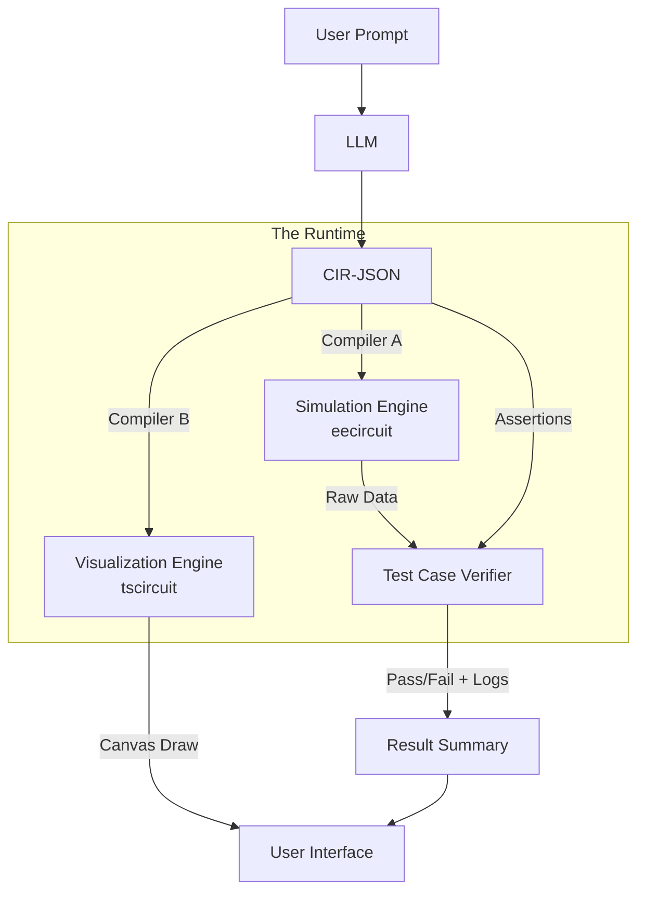
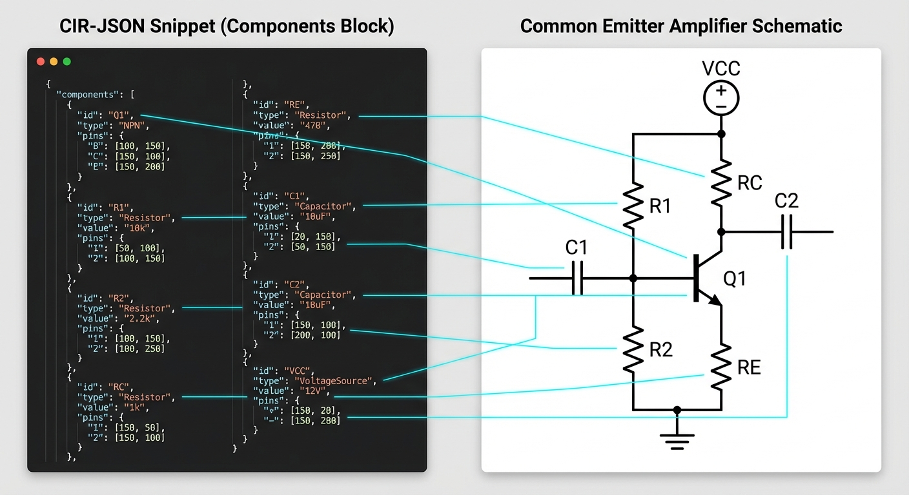
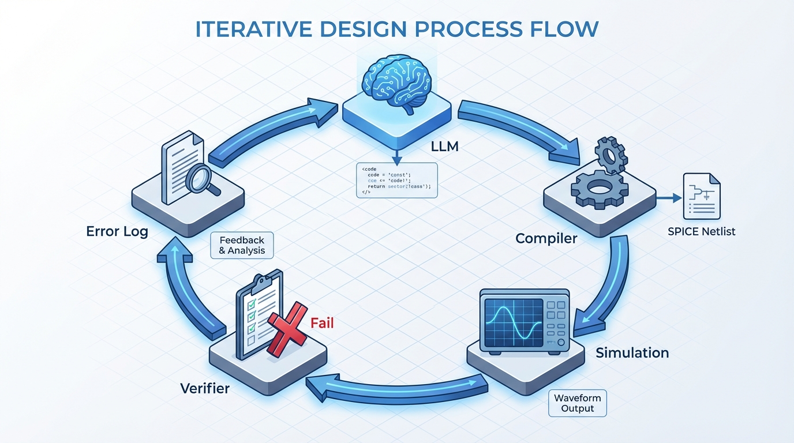
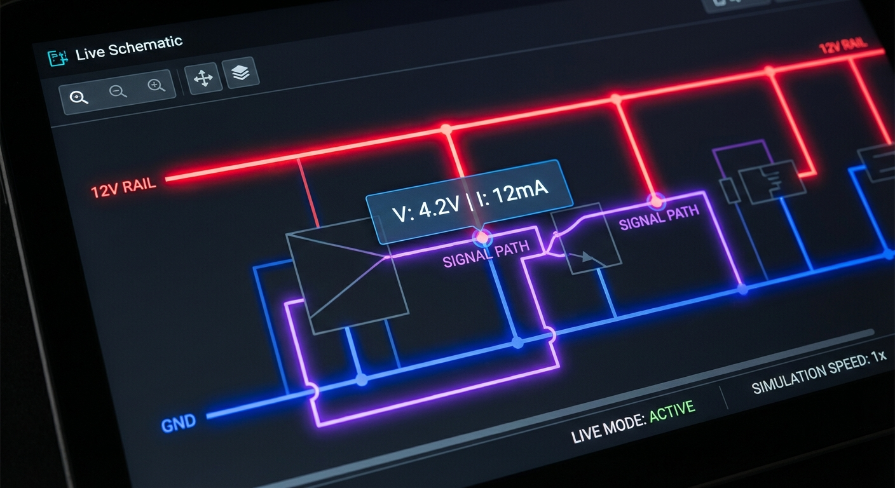

# Project: Circuit Designer (Electrical Modality for LLMs)

## 1. Executive Summary

The goal of this project is to provide Large Language Models (LLMs) with an **"Electrical Modality."** Just as LLMs can
generate and execute Python code to solve math problems, this system allows LLMs to design, visualize, and verify analog
circuits.


The system relies on a **Central Intermediate Representation (CIR)**. The LLM generates a single JSON definition
containing the circuit topology, spatial layout, and verification requirements. This JSON is then compiled into two
distinct outputs:

1. **Simulation:** An `eecircuit.js` (SPICE) model to verify performance against defined test cases.
2. **Visualization:** A `tscircuit` rendering to provide interactive schematics and PCB layouts.

## 2. Architecture Overview



## 3. The Central Intermediate Representation (CIR-JSON)

To avoid "split-brain" issues (where the simulation and diagram disagree), the LLM generates a single source of truth.
We leverage the LLM's modern capability for spatial reasoning to define layout coordinates directly, rather than relying
on a complex auto-router.

### Schema Definition



```json
{
  "meta": {
    "title": "Common Emitter Amplifier",
    "description": "Gain of approx 10, cutoff 20Hz"
  },
  "config": {
    "ground_node": "0",
    "supply_voltage": "12V"
  },
  "components": [
    {
      "id": "Q1",
      "type": "BJT_NPN",
      "model": "2N2222",
      "connections": {
        "C": "N_COL",
        "B": "N_BASE",
        "E": "N_EMIT"
      },
      "layout": {
        "x": 400,
        "y": 300,
        "rotation": 0,
        "mirror": false
      }
    },
    {
      "id": "R1",
      "type": "RESISTOR",
      "value": "10k",
      "connections": {
        "p": "VCC",
        "n": "N_BASE"
      },
      "layout": {
        "x": 400,
        "y": 150,
        "rotation": 90
      }
    }
  ],
  "wires": [
    {
      "points": [
        [
          400,
          150
        ],
        [
          400,
          300
        ]
      ]
    }
  ],
  "simulation": {
    "type": "transient",
    "params": {
      "step": "10us",
      "stop": "10ms"
    }
  },
  "test_cases": [
    {
      "name": "Gain Verification",
      "expression": "max(V(N_COL)) / max(V(N_BASE))",
      "condition": "> 8",
      "description": "Ensure voltage gain is at least 8x"
    }
  ]
}
```

## 4. Simulation & Verification Strategy (`eecircuit`)

We treat circuit design like software engineering: **Test-Driven Design.** The LLM must not only build the circuit but
define how to prove it works.

### 4.1 The Compiler (CIR $\to$ SPICE)

A utility function transforms the `CIR-JSON` into the object/string format required by `eecircuit`.

* **Netlist Generation:** Iterates through `components` to build SPICE lines (e.g., `R1 VCC N_BASE 10k`).
* **Model Injection:** Injects standard models for transistors/diodes if referenced (e.g., `.model 2N2222 NPN...`).
* **Source Injection:** Automatically adds the input signal source defined in the prompt or config.

### 4.2 The Test Runner

Once `eecircuit` completes the simulation, it returns a data array (time, voltages, currents). The **Test Runner**
evaluates the `test_cases` defined in the JSON.

**Supported Assertions:**

* **DC Operating Point:** `V(node) approx 5V` (useful for biasing checks).
* **Peak-to-Peak:** `pkpk(V(out)) > 2V`.
* **Frequency:** `freq(V(out)) == 1kHz`.
* **Logic Levels:** `min(V(out)) < 0.5V` (for digital/switching).

**Feedback Loop:**
If a test fails (e.g., "Gain was 2.1, expected > 8"), this specific error string is fed back to the LLM for the next
iteration, allowing it to tune component values.


## 5. `tscircuit` for Visualization

We have selected **`tscircuit`** (TypeScript/React Circuit) to replace `schematic.js`. This represents a shift from a
static canvas approach to a modern, component-driven architecture.

**Strategic Advantages:**

1. **React Ecosystem:** `tscircuit` allows circuits to be defined as React components. This enables a declarative
   workflow where the "Compiler B" transforms CIR-JSON into a React component tree (e.g., `<Resistor />`,
   `<Capacitor />`).
2. **Hybrid Layout Engine:** While the LLM *can* provide coordinates, `tscircuit` possesses powerful auto-routing
   capabilities. We can make the `layout` block in CIR-JSON optional, allowing the LLM to focus on topology while
   `tscircuit` handles the aesthetic routing ("Schematic-as-Code").
3. **PCB Readiness:** `tscircuit` is designed to generate PCB fabrication files (Gerbers). This expands the project
   scope from "Circuit Designer" (Schematic) to "Hardware Engineer" (Schematic + PCB Layout).
4. **Interactive DOM:** Unlike the static canvas of `schematic.js`, `tscircuit` renders interactive SVG/HTML elements.
   This allows for features like hovering over a wire to see its voltage (from the simulation results) or clicking a
   component to edit its value.
   

**Implementation Plan:**

* **Step 1:** Create a transformer that maps CIR-JSON components to `tscircuit` "Soup" (its internal JSON IR) or
  directly to React Element props.
* **Step 2:** Integrate the `tscircuit` schematic viewer into the frontend.
* **Step 3:** Investigate `tscircuit`'s emerging simulation support to potentially unify the Simulation and
  Visualization engines into a single dependency.

## 6. Expanded Capabilities & Ideas

With the adoption of `tscircuit`, several advanced features become feasible:

### 6.1 Interactive "Live" Schematics

Because the schematic is rendered as a React component tree, we can inject simulation results directly into the visual
layer.

* **Voltage Heatmaps:** Wires change color based on voltage levels (Red = High, Blue = Low).
* **Current Flow Animation:** Animated dashes along wires indicating current direction and magnitude.
* **Click-to-Tune:** Users can click a resistor, change `10k` to `20k` via a UI popup, and the system re-runs`eecircuit`
  immediately, updating the graphs.
  

### 6.2 Real-World Part Selection

`tscircuit` integrates with part supply chain data.

* Instead of a generic "NPN Transistor", the LLM can select a specific "JLCPCB Part #C12345".
* The system can generate a Bill of Materials (BOM) with pricing and availability.

