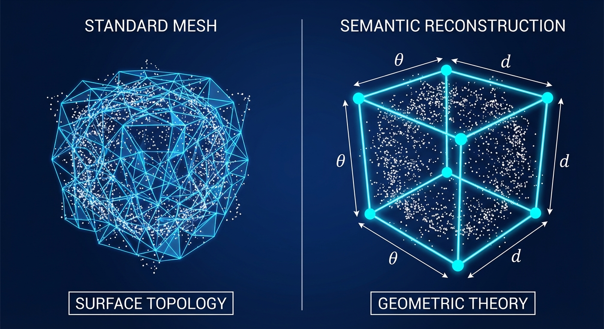
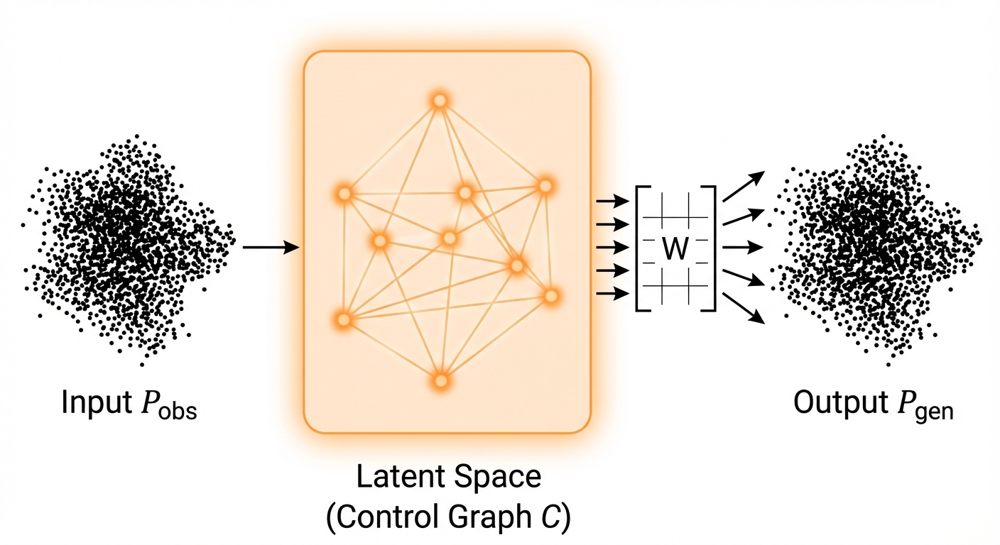
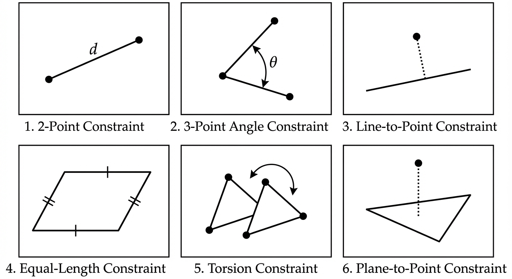

# Project Specification: Geometric Theory Inference Engine
**Target Platform:** Web / TensorFlow.js
**Goal:** Semantic reconstruction of point clouds via evolutionary constraint discovery.

## 1. Abstract
 Standard mesh reconstruction algorithms (Poisson, Ball-Pivoting) focus on surface topology—connecting dots to form a skin. This project aims for **semantic reconstruction**. It seeks to discover the underlying "blueprint" or "theory" that generates the point cloud.
 


 The system inputs a raw point cloud and outputs a **Minimally-Complex Geometric Model**. This model consists of a **Constructive Solid Geometry (CSG)** hierarchy defined by geometric primitives and boolean operations. The system optimizes the parameters of these primitives (Control Points) to minimize the distance between the input cloud and the generated solid surface.

 ## 2. The Core Architecture

The model is treated as a structured Autoencoder where the latent space is an explicit geometric graph rather than a black-box vector.

### 2.1. The Data Flow


 1.  **Input ($\mathbf{P}_{obs}$):** A point cloud tensor of shape $(N, 3)$.
 2.  **Latent Variables ($\mathbf{C}$):** A set of parameters defining geometric primitives (e.g., center, radius, dimensions) within a CSG tree.
3.  **Projection (Surface Evaluation):** The mapping of control parameters to a solid surface.
    *   The fitness is calculated as the sum of distances from each input point $\mathbf{p} \in \mathbf{P}_{obs}$ to the closest point on the generated solid surface $\mathbf{S}$.
4.  **Constraints ($\mathbf{G}$):** Boolean operations (Union, Intersection, Difference) combining primitives, plus geometric rules governing primitive parameters.

### 2.2. The Constraint Layers (The "Theory")
The "Theory" is defined by the energy potential of the constraints. A valid theory has near-zero energy.
 The system supports the following differentiable constraint layers:



 1.  **2-Point Distance:** $\|c_i - c_j\| = k$ (Defines rigid struts).
 2.  **3-Point Angle:** $\text{acos}(\frac{\vec{v}_{ij} \cdot \vec{v}_{kj}}{\|\vec{v}_{ij}\| \|\vec{v}_{kj}\|}) = \theta$ (Defines corners/hinges).
3.  **3-Point Line-to-Point:** Distance from $c_k$ to line $\overline{c_i c_j}$ is $d$ (often $d=0$ for collinearity).
4.  **4-Point Equal-Length:** $\|c_i - c_j\| = \|c_k - c_l\|$ (Symmetry/Parallelograms).
5.  **4-Point Torsion:** The angle between the plane $ijk$ and plane $jkl$ is $\phi$.
6.  **4-Point Plane-to-Point:** Distance from $c_l$ to plane defined by $c_i, c_j, c_k$ is $d$ (Coplanarity).

## 3. Hybrid Optimization Strategy

 The system utilizes a **Bilevel Optimization** approach to solve the discrete combinatorial problem (Graph Topology) and the continuous parameter problem (Geometry) simultaneously.


 ### 3.1. Outer Loop: Evolutionary Algorithm (The Architect)
 *   **Role:** Explores the discrete space of theories (CSG Tree Topology).
*   **Operations:**
    *   `Add/Remove Primitive` (Sphere, Box, Cylinder)
    *   `Modify Boolean Operation` (Union, Intersection, Difference)
    *   `Mutate Constraint Target`
 *   **Initialization (Seeding):**
    *   The population is seeded using **Volumetric Decision Trees**. These trees recursively partition the space using available shape primitives as splitting rules, providing a rough initial CSG approximation.
*   **Fitness Function:**
    $ F = \sum_{p \in \mathbf{P}_{obs}} \text{dist}(p, \text{Surface}) + \lambda \cdot \text{Complexity}(\mathbf{G}) $
    *   *Complexity* is the count of primitives and operations (Occam's Razor).
    *   The GA selects for the simplest CSG tree that *can* be solved to match the cloud.

### 3.2. Inner Loop: Differentiable Solver (The Engineer)
 *   **Role:** For a specific CSG structure provided by the GA, find the optimal primitive parameters (Control Points).
*   **Implementation:** TensorFlow.js `tf.train.adam` optimizer.
*   **Loss Function:**
    $ L = \sum_{p \in \mathbf{P}_{obs}} \text{min\_dist}(p, \mathbf{S}(\mathbf{C}))^2 + \alpha \sum \text{ConstraintViolations}(\mathbf{C})^2 $
*   **Dynamics:**
    *   During optimization, constraints are **soft** (penalty terms).
    *   A "valid solution" is achieved only if the final `ConstraintViolation` is effectively zero (Hard Constraint satisfaction).


## 4. Initialization Strategy: Volumetric Decision Trees

To avoid starting the evolutionary process from a completely random state, the system employs a **Volumetric Decision Tree** for seeding.

**Mechanism:**
1.  **Space Partitioning:** The bounding box of the point cloud is recursively subdivided.
2.  **Primitive Fitting:** At each node, the system attempts to fit available shape primitives (planes, spheres, cylinders) to the points contained within that volume.
3.  **Rule Primitives:** The decision boundaries are not just axis-aligned planes (like in standard Octrees/KD-trees) but can be defined by the shape primitives themselves.
4.  **Tree-to-CSG Conversion:** The resulting decision tree is converted into an initial CSG tree, which serves as the starting population for the Genetic Algorithm.

## 5. Implementation Plan: TensorFlow.js

Using TF.js allows for a "Live Lab" environment where the user can watch the theory evolve in real-time in the browser.

### 5.1. Technology Stack
*   **Compute:** TensorFlow.js (WebGL backend).
*   **Visualization:** Three.js (rendering the Point Cloud $\mathbf{P}$ and the Control Graph $\mathbf{C}$ overlay).
*   **UI:** React or Dat.GUI for tweaking mutation rates and $\lambda$ penalties.

### 5.2. Data Structures (JSON Schema)
A "Theory" can be serialized as:
```json
{
  "controlPoints": 8,
  "constraints": [
    { "type": "distance", "indices": [0, 1], "value": 10.0 },
    { "type": "angle", "indices": [0, 1, 2], "value": 1.5707 },
    { "type": "coplanar", "indices": [0, 1, 2, 3], "value": 0.0 }
  ],
  "weights": "sparse_matrix_indices..."
}
```

### 5.3. Development Phases

**Phase 1: The Solver (Inner Loop)**
*   Build the TF.js graph.
*   Manually define a set of control points and constraints (e.g., a Cube).
*   Run the optimizer to see the points snap from random positions to a perfect Cube.
*   Visualize with Three.js.

**Phase 2: The Projector**
*   Implement the $\mathbf{W}$ matrix optimization.
*   Given a fixed Cube skeleton, optimize $\mathbf{W}$ to fit a noisy point cloud of a box.

**Phase 3: The Evolution (Outer Loop)**
*   Implement the Genetic Algorithm.
*   Start with a simple 2D rectangle.
*   Allow the system to discover that 4 points + 4 distance constraints + 1 angle constraint = Rectangle.

**Phase 4: Complexity & Curvature**
*   Introduce the complexity penalty to prune useless constraints.
*   Experiment with "Virtual Anchors" for circular fitting.

## 6. Summary
This system moves beyond fitting data to **understanding data**. By forcing the reconstruction through a bottleneck of geometric logic, we generate models that are editable, parametric, and human-readable, turning raw scans into CAD-ready definitions.
