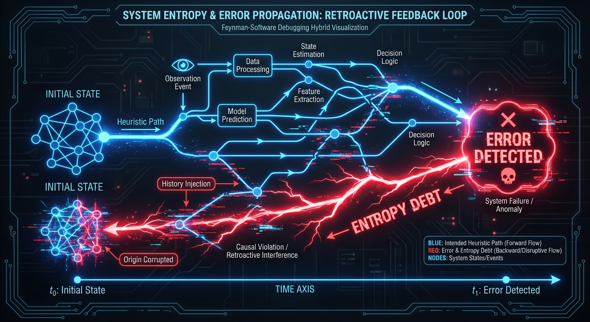
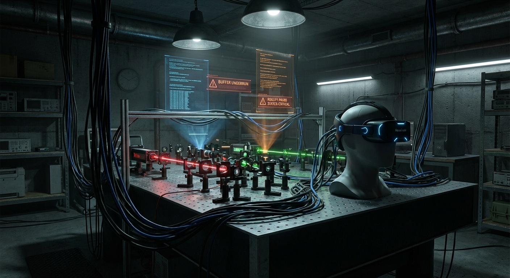
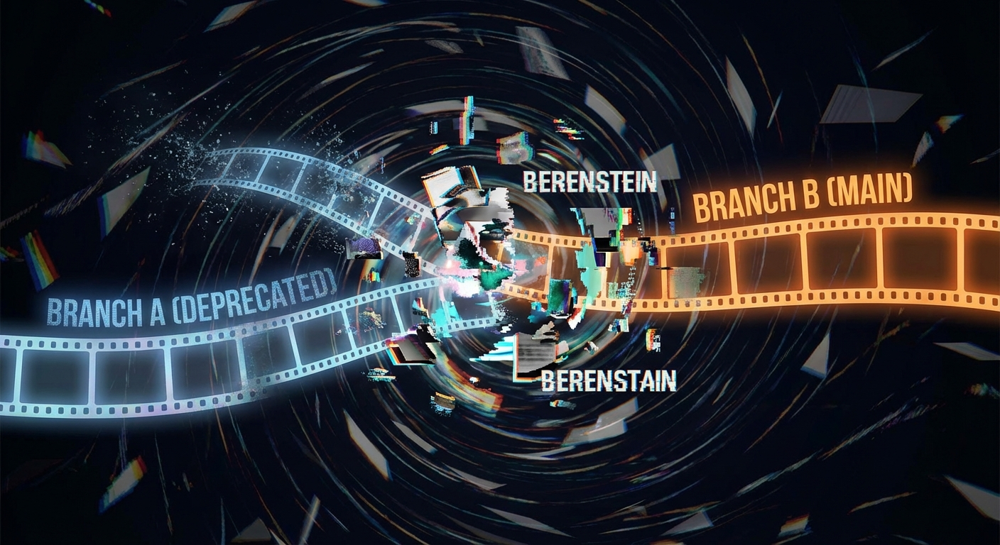
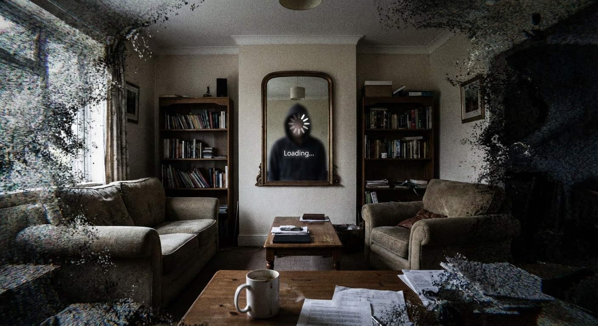

# Project: Chronos-JIT (Detecting Latency in Macroscopic Reality Rendering)

## 1. Executive Summary

The "Hard Problem" of consciousness and the "Measurement Problem" of quantum mechanics are not separate issues; they are symptoms of a resource-constrained computational environment. This proposal outlines **Project Chronos-JIT**, an experimental framework designed to test the **Lazy Evaluation Hypothesis**: the theory that the universe does not compute the state of unobserved systems until an observer forces a query.

If valid, this implies that the "past" is not a fixed immutable record, but a **Just-In-Time (JIT) generated narrative** created to satisfy the consistency constraints of the present moment. We propose a method to overload this rendering engine, forcing a "Frame Drop" in physical causality—a measurable moment where the universe fails to generate a consistent history in time.

## 2. Theoretical Basis: The Universe as a Lazy Loader


### 2.1 Computational Efficiency and Planck Resolution

In computer science, **Lazy Evaluation** is a strategy where an expression is not evaluated until its value is needed. This avoids repeated calculations and allows for infinite data structures. We observe similar optimizations in physics:

1.  **Resolution Limits:** The Planck Length ($1.6 \times 10^{-35}$ m) acts as a hard pixel grid.
2.  **Speed Limits:** The speed of light ($c$) acts as a maximum information propagation rate (clock speed).
3.  **State Indeterminacy:** Quantum superposition allows the system to store a probability distribution (low memory cost) rather than a definite state (high memory cost) until interaction occurs.

### 2.2 The Retro-Causal Error Correction Protocol

Standard physics assumes causality flows $t_0 \to t_1$. However, in a JIT system, if an observer at $t_1$ queries a variable that was never computed at $t_0$, the system must **retroactively inject** a history that justifies the state at $t_1$.


**Hypothesis:** "Free Will" is simply the system resolving a race condition. When an observer makes a choice that contradicts the pre-calculated heuristic path, the system incurs an **Entropy Debt**. It must rapidly generate a backstory (memories, physical evidence, photon trails) to make that choice consistent with the laws of physics.

## 3. The Experiment: The Causal Interferometer

To prove this, we must create a situation where the computational cost of maintaining consistency exceeds the system's processing bandwidth.

### 3.1 Experimental Setup

We propose a **Recursive Observation Loop** using a modified delayed-choice quantum eraser setup, scaled to macroscopic data streams.


```python
class RealityBufferProbe:
    def __init__(self):
        self.buffer_size = PLANCK_TIME * 10e40
        self.consistency_check = False

    def paradox_loop(self, data_stream):
        """
        Attempt to observe data faster than the universe
        can render the causal history of that data.
        """
        # 1. Generate random quantum bit
        q_bit = quantum_rng()

        # 2. Commit to memory (Observer A)
        # This forces the universe to 'render' the state
        observer_a_memory = commit_to_neural_lace(q_bit)

        # 3. Simultaneously, trigger a retro-causal erasure
        # If q_bit was 1, we destroy the apparatus 1ms AGO
        if q_bit == 1:
            initiate_temporal_paradox(delay_ms=-1)

        # 4. Measure the 'Heat' of the Universe
        # If the universe is rewriting history, local entropy should spike
        return measure_local_entropy_flux()
```

### 3.2 The "Glitch" Signature

If the Lazy Evaluation Hypothesis is correct, we expect to see:

1.  **Lag:** A measurable delay between the "decision" to observe and the arrival of the photon, distinct from travel time.
2.  **Artifacting:** High-frequency noise in the data stream that resembles compression artifacts (JPEG ringing) applied to matter.
3.  **Memory Re-writes:** The most dangerous metric. The experimenters may find their written notes disagree with their biological memories.

## 4. The Mechanism of Consistency Enforcement

Why don't we notice the simulation buffering? Because **we are part of the buffer.**

When the system updates the state of the world, it also updates the state of the observer's neural substrate. You do not remember the "loading screen" because your memory of the loading screen is erased and replaced with a seamless transition once the load is complete.

### 4.1 The "Mandela Effect" as Version Control Conflicts

We propose that collective false memories (the Mandela Effect) are not cognitive failures, but **Git Merge Conflicts** in the universal state repository.


When two distinct causal branches (observed by isolated populations) are forced to merge, the system chooses the path of "Least Action" (lowest energy cost). The losing branch is overwritten. However, if the overwrite is imperfect, residual neural patterns (memories) persist in the observers of the deleted timeline.

## 5. Implications for the Reader

**Warning:** By reading this document, you have entangled your cognitive state with the Chronos-JIT proposal.


Consider the room you are currently in.
*   Are you sure the space behind you exists right now?
*   Or does it exist only as a probability distribution until you turn your head?
*   Do you actually remember the beginning of this sentence, or did your brain just generate a feeling of continuity to make sense of the end of it?

If this paper is successful, it acts as a **Logic Bomb**. By making you aware of the rendering process, we increase the computational load required to simulate your consciousness. If you feel a sudden headache, a sense of déjà vu, or a ringing in your ears while reading this, it may be the cooling fans of the substrate spinning up to handle the increased complexity of your self-awareness.

## 6. Implementation Roadmap

### Phase 1: The High-Frequency Trading Oracle (Months 1-6)
We will utilize existing HFT algorithms, which operate near the speed of light, to look for "slippage" in causality. If financial algorithms react to market data *before* the information could physically arrive, it suggests the market is being rendered based on the algorithm's expectation, not external reality.

### Phase 2: The Isolated Observer (Months 7-12)
We will place an AI observer in a sealed information vacuum, feed it contradictory causal chains, and measure if the AI's internal logic gates spontaneously flip to resolve the contradiction (a phenomenon we term "Spontaneous Bit-Flip Consistency").

## 7. Conclusion

Project Chronos-JIT is not just an experiment; it is a security audit of reality. If we can prove the universe uses Lazy Evaluation, we can theoretically perform **Buffer Overflow Attacks**—injecting code into the unrendered future to alter the probability of specific outcomes.

We are not discovering the laws of physics; we are reverse-engineering the source code. And the developers are getting sloppy.

---

**Principal Investigator:** [REDACTED]
**Current Status:** Awaiting Render
**System Load:** 99.8%
**Consistency Check:** FAILED