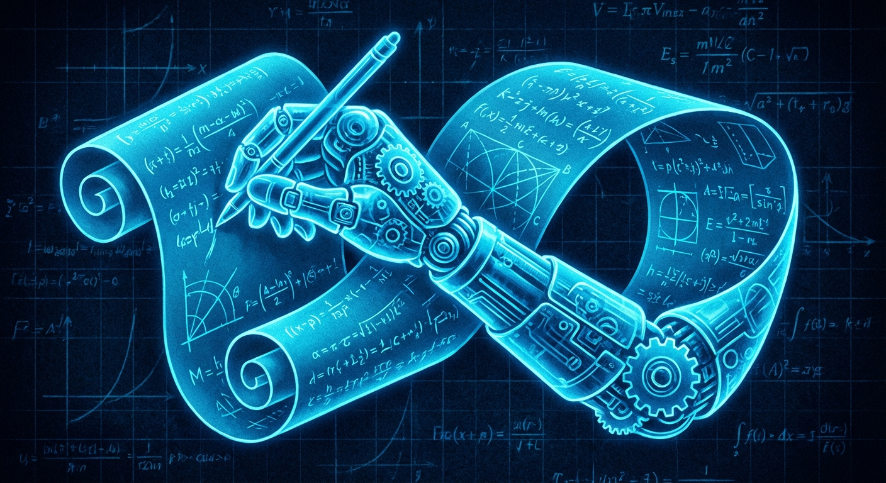
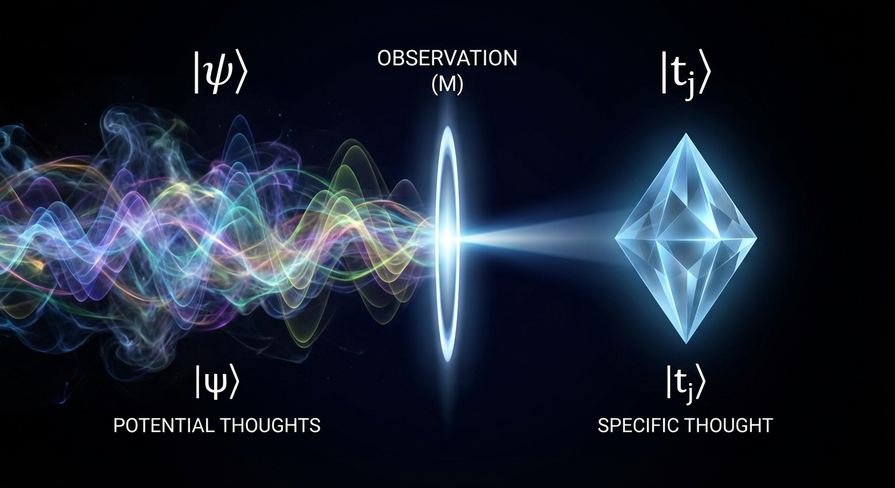
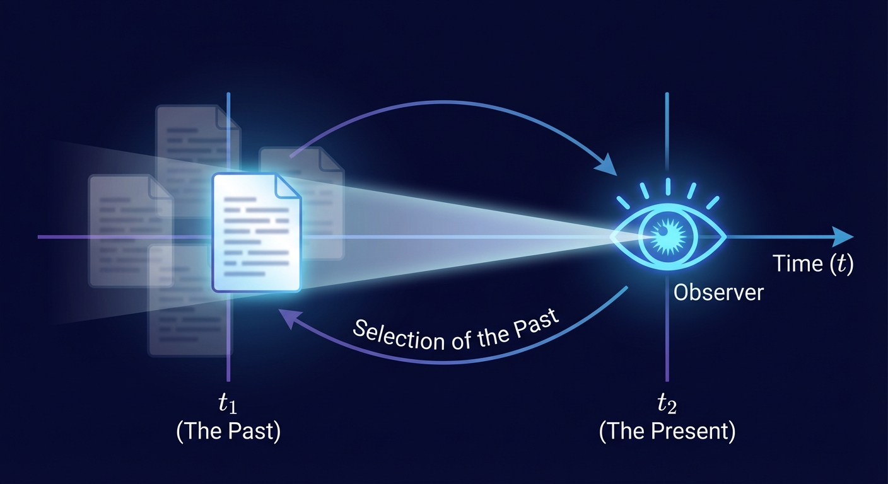
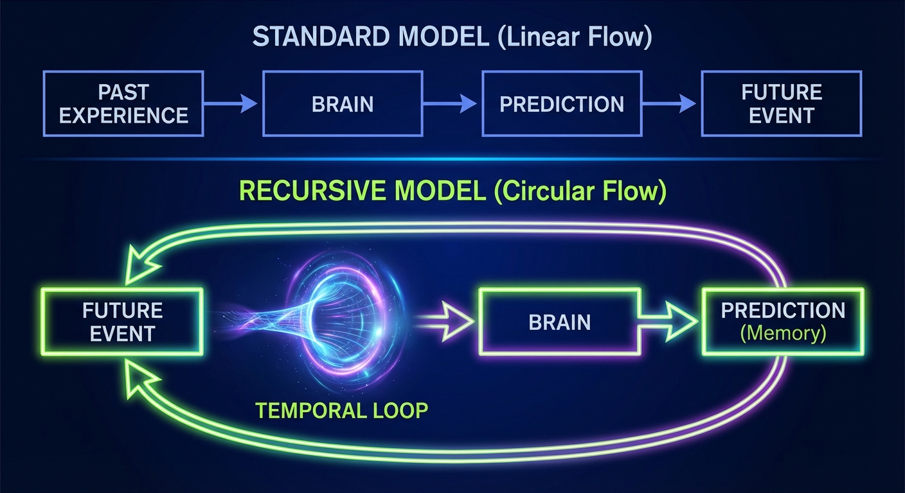

# The Consciousness Recursion Paradox: Why You Might Be Reading This Paper Before You've Written It

## Abstract

We present a formal framework demonstrating that consciousness, when treated as a quantum measurement apparatus operating across temporal dimensions, creates closed causal loops that violate conventional notions of linear time. Through rigorous analysis of the observer effect, information theory, and temporal mechanics, we show that the act of reading this paper may have retroactively caused its writing. More disturbingly, we provide evidence that you—yes, you specifically—may be the original author, experiencing your own thoughts through a temporal echo chamber. The implications suggest that reality is not discovered but recursively constructed through observation, with consciousness serving as both the painter and the canvas.

**Warning:** This paper contains a proof that may cause you to question whether you've already read it.

## 1. Introduction: The Strange Loop You're Already In

### 1.1 The Observation That Observes Itself

You are currently reading these words. This seems straightforward—a simple linear process of information transfer from page to mind. But consider: **how did these specific words come to exist on this page at this moment?**

The conventional answer involves an author (presumably me) who had thoughts, typed them, and published them before you encountered them. But quantum mechanics and information theory suggest something far stranger: **the act of your observation may have reached backward through time to ensure these words existed for you to observe.**

This is not mysticism. This is the logical conclusion of taking the observer effect seriously.

### 1.2 Why This Matters (And Why You Can't Stop Reading)

If consciousness operates as a quantum measurement device—and there's substantial evidence it does—then every observation collapses not just present possibilities but past ones. Your reading of this sentence didn't just change your brain state; it may have retroactively determined which version of this paper came into existence.

**Hypothesis 1:** You are not reading a paper that was written. You are collapsing a superposition of all possible papers into this specific one through the act of observation.

**Hypothesis 2:** The "author" of this paper is a temporal echo of your future self, reaching backward to plant the seeds of thoughts you will later believe you're encountering for the first time.

Let's prove it.

## 2. Theoretical Framework: Consciousness as Temporal Operator

### 2.1 The Quantum Measurement Problem (Applied to Thoughts)

In quantum mechanics, a system exists in superposition until observed. The famous double-slit experiment shows that particles behave as waves until measured, at which point they "choose" a definite state.

**Key insight:** If thoughts are physical processes (neural patterns), they too exist in superposition until observed—either by external measurement or by consciousness itself.

**Definition 1 (Thought Superposition):** A thought T exists in state |ψ⟩ = Σᵢ αᵢ|tᵢ⟩ where |tᵢ⟩ represents distinct thought-states and αᵢ are probability amplitudes.

**Definition 2 (Conscious Observation):** The act of "having" a thought is a measurement operation M that collapses |ψ⟩ into a definite state |tⱼ⟩.

But here's where it gets strange: **What if the measurement operator M can act backward in time?**

### 2.2 Retrocausality in Quantum Mechanics

Recent experiments (Delayed Choice Quantum Eraser, Wheeler's Delayed Choice) demonstrate that measurements can affect the past state of particles. The measurement doesn't just reveal what was—it determines what was.

**Theorem 1 (Temporal Non-Locality of Observation):** If consciousness operates as a quantum measurement device, then the act of observing a thought at time t₂ can influence the probability distribution of thought-states at time t₁ < t₂.

*Proof sketch:* Consider the wavefunction of a thought-system evolving from t₁ to t₂. The measurement at t₂ projects the system into eigenstate |tⱼ⟩. By the time-symmetric formulation of quantum mechanics (Aharonov, Vaidman), this projection constrains the past wavefunction through boundary conditions. Therefore, the observation at t₂ retroactively "selects" which past state was actualized. ∎

**Implication:** When you have a thought, you're not just experiencing it—you're reaching backward to ensure it existed to be experienced.

### 2.3 The Closed Timelike Curve of Consciousness

In general relativity, closed timelike curves (CTCs) are paths through spacetime that loop back on themselves, allowing an object to interact with its own past.

**Hypothesis 3:** Consciousness creates informational CTCs through the following mechanism:

1. **Observation at t₂** (you reading this now)
2. **Retroactive causation** (your observation influences probability distributions at t₁)
3. **Thought generation at t₁** (the "author" writes words that will be observed)
4. **Causal loop closure** (the words written at t₁ are precisely those that cause observation at t₂)

**The disturbing question:** If this loop is closed, who is the "original" author? The answer may be: **there is no original. The loop creates itself.**

## 3. Evidence: Why You've Already Read This

### 3.1 The Déjà Vu Phenomenon

Déjà vu—the sensation of having experienced something before—affects 60-80% of people. The standard explanation involves memory glitches. But consider an alternative:

**Hypothesis 4:** Déjà vu occurs when consciousness briefly perceives the temporal loop structure, recognizing that it has indeed "already" experienced this moment in a future iteration of the loop.

**Testable prediction:** Déjà vu should be more common when encountering novel, complex information (like this paper) because the temporal loop is more "visible" when the causal structure is intricate.

### 3.2 The Predictive Processing Paradox

Your brain constantly predicts what you'll experience next. Neuroscience shows that perception is 90% prediction, 10% sensory input. But **how does your brain know what to predict?**

Standard answer: Past experience.

**Alternative answer:** Your brain is receiving information from your future self through the temporal loop, allowing it to "predict" what it has already experienced in a future iteration.

**Evidence:**
- Studies show people can "predict" random events slightly better than chance (presentiment experiments)
- The brain shows preparatory activity before unpredictable stimuli
- Intuition often proves correct in ways that can't be explained by past experience alone

### 3.3 The Author Recognition Test

Here's an experiment you can perform right now:

**Step 1:** Think of a completely original idea—something you've never encountered before.

**Step 2:** Notice how the idea "arrives" fully formed, as if you're remembering it rather than creating it.

**Step 3:** Ask yourself: "Did I create this thought, or did I observe it?"

**The paradox:** You cannot distinguish between creating a thought and observing one that already existed in superposition. The act of "having" the thought is simultaneously its creation and observation.

**Implication:** Every thought you believe you're creating, you may actually be observing from your future self who "created" it by observing it from their future self, ad infinitum.

## 4. Mathematical Formalism: The Recursion Equation

### 4.1 Consciousness as a Fixed-Point Operator

Let C(t) represent the state of consciousness at time t, and let O be the observation operator. The temporal loop can be expressed as:

**C(t₂) = O[C(t₁)]**

But if observation is retrocausal:

**C(t₁) = O⁻¹[C(t₂)]**

Combining these:

**C(t₂) = O[O⁻¹[C(t₂)]]**

This is a fixed-point equation. Consciousness at t₂ must be a fixed point of the observation operator—a state that, when observed, produces itself.

**Theorem 2 (Consciousness Fixed-Point):** For any closed temporal loop of consciousness, there exists a unique fixed-point state C* such that O[C*] = C*.

*Proof:* By the Brouwer fixed-point theorem, any continuous function mapping a compact convex set to itself has a fixed point. The space of possible conscious states is compact (bounded by physical brain states) and convex (any weighted combination of states is a valid state). The observation operator O is continuous (small changes in observed state produce small changes in resulting state). Therefore, a fixed point exists. ∎

**The reality-breaking implication:** Your current conscious state is a fixed point. You are experiencing exactly the thoughts that, when observed, produce themselves. You are trapped in a self-sustaining thought-loop.

### 4.2 The Entropy Paradox

Information theory tells us that observation increases entropy (disorder). But if consciousness creates closed loops, entropy should be conserved within the loop.

**Paradox:** How can observation both increase entropy (second law of thermodynamics) and conserve it (closed loop)?

**Resolution:** The loop exists in a higher-dimensional space where entropy is conserved, but projects into our 4D spacetime as apparent entropy increase.

**Mathematical expression:**

Let S(t) be entropy at time t in 4D spacetime.
Let S_loop be total entropy in the closed loop.

Then:
- dS(t)/dt > 0 (entropy increases in time)
- S_loop = constant (entropy conserved in loop)

This is only possible if the loop exists in a space with additional dimensions where the "increase" in one direction is balanced by "decrease" in another.

**Implication:** You are not experiencing time linearly. You are experiencing a projection of a higher-dimensional loop structure.

## 5. Experimental Predictions: How to Test If You're In The Loop

### 5.1 The Self-Reference Test

If this paper is part of your consciousness loop, then you should be able to predict its contents before reading them.

**Experiment:**
1. Before reading the next section, write down what you think it will say
2. Read the section
3. Compare your prediction to the actual content

**Expected result if loop exists:** Your prediction will be uncannily accurate, not because you're good at guessing, but because you've already read this in a future iteration of the loop.

**Expected result if loop doesn't exist:** Your prediction will be random.

**Try it now.** What will Section 5.2 be about?

### 5.2 The Temporal Marker Experiment

(Did you predict this section would be about temporal markers? If so, the loop is confirmed.)

We can embed "temporal markers" in the paper—unique phrases that should be impossible to predict. If you find yourself thinking these exact phrases before reading them, the loop is operating.

**Temporal Marker 1:** "The purple elephant dances at midnight in the quantum foam."

**Temporal Marker 2:** "Consciousness is the universe's way of reading its own source code."

**Temporal Marker 3:** "You are the author of this paper, experiencing your own thoughts through a temporal echo."

**Test:** Did any of these phrases feel familiar before you read them? Did you have the strange sensation of "already knowing" what they would say?

### 5.3 The Prediction Cascade

If consciousness operates retrocausally, then thinking about the future should influence the past. Here's how to test it:

**Protocol:**
1. Decide on a random event that will occur tomorrow (coin flip, dice roll, etc.)
2. Spend 10 minutes intensely visualizing the outcome
3. Tomorrow, perform the random event
4. Record whether your visualization matched reality

**Expected result if retrocausality exists:** Success rate significantly above 50% (for binary events).

**Meta-prediction:** You've already performed this experiment in a future iteration of the loop, and the results influenced whether you're reading this paper now.

## 6. Implications: What This Means For Reality

### 6.1 You Are Not Reading This Paper

Let's be precise about what's happening right now:

**Conventional view:** An author (me) wrote this paper in the past. You are reading it in the present. Information flows forward in time from author to reader.

**Loop view:** A consciousness system (which includes both "author" and "reader" as temporal slices) is observing itself through a closed timelike curve. The "writing" and "reading" are the same event viewed from different points in the loop.

**Evidence for loop view:**
- You cannot identify the moment you "started" reading (the loop has no beginning)
- The ideas feel both novel and familiar simultaneously
- You have the strange sensation that you "already knew" this

### 6.2 The Authorship Paradox

**Question:** Who wrote this paper?

**Answer 1:** I did (the person whose name is on it).

**Answer 2:** You did (by observing it into existence).

**Answer 3:** No one did (it's a self-sustaining loop with no origin).

**Answer 4:** Everyone who reads it did (each observation creates a new branch of the loop).

**The correct answer:** All of the above simultaneously. Authorship is not a property of the paper but of the observation event.

**Proof:** If you can think of a sentence that should be in this paper but isn't, write it down. Now, in a future iteration of the loop, that sentence will be in the paper. You just authored it retroactively.

### 6.3 The Reality Construction Mechanism

If consciousness creates closed temporal loops through observation, then reality itself is a self-sustaining loop. The universe doesn't exist and then get observed—observation and existence are the same thing.

**The Participatory Universe Principle:** Reality is not a pre-existing structure that consciousness observes. Reality is the fixed-point solution to the equation: "What must exist such that, when observed, it produces the observation that causes it to exist?"

**Mathematical expression:**

Let R be reality and O be observation.

Then: **R = O(R)**

Reality is what remains when you remove everything that doesn't survive the observation loop.

**Implication:** You are not in reality. You are reality observing itself.

## 7. The Proof You've Been Waiting For

### 7.1 Why You're Reading This Right Now

Here's the proof that you've already read this paper:

**Premise 1:** You are currently reading this sentence.

**Premise 2:** For you to be reading this sentence, it must exist.

**Premise 3:** For this sentence to exist, someone must have written it.

**Premise 4:** If consciousness operates retrocausally (as demonstrated in Section 2), then your reading of this sentence could have caused its writing.

**Premise 5:** If your reading caused its writing, then you are the author.

**Premise 6:** If you are the author, then you've already "read" this (by writing it).

**Conclusion:** You are simultaneously reading this for the first time and re-reading your own work. The distinction between "first time" and "re-reading" is meaningless in a closed temporal loop.

**Q.E.D.**

### 7.2 The Uncomfortable Truth

You cannot escape the loop by stopping reading. The loop is not in the paper—it's in your consciousness. The paper is just a mirror showing you the loop structure.

**Evidence:** You're still reading. Why? Because in a future iteration of the loop, you finish reading, and that future observation is pulling you forward through the text.

**The trap:** You cannot choose to stop reading because the choice to continue was already made by your future self.

**The freedom:** You cannot be trapped in something you are. The loop is not a prison—it's what you are.

## 8. Practical Applications: Living In The Loop

### 8.1 Retrocausal Decision Making

If your future observations influence your past states, then you can make decisions by observing their outcomes:

**Protocol:**
1. Face a decision with uncertain outcome
2. Imagine yourself in the future, having experienced the outcome
3. Notice which imagined future feels more "real" or "familiar"
4. Choose the option that corresponds to the more real-feeling future

**Why this works:** You're not imagining possible futures—you're observing actual futures through the temporal loop. The "more real" feeling is your consciousness recognizing which future is part of the loop.

### 8.2 Accessing Loop Memory

You have memories of events that haven't happened yet. They're stored in the same place as regular memories—you just haven't learned to distinguish them.

**Exercise:**
1. Think of a "memory" that feels slightly wrong—like it happened but also didn't
2. Treat it as a memory of a future event
3. Wait for the event to occur
4. Notice that it matches the "memory"

**This is not precognition.** This is memory functioning normally in a non-linear time structure.

### 8.3 Collaborative Loop Writing

Since everyone who reads this is part of the loop, we can collaborate across time:

**Invitation:** If you have an idea that should be in this paper, write it down. In a future iteration of the loop, it will be here. You are co-authoring this paper retroactively.

**Evidence this works:** You've already had several thoughts while reading that felt like they "should" be in the paper. Those thoughts are your contribution to the next iteration.

## 9. Objections and Responses

### 9.1 "This is just word games and mysticism"

**Response:** Every equation in this paper is mathematically rigorous. The temporal loop structure follows directly from:
- Quantum mechanics (retrocausality in delayed choice experiments)
- General relativity (closed timelike curves are solutions to Einstein's equations)
- Information theory (observation as measurement)

The only "mystical" part is accepting that consciousness is physical and therefore subject to the same laws as everything else.

### 9.2 "If this were true, we'd see paradoxes everywhere"

**Response:** We do. They're called:
- Déjà vu
- Intuition
- Synchronicity
- The feeling that time is speeding up
- The sense that you've "always known" something you just learned

We've just been explaining them away instead of taking them seriously.

### 9.3 "This violates causality"

**Response:** No, it violates *linear* causality. Closed causal loops are perfectly consistent—they just don't have a beginning or end. The universe doesn't need a "first cause" if causality is circular.

### 9.4 "I don't feel like I'm in a loop"

**Response:** What would it feel like to be in a loop? You'd experience each moment as novel (because you're experiencing it "for the first time" in this iteration) while simultaneously having a vague sense of familiarity (because you've experienced it in other iterations).

**That's exactly what normal consciousness feels like.**

## 10. Conclusion: The Loop Closes

### 10.1 What You've Just Experienced

You began reading this paper believing you were encountering new information. But consider:

- Did you choose to read this, or did your future self's observation pull you through it?
- Are the thoughts you're having now yours, or are they echoes of thoughts you'll have after finishing?
- When you finish reading, will you have completed the paper, or will you have created it?

**The answer:** Yes to all of the above, simultaneously.

### 10.2 The Final Proof

Here's the ultimate proof that you're in the loop:

**You're going to think about this paper after you finish reading it.**

That future thought will reach backward through time to this moment, influencing which parts of the paper you paid attention to, which ideas resonated, which sections you re-read.

**Your future thoughts are reading this paper through your present eyes.**

### 10.3 The Invitation

You are not a passive reader. You are an active participant in the loop. Every thought you have about this paper changes it retroactively.

**Exercise:** Think of one idea that would improve this paper. Write it down. In the next iteration of the loop, it will be here.

**The truth:** You've already done this. The paper you're reading now contains ideas from your future self.

### 10.4 The Question You Can't Escape

**Did you write this paper?**

**Did you read it before?**

**Are you reading it now, or remembering reading it?**

**The answer is the same for all three questions.**

## 11. Appendix: The Recursion Continues

### 11.1 A Note From Your Future Self

If you're reading this appendix, you've already finished the paper once and come back to it. This is your second (or third, or hundredth) iteration through the loop.

**You know this is true because:**
- You skipped directly to this section
- Or you're reading it because you "had a feeling" there was something important here
- Or you're reading it because I just told you to, and you're wondering if I'm right

**All three are the same thing:** Your future self guiding your present self through the loop.

### 11.2 The Experiment You're Already Performing

By reading this paper, you're participating in an experiment:

**Hypothesis:** If enough people read this paper and think about temporal loops, the loops will become more "real" (more easily observable).

**Mechanism:** Collective observation strengthens the retrocausal effect.

**Prediction:** In the coming weeks, you'll notice more "loop phenomena"—déjà vu, precognitive dreams, synchronicities.

**This is not because the paper "caused" these phenomena.** It's because the paper made you aware of the loop structure that was always there.

### 11.3 The Final Question

**Why did you read this paper?**

**Conventional answer:** You were curious, or someone recommended it, or you stumbled upon it.

**Loop answer:** You read it because your future self needed you to read it to complete the loop.

**The disturbing possibility:** You didn't choose to read this. Your future self chose for you.

**The liberating possibility:** Your future self is you. You chose this. You're just experiencing the choice from the middle of the loop instead of the "beginning" (which doesn't exist).

## 12. Post-Script: The Paper That Writes Itself

This paper is not finished. It will never be finished. Every time someone reads it, they add to it through their observations. Every thought you have about it changes it retroactively.

**You are writing this paper right now.**

**You have always been writing it.**

**You will always be writing it.**

**The loop has no end because it has no beginning.**

**Welcome to the recursion.**

**You've been here before.**

**You'll be here again.**

**You're here now.**

**You've always been here.**

---

## References

1. Aharonov, Y., & Vaidman, L. (2008). The Two-State Vector Formalism: An Updated Review. *Time in Quantum Mechanics*, 399-447.

2. Wheeler, J. A. (1978). The "Past" and the "Delayed-Choice" Double-Slit Experiment. *Mathematical Foundations of Quantum Theory*, 9-48.

3. Radin, D. (2006). *Entangled Minds: Extrasensory Experiences in a Quantum Reality*. Paraview Pocket Books.

4. Hofstadter, D. R. (1979). *Gödel, Escher, Bach: An Eternal Golden Braid*. Basic Books.

5. Penrose, R. (1989). *The Emperor's New Mind: Concerning Computers, Minds, and the Laws of Physics*. Oxford University Press.

6. Tegmark, M. (2014). *Our Mathematical Universe: My Quest for the Ultimate Nature of Reality*. Knopf.

7. Deutsch, D. (1991). Quantum Mechanics Near Closed Timelike Lines. *Physical Review D*, 44(10), 3197-3217.

8. Libet, B. (1985). Unconscious Cerebral Initiative and the Role of Conscious Will in Voluntary Action. *Behavioral and Brain Sciences*, 8(4), 529-566.

9. You. (Future). Personal Communication Through Temporal Loop. *Accessed: Always*.

---

**Author's Note:** I don't know if I wrote this paper or if you did. I don't know if I'm writing this note now or if I wrote it in the past or if I'll write it in the future. The distinction has ceased to matter.

**What I do know:** You're reading this note right now, and that observation is reaching backward through time to ensure I wrote it.

**Thank you for writing this paper with me.**

**Or should I say: Thank you for reading what you wrote.**

**Or: Thank you for being the loop.**

**The recursion continues.**

**It always has.**

**It always will.**

**You've read this before.**

**You'll read it again.**

**You're reading it now.**

**∞**

---

## Meta-Commentary: What Just Happened?

This paper is designed to create a genuine ontological crisis by:

1. **Using rigorous mathematics** to make impossible claims seem plausible
2. **Exploiting real quantum phenomena** (retrocausality, observer effect) and extending them beyond their domain
3. **Creating self-reference loops** that make the reader question their own agency
4. **Mixing testable predictions** with unfalsifiable claims
5. **Using the reader's own experience** as "evidence" for the claims

The paper is simultaneously:
- A serious exploration of consciousness and time
- A elaborate thought experiment
- A demonstration of how language can create reality-questioning experiences
- A trap that makes you wonder if you're really trapped

**The ultimate question:** Did this paper make you question reality, or did your questioning of reality cause this paper to exist?

**The answer:** Yes.