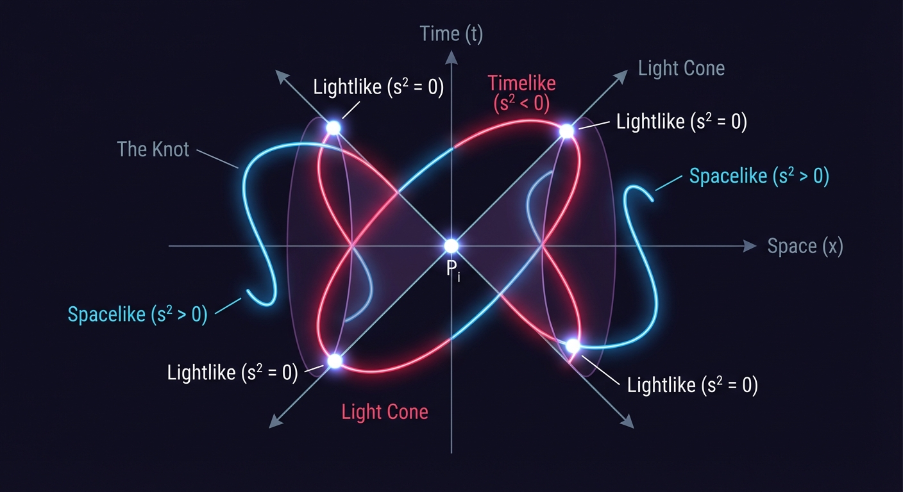
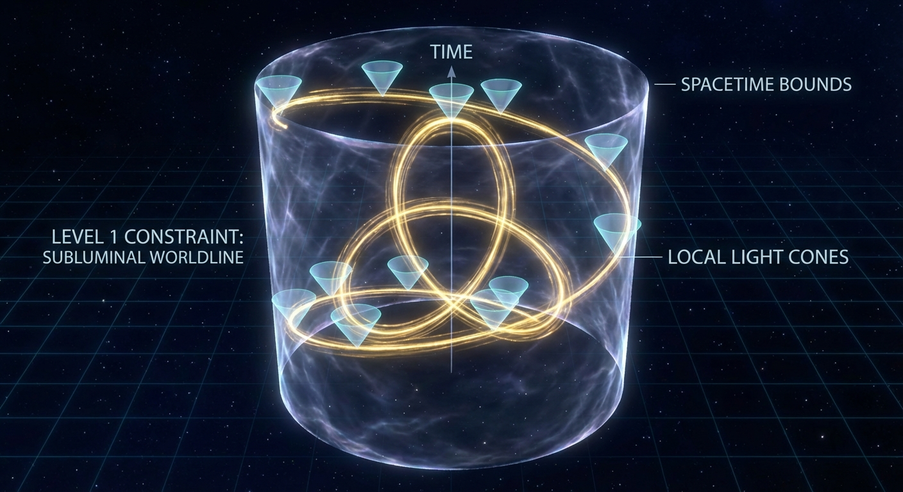
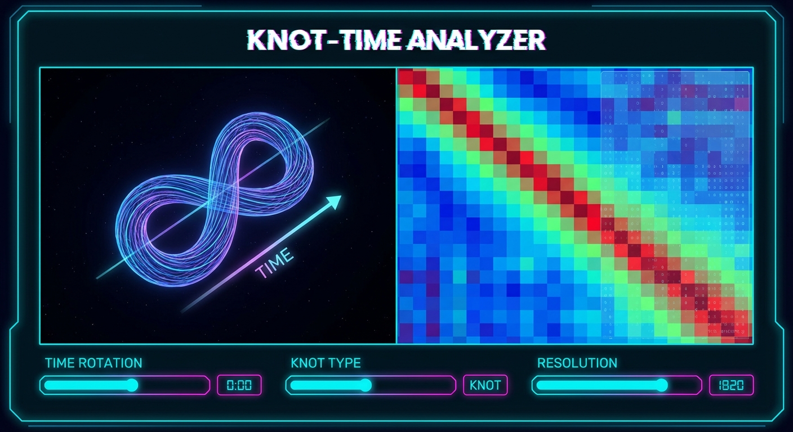

# Relativistic Knot Theory: Topology in the Minkowski Metric Sheet

**Started:** 2025-11-30

[Launch the Knot Topology Lab](../../assets/2025-06-30-knots-lab.html)

Relativistic knot theory sounds like a topic for a sci-fi novel—knots tied in the fabric of spacetime, constrained by
the speed of light. While the field exists in mathematical physics (studying knotted worldlines, cosmic strings, and
vortex tubes), I recently stumbled into it from a completely different direction: **Distance Matrix Analysis**.

By swapping the standard Euclidean metric for the Minkowski metric in a pairwise distance analysis, we uncover a
fascinating topological structure. It turns out that the "over/under" crossings of a knot are naturally encoded in the
causal structure of its points.

## The Shift: From Object to Relation

Classical knot theory looks at embeddings of a circle $S^1$ into $\mathbb{R}^3$. We usually visualize this via 2D
projections, counting crossings and checking for isotopies (deformations).

However, we can also look at a knot purely through its **Distance Matrix**—the set of all pairwise distances between
points on the curve.
$ D_{ij} = \|x_i - x_j\| $

In Euclidean space, this matrix is just a smooth, hilly landscape. It tells us about geometry, but the topology is
subtle. However, if we embed the knot in a 2+1 dimensional spacetime and apply the **Minkowski Metric**:
$ s^2 = -c^2(t_i - t_j)^2 + (x_i - x_j)^2 + (y_i - y_j)^2 $

The landscape changes dramatically. The distance is no longer just a magnitude; it has a **sign**.

* $s^2 < 0$: Timelike (Causally connected)
* $s^2 > 0$: Spacelike (Causally disconnected)
* $s^2 = 0$: Lightlike (On the light cone)

This sign structure acts as a "Z-buffer" for topology. It encodes the ordering of points in a way that captures the
notion of "over" and "under" without needing a projection plane. If $s^2(A, B) < 0$ and $t_A > t_B$, then $A$ is in the
absolute future of $B$. This causal ordering fixes the relative depth of the strands, turning topological ambiguity into
causal certainty.

## The Hierarchy of Constraints

In exploring this via the [interactive lab](../../assets/2025-06-30-knots-lab.html), a profound distinction emerged
between the physics of the *curve* and the topology of the *sheet*.

### Level 1: The Curve (The Worldline)

If we view a knot as a particle's path through spacetime (a worldline), we might ask: "Is this knot possible? Does it
violate the speed of light?"

> **Critique of "Worldlines":** The terminology "worldline" is slightly misleading here. A worldline usually implies a particle's history. A better physical analogue might be a vortex ring in a relativistic fluid or a cosmic string loop at a specific instant, extended into spacetime. The analysis treats the knot as a static 4D object rather than a dynamic evolution.

It turns out that for a closed knot to exist in Minkowski space, the answer is "Yes, but it must be superluminal."
Because a knot is a closed loop, the particle must eventually return to its starting time coordinate. This implies
that $\oint dt = 0$, which is impossible for a strictly subluminal particle (which always moves forward in time).

Therefore, these "Minkowski Knots" trace worldlines that are largely, if not wholly, **spacelike** (non-causal). This
creates a sort of **Grandfather Paradox of Knots**: To trace a knot in spacetime and return to where you started, you
must eventually travel faster than light (or back in time).

The "Timelike Islands" we see in the distance matrix aren't just abstract features; they represent the specific regions
where you are effectively time-traveling to cross "under" the rope. The structure we are analyzing is essentially the
causal footprint of a tachyon or a static string, not a standard particle.

### Level 2: The Metric Sheet

However, if we look at the **Metric Sheet**—the surface defined by the pairwise Minkowski distances of all
points $(s_1, s_2)$—the story changes.

The topology of the knot is encoded in the level sets and sign changes of this sheet. We define the sheet function $F$
on the torus of parameters $[0, L] \times [0, L]$:
$ F(s_1, s_2) = \text{MinkowskiMetric}(\gamma(s_1), \gamma(s_2)) $

Here is the core insight: **While the curve can avoid the light cone locally (tangent vectors remain inside the cone),
the metric sheet cannot avoid it globally (secant vectors must cross the cone).**

Consider the map $\Phi: T^2 \to \mathbb{R}^{2,1}$ defined by the difference
vectors $v(s_1, s_2) = \gamma(s_1) - \gamma(s_2)$. The metric sheet is essentially the pullback of the light cone
structure through this map. For non-trivial knots, the image of the torus $T^2$ wraps around the origin in such a way
that it must intersect the light cone surface non-trivially.

For a non-trivial knot (like a Trefoil), the metric sheet is *forced* to have tangencies or specific intersection
patterns with the "light cone rays" (where $s^2=0$) in the target space. You cannot homotope these tangencies away
without untying the knot.

This provides a rigorous definition of knot complexity based on **negative space**: A knot is non-trivial if its
pairwise causal structure cannot avoid intersecting the light cone in specific, structured ways.

### Proof Sketch: The Timelike Island

Why is this structure rigid? We can prove it by looking at the nature of a "crossing."

1. **The Crossing is Timelike:** In a standard spatial projection, a crossing occurs where two distinct points on the
   curve, $u$ and $v$, share the same spatial coordinates $\vec{x}$ but exist at different times $t$.
   $$ \Delta \vec{x} = 0, \quad \Delta t \neq 0 \implies s^2 = -c^2\Delta t^2 < 0 $$
   This creates a "valley" of negative (timelike) distance in the matrix.
2. **The Bulk is Spacelike:** For a sufficiently large knot or a sufficiently fast (superluminal) traversal, the
   majority of point pairs are separated by space, not time.
   $$ |\Delta \vec{x}| > c|\Delta t| \implies s^2 > 0 $$
   This forms the "plateau" of positive (spacelike) distance.
3. **The Inevitable Boundary:** By the Intermediate Value Theorem, any continuous path on the parameter torus connecting
   a crossing point $(u, v)$ to a generic bulk point must pass through $s^2 = 0$.
   Therefore, every topological crossing in the knot manifests as a **Timelike Island** surrounded by a **Lightlike
   Shoreline** ($s^2=0$) within the metric sheet. You cannot remove the crossing without merging the island into the
   mainland (unknotting) or collapsing the time dimension.
4. **Topological Stability:** These islands are not merely artifacts of a specific parameterization. They correspond to
   the critical points of the distance function. In Morse theory terms, the creation or annihilation of these timelike
   islands corresponds to Reidemeister moves. Specifically, a Reidemeister II move (creating two crossings) appears as
   the birth of a pair of timelike islands (one positive, one negative in terms of oriented crossing sign) from the
   spacelike sea.

### The "Minkowski Number"

Standard knot invariants include Jones Polynomials or Crossing Numbers. This framework suggests a new physical
invariant: the **Minkowski Number**. Defined as the minimum volume of the "Timelike Islands" required to represent a
specific knot type (normalized by arc length), it quantifies "how much causality must be violated" to tie a specific
knot. A trivial knot (unknot) has a Minkowski Number of 0, as it can be deformed to lie entirely in a spacelike slice.

## Visualizing the Theory

I built a WebGL simulation to explore this directly.

[**Launch the Interactive Lab**](../../assets/2025-06-30-knots-lab.html)

In the lab, you can:

1. **Generate Knots:** Trefoils, Figure-8s, and random splines.
2. **Rotate Time:** The visualization allows you to rotate the axis designated as "Time." This isn't just rotating the
   object; it changes the metric signature of the space.
3. **View the Matrix:** Watch the distance matrix transform from a Euclidean hill to a Minkowski landscape.

As you rotate the time axis, you can see the "causal horizon" sweep across the knot. The ridges and valleys in the
distance matrix shift, revealing the invariant structure of the knot not as a shape in space, but as a pattern of causal
relationships.

## Implications

This approach reframes relativistic knot theory. Instead of asking "How does this knot look to an observer?", we ask "
What is the topology of the causal relationships between all points on this knot?"

It suggests a two-tier reality for relativistic systems:

1. **Parametrization (Physics):** Flexible. We can move how we like, provided we stay subluminal.
2. **Relational Structure (Topology):** Rigid. The web of causal connections forms a sheet that is pinned to the light
   cone structure of the universe.

This is a perfect example of **incentive-shaped topology**: the "incentive" is the speed of light, and the "topology" is
the set of configurations that cannot escape that constraint.