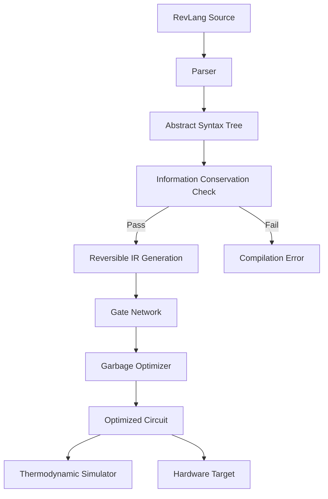

# Project: Entropy-Aware Reversible Computing Compiler

**Status:** Concept / Early Design

## 1. The Thermodynamic Foundation

In 1961, Rolf Landauer proved a fundamental limit: erasing one bit of information generates at least $k_B T \ln 2$ joules of heat, where $k_B$ is Boltzmann's constant and $T$ is temperature. At room temperature, this is approximately $2.8 \times 10^{-21}$ joules per bit—tiny, but non-zero.

Modern processors erase billions of bits per second, operating far above this limit due to engineering constraints. But as we approach atomic-scale transistors, Landauer's limit becomes increasingly relevant. **Reversible computing** offers a theoretical escape: if computation preserves all information (inputs reconstructible from outputs), no bits are erased, and no heat is fundamentally required.

## 2. Reversible Logic Gates

Unlike classical AND/OR gates (which lose information), reversible gates are bijective—every output maps to exactly one input.

### 2.1 The Toffoli Gate (CCNOT)

The Toffoli gate is a universal reversible gate. It takes three inputs $(a, b, c)$ and produces:

$
(a, b, c) \rightarrow (a, b, c \oplus (a \land b))
$

The first two bits pass through unchanged; the third flips only if both $a$ and $b$ are 1. Crucially, given the output, you can always recover the input.

### 2.2 The Fredkin Gate (CSWAP)

The Fredkin gate conditionally swaps two bits based on a control:

$
(c, a, b) \rightarrow (c, c ? b : a, c ? a : b)
$

If $c = 1$, swap $a$ and $b$. If $c = 0$, pass through unchanged.


### 2.3 The Garbage Problem

Here's the catch: while individual gates are reversible, **useful computation often requires intermediate values**. These "garbage bits" accumulate. If we discard them at the end, we've erased information and generated heat—defeating the purpose.

The solution is **un-computation**: after extracting the desired output, run the circuit backwards to restore garbage bits to their original state, then reuse them.

## 3. The RevLang Compiler

This project proposes **RevLang**, a high-level language that compiles to reversible logic circuits while tracking and minimizing entropy.

### 3.1 Language Design Principles

**Conservation of Information:** Variables cannot be overwritten without explicit un-computation.

```revlang
// ILLEGAL: Overwrites x, destroying information
let x = 5;
x = x + 1;  // ERROR: Cannot overwrite x

// LEGAL: Create new binding
let x = 5;
let x_plus_1 = x + 1;

// LEGAL: Explicit un-compute and reuse
let x = 5;
let y = x * 2;
uncompute x from y;  // Reverses the computation
let x = 10;  // Now legal, x was "freed"
```

**Reversible Control Flow:** Conditionals must be symmetric.

```revlang
// Standard if-else is irreversible (which branch was taken?)
// RevLang requires "fi" assertions to restore information

if (condition) {
    // forward branch
} else {
    // alternative branch
} fi (condition);  // Assert condition still holds (or its inverse)
```

**Explicit Garbage Declaration:**

```revlang
fn multiply(a: bit[8], b: bit[8]) -> (result: bit[16], garbage: bit[24]) {
    // Implementation using Toffoli gates
    // Must declare all intermediate bits as garbage
}
```

### 3.2 Compilation Pipeline



### 3.3 The Garbage Collection Optimizer

Unlike traditional garbage collection (which frees memory), the **Garbage Optimizer** generates un-computation sequences.

**Algorithm:**

1. **Dependency Analysis:** Build a DAG of all computations.
2. **Output Extraction:** Identify which bits are "final outputs" vs. "garbage."
3. **Un-computation Scheduling:** For each garbage bit, find the earliest point where it's no longer needed, then insert the reverse gate sequence.
4. **Bit Reuse:** Freed ancilla bits can be reused for later computations.

**Optimization Strategies:**

- **Bennett's Method:** Compute forward, copy output, un-compute backward. Simple but doubles circuit depth.
- **Pebble Games:** Model computation as a pebbling game on the DAG. Minimize peak pebble count (ancilla bits) subject to constraints.
- **Hybrid Approaches:** Allow selective irreversibility for non-critical paths, trading entropy for circuit size.


## 4. The Thermodynamic Profiler

Traditional profilers measure time and memory. The **Thermodynamic Profiler** measures entropy generation.

### 4.1 Metrics

| Metric | Definition | Unit |
|--------|------------|------|
| **Bit Erasures** | Count of irreversible operations | bits |
| **Entropy Cost** | $n \cdot k_B T \ln 2$ | joules |
| **Reversibility Ratio** | Reversible ops / Total ops | percentage |
| **Peak Garbage** | Maximum ancilla bits at any point | bits |
| **Garbage-Time Product** | $\sum (\text{garbage bits} \times \text{time held})$ | bit-cycles |

### 4.2 The Circuit Thermodynamics View

A visual representation of the circuit where:

- **Cool regions (blue):** Fully reversible computation paths.
- **Warm regions (yellow):** High garbage accumulation (potential for optimization).
- **Hot spots (red):** Irreversible operations (bit erasures).


The programmer can click on a hot spot to see:
- Which variable is being erased
- Suggested un-computation sequences
- Trade-off analysis (circuit depth vs. entropy cost)

## 5. Example: Reversible Addition

Let's trace through compiling a simple addition.

### 5.1 RevLang Source

```revlang
fn add(a: bit[4], b: bit[4]) -> (sum: bit[4], carry: bit) {
    // Ripple-carry adder using Toffoli gates
    let c0 = 0;
    let (s0, c1) = full_adder(a[0], b[0], c0);
    let (s1, c2) = full_adder(a[1], b[1], c1);
    let (s2, c3) = full_adder(a[2], b[2], c2);
    let (s3, c4) = full_adder(a[3], b[3], c3);

    return (sum: [s0, s1, s2, s3], carry: c4);

    // Garbage: c0, c1, c2, c3 must be un-computed
}
```

### 5.2 Compiled Gate Network

```
// Full adder for bit 0
TOFFOLI a[0], b[0], c1    // c1 = a[0] AND b[0]
CNOT a[0], s0             // s0 = a[0]
CNOT b[0], s0             // s0 = a[0] XOR b[0]
CNOT c0, s0               // s0 = a[0] XOR b[0] XOR c0
TOFFOLI a[0], c0, c1      // Update carry
TOFFOLI b[0], c0, c1      // Update carry

// ... repeat for bits 1-3 ...

// Un-computation phase (reverse order, inverse gates)
TOFFOLI b[0], c0, c1
TOFFOLI a[0], c0, c1
// ... etc ...
```

### 5.3 Thermodynamic Analysis

| Phase | Gates | Garbage Bits | Entropy Cost |
|-------|-------|--------------|--------------|
| Forward Computation | 24 | 4 (carries) | 0 |
| Output Copy | 5 | 0 | 0 |
| Un-computation | 24 | -4 (restored) | 0 |
| **Total** | 53 | 0 | **0** |

Compare to irreversible addition: 4 bit erasures = $4 k_B T \ln 2$ heat.

## 6. Applications and Future Directions

### 6.1 Quantum Computing Bridge

Quantum gates are inherently reversible (unitary). RevLang circuits can be directly mapped to quantum circuits, making this a potential intermediate representation for quantum compilers.

### 6.2 Adiabatic Computing

Adiabatic circuits physically implement reversible logic by slowly charging/discharging capacitors, recovering most of the energy. RevLang could target adiabatic CMOS hardware.

### 6.3 Cryptographic Applications

Reversible circuits have applications in:
- **Secure computation:** No information leakage through power analysis (constant energy per operation).
- **Homomorphic encryption:** Reversible circuits map naturally to encrypted computation.

### 6.4 Research Questions

1. **Optimal Un-computation:** What is the minimum garbage-time product for a given function?
2. **Partial Reversibility:** When is it worth paying the entropy cost for simpler circuits?
3. **Physical Limits:** How close can real hardware get to Landauer's limit?

## 7. Implementation Roadmap

| Phase | Milestone | Status |
|-------|-----------|--------|
| 1 | RevLang grammar and parser | Planned |
| 2 | Information conservation checker | Planned |
| 3 | Toffoli/Fredkin gate compiler | Planned |
| 4 | Basic garbage optimizer (Bennett's method) | Planned |
| 5 | Thermodynamic profiler UI | Planned |
| 6 | Advanced optimization (pebble games) | Future |
| 7 | Quantum circuit export | Future |

## 8. Conclusion

The Entropy-Aware Reversible Computing Compiler represents a paradigm shift: **optimizing for physics, not just performance**. As we approach fundamental limits of computation, understanding and minimizing entropy generation becomes not just theoretically interesting, but practically necessary.

By treating garbage bits as a first-class cost function and providing visual tools to identify thermodynamic inefficiencies, RevLang bridges the gap between theoretical reversible computing and practical software engineering.

---

*"The computer is a physical object, and computation is a physical process. The laws of thermodynamics apply."* — Rolf Landauer
