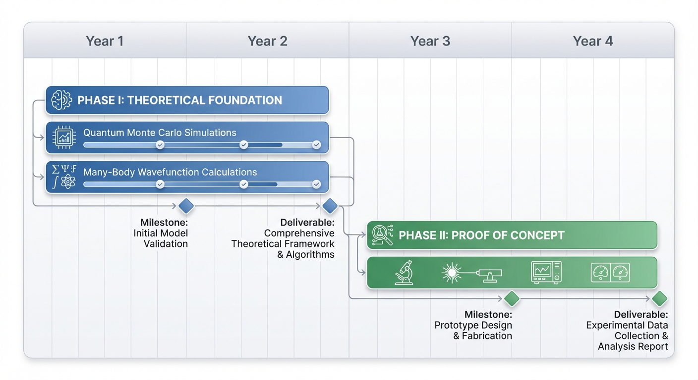

We propose a revolutionary approach to nuclear fusion that exploits the macroscopic quantum coherence of superfluid
helium to enable fundamentally new fusion mechanisms. Unlike conventional fusion approaches that rely on high-energy
plasma collisions, our method leverages the collective quantum wavefunction of superfluid helium-4 to create coherent
tunneling events and symmetry-breaking phenomena that could dramatically reduce fusion barriers. This research could
lead to breakthrough applications in clean energy generation and on-demand synthesis of heavy elements including
precious metals.

The key innovation lies in recognizing that superfluid helium represents a macroscopic quantum system where identical
bosons occupy the same quantum state, potentially enabling collective nuclear processes impossible in classical matter.
We propose to investigate whether quantized vortices in magnetically manipulated superfluid helium can serve as fusion
catalysis sites, and whether the resulting neutron-rich environments can drive rapid nucleosynthesis pathways.

## 1. Background and Motivation

### 1.1 Current Fusion Challenges

Conventional fusion approaches face fundamental obstacles:

* Extreme temperature requirements (>100 million K) for overcoming Coulomb barriers
* Complex plasma confinement and instability issues
* Limited fuel cycles (primarily deuterium-tritium)
* Neutron activation and tritium breeding challenges
  

### 1.2 Superfluid Physics Foundation

Superfluid helium-4 exhibits unique properties stemming from Bose-Einstein condensation:

* Macroscopic quantum coherence with identical particles in the same quantum state
* Quantized vortices that can be manipulated by magnetic fields
* Zero viscosity enabling novel shock wave phenomena
* Collective excitations and symmetry-breaking transitions

### 1.3 Theoretical Motivation

Recent advances in many-body quantum theory suggest that identical particle systems can exhibit:

* Coherent multi-body tunneling with exponentially enhanced probabilities
* Collective symmetry breaking that localizes nuclear interactions
* Macroscopic quantum correlations affecting nuclear reaction rates
* Novel reaction pathways unavailable in classical systems

## 2. Research Objectives

### 2.1 Primary Objectives

1. **Demonstrate coherent fusion enhancement**: Prove that nuclear reaction rates in superfluid helium exceed classical
   predictions due to collective quantum effects

2. **Establish vortex-mediated catalysis**: Show that quantized vortices in superfluid helium can serve as fusion
   reaction sites with controllable spatial localization

3. **Validate neutron-rich nucleosynthesis**: Confirm that transient neutron-dense regions can drive rapid heavy element
   synthesis

### 2.2 Secondary Objectives

1. Develop theoretical framework for quantum-coherent nuclear processes in many-body systems
2. Create experimental techniques for precision manipulation of superfluid vortex structures
3. Establish proof-of-principle for controlled heavy element production

## 3. Theoretical Framework

### 3.1 Collective Fusion Mechanisms

In superfluid helium-4, the macroscopic wavefunction Ψ describes all nuclei collectively:

**Coherent Tunneling**: Instead of individual nuclear collisions, multiple nuclei can tunnel simultaneously through the
Coulomb barrier, with probability amplitudes that interfere constructively.

**Symmetry Breaking**: Local density fluctuations break the translational symmetry of the superfluid, creating preferred
fusion sites where nuclear wavefunctions overlap significantly.

**Vortex Catalysis**: Quantized vortices create regions of modified quantum statistics and enhanced local density,
potentially reducing effective fusion barriers.

**Muon-Catalyzed Enhancement**: Introduction of muons into the superfluid system provides critical catalysis:

* Muons replace electrons in helium atoms, reducing atomic radius by ~200x
* Muonic helium atoms can approach within nuclear reaction distances
* Superfluid coherence may extend muon lifetimes through collective effects
* Vortex cores could trap and concentrate muonic atoms
  

### 3.2 Nucleosynthesis Pathways

The revised reaction pathway involves:

**Phase 1: Laser-Driven Ignition**

* High-power laser pulses create localized compression in superfluid helium
* Shock waves propagate coherently due to zero viscosity
* Vortex lattice focuses energy into microscopic hot spots
* Muon injection at compression peak

**Phase 2: Muon-Catalyzed Fusion Cascade**

* μ-He formation enables close nuclear approach
* Initial fusion events create local energy deposition
* Quantum coherence enables collective fusion cascade
* Formation of dense nuclear plasma in microscopic regions

**Phase 3: Nuclear Plasma Evolution**

* Ultra-dense nuclear matter forms temporarily (10²⁸-10²⁹ nucleons/cm³)
* Quantum degeneracy effects dominate
* Complex multi-body nuclear reactions occur
* Plasma expands and cools on femtosecond timescales

**Phase 4: Heavy Element Formation**

* As nuclear plasma expands and cools, nucleons coalesce
* Statistical distribution of nuclear masses forms
* Heavy, neutron-rich isotopes created directly
* Subsequent decay chains produce stable heavy elements

This mechanism bypasses traditional neutron capture, instead forming heavy nuclei directly from quark-gluon plasma-like
conditions.

### 3.3 Magnetic Field Effects

Applied magnetic fields can:

* Control vortex formation and positioning
* Create magnetic bottles for superfluid confinement
* Guide muon trajectories into reaction zones
* Compress nuclear plasma through magnetic pinch effects
* Enable dynamic manipulation of reaction sites

### 3.4 Laser Implosion Integration

Building on existing inertial confinement fusion techniques:

* Petawatt laser systems create initial compression
* Superfluid properties enable novel shock wave dynamics
* Quantum vortices act as energy concentrators
* Muon injection timed with peak compression
* Collective quantum effects amplify energy deposition

## 4. Experimental Approach

### 4.1 Phase I: Theoretical Foundation (Years 1-2)

**Quantum Monte Carlo Simulations**

* Model 10-1000 He-4 nuclei clusters in superfluid state
* Calculate collective tunneling probabilities vs. classical rates
* Investigate magnetic field effects on fusion enhancement
* Deliverable: Theoretical prediction of enhancement factors

**Many-Body Wavefunction Calculations**

* Variational studies of confined superfluid helium systems
* Identify optimal vortex configurations for fusion catalysis
* Calculate neutron production rates and energy spectra
* Deliverable: Design parameters for experimental setup

### 4.2 Phase II: Proof-of-Concept Experiments (Years 2-4)

**Vortex Manipulation System**

* Custom dilution refrigerator with magnetic field coils
* Rotating cryostat for controlled vortex generation
* Neutron scattering diagnostics for vortex imaging
* Laser interferometry for density measurements
  **Laser Compression System**
* Integration with high-power laser facility
* Optical access to superfluid sample
* Precision timing systems for muon injection
* Fast diagnostics for shock wave propagation
  **Muon Source Integration**
* Collaboration with particle physics facilities
* Muon beam transport to cryogenic target
* Timing synchronization with laser pulses
* Muon stopping and thermalization in superfluid

**Nuclear Reaction Detection**

* Ultra-sensitive gamma ray spectroscopy
* Heavy ion detection systems
* Time-of-flight mass spectrometry for heavy elements
* Mass spectrometry for reaction product identification
* Background suppression in low-temperature environment

**Key Experiments:**

1. **Baseline measurements**: Nuclear reaction rates in liquid vs. superfluid helium
2. **Muon catalysis studies**: μ-He formation and fusion rates in superfluid
3. **Laser compression dynamics**: Shock wave behavior in quantum fluids
4. **Nuclear plasma formation**: Evidence for ultra-dense matter creation
5. **Heavy element detection**: Mass spectrum of produced isotopes

### 4.3 Phase III: Scaling and Optimization (Years 4-6)

**Macroscopic System Development**

* Liter-scale superfluid helium systems
* High-field superconducting magnets for vortex control
* Continuous operation and product extraction
* Economic feasibility assessment

**Applications Development**

* Precious metal synthesis optimization
* Medical isotope production pathways
* Energy generation proof-of-concept
* Industrial process integration

## 5. Technical Approach

### 5.1 Experimental Setup

**Cryogenic System:**

* Dilution refrigerator achieving <10 mK base temperature
* Superconducting magnet system (up to 15 Tesla)
* Vibration isolation and electromagnetic shielding
* Sample containment with optical access for laser delivery

**Laser System:**

* Petawatt-class laser for compression pulses
* Beam shaping for optimal energy deposition
* Synchronization with muon beam arrival
* Adaptive optics for superfluid interface

**Muon Delivery:**

* Muon production target and collection system
* Magnetic transport beamline
* Cryogenic muon moderator
* Precision timing and position control

**Diagnostic Suite:**

* High-purity germanium gamma detectors
* Silicon detector arrays for heavy ions
* Magnetic spectrometer for charge/mass analysis
* Time-of-flight mass spectrometry
* Laser-based density and temperature measurements
* Ultrafast X-ray diagnostics for plasma formation

**Control Systems:**

* Precision magnetic field control (μT stability)
* Automated vortex generation and positioning
* Real-time data acquisition and analysis
* Safety interlocks for cryogenic and nuclear operations

### 5.2 Measurement Protocols

**Nuclear Reaction Rate Measurements:**

* Compare reaction rates in normal liquid vs. superfluid phases
* Systematic studies vs. temperature, magnetic field, vortex density
* Statistical analysis with >5σ significance requirements
* Cross-validation with multiple detection methods

**Heavy Element Synthesis:**

* Trace seed nuclei introduction (ppb levels)
* Time-resolved mass spectrometry during reaction periods
* Isotopic ratio analysis for reaction pathway identification
* Yield optimization through parameter space exploration

## 6. Innovation and Broader Impact

### 6.1 Scientific Innovation

This research represents a paradigm shift from classical to quantum-collective approaches to nuclear reactions. Key
innovations include:

* First demonstration of macroscopic quantum effects in nuclear processes
* Novel fusion pathways with potentially lower energy thresholds
* Controlled heavy element synthesis outside stellar environments
* New experimental techniques for superfluid manipulation

### 6.2 Technological Applications

**Energy Generation:**

* Potential for lower-temperature fusion reactors
* Helium-based fuel cycles avoiding tritium challenges
* Compact reactor designs using quantum enhancement

**Materials Science:**

* On-demand synthesis of rare elements
* Custom isotope production for research and medicine
* Potential breakthrough in precious metal economics

**Fundamental Physics:**

* Deeper understanding of many-body quantum systems
* Novel tests of quantum mechanics in nuclear systems
* Connections between condensed matter and nuclear physics
* Implications for post-scarcity economics (
  see [post_scarcity_proposal.md](../social/2025-07-03-post-scarcity-proposal.md))

## 7. Risk Assessment and Mitigation

### 7.1 Technical Risks

**Risk**: Quantum enhancement effects may be too weak to detect
**Mitigation**: Phase I theoretical work will establish detectability thresholds before major experimental investment

**Risk**: Superfluid properties disrupted by laser heating
**Mitigation**: Optimize pulse parameters for minimal thermal disruption; exploit superfluid's exceptional thermal
conductivity

**Risk**: Muon lifetime too short for effective catalysis
**Mitigation**: Investigate collective quantum effects on muon stability; optimize injection timing

**Risk**: Nuclear plasma conditions not achieved
**Mitigation**: Systematic parameter studies; leverage existing laser fusion expertise

**Risk**: Background radiation masking signal
**Mitigation**: Ultra-low background facility design and multiple detection signatures

### 7.2 Timeline Risks

**Risk**: Cryogenic system development delays
**Mitigation**: Collaborate with established low-temperature physics groups

**Risk**: Computational modeling complexity
**Mitigation**: Leverage existing quantum Monte Carlo codes and expert collaborations

## 8. Budget Estimate

### 8.1 Phase I (Years 1-2): $800K

* Personnel (2 postdocs, 1 graduate student): $300K
* Computational resources and software: $200K
* Travel and collaboration: $50K
* Equipment and supplies: $100K
* Indirect costs: $150K

### 8.2 Phase II (Years 2-4): $2.5M

* Personnel (PI, 2 postdocs, 2 graduate students): $800K
* Dilution refrigerator and magnetic system: $800K
* Detection equipment and electronics: $400K
* Facility modifications and safety systems: $200K
* Operating expenses: $150K
* Indirect costs: $450K

### 8.3 Phase III (Years 4-6): $3.2M

* Personnel expansion: $1.0M
* Scaled experimental apparatus: $1.2M
* Industrial collaboration and prototyping: $400K
* Facility expansion: $300K
* Indirect costs: $600K

**Total Project Cost: $6.5M over 6 years**

## 9. Team and Collaborations

### 9.1 Required Expertise

* **Superfluid physics**: Vortex dynamics, low-temperature techniques
* **Nuclear physics**: Reaction mechanisms, neutron detection, gamma spectroscopy
* **Quantum many-body theory**: Computational methods, collective phenomena
* **Magnetic systems**: Superconducting magnets, field control
* **Cryogenic engineering**: Dilution refrigerators, ultra-low temperatures

### 9.2 Institutional Partnerships

* **National laboratories**: Access to specialized facilities and expertise
* **Universities**: Theoretical collaboration and student training
* **Industry partners**: Technology transfer and commercialization
* **International collaborations**: Leverage global expertise in superfluid and nuclear physics

## 10. Timeline and Milestones

### Year 1

* Complete theoretical framework development
* Begin quantum Monte Carlo simulations
* Design experimental apparatus
* **Milestone**: Theoretical prediction of enhancement factors

### Year 2

* Finish computational studies
* Begin experimental system construction
* Initial vortex manipulation experiments
* **Milestone**: Demonstrate controlled vortex generation

### Year 3

* First nuclear reaction rate measurements
* Comparison of liquid vs. superfluid phases
* Magnetic field dependence studies
* **Milestone**: Detection of quantum enhancement effects

### Year 4

* Heavy element synthesis experiments
* Optimization of reaction conditions
* Scaling studies preparation
* **Milestone**: Demonstration of controlled nucleosynthesis

### Year 5

* Macroscopic system development
* Industrial collaboration initiation
* Economic feasibility analysis
* **Milestone**: Proof-of-principle for practical applications

### Year 6

* Technology transfer activities
* Publication of comprehensive results
* Follow-on proposal development
* **Milestone**: Commercialization pathway established

## 11. Expected Outcomes and Deliverables

### 11.1 Scientific Publications

* High-impact papers in Nature Physics, Physical Review Letters
* Specialized publications in nuclear and condensed matter physics journals
* Review articles establishing new research field
* Conference presentations and invited talks

### 11.2 Intellectual Property

* Patent applications for superfluid fusion methods
* Licensing opportunities for heavy element synthesis
* Trade secret protection for optimization techniques

### 11.3 Training and Education

* PhD thesis topics for multiple graduate students
* Postdoctoral training in interdisciplinary research
* Undergraduate research opportunities
* Public outreach and education initiatives
* Ethical considerations for technology deployment in society (
  see [managed[managed_reality_paper.md](../social/2025-06-30-managed-reality-paper.md). Conclusion

This research proposal outlines a potentially transformative approach to nuclear fusion and heavy element synthesis
based on the unique quantum properties of superfluid helium. By leveraging macroscopic quantum coherence and collective
phenomena, we may be able to overcome fundamental limitations of conventional fusion approaches.

The interdisciplinary nature of this work, combining superfluid physics, nuclear science, and quantum many-body theory,
positions it at the forefront of modern physics research. Success would not only advance our fundamental understanding
of quantum systems but could also lead to revolutionary applications in clean energy and materials science.

The systematic approach, from theoretical foundation through proof-of-concept experiments to scaling studies, provides
multiple checkpoints to validate the concept while minimizing risk. The proposed timeline and budget are realistic for
the ambitious goals, and the potential impact justifies the investment.

We believe this research represents a unique opportunity to explore truly novel physics with potentially profound
practical applications. The time is right to pursue this investigation, building on recent advances in superfluid
manipulation, quantum simulation, and precision nuclear measurements.
