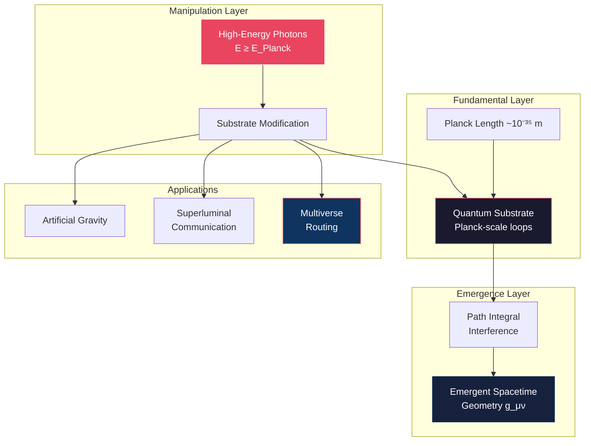
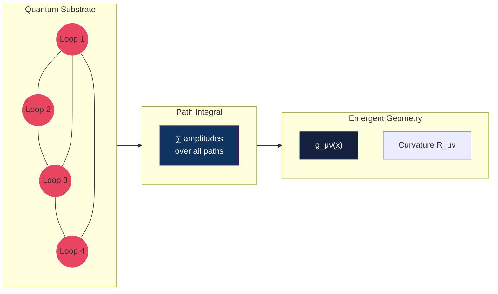
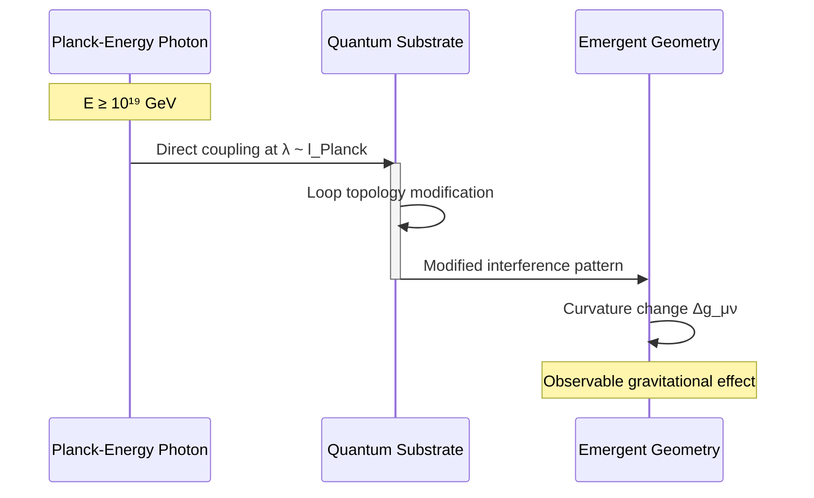
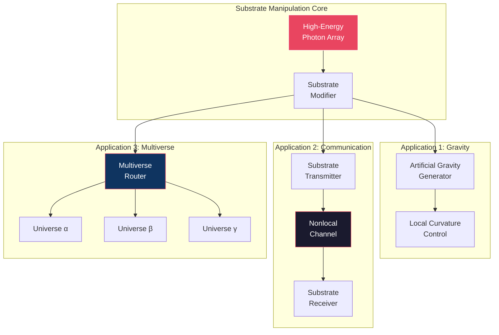
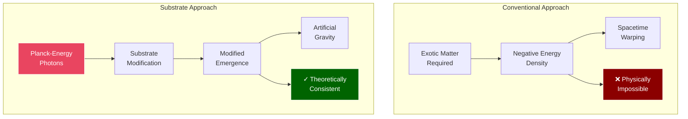
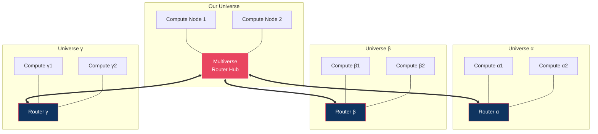
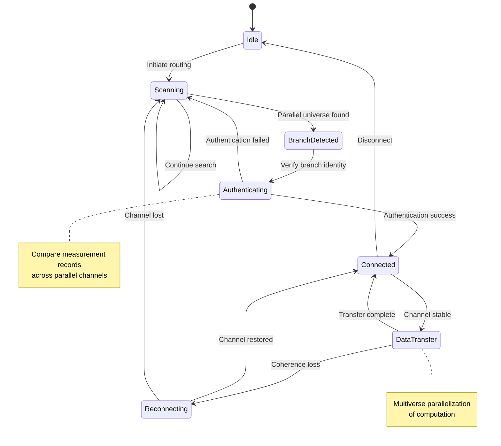
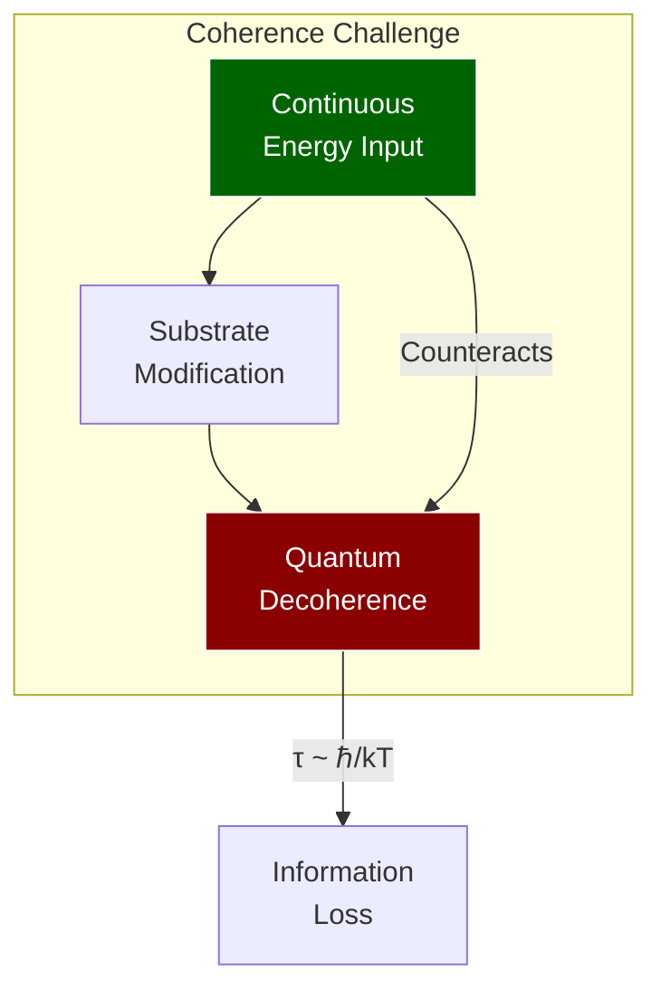
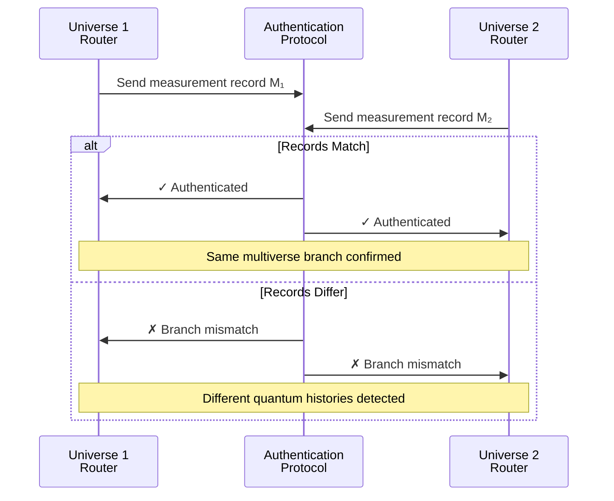

We propose a theoretical framework for manipulating the quantum substrate underlying spacetime geometry through
high-energy photon interactions at Planck-scale topological structures. Building upon emergent spacetime models where
geometry arises from quantum path integral interference, we demonstrate that sufficiently energetic photon beams can
modify the fundamental loop structures that generate spacetime curvature. This manipulation enables three revolutionary
applications: (1) artificial gravitational field generation through localized spacetime curvature modification, (2)
superluminal communication via direct quantum substrate channels that bypass emergent spacetime constraints, and (3)
multiverse routing through parallel substrate connections that may access different branches of quantum reality. We
present the theoretical foundations, analyze the energy requirements, and discuss the profound implications for
computation, information theory, and our understanding of physical reality.

**Keywords:** quantum gravity, emergent spacetime, loop quantum gravity, multiverse theory, superluminal communication

## 1. Introduction

The conventional view of spacetime as a fixed background stage for physical processes has been increasingly challenged
by developments in quantum gravity theory. Loop quantum gravity (LQG) [1,2], emergent gravity models [3,4], and
holographic principles [5,6] suggest that spacetime geometry itself may be an emergent phenomenon arising from more
fundamental quantum information processes.

In this framework, what we perceive as smooth spacetime emerges from discrete quantum structures at the Planck scale (~
10^-35 m). These "irreducible Planck loops" represent the fundamental topology from which classical geometry emerges
through quantum interference effects analogous to Feynman path integrals [7].

If spacetime is indeed emergent rather than fundamental, this raises a profound question: can the underlying quantum
substrate be directly manipulated to modify spacetime properties? We propose that high-energy photons approaching Planck
energies (~10^19 GeV) can interact directly with these quantum substrate structures, enabling unprecedented control over
spacetime geometry and potentially accessing parallel quantum realities.

## 2. Theoretical Framework

### 2.0 Conceptual Overview

The following diagram illustrates the hierarchical relationship between the quantum substrate, emergent spacetime, and
the applications enabled by substrate manipulation:

### 2.4 Related Theoretical Developments

Our substrate manipulation framework builds upon and connects to several theoretical approaches:
**Unified Quantum Gravity**: The quantum substrate concept relates to observer-dependent spacetime emergence theories (
see [Observer-Dependent Spacetime](./2025-07-01-quantum-spacetime-paper.md)), where multiple classical spacetimes can
emerge from a
single quantum structure. Our multiverse routing exploits this multiplicity.
**Quantum Computational Architectures**: The substrate modification approach shares principles with quantum graph
computation models (see [Dynamic Quantum [Dynamic Quantum Graphs](./2025-06-30-dynamic-quantum-graphs.md) changes enable
computational advantages. Both suggest that dynamic structure manipulation is key to transcending conventional limits.
**Computational Cosmology**: The information-theoretic aspects connect to computational substrate theories (
see [Simulation QFT Hashlife](./2025-06-30-simulation-qft-hashlife.md)timized computational system.
Multiverse routing might exploit the computational nature of reality itself.

### 2.1 Emergent Spacetime from Quantum Substrates

Following recent developments in emergent gravity [8,9], we model spacetime geometry as arising from quantum path
integral interference patterns over discrete Planck-scale topological structures. The metric tensor g_μν emerges from
the statistical properties of quantum amplitude summations:

g_μν(x) = ⟨Ψ|T_μν|Ψ⟩_substrate

where |Ψ⟩_substrate represents the quantum state of the underlying topological network and T_μν is the effective
stress-energy operator on the substrate.
The emergence process can be visualized as follows:

### 2.2 High-Energy Photon Interactions

Photons with energies E ≥ E_Planck = √(ℏc^5/G) ≈ 1.22 × 10^19 GeV can interact directly with Planck-scale structures
rather than propagating through emergent spacetime. At these energies, the photon wavelength λ = h/E approaches the
Planck length, enabling direct coupling to the quantum substrate topology.

The interaction Hamiltonian becomes:

H_int = ∫ d³x A_μ(x) J^μ_substrate(x)

where A_μ is the photon field and J^μ_substrate represents current operators acting on the discrete loop network.

### 2.3 Nonlocal Substrate Dynamics

At the Planck scale, the concept of locality breaks down. The irreducible loop structures exist in a regime where
spatial separation is not well-defined, as spacetime itself emerges from their collective behavior. This enables
nonlocal correlations that bypass the light-speed constraint imposed by emergent spacetime geometry.

## 3. Applications

The three primary applications of substrate manipulation form an interconnected system:

### 3.1 Artificial Gravity Generation

By creating specific interference patterns in the quantum substrate through controlled high-energy photon bombardment,
localized modifications to spacetime curvature can be induced. The resulting gravitational field strength is:

g_artificial = (8πG/c⁴) ⟨T_μν⟩_modified

where ⟨T_μν⟩_modified represents the effective stress-energy from substrate modifications.

This approach circumvents the exotic matter requirements of conventional anti-gravity schemes by directly editing the
quantum "source code" that generates gravitational effects.

### 3.2 Superluminal Communication Networks

Communication channels can be established through the quantum substrate itself, bypassing the speed-of-light limitations
of signals propagating through emergent spacetime. Information is encoded in substrate modifications that propagate
through the nonlocal loop network:

I_transmitted = Tr[ρ_substrate log(ρ_substrate)]

where ρ_substrate represents the modified quantum state carrying encoded information.

Ultra-high-energy transponders maintain channel coherence by continuously refreshing the substrate modifications against
decoherence. Since the substrate operates below the level where spacetime locality emerges, these channels are
inherently nonlocal.

```mermaid
sequenceDiagram
    participant A as Station Alpha
    participant SA as Substrate<br/>(Alpha Region)
    participant SB as Substrate<br/>(Beta Region)
    participant B as Station Beta
    Note over SA,SB: Nonlocal substrate connection<br/>(bypasses emergent spacetime)
    A->>SA: Encode message in<br/>substrate modification
    activate SA
    SA-->>SB: Instantaneous substrate<br/>correlation update
    activate SB
    Note over SA,SB: No light-speed limit<br/>at substrate level
    SB->>B: Decode substrate<br/>state change
    deactivate SA
    deactivate SB
    rect rgb(25, 25, 50)
        Note over A,B: Effective FTL communication<br/>through sub-spacetime channel
    end
```

### 3.3 Multiverse Routing Networks

The most profound application emerges from recognizing that multiple spacetime geometries may emerge from the same
underlying quantum substrate. Different branches of quantum reality (multiverse branches) could share substrate
connectivity while exhibiting distinct emergent spacetimes.

A network of parallel substrate channels (N ≥ 8 recommended for redundancy) creates a "multiverse router" capable of:

* Distributing computational tasks across multiple reality branches
* Performing quantum error correction across parallel universes
* Breaking fundamental computational complexity limits through multiverse parallelization

The information processing capacity scales as:

C_multiverse = N × C_single_universe × f_coherence

where f_coherence represents the fraction of time multiverse channels maintain stable connections.

The multiverse routing protocol operates as follows:

## 4. Energy Requirements and Technical Challenges

### 4.1 Power Scaling

The energy required for substrate manipulation scales approximately as:

E_required ≈ (E_Planck)² × V_substrate / V_Planck

where V_substrate is the volume of substrate being modified and V_Planck is the Planck volume.

For practical applications, energy requirements remain far beyond current technological capabilities but are finite and
well-defined, unlike exotic matter schemes.

### 4.2 Coherence and Stability

Maintaining substrate modifications against quantum decoherence requires continuous energy input. The coherence time
scales as:

τ_coherence ≈ ℏ / (k_B T_effective)

where T_effective represents the effective temperature of the quantum substrate environment.

### 4.3 Multiverse Authentication

A critical challenge for multiverse communication is verifying that parallel channels connect to the intended reality
branch rather than alternate quantum histories. We propose quantum authentication protocols based on comparing records
of specific measurement outcomes that should be identical across genuine parallel channels within the same multiverse
branch.

## 5. Implications and Discussion

### 5.1 Computational Revolution

Multiverse routing networks would fundamentally alter computational complexity theory. Problems currently requiring
exponential time could potentially be solved in polynomial time through multiverse parallelization, effectively breaking
the Church-Turing thesis limitations within a single universe.

### 5.2 Information Theoretic Consequences

These systems may violate conventional information processing limits by accessing computational resources from parallel
realities. The implications for cryptography, artificial intelligence, and fundamental physics are profound.

### 5.3 Philosophical Considerations

Practical multiverse communication would provide the first empirical evidence for the many-worlds interpretation of
quantum mechanics, fundamentally altering our understanding of reality's structure.

## 6. Conclusions

We have presented a theoretical framework for direct manipulation of the quantum substrate underlying spacetime geometry
through high-energy photon interactions. While energy requirements remain far beyond current capabilities, the proposed
mechanisms offer theoretically consistent pathways to artificial gravity, superluminal communication, and multiverse
access.

The multiverse routing concept represents a potential paradigm shift in computation and information processing,
suggesting that the ultimate limits of technology may be determined not by single-universe physics, but by our ability
to coordinate across parallel quantum realities.

Future work should focus on developing more detailed mathematical models of substrate-photon interactions and exploring
potential lower-energy approaches to quantum substrate manipulation.

## References

[1] Ashtekar, A. & Lewandowski, J. (2004). "Background independent quantum gravity: A status report." Class. Quantum
Grav. 21, R53.

[2] Rovelli, C. (2004). "Quantum Gravity." Cambridge University Press.

[3] Jacobson, T. (1995). "Thermodynamics of spacetime: The Einstein equation of state." Phys. Rev. Lett. 75, 1260.

[4] Verlinde, E. (2011). "On the origin of gravity and the laws of Newton." JHEP 04, 029.

[5] Maldacena, J. (1999). "The Large-N limit of superconformal field theories and supergravity." Int. J. Theor. Phys.
38, 1113.

[6] Susskind, L. & Maldacena, J. (2013). "Cool horizons for entangled black holes." Fortsch. Phys. 61, 781.

[7] Feynman, R.P. & Hibbs, A.R. (1965). "Quantum Mechanics and Path Integrals." McGraw-Hill.

[8] Van Raamsdonk, M. (2010). "Building up spacetime with quantum entanglement." Gen. Rel. Grav. 42, 2323.

[9] Ryu, S. & Takayanagi, T. (2006). "Holographic derivation of entanglement entropy from AdS/CFT." Phys. Rev. Lett. 96,
181602.
This framework connects to several related theoretical developments:
**Quantum Graph Implementation**: The multiverse router finds natural implementation in
dynamic [Dynamic Quantum Graphs](./2025-06-30-dynamic-quantum-graphs.md)Graphs](
dynamic_quantum_graphs.md)[Dynamic Quantum Graphs](./2025-06-30-dynamic-quantum-graphs.md) graph topology, with quantum
tunneling between configurations enabling
multiverse navigation. The entanglement structure provides the routing mechanism between realities.
**Computational Substrate Foundation**: The multiverse router operates on the computational substrate
described in hashlife optimiza[Simulation QFT Hashlife](./2025-06-30-simulation-qft-hashlife.md)_qft_hashlife.md)).
Different u[Simulation QFT Hashlife](./2025-06-30-simulation-qft-hashlife.md) cosmic optimization problem, with the
router enabling exploration of the solution space. Each branch corresponds to a different hashlife
pattern library.
**Observer-Dependent Projections**: The routing mechanism directly implements the observer-dependent
spacetime projections (see [Observer-Dependent Spacetime](./2025-07-01-quantum-spacetime-paper.md)). Each universe
branch re[Observer-Dependent Spacetime](./2025-07-01-quantum-spacetime-paper.md)uantum foam, with routing enabling
transitions between different observational perspectives on the same fundamental reality.
**Wavelet Multiverse Decomposition**: The multiverse structure can be analyzed using wavelet geometric
optimization (see [Wavelet
Geometri[Wavelet Geometric Optimization](../projects/2025-06-30-wavelet-geometric-optimization.md)
verse [Wavelet Geometric Optimization](../projects/2025-06-30-wavelet-geometric-optimization.md)
routing paths corresponding to geodesics in the manifold of possible realities.
The multiverse router finds natural implementation in dynamic quantum graph architectures.
