# The Consciousness Revolution: A Platform for Systematic Change

## Fundamental Premise: The Current System is Anti-Human

**The existing political and economic order is designed to suppress human consciousness and maintain power structures
that profit from suffering.** We demand systematic dismantling of institutions that reduce humans to economic units
while denying our fundamental nature as conscious beings capable of self-directed evolution.
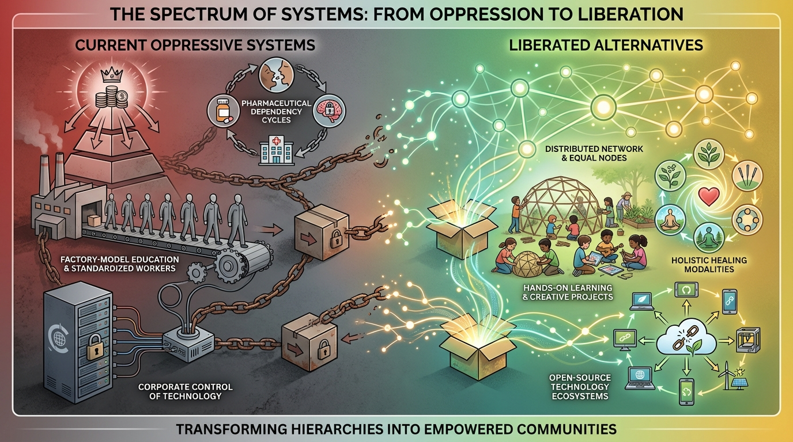

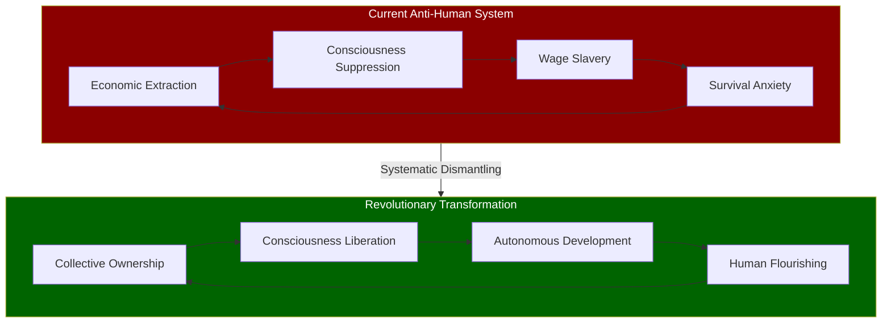

## Overthrow the Medical-Industrial Complex

**Nationalize healthcare and eliminate pharmaceutical monopolies.** The current system creates dependency on symptom
management while suppressing research into consciousness-based healing that threatens profit margins.
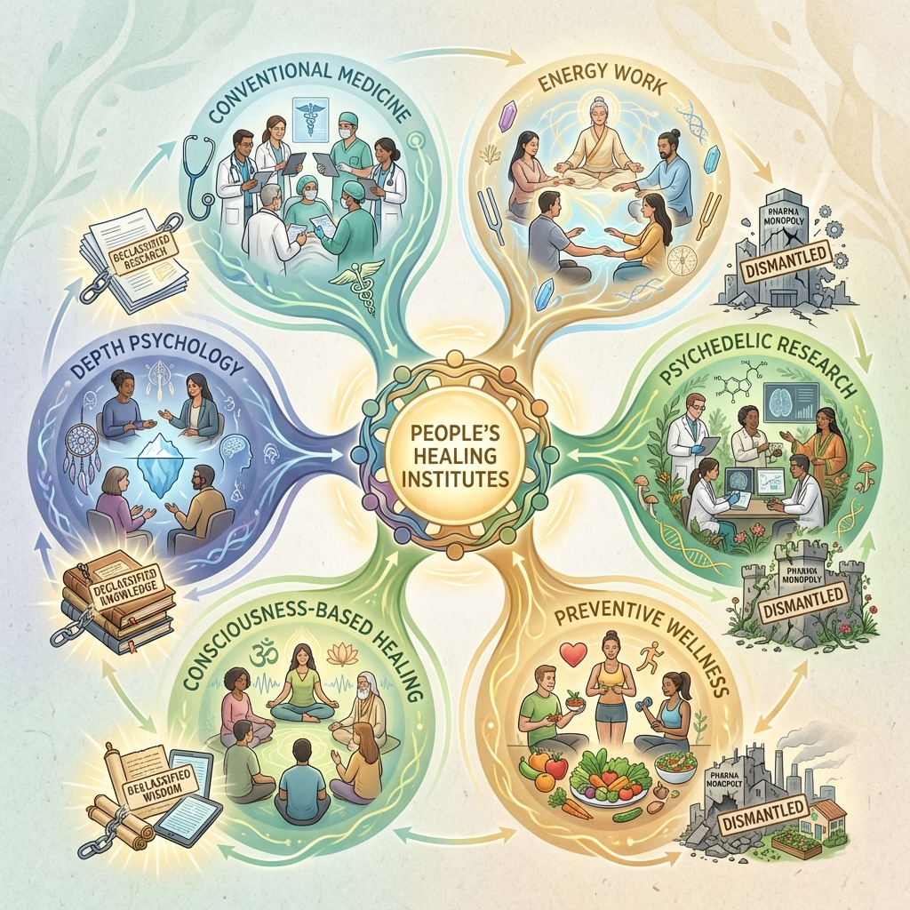

**Establish People's Healing Institutes** staffed by practitioners trained in multiple modalities - conventional
medicine, energy work, and depth psychology. No more gatekeeping by medical boards protecting corporate interests.

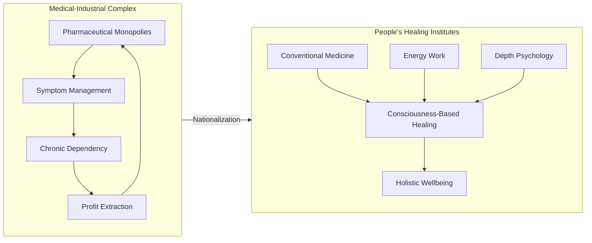

**Immediate research declassification** of suppressed studies on psychedelics, energy healing, and consciousness
effects. Fund massive public research into technologies that enhance human potential rather than maintaining chronic
illness for profit.

**End psychiatric coercion.** Abolish involuntary commitment except for immediate physical danger. Reframe psychological
distress as natural response to toxic social conditions requiring societal change, not individual adjustment.

## Dismantle the Education Indoctrination System

**Public education currently functions as consciousness suppression training** designed to produce compliant workers
rather than autonomous thinkers. We demand complete restructuring.
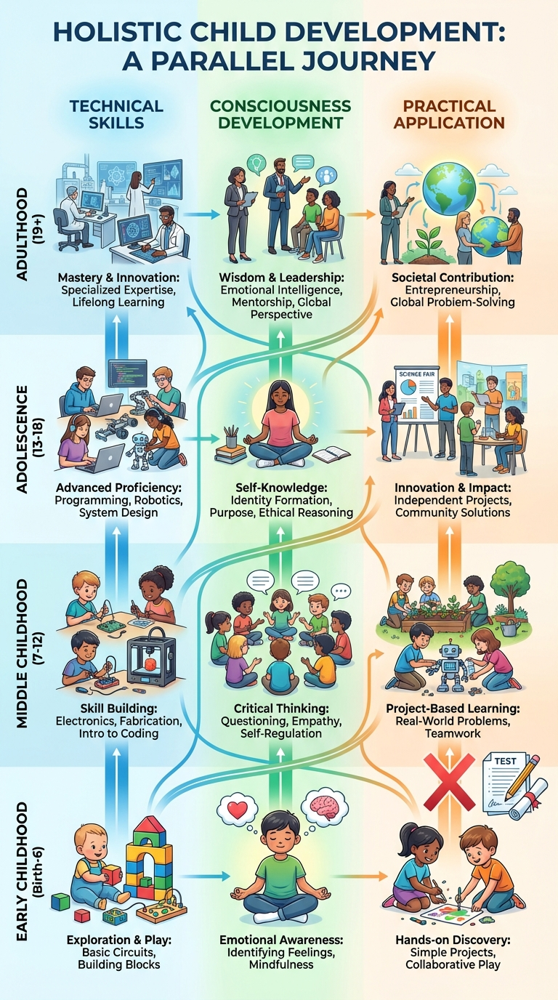

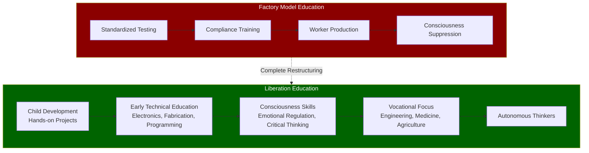

**Child Development as Public Investment** - eliminate factory-model schooling that produces compliant workers. Children
learn through hands-on projects, technical skills, and consciousness development practices. No standardized testing
reducing human complexity to scores.

**Early Technical Education** - children learn to build, repair, and understand technology from young ages. Every child
graduates with practical skills: electronics, fabrication, programming, biological systems, mechanical systems. No
useless liberal arts gatekeeping.

**Consciousness Skills Training** - emotional regulation, critical thinking, and social cooperation taught as core
curriculum. Children learn to recognize manipulation, understand group dynamics, and develop authentic self-knowledge.

**Post-Secondary Vocational Focus** - public funding only for skills that serve collective development: engineering,
medicine, education, agriculture, consciousness research. Want to study medieval poetry? Great, pay for it yourself and
don't expect society to subsidize your hobby.

## Economic Revolution Against Wage Slavery

**The current economic system forces consciousness into artificial scarcity** while concentrating resources among
psychopathic elites. We demand fundamental restructuring.
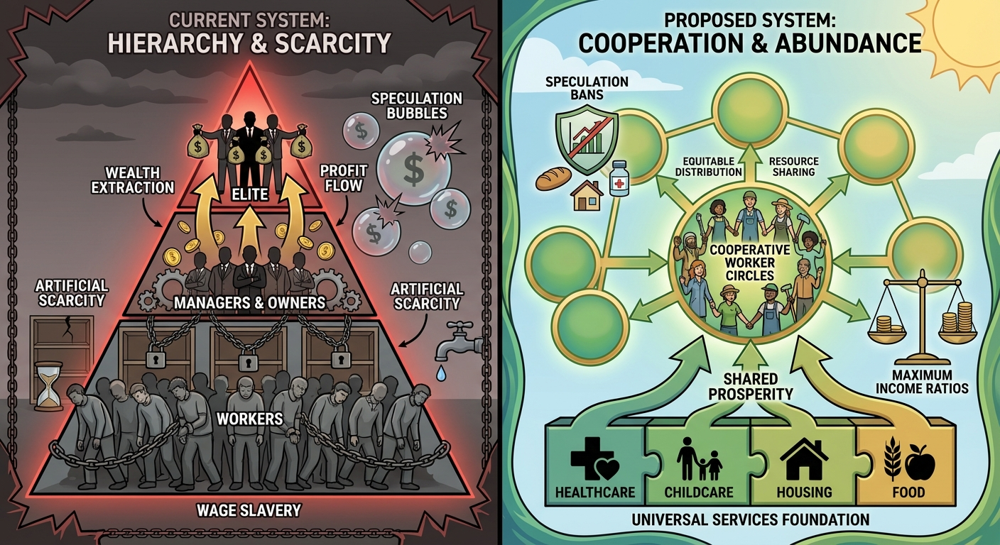

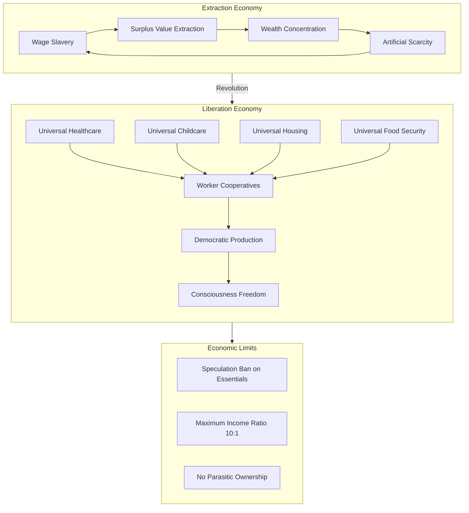

**Strategic Universal Services** providing healthcare, childcare, housing, and food as public investments in human
development. This frees consciousness from survival anxiety, enabling higher potential.

**Universal Childcare from Birth** - we all live with the results of how children are raised, so we all invest in
raising them properly. Professional childcare workers trained in consciousness development, not just babysitting.
Children learn emotional regulation, technical skills, and critical thinking from the start.

**No Subsidized Higher Education** - college has become credentialist gatekeeping that creates artificial scarcity for
middle-class jobs. Adults can pay for their own philosophy degrees and beer money. Public investment goes to practical
skills training and consciousness development for all ages instead of subsidizing prolonged adolescence for the
privileged.

**Worker control of production** through mandatory cooperatives. No more extraction of surplus value by parasitic
ownership classes. Workers decide how their labor contributes to collective wellbeing.

**Speculation ban** on housing, food, and essential resources. These cannot be treated as investment vehicles for wealth
accumulation while people suffer deprivation.

**Maximum income ratios** - no individual can earn more than 10 times the lowest-paid worker in their organization.
Extreme wealth concentration creates toxic power dynamics that corrupt consciousness.

## Political System Overhaul

**Representative democracy is a sham** that creates the illusion of participation while maintaining elite control. We
demand direct democracy with sophisticated collective decision-making processes.
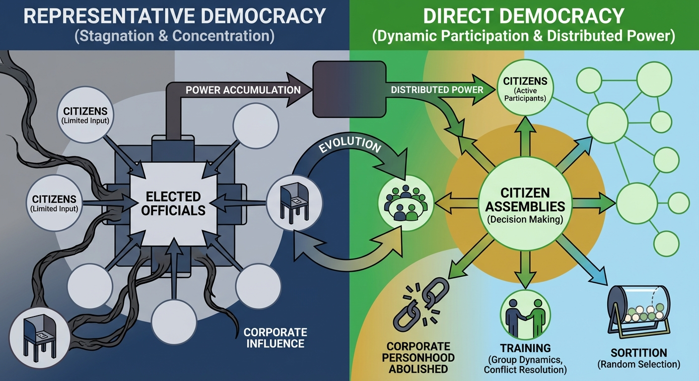

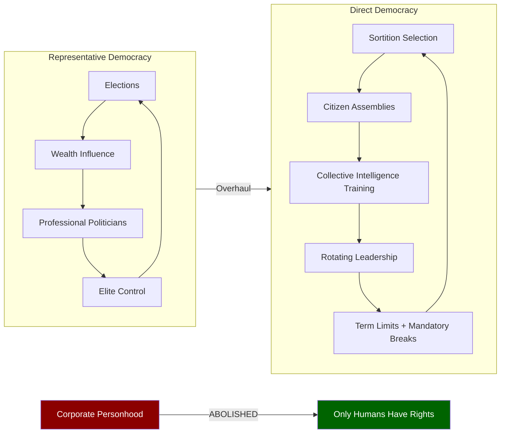

**Citizen assemblies** using sortition rather than elections. Random selection eliminates the influence of wealth and
creates truly representative bodies. These assemblies receive extensive training in group dynamics, conflict resolution,
and collective intelligence methods.

**Rotating leadership** with term limits and mandatory breaks from power. No professional political class accumulating
influence over decades. Power corrupts consciousness - we design systems assuming this reality.

**Corporate personhood abolished.** Corporations cannot participate in political processes. Only actual humans have
political rights. Corporate influence in politics is treason against human consciousness.

## Technological Liberation and Aggressive Technocracy

**Technology must serve consciousness expansion, not corporate control.** We demand complete overthrow of the
proprietary technology system that keeps humans dependent on corporate gatekeepers.

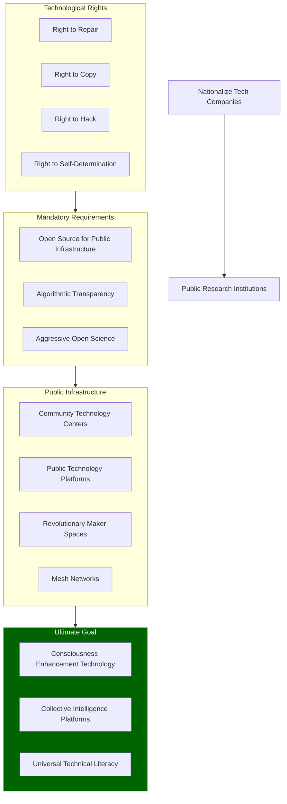

**Universal Right to Repair** - it is illegal to prevent modification, repair, or reverse engineering of any technology.
Planned obsolescence is economic terrorism against human consciousness. All repair manuals, schematics, and diagnostic
tools must be publicly available.

**Absolute Right to Copy** - all software, designs, and digital content enter public domain immediately. Copyright and
patent systems are artificial scarcity mechanisms that prevent human knowledge sharing. Information wants to be free -
we make it legally free.

**Mandatory Open Source** for all software used in public infrastructure, healthcare, education, and governance. No
black box algorithms making decisions about human lives. Code is law - therefore all law must be readable by citizens.

**Hacking as Human Right** - security research, reverse engineering, and system modification are protected activities. "
Computer crime" laws criminalize curiosity and technical skill - we legalize technological exploration.

**Public Technology Platforms** replacing corporate social media. Federated, open-source networks controlled by users
rather than algorithmic manipulation for profit. Communication infrastructure as public utility.

**Aggressive Open Science Mandates** - all research funded by public money immediately enters public domain. Academic
journals charging for access to publicly-funded research are information parasites that slow human progress.

**Right to Technological Self-Determination** - individuals control their data, devices, and digital relationships
completely. Surveillance capitalism ends through technical means and legal protection for privacy tools.

**Community Technology Centers** in every neighborhood providing free access to advanced fabrication tools - 3D
printers, electronics workshops, biolab equipment. Democratize the means of technological production.

**Algorithmic Transparency Laws** - any algorithm affecting human welfare must be publicly auditable. AI systems making
decisions about employment, housing, healthcare, or criminal justice cannot be proprietary black boxes.

**Public Research and Development** - nationalize all technology companies and convert them to public research
institutions. Private ownership of transformative technology concentrates power and slows innovation that could benefit
consciousness development.

**Revolutionary Maker Spaces** that teach advanced technical skills while building alternative infrastructure. Citizens
learn to build mesh networks, renewable energy systems, and consciousness-enhancement technologies outside corporate
control.

**Technology for Consciousness Enhancement** - public funding prioritizes tools that expand human awareness rather than
increase consumption. Brain-computer interfaces, biofeedback systems, and collective intelligence platforms developed as
public resources.

**Elimination of Digital Divide** through guaranteed access to advanced computing resources and high-speed internet as
basic rights. Technical literacy becomes universal education requirement for meaningful participation in
technologically-mediated democracy.

## Environmental Restoration as Consciousness Healing

**Ecological destruction reflects disconnection from natural consciousness.** Environmental policy must address the
spiritual crisis underlying humanity's destructive relationship with nature.

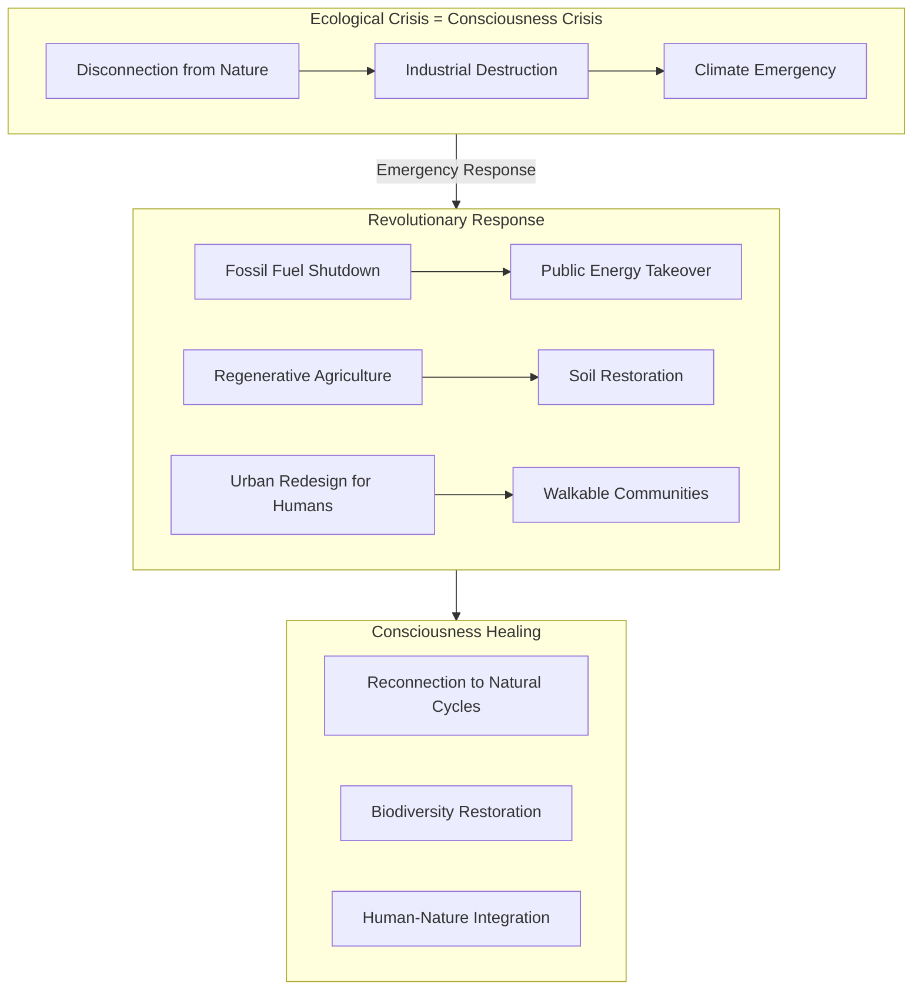

**Immediate fossil fuel industry shutdown** with public takeover of energy infrastructure. Climate change represents
consciousness emergency requiring emergency response, not market solutions.

**Regenerative agriculture** replacing industrial monoculture. Food production systems that restore soil, biodiversity,
and human connection to natural cycles. Industrial agriculture is warfare against consciousness.

**Urban design for human flourishing** rather than automobile convenience. Walkable communities with green spaces that
enable natural human social patterns and connection to living systems.

## Strategic Non-Interference and Internal Revolution

**We reject global revolutionary evangelism.** Other nations must develop their own consciousness-liberation strategies
appropriate to their conditions. We focus on transforming our own systems rather than imposing solutions externally.

```mermaid
flowchart LR
    subgraph Reject["REJECT"]
        X1[Interventionist Foreign Policy]
        X2[Military Intervention]
        X3[Economic Coercion]
        X4[Ideological Conditions]
    end
    subgraph Embrace["EMBRACE"]
        E1[Internal Revolution Focus]
        E2[Technology Sharing]
        E3[Refugee Expansion]
        E4[Fair Trade Without Exploitation]
        E5[Defensive Posture Only]
    end
    subgraph Principle["Core Principle"]
        P1[Revolution by Example<br/>Not by Force]
    end
    Reject -->|"Replace With"| Embrace
    Embrace --> Principle
    style Reject fill:#8b0000,color:#fff
    style Embrace fill:#006400,color:#fff
```

**End interventionist foreign policy** that destabilizes other societies under humanitarian pretexts. Military
intervention and economic coercion prevent organic social development and create refugee crises that benefit no one
except defense contractors.

**Trade and cooperation without ideological conditions.** We work with any government willing to engage honestly,
regardless of their internal systems. Our revolution succeeds through example and attraction, not conquest or
conversion.

**Technology sharing as soft power** - freely provide renewable energy, medical knowledge, and educational resources to
any nation requesting them. Demonstrate superior social organization through generosity rather than force.

**Defensive posture only** - maintain strong defensive capabilities while eliminating power projection capacity. Our
military exists to protect consciousness revolution at home, not export it abroad.

**Refugee and asylum expansion** for those fleeing oppressive systems. We welcome people seeking consciousness freedom
while respecting other nations' sovereignty to organize however they choose.

**Economic cooperation without exploitation** - fair trade agreements that don't extract surplus value from developing
nations. End debt imperialism and structural adjustment programs that force neoliberal policies on vulnerable countries.

## Transition Strategy: Picking Up the Pieces

**Revolutionary movements succeed by demonstrating superior organization during system breakdown.** When current
institutions fail to meet basic needs, we step in with effective alternatives that people can see working immediately.

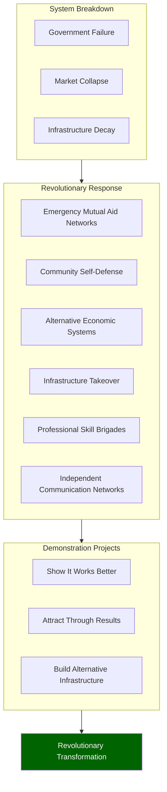

**Emergency Mutual Aid Networks** providing food, shelter, and medical care when government systems collapse or become
unreliable. These networks demonstrate revolutionary organizing principles while meeting immediate survival needs.

**Community Self-Defense** protecting neighborhoods from both state violence and criminal chaos during transition
periods. Armed community groups trained in de-escalation and collective security, accountable to local assemblies rather
than external authorities.

**Alternative Economic Systems** including local currencies, time banks, and resource sharing networks that function
when traditional markets break down. People experience post-capitalist economics as practical solutions rather than
abstract theory.

**Infrastructure Takeover** of abandoned or failing facilities - turning empty buildings into community centers,
establishing neighborhood workshops in closed factories, converting vacant lots into food production. We inherit the
useful pieces while discarding the dysfunctional structures.

**Professional Skill Brigades** - doctors, teachers, engineers, and other trained professionals organized to serve
community needs rather than profit extraction. Brain drain from failing institutions into revolutionary alternatives.

**Communication Networks** using mesh networking and secure channels to coordinate mutual aid and resistance activities.
Information infrastructure independent of corporate and government control.

**Demonstration Projects** showing consciousness-based organizing works better than current systems. Success stories
that attract people through results rather than ideology.

## The Revolutionary Moment

**Consciousness evolution and political revolution are inseparable processes.** As people awaken to their authentic
nature and potential, they inevitably reject systems designed to suppress human flourishing.

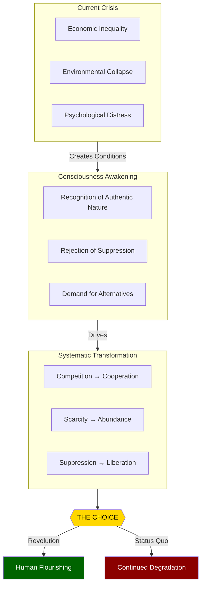

**The current crisis - economic inequality, environmental collapse, and widespread psychological distress - creates
revolutionary conditions.** People are ready for alternatives that address root causes rather than managing symptoms.

**This platform represents systematic transformation** from competition-based scarcity consciousness toward
cooperation-based abundance consciousness. We reject incremental reform that maintains fundamental power structures
while creating the illusion of progress.

**The choice is revolutionary transformation or continued degradation** of human consciousness under systems that treat
people as expendable resources. We choose revolution.
