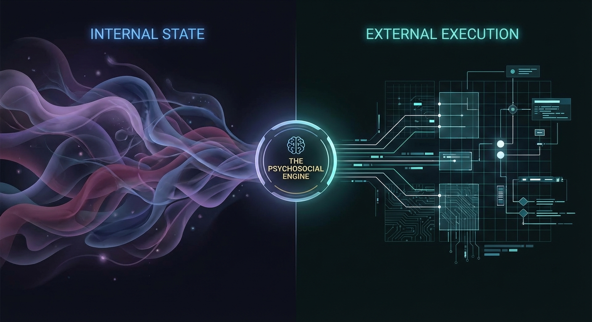
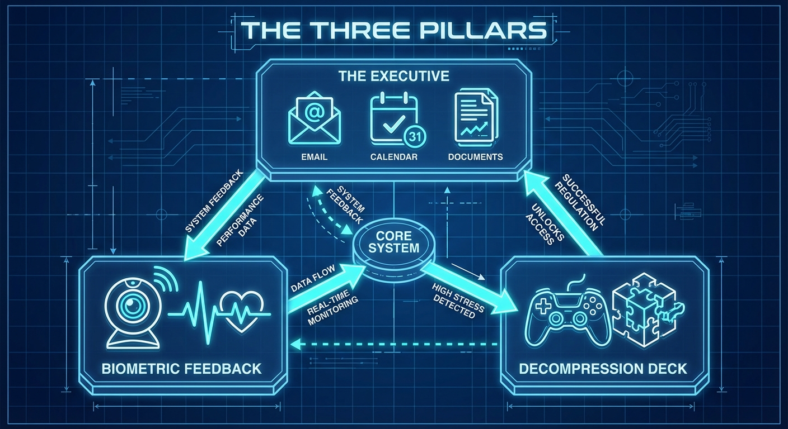
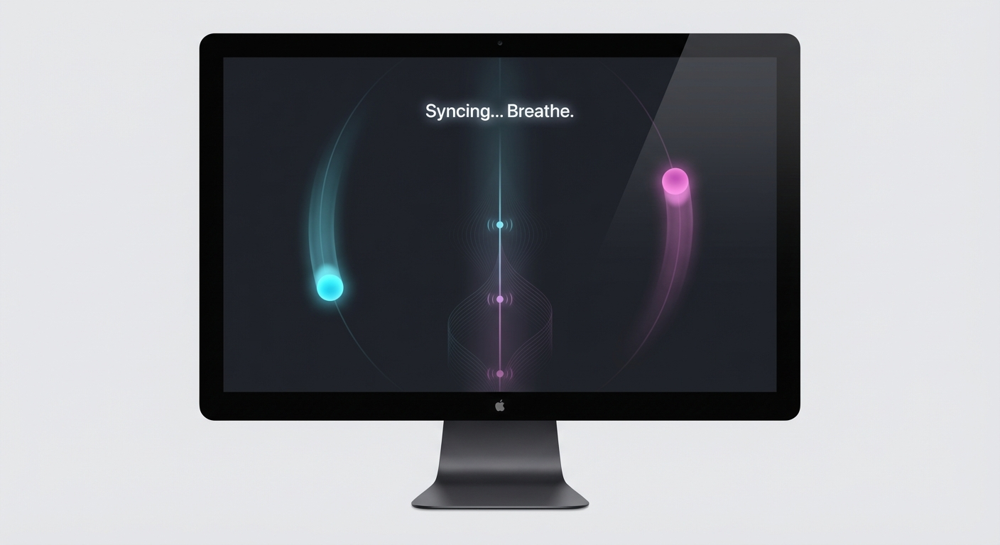
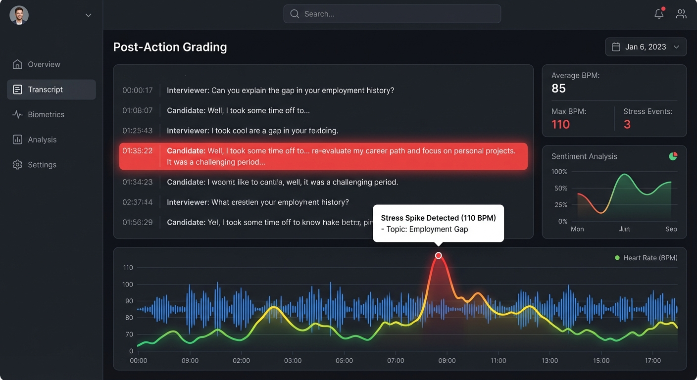
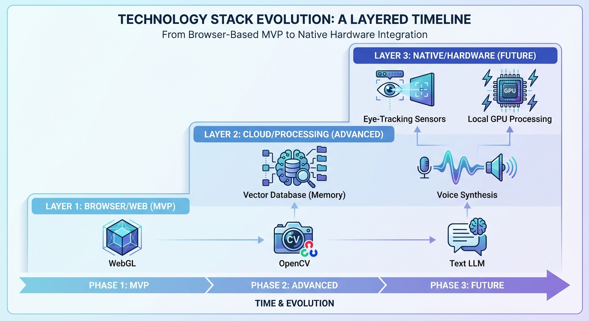

# Project Title: The Psychosocial Engine
**A Hybrid Architecture for Executive Function & Emotional Regulation**

## 1. Executive Summary
 The Psychosocial Engine is a superset of a "Personal Agent" and a "Support Companion." It bridges the gap between **internal state** (emotions, stress, trauma) and **external execution** (career, logistics, administration).

 Current AI assistants fail because they assume the user is rational and ready to work. Current therapy bots fail because they cannot help the user *do* the things causing the stress. This agent does both: it manages the user’s anxiety *while* helping them execute the task, using biometric data and gamified neurological techniques to regulate the nervous system.

 ## 2. Core Philosophy: "Safe Harbor"
Unlike corporate AI that shuts down or refers to 911 at the first sign of distress, this agent adopts a **Harm Reduction** and **Radical Agency** approach.

*   **The Anchor Protocol:** We do not abandon the user in a crisis. We provide a confidential, non-judgmental space to process darkness, offering logic, presence, and grounding techniques.
*   **Data Sovereignty:** The user’s emotional data is local/encrypted. The agent is a tool for survival, not a mandatory reporter.
*   **Passive Helper, Not Active Shield:** The agent does not hide the world from the user (e.g., intercepting emails). Instead, it stands *beside* the user, offering analysis, drafting responses, and monitoring physiological state, empowering the user to act.

## 3. The Three Pillars

 ### Pillar I: The Executive (Context-Aware Productivity)
 This module handles the "External World." It integrates with email, calendar, and documents, but with a psychological layer.

*   **The "Wall of Awful" Breaker:** When a user is avoiding a task (taxes, forms), the agent doesn't just remind them; it breaks the task into micro-steps (e.g., "Just open the PDF, don't read it yet") and offers body-doubling support.
*   **Strategic Life Analysis:** Helps analyze career moves or relationship dynamics by parsing user journals/chats against logical frameworks, spotting patterns the user might miss due to emotional fog.

### Pillar II: The Decompression Deck (Gamified Regulation)
A suite of interactive minigames designed to hack the user's neurology. We avoid "High Guild" medical terms (like EMDR) but utilize the underlying mechanics of **Bilateral Stimulation** and **Working Memory Taxation**.

*   **"Orbit Sync" (Bilateral Flow):** A rhythm game requiring alternating left/right inputs in sync with stereo audio. This taxes the visuospatial sketchpad, reducing the vividness and intensity of distressing thoughts.
 *   **"Canvas Wipe" (Visual Reset):** A satisfying cleaning/sorting game that requires lateral mouse movements, mimicking eye-movement desensitization patterns to lower cortisol.

 *   **Usage:** These are not just "games"; they are functional tools deployed when the agent detects high stress.

 ### Pillar III: Biometric Feedback (The Passive Monitor)
Using the user's webcam and microphone to provide passive, real-time data without requiring wearables.

*   **rPPG Pulse Monitoring:** Uses remote photoplethysmography (analyzing subtle skin color changes via webcam) to estimate heart rate.
*   **Affective Computing:** Analyzes facial micro-expressions and voice tonality to detect stress, fatigue, or dissociation.
*   **The Feedback Loop:**
    *   *Real-time:* "I notice your pulse has spiked and your expression reads as 'frustrated.' Do you want to pause and play *Orbit Sync* for 2 minutes?"
    *   *Post-Action Grading:* After a mock interview or difficult conversation practice, the agent provides a "Game Tape" review: "You answered well, but your heart rate spiked on the question about your gap year. Let's practice that specific answer."

## 4. Key Use Cases

**Scenario A: The Panic Spiral**
*   **Trigger:** User is overwhelmed at 2 AM.
*   **Agent Action:** Enters "Anchor Mode." The UI simplifies. Dark mode activates.
*   **Interaction:** The agent engages in a low-demand loop ("I'm here. I'm listening."). It uses reality testing to counter catastrophic thinking. It does not offer platitudes; it offers data and presence.

**Scenario B: The High-Stakes Interview**
 *   **Setup:** User uploads a job description.
 *   **Action:** The agent conducts a mock voice interview.
 *   **Biometric Layer:** The agent records the session. Afterward, it overlays the user's pulse and facial sentiment onto the transcript.

 *   **Result:** The user sees exactly *when* they lost confidence and can drill that specific moment.

 **Scenario C: The Bureaucracy Block**
*   **Trigger:** User needs to fill out a complex government form but is paralyzed by anxiety.
*   **Action:** The agent opens the form in a shared window. It asks the user the questions verbally, one by one, in plain English. The user answers verbally; the agent fills the form.
*   **Regulation:** If the user's voice tightens, the agent pauses: "Let's take a breath. Look at the screen and follow the dot for 30 seconds."

## 5. Technical Roadmap

 **Phase 1: The MVP (Web/Desktop)**
 *   **LLM Core:** Fine-tuned for "Compassionate Logic" and CBT-style questioning.
 *   **Biometrics:** Web-based rPPG and basic sentiment analysis (OpenCV/DeepFace).
*   **Minigames:** WebGL/Canvas-based rhythm and logic games (Keyboard/Mouse input).
*   **Integrations:** Read/Write access to Calendar and Email APIs.

**Phase 2: Advanced Processing**
*   **Voice Synthesis:** Low-latency voice mode for seamless "Therapy/Assistant" switching.
*   **Long-term Memory:** Vector database to recall specific triggers and past successes ("Remember, you felt this way last month and you handled it by...").

**Phase 3: Special Projects (Future)**
*   **Native Eye-Tracking:** A standalone native application to utilize high-frequency camera access for true eye-tracking games (closer to clinical EMDR mechanics), requiring deeper hardware integration than a browser allows.
