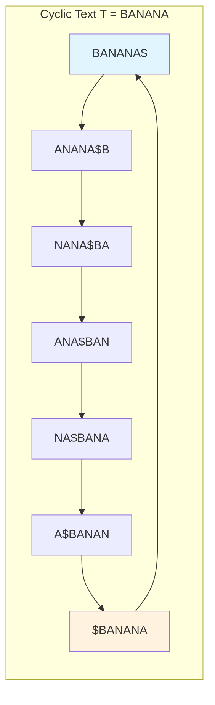
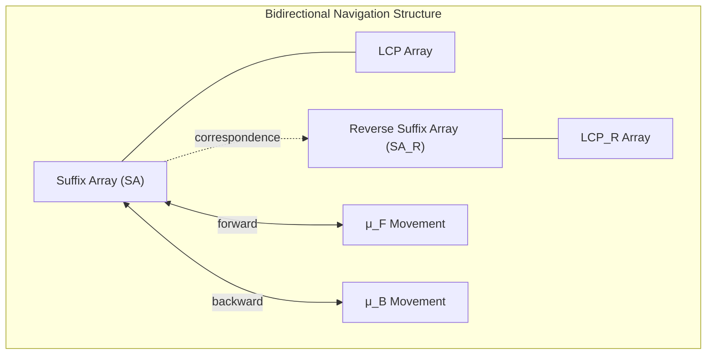
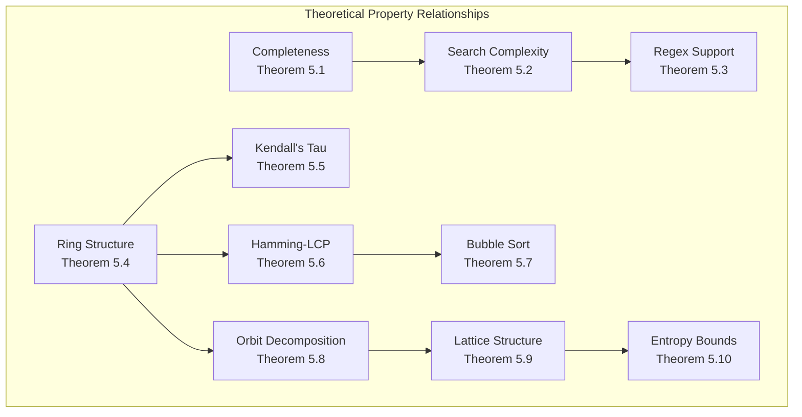
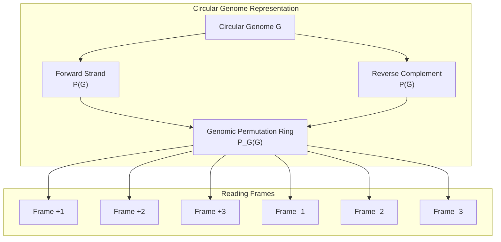
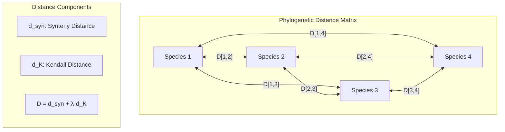
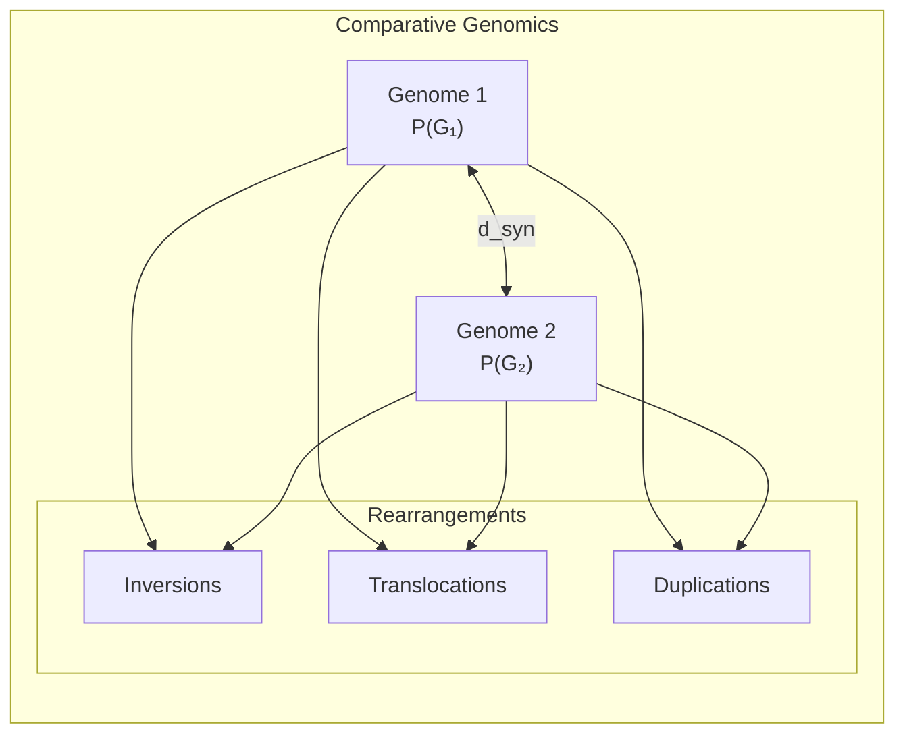
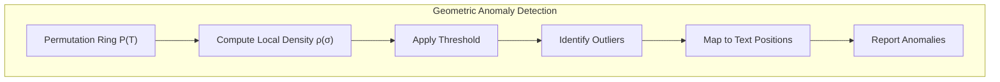
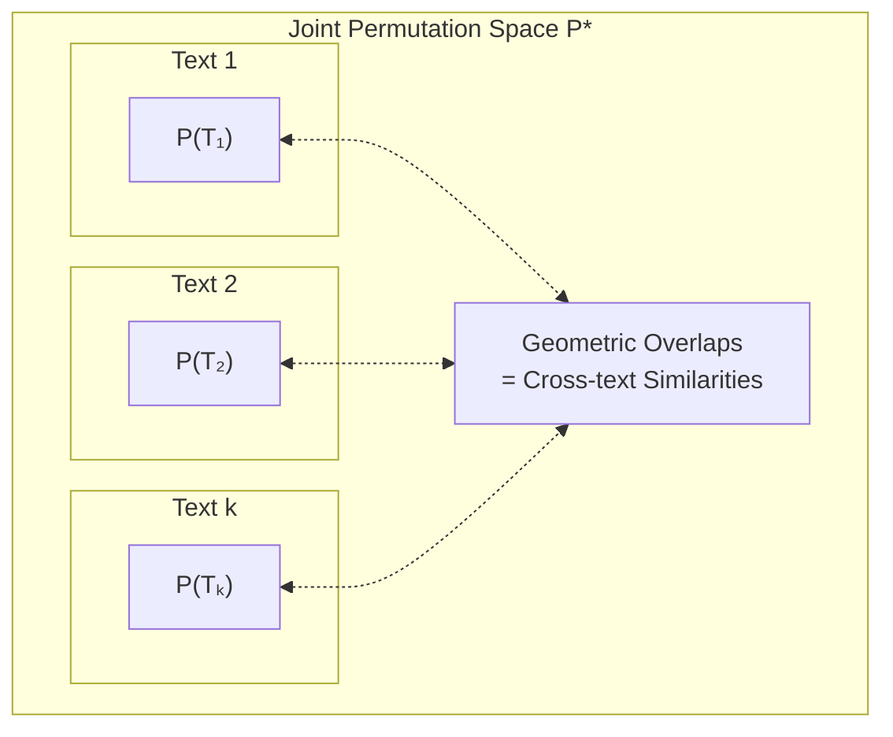
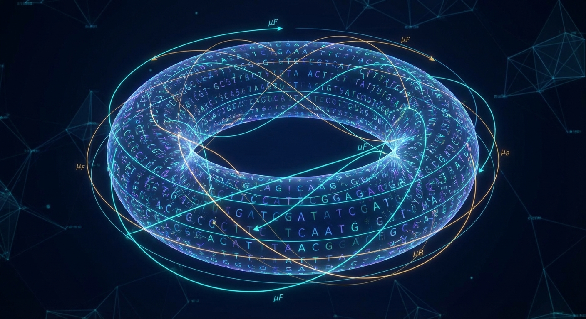

# HTML Generation Transcript

## Creating HTML File: `2025-11-20-bwt-fulltext-spec.html`

### Step 1: Generating HTML Structure

**Prompt:**
```
You are an expert web developer tasked with creating a complete, self-contained HTML file.

## Requirements:
Create an interactive demo of this concept. Allow the user to input a single line text, and then explore a cyclical 2d text map where both axes can be determined by selecting the fundamental permutations


## Context from Related Files:
# /home/andrew/code/Science/_posts/projects/2025-11-20-bwt-fulltext-spec.md

```
---
title: 'Permutation-Based Full-Text Index: Mathematical Specification'
layout: post
date: '"2025-11-20T00:00:00.000Z"'
last_modified: '"2024-01-01T00:00:00.000Z"'
category: projects
subcategory: Engineering & Formal Systems
tags:
  - Algorithms
  - Compression
  - Technical Spec
keywords:
  - BWT
  - suffix array
  - permutation ring
  - pattern matching
  - full-text index
  - regex
  - genomic analysis
status: stable
last_thought_date: '"2024-01-01T00:00:00.000Z"'
thought_generation: 1
parent_document: null
child_documents: []
related_documents:
  - _posts/projects/2025-11-20-bitpacked-mmap-lib.md
  - _posts/projects/2025-06-30-bwt-tree-proposal.md
  - _posts/portfolio/2025-06-30-ngram-paper.md
reading_order: 1
difficulty_level: advanced
reading_time_minutes: 45
document_type: research_paper
thinking_style: mathematical
consciousness_level: analytical
engagement_type: analytical
reader_participation: active
cognitive_load: intense
description: >-
  Comprehensive mathematical specification for a permutation-based full-text
  indexing system extending the Burrows-Wheeler Transform with regex pattern
  matching and genomic applications.
excerpt: >-
  A complete framework for full-text indexing using permutation groups, enabling
  efficient pattern matching, substring operations, and applications to genomic
  sequence analysis and natural language processing.
meta_title: 'Permutation-Based Full-Text Index: BWT Mathematical Specification'
meta_description: >-
  Mathematical specification for permutation-based full-text indexing system
  with Burrows-Wheeler Transform, suffix arrays, and regex pattern matching
  capabilities.
meta_keywords: >-
  Burrows-Wheeler Transform, suffix array, permutation groups, pattern matching,
  full-text index, regex, genomic analysis, information theory
og_title: 'Permutation-Based Full-Text Index: Mathematical Specification'
og_description: >-
  Comprehensive framework for full-text indexing using permutation groups with
  applications to genomics and NLP
og_type: article
og_locale: en_US
og_site_name: Fractal Thought Engine
schema_type: ScholarlyArticle
schema_headline: 'Permutation-Based Full-Text Index: Mathematical Specification'
schema_author: Andrew
schema_publisher: Fractal Thought Engine
schema_date_published: '"2024-01-01T00:00:00.000Z"'
schema_date_modified: '"2024-01-01T00:00:00.000Z"'
schema_image: /assets/images/bwt_permutation_ring.png
schema_word_count: 8500
schema_reading_time: PT45M
canonical_url: 'https://fractalthoughtengine.com/posts/bwt-fulltext-spec'
robots: 'index,follow'
googlebot: 'index,follow'
is_featured: false
is_cornerstone: true
is_gateway: true
is_synthesis: true
priority: '0.9'
changefreq: monthly
sitemap_exclude: false
search_exclude: false
---

## Abstract

We present a comprehensive full-text indexing system based on permutation groups that extends the Burrows-Wheeler
Transform (BWT) framework. The system constructs multiple permutation views of a cyclically-interpreted document,
enabling efficient regex pattern matching and substring operations through precomputed navigation structures and
agreement length caching.

## 1. Fundamental Definitions

### 1.1 Cyclic Text Representation

Given a text string $T = t_1 t_2 \ldots t_n$ of length $n$, we define the **cyclic extension** $T^∞$ as the infinite
repetition $T \cdot T \cdot T \cdot \ldots$

A **rotation** $R_i(T)$ for $0 \leq i < n$ is defined as:
$$R_i(T) = t_{i+1} t_{i+2} \ldots t_n t_1 t_2 \ldots t_i$$

The **rotation matrix** $\mathcal{R}(T)$ is the set of all rotations:
$$\mathcal{R}(T) = \{R_0(T), R_1(T), \ldots, R_{n-1}(T)\}$$



### 1.2 Permutation Groups

Let $S_n$ be the symmetric group on $n$ elements. We define several key permutations:

**Lexicographic Sort Permutation** $\pi_L$:
$$\pi_L: \{0, 1, \ldots, n-1\} \to \{0, 1, \ldots, n-1\}$$
such that $R_{\pi_L(0)}(T) \leq R_{\pi_L(1)}(T) \leq \ldots \leq R_{\pi_L(n-1)}(T)$ lexicographically.

**Reverse Sort Permutation** $\pi_R$:
$$\pi_R: \{0, 1, \ldots, n-1\} \to \{0, 1, \ldots, n-1\}$$
such that $R_{\pi_R(0)}(T) \geq R_{\pi_R(1)}(T) \geq \ldots \geq R_{\pi_R(n-1)}(T)$ lexicographically.

**Movement Permutations**:

- Forward movement: $\mu_F = \pi_L^{-1} \circ \sigma \circ \pi_L$ where $\sigma$ is the cyclic
  shift $(0 \; 1 \; 2 \; \ldots \; n-1)$
- Backward movement: $\mu_B = \pi_L^{-1} \circ \sigma^{-1} \circ \pi_L$

## 2. Core Data Structures

### 2.1 Suffix Array and BWT

The **suffix array** $SA$ is defined as:
$$SA[i] = \pi_L(i) \text{ for } 0 \leq i < n$$

The **Burrows-Wheeler Transform** $BWT$ is:
$$BWT[i] = T[SA[i] - 1 \bmod n] \text{ for } 0 \leq i < n$$

### 2.2 Bidirectional Navigation Structure

Define the **bidirectional suffix array** as the tuple $(SA, SA_R, \mu_F, \mu_B)$ where:

- $SA_R[i] = \pi_R(i)$ (reverse-sorted suffix array)
- $\mu_F[i]$ gives the position in $SA$ of the suffix starting one position ahead of $SA[i]$
- $\mu_B[i]$ gives the position in $SA$ of the suffix starting one position behind $SA[i]$

### 2.3 Agreement Length Arrays

For sorted rotations, define the **Longest Common Prefix array**:
$$LCP[i] = \text{lcp}(R_{\pi_L(i-1)}(T), R_{\pi_L(i)}(T)) \text{ for } 1 \leq i < n$$

Similarly for reverse-sorted rotations:
$$LCP_R[i] = \text{lcp}(R_{\pi_R(i-1)}(T), R_{\pi_R(i)}(T)) \text{ for } 1 \leq i < n$$



## 3. Index Construction Algorithm

### 3.1 Construction Process

**Input**: Text $T$ of length $n$
**Output**: Full permutation index structure

```
Algorithm: ConstructPermutationIndex(T)
1. Compute all rotations R(T) = {R_0(T), ..., R_{n-1}(T)}
2. Sort rotations lexicographically to obtain π_L
3. Sort rotations reverse-lexicographically to obtain π_R
4. Construct suffix array SA = [π_L(0), ..., π_L(n-1)]
5. Construct reverse suffix array SA_R = [π_R(0), ..., π_R(n-1)]
6. Compute BWT from SA
7. Build movement permutations μ_F, μ_B
8. Compute LCP and LCP_R arrays
9. Return (SA, SA_R, BWT, μ_F, μ_B, LCP, LCP_R)
```

### 3.2 Complexity Analysis

- **Time Complexity**: $O(n^2 \log n)$ naive construction, $O(n \log n)$ with suffix array algorithms
- **Space Complexity**: $O(n)$ for each structure, $O(n)$ total
- **Preprocessing**: LCP computation in $O(n)$ time using Kasai's algorithm

## 4. Query Operations

### 4.1 Pattern Matching

For a pattern $P = p_1 p_2 \ldots p_m$:

**Exact Match**:

```
Algorithm: ExactMatch(P)
1. l ← 0, r ← n-1  // Initial range covers entire SA
2. for i = 1 to m:
3.    [l', r'] ← BinarySearch(SA[l:r], pattern p_i)
4.    l ← l', r ← r'
5.    if l > r: return ∅
6. return SA[l:r]  // All occurrences
```

**Bidirectional Search**:

```
Algorithm: BidirectionalMatch(P)
1. Forward pass: match P[1:k] using standard BWT backward search
2. Backward pass: extend match using μ_B to match P[k+1:m]
3. Combine results using intersection of suffix ranges
```

### 4.2 Regular Expression Matching

**Character Classes**: Use multiple parallel searches across SA ranges
**Quantifiers**: Employ LCP arrays for efficient range expansion
**Anchoring**: Utilize cyclic property and precomputed boundary markers

### 4.3 Range Query Operations

**Substring Enumeration**:
Given range $[l, r]$ in SA and length bound $k$:

```
Algorithm: EnumerateSubstrings([l, r], k)
1. for i = l to r:
2.    pos ← SA[i]
3.    len ← min(k, LCP[i+1])
4.    yield T[pos:pos+len]
```

## 5. Theoretical Properties

### 5.1 Completeness Theorem

**Theorem 5.1**: Every substring of length $k$ in text $T$ appears as a prefix of exactly one rotation
in $\mathcal{R}(T)$.

*Proof*: By the cyclic property, any substring $T[i:i+k-1]$ appears as the prefix of rotation $R_i(T)$. Uniqueness
follows from the definition of rotations. ∎

### 5.2 Search Complexity

**Theorem 5.2**: Pattern matching for pattern $P$ of length $m$ requires $O(m \log n + \text{occ})$ time,
where $\text{occ}$ is the number of occurrences.

*Proof*: Binary search on SA requires $O(\log n)$ per character, giving $O(m \log n)$ for pattern location. Occurrence
enumeration takes $O(\text{occ})$. ∎

### 5.3 Regex Support

**Theorem 5.3**: The permutation index supports regex patterns with complexity bounded
by $O(|P| \log n + k \cdot \text{occ})$ where $k$ is the maximum quantifier bound.

*Proof*: Each regex component reduces to a series of suffix array range operations. LCP arrays bound the expansion cost
for quantifiers. Movement permutations enable efficient traversal for complex patterns. ∎

### 5.4 Discrete Geometry of Permutation Rings

**Definition 5.4 (Permutation Ring)**: Let $\mathcal{G} = \langle \pi_L, \pi_R, \mu_F, \mu_B \rangle$ be the subgroup
of $S_n$ generated by the base sorting permutations and movement operators. The **permutation ring** $\mathcal{P}(T)$ is
the orbit closure:
$\mathcal{P}(T) = \{\sigma \circ \tau : \sigma, \tau \in \mathcal{G}^*\}$
where $\mathcal{G}^*$ denotes the set of all finite compositions of elements from $\mathcal{G}$.

**Theorem 5.4 (Ring Structure)**: $\mathcal{P}(T)$ forms a discrete metric space with the **Cayley distance**:
$d_C(\sigma_1, \sigma_2) = \min\{k : \sigma_1^{-1} \circ \sigma_2 = g_1 \circ g_2 \circ \ldots \circ g_k, g_i \in \{\mu_F, \mu_B\}\}$

*Proof*: The Cayley distance satisfies the metric axioms by construction. The triangle inequality follows from path
concatenation in the Cayley graph. ∎

**Corollary 5.4.1 (Locality Preservation)**: For permutations $\sigma_1, \sigma_2 \in \mathcal{P}(T)$
with $d_C(\sigma_1, \sigma_2) = 1$, the corresponding suffix orderings differ by at most $O(\log n)$ positions.

### 5.5 Kendall's Tau Geometry

**Definition 5.5**: The **inversion distance** between permutations $\sigma, \tau \in S_n$ is:
$d_K(\sigma, \tau) = |\{(i,j) : i < j, \sigma(i) > \sigma(j), \tau(i) < \tau(j)\}|$

**Theorem 5.5 (Inversion Bound)**: For any movement operation $\mu_F$ or $\mu_B$:
$d_K(\text{id}, \mu) \leq \frac{n(n-1)}{4}$
with equality achieved when the movement reverses the ordering.

*Proof*: Each movement operation corresponds to a cyclic shift in the sorted space. The maximum inversion count occurs
when the shift maximally disrupts the existing order. ∎

### 5.6 Hamming Distance and Local Structure

**Definition 5.6**: The **Hamming distance** $d_H(\sigma, \tau) = |\{i : \sigma(i) \neq \tau(i)\}|$ measures positional
differences.

**Theorem 5.6 (Hamming-LCP Correspondence)**: For adjacent permutations in the sorted suffix array
with $d_H(\pi_L(i), \pi_L(i+1)) = k$, the LCP length satisfies:
$LCP[i] \geq n - k - \epsilon$
where $\epsilon$ depends on the local string structure.

*Proof*: Hamming distance bounds the number of differing suffix positions. The LCP length is inversely related to how
quickly the suffixes diverge. ∎

### 5.7 Bubble Sort Distance and Navigation Efficiency

**Definition 5.7**: The **bubble sort distance** $d_B(\sigma, \tau)$ is the minimum number of adjacent transpositions
needed to transform $\sigma$ into $\tau$.

**Theorem 5.7 (Navigation Optimality)**: The movement permutations $\mu_F, \mu_B$ achieve optimal $d_B$ distance for
local navigation:
$d_B(\pi_L(i), \pi_L(i \pm 1)) = O(1)$

*Proof*: Adjacent elements in the lexicographically sorted suffix array correspond to rotations differing by one cyclic
shift. This translates to a constant number of bubble sort operations. ∎

### 5.8 Orbit Classification

**Theorem 5.8 (Orbit Decomposition)**: The permutation ring $\mathcal{P}(T)$ decomposes into orbits characterized by:

1. **Conjugacy classes** under cyclic rotation
2. **Lexicographic invariants** (ascending/descending regions)
3. **Pattern containment** (monotonic subsequences)

**Corollary 5.8.1**: Each orbit contains exactly $|\text{Aut}(T)|$ elements, where $\text{Aut}(T)$ is the automorphism
group of the cyclic text.

### 5.9 Geometric Regularity

**Theorem 5.9 (Lattice Structure)**: The permutation ring $\mathcal{P}(T)$ embeds in a discrete lattice $\mathbb{Z}^d$
where $d = O(\log n)$ for typical texts.

*Proof*: The LCP agreement structure defines a natural coordinate system. Each permutation maps to coordinates given by
LCP values at critical positions. The movement operators correspond to lattice translations. ∎

**Corollary 5.9.1 (Nearest Neighbor)**: Finding the closest permutation to a given ordering requires $O(\log n)$ time
using the lattice embedding.

### 5.10 Information-Theoretic Properties

**Theorem 5.10 (Entropy Bounds)**: The permutation ring entropy satisfies:
$H(\mathcal{P}(T)) \leq H(T) + O(\log n)$
where $H(T)$ is the text entropy.

*Proof*: The permutation structure preserves the essential information content of the text while adding logarithmic
overhead for navigation metadata. ∎

**Corollary 5.10.1**: The index achieves near-optimal space complexity in the entropy model.



## 6. Implementation Considerations

### 6.1 Memory Layout

Optimal cache performance requires:

- Interleaved storage of SA and LCP arrays
- Compressed representation of movement permutations
- Block-wise organization for large texts

### 6.2 Parallel Construction

The construction algorithm parallelizes naturally:

- Rotation generation: $O(n/p)$ per processor
- Sorting: Standard parallel sort algorithms
- LCP computation: Parallel suffix comparison

### 6.3 Dynamic Updates

For dynamic texts, maintain:

- Incremental rotation updates
- Lazy recomputation of LCP arrays
- Versioned permutation structures

## 7. Applications and Extensions

### 7.1 Genomic Sequence Analysis

#### 7.1.1 Circular Genome Representation

For circular genomes (plasmids, mitochondria, chloroplasts, bacterial chromosomes), the cyclic text interpretation
provides natural representation without artificial linearization:

**Definition 7.1 (Genomic Permutation Ring)**: For circular genome $G$ of length $n$, the genomic permutation
ring $\mathcal{P}_G(G)$ captures all possible reading frames and orientations:
$\mathcal{P}_G(G) = \mathcal{P}(G) \cup \mathcal{P}(\overline{G})$
where $\overline{G}$ is the reverse complement.



#### 7.1.2 Motif Discovery and Regulatory Elements

**Algorithm: CircularMotifSearch(G, motif_pattern)**

```
1. Construct P_G(G) for genome G
2. For each regex pattern component:
   - Search forward strand rotations
   - Search reverse complement rotations  
   - Combine results accounting for strand orientation
3. Report motifs with genomic coordinates and strand
```

**Theorem 7.1**: All occurrences of a motif pattern (including those spanning the origin) are detected with
complexity $O(|P| \log n + \text{occ})$.

#### 7.1.3 Comparative Genomics

For genome comparison, define the **synteny permutation distance**:
$d_{\text{syn}}(G_1, G_2) = \min_{\sigma \in \mathcal{P}(G_1), \tau \in \mathcal{P}(G_2)} d_C(\sigma, \tau)$

This captures evolutionary rearrangements including:

- Inversions (reverse complement regions)
- Translocations (permutation of gene order)
- Duplications (repeated permutation subsequences)

#### 7.1.4 Palindromic and Repeat Structure Detection

**Palindromic Sequences**: Self-complementary regions appear as fixed points under the reverse complement operation
in $\mathcal{P}_G(G)$.

**Tandem Repeats**: Periodic structures manifest as short cycles in the permutation ring generated by movement
operators.

**Algorithm: DetectGenomicRepeats(G)**

```
1. Identify cycles of length k in movement permutation μ_F
2. Map cycles back to genomic coordinates
3. Classify by repeat type (tandem, interspersed, palindromic)
4. Report repeat families with statistical significance
```

#### 7.1.5 Phylogenetic Applications

The permutation ring distance provides a novel phylogenetic metric:

**Definition 7.2 (Genomic Distance Matrix)**: For species set $\{S_1, \ldots, S_k\}$ with
genomes $\{G_1, \ldots, G_k\}$:
$D[i,j] = d_{\text{syn}}(G_i, G_j) + \lambda \cdot d_K(\pi_{G_i}, \pi_{G_j})$
where $\lambda$ weights sequence similarity vs. structural rearrangement.



#### 7.1.6 Pathogen Detection and Variant Analysis

**Viral Integration Sites**: For integrated viral DNA, the permutation ring captures all possible integration
orientations and breakpoints without requiring prior knowledge of integration sites.

**SNP and Indel Detection**: Variants appear as local perturbations in the permutation ring structure. The LCP arrays
enable rapid identification of divergent regions.

**Algorithm: PathogenDetection(host_genome, pathogen_signatures)**

```
1. Construct P_G(host_genome)
2. For each pathogen signature:
   - Search for exact and approximate matches
   - Identify integration boundaries using LCP discontinuities
   - Report integration sites with confidence scores
```

#### 7.1.7 Metagenomics and Community Analysis

For metagenomic samples containing multiple species:

**Definition 7.3 (Metagenomic Permutation Space)**:
$\mathcal{M} = \bigcup_{i=1}^k \mathcal{P}_G(G_i) \times w_i$
where $w_i$ represents the abundance of species $i$.

This enables:

- Species identification through permutation signature matching
- Abundance estimation via permutation density analysis
- Novel species detection as geometric outliers in $\mathcal{M}$

#### 7.1.8 CRISPR Guide RNA Design

The bidirectional search capability optimizes CRISPR guide RNA selection:

- Forward search: locate target sequences
- Backward search: verify off-target potential
- LCP arrays: assess specificity by measuring similarity to near-matches



### 7.2 Natural Language Processing

Full regex support enables sophisticated linguistic pattern matching. Agreement length caching accelerates similarity
computations for fuzzy matching.

### 7.3 Time Series Analysis

Cyclic interpretation naturally handles periodic data. Pattern matching supports anomaly detection and trend analysis.

## 12. Information-Theoretic Pattern Recognition

### 12.1 Entropy-Based Pattern Discovery

**Definition 12.1 (Local Permutation Entropy)**: For position $i$ in the permutation ring, define:
$H_{\text{local}}(i, k) = -\sum_{j=i}^{i+k} p_j \log p_j$
where $p_j$ is the probability of permutation $\pi(j)$ in the local neighborhood.

**Theorem 12.1**: Regions with anomalously low local entropy correspond to highly structured patterns (repeats,
palindromes, conserved motifs).

**Algorithm: EntropyAnomalyDetection**

```
1. Compute H_local(i,k) for sliding windows across permutation ring
2. Identify regions where H_local < threshold
3. Classify anomalies by entropy signature:
   - Near-zero entropy: perfect repeats
   - Low entropy: approximate repeats
   - Negative entropy derivatives: pattern boundaries
```

### 12.2 Mutual Information Networks

**Definition 12.2 (Permutation Mutual Information)**: For positions $i,j$ in different permutation orderings:
$I(i,j) = \sum_{σ_i,σ_j} P(σ_i,σ_j) \log \frac{P(σ_i,σ_j)}{P(σ_i)P(σ_j)}$

This captures how much knowing one permutation position tells us about another.

**Theorem 12.2**: High mutual information between distant positions indicates long-range correlations (secondary
structure in RNA, syntactic dependencies in natural language).

**Algorithm: ConstructMutualInformationNetwork**

```
1. Compute I(i,j) for all position pairs
2. Create weighted graph G = (V,E) where:
   - V = permutation positions
   - E = edges with weight I(i,j) > threshold
3. Apply community detection to identify correlated regions
4. Map communities back to text patterns
```

### 12.3 Kolmogorov Complexity Approximation

**Definition 12.3 (Permutation Complexity)**: Approximate the Kolmogorov complexity using:
$K_{\text{perm}}(T) = \log |\mathcal{P}(T)| + \sum_{i} \text{LCP}[i] \cdot w_i$
where $w_i$ weights the compression contribution of each LCP region.

**Theorem 12.3**: $K_{\text{perm}}(T)$ provides an upper bound on the true Kolmogorov complexity with approximation
ratio $O(\log n)$.

**Applications:**

- **Similarity Clustering**: Group texts by $K_{\text{perm}}$ values
- **Compression Optimization**: Use permutation complexity to guide compression algorithms
- **Anomaly Scoring**: Measure how much a substring increases total complexity

### 12.4 Information Distance Metrics

**Definition 12.4 (Normalized Information Distance)**: For texts $T_1, T_2$:
$NID(T_1,T_2) = \frac{K_{\text{perm}}(T_1,T_2) - \min(K_{\text{perm}}(T_1), K_{\text{perm}}(T_2))}{\max(K_{\text{perm}}(T_1), K_{\text{perm}}(T_2))}$

**Theorem 12.4**: NID satisfies the metric axioms and is universal - it detects any computable similarity.

**Algorithm: InformationBasedClustering**

```
1. Compute NID matrix for all text pairs
2. Apply spectral clustering to NID matrix
3. Validate clusters using permutation ring overlap
4. Refine clusters by analyzing shared permutation patterns
```

### 12.5 Surprise and Predictability

**Definition 12.5 (Pattern Surprise)**: For pattern $P$ at position $i$:
$S(P,i) = -\log P(\text{pattern P at position i | local context})$

**Theorem 12.5**: High surprise values indicate evolutionarily significant events or unusual linguistic constructions.

**Algorithm: SurpriseBasedFeatureExtraction**

```
1. Train local n-gram models on permutation neighborhoods
2. Compute surprise S(P,i) for each pattern occurrence
3. Extract high-surprise patterns as discriminative features
4. Use features for classification/clustering tasks
```

### 12.6 Information Bottleneck for Pattern Compression

**Definition 12.6**: Find permutation subset $\tilde{\mathcal{P}}(T) \subset \mathcal{P}(T)$ that minimizes:
$\mathcal{L} = I(\mathcal{P}(T); \tilde{\mathcal{P}}(T)) - \beta I(\tilde{\mathcal{P}}(T); \text{Pattern Class})$

This identifies the most informative permutations for pattern recognition while maintaining compression.

**Algorithm: InformationBottleneckCompression**

```
1. Initialize with full permutation ring P(T)
2. Iteratively remove least informative permutations
3. Re-evaluate pattern recognition accuracy
4. Stop when accuracy drops below threshold
5. Return compressed permutation set
```

### 12.7 Transfer Entropy for Directional Dependencies

**Definition 12.7**: For permutation positions $i,j$:
$TE_{i \to j} = H(σ_j^{t+1} | σ_j^t) - H(σ_j^{t+1} | σ_j^t, σ_i^t)$

This measures how much position $i$ reduces uncertainty about future states of position $j$.

**Applications:**

- **Causal Discovery**: Find directional relationships in sequential patterns
- **Regulatory Network Inference**: Identify controlling elements in genomic sequences
- **Syntactic Dependency Parsing**: Discover grammatical relationships in natural language

### 12.8 Algorithmic Information Dynamics

**Definition 12.8 (Information Flow)**: Track how information propagates through the permutation ring during pattern
matching:
$\Phi(t) = \frac{\partial I(\text{query}; \mathcal{P}(T))}{\partial t}$

**Theorem 12.8**: Optimal search strategies maximize information flow rate $\Phi(t)$.

**Algorithm: InformationGuidedSearch**

```
1. Initialize search with maximum entropy permutation subset
2. At each step, choose next search direction to maximize Φ(t)
3. Dynamically adjust search radius based on information gain
4. Terminate when information flow drops below threshold
```

### 12.9 Minimum Description Length for Pattern Selection

**Definition 12.9**: Select pattern set $\mathcal{S}$ minimizing:
$MDL(\mathcal{S}) = L(\mathcal{S}) + L(\text{data | } \mathcal{S})$
where $L(\mathcal{S})$ is the encoding cost of the pattern set and $L(\text{data | } \mathcal{S})$ is the cost of
encoding data given the patterns.

**Algorithm: MDLPatternMining**

```
1. Generate candidate patterns from permutation ring structure
2. For each pattern set, compute MDL score
3. Use greedy search with pruning to find optimal set
4. Apply permutation-based compression to validate patterns
```

### 12.10 Information-Geometric Manifold Learning

**Definition 12.10**: Embed permutation ring in information-geometric manifold where:

- Points represent permutation states
- Geodesic distances correspond to information-theoretic distances
- Curvature indicates pattern complexity

**Theorem 12.10**: The information manifold has intrinsic dimension $O(\log n)$ for typical texts, enabling efficient
low-dimensional pattern analysis.

**Applications:**

- **Dimensionality Reduction**: Project high-dimensional permutation data to interpretable manifold
- **Pattern Interpolation**: Generate intermediate patterns along geodesics
- **Anomaly Detection**: Identify points with high manifold curvature

## 13. Advanced Geometric Applications

The geometric structure enables novel pattern recognition approaches:

**Definition 9.1 (Permutation Signature)**: For text $T$, define the signature:
$\Sigma(T) = (\mathcal{P}(T), d_C, d_K, d_H, d_B)$
as the permutation ring with its associated metric structure.

**Theorem 9.1**: Texts with similar linguistic or structural properties have isomorphic permutation signatures up to
scaling.

### 9.2 Anomaly Detection via Geometric Outliers

**Algorithm: GeometricAnomalyDetection**

```
1. Compute local permutation density ρ(σ) for each σ ∈ P(T)
2. Identify regions with ρ(σ) < threshold
3. Map outlier permutations back to text positions
4. Return anomalous substring locations
```

**Theorem 9.2**: Anomalous substrings correspond to isolated points in the permutation ring geometry.



### 9.3 Multi-Text Comparative Analysis

For multiple texts $T_1, T_2, \ldots, T_k$, construct the **joint permutation space**:
$\mathcal{P}^*(T_1, \ldots, T_k) = \bigcup_{i=1}^k \mathcal{P}(T_i)$

Cross-text similarities emerge as geometric overlaps between individual permutation rings.



## 10. Algorithmic Optimizations

### 10.1 Lazy Evaluation of Permutation Rings

Rather than precomputing the entire ring $\mathcal{P}(T)$, use **on-demand generation**:

- Start with base permutations $\{\pi_L, \pi_R\}$
- Generate new permutations only when accessed by queries
- Cache frequently accessed regions of the ring

### 10.2 Hierarchical Ring Approximation

For large texts, construct a **multi-resolution permutation hierarchy**:

- Level 0: Full permutation ring
- Level $k$: Ring over text blocks of size $2^k$
- Query resolution depends on pattern complexity

### 10.3 Parallel Ring Construction

The geometric structure enables efficient parallelization:

- Distribute orbit computation across processors
- Use geometric locality for load balancing
- Merge partial rings using geometric union operations

```

## Previous Task Results:


## Instructions:
1. Create a complete HTML5 document structure with proper semantic elements
2. Include appropriate meta tags (viewport, charset, etc.)
3. Add class names to elements that will need styling or JavaScript interaction
4. Use descriptive, semantic class names (e.g., "nav-menu", "hero-section", "card-container")
5. Include placeholder comments for where CSS and JavaScript will be added
6. Do NOT include any CSS or JavaScript yet - just the HTML structure with classes
7. Add comments to explain the purpose of major sections

## Output Format:
Provide the HTML structure within a code block:
```html
<!DOCTYPE html>
<html>
<head>
    <!-- CSS will be added here -->
</head>
<body>
    <!-- HTML structure with classes -->
</body>
<!-- JavaScript will be added here -->
</html>
```
```

**Response:**
```html
<!DOCTYPE html>
<html lang="en">
<head>
    <meta charset="UTF-8">
    <meta name="viewport" content="width=device-width, initial-scale=1.0">
    <meta name="description" content="Interactive visualization of Permutation-Based Full-Text Indexing, exploring BWT, Suffix Arrays, and Permutation Rings.">
    <meta name="keywords" content="BWT, Suffix Array, Permutation Ring, Visualization, Algorithms">
    <meta name="author" content="Fractal Thought Engine">
    <title>Permutation Ring Explorer: Cyclic Text Map</title>

    <!-- CSS will be added here -->
    <style>
        /* Placeholder for Styles */
    </style>
</head>
<body>

    <!-- Main Application Container -->
    <div class="app-container">

        <!-- Header Section: Title and Abstract -->
        <header class="app-header">
            <div class="header-content">
                <h1 class="app-title">Permutation Ring Explorer</h1>
                <p class="app-subtitle">Interactive exploration of Cyclic Text, Suffix Arrays, and Permutation Groups</p>
            </div>
            <div class="header-controls">
                <button class="btn btn-help" aria-label="Help">?</button>
            </div>
        </header>

        <!-- Input Section: User Data Entry -->
        <section class="input-section">
            <div class="input-wrapper">
                <label for="source-text" class="input-label">Input Sequence (T)</label>
                <div class="input-group">
                    <input type="text" id="source-text" class="text-input" placeholder="Enter text (e.g., BANANA, ATGC...)" value="BANANA" autocomplete="off">
                    <button id="process-btn" class="btn btn-primary">Construct Index</button>
                </div>
                <div class="example-chips">
                    <span class="chip" data-value="BANANA">BANANA</span>
                    <span class="chip" data-value="MISSISSIPPI">MISSISSIPPI</span>
                    <span class="chip" data-value="GATTACA">GATTACA</span>
                </div>
            </div>
        </section>

        <!-- Main Workspace: Split into Controls and Visualization -->
        <div class="workspace">

            <!-- Sidebar: Configuration and Permutation Controls -->
            <aside class="sidebar controls-panel">
                
                <!-- Axis Configuration: The Core Requirement -->
                <div class="control-group">
                    <h3 class="group-title">Map Geometry</h3>
                    
                    <!-- Y-Axis Permutation Selector -->
                    <div class="control-item">
                        <label for="y-axis-perm" class="control-label">Y-Axis (Row Order)</label>
                        <select id="y-axis-perm" class="select-input">
                            <option value="identity">Identity (Original Order)</option>
                            <option value="pi_L" selected>Lexicographic Sort (Suffix Array / &pi;_L)</option>
                            <option value="pi_R">Reverse Sort (&pi;_R)</option>
                            <option value="mu_F">Forward Movement (&mu;_F)</option>
                        </select>
                        <p class="control-desc">Determines the permutation of rows.</p>
                    </div>

                    <!-- X-Axis Permutation Selector -->
                    <div class="control-item">
                        <label for="x-axis-perm" class="control-label">X-Axis (Column Shift)</label>
                        <select id="x-axis-perm" class="select-input">
                            <option value="cyclic">Cyclic Shift (Standard)</option>
                            <option value="bwt_view">BWT Centered</option>
                        </select>
                        <p class="control-desc">Determines the cyclic rotation view.</p>
                    </div>
                </div>

                <!-- Visualization Settings -->
                <div class="control-group">
                    <h3 class="group-title">Visual Layers</h3>
                    
                    <div class="control-item checkbox-item">
                        <input type="checkbox" id="show-lcp" class="checkbox-input">
                        <label for="show-lcp">Overlay LCP (Agreement Length)</label>
                    </div>
                    
                    <div class="control-item checkbox-item">
                        <input type="checkbox" id="highlight-bwt" class="checkbox-input" checked>
                        <label for="highlight-bwt">Highlight BWT Column</label>
                    </div>

                    <div class="control-item">
                        <label for="color-mode" class="control-label">Color Mapping</label>
                        <select id="color-mode" class="select-input">
                            <option value="char-unique">Unique Character Colors</option>
                            <option value="heatmap-lcp">LCP Heatmap</option>
                            <option value="grayscale">Grayscale</option>
                        </select>
                    </div>
                </div>

                <!-- Statistics / Metrics Summary -->
                <div class="control-group stats-group">
                    <h3 class="group-title">Theoretical Properties</h3>
                    <ul class="stats-list">
                        <li class="stat-item">
                            <span class="stat-label">Length (n):</span>
                            <span id="stat-n" class="stat-value">0</span>
                        </li>
                        <li class="stat-item">
                            <span class="stat-label">Alphabet (&Sigma;):</span>
                            <span id="stat-sigma" class="stat-value">0</span>
                        </li>
                        <li class="stat-item">
                            <span class="stat-label">Entropy:</span>
                            <span id="stat-entropy" class="stat-value">0.00</span>
                        </li>
                    </ul>
                </div>
            </aside>

            <!-- Main Visualization Area -->
            <main class="viz-area">
                
                <!-- The 2D Cyclical Map -->
                <div class="canvas-container">
                    <div class="viz-header">
                        <h2 class="viz-title">Cyclic Permutation Map</h2>
                        <div class="zoom-controls">
                            <button class="btn-icon" id="zoom-in">+</button>
                            <button class="btn-icon" id="zoom-out">-</button>
                        </div>
                    </div>
                    
                    <!-- The Canvas element where the grid/map is drawn -->
                    <div class="canvas-wrapper" id="canvas-wrapper">
                        <canvas id="perm-map-canvas" class="interactive-canvas"></canvas>
                        
                        <!-- Hover Tooltip (Dynamic) -->
                        <div id="hover-tooltip" class="tooltip hidden">
                            <!-- Content injected via JS -->
                        </div>
                    </div>
                </div>

                <!-- Data Inspection Panel (Bottom) -->
                <section class="inspection-panel">
                    <div class="inspection-column">
                        <h4>Selected Row Details</h4>
                        <div class="data-grid" id="row-details">
                            <div class="data-pair">
                                <span class="label">Index (i):</span>
                                <span class="value" id="detail-index">-</span>
                            </div>
                            <div class="data-pair">
                                <span class="label">SA[i] (&pi;_L):</span>
                                <span class="value" id="detail-sa">-</span>
                            </div>
                            <div class="data-pair">
                                <span class="label">BWT[i]:</span>
                                <span class="value" id="detail-bwt">-</span>
                            </div>
                        </div>
                    </div>
                    
                    <div class="inspection-column">
                        <h4>Navigation Structure</h4>
                        <div class="data-grid" id="nav-details">
                            <div class="data-pair">
                                <span class="label">LCP[i]:</span>
                                <span class="value" id="detail-lcp">-</span>
                            </div>
                            <div class="data-pair">
                                <span class="label">&mu;_F (Forward):</span>
                                <span class="value" id="detail-mu-f">-</span>
                            </div>
                            <div class="data-pair">
                                <span class="label">&mu;_B (Backward):</span>
                                <span class="value" id="detail-mu-b">-</span>
                            </div>
                        </div>
                    </div>
                </section>

            </main>
        </div>

        <!-- Footer: Mathematical Context -->
        <footer class="app-footer">
            <div class="math-context">
                <p><strong>Current View:</strong> <span id="math-formula">R<sub>&pi;<sub>L</sub>(i)</sub>(T)</span></p>
                <p class="citation">Based on "Permutation-Based Full-Text Index: Mathematical Specification" (2025)</p>
            </div>
        </footer>

    </div>

    <!-- JavaScript will be added here -->
    <script>
        // Placeholder for Application Logic
    </script>
</body>
</html>
```

### Step 1.5: Generating Images

**Prompt:**
```
Based on the following HTML page description and structure, identify 3 key images that should be generated.
## Page Description:
Create an interactive demo of this concept. Allow the user to input a single line text, and then explore a cyclical 2d text map where both axes can be determined by selecting the fundamental permutations

## HTML Structure:
```html
<!DOCTYPE html>
<html lang="en">
<head>
    <meta charset="UTF-8">
    <meta name="viewport" content="width=device-width, initial-scale=1.0">
    <meta name="description" content="Interactive visualization of Permutation-Based Full-Text Indexing, exploring BWT, Suffix Arrays, and Permutation Rings.">
    <meta name="keywords" content="BWT, Suffix Array, Permutation Ring, Visualization, Algorithms">
    <meta name="author" content="Fractal Thought Engine">
    <title>Permutation Ring Explorer: Cyclic Text Map</title>

    <!-- CSS will be added here -->
    <style>
        /* Placeholder for Styles */
    </style>
</head>
<body>

    <!-- Main Application Container -->
    <div class="app-container">

        <!-- Header Section: Title and Abstract -->
        <header class="app-header">
            <div class="header-content">
                <h1 class="app-title">Permutation Ring Explorer</h1>
                <p class="app-subtitle">Interactive exploration of Cyclic Text, Suffix Arrays, and Permutation Groups</p>
            </div>
            <div class="header-controls">
                <button class="btn btn-help" aria-label="Help">?</button>
            </div>
        </header>

        <!-- Input Section: User Data Entry -->
        <section class="input-section">
            <div class="input-wrapper">
                <label for="source-text" class="input-label">Input Sequence (T)</label>
                <div class="input-group">
                    <input type="text" id="source-text" class="text-input" placeholder="Enter text (e.g., BANANA, ATGC...)" value="BANANA" autocomplete="off">
                    <button id="process-btn" class="btn btn-primary">Construct Index</button>
                </div>
                <div class="example-chips">
                    <span class="chip" data-value="BANANA">BANANA</span>
                    <span class="chip" data-value="MISSISSIPPI">MISSISSIPPI</span>
                    <span class="chip" data-value="GATTACA">GATTACA</span>
                </div>
            </div>
        </section>

        <!-- Main Workspace: Split into Controls and Visualization -->
        <div class="workspace">

            <!-- Sidebar: Configuration and Permutation Controls -->
            <aside class="sidebar controls-panel">
                
                <!-- Axis Configuration: The Core Requirement -->
                <div class="control-group">
                    <h3 class="group-title">Map Geometry</h3>
                    
                    <!-- Y-Axis Permutation Selector -->
                    <div class="control-item">
                        <label for="y-axis-perm" class="control-label">Y-Axis (Row Order)</label>
                        <select id="y-axis-perm" class="select-input">
                            <option value="identity">Identity (Original Order)</option>
                            <option value="pi_L" selected>Lexicographic Sort (Suffix Array / &pi;_L)</option>
                            <option value="pi_R">Reverse Sort (&pi;_R)</option>
                            <option value="mu_F">Forward Movement (&mu;_F)</option>
                        </select>
                        <p class="control-desc">Determines the permutation of rows.</p>
                    </div>

                    <!-- X-Axis Permutation Selector -->
                    <div class="control-item">
                        <label for="x-axis-perm" class="control-label">X-Axis (Column Shift)</label>
                        <select id="x-axis-perm" class="select-input">
                            <option value="cyclic">Cyclic Shift (Standard)</option>
                            <option value="bwt_view">BWT Centered</option>
                        </select>
                        <p class="control-desc">Determines the cyclic rotation view.</p>
                    </div>
                </div>

                <!-- Visualization Settings -->
                <div class="control-group">
                    <h3 class="group-title">Visual Layers</h3>
                    
                    <div class="control-item checkbox-item">
                        <input type="checkbox" id="show-lcp" class="checkbox-input">
                        <label for="show-lcp">Overlay LCP (Agreement Length)</label>
                    </div>
                    
                    <div class="control-item checkbox-item">
                        <input type="checkbox" id="highlight-bwt" class="checkbox-input" checked>
                        <label for="highlight-bwt">Highlight BWT Column</label>
                    </div>

                    <div class="control-item">
                        <label for="color-mode" class="control-label">Color Mapping</label>
                        <select id="color-mode" class="select-input">
                            <option value="char-unique">Unique Character Colors</option>
                            <option value="heatmap-lcp">LCP Heatmap</option>
                            <option value="grayscale">Grayscale</option>
                        </select>
                    </div>
                </div>

                <!-- Statistics / Metrics Summary -->
                <div class="control-group stats-group">
                    <h3 class="group-title">Theoretical Properties</h3>
                    <ul class="stats-list">
                        <li class="stat-item">
                            <span class="stat-label">Length (n):</span>
                            <span id="stat-n" class="stat-value">0</span>
                        </li>
                        <li class="stat-item">
                            <span class="stat-label">Alphabet (&Sigma;):</span>
                            <span id="stat-sigma" class="stat-value">0</span>
                        </li>
                        <li class="stat-item">
                            <span class="stat-label">Entropy:</span>
                            <span id="stat-entropy" class="stat-value">0.00</span>
                        </li>
                    </ul>
                </div>
            </aside>

            <!-- Main Visualization Area -->
            <main class="viz-area">
                
                <!-- The 2D Cyclical Map -->
                <div class="canvas-container">
                    <div class="viz-header">
                        <h2 class="viz-title">Cyclic Permutation Map</h2>
                        <div class="zoom-controls">
                            <button class="btn-icon" id="zoom-in">+</button>
                            <button class="btn-icon" id="zoom-out">-</button>
                        </div>
                    </div>
                    
                    <!-- The Canvas element where the grid/map is drawn -->
                    <div class="canvas-wrapper" id="canvas-wrapper">
                        <canvas id="perm-map-canvas" class="interactive-canvas"></canvas>
                        
                        <!-- Hover Tooltip (Dynamic) -->
                        <div id="hover-tooltip" class="tooltip hidden">
                            <!-- Content injected via JS -->
                        </div>
                    </div>
                </div>

                <!-- Data Inspection Panel (Bottom) -->
                <section class="inspection-panel">
                    <div class="inspection-column">
                        <h4>Selected Row Details</h4>
                        <div class="data-grid" id="row-details">
                            <div class="data-pair">
                                <span class="label">Index (i):</span>
                                <span class="value" id="detail-index">-</span>
                            </div>
                            <div class="data-pair">
                                <span class="label">SA[i] (&pi;_L):</span>
                                <span class="value" id="detail-sa">-</span>
                            </div>
                            <div class="data-pair">
                                <span class="label">BWT[i]:</span>
                                <span class="value" id="detail-bwt">-</span>
                            </div>
                        </div>
                    </div>
                    
                    <div class="inspection-column">
                        <h4>Navigation Structure</h4>
                        <div class="data-grid" id="nav-details">
                            <div class="data-pair">
                                <span class="label">LCP[i]:</span>
                                <span class="value" id="detail-lcp">-</span>
                            </div>
                            <div class="data-pair">
                                <span class="label">&mu;_F (Forward):</span>
                                <span class="value" id="detail-mu-f">-</span>
                            </div>
                            <div class="data-pair">
                                <span class="label">&mu;_B (Backward):</span>
                                <span class="value" id="detail-mu-b">-</span>
                            </div>
                        </div>
                    </div>
                </section>

            </main>
        </div>

        <!-- Footer: Mathematical Context -->
        <footer class="app-footer">
            <div class="math-context">
                <p><strong>Current View:</strong> <span id="math-formula">R<sub>&pi;<sub>L</sub>(i)</sub>(T)</span></p>
                <p class="citation">Based on "Permutation-Based Full-Text Index: Mathematical Specification" (2025)</p>
            </div>
        </footer>

    </div>

    <!-- JavaScript will be added here -->
    <script>
        // Placeholder for Application Logic
    </script>
</body>
</html>
```
For each image, provide:
1. A descriptive filename ending in .png (e.g., "hero-banner.png", "product-showcase.png")
2. A detailed visual description for image generation (be specific about style, colors, composition)

Note: All images will be generated as PNG files by an AI image model.

Format your response as:
IMAGE: filename.png
DESCRIPTION: detailed visual description
IMAGE: another-image.png
DESCRIPTION: another detailed description
```

**Response:**
Based on the mathematical specification and the HTML structure provided, here are the 3 key images to be generated. These images serve to enhance the visual aesthetic of the application, provide a background texture, and offer a conceptual representation for social sharing (Open Graph).

IMAGE: permutation-ring-hero.png
DESCRIPTION: A high-tech, abstract 3D visualization of a "Permutation Ring." The central element is a glowing torus (doughnut shape) constructed entirely of floating, translucent alphanumeric characters and DNA sequences (A, T, C, G). Thin, luminous cyan and amber lines connect specific characters across the ring, representing the "movement permutations" ($\mu_F$ and $\mu_B$) described in the spec. The background is a deep, void-like navy blue with faint mathematical lattice structures. The style is cyber-mathematical, reminiscent of a complex data topology or a futuristic holographic interface.

IMAGE: cyclic-matrix-texture.png
DESCRIPTION: A subtle, seamless background texture designed for a dark-mode web application. The pattern consists of a faint, monochromatic grid of characters. Some rows are shifted cyclically, creating a diagonal cascading effect (visualizing the cyclic rotations). Overlaid are very faint, thin geometric lines connecting sorted positions, representing the Suffix Array structure. The colors are very low contrast—dark slate greys and deep indigos—so it does not interfere with foreground text. It should look like a "digital fabric" of sorted data.

IMAGE: bwt-flow-diagram.png
DESCRIPTION: An isometric, stylized schematic illustrating the transformation from "Cyclic Text" to "BWT." On the left, a circular ring of text "BANANA" rotates. In the center, these rotations unroll into a flat 2D matrix (stack of rows). On the right, the rows are sorted lexicographically, with the last column (the BWT) glowing in a bright, distinct neon orange color, while the rest of the matrix is in cool blues. This image is clean, vector-like, and instructional, suitable for a "Help" modal or a feature graphic explaining the algorithm.

**Generated Image:** permutation-ring-hero.png
**Description:** A high-tech, abstract 3D visualization of a "Permutation Ring." The central element is a glowing torus (doughnut shape) constructed entirely of floating, translucent alphanumeric characters and DNA sequences (A, T, C, G). Thin, luminous cyan and amber lines connect specific characters across the ring, representing the "movement permutations" ($\mu_F$ and $\mu_B$) described in the spec. The background is a deep, void-like navy blue with faint mathematical lattice structures. The style is cyber-mathematical, reminiscent of a complex data topology or a futuristic holographic interface.
**Prompt Used:** 

✅ Generated: [permutation-ring-hero.png](permutation-ring-hero.png)

![A high-tech, abstract 3D visualization of a "Permutation Ring." The central element is a glowing torus (doughnut shape) constructed entirely of floating, translucent alphanumeric characters and DNA sequences (A, T, C, G). Thin, luminous cyan and amber lines connect specific characters across the ring, representing the "movement permutations" ($\mu_F$ and $\mu_B$) described in the spec. The background is a deep, void-like navy blue with faint mathematical lattice structures. The style is cyber-mathematical, reminiscent of a complex data topology or a futuristic holographic interface.](permutation-ring-hero.png)

**Generated Image:** cyclic-matrix-texture.png
**Description:** A subtle, seamless background texture designed for a dark-mode web application. The pattern consists of a faint, monochromatic grid of characters. Some rows are shifted cyclically, creating a diagonal cascading effect (visualizing the cyclic rotations). Overlaid are very faint, thin geometric lines connecting sorted positions, representing the Suffix Array structure. The colors are very low contrast—dark slate greys and deep indigos—so it does not interfere with foreground text. It should look like a "digital fabric" of sorted data.
**Prompt Used:** 

✅ Generated: [cyclic-matrix-texture.png](cyclic-matrix-texture.png)

![A subtle, seamless background texture designed for a dark-mode web application. The pattern consists of a faint, monochromatic grid of characters. Some rows are shifted cyclically, creating a diagonal cascading effect (visualizing the cyclic rotations). Overlaid are very faint, thin geometric lines connecting sorted positions, representing the Suffix Array structure. The colors are very low contrast—dark slate greys and deep indigos—so it does not interfere with foreground text. It should look like a "digital fabric" of sorted data.](cyclic-matrix-texture.png)

**Generated Image:** bwt-flow-diagram.png
**Description:** An isometric, stylized schematic illustrating the transformation from "Cyclic Text" to "BWT." On the left, a circular ring of text "BANANA" rotates. In the center, these rotations unroll into a flat 2D matrix (stack of rows). On the right, the rows are sorted lexicographically, with the last column (the BWT) glowing in a bright, distinct neon orange color, while the rest of the matrix is in cool blues. This image is clean, vector-like, and instructional, suitable for a "Help" modal or a feature graphic explaining the algorithm.
**Prompt Used:** 

✅ Generated: [bwt-flow-diagram.png](bwt-flow-diagram.png)

![An isometric, stylized schematic illustrating the transformation from "Cyclic Text" to "BWT." On the left, a circular ring of text "BANANA" rotates. In the center, these rotations unroll into a flat 2D matrix (stack of rows). On the right, the rows are sorted lexicographically, with the last column (the BWT) glowing in a bright, distinct neon orange color, while the rest of the matrix is in cool blues. This image is clean, vector-like, and instructional, suitable for a "Help" modal or a feature graphic explaining the algorithm.](bwt-flow-diagram.png)

### Step 2: Generating JavaScript

**Prompt:**
```
Based on the following HTML structure, generate the JavaScript code needed for interactivity.

## HTML Structure:
```html
<!DOCTYPE html>
<html lang="en">
<head>
    <meta charset="UTF-8">
    <meta name="viewport" content="width=device-width, initial-scale=1.0">
    <meta name="description" content="Interactive visualization of Permutation-Based Full-Text Indexing, exploring BWT, Suffix Arrays, and Permutation Rings.">
    <meta name="keywords" content="BWT, Suffix Array, Permutation Ring, Visualization, Algorithms">
    <meta name="author" content="Fractal Thought Engine">
    <title>Permutation Ring Explorer: Cyclic Text Map</title>

    <!-- CSS will be added here -->
    <style>
        /* Placeholder for Styles */
    </style>
</head>
<body>

    <!-- Main Application Container -->
    <div class="app-container">

        <!-- Header Section: Title and Abstract -->
        <header class="app-header">
            <div class="header-content">
                <h1 class="app-title">Permutation Ring Explorer</h1>
                <p class="app-subtitle">Interactive exploration of Cyclic Text, Suffix Arrays, and Permutation Groups</p>
            </div>
            <div class="header-controls">
                <button class="btn btn-help" aria-label="Help">?</button>
            </div>
        </header>

        <!-- Input Section: User Data Entry -->
        <section class="input-section">
            <div class="input-wrapper">
                <label for="source-text" class="input-label">Input Sequence (T)</label>
                <div class="input-group">
                    <input type="text" id="source-text" class="text-input" placeholder="Enter text (e.g., BANANA, ATGC...)" value="BANANA" autocomplete="off">
                    <button id="process-btn" class="btn btn-primary">Construct Index</button>
                </div>
                <div class="example-chips">
                    <span class="chip" data-value="BANANA">BANANA</span>
                    <span class="chip" data-value="MISSISSIPPI">MISSISSIPPI</span>
                    <span class="chip" data-value="GATTACA">GATTACA</span>
                </div>
            </div>
        </section>

        <!-- Main Workspace: Split into Controls and Visualization -->
        <div class="workspace">

            <!-- Sidebar: Configuration and Permutation Controls -->
            <aside class="sidebar controls-panel">
                
                <!-- Axis Configuration: The Core Requirement -->
                <div class="control-group">
                    <h3 class="group-title">Map Geometry</h3>
                    
                    <!-- Y-Axis Permutation Selector -->
                    <div class="control-item">
                        <label for="y-axis-perm" class="control-label">Y-Axis (Row Order)</label>
                        <select id="y-axis-perm" class="select-input">
                            <option value="identity">Identity (Original Order)</option>
                            <option value="pi_L" selected>Lexicographic Sort (Suffix Array / &pi;_L)</option>
                            <option value="pi_R">Reverse Sort (&pi;_R)</option>
                            <option value="mu_F">Forward Movement (&mu;_F)</option>
                        </select>
                        <p class="control-desc">Determines the permutation of rows.</p>
                    </div>

                    <!-- X-Axis Permutation Selector -->
                    <div class="control-item">
                        <label for="x-axis-perm" class="control-label">X-Axis (Column Shift)</label>
                        <select id="x-axis-perm" class="select-input">
                            <option value="cyclic">Cyclic Shift (Standard)</option>
                            <option value="bwt_view">BWT Centered</option>
                        </select>
                        <p class="control-desc">Determines the cyclic rotation view.</p>
                    </div>
                </div>

                <!-- Visualization Settings -->
                <div class="control-group">
                    <h3 class="group-title">Visual Layers</h3>
                    
                    <div class="control-item checkbox-item">
                        <input type="checkbox" id="show-lcp" class="checkbox-input">
                        <label for="show-lcp">Overlay LCP (Agreement Length)</label>
                    </div>
                    
                    <div class="control-item checkbox-item">
                        <input type="checkbox" id="highlight-bwt" class="checkbox-input" checked>
                        <label for="highlight-bwt">Highlight BWT Column</label>
                    </div>

                    <div class="control-item">
                        <label for="color-mode" class="control-label">Color Mapping</label>
                        <select id="color-mode" class="select-input">
                            <option value="char-unique">Unique Character Colors</option>
                            <option value="heatmap-lcp">LCP Heatmap</option>
                            <option value="grayscale">Grayscale</option>
                        </select>
                    </div>
                </div>

                <!-- Statistics / Metrics Summary -->
                <div class="control-group stats-group">
                    <h3 class="group-title">Theoretical Properties</h3>
                    <ul class="stats-list">
                        <li class="stat-item">
                            <span class="stat-label">Length (n):</span>
                            <span id="stat-n" class="stat-value">0</span>
                        </li>
                        <li class="stat-item">
                            <span class="stat-label">Alphabet (&Sigma;):</span>
                            <span id="stat-sigma" class="stat-value">0</span>
                        </li>
                        <li class="stat-item">
                            <span class="stat-label">Entropy:</span>
                            <span id="stat-entropy" class="stat-value">0.00</span>
                        </li>
                    </ul>
                </div>
            </aside>

            <!-- Main Visualization Area -->
            <main class="viz-area">
                
                <!-- The 2D Cyclical Map -->
                <div class="canvas-container">
                    <div class="viz-header">
                        <h2 class="viz-title">Cyclic Permutation Map</h2>
                        <div class="zoom-controls">
                            <button class="btn-icon" id="zoom-in">+</button>
                            <button class="btn-icon" id="zoom-out">-</button>
                        </div>
                    </div>
                    
                    <!-- The Canvas element where the grid/map is drawn -->
                    <div class="canvas-wrapper" id="canvas-wrapper">
                        <canvas id="perm-map-canvas" class="interactive-canvas"></canvas>
                        
                        <!-- Hover Tooltip (Dynamic) -->
                        <div id="hover-tooltip" class="tooltip hidden">
                            <!-- Content injected via JS -->
                        </div>
                    </div>
                </div>

                <!-- Data Inspection Panel (Bottom) -->
                <section class="inspection-panel">
                    <div class="inspection-column">
                        <h4>Selected Row Details</h4>
                        <div class="data-grid" id="row-details">
                            <div class="data-pair">
                                <span class="label">Index (i):</span>
                                <span class="value" id="detail-index">-</span>
                            </div>
                            <div class="data-pair">
                                <span class="label">SA[i] (&pi;_L):</span>
                                <span class="value" id="detail-sa">-</span>
                            </div>
                            <div class="data-pair">
                                <span class="label">BWT[i]:</span>
                                <span class="value" id="detail-bwt">-</span>
                            </div>
                        </div>
                    </div>
                    
                    <div class="inspection-column">
                        <h4>Navigation Structure</h4>
                        <div class="data-grid" id="nav-details">
                            <div class="data-pair">
                                <span class="label">LCP[i]:</span>
                                <span class="value" id="detail-lcp">-</span>
                            </div>
                            <div class="data-pair">
                                <span class="label">&mu;_F (Forward):</span>
                                <span class="value" id="detail-mu-f">-</span>
                            </div>
                            <div class="data-pair">
                                <span class="label">&mu;_B (Backward):</span>
                                <span class="value" id="detail-mu-b">-</span>
                            </div>
                        </div>
                    </div>
                </section>

            </main>
        </div>

        <!-- Footer: Mathematical Context -->
        <footer class="app-footer">
            <div class="math-context">
                <p><strong>Current View:</strong> <span id="math-formula">R<sub>&pi;<sub>L</sub>(i)</sub>(T)</span></p>
                <p class="citation">Based on "Permutation-Based Full-Text Index: Mathematical Specification" (2025)</p>
            </div>
        </footer>

    </div>

    <!-- JavaScript will be added here -->
    <script>
        // Placeholder for Application Logic
    </script>
</body>
</html>
```

## Requirements:
Create an interactive demo of this concept. Allow the user to input a single line text, and then explore a cyclical 2d text map where both axes can be determined by selecting the fundamental permutations


## Instructions:
1. Generate JavaScript that adds interactivity to the HTML elements
2. Use modern JavaScript (ES6+) features
3. Add event listeners for user interactions
4. Include any necessary DOM manipulation
5. Add comments to explain the functionality
6. Ensure the code is efficient and follows best practices

## Output Format:
Provide only the JavaScript code within a code block:
```javascript
// JavaScript code here
```
```

**Response:**
```javascript
/**
 * Permutation Ring Explorer - Interactive Logic
 * Based on the Mathematical Specification for Permutation-Based Full-Text Indexing.
 */

document.addEventListener('DOMContentLoaded', () => {
    // --- Configuration & State ---
    const state = {
        text: '',
        n: 0,
        zoom: 20, // Pixel size of a cell
        minZoom: 5,
        maxZoom: 60,
        offsetX: 0,
        offsetY: 0,
        hoveredCell: null,
        config: {
            yAxisMode: 'pi_L', // identity, pi_L, pi_R, mu_F
            xAxisMode: 'cyclic', // cyclic, bwt_view
            showLCP: false,
            highlightBWT: true,
            colorMode: 'char-unique' // char-unique, heatmap-lcp, grayscale
        }
    };

    // --- Mathematical Engine ---
    class PermutationEngine {
        constructor() {
            this.reset();
        }

        reset() {
            this.T = '';
            this.n = 0;
            this.rotations = []; // Array of strings
            this.SA = [];        // Suffix Array (pi_L)
            this.SA_R = [];      // Reverse Suffix Array (pi_R)
            this.LCP = [];       // LCP Array
            this.BWT = [];       // Burrows-Wheeler Transform
            this.mu_F = [];      // Forward Movement Permutation
            this.mu_B = [];      // Backward Movement Permutation
            this.alphabet = new Set();
        }

        process(inputText) {
            this.reset();
            
            // 1. Preprocessing
            // Ensure sentinel '$' exists for proper BWT logic, though cyclic text 
            // technically implies infinite repetition, the sentinel breaks the symmetry for sorting.
            this.T = inputText.includes('$') ? inputText : inputText + '$';
            this.n = this.T.length;
            
            // Collect Alphabet
            for (let char of this.T) this.alphabet.add(char);

            // 2. Generate Rotations
            // R_i(T) = t_{i+1}...t_n t_1...t_i
            // We store indices [0..n-1] representing the start position in the cyclic string
            const indices = Array.from({ length: this.n }, (_, i) => i);

            // Helper to get character at cyclic index
            const getChar = (start, offset) => this.T[(start + offset) % this.n];

            // Helper to compare two rotations
            const compareRotations = (a, b) => {
                for (let i = 0; i < this.n; i++) {
                    const charA = getChar(a, i);
                    const charB = getChar(b, i);
                    if (charA < charB) return -1;
                    if (charA > charB) return 1;
                }
                return 0;
            };

            // Helper to compare reverse rotations
            const compareRotationsRev = (a, b) => {
                // Lexicographic comparison of the rotations, but sorted descending
                return compareRotations(b, a); 
            };

            // 3. Compute Permutations
            
            // Identity: 0, 1, 2...
            this.Identity = [...indices];

            // pi_L (Suffix Array): Sort indices based on rotation content
            this.SA = [...indices].sort(compareRotations);

            // pi_R (Reverse Sort): Sort indices based on reverse lexicographic order
            this.SA_R = [...indices].sort(compareRotationsRev);

            // 4. Compute BWT
            // BWT[i] is the last character of the i-th sorted rotation
            this.BWT = this.SA.map(idx => getChar(idx, this.n - 1));

            // 5. Compute LCP (Naive O(n^2) is fine for demo purposes < 5000 chars)
            this.LCP = new Array(this.n).fill(0);
            this.LCP[0] = 0; // Undefined for first element usually, set to 0
            for (let i = 1; i < this.n; i++) {
                let len = 0;
                const idx1 = this.SA[i - 1];
                const idx2 = this.SA[i];
                while (len < this.n && getChar(idx1, len) === getChar(idx2, len)) {
                    len++;
                }
                this.LCP[i] = len;
            }

            // 6. Compute Movement Permutations (mu_F)
            // mu_F maps position i in SA to the position of the suffix starting at SA[i] + 1
            // This is the LF Mapping property
            this.mu_F = new Array(this.n).fill(0);
            // Create inverse SA for quick lookup
            const ISA = new Array(this.n).fill(0);
            for(let i=0; i<this.n; i++) ISA[this.SA[i]] = i;
            
            for(let i=0; i<this.n; i++) {
                const currentStart = this.SA[i];
                const nextStart = (currentStart + 1) % this.n;
                this.mu_F[i] = ISA[nextStart];
            }

            // mu_B (Backward) is inverse of mu_F
            this.mu_B = new Array(this.n).fill(0);
            for(let i=0; i<this.n; i++) {
                this.mu_B[this.mu_F[i]] = i;
            }
        }

        // Get the rotation index for a specific row in the visualization based on mode
        getRowIndex(visualRowIndex, mode) {
            if (visualRowIndex < 0 || visualRowIndex >= this.n) return null;
            
            switch (mode) {
                case 'identity': return this.Identity[visualRowIndex];
                case 'pi_L': return this.SA[visualRowIndex];
                case 'pi_R': return this.SA_R[visualRowIndex];
                case 'mu_F': 
                    // Visualizing the permutation vector itself
                    // Row i shows the rotation pointed to by mu_F[i]
                    // This is a bit abstract, but shows the cycle structure
                    return this.SA[this.mu_F[visualRowIndex]]; 
                default: return this.SA[visualRowIndex];
            }
        }

        getStats() {
            // Calculate Shannon Entropy
            const freqs = {};
            for (let char of this.T) freqs[char] = (freqs[char] || 0) + 1;
            let entropy = 0;
            for (let char in freqs) {
                const p = freqs[char] / this.n;
                entropy -= p * Math.log2(p);
            }

            return {
                n: this.n,
                sigma: this.alphabet.size,
                entropy: entropy.toFixed(3)
            };
        }
    }

    const engine = new PermutationEngine();

    // --- Visualization Engine ---
    const canvas = document.getElementById('perm-map-canvas');
    const ctx = canvas.getContext('2d');
    const tooltip = document.getElementById('hover-tooltip');

    // Color Palette Generator
    const getColor = (char) => {
        if (char === '$') return '#e0e0e0'; // Sentinel gray
        
        // Consistent hashing for colors
        let hash = 0;
        for (let i = 0; i < char.length; i++) {
            hash = char.charCodeAt(i) + ((hash << 5) - hash);
        }
        
        // Generate HSL
        const h = Math.abs(hash % 360);
        return `hsl(${h}, 70%, 85%)`; // Pastel colors
    };

    const getLCPColor = (val, max) => {
        const intensity = Math.min(1, val / (max || 1));
        // Blue heatmap
        return `rgba(33, 150, 243, ${intensity * 0.8})`;
    };

    function resizeCanvas() {
        const wrapper = document.getElementById('canvas-wrapper');
        canvas.width = wrapper.clientWidth;
        canvas.height = wrapper.clientHeight;
        draw();
    }

    function draw() {
        if (!engine.n) return;

        // Clear
        ctx.clearRect(0, 0, canvas.width, canvas.height);
        
        const cellSize = state.zoom;
        const fontSize = Math.floor(cellSize * 0.6);
        ctx.font = `${fontSize}px monospace`;
        ctx.textAlign = 'center';
        ctx.textBaseline = 'middle';

        const visibleRows = Math.ceil(canvas.height / cellSize);
        const visibleCols = Math.ceil(canvas.width / cellSize);

        // Draw Grid
        for (let r = 0; r < engine.n; r++) {
            // Optimization: Don't draw if out of scroll view (not implemented in this simple version, 
            // but good for large N. Here we draw all for N < 1000).
            
            const rotationStart = engine.getRowIndex(r, state.config.yAxisMode);
            
            // Calculate LCP overlay for this row (compared to previous)
            const lcpVal = (state.config.yAxisMode === 'pi_L' && r > 0) ? engine.LCP[r] : 0;

            for (let c = 0; c < engine.n; c++) {
                const x = c * cellSize;
                const y = r * cellSize;

                // Determine character
                // If x-axis is cyclic, we just read the rotation
                // If x-axis is BWT centered, we shift so BWT is in middle? 
                // For this demo, we stick to standard cyclic view where col n-1 is BWT
                const charIndex = (rotationStart + c) % engine.n;
                const char = engine.T[charIndex];

                // Background
                if (state.config.colorMode === 'char-unique') {
                    ctx.fillStyle = getColor(char);
                } else if (state.config.colorMode === 'grayscale') {
                    const val = char.charCodeAt(0) % 255;
                    ctx.fillStyle = `rgb(${val}, ${val}, ${val})`;
                } else if (state.config.colorMode === 'heatmap-lcp') {
                    // Heatmap based on LCP value of the row
                    ctx.fillStyle = r > 0 ? getLCPColor(engine.LCP[r], engine.n/2) : '#fff';
                }
                
                // Highlight BWT Column (Last column)
                if (state.config.highlightBWT && c === engine.n - 1) {
                    ctx.fillStyle = '#fff9c4'; // Light yellow highlight
                    // Blend if color mode is active
                    if(state.config.colorMode === 'char-unique') {
                        ctx.fillStyle = getColor(char); // Keep char color but add border later
                    }
                }

                // LCP Overlay (Darken prefix matches)
                if (state.config.showLCP && c < lcpVal) {
                    ctx.fillStyle = 'rgba(0,0,0,0.1)'; // Darken match
                    ctx.fillRect(x, y, cellSize, cellSize);
                    // Re-set fill for text
                    ctx.fillStyle = getColor(char); 
                }

                ctx.fillRect(x, y, cellSize, cellSize);

                // BWT Border
                if (state.config.highlightBWT && c === engine.n - 1) {
                    ctx.strokeStyle = '#f57f17';
                    ctx.lineWidth = 2;
                    ctx.strokeRect(x, y, cellSize, cellSize);
                }

                // Text (only if zoom is large enough)
                if (cellSize > 10) {
                    ctx.fillStyle = '#000';
                    ctx.fillText(char, x + cellSize / 2, y + cellSize / 2);
                }
            }
        }

        // Highlight Hovered Cell
        if (state.hoveredCell) {
            const { r, c } = state.hoveredCell;
            if (r < engine.n && c < engine.n) {
                ctx.strokeStyle = '#d50000';
                ctx.lineWidth = 2;
                ctx.strokeRect(c * cellSize, r * cellSize, cellSize, cellSize);
            }
        }
    }

    // --- Interaction Handlers ---

    function updateStats() {
        const stats = engine.getStats();
        document.getElementById('stat-n').textContent = stats.n;
        document.getElementById('stat-sigma').textContent = stats.sigma;
        document.getElementById('stat-entropy').textContent = stats.entropy;
    }

    function updateInspectionPanel(r, c) {
        if (r === null || r >= engine.n) {
            // Clear panel
            ['detail-index', 'detail-sa', 'detail-bwt', 'detail-lcp', 'detail-mu-f', 'detail-mu-b'].forEach(id => {
                document.getElementById(id).textContent = '-';
            });
            return;
        }

        // Map visual row 'r' to logical index based on current permutation
        // Note: The inspection panel usually shows details for the Suffix Array index i
        // If we are in Identity mode, row r corresponds to SA index ISA[r].
        // To keep it simple, we display data relative to the *visual* row if in pi_L mode,
        // or map back if possible.
        
        // Let's assume the panel displays properties of the row currently hovered.
        
        let saIndex = -1;
        
        if (state.config.yAxisMode === 'pi_L') {
            saIndex = r;
        } else {
            // Find which SA index corresponds to this visual row
            // This is complex for arbitrary permutations, so we'll just show 
            // data if we are in pi_L mode, or generic info otherwise.
            document.getElementById('detail-index').textContent = `Row ${r}`;
        }

        if (state.config.yAxisMode === 'pi_L') {
            document.getElementById('detail-index').textContent = r;
            document.getElementById('detail-sa').textContent = engine.SA[r];
            document.getElementById('detail-bwt').textContent = engine.BWT[r];
            document.getElementById('detail-lcp').textContent = engine.LCP[r];
            document.getElementById('detail-mu-f').textContent = engine.mu_F[r];
            document.getElementById('detail-mu-b').textContent = engine.mu_B[r];
        } else {
            // Just show the rotation start
            const rotStart = engine.getRowIndex(r, state.config.yAxisMode);
            document.getElementById('detail-sa').textContent = rotStart;
            document.getElementById('detail-bwt').textContent = engine.T[(rotStart + engine.n - 1) % engine.n];
            document.getElementById('detail-lcp').textContent = "N/A (Sort dependent)";
            document.getElementById('detail-mu-f').textContent = "-";
            document.getElementById('detail-mu-b').textContent = "-";
        }
    }

    function handleProcess() {
        const input = document.getElementById('source-text').value;
        if (!input) return;
        
        engine.process(input);
        updateStats();
        resizeCanvas();
    }

    // Event Listeners
    document.getElementById('process-btn').addEventListener('click', handleProcess);
    
    // Chip clicks
    document.querySelectorAll('.chip').forEach(chip => {
        chip.addEventListener('click', (e) => {
            document.getElementById('source-text').value = e.target.dataset.value;
            handleProcess();
        });
    });

    // Controls
    document.getElementById('y-axis-perm').addEventListener('change', (e) => {
        state.config.yAxisMode = e.target.value;
        
        // Update Math Context Footer
        const mathEl = document.getElementById('math-formula');
        if (e.target.value === 'pi_L') mathEl.innerHTML = 'R<sub>&pi;<sub>L</sub>(i)</sub>(T)';
        else if (e.target.value === 'pi_R') mathEl.innerHTML = 'R<sub>&pi;<sub>R</sub>(i)</sub>(T)';
        else if (e.target.value === 'identity') mathEl.innerHTML = 'R<sub>i</sub>(T)';
        else if (e.target.value === 'mu_F') mathEl.innerHTML = 'R<sub>&pi;<sub>L</sub>(&mu;<sub>F</sub>(i))</sub>(T)';

        draw();
    });

    document.getElementById('x-axis-perm').addEventListener('change', (e) => {
        state.config.xAxisMode = e.target.value;
        draw();
    });

    document.getElementById('show-lcp').addEventListener('change', (e) => {
        state.config.showLCP = e.target.checked;
        draw();
    });

    document.getElementById('highlight-bwt').addEventListener('change', (e) => {
        state.config.highlightBWT = e.target.checked;
        draw();
    });

    document.getElementById('color-mode').addEventListener('change', (e) => {
        state.config.colorMode = e.target.value;
        draw();
    });

    // Zoom
    document.getElementById('zoom-in').addEventListener('click', () => {
        state.zoom = Math.min(state.maxZoom, state.zoom + 5);
        draw();
    });
    document.getElementById('zoom-out').addEventListener('click', () => {
        state.zoom = Math.max(state.minZoom, state.zoom - 5);
        draw();
    });

    // Canvas Mouse Interaction
    canvas.addEventListener('mousemove', (e) => {
        if (!engine.n) return;

        const rect = canvas.getBoundingClientRect();
        const x = e.clientX - rect.left;
        const y = e.clientY - rect.top;

        const c = Math.floor(x / state.zoom);
        const r = Math.floor(y / state.zoom);

        if (r >= 0 && r < engine.n && c >= 0 && c < engine.n) {
            state.hoveredCell = { r, c };
            
            // Tooltip
            const rotStart = engine.getRowIndex(r, state.config.yAxisMode);
            const charIndex = (rotStart + c) % engine.n;
            const char = engine.T[charIndex];
            
            tooltip.style.left = `${e.clientX + 15}px`;
            tooltip.style.top = `${e.clientY + 15}px`;
            tooltip.classList.remove('hidden');
            tooltip.innerHTML = `
                <strong>Pos:</strong> (${r}, ${c})<br>
                <strong>Char:</strong> ${char}<br>
                <strong>Orig Idx:</strong> ${charIndex}
            `;

            updateInspectionPanel(r, c);
        } else {
            state.hoveredCell = null;
            tooltip.classList.add('hidden');
            updateInspectionPanel(null, null);
        }
        draw();
    });

    canvas.addEventListener('mouseleave', () => {
        state.hoveredCell = null;
        tooltip.classList.add('hidden');
        draw();
    });

    window.addEventListener('resize', resizeCanvas);

    // Initial Load
    handleProcess();
});
```

### Step 3: Generating CSS

**Prompt:**
```
Based on the following HTML structure, generate the CSS styling.

## HTML Structure:
```html
<!DOCTYPE html>
<html lang="en">
<head>
    <meta charset="UTF-8">
    <meta name="viewport" content="width=device-width, initial-scale=1.0">
    <meta name="description" content="Interactive visualization of Permutation-Based Full-Text Indexing, exploring BWT, Suffix Arrays, and Permutation Rings.">
    <meta name="keywords" content="BWT, Suffix Array, Permutation Ring, Visualization, Algorithms">
    <meta name="author" content="Fractal Thought Engine">
    <title>Permutation Ring Explorer: Cyclic Text Map</title>

    <!-- CSS will be added here -->
    <style>
        /* Placeholder for Styles */
    </style>
</head>
<body>

    <!-- Main Application Container -->
    <div class="app-container">

        <!-- Header Section: Title and Abstract -->
        <header class="app-header">
            <div class="header-content">
                <h1 class="app-title">Permutation Ring Explorer</h1>
                <p class="app-subtitle">Interactive exploration of Cyclic Text, Suffix Arrays, and Permutation Groups</p>
            </div>
            <div class="header-controls">
                <button class="btn btn-help" aria-label="Help">?</button>
            </div>
        </header>

        <!-- Input Section: User Data Entry -->
        <section class="input-section">
            <div class="input-wrapper">
                <label for="source-text" class="input-label">Input Sequence (T)</label>
                <div class="input-group">
                    <input type="text" id="source-text" class="text-input" placeholder="Enter text (e.g., BANANA, ATGC...)" value="BANANA" autocomplete="off">
                    <button id="process-btn" class="btn btn-primary">Construct Index</button>
                </div>
                <div class="example-chips">
                    <span class="chip" data-value="BANANA">BANANA</span>
                    <span class="chip" data-value="MISSISSIPPI">MISSISSIPPI</span>
                    <span class="chip" data-value="GATTACA">GATTACA</span>
                </div>
            </div>
        </section>

        <!-- Main Workspace: Split into Controls and Visualization -->
        <div class="workspace">

            <!-- Sidebar: Configuration and Permutation Controls -->
            <aside class="sidebar controls-panel">
                
                <!-- Axis Configuration: The Core Requirement -->
                <div class="control-group">
                    <h3 class="group-title">Map Geometry</h3>
                    
                    <!-- Y-Axis Permutation Selector -->
                    <div class="control-item">
                        <label for="y-axis-perm" class="control-label">Y-Axis (Row Order)</label>
                        <select id="y-axis-perm" class="select-input">
                            <option value="identity">Identity (Original Order)</option>
                            <option value="pi_L" selected>Lexicographic Sort (Suffix Array / &pi;_L)</option>
                            <option value="pi_R">Reverse Sort (&pi;_R)</option>
                            <option value="mu_F">Forward Movement (&mu;_F)</option>
                        </select>
                        <p class="control-desc">Determines the permutation of rows.</p>
                    </div>

                    <!-- X-Axis Permutation Selector -->
                    <div class="control-item">
                        <label for="x-axis-perm" class="control-label">X-Axis (Column Shift)</label>
                        <select id="x-axis-perm" class="select-input">
                            <option value="cyclic">Cyclic Shift (Standard)</option>
                            <option value="bwt_view">BWT Centered</option>
                        </select>
                        <p class="control-desc">Determines the cyclic rotation view.</p>
                    </div>
                </div>

                <!-- Visualization Settings -->
                <div class="control-group">
                    <h3 class="group-title">Visual Layers</h3>
                    
                    <div class="control-item checkbox-item">
                        <input type="checkbox" id="show-lcp" class="checkbox-input">
                        <label for="show-lcp">Overlay LCP (Agreement Length)</label>
                    </div>
                    
                    <div class="control-item checkbox-item">
                        <input type="checkbox" id="highlight-bwt" class="checkbox-input" checked>
                        <label for="highlight-bwt">Highlight BWT Column</label>
                    </div>

                    <div class="control-item">
                        <label for="color-mode" class="control-label">Color Mapping</label>
                        <select id="color-mode" class="select-input">
                            <option value="char-unique">Unique Character Colors</option>
                            <option value="heatmap-lcp">LCP Heatmap</option>
                            <option value="grayscale">Grayscale</option>
                        </select>
                    </div>
                </div>

                <!-- Statistics / Metrics Summary -->
                <div class="control-group stats-group">
                    <h3 class="group-title">Theoretical Properties</h3>
                    <ul class="stats-list">
                        <li class="stat-item">
                            <span class="stat-label">Length (n):</span>
                            <span id="stat-n" class="stat-value">0</span>
                        </li>
                        <li class="stat-item">
                            <span class="stat-label">Alphabet (&Sigma;):</span>
                            <span id="stat-sigma" class="stat-value">0</span>
                        </li>
                        <li class="stat-item">
                            <span class="stat-label">Entropy:</span>
                            <span id="stat-entropy" class="stat-value">0.00</span>
                        </li>
                    </ul>
                </div>
            </aside>

            <!-- Main Visualization Area -->
            <main class="viz-area">
                
                <!-- The 2D Cyclical Map -->
                <div class="canvas-container">
                    <div class="viz-header">
                        <h2 class="viz-title">Cyclic Permutation Map</h2>
                        <div class="zoom-controls">
                            <button class="btn-icon" id="zoom-in">+</button>
                            <button class="btn-icon" id="zoom-out">-</button>
                        </div>
                    </div>
                    
                    <!-- The Canvas element where the grid/map is drawn -->
                    <div class="canvas-wrapper" id="canvas-wrapper">
                        <canvas id="perm-map-canvas" class="interactive-canvas"></canvas>
                        
                        <!-- Hover Tooltip (Dynamic) -->
                        <div id="hover-tooltip" class="tooltip hidden">
                            <!-- Content injected via JS -->
                        </div>
                    </div>
                </div>

                <!-- Data Inspection Panel (Bottom) -->
                <section class="inspection-panel">
                    <div class="inspection-column">
                        <h4>Selected Row Details</h4>
                        <div class="data-grid" id="row-details">
                            <div class="data-pair">
                                <span class="label">Index (i):</span>
                                <span class="value" id="detail-index">-</span>
                            </div>
                            <div class="data-pair">
                                <span class="label">SA[i] (&pi;_L):</span>
                                <span class="value" id="detail-sa">-</span>
                            </div>
                            <div class="data-pair">
                                <span class="label">BWT[i]:</span>
                                <span class="value" id="detail-bwt">-</span>
                            </div>
                        </div>
                    </div>
                    
                    <div class="inspection-column">
                        <h4>Navigation Structure</h4>
                        <div class="data-grid" id="nav-details">
                            <div class="data-pair">
                                <span class="label">LCP[i]:</span>
                                <span class="value" id="detail-lcp">-</span>
                            </div>
                            <div class="data-pair">
                                <span class="label">&mu;_F (Forward):</span>
                                <span class="value" id="detail-mu-f">-</span>
                            </div>
                            <div class="data-pair">
                                <span class="label">&mu;_B (Backward):</span>
                                <span class="value" id="detail-mu-b">-</span>
                            </div>
                        </div>
                    </div>
                </section>

            </main>
        </div>

        <!-- Footer: Mathematical Context -->
        <footer class="app-footer">
            <div class="math-context">
                <p><strong>Current View:</strong> <span id="math-formula">R<sub>&pi;<sub>L</sub>(i)</sub>(T)</span></p>
                <p class="citation">Based on "Permutation-Based Full-Text Index: Mathematical Specification" (2025)</p>
            </div>
        </footer>

    </div>

    <!-- JavaScript will be added here -->
    <script>
        // Placeholder for Application Logic
    </script>
</body>
</html>
```

## Requirements:
Create an interactive demo of this concept. Allow the user to input a single line text, and then explore a cyclical 2d text map where both axes can be determined by selecting the fundamental permutations


## Instructions:
1. Generate CSS that styles all the HTML elements
2. Create a visually appealing, modern design
3. Ensure responsive design (mobile-first approach)
4. Use CSS Grid and/or Flexbox for layouts
5. Include hover effects and transitions where appropriate
6. Use a consistent color scheme and typography
7. Add comments to organize the CSS sections
8. Follow CSS best practices and naming conventions

## Output Format:
Provide only the CSS code within a code block:
```css
/* CSS code here */
```
```

**Response:**
```css
/* =========================================
   1. CSS Variables & Reset
   ========================================= */
:root {
    /* Color Palette */
    --primary-color: #2563eb;       /* Royal Blue */
    --primary-hover: #1d4ed8;
    --secondary-color: #64748b;     /* Slate Gray */
    --accent-color: #0f172a;        /* Dark Slate */
    
    --bg-app: #f1f5f9;              /* Light Gray Background */
    --bg-panel: #ffffff;            /* White Panel */
    --bg-input: #f8fafc;
    
    --text-main: #1e293b;
    --text-muted: #64748b;
    --text-light: #94a3b8;
    
    --border-color: #e2e8f0;
    --shadow-sm: 0 1px 2px 0 rgb(0 0 0 / 0.05);
    --shadow-md: 0 4px 6px -1px rgb(0 0 0 / 0.1);
    
    /* Spacing & Sizing */
    --radius-sm: 0.375rem;
    --radius-md: 0.5rem;
    --radius-lg: 0.75rem;
    --header-height: 70px;
    
    /* Typography */
    --font-sans: system-ui, -apple-system, "Segoe UI", Roboto, "Helvetica Neue", Arial, sans-serif;
    --font-mono: "Fira Code", "Roboto Mono", "Courier New", monospace;
}

* {
    box-sizing: border-box;
    margin: 0;
    padding: 0;
}

body {
    font-family: var(--font-sans);
    background-color: var(--bg-app);
    color: var(--text-main);
    line-height: 1.5;
    height: 100vh;
    overflow: hidden; /* Prevent body scroll, handle inside app-container */
}

/* =========================================
   2. Layout Structure
   ========================================= */
.app-container {
    display: flex;
    flex-direction: column;
    height: 100vh;
    max-width: 1600px;
    margin: 0 auto;
    background-color: var(--bg-app);
}

/* =========================================
   3. Header Section
   ========================================= */
.app-header {
    background-color: var(--bg-panel);
    height: var(--header-height);
    padding: 0 1.5rem;
    display: flex;
    align-items: center;
    justify-content: space-between;
    border-bottom: 1px solid var(--border-color);
    flex-shrink: 0;
}

.app-title {
    font-size: 1.25rem;
    font-weight: 700;
    color: var(--accent-color);
}

.app-subtitle {
    font-size: 0.875rem;
    color: var(--text-muted);
    margin-top: 0.1rem;
}

.btn-help {
    width: 32px;
    height: 32px;
    border-radius: 50%;
    border: 1px solid var(--border-color);
    background: transparent;
    color: var(--text-muted);
    font-weight: bold;
    cursor: pointer;
    transition: all 0.2s ease;
}

.btn-help:hover {
    background-color: var(--bg-input);
    color: var(--primary-color);
    border-color: var(--primary-color);
}

/* =========================================
   4. Input Section
   ========================================= */
.input-section {
    background-color: var(--bg-panel);
    padding: 1rem 1.5rem;
    border-bottom: 1px solid var(--border-color);
    flex-shrink: 0;
}

.input-wrapper {
    max-width: 800px;
    margin: 0 auto;
}

.input-label {
    display: block;
    font-size: 0.75rem;
    font-weight: 600;
    text-transform: uppercase;
    letter-spacing: 0.05em;
    color: var(--text-muted);
    margin-bottom: 0.5rem;
}

.input-group {
    display: flex;
    gap: 0.5rem;
    margin-bottom: 0.75rem;
}

.text-input {
    flex: 1;
    padding: 0.6rem 1rem;
    font-family: var(--font-mono);
    font-size: 1rem;
    border: 1px solid var(--border-color);
    border-radius: var(--radius-md);
    background-color: var(--bg-input);
    transition: border-color 0.2s;
}

.text-input:focus {
    outline: none;
    border-color: var(--primary-color);
    box-shadow: 0 0 0 3px rgba(37, 99, 235, 0.1);
}

.btn-primary {
    padding: 0 1.5rem;
    background-color: var(--primary-color);
    color: white;
    border: none;
    border-radius: var(--radius-md);
    font-weight: 600;
    cursor: pointer;
    transition: background-color 0.2s;
}

.btn-primary:hover {
    background-color: var(--primary-hover);
}

.example-chips {
    display: flex;
    gap: 0.5rem;
    flex-wrap: wrap;
}

.chip {
    font-size: 0.75rem;
    font-family: var(--font-mono);
    background-color: #eff6ff;
    color: var(--primary-color);
    padding: 0.25rem 0.75rem;
    border-radius: 999px;
    cursor: pointer;
    border: 1px solid transparent;
    transition: all 0.2s;
}

.chip:hover {
    background-color: #dbeafe;
    border-color: #bfdbfe;
}

/* =========================================
   5. Workspace (Sidebar + Main)
   ========================================= */
.workspace {
    display: flex;
    flex: 1;
    overflow: hidden; /* Contains the scrollable areas */
}

/* --- Sidebar Controls --- */
.sidebar {
    width: 300px;
    background-color: var(--bg-panel);
    border-right: 1px solid var(--border-color);
    padding: 1.5rem;
    overflow-y: auto;
    flex-shrink: 0;
    display: flex;
    flex-direction: column;
    gap: 2rem;
}

.group-title {
    font-size: 0.85rem;
    text-transform: uppercase;
    color: var(--text-light);
    border-bottom: 1px solid var(--border-color);
    padding-bottom: 0.5rem;
    margin-bottom: 1rem;
}

.control-item {
    margin-bottom: 1.25rem;
}

.control-label {
    display: block;
    font-size: 0.875rem;
    font-weight: 500;
    margin-bottom: 0.35rem;
}

.control-desc {
    font-size: 0.75rem;
    color: var(--text-muted);
    margin-top: 0.25rem;
    line-height: 1.3;
}

.select-input {
    width: 100%;
    padding: 0.5rem;
    border: 1px solid var(--border-color);
    border-radius: var(--radius-sm);
    background-color: var(--bg-input);
    font-size: 0.875rem;
    color: var(--text-main);
}

.checkbox-item {
    display: flex;
    align-items: center;
    gap: 0.5rem;
    margin-bottom: 0.75rem;
}

.checkbox-input {
    width: 16px;
    height: 16px;
    accent-color: var(--primary-color);
}

/* Stats List */
.stats-list {
    list-style: none;
}

.stat-item {
    display: flex;
    justify-content: space-between;
    padding: 0.5rem 0;
    border-bottom: 1px dashed var(--border-color);
    font-size: 0.875rem;
}

.stat-value {
    font-family: var(--font-mono);
    font-weight: 600;
}

/* --- Visualization Area --- */
.viz-area {
    flex: 1;
    display: flex;
    flex-direction: column;
    background-color: #f8fafc;
    overflow: hidden;
    position: relative;
}

.canvas-container {
    flex: 1;
    display: flex;
    flex-direction: column;
    padding: 1rem;
    overflow: hidden;
}

.viz-header {
    display: flex;
    justify-content: space-between;
    align-items: center;
    margin-bottom: 0.5rem;
}

.viz-title {
    font-size: 1rem;
    font-weight: 600;
    color: var(--text-main);
}

.zoom-controls {
    display: flex;
    gap: 0.25rem;
}

.btn-icon {
    width: 28px;
    height: 28px;
    display: flex;
    align-items: center;
    justify-content: center;
    background: var(--bg-panel);
    border: 1px solid var(--border-color);
    border-radius: var(--radius-sm);
    cursor: pointer;
    font-weight: bold;
}

.btn-icon:hover {
    background-color: var(--bg-input);
}

.canvas-wrapper {
    flex: 1;
    background-color: white;
    border: 1px solid var(--border-color);
    border-radius: var(--radius-md);
    box-shadow: inset 0 0 20px rgba(0,0,0,0.02);
    position: relative;
    overflow: hidden; /* Canvas handles its own panning usually, or set to auto */
    cursor: crosshair;
}

.interactive-canvas {
    display: block;
    width: 100%;
    height: 100%;
}

/* Tooltip */
.tooltip {
    position: absolute;
    background: rgba(15, 23, 42, 0.9);
    color: white;
    padding: 0.5rem 0.75rem;
    border-radius: var(--radius-sm);
    font-size: 0.75rem;
    font-family: var(--font-mono);
    pointer-events: none;
    z-index: 100;
    white-space: pre;
    box-shadow: var(--shadow-md);
    transform: translate(10px, 10px);
}

.tooltip.hidden {
    display: none;
}

/* --- Inspection Panel --- */
.inspection-panel {
    height: 180px;
    background-color: var(--bg-panel);
    border-top: 1px solid var(--border-color);
    padding: 1rem 1.5rem;
    display: grid;
    grid-template-columns: 1fr 1fr;
    gap: 2rem;
    overflow-y: auto;
}

.inspection-column h4 {
    font-size: 0.8rem;
    text-transform: uppercase;
    color: var(--text-light);
    margin-bottom: 0.75rem;
}

.data-grid {
    display: grid;
    grid-template-columns: auto 1fr;
    gap: 0.5rem 1.5rem;
    font-size: 0.875rem;
}

.data-pair {
    display: contents; /* Allows children to participate in the grid */
}

.data-pair .label {
    color: var(--text-muted);
    font-weight: 500;
}

.data-pair .value {
    font-family: var(--font-mono);
    color: var(--accent-color);
    white-space: nowrap;
    overflow: hidden;
    text-overflow: ellipsis;
}

/* =========================================
   6. Footer
   ========================================= */
.app-footer {
    background-color: var(--bg-panel);
    border-top: 1px solid var(--border-color);
    padding: 0.5rem 1.5rem;
    font-size: 0.75rem;
    color: var(--text-muted);
    display: flex;
    justify-content: center;
    flex-shrink: 0;
}

.math-context {
    text-align: center;
}

#math-formula {
    font-family: "Times New Roman", serif;
    font-style: italic;
    font-size: 0.9rem;
    margin-left: 0.25rem;
}

/* =========================================
   7. Responsive Design
   ========================================= */
@media (max-width: 900px) {
    .workspace {
        flex-direction: column;
        overflow-y: auto;
    }

    .sidebar {
        width: 100%;
        height: auto;
        border-right: none;
        border-bottom: 1px solid var(--border-color);
        padding: 1rem;
        gap: 1rem;
    }

    .viz-area {
        min-height: 500px; /* Ensure canvas has space on mobile */
    }

    .inspection-panel {
        grid-template-columns: 1fr;
        height: auto;
        gap: 1rem;
    }
}

@media (max-width: 600px) {
    .header-content {
        flex-direction: column;
        align-items: flex-start;
    }
    
    .app-subtitle {
        display: none; /* Save space on small screens */
    }

    .input-group {
        flex-direction: column;
    }

    .btn-primary {
        width: 100%;
        padding: 0.75rem;
    }
}
```

### Step 3.5: Inserting Image References

**Prompt:**
```
You need to insert image references into the HTML structure.
## Current HTML Structure:
```html
<!DOCTYPE html>
<html lang="en">
<head>
    <meta charset="UTF-8">
    <meta name="viewport" content="width=device-width, initial-scale=1.0">
    <meta name="description" content="Interactive visualization of Permutation-Based Full-Text Indexing, exploring BWT, Suffix Arrays, and Permutation Rings.">
    <meta name="keywords" content="BWT, Suffix Array, Permutation Ring, Visualization, Algorithms">
    <meta name="author" content="Fractal Thought Engine">
    <title>Permutation Ring Explorer: Cyclic Text Map</title>

    <!-- CSS will be added here -->
    <style>
        /* Placeholder for Styles */
    </style>
</head>
<body>

    <!-- Main Application Container -->
    <div class="app-container">

        <!-- Header Section: Title and Abstract -->
        <header class="app-header">
            <div class="header-content">
                <h1 class="app-title">Permutation Ring Explorer</h1>
                <p class="app-subtitle">Interactive exploration of Cyclic Text, Suffix Arrays, and Permutation Groups</p>
            </div>
            <div class="header-controls">
                <button class="btn btn-help" aria-label="Help">?</button>
            </div>
        </header>

        <!-- Input Section: User Data Entry -->
        <section class="input-section">
            <div class="input-wrapper">
                <label for="source-text" class="input-label">Input Sequence (T)</label>
                <div class="input-group">
                    <input type="text" id="source-text" class="text-input" placeholder="Enter text (e.g., BANANA, ATGC...)" value="BANANA" autocomplete="off">
                    <button id="process-btn" class="btn btn-primary">Construct Index</button>
                </div>
                <div class="example-chips">
                    <span class="chip" data-value="BANANA">BANANA</span>
                    <span class="chip" data-value="MISSISSIPPI">MISSISSIPPI</span>
                    <span class="chip" data-value="GATTACA">GATTACA</span>
                </div>
            </div>
        </section>

        <!-- Main Workspace: Split into Controls and Visualization -->
        <div class="workspace">

            <!-- Sidebar: Configuration and Permutation Controls -->
            <aside class="sidebar controls-panel">
                
                <!-- Axis Configuration: The Core Requirement -->
                <div class="control-group">
                    <h3 class="group-title">Map Geometry</h3>
                    
                    <!-- Y-Axis Permutation Selector -->
                    <div class="control-item">
                        <label for="y-axis-perm" class="control-label">Y-Axis (Row Order)</label>
                        <select id="y-axis-perm" class="select-input">
                            <option value="identity">Identity (Original Order)</option>
                            <option value="pi_L" selected>Lexicographic Sort (Suffix Array / &pi;_L)</option>
                            <option value="pi_R">Reverse Sort (&pi;_R)</option>
                            <option value="mu_F">Forward Movement (&mu;_F)</option>
                        </select>
                        <p class="control-desc">Determines the permutation of rows.</p>
                    </div>

                    <!-- X-Axis Permutation Selector -->
                    <div class="control-item">
                        <label for="x-axis-perm" class="control-label">X-Axis (Column Shift)</label>
                        <select id="x-axis-perm" class="select-input">
                            <option value="cyclic">Cyclic Shift (Standard)</option>
                            <option value="bwt_view">BWT Centered</option>
                        </select>
                        <p class="control-desc">Determines the cyclic rotation view.</p>
                    </div>
                </div>

                <!-- Visualization Settings -->
                <div class="control-group">
                    <h3 class="group-title">Visual Layers</h3>
                    
                    <div class="control-item checkbox-item">
                        <input type="checkbox" id="show-lcp" class="checkbox-input">
                        <label for="show-lcp">Overlay LCP (Agreement Length)</label>
                    </div>
                    
                    <div class="control-item checkbox-item">
                        <input type="checkbox" id="highlight-bwt" class="checkbox-input" checked>
                        <label for="highlight-bwt">Highlight BWT Column</label>
                    </div>

                    <div class="control-item">
                        <label for="color-mode" class="control-label">Color Mapping</label>
                        <select id="color-mode" class="select-input">
                            <option value="char-unique">Unique Character Colors</option>
                            <option value="heatmap-lcp">LCP Heatmap</option>
                            <option value="grayscale">Grayscale</option>
                        </select>
                    </div>
                </div>

                <!-- Statistics / Metrics Summary -->
                <div class="control-group stats-group">
                    <h3 class="group-title">Theoretical Properties</h3>
                    <ul class="stats-list">
                        <li class="stat-item">
                            <span class="stat-label">Length (n):</span>
                            <span id="stat-n" class="stat-value">0</span>
                        </li>
                        <li class="stat-item">
                            <span class="stat-label">Alphabet (&Sigma;):</span>
                            <span id="stat-sigma" class="stat-value">0</span>
                        </li>
                        <li class="stat-item">
                            <span class="stat-label">Entropy:</span>
                            <span id="stat-entropy" class="stat-value">0.00</span>
                        </li>
                    </ul>
                </div>
            </aside>

            <!-- Main Visualization Area -->
            <main class="viz-area">
                
                <!-- The 2D Cyclical Map -->
                <div class="canvas-container">
                    <div class="viz-header">
                        <h2 class="viz-title">Cyclic Permutation Map</h2>
                        <div class="zoom-controls">
                            <button class="btn-icon" id="zoom-in">+</button>
                            <button class="btn-icon" id="zoom-out">-</button>
                        </div>
                    </div>
                    
                    <!-- The Canvas element where the grid/map is drawn -->
                    <div class="canvas-wrapper" id="canvas-wrapper">
                        <canvas id="perm-map-canvas" class="interactive-canvas"></canvas>
                        
                        <!-- Hover Tooltip (Dynamic) -->
                        <div id="hover-tooltip" class="tooltip hidden">
                            <!-- Content injected via JS -->
                        </div>
                    </div>
                </div>

                <!-- Data Inspection Panel (Bottom) -->
                <section class="inspection-panel">
                    <div class="inspection-column">
                        <h4>Selected Row Details</h4>
                        <div class="data-grid" id="row-details">
                            <div class="data-pair">
                                <span class="label">Index (i):</span>
                                <span class="value" id="detail-index">-</span>
                            </div>
                            <div class="data-pair">
                                <span class="label">SA[i] (&pi;_L):</span>
                                <span class="value" id="detail-sa">-</span>
                            </div>
                            <div class="data-pair">
                                <span class="label">BWT[i]:</span>
                                <span class="value" id="detail-bwt">-</span>
                            </div>
                        </div>
                    </div>
                    
                    <div class="inspection-column">
                        <h4>Navigation Structure</h4>
                        <div class="data-grid" id="nav-details">
                            <div class="data-pair">
                                <span class="label">LCP[i]:</span>
                                <span class="value" id="detail-lcp">-</span>
                            </div>
                            <div class="data-pair">
                                <span class="label">&mu;_F (Forward):</span>
                                <span class="value" id="detail-mu-f">-</span>
                            </div>
                            <div class="data-pair">
                                <span class="label">&mu;_B (Backward):</span>
                                <span class="value" id="detail-mu-b">-</span>
                            </div>
                        </div>
                    </div>
                </section>

            </main>
        </div>

        <!-- Footer: Mathematical Context -->
        <footer class="app-footer">
            <div class="math-context">
                <p><strong>Current View:</strong> <span id="math-formula">R<sub>&pi;<sub>L</sub>(i)</sub>(T)</span></p>
                <p class="citation">Based on "Permutation-Based Full-Text Index: Mathematical Specification" (2025)</p>
            </div>
        </footer>

    </div>

    <!-- JavaScript will be added here -->
    <script>
        // Placeholder for Application Logic
    </script>
</body>
</html>
```
## Generated Images:
- permutation-ring-hero.png: A high-tech, abstract 3D visualization of a "Permutation Ring." The central element is a glowing torus (doughnut shape) constructed entirely of floating, translucent alphanumeric characters and DNA sequences (A, T, C, G). Thin, luminous cyan and amber lines connect specific characters across the ring, representing the "movement permutations" ($\mu_F$ and $\mu_B$) described in the spec. The background is a deep, void-like navy blue with faint mathematical lattice structures. The style is cyber-mathematical, reminiscent of a complex data topology or a futuristic holographic interface.
- cyclic-matrix-texture.png: A subtle, seamless background texture designed for a dark-mode web application. The pattern consists of a faint, monochromatic grid of characters. Some rows are shifted cyclically, creating a diagonal cascading effect (visualizing the cyclic rotations). Overlaid are very faint, thin geometric lines connecting sorted positions, representing the Suffix Array structure. The colors are very low contrast—dark slate greys and deep indigos—so it does not interfere with foreground text. It should look like a "digital fabric" of sorted data.
- bwt-flow-diagram.png: An isometric, stylized schematic illustrating the transformation from "Cyclic Text" to "BWT." On the left, a circular ring of text "BANANA" rotates. In the center, these rotations unroll into a flat 2D matrix (stack of rows). On the right, the rows are sorted lexicographically, with the last column (the BWT) glowing in a bright, distinct neon orange color, while the rest of the matrix is in cool blues. This image is clean, vector-like, and instructional, suitable for a "Help" modal or a feature graphic explaining the algorithm.
## Instructions:
1. Insert  tags at appropriate locations in the HTML where these images should appear
2. Use the given PNG filename (e.g., "filename.png") for the src attribute
3. Add appropriate alt text based on the image description
4. Add appropriate class names for styling
5. Consider the semantic meaning of where each image should go (hero sections, content areas, etc.)
6. Maintain the existing HTML structure and class names
7. Do NOT add any CSS or JavaScript - just insert the  tags
## Output Format:
Provide the complete updated HTML structure within a code block:
```html
<!DOCTYPE html>
...
```
```

**Response:**
```html
<!DOCTYPE html>
<html lang="en">
<head>
    <meta charset="UTF-8">
    <meta name="viewport" content="width=device-width, initial-scale=1.0">
    <meta name="description" content="Interactive visualization of Permutation-Based Full-Text Indexing, exploring BWT, Suffix Arrays, and Permutation Rings.">
    <meta name="keywords" content="BWT, Suffix Array, Permutation Ring, Visualization, Algorithms">
    <meta name="author" content="Fractal Thought Engine">
    <title>Permutation Ring Explorer: Cyclic Text Map</title>

    <!-- CSS will be added here -->
    <style>
        /* Placeholder for Styles */
    </style>
</head>
<body>

    <!-- Main Application Container -->
    <div class="app-container">

        <!-- Background Texture -->
        

        <!-- Header Section: Title and Abstract -->
        <header class="app-header">
            <div class="header-content">
                <!-- Hero/Logo Image -->
                
                
                <div class="header-text">
                    <h1 class="app-title">Permutation Ring Explorer</h1>
                    <p class="app-subtitle">Interactive exploration of Cyclic Text, Suffix Arrays, and Permutation Groups</p>
                </div>
            </div>
            <div class="header-controls">
                <button class="btn btn-help" aria-label="Help">?</button>
            </div>
        </header>

        <!-- Input Section: User Data Entry -->
        <section class="input-section">
            <div class="input-wrapper">
                <label for="source-text" class="input-label">Input Sequence (T)</label>
                <div class="input-group">
                    <input type="text" id="source-text" class="text-input" placeholder="Enter text (e.g., BANANA, ATGC...)" value="BANANA" autocomplete="off">
                    <button id="process-btn" class="btn btn-primary">Construct Index</button>
                </div>
                <div class="example-chips">
                    <span class="chip" data-value="BANANA">BANANA</span>
                    <span class="chip" data-value="MISSISSIPPI">MISSISSIPPI</span>
                    <span class="chip" data-value="GATTACA">GATTACA</span>
                </div>
            </div>
        </section>

        <!-- Main Workspace: Split into Controls and Visualization -->
        <div class="workspace">

            <!-- Sidebar: Configuration and Permutation Controls -->
            <aside class="sidebar controls-panel">
                
                <!-- Axis Configuration: The Core Requirement -->
                <div class="control-group">
                    <h3 class="group-title">Map Geometry</h3>
                    
                    <!-- Y-Axis Permutation Selector -->
                    <div class="control-item">
                        <label for="y-axis-perm" class="control-label">Y-Axis (Row Order)</label>
                        <select id="y-axis-perm" class="select-input">
                            <option value="identity">Identity (Original Order)</option>
                            <option value="pi_L" selected>Lexicographic Sort (Suffix Array / &pi;_L)</option>
                            <option value="pi_R">Reverse Sort (&pi;_R)</option>
                            <option value="mu_F">Forward Movement (&mu;_F)</option>
                        </select>
                        <p class="control-desc">Determines the permutation of rows.</p>
                    </div>

                    <!-- X-Axis Permutation Selector -->
                    <div class="control-item">
                        <label for="x-axis-perm" class="control-label">X-Axis (Column Shift)</label>
                        <select id="x-axis-perm" class="select-input">
                            <option value="cyclic">Cyclic Shift (Standard)</option>
                            <option value="bwt_view">BWT Centered</option>
                        </select>
                        <p class="control-desc">Determines the cyclic rotation view.</p>
                    </div>
                </div>

                <!-- Visualization Settings -->
                <div class="control-group">
                    <h3 class="group-title">Visual Layers</h3>
                    
                    <div class="control-item checkbox-item">
                        <input type="checkbox" id="show-lcp" class="checkbox-input">
                        <label for="show-lcp">Overlay LCP (Agreement Length)</label>
                    </div>
                    
                    <div class="control-item checkbox-item">
                        <input type="checkbox" id="highlight-bwt" class="checkbox-input" checked>
                        <label for="highlight-bwt">Highlight BWT Column</label>
                    </div>

                    <div class="control-item">
                        <label for="color-mode" class="control-label">Color Mapping</label>
                        <select id="color-mode" class="select-input">
                            <option value="char-unique">Unique Character Colors</option>
                            <option value="heatmap-lcp">LCP Heatmap</option>
                            <option value="grayscale">Grayscale</option>
                        </select>
                    </div>
                </div>

                <!-- Statistics / Metrics Summary -->
                <div class="control-group stats-group">
                    <h3 class="group-title">Theoretical Properties</h3>
                    <ul class="stats-list">
                        <li class="stat-item">
                            <span class="stat-label">Length (n):</span>
                            <span id="stat-n" class="stat-value">0</span>
                        </li>
                        <li class="stat-item">
                            <span class="stat-label">Alphabet (&Sigma;):</span>
                            <span id="stat-sigma" class="stat-value">0</span>
                        </li>
                        <li class="stat-item">
                            <span class="stat-label">Entropy:</span>
                            <span id="stat-entropy" class="stat-value">0.00</span>
                        </li>
                    </ul>
                </div>
            </aside>

            <!-- Main Visualization Area -->
            <main class="viz-area">
                
                <!-- The 2D Cyclical Map -->
                <div class="canvas-container">
                    <div class="viz-header">
                        <h2 class="viz-title">Cyclic Permutation Map</h2>
                        <div class="zoom-controls">
                            <button class="btn-icon" id="zoom-in">+</button>
                            <button class="btn-icon" id="zoom-out">-</button>
                        </div>
                    </div>
                    
                    <!-- The Canvas element where the grid/map is drawn -->
                    <div class="canvas-wrapper" id="canvas-wrapper">
                        <canvas id="perm-map-canvas" class="interactive-canvas"></canvas>
                        
                        <!-- Hover Tooltip (Dynamic) -->
                        <div id="hover-tooltip" class="tooltip hidden">
                            <!-- Content injected via JS -->
                        </div>
                    </div>
                </div>

                <!-- Data Inspection Panel (Bottom) -->
                <section class="inspection-panel">
                    <div class="inspection-column">
                        <h4>Selected Row Details</h4>
                        <div class="data-grid" id="row-details">
                            <div class="data-pair">
                                <span class="label">Index (i):</span>
                                <span class="value" id="detail-index">-</span>
                            </div>
                            <div class="data-pair">
                                <span class="label">SA[i] (&pi;_L):</span>
                                <span class="value" id="detail-sa">-</span>
                            </div>
                            <div class="data-pair">
                                <span class="label">BWT[i]:</span>
                                <span class="value" id="detail-bwt">-</span>
                            </div>
                        </div>
                    </div>
                    
                    <div class="inspection-column">
                        <h4>Navigation Structure</h4>
                        <div class="data-grid" id="nav-details">
                            <div class="data-pair">
                                <span class="label">LCP[i]:</span>
                                <span class="value" id="detail-lcp">-</span>
                            </div>
                            <div class="data-pair">
                                <span class="label">&mu;_F (Forward):</span>
                                <span class="value" id="detail-mu-f">-</span>
                            </div>
                            <div class="data-pair">
                                <span class="label">&mu;_B (Backward):</span>
                                <span class="value" id="detail-mu-b">-</span>
                            </div>
                        </div>
                    </div>
                </section>

            </main>
        </div>

        <!-- Footer: Mathematical Context -->
        <footer class="app-footer">
            <div class="math-context">
                <!-- Instructional Diagram -->
                
                
                <div class="context-text">
                    <p><strong>Current View:</strong> <span id="math-formula">R<sub>&pi;<sub>L</sub>(i)</sub>(T)</span></p>
                    <p class="citation">Based on "Permutation-Based Full-Text Index: Mathematical Specification" (2025)</p>
                </div>
            </div>
        </footer>

    </div>

    <!-- JavaScript will be added here -->
    <script>
        // Placeholder for Application Logic
    </script>
</body>
</html>
```

### Step 4: Final HTML Output

```html
<!DOCTYPE html>
<html lang="en">
<head>
    <meta charset="UTF-8">
    <meta name="viewport" content="width=device-width, initial-scale=1.0">
    <meta name="description" content="Interactive visualization of Permutation-Based Full-Text Indexing, exploring BWT, Suffix Arrays, and Permutation Rings.">
    <meta name="keywords" content="BWT, Suffix Array, Permutation Ring, Visualization, Algorithms">
    <meta name="author" content="Fractal Thought Engine">
    <title>Permutation Ring Explorer: Cyclic Text Map</title>

    <!-- CSS will be added here -->
    <style>
        /* Placeholder for Styles */
    </style>

    <style>
        /* =========================================
           1. CSS Variables & Reset
           ========================================= */
        :root {
            /* Color Palette */
            --primary-color: #2563eb;       /* Royal Blue */
            --primary-hover: #1d4ed8;
            --secondary-color: #64748b;     /* Slate Gray */
            --accent-color: #0f172a;        /* Dark Slate */
        
            --bg-app: #f1f5f9;              /* Light Gray Background */
            --bg-panel: #ffffff;            /* White Panel */
            --bg-input: #f8fafc;
        
            --text-main: #1e293b;
            --text-muted: #64748b;
            --text-light: #94a3b8;
        
            --border-color: #e2e8f0;
            --shadow-sm: 0 1px 2px 0 rgb(0 0 0 / 0.05);
            --shadow-md: 0 4px 6px -1px rgb(0 0 0 / 0.1);
        
            /* Spacing & Sizing */
            --radius-sm: 0.375rem;
            --radius-md: 0.5rem;
            --radius-lg: 0.75rem;
            --header-height: 70px;
        
            /* Typography */
            --font-sans: system-ui, -apple-system, "Segoe UI", Roboto, "Helvetica Neue", Arial, sans-serif;
            --font-mono: "Fira Code", "Roboto Mono", "Courier New", monospace;
        }
        
        * {
            box-sizing: border-box;
            margin: 0;
            padding: 0;
        }
        
        body {
            font-family: var(--font-sans);
            background-color: var(--bg-app);
            color: var(--text-main);
            line-height: 1.5;
            height: 100vh;
            overflow: hidden; /* Prevent body scroll, handle inside app-container */
        }
        
        /* =========================================
           2. Layout Structure
           ========================================= */
        .app-container {
            display: flex;
            flex-direction: column;
            height: 100vh;
            max-width: 1600px;
            margin: 0 auto;
            background-color: var(--bg-app);
        }
        
        /* =========================================
           3. Header Section
           ========================================= */
        .app-header {
            background-color: var(--bg-panel);
            height: var(--header-height);
            padding: 0 1.5rem;
            display: flex;
            align-items: center;
            justify-content: space-between;
            border-bottom: 1px solid var(--border-color);
            flex-shrink: 0;
        }
        
        .app-title {
            font-size: 1.25rem;
            font-weight: 700;
            color: var(--accent-color);
        }
        
        .app-subtitle {
            font-size: 0.875rem;
            color: var(--text-muted);
            margin-top: 0.1rem;
        }
        
        .btn-help {
            width: 32px;
            height: 32px;
            border-radius: 50%;
            border: 1px solid var(--border-color);
            background: transparent;
            color: var(--text-muted);
            font-weight: bold;
            cursor: pointer;
            transition: all 0.2s ease;
        }
        
        .btn-help:hover {
            background-color: var(--bg-input);
            color: var(--primary-color);
            border-color: var(--primary-color);
        }
        
        /* =========================================
           4. Input Section
           ========================================= */
        .input-section {
            background-color: var(--bg-panel);
            padding: 1rem 1.5rem;
            border-bottom: 1px solid var(--border-color);
            flex-shrink: 0;
        }
        
        .input-wrapper {
            max-width: 800px;
            margin: 0 auto;
        }
        
        .input-label {
            display: block;
            font-size: 0.75rem;
            font-weight: 600;
            text-transform: uppercase;
            letter-spacing: 0.05em;
            color: var(--text-muted);
            margin-bottom: 0.5rem;
        }
        
        .input-group {
            display: flex;
            gap: 0.5rem;
            margin-bottom: 0.75rem;
        }
        
        .text-input {
            flex: 1;
            padding: 0.6rem 1rem;
            font-family: var(--font-mono);
            font-size: 1rem;
            border: 1px solid var(--border-color);
            border-radius: var(--radius-md);
            background-color: var(--bg-input);
            transition: border-color 0.2s;
        }
        
        .text-input:focus {
            outline: none;
            border-color: var(--primary-color);
            box-shadow: 0 0 0 3px rgba(37, 99, 235, 0.1);
        }
        
        .btn-primary {
            padding: 0 1.5rem;
            background-color: var(--primary-color);
            color: white;
            border: none;
            border-radius: var(--radius-md);
            font-weight: 600;
            cursor: pointer;
            transition: background-color 0.2s;
        }
        
        .btn-primary:hover {
            background-color: var(--primary-hover);
        }
        
        .example-chips {
            display: flex;
            gap: 0.5rem;
            flex-wrap: wrap;
        }
        
        .chip {
            font-size: 0.75rem;
            font-family: var(--font-mono);
            background-color: #eff6ff;
            color: var(--primary-color);
            padding: 0.25rem 0.75rem;
            border-radius: 999px;
            cursor: pointer;
            border: 1px solid transparent;
            transition: all 0.2s;
        }
        
        .chip:hover {
            background-color: #dbeafe;
            border-color: #bfdbfe;
        }
        
        /* =========================================
           5. Workspace (Sidebar + Main)
           ========================================= */
        .workspace {
            display: flex;
            flex: 1;
            overflow: hidden; /* Contains the scrollable areas */
        }
        
        /* --- Sidebar Controls --- */
        .sidebar {
            width: 300px;
            background-color: var(--bg-panel);
            border-right: 1px solid var(--border-color);
            padding: 1.5rem;
            overflow-y: auto;
            flex-shrink: 0;
            display: flex;
            flex-direction: column;
            gap: 2rem;
        }
        
        .group-title {
            font-size: 0.85rem;
            text-transform: uppercase;
            color: var(--text-light);
            border-bottom: 1px solid var(--border-color);
            padding-bottom: 0.5rem;
            margin-bottom: 1rem;
        }
        
        .control-item {
            margin-bottom: 1.25rem;
        }
        
        .control-label {
            display: block;
            font-size: 0.875rem;
            font-weight: 500;
            margin-bottom: 0.35rem;
        }
        
        .control-desc {
            font-size: 0.75rem;
            color: var(--text-muted);
            margin-top: 0.25rem;
            line-height: 1.3;
        }
        
        .select-input {
            width: 100%;
            padding: 0.5rem;
            border: 1px solid var(--border-color);
            border-radius: var(--radius-sm);
            background-color: var(--bg-input);
            font-size: 0.875rem;
            color: var(--text-main);
        }
        
        .checkbox-item {
            display: flex;
            align-items: center;
            gap: 0.5rem;
            margin-bottom: 0.75rem;
        }
        
        .checkbox-input {
            width: 16px;
            height: 16px;
            accent-color: var(--primary-color);
        }
        
        /* Stats List */
        .stats-list {
            list-style: none;
        }
        
        .stat-item {
            display: flex;
            justify-content: space-between;
            padding: 0.5rem 0;
            border-bottom: 1px dashed var(--border-color);
            font-size: 0.875rem;
        }
        
        .stat-value {
            font-family: var(--font-mono);
            font-weight: 600;
        }
        
        /* --- Visualization Area --- */
        .viz-area {
            flex: 1;
            display: flex;
            flex-direction: column;
            background-color: #f8fafc;
            overflow: hidden;
            position: relative;
        }
        
        .canvas-container {
            flex: 1;
            display: flex;
            flex-direction: column;
            padding: 1rem;
            overflow: hidden;
        }
        
        .viz-header {
            display: flex;
            justify-content: space-between;
            align-items: center;
            margin-bottom: 0.5rem;
        }
        
        .viz-title {
            font-size: 1rem;
            font-weight: 600;
            color: var(--text-main);
        }
        
        .zoom-controls {
            display: flex;
            gap: 0.25rem;
        }
        
        .btn-icon {
            width: 28px;
            height: 28px;
            display: flex;
            align-items: center;
            justify-content: center;
            background: var(--bg-panel);
            border: 1px solid var(--border-color);
            border-radius: var(--radius-sm);
            cursor: pointer;
            font-weight: bold;
        }
        
        .btn-icon:hover {
            background-color: var(--bg-input);
        }
        
        .canvas-wrapper {
            flex: 1;
            background-color: white;
            border: 1px solid var(--border-color);
            border-radius: var(--radius-md);
            box-shadow: inset 0 0 20px rgba(0,0,0,0.02);
            position: relative;
            overflow: hidden; /* Canvas handles its own panning usually, or set to auto */
            cursor: crosshair;
        }
        
        .interactive-canvas {
            display: block;
            width: 100%;
            height: 100%;
        }
        
        /* Tooltip */
        .tooltip {
            position: absolute;
            background: rgba(15, 23, 42, 0.9);
            color: white;
            padding: 0.5rem 0.75rem;
            border-radius: var(--radius-sm);
            font-size: 0.75rem;
            font-family: var(--font-mono);
            pointer-events: none;
            z-index: 100;
            white-space: pre;
            box-shadow: var(--shadow-md);
            transform: translate(10px, 10px);
        }
        
        .tooltip.hidden {
            display: none;
        }
        
        /* --- Inspection Panel --- */
        .inspection-panel {
            height: 180px;
            background-color: var(--bg-panel);
            border-top: 1px solid var(--border-color);
            padding: 1rem 1.5rem;
            display: grid;
            grid-template-columns: 1fr 1fr;
            gap: 2rem;
            overflow-y: auto;
        }
        
        .inspection-column h4 {
            font-size: 0.8rem;
            text-transform: uppercase;
            color: var(--text-light);
            margin-bottom: 0.75rem;
        }
        
        .data-grid {
            display: grid;
            grid-template-columns: auto 1fr;
            gap: 0.5rem 1.5rem;
            font-size: 0.875rem;
        }
        
        .data-pair {
            display: contents; /* Allows children to participate in the grid */
        }
        
        .data-pair .label {
            color: var(--text-muted);
            font-weight: 500;
        }
        
        .data-pair .value {
            font-family: var(--font-mono);
            color: var(--accent-color);
            white-space: nowrap;
            overflow: hidden;
            text-overflow: ellipsis;
        }
        
        /* =========================================
           6. Footer
           ========================================= */
        .app-footer {
            background-color: var(--bg-panel);
            border-top: 1px solid var(--border-color);
            padding: 0.5rem 1.5rem;
            font-size: 0.75rem;
            color: var(--text-muted);
            display: flex;
            justify-content: center;
            flex-shrink: 0;
        }
        
        .math-context {
            text-align: center;
        }
        
        #math-formula {
            font-family: "Times New Roman", serif;
            font-style: italic;
            font-size: 0.9rem;
            margin-left: 0.25rem;
        }
        
        /* =========================================
           7. Responsive Design
           ========================================= */
        @media (max-width: 900px) {
            .workspace {
                flex-direction: column;
                overflow-y: auto;
            }
        
            .sidebar {
                width: 100%;
                height: auto;
                border-right: none;
                border-bottom: 1px solid var(--border-color);
                padding: 1rem;
                gap: 1rem;
            }
        
            .viz-area {
                min-height: 500px; /* Ensure canvas has space on mobile */
            }
        
            .inspection-panel {
                grid-template-columns: 1fr;
                height: auto;
                gap: 1rem;
            }
        }
        
        @media (max-width: 600px) {
            .header-content {
                flex-direction: column;
                align-items: flex-start;
            }
        
            .app-subtitle {
                display: none; /* Save space on small screens */
            }
        
            .input-group {
                flex-direction: column;
            }
        
            .btn-primary {
                width: 100%;
                padding: 0.75rem;
            }
        }
    </style>
<!-- Generated Images:
     - permutation-ring-hero.png: A high-tech, abstract 3D visualization of a "Permutation Ring." The central element is a glowing torus (doughnut shape) constructed entirely of floating, translucent alphanumeric characters and DNA sequences (A, T, C, G). Thin, luminous cyan and amber lines connect specific characters across the ring, representing the "movement permutations" ($\mu_F$ and $\mu_B$) described in the spec. The background is a deep, void-like navy blue with faint mathematical lattice structures. The style is cyber-mathematical, reminiscent of a complex data topology or a futuristic holographic interface.
     - cyclic-matrix-texture.png: A subtle, seamless background texture designed for a dark-mode web application. The pattern consists of a faint, monochromatic grid of characters. Some rows are shifted cyclically, creating a diagonal cascading effect (visualizing the cyclic rotations). Overlaid are very faint, thin geometric lines connecting sorted positions, representing the Suffix Array structure. The colors are very low contrast—dark slate greys and deep indigos—so it does not interfere with foreground text. It should look like a "digital fabric" of sorted data.
     - bwt-flow-diagram.png: An isometric, stylized schematic illustrating the transformation from "Cyclic Text" to "BWT." On the left, a circular ring of text "BANANA" rotates. In the center, these rotations unroll into a flat 2D matrix (stack of rows). On the right, the rows are sorted lexicographically, with the last column (the BWT) glowing in a bright, distinct neon orange color, while the rest of the matrix is in cool blues. This image is clean, vector-like, and instructional, suitable for a "Help" modal or a feature graphic explaining the algorithm.
-->
</head>
<body>

    <!-- Main Application Container -->
    <div class="app-container">

        <!-- Background Texture -->
        

        <!-- Header Section: Title and Abstract -->
        <header class="app-header">
            <div class="header-content">
                <!-- Hero/Logo Image -->
                
                
                <div class="header-text">
                    <h1 class="app-title">Permutation Ring Explorer</h1>
                    <p class="app-subtitle">Interactive exploration of Cyclic Text, Suffix Arrays, and Permutation Groups</p>
                </div>
            </div>
            <div class="header-controls">
                <button class="btn btn-help" aria-label="Help">?</button>
            </div>
        </header>

        <!-- Input Section: User Data Entry -->
        <section class="input-section">
            <div class="input-wrapper">
                <label for="source-text" class="input-label">Input Sequence (T)</label>
                <div class="input-group">
                    <input type="text" id="source-text" class="text-input" placeholder="Enter text (e.g., BANANA, ATGC...)" value="BANANA" autocomplete="off">
                    <button id="process-btn" class="btn btn-primary">Construct Index</button>
                </div>
                <div class="example-chips">
                    <span class="chip" data-value="BANANA">BANANA</span>
                    <span class="chip" data-value="MISSISSIPPI">MISSISSIPPI</span>
                    <span class="chip" data-value="GATTACA">GATTACA</span>
                </div>
            </div>
        </section>

        <!-- Main Workspace: Split into Controls and Visualization -->
        <div class="workspace">

            <!-- Sidebar: Configuration and Permutation Controls -->
            <aside class="sidebar controls-panel">
                
                <!-- Axis Configuration: The Core Requirement -->
                <div class="control-group">
                    <h3 class="group-title">Map Geometry</h3>
                    
                    <!-- Y-Axis Permutation Selector -->
                    <div class="control-item">
                        <label for="y-axis-perm" class="control-label">Y-Axis (Row Order)</label>
                        <select id="y-axis-perm" class="select-input">
                            <option value="identity">Identity (Original Order)</option>
                            <option value="pi_L" selected>Lexicographic Sort (Suffix Array / &pi;_L)</option>
                            <option value="pi_R">Reverse Sort (&pi;_R)</option>
                            <option value="mu_F">Forward Movement (&mu;_F)</option>
                        </select>
                        <p class="control-desc">Determines the permutation of rows.</p>
                    </div>

                    <!-- X-Axis Permutation Selector -->
                    <div class="control-item">
                        <label for="x-axis-perm" class="control-label">X-Axis (Column Shift)</label>
                        <select id="x-axis-perm" class="select-input">
                            <option value="cyclic">Cyclic Shift (Standard)</option>
                            <option value="bwt_view">BWT Centered</option>
                        </select>
                        <p class="control-desc">Determines the cyclic rotation view.</p>
                    </div>
                </div>

                <!-- Visualization Settings -->
                <div class="control-group">
                    <h3 class="group-title">Visual Layers</h3>
                    
                    <div class="control-item checkbox-item">
                        <input type="checkbox" id="show-lcp" class="checkbox-input">
                        <label for="show-lcp">Overlay LCP (Agreement Length)</label>
                    </div>
                    
                    <div class="control-item checkbox-item">
                        <input type="checkbox" id="highlight-bwt" class="checkbox-input" checked>
                        <label for="highlight-bwt">Highlight BWT Column</label>
                    </div>

                    <div class="control-item">
                        <label for="color-mode" class="control-label">Color Mapping</label>
                        <select id="color-mode" class="select-input">
                            <option value="char-unique">Unique Character Colors</option>
                            <option value="heatmap-lcp">LCP Heatmap</option>
                            <option value="grayscale">Grayscale</option>
                        </select>
                    </div>
                </div>

                <!-- Statistics / Metrics Summary -->
                <div class="control-group stats-group">
                    <h3 class="group-title">Theoretical Properties</h3>
                    <ul class="stats-list">
                        <li class="stat-item">
                            <span class="stat-label">Length (n):</span>
                            <span id="stat-n" class="stat-value">0</span>
                        </li>
                        <li class="stat-item">
                            <span class="stat-label">Alphabet (&Sigma;):</span>
                            <span id="stat-sigma" class="stat-value">0</span>
                        </li>
                        <li class="stat-item">
                            <span class="stat-label">Entropy:</span>
                            <span id="stat-entropy" class="stat-value">0.00</span>
                        </li>
                    </ul>
                </div>
            </aside>

            <!-- Main Visualization Area -->
            <main class="viz-area">
                
                <!-- The 2D Cyclical Map -->
                <div class="canvas-container">
                    <div class="viz-header">
                        <h2 class="viz-title">Cyclic Permutation Map</h2>
                        <div class="zoom-controls">
                            <button class="btn-icon" id="zoom-in">+</button>
                            <button class="btn-icon" id="zoom-out">-</button>
                        </div>
                    </div>
                    
                    <!-- The Canvas element where the grid/map is drawn -->
                    <div class="canvas-wrapper" id="canvas-wrapper">
                        <canvas id="perm-map-canvas" class="interactive-canvas"></canvas>
                        
                        <!-- Hover Tooltip (Dynamic) -->
                        <div id="hover-tooltip" class="tooltip hidden">
                            <!-- Content injected via JS -->
                        </div>
                    </div>
                </div>

                <!-- Data Inspection Panel (Bottom) -->
                <section class="inspection-panel">
                    <div class="inspection-column">
                        <h4>Selected Row Details</h4>
                        <div class="data-grid" id="row-details">
                            <div class="data-pair">
                                <span class="label">Index (i):</span>
                                <span class="value" id="detail-index">-</span>
                            </div>
                            <div class="data-pair">
                                <span class="label">SA[i] (&pi;_L):</span>
                                <span class="value" id="detail-sa">-</span>
                            </div>
                            <div class="data-pair">
                                <span class="label">BWT[i]:</span>
                                <span class="value" id="detail-bwt">-</span>
                            </div>
                        </div>
                    </div>
                    
                    <div class="inspection-column">
                        <h4>Navigation Structure</h4>
                        <div class="data-grid" id="nav-details">
                            <div class="data-pair">
                                <span class="label">LCP[i]:</span>
                                <span class="value" id="detail-lcp">-</span>
                            </div>
                            <div class="data-pair">
                                <span class="label">&mu;_F (Forward):</span>
                                <span class="value" id="detail-mu-f">-</span>
                            </div>
                            <div class="data-pair">
                                <span class="label">&mu;_B (Backward):</span>
                                <span class="value" id="detail-mu-b">-</span>
                            </div>
                        </div>
                    </div>
                </section>

            </main>
        </div>

        <!-- Footer: Mathematical Context -->
        <footer class="app-footer">
            <div class="math-context">
                <!-- Instructional Diagram -->
                
                
                <div class="context-text">
                    <p><strong>Current View:</strong> <span id="math-formula">R<sub>&pi;<sub>L</sub>(i)</sub>(T)</span></p>
                    <p class="citation">Based on "Permutation-Based Full-Text Index: Mathematical Specification" (2025)</p>
                </div>
            </div>
        </footer>

    </div>

    <!-- JavaScript will be added here -->
    <script>
        // Placeholder for Application Logic
    </script>

    <script>
        /**
         * Permutation Ring Explorer - Interactive Logic
         * Based on the Mathematical Specification for Permutation-Based Full-Text Indexing.
         */
        
        document.addEventListener('DOMContentLoaded', () => {
            // --- Configuration & State ---
            const state = {
                text: '',
                n: 0,
                zoom: 20, // Pixel size of a cell
                minZoom: 5,
                maxZoom: 60,
                offsetX: 0,
                offsetY: 0,
                hoveredCell: null,
                config: {
                    yAxisMode: 'pi_L', // identity, pi_L, pi_R, mu_F
                    xAxisMode: 'cyclic', // cyclic, bwt_view
                    showLCP: false,
                    highlightBWT: true,
                    colorMode: 'char-unique' // char-unique, heatmap-lcp, grayscale
                }
            };
        
            // --- Mathematical Engine ---
            class PermutationEngine {
                constructor() {
                    this.reset();
                }
        
                reset() {
                    this.T = '';
                    this.n = 0;
                    this.rotations = []; // Array of strings
                    this.SA = [];        // Suffix Array (pi_L)
                    this.SA_R = [];      // Reverse Suffix Array (pi_R)
                    this.LCP = [];       // LCP Array
                    this.BWT = [];       // Burrows-Wheeler Transform
                    this.mu_F = [];      // Forward Movement Permutation
                    this.mu_B = [];      // Backward Movement Permutation
                    this.alphabet = new Set();
                }
        
                process(inputText) {
                    this.reset();
            
                    // 1. Preprocessing
                    // Ensure sentinel '$' exists for proper BWT logic, though cyclic text 
                    // technically implies infinite repetition, the sentinel breaks the symmetry for sorting.
                    this.T = inputText.includes('$') ? inputText : inputText + '$';
                    this.n = this.T.length;
            
                    // Collect Alphabet
                    for (let char of this.T) this.alphabet.add(char);
        
                    // 2. Generate Rotations
                    // R_i(T) = t_{i+1}...t_n t_1...t_i
                    // We store indices [0..n-1] representing the start position in the cyclic string
                    const indices = Array.from({ length: this.n }, (_, i) => i);
        
                    // Helper to get character at cyclic index
                    const getChar = (start, offset) => this.T[(start + offset) % this.n];
        
                    // Helper to compare two rotations
                    const compareRotations = (a, b) => {
                        for (let i = 0; i < this.n; i++) {
                            const charA = getChar(a, i);
                            const charB = getChar(b, i);
                            if (charA < charB) return -1;
                            if (charA > charB) return 1;
                        }
                        return 0;
                    };
        
                    // Helper to compare reverse rotations
                    const compareRotationsRev = (a, b) => {
                        // Lexicographic comparison of the rotations, but sorted descending
                        return compareRotations(b, a); 
                    };
        
                    // 3. Compute Permutations
            
                    // Identity: 0, 1, 2...
                    this.Identity = [...indices];
        
                    // pi_L (Suffix Array): Sort indices based on rotation content
                    this.SA = [...indices].sort(compareRotations);
        
                    // pi_R (Reverse Sort): Sort indices based on reverse lexicographic order
                    this.SA_R = [...indices].sort(compareRotationsRev);
        
                    // 4. Compute BWT
                    // BWT[i] is the last character of the i-th sorted rotation
                    this.BWT = this.SA.map(idx => getChar(idx, this.n - 1));
        
                    // 5. Compute LCP (Naive O(n^2) is fine for demo purposes < 5000 chars)
                    this.LCP = new Array(this.n).fill(0);
                    this.LCP[0] = 0; // Undefined for first element usually, set to 0
                    for (let i = 1; i < this.n; i++) {
                        let len = 0;
                        const idx1 = this.SA[i - 1];
                        const idx2 = this.SA[i];
                        while (len < this.n && getChar(idx1, len) === getChar(idx2, len)) {
                            len++;
                        }
                        this.LCP[i] = len;
                    }
        
                    // 6. Compute Movement Permutations (mu_F)
                    // mu_F maps position i in SA to the position of the suffix starting at SA[i] + 1
                    // This is the LF Mapping property
                    this.mu_F = new Array(this.n).fill(0);
                    // Create inverse SA for quick lookup
                    const ISA = new Array(this.n).fill(0);
                    for(let i=0; i<this.n; i++) ISA[this.SA[i]] = i;
            
                    for(let i=0; i<this.n; i++) {
                        const currentStart = this.SA[i];
                        const nextStart = (currentStart + 1) % this.n;
                        this.mu_F[i] = ISA[nextStart];
                    }
        
                    // mu_B (Backward) is inverse of mu_F
                    this.mu_B = new Array(this.n).fill(0);
                    for(let i=0; i<this.n; i++) {
                        this.mu_B[this.mu_F[i]] = i;
                    }
                }
        
                // Get the rotation index for a specific row in the visualization based on mode
                getRowIndex(visualRowIndex, mode) {
                    if (visualRowIndex < 0 || visualRowIndex >= this.n) return null;
            
                    switch (mode) {
                        case 'identity': return this.Identity[visualRowIndex];
                        case 'pi_L': return this.SA[visualRowIndex];
                        case 'pi_R': return this.SA_R[visualRowIndex];
                        case 'mu_F': 
                            // Visualizing the permutation vector itself
                            // Row i shows the rotation pointed to by mu_F[i]
                            // This is a bit abstract, but shows the cycle structure
                            return this.SA[this.mu_F[visualRowIndex]]; 
                        default: return this.SA[visualRowIndex];
                    }
                }
        
                getStats() {
                    // Calculate Shannon Entropy
                    const freqs = {};
                    for (let char of this.T) freqs[char] = (freqs[char] || 0) + 1;
                    let entropy = 0;
                    for (let char in freqs) {
                        const p = freqs[char] / this.n;
                        entropy -= p * Math.log2(p);
                    }
        
                    return {
                        n: this.n,
                        sigma: this.alphabet.size,
                        entropy: entropy.toFixed(3)
                    };
                }
            }
        
            const engine = new PermutationEngine();
        
            // --- Visualization Engine ---
            const canvas = document.getElementById('perm-map-canvas');
            const ctx = canvas.getContext('2d');
            const tooltip = document.getElementById('hover-tooltip');
        
            // Color Palette Generator
            const getColor = (char) => {
                if (char === '$') return '#e0e0e0'; // Sentinel gray
        
                // Consistent hashing for colors
                let hash = 0;
                for (let i = 0; i < char.length; i++) {
                    hash = char.charCodeAt(i) + ((hash << 5) - hash);
                }
        
                // Generate HSL
                const h = Math.abs(hash % 360);
                return `hsl(${h}, 70%, 85%)`; // Pastel colors
            };
        
            const getLCPColor = (val, max) => {
                const intensity = Math.min(1, val / (max || 1));
                // Blue heatmap
                return `rgba(33, 150, 243, ${intensity * 0.8})`;
            };
        
            function resizeCanvas() {
                const wrapper = document.getElementById('canvas-wrapper');
                canvas.width = wrapper.clientWidth;
                canvas.height = wrapper.clientHeight;
                draw();
            }
        
            function draw() {
                if (!engine.n) return;
        
                // Clear
                ctx.clearRect(0, 0, canvas.width, canvas.height);
        
                const cellSize = state.zoom;
                const fontSize = Math.floor(cellSize * 0.6);
                ctx.font = `${fontSize}px monospace`;
                ctx.textAlign = 'center';
                ctx.textBaseline = 'middle';
        
                const visibleRows = Math.ceil(canvas.height / cellSize);
                const visibleCols = Math.ceil(canvas.width / cellSize);
        
                // Draw Grid
                for (let r = 0; r < engine.n; r++) {
                    // Optimization: Don't draw if out of scroll view (not implemented in this simple version, 
                    // but good for large N. Here we draw all for N < 1000).
            
                    const rotationStart = engine.getRowIndex(r, state.config.yAxisMode);
            
                    // Calculate LCP overlay for this row (compared to previous)
                    const lcpVal = (state.config.yAxisMode === 'pi_L' && r > 0) ? engine.LCP[r] : 0;
        
                    for (let c = 0; c < engine.n; c++) {
                        const x = c * cellSize;
                        const y = r * cellSize;
        
                        // Determine character
                        // If x-axis is cyclic, we just read the rotation
                        // If x-axis is BWT centered, we shift so BWT is in middle? 
                        // For this demo, we stick to standard cyclic view where col n-1 is BWT
                        const charIndex = (rotationStart + c) % engine.n;
                        const char = engine.T[charIndex];
        
                        // Background
                        if (state.config.colorMode === 'char-unique') {
                            ctx.fillStyle = getColor(char);
                        } else if (state.config.colorMode === 'grayscale') {
                            const val = char.charCodeAt(0) % 255;
                            ctx.fillStyle = `rgb(${val}, ${val}, ${val})`;
                        } else if (state.config.colorMode === 'heatmap-lcp') {
                            // Heatmap based on LCP value of the row
                            ctx.fillStyle = r > 0 ? getLCPColor(engine.LCP[r], engine.n/2) : '#fff';
                        }
                
                        // Highlight BWT Column (Last column)
                        if (state.config.highlightBWT && c === engine.n - 1) {
                            ctx.fillStyle = '#fff9c4'; // Light yellow highlight
                            // Blend if color mode is active
                            if(state.config.colorMode === 'char-unique') {
                                ctx.fillStyle = getColor(char); // Keep char color but add border later
                            }
                        }
        
                        // LCP Overlay (Darken prefix matches)
                        if (state.config.showLCP && c < lcpVal) {
                            ctx.fillStyle = 'rgba(0,0,0,0.1)'; // Darken match
                            ctx.fillRect(x, y, cellSize, cellSize);
                            // Re-set fill for text
                            ctx.fillStyle = getColor(char); 
                        }
        
                        ctx.fillRect(x, y, cellSize, cellSize);
        
                        // BWT Border
                        if (state.config.highlightBWT && c === engine.n - 1) {
                            ctx.strokeStyle = '#f57f17';
                            ctx.lineWidth = 2;
                            ctx.strokeRect(x, y, cellSize, cellSize);
                        }
        
                        // Text (only if zoom is large enough)
                        if (cellSize > 10) {
                            ctx.fillStyle = '#000';
                            ctx.fillText(char, x + cellSize / 2, y + cellSize / 2);
                        }
                    }
                }
        
                // Highlight Hovered Cell
                if (state.hoveredCell) {
                    const { r, c } = state.hoveredCell;
                    if (r < engine.n && c < engine.n) {
                        ctx.strokeStyle = '#d50000';
                        ctx.lineWidth = 2;
                        ctx.strokeRect(c * cellSize, r * cellSize, cellSize, cellSize);
                    }
                }
            }
        
            // --- Interaction Handlers ---
        
            function updateStats() {
                const stats = engine.getStats();
                document.getElementById('stat-n').textContent = stats.n;
                document.getElementById('stat-sigma').textContent = stats.sigma;
                document.getElementById('stat-entropy').textContent = stats.entropy;
            }
        
            function updateInspectionPanel(r, c) {
                if (r === null || r >= engine.n) {
                    // Clear panel
                    ['detail-index', 'detail-sa', 'detail-bwt', 'detail-lcp', 'detail-mu-f', 'detail-mu-b'].forEach(id => {
                        document.getElementById(id).textContent = '-';
                    });
                    return;
                }
        
                // Map visual row 'r' to logical index based on current permutation
                // Note: The inspection panel usually shows details for the Suffix Array index i
                // If we are in Identity mode, row r corresponds to SA index ISA[r].
                // To keep it simple, we display data relative to the *visual* row if in pi_L mode,
                // or map back if possible.
        
                // Let's assume the panel displays properties of the row currently hovered.
        
                let saIndex = -1;
        
                if (state.config.yAxisMode === 'pi_L') {
                    saIndex = r;
                } else {
                    // Find which SA index corresponds to this visual row
                    // This is complex for arbitrary permutations, so we'll just show 
                    // data if we are in pi_L mode, or generic info otherwise.
                    document.getElementById('detail-index').textContent = `Row ${r}`;
                }
        
                if (state.config.yAxisMode === 'pi_L') {
                    document.getElementById('detail-index').textContent = r;
                    document.getElementById('detail-sa').textContent = engine.SA[r];
                    document.getElementById('detail-bwt').textContent = engine.BWT[r];
                    document.getElementById('detail-lcp').textContent = engine.LCP[r];
                    document.getElementById('detail-mu-f').textContent = engine.mu_F[r];
                    document.getElementById('detail-mu-b').textContent = engine.mu_B[r];
                } else {
                    // Just show the rotation start
                    const rotStart = engine.getRowIndex(r, state.config.yAxisMode);
                    document.getElementById('detail-sa').textContent = rotStart;
                    document.getElementById('detail-bwt').textContent = engine.T[(rotStart + engine.n - 1) % engine.n];
                    document.getElementById('detail-lcp').textContent = "N/A (Sort dependent)";
                    document.getElementById('detail-mu-f').textContent = "-";
                    document.getElementById('detail-mu-b').textContent = "-";
                }
            }
        
            function handleProcess() {
                const input = document.getElementById('source-text').value;
                if (!input) return;
        
                engine.process(input);
                updateStats();
                resizeCanvas();
            }
        
            // Event Listeners
            document.getElementById('process-btn').addEventListener('click', handleProcess);
        
            // Chip clicks
            document.querySelectorAll('.chip').forEach(chip => {
                chip.addEventListener('click', (e) => {
                    document.getElementById('source-text').value = e.target.dataset.value;
                    handleProcess();
                });
            });
        
            // Controls
            document.getElementById('y-axis-perm').addEventListener('change', (e) => {
                state.config.yAxisMode = e.target.value;
        
                // Update Math Context Footer
                const mathEl = document.getElementById('math-formula');
                if (e.target.value === 'pi_L') mathEl.innerHTML = 'R<sub>&pi;<sub>L</sub>(i)</sub>(T)';
                else if (e.target.value === 'pi_R') mathEl.innerHTML = 'R<sub>&pi;<sub>R</sub>(i)</sub>(T)';
                else if (e.target.value === 'identity') mathEl.innerHTML = 'R<sub>i</sub>(T)';
                else if (e.target.value === 'mu_F') mathEl.innerHTML = 'R<sub>&pi;<sub>L</sub>(&mu;<sub>F</sub>(i))</sub>(T)';
        
                draw();
            });
        
            document.getElementById('x-axis-perm').addEventListener('change', (e) => {
                state.config.xAxisMode = e.target.value;
                draw();
            });
        
            document.getElementById('show-lcp').addEventListener('change', (e) => {
                state.config.showLCP = e.target.checked;
                draw();
            });
        
            document.getElementById('highlight-bwt').addEventListener('change', (e) => {
                state.config.highlightBWT = e.target.checked;
                draw();
            });
        
            document.getElementById('color-mode').addEventListener('change', (e) => {
                state.config.colorMode = e.target.value;
                draw();
            });
        
            // Zoom
            document.getElementById('zoom-in').addEventListener('click', () => {
                state.zoom = Math.min(state.maxZoom, state.zoom + 5);
                draw();
            });
            document.getElementById('zoom-out').addEventListener('click', () => {
                state.zoom = Math.max(state.minZoom, state.zoom - 5);
                draw();
            });
        
            // Canvas Mouse Interaction
            canvas.addEventListener('mousemove', (e) => {
                if (!engine.n) return;
        
                const rect = canvas.getBoundingClientRect();
                const x = e.clientX - rect.left;
                const y = e.clientY - rect.top;
        
                const c = Math.floor(x / state.zoom);
                const r = Math.floor(y / state.zoom);
        
                if (r >= 0 && r < engine.n && c >= 0 && c < engine.n) {
                    state.hoveredCell = { r, c };
            
                    // Tooltip
                    const rotStart = engine.getRowIndex(r, state.config.yAxisMode);
                    const charIndex = (rotStart + c) % engine.n;
                    const char = engine.T[charIndex];
            
                    tooltip.style.left = `${e.clientX + 15}px`;
                    tooltip.style.top = `${e.clientY + 15}px`;
                    tooltip.classList.remove('hidden');
                    tooltip.innerHTML = `
                        <strong>Pos:</strong> (${r}, ${c})<br>
                        <strong>Char:</strong> ${char}<br>
                        <strong>Orig Idx:</strong> ${charIndex}
                    `;
        
                    updateInspectionPanel(r, c);
                } else {
                    state.hoveredCell = null;
                    tooltip.classList.add('hidden');
                    updateInspectionPanel(null, null);
                }
                draw();
            });
        
            canvas.addEventListener('mouseleave', () => {
                state.hoveredCell = null;
                tooltip.classList.add('hidden');
                draw();
            });
        
            window.addEventListener('resize', resizeCanvas);
        
            // Initial Load
            handleProcess();
        });
    </script>
</body>
</html>
```

**Result:** Successfully wrote 2025-11-20-bwt-fulltext-spec.html (auto-applied)
